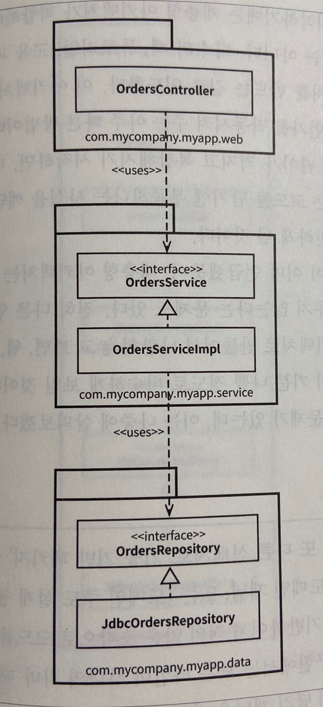
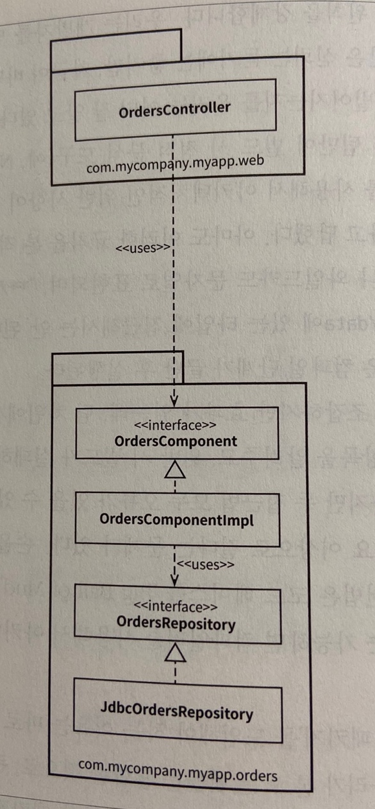

# Clean Architecture


# 1부 소개
```diff
+ 소프트웨어를 올바르게 만들려면 무엇보다도 기술을 향한 열정과 전문가가 되려는 열망이 필수다.

=> 요즘 드는 생각은 .. 열정이 뭔가 예전만 못하다 라는 ㅋㅋㅋㅋ 다들 어떠신가요
```
- 동작하는 프로그램을 만들기 쉽지만 제대로, 올바르게 만들기는 어렵다.
- 제대로 된 소프트웨어를 만들면 아주 적은 인력만으로도 새로운 기능을 추가하거나 유지보수할 수 있다. 변경은 빠르게, 결함은 적게

## #1 설계와 아키텍처란?

- 설계와 아키텍처 둘 사이에는 아무런 차이가 없다. 
- 저수준의 세부사항과 고수준의 구조는 모두 소프트웨어 전체 설계의 구성 요소이고 이 둘은 개별로 존재할 수 없고 고수준에서 저수준으로 향하는 의사결정의 연속성만이 있을 뿐이다.

### 목표는?

- 소프트웨어 아키텍처의 목표는 필요한 시스템을 만들고 유지보수하는 데 투입되는 인력을 최소화하는데 있다.
- 새로운 기능을 출시할 때마다 비용이 증가한다면 나쁜 설계다.

### 사례 연구

- 인력은 늘어가지만 개발의 생산성은 점점 떨어지는 현상이 나타나는 A사의 이야기


- 여덟번째 출시한 제품의 코드는 처음 제품보다 40배가 더 많은 비용이 든다.

**[엉망진창이 되어가는 신호]**


- 개발자의 노력은 기능 개발보다는 엉망이 된 상황에 대처하는 데 소모하기 시작된다.

**[경영자의 시각]**


- 생산성은 그대로인데 인건비는 지속적으로 늘어나서 얻는게 없어진다.

**[무엇이 잘못되었나?]**

- 토끼가 자신의 빠르기를 과신한 것과 마찬가지로 개발자도 생산성을 유지할 수 있다고 자신의 능력을 과신한다. 하지만 엉망진창인 코드가 서서히 쌓이면 개발자 생산성은 차츰낮아지고 절대 멈추거나 수그러들지 않는다. 심지어 그들은 밤을 새면서 열심히 일하고 있다.
```diff
+ 흔히 하는 거짓말 "코드는 나중에 정리하면 돼. 당장은 시장에 출시하는게 먼저야!" 

=> 실제로 저도 많이 겪어봤지만 리팩토링 잘 안하게됩니다.. ㅋㅋㅋㅋㅋ 생각날때 바로바로 하는게 맞는듯해요 ㅎㅎ
```
```diff
- 엉망으로 만들면 깔끔하게 유지할 때보다 항상 더 느리다. 빨리가는 유일한 방법은 제대로 가는 것!
```
- 생산성이 감소되고 비용이 증가하는 현상을 되돌릴 수 있는 유일한 방법은 개발자로 하여금 토끼처럼 과신하려는 믿음을 버리고, 만들어 낸 엉망진창인 코드를 개발자가 책임지도록 하는 것 뿐
- 자신을 과신한다면 재설계하더라도 원래의 프로젝트와 똑같이 엉망으로 내몰린다. <= 은행권 N세대 어플이 생각나네요


### 결론
```diff
- 개발조직이 할 수 있는 최고의 선택지는 과신하지 않고 소프트웨어 아키텍처의 품질을 심각하게 고민하기 시작하는 것
```
- 소프트웨어 아키텍처를 심각하게 고려할 수 있으려면 좋은 소프트웨어 아키텍처가 무엇인지 이해해야 한다.
- 비용은 최소화하고 생산성은 최대화할 수 있는 설계와 아키텍처를 가진 시스템을 만들려면 이러한 결과로 이끌어줄 시스템 아키텍처가 지닌 속성을 알고 있어야한다.


## #2 두 가지 가치에 대한 이야기

- 모든 소프트웨어 시스템은 이해관계자에게 행위와 구조라는 두가지 가치를 제공한다.
- 개발자는 두 가치를 모두 반드시 높게 유지해야하는 책임을 진다. but 불항해게도 개발자는 한가지 가치에만 집중하고 나머지 가치는 배제한다.

### 행위

- 프로그래머를 고용하는 이유? -> 이해관계자를 위해 기계가 수익을 창출하거나 비용을 절약하도록 만들기 위해, 이해관계자의 기계가 요구사항을 만족하도록 코드를 작성하기 위해
- 프로그래머는 기계가 이러한 요구사항을 위반하면 디버거를 열고 문제를 고친다.
- 많은 프로그래머가 이러한 활동이 자신이 해야 할 일의 전부라고 생각하지만 잘못된 생각이다.

### 아키텍처

- 소프트웨어를 만든 이유는 기계의 행위를 쉽게 변경할 수 있도록 하기 위해서다.
- 소프트웨어는 반드시 변경하기 쉬워야한다!
- 변경사항을 적용하는데 드는 어려움은 변경되는 범위에 비례해야하며 변경사항의 형태와는 관련이 없어야 한다.
```diff
! 아키텍처가 특정 형태를 선호할수록 새로운 기능을 이 구조에 맞추는게 더 힘들어진다. 따라서 아키텍처는 형태에 독립적이어야하고 그럴수록 더 실용적이다.
```
### 더 높은 가치

- 소프트웨어 시스템이 동작하도록 만드는것(행위) vs 소프트웨어 시스템을 더 쉽경 변경할 수 있도록 만드는것(아키텍처) => 둘 다 중요하다.

### 아이젠하워 매트릭스


| **중요하고 긴급한일**    | **중요하지만 긴급하지 않은일**    |
| ------------------------ | --------------------------------- |
| **중요하지 않고 긴급한** | **중요하지 않고 긴급하지 않은일** |

- 소프트웨어의 첫 번째 가치인 행위는 긴급하지만 매번 높은 중요도를 가지는 것은 아니다.
- 소프트웨어의 두 번째 가치인 아키텍처는 중요하지만 즉각적인 긴급성을 필요로 하는 경우는 절대 없다.
- 우선순위
  - 긴급하고 중요한일 (아키텍처, 행위)
  - 긴급하지는 않지만 중요한 일 (아키텍처)
  - 긴급하지만 중요하지 않은 일 (행위)
  - 긴급하지도 않고 중요하지도 않은 일
- 업무 관리자와 개발자가 흔하게 저지르는 실수는 긴급하지만 중요하지 않은 기능과 긴급하면서 중요한 기능을 구분하지 못한다.
```diff
- 기능의 긴급성이 아닌 아키텍처의 중요성을 설득하는 일은 소프트웨어 개발팀이 마땅히 책임져야한다 

=> 요즘 이거에 대해 생각이 많은데 다들 어떠신가요? 팀 또는 프로젝트를 위해 기획자분들, 또는 동료, 리더분들과 의견충돌이 날때가 있는데 저는 적극적으로 잘 못하는 것 같습니다 ㅎㅎ
```


### 아키텍처를 위해 투쟁하라

```diff
! 개발팀은 회사에서 가장 중요하다고 스스로 믿는 가치를 위해 항상 투쟁해야한다.
! 소프트웨어를 안전하게 보호해야 할 책임이 있으므로 소프트웨어 개발팀들도 이해관계자임을 명심할것!
! 소프트웨어 아키텍트는 시스템이 제공하는 특성이나 기능보다 시스템 구조에 더 중점을 둬서 기능 개발하기 쉽고 간편하게 수정이 가능하며 확장하기 쉬운 아키텍처를 만들어야한다.
! 아키텍처가 후순위가 되면 시스템을 개발하는 비용이 더 많이 들고 일부 또는 전체 시스템에 변경을 가하는 일이 현실적으로 불가능해짐. 이런 결과는 소프트웨어 개발팀의 투쟁이 충분하지 않았다는 결과다.
```


# 2부 벽돌부터 시작하기: 프로그래밍 패러다임

## #3 패러다임 개요

### 구조적 프로그래밍

- 구조적 프로그래밍은 다익스트라가 발견
- 구조적 프로그래밍 패러다임은 아래와 같이 요약할 수 있음
  - **구조적 프로그래밍은 제어흐름의 직접적인 전환에 대해 규칙을 부과한다.**

### 객체지향 프로그래밍

- 요한 달과 크리스텐 니가드에 의해 등장
- 객체지향 프로그래밍 패러다임은 아래와 같이 요약할 수 있음
  - **객체 지향 프로그래밍은 제어흐름의 간접적인 전환에 대해 규칙을 부과한다.**

### 함수형 프로그래밍

- 알론조 처치가 람다 계산법을 발명
- 람다계산법
  - 기초가 되는 개념은 불변성으로, 심볼의 값이 변경되지 않는다는 개념
- 함수형 프로그래밍 패러다임은 아래와 같이 요약할 수 있음
  - **함수형 프로그래밍은 할당문에 대해 규칙을 부과한다.**

### 생각할 거리

- 각 패러다임은 프로그래머에게서 권한을 박탈함. 즉 패러다임은 무엇을 해야 할지를 말하기보다는 무엇을 해서는 안되는지를 말해준다.
- 세가지 패러다임은 각각 goto문(구조적), 함수 포인터(객체 지향), 할당문(함수형)을 앗아간다.

### 결론

- 세가지 패러다임은 모두 아키텍처와 연관이 있다.
- 세 가지 패러다임과 아키텍처의 세가지 큰 관심사(함수, 컴포넌트 분리, 데이터 관리)가 어떻게 서로 연관되는지에 주목할 것!


## #4 구조적 프로그래밍

### 증명

- 다익스트라, 뵘, 야코피니가 모든 프로그램은 goto 없이 순차, 분기, 반복이라는 세가지 구조만으로 표현할 수 있다는 사실을 증명했다.

### 해로운 성명서

- 다익스트라가 "goto문의 해로움" 이라는 편지를 출판사에 보내고 10년동안 논쟁후 다익스트라가 승리
- 그로인해 대다수의 현대적언어는 goto 문장을 포함하지 않는다.
- 현재의 우리는 모두 구조적프로그래머임. 제어흐름을 제약 없이 직접 전환할 수 있는 선택권 자체를 언어에서 제공하지 않는다.

### 기능적 분해

- 구조적 프로그래밍을 통해 모듈을 증명 가능한 더 작은 단위로 재귀적으로 분해할 수 있다.
- 큰 문제들을 작은 문제들로 쪼개고 이렇게 분해한 기능들은 구조적 프로그래밍의 제한된 제어구조를 이용하여 표현할 수 있다.
- 이런 기법을 사용하면 프로그래머는 대규모 시스템을 모듈과 컴포넌트로 나눌 수 있고 더 나아가 모듈과 컴포넌트는 입증할 수 있는 아주 작은 기능들로 세분화 할 수 있다.

### 엄밀한 증명은 없었다

### 과학이 구출하다

- 수학은 증명 가능한 서술이 참임을 입증하는 원리이고 과학은 증명 가능한 서술이 거짓임을 입증하는 원리

### 테스트

- "테스트는 버그가 있음을 보여줄 뿐, 버그가 없음을 보여줄 수는 없다" - 다익스트라
- 소프트웨어 구조는 수학적인 구조가 아닌 과학적 구조. -> 실패를 증명함으로써 올바름을 보여주기 때문..
```diff
- 구조적 프로그래밍은 프로그램을 증명 가능한 세부 기능 집합으로 재귀적으로 분해할 것을 강요한다. 그리고 테스트를 통해 증명 가능한 세부 기능들이 거짓인지를 증명하려고 시도한다. 이처럼 거짓임을 증명하려는 테스트가 실패한다면, 이 기능들은 목표에 부합할 만큼 충분히 참이라고 여기게 된다. 

=> 한번도 이렇게 생각한적이 없는데 굉장히 신선했습니다.
```

### 결론

- 구조적 프로그래밍이 오늘날까지 가치 있는 이유는 프로그래밍에서 반증 가능한 단위를 만들어낼 수 있기 때문..
```diff
! 소프트웨어 아키텍트는 모듈, 컴포넌트, 서비스가 반증 가능하도록(테스트하기 쉽도록) 만들기 위해 분주히 노력해야한다.
```


## #5 객체 지향 프로그래밍

- 좋은 아키텍처를 만드는 일은 객체지향(Object-Oriented, OO) 설계 원칙을 이해하고 응용하는데서 출발한다.
- 진정한 OO는 캡슐화, 상속, 다형성을 의미하고 OO언어는 최소한 세가지 요소를 반드시 지원한다.

### 캡슐화?

- OO언어는 데이터와 함수를 쉽고 효과적으로 캡슐화 할 수 있도록 제공해주고 이를 통해 데이터와 함수가 응집력 있게 구성된 집단을 서로 구분 짓는 선을 그을 수 있다.
- C언어에서는 반드시 캡슐화를 강제했지만 C -> C++ -> C#, java로 넘어오면서 많은 OO언어들이 캡슐화를 거의 강제하지 않는다.
- OO 프로그래밍은 프로그래머가 충분히 올바르게 행동함으로써 캡슐화된 데이터를 우회해서 사용하지 않을 거라는 믿음을 기반으로 한다 => 왜 이걸 강제하도록 하지 않았을까? 라는 생각이 들어서 chat gpt한테 물어보니까 아래와 같은 답변 ㅋㅋㅋㅋ

```
시행이 부족한 한 가지 이유는 일부 언어가 OOP 원칙을 엄격히 준수하는 것보다 유연성과 사용 용이성을 우선시하기 때문입니다. 또한 캡슐화를 적용하면 때때로 더 장황하고 복잡한 코드가 생성될 수 있으며 이는 일부 컨텍스트에서 단점으로 보일 수 있습니다.

전반적으로 캡슐화는 OOP에서 중요한 원칙이지만 언어와 디자인 우선 순위에 따라 적용이 달라질 수 있습니다.
```


### 상속?

- 상속이라는 개념이 있기 이전에도 상속과 비슷하게 사용하는 방법이 C에도 있었다. 따라서 상속도 OO언어가 완전히 새로운 개념을 만든것은 아니다.

### 다형성?

- 다형성이라는 개념 역시 이전에도 존재했지만 OO언어에서 다형성을 좀 더 안전하고 더욱 편리하게 사용할 수 있게 해준다.

**다형성이 가진 힘**

- 플러그인 아키텍처
  - 프로그램이 장치에 의존적이면 다른 장치로 변하는 순간 상당히 많은 부분을 재작성해야 한다.
  - 플러그인 아키텍처는 이처럼 입출력 장치 독립성을 지원하기 위해 만들어졌고 등장 이후 거의 모든 운영체제에서 구현됐다.


**의존성 역전**

- 다형성을 사용하지 않는다면 제어의 흐름은 시스템의 행위에 따라 결정되며, 소스 코드 의존성은 제어 흐름에 따라 결정된다.
- OO언어가 다형성을 안전하고 편리하게 제공한다는 사실은 소스 코드 의존성을 어디에서든 역전시킬 수 있다는 뜻이기도 하다.

```diff
- OO언어로 개발된 시스템을 다루는 소프트웨어 아키텍트는 시스템의 소스 코드 의존성 전부에 대해 방향을 결정할 수 있는 절대적인 권한을 갖는다. 소프트웨어 아키텍트는 스스로 코드 의존성을 원하는 방향으로 설정할 수 있다.
```

- 의존성 역전을 통해 배포 독립성과 개발 독립성을 얻을 수 있다.
- 배포 독립성
  - 특정 컴포넌트의 소스 코드가 변경되면, 해당 코드가 포함된 컴포넌트만 다시 배포하면 된다.

- 개발 독립성
  - 시스템의 모듈을 독립적으로 배포할 수 있게 되면, 서로 다른 팀에서 각 모듈을 독립적으로 개발할 수 있다.


### 결론

- OO란 다형성을 이용하여 전체 시스템의 모든 소스 코드 의존성에 대한 절대적인 제어 권한을 획득할 수 있는 능력이다.

```diff
- OO를 사용하면 아키텍트는 플러그인 아키텍처를 구성할 수 있고 이를 통해 고수준의 정책을 포함하는 모듈은 저수준의 세부사항을 포함하는 모듈에 대해 독립성을 보장할 수 있다.
- 저수준의 세부사항은 중요도가 낮은 플러그인 모듈로 만들 수 있고, 고수준의 정책을 포함하는 모듈과는 독립적으로 개발하고 배포할 수 있다.
```


## #6 함수형 프로그래밍

### 정수를 제곱하기

- 자바의 0부터 25까지 정수 제곱을 출력하는 프로그램

```java
public class Squint {
  public static void main(String args[]) {
    for (int i = 0; i < 25; i ++) {
      System.out.println(i * i);
    }
  }
}
```

- LISP에서 클로저를 이용하는 프로그램

```lisp
(println (take 25 (map (fn [x] (* x x)) (range))))
```

- 가장 안쪽부터 호출 함수 설명
  - range함수는 0부터 시작해서 끝이 없는 정수 리스트를 반환
  - 반환된 정수 리스트는 map 함수로 전달되고, 각 정수에 대해 제곱을 계산하는 익명 함수를 호출하여, 모든 정수의 제곱에 대해 끝이 없는 리스트를 생성
  - 제곱된 리스트는 take 함수로 전달되고, 이 함수는 앞의 25개까지의 항목으로 구성된 새로운 리스트를 반환
  - println함수는 입력 값을 출력하는데 이 경우 입력은 앞의 25개의 정수에 대한 제곱 값으로 구성된 리스트

- 함수형 언어에서는 변수는 변경되지 않는다. (불변 변수만 쓴다.)

### 불변성과 아키텍처

- race condition, deadlock, concurrent update 문제는 모두 가변 변수로 인해 발생한다.
- 다수의 스레드와 프로세스를 사용하는 동시성 애플리케이션에서 마주치는 모든 문제는 가변변수가 없다면 절대로 생기지 않는다.
- 불변성은 저장 공간이 무한하고 프로세서의 속도가 무한히 빠를때 실현 가능하다. 만약 아니라면 어느정도 타협을해서 불변성을 실현할 수 있다.

### 가변성의 분리

- 불변성과 관련해서 가장 주요한 타협중 하나는 서비스 내부의 가변 컴포넌트와 불변 컴포넌트로 분리하는 일이다.
- 불변 컴포넌트는 순수하게 함수형 방식으로만 작업이 처리되고 어떠한 가변 변수도 사용하지 않는다. 불변 컴포넌트는 변수의 상태를 변경할 수 있는 하나 이상의 다른 컴포넌트와 통신한다.


- 상태변경은 컴포넌트를 갖가지 동시성 문제에 노출하는 꼴이므로 흔히 트랜잭션 메모리와 같은 실천법을 사용하여 동시 업데이트와 경합 조건 문제로부터 가변 변수를 보호한다.

> 트랜잭션 메모리
>
> **트랜잭셔널 메모리**(transactional memory)는 불러오기와 저장하기 명령의 집합이 [원자적](https://ko.wikipedia.org/wiki/원자성) 방법으로 실행할 수 있게 함으로써 [병행성 프로그래밍](https://ko.wikipedia.org/wiki/병행성_프로그래밍)을 단순하게 하는 방식이다. [병행 컴퓨팅](https://ko.wikipedia.org/wiki/병행_컴퓨팅)에서 [공유 메모리](https://ko.wikipedia.org/wiki/공유_메모리)로의 접근을 제어하기 위한 병행성 제어 방식으로, [데이터베이스 트랜잭션](https://ko.wikipedia.org/wiki/데이터베이스_트랜잭션)과 유사한 [동시성 제어](https://ko.wikipedia.org/w/index.php?title=동시성_제어&action=edit&redlink=1) 구조이다.
>
> [https://ko.wikipedia.org/wiki/%ED%8A%B8%EB%9E%9C%EC%9E%AD%EC%85%94%EB%84%90_%EB%A9%94%EB%AA%A8%EB%A6%AC](https://ko.wikipedia.org/wiki/%ED%8A%B8%EB%9E%9C%EC%9E%AD%EC%85%94%EB%84%90_%EB%A9%94%EB%AA%A8%EB%A6%AC)
>
> 예제
>
> ```
> // 이중 연결 리스트에 새 노드를 원자적으로 추가함
> atomic {
>  newNode->prev = node;
>  newNode->next = node->next;
>  node->next->prev = newNode;
>  node->next = newNode;
> }
> ```
>
> **atomic**(원자적)으로 표시된 구역이 끝나면 트랜잭션이 완료된다. 이때 충돌이 없었다면 커밋되고, 있었다면 재시작될것이다. 임계 구역 문법은 또한 종료 조건을 명시할 수도 있다.
>
> [https://ko.wikipedia.org/wiki/%EC%86%8C%ED%94%84%ED%8A%B8%EC%9B%A8%EC%96%B4_%ED%8A%B8%EB%9E%9C%EC%9E%AD%EC%85%94%EB%84%90_%EB%A9%94%EB%AA%A8%EB%A6%AC](https://ko.wikipedia.org/wiki/%EC%86%8C%ED%94%84%ED%8A%B8%EC%9B%A8%EC%96%B4_%ED%8A%B8%EB%9E%9C%EC%9E%AD%EC%85%94%EB%84%90_%EB%A9%94%EB%AA%A8%EB%A6%AC)

- 애플리케이션을 제대로 구조화하려면 변수를 불변컴포넌트, 가변컴포넌트를 분리하고 가변 변수들을 보호하는 적절한 수단을 동원해 뒷받침해야 한다.

```diff
- 현명한 아키텍트라면 가능한 한 많은 처리를 불변 컴포넌트로 옮겨야하고 가변 컴포넌트에서는 가능한 한 많은 코드를 빼내야 한다.
```


### 이벤트 소싱

- 이벤트 소싱에 깔려 있는 기본 발상은 상태가 아닌 트랜잭션을 저장하자는 전략이다. 상태가 필요해지면 단순히 상태의 시작점부터 모든 트랜잭션을 처리하면된다.
  - 고객 잔고를 관리하는 은행 애플리케이션의 경우 상태가아닌 계좌의 모든 트랜잭션을 저장(write)하고 특정 고객이 잔고를 요청할때마다 저장한 트랜잭션을 모두 처리(read)하면 해당 고객의 잔고를 알 수 있음. but 무한한 저장공간과 무한한 처리능력이 있어야하기 때문에 이런 방식은 불가능하다.
- 결과적으로 애플리케이션은 CRUD가 아니라 C or R로만 이루어진다. 변경과 삭제가 없다면 동시성 문제가 일어나지 않는다.

> **git commit**
>
> git의 commit은 불변임 --amend나 rebase로 커밋을 수정하거나 합치는것처럼 보일 수 있지만 git reflog로 확인해보면 실제로 커밋을 수정하는 것이 아닌 새로운 commit을 만들어내는 것을 확인할 수 있음
>
> [https://wiki.emulab.net/wiki/everything-you-need-to-unlearn-about-git](https://wiki.emulab.net/wiki/everything-you-need-to-unlearn-about-git)
>
> [https://blog.jayway.com/2013/03/03/git-is-a-purely-functional-data-structure/](https://blog.jayway.com/2013/03/03/git-is-a-purely-functional-data-structure/)

### 결론

- 2부 요약
  - 구조적 프로그래밍은 제어흐름의 직접적인 전환에 부과되는 규율
  - 객체 지향 프로그래밍은 제어흐름의 간접적인 전환에 부과되는 규율
  - 함수형 프로그래밍은 변수 할당에 부과되는 규율

```diff
- 각 패러다임은 코드를 작성하는 방식의 형태를 한정시킨다. 어떤 패러다임도 우리의 권한이나 능력에 무언가를 보태지 않는다.
- 지난 반세기 동안 우리가 배운 것은 해서는 안되는 것에 대해서다.
```

```diff
+ 도구는 달라졌고 하드웨어도 변했지만, 소프트웨어의 핵심은 여전히 그대로다 => 소프트웨어, 즉 컴퓨터 프로그램은 순차, 분기, 반복, 참조로만 구성된다.
```


# 3부 설계 원칙

- 좋은 소프트웨어 시스템은 깔끔한 코드로부터 시작함
- SOLID원칙은 함수와 데이터 구조를 클래스로 배치하는 방법, 이들 클래스를 서로 결합하는 방법을 설명해줌
- SOLID 원칙의 목적
  - 변경에 유연함
  - 이해하기 쉬움
  - 많은 소프트웨어 시스템에 사용될 수 있는 컴포넌트의 기반이 됨

## #7 SRP: 단일 책임 원칙

- 함수는 반드시 단 하나의 일만 해야한다는 원칙
- 단일 모듈은 변경의 이유가 단 하나뿐이어야함
  - 하나의 모듈은 하나의 액터(한명 이상의 이해관계자)에 대해서만 책임져야함
- 응집성은 단일 액터를 책임지는 코드를 함께 묶어주는 힘

### 징후 1: 우발적 중복


- 세가지 메서드가 서로 매우 다른 세명의 액터를 책임지기 때문에 SRP를 위반함
- 서로 다른 액터가 의존하는 코드를 너무 가까이 배치해놓는다면 큰 문제가 생길 수 있음. SRP는 서로 다른 액터가 의존하는 코드를 분리해야함

### 징후 2: 병합

- 서로 다른 액터들에 대한 변경이 일어날 경우 코드 병합시에 문제가 될 수 있음
- 이 문제를 벗어나는 방법은 SRP를 적용하는 방법

### 해결책

- 데이터와 메서드를 분리하는 방식이 가장 확실한 해결책


- 그러나 이 방법은 개발자가 세 가지 클래스를 인스턴스화 하고 추적해야 한다는게 단점

- 위 단점을 극복하기 위해 흔히 쓰는 기법으로 퍼사드 패턴이 있음
- EmployeeFacade 클래스는 세 클래스의 객체를 생성하고 요청된 메서드를 가지는 객체로 위임하는 일을 책임짐
- 아래와 같이 가장 중요한 메서드는 Employee 클래스에 유지하고 Employee 클래스를 덜 중요한 나머지 메서드들에 대한 퍼사드로 사용하는 방법도 있음


- 위 방법이 SRP를 위반하는 것처럼 보일 수 있지만 여러 메서드가 하나의 가족을 이루고, 메서드의 가족을 포함하는 각 클래스는 하나의 유효범위가됨. 해당 유효범위 바깥에서는 이 가족에게 감춰진 식구(private 멤버)가 있는지를 전혀 알 수 없음

### 결론

- 단일 책임 원칙은 메서드와 클래스 수준의 원칙
- 상위 두 수준에서도 다른 형태로 다시 등장함
  - 컴포넌트 수준: 공통 폐쇄 원칙이 됨
  - 아키텍처 수준: 아키텍처 경계의 생성을 책임지는 변경의 축이됨


## #8 OCP: 개방-폐쇄 원칙

- 소프트웨어 개체는 확장에는 열려있어야 하고, 변경에는 닫혀 있어야 함
- 만약 요구사항을 살짝 확장하는 데 소프트웨어를 엄청나게 수정해야 한다면 그 소프트웨어를 설계한 아키텍트는 엄청난 실패를 한 것

### 사고 실험

- 소프트웨어 아키텍처가 훌륭하다면 요구사항에 따른 변경사항이 가능한한 최소화될 것임
- 서로 다른 목적으로 변경되는 요소를 적절하게 분리하고, 이들 요소 사이의 의존성을 체계화함으로써 변경량을 최소화할 수 있음
- 가장 중요한것은 책임을 분리하는 것.
- 책임을 분리했다면 두 책임중 하나에서 변경이 발생하더라도 다른 하나는 변경되지 않도록 소스 코드 의존성도 확실히 조직화 해야함


- 화살표가 A클래스에서 B클래스로 향한다면 A클래스에서는 B 클래스를 호출하지만 B클래스에서는 A클래스를 전혀 호출하지 않음 (전혀 모름)
- 모든 컴포넌트 관계는 단방향으로 이루어짐 이들 화살표는 변경으로부터 보호하려는 컴포넌트를 향하도록 그려짐
- A컴포넌트에서 발생한 변경으로부터 B컴포넌트를 보호하려면 반드시 A컴포넌트가 B컴포넌트에 의존해야함
- 위 사진의 경우 Presenter에서 발생한 변경으로부터 Controller를 보호하고 View에서 발생한 변경으로부터 Presenter를 보호하고자 함
- 업무규칙이 들어있는 Interactor는 가장 높은 수준의 보호를 받음 
- 아키텍트는 기능이 어떻게, 왜, 언제 발생하는지에 따라서 기능을 분리하고 분리한 기능을 컴포넌트의 계층구조로 조직화함.
- 컴포넌트 계층구조를 이와 같이 조직화하면 저수준에서 발생한 변경으로부터 고수준 컴포넌트를 보호할 수 있음

### 방향성 제어

- FinancialDataGateway 인터페이스는 FinancialReportGenerator와 FinancialDataMapper 사이에 위치하는데 이는 의존성을 역전시키기 위해서임 만약 FinancialDataGateway가 없었다면 의존성이 Interactor컴포넌트에서 Database 컴포넌트로 바로 향하게 됨

### 정보 은닉

- FinancialReportRequester는 방향성 제어와는 다른 목적으로 FinancialReportController가 Interactor 내부에 대해 너무 많이 알지 못하도록 막기 위해서 존재함
- FinancialReportRequester가 없었다면 Controller는 FinancialEntities에 대해 추이 종속성을 갖게 됨

> 추이종속성
>
> - 클래스 A가 클래스 B에 의존하고 클래스 B가 클래스 C에 의존한다면 클래스 A는 C에 의존하게됨. 이를 추이 종속성이라고 부르고 클래스, 패키지, 컴포넌트 모든곳에도 동일하게 적용됨. 클래스 의존성이 순환적이라면 모든 클래스가 서로 의존하게 되는 문제가 있음

- 추이 종속성을 갖게되면 소프트웨어 엔티티는 '자신이 직접 사용하지 않는 요소에는 절대로 의존해서는 안된다'는 소프트웨어 원칙을 위반하게됨
- Controller영역에서 발생한 변경으로부터 Interactor를 보호하는 일의 우선순위가 가장 높지만 반대로 Interactor에서 발생한 변경으로부터 Controller도 보호되기를 바람.

### 결론

- OCP는 시스템의 아키텍처를 떠받치는 원동력 중 하나
- OCP의 목표는 시스템을 확장하기 쉬운 동시에 변경으로 인해 시스템이 너무 많은 영향을 받지 않도록 하는 데 있음.
- 이러한 목표를 달성하려면 시스템을 컴포넌트 단위로 분리하고, 저수준 컴포넌트에서 발생한 변경으로부터 고수준 컴포넌트를 보호할 수 있는 형태의 의존성 계층구조가 만들어지도록 해야 함


## #9 LSP: 리스코프 치환 원칙

- S타입의 객체 o1에 각각 대응하는 T타입 객체 o2가 있고 T 타입을 이용해서 정의한 모든 프로그램 P에서 o2의 자리에 o1을 치환하더라도 P의 행위가 변하지 않는다면 S는 T의 하위 타입이다. - 바바라 리스코프

###  상속을 사용하도록 가이드하기


- Billing 애플리케이션의 행위가 License 하위 타입 중 무엇을 사용하는지에 전혀 의존하지 않음

### 정사각형/직사각형 문제


- LSP를 위반하는 전형적인 문제
- Rectangle의 높이와 너비는 서로 독립적으로 변경될 수 있는 반면에 Square의 높이와 너비는 반드시 함께 변경되기 때문임
- 실제로 사용하는 User는 Rectangle로 생각하기 때문에 혼동
- 사용하는 User가 Rectangle인지 Square인지 검사하는 방법은 User가 타입에 의존하는것이기 때문에 치환이 불가능하게됨

### LSP와 아키텍처

### LSP위배 사례

### 결론

- LSP는 아키텍처 수준까지 확장할 수 있고 반드시 확장해야함.
- 치환 가능성을 조금이라도 위배하면 시스템 아키텍처가 오염되어 상당량의 별도 메커니즘을 추가해야 할 수 있기 때문임


## #10 ISP: 인터페이스 분리 원칙


- 다수의 사용자가 OPS 클래스의 오퍼레이션을 사용하는데 User1은 op1, User2는 op2, User3은 op3만을 사용한다고 가정
- OPS가 정적 타입언어인 경우 User1에서는 op2와 op3를 전혀 사용하지 않음에도 소스코드는 두 메서드에 의존함
- 이런 경우 ISP를 사용해서 해결 가능


- User1은 U1Ops에 의존하지만 OPS는 직접적으로 의존하지 않음

### ISP와 언어

- ISP는 언어 종류에 따라 영향받는 정도가 큼
- 동적 타입 언어를 사용하면 정적 타입 언어를 사용할 때보다 유연하며 결합도가 낮은 시스템을 만들 수 있음

### ISP와 아키텍처

- 일반적으로 필요 이상으로 많은 걸 포함하는 모듈에 의존하는 것은 해로운 일임
- 아키텍처 수준에서도 마찬가지

### 결론

- 불필요한 짐을 실은 무언가에 의존하면 예상치도 못한 문제에 빠질 수 있음


## #11 DIP: 의존성 역전 원칙

- 의존성 역전 원칙에서 말하는 '유연성이 극대화'된 시스템이란 소스코드 의존성이 추상에 의존하며 구체에는 의존하지 않는 시스템임
- 우리가 의존하지 않도록 피하고자 하는 것은 바로 변동성이 큰 구체적인 요소임
- 자바에서 String은 구체 클래스이지만 매우 안정적이고 String클래스가 변경될 일은 거의 없음
- 변동성이 큰 구체적인 요소는 우리가 열심히 개발하는 중에 자주 변경될 수 밖에 없는 모듈들임

### 안정된 추상화 

- 인터페이스를 구현하는 구현체가 변경되더라도 인터페이스는 거의 변경될 필요가 없음 따라서 인터페이스는 구현체보다 변동성이 낮음
- 안정된 소프트웨어 아키텍처란 변동성이 큰 구현체에 의존하는 일을 지양하고, 안정된 추상 인터페이스를 선호하는 아키텍처라는 뜻
- 구체적인 코딩 실천법
  - 변동성이 큰 구체 클래스를 참조하지 말라
    - 대신 추상 인터페이스를 참조할 것.
  - 변동성이 큰 구체 클래스로부터 파생하지 말라
    - 정적 타입 언어에서 상속은 소스코드에 존재하는 모든 관계 중에서 가장강력하고 뻣뻣함. 따라서 상속은 아주 신중하게 사용해야 함
  - 구체 함수를 오버라이드 하지 말라
    - 구체 함수는 소스코드 의존성을 필요로하고 구체 함수를 오버라이드하면 실제로 그 의존성을 상속하게됨 차라리 추상 함수로 선언하고 구현체들에서 각자의 용도에 맞게 구현해야함
  - 구체적이며 변동성이 크다면 절대로 그 이름을 언급하지 말라


### 팩토리

- 자바 등 대다수의 객체지향 언어에서는 의존성을 처리할 때 추상 팩토리를 사용곤 함


- Application은 Service인터페이스를 통해 ConcreteImpl을 사용하지만, Application은 어떤식으로든 ConcreteImpl을 생성해야 할 때
- Application을 ServiceFactory에 의존하도록 만들어서 Application에 ConcreteImpl의 존재를 숨길 수 있음
- 실제 Service의 구현체를 만들어주는것은 ServiceFactoryImpl
- 곡선은 시스템을 두가지 컴포넌트로 분리함
  - 추상 컴포넌트: 애플리케이션의 모든 고수준 업무 규칙을 포함
  - 구체 컴포넌트: 업무 규칙을 다루기 위해 필요한 모든 세부사항을 포함
- 소스코드 의존성은 제어흐름과는 반대 방향으로 역전됨. 이러한 이유로 이 원칙을 의존성 역전이라고 부름


### 구체 컴포넌트

- 구체컴포넌트의 의존성을 완전히 없앨 수는 없음 하지만 DIP를 위반하는 클래스들은 적은 수의 구체 컴포넌트 내부로 모을 수 있고 이를 통해 시스템의 나머지 부분과는 분리할 수 있음

### 결론


# 4부 컴포넌트 원칙

- "SOLID원칙이 벽과 방에 벽돌을 배치하는 방법을 알려준다면, 컴포넌트 원칙은 빌딩에 방을 배치하는 방법을 설명해준다. 큰 빌딩과 마찬가지로 대규모 소프트웨어 시스템은 작은 컴포넌트들로 만들어진다."

## #12 컴포넌트

- 컴포넌트는 시스템의 구성 요소로 배포할 수 있는 가장 작은 단위. ex: Java의 jar파일, 루비의 gem파일 etc
- 여러 컴포넌트를 서로 묶어서 .war, .jar, .dll, .exe파일로 만들어서 독립적으로 배포할 수 있음
- 컴포넌트가 어떤 형태로 배포되든, 잘 설계된 컴포넌트라면 반드시 독립적으로 배포 가능한, 따라서 독립적으로 개발 가능한 능력을 갖춰야함

### 컴포넌트의 간략한 역사

### 재배치성

### 링커

- '컴포넌트의 간략한 역사', '재배치성', '링커' 장은 링커, 로더가 등장한 배경, 역사에 대해 설명함 이후에 무어의 법칙에 의거한 하드웨어의 큰 발전으로 현대에 다수의 .jar 파일 또는 다수의 공유 라이브러리를 순식간에 서로 링크시킬 수 있게 되었음
- 이렇게 컴포넌트 플러그인 아키텍처가 탄생함

### 결론


## #13 컴포넌트 응집도

### REP: 재사용/릴리스 등가 원칙

- Reuse/Release Equivalence Principle
- 재사용 단위는 릴리즈 단위와 같다
- 컴포넌트를 구성하는 모든 모듈은 서로 공유하는 중요한 테마나 목적이 있어야함
- 하나의 컴포넌트로 묶인 클래스와 모듈은 반드시 함께 릴리즈할 수 있어야함

### CCP: 공통 폐쇄 원칙

- Comon Closure Principle
- 동일한 이유로 동일한 시점에 변경되는 클래스를 같은 컴포넌트로 묶고 서로 다른 시점에 다른 이유로 변경되는 클래스는 다른 컴포넌트로 분리할 것
- 대부분의 애플리케이션은 유지보수성은 재사용성보다 훨씬 중요하기 때문에 변경이 있다면 단일 컴포넌트에서만 발생하게 하는 것이 나음
- CCP는 같은 이유로 변경될 가능성이 있는 클래스는 모두 한곳으로 묶을것을 권함
- 물리적 또는 개념적으로 강하게 결합되어 항상 함께 변경되는 클래스들은 하나의 컴포넌트에 속하게 해야 릴리즈, 재검증, 배포하는 일과 관련된 작업량을 최소화할 수 있음

**SRP와의 유사성**

- CCP는 컴포넌트 수준의 SRP임
- 두 원칙의 공통점
  - 동일한 시점에 동일한 변경되는 것들을 한데 묶고. 서로 다른 시점에 다른 이유로 변경되는 것들은 서로 분리할 것

### CRP: 공통 재사용 원칙

- Common Reuse Principle
- 컴포넌트 사용자들을 필요하지 않는 것에 의존하게 강요하지 말것
- 같이 재사용되는 경향이 있는 클래스와 모듈들은 같은 컴포넌트에 포함해야 함
- 사용하는 컴포넌트가 사용되는 컴포넌트에서 단 하나의 클래스만 사용하더라도 의존성이 생기고 사용하는 컴포넌트를 변경하지 않더라도 재컴파일, 재검증, 재배포를 해야할 수 있음
- 의존하는 컴포넌트가 있다면 해당 컴포넌트의 모든 클래스에 대해 의존함을 확실히 인지해야함
- CRP는 강하게 결합되지 않은 클래스들을 동일한 컴포넌트에 위치시켜서는 안된다고 말함

**ISP와의 관계**

- 두 원칙의 공통점
  - 필요하지 않은 것에 의존하지 말 것

### 컴포넌트 응집도에 대한 균형 다이어그램

- 다이어그램의 각 변은 반대쪽 곡지점에 있는 원칙을 포기했을 때 감수해야할 비용을 나타냄


### 결론

- 어느 클래스들을 묶어서 컴포넌트로 만들지를 결정할 때, 재사용성과 개발 가능성이라는 상충하는 힘을 반드시 고려해야함.
- 재사용성과 개발 가능성의 균형을 잡는 일은 중요하고 항상 유동적임


## #14 컴포넌트 결합

### ADP: 의존성 비순환 원칙(Acyclic Dependencies Principle)

- 컴포넌트 의존성 그래프에 순환이 있어서는 안된다
- 많은 개발자가 동일한 소스 파일을 수정하는 환경의 해결책은 주단위 빌드와 의존성 비순환 원칙임

**주 단위 빌드(Weekly Build)**

- 중간 규모의 프로젝트에서 흔하게 사용
- 개발자가 코드를 복사해서 개인적으로 작업후 한번에 코드를 모두 통합하여 빌드하는 방법
- 개발보다 통합의 시간이 더 길어지고 빌드 일정만 늘어남 => 안좋음


**순환 의존성 제거하기**

- 개발 환경을 릴리즈 가능한 컴포넌트 단위로 분리하는 것
- 컴포넌트는 개별 개발자 또는 단일 개발팀이 책임질 수 있는 작업 단위가 됨
- 개발자가 해당 컴포넌트가 동작하도록 만든 후 해당 컴포넌트를 릴리즈하여 다른 개발자가 사용할 수 있도록 만들어줌
- 컴포넌트를 개발하는 팀은 특정 컴포넌트가 새롭게 릴리즈 되면 다른 팀에 즉각 영향을 주지 않고 컴포넌트를 사용하는 팀은 버저닝되는 컴포넌트의 특정 컴포넌트 버전을 직접 결정할 수 있음
- 이 방법을 사용하려면 의존성 구조를 반드시 관리해야함. 의존성 구조에 순환이 있어서는 안됨


- 위 사진에서 어느 컴포넌트에서 시작하더라도 의존성 관계를 따라가면서 최초의 컴포넌트로 되돌아갈 수 없음. 비순환 방향 그래프(Directed Acyclic Graph, DAG)임
- Presenter가 새롭게 릴리즈되면 의존성 화살표를 거꾸로하는 View와 Main이 영향을 받음
- Main의 존재를 아무도 모르기때문에 Main의 변경사항이 아무 컴포넌트에게 영향을 미치지 않음
- Presenters 컴포넌트는 Interactors와 Entities만 이용해서 Presenter 자체 버전을 빌드하면 됨
- 시스템 전체를 릴리즈해야한다면 릴리즈 절차는 상향식으로 진행됨. 구성 요소간 의존성을 파악하고 있으면 쉽게 빌드할 수 있음 

**순환이 컴포넌트 의존성 그래프에 미치는 영향**

- 아래 사진처럼 Entities에 포함된 클래스가 Authorizer에 포함된 클래스 하나를 사용하도록 변경할 수 밖에 없다고 가정


- 순환 의존성이 발생됨
- 이런 순환 문제가 생긴다면 Entities, Authorizer, Interactors는 사실상 거대한 하나의 컴포넌트가 되어버리고 빌드하기도 힘들어짐
- 순환이 생기면 컴포넌트를 분리하기가 상당히 어려워짐
- 단위 테스트를 하고 릴리즈 하는 일도 굉장히 어려워지고 에러도 쉽게 발생함
- 모든 원인은 순환 의존성


**순환 끊기**

1.의존성 역전 원칙 적용하기. 

- User 클래스가 필요로하는 메서드를 제공하는 인터페이스를 생성하고 이 인터페이스는 Entities 컴포넌트에 위치시킴. Authorizer에서는 이 인터페이스를 상속받음. 이렇게하면 Entities와 Authorizer 사이의 의존성을 역전시킬 수 있음.


2.Entities와 Authorizer가 모두 의존하는 새로운 컴포넌트를 만들기


**흐트러짐(Jitters)**

- 요구사항이 변경되면 컴포넌트 구조도 변경될 수 있음
- 애플리케이션이 성장함에 따라 의존성 구조가 바뀌기때문에 항상 의존성 구조에 순환이 발생하는지 관찰해야하고 의존성이 있다면 끊어야함


### 하향식(top-down) 설계

- 컴포넌트 구조는 하향식으로 설계될 수 없음
- 컴포넌트는 시스템에서 가장 먼저 설계할 수 있는 대상이 아니고 시스템이 성장하고 변경될때 함께 진화함
- 아무런 클래스도 설계하지 않은 상황에서 컴포넌트 의존성 구조를 설계하는 것은 쉬운일이 아님. 컴포넌트 의존성 구조는 시스템의 논리적 설계에 발 맞춰 성장하며 또 진화해야함

### SDP: 안정된 의존성 원칙(Stable Dependencies Principle)

- 안전성의 방향으로(더 안정된 쪽에) 의존하라
- 설계는 결코 정적일 수 없음. 설계를 유지하다 보면 변경은 불가피함
- 변경이 쉽지 않은 컴포넌트가 변동이 예상되는 컴포넌트에 의존하게 만들어서는 안됨
- SDP를 준수하면 변경하기 어려운 모듈이 변경하기 쉽게 만들어진 모듈에 의존하지 않도록 만들 수 있음

**안전성**

- 안정성 = '쉽게 움직이지 않는' - webster사전
- 컴포넌트 안쪽으로 들어오는 의존성이 많아지면 상당히 안정적이라고 볼 수 있음. 사소한 변경이라도 의존하는 모든 컴포넌트를 만족시키면서 변경하려면 상당한 노력이 들기 때문
- 소프트웨어 컴포넌트를 변경하기 어렵게 만드는 확실한 방법은 수 많은 다른 컴포넌트가 해당 컴포넌트를 의존하도록 만드는 것
- 아래 X 컴포넌트는 안정적. X를 의존하는 세 컴포넌트에 의해 책임성을 갖게 되고 X는 어디에도 의존하지 않으므로 X가 변경되도록 만들 수 있는 외적인 영향이 전혀 없음


- 아래 Y 컴포넌트는 불안정적. 어떤 컴포넌트도 Y에 의존성이 없기때문에 Y에는 책임성이 없고 변경요인이 발생할 수 있는 외부 요인이 세가지임


**안전성 지표**

- 컴포넌트로 들어오고 나가는 의존성 개수를 세어보는 방법
  - Fan-in: 안으로 들어오는 의존성. 
  - Fan-out: 바깥으로 나가는 의존성
  - I(불안정성): I = Fan-out % (Fan-in + Fan-out)
    - 0~1사이의 값을 가짐
    - 0이면 최고로 안정된 컴포넌트, 해당 컴포넌트에 의존하는 다른 컴포넌트가 있지만 해당 컴포넌트 자체는 다른 컴포넌트에 의존하지 않는 상태
    - 1이면 최고로 불안정한 컴포넌트, 어떤 컴포넌트도 해당 컴포넌트에 의존하지 않지만 해당 컴포넌트는 다른 컴포넌트에 의존하는 상태
- SDP에서 컴포넌트 I 지표는 그 컴포넌트가 의존하는 다른 컴포넌트들의 I보다 커야 한다고 말함. 따라서 의존성 방향이 갈수록 I 지표 값이 감소해야함

**모든 컴포넌트가 안정적이어야 하는 것은 아니다**

- 모든 컴포넌트가 최고로 안정적인 시스템이라면 변경이 불가능함
- 이상적인 컴포넌트 구조


- SDP를 위배하는 구조


- Stable이 변경 가능한 Flexible에게 의존하는 상황
- 의존성을 반드시 끊어야함
- DIP를 도입하면 문제를 해결할 수 있음


**추상 컴포넌트**

- 위 이미지에서 UServer는 추상 컴포넌트임
- 동적 타입 언어에서 의존성 구조는 훨씬 단순해서 의존성 역전을 위해 인터페이스를 선언하거나 상속받는 일이 필요하지 않지만 정적 타입언어에서는 인터페이스를 사용하는 방식이 필요함
- 추상 컴포넌트는 상당히 안정적이라서 덜 안정적인 컴포넌트가 의존할 수 있는 이상적인 대상임

### SAP: 안정된 추상화 원칙

- 컴포넌트는 안정된 정도만큼만 추상되어야 한다

**고수준 정책을 어디에 위치시켜야 하는가?**

- 고수준 정책을 캡슐화하는 소프트웨어는 반드시 안정된 컴포넌트에 위치해야함
- 불안정한 컴포넌트는 반드시 변동성이 큰 소프트웨어, 즉 쉽고 빠르게 변경할 수 있는 소프트웨어만을 포함해야함
- 하지만 고수준 정책을 안정된 컴포넌트에 위치시키면 그 정책을 포함하는 소스코드는 수정하기가 어려워지고 시스템 전체 아키텍처가 유연성을 잃음
- 컴포넌트가 최고로 안정된 상태이면서도 동시에 변경에 충분히 대응할 수 있는 방법은 OCP에 있음 
- OCP는 클래스를 수정하지 않고도 확장이 가능하도록 유연하게 만들 수 있음

**안정된 추상화 원칙**

- 안정된 추상화 원칙은 안정성과 추상화 정도 사이의 관계를 정의함
- 안정적인 컴포넌트라면 인터페이스와 추상클래스로 구성되어 쉽게 확장할 수 있어야하고 불안정한 컴포넌트인 경우 구체 컴포넌트이어야 함
- 안정된 컴포넌트가 확장이 가능해지면 유연성을 얻게 되고 아키텍처를 과도하게 제약하지 않음

**추상화 정도 측정하기**

- Nc: 컴포넌트 클래스의 개수
- Na: 컴포넌트의 추상 클래스와 인터페이스 개수
- A: 추상화 정도 A = Na / Nc
- A는 0과 1사이의 값을 가짐. 0이면 컴포넌트에 추상 클래스가 하나도 없다는 뜻이고 1이면 컴포넌트에 오로지 추상 클래스만 있다는 뜻임

**주계열**

- 표에서 A는 추상화정도, I는 안정성 정도임
- (0, 1)은 최고로 안정적인, (1, 0)은 최고로 불안정적인
- 모는 컴포넌트가 (0, 1) 또는 (1, 0)에 위치해야 한다는 규칙을 강요할 수는 없음
- 이 궤적은 컴포넌트가 절대로 위치해서는 안되는 영역, 배제할 구역을 찾는 방식으로 추론할 수 있음


`고통의 구역`

- (0, 0) 주변 구역에 위치한 컴포넌트
- 추상적이지 않아 확장할 수 없고 너무 안정적이여서 변경하기 어려움
- 고통의 구역에서 문제가 되는 컴포넌트는 변동성이 있는 컴포넌트
- ex: 데이터베이스 스키마

`쓸모없는 구역`

- (1, 1) 주변 구역에 위치한 컴포넌트
- 여기에 위치한 컴포넌트는 최고로 추상적이지만 그 누구도 컴포넌트에 의존하지 않음

**배제 구역 벗어나기**

- 변동성이 큰 컴포넌트 대부분은 두 배제 구역으로부터 가능한 멀리 떨어트려야함. 
- 컴포넌트가 위치할 수 있는 가장 바람직한 지점은 주계열((1, 0) 과 (0, 1)을 잇는 선분)임
- 주계열에 위치한 컴포넌트는 자신의 안정성에 비해 너무 추상적이지도 않고 추상화 정도에 비해 너무 불안정 하지도 않음
- 컴포넌트가 위치할 수 있는 가장 바람직한 지점은 주 계열의 두 종점


**주계열과의 거리**

- 이상적인 상태로부터 컴포넌트가 얼마나 떨어져있는지 측정하는 지표
  - D: 거리. D = [A + I - 1] 
  - 이 지표의 유효범위는 0~1
  - D가 0이면 컴포넌트가 주계열 바로 위에 위치한다는 뜻
  - 1이면 주계열로부터 가장 멀리 위치한다는 뜻
  - 이 지표를 통해 컴포넌트가 주계열에 대체로 일치하도록 설계되었는지 분석 가능


### 결론

- "이 장에서 설명한 의존성 관리 지표는 설계의 의존성과 추상화 정도가 내가 훌륭한 패턴이라고 생각하는 수준에 얼마나 잘 부합하는지를 측정한다."
- 지표는 그저 임의로 결정된 표준을 기초로 한 측정값에 지나지 않음

# 5부 아키텍처

## #15 아키텍처란?

- 아키텍처는 발생하는 문제를 경험해보지 않는다면 다른 프로그래머를 지원하는 작업을 제대로 수행할 수 없기 때문에 소프트웨어 아키텍처는 코드와 동떨어지면 안됨
- 아키텍처의 주된 목적은 시스템의 생명 주기를 지원하는 것. 좋은 아키텍처는 시스템을 쉽게 이해하고, 쉽게 개발하며, 쉽게 유지보수하고, 쉽게 배포하게 해줌
- 아키텍처의 궁극적인 목표는 시스템의 수명과 관련된 비용은 최소화하고, 프로그래머의 생산성은 최대화하는 데 있음

### 개발

- 시스템 아키텍처는 개발팀이 시스템을 쉽게 개발할 수 있도록 뒷받침 해야만 함

### 배포

- 배포 비용이 높을수록 시스템의 유용성은 떨어짐
- 소프트웨어 아키텍처는 시스템을 단 한 번에 쉽게 배포할 수 있도록 만드는 데 그 목표를 두어야 함
- 아키텍트는 개발 초기부터 배포 전략을 고려해서 아키텍처를 구성해야 함

### 운영

- 아키텍처가 시스템 운영에 미치는 영향은 개발, 배포, 유지보수에 미치는 영향보다는 덜 극적임
- 좋은 아키텍처는 개발자에게 시스템의 운영방식을 잘 드러나게 해 줌

### 유지보수

- 유지보수는 모든 측면에서 봤을 때 소프트웨어 시스템에서 비용이 가장 많이 듦
- 주의를 기울여 신중하게 아키텍처를 만들면 이 비용을 크게 줄일 수 있음

### 선택사항 열어두기

- 소프트웨어를 부드럽게 유지하는 방법은 선택사항을 가능한 많이, 그리고 가능한 한 오래 열어두는 것
- 열어 둬야 할 세부사항은 중요치 않은 세부사항임
- 모든 소프트웨어 시스템은 주요한 두가지 구성요소로 분해할 수 있음. 정책과 세부사항
  - 정책은 모든 업무 규칙과 업무절차를 구체화는 요소
  - 세부사항은 사람, 외부 시스템, 프로그래머가 정책과 소통할 때 필요한 요소 ex: 입출력 장치, 데이터베이스, 웹 시스템, 서버, 프레임워크, 통신 프로토콜 etc
- 아키텍트의 목표는 시스템에서 정책을 가장 핵심적인 요소로 식별하고 동시에 세부사항은 정책에 무관하게 만들 수 있는 형태의 시스템을 구축하는 데 있음
- 선택사항을 더 오랫동안 열어 둘 수 있다면 더 많은 실험을 해볼 수 있고 더 많은 것을 시도할 수 있음
- 좋은 아키텍트는 결정되지 않은 사항의 수를 최대화한다


### 장치 독립성

### 광고 우편

### 물리적 주소 할당


### 결론

- 좋은 아키텍트는 세부사항을 정책으로부터 신중하게 가려내고, 정책이 세부사항과 결합되지 않도록 엄격하게 분리함
- 이를 통해 정책은 세부사항에 관한 어떠한 지식도 갖지 못하게 되며, 어떤 경우에도 세부사항에 의존하지 않게 됨
- 좋은 아키텍트는 세부사항에 대한 결정을 가능한 한 오랫동안 미룰 수 있는 방향으로 정책을 설계함


## #16 독립성

### 유스케이스

- 시스템의 아키텍처는 시스템의 의도를 지원해야함
- 아키텍트의 최우선 관심사는 유스케이스, 아키텍처에서도 유스케이스가 최우선
- 좋은 아키텍처가 행위를 지원하기 위해 할 수 있는 일 중에서 가장 중요한 사항은 행위를 명확히 하고 외부로 드러내며, 이를 통해 시스템이 지닌 의도를 아키텍처 수준에서 알아볼 수 있게 만드는 것

### 운영

- 시스템이 초당 100,000명의 고객을 처리해야 한다면, 아키텍처는 이 요구와 관련된 각 유스케이스에 걸맞는 처리량과 응답시간을 보장해야함
- 어떤 시스템에서는 모노리틱으로 어떤 시스템에서는 마이크로 서비스로 구현되는데 이러한 결정은 뛰어난 아키텍트라면 열어두어야 하는 선택사항 중의 하나임
- 아키텍처에서 각 컴포넌트를 적절히 격리하여 유지하고 컴포넌트 간 통신 방식을 특정 형태로 제한하지 않는다면 시간이 지나 운영에 필요한 요구사항이 바뀌더라도 스레드, 프로세스, 서비스로 구성된 기술 스펙트럼 사이를 전환하는 일이 훨씬 쉬워질 것

### 개발

- 각 팀이 독립적으로 행동하기 편한 아키텍처를 반드시 확벼하여 개발하는 동안 팀들이 서로를 방해하지 않도록 해야 함
- 이러한 아키텍처를 만들려면 잘 격리되어 독립적으로 개발 가능한 컴포넌트 단위로 시스템을 분할 할 수 있어야함

### 배포

- 좋은 아키텍처라면 시스템이 빌드된 후 즉각 배포할 수 있도록 지원해야 함
- 이러한 아키텍처를 만들려면 시스템을 컴포넌트 단위로 적절하게 분할하고 격리시켜야 함

### 선택사항 열어놓기

- 좋은 아키텍처는 선택사항을 열어 둠으로써 향후 시스템에 변경이 필요할 때 어떤 방향으로든 쉽게 변경할 수 있도록 함

### 계층 결합 분리

- 서로 다른 두 유형의 규칙은 서로 분리하고 독립적으로 변경할 수 있도록 만들어야함

### 유스케이스 결합 분리

- 시스템에서 서로 다른 이유로 변경되는 요소들의 결합을 분리하면 기존 요소에 지장을 주지 않고도 새로운 유스케이스를 계속해서 추가할 수 있게 됨

### 결합 분리 모드

- 기억해야할 점은 좋은 아키텍처는 선택권을 열어 둔다는 사실

### 개발 독립성

- 컴포넌트가 완전히 분리되면 팀 사이의 간섭은 줄어듦

### 배포 독립성

- 유스케이스와 계층의 결합이 분리되면 배포 측면에서도 고도의 유연성이 생김

### 중복

- 소프트웨어에서 중복은 일반적으로 안좋은 것이나 서로 다른 속도와 다른 이유로 변경된다면 이 두 코드는 진짜 중복이 아님
- 우발적 중복을 통합하지 않도록 유의해야함. 나중에 코드를 다시 분리하느라 큰 수고를 감수해야 하기 때문임
- 중복이 진짜 중복인지 확인할 것

### 결합 분리 모드(다시)

- 소스 수준 분리 모드
  - 소스 코드 모듈 사이의 의존성을 제어할 수 있음. 이를 통해 하나의 모듈이 변하더라도 다른 모듈을 변경하거나 재컴파일하지 않도록 만들 수 있음
- 배포 수준 분리 모드
  - 배포 가능한 단위들 사이의 의존성을 제어할 수 있음. 이를 통해 한 모듈의 소스코드가 변하더라도 다른 모듈을 재빌드하거나 재배포하지 않도록 만들 수 있음
- 서비스 수준 분리 모드
  - 의존하는 수준을 데이터 구조 단위까지 낮출 수 있고 순전히 네트워크 패킷을 통해서만 통신하도록 만들 수 있음. 이를 통해 모든 실행 가능한 단위는 소스와 바이너리 변경에 대해 서로 완전히 독립적이게 됨 ex 마이크로 서비스


- 좋은 아키텍처는 시스템이 모노리틱 구조로 태어나서 단일 파일로 배포되더라도, 이후에는 독립적으로 배포 가능한 단위들의 집합으로 성장하고 독립적인 서비스나 마이크로 서비스 수준까지 성장할 수 있도록 만들어져야 함
- 또한 좋은 아키텍처라면 나중에 상황이 바뀌었을 때 이 진행 방향을 거꾸로 돌려 원래 형태인 모놀리틱 구조로 되돌릴 수도 있어야 함
- 좋은 아키텍처는 이러한 변경으로부터 소스 코드 대부분을 보호함. 좋은 아키텍처는 결합 분리 모드를 선택사항으로 남겨두어서 배포 규모에 따라 가장 적합한 모드를 선택해 사용해 만들어 줌


### 결론


## #17 경계: 선 긋기

- 소프트웨어 아키텍처는 선을 긋는 기술. 경계는 소프트웨어 요소를 서로 분리하고, 경계 한편에 있는 요소가 반대편에 있는 요소를 알지 못하도록 막음
- 너무 일찍 내려진 결정에 따른 결합은 인적 자원의 효율을 떨어뜨리는 요인
- 너무 일찍 내려진 결정은 시스템의 업무 요구사항, 즉 유스케이스와 아무런 관련이 없는 결정들. ex 프레임워크, 데이터베이스, 웹 서버 etc ...
- 좋은 시스템 아키텍처란 이러한 결정들이 부수적이고 결정을 연기할 수 있는 아키텍처임
- 좋은 시스템 아키텍처는 이러한 결정을 가능한 한 최후의 순간에 내릴 수 있게 해주고 결정에 따른 영향이 크지 않게 만들어줌

### 두 가지 슬픈 이야기

### FitNesse

### 어떻게 선을 그을까? 그리고 언제 그을까?

- 관련이 있는 것과 없는 것 사이에 선을 긋는다.

### 입력과 출력은?

### 플러그인 아키텍처

### 플러그인에 대한 논의

- 시스템을 플러그인 아키텍처로 배치함으로써 변경이 전팔될 수 없는 방화벽을 생성할 수 있음
- GUI가 업무 규칙에 플러그인 형태로 연결되면 GUI에서 발생한 변경은 절대로 업무 규칙에 영향을 미칠 수 없음
- GUI와 업무 규칙은 서로 다른 시점에 다른 속도로 변경되기 때문에 반드시 경계가 필요함 -> 단일 책임 원칙

### 결론

- 스프트웨어 아키텍처에서 경계선을 그리려면 먼저 시스템을 컴포넌트 단위로 분할해야함

  

## #18 경계 해부학

### 경계 횡단하기

### 두려운 단일체

### 배포형 컴포넌트

### 스레드

### 로컬 프로세스

### 서비스

### 결론


## #19 정책과 수준

- 컴퓨터 프로그램은 각 입력을 출력으로 변환하는 정책을 상세하게 기술한 설명서
- 대다수의 주요 시스템에서 하나의 정책은 이 정책을 서술하는 여러 개의 조그만 정책들로 쪼갤 수 있음
- 소프트웨어 아키텍처를 개발하는 기술에는 이러한 정책을 신중하게 분리하고, 정책이 변경되는 양상에 따라 정책을 재편성하는 일도 포함됨
- 동일한 이유로 동일한 시점에 변경되는 정책은 동일한 수준에 위치하며, 동일한 컴포넌트에 속해야함
- 서로 다른 이유로, 혹은 다른 시점에 변경되는 정책은 다른 수준에 위치하며, 반드시 다른 컴포넌트로 분리해야함
- 좋은 아키텍처라면 각 컴포넌트를 연결할 때 의존성 방향이 저수준 컴포넌트가 고수준 컴포넌트에 의존하도록 설계되어야 함

### 수준

- 데이터 흐름과 소스 코드 의존성이 항상 같은 방향을 가리키지 않음


- 소스 코드 의존성은 그 수준에 따라 결합되어야 하며 데이터 흐름을 기준으로 결합되어서는 안됨


- 위와 같이 고수준의 암호화 정책을 저수준의 입력/출력 정책으로부터 분리시킨다면 입력과 출력에 변화가 생기더라도 암호화 정책은 거의 영향을 받지 않게 할 수 있음
- 모든 소스 코드 의존성의 방향이 고수준 정책을 향할 수 있도록 정책을 분리했다면 변경의 영향도를 줄일 수 있음
- 시스템의 최저 수준에서 중요하지 않지만 긴급한 변경이 발생하더라도, 보다 높은 위치의 중요한 수준에 미치는 영향은 거의 없게 됨

### 결론


## #20 업무 규칙

- 업무 규칙은 사업적으로 수익을 얻거나 비용을 줄일 수 있는 규칙 또는 절차 -> 핵심 업무 규칙
- 핵심 업무 규칙은 보통 데이터를 요구함 -> 핵심 업무 데이터
- 핵심 규칙과 핵심 데이터는 본질적으로 결합되어 있기 때문에 객체로 만들 좋은 후보가 됨 -> 엔티티

### 엔티티

- 엔티티는 컴퓨터 시스템 내부의 객체, 핵심 업무 데이터를 기반으로 동작하는 일련의 조그만 핵심 업무 규칙을 구체화함
- 엔티티 객체는 핵심 업무 데이터를 직접 포함하거나 핵심 업무 데이터에 매우 쉽게 접근할 수 있음
- 엔티티의 인터페이스는 핵심 업무 데이터를 기반으로 동작하는 핵심 업무 규칙을 구현한 함수들로 구성됨
- 이 클래스는 업무의 대표자로서 데이터베이스, 사용자 인터페이스, 서드파티 프레임워크에 대한 고려사항들로 인해 오염되서는 절대 안됨. 독립적이어야함
- 핵심 업무 데이터와 핵심 업무 규칙을 하나로 묶어서 별도의 소포트웨어 모듈로 만드는 것이 유일한 요구조건

### 유스케이스

- 유스케이스는 자동화된 시스템이 사용되는 방법을 설명함
- 유스케이스는 사용자가 제공해야 하는 입력, 사용자에게 보여줄 출력, 그리고 해당 출력을 생성하기 위한 처리 단계를 기술함
- 엔티티 내의 핵심 업무 규칙과는 반대로 유스케이스는 애플리케이션에 특화된 업무 규칙을 설명함
- 유스케이스는 엔티티 내부의 핵심 업무 규칙을 어떻게, 그리고 언제 호출할지를 명시하는 규칙을 담음. 엔티티가 어떻게 춤을 출지는 유스케이스가 제어하는 것
- 유스케이스는 이 애플리케이션이 웹을 통해 전달되는지, 콘솔 기반인지, 순수한 서비스인지 구분할 수 없도록 사용자에게 어떻게 보이는지를 설명하지 않음
- 유스케이스는 객체, 애플리케이션에 특화된 업무 규칙을 구현하는 하나 이상의 함수를 제공하고 입력 데이터, 출력 데이터, 유스케이스가 상호작용하는 엔티티에 대한 참조 데이터 등의 데이터 요소를 포함함
- 엔티티는 자신을 제어하는 유스케이스에 대해 아무것도 알지 못함. 유스케이스는 엔티티에 의존하지만 엔티티는 유스케이스에 의존하지 않음

### 요청 및 응답 모델

- 제대로된 유스케이스 객체라면 데이터를 사용자나 또 다른 컴포넌트와 주고 받는 방식에 대해서는 전혀 눈치챌 수 없어야함
- 유스케이스의 단순한 요청 데이터 구조는 웹을 포함해서 그 어떤 사용자 인터페이스에도 종속되는게 아무것도 없음
- 의존성을 제거하는 것은 중요한 일. 요청 및 응답 모델이 독립적이지 않다면 그 모델에 의존하는 유스케이스도 결국 해당 모델이 수반하는 의존성에 간접적으로 결합되어버림
- 엔티티 객체를 가리키는 참조를 요청 및 응답 데이터 구조에 포함하지 말 것

### 결론

- 업무 규칙은 소프트웨어 시스템이 존재하는 이유
- 업무 규칙은 핵심적인 기능. 업무 규칙은 수익을 내고 비용을 줄이는 코드를 수반함
- 업무 규칙은 사용자 인터페이스나 데이터베이스와 같은 저수준 관심사로 인해 오염되어서는 안되고 원래 그대로의 모습으로 남아있어야 함
- 이상적으로는 업무 규칙을 표현하는 코드는 반드시 시스템의 심장부에 위치해야하며, 덜 중요한 코드는 이 심장부에 플러그인되어야 함
- 업무 규칙은 시스템에서 가장 독립적이며 가장 많이 재사용할 수 있는 코드여야함


## #21 소리치는 아키텍처

### 아키텍처의 테마

- 소프트웨어 애플리케이션의 아키텍처도 애플리케이션의 유스케이스에 대해 소리쳐야함
- 아키텍처를 프레임워크로부터 제공받아서는 안됨

### 아키텍처의 목적

- 좋은 아키텍처는 유스케이스를 그 중심에 두기 때문에, 프레임워크나, 도구, 환경에 전혀 구애받지 않고 유스케이스를 지원하는 구조를 아무런 문제 없이 기술할 수 있음
- 좋은 아키텍처는 프레임워크, 데이터베이스, 웹 서버 개발 환경 문제, 도구에 대해서 결정을 미룰 수 있도록 만듦
- 좋은 아키텍처는 유스케이스에 중점을 두며, 지엽적인 관심사에 대한 결합은 분리시킴

### 하지만 웹은?

- 실제 애플리케이션을 웹으로 전달할지 여부는 미루어야 할 결정사항 중 하나 <= 이게 실제로 가능한가..?
- 시스템 아키텍처는 시스템이 어떻게 전달될지에 대해 가능하다면 아무것도 몰라야함

### 프레임워크는 도구일 뿐, 삶의 방식은 아니다

- 프레임워크가 아키텍처의 중심을 차지하지 않고 아키텍처를 유스케이스에 중점을 둔 채 그대로 보존할 수 있을지를 생각해야함

### 테스트하기 쉬운 아키텍처

- 아키텍처가 유스케이스를 최우선으로하고 프레임워크와 적당한 거리를 둔다면 프레임워크를 전혀 준비하지 않더라도 필요한 유스케이스 전부에 대해 단위테스트를 할 수 있어야 함
- 웹서버, 데이터베이스 등등 없이도 테스트를 돌릴 수 있어야함
- 엔티티 객체는 pojo 여야하고 유스케이스 객체가 엔티티 객체를 조작해야함

### 결론

- 아키텍처는 시스템을 이야기해야 하고, 시스템에 적용한 프레임워크에 대해 이야기해서는 안됨


## #22 클린 아키텍처

- 여러 아키텍처 아이디어들의 공통점은 바로 관심사의 분리, 소프트웨어를 계층으로 분리함으로써 관심사의 목표를 달성함
- 각 아키텍처는 최소한의 업무규칙을 위한 계층 하나와, 사용자와 시스템 인터페이스를 위한 또 다른 계층 하나를 반드시 포함함
- 아키텍처 시스템에서 갖는 특징들
  - 프레임워크 독립성: 아키텍처는 다양한 기능의 라이브러리를 제공하는 소프트웨어, 즉 프레임워크의 존재 여부에 의존하지 않음. 프레임워크는 도구일 뿐
  - 테스트 용이성: 업무 규칙은 ui, 데이터베이스, 웹 서버, 또는 여터 외부 요소가 없어도 테스트가 가능함
  - ui 독립성: 시스템의 나머지 부분을 변경하지 않고도 ui를 쉽게 변경할 수 있음
  - 데이터베이스 독립성: 오라클이나 mssql 서버를 mongodb 등등으로 교체할 수 있음. 업무 규칙은 데이터베이스에 결합되지 않음
  - 모든 외부 에이전시에 대한 독립성. 실제로 업무 규칙은 외부 세계와의 인터페이스에 대해 전혀 알지 못함


### 의존성 규칙

- 그림에서 안으로 들어갈수록 점점 고수준 소프트웨어, 바깥쪽일수록 메커니즘, 안쪽일수록 정책
- 소스 코드 의존성은 반드시 안쪽으로, 고수준의 정책을 향해야함
- 내부의 원에 속한 요소는 외부의 원에 속한 어떤 것도 알지 못함 내부의 원에 속한 코드는 외부의 원에 선언된 어떤 것에 대해서도 그 이름을 언급해서는 절대 안됨
- 같은 이유로 외부의 원에 선언된 데이터 형식도 내부의 원에서 절대로 사용해서는 안됨

**엔티티**

- 엔티티는 전사적인 핵심 업무 규칙을 캡슐화함
- 엔티티는 객체이거나 데이터 구조, 함수의 집합일 수 있고 그 형태는 그다지 중요하지 않음
- 외부의 무언가가 변경되더라도 엔티티가 변경될 가능성은 지극히 낮음
- 운영 관점에서 특정 애플리케이션에 무언가 변경이 필요하더라도 엔티티 계층에는 절대로 영향을 주어서는 안됨 <= db 스키마와 엔티티는 어떤 경우일까?

**유스케이스**

- 유스케이스 계층의 소프트웨어는 애플리케이션에 특화된 업무 규칙을 포함하고 모든 유스케이스를 캡슐화하고 구현함
- 유스케이스는 엔티티로 들어오고 나가는 데이터 흐름을 조정하고 엔티티가 자신의 핵심 업무 규칙을 사용해서 유스케이스의 목적을 달성하도록 이끔
- 이 계층에서 발생한 변경이 엔티티에 영향을 줘서는 안됨
- 데이터베이스, ui, 프레임워크 등 외부 요소에서 발생한 변경이 이 계층에 영향을 줘서도 안됨
- 운영 관점에서는 애플리케이션이 변경된다면 유스케이스가 영향을 받고 따라서 이 계층의 소프트웨어 에도 영향을 줌 유스케이스의

**인터페이스 어댑터**

- 인터페이스 어댑터 계층은 일련의 어댑터들로 구성
- 어댑터는 데이터를 유스케이스와 엔티티에게 가장 편리한 형식에서 데이터베이스나 웹 같은 외부 에이전시에게 가장 편리한 형식으로 변환함
- 프레젠터, 뷰, 컨트롤러는 모두 인터페이스 어댑터 계층
- 흐름: 컨트롤러-> 유스케이스 -> 프레젠터 or view

**프레임워크와 드라이버**

- 가장 바깥쪽 계층은 일반적으로 데이터베이스나 프레임워크로 구성됨. 가장 외부에 둬서 피해를 최소화함

**원은 네 개여야만 하나?**

- 소스코드 의존성은 항상 안쪽을 향하게 두면 됨
- 안쪽으로 이동할수록 추상화 정책의 수준은 높아짐
- 가장 바깥쪽 원은 저수준의 구체적인 세부사항으로 구성됨
- 안쪽으로 이동할수록 소프트웨어는 점점 추상화되고 더 높은 수준의 정책들을 캡슐화함 따라서 가장 안쪽 원은 가장 범용적이고 높은 수준을 가짐

**경계 횡단하기**

- 제어의 흐름과 의존성의 방향이 명백히 반대여야 하는 경우, 대체로 의존성 역전 원칙을 사용해서 해결함
- 별다른 조치 없이 제어의 흐름을 따라 구현하면 안쪽 원의 코드가 바깥쪽 원의 코드를 호출하게됨 이 지점에 의존성을 역전시켜서 바깥쪽 원의 코드가 안쪽 원의 코드를 호출하게 만듦

**경계를 횡단하는 데이터는 어떤 모습인가**

- 경계를 가로질러 데이터를 전달할 때, 데이터는 항상 내부의 원에서 사용하기에 가장 편리한 형태, 간단한구조로 이루어져야함


### 전형적인 시나리오

### 결론

- 소프트웨어를 계층으로 분리하고 의존성 규칙을 준수한다면 본질적으로 테스트하기 쉬운 시스템을 만들 수 있음


## #23 프레젠터와 험블 객체

### 험블 객체 패턴

- 험블 객체 패턴은 디자인 패턴으로, 테스트하기 어려운 행위와 테스트하기 쉬운 행위를 단위 테스트 작성자가 분리하기 쉽게 하는 방법으로 고안됨
- 행위들을 두 개의 모듈 또는 클래스로 나눔. 가장 기본적인 본질은 남기고 테스트하기 어려운 행위를 모두 험블 객체로 옮기는 방법

### 프레젠터와 뷰

### 테스트와 아키텍처

- 테스트 용이성은 좋은 아키텍처가 지녀야할 속성
- 험블 객체 패턴은 행위를 테스트하기 쉬운 부분과 테스트하기 어려운 부분으로 분리해서 아키텍처의 경계를 정의함

### 데이터베이스 게이트웨이

- 유스케이스 계층은 sql을 허용하지 않기 때문에 필요한 메서드를 제공하는 게이트웨이 인터페이스를 호출함
- 인터페이스의 구현체는 데이터베이스 계층에 위치하고 직접 sql을 사용해서 필요한 데이터에 접근

### 데이터 매퍼

### 서비스 리스너

### 결론

- 아키텍처 경게에서 험블 객체 패턴을 사용하면 전체 시스템의 테스트 용이성을 크게 높일 수 있음


## #24 부분적 경계

### 마지막 단계를 건너뛰기

- 부분적 경계를 생성하는 방법 하나는 독립적으로 컴파일하고 배포할 수 있는 컴포넌트를 만들기 위한 작업은 모두 수행한 후, 단일 컴포넌트에 그대로 모아만 두는 것
- 부분적 경계를 만들려면 완벽한 경계만큼의 코드량과 사전 설계가 필요함

### 일차원 경계


- 간단한 구조로 Strategy 패턴을 사용해서 경계를 구성할 수 있음

### 퍼사드


- 경계는 Facade 클래스로만 간단히 정의
- 클라이언트는 이들 서비스 클래스에 직접 접근이 불가능하지만 추이 종속성은 갖게됨

### 결론

- 아키텍처 경계가 언제, 어디에 존재해야 할지, 그리고 그 경계를 완벽하게 구현할지 아니면 부분적으로 구현할지를 결정하는 일 또한 아키텍트의 역할


## #25 계층과 경계

### 옴퍼스 사냥 게임

### 클린 아키텍처?

### 흐름 횡단하기

### 흐름 분리하기

### 결론

- 아키텍처 경계는 어디에나 존재하고 아키텍트로서 우리는 아키텍처 경계가 언제 필요한지를 신중하게 파악해내야함
- 경계를 구성하는 일은 비용이 많이 듦
- YAGNI you aren't going to need it
- 오버 엔지니어링이 언더 엔지니어링 보다 나쁠 때가 훨씬 많음
- 하지만 경계가 필요하다는 사실을 발견한 후에 경계를 추가하려면 비용이 많이 들고 큰 위험을 감수해야할 수 있음
- 현명하게 추측해야하고 완벽하게 구현할 경계는 무엇인지와 부분적으로 구현할 경계와 무시할 경계는 무엇인지를 결정해야함
- 이런 결정들은 시스템이 발전함에 따라 변경될 수 있음 경계까 필요할 수 있는 부분에 주목하고, 경계가 존재하지 않아 생기는 마찰의 어렴풋한 첫 조짐을 신중하게 관찰해야함


## #26 메인(Main) 컴포넌트

### 궁극적인 세부사항

- 메인 컴포넌트는 궁극적인 세부사항으로, 가장 낮은 수준의 정책
- 메인은 시스템의 초기 진입점
- 메인은 시스템에서 더 높은 수준을 담당하는 부분으로 제어권을 넘기는 역할을 함
- 메인은 가장 바깥 원에 위치하는 가장 지저분한 컴포넌트
- 고수준의 시스템을 위한 모든것을 로드한 후 제어권을 고수준의 시스템에게 넘김

### 결론

- 메인은 애플리케이션의 플러그인
- 메인을 플러그인 컴포넌트로 여기고 보면 설정 관련 문제를 훨씬 쉽게 해결할 수 있음


## #27 '크고 작은 모든' 서비스들

### 서비스 아키텍처?

- 시스템의 아키텍처는 의존성 규칙을 준수하며 고수준 정책을 저수준의 세부사항으로 분리하는 경계에 의해 정의되는 것이지 단순히 애플리케이션의 행위를 분리할 뿐인 서비스라면 값비싼 함수 호출에 불과함
- 서비스는 프로세스나 플랫폼 경계를 가로지르는 함수 호출에 지나지 않음

### 서비스의 이점?

**결합 분리의 오류**

- 시스템을 서비스들로 분리함으로써 얻게 되리라 예상되는 큰 이점 하나는 서비스 사이의 결합이 확실히 분리된다는 점
- 하지만 실제로 네트워크 상의 공유 자원, 데이터 레코드 때문에 결합될 가능성이 존재함

**개발 및 배포 독립성의 오류**

- 서비스를 사용함으로써 전담팀이 서비스를 소유하고 운영한다는 점. 이러한 개발 및 배포 독립성은 확장 가능한 것으로 간주함
- 하지만 모노리틱 시스템으로 대규모 엔터프라이즈 시스템을 구축하는것이 불가능한 일이 아님
- '결합 분리 오류'에서의 의존성때문에 반드시 배포의 독립성이 있는것이 아님

### 야옹이 문제

- 횡단 관심사를 공유하는 서비스로 분해하는 경우 특정 기능을 개발해야할때 모든 서비스가 수정되어야하는 경우가 생김. 따라서 이 서비스들은 모두 결합이 되어 있어서 독립적으로 개발하고 배포하거나 유지될 수 없음
- 같은 종류의 기능적 분해는 새로운 기능이 기능적 행위를 횡단하는 상황에 매우 취약함

### 객체가 구출하다

- 컴포넌트 기반 아키텍처에서는 SOLID 원칙을 통해 다형적으로 확장할 수 있는 클래스 집합을 생성해 새로운 기능을 처리하도록 했음

### 컴포넌트 기반 서비스

- 서비스도 SOLID 원칙대로 설게할 수 있고 컴포넌트 구조를 갖출 수도 있음

### 횡단 관심사

- 모든 주요 시스템이 직면하는 횡단 관심사를 처리하려면 서비스 내부는 의존성 규칙도 준수하는 컴포넌트 아키텍처로 설계해야함
- 이 서비스들은 시스템의 아키텍처 경계를 정의하지 않음. 아키텍처 경계를 정의하는 것은 서비스 내의 위치한 컴포넌트임

### 결론

- 서비스는 시스템의 확장성과 개발 가능성 측면에서 유용하지만 그 자체로는 아키텍처적으로 그리 중요한 요소는 아님
- 시스템의 아키텍처는 시스템 내부에 그어진 경계와 경계를 넘나드는 의존성에 의해 정의됨 시스템의 구성 요소가 통신하고 실행되는 물리적인 매커니즘에 의해 아키텍처가 정의되는 것이 아님


## #28 테스트 경계

- 테스트는 시스템의 일부이고 아키텍처에도 관여함

### 시스템 컴포넌트인 테스트

- 시스템 내부의 어떤것도 테스트에는 의존하지 않고 테스트는 항상 원의 안쪽으로 의존함

### 테스트를 고려한 설계

- 테스트가 시스템의 설계와 잘 통합되지 않으면 테스트는 깨지기 쉬워지고 시스템은 뻣뻣해져서 변경하기가 여려워짐
- 시스템에 강하게 결합된 테스트라면 시스템이 변경될 때 함께 변경되어야만 함
- 변동성이 있는 것에 의존하지 말 것

### 테스트 API

- 목표를 달성하려면 테스트가 모든 업무  규칙을 검증하는 데 사용할 수 있도록 특화된 api를 만들면 됨

**구조적 결합**

- 상용코드와 테스트코드는 따로따로 진화한다는 점

**보안**

### 결론

- 테스트는 시스템 외부에 있지 않음. 시스템의 일부임
- 테스트에서 기대하는 안정성과 회귀의 이점을 얻을 수 있으려면 테스트는 잘 설계 돼야만 함


## #29 클린 임베디드 아키텍처

### 앱-티튜드 테스트

### 타킷-하드웨어 병목 현상

### 결론


# 6부 세부사항

## #30 데이터베이스는 세부사항이다

- 데이터베이스는 세부사항이라서 아키텍처의 구성요소 수준으로 끌어올릴 수 없음
- 애플리케이션 내부 데이터구조는 시스템 아키텍처에서 대단히 중요함. but 데이터베이스는 아님
- 데이터베이스는 데이터에 접근할 방법을 제공하는 유틸리티이고 아키텍처의 관점에서 이러한 유틸리티는 저수준 세부사항임

### 관계형 데이터베이스

- 관계형데이터베이스는 단순히 기술일 뿐. 세부사항임
- 데이터가 테이블 구조를 가진다는 사실은 오직 아키텍처의 외부 원에 위치한 최하위 수준의 유틸리티 함수만 알아야함

### 데이터베이스 시스템은 왜 이렇게 널리 사용되는가?

- 파일시스템은 문서 전체를 자연스럽고 편리하게 저장하는 방법을 제공하지만 내용을 찾을 수 없음
- 데이터베이스 시스템은 내용을 기반으로 레코드를 자연스럽고 편리하게 찾는 방법을 제공함

### 디스크가 없다면 어떻게 될까?

### 세부사항

- 데이터베이스는 그저 메커니즘에 불과하고 데이터를 장기적으로 저장하는 공간에 지나지 않음
- 아키텍처 관점에서 본다면 데이터가 어떤 형태인지는 절대로 신경 써서는 안됨

### 하지만 성능은?

- 데이터 저장소에서 데이터를 빠르게 넣고 뺄 수 있어야 하는 것은 맞지만 이는 저수준의 관심사이고 이 관심사는 저수준 데이터 접근 메커니즘 단에서 다뤄야함 시스템의 전반적인 아키텍처와는 아무런 관련이 없음

### 개인적인 일화

### 결론

- 체계화된 데이터 구조와 데이터 모델은 아키텍처적으로 중요함
- 데이터베이스 시스템은 아키텍처적으로 중요하지 않음
- 데이터는 중요하다. 데이터베이스는 세부사항이다.


## #31 웹은 세부사항이다

### 끝없이 반복하는 추

### 요약

- 웹은 세부사항이고 아키텍트라면 이러한 세부사항을 핵심 업무 로직에서 분리된 경계 바깥에 두어야함

### 결론


## #32 프레임워크는 세부사항이다

- 프레임워크는 강력하지만 아키텍처가 될 수 없음

### 프레임워크 제작자

### 혼인 관계의 비대칭성

- 프레임워크는 사용자 애플리케이션과 강력하게 결합되기를 원하지만 모든 위험과 부담은 오롯이 애플리케이션 개발자가 감수할 뿐 프레임워크 제작자가 감수하는건 아무것도 없음

### 위험 요인

- 한번 프레임워크와 결합되면 그 결합을 깨기 쉽지 않음
- 프레임워크가 도움되지 않는 방향으로 진화될 수 있음

### 해결책

- 프레임워크를 사용할 수는 있지만 프레임워크와 결합되어서는 안됨
- 프레임워크는 아키텍처의 바깥쪽 원에 속하는 세부사항으로 취급하고 아키텍처의 안쪽 원으로 들어오지 못하게 해야함
- 업무 객체를 만들때 프레임워크가 자신의 기반 클래스로부터 파생하기를 요구한다면 프락시를 만들고 업무 규칙에 플러그인할 수 있는 컴포넌트에 이들 프락시를 위치시킬 것
- 프레임워크가 핵심 코드안으로 들어오지 못하게 할 것

### 이제 선언합니다

### 결론

- 프레임워크와 결합할때는 신중하게 선택할 것


## #33 사례 연구: 비디오 판매

### 제품

### 유스케이스 분석

### 컴포넌트 아키텍처

### 의존성 관리

### 결론


## #34 빠져 있는 장

### 계층 기반 패키지



- 기술적인 관점에서 해당 코드가 하는 일에 기반해 그 코드를 분할함
- 이 아키텍처는 엄청난 복잡함을 겪지 않고도 무언가를 작동시켜주는 아주 빠른 방법
- 하지만 계층형 아키텍처는 업무 도메인에 대해 아무것도 말해주지 않는 문제점과 프로젝트가 커질수록 더 잘게 모듈화해야할 수 있음

### 기능 기반 패키지


- 서로 연관된 기능, 도메인 개념, 또는 Aggregate Root에 기반하여 수직의 얇은 조각으로 코드를 나누는 방법
- 특정 도메인의 유스케이스가 변경될 경우 변경해야할 코드를 모두 찾는 작업이 쉬워짐

### 포트와 어댑터

- 포트와 어댑터, 육각혁 아키텍처 등의 방식으로 접근하는 이유는 업무 도메인에 초점을 둔 코드가 프레임워크나 데이터베이스 같은 기술적인 세부 구현과 독립적이며 분리된 아키텍처를 만들기 위해서임


- 내부 영역은 도메인 개념을 모두 포함하는 반면 외부 영역은 외부 세계와의 상호작용을 함
- 주요 규칙은 외부가 내부에 의존하며 절대 그 반대로는 안된다는 점


- 도메인 주도 설계에서는 내부에 존재하는 모든 것의 이름은 반드시 유비쿼터스 도메인 언어 관점에서 기술하라고 조언함. 


### 컴포넌트 기반 패키지

- 계층형 아키텍처에서 업무 로직 계층을 우회하는 일은 바람직하지 못함. ex: OrderController에서 바로 OrderRepository를 의존하는 케이스
- 여기에서 우리에게 필요한 것은 "웹 컨트롤러는 절대로 리포지터리에 직접 접근해서는 안된다" 와 같은 원칙
- 위와 같은 원칙을 지킬때 컴파일러의 도움을 받을것



- 컴포넌트 기반 패키지 접근법의 주된 이점은 주문과 관련된 무언가를 코딩해야할 때 오직 한 곳, OrdersComponent만 둘러보면 된다는 점. 
- 이 컴포넌트 내부에서 관심사의 분리는 여전히 유효하며 업무 로직은 데이터 영속성과 분리되어 있음 하지만 이는 컴포넌트 구현과 관련된 세부 사항으로 사용자는 알 필요가 없음


### 구현 세부사항엔 항상 문제가 있다

- 모든 타입에서 public 지시자를 사용한다는 건 프로그래밍 언어가 제공하는 캡슐화 관련 이점을 활용하지 않겠다는 뜻

### 조직화 vs 캡슐화

- 자바 애플리케이션에서 모든 타입을 public으로 지정한다면, 패키지는 단순히 조직화를 위한 메커니즘으로 전락하여 캡슐화를 위한 메커니즘이 될 수 없음
- 패키지를 무시해버리면 최종적으로 어떤 아키텍처 스타일로 만들려고 하는지는 아무런 의미가 없어짐
- 아키텍처 원칙을 강제할 때 자기 규율이나 컴파일 후 처리 도구를 이용하지 말고 반드시 컴파일러에  의지할 것을 권장함


### 다른 결합 분리 모드

- 프로그래밍 언어가 제공하는 방법 외에도 소스코드 의존성을 분리하는 방법은 존재할 수 있음 ex: 자바9 모듈 시스템
- 다른 방법으로 소스코드를 트리로 분리하는 방법인데 현실에서 소스코드를 나누다 보면 성능, 복잡성, 유지보수 문제가 생기기 때문에 사실상 불가능


### 결론: 빠져 있는 조언

- 설계를 어떻게 해야만 원하는 코드 구조로 매핑할 수 있을지, 그 코드를 어떻게 조직화할지, 런타임과 컴파일 타임에 어떤 결합 분리 모드를 적용할지 고민하라.
- 가능하면 선택사항을 열어두되 실용주의적으로 행하라.
- 팀의 규모, 기술 수준, 해결책의 복잡성을 일정과 예산이라는 제약과 동시에 고려하라.
- 선택된 아키텍처 스타일을 강제하는 데 컴파일러의 도움을 받을 수 있을지를 고민하며, 데이터 모델과 같은 다른 영역에 결합되지 않도록 주의하라.
