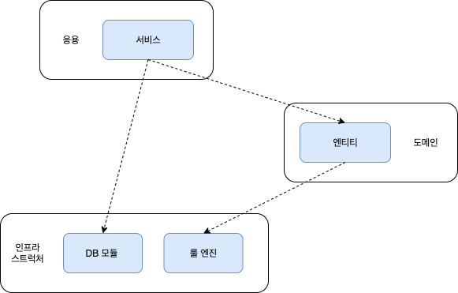
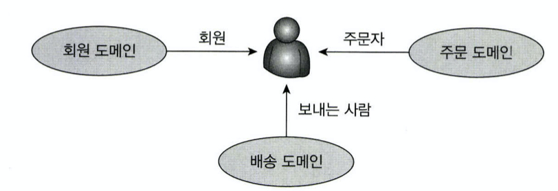
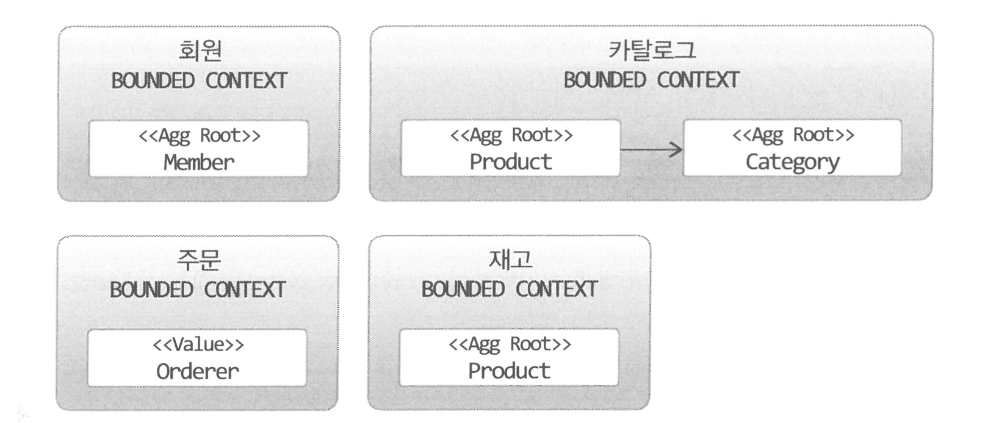
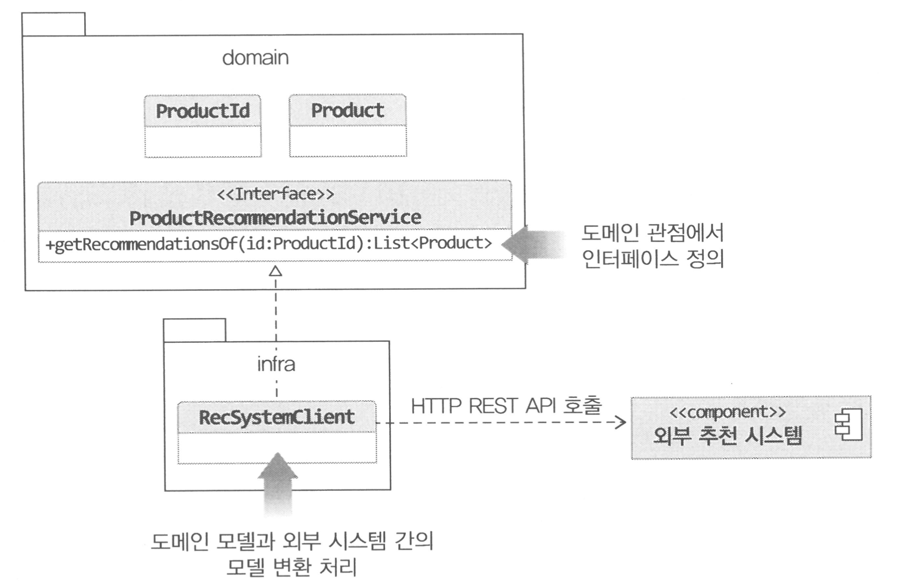
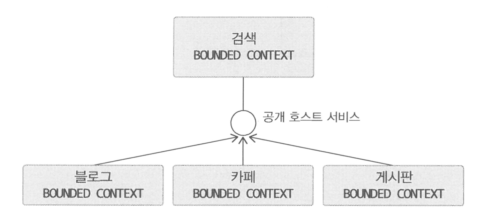

* [#1 도메인 모델 시작](#1-도메인-모델-시작)
   * [도메인 모델](#도메인-모델)
   * [도메인 모델 패턴](#도메인-모델-패턴)
   * [도메인 모델 도출](#도메인-모델-도출)
   * [엔티티와 밸류](#엔티티와-밸류)
      * [엔티티](#엔티티)
      * [엔티티의 식별자 생성](#엔티티의-식별자-생성)
      * [밸류 타입](#밸류-타입)
      * [엔티티 식별자와 밸류 타입](#엔티티-식별자와-밸류-타입)
      * [도메인 모델에 set 넣지 않기](#도메인-모델에-set-넣지-않기)
   * [도메인 용어](#도메인-용어)
* [#2 아키텍처 개요](#2-아키텍처-개요)
   * [네 개의 영역](#네-개의-영역)
   * [계층 구조 아키텍처](#계층-구조-아키텍처)
   * [DIP](#dip)
      * [DIP 주의사항](#dip-주의사항)
      * [DIP와 아키텍처](#dip와-아키텍처)
   * [도메인 영역의 주요 구성 요소](#도메인-영역의-주요-구성-요소)
      * [엔티티와 밸류](#엔티티와-밸류-1)
      * [애그리거트](#애그리거트)
      * [리포지터리](#리포지터리)
   * [요청 처리 흐름](#요청-처리-흐름)
   * [인프라스트럭처 개요](#인프라스트럭처-개요)
   * [모듈 구성](#모듈-구성)
* [#3 애그리거트](#3-애그리거트)
   * [애그리거트](#애그리거트-1)
   * [애그리거트 루트](#애그리거트-루트)
      * [도메인 규칙과 일관성](#도메인-규칙과-일관성)
      * [애그리거트 루트의 기능 구현](#애그리거트-루트의-기능-구현)
      * [트랜잭션 범위](#트랜잭션-범위)
   * [리포지터리와 애그리거트](#리포지터리와-애그리거트)
   * [ID를 이용한 애그리거트 참조](#id를-이용한-애그리거트-참조)
      * [ID를 이용한 참조와 조회 성능](#id를-이용한-참조와-조회-성능)
   * [애그리거트 간 집합 연관](#애그리거트-간-집합-연관)
   * [애그리거트를 팩토리로 사용하기](#애그리거트를-팩토리로-사용하기)
* [#4 리포지터리와 모델구현](#4-리포지터리와-모델구현)
   * [JPA를 이용한 리포지터리 구현](#jpa를-이용한-리포지터리-구현)
      * [모듈 위치](#모듈-위치)
      * [리포지터리 기본 기능 구현](#리포지터리-기본-기능-구현)
   * [매핑 구현](#매핑-구현)
      * [엔티티와 밸류 기본 매핑 구현](#엔티티와-밸류-기본-매핑-구현)
      * [기본 생성자](#기본-생성자)
      * [필드 접근 방식 사용](#필드-접근-방식-사용)
      * [AttributeConverter를 이용한 밸류 매핑 처리](#attributeconverter를-이용한-밸류-매핑-처리)
      * [밸류 컬렉션: 별도 테이블 매핑](#밸류-컬렉션-별도-테이블-매핑)
      * [밸류 컬렉션: 한 개 칼럼 매핑](#밸류-컬렉션-한-개-칼럼-매핑)
      * [밸류를 이용한 아이디 매핑](#밸류를-이용한-아이디-매핑)
      * [별도 테이블에 저장하는 밸류 매핑](#별도-테이블에-저장하는-밸류-매핑)
      * [밸류 컬렉션을 @Entity로 매핑하기](#밸류-컬렉션을-entity로-매핑하기)
      * [ID참조와 조인 테이블을 이용한 단방향 M-N 매핑](#id참조와-조인-테이블을-이용한-단방향-m-n-매핑)
   * [애그리거트 로딩 전략](#애그리거트-로딩-전략)
   * [애그리거트의 영속성 전파](#애그리거트의-영속성-전파)
   * [식별자 생성 기능](#식별자-생성-기능)
* [#5 리포지터리의 조회 기능(JPA 중심)](#5-리포지터리의-조회-기능jpa-중심)
   * [검색을 위한 스펙](#검색을-위한-스펙)
      * [스펙 조합](#스펙-조합)
   * [JPA를 위한 스펙 구현](#jpa를-위한-스펙-구현)
      * [JPA 스펙 구현](#jpa-스펙-구현)
      * [AND/OR 스펙 조합을 위한 구현](#andor-스펙-조합을-위한-구현)
      * [스펙을 사용하는 JPA 리포지터리 구현](#스펙을-사용하는-jpa-리포지터리-구현)
   * [정렬 구현](#정렬-구현)
   * [페이징 개수 구하기 구현](#페이징-개수-구하기-구현)
   * [조회 전용 기능 구현](#조회-전용-기능-구현)
      * [동적 인스턴스 생성](#동적-인스턴스-생성)
      * [하이버네이트 @Subselect 사용](#하이버네이트-subselect-사용)
* [#6 응용 서비스와 표현 영역](#6-응용-서비스와-표현-영역)
   * [표현 영역과 응용 영역](#표현-영역과-응용-영역)
   * [응용 서비스의 역할](#응용-서비스의-역할)
      * [도메인 로직 넣지 않기](#도메인-로직-넣지-않기)
   * [응용 서비스의 구현](#응용-서비스의-구현)
      * [응용 서비스의 크기](#응용-서비스의-크기)
      * [응용 서비스의 인터페이스와 클래스](#응용-서비스의-인터페이스와-클래스)
      * [메서드 파라미터와 값 리턴](#메서드-파라미터와-값-리턴)
      * [표현 영역에 의존하지 않기](#표현-영역에-의존하지-않기)
      * [트랜잭션 처리](#트랜잭션-처리)
      * [도메인 이벤트 처리](#도메인-이벤트-처리)
   * [표현 영역](#표현-영역)
   * [값 검증](#값-검증)
   * [권한 검사](#권한-검사)
   * [조회 전용 기능과 응용 서비스](#조회-전용-기능과-응용-서비스)
* [#7 도메인 서비스](#7-도메인-서비스)
   * [여러 애그리거트가 필요한 기능](#여러-애그리거트가-필요한-기능)
   * [도메인 서비스](#도메인-서비스)
      * [도메인 서비스의 패키지 위치](#도메인-서비스의-패키지-위치)
      * [도메인 서비스의 인터페이스와 클래스](#도메인-서비스의-인터페이스와-클래스)
* [#8 애그리거트 트랜잭션 관리](#8-애그리거트-트랜잭션-관리)
   * [애그리거트와 트랜잭션](#애그리거트와-트랜잭션)
   * [선전 잠금](#선전-잠금)
      * [선전 잠금과 교착 상태](#선전-잠금과-교착-상태)
   * [비선점 잠금](#비선점-잠금)
      * [강제 버전 증가](#강제-버전-증가)
   * [오프라인 선점 잠금](#오프라인-선점-잠금)
      * [오프라인 선점 잠금을 위한 LockManager 인터페이스와 관련 클래스](#오프라인-선점-잠금을-위한-lockmanager-인터페이스와-관련-클래스)
      * [DB를 이용한 LockManager 구현](#db를-이용한-lockmanager-구현)
* [#9 도메인 모델과 BOUNDED CONTEXT](#9-도메인-모델과-bounded-context)
   * [도메인 모델과 경계](#도메인-모델과-경계)
   * [BOUNDED CONTEXT](#bounded-context)
   * [BOUNDED CONTEX의 구현](#bounded-contex의-구현)
   * [BOUNDED CONTEXT 간 통합](#bounded-context-간-통합)
   * [BOUNDED CONTEXT 간 관계](#bounded-context-간-관계)
   * [컨텍스트 맵](#컨텍스트-맵)
* [#10 이벤트](#10-이벤트)
   * [시스템 간 강결합의 문제](#시스템-간-강결합의-문제)
   * [이벤트 개요](#이벤트-개요)
      * [이벤트 관련 구성요소](#이벤트-관련-구성요소)
      * [이벤트의 구성](#이벤트의-구성)
      * [이벤트 용도](#이벤트-용도)
      * [이벤트 장점](#이벤트-장점)
   * [이벤트, 핸들러, 디스패처 구현](#이벤트-핸들러-디스패처-구현)
      * [이벤트 클래스](#이벤트-클래스)
      * [EventHandler 인터페이스](#eventhandler-인터페이스)
      * [이벤트 디스패처인 Event 구현](#이벤트-디스패처인-event-구현)
      * [흐름 정리](#흐름-정리)
      * [AOP를 이용한 Events.reset() 실행](#aop를-이용한-eventsreset-실행)
   * [동기 이벤트 처리 문제](#동기-이벤트-처리-문제)
   * [비동기 이벤트 처리](#비동기-이벤트-처리)
      * [로컬 핸들러의 비동기 실행](#로컬-핸들러의-비동기-실행)
      * [메시징 시스템을 이용한 비동기 구현](#메시징-시스템을-이용한-비동기-구현)
      * [이벤트 저장소를 이용한 비동기 처리](#이벤트-저장소를-이용한-비동기-처리)
      * [이벤트 저장소 구현](#이벤트-저장소-구현)
      * [이벤트 저장을 위한 이벤트 핸들러 구현](#이벤트-저장을-위한-이벤트-핸들러-구현)
      * [REST API 구현](#rest-api-구현)
      * [포워더 구현](#포워더-구현)
   * [이벤트 적용 시 추가 고려사항](#이벤트-적용-시-추가-고려사항)
* [#11 CQRS](#11-cqrs)
   * [단일 모델의 단점](#단일-모델의-단점)
   * [CQRS](#cqrs)
      * [웹과 CQRS](#웹과-cqrs)
      * [CRQS 장단점](#crqs-장단점)


# DDD Start! 도메인 주도 설계 구현과 핵심 익히기

예제 참고

- [https://github.com/madvirus/ddd-start](https://github.com/madvirus/ddd-start)
- [https://incheol-jung.gitbook.io/docs/study/ddd-start](https://incheol-jung.gitbook.io/docs/study/ddd-start)


# #1 도메인 모델 시작

- 온라인 서점 구현하기
  - 개발자 입장에서 온라인 서점은 구현해야 할 소프트웨어의 대상이 된다.
  - 온라인 서점 소프트웨어는 온라인으로 책을 판매하는 데 필요한 상품조회, 구매, 결제, 배송 추적 등의 기능을 제공해야 한다.
  - 온라인 서점은 소프트웨어로 해결하고자 하는 문제 영역, 즉 도메인에 해당한다.

- 도메인은 여러 하위 도메인으로 구성된다.
  - '온라인 서점' 이라는 큰 도메인 하위에 여러가지 하위 도메인들
    - 혜택: 쿠폰이나 특별 할인과 같은 서비스를 제공한다.
    - 카탈로그: 고객에게 구매할 수 있는 상품 목록을 제공한다.
    - 주문: 고객의 주문을 처리한다.
    - 배송: 고객에게 구매한 상품을 전달하는 일련의 과정을 처리한다.
    - 회원, 리뷰, 결제, 정산 등등 ...
  - 한 하위 도메인은 다른 하위 도메인과 연동하여 완전한 하나의 기능을 제공한다.
    - ex: 고객이 물건을 구매
      - 주문 -> 결제 -> 배송 -> 혜택

- 특정 도메인을 위한 소프트웨어라고 해서 도메인이 제공해야할 모든 기능을 구현하는 것은 아니다.
  - ex: 온라인 쇼핑몰에서 결제모듈은 PG사를 통해서 한다.


## 도메인 모델

- 도메인 모델
  - 도메인 모델은 특정 도메인을 개념적으로 표현한 것이다.
  - 도메인 모델을 사용하면 여러 관계자들이 동일한 모습으로 도메인을 이해하고 도메인 지식을 공유하는데 도움이 된다.


- 도메인 모델의 표현 방식은 도메인을 이해하는 데 도움이 된다면 방식이 무엇인지는 중요하지 않다.
- 개념모델과 구현모델
  - 개념 모델: 순수하게 문제를 분석한 결과물
  - 구현 모델: 개념모델을 기반으로 구현한 결과물
  - 처음부터 완벽한 개념 모델을 만들기보다는 전반적인 개요를 알 수 있는 수준으로 개념모델을 작성해야 한다. 개념 모델은 도메인에 대한 전체 윤곽을 이해하는 데 집중하고 구현하는 과정에서 개념 모델을 구현 모델로 점진적으로 발전시켜 나가야한다.
- 하위 도메인과 모델
  - 각 하위 도메인이 다루는 영역은 서로 다르기 때문에 같은 용어라도 하위 도메인마다 의미가 달라질 수 있다.
  - 모델의 각 구성요소는 특정 도메인을 한정할 때 비로소 의미가 완전해지기 때문에 각 하위 도메인마다 별도로 모델을 만들어야 한다.


## 도메인 모델 패턴

- 일반적인 애플리케이션의 아키텍처


| 계층           | 설명                                                         |
| -------------- | ------------------------------------------------------------ |
| ui, 또는 표현  | 사용자의 요청을 처리하고 사용자에게 정보를 보여준다. 여가서 사용자는 소프트웨어를 사용하는 사람뿐만 아니라 외부 시스템도 사용자가 될 수 있다. |
| 응용           | 사용자가 요청한 기능을 실행한다. 업무 로직을 직접 구현하지 않으며 도메인 계층을 조합해서 기능을 실행한다. |
| 도메인         | 시스템이 제공할 도메인의 규칙을 구현한다.                    |
| 인프라스트럭처 | 데이터베이스나 메시징 시스템과 같은 외부 시스템과의 연동을 처리한다. |

- 마틴 파울러의 도메인 모델

  - 여기서의 도메인 모델은 아키텍처상의 도메인 계층을 객체 지향 기법으로 구현하는 패턴을 말한다.

> 도메인 모델의 두가지 의미
>
> 1. 도메인 자체를 표현하는 개념적인 모델
> 2. 도메인 계층을 구현할 때 사용하는 객체 모델

- 도메인 계층 구현하기

  - 도메인 계층은 도메인의 핵심 구현을 구현한다.

  - 주문 도메인

    - "출고 전에 배송지를 변경할 수 있다."
    - "주문 취소는 배송 전에만 할 수 있다."

  - 코드로 주문 도메인 표현하기

  - ```java
    public class Order {
    	private OrderState state;
    	private ShippingInfo shippingInfo;
    
    	public void changeShippingInfo(ShippingInfo newShippingInfo) {
    		if (!state.isShippingChangeable()) {
    			throw new IllegalStateException("can't change shipping in " + state);
    		}
    		this.shippingInfo = newShippingInfo;
    	}
    
    	public void changeShipped() {
    		// 로직 검사
    		this.state = OrderState.SHIPPED;
    	}
    	...
    }
    
    public enum OrderState {
    	PAYMENT_WAITING {
    		public boolean isShippingChangeable() {
    			return true;
    		}
    	},
    	PREPARING {
    		public boolean isShippingChangeable() {
    			return true;
    		}
    	},
    	SHIPPED, DELIVERING, DELIVERY_COMPLETED;
    
    	public boolean isShippingChangeable() {
    		return false;
    	}
    }
    ```


- 중요 업무 규칙 구현하기

  - 핵심 규칙을 구현한 코드는 도메인 모델에만 위치하기 때문에 규칙이 바뀌거나 규칙을 확장해야 할 때 다른 코드에 영향을 덜 주고 변경 내역을 모델에 반영할 수 있게 된다.


## 도메인 모델 도출

- 도메인을 모델링 할 때 기본이 되는 작업
  - 모델을 구성하는 핵심 구성 요소 찾기
  - 규칙 찾기
  - 기능 찾기
- 주문 도메인과 관련된 몇가지 요구사항
  - 최소 한 종류 이상의 상품을 주문해야 한다.
  - 한 상품을 한 개 이상 주문할 수 있다.
  - 총 주문 금액은 각 상품의 구매 가격 합을 모두 더한 금액이다.
  - 각 상품의 구매 가격 합은 상품 가격에 구매 개수를 곱한 값이다.
  - 주문할 때 배송지 정보를 반드시 지정해야 한다.
  - 배송지 정보는 받는 사람 이름, 전화번호, 주소로 구성된다.
  - 출고를 하면 배송지 정보를 변경할 수 없다.
  - 출고 전에 주문을 취소할 수 있다.
  - 고객이 결제를 완료하기 전에는 상품을 준비하지 않는다.
- 위 요구사항을 기반으로 도출한 주문의 네가지 기능
  1. 출고 상태로 변경하기 
  2. 배송지 정보 변경하기
  3. 주문 취소하기
  4. 결제 완료로 변경하기

```java
public class Order {
	public void changeShipped() { ... }
	public void changeShippingInfo(ShippingInfo newShipping) { ... }
	public void cancel() { ... }
	public void completePayment() { ... }
}
```

- 다음 요구사항은 주문 항목이 어떤 데이터로 구성되는지 알려준다.
  - 한 상품을 한 개 이상 주문할 수 있다.
  - 각 상품의 구매 가격 합은 상품 가격에 구매 개수를 곱한 값이다.
- 이를 구현한 OrderLine

```java
public class OrderLine {
  private Product product; //상품
  private int price;  //가격
  private int quantity;  //수량
  private int amounts; //구매가격
  
  public OrderLine(Prodect product, int price, int quantity) {
    this.product = product;
    this.private = price;
    this.quantity = quantity;
    this.amounts = calculateAounts();
  }
  
  //구매 가격 구하기
  private int calculateAounts() {
    return price * quantity;
  }
  
  public int getAmounts() {  }
}
```

- 다음 요구사항은 Order와 OrderLine의 관계를 알려준다.
  - 최소 한 종류 이상의 상품을 주문해야 한다.
  - 총 주문 금액은 각 상품의 구매 가격 합을 모두 더한 금액이다.
- 이를 반영한 Order

```java
public class Oreder {
  private List<OrderLine> ordrLines;
  private int totalAmounts;
  
  public Order(List<OrederLine> orderLines) {
    setOrderLines(orderLines);
  }
  
  private void setOrderLines(List<OrderLine> orderLines) {
    verifyAtLeastOneOrMoreOrderLines(orderLines);
    this.orderLines = orderLines;
    calculateTotalAmounts();
  }
  
  private void verifyAtLeastOneOrMoreOrderLines(List<OrderLine> orderLine) {
    if(orderLines == null || orderLines.isEmpty()) {
      throw new Exception("no OrderLine");
    }
  }
  
  private void calculateTotalAmounts() {
    this.totalAmounts = new Money(orderLines.stream()
      .mapToInt(x -> x.getAmounts().getValue()).sum();
  }
  //....
}
```

- 다음 요구사항은 Order와 ShippingInfo(배송지 정보)의 관계를 알려준다.
  - 주문할 때 배송지 정보를 반드시 지정해야 한다.

```java
public class ShipingInfo {
	private String receiverName;
	private String receiverPhoneNumber;
	private String shipingAddress1;
	private String shipingAddress2;
	private String shipingZipcode;

  ...
}

public class Order {
	private List<OrderLine> orderLines;
	private int totalAmounts;
	private ShippingInfo shippingInfo;
	
	public Order(List<OrderLine> orderLines, ShippingInfo shippingInfo){
		setOrderLiens(orderLines);
		setShippingInfo(shippingInfo);
	}
	private void setShippingInfo(ShippingInfo shippingInfo){
		if (shippingInfo == null)
			throw new IllegalArgumentException("no shippingInfo");
		this.shippingInfo = shippingInfo;
	}
...
}
```


- 아래 요구사항으로 OrderStatus(주문의 상태)를 도출 할 수 있다.
  - 출고를 하면 배송지 정보를 변경할 수 없다.
  - 출고 전에 주문을 취소할 수 있다.
  - 고객이 결제를 완료하기 전에는 상품을 준비하지 않는다.

```java
public enum OrderState {
	PAYMENT_WAITING, PREPARING, SHIPPED, DELIVERING, DELIVERY_COMPLETED, CANCELED;	
}

public class Order{
	private OrderState state;
	
	public void changeShippingInfo(ShippingInfo newShippingInfo) {
		verifyNotYetShipped();
		setShippingInfo(newShippingInfo);
	}
	public void cancel(){
		verifyNotYetShipped();
		this.state = OrderState.CANCELED;
	}
	private void verifyNotYetShipped(){
		if(state != OrderState.PAYMENT_WAITING && state != OrderState.PREPARING)
			throw new IllegalStateException("already shippped");
	}
	...
}
```

- 문서화하기
  - 문서화를 하는 주된 이유는 지식을 공유하기 위함이다.
  - 코드보다 상위 수준에서 정리한 문서를 참조하는 것이 소프트웨어 전반을 빠르게 이해하는데 도움이 된다.
  - 코드도 역시 문서화의 대상이 된다. 도메인 지식이 잘 묻어나도록 코드를 작성해야 한다.


## 엔티티와 밸류

- 엔티티와 밸류 구분하기
  - 도출한 모델은 크게 엔티티와 밸류로 구분할 수 있다.
  - 엔티티와 밸류를 제대로 구분해야 도메인을 올바르게 설계하고 구현할 수 있기 때문에 이 둘의 차이를 명확하게 이해하는 것은 도메인을 구현하는데 있어 중요하다.

### 엔티티

- 엔티티와 식별자
  - 엔티티의 가장 큰 특징은 식별자를 갖는다는 것이다.
  - 식별자는 엔티티 객체마다 고유하고 각 엔티티는 서로 다른 식별자를 가진다. 
    - ex: 주문 도메인에서 고유한 주문번호
  - 엔티티를 생성하고 엔티티의 속성을 바꾸고 엔티티를 삭제할 때까지 식별자는 유지된다.
  - 엔티티의 식별자는 고유하기 때문에 같은 식별자를 갖는다면 두 엔티티는 같다고 판단할 수 있다.


### 엔티티의 식별자 생성

- 엔티티의 식별자를 생성하는 시점은 도메인의 특징과 사용하는 기술에 따라 달라진다.

- 식별자를 지정하는 방법

  - 특정 규칙에 따라 생성

    - ex: 현재시간을 조합 20230529094644, 20220702094644

  - uuid 사용

    - ```
      UUID uuid = UUID.randomUUID();
      // 615fsdf34-c342-5scd-d33d-123145sadfa 와 같은 문자열
      ```

  - 값을 직접 입력

    - ex: 회원의 id 또는 email

  - 시퀀스나 db의 자동 증가 컬럼 사용, 일련번호

    - ex: auto-increment 칼럼


### 밸류 타입

- 밸류 타입은 개념적으로 완전한 하나를 표현할 때 사용한다.
- ShipingInfo 클래스를 밸류 타입으로 리팩토링하기

```java
public class ShipingInfo {
	private String receiverName; // Receiver
	private String receiverPhoneNumber; // Receiver
	private String shipingAddress1; // Address
	private String shipingAddress2; // Address
	private String shipingZipcode;  // Address

  ...
}	
```

- 받는사람(Receiver) 를 밸류타입으로 구현하기

```java
public class Receiver {
	private String name;
	private String phoneNumber;
	
	public Receiver(String name, String phoneNumber){
		this.name = name;
		this.phoneNumber = phoneNumber;
	}

	public String getName(){
		return name;
	}
	public String getPhoneNumber(){
		return phoneNumber;
	}
}
```

- 주소(Address)를 밸류타입으로 구현하기

```java
public class Address{
	private String address1;
	private String address2;
	private String zipcode;
	//생성자, getter
}
```

- ShipingInfo 클래스에 구현한 Receiver와 Address를 적용하기

```java
public class ShipingInfo {
  private Receiver receiver;
  private Address address;
  
  ...
}
```

- 밸류타입이 꼭 두 개 이상의 데이터를 가져야하는 것은 아니다. 의미를 명확하게 표현하기 위해 밸류 타입을 사용하는 경우도 있다.

```java
public class Money{
	private int value;

	public Money(int value){
		this.money = money;
	}
	//... getter
	
	//새로운 기능 추가 가능
	public Money add(Money money){
		return new Money(this.value + money.value);
	}
	public Money multiply(int multiplier) {
		return new Money(this.value * multiplier);
	}
}
```

```java
public class OrderLine {
	private Product product;
	private int price;
	private int quantity;
	private int amounts;
...
}

// price와 amounts에 Money 클래스 적용하기

public class OrderLine{
	private Product product;
	private Money price;
	private int quantity;
	private Money amounts;
...
}
```

- 이처럼 밸류 타입은 코드의 이미를 더 잘 이해할 수 있도록 도와준다.
- 밸류타입과 불변
  - 밸류 객체의 데이터를 변경할 때는 기존 데이터를 변경하기보다는 변경한 데이터를 갖는 새로운 밸류 객체를 생성하는 방식을 선호한다.
  - 데이터의 변경 기능을 제공하지 않는 타입을 불변이라고 표현한다.
  - 불변 타입을 사용하면 보다 안전한 코드를 작성할 수 있다.
  - 밸류 타입을 사용해서 어떠한 문제가 있는지 분석하고 문제를 해결하는 방법보다 그냥 '밸류타입은 불변으로 작성' 이라는 공식을 갖고 있으면 여러가지 문제를 고민하지 않고 해결할 수 있다. (개인적인 생각)
- 밸류타입 객체가 같은지 비교할 때는 모든 속성이 같은지 비교해야 한다.


### 엔티티 식별자와 밸류 타입

- 식별자는 단순한 문자열이 아니라 도메인에서 특별한 의미를 지니는 경우가 많기 때문에 식별자를 위한 밸류 타입을 사용해서 의미가 잘 들어나도록 할 수 있다.

```java
public class Order{
	//private String id;
	private OrderNo id;
	...
}
```


### 도메인 모델에 set 넣지 않기

- 도메인 모델에 무작정 get/set을 추가하는 습관
  - 이런 습관은 좋지 않다.
  - 특히 set 메서드는 도메인의 핵심 개념이나 의도를 코드에서 사라지게 한다.

- setX()의 경우 도메인 지식을 부여하기 힘들기 때문에 적절한 이름을 선정하는것이 중요하다.
  - setShippingInfo() -> changeShippingInfo()
  - setOrderStatus() -> completePayment()
  - 메서드 명에 도메인 지식을 녹이는게 중요하다.
  - 만약 set 메서드가 private 으로 외부에 공개되지 않는다면 set이라는 이름을 사용해도 괜찮다.

- 밸류 타입은 불변이어야 하기 때문에 set과 같은 변경 메서드를 구현하지 않아야 한다.


## 도메인 용어

- 코드를 작성할 때 도메인에서 사용하는 용어는 매우 중요하다.
  - [https://martinfowler.com/bliki/UbiquitousLanguage.html](https://martinfowler.com/bliki/UbiquitousLanguage.html)


```java
public enum OrderState {
	PAYMENT_WAITING, PREPARING, SHIPPED, DELIVERING, DELIVERY_COMPLETED, CANCELED;	
}
```

- 도메인 용어의 장점
  - 별다른 해석을 위한 이해 과정이 줄어든다.
  - 가독성이 올라가서 코드를 분석하고 이해하는 시간을 절약한다.
  - 도메인 용어를 사용해서 도메인 규칙을 코드로 작성하게 되므로 버그도 줄어든다.
- 알맞은 영어 단어 찾기
  - 도메인 용어를 정하는데 높은 허들은 바로 코드가 '영어' 라는 점이다.
  - 알맞은 영어 단어를 찾는 것은 쉽지 않은 일이지만 시간을 들여 찾는 노력을 해야 한다.


# #2 아키텍처 개요

## 네 개의 영역

- 아키텍처를 설계할 때 출현하는 전형적인 영역
  - 표현
    - 사용자의 요청을 받아 응용 영역에 전달하고 다시 결과를 보여주는 역할
    - ex) Spring MVC 
  - 응용
    - 시스템이 사용자에게 제공해야 할 기능을 구현한다.
    - 도메인 영역의 도메인 모델을 사용한다.
    - 응용 서비스는 로직을 직접 수행하기 보다는 도메인 모델에 로직 수행을 위임한다.
    - ex) order.cancel() 호출
  - 도메인
    - 도메인 영역은 실제 도메인 모델을 구현한다.
    - 도메인 모델은 도메인의 핵심 로직을 구현한다.
    - ex) 주문 도메인의 '배송지 변경', '결제 완료', '주문 총액 계산'
  - 인프라
    - 구현 기술에 대한 것을 다룬다.
    - ex) dbms 연동, mq

## 계층 구조 아키텍처



- 계층구조는 그 특성상 상위 계층에서 하위 계층으로의 의존만 존재하고 하위 계층은 상위 계층에 의존하지 않는다.

- 인프라스트럭처 계층에 대한 종속

  - 중요한점은 표현, 응용, 도메인 계층이 상세한 구현 기술을 다루는 인프라스트럭처 계층에 종속된다는 점이다.

  - 인프라스트럭처의 직접 종속에 대한 문제점 두가지

    - 테스트가 어렵다.
    - 구현 방식을 변경하기 어렵다.

  - ```java
    public class CalculateDiscountService {
    	private DroolsRuleEngine ruleEngine; // 인프라영역
    
    	public Money calculateDiscount(OrderLine orderLines, String customerId) {
    		Customer customer = findCusotmer(customerId);
    		MutableMoney money = new MutableMoney(0);
    		facts.addAll(orderLines);
    		ruleEngine.evalute("discountCalculation", facts);
    		return money.toImmutableMoney();
    	}
    }
    ```

- DIP를 적용하면 이런 직접적인 의존관계에서 나오는 문제점을 해결할 수 있다.

## DIP

- 고수준 모듈과 저수준 모듈
  - 고수준 모듈은 의미있는 단일 기능을 제공하는 모듈이다.
  - 고수준 모듈의 기능을 구현하려면 여러 하위 기능이 필요하다.
  - 저수준 모듈은 하위 기능을 실제로 구현한 것이다.
  - 고수준 모듈이 저수준 모듈을 직접 사용하면 앞서 확인했던 두가지 문제가 발생한다.

- DIP 적용하기
  - DIP는 이 문제를 해결하기 위해 저수준 모듈이 고수준 모듈에 의존하도록 바꾼다.
  - 고수준 모듈에서는 저수준 모듈이 수행하는 하위 기능에 대한 인프라에 대해서 직접적인 의존을 갖지 않는다.
  - 고수준 모듈에서는 저수준 모듈의 '행위' 만 중요하다.


```java
public interface RuleDiscounter {
	public Money applyRules(Customer customer, List<OrderLine> orderLines);
}

public class CalculateDiscountService {
	private CustomerRepository customerRepository;
	private RuleDiscounter ruleDiscounter;

	public Money calculateDiscount(OrderLine orderLines, String customerId) {
		Customer customer = customerRepository.findCusotmer(customerId);
		return ruleDiscounter.applyRules(customer, orderLines);
	}
}

public class DroolsRuleDiscounter implements RuleDiscounter{
	private KieContainer kContainer;

	@Override
	public void applyRules(Customer customer, List<OrderLine> orderLines) {
		...
	}
}
```


- DIP

  - 고수준 모듈이 저수준 모듈을 사용하려면 고수준 모듈이 저수준 모듈에 의존해야하는데 반대로 저수준 모듈이 고수준 모듈에 의존한다고 해서 이를 DIP라고 부른다.

  - DIP를 적용하면 구현 교체가 어렵다는 문제와 테스트가 어려운 문제를 해소할 수 있다.

    

### DIP 주의사항

- DIP의 핵심은 고수준 모듈이 저수준 모듈에 직접적인 의존을 하지 않기 위함인데 DIP를 적용한 결과 구조만 보고 저수준 모듈에서 인터페이스를 추출하는 경우가 있다.


- 마치 중간에 인터페이스를 둬서 저수준 모듈에 직접적인 의존이 없는것처럼 보이지만 실제로는 의존관계를 갖고 있다.
- 고수준 모듈에서 중요한 것은 '행위'다


### DIP와 아키텍처

- 저수준모듈
  - 인프라스트럭처
- 고수준모듈
  - 응용 영역
  - 도메인 영역
- 아키텍처 수준에서 DIP를 적용하면 인프라스트럭처 영역이 응용 영역과 도메인 영역에 의존하는 구조가 된다.


- 이런 구조가되면 도메인과 응용 영역에 대한 영향을 주지 않거나 최소화하면서 구현 기술을 변경하는 것이 가능하다.


## 도메인 영역의 주요 구성 요소

| 요소          | 설명                                                         |
| ------------- | ------------------------------------------------------------ |
| 엔티티        | 고유 식별자를 갖는 객체, 자신의 라이프사이클이 있고 주문, 상품과 같이 도메인의 고유한 개념을 표현함. 도메인 모델의 데이터를 포함하며 해당데이터와 관련된 기능을 함께 제공함 |
| 밸류          | 고유의 식별자를 갖지 않는 객체. 주로 개념적으로 하나인 도메인 객체의 속성을 표현할 때 사용함. 주소를 표현하기 위한 주소, 동호수 등등 엔티티 속성뿐만 아니라 다른 밸류 타입의 속성으로도 사용될 수 있음 |
| 애그리거트    | 애그리거트는 관련된 엔티티와 밸류 객체를 개념적으로 하나로 묶은 것 주문과 관련된 Order 엔티티, OrderLine 밸류, Orderer 밸류 객체를 주문 애그리거트로 묶을 수 있음 |
| 리포지터리    | 도메인 모델의 영속성을 처리함. dbms의 crud를 담당함          |
| 도메인 서비스 | 특정 엔티티에 속하지 않은 도메인 로직을 제공함. 예를 들면 할인 금액 계산은 상품, 쿠폰, 회원 등급 등 다양한 조건을 이용해서 구현함 |

### 엔티티와 밸류

- 도메인 모델의 엔티티 vs db table
  - 도메인 모델의 엔티티는 단순히 데이터를 담고 있는 데이터 구조라기보다는 데이터와 함께 기능을 제공하는 객체이다.
  - 도메인 관점에서 기능을 구현하고 기능 구현을 캡슐화해서 데이터가 임의로 변경되는 것을 막는다.
  - 도메인 모델의 엔티티는 두 개 이상의 데이터가 개념적으로 하나인 경우 밸류 타입을 이용할 수 있다.


### 애그리거트

- 애그리거트
  - 지도를 볼 때 매우 상세하게 나온 대축척지도를 보면 큰 수준에서 어디에 위치하고 있는지 이해하기 어려우므로 큰 수준에서 보여주는 소축척 지도를 함께 봐야 현재 위치보다 정확하게 이해할 수 있다.
  - 엔티티도 마찬가지로 도메인 모델이 복잡해졌을때 상위 수준에서 전체 구조를 이해하는데 도움이 되는 것이 바로 애그리거트다.
  - 애그리거트는 관련 객체를 하나로 묶은 군집이다. 
    - ex: 주문, 배송지 정보, 주문자, 주문 목록 => 주문 이라는 하나의 큰 상위 개념 (주문 애그리거트)

  - 애그리거트를 사용하면 개별 객체가 아닌 관련 객체를 묶어서 객체 군집 단위로 모델을 바라볼 수 있게 된다.

- 루트 엔티티
  - 애그리거트는 군집 속에 객체들을 관리하는 루트 엔티티를 갖는다.
  - 루트 엔티티는 애그리거트에 속해 있는 엔티티와 밸류 객체를 이용해서 애그리거트가 구현해야 할 기능을 제공한다.
  - 애그리거트를 사용하는 코드는 애그리거트 루트가 제공하는 기능을 실행하고 애그리거트 루트를 통해서 간접적으로 애그리거트 내의 다른 엔티티나 밸류 객체에 접근하면 된다. 이는 애그리거트의 내부 구현을 숨겨서 애그리거트 단위로 구현을 캡슐화할 수 있도록 돕는다.


### 리포지터리

- 리포지터리
  - 도메인 객체를 지속적으로 사용하려면 RDBMS, NoSQL, 로컬 파일과 같은 물리적인 저장소에 도메인 객체를 보관해야한다. 이를 위한 도메인 모델이 리포지토리다.
  - 리포지터리는 애그리거트 단위로 도메인 객체를 저장하고 조회하는 기능을 정의한다.
  - 리포지터리 인터페이스는 도메인 모델 영역에 속하고 실제 구현 클래스는 인프라 영역에 속한다.


- 응용 서비스와 리포지터리의 밀접한 연관
  - 응용 서비스는 필요한 도메인 객체를 구하거나 저장할 때 리포지터리를 사용한다.
  - 응용 서비스는 트랜잭션을 관리하는데 트랜잭션 처리는 리포지터리 구현 기술에 영향을 받는다.
- 리포지터리의 사용 주체가 응용 서비스라서 리포지터리는 응용 서비스가 필요로하는 메서드를 제공한다.
  - 애그리거트를 저장하는 메서드
  - 애그리거트 루트 식별자로 애그리거트를 조회하는 메서드


## 요청 처리 흐름

- 표현 영역
  - 요청을 처음 받는 영역
  - 표현 영역은 사용자가 전송한 데이터 형식이 올바른지 검사하고 문제가 없다면 데이터를 이용해서 응용 서비스에 기능 실행을 위임한다.

- 응용 서비스
  - 응용 서비스는 도메인 모델을 이용해서 기능을 구현한다.
  - 응용 서비스는 상태를 변경하므로 변경 상태가 물리 저장소에 올바르게 저장되기 위해 트랜잭션을 관리해야 한다.


## 인프라스트럭처 개요

- 인프라스트럭처는 표현, 응용, 도메인 영역을 지원한다.
- 도메인 영역과 응용 영역에서 인프라스트럭처의 기능을 직접 사용하는 것보다 이 두 영역에 정의한 인터페이스를 인프라스트럭처 영역에서 구현하는 것이 시스템을 더 유연하고 테스트하기 쉽게 만들어준다.
- 하지만 무조건 인프라스트럭처에 대한 의존을 없애는 것이 좋은 것은 아니다.
  - 트랜잭션 처리를 위해 스프링이 제공해주는 @Transactional 애너테이션을 사용하는 것이 편하다.
  - @Entity, @Table과 같은 애너테이션을 사용하는 것이 xml 매핑 설정 방법보다 편하다.
  - 구현의 편리함은 DIP가 주는 다른 장점만큼 중요하기 때문에 DIP의 장점을 해치지 않는 범위에서 응용 영역과 도메인 영역에서 구현 기술에 대한 의존을 가져가는 것이 현명하다.


## 모듈 구성

- 모듈 구조를 얼마나 세분화해야 하는지에 대해 정해진 규칙은 없다. 단지, 한 패키지에 너무 많은 타입이 몰려서 코드를 찾을 때 불편한 정도만 아니면 된다.

# #3 애그리거트

## 애그리거트

- 애그리거트
  - 도메인 객체 모델이 복잡해지면 개별 구성요소 위주로 모델을 이해하게 되고 전반적인 구조나 큰 수준에서 도메인 간의 관계를 파악하기 어려워진다.
  - 복잡한 도메인을 이해하고 관리하기 쉬운 단위로 만들려면 상위 수준에서 모델을 조망할 수 있는 방법이 필요한데, 그 방법이 바로 애그리거트다.
  - 애그리거트는 모델을 이해하는 데 도움을 줄 뿐만 아니라 일관성을 관리하는 기준이 된다.


- 애그리거트 라이프사이클
  - 한 애그리거트에 속한 객체들은 거의 유사하거나 동일한 라이프사이클을 갖는다.
- 애그리거트 경계
  - 애그리거트는 독립된 객체 군, 각각 자기만 관리하고 다른 애그리거트는 관리하지 않는다.
  - 경계를 설정할 때 기본이 되는 것은 도메인 규칙과 요구사항이다. 도메인 규칙에 따라 함께 생성되는 구성 요소는 한 애그리거트에 속할 가능성이 높다.
  - 함께 변경되는 빈도가 높은 객체는 한 애그리거트에 속할 가능성이 높지만 반드시 이 법칙이 반드시 적용되는 것은 아니다
    - ex: Product와 Review는 서로 다른 라이프사이클을 갖는다.

## 애그리거트 루트

- 애그리거트 루트와 일관성
  - 애그리거트는 여러 객체로 구성되기 때문에 한 객체만 상태가 정상이어서는 안된다. 도메인 규칙을 지키려면 애그리거트에 속한 모든 객체가 정상인 상태를 가져야한다.
  - 애그리거트에 속한 모든 객체가 일관성을 가진 상태를 유지하려면 이 책임을 지는 루트가 필요한데 이게 바로 애그리거트 루트다.
  - 애그리거트 루트 엔티티는 애그리거트의 대표 엔티티
    - ex: Order 엔티티가 주문정보, 배송정보 등등을 관리함


### 도메인 규칙과 일관성

- 애그리거트 루트의 핵심 역할
  - 애그리거트의 일관성이 깨지지 않도록 하는 것이다.
  - 이를 위해 애그리거트 루트에서 애그리거트가 제공해야 할 도메인 기능을 구현한다.
  - 애그리거트 루트가 아닌 다른 객체가 애그리거트에 속한 객체를 직접 변경하면 안된다. 이는 애그리거트 루트가 강제하는 규칙을 적용할 수 없어 모델의 일관성을 깨는 원인이 된다.

- 불필요한 중복과 일관성을 깨지 않도록 하려면 다음과 같은 원칙이 필요하다.
  - 단순히 필드를 변경하는 set 메서드를 공개범위로 만들지 않는다.
  - 밸류 타입은 불변으로 구현한다.

### 애그리거트 루트의 기능 구현

- 애그리거트 루트는 애그리거트 내부의 다른 객체를 조합해서 기능을 완성한다.
- 밸류타입은 무조건 불변타입으로 작성할 것 불가능하다면 변경기능을 패키지, protected 범위로 한정해서 외부에서 실행할 수 없도록 제한할 것

### 트랜잭션 범위

- 트랜잭션 범위
  - 트랜잭션 범위는 작을수록 좋다.
  - 애그리거트도 마찬가지로 한 트랜잭션에서는 한 개의 애그리거트만 수정해야 한다.
  - 한 애그리거트 내부에서 다른 애그리거트 내부를 변경하는 경우는 절대 없어야 한다.
  - 부득이하게 한 트랜잭션에서 두개 이상의 애그리거트의 수정이 필요하다면 도메인 레벨에서가 아니라 응용 서비스 레벨에서 다뤄져야한다.

- 다음의 경우 이례적으로 한 트랜잭션에서 두 개 이상의 애그리거트를 변경하는 것을 고려할 수 있다.
  - 팀 표준: 팀이나 조직의 표준에 따라 사용자 유스케이스와 관련된 응용 서비스의 기능을 한 트랜잭션으로 실행해야 하는 경우가 있을 때
  - 기술 제약: 한 트랜잭션에서 두 개 이상의 애그리거트를 수정하는 대신 도메인 이벤트와 비동기를 사용하는 방식을 사용하는데 기술적으로 이벤트 방식을 도입할 수 없는 경우
  - UI 구현의 편리: 운영자의 편리함을 위해 주문 목록 화면에서 여러 주문의 상태를 한 번에 변경하고 싶을때

## 리포지터리와 애그리거트

- 애그리거트는 개념상 완전한 한 개의 도메인 모델을 표현하므로 객체의 영속성을 처리하는 리포지터리는 애그리거트 단위로 존재한다.
- 리포지터리가 최소한으로 제공해야 하는 메서드
  - save: 애그리거트 저장
  - findById: ID로 애그리거트를 조회

- 리포지터리는 애그리거트 전체를 저장소에 영속화해야하고 애그리거트를 구하는 리포지터리 메서드는 완전한 애그리거트를 제공해야 한다.
- 애그리거트의 상태가 변경되면 모든 변경은 원자적으로 저장소에 반영되어야 한다.

## ID를 이용한 애그리거트 참조

- 한 객체가 다른 객체를 참조하는 것처럼 애그리거트도 다른 애그리거트를 참조한다.
- 하지만 이렇게 필드를 이용한 애그리거트 참조는 다음 문제를 야기할 수 있다.
  - 편한 탐색 오용
  - 성능 확장에 대한 고민
  - 확장 어려움

- ID 참조
  - 위 문제를 해결할 수 있는 방법은 id를 이용해서 애그리거트를 참조하는 것이다. 객체 레퍼런스가 아니라 다른 애그리거트 루트의 id를 참조한다.
  - 위 방법을 사용하면 모델 간 복잡도를 낮춰주고 편한 탐색 오용같은 문제, 성능 확장 문제 등등을 해결해줄 수 있다.
  - id를 이용한 애그리거트 참조를 이용하면 애그리거트 별로 다른 기술을 사용하는 것도 가능해지낟.

### ID를 이용한 참조와 조회 성능

- 여러 애그리거트를 읽을때 조회성능에 문제가 생길 수 있다.
- N+1문제가 발생할 수 있으므로 조인같은 전략을 사용해서 풀어나가야한다.
- 조회부분만 mybatis로 실행할수도 있다.
- 캐시나 조회 전용 저장소 등등을 사용할수도 있다.

## 애그리거트 간 집합 연관

- 카테고리와 상품처럼 1:N 관계에 대한 이야기
- 애그리거트간의 1:N관계는 실무에서 페이징같은 경우를 생각했을때 N 전체를 가져야한다는 문제가 있어서 잘 사용하지 않고 N:1 형태로 관리함
- 실제구현에서는 M:N도 단방향 M:N으로 구현하면 됨

```
public class Product{
	private Set<CategoriyId> categoryIds;
}
```

## 애그리거트를 팩토리로 사용하기

- 팩토리 메서드에서도 중요한 도메인 로직을 구현할 수 있음
- 애그리거트가 갖고 있는 데이터를 이용해서 다른 애그리거트를 생성해야 할때는 팩토리 메서드를 구현하는 것을 고려할 것

# #4 리포지터리와 모델구현

## JPA를 이용한 리포지터리 구현

### 모듈 위치

- 리포지터리 인터페이스는 애그리거트와 같이 도메인 영역이고 리포지터리를 구현한 클래스는 인프라 영역에 속함

### 리포지터리 기본 기능 구현

- 인터페이스는 애그리거트 루트를 기준으로 작성함
- save(), findById() 등등 기본적인 crud에 대한 이야기...

## 매핑 구현

### 엔티티와 밸류 기본 매핑 구현

- 애그리거트와 jpa 매핑을 위한 기본 규치
  - 애그리거트 루트는 엔티티이므로 @Entity 로 매핑 설정함
  - 한 테이블에 엔티티와 밸류 데이터가 같이 있다면
    - 밸류는 @Embeddable로 매핑 설정함
    - 밸류 타입 프로퍼티는 @Embedded로 매핑 설정함
- JPA 2부터 @Embeddable는 중첩을 허용함 참고

### 기본 생성자

- 기본생성자는 jpa 프로바이더가 객체를 생성할 때만 사용하기 때문에 protected로 선언할 것
- 프록시 객체를 이용해서 지연 로딩을 구현함 jpa 참고

### 필드 접근 방식 사용

- setX() 메서드는 절대 사용 금지
- @Access를 활용해서 필드 접근 방식을 사용하면 불필요한 get/set 메서드를 없앨 수 있음

### AttributeConverter를 이용한 밸류 매핑 처리

- 밸류 타입의 프로퍼티를 한 개 칼럼에 매핑해야 할때, 2개의 필드를 한개의 칼럼으로 매핑할 때 AttributeConverter 인터페이스를 사용할 것

### 밸류 컬렉션: 별도 테이블 매핑

- 밸류 컬렉션을 별도 테이블로 매핑할 때는 @ElementCollection과 @CollectionTable을 함께 사용할 것

### 밸류 컬렉션: 한 개 칼럼 매핑

- 여러개의 필드를 한 개 칼럼에 A, B 형태로 매핑하는것도 AttributeConverter 인터페이스를 사용할 것

### 밸류를 이용한 아이디 매핑

- 식별자 자체를 별도 밸류 타입으로 지정할 수 있음 이때는 @Id 대신 @EmbeddedId를 사용하면 됨
- 밸류 타입으로 식별자를 구현하면 식별자에 기능을 추가할 수 있음

### 별도 테이블에 저장하는 밸류 매핑

- 애그리거트에서 루트 엔티티를 뺀 나머지 구성 요소는 대부분 밸류타입임
- 자신만의 독자적인 라이프사이클을 갖는다면 다른 애그리거트일 가능성이 높음
- 애그리거트에 속한 객체가 밸류인지 엔티티인지 구분하는 방법은 고유 식별자를 갖고 있는지에 대한 여부임 허나 fk에 대한 여부를 확인해봐야함 Article과 ArticleContent 객체중 ArticleContent 객체가 오로지 Article에 대한 Id를 갖는 FK and 식별자를 갖고 있다면 ArticleContent는 애그리거트 루트가 아님 <- 대충 이런 설명인듯 ? 
- 위와 같이 밸류타입인데 별도로 저장해야한다면 SecondaryTable을 사용할 것

### 밸류 컬렉션을 @Entity로 매핑하기

- 개념적으로 밸류타입이지만 구현 기술의 한계나 팀 표준 때문에 @Entity를 사용하는 경우도 있음
- JPA는 @Embeddable 타입의 클래스 상속 매핑을 지원하지 않음
- 상속 구조를 갖는 밸류 타입을 사용하려면 Embeddable 대신@Entity를 이용한 상속 매핑으로 처리해야함
- @DiscriminatorColumn을 이용해서 타입을 구분하는 용도로 사용할 칼럼을 지정함
- @DiscriminatorValue도 참고

### ID참조와 조인 테이블을 이용한 단방향 M-N 매핑

- 애그리거트간 집합 연관은 성능상의 이유로 피해야하지만 꼭 필요하다면 ID 참조하는 방식으로 할 것

## 애그리거트 로딩 전략

- jpa 매핑을 설정할 때 항상 기억해야 할 점은 애그리거트에 속한 모든 객체가 모두 모여야 완전한 하나가 되는 것
- findById에서 모든 필드가 완성되어야함
- 애그리거트가 완전해야 하는 이유는 상태를 변경하는 기능을 실행할 때 이미 애그리거트 상태가 완전해야 하고 다른 이유는 표현 영역에서 애그리거트의 상태 정보를 보여줄 때 필요하기 때문임
- jpa는 트랜잭션 범위 내에서 지연로딩을 허용하기 때문에 반드시 즉시 로딩을 사용할 필요는 없음 애그리거트에 맞는 로딩전략을 사용할 것

## 애그리거트의 영속성 전파

- 애그리거트는 저장, 삭제, 수정을 적용할 때도 완전한 상태여야함
- 저장 메서드는 애그리거트 루트만 저장하면 안되고 애그리거트에 속한 모든 객체를 저장해야함 삭제도 마찬가지로 애그리거트에 속한 모든 객체를 삭제해야 함
- @Embeddable 매핑 타입은 알아서 자동삭제되고 @Entity타입은 cascade설정을 해야함

## 식별자 생성 기능

- 식별자는 크게 세가지 생성 방식이 있음

  - 사용자가 직접 생성 ex: email은 사용자가 직접 입력
  - 도메인 로직으로 생성 ex: 특정한 값의 조합으로 생성
  - db를 이용한 일련번호 사용 ex: auto_increment나 시퀀스

  

# #5 리포지터리의 조회 기능(JPA 중심)

## 검색을 위한 스펙

- 리포지터리

  - 리포지터리는 애그리거트의 저장소이다.
  - 애그리거트를 저장하고 찾고 삭제하는 것이 리포지터리의 기본 기능이다.

- 스펙 활용하기

  - 검색 조건의 조합이 다양해지면 모든 조합별로 find 메서드를 정의할 수 없다.

  - 검색 조건이 다양할 경우 스펙을 활용해야한다.

  - 스펙은 애그리거트가 특정 조건을 충족하는지 여부를 검사한다

  - ```java
    public interface Specification<T> {
      public boolean isSatisfiedBy(T agg);
    }
    
    public class OrdererSpec implements Specification<Order> {
    	private String ordererId;
    
    	public boolean isSatisfiedBy(Order agg) {
    		return agg.getOrdererId().getMemberId().getId().equals(ordererId);
    	}
    }
    ```

- 리포지터리는 스펙을 전달받아 애그리거트를 걸러내는 용도로 사용한다.

```java
public class MemoryOrderRepository implements OrderRepository {
  public List<Order> findAll(Specification spec) {
    List<Order> allOrders = findAll();
    return allOrders.stream().filter(order -> spec.isSatisfiedBy(order)).collect(toList());
  }
}


// 사용
Specification<Order> ordererSpec = new OrdererSpec("madvirus");
List<Order> orders = orderRepository.findAll(ordererSpec);
```


### 스펙 조합

- 스펙의 장점
  - 두 스펙을 AND 연산자나 OR 연산자로 조합해서 새로운 스펙을 만들 수 있다.
  - 조합한 스펙을 다시 조합해서 더 복잡한 스펙을 만들 수 있다.


```java
public class AndSpec<T> implements Specification<T> {
  private List<Specification<T>> specs;

  public AndSpecification(Specification<T> ... specs) {
    this.specs = Arrays.asList(specs);
  }

  public boolean isSatisfiedBy(T agg) {
    for (Specification<T> spec : specs) {
      if (!spec.isSatisfiedBy(agg)) return false;
    }
    return true
  }
}

// 사용

Specification<Order> ordererSpec = new OrdererSpec("madVirus");
Specification<Order> orderDateSpec = new OrderDateSpec(fromDate, toDate);
AndSpec<T> spec = new AndSpec(ordererSpec, orderDateSpec);
List<Order> orders = orderRepository.findAll(spec);

```


## JPA를 위한 스펙 구현

- 스펙만 사용하기?
  - 단순히 스펙만 사용한다면 리포지터리 코드는 모든 애그리거트를 조회한 다음에 스펙을 이용해 걸러내는데 애그리거트가 10만개일 경우 10만개를 메모리에서 검사하게된다. 이는 성능상 매우 비효율적이다.
  - 따라서 실제 구현에서는 쿼리의 where 절에 조건을 붙여서 필요한 데이터를 걸러야 한다.

- Criteria-Builder와 Predicate 사용하기
  - JPA는 다양한 검색 조건을 조합하기 위해 Criteria-Builder와 Predicate를 사용하므로 JPA를 위한 스펙은 CriteriaBuilder와  Predicate를 사용해서 검색 조건을 구현해야 한다.


### JPA 스펙 구현

- JPA를 사용하는 리포지터리를 위한 스펙의 인터페이스는 아래와 같이 정의할 수 있다.

```java
import javax.persistence.criteria.CriteriaBuilder;
import javax.persistence.criteria.Predicate;
import javax.persistence.criteria.Root;

public interface Specification<T> {
  Predicate toPredicate(Root<T> root, CriteriaBuilder cb);
}

// 구현

public class OrdererSpec implements Specification<Order> {
  private String ordererId;

  public OrdererSpec(String ordererId) {
    this.ordererId = ordererId;
  }

  @Override
  public Predicate toPredicate(Root<Order> root, CriteriaBuilder cb) {
    return cb.equal(root.get(Order_.orderer)
                    .get(Ordrer_.memberId).get(MemberId_.id), ordereId);
  }
}
```

- 응용 서비스는 원하는 스펙을 생성하고 리포지터리에 전달해서 필요한 애그리거트를 검색하면 된다.

```kotlin
Specification<Order> ordererSpec = new OrdererSpec("madVirus");
List<Order> orders = orderRepository.findAll(ordererSpec);
```


### AND/OR 스펙 조합을 위한 구현

- JPA를 위한 AND 스펙

```java
import javax.persistence.criteria.CriteriaBuilder;
import javax.persistence.criteria.Predicate;
import javax.persistence.criteria.Root;
import java.util.Arrays;
import java.util.List;

public class AndSpecification<T> implements Specification<T> {
  private List<Specification<T>> specs;

  public AndSpecification(Specification<T> ... specs) {
    this.specs = Arrays.asList(specs);
  }
  public Predicate toPredicate(Root<T> root, CriteriaBuilder cb) {
    Pridicate[] predicates = specs.stream()
      .map(spec -> spec.toPredicate(root, cb))
      .toArray(size -> new Predicate[size]);
    return cb.and(predicates);    
  }
}
```

- JPA를 위한 OR 스펙

```java
import javax.persistence.criteria.CriteriaBuilder;
import javax.persistence.criteria.Predicate;
import javax.persistence.criteria.Root;
import java.util.Arrays;
import java.util.List;

public class OrSpecification<T> implements Specification<T> {
  private List<Specification<T>> specs;

  public OrSpecification(Specification<T>... specs) {
    this.specs = Arrays.asList(specs);
  }

  @Override
  public Predicate toPredicate(Root<T> root, CriteriaBuilder cb) {
    Predicate[] predicates = specs.stream()
      .map(spec -> spec.toPredicate(root, cb))
      .toArray(Predicate[]::new);
    return cb.or(predicates);
  }
}
```

- 스펙을 생성해주는 팩토리 클래스

```kotlin
public class Specs {
  public static <T> Specification<T> and(Specification<T> ... specs) {
    return new AndSpecification<>(specs);
  }
  public static <T> Specification<T> or(Specification<T> ... specs) {
    return new OrSpecification<>(specs);
  }
}
```

- 스펙 조합하기

```java
Specification<Order> specs = Specs.and(
  OrderSpecs.orderer("madvirus"), OrderSpecs.between(fromTime, toTime)
);
```


### 스펙을 사용하는 JPA 리포지터리 구현

- 이제 남은 작업은 스펙을 사용하도록 리포지터리를 구현하는 것이다.

```java
public interface OrderRepository {
  public List<Order> findAll(Specification<Order> spec);
  //...
}

@Repository
public class JpaOrderRepository implements OrderRepository {
  //...
  @Override
  public List<Order> findAll(Specification<Order> spec) {
    CriteriaBuilder cb = entityManager.getCriteriaBuilder();
    CriteriaQuery<Order> criteriaQuery = cb.createQuery(Order.class);
    Root<Order> root = criteriaQuery.from(Order.class); //  검색 조건 대상이 되는 루트(Order 클래스) 생성
    Predicate predicate = spec.toPredicate(root, cb);   //  파라미터로 전달받은 스펙을 이용해서 Predicate 생성
    criteriaQuery.where(predicate);                     //  쿼리의 조건으로 생성한 Predicate를 전달
    criteriaQuery.orderBy(
      cb.desc(root.get(Order_.number).get(OrderNo_.number))
    );
    TypedQuery<Order> query = entityManager.createQuery(criteriaQuery);
    return query.getResultList();
  }
}
```

- 리포지터리 구현 기술 의존
  - "도메인 모델은 구현 기술에 의존하지 않아야 한다."
  - 하지만 JPA의 Root와 CriteriaBuilder에 의존하고 있으므로 사용하는 리포지터리 인터페이스는 이미 JPA에 의존하는 모양이 된다.
- 그렇다면 JPA에 의존하지 않는 완전히 중립적인 형태로 구현해서 도메인 구현 기술에 완전히 의존하지 않도록 만들어야하나?
  - "NO"
  - 리포지터리 구현 기술에 의존하지 않게하려면 많은 부분을 추상화해야 하는데 이는 많은 노력을 요구한다.
  - 실제로 추상화를 하더라도 리포지터리 구현 기술을 바꿀정도의 변화는 매우 드물기때문에 큰 이점이 없다.


## 정렬 구현

- JPQL을 사용하는 경우에는 JPQL의 order by 절을 사용하면 된다.

```java
TypedQuery<Order> query = entityManager.createQuery(
        "select o from Order o " +
        "where o.orderer.memberId.id = :ordererId " + 
        "order by o.number.number desc",
    Order.class);
```

- 정렬 순서를 지정하는 가장 쉬운 방법은 다음과 같이 문자열을 사용하는 것이다.

```java
List<Order> orders = orderRepository.findAll(someSpec, "number.number desc");
```

- JPA 리포지터리 구현 클래스는 문자열을 파싱해서 JPA Criteria의 Order로 변환하거나 JQPL의  order by로 변환하면 된다.

```java
@Repository
public class JpaOrderRepository implements OrderRepository {
  //...

  @Override
  public List<Order> findAll(Specification<Order> spec, String ... orders) {
    CriteriaBuilder cb = entityManager.getCriteriaBuilder();
    CriteriaQuery<Order> criteriaQuery = cb.createQuery(Order.class);
    Root<Order> root = criteriaQuery.from(Order.class);
    Predicate predicate = spec.toPredicate(root, cb);
    criteriaQuery.where(predicate);
    if (orders.length > 0) {
      criteriaQuery.orderBy(JpaQueryUtils.toJpaOrders(root, cb, orders));
    }
    TypedQuery<Order> query = entityManager.createQuery(criteriaQuery);
    return query.getResultList();
  }
}

public class JpaQueryUtils {
  public static <T> List<Order> toJpaOrders(Root<T> root, CriteriaBuilder cb, String ... orders) {
    String[] orderClause = orderStr.split(" ");
    boolean ascending = true;
    if (orderClause.length == 2 && orderClause[1].equalsIgnoreCase("desc")) {
      ascending = false;
    }

    String[] paths = orderClause[0].split("\\.");
    Path<Object> path = root.get(paths[0]);
    for (int i = 1; i < paths.length; i++) {
      path = path.get(paths[i]);
    }
    return ascending ? cb.asc(path) : cb.desc(path);
  }
}
```


## 페이징 개수 구하기 구현

- JPA 쿼리는 setFirstResult()와 setMaxResults() 메서드를 제공하고 있는데 이 두 메서드를 이용해서 페이징을 구현할 수 있다.

```java
@Override
public List<Order> findByOrdererId(String ordererId, int startRow, int fetchSize) {
  TypedQuery<Order> query = entityManager.createQuery(
    "select o from Order o " +
    "where o.orderer.memberId.id = :ordererId " +
    "order by o.number.number desc"), Order.class);
  )

  query.setParameter("ordererId", ordererId);
  query.setFirstResult(startRow); //  읽어올 첫 번째 행 번호를 지정
  query.setMaxResults(fetchSize); //  읽어올 행 개수를 지정
  return query.getResultList();
}

List<Order> orders = findByOrdererId("madvirus", 45, 15);
```


- **그냥 Spring Data JPA를 사용하자.**
  - 스펙, 정렬, 페이징을 위한 구현 코드는 모드 Spring Data JPA에 이미 구현되어 있다.
  - 따라서 직접 구현하기전에 이미 검증되고 많은곳에서 사용되는 오픈소스가 있다면 도입해보는게 좋다고 생각한다. (개인적인 생각)


## 조회 전용 기능 구현

- 다음 용도로 리포지터리를 사용하는 것은 적합하지 않다.
  - 여러 애그리거트를 조합해서 한화면에 보여주는 데이터 제공
  - 각종 통계 데이터 제공
- 그럼 어떻게?
  - 이런 기능은 조회 전용 쿼리로 처리해야 하는 것들이다.
  - JPA와 하이버네이트를 사용하면 동적 인스턴스 생성, 하이버네이트의 @Subselect 확장 기능, 네이티브 쿼리를 이용해서 조회 전용 기능을 구현할 수 있다.


### 동적 인스턴스 생성

- JPA는 쿼리 결과에서 임의의 객체를 동적으로 생성할 수 있는 기능을 제공하고 있다.

```java
@Repository
public class JpaOrderViewDao implements OrderViewDao {
  //...
  @Override
  public List<OrderView> selectByOrderer(String ordererId) {
    String selectQuery =
      "select new com.myshop.order.application.dto.OrderView(o, m, p) " +
      "from Order o join o.orderLines ol, Member m, Product p " +
      "where o.orderer.memberId.id = :ordererId " +
      "and o.orderer.memberId = m.id " +
      "and index(ol) = 0 " +
      "and ol.productId = p.id " +
      "order by o.number.number desc";
    TypedQuery<OrderView> query =
      em.createQuery(selectQuery, OrderView.class);
    query.setParameter("ordererId", ordererId);
    return query.getResultList();
  }
}

// 실제 호출되는 OrderView의 생성자
	public class OrderView(Order order,Member member,Product product){
		this.number = order.getNumber().getNumber(); //매핑
		this.totalAmounts = order.getTotalAmounts().getValue();
		...
		this.productName = product.getName();
	}

```

- 조회 전용 모델을 만드는 이유는 표현 영역을 통해 사용자에게 데이터를 보여주기 위함이다.
- 동적 인스턴스의 장점은 JPQL을 그대로 사용하므로 객체 기준으로 커리를 작성하면서도 동시에 지연/즉시 로딩과 같은 고민 없이 원하는 모습으로 데이터를 조회할 수 있다는 점이다.


### 하이버네이트 @Subselect 사용

- 하이버네이트는 JPA 확장 기능으로 @Subslect를 제공한다.
- @Subselect는 쿼리 결과를 @Entity로 매핑할 수 있는 유용한 기능이다.

```java
@Entity
@Immutable
@Subselect("select o.order_number as number, " +
				"o.orderer_id, o.orderer_name, o.total_amounts, " + 
				"o.receiver_name, o.state, o.order_date, " +
				"p.product_id, p.name as product_name" +
					"from purchase_order o inner join order_line ol" +
					"  on o.order_number = ol.order_number" +
					"  cross join product p" +
						"where ol.line_idx = 0 and ol.product_id = p.product_id"
)

@Synchronize({"purchase_order", "order_line", "product"})
public class OrderSummary{
	@Id
	private String number;
	private String ordererId;
	private String ordererName;
	private int totalAmounts;
	...
	private String productName

	protected OrderSummary(){}
	//..get 메서드
}
```

- @Subselect
  - 하이버네이트는 @Subselect를 사용하는 쿼리의 결과를 뷰처럼 사용한다.
  - 뷰를 수정할 수 없듯이 @subselect로 조회한 엔티티는 수정할 수 없다.
- @Immutable
  - 만약 수정을 한다고하더라도 실제 매핑되는 테이블은 없기 때문에 에러가 발생하는데 이런 문제를 방지하기 위해 @Immutable을 사용한다.
  - @Immutable을 사용한 엔티티는 해당 필드/프로퍼티가 변경되어도 DB에 반영하지 않고 무시한다.
- @Synchronize
  - @Synchronize에는 해당 엔티티와 관련된 테이블 목록을 명시한다.
  - 하이버네이트는 엔티티를 로딩하기 전에 지정한 테이블과 관련된 변경이 발생하면 플러시를 먼저하고 반영이 완료된 데이터를 가져온다.

# #6 응용 서비스와 표현 영역

## 표현 영역과 응용 영역

- 응용 영역과 표현 영역이 사용자와 도메인을 연결해주는 매개체 역할을 한다.
- 표현 영역은 사용자의 요청을 해석하고 응용 역역은 실제 사용자가 원하는 기능을 제공한다.
- 표현 영역에서 응용 영역으로 넘어갈때는 응용 영역에 맞는 타입에 맞게 객체를 생성한다.
- 사용자와의 상호작용은 표현 영역이 처리하기 때문에 응용 영역은 표현 영역에 의존하지 않는다.

## 응용 서비스의 역할

- 응용 서비스는 사용자가 요청한 기능을 실행한다.
- 요청을 처리하기 위해 리포지터리로부터 도메인 객체를 구하고 도메인 객체를 사용한다.
- 응용 서비스는 도메인 영역과 표현영역을 연결해주는 퍼사드 역할을 한다.
- 응용 서비스가 도메인 로직의 일부를 구현하지 않도록 주의해야한다.
- 응용 서비스에서의 주된 중요 역할을 트랜잭션 처리이다.

### 도메인 로직 넣지 않기

- 응용 서비스는 도메인 로직을 구현하지 말아야한다.
- 도메인 로직을 응용 서비스에 구현하면 안되는 이유
  - 코드의 응집성이 떨어진다.
  - 여러 응용서비스에서 코드의 중복이 생길 수 있다.
- 소프트웨어의 가치를 높이려면 도메인 로직을 도메인 영역에 모아서 코드 중복이 발생하지 않도록 하고 응집도를 높여야 한다.

## 응용 서비스의 구현

- 응용 서비스 자체는 복잡한 로직을 수행하지 않고 퍼사드 역할을 한다.

### 응용 서비스의 크기

- 응용 서비스를 만드는 두가지 방법

  1. 한 클래스 내부에 해당 도메인의 모든 기능 구현하기
     - 동일 로직에대한 코드의 중복을 제거할 수 있다.
     - 서비스의 크기가 커지고 연관성이 적은 코드가 위치할 가능성이 높아진다.
  2. 구분되는 기능 별로 응용 서비스 클래스를 따로 구현하기
     - 클래스 개수가 많아지지만 코드 품질을 일정 수준으로 유지하는데 도움이 된다.

  

### 응용 서비스의 인터페이스와 클래스

- 인터페이스가 필요한 경우
  - 인터페이스를 구현하는 구현 클래스가 여러개인 경우에 필요하다.

- 인텊이스가 명확하게 필요하기 전까지는 응용 서비스에 대한 인터페이스를 작성하는 것이 좋은 설계라고는 볼 수 없다.
- 응용 서비스는 보통 런타임에 교체하는 경우가 거의 없을 뿐 아니라 한 응용 서비스의 구현 클래스가 두개인 경우도 매우 드물다.
- 반드시 필요한 경우가 아니라면 응용 서비스는 인터페이스로 생성하지 말 것

### 메서드 파라미터와 값 리턴

- 응용 서비스가 제공하는 메서드는 도메인을 이용해서 사용자가 요구한 기능을 힐행하는데 필요한 값을 파라미터를 통해 전달 받아야한다.
- 파라미터 값이 두개 이상이라면 dto같은 클래스를 활용해서 전달하는 것이 효율적이다.
- 표현 영역에서 응용 서비스의 결과가 필요하다면 응용 서비스 메서드의 결과로 필요한 데이터를 리턴한다.
- 응용 서비스에서 애그리거트 자체를 리턴하면 표현 영역에서도 애그리거트에 침범할 수 있기 때문에 애그리거트를 리턴하지 말아야 한다.

### 표현 영역에 의존하지 않기

- 응용 서비스의 파라미터 타입을 결정할 때는 표현 영역과 관련된 타입을 사용하면 안됨 ex : HttpServletRequest, HttpSession

### 트랜잭션 처리

- 트랜잭션을 관리하는 것은 응용서비스의 중요한 역할이다.
- 프레임워크가 제공하는 트랜잭션 기능을 적극 사용하는 것이 좋음

### 도메인 이벤트 처리

- 응용 서비스의 역할 중 하나는 도메인 영역에서 발생시킨 이벤트를 처리하는 것이다.
- 암호 변경같은 경우 암호가 변경된 이후 이메일 처리를 이벤트를 통해 해결할 수 있다.
- 이벤트를 사용하면 코드가 다소 복잡해지는 대신 도메인 간의 의존성이나 외부 시스템에 대한 의존성을 낮춰주는 장점을 얻을 수 있다.
- 이벤트에 대한 자세한 이야기는 10장에서 ...

## 표현 영역

- 표현 영역의 책임
  - 사용자가 시스템을 사용할 수 있는 흐름을 제공하고 제어한다.
  - 사용자의 요청을 알맞은 응용 서비스에 전달하고 결과를 사용자에게 제공한다.
  - 사용자의 세션을 관리한다.

## 값 검증

- 값 검증은 표현 영역, 응용 서비스 두 곳에서 모두 수행할 수 있다.
- 원칙적으로 모든 값에 대한 검증은 응용 서비스에서 처리한다.
- 역할 분리하기
  - 표현 영역: 필수 값, 값의 형식, 범위 등을 검증한다. 
  - 응용 서비스: 데이터의 존재 유무와 같은 논리적 오류를 검증한다.


## 권한 검사

- 다음 세 곳에서 권한 검사를 수행할 수 있다.
  - 표현 영역
    - 이 URL을 처리하는 컨트롤러에 웹 요청을 전달하기 전에 인증 여부를 검사해서 인증된 사용자의 웹 요청만 컨트롤러에 전달한다.
    - 인증된 사용자가 아닐 경우 로그인 화면으로 리다이렉트 시킨다.
  - 응용 서비스
  - 도메인

## 조회 전용 기능과 응용 서비스

- 단순 조회 + 트랜잭션이 없는 처리가 가능하다면 굳이 서비스를 만들필요 없이 표현 영역에서 조회 전용 기능을 사용해도 좋다.

# #7 도메인 서비스

## 여러 애그리거트가 필요한 기능

- 도메인 영역의 코드를 작성하다 보면 한 애그리거트로 기능을 구현할 수 없을 때가 있다
  - 대표적인 예: 결제 금액 계산 로직
    - 상품 애그리거트: 구매하는 상품의 가격이 필요하다. 또한 상품에 따라 배송비가 추가되기도 한다.
    - 주문 애그리거트: 상품별로 구매 개수가 필요하다.
    - 할인 쿠폰 애그리거트: 쿠폰별로 지정한 할인 금액이나 비율에 따라 주문 총 금액을 할인한다. 할인 쿠폰을 조건에 따라 중복 사용할 수 있다거나 지정한 카테고리의 상품에만 적용할 수 있따는 제약 조건이 있다면 할인 계산이 복잡해진다.
    - 회원 애그리거트: 회원 등급에 따라 추가 할인이 가능하다.


- 한 애그리거트에 넣기 애매한 도메인 기능을 특정 애그리거트에서 억지로 구현하면 안된다.
  - 애그리거트는 자신의 책임 범위를 넘어서는 기능을 구현하기 때문에 코드가 길어지고 외부에 대한 의존이 높아지게된다.
- 이런 경우 도메인 서비스를 별도로 구현하면된다.

## 도메인 서비스

- 한 애그리거트에 넣기 애매한 도메인 개념을 구현하려면 애그리거트에 억지로 넣기 보다는 도메인 서비스를 이용해서 도메인 개념을 명시적으로 드러내면 된다.
- 응용 역역의 서비스가 응용 로직을 다룬다면 도메인 서비스는 도메인 로직을 다룬다.

```java
public class DiscountCalculationService {
	public Money calculateDiscountAmounts(
			List<OrderLIne> orderLines,
			List<Coupon> coupons,
			MemberGrade grade) {
		Money couponDiscount = coupons.stream()
																		.map(coupon -> calculateDiscount(coupon))
																		.reduce(Money(0), (v1, v2) -> v1.add(v2));

		Money membershipDiscount = calculateDiscount(orderer.getMember().getGrade());

		return couponDiscount.add(membershipDiscount);
	}

	...
}
```

- 실제 여러 애그리거트를 아우르는 도메인 서비스를 생성해서 사용하면 된다.
- 주의! 도메인 서비스 객체를 애그리거트에 주입하지 말 것!
- 도메인 서비스는 도메인 로직을 수행하지 응용 로직을 수행하는 것은 아니다. 따라서 트랜잭션 처리와 같은 로직은 도메인 서비스가 아니라 응용 서비스에서 처리해야 한다.
- 만약 도메인 서비스와 응용 서비스가 헷갈리면 해당 로직이 애그리거트의 상태를 변경하거나 애그리거트의 상태 값을 계산하는지 검사해보면 된다.
  - 계좌 이체 로직은 계좌 애그리거트의 상태를 변경한다. 결제 금액 로직은 주문 애그리거트의 주문 금액을 계산한다.
  - 이 두 로직은 각각 애그리거트를 변경하고 애그리거트의 값을 계산하는 도메인로직이다. 도메인 로직이면서 한 애그리거트에 넣기 적합하지 않으므로 이 두 로직은 도메인 서비스로 구현하게 된다.


### 도메인 서비스의 패키지 위치

- 도메인 서비스는 애그리거트 루트와 같은 패키지에 위치하면 된다.
- 명시적으로 구분하고싶다면 아래와 같이 domain 하위에 패키지를 구성하면 된다. 
  - domain.model
  - domain.service
  - domain.repository


### 도메인 서비스의 인터페이스와 클래스

- 도메인 서비스의 로직이 고정되어 있지 않은 경우 도메인 서비스 자체를 인터페이스로 구현하고 이를 구현한 클래스를 둘 수도 있다.
- 도메인 서비스의 구현이 특정 구현 기술에 의존적이거나 외부 시스템의 API를 실행해야 한다면 도메인 영역의 도메인 서비스는 인터페이스로 추상화해야한다.


# #8 애그리거트 트랜잭션 관리

## 애그리거트와 트랜잭션

- 한 애그리거트를 두 사용자가 거의 동시에 변경할 때 트랜잭션이 필요하다.


- 위와 같이 운영자, 고객이 동시에 배송에 관련된 데이터를 변경하려고 할때 애그리거트의 일관성을 지키는 방법
  - 운영자가 배송지 정보를 조회하고 상태를 변경하는 동안 고객이 애그리거트를 수정하지 못하게 막는다.
  - 운영자가 배송지 정보를 조회한 이후에 고객이 정보를 변경하면 운영자가 애그리거트를 다시 조회한 뒤 수정하도록 한다.
- 이 두가지는 애그리거트 자체의 트랜잭션과 관련이 있다.

## 선점 잠금

- 선점 잠금 (Pessimistic Lock)
  - 애그리거트를 구한 스레드가 애그리거트 사용이 끝날 때까지 다른 스레드가 해당 애그리거트를 수정하는 것을 막는 방식


- flow
  - 스레드1이 선점 잠금 방식으로 애그리거트를 구한 뒤 이어서 스레드2는 스레드1이 애그리거트에 대한 잠금을 해제할 때까지 블로킹된다.
  - 스레드1이 애그리거트를 수정하고 트랜잭션을 커밋하면 잠금을 해제한다.
  - 대기하고 있던 스레드2는 애그리거트에 접근하게 된다.
  - 스레드1이 트랜잭션을 커밋한 뒤에 스레드2가 애그리거트를 구하게 되므로 스레드2는 스레드1이 수정한 애그리거트의 내용을 보게 된다.
- 한 스레드가 애그리거트를 구하고 수정하는 동안 다른 스레드가 수정할 수 없으므로 동시에 애그리거트를 수정할 때 발생하는 데이터 충돌 문제를 해소할 수 있다.
- 선점 잠금은 보통 DBMS가 제공하는 행 단위 잠금을 사용해서 구현한다.

### 선전 잠금과 교착 상태

- 선점 잠금 기능을 사용할 때는 잠금 순서에 따른 교착 상태가 발생하지 않도록 주의해야한다.

- 교착상태를 해결하는 방법

  -  최대 대기 시간을 지정하는 방법이 있다.

  - ```java
    Map<String, Object> hints = new HashMap<>();
    hints.put("javax.persistence.lock.timeout", 2000);
    Order order = entityManager.find( Order.class, orderNo, 
    		LockModeType.PRESSIMISTIC_WRITE, hints);
    ```

- db에 따라 교착 상태에 빠진 커넥션을 처리하는 방식이 다르다.

  - 쿼리별로 대기 시간을 정하는 DBMS
  - 커넥션 단위별로 시간을 지정하는 DBMS
  - 선점 잠금을 사용할땐 DBMS에 대해 JPA가 어떤 식으로 대기 시간을 처리하는지 반드시 확인해야 한다.


## 비선점 잠금

- 비선점 잠금 방식은 잠금을 선점하지 않고 실제 db에 반영하는 시점에 변경 가능 여부를 확인하는 방식이다.

```sql
UPDATE purchage_order SET ..., version = version + 1
	WHERE number = ? and version = 10
```


- 수정할 애그리거트와 매핑되는 테이블의 버전 값이 현재 애그리거트의 버전 필드와 동일한 경우에만 데이터를 수정한다. 다른 트랜잭션이 먼저 데이터를 수정해서 버전 값이 바뀌면 데이터 수정에 실패하게 된다.
- JPA에서는 @Version 애너테이션을 붙이고 매핑되는 테이블에 버전을 저장할 칼럼을 추가하기만 하면 된다.

```java
@Entity
@Table(name = "purchage_order")
@Access(AccessType.FIELD)
public class Order {
	@EmbeddedId
	private OrderNo number;

	@Version
	private long version;
	
	...
}
```

- JPA에서 트랜잭션이 끝나고 수정될때 업데이트되는 행이 0 개라면 OptimisticLockingFailureException을 발생시킨다.

```java
@Controller
public class OrderController {
	...
	@RequestMapping(value = "/changeShipping", method = RequestMethod.POST)
	public String changeShipping(ChangeShippingRequest changeReq) {
		try {
			changeShippingService.changeShipping(changeReq);
			return "changeShippingSuccess";
		} catch(optimisticLockingFailureException ex) {
				// 누군가 먼저 같은 주문 애그리거트를 수정했으므로, 
				// 트랜잭션 충돌이 일어났다는 메시지를 보여준다. 
				return "changeShippingExConflic";
		}
}
```


### 강제 버전 증가

- 애그리거트 루트와 하위 애그리거트의 변화
  - 애그리거트에 애그리거트 루트 외 다른 엔티티가 존재할 때 루트가 아닌 다른 엔티티의 값만 변경됐다고 가정했을 때 JPA는 루트 엔티티의 버값을 증가시키지 않는다.
  - 애그리거트의 특징에서 봤을때 애그리거트의 상태가 변경되면 애그리거트는 바뀐 것이다. 따라서 애그리거트 내에 어떤 구성 요소가 변경되었다면 루트 애그리거트의 값을 증가해야 비선점 잠금이 올바르게 동작한다.
  - JPA는 이런 문제를 처리할 수 있도록 엔티티를 구할 때 강제로 버전을 증가시키는 잠금 모드를 지원하고 있다.


```java
@Repository
public class JpaOrderRepository implements OrderRepository {
	@PersistenceContext
	private EntityMangager entityManager;

	@Override
	public Order findbyIdOptimisticLockMode(OrderNo id) {
		return entityManager.find(Order.class, id
				LockModeType.OPTIMISTTIC_FORCE_INCREMENT);
	}
...
```

- LockModeType.OPTIMISTTIC_FORCE_INCREMENT를 사용하면 해당 엔티티의 상태가 변경되었는지 여부에 상관없이 트랜잭션 종료 시점에 버전 값 증가 처리를 한다.

## 오프라인 선점 잠금

- 오프라인 선점 잠금
  - 단일 트랜잭션 범위에서만 적용되는 선점 잠금 방식과 달리 오프라인 선점 잠금은 여러 트랜잭션에 걸쳐 동시 변경을 막는다.


- 오프라인 선점 잠금을 사용하면 이미 잠금을 선점한 상태에서 다른 사용자가 폼을 요청했을때 잠금을 구할 수 없어서 에러 화면을 보게 된다.

- 무한 잠금 
  - 오프라인 선점 잠금은 수정 과정에서 잠금이 해제되는데 만약 사용자가 잠금만 설정하고 수정하지 않고 페이지를 벗어난 경우 이 일어날 수 있다
  - 이런 상황을 방지하기 위해 잠금의 유효시간을 가져야 한다.

### 오프라인 선점 잠금을 위한 LockManager 인터페이스와 관련 클래스

### DB를 이용한 LockManager 구현

# #9 도메인 모델과 BOUNDED CONTEXT

## 도메인 모델과 경계

- 처음 도메인 모델을 만들 때 빠지기 쉬운 함정이 도메인을 완벽하게 표현하는 단일 모델을 만드는 시도를 하는 것이다.
  - 한 도메인은 다시 여러 하위 도메인으로 구분되기 때문에 한 개의 모델로 여러 하위 도메인을 모두 표현하려고 시도하게 되면 모든 하위 도메인에 맞지 않는 모델을 만들게 된다.
  - 하위 도메인마다같은 용어라도 의미가 다르고 같은 대상이라도 지칭하는 용어가 다를 수 있기 때문에 한 개의 모델로 모든 하위 도메인을 표현하려는 시도는 올바른 방법이 아니다.




- BOUNDED CONTEXT
  - 모델은 특정한 컨텍스트하에 완전한 의미를 갖는다.
  - 같은 제품이라도 카탈로그 컨텍스트와 재고 컨텍스트에서 의미가 서로 다르다.
  - 이렇게 구분되는 경계를 갖는 컨텍스트를 DDD에서는 BOUNDED CONTEXT라고 한다.


> BOUNDED CONTEXT가 상당히 논리적이고 추상적인 개념이라고 이해를 했는데 뒤쪽에도 나오지만 미리 첨언해둔다. (틀릴 수도 있지만 쉽게 이해할 수 있도록.. ㅎ..) 하나의 서비스에 BOUNDED CONTEXT가 정확히 n개로 구분되어 있다면 이는 msa라고 봐도 무방할 것 같다. (회원 api, 주문 api ... etc )


## BOUNDED CONTEXT

- BOUNDED CONTEXT 경계 정하기
  - BOUNDED CONTEXT는 모델의 경계를 결정하고 한개의 BOUNDED CONTEXT는 논리적으로 한 개의 모델을 가진다.
  - BOUNDEX CONTEXT는 용어를 기준으로 구분한다. 카탈로그 컨텍스트와 재고 컨텍스트는 서로 다른 용어를 사용하므로 이 용어를 기준으로 컨텍스트를 분리할 수 있다.
  - **BOUNDED CONTEXT는 실제로 사용자에게 기능을 제공하는 물리적 시스템**으로 도메인 모델은 이 BOUNDED CONTEXT안에서 도메인을 구현한다.
  - 이상적으로 하위 도메인과 BOUNDED CONTEXT가 일대일 관계를 가지면 베스트지만 현실은 그렇지 않을 때가 많다.
    - ex: 주문 하위 도메인에 주문을 처리하는팀과 복잡한 결제 금액 계산 로직을 구현하는 팀이 따로 있을때 주문 하위에 주문 BOUNDED CONTEXT, 결제 금액 계산 BOUNDED CONTEXT가 존재하게 된다.

- 주의사항
  - 서비스가 크지 않고 규모가 작다면 여러 하위 도메인을 하나의 BOUNDED CONTEXT에서 구현할 수 있다. 이런 경우 주의할 점은 하위 도메인의 모델이 뒤섞이지 않도록 하는 것이다.
  - 비록 한 개의 BOUNDED CONTEXT에서 여러 하위 도메인을 포함하더라도 하위 도메인마다 구분되는 패키지를 갖도록 구현해야 하위 도메인을 위한 모델이 서로 뒤섞이지 않아서 하위 도메인마다 BOUNDED CONTEXT를 갖는 효과를 낼 수 있다.


- BOUNDED CONTEXT는 도메인 모델을 구분하는 경계가 되기 때문에 BOUNDED CONTEXT는 구현하는 하위 도메인에 알맞는 모델을 포함한다.
  - 같은 사용자라 하더라도 주문 BOUNDED CONTEXT와 회원 BOUNDED CONTEXT가 갖는 모델이 달라진다.
  - 같은 상품이라도 카탈로그 BOUNDED CONTEXT의 Product와 재고 BOUNDED CONTEXT의 Product는 각 컨텍스트에 맞는 모델을 갖는다.




## BOUNDED CONTEXT의 구현

- BOUNDED CONTEXT는 도메인 모델만 포함하지 않는다.
  - BOUNDED CONTEXT는 도메인 기능을 사용자에게 제공하는 데 필요한 표현 영역, 응용 서비스, 인프라 영역 등을 모두 포함한다.
  - 도메인 모델의 데이터 구조가 바뀌면 DB테이블 스키마도 함께 변경해야 하므로 해당 테이블도 BOUNDED CONTEXT에 포함된다.

- BOUNDED CONTEXT 구현 기술
  - 모든 BOUNDED CONTEXT를 반드시 도메인 주도로 개발할 필요는 없다. 간단한 기능은 CRUD로 구현해도 유지보수하는데 큰 문제가 없다.
  - CQRS
    - 한 BOUNDED CONTEXT에서 두 방식을 혼합해서 사용할 수도 있다. 대표적으로 CQRS (Command Query Responsibility Segregation) 패턴이 있다.
    - 상태를 변경하는 명령 기능과 내용을 조회하는 쿼리 기능을 위한 모델을 구분하는 패턴이다. (11장에서 자세히 .. )

  - 각 BOUNDED CONTEXT마다 완전히 다른 기술 사용하기
    - 각 BOUNDED CONTEXT 마다 서로 다른 구현 기술을 사용할 수 있다.
    - 예를들면 주문 BOUNDED CONTEXT는 스프링 MVC와 JPA/하이버네이트를 사용하고 회원 BOUNDED CONTEXT는 몽고DB, Webflux를 사용할 수 있다.


## BOUNDED CONTEXT 간 통합

- 온라인 쇼핑 사이트에서 매출 증대를 위해 카탈로그 하위 도메인에 개인화 추천 기능을 도입하는 예제
  - 이렇게 되면 카탈로그를 위한 BOUNDED CONTEXT와 추천 기능을 위한 BOUNDED CONTEXT가 생긴다. (별도의 물리적인 서버로 구분된다고 생각하면 편할듯?)
  - 사용자가 카탈로그 BOUNDED CONTEXT에 추천 제품 목록을 요청하면 카탈로그 BOUNDED CONTEXT는 추천 BOUNDED CONTEXT로 부터 추천정보를 읽어와 추천 제품 목록을 제공한다.
  - 카탈로그는 제품을 중심으로 도메인 모델을 구현하지만 추천은 추천 연산을 위한 모델을 구현한다.

- 추천 BOUNDED CONTEXT는 infra 영역이다.
  - 따라서 외부 infra요소에 접근하는 ProductRecommendationService 도메인 서비스는 인터페이스로 둔다.
  - ProductRecommendationService의 구현체인 RecSystemClient는 외부 시스템과의 연동을 처리하고 외부 시스템의 모델과 현재 도메인 모델 간의 변환을 책임진다.
    - RecSystemClient는 외부 추천 시스템이 제공하는 REST API를 이용해서 특정 상품을 위한 추천 상품 목록을 로딩한다.
    - RecSystemClient는 REST API로 부터 데이터를 읽어와 카탈로그 도메인에 맞는 상품 모델로 변환한다.




- BOUNDED CONTEXT간 직접통합과 간접통합
  - 직접 통합
    - REST API를 호출하는 것은 BOUNDED CONTEXT를 직접 통합하는 방법이다.
  - 간접통합
    - 대표적인 간접 통합 방식은 메시지 큐를 사용하는 것이다.
    - 메시지 큐는 보통 비동기로 메시지를 처리하기 때문에 consume하는 주체가 이 메시지를 처리할 때까지 기다리지 않고 바로 이어서 자신의 처리를 계속한다.
    - 메시지 큐를 사용하면 두 BOUNDED CONTEXT간 메시지 정의가 필요하다. 각각의 BOUNDED CONTEXT를 담당하는 팀은 서로 만나서 주고받을 데이터 형식에 대해 협의해야 한다.
    - 이런 간접통합 방식은 한쪽에서 메시지를 출판하고 다른 쪽에서 메시지를 구독하는 pub/sub 모델을 따른다.
- 마이크로서비스와 BOUNDED CONTEXT
  - 마이크로서비스의 특징은 BOUNDED CONTEXT와 잘 어울린다.
  - 각 BOUNDED CONTEXT는 모델의 경계를 형성하는데, BOUNDED CONTEXT를 마이크로서비스로 구현하면 자연스럽게 컨텍스트별로 모델이 분리된다.
  - 프로젝트마다 BOUNDED CONTEXT를 갖게되기때문에 BOUNDED CONTEXT의 모델이 섞이지 않도록 해준다.


## BOUNDED CONTEXT 간 관계

- BOUNDED CONTEXT는 어떤식으로든 연결된다.
  - BOUNDED CONTEXT는 어떤 식으로든 연결되기 때문에 두 BOUNDED CONTEXT는 다양한 방식으로 관계를 맺는다.
  - BOUNDED CONTEXT중 가장 흔한 관계는 한쪽에서 API를 제공하고 다른 한쪽에서 그 API를 호출하는 관계다.

- downstream(하류)과 upstream(상류)
  - 
  - 하류 컴포넌트인 카탈로그 컨텍스트는 상류 컴포넌트인 추천 컨텍스트가 제공하는 데이터와 기능에 의존한다.
  - 상류 컴포넌트는 일종의 서비스 공급자 역할을 하며, 하류 컴포넌트는 그 서비스를 사용하는 고객 역할을 한다.
  - 상류, 하류 모두 상호 협력이 필수적이다.
  - 상류 컴포넌트는 봍통 하류 컴포넌트가 사용할 수 있는 통신 프로토콜을 정의하고 이를 공개한다.
    - ex: google protocol buffer, apache thrift, rest api ...

- 공개 호스트 서비스(OPEN HOST SERVICE)
  - 상류 팀의 고객인 하류 팀이 다수 존재하면 상류 팀은 여러 하류 팀의 요구사항을 수용할 수 있는 API를 만들고 이를 서비스 형태로 공개해서 서비스의 일관성을 유지할 수 있다.
  - 이런 서비스를 가리켜 공개 호스트 서비스 라고 한다.
  - 공개 호스트 서비스의 대표적인 예: 검색 서비스
  - 


- 안티코럽션 계층(Anticorruption Layer)
  - 다시 RecSystemClient으로 ..
  - 
  - 이 그림에서 RecSystemClient는 외부 시스템과의 연동을 처리하는데 외부 시스템의 도메인 모델이 내 도메인 모델을 침범하지 않도록 막아주는 역할을 한다.
  - 이런 계층을 안티코럽션 계층이라고 한다.
  - 이 계층에서 두 BOUNDED CONTEXT간의 모델 변환을 처리해 주기 때문에 다른 BOUNDED CONTEXT의 모델에 영향을 받지 않고 내 도메인 모델을 유지할 수 있다.
- 공유 커널
  - 두 BOUNDED CONTEXT가 같은 모델을 공유하는 경우도 있다.
    - ex: 운영자를 위한 주문 관리 도구를 개발하는 팀과 고객을 위한 주문 서비스를 개발하는 팀. 두 팀은 주문을 표현하는 모델을 공유함으로써 중복 개발을 막을 수 있따.
  - 이렇게 두 팀이 공유하는 모델을 공유 커널이라고 부른다.
  - 공유 커널은 중복을 줄일 수 있다는 장점이 있지만 반대로 두 팀은 반드시 밀접하게 유지해야한다는 단점이 있다.
- 독립 방식
  - 독립 방식 관계는 그냥 서로 통합하지 않는 방식이다
  - BOUNDED CONTEXT간에 통합을 하지 않으므로 서로 독립적으로 모델을 발전시킨다.
  - 만약 두 BOUNDED CONTEXT간에 통합이 필요하다면 수동으로 하거나 힘든 경우 통합을 위한 시스템이 필요해질 수도 있다.


## 컨텍스트 맵

- 컨텍스트 맵
  - 개별 BOUNDED CONTEXT에 매몰되면 전체를 보지 못할 때가 있다.
  - 전체 비즈니스를 조망할 수 있는 지도가 필요한데 이를 컨텍스트 맵이라고 한다.
  - 컨텍스트 맵은 BOUNDED CONTEXT간의 관계를 표시한 것이다.


- 컨텍스트 맵은 시스템의 전체 구조를 보여준다.
  - 이는 하위 도메인과 일치하지 않는 BOUNDED CONTEXT를 찾아 도메인에 도메인에 맞게 BOUNDED CONTEXT를 조절하고 사업의 핵심 도메인을 위해 어떤 BOUNDED CONTEXT에 집중할지 파악하는데 도움을 준다.
- 컨텍스트 맵을 그리는 규칙은 따로 없다.
- 시스템을 더 잘 이해하거나 시간이 지나면서 컨텍스트 간 관계가 바뀌면 컨텍스트 맵도 함께 바뀐다.


# #10 이벤트

## 시스템 간 강결합의 문제

- BOUNDED CONTEXT간의 강결합을 해결할 수 있는 방법은 바로 이벤트를 사용하는 것임
- 특히 비동기 이벤트를 사용하면 두 시스템 간의 결합을 크게 낮출 수 있음

## 이벤트 개요

- 이벤트란 용어는 과거에 벌어진 어떤 것을 뜻함
- jquery event 생각하면 됨

### 이벤트 관련 구성요소

- 도메인 모델에서의 이벤트 주체는 엔티티, 밸류, 도메인 서비스와 같은 도메인 객체임
- 도메인 객체는 도메인 로직을 실행해서 상태가 바뀌면 관련 이벤트를 발생함
- 이벤트 핸들러는 이벤트 생성 주체가 발생한 이벤트에 반응함
- 이벤트 핸들러는 생성 주체가 발생한 이벤트를 전달받아 이벤트에 담긴 데이터를 이용해서 원하는 기능을 실행 함
- 이벤트 생성 주체와 이벤트 핸들러를 연결해 주는 것이 이벤트 디스패처임 이벤트 생성 주체는 이벤트를 생성해서 디스패처에 이벤트를 전달 함 이벤트를 전달 받은 디스패처는 해당 이벤트를 처리할 수 있는 핸들러에 이벤트를 전파함
- 디스패처의 구현 방식에 따라 동기, 비동기 형태로 구현함

### 이벤트의 구성

- 이벤트는 발생한 이벤트에 대한 정보를 담음
  - 이벤트 종류: 클래스 이름으로 이벤트 종류를 표현
  - 이벤트 발생 시간
  - 추가 데이터: 주문 번호, 신규 배송지 정보 등 이벤트와 관련된 정보
- 이벤트의 이름은 과거 시제를 사용함
- 이벤트는 이벤트 핸들러가 작업을 수행하는 데 필요한 최소한의 데이터를 담아야함 데이터가 부족할 땐 api 호출, db 에서 셀렉트해야함

### 이벤트 용도

- 첫번째는 트리거 용도 ex: 주문의 경우 주문 취소 이벤트가 트리거가 될 수 있음 취소했을때 결제쪽 환불, 예매 결과 취소시 sms 발송 등
- 두번째는 서로 다른 시스템 간의 데이터 동기화 ex: 배송지 정보를 변경했을때 외부 시스템과 동기화 용도

### 이벤트 장점

- 이벤트를 사용하면 도메인 로직에 다른 도메인 로직이 섞이는 것을 방지할 수 있음
- 기능 확장도 용이함

## 이벤트, 핸들러, 디스패처 구현

### 이벤트 클래스

- 이벤트 자체를 위한 상위 타입은 존재하지 않음
- 클래스의 이름은 과거 시제를 사용할 것
- 이벤트는 이벤트 처리에 필요한 최소한의 데이터를 포함해야함

### EventHandler 인터페이스

- 이벤트 핸들러를 위한 상위 인터페이스

```java
public interface EventHandler<T> {
    void handle(T event);

    default boolean canHandle(Object event) {
        Class<?>[] typeArgs = TypeResolver.resolveRawArguments(
                EventHandler.class, this.getClass());
        return typeArgs[0].isAssignableFrom(event.getClass());
    }
}

```

- 위 인터페이스의 handle을 구현하면 됨, canHandle은 핸들러가 이벤트를 처리할 수 있는지 여부를 검사함

### 이벤트 디스패처인 Event 구현

- 이벤트 디스패처인 Events를 구현해야함

```java
    @Transactional
    public void cancel(OrderNo orderNo, Canceller canceller) {
        Events.handle((OrderCanceledEvent evt) -> refundService.refund(evt.getOrderNumber()));

        Order order = findOrder(orderNo);
        if (!cancelPolicy.hasCancellationPermission(order, canceller)) {
            throw new NoCancellablePermission();
        }
        order.cancel();

        //Events.reset();
    }
```

- 이벤트가 발생하면 이벤트를 처리할 EventHandler를 List에서 찾아 EventHandler의 handle 메서드를 호출해서 이벤트를 처리함
- Events.raise()를 이용해서 이벤트를 발생시킴

**Events 구현 클래스**

```java
public class Events {
    private static ThreadLocal<List<EventHandler<?>>> handlers =
            new ThreadLocal<>();
    private static ThreadLocal<List<EventHandler<?>>> asyncHandlers =
            new ThreadLocal<>();
    private static ThreadLocal<Boolean> publishing =
            new ThreadLocal<Boolean>() {
                @Override
                protected Boolean initialValue() {
                    return Boolean.FALSE;
                }
            };

    private static ExecutorService executor;

    public static void init(ExecutorService executor) {
        Events.executor = executor;
    }

    public static void close() {
        if (executor != null) {
            executor.shutdown();
            try {
                executor.awaitTermination(10, TimeUnit.SECONDS);
            } catch (InterruptedException e) {
            }
        }
    }

    public static void raise(Object event) {
        if (publishing.get()) return;

        try {
            publishing.set(Boolean.TRUE);

            List<EventHandler<?>> asyncEvtHandlers = asyncHandlers.get();
            if (asyncEvtHandlers != null) {
                for (EventHandler handler : asyncEvtHandlers) {
                    if (handler.canHandle(event)) {
                        executor.submit(() -> handler.handle(event));
                    }
                }
            }
            List<EventHandler<?>> eventHandlers = handlers.get();
            if (eventHandlers == null) return;
            for (EventHandler handler : eventHandlers) {
                if (handler.canHandle(event)) {
                    handler.handle(event);
                }
            }
        } finally {
            publishing.set(Boolean.FALSE);
        }
    }

    public static void handle(EventHandler<?> handler) {
        if (publishing.get()) return;

        List<EventHandler<?>> eventHandlers = handlers.get();
        if (eventHandlers == null) {
            eventHandlers = new ArrayList<>();
            handlers.set(eventHandlers);
        }
        eventHandlers.add(handler);
    }

    public static void handleAsync(EventHandler<?> handler) {
        if (publishing.get()) return;

        List<EventHandler<?>> eventHandlers = asyncHandlers.get();
        if (eventHandlers == null) {
            eventHandlers = new ArrayList<>();
            asyncHandlers.set(eventHandlers);
        }
        eventHandlers.add(handler);
    }

    public static void reset() {
        if (!publishing.get()) {
            handlers.remove();
            asyncHandlers.remove();
        }
    }
}

```

- Events는 핸들러 목록을 유지하기 위해 ThreadLocal 변수를 사용함
- reset을 호출하지 않으면 oom이 발생할 수 있음

### 흐름 정리

1. 이벤트 처리에 필요한 이벤트 핸들러를 생성
2. 이벤트 발생 전에 이벤트 핸들러를 Events.handle 메서드를 이용해서 등록
3. 이벤트를 발생하는 도메인 기능 실행
4. 도메인은 Events.raise()를 이용해서 이벤트를 발생함
5. Events.raise()는 등록된 핸들러의 canHandle()을 이용해서 이벤트를 처리할 수 있는지 확인함
6. 핸들러가 이벤트를 처리할 수 있다면 handle() 메서드를 이용해서 이벤트를 처리함
7. Events.raise() 실행을 끝내고 리턴함
8. 도메인 기능 실행을 끝내고 리턴함
9. Events.reset()을 이용해서 ThreadLocal을 초기화함


### AOP를 이용한 Events.reset() 실행

- 매 코드마다 Events.reset() 을 방지하기 위해 aop를 적용할 수 있음

## 동기 이벤트 처리 문제

- 의존성을 어느정도 제거했지만 동기방식이라면 외부 시스템이 성능에 문제가 생겼을 때 함께 느려짐
- 트랜잭션 처리에도 문제가 생김 구매 취소인데 단순히 에러로 트랜잭션을 롤백하는것으로 사용자에게 에러를 보여주기 보단 선 주문 취소 후 환불이 오히려 ux에서 더 좋을 수 있음
- 비동기 이벤트 처리로 해결할 수 있음

## 비동기 이벤트 처리

- 아래는 비동기로 구현할 수 있는 방법에 대해 설명함

### 로컬 핸들러의 비동기 실행

- 이벤트 핸들러를 별도 스레드로 실행하는 방법
- 별도 스레드를 이용해서 이벤트 핸들러를 실행하면 이벤트 발생 코드와 같은 트랜잭션 범위에 묶이지 않음 만약 하나의 트랜잭션으로 묶여야한다면 비동기 처리로 하면 안됨

### 메시징 시스템을 이용한 비동기 구현

- rabbitmq와 같은 메시징 큐를 이용하는 방법
- 이벤트를 메시지 큐에 보내고 메시지 큐는 이벤트를 메시지 리스너에 전달하고 메시지 리스너는 알맞은 이벤트 핸들러를 이용해서 이벤트를 처리함
- 이벤트를 메시지 큐에 저장하거나 처리하는 과정은 별도 스레드나 프로세스로 처리됨 필요하다면 트랜잭션에 묶을 수 있음
- rabbitmq는 글로벌 트랜잭션 지원과 클러스터 고가용성을 지원함

### 이벤트 저장소를 이용한 비동기 처리

- 이벤트를 일단 db에 저장한 뒤에 별도 프로그램을 이용해서 이벤트 핸들러에 전달하는 것
- 포워더라는 db select해주는 배치? 같은게 지속적으로 이벤트 핸들러에게 전달해줌
- 도메인 상태와 이벤트 저장소로 동일한 db를 사용함 db를 쓰기 때문에 이벤트 실패에도 재시도 할 수 있음
- api 형태로도 제공할 수 있음

### 이벤트 저장소 구현

- 책에는 저장소 구현 코드가 있음
- 이벤트를 받고 db에 넣어주고하는 저장소 .. 

### 이벤트 저장을 위한 이벤트 핸들러 구현

### REST API 구현

### 포워더 구현

## 이벤트 적용 시 추가 고려사항

- 특정 이벤트가 계속 실패시 얼마까지 재시도할지
- 이벤트 손실에 대해 고려
- 이벤트 순서
- 동일한 이벤트에 대한 재처리, 같은 이벤트가 두번 발생하지 않도록 에 대한 고려

# #11 CQRS

## 단일 모델의 단점

- 조회 화면의 특성상 조회 속도가 빠를수록 좋은데 여러 애그리거트에서 데이터를 가져와야 할 경우 구현 방법을 고민해야함
- 이런 고민이 발생하는 이유는 시스템의 상태를 변경할 떄와 조회할 때 단일 도메인 모델을 사용하기 때문임
- 객체 지향으로 도메인 모델을 구현하면 단일 도메인의 상태를 변경하는것은 적합하지만 여러 도메인을 한번에 출력하는 기능을 구현하기엔 적합하지 않음
- 개선점은 상태 변경을 위한 모델과 조회를 위한 모델을 분리하는 것

## CQRS

- 시스템이 제공하는 기능은 조회, 생성(수정)임
- 수정할때는 개별적이지만 조회할때는 n건의 애그리거트가 등장함
- 단일 모델로 조회, 생성(수정)을 구현하려면 모델이 불필요하게 복잡해지는데 cqrs로 해결 가능함
- cqrs는 상태를 변경하는 명령을 위한 모델과 상태를 조회하는 조회를 위한 모델을 분리하는 패턴임
- cqrs는 복잡한 도메인에 적합함
- cqrs를 사용하면 생성(수정)은 jpa를 사용하고 조회는 mybatis를 사용하는 것이 가능함
- 명령모델은 상태를 변경하는 도메인 로직을 수행하는데 초점을 맞춰 설계하고 조회 모델은 화면에 보여줄 데이터를 조회하는데 초점을 맞춰 설계
- 명령과 조회모델을 유연하게 가져갈 수 있음
- 만약 저장소가 다르다면 명령 모델에서 이벤트 발생때 조회모델에 데이터 동기화가 필요함
- 데이터 모델에 따라 동기, 비동기에 대한 고려가 필요함

### 웹과 CQRS

- 일반적인 웹 서비스라면 상태를 조회하는 요청이 많이 옴
- 조회 전용 저장소를 따로 사용하기도 함 이는 cqrs를 적용하는 것과 같은 효과를 만듬
- 조회 속도를 높이려면 cqrs도 고려해보는게 좋을듯

### CRQS 장단점

- 명령 모델을 작성할 때 도메인 자체에만 집중할 수 있음 <- 조회 코드가없기 때문에
- 조회 성능을 향상시키는데도 도움을 줌
- 단점은 구현해야할 코드가 많아짐
- 더 많은 구현 기술이 필요함 명령 모델과 조회 모델의 저장소를 구분하거나 메시징 큐를 도입할 경우
- 도메인이 복잡하지 않거나 대용량 트래픽환경이 아닐 경우 두 모델을 유지하는 비용만 높아질 수 있음을 참고


