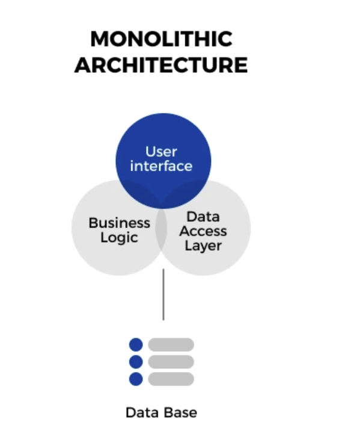
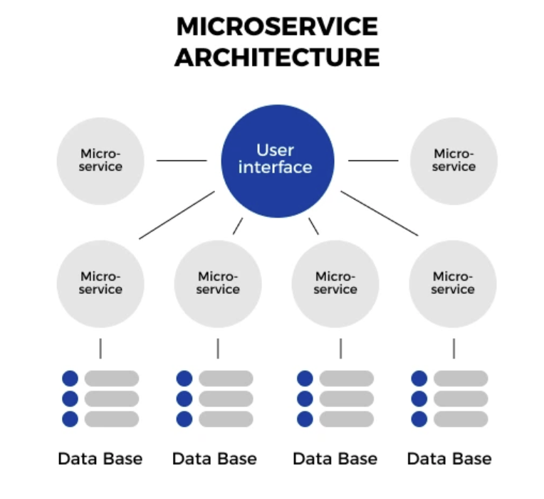
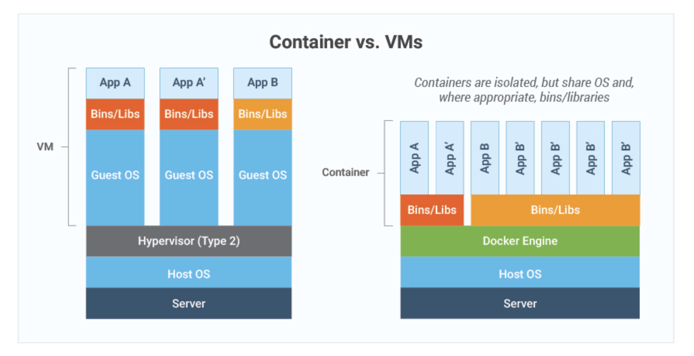

# #1 새로운 인프라 환경이 온다


## 컨테이너 인프라 환경이란

- 컨테이너 인프라 환경이란? => 컨테이너를 중심으로 구성된 인프라환경
- 컨테이너란? => 하나의 운영 체제 커널에서 다른 프로세스에 영향을 받지 않고 독립적으로 실행되는 프로세스 상태
- 컨테이너 인프라 환경을 이해하기 위해서 모놀리식 아키텍처와 마이크로서비스 아키텍처에 대한 이해가 필요하다.

### 모놀리식 아키텍처

- 모놀리식 아키텍처란? => 하나의 큰 목적이 있는 서비스 또는 애플리케이션에 여러 기능이 통합돼 있는 구조



- 모놀리식 아키텍처의 장점
  - 초기 단계에서 설계하기 용이
  - 개발이 단순
  - 코드관리가 간편
- 모놀리식 아키텍처의 단점
  - 서비스가 성장할수록 서비스간 관계가 복잡해짐
  - 서비스에서 이뤄진 수정이 연관된 다른 서비스에 영향을 미칠 가능성이 높음
  - 특정 서비스의 사용량이 높아진다고해서 개별로 스케일아웃 불가능.
- 모놀리식 아키텍처의 단점으로 마이크로서비스 아키텍처가 등장

### 마이크로서비스 아키텍처

- 마이크로서비스 아키텍처란? => 개별 기능을 하는 작은 서비스들이 각각 다른 호스트로 연결되어 있는 구조



- 마이크로서비스 아키텍처의 장점
  - 서비스 재사용성
  - 특정 서비스를 독립적으로 스케일아웃 가능
  - 서비스에서 이뤄진 수정이 연관된 다른 서비스에 영향을 미칠 가능성이 상대적으로 낮음
  - 서비스별로 필요한 DB 분리 가능
    - 뉴스 서비스는 NoSQL
    - 결제 서비스는 RDB
  - 개별 서비스에 대한 장애대처가 가능
- 마이크로서비스 아키텍처의 단점
  - 높은 복잡도
  - 높은 관리 포인트


### 컨테이너 인프라 환경에 적합한 아키텍처

- 마이크로서비스 아키텍처는 만능? => IT 세계에서는 대부분 정해진 답이 없다. 주어진 상황에 적합한 기술이 있을 뿐이다.
- 모놀리식 아키텍처로 구현을 시작했지만 시스템이 성장하고 기능이 늘어나면 마이크로서비스 아키텍처로 전환할 수 있다.


## 컨테이너 인프라 환경을 지원하는 도구

### 도커

- 도커는 컨테이너 환경에서 독립적으로 애플리케이션을 실행할 수 있도록 컨테이너를 만들고 관리하는 것을 도와주는 컨테이너 도구다.
- 도커로 애플리케이션을 실행하면 운영 체제 환경에 관계없이 독립적인 환경에서 일관된 결과를 보장한다.
- 도커와 비슷한 컨테이너 도구
  - Containerd, CRI-O, Podman

### 쿠버네티스

- 쿠버네티스는 컨테이너의 자동 배포와 배포된 컨테이너에 대한 동작 보증, 부하에 따른 동적 확장 등의 기능을 제공한다.
- 쿠버네티스와 비슷한 컨테이너 도구
  - Docker Swarm, Mesos, Nomad

### 젠킨스

- 젠킨스는 지속적 통합(CI) 와 지속적 배포(CD) 를 지원한다.
- 지속적 통합과 지속적 배포는 개발한 프로그램의 빌드, 테스트, 패키지화, 배포 단계를 모두 자동화해 개발 단계를 표준화한다.
- 젠킨스와 비슷한 도구
  - Bamboo, Github Actions, Teamcity


### 프로메테우스와 그라파나

- 프로메테우스는 상태 데이터를 수집하고 그라파나는 프로메테우스로 수집한 데이터를 관리자가 보기 좋게 시각화한다.
- 모니터링 데이터 수집 도구
  - DataDog, InfluxDB, New Relic
- 시각화 도구
  - Kibana, Chronograf


## 새로운 인프라 환경의 시작


# #2 테스트환경 구성하기


# #3 컨테이너를 다루는 표준 아키텍처, 쿠버네티스

- 컨테이너 인프라 환경이란? => 리눅스 운영 체제의 커널 하나에서 여러 개의 컨테이너가 격리된 상태로 실행되는 인프라 환경
- 컨테이너 인프라 환경의 장점
  - 각각 컨테이너의 설정을 통합하기 때문에 설정의 일관성을 높일 수 있다.
  - 운영체제 커널 하나에 컨테이너가 여러 개 격리된 형태로 실행되기 때문에 자원을 효율적으로 관리할 수 있고 거치는 단계가 적어서 속도도 빠르다.




> 가상화환경 vs 컨테이너 인프라 환경

- 쿠버네티스 등장 배경
  - 이미 가상화 환경에서 안정적으로 시스템을 운용하고 있었으나 컨테이너 환경이 등장
  - 늘어난 컨테이너를 관리해야하는데 기존의 컨테이너 관리 도구 (docker swarm, mesos) 들은 현업의 요구사항을 충족하기 부족
  - 구글이 자사 컨테이너 운영 플랫폼으로 운영하던 보그(Borg)를 기반으로하는 쿠버네티스를 2015년 7월 21일에 오픈소스로 공개
  - 이후 여러 기능이 추가되면서 쿠버네티스가 사실상 컨테이너 인프라 관리 솔루션의 표준이 됨

## 쿠버네티스 이해하기

- 쿠버네티스는 **컨테이너 오케스트레이션 솔루션**이다

- **컨테이너 오케스트레이션**이란?

  - 복잡한 단계를 관리하고 요소들의 유기적인 관계를 미리 정의해 손쉽게 사용하도록 서비스를 제공하는 것.
  - 다수의 컨테이너를 유기적으로 연결, 실행, 종료할 뿐만 아니라 상태를 추적하고 보존 하는 등 컨테이너를 안정적으로 사용할 수 있게 만들어주는 것.

  

### 왜 쿠버네티스일까?

- **docker swarm**
  - 간단하게 설치할 수 있지만 대규모 환경에서는 잘 사용하지 않는다.
- **mesos**
  - 아파치 오픈소스 프로젝트
  - 기능을 충분히 활용하려면 분산 관리 시스템과 연동해야 해서 부담이 있다.
- **nomad**
  - 해시코프사의 컨테이너 오케스트레이션 툴
  - 간단하게 설치할 수 있지만 기능이 부족하다.
  - 해시코프의 Consul, Vault와의 연동이 원활하기때문에 이런 도구에 대한 사용 성숙도가 높은 조직이라면 nomad 도입을 고려해볼 수 있다.
- **k8s**
  - 사실상 컨테이너 오케스트레이션 툴의 표준이기 때문에 다양한 도구들이 개발되고 있다.
  - 모든 벤더, 오픈소스 진영에서 k8s를 지원하고 그에 맞게 통합 개발하고 있다.
  - 컨테이너 오케스트레이션을 학습하거나 도입하려고 한다면 k8s를 우선적으로 고려해야 한다.


| 구분           | 도커 스웜   | 메소스      | 노매드    | 쿠버네티스    |
| -------------- | ----------- | ----------- | --------- | ------------- |
| 설치 난이도    | 쉬움        | 매우 어려움 | 쉬움      | 어려움        |
| 사용 편의성    | 매우 좋음   | 좋음        | 매우 좋음 | 좋음          |
| 세부 설저 지원 | 거의 없음   | 있음        | 거의 없음 | 다양하게 있음 |
| 안정성         | 매우 안정적 | 안정적      | 안정적    | 매우 안정적   |
| 확장성         | 어려움      | 매우 잘 됨  | 어려움    | 매우 잘 됨    |
| 정보량         | 많음        | 적음        | 적음      | 매우 많음     |
| 에코 파트너    | 없음        | 거의 없음   | 있음      | 매우 많음     |
| 학습 곡선      | 쉬움        | 매우 어려움 | 어려움    | 어려움        |


### 쿠버네티스 구성 방법

1. 퍼블릭 클라우드 업체에서 제공하는 관리형 쿠버네티스를 사용한다. (EKS, AKS, GKE) 학습용으로는 적합하지 않다.
2. 수세의 Ranchaer, 레드햇의 OpenShift와 같은 플랫폼에서 제공하는 설치형 쿠버네티스를 사용한다. 유료라서 쉽게 접근하기 어렵다.
3. 사용하는 시스템에 쿠버네티스 클러스터를 자동으로 구성해주는 솔루션을 사용한다. (kubeadm, kop, KRIB, kubespray) 이러한 솔루션들을 **구성형 쿠버네티스**라고한다.


### 쿠버네티스 구성하기

- 사용자 설정이 가장 많은 kubeadm을 사용해서 쿠버네티스를 구성

**Vagrantfile**

```ruby
# -*- mode: ruby -*-
# vi: set ft=ruby :

Vagrant.configure("2") do |config|
  N = 3 # max number of worker nodes
  Ver = '1.18.4' # Kubernetes Version to install

  #=============#
  # Master Node #
  #=============#

    config.vm.define "m-k8s" do |cfg|
      cfg.vm.box = "sysnet4admin/CentOS-k8s"
      cfg.vm.provider "virtualbox" do |vb|
        vb.name = "m-k8s(github_SysNet4Admin)"
        vb.cpus = 2
        vb.memory = 3072
        vb.customize ["modifyvm", :id, "--groups", "/k8s-SgMST-1.13.1(github_SysNet4Admin)"]
      end
      cfg.vm.host_name = "m-k8s"
      cfg.vm.network "private_network", ip: "192.168.1.10"
      cfg.vm.network "forwarded_port", guest: 22, host: 60010, auto_correct: true, id: "ssh"
      cfg.vm.synced_folder "../data", "/vagrant", disabled: true 
      cfg.vm.provision "shell", path: "config.sh", args: N
      cfg.vm.provision "shell", path: "install_pkg.sh", args: [ Ver, "Main" ]
      cfg.vm.provision "shell", path: "master_node.sh"
    end

  #==============#
  # Worker Nodes #
  #==============#

  (1..N).each do |i|
    config.vm.define "w#{i}-k8s" do |cfg|
      cfg.vm.box = "sysnet4admin/CentOS-k8s"
      cfg.vm.provider "virtualbox" do |vb|
        vb.name = "w#{i}-k8s(github_SysNet4Admin)"
        vb.cpus = 1
        vb.memory = 2560
        vb.customize ["modifyvm", :id, "--groups", "/k8s-SgMST-1.13.1(github_SysNet4Admin)"]
      end
      cfg.vm.host_name = "w#{i}-k8s"
      cfg.vm.network "private_network", ip: "192.168.1.10#{i}"
      cfg.vm.network "forwarded_port", guest: 22, host: "6010#{i}", auto_correct: true, id: "ssh"
      cfg.vm.synced_folder "../data", "/vagrant", disabled: true
      cfg.vm.provision "shell", path: "config.sh", args: N
      cfg.vm.provision "shell", path: "install_pkg.sh", args: Ver
      cfg.vm.provision "shell", path: "work_nodes.sh"
    end
  end

end
```

- Vagrantfile이란? => 베이그런트 프로비저닝을 위한 정보를 담고 있는 메인 파일
- 파일 설명
  - 5 line: 쿠버네티스에서 작업을 수행할 워커 노드의 수를 변수로 받는다.
  - 6 line: 쿠버네티스 버전을 사용자가 선택할 수 있도록 변수로 저장한다.
  - 25 line: arg: [ Ver, "Main" ] 으로 쿠버네티스 버전 정보(Ver)와 Main이라는 문자를 install_pkg.sh로 넘긴다.
  - 26,28 line: 쿠버네티스 마스터 노드를 위한 master_node.sh와 워커노드를 위한 work_nodes.sh 코드를 추가한다.

**config.sh**

```sh
#!/usr/bin/env bash

# vim configuration 
echo 'alias vi=vim' >> /etc/profile

# swapoff -a to disable swapping
swapoff -a
# sed to comment the swap partition in /etc/fstab
sed -i.bak -r 's/(.+ swap .+)/#\1/' /etc/fstab

# kubernetes repo
gg_pkg="packages.cloud.google.com/yum/doc" # Due to shorten addr for key
cat <<EOF > /etc/yum.repos.d/kubernetes.repo
[kubernetes]
name=Kubernetes
baseurl=https://packages.cloud.google.com/yum/repos/kubernetes-el7-x86_64
enabled=1
gpgcheck=0
repo_gpgcheck=0
gpgkey=https://${gg_pkg}/yum-key.gpg https://${gg_pkg}/rpm-package-key.gpg
EOF

# Set SELinux in permissive mode (effectively disabling it)
setenforce 0
sed -i 's/^SELINUX=enforcing$/SELINUX=permissive/' /etc/selinux/config

# RHEL/CentOS 7 have reported traffic issues being routed incorrectly due to iptables bypassed
cat <<EOF >  /etc/sysctl.d/k8s.conf
net.bridge.bridge-nf-call-ip6tables = 1
net.bridge.bridge-nf-call-iptables = 1
EOF
modprobe br_netfilter

# local small dns & vagrant cannot parse and delivery shell code.
echo "192.168.1.10 m-k8s" >> /etc/hosts
for (( i=1; i<=$1; i++  )); do echo "192.168.1.10$i w$i-k8s" >> /etc/hosts; done

# config DNS  
cat <<EOF > /etc/resolv.conf
nameserver 1.1.1.1 #cloudflare DNS
nameserver 8.8.8.8 #Google DNS
EOF


```

- 파일 설명
  - 4 line: vi를 호출하면 vim을 호출하도록 프로파일에 입력한다.
  - 7,9 line: 쿠버네티스의 설치 요구 조건을 맞추기 위해 스왑되지 않도록 설정한다.
  - 12~21 line: 쿠버네티스를 내려받을 리포지터리를 설정하는 구문
  - 24~25 line: selinux가 제한적으로 사용되지 않도록 permissive 모드로 변경
  - 28~31 line: 브리지 네트워크를 통과하는 IPv4와  IPv6의 패킷을  iptables가 관리하게 설정한다.
  - 32 line: br_netfilter 커널 모듈을 사용해 브리지로 네트워크를 구성한다. IP마스커레이드(커널에서 제공하는 NAT 개념)를 사용해 내부 네트워크와 외부 네트워크를 분리한다.
  - 35~36 line: 쿠버네티스 안에서 노드 간 통신을 이름으로 할 수 있도록 각 호스트의 호스트 이름과 IP를 /etc/hosts에 설정한다.
  - 39~42 line: 외부와 통신할 수 있게 DNS 서버를 지정한다.

**install_pkg.sh**

```sh
#!/usr/bin/env bash

# install packages 
yum install epel-release -y
yum install vim-enhanced -y
yum install git -y

# install docker 
yum install docker -y && systemctl enable --now docker

# install kubernetes cluster 
yum install kubectl-$1 kubelet-$1 kubeadm-$1 -y
systemctl enable --now kubelet

# git clone _Book_k8sInfra.git 
if [ $2 = 'Main' ]; then
  git clone https://github.com/sysnet4admin/_Book_k8sInfra.git
  mv /home/vagrant/_Book_k8sInfra $HOME
  find $HOME/_Book_k8sInfra/ -regex ".*\.\(sh\)" -exec chmod 700 {} \;
fi

```

**master_node.sh**

```sh
#!/usr/bin/env bash

# init kubernetes 
kubeadm init --token 123456.1234567890123456 --token-ttl 0 \
--pod-network-cidr=172.16.0.0/16 --apiserver-advertise-address=192.168.1.10 

# config for master node only 
mkdir -p $HOME/.kube
cp -i /etc/kubernetes/admin.conf $HOME/.kube/config
chown $(id -u):$(id -g) $HOME/.kube/config

# config for kubernetes's network 
kubectl apply -f \
https://raw.githubusercontent.com/sysnet4admin/IaC/master/manifests/172.16_net_calico.yaml
```

- 파일 설명
  - 4~5 line: kubeadm을 통해 쿠버네티스의 워커 노드를 받아들일 준비를 한다. 토큰을 생성하고 쿠버네티스가 자동으로 컨테이너에 부여하는 네트워크를 172.16.0.0/16 (172.16.0.1 ~ 172.16.255.254)로 제공하고 워커노드가 접속하는 API서버의 IP를 192.168.1.10으로 지정해 워커 노드들이 자동으로 API 서버에 연결되도록 한다.
  - 13~14 line: 컨테이너 네트워크 인터페이스인 캘리코의 설정을 적용해 쿠버네티스의 네트워크를 구성한다.

**worker_node.sh**

```sh
#!/usr/bin/env bash

# config for work_nodes only 
kubeadm join --token 123456.1234567890123456 \
             --discovery-token-unsafe-skip-ca-verification 192.168.1.10:6443
```

- 파일 설명
  - 4~5 line: kubeadm을 통해 쿠버네티스 마스터 노드에 접속한다. 마스터 노드에서 생성한 토큰을 사용하고 간단한 구성을 위해 `discovery-token-unsafe-skip-ca-verification` 옵션을 으로 인증을 무시한다. 


```
# vagrant 로 쿠버네티스 클러스터 자동 구성하기
vagrant up

vagrant ssh m-k8s

# 노드 확인하기
kubectl get nodes
```


### 파드 배포를 중심으로 쿠버네티스 구성 요소 살펴보기

```
# 모든 네임스페이스에서 파드를 수집해서 보여준다.
kubectl get pods --all-namespaces
```


> 쿠버네티스 구성 요소의 이름 생성 규칙
>
> - 쿠버네티스의 구성 요소는 동시에 여러 개가 존재하는 경우 중복된 이름을 피하려고 뒤에 해시코드가 삽입된다.
>
> ```
> kubectl get pods --all-namespaces | grep kube-proxy
> ```
>
> 


**관리자나 개발자가 파드를 배포할 때**

사진


**마스터 노드**

- kubectl(0)
  - 쿠버네티스 클러스터에 명령을 내리는 역할
  - 바이너리로 배포되기 때문에 반드시 마스터노드에 있을 필요는 없다.
- API 서버(1)
  - 쿠버네티스 클러스터의 중심 역할을 하는 통로
  - 모든 요소들이 API 서버를 중심에 두고 통신하므로  API 서버의 역할이 매우 중요하다.
- ectd(2)
  - 구성 요소들의 상태 값이 모두 저장되는 공간
  - ectd의 정보만 백업되어 있다면 긴급한 장애 상황에도 쿠버네티스 클러스터를 복구할 수 있다.
  - ectd는 분산 저장이 가능한 key-value 저장소이므로 이중화시켜놓으면 시스템의 가용성을 확보할 수 있다 =>  멀티 마스터 노드는 kubespray로!
- 컨트롤러 매니저(3)
  - 쿠버네티스 클러스터의 오브젝트 상태를 관리
  - 노드 컨트롤러, 레플리카 컨트롤러, 엔드포인트 컨트롤러와 같은 다양한 상태 값을 관리하는 주체들이 컨트롤러 매니저에 소속돼 각자의 역할을 수행한다.
- 스케줄러(4)
  - 노드의 상태와 자원, 레이블, 요구 조건 등을 고려해 파드를 어떤 워커 노드에 생성할 것인지를 결정하고 할당한다.


**워커 노드**

- kubelet(5)
  - 파드의 구성 내용을 받아서 컨테이너 런타임으로 전달하고 파드 안의 컨테이너들이 정상적으로 작동하는지 모니터링한다.
- 컨테이너 런타임(6)
  - 파드를 이루는 컨테이너의 실행을 담당
- 파드(7)
  - 한 개 이상의 컨테이너로 단일 목적의 일을 하기 위해서 모인 단위
  - 파드는 **언제라도 죽을 수 있는 존재**

**선택 가능한 구성 요소**

- 네트워크 플러그인(11)
  - 쿠버네티스 클러스터의 통신을 위해서 네트워크 플러그인을 선택하고 구성해야 한다.
  - 캘리코, 플래널, 실리움, 큐브 라우터, 로마나 등등 ...
- CoreDNS(12)
  - 클라우드 네이티브 컴퓨팅 재단에서 보증하는 프로젝트
  - 빠르고 유연한 DNS 서버

> 컨테이너 네트워크 인터페이스(CNI)
>
> - 클라우드 네이티브 컴퓨팅 재단의 프로젝트
> - 컨테이너 네트워크 안정성과 확장성을 보장하기 위해 개발
> - Calico(L3), Flannel(L2), 다양한 네트워크 프로토콜(BGP, VXLAN, ACL)을 지원하고 있어 설계 유연성이 매우 높다.


**사용자가 배포된 파드에 접속할 때**

- kube-proxy: 쿠버네티스 클러스터는 파드가 위치한 노드에 kube-proxy를 통해 파드가 통신할 수 있는 네트워크를 설정한다. 이때 실젱 통신은 br_netfliter와  iptables로 관리한다.
- 파드: 이미 배포된 파드에 접속하고 필요한 내용을 전달받는다.

### 파드의 생명주기로 쿠버네티스 구성요소 살펴보기

- 쿠버네티스의 장점
  - 쿠버네티스의 구성 요소마다 하는 일이 명확하게 구분돼 각자의 역할만 충실하게 수행하면 클러스터 시스템이 안정적으로 운영된다.
  - 어느 부분에서 문제가 발생했는지 디버깅하기 쉽다.


사진

1. kubectl을 통해  API 서버에 파드 생성을 요청한다.
2. API서버에 전달된 내용이 있으면 API 서버는 ectd에 전달된 내용을 모두 기록해 클러스터의 상태 값을 최신으로 유지한다.
3. API 서버에 파드 생성이 요청된 것을 컨트롤러 매니저가 인지하면 컨트롤러 매니저는 파드를 생성하고 이 상태를 API 서버에 전달한다. (이때아직 어디 워커노드에 파드를 적용할지는 결정되지 않음)
4. API 서버에 파드가 생성됐다는 정보를 스케줄러가 인지한다. 그리고 스케줄러가 조건에 맞는 워커노드를 골라 해당 워커노드에 파드를 띄우도록 요청한다.
5. API 서버에 전달된 정보대로 지정한 워커 노드에 파드가 속해 이쓴ㄴ지 스케줄러가  kubelet으로 확인한다.
6. kubelet에서 컨테이너 런타임으로 파드 생성을 요청한다.
7. 파드가 생성되고 실행 가능한 상태가 된다.


- 쿠버네티스는 선언적인 시스템 구조다 => 각 요소가 추구하는 상태를 선언하면 현재 상태와 맞는지 점검하고 그것에 맞추려고 노력하는 구조
  - 추구하는 상태를  API 서버에 선언하면 다른 요소들이 API 서버에 와서 현재 상태와 비교하고 그에 맞게 상태를 변경하려고 한다.
  - API의 상태를 저장하는 곳은? => etcd. API 서버와 etcd는 한몸처럼 움직이도록 설계됐다.


### 쿠버네티스 구성 요소의 기능 검증하기


**kubectl**

- kubectl이 어디에 있더라도 API 서버의 접속 정보만 있다면 어느 곳에서든 쿠버네티스 클러스터에 명령을 내릴 수 있다.

```
vagrant ssh w3-k8s

# 파드 정보 확인
kubectl get pods

#scp로 쿠버네티스 클러스터 정보 copy
scp root@192.168.1.10:/etc/kubernetes/admin.conf .

# 노드 정보 확인
kubectl get nodes --kubeconfig admin.conf
```

**kubelet**

- kubelet은 쿠버네티스에서 파드의 생성과 상태 관리 및 복구 등을 담당하는 매우 중요한 구성 요소다.
- kubelet에 문제가 생기면 파드가 정상적으로 관리되지 않는다.

```
kubectl create -f ./nginx-pod.yaml

# 파드 정보 확인
kubectl get pods

# 파드의 더 다양한 정보 확인
kubectl get pods -o wide

# 워커 노드에서 kubelet 종료하기
systemctl stop kubelet

# 마스터노드에서 파드 삭제하기 but kubelet이 종료되었기 때문에 삭제되지 않는다.
kubectl delete pod nginx-pod

# 워커 노드에서 kubelet 복구하기
systemctl start kubelet

# 파드 정보 확인
kubectl get pods

```


**kube-proxy**

- kube-proxy는 파드의 통신을 담당한다.


## 쿠버네티스 기본 사용법 배우기

- 쿠버네티스를 사용하는 것 => 사용자에게 효과적으로 파드를 제공한다는 것

### 파드를 생성하는 방법

- 

### 오브젝트란

**기본 오브젝트**

- 파드
  - 쿠버네티스에서 실행되는 최소 단위
  - 독립적인 공간과 사용 가능한 IP를 갖고 있다.
  - 하나의 파드는 1개 이상의 컨테이너를 갖고 있다.
- 네임스페이스
  - 쿠버네티스 클러스터에서 사요오디는 리소스들을 구분해 관리하는 그룹
  - 특별히 지정하지 않으면  default
  - 쿠버네티스 시스템에서 사용하는 kube-system 등등 이 있다.
- 볼륨
  - 파드가 생성될 때 파드에서 사용할 수 있는 디렉터리를 제공
- 서비스
  - 쿠버네티스 외부에서 쿠버네티스 내부로 접속할 때 논리적으로 연결해주는 서비스
  - 파드는 **언제라도 죽을 수 있는 존재**라서 접속 정보가 고정일 수 없다. 따라서 서비스를 통해 내/외부로 연결된다.
  - 서비스는 새롭게 파드가 생성될때 부여되는 IP를 기존에 제공하던 기능과 연결해준다.


**그 외 오브젝트**

- 기본 오브젝트 외에도 디플로이먼트, 데몬셋, 컨피그맵, 레플리카셋, PV, PVC, 스테이트풀셋 이 있다.
- 디플로이먼트
  - 쿠버네티스에서 가장 많이 쓰이는 오브젝트
  - 레플리카셋 오브젝트를 합쳐 놓은 형태


사진

사진

```
kubectl create deployment dpy-hname --image=sysnet4admin/echo-hname

kubectl get pods

kubectl delete deployment dpy-hname

kubectl get pods
```


### 레플리카셋으로 파드 수 관리하기

- 여러개의 파드를 생성하고 싶을땐? => 레플리카셋 오브젝트
- 레플리카셋은 파드 수를 보장하는 기능만 제공하기 때문에 롤링 업데이트 기능 등이 추가된 디플로이먼트를 사용해 파드 수를 관리하는 것을 권장한다.


그림


```
kubectl get pods

kubectl scale pod nginx-pod --replicas=3

kubectl scale deployment dpy-ngginx --replicas=3

kubectl get pods

kubectl get pods -o wide


```


### 스펙을 지정해 오브젝트 생성하기

- 디플로이먼트를 생성하면서 한꺼번에 여러 개의 파드를 만들려면? => **오브젝트 스펙**을 만든다.
- 오브젝트 스펙은 일반적으로 yaml 문법으로 작성한다.

```yaml
apiVersion: apps/v1
kind: Deployment
metadata:
  name: echo-hname
  labels:
    app: nginx
spec:
  replicas: 3
  selector:
    matchLabels:
      app: nginx
  template:
    metadata:
      labels:
        app: nginx
    spec:
      containers:
      - name: echo-hname
        image: sysnet4admin/echo-hname
```

- apiVersion: 오브젝트를 포함하는 API의 버전
- kind: apps/v1(apiVersion) 에서 제공하는 Deployment라는 오브젝트를 사용
- replicas: 몇 개의 파드를 생성할지 설정
- image: 사용되는 이미지

> 사용 가능한 api version 확인하기
>
> ```
> kubectl api-versions
> ```
>
> 


사진


```
kubectl create -f ./echo-hname.yaml

kubectl get pods

# 파드를 3개에서 6개로 늘리기
sed -i 's/replicas: 3/replicas: 6' ./echo-hname.yaml

kubectl apply -f ./echo-hname.yaml
```


### apply로 오브젝트 생성하고 관리하기

- kubectl run => 단일 파드만 생성 가능
- kubectl create => 파일로 생성할 수 있지만 파일의 변경사항을 적용할 수 없음
- kubectl apply => 파일로 생성할 수 있고 파일의 변경사항도 적용할 수 있음


| 구분        | run       | create    | apply           |
| ----------- | --------- | --------- | --------------- |
| 명령 실행   | 제한적임  | 가능함    | 안 됨           |
| 파일 실행   | 안 됨     | 가능함    | 가능함          |
| 변경 가능   | 안 됨     | 안 됨     | 가능함          |
| 실행 편의성 | 매우 좋음 | 매우 좋음 | 좋음            |
| 기능 유지   | 제한적임  | 지원됨    | 다양하게 지원됨 |

- 따라서 일회적 사용에는 create를 사용하고 변경이 생길 가능성이 있는 복잡한 오브젝트는 파일로 작성한 후  apply로 생성&적용하는게 좋다.


### 파드의 컨테이너 자동 복구 방법

- 쿠버네티스는 거의 모든 부분이 자동 복구되도록 설계 됐다.
- 파드의 자동 복구 기술 => **셀프 힐링**
  - 제대로 작동하지 않는 컨테이너를 다시 시작하거나 교체해 파드가 정상적으로 작동하게 한다.

```
# 파드 ip 확인
kubectl get pods -o wide

# 파드 셸에 접속
kubectl exec -it nginx-pid -- /bin/bash

# nignx pid 확인
cat /run/nginx.pid

# 프로세스 생성 시간 확인
ls -I /run/nginx.pid

# nginx의 상태 확인하기
i=1; while true; do sleep 1; echo $((i++)) `curl --silent 172.16.103.132 | grep title`; done

# nginx 죽이기
kill 1

# 프로세스 생성 시간 확인
ls -I /run/nginx.pid

```


### 파드의 동작 보증 기능

- 쿠버네티스는 파드 자체에 문제가 발생하면 파드를 자동 복구해서 파드가 항상 동작하도록 보장하는 기능이 있다


```
kubectl get pods

kubectl delete pods ...

kubectl get pods
```

- 왜 삭제해도 파드수를 유지할까? => 이유는 echo-hname이 디플로이먼트에 속한 파드이기 때문
- replicas는 파드를 선언한 수대로 유지하도록 파드의 수를 항상 확인하고 부족하면 새로운 파드를 만들어낸다.

사진

- 디플로이먼트에 속한 파드를 삭제하고싶다면? => 상위 디플로이먼트를 삭제해야 파드가 삭제된다.

```
kubectl delete deployment echo-hname

kubectl get pods
```


### 노드 자원 보호하기

- 노드란? => 쿠버네티스 스케줄러에서 파드를 할당받고 처리하는 역할을 한다.
- 쿠버네티스는 모든 노드에 균등하게 파드를 할당하려고하는데 만약 특정 노드에 문제가 생겼거나 생길 것 같다면? => **cordon** 기능을 사용한다.

```
kubectl apply -f ./echo-hname.yaml

kubectl scale deployment echo-hname --replicas=9

# 노드 및 기타정보 확인하기
kubectl get pods \
-o=custom-columns=NAME: .metadata.name,IP:.status.podIP,STATUS:.status.phase,NODE:.spec.nodeName

kubectl scale deployment echo-hname --replicas=3

kubectl get pods \
-o=custom-columns=NAME: .metadata.name,IP:.status.podIP,STATUS:.status.phase,NODE:.spec.nodeName

kubectl cordon w3-k8s

kubectl get nodes

kubectl scale deployment echo-hname --replicas=9

kubectl get pods \
-o=custom-columns=NAME: .metadata.name,IP:.status.podIP,STATUS:.status.phase,NODE:.spec.nodeName

kubectl uncordon w3-k8s

kubectl get nodes
```


### 노드 유지보수하기

- 쿠버네티스를 사용하면서 정기, 비정기적인 유지보수를 위해 노드를 꺼야 하는 상황이 발생한다면? =? **drain** 기능을 사용한다.


```
# drain 적용하기, 데몬셋때문에 실패
kubectl drain w3-k8s

# drain 적용하기, 데몬셋 무시
kubectl drain w3-k8s --ignore-daemonsets

# w3-k8s 노드에 파드가 없는 것 확인
kubectl get pods \
-o=custom-columns=NAME: .metadata.name,IP:.status.podIP,STATUS:.status.phase,NODE:.spec.nodeName

# 노드 확인
kubectl get nodes

kubectl uncordon w3-k8s

kubectl get nodes
```


### 파드 업데이트하고 복구하기

**파드 업데이트 하기**


```
# record 옵션으로 디플로이먼트 생성
kubectl apply -f ./rollout-nginx.yaml --record

# record 옵션으로 기록된 히스토리는 rollout history 명령을 실행해서 확인 가능
kubectl rollout history deployment rollout-nginx

# 파드 정보 확인
kubectl get pods \
-o=custom-columns=NAME: .metadata.name,IP:.status.podIP,STATUS:.status.phase,NODE:.spec.nodeName

# nginx 버전 확인
curl -I --silent 172.16.103.143 | grep Server

# nginx 이미지 업데이트
kubectl set image deployment rollout-nginx nginx=nginx:1.16.0 --record

# 파드 정보 확인
kubectl get pods \
-o=custom-columns=NAME: .metadata.name,IP:.status.podIP,STATUS:.status.phase,NODE:.spec.nodeName

# deployment 상태 확인
kubectl rollout status deployment rollout-nginx

kubectl rollout history deployment rollout-nginx

curl -I --silent 172.16.132.10 | grep Server
```


**업데이트 실패 시 파드 복구하기**

```
# 잘못된 버전 입력
kubectl set image deployment rollout-nginx nginx=nginx:1.17.23 --record

# 파드 정보 확인
kubectl get pods \
-o=custom-columns=NAME: .metadata.name,IP:.status.podIP,STATUS:.status.phase,NODE:.spec.nodeName

# deployment 상태 확인
kubectl rollout status deployment rollout-nginx

# deployment를 생성하려고 여러번 시도했지만 끝내 생성되지 않았다는 메시지
kubectl rollout status deployment rollout-nginx

# describe로 확인
kubectl describe deployment rollout-nginx

# 히스토리 확인
kubectl rollout history deployment rollout-nginx

# 마지막단계 취소하기
kubectl rollout undo deployment rollout-nginx

# 파드 정보 확인
kubectl get pods \
-o=custom-columns=NAME: .metadata.name,IP:.status.podIP,STATUS:.status.phase,NODE:.spec.nodeName

# 히스토리 확인
kubectl rollout history deployment rollout-nginx
```


**특정 시점으로 파드 복구하기**

```
# revision 1로 복구
kubectl rollout undo deployment rollout-nginx --to-revision=1

# 파드 정보 확인
kubectl get pods \
-o=custom-columns=NAME: .metadata.name,IP:.status.podIP,STATUS:.status.phase,NODE:.spec.nodeName
```


## 쿠버네티스 연결을 담당하는 서비스

## 알아두면 쓸모 있는 쿠버네티스 오브젝트