# 가장 면접 사례로 배우는 대규모 시스템 설계 기초

# #1 사용자 수에 따른 규모 확장성

## 단일서버

- 단일 서버만 있을때 일반적인 사용자의 요청 처리 흐름
  1. 도메인 이름을 이용해서 웹사이트에 접속함. 이 접속을 위해서 dns server에 질의해서 ip주소로 변환함. 우리 시스템의 일부는 아님
  2. dns 조회 결과로 ip주소가 반환됨
  3. 해당 ip주소로 http 요청이 전달됨
  4. 요청을 받은 웹 서버는 html 페이지나 json 형태의 응답을 반환함

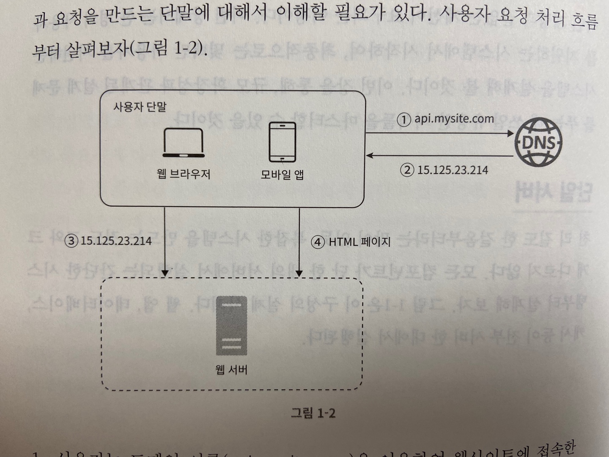

## 데이터베이스

- 사용자가 늘면 서버 하나로는 충분하지 않아서 여러 서버를 두어야함

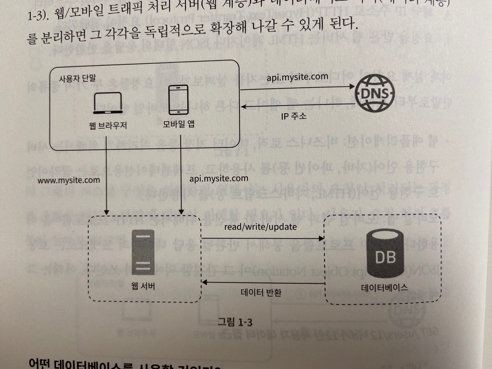

### 어떤 데이터베이스를 사용할 것인가?

- 전통적인 관계형 db와 비-관계형 db사이에서 고를 수 있음
- 관계형 db
  - mysql, oracle, postgresql
  - 자료를 테이블과 열, 칼럼으로 표현함
  - sql 사용
- 비-관계형 db
  - CouchDB, Neo4j, Cassandra, HBase, Amazon DynamoDB ...
  - 키-값 저장소
  - 그래프 저장소
  - 칼럼 저장소
  - 문서 저장소
- 아래와 같은 경우에 비-관계형 데이터베이스가 바람직한 선택일 수 있음
  1. 아주 낮은 응답 지연시간이 요구됨
  2. 다루는 데이터가 비정형이라 관계형 데이터가 아님
  3. 데이터를 직렬화하거나 역직렬화 할 수 있기만 하면 됨
  4. 아주 많은 양의 데이터를 저장할 필요가 있음

## 수직적 규모 확장 vs 수평적 규모 확장

- 스케일업
  - 수직적 규모 확장
  - 서버에 고사양 자원을 추가하는 행위 ex cpu, ram
  - 장점은 단순함
  - 단점은 규모 확장에 한계까 있고 cpu, 메모리를 무한대로 증설할 수 없음
  - 장애에 대한 자동복구(failover) 다중화 방안을 제안하지 않음. 서버에 장애가 발생한다면 웹사이트/앱은 완전히 중단됨
  - 대규모 애플리케이션을 지원하는 데는 수평적 규모 확장법을 사용해야함
- 스케일아웃
  - 수평적 규모 확장
  - 더 많은 서버를 추가 하는 행위
- 너무 많은 사용자가 접근하거나 웹사이트가 다운된다면 접속이 불가능해질 수 있는데 이런 문제를 해결하는 데는 부하 분산기 또는 로드 밸런서를 도입하는 것이 최선임

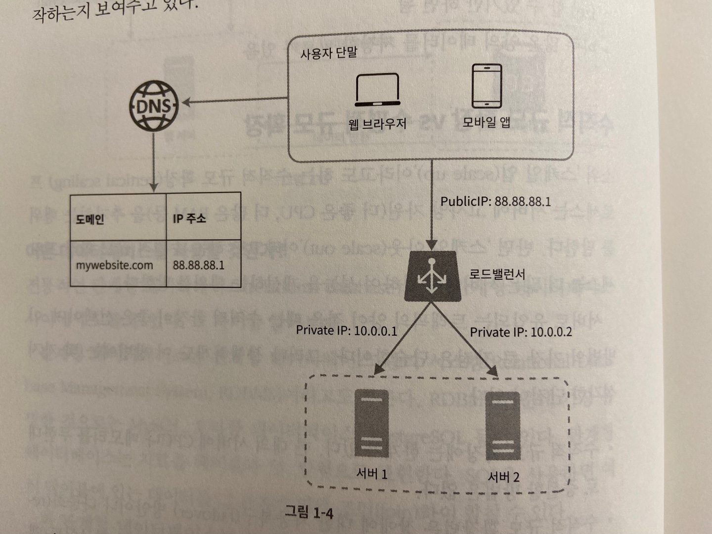

- 웹 서버는 클라의 접속을 직접 처리하지 않음
- 보안을 위해 서버간 통신에는 사설 ip주소가 이용됨
- 장애를 자동복구하지 못하는 문제는 해소되고 웹 계층의 가용성은 향상됨
  - 서버 1이 다운되면 모든 트래픽은 서버 2로 전송됨 (failover)
  - 웹 사이트로 유입되는 트래픽을 로드밸런서가 분산시켜줌

### 데이터베이스 다중화

- master-slave 관계
  - 쓰기 연산은 master에서만 지원
  - slave는 master에게서 사본을 전달 받으며 읽기 연산만을 지원함
- 대부분은 앱은 읽기 연산이 쓰기보연산보다 비중이 높음
- 데이터베이스 다중화의 이점
  - 더 나은 성능: 읽기와 쓰기의 역할을 나눔으로 병렬로 처리될 수 있는 질의의 수가 늘어남
  - 안전성: 데이터베이스 서버의 일부가 파괴되더라도 데이터는 보존됨
  - 가용성: 하나의 db에 장애가 발생하더라도 계속 서비스 가능
- slave는 master의 후보가 되기 때문에 master가 죽으면 slave가 master로 승격될 수 있음

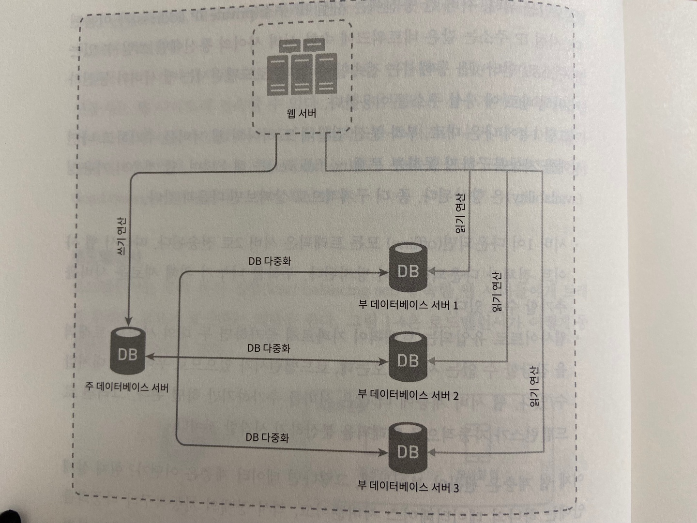

설계안은 다음과 같이 동작함

- 사용장는 dns로부터 lb의 공개 ip주소를 받음
- 사용자는 해당 ip 주소를 사용해 lb에 접속
- http 요청은 서버1. or 서버 2로 전달
- 웹 서버는 사용자의 데이터를 부 데이터베이스 서버에서 읽음
- 웹 서버는 데이터 변경 연산은 주 데이터베이스로 전달함. 데이터 추가, 삭제, 갱신 연산 등이 이에 해당

## 캐시

- 응답 시간은 캐시를 붙이고 정적 콘텐츠를 콘텐츠 전송 네트워크 (cdn)로 옮기면 개선할 수 있음
- 캐시는 값비싼 연산 결과 또는 자주 참조되는 데이터를 메모리 안에 두고 뒤이은 요청이 보다 빨리 처리될 수 있도록 하는 저장소

### 캐시 계층

- 캐시 계층은 데이터가 잠시 보관되는 곳. db보다 훨씬 빠름
- 성능 개선 뿐만 아니라 db의 부하를 줄일 수 있음
- 주도형 캐시 전략
  - 캐시에 있으면 return, 없으면 db에서 읽고 캐싱후 리턴

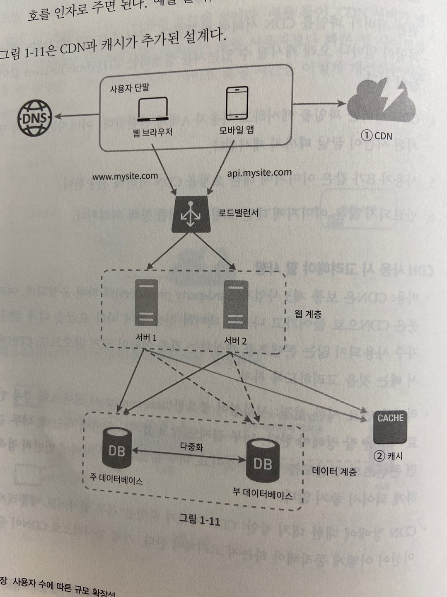

### 캐시 사용시 유의할 점

- 캐시는 어떤 상황에 바람직한가?
  - 데이터 갱신은 자주 일어나지 않지만 참조는 빈번하게 일어나는 경우
- 어떤 데이터를 캐시에 두어야 하는가?
  - 영속적으로 보관할 데이터를 캐시에 두는것은 적합하지 않음
  - 휘발성 데이터만
- 캐시에 보관된 데이터는 어떻게 만료되는가?
  - 만료기한을 적절하게 잘 설정하는 것이 중요함
- 일관성은 어떻게 유지되는가?
  - 저장소의 원본을 갱신하는 연산과 캐시를 갱신하는 연산이 단일 트랜잭션으로 처리되어야함
- 장애에는 어떻게 대처할 것인가?
  - 캐시 서버를 한대만 두는 경우는 해당 서버는 단일 장애 지점(SPOF)이 될 가능성이 있음
  - 캐시 서버를 분산시켜야함
- 캐시 메모리를 얼마나 크게 잡을 것인가?
  - 메모리가 너무 작다면 캐시의 성능이 떨어지게됨
  - 이를 막을 방법은 캐시 메모리를 과할당하는 것 <- 좋은건가 ..?
- 데이터 방출(eviction) 정책은 무엇인가?
  - LRU, LFU, FIFO 등등... 경우에 맞게 적용해야함

## 콘텐츠 전송 네트워크(CDN)

- CDN은 정적 콘텐츠를 전송하는데 쓰이는 지리적으로 분산된 서버의 네트워크
- 이미지, 비디오, CSS, Javascript 파일 등을 캐시할 수 있음
- 동적 컨텐츠를 캐시할 수 있음. Amazon CloudFront Dynamic Content Delivery
- CDN은 요청하는 사용자에게 가장 물리적으로 가까운 CDN 서버가 정적 콘텐츠를 전달함
- CDN 동작 흐름
  - 사용자 a가 이미지 url 을 이용해 image.png에 접근
  - cdn 서버의 캐시에 해당 이미지가 없다면 원본 서버에 요청해서 파일을 가져옴. 웹서버 or S3 etc ...
  - 원본 서버가 파일을 CDN 서버에 반환함. http 헤더에는 TTL값이 있음.
  - cdn 서버는 파일을 캐시하고 사용자 a에게 반환 TTL 값만큼 서버에 살아있음
  - 사용자 B가 같은 이미지에 대한 요청을 cdn에게 요청
  - 만료되지 않은 이미지에 대한 요청은 캐시를 통해 처리됨

### CDN 사용 시 고려해야 할 사항

- 비용

- 적절한 만료 시한 설정

- cdn 장애에 대한 대처 방안

- 콘텐츠 무효화 방법

  - 만료되지 않더라도 아래 방법 가운데 하나를 쓰면 cdn에서 제거할 수 있음
    - cdn 서비스 사업자가 제공하는 api를 이용해서 콘텐츠 무효화
    - 콘텐츠의 다른 버전을 서비스하도록 오브젝트 버저닝이용. ex image.png?v=2

  

## 무상태(stateless) 웹 계층

- 웹 계층을 수평적으로 확장하기 위해서는 상태 정보(ex 세션)을 웹 계층에서 제거해야함
- 바람직한 전략은 상태 정보를 관계형 데이터베이스나 nosql에 보관하고 필요할 떄 가져오도록 하는 것

### 상태 정보 의존적인 아키텍처

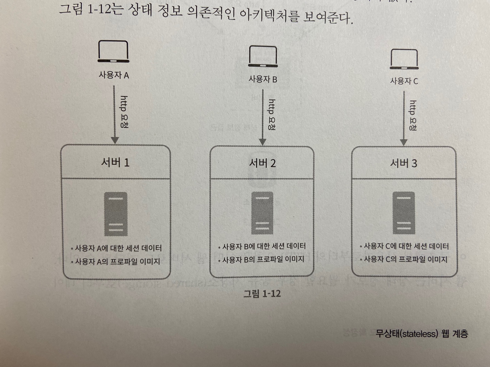

- 상태 정보 의존적인 아키텍처는 같은 클라의 오청은 항상 같은 서버로 전송되어야 한다는 것.
- 대부분의 lb가 이를 지원하기 위해 고정 세션을 제공하지만 lb에 부담이되고 까다로워짐

### 무상태 아키텍처

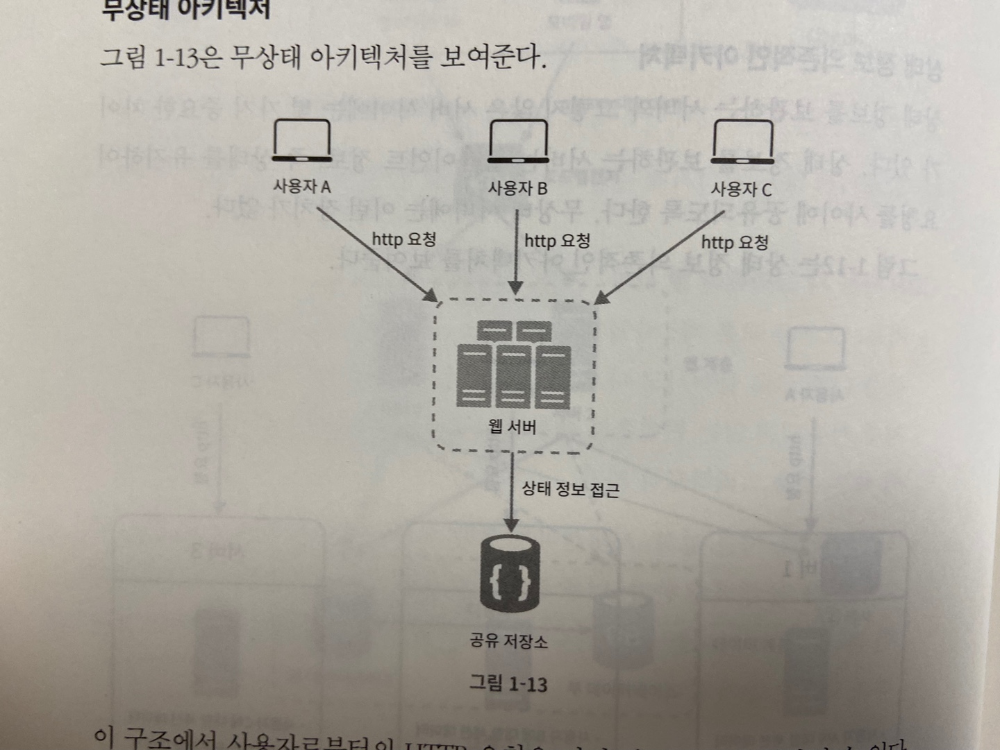

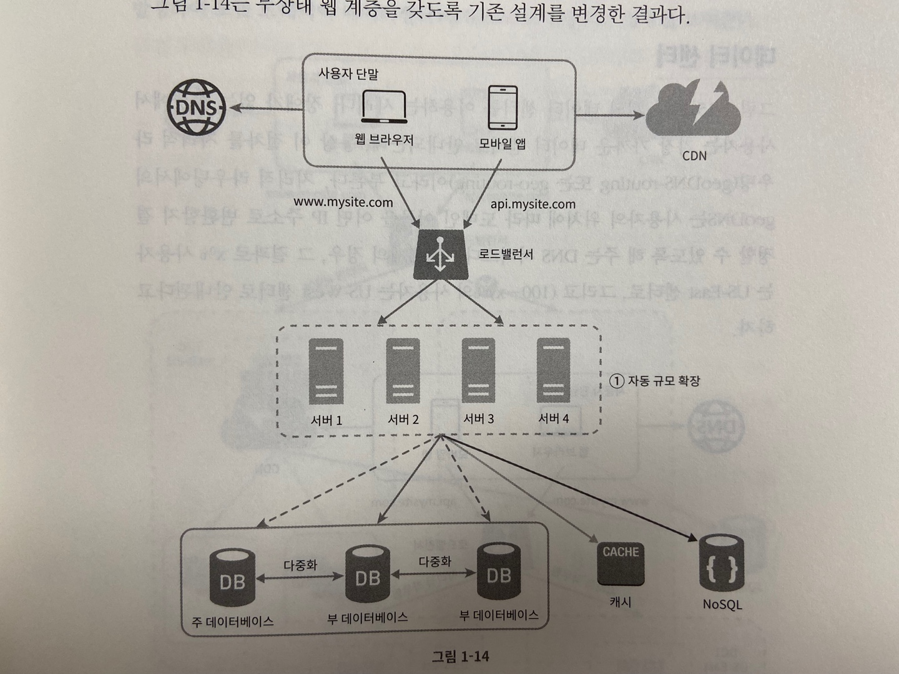

- 상태 정보가 웹 서버로부터 물리적으로 분리됨
- 이 저장소는 rdb, nosql일 수 있음

## 데이터 센터

- 장애가 없는 상황에서 사용자는 가장 까까운 데이터 센터로 안내됨. 통상 이 절차를 지리적 라우팅이라고 부름
- geoDNS는 사용자의 위치에 따라 도메인 이름을 어떤 ip 주소로 변환할지 결정할 수 있도록 해주는 dns 서비스임
- 다중 데이터 센터를 만들때 몇가지 기술적 난제
  - 트래픽 우회: 데이터 센터로 트래픽을 보내는 효과적인 방법을 찾아야함
  - 데이터 동기화: 데이터 센터마다 별도의 데이터베이스를 사용하고 있다면 여러 데이터 센터의 데이터를 모두 동기화해야함
  - 테스트와 배포: 자동화된 배포도구, 테스트가 중요함

## 메시지 큐

- mq는 메시지의 무손실을 보장하는 비동기 통신을 지원하는 컴포넌트
- 메시지의 버퍼역할을 하고 비동기적으로 전송함.
- 생산자/발행자는 메시지를 만들어서 큐에 발행함
- 소비자/구독자는 메시지를 받아 알맞은 동작을 수행함
- mq를 이용하면 서비스 또는 서버 간 결합이 느슨해져서 규모 확장성이 보장되어야 하는 안정적 애플리케이션을 구성하기 좋음

## 로그, 메트릭 그리고 자동화

- 로그
  - 에러 로그를 모니터링하는 것은 중요함.
  - 로그를 단일 서비스로 모아주는 도구를 활용하면 더 좋음
- 메트릭
  - 메트릭을 잘 수집하면 사업 현황에 관한 유용한 정보를 얻을 수 있고 시스템의 현재 상태를 손쉽게 파악할 수 있음
    - 호스트 단위 메트릭: cpu, 메모리, 디스크 i/o에 관한 메트릭
    - 종합 메트릭: db의 계층의 성능, 캐시 계층의 성능
    - 핵심 비지니스 메트릭: dau, 수익, 재방문 등등

### 메시지 큐, 로그, 메트릭, 자동화 등을 반영하여 수정한 설계안

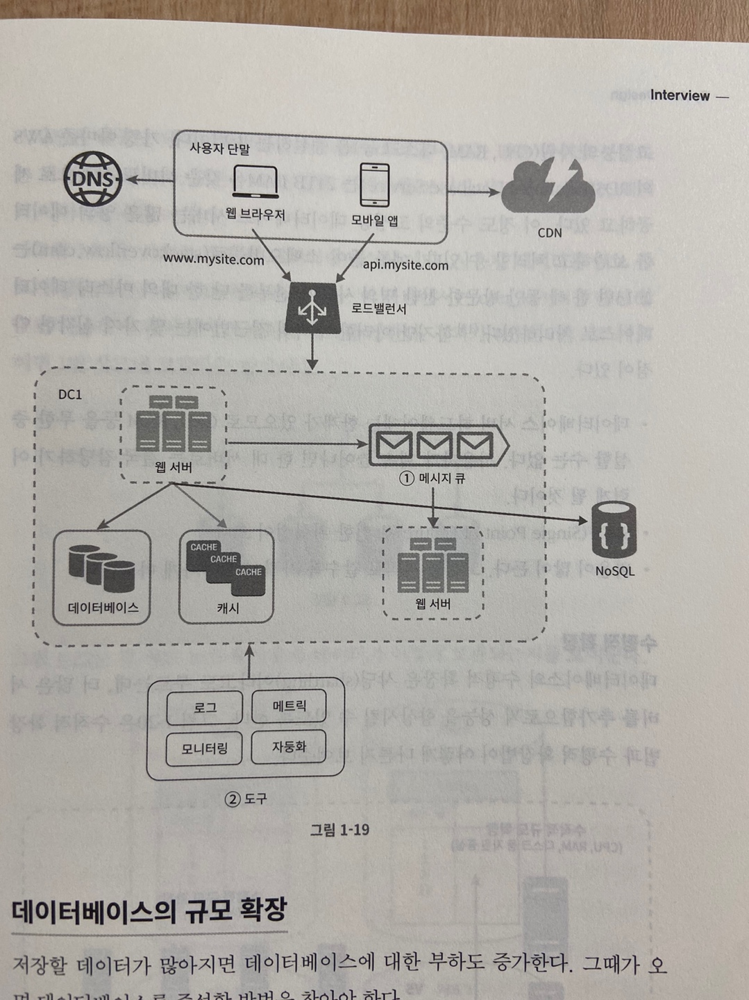

## 데이터베이스의 규모 확장

### 수직적 확장

- 기존 서버에 고성능 자원을 증설하는 방법
- 하드웨어는 한계가 있음
- SPOF로 인한 위험성이 큼
- 비용이 많이듦. 고성능일수록 비싸짐

### 수평적 확장

- 수평적 확장 -> 샤딩
- 샤딩은 대규모 데이터베이스를 샤드라고 부르는 작은 단위로 분할하는 기술을 일컬음
- 모든 샤드는 같은 스키마를 쓰지만 샤드에 보관되는 데이터 사이에는 중복이 없음
- 샤딩 전략을 구현할 때 가장 중요한 것은 샤딩 키를 어떻게 정하느냐임. 여러 샤드에 데이터를 고르게 분할하는게 가장 중요함 
- 샤딩을 도입하면서 생기는 문제들
  - 데이터의 재 샤딩
    - 데이터가 너무 많아져서 하나의 샤드로 더이상 감당하기 어려울 때
    - 샤드간 데이터 분포가 균등하지 못하여 특정 샤드만 공간소모가 심할때
    - 샤드 키를 계산하는 함수를 변경하고 데이터를 재배치해야됨
  - celebrity 문제
    - 핫스팟키 문제
    - 특정 샤드에 질의가 집중되어 서버에 과부하가 걸리는 문제
  - 조인과 비정규화
    - 여러 사드에 걸친 데이터를 조인하기 힘들어짐.
    - db를 비정규화하여 하나의 테이블에서 질의가 수행될 수 있도록 하는 것

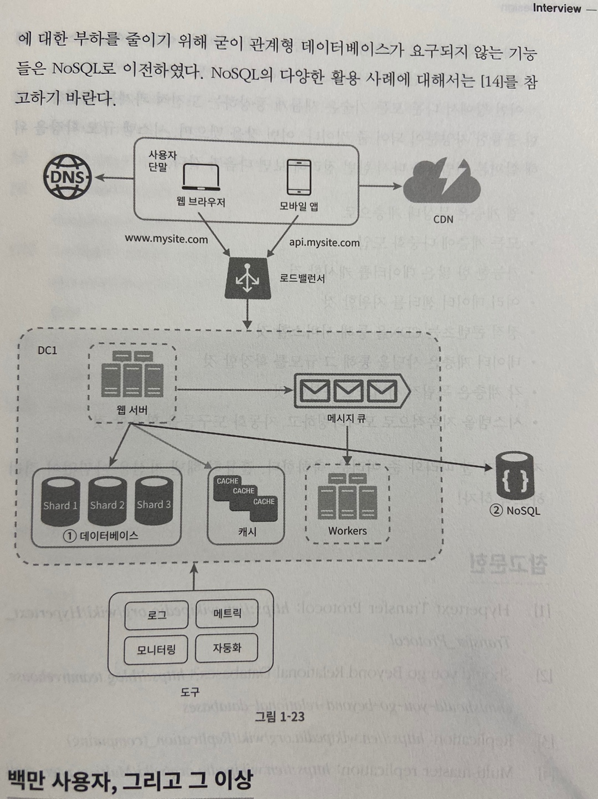

## 백만 사용자, 그리고 그 이상

- 시스템의 규모를 확장하는 것은 지속적이고 반복적인 과정
- 더 커진다면 시스템을 최적화하고 더 작은 단위의 서비스로 분할해야할 수도 있음
- 시스템 규모 확장을 위해 살펴본 기법들
  - 웹 계층은 무상태 계층으로
  - 모든 계층에 다중화 도입
  - 가능한 한 많은 데이터를 캐시할 것
  - 여러 데이터 센터를 지원할 것
  - 정적 콘텐츠는 cdn을 통해 서비스할 것
  - 데이터 계층은 샤딩을 통해 그 규모를 확장할 것
  - 각 계층은 독립적 서비스로 분할할 것
  - 시스템을 지속적으로 모니터링하고 자동화 도구들을 활용할 것

# #2 개략적인 규모 추정

- 개략적인 규모 추정은 보편적으로 통용되는 성능 수치상에서 사고실험을 행하여 추정치를 계산하는 행위로서 어떤 설계 요구사항에 부합할 것인지 보기 위한 것 - jeff dean, google senior fellow

## 2의 제곱수

- 분산 시스템에서 다루는 데이터 양은 엄청나게 커질 수 있으나 그 계산법은 기본을 크게 벗어나지 않음
- 제대로된 계산 방법을 얻으려면 데이터 볼륨의 단위를 2의 제곱수로 표현하면 어떻게되는지 알아야함

| 2의 x제곱 | 근사치 | 이름        | 축약형 |
| --------- | ------ | ----------- | ------ |
| 10        | 1천    | 1킬로바이트 | 1KB    |
| 20        | 1백만  | 1메가바이트 | 1MB    |
| 30        | 10억   | 1기가바이트 | 1GB    |
| 40        | 1조    | 1테라바이트 | 1TB    |
| 50        | 1000조 | 1페타바이트 | 1PB    |

## 모든 프로그래머가 알아야 하는 응답지연 값

| 연산명                                         | 시간                  |
| ---------------------------------------------- | --------------------- |
| L1캐시 참조                                    | 0.5ns                 |
| 분기 예측 오류                                 | 5ns                   |
| L2캐시 참조                                    | 7ns                   |
| 뮤텍스 락/언락                                 | 100ns                 |
| 주 메모리 참조                                 | 100ns                 |
| Zippy로 1KB 압축                               | 10,000ns = 10us       |
| 1 Gbps 네트워크로 2KB 전송                     | 20,000ns = 10us       |
| 메모리에서 1MB 순차적으로 read                 | 250,000ns = 250us     |
| 같은 데이터 센터 내에서의 메시지 왕복 지연시간 | 500,000ns = 500us     |
| 디스크 탐색                                    | 10,000,000ns = 10ms   |
| 네트워크에서 1MB 순차적으로 read               | 10,000,000ns = 10ms   |
| 디스크에서 1MB 순차적으로 read                 | 30,000,000ns = 30ms   |
| 한 패킷의 CA로부터 네덜란드까지의 왕복시간     | 150,000,000ns = 150ms |

- 아래와 같은 결론
  - 메모리는 빠르지만 디스크는 아직도 느림
  - 디스크 탐색은 가능한 한 피할것
  - 단순한 압축 알고리즘은 빠르다
  - 데이터를 인터넷으로 전송하기 전에 가능하면 압축할 것
  - 데이터 센터는 보통 여러지역에 분산되어 있고 센터들 간에 데이터를 주고받는 데는 시간이 걸림 

## 가용성에 관계된 수치들

- 고가용성은 시스템이 오랜 시간 동안 지속적으로 중단 없이 운영될 수 있는 능력을 지칭하는 용어
- 100%은 단 한번도 중단된적이 없다는 것을 의미함. 대부분의 서비스는 99~100%
- 아마존, 구글, ms같은 사업자는 99%이상의 SLA(Service Level Agreement)를 제공함

## 예제: 트위터 QPS와 저장소 요구량 추정

- 연습용이기 때문에 트위터와는 연관이 하나도 없음
- 가정
  - 월간 능동 사용자는 3억명
  - 50%의 사용자가 트위터를 매일 사용함
  - 평균적으로 각 사용자는 매일 2건의 트윗을 올림
  - 미디어를 포함하는 트윗은 10%
  - 데이터는 5년간 보관
- QPS(Query Per Second) 추정치
  - 일간 능동 사용자 = 3억 x 50% = 1.5억명
  - QPS = 1.5억 x 2 트윗 / 24시간 / 3600초 = 약 3500
  - 최대 QPS = 2 x QPS = 약 7000
- 미디어 저장을 위한 저장소 요구량
  - 평균 트윗 크기
    - tweet_id에 64바이트
    - 텍스트에 140바이트
    - 미디어에 1MB
  - 미디어 저장소 요구량: 1.5억 x 2 x 10% x 1MB = 30TB/일
  - 5년간 미디어를 보관하기 위한 저장소 요구량 : 30TB x 365 x 5 = 약 55PB

## 팁

- 개략적인 규모 추정과 관계된 면접에서 가장 중요한 것은 문제를 플어나가는 절차
- 올바른 절차를 밟느냐가 결과를 내는 것 보다 중요함
- 면접자가 보고싶어하는 것은 해결능력
- 팁
  - 근사치를 활용한 계산: 계산 결과가 반드시 정확해야 할 필요가 없음. 반올림해도됨
  - 가정들은 적어둘것 나중에 살펴볼 수 있도록
  - 단위를 붙일것.
  - 많이 출제되는 개략적 규모 추정 문제는 QPS, 최대 QPS, 저장소 요구량, 캐시 요구량, 서버 수 등을 추정하는 것. 면접에 임하기 전에 이런 값들을 계산하는 연습을 미리 할 것

# #3 시스템 설계 면접 공략법

- 시스템 설계 면접은 모호한 문제를 풀기 위해 협력하면서 해결책을 찾아내는 과정에 대한 시뮬레이션임
- 정답이 없고 면접관의 피드백을 건설적인 방식으로 처리할 자질을 있음을 보이는 자리임
- 시스템 면접을 통해 알 수 있는 점
  - 지원자가 협력에 적합한 사람인지
  - 압박이 심한 상황도 잘 헤쳐 나갈 자질이 있는지
  - 모호한 문제를 건설적으로 해결할 능력이 있는지
  - 설계의 순수성에 집착한 나머지 타협적 결정을 도외시하고 과도한 엔지니어링을 하는지

## 효과적 면접을 위한 4단계 접근법

### 1단계 문제 이해 및 설계 범위 확정

- 시스템 설계 면접을 볼 때는 생각 없이 바로 답을 내서는 좋은 점수를 받기 어려움
- 답부터 들이밀지 말고 깊이 생각하고 질문하여 요구사항과 가정들을 분명히 할 것
- 엔지니어가 가져야 할 가장 중요한 기술 중 하나는 올바른 질문을 하는 것. 적절한 가정을 하는 것. 그리고 시스템 구축에 필요한 정보를 모으는 것
- 요구사항을 정확히 이해하는 데 필요한 질문을 할 것
  - 구체적으로 어떤 기능들을 만들어야 하나?
  - 제품 사용자 수는 얼마나 되나?
  - 회사의 규모는 얼마나 빨리 커지리라 예상하나?
  - 회사가 주로 사용하는 기술 스택은 무엇인가?

### 2단계 개략적인 설계안 제시 및 동의 구하기

- 개략적인 설계안을 제시하고 면접관의 동의를 얻어야함
- 설계안에 대한 최초 청사진을 제시하고 의견을 구할 것
- 면접관을 마치 팀원처럼
- 화이트보드나 종이에 핵심 컴포넌트를 포함하는 다이어그램을 그릴 것
- 최초 설계안이 시스템 규모에 관련된 제약사항들을 만족하는지를 개략적으로 계산해볼 것

### 3단계 상세 설계

- 이 단계에 왔다면 아래 목표는 달성한 상태여야함
  - 시스템에서 전반적으로 달성해야 할 목표와 기능 범위 확인
  - 전체 설계의 개략적 청사진 마련
  - 해당 청사진에 대한 면접관의 의견 청취
  - 상세 설계에서 집중해야 할 영역들 확인
- 불필요한 세부사항에 시간을 쓰지 너무 많이 쓰지 말것

### 4단계 마무리

- 면접관이 시스템 병목구간, 개선가능지점을 찾아내보라 라는 질문에 개선할 부분이 없다는 답은 하지 말것. 반드시 찾아내서 답할것
- 만든 설계를 한번 요약해주는 것도 도움이 될 수 있음
- 오류가 발생하면 무슨일이 생기는지 따져볼 것
- 메트릭, 로그는 어떻게 수집하고 시스템은 어떻게 배포할지?
- 미래에 닥칠 규모 확장 요구에 대해 어떻게 대처할 것인지

**해야할 것**

- 질문을 통해 확인하고 스스로 내린 가정이 옳다 믿고 진행하지 말 것
- 문제의 요구사항을 이해할것
- 정답이나 최선의 답안 같은 것은 없다는 점을 명심할 것
- 면접관이 여러분의 사고 흐름을 이해할 수 있도록 할 것
- 가능하면 여러 해법을 함께 제시할 것
- 개략적 설계에 면접관이 동의하면 각 컴포넌트의 세부사항을 설명하기 시작할 것
- 면접관의 아이디어를 이끌어낼것. 좋은 면접관은 팀원처럼 협력해줌
- 포기하지 말 것.

**하지 말아야 할 것**

- 전형적인 면접 문제들에도 대비하지 않은 상태에서 면접장에 가지 말 것
- 요구사항이나 가정들을 분명히 하지 않은 상태에서 설계를 제시하지 말 것
- 처음부터 특정 컴포넌트의 세부사항을 너무 깊이 설명하지 말 것
- 진행 중에 막혔다면 힌트를 청하기를 주저하지 말 것
- 소통을 주저하지 말 것. 침묵 속에 설계를 진행하지 말 것
- 설계안을 내놓는 순간 면접이 끝난다고 생각하지 말 것.
- 의견을 일찍. 자주 구할것

### 시간 배분

- 45분이 있다는 가정하에 스케줄
  - 1단계 - 문제 이해 및 설계 범위 확정: 3~10분
  - 2단계 - 개략적 설계안 제시 및 동의 구하기: 10~15분
  - 3단계 - 상세 설계: 10~25분
  - 4단계 - 마무리: 3~5분

# #4 처리율 제한 장치의 설계

- 네트워크 시스템에서 처리율 제한 장치는 클라이언트 또는 서비스가 보내는 트래픽의 처리율을 제어하기 위한 장치임
- http의 예로 특정 기간 내에 전송되는 클라의 요청 횟수를 제한함
  - 사용자는 초당2회 이상 새 글을 올릴 수 없음
  - 같은 ip주소로는 하루에 10개 이상의 계정을 생성할 수 없음
  - 같은 디바이스로 주당 5회 이상 리워드를 요청할 수 없음
- 처리율 제한 장치의 좋은점
  - Dos 공격에의한 자원 고갈을 방지할 수 있음
  - 비용절감
  - 서버 과부하를 막을 수 있음

## 1단계 문제 이해 및 설계 범위 확정

- 요구사항
  - 설정된 처리율을 초과하는 요청은 정확하게 제한
  - 낮은 응답 시간: 이 처리율 제한 장치는 http 응답 시간에 나쁜 영향을 주어서는 곤란함
  - 가능한 한 적은 메모리를 써야 함
  - 분산형 처리율 제한: 하나의 처리율 제한 장치를 여러 서버나 프로세스에서 공유할 수 있어야 함
  - 예외 처리: 요청이 제한되었을 때는 그 사실을 사용자에게 분명하게 보여주어야함
  - 높은 결함 감내성: 제한 장치에 장애가 생기더라도 전체 시스템에 영향을 주어서는 안됨

## 2단계 개략적 설계안 제시 및 동의 구하기

### 처리율 제한 장치는 어디에 둘것인가?

- 클라이언트에 두는것은 좋지 못한 방법. 위변조가 가능해서 통제하기 어려움
- 서버측에 두는게 현명함
- 서버측에 두지 않고 api gateway형태로 서버와 클라이언트 중간에 미들웨어형식으로 두고 모든 요청이 api gateway를 통해 지나가도록 할 수 있음
- 처리율 제한 기능을 설계할 때 중요하게 따져야 하는 것은 처리율 제한 장치를 어디에 둘 것인가임
- 일반적으로 적용될 수 있는 몇가지 지침
  - 프로그래밍 언어, 캐시 서비스 등 현재 사용하고 있는 기술 스택을 점검할 것
  - 사업에 맞는 처리율 제한 알고리즘을 찾을 것
  - msa라면 api gateway에 포함시켜야할 수 있음
  - 충분한 인력과 시간이 없다면 상용 api gateway를 쓰는 것이 바람직함

### 처리율 제한 알고리즘

- 토큰 버킷 (token bucket)
- 누출 버킷 (leaky bucket)
- 고정 윈도 카운터 (fixed window counter)
- 이동 윈도 로그 (sliding window log)
- 이동 윈도 카운터 (sliding window counter)

**토큰 버킷 알고리즘**

- 간단하고 이해도도 높고 인터넷 기업들이 보편적으로 사용함. 아마존과 스트라이프
- 토큰 버킷알고리즘 동작 원리
  - 토큰 버킷은 지정된 용량을 갖는 컨테이너임
  - 토큰은 초기에 일정량이 채워져있고 주기에 따라 다시 refill 됨
  - 요청이 온다면 실제 토큰 한개를 소비하고 처리함
  - 토큰이 없는 상태에서 들어온 요청은 overflow로 판단하고 버려짐
- 토큰 버킷 알고리즘은 2개의 인자를 받음
  - 버킷 크기: 버킷에 담을 수 있는 토큰의 개수
  - 토큰 공급률: 초당 몇개의 토큰이 버킷에 공급되는가
- 토큰 공급에 대한 사례
  - 통상적으로 api 엔드포인트 마다 별도의 버킷을 둠. 예를 들어 사용자마다 하루에 한 번만 포스팅할 수 있고 친구는 150명까지 추가할 수 있고 좋아요 버튼은 다섯 번까지만 누를 수 있다면 사용자마다 3개의 버킷을 두어야 함
  - ip 주소별로 처리율 제한을 적용해야 한다면 ip 주소마다 버킷을 하나씩 할당해야함
  - 시스템의 처리율을 초당 10000개로 할꺼면 모든 요청이 하나의 버킷을 공유하도록 해야 함
- 장점
  - 구현이 쉬움
  - 메모리 사용 측면에서도 효율적
  - 짧은 시간에 집중되는 트래픽도 처리 가능함
- 단점
  - 버킷 크기와 토큰 공급률의 적절한 값을 튜닝하기 까다로움

**누출 버킷 알고리즘**

- 토큰 버킷 알고리즘과 비슷하지만 요청 처리율이 고정되어 있다는 점이 다름
- 쇼피파이에서 사용
- 보통 FIFO 큐로 동작함
- 동작원리
  - 요청이 도착하면 큐가 가득 차 있는지 보고 빈자리가 있는 경우 큐에 요청을 추가함
  - 큐가 가득 차 있는 경우에는 새 요청은 버림
  - 지정된 시간마다 큐에서 요청을 꺼내어 처리함
- 누출 버킷 알고리즘은 2개의 인자를 받음
  - 버킷 크기: 큐 사이즈와 같은 값
  - 처리율: 지정된 시간당 몇 개의 항목을 처리할지 지정하는 값. 보통 초 단위
- 장점
  - 큐의 크기가 제한되어 있어 메모리 사용량 측면에서 효율적
  - 고정된 처리율을 갖고 있기 때문에 안정적 출력이 필요한 경우에 적합함
- 단점
  - 단시간에 많은 트래픽이 몰리는 경우 큐에는 오래된 요청이 쌓이게 되고 그 요청들을 제때 처리 못하면 최신 요청들은 버려짐
  - 두개의 인자를 올바르게 튜닝하기가 까다로움

**고정 윈도 카운터 알고리즘**

- 동작원리
  - 타임라인을 고정된 간격의 윈도로 나누고 각 윈도마다 카운터를 붙임
  - 요청이 접수될 때마다 이 카운터의 값은 1씩 증가함
  - 이 카운터의 값이 사전에 설정된 임계치에 도달하면 새로운 요청은 새 윈도가 열릴 때까지 버려짐
- 초당 세개의 윈도우로 쪼갠다면 초당 세개만 받고 나머지는 버려지는 구조
- 이 알고리즘의 가장 큰 문제는 윈도의 경계 부근에 순간적으로 많은 트래픽이 집중될 경우 윈도에 할당된 양보다 더 많은 요청이 처리될 수 있다는 것
- 장점
  - 메모리 효율이 좋음
  - 이해하기 쉬움
  - 윈도가 닫히는 시점에 카운터를 초기화하는 방식은 특정한 트래픽 패턴을 처리하기에 적합함
- 단점
  - 윈도 경계 부근에서 일시적으로 많은 트래픽이 몰리는 경우 기대했던 시스템의 처리 한도보다 더 많은 양의 요청을 처리하게됨

**이동 윈도 로깅 알고리즘**

- 고정 윈도 알고리즘의 문제를 해결항 방식
- 동작 원리
  - 요청의 타임스탬프를 추적함 타임 스탬프는 보통 레디스 sorted set 같은 캐시에 보관함
  - 새 요청이 오면 만료된 타임스탬프는 제거함 만료된 타임 스탬프는 그 값이 현재 윈도의 시작 시점보다 오래된 타임스탬프
  - 새 요청의 타임스탬프를 로그에 추가함
  - 로그의 크기가 허용치보다 같거나 작으면 요청을 시스템에 전달함 그렇지 않은 경우에는 처리를 거부
- 장점
  - 어느 순간의 윈도를 보더라도 허용되는 요청의 개수는 시스템의 처리한도율을 넘지 않음
- 단점
  - 거부된 요청의 타임스탬프도 보관하기 때문에 다량의 메모리를 사용함

**이동 윈도 카운터 알고리즘**

- 고정윈도 카운터 알고리즘과 이동 윈도 로깅 알고리즘을 결합한 것
- 두가지 중 한가지만 설명
- 설명은 .. 책보는게 편함
- 장점
  - 이전 시간대의 평균 처리율에 따라 현재 윈도의 상태를 계산하므로 짧은 시간에 몰리는 트래픽에도 잘 대응함
  - 메모리 효율이 좋음
- 단점
  - 직전 시간대에 도착한 요청이 균등하게 분포되어 있다고 가정한 상태에서 추정치를 계산하기 때문에 다소 느슨함 하지만 별로 심각한 문제는 아님 

### 개략적인 아키텍처

- 어떤것을 처리할것인지? ip? endpoint? 등등
- 카운터는 어디에 보관할것인지?
- 레디스가 좋음
- 레디스를 사용했을때 동작 원리
  - 클라는 처리율 제한 미들웨어에게 요청을 보냄
  - 처리율 제한 미들웨어는 레디스의 지정 버킷에서 카운터를 가져와서 한도를 체크후 적절하게 동작함

## 3단계 상세 설계

- 개략적 설계에서 알 수 없던 내용
  - 처리율 제한 규칙은 어떻게 만들어지고 어디에 저장되는가?
  - 처리가 제한된 요청들은 어떻게 처리되는가?

### 처리율 한도 초과 트래픽의 처리

- 요청이 한도 제한에 걸리면 HTTP 249 too many requests를 클라에게 보냄
- 요청이 처리율 제한까지 얼마나 많은 요청을 보낼 수 있는지 아는 방법 : Http 응답 헤더
  - X-Ratelimit-Remaining: 윈도 내 남은 처리 가능 요청 수
  - X-Ratelimit-Limit: 매 윈도마다 클라가 전송할 수 있는 요청의 수
  - X-Ratelimit-Retry-After: 한도 제한에 걸리지 않으려면 몇 초 뒤에 요청을 다시 보내야하는 지 알림

### 상세 설계

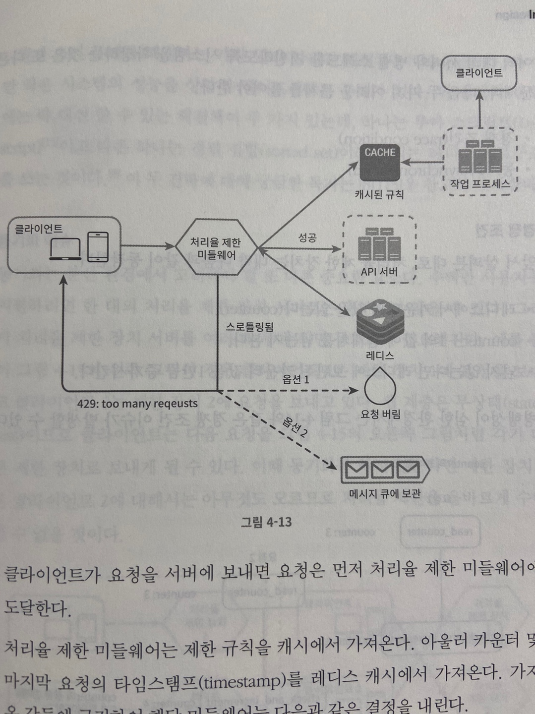

- 클라가 요청을 서버에 보내면 먼저 처리율 제한 미들웨어에 도달
- 처리율 제한 미들웨어는 제한 규칙을 캐시에서 가져옴<= 설정파일이라그냥 디스크에서 읽어도 되지 않을까 ..? 만약 분산환경이라면 OK
- 카운터 및 마지막 요청의 타임스탬프를 레디스 캐시에서 가져옴 가져온 값들을 근거해서 아래의 결정을 내림
  - 해당 요청이 처리율 제한에 걸리지 않은 경우에는 api 서버로 보냄
  - 해댱 요청이 처리율 제한이 걸렸다면 429 too many requests 에러를 클라에게 보냄. 그래도 버릴수도 있고 큐에 보관할 수도 있음

### 분산 환경에서의 처리율 제한 장치의 구현

- 단일 서버를 지원하는 처리율 제한 장치를 구현하는 것은 어렵지 않음
- 여러대의 서버와 병렬 스레드를 지원하도록 확장하려면 아래 문제를 풀어야함
  - 경쟁 조건
  - 동기화

**경쟁 조건**

- race condition이 발생했을때 같은 카운터값을 동시에 읽어간다면 올바르지 못한 값으로 업데이트될 위험이 있음
- 락을 사용하는 방법이 있지만 시스템의 성능을 떨어뜨리는 문제가 있음
- 레디스를 사용한다면 루아스크립트를 사용하는방법과 sorted set을 사용하는 방법이 있음

**동기화 이슈**

- 여러대의 처리율 제한 장치를 둔다면 counter 값을 동기화시켜줘야할 필요가 있음
- sticky session을 사용하는 방법이 있지만 별로 좋지는 않음
- 레디스 사용을 추천

### 성능 최적화

### 모니터링

- 모니터링을 통해 확인해야 할 것
  - 채택된 처리율 제한 알고리즘이 효과적인지
  - 정의한 처리율 제한 규칙이 효과적인지

## 4단계 마무리

- hard 또는 soft 처리율 제한

  - hard 처리율 제한: 요청의 개수는 임계치를 절대 넘어설 수 없음
  - soft 처리율 제한: 요청 개수는 잠시 동안은 임계치를 넘어설 수 있음

- 다양한 계층에서의 처리율 제한

  - HTTP는 OSI7계층이기 때문에 7계층의 처리율 제한 장치를 예시로 봤음
  - OSI3계층의 iptables를 사용해서 처리율 제한을 적용할 수 있음

- 클라에서 처리율 제한을 회피하는 방법

  - 클라측 캐시를 사용해서 api 호출 횟수를 줄이기
  - 처리율 제한의 임계치를 이해하고 너무 짧은시간동안 많은 메시지를 보내지 않도록 하기
  - 예외나 에러를 처리하는 코드를 도입하여 클라가 예외적 상황으로부터 우아하게 복구될 수 있도록 하기
  - 재시도 로직을 구현할 때는 충분한 백오프 시간을 두기

  

# #5 안정 해시 설계

## 해시 키 재배치 문제

- n개의 캐시 서버가 있다고 가정했을때 부하를 균등하게 나누는 보편적인 방법
  - serverIndex = hash(key) % N
- 만약 서버가 추가 또는 삭제될 경우 엉뚱한 서버에 요청이 갈 수 있음
- 안정 해시는 이 문제를 효과적으로 해결하는 기술

## 안정 해시

- 안정 해시 부분은 실제로 책을보는게 좋을듯

### 해시 공관과 해시 링

### 해시 서버

### 해시 키

### 서버 조회

### 서버 추가

### 서버 제거

### 기본 구현법의 두 가지 문제

### 가상 노드

### 재배치할 키 결정

### 마치며

- 안정 해시의 이점
  - 서버가 추가되거나 삭제될 때 재배치되는 키의 수가 최소화됨
  - 데이터가 보다 균등하게 분포하게 되므로 수평적 규모 확장성을 달성하기 쉬움
  - 핫스팟 키 문제를 줄여줌

# #6 키-값 저장소 설계

- 키-값 저장소는 카-값 데이터베이스라고도 불리는 비 관계형 데이터베이스
- 이 저장소에 저장되는 값은 고유 식별자를 키로 가져야함
- 키와 값 사이의 이런 연결 관계를 키-값 쌍(pair) 이라고 지칭함
- 키-값 쌍에서 키는 유일해야하며 해당 키에 매달린 값은 키를 통해서만 접근할 수 있음
- 키는 일반 텍스트일 수도 있고 해시 값일 수도 있음
- 성능상의 이유로 키는 짧을수록 좋음
- 키 사례
  - 일반 텍스트 키 : "last_logged_in_at"
  - 해시 키 : 253DDEC4
- 키-값 쌍에서의 값은 문자열일 수도 있고 리스트일 수도 있고 객체일수도 있음 보통 값으로 오는 것들은 무엇이 오든 상관하지 않음
- 키 값 저장소
  - 아마존 다이나모 db
  - memcached
  - 레디스
- 설계할 연산
  - put(key, value): 키-값 쌍을 저장소에 저장한다
  - get(key): 인자로 주어진 키에 매달린 값을 꺼낸다

## 문제 이해 및 설계 범위 확정

- 완벽한 답은 없고 읽기, 쓰기 메모리 사용량 사이에 어떤 균형을 찾고 데이터의 일관성과 가용성 사이에 타협적 결정을 내린 설계를 만들었다면 쓸만한 답
- 다음 특성을 갖는 키-값 저장소를 설계할 것임
  - 키-값 쌍의 크기는 10KB 이하이다
  - 큰 데이터를 저장할 수 있어야 한다
  - 높은 가용성을 제공해야 한다. 따라서 시스템은 설사 장애가 있더라도 빨리 응답해야 한다
  - 높은 규모 확장성을 제공해야 한다 따라서 트래픽 양에 따라 자동적으로 서버 증설/삭제가 이루어져야 한다
  - 데이터 일관성 수준은 조정이 가능해야 한다
  - 응답 지연시간이 짧아야 한다

## 단일 서버 키-값 저장소

- 한 대 서버만 사용하는 키-값 저장소를 설계하는 것은 쉬움
- 가장 직관적인 방법은 키-값 쌍 전부를 메모리에 해시 테이블로 저장하는 것 but 모든 데이터를 메모리에 두는 것이 불가능 할 수 있다는 약점
- 해결책
  - 데이터 압축
  - 자주 쓰이는 데이터만 메모리에 두고 나머지는 디스크에 저장
- 그렇다하더라도 분산 키-값 저장소가 필요함

## 분산 키-값 저장소

- 분산 시스템을 설계할 때는 CAP(Consistency, Availability, Partition Tolerance theorem) 정리를 이해하고 있어야함

**CAP 정리**

- 데이터 일관성, 가용성, 파티션 감내라는 세가지 요구사항을 동시에 만족하는 분산시스템을 설계하다는 것은 불가능하다는 정리
- 요구사항의 의미
  - 데이터 일관성: 분산 시스템에 접속하는 모든 클라이언트는 어떤 노드에 접속했느냐에 관계없이 언제나 같은 데이터를 보게 되어야 함
  - 가용성: 분산 시스템에 접속하는 클라이언트는 일부 노드에 장애가 발생하더라도 항상 응답을 받을 수 있어야 함
  - 파티션 감내: 파티션은 두 노드 사이에 통신 장애가 발생하였음을 의미함. 파티션 감내는 네트워크에 파티션이 생기더라도 시스템은 계속 동작하여야 한다는 것을 의미함

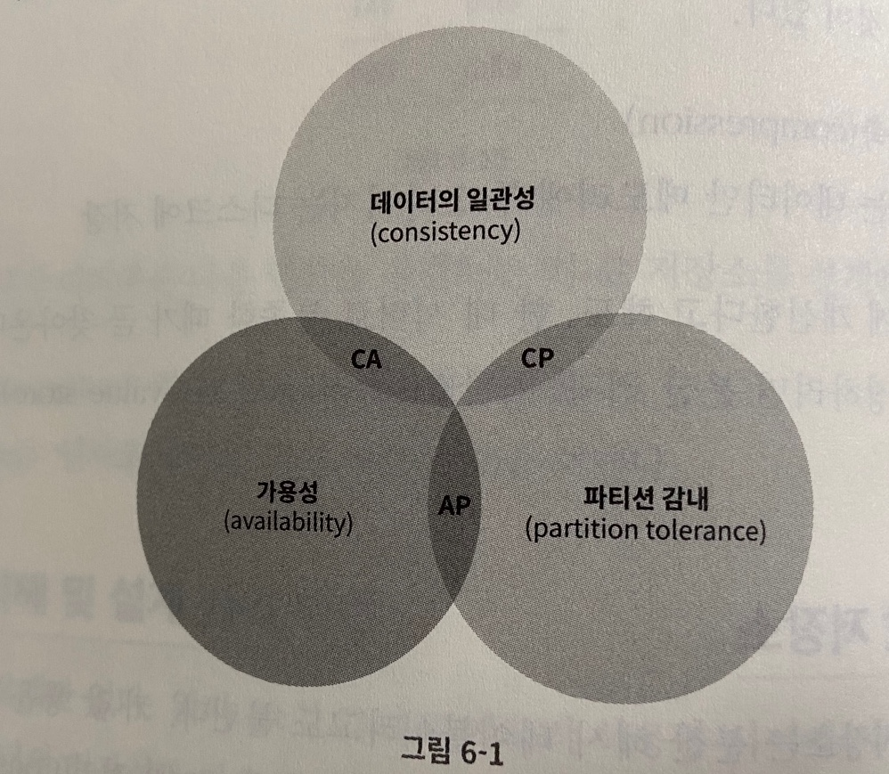

- CAP정리는 두가지를 충족하려면 나머지 하나는 반드시 희생되어야 한다는 것을 의미
  - CP 시스템: 일관성과 파티션 감내를 지원. 가용성을 희생
  - AP 시스템: 가용성과 파티션 감내를 지원. 데이터의 일관성을 희생
  - CA 시스템: 일관성과 가용성을 지원. but 네트워크 장애는 피할 수 없기때문에 분산 시스템은 반드시 파티션 문제를 감내할 수 있도록 설계되어야함. 따라서 실세계에 CA 시스템은 존재하지 않음

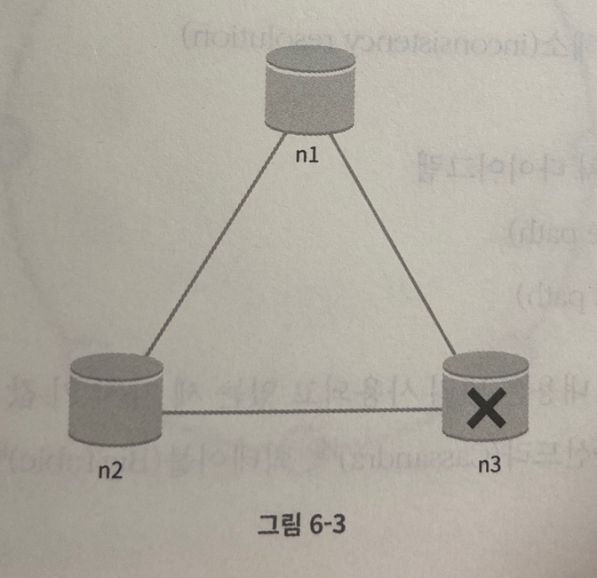

- 가용성대신 일관성을 선택하면 세 서버 사이에 생길 수 있는 데이터 불일치 문제를 피하기 위해 n1과 n2에 대해 쓰기 연산을 중단시켜야하는데 그렇게하면 가용성이 깨짐 ex: 은행권 시스템
- 일관성대신 가용성을 선택한 시스템은 낡은 데이터를 반환할 위험이 있더라도 계속 읽기 연산을 허용해야함 아울러 살아있는 노드들은 계속 쓰기 연산을 허용하고 파티션 문제가 해결된 뒤에 새 데이터를 전송함

### 시스템 컴포넌트

- 키-값 저장소 구현에 사용될 핵심 컴포넌트들
  - 데이터 파티션
  - 데이터 다중화
  - 일관성
  - 일관성 불일치 해소
  - 장애 처리
  - 시스템 아키텍처 다이어그램
  - 쓰기 경로
  - 읽기 경로

**데이터 파티션**

- 대규모 애플리케이션의 경우 전체 데이터를 한 대 서버에 욱여넣는 것은 불가능
- 가장 단순한 해결책은 데이터를 작은 파티션들로 분할한 다음 여러 대 서버에 저장하는 것
- 데이터를 파티션 단위로 나눌 때 두가지 문제점
  - 데이터를 여러 서버에 고르게 분산할 수 있는가
  - 노드가 추가되거나 삭제될 때 데이터의 이동을 최소화할 수 있는가
- 5장에서 다룬 안정해시는 이런 문제를 푸는데 적합한 기술임
- 안정해시를 사용하여 데이터를 파티션하면 좋은점
  - 규모 확장 자동화: 시스템 부하에 따라 서버가 자동으로 추가되거나 삭제되도록 만들 수 있음
  - 다양성: 각 서버 용량에 맞게 가상 노드의 수를 조절할 수 있음.

**데이터 다중화**

- 높은 가용성과 안정성을 확보하기 위해서는 데이터를 N개 서버에 비동기적으로 다중화할 필요가 있음
- N은 튜닝 가능한 값
- 어떤 키를 해시 링 위에 뱇리한 후 그 지점으로부터 시계 방향으로 링을 순회하면서 만나는 N개의 서버에 데이터사본을 보관하는 방법
- 같은 데이터 센터에 속한 노드는 정전, 네트워크 이슈, 자연재해등의 문제를 동시에 겪을 가능성이 있음을 주의해야함

**데이터 일관성**

- 여러 노드에 다중화된 데이터는 적절히 동기화되어야함
- 정족수 합의(Quorum Consensus) 프로토콜을 사용하면 읽기/쓰기 연산 모두에 일관성을 보장할 수 있음
  - N=사본개수
  - W=쓰기 연산에 대한 정족수. 쓰기 연산이 성공한 것으로 간주되려면 적어도 W개의 서버로부터 쓰기 연산이 성공했다는 응답을 받아야함
  - R=읽기 연산에 대한 정족수. 읽기 연산이 성공한 것으로 간주되려면 적어도 R개의 서버로부터 응답을 받아야함

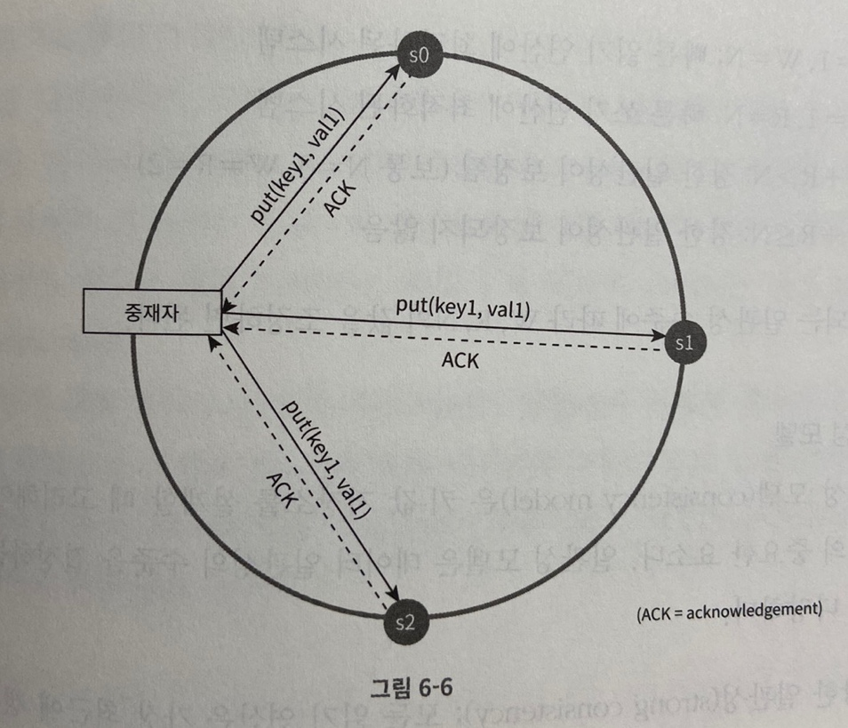

- W=1의 의미는 한대의 서버에만 기록된다는 뜻이 아니라 쓰기 연산이 성공했다고 단판하기 위해 중재자는 최소 한 대 서버로부터 쓰기 성공 응답을 받아야 한다는 뜻임
- 중재자는 클라와 노드 사이에서 프락시 역할을 함
- W,R,N 값을 정하는 것은 응답 지연과 데이터 일관성 사이의 타협점을 찾는 전형적인 과정
- W,R의 값이 1보다 큰 경우에는 시스템이 보여주는 데이터 일관성의 수준은 향상될테지만 중재자의 응답속도는 가장 느린 서버로부터의 응답을 기다려야 하므로 느려질 것임
- R=1, W=N : 빠른 읽기 연산에 최적화된 시스템
- W=1, R=N : 빠른 쓰기 연산에 최적화된 시스템
- W + R > N : 강한일관성이 보장됨 (N = 3, W=R=2)
- W + R <= N : 강한일관성이 보장되지 않음

**일관성 모델**

- 일관성 모델은 키 값 저장소를 설계할 때 중요한 요소
- 일관성 모델은 데이터 일관성의 수준을 결정함
- 종류
  - 강한 일관성: 모든 읽기 연산은 가장 최근에 갱신된 결과를 반환한다. 클라이언트는 낡은 데이터는 보지 못함
  - 약한 일관성: 읽기 연산은 가장 최근에 갱신된 견과를 반환하지 못할 수 있음
  - 최종 일관성: 약한 일관성의 한 형태로, 갱신 결과가 결국에는 모든 사본에 반영되는 모델
- 강한 일관성을 달성하는 일반적인 방법은 모든 사본에 현재 쓰기 연산의 결과가 반영될 때까지 해당 데이터에 대한 읽기/쓰기를 금지하는것. 이 방법은 고가용성 시스템에는 적합하지 않음
- 다이나모 또는 카산드라같은 저장소는 최종 일관성 모델을 택하고 있음
- 최종 일관성의 경우 쓰기가 병렬적으로 발생하면 일관성이 깨질 수 있는데 이건 클라이언트에서 처리해야함

**비 일관성 해소 기법: 데이터 버저닝**

- 데이터를 다중화하면 가용성은 높아지지만 사본 간 일관성이 깨질 가능성이 높아짐
- 버저닝과 벡터 시계는 그 문제를 해소하기 위해 등장한 기술
- 버저닝은 데이터를 변경할 때마다 해당 데이터의 새로운 버전을 만드는 것을 의미함 immutable함
- 서로 다른 노드에서 같은 값을 업데이트할때는 백터 시계를 사용하면됨
- 백터 시계는 [서버, 버전]의 순서쌍을 데이터에 매단것
- 어떤 버전이 선행 버전인지, 후행 버전인지, 아니면 다른 버전과 충돌이 있는지 판별하는데 쓰임
- 백터시계 동작
  1. 클라이언트가 데이터 D1을 시스템에 기록. 이 쓰기 연산을 처리한 서버는 Sx임. 벡터 시계는 D1([Sx, 1]) 으로 변경
  2. 다른 클라이언트가 데이터 D1을 읽고 D2로 업데이트한 다음 기록 D2는 D1에 대한 변경이므로 D1을 덮어씀. 이때 쓰기 연산은 같은 서버 Sx라 가정하면 백터 시계는 D2([Sx,2])
  3. 다른 클라이언트가 D2를 읽어 D3로 갱신한 다음 기록. 이 쓰기 연산은 서버 Sy라 가정하면 벡터 시계는 D3([Sx,2], [Sy,1])로 바뀜
  4. 또 다른 클라이언트가 D2를 읽고 D4로 갱신한 다음 기록함. 서버가 Sz라고 가정하면 벡터 시계는 D4([Sx,2], [Sz,1]) 로 바뀜
  5. 어떤 클라이언트가 D3와 D4를 읽으면 데이터 간 충돌이 있었다는 것을 알게 됨 이 충돌은 클라이언트가 해소한 후에 서버에 기록함. 이 쓰기 연산을 처리한 서버는 Sx라고 가정하면 백터 시계는 D5([Sx,3], [Sy,1], [Sx, 1])로 바뀜

- 백터 시계를 사용하면 어떤 버전 X가 버전Y의 이전 버전인지 쉽게 판단할 수 있음
- 벡터시계의 단점은 충돌 감지 및 해소 로직이 클라이언트에 들어가서 복잡해진다는점. 그리고 순서쌍 개수가 굉장히 빨리 늘어난다는 것. 이건 임계치를 설정해서 오래된 순서쌍을 벡터시계에서 제거해야하는데 이 방법은 버전 간 선후 관계가 정확하게 결정될 수 없기 때문에 충돌 해소 과정의 효율성이 낮아지게됨
- 그러나 아마존 다이나모에서는 선후 관계가 정확하게 결정되는 문제가 벌어지는 경우를 발생한 적이 없다고 되어있음. 따라서 대부분은 백터시계를 사용해도 갠춘

**장애 감지**

- 분산 시스템에서는 보통 두 대 이상의 서버가 똑같이 서버 A의 장애를 보고해야 해당 서버에 실제로 장애가 발생했다고 간주함
- 모든 노드 사이에 멀티캐스팅 채널을 구축하는것이 서버 장애를 감지하는 가장 손쉬운 방법이지만 서버가 많을때는 비효율적임
- 가십 프로토콜 같은 분산형 장애감지 솔루션을 채택하는 편이 효율적임
- 가십 프로토콜의 동작 원리
  - 각 노드는 멤버십 목록을 유지함. 멤버십 목록은 각 멤버 ID와 그 heartbeat 카운터 쌍의 목록임
  - 각 노드는 주기적으로 자신의 heartbeat 카운터를 증가시킴
  - 각 노드는 무작위로 선정된 노드들에게 주기적으로 자기 heartbeat 목록을 보냄
  - heartbeat카운터 목록을 받은 노드는 멤버십 목록을 최신 값으로 갱신
  - 어떤 멤버의 heartbeat 값이 지정된 시간 동안 갱신되지 않으면 해당 멤버는 장애 상태인 것으로 간주함

- 위 그림에서 노드 s0은 무작위로 다른 노드들에게 heartbeat 카운터 목록을 보내서 모든 노드는 해당 노드를 장애 노드로 표시하게됨

**일시적 장애 처리**

- 가십 프로토콜로 장애를 감지한 시스템은 가용성을 보장하기 위해 필요한 조치를 해야함.
- 

