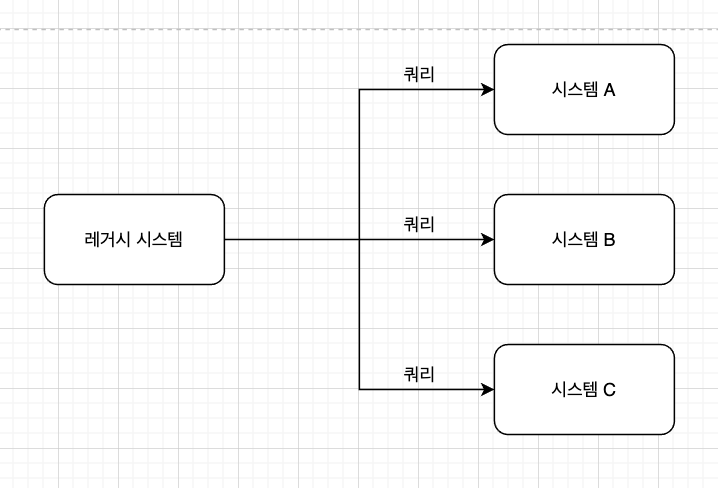
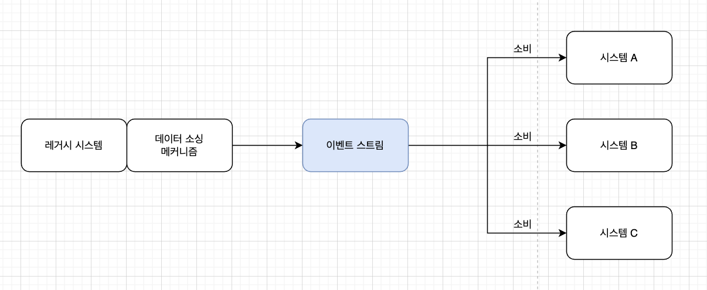
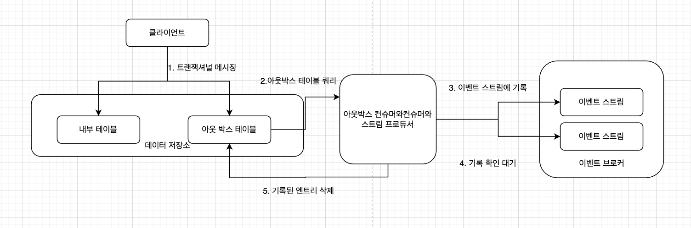
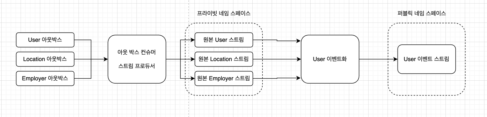
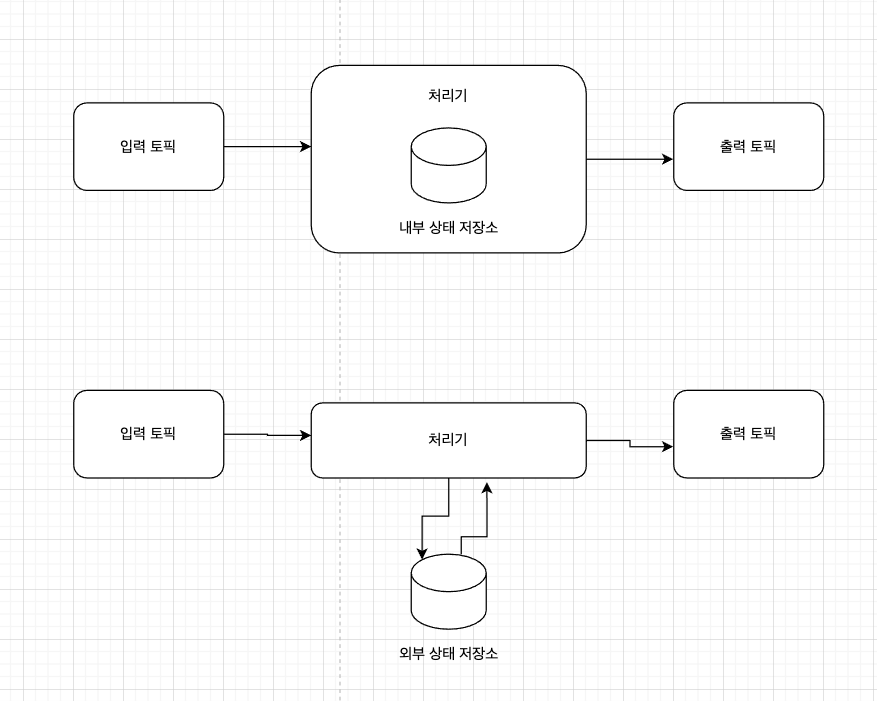

# 이벤트 기반 마이크로서비스 구축

# #1 왜 이벤트 기반 마이크로서비스인가?

- 이벤트는 이제 엄청나게 큰 규모로 무기한 저장할 수 있고 모든 서비스가 필요할 때마다 몇 번이라도 소비할 수 있게 됐다.
- 이벤트를 통해 이제는 제약 없이 얼마든지 데이터를 저장/관리할 수 있게 됐다.

## 이벤트 기반 마이크로 서비스란?

- 현대 이벤트 기반 마이크로서비스 아키텍처에서는 시스템이 이벤트를 생산/소비하는 식으로 서로 통신한다.
- 이벤트를 소비해도 메시지를 전달한 시스템이 바로 사라지는건 아니고 같은 메시지를 필요로 하는 다른 컨슈머도 가져갈 수 있게 보존된다.
- 서비스는 입력 이벤트 스트림에서 이벤트를 받아 특정한 비즈니스 로직을 적용한 다음, 출력 이벤트를 내보내서 요청-응답 접근에 필요한 데이터를 제공하거나 서드파티 api와 통신, 또는 다른 필요한 일을 수행한다.

## 도메인 주도 설계와 경계 콘텍스트

- 도메인 주도 설계의 기본 개념

`도메인`

- 비지니스가 차지하고 솔루션이 제공하는 문제 공간.
- 규칙 프로세스, 아이디어, 비지니스 전문 용어 등 문제공간과 조금이라도 관련된 것들은 모두 포함된다.
- 도메인은 비지니스 존재 여부와 무관하게 존재한다.

`하위 도메인`

- 메인 도메인을 이루는 컴포넌트.
- 특정한 하위 업무에 집중하고 일반적으로 비지니스 조직 구조를 반영한다.
- 하위 도메인 하나를 하나의 도메인으로 볼 수 있다.
- 하위 도메인 역시 메인 도메인처럼 문제 공간에 속한다.

`도메인(및 하위 도메인) 모델`

- 비지니스 용도에 맞게 실제 도메인을 추상화한 비지니스에서 가장 중요한 도메인 조각 및 속성들로 모델을 생성한다.
- 도메인 모델은 솔루션 공간의 일부로 비지니스가 문제를 해결하기 위해 사용하는 구성체이다.

`경계 콘텍스트`

- 경계 콘텍스트는 솔루션 공간의 속성으로 마이크로서비스가 상호작용하는 방식에 상당한 영향을 미친다.

  

- 경계 콘텍스트는 응집력이 강해야 한다.
- 콘텍스트 내부 기능은 집약적이고 깊이 연관되어 있고 대부분의 통신이 내부에서만 일어나야 한다.
- 경계 콘텍스트는 느슨하게 결합해야 한다. 그래야 다른 콘텍스트에 영향이 없다.

### 도메인 모델과 경계 모텍스트 활용

- 모든 조직은 그 자신과 외부 사이에 하나의 도메인을 형성한다.
- 도메인은 다시 하위 도메인으로 나뉘고 계속 쪼개져서 작고 독립적인 서비스로 옮길 수 있을정도가 된다.
- 경계 콘텍스트는 이런 하위 도메인을 중심으로 형성되어 마이크로서비스가 탄생하는 기초가 된다.

### 비즈니스 요건에 따라 경계 콘텍스트 조정

- 경계 콘텍스트를 기술 요건이 아니라 비지니스 요건 중심으로 정해야 변경에도 영향이 없다
- 경계 콘텍스트를 비지니스 요건에 맞추면 팀별로 느슨하게 결합하며 고도로 응집된 마이크로서비스 구현체를 바꿀 수 있다. => 팀간의 의존도가 적어서 맡은 요건에만 독립적으로 전념할 수 있다.
- 마이크로서비스를 기술 요건에 맞추면 생기는 가장 큰 문제는 여러 경계 콘텍스트에 걸쳐 비지니스 기능을 수행할 책임이 여러 팀으로 분산되어 제각기 다른 스케줄로 다른 업무를 진행하게 된다.
- 전체를 아우르는 기술, 팀 간 의존성을 타파해야 시스템 변경 민감도를 낮출 수 있다.
- 이벤트 기반 마이크로서비스는 비지니스 요건에 따라 아키텍처를 모델링하는 것이 바람직하다.
- 위 과정에서 코드가 여러번 복제되거나 비슷한 서비스가 증가하는 트레이드 오프가 있다.
- 중복이 강결합보다 낫다.
- 경계 콘텍스트 간 결합은 느슨하게 유지하고 상호 의존 관계는 최소화하자. 그래야 필요시 다른 시스템에 해를 끼치지 않고 경계 컨텍스트를 변경할 수 있다.
- 팀마다 풀스택 전문성을 갖춰야 한다.

## 통신 구조

### 비즈니스 통신 구조

- 비즈니스 통신 구조는 팀과 부서 간의 통신을 결정하며 각 팀에 할당된 주된 요건 및 책임에 따라 달라진다.

### 구현 통신 구조

- 구현 통신 구조는 하위 도메인 모델에 대해 조직에서 규정한 데이터와 로직을 이용해 신속하고 효울적인 업무 수행을 위해 비지니스 프로세스, 데이터 구조, 시스템 설계를 정규화한 것이다.

### 데이터 통신 구조

- 데이터 통신구조는 비지니스 전반에 걸쳐, 특히 구현체간에 데이터를 주고 받는 프로세스를 말한다.

### 콘웨이의 법칙과 통신 구조

- 시스템 구조는 그 시스템을 설계하는 조직의 통신 구조를 그대로 따라갈 수밖에 없다. - 맬빈 콘웨이
- 조직에서 데이터 접근이 너무 어렵거나 모든 데이터가 구현체 하나에 몰려 있어 제품의 범위가 한정되어 있다면 필경 데이터 통신 구조가 부실한 대가를 치루고 있는 것이다.

## 기존 컴퓨팅의 통신 구조

- 한 조직의 통신 구조는 엔지니어링 결과물이 탄생하기까지 막대한 영향을 미친다. 팀 레벨도 마찬가지
- 단일 데이터 저장소에 기반한 단일 서비스를 담당하는 팀에 새로운 요건이 들어온 경우 아래와 같이 옵션1, 2 로 고민해볼 수 있음

### 옵션 1: 서비스를 새로 만듦

- 새로운 서비스를 만들어 운영하는 작업에는 데이터 동기화 등등 리스크가 있다.
- 데이터 저장소 2개, 서비스 2개, 데이터 의존, 로깅, 모니터링, 테스트 배포, 롤백 프로세스, 데이터 등등의 문제

### 옵션 2: 기존 서비스에 추가

- 여러 모듈이 동일한 코드 베이스에 함께 엮이는 경우가 많아 변경할 일이 생기면 구현체 내부에서 경계까 모호해질 가능성이 있다.
- 경계를 자유롭게 넘나들면서 모듈을 직접 결합시키면 ㅂ쉽고 빠르게 기능을 추가할 수 있지만 결합도는 올라가고 모듈성은 떨어진다.

### 옵션별 장단점

- 많은 팀들이 두번째 옵션을 선택하고 모놀리식 아키텍처는 아직 강력하고 비지니스에 탁월한 가치를 제공하므로 잘못된 선택은 아니다.
- 첫번째 옵션 요약
  - 다른 시스템의 데이터에 안정적으로 접근하기 어렵다. 특히 대규모 데이터를 실시간 접근하기 곤란하다.
  - 서비스를 새로 만들어 관리하는 오버헤드와 리스크를 무시할 수 없다. 특히 신규 서비스를 관리하는 체계가 조직 내에 아직 확립되어 있지 않다.
- 데이터를 얻기 위해서는 통신을 피할 수 없고 복제를하자니 점대점 결합이 발생할 수 밖에 없다.
- 데이터 복제는 데이터의 양이 많아질수록 더 많이 어긋나게 된다.
- **회사 곳곳에 정확한 데이터를 전달할 수 없는 까닭은 개념 자체에 근본적인 결함이 있어서가 아니다. 데이터 통신 구조가 취약하거나 전무하기 때문이다.**
- **핵심 비지니스 데이터는 이를 필요로 하는 모든 서비스가 쉽게 획득하고 사용할 수 있어야 한다. 이것이 이벤트 기반 마이크로서비스의 기본 교리중 하나이다.**

### 팀 시나리오(계속)

- 옵션2를 선택한 팀에서 1년 뒤에 새로운 요구사항에 맞이하게 되었을때의 문제
  - 어느 팀이 어떤 데이터를 소유해야 하나?
  - 데이터는 어디에 두어야 하나?
  - 두 팀 모두 값을 변경하는 데이터는 어떻게 처리할까?

### 상충되는 압력

- 발생되는 모든 문제들의 근원은 구현 통신 구조 간의 데이터 통신 수단이 취약하고 제대로 정의되지 않은 탓이다.

## 이벤트 기반 통신 구조

- 이벤트 기반 통신은 기존 구현/데이터 통신 구조의 대안이다.
- 이벤트 스트리밍 방식의 데이터 통신 구조에서는 데이터를 생산/소유하는 것과 데이터에 접근하는 행위가 철저히 분리되기 때문에 서비스는 더 이상 직접 요청-응답 API에 얽매이는 일 없이 이벤트 스트림 내부에 정의된 이벤트 데이터를 매개로 소통한다.
- 프로듀서는 그저 자신이 맡은 이벤트 스트림에 잘 정의된 데이터를 생산하는 일만 책임지면 된다.

### 이벤트는 통신의 근간이다

- 공유 데이터는 모조리 이벤트 스트림 세트에 발행함으로써 조직에서 일어난 모든 일은 지속적으로 정규화한 형태로 서술된다.
- **이벤트 = 데이터**
- 이벤트는 데이터 스토리지뿐만 아니라 서비스 간의 비동기 통신 수단 역할도 된다.

### 이벤트 스트림은 단일 진실 공급원이다

- 스트림 안에 있는 각 이벤트는 사실 진술서이고 이것들을 취합하면 시스템이 통신하는 근간인 단일 진실 공급원이 된다.

### 컨슈머가 스스로 모델링과 쿼리를 수행한다

- 이벤트 기반 데이터 통신 구조는 데이터 쿼리/검색 기능이 있다는 점에서 과도하게 확장된 구현 통신 구조와 다르다.
- 모든 비지니스 및 애플리케이션 로직은 반드시 이벤트 프로듀서/컨슈머 안에 캡슐화 되어야한다.
- 컨슈머는 여러 이벤트 스트림에서 들어온 데이터를 혼합하거나 특별한 쿼리를 하거나 특정한 비지니스를 수행한다.
- 이제는 각제 맡은 경계 컨텍스트의 니즈를 해결하는 일만 책임지면 된다.

### 조직 전반적으로 데이터 통신이 원활해진다

- 데이터는 공용 이벤트 스트림 세트에 발행함으로써 데이터의 생산과 소유권을 완전히 분리할 수 있다.
- 덕분에 느슨한 결합과 높은 응집도를 가져야하는 경계 컨텍스트 원칙을 더 준수할 수 있게 됐다.
- 애플리케이션을 이벤트 기반으로 개발하면 과거에 점대점 커넥션을 통해 힘들게 가져왔던 데이터에 쉽게 접근할 수 있다.

### 접근 가능한 데이터 덕분에 비즈니스 통신 변경이 가능하다

- 핵심 도메인 이벤트가 특정 구현체에 의존하지 않기 때문에 전반적으로 비지니스가 아주 유연해진다.

## 비동기식 이벤트 기반 마이크로 서비스

- 이벤트 기반 마이크로서비스를 구축하면 경계 컨텍스트 요건에 맞게 필요한 비지니스 로직 변환을 수행할 수 있다.
- 이벤트 기반 마이크로서비스의 중요한 이점

`세분성`

- 서비스가 경계 컨텍스트에 알맞게 매핑되고 비지니스 요건이 바뀌어도 쉽게 재작성할 수 있다.

`확장성`

- 개별 서비스는 필요시 규모를 늘리거나 줄일 수 있다.

`기술 유연성`

- 서비스마다 적합한 언어와 기술로 구현할 수 있고 첨단 기술을 적용해서 쉽게 프로토콜타이핑할 수 있다.

`비지니스 요건 유연성`

- 단위가 작은 마이크로서비스는 소유권을 재조정하기 쉽다
- 대규모 서비스보다 다른 팀에 덜 의존하기에 데이터 접근시 장애 요소가 적고 조직은 비즈니스 요건 변화에 신속하게 대응할 수 있다.

`느슨한 결합`

- 이벤트 기반 마이크로서비스는 도메인 데이터와 결합할 뿐, 어떤 특정한 구현 API에 구애받지 않는다.
- 데이터 스키마를 이용하면 보다 효율적으로 데이터 변경 관리를 할 수 있다.

`지속적 전달 지원`

- 작은 모듈로 나눈 마이크로서비스는 옮기기 쉽고 필요시 간편하게 롤백할 수 있다.

`우수한 시험성`

- 마이크로서비스는 덩치 큰 모놀리스보다 디펜던시가 적어서 필요한 테스트 엔드포인트를 모킹하고 코드 커버리지를 적절히 유지하기 쉽다.

### 이벤트 기반 마이크로서비스 예제

## 동기식 마이크로서비스

- 동기식 마이크로서비스는 요청-응답 방식으로 직접 API를 통해 소통함으로써 비즈니스 요건을 처리한다.

### 동기식 마이크로서비스의 단점

- 동기식 마이크로서비스는 대규모 환경에서는 문제가 많아 사용하기 곤란할 수 있다.

`점대점 결합`

- 동기식 마이크로서비스는 결국 자신이 할 일을 다른 서비스에서 의존할 수 밖에 없다.
- 의존 관계가 많아지면 많아질수록 비지니스 로직을 파악하기 쉽지 않다. 고치기도 힘들다.

`의존적 확장`

- 한 서비스의 확장 가능 여부는 그 서비스가 의존하는 다른 모든 서비스가 확장 가능한지, 또 통신의 팬아웃 정도와 직접 연관된다.

`서비스 실패 처리`

- 의존하는 서비스가 내려가는 예외 상황 발생 시 처리 방법을 정해야 한다.
- 데이터 정합성을 보장하려면 처리결과에 따라 절차를 마련해야 한다.

`API 버저닝과 디펜던시 관리`

- 다수의 서비스를 상대로 API 변경을 적용하는 일 자체가 꽤 복잡해질 수 있다.

`데이터 접근이 구현체에 종속된다`

- 동기식 마이크로서비스는 외부 데이터 접근 시 기존 서비스와 동일한 문제가 발생한다.

`분산 모놀리스`

- 서비스가 분산 모놀리스가 되어 서비스간 호출이 얽히고 설킨다.

`테스트`

- 각 서비스를 가동하려면 자신의 의존하는 서비스 역시 가동중이어야하고 물리고 물리기 때문에 테스트를 수행하기가 정말 어렵다.

### 동기식 마이크로서비스의 장점

- 사용자 인증, A/B 테스트 같은 데이터 접근 패턴은 직접 요청-응답을 주고 받는 방식이 더 유리하다.
- 여러 시스템에 걸친 작업을 추적하기도 동기식 환경이 더 용이하다. => 로그를 보기 쉬움 

## 마치며

- 조직의 소프트웨어를 개발하고 관리하는 방향은 통신 구조에 따라 결정된다.
- 이벤트 기반 시스템에 내재된, 쉽게 접근하고 저장할 수 있는 도메인 이벤트를 활용하면 더 작고 목적에 부합한 구현체를 만들 수 있다. 

# #2 이벤트 기반 마이크로서비스 기초

- 이벤트 기반 마이크로서비스는 특정한 경계 컨텍스트를 구현하기 위해 개발된 작은 애플리케이션이다.
- 컨슈머 마이크로서비스는 하나 이상의 입력 이벤트 스트림으로부터 이벤트를 소비 처리한다.
- 프로듀서 마이크로서비스는 다른 서비스가 소비할 수 있게 이벤트 스트림에 이벤트를 생산한다.
- 일반적으로 이벤트 기반 마이크로서비스는 컨슈머인 동시에 프로듀서이다.
- 이벤트 브로커는 이벤트 스트림을 제공한다.

## 토폴로지 구성

### 마이크로서비스 토폴로지

- 마이크로서비스 토폴로지는 마이크로서비스 내부의 이벤트 기반 토폴로지이다.

- 스트림 A에서 이벤트를 받아 데이터 저장소에 구체화하고 스트림 B에서 받은 데이터는 어떤 조건에 맞는 이벤트를 거르고 저쩌고 하고 새로운 이벤트 스트림으로 보낸다.

### 비지니스 토폴로지

- 비지니스 토폴로지는 복잡한 비지니스 로직을 처리하는 마이크로서비스, 이벤트 스트림 API 집합이다.
- 마이크로서비스는 비지니스 경계 컨텍스트를 구현하며 이벤트 스트림은 전체 컨텍스트의 도메인 데이터를 공유하기 위해 필요한 통신 수단이다.
- 마이크로서비스 토폴로지는 단일 마이크로서비스의 내부 작업에 초점을 두는 반면, 비지니스 토폴로지는 서비스 사이의 관계를 상술한다.

- 이리저리 엮이고 해서 마이크로서비스와 이벤트 스트림은 필요한 만큼 추가해서 비동기로 결합할 수 있다.

## 이벤트 콘텐츠

- 이벤트는 비즈니스 통신 구조 범위에서 발생한 무엇이라도 가능하다.
- 이벤트는 발생한 사건의 기록물이면서 단일 진실 공급원이다

## 이벤트 구조

- 이벤트는 크게 세 종류로 나뉜다.

### 키 없는 이벤트

- 키 없는 이벤트는 하나의 사실을 진술한 형태로 나타낸 이벤트이다.

| 키   | 값                                    |
| ---- | ------------------------------------- |
| N/A  | ISBN: 12341234, Timestamp: 1599393332 |

- 어떤 고객이 상품과 상호작용 했다는 사실을 알려주는 이벤트

### 엔티티 이벤트

- 엔티티 이벤트는 어느 시점의 엔티티 속성 및 상태를 기술한다.

| 키             | 값                     |
| -------------- | ---------------------- |
| ISBN: 12341234 | Author: Adam Bellemare |

- 엔티티 상태의 연속된 이력을 제공하고 상태를 구체화하는 용도로 사용 가능한 엔티티 이벤트는 이벤트 기반 아키텍처에서 특히 중요하다.
- 엔티티의 현재 상태는 마지막 엔티티 이벤트만 있어도 알 수 있다.

### 키 있는 이벤트

- 키 있는 이벤트는 키를 포함하지만 엔티티를 나타내지는 않는다.
- 주로 이벤트 스트림의 한 파티션 내에서 데이터 지역성을 보장하기 위해 이벤트 스트림을 파티셔닝하는 용도로 사용한다.

| 키            | 값          |
| ------------- | ----------- |
| ISBN:12341234 | UserId:1234 |
| ISBN:12341234 | UserId:1111 |

- 이벤트를 키별로 집계하면 ISBN별 사용자 리스트를 구성할 수 있다.

## 엔티티 이벤트에서 상태를 구체화

- 엔티티 이벤트 스트림에서 흘러온 엔티티 이벤트를 순서대로 적용하면 상태 저장 테이블을 구체화할 수 있다.
- 각 엔티티 이벤트는 키/값 테이블에 업서트되므로 가장 최근에 읽은 이벤트를 알 수 있다. 반대로 각 업데이트를 이벤트 스트림에 발행하여 테이블을 엔티티 이벤트의 스트림으로 바꿀 수도 있다. 이를 테이블-스트림 이원성이라고 하고 마이크로서비스에서 상태를 생성하는 기본 원리가 된다.
- **테이블-스트림 이원성을 통해 어떤 컨슈머 클라이언트라도 키 있는 이벤트의 스트림을 읽어 자신의 로컬 상태 저장소에 구체화할 수 있다.** 
- 붙임 전용 불변 로그는 컴팩션을 하지 않으면 무한정 커질 수 있기 때문에 가장 최근 값으로 업데이트하거나 툼스톤 이벤트(값이 null인 키 있는 이벤트)를 통해 해당 값을 지우는 방법으로 컴팩션을 한다.
- 이렇게 컴팩션했을때는 이벤트 스트림에 쌓인 이벤트 이력은 포기할 수밖에 없지만 디스크 사용량이 줄고 현재 상태까지 도달하기까지 처리할 이벤트 수도 감소한다.
- 비지니스 로직을 처리하기 위해 상태를 유지하는 것은 이벤트 기반 아키텍처에서 지극히 일반적인 패턴이다.

## 이벤트 데이터 정의와 스키마

- 이벤트 데이터는 프로듀서/컨슈머가 데이터의 의미를 똑같이 이해하는 것이 중요하다.
- 컨슈머가 서비스를 생산하는 프로듀서에게 따로 물어보지 않고도 이벤트 데이터를 해석할 수 있다면 가장 이상적이다.
- 아파치 아브로나 구글의 프로토콜 버퍼같은 스키마화 기술을 사용하면 스키마 변경을 안전하게 하고 정형 클래스 생성을 도와주기 때문에 더 단순하고 투명하게 만들 수 있다.

## 마이크로서비스 단일 작성자 원칙

## 마이크로서비스를 이벤트 브로커로 강화

- 이벤트브로커는 이벤트 기반 마이크로서비스 플랫폼의 핵심이다.
- 이벤트 브로커는 이벤트를 받아 큐 또는 파티션된 이벤트 스트림에 저장하고 다른 프로세스가 소비할 수 있또록 제공한다.
- 이벤트 브로커 시스템에서 제공하는 필수적인 기능

`확장성`

- 이벤트 브로커의 인스턴스를 추가하면 클러스터의 생산/소비 및 데이터 스토리지 용량을 늘릴 수 있다.

`보존성`

- 노드 간에 이벤트 데이터가 복제되므로 어느 한 브로커에 장애가 발생해도 데이터는 보존되며 서비스도 계속할 수 있다.

`고가용성`

- 이벤트 브로커를 클러스터링하면 한 브로커에 장애가 발생해도 클라이언트는 다른 노드에 접속 수 있어서 풀 가동상태를 유지할 수 있다.

`고성능`

- 여러 브로커 노드가 생산/소비 부하를 분담한다.

### 이벤트 보관 및 처리

- 브로커가 사용할 하부(내부적으로 기반이 되는 중요한) 데이터 스토리지의 최소 요건

`파티셔닝`

- 이벤트 스트림을 파티셔닝하면 여러 컨슈머 인스턴스가 하위 스트림을 각각 병렬처리해서 처리량을 높일 수 있다.

`순서보장`

- 이벤트 스트림 파티션 내에서 데이터 순서는 반드시 보장되므로 원래 발행된 순서대로 클라이언트에게 제공된다.

`불변성`

- 이벤트는 불변이다.
- 변경하려면 데이터를 업데이트한 새로운 이벤트를 발행해야 한다.

`인덱싱`

- 이벤트가 기록되는 시점에 오프셋이 할당된다.
- 컨슈머는 이 오프셋으로 특정하여 데이터를 소비한다.
- 컨슈머의 현재 인덱스와 마지막 인덱스의 간격을 컨슈머 랙이라고 한다.
- 컨슈머 랙에 따라 컨슈머 수를 늘리고 줄이는것을 판단하면 된다.

`무기한 보존`

- 이벤트 스트림은 이벤트를 무기한 보존할 수 있어야하고 이벤트 스트림에서 상태를 관리하면 꼭 필요한 기본 속성이다.

`재연성`

- 이벤트 스트림은 어떤 컨슈머라도 필요한 데이터를 골라서 읽을 수 있도록 재연 가능해야 한다.

### 추가 고려 사항

- 기술지원 받을 수 있는지 ... 팀에서 사용하는 언어를 지원하는지... 등등

## 이벤트 브로커 대 메시지 브로커

- 메시지브로커 != 이벤트 브로커
- 메시지브로커는 ACK를 받으면 메시지를 바로 삭제한다.
- 이벤트브로커는 모든 필요한 시간동안 이벤트를 보존할 수 있고 컨슈머가 모든 이벤트로그를 읽을 수 있다.

### 불변 로그에서 소비

- 이벤트 로그 끝부분에 자동증가 인덱스 id가 부여되고 컨슈머는 이 인덱스 id가 가르키는 위치부터 접근해서 비지니스에 따라 이벤트를 큐나 이벤트 스트림으로 소비한다.

`이벤트 스트림으로 소비`

- 각 컨슈머는 이벤트 스트림에서 이전에 읽은 인덱스를 가리키는 자신만의 위치를 알아서 업데이트한다.
- 오프셋을 통해 여러 컨슈머가 이벤트 스트림에 접속해도 서로 독립적으로 데이터를 소비하면서 진행 상황을 추적할 수 있다.
- 컨슈머 그룹은 여러 컨슈머를 하나의 동일한 엔티티로 나타낸 논리적 단위로, 메시지 소비를 수평 확장하는 데 활용한다.

`큐로 소비`

- 큐로 소비할 경우 각 이벤트는 오직 하나의 마이크로서비스 인스턴스만 소비한다.
- 큐에서 받은 이벤트는 순서가 보장되지 않는다.

### 단일 진실 공급원 제공

- 이벤트 브로커는 서비스가 데이터를 생산/소비하는 유일한 장소가 되고 모든 컨슈머에게 반드시 똑같은 데이터 사본을 제공한다.
- 이벤트 브로커가 단일 진실 공급원이 되려면 조직 문화도 달라져야한다. 예전에는 팀마다 SQL을 작성해서 DB에 붙었다면 이제 이벤트 스트림에서 데이터를 직접 가져다 쓰면 된다.
- 이벤트 스트림과 DB간의 불일치가 되지 않도록 정합성이 온전히 유지되는지 확인해야 한다.
- 이벤트 기반 마이크로서비스가 정착되면 이벤트 브로커만 있어도 데이터 저장/조회가 가능한 서비스를 만들 수 있다.

## 대규모 마이크로서비스 관리

- 마이크로서비스는 서비스가 늘어날수록 점점 더 관리하기 어려워진다.
- 컨테이너/가상화 기술을 해당 관리 시스템과 함께 사용하고 팀마다 단일 배포 단위를 통해 마이크로서비스 요건을 커스터마이징 해야 한다.

### 마이크로서비스를 컨테이너에 넣기

### 마이크로서비스를 가상 머신에 넣기

### 컨테이너 가상 머신 관리

## 마이크로서비스 세금 납부

- 모든것은 비용이다.
- 전체비용을 심사숙고하여 장기적인 비지니스 로드맵에 비추어보아 충분한 기대 효과를 거둘 수 있을지 따져봐야 한다.

## 마치며

- 이벤트 브로커는 데이터 통신의 메인 메커니즘으로서 다른 서비스가 소비할 대규모 실시간 이벤트 스트림을 제공하며 컨테이너화 및 CMS 덕분에 마이크로 서비스 역시 대규모로 실행할 수 있다.

# #3 통신 및 데이터 규약

- 프로듀서와 컨슈머는 메시지의 의미를 똑같이 이해해야 한다.
- 이벤트 기반 시스템에서 이벤트는 통신의 기본 단위다.

## 이벤트 기반 데이터 규약

- 데이터 규약은 주고받을 데이터의 포맷과 그 생성 로직을 정의한다.
- 이벤트 규약을 이용하면 이벤트가 생산되는 컨텍스트 이상의 의미를 부여할 수 있고 컨슈머 애플리케이션의 데이터 사용성을 넓힐 수 있다.

### 명시적인 스키마를 규약으로 활용

- 데이터 규약을 강제하여 일관성을 유지하는 가장 좋은 방법은 이벤트마다 스키마를 정의하는 것이다.
- 암묵적인 스키마는 컨슈머, 프로듀서 모두에게 좋지 않고 명시적인 스키마를 사용해서 보안과 안정성을 보장하자.

### 스키마 정의 주석

- 스키마 정의에서 통합된 주석과 메타데이터는 이벤트 의미를 제대로 전달하기 위해 꼭 필요하다.
- 이벤트 트리거 논리를 명시
  - 스키마 정의 맨 앞의 블록 헤더에 이벤트가 생성된 이유를 명확하게 밝힌다.
- 구조화한 스키마의 특정 필드에 대해 콘텍스트를 부여해서 밝힘
  - 예를 들어 datetime 필드의 날짜/시간 포맷이 UTC, ISO, 유닉스 타임 중 어느 것인지 주석에 명시한다.

### 완전한 스키마 진화

- 스키마 진화를 잘 활용하면 컨슈머는 중단 없이 이벤트를 계쏙 소비하면서 프로듀서가 서비스의 출력 포맷을 업데이트할 수 있다.
- 스키마 정의 프레임워크를 사용하면 변경에 안전하게 프로듀서/컨슈머를 서로 독립적으로 업데이트할 수 있게 보장해준다.
- 스키마 진화 규칙의 호환성 종류 세가지

`정방향 호환성`

- 새 스키마로 생성한 데이터를 마치 옛 스키마로 생성한 것처럼 읽을 수 있다.
- 컨슈머는 새로운 필드에 접근할 경우 코드와 스키마의 사본만 업데이트하면 된다.

`역방향 호환성`

- 옛 스키마로 생성한 데이터를 새 스키마로 생성한 것처럼 읽을 수 있다.
- 데이터 컨슈머는 새 스키마로 옛 데이터를 읽을 수 있다.
- 역방향 호환성이 유용한 경우
  - 업스트림 팀이 전달할 새로운 기능을 컨슈머가 기다릴 때 미리 새 스키마가 정의되어 있으면 컨슈머가 자신의 업데이트를 릴리스 할 수 있다.
  - 옛 스키마로 생성된 이벤트 스트림 데이터를 컨슈머 애플리케이션이 재처리 해야 하는 경우

`양방향 호환성`

- 가능하다면 양방향 호환성을 항상 적용하는게 좋다.

### 코드 생성기 지원

- 코드 생성기는 이벤트 스키마를 클래스 정의 또는 주어진 프로그래밍 언어에서 그와 동등한 구조로 변환한다.
- 프로듀서가 생성한 객체는 직렬화 포맷으로 변환되어 이벤트 브로커에게 전달된다.
  - 비즈니스 로직 출력 -> V2.class 객체 -> 시리얼라이저 -> 스키마: V2데이터 -> 이벤트 스트림에 생산
- 컨슈머는 이벤트를 읽어 그 안에 인코딩된 스키마 버전으로 이벤트를 역직렬화 한다.
- 이벤트 포맷을 메시지 안에 넣을 수 있지만 규모가 커질수록 비용도 커지기 때문에 스키마 레지스트리에 저장하거나 온디맨드 방식으로 접근한다.
- 원래 포맷으로 역직렬화한 이벤트는 컨슈머에서 지원되는 스키마 버전으로 바꿀 수 있다.
  - 이벤트 스트림 소비 -> 스키마 V2 데이터 -> 디시리얼라이저 및 스키마 변환기 -> 스키마 V1 데이터 -> 클래스 생성자 -> V1.class 객체 -> 비지니스 로직 출력
- 코드 생성기를 사용하면 원하는 언어의 클래스 정의에 맞게 애플리케이션을 작성할 수 있는 큰 장점을 갖고 있다. avro, proto buf 둘다 지원하는거 같다. 

### 중대한 스키마 변경

- 중대한 스키마 변경이 일어나는 경우에는 가급적 이른 시기에 다운스트림 컨슈머측과 명확하게 소통하는 것이 중요하다.
- 데이터 규약이나 도메인 모델을 변경해야 하는 경우에는 관련자 모두가 공감대를 형성하는것이 중요하다.

`엔티티의 중대한 스키마 변경 적용`

- 데이터 정의를 두 갈래로 분기하는 방법 두가지
  - 옛 스키마와 새 스키마를 함께 둔다.
  - 모든 엔티티를 새 스키마 포맷으로 재생성한다.
- 전자는 프로듀서 입장에서 가장 쉽지만 상이한 엔티티 정의를 컨슈머가 알아서 해석하도록 방치하는 것이다. 컨슈머가 책임을 전가하는 습관은 좋지 않다.
- 후자는 프로듀서 입장에서 조금 더 어렵지만 새 엔티티 모두 일관성 있게 재정의할 수 있다. 단, 엔티티가 무슨 의미인지 프로듀서, 컨슈머 모두 공감대가 있어야한다.

`이벤트에 관한 중대한 스키마 변경 적용`

- 가장 간단하게 새 이벤트 스트림을 만들어서 스트림 자체를 완전히 바꿔버린다.
- 하나의 이벤트 스트림에 여러 종류의 이벤트 타입을 사용하는 것은 좋지 않다.
- 언젠가 옜 이벤트 스트림에 이벤트가 더 이상 생산되지 않게 되면 모든 컨슈머는 최근 레코드를 따라잡게 되고 이후에 옛 이벤트 스트림을 삭제하면 된다.

## 이벤트 포맷 선택

- 이벤트 데이터는 여러 가지 방법으로 포맷팅/직렬화가 가능하지만 데이터 규약은 아브로, 스리프트, 프로토콜 버퍼처럼 엄격하게 정의된 포맷을 사용하는 편이 좋다.
- 카프카나 아파치 펄사의 스키마 레지스트리에서 거의 모든 포맷을 지원한다.
- 이벤트를 단순 키/값 구조의 평범한 텍스트로 나타내면 명시적인 스키마나 스키마 진화 프레임워크는 전혀 없기 때문에 팀 간에 더 많은 소통이 필요할 수 있다.
- 가능하면 아브로와 같은 포맷 + 스키마 레지스트리를 사용하는게 좋은 것 같다.

## 이벤트 설계

- 이벤트를 잘 설계해야만 프로듀서/컨슈머 모두에게 고통스러운 일을 최대한 덜 수 있다.

### 오직 진실만을 말할지어다

- 잘 정의된 이벤트는 단순히 뭔가가 일어났음을 전하는 메시지가 아니라 그 이벤트가 발생한 동안의 모든 일들을 빠짐없이 기술한다.
- 컨슈머는 그 이벤트가 발생했다는 사실을 다른 데이터 출처를 통해 확인팔 필요가 없을 정도로 투명하고 팩트만 전달해야 한다.

### 스트림당 이벤트 정의는 하나만 사용

- 이벤트 스트림에는 하나의 논리적 이벤트를 나타내는 이벤트가 포함돼야 한다.
- 종류가 다른 이벤트를 하나의 스트림에 섞지 말자.

### 가장 좁은 범위의 데이터 타입 사용

- 이벤트 데이터 타입은 가장 범위가 좁은 것을 사용하자.

`문자열을 이용해 숫자 값을 저장`

- 컨슈머가 문자열을 파싱해서 숫자 값으로 변환하는 경우, 널 값이나 공백 문자열이 절달될 때가 많기 때문에 에러가 날 수 있다.

`정수를 불리언으로 사용`

- 0, 1 이외에 다른 값이 들어올 수 있다.

`문자열을 enum으로 사용`

- 컨슈머나 프로듀서입장에서 문자열 값의 범위가 어떻게 바뀌더라도 보호받지 못한다.
- enum을 쓰면 잘 되나 보다.

​    

- enum은 잘 사용하지 않지만 프로토콜 버퍼와 아브로는 알 수 없는 enum 토큰을 우아하게 처리하는 방법을 제공하므로 참고하자.

### 이벤트는 하나의 목적만 갖도록

- 이벤트 정의에 타입 필드를 추가해서 하위 속성을 따로 두려고 하는 것은 흔한 안티 패턴중에 하나다.
- 이벤트 타입에 타입 매개변수까지 얹는 모양새는 좋지 않다.
- 이벤트가 논리적으로 두 개 이상의 의미를 갖는 순간 프로듀서, 컨슈머 입장에서 좋을게 없다.
- 이벤트는 수많은 종류의 데이터를 기록하는 일반 이벤트가 아닌, 하나의 비지니스 액션에 관한 것이어야 한다.
- 하나의 이벤트 스트림에는 하나의 이벤트만. 이 하나의 이벤트에는 다른 타입을 추가하지 않기.

### 이벤트 크기 최소화

- 이벤트는 크기가 작고, 잘 정의되어 있고, 쉽게 처리할 수 있어야 좋다.
- 이벤트크기가 크다면 그 서비스가 하는 역할이나 크기에 대해서 다시 고민해보는게 좋다.

### 미래의 컨슈머도 이벤트 설계에 반영

- 새 이벤트를 설계할 때는 그 데이터를 소비할 것으로 예쌍되는 컨슈머 부서와도 협의가 필요하다.

### 이벤트를 세마포어나 시그널로 사용하지 않는다

- 어떤 작업을 완료한다는 이벤트가 있다면 그 작업을 완료했다는 것은 알 수 있지만 실제로 완료된 작업 정보가 있는 곳을 찾아야한다. 이렇게 데이터 조각 하나에 진실 공급원이 2개가 생기게 되면 일관성에 문제가 생긴다.

## 마치며

- 비동기식 이벤트 기반 아키텍처는 이벤트 품질에 크게 의존한다.
- 암묵적인 스키마보다 명시적인 스키마를 사용해서 안전하게 스키마진화를 구현하자.
- 이벤트 정의는 가급적 범위를 좁혀 이벤트 도메인에 집중해야 한다.
- 이벤트에는 어떤 비지니스 사건을 나타내며 어떤 일이 일어났는지 적절한 데이터 필드가 포함되어 있어야 한다.
- 스키마 진화는 명시적 스키마에서 아주 중요한 요소다.
- 중대한 스키마 변경이 불가피핟면 프로듀서/컨슈머 등 이해 관계자들은 함께 모여 미래의 도메인 모델을 다듬어야 한다.

# #4 기존 시스템에 이벤트 기반 아키텍처 통합

- 이벤트 기반 마이크로서비스로 전환하려면 먼저 이벤트 브로커에 있는 비즈니스 도메인 데이터를 이벤트 스트림으로 소비할 수 있도록 놓아주어야 한다.
- 데이터를 이벤트 스트림에 생산하면 모든 시스템이 데이터에 접근할 수 있다.

## 데이터 해방이란?

- 데이터 해방은 교차 도메인 데이터 세트를 식별해서 각 이벤트 스트림에 발행하는, 이벤트 기반 아키텍처의 마이그레이션 전략의 일부분이다.
- 외부 시스템에 묶인 데이터도 교차 도메인 데이터 세트에 포함되기 때문에 기존 서비스들과 데이터 저장소 간 점대점 디펜던시를 분석하면 해방시켜야할 교차 도메인 데이터가 분명해진다.

- 하부 서비스에 있는 데이터를 직접 쿼리하면 점대점 디펜던시가 유발된다.
- 이벤트 기반 프레임워크와 서비스를 이용해 데이터를 소비/처리하면 다운스트림 컨슈머가 직접 소스 데이터 시스템에 결합하지 않아도 된다.
- 데이터 스트림이 단일 진실 공급원 역할을 하므로 조직 전체 시스템이 데이터에 접근하는 방식 역시 표준화할 수 있다.

### 데이터 해방 시 고려 사항

- 데이터 세트와 해방된 이벤트 스트림은 완전히 동기화 되어야 한다.
- 이벤트가 전파되는 과정에서 지연은 불가피하기 때문에 동기화 요건은 최종 일관성으로 한정된다.
- 리팩터링할때 먼저 데이터 해방 패턴을 이용해 데이터 저장소에서 데이터를 꺼내고 필요한 이벤트 스트림을 생성한다.
- 이벤트 데이터 발행을 엄격하게 통제함으로써 내부 데이터 세트를 외부 이벤트 스트림과 계쏙 동기화한다.

### 해방된 데이터를 이벤트로 변환

- 해방된 데이터도 다른 이벤트처럼 동일한 스키마화 권장 사항을 따라야 한다.
- 스키마는 오직 진화 규칙에 의해서만 변경할 수 있다.
- 가장 우선적으로 해방시켜야 할 데이터는 비지니스 전반에 걸쳐 가장 연관성이 많고 자주 사용하는 데이터다.
- 생산된 데이터에 견고한 최신 스키마를 제공하고 시간 경과에 따른 데이터 진화를 신중하게 고려하는 것이 매우 중요하다.

## 데이터 해방 패턴

- 읽어보니까 데이터 해방 패턴은 프로듀서가 발행하는게 아니라 DB <-> 이벤트스트림 인듯?
- 하부 데이터 저장소에서 데이터를 추출하는 데이터 해방패턴 세가지

`쿼리 기반`

- 하부 데이터 저장소를 쿼리해서 데이터를 추출한ㄴ다.

`로그 기반`

- 하부 데이터 구조의 변경 내역을 기록한 붙임 전용 로그를 기준으로 데이터를 추출한다.
- 데이터 변경 로그를 보관하는 데이터 저장소에서만 가능한 방법

`테이블 기반`

- 출력 큐로 사용할 테이블에 데이터를 푸시하고 다른 스레드나 별도의 프로세스가 테이블을 쿼리해 데이터를 정해진 이벤트 스트림으로 내보낸 뒤 관련 엔트리를 삭제한다.
- 이 방법은 데이터 저장소가 트랜잭션 및 출력 큐 메커니즘을 모두 지원할 경우에만 가능하다.

----

- 세 방법의 공통점은 소스 레코드의 최근 업데이트 시간 컬럼을 이용해 이벤트를 타임스탬프 순서대로 생산한다는 점.
- 프로듀서가 이벤트를 발행한 시간이 아닌 이벤트 자체가 발생한 시간이 타임스탬프로 찍힌 이벤트 스트림이 생성된다.

## 데이터 해방 프레임워크

- 데이터 해방 프레임워크, 카프카 커넥트, 아파치 고블린, 아파치 나이파이 같은 중앙화 프레임워크를 사용하는 것.
- 반드시 데이터 해방 프레임워크를 권장하는 것은 아니다. 데이터 해방 프레임워크는 자칫 데이터 접근 안티패턴을 조장할 우려가 있다. 
  - 내부 데이터 모델을 외부에 적나라하게 공개하고 강결합.

## 쿼리로 데이터 해방

- 데이터 저장소를 쿼리한 결과를 관련 이벤트 스트림에 흘려 보내는 것.
- 클라이언트는 API, SQL 등을 이용해 데이터 저장소에서 원하는 데이터 세트를 요청.
- 데이터 세트는 최초 1회 벌크 쿼리 한 다음 주기적으로 업데이트해서 변경분을 출력 이벤트 스트림에 생산
- 아래는 이 패턴에 쓰이는 몇가지 쿼리 패턴

### 벌크 로딩

- 벌크 쿼리를 이용해서 전체 데이터를로드한다.
- 비용이 높기때문에 쉽지 않다. 모범사례를 확인하자.

### 증분 타임스탬프 로딩

- 이전 쿼리 결과의 최종 타임스탬프 이후에 쌓인 데이터를 쿼리해서 적재하는 방법
- 최근 업데이트 시간 컬럼 필드를 기준으로 레코드가 가장 마지막에 수정된 시간을 찾아 가져온다.

### 자동증가 ID 로딩

- 증분 업데이트를 할 때마다 ID값이 마지막으로 처리한 ID보다 큰 데이터만 쿼리해서 적재하는 방법
- 불변 레코드가 있는 테이블을 쿼리할 때 주로 사용하는 방법

### 맞춤 쿼리

- 대용량 데이터 중 일부만 필요하거나 내부 데이터 모델이 과도하게 노출되는것을 막기 위해 클라이언트 쿼리 언어로 제한하는 방법.
- 사용자가 제휴 데이터중 어떤 필드에 부합하는 것만 필터링해서 이벤트 스트림으로 보내는 경우 알맞음

### 증분 업데이트

- 이 방법을 사용하려면 타임스탬프나 자동증가 ID가 있어야 한다.
- 다음으로 폴링 빈도와 업데이트 지연 시간을 정해야 한다. 업데이트를 자주하면 다운 스트림이 업데이트하는 지연 시간이 줄어들지만 데이터 저장소는 부하량이 늘어난다. 트레이드오프를 잘 고려해서 설정하자.

### 쿼리 기반 업데이트의 장점

`맞춤성`

- 모든 데이터 저장소를 쿼리할 수 있고 클라이언트가 마음껏 쿼리 옵션을 지정할 수 있다.

`독립적인 폴링 주기`

- SLA가 엄격한 쿼리는 실행 빈도를 높이고 그 밖의 비용이 많이 드는 나머지 쿼리는 빈도를 낮추는 식으로 리소스 절약을 할 수 있다.

> SLA가 뭘까

`내부 데이터 모델의 격리`

- 관계형 DB에서는 뷰를 이용해 내부 뎅터 모델과 분리할 수 있다.
- 데이터 저장소 외부로 노출돼선 안되는 도메인 모델 정보를 숨기고자 사용하는 기법

---

- 해방된 데이터는 단일 진실 공급원이라는 사실을 염두에 두고 은닉/누락된 데이터도 해방시킬지, 아니면 아예 소스 데이터 모델 자체를 리팩터링할지도 고민해야 한다.

### 쿼리 기반 업데이트의 단점

`최종 업데이트 시간 타임스탬프가 필수다`

- 쿼리할 하부 테이블 또는 이벤트의 네임스페이스에 최종 수정 시간 타임스탬프가 반드시 있어야 한다.

`하드 삭제 추적 불가`

- 하드 삭제는 쿼리 결과에서 드러나지 않는다.
- 삭제를 추적하려면 삭제 여부 같은 불리언 컬럼을 이용하는 플래그 기반의 소프트 삭제만 가능하다.

`데이터 세트 스키마, 출력 이벤트 스키마 간의 취약한 의존 관계`

- 다운 스트림 이벤트 포맷의 스키마 규칙에 호환되지 않는 방향으로 데이터 세트 스키마가 변경될 가능성이 항상 존재한다.

`간헐적 캡처`

- 데이터가 일정한 폴링 주기마다 동기화되기 떄문에 동일한 레코드에 대한 일련의 변경들은 각자 개별적인 이벤트로만 보인다.

`생산 리소스 낭비`

- 쿼리를 실행하려면 하부 시스템의 리소스를 사용해야 하므로 생산 시스템의 지연 시간이 너무 커질 수 있다.

`데이터 변경 때문에 쿼리 성능이 오르락내리락한다`

- 쿼리 결과 반환되는 데이터량은 하부 데이터에서 발생한 변경 규모에 따라 달라진다.

## CDC 로그로 데이터 해방

- 데이터를 해방하는 또 다른 패턴으로는 데이터 저장소에 내장된 CDC로그 기능을 활용하는 방법이 있다. (CDC 로그 : MySQL 바이너리 로그, PostgreSQL의 선행 기입 로그)
- 시간 경과에 따라 데이터 세트에 발생한 모든 일을 붙임 전용 로그 형태로 남긴다.
- 이 방법은 포괄적인 변경 로그 세트가 탑재된 데이터 저장소라면 고려해볼만 하다.

### 데이터 저장소 로그의 장점

`삭제 추적`

- 쿼리 기반 업데이트와 달리 바이너리 로그에는 하드 레코드 삭제가 이미 포함되어 있기 때문에 소프트 삭제 없이 삭제 이벤트로 변환할 수 있다.

`데이터 저장소 성능에 미치는 영향 최소화`

- 선행 기입 로그, 바이너리 로그를 사용하는 데이터 저장소에는 성능에 별영향 없이 CDC 작업을 수행할 수 있다.

`저지연 업데이트`

- 이벤트가 선행 기입 로그, 바이너리 로그에 기록되면 곧바로 업데이트를 전파하므로 다른 패턴보다 지연 시간이 아주 짧다.

### 데이터 저장소 로그의 단점

`내부 데이터 모델 노출`

- 쿼리 기반의 업데이트에서 뷰를 격리수단으로 사용하는 것과 달리 내부 데이터 모델이 체인지로그에 완전히 노출된다.

`데이터 저장소 외부에서 반 정규화`

- 다운스트림 마이크로서비스가 외래 키 조인 및 반정규화 처리를 해야 한다.

`데이터 세트 스키마와 출력 이벤트 스키마 사이의 취약한 의존 관계`

- 쿼리 기반과 동일하게 스키마의 특정한 진화 규칙으로 호환성이 어긋날 가능성이 있다.

## 아웃박스 테이블로 데이터 해방

- 아웃박스 테이블에는 데이터 저장소의 내부 데이터에 관한 중요한 업데이트가 로우 단위로 삽입된다.
- 내부 테이블의 업데이트와 아웃박스 테이블의 업데이트는 단일 트랜잭션으로 묶어야 진실 공급원으로서의 관리가 가능하다.
- 이 패턴은 데이터 저장소나 애플리케이션 레이어 중 한 군데는 수정을 해야 하는데 둘 다 데이터 저장소가 개발자가 개입해야 하므로 CDC보다 더 침습적인 접근 방법이라고 할 수 있다.
- 외부 이벤트 스트림에 발행 대기중인 이벤트를 선행 기입 로깅하는 기능을 제공한다.
- 아웃박스 테이블에는 PK가 동일한 레코드가 짧은 시간동안 여러번 업데이트 될 수 있으므로 정렬 식별자가 명확해야 한다.
- 자동증가 ID는 이벤트 발행 순서를 정하는 최적의 수단이고 로우 생성시간(craeted_at)도 함께 보관해야 한다.

- 이 패턴은 적어도 한 번 이상 전달을 보장한다.

### 성능 고려 사항

- 아웃박스 테이블의 위치한 데이터 저장소와 그 요청을 처리하는 애플리케이션의 부하가 가중된다.
- 케바케로 비용을 잘 따져보고 CDC로그 파싱 같은 대응 전략의 비용과 균형을 맞춰서 잘 사용해야 한다.

### 내부 데이터 모델 격리

- 아웃박스 테이블을 내부 테이블과 1:1매핑할 필요는 없다.
- 아웃박스 테이블의 장점은 데이터 저장소 클라이언트가 다운스트림 컨슈머에 대해 내부 데이터 모델을 격리할 수 있다는 점이다.
- 내부 데이터 모델을 다운스트림 컨슈머에게 표출하는 것은 안티 패턴이다. 데이터 규약에 의해 포맷팅된 데이터에만 접근해야 한다.
- 데이터 저장소 클라이언트는 아웃박스 테이블에 퍼블릭 데이터 규약을 잘 반영되도록 삽입 시점에 데이터를 반정규화할 수 있다.
- 프라이빗 네임 스페이스와 퍼블릭 네임 스페이스를 구분해서 스트림을 이용해 반 정규화하는 방법도 있다.

- 내부 데이터 모델의 격리는 서비스 간 결합을 끊고 독립성을 보장하기 위해, 또 업스트림 내부 데이터 모델의 변경이 아닌, 새로운 비지니스 요건에 의해서만 시스템이 변경되도록 보장하기 위해서 반드시 필요한 작업이다.

### 스키마 호환성 보장

- 데이터 일관성 측면에서 아웃박스 테이블에 트랜잭션을 커밋하기 전에 직렬화하는 것이 가장 강력하다.
- 트랜잭션 바깥에서 직렬화가 실패하면 상태를 추적하기 매우힘들어질 수 있다.
- 사전 직렬화는 사후 직렬화보다 비호환 데이터를 더 강력하게 걸러내서 데이터 규약을 위반한 이벤트가 전파되는 것을 방지한다. 다만 직렬화 실패시 반드시 트랜잭션을 롤백해야 하므로 비지니스 프로세스가 완료되지 못하는 트레이드 오프가 있다. => 트랜잭션 열기 전에 직렬화해두면..? 안되나?

### 아웃박스 테이블의 장점

`다수의 언어 지원`

- 트랜재션 기능을 제공하는 클라이언트나 프레임워크는 어느 것이든 사용 가능하다.

`사전 스키마 강화`

- 아웃박스 테이블에 삽입하기 전에 직렬화함으로써 스키마가 올바른지 확인할 수 있다.

`내부 데이터 모델 격리`

- 데이터 저장소 애플리케이션 개발자가 아웃박스 테이블의 어느 필드에 쓸지 선택할 수 있어서 내부 필드를 계속 격리할 수 있다.

`반정규화`

- 아웃박스 테이블에 쓰기 전에 데이터를 필요한 만큼 반정규화할 수 있다.

### 아웃박스 테이블의 단점

`애플리케이션 코드 변경 필수`

- 애플리케이션 코드를 반드시 변경해야 하므로 애플리케이션 관리자의 개발/테스트 리소스가 필요하다.

`비지니스 프로세스 성능에 영향을 미친다`

- 비지니스 워크플로 성능에 무시하지 못할 정도의 영향을 미칠 가능성이 있다.

`데이터 저장소 성능에 영향을 미친다`

- 대량 레코드를 아웃박스 테이블에서 쓰고 읽고, 삭제하면서 영향을 미칠 수 있다.

### 변경-데이터를 트리거로 캡쳐

- 트리거를 사용해서 insert, update, delete 이벤트에 트리거를 걸어 활용할 수도 있다.
- 하지만 되도록 사용하지 말자

## 데이터 정의 변경을 캡처 대상 데이터 세트로

### 쿼리 패턴, CDC 로그 패턴: 사후 데이터 정의 변경 처리

### 변경-데이터 테이블 캡처 패턴: 데이터 정의 변경 처리

## 이벤트 데이터를 데이터 저장소에 싱킹

- 이벤트 스트림 데이터는 이벤트 데이터를 소비해서 데이터 저장소에 삽입하는 싱킹을 수행한다.
- 이벤트 싱킹은 이벤트 기반으로 개발되지 않은 애플리케이션을 이벤트 스트림과 통합할 때 특히 유용하다.
- 카프카 커넥트 같은 공통 플랫폼을 사용하면 간단한 설정만으로 싱크 프로세스를 구성해서 공유 인프라에 올려놓고 쓸 수 있다.

## 싱킹과 소싱의 비즈니스 영향도

- 중앙화 프레임워크를 사용하면 대규모 조직에서는 유용할 수 있다.
- 중앙화 프레임워크를 사용했을때 문제점
  - 이 프레임워크를 관리하는 팀에 의존도가 생길 수 있다.
  - 시스템이 프레임워크와 커넥터에 과도하게 의존하게되어 시스템 본연의 이벤트 기반 작업을 할 수 없게 될 수 있다.
- 가능한 한 CDC 프레임워크를 덜 사용하고 팀 스스로 CDC를 구현하도록 만드는게 중요하다.
- CDC 프레임워크 의존도를 낮추면 진짜 이벤트를 우선하는 마음가짐이 생긴다.
- 조직 구성원 모둑 본인이 해방한 데이터가 나머지 부서에 어떤 영향을 미치는지 예상하고, 스키마, 데이터 모델, 순서, 지연, 그리고 본인이 생각하는 이벤트의 정확성에 관한 SLA를 명확하게 도출해야 한다.

## 마치며

- 데이터 해방은 접근성 좋은 성숙한 데이터 통신 레이어를 제공하기 위한 중요한 단계다.
- 데이터 저장소에서 데이터를 추출/변환하는데 쓰이는 프레임워크, 도구, 전략은 다양하며 각각 장단점과 트레이드오프가 있다.
- 데이터 해방의 목표는 조직의 중요한 데이터가 깨끗하고 일관되게 담긴 단일 진실 공급원을 제공하는 것이다.
- 데이터 해방이 얼마나 성공적으로 이벤트 기반 아키텍처로 전향하기 위한 이니셔티브로 정착될지는 조직 문화에 달려 있다. 데이터 소유자는 꺠끗하고 신뢰할만한 이벤트 스트림을 생산해야 할 필요성을 진실하게 받아들여야 한다.

# #5 이벤트 기반 처리 기본

- 대부분의 이벤트 기반 마이크로 서비스
  - 입력 이벤트 스트림에서 이벤트를 소비한다.
  - 이벤트를 처리한다.
  - 필요한 출력 이벤트를 생산한다.

## 상태 비저장 토폴로지 구성

- 컨슈머의 입력값으로 이벤트가 들어오면 그에 반응하여 코드가 실행되는 구조
- 마이크로 서비스 토폴로지는 본질적으로 이벤트에 수행하는 일련의 작업들이고 피즈니스 로직 수행에 필요한 필터, 라우터, 변환, 구체화, 취합 같은 기능을 선택해야 한다.

### 변환

- 변환은 하나의 이벤트를 처리해서 하나 이상의 출력 이벤트를 내는 과정이다.
- 변환이 필요한 비지니스 로직은 대부분 이런 과정을 거치며 작업에 따라서 이벤트를 리파티션 해야 할 수도 있다.

`필터`

- 기준을 충족하면 이벤트를 전파한다. 0개 이상의 이벤트를 낸다.

`맵`

- 이벤트 키, 값, 아니면 둘 다 변경해서 정확히 1개의 이벤트를 낸다.
- 키를 변경할 경우 데이터 지역성을 보장하기 위해 리파티션이 필요할 수도 있다.

`맵밸류`

- 이벤트 키는 놔두고 값만 변경해서 정확히 1개의 이벤트를 낸다.
- 값만 변경하므로 리파티션은 필요 없다.

`맞춤 변환`

- 맞춤 로직을 적용하여 상태를 조회하고 다른 시트템과 동기 통신을 한다.`

### 스트림 분기 및 병합

- 컨슈머 애플리케이션에서 이벤트에 논리적 연산을 적용한 결과에 따라 새로운 스트림으로 출력할 수 있다.
- 국가, 표준 시간대, 출처, 제품 등 특정한 속성에 따라 어디로 보낼지 결정하는 경우가 많다.
- 처리 중 에러가 발생하면 이벤트를 완전히 삭제하는 게 아니라 데드-레터 스트림에 출력할 수 있다.
- 컨슈머 애플리케이션에서 스트림을 병합해야할 수도 있다. 하지만 별로 일반적이진 않다.

## 이벤트 스트림 리파티션

- 이벤트 스트림은 이벤트 키와 이벤트 파티셔너 로직에 의해 파티셔닝 된다.
- 리파티션이란 다음 중 하나 이상의 속성을 이용해 새 이베트 스트림을 생산하는 행위다.

`상이한 파티션 수`

- 다운스트림의 병렬도를 높이고자 이벤트 스트림의 파티션 수를 늘리거나 코파티션을 위해 다른 스트림과 파티션 수를 똑같이 맞춘다.

`상이한 이벤트 키`

- 키가 같은 이벤트는 동일한 파티션으로 배치되도록 이벤트 키를 변경한다.

`상이한 이벤트 파티셔너`

- 이벤트를 쓸 파티션 선택 로직을 변경한다.

### 예제: 이벤트 스트림 리파티션

## 이벤트 스트림 코파티션

- 코파티션은 어떤 이벤트 스트림을 파티션 수와 파티션 어사이너 로직이 동일한 새로운 스트림으로 리파티션하는 것이다.

### 예제: 이벤트 스트림 코파티션

## 컨슈머 인스턴스에 파티션 할당

- 첫번째 컨슈머 인스턴스는 해당 컨슈머 그룹명으로 이벤트 브로커에 등록하며 이벤트 브로커는 등록이 끝나면 컨슈머 인스턴스당 하나씩 파티션을 할당한다 -> 컨슈머 그룹 코디네이터의 역할, 브로커중 하나
- 아파치 카프카 같은 이벤트 브로커는 컨슈머 그룹마다 가장 첫번째로 등록된 클라이언트에 파티션 할당의 임무를 맡긴다. -> 컨슈머 그룹 리더, 컨슈머 인스턴스 중 하나
- 파티션이 할당되면 가장 최근에 소비한 오프셋부터 이벤트를 처리하기 시작한다 -> 기본 설정
- 파티션을 다시 할당할 때에는 경합 조건을 방지하기 위해 모든 작업을 잠시 멈춘다.

### 파티션 어사이너로 파티션 배정

- 대량의 데이터를 처리하려면 컨슈머 마이크로서비스를 여러 인스턴스로 실행하여 병렬 처리해야 한다.
- 파티션 어사이너는 공평하고 안정된 방법으로 파티션을 여러 컨슈머 인스턴스에게 골고루 분배한다.
- 어사이너 컴포넌트는 브로커 중류에 따라 컨슈머 클라이언트, 이벤트 브로커에서 관리한다.

### 코파티션된 파티션 할당

### 파티션 할당 전략

- 파티션을 할당하는 세가지 기본 전략

`라운드 로빈 할당`

- 전체 파티션 리스트를 만들어 컨슈머 인스턴스마다 하나씩 라운드 로빈 방식으로 할당한다.
- 코파티션된 스트림은 따로 리스트를 관리해서 적절하게 할당한다.

`정적 할당`

- 정적 할당은 특정 파티션을 특정 컨슈머에게 할당하는 것이다.
- 주로 내부 상태 저장소에서 대용량 상태 저장 데이터를 주어진 인스턴스에서 구체화할 때 아주 유용하다.
- 컨슈머 인스턴스가 컨슈머 그룹을 떠나도 정적 어사이너는 파티션을 재할당하지 않은 상태로 해당 인스턴스가 복귀할때까지 기다린다. 주어진 시간 내에 컨슈머 그룹으로 복귀하지 못하면 파티션을 동적으로 재할당하도록 설정할 수 있다.

`맞춤 할당`

- 외부에서 신호를 받거나 다른 도구를 이용해 클라이언트 요건에 최적화된 할당 로직을 직접 작성할 수도 있다.

## 상태 비저장 처리 인스턴스 실패 복구

- 상태 비저장 처리기는 상태를 복구할 필요가 없으므로 파티션을 할당하고 오프셋을 확보하는 즉시 곧바로 이벤트를 처리할 수 있다.

## 마치며

- 기본적인 상태 비저장 이벤트 기반 마이크로서비스는 이벤트를 소비/처리하고 새로운 후속 이벤트를 내보낸다.
- 이벤트는 제각기 다른 이벤트와 독립적으로 처리된다.
- 기본 변환만으로도 이벤트를 더 유용한 포맷으로 바꿀 수 있고 파티션 개수를 달리해 키를 새로이 할당한 이벤트 스트림으로 리파티션하는 것도 가능하다.
- 키와 파티셔너 알고리즘, 그리고 파티션 수가 동일한 이벤트 스트림을 코파티션됐다고 표현한다.
- 이벤트 스트림을 코파티션해야 주어진 컨슈머 인스턴스에서 데이터 지역성이 확보된다.
- 파티션 어사이너는 컨슈머 인스턴스간에 파티션을 균등하게 분배하고코파티션된 이벤트 스트림을 올바르게 할당한다.

# #6 확정적 스트림 처리

## 이벤트 기반 워크플로의 확정성

- 이벤트 기반 마이크로서비스의 두가지 처리 상태
  - 이벤트를 실시간에 가깝게 처리한다.
  - 과거부터 이벤트를 처리해서 현재를 따라잡는다. (소규모 신규 서비스에 일반적)
- 어떤 방식을 사용하던지 마이크로서비스가 동일한 출력을 내도록 하는게 중요하다.
- 워크플로에 비확정적인 작업이 있는지 주의깊게 살펴보자.
- 완벽하게 확정적인 이벤트, 이벤트가 지연되지 않고 장애도 없고 네트워크 이슈가 없는 경우는 없다. 이런 문제들을 해결하기위해 타임스탬프, 올바른 이벤트 키 선택, 파티션 할당, 이벤트 스케줄링, 지각 이벤트 처리 전략 등 필요한 지식을 습득해야 한다.

## 타임 스탬프

- 이벤트는 오프셋과 타임스태프를 둘 다 갖고 있다.
  - 오프셋은 컨슈머가 이벤트를 어디까지 읽었는지
  - 타임스탬프는 이벤트가 언제 생성되었는지
- 타임 스탬프를 이용하면 이벤트 처리 시점의 선후 관계를 파악할 수 있기 때문에 이벤트가 정확한 순서대로 처리됐는지 알 수 있다.

`이벤트 시간`

- 이벤트 발생 시점에 프로듀서가 이벤트에 할당한 로컬 타임 스탬프

`브로커 인입 시간`

- 이벤트 브로커가 이벤트에 할당한 타임스탬프, 이벤트 시간이나 인입 시간 중 하나로 설정할 수 있지만 대부분 이벤트 시간을 사용한다.
- 프로듀서의 이벤트 시간을 신뢰하기 어려운 경우 브로커 인입 시간을 대신 쓸 수 있다.

`컨슈머 인입 시간`

- 이벤트가 컨슈머에 인입된 시간, 이벤트 시간이나 월클럭 시간으로 설정한다.

`처리 시간`

- 컨슈머가 이벤트 처리를 완료한 월클럭 시간

  

- 이벤트는 이벤트 브로커를 통해 컨슈머로 전파되므로 컨슈머 로직은 이시간을 기반으로 뭔가 결정을 내릴 수 있다.

### 분산 타임스탬프 동기화

- 독립된 두 시스템의 시스템 클럭 시간을 정확하게 맞추기란 물리적으로 불가능하다.
- 로컬 시스템의 클럭 시간은 거의 동기화할 수 있다.
- 클럭 타임은 주로 네트워크타임 프로토콜(NTP) 서버와 동기화한다.
- NTP 서버와 동기화할 경우 LAN에서는 오차가 15분당 수 밀리초에 불과한 매우 정밀한 로컬 시스템 클럭을 얻을 수 있다.
- 네트워크 문제 등으로 불안정할 수 있지만 일관성 높은 타임스탬프를 사용할 수 있다.

### 타임스탬프 찍힌 이벤트 처리

- 타임스탬프를 이용하면 여러 이벤트 스트림과 파티션에 분산된 이벤트를 일관된 시간 순서대로 처리할 수 있다.
- 대부분의 경우 이벤트는 발생한 순서대로 정렬하고 이벤트 스트림 처리 시점과 무관하게 재연 가능한 결과를 일관되게 얻을 수 있으면 된다.
- 오프셋으로 순서를 비교하는 것은 단일 이벤트 스트림 파티션 내에서만 가능하며 실제로는 여러 다른 이벤트 스트림에서 이벤트를 받아 처리하는 구조가 일반적이다.

### 예제: 여러 파티션을 처리할 경우 이벤트 순서 선택

## 이벤트 스케줄링과 확정적 처리

- 이벤트를 일관되게 처리해야 나중에 언제라도 확정적인 처리 결과를 재연할 수 있다.
- 어느 파티션에서 상관없이 레코드에 기록된 이벤트 시간에 따라 처리 순서를 정확히 인터리빙해야한다.
- 비지니스 로직에서 이벤트를 소비/처리하는 순서가 중요할 경우 마이크로서비스에 이벤트 스케줄링 코드를 구현해야 한다.

### 맞춤 이벤트 스케줄러

- 아파치 삼자에서는 MessageChooser 인터페이스를 구현해서 이벤트 스트림 간 우선순위, 월클럭 시간, 이벤트 시간, 이벤트 메타데이터, 이벤트 컨텐ㅌ츠 등 다양한 요소별로 처리할 이벤트를 선택할 수 있다.
- 대부분의 맞춤 스케줄러는 속성 자체가 비확정정적이고 재처리가 필요한 경우에도 재연 가능한 결과를 생성할 수 없기 때문에 이벤트 스케줄러를 직접 구현할 때에는 이런 점들을 주의해야 한다.

### 이벤트 시간, 처리 시간, 인입 시간에 따라 처리

- 만약 프로듀서의 타임스탬프를 신뢰할 수 없다면 이벤트 브로커에 이벤트가 인입된 시간을 타임스탬프로 셋팅하는게 최선이다.

### 컨슈머의 타임스탬프 추출

### 외부 시스템에 요청-응답 호출

- 이벤트 기반 토폴로지에서 비이벤트 기반 요청을 외부 시스템에 전달하면 비확정적인 결과를 얻게 될 수 있다.
- 외부 시스템은 어디까지나 관리 주체가 마이크로서비스 외부에 있기 때문에 시스템 내부 상태와 마이크로서비스의 요청에 대한 응답이 얼마든지 바뀔 수 있다.
- 상황에 따라서 알아서 판단해야한다.

## 워터마크

- 워터마크는 처리 토폴로지를 흐르면서 이벤트 시간의 진행 상황을 추적하고 주어진 이벤트 시간의 모든 데이터가 처리 완료됐음을 선언하기 위해 사용한다.
- 아파치 스파크, 플링크, 삼자, 빔 등에서 사용한다.
- 워터마크는 동일한 처리 토폴로지 안에서 시간 t  이전의 모든 이벤트가 처리됐음을 다운스트림 노드에게 알리는 신호다.

### 병렬 처리 시 워터마크

## 스트림 시간

- 스트림 처리기에서 시간을 유지하는 두번째 방법은 아파치 카프카 스트림즈가 사용하는 스트림시간을 사용하는 것이다.

# #7 상태 저장 스트리밍

## 상태 저장소, 이벤트 스트림에서 상태 구체화

- 중요한 용어 정리

`구체화(된) 상태`

- 소스 이벤트 스트림의 이벤트를 투영한 것 (불변)

`상태 저장소`

- 서비스가 비지니스 상태를 저장하는 곳 (가변)

 

- 구체화 상태와 상태 저장소는 모두 상태 저장 마이크로서비스에서 꼭 필요하고 폭 넓게 사용된다.
- 상태를 저장하는 접근 방법 두가지
  - 처리기와 동일한 컨테이너의 메모리나 디스크에 데이터를 내부적으로 저장한다.
  - 처리기 컨테이너 밖에 있는 외부 스토리지 서비스에 네트워크를 통해 데이터를 저장한다.

## 체인지로그 이벤트 스트림에 상태 기록

- 체인지로그는 상태 저장소에 담긴 데이터의 변경 사항을 모두 기록한 것이다.
- 체인지로그는 마이크로서비스 인스턴스의 외부에 유지되는 영구적인 상태사본으로써 상태를 재구성하거나 이벤트 처리 진행을 체크포인트하는 수단으로 활용된다.
- 체인지로그는 특히 내부 상태 저장소에서 높은 성능으로 상태를 확장/복구할 수 있다.
- 카프카 스트림즈 같은 프레임워크는 체인지로그를 기본 제공하지만 애플리케이션 개발자가 직접 구현할 수도 있다.

## 내부 상태 저장소에 상태 구체화

### 전역 상태 구체화

### 내부 상태 사용시 장점

`개발자가 직접 알아서 확장할 필요가 없다`

`고성능 디스크 기반의 옵션`

`NAS를 사용할 정도로 유연하다`

### 내부 상태의 단점

`런타임에 정의된 디스크를 사용할 수밖에 없다`

- 내부 상태 저장소는 서비스 런타임이 위치한 노드에 부착된 디스크만 사용할 수 있다.
- 디스크 볼륨을 변경하려면 일단 서비스를 멈추고 볼륨을 조정한 다음 서비스를 재시작해야 한다.

`디스크 공간 낭비`

- 트래픽이 가장 몰릴 시간때에는 디스크 용량이 최대로 필요하지만 아닌 경우 적은 용량만 있어도 충분하다. (순환 스토리지 볼륨)

### 내부 상태의 확장 및 복구

`핫 레플리카 사용`

`체인지로그에서 복구 및 확장`

`입력 이벤트 스트림에서 복구 및 확장`

## 외부 상태 저장소에 상태 구체화

- 마이크로서비스의 외부 상태 저장소를 공통 데이터 스토리지 플랫폼에 둘 수도 있지만 데이터 세트 자체는 여타 모든 마이크로서비스 구현체와 논리적으로 분리되어야 한다는 점을 명심하자
- 다른 마이크로서비스가 상태에 직접 접근하도록 공유하지 말고 모든 마이크로서비스는 자신의 상태 사본을 반드시 구체화해야 한다. 데이터 용량을 더 차지하는 처리 비용은 감수해야한다.

### 외부 상태 저장소의 장점

`완전한 데이터 지역성`

`기술`

### 외부 상태의 단점

`여러 기술을 관리해야 하는 부담`

`네트워크 지연으로 인한 성능 저하`

`외부 상태 저장소 서비스 이용료`

`완전한 데이터 지역성`

### 외부 상태 저장소의 확장 및 복구

# #13 이벤트 기반 마이크로서비스와 요청-응답 마이크로서비스의 통합

## 외부 이벤트 처리

### 자율적으로 생성된 이벤트

