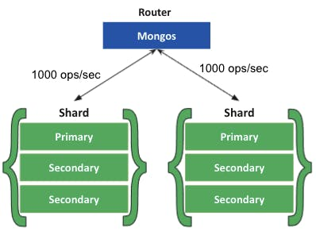
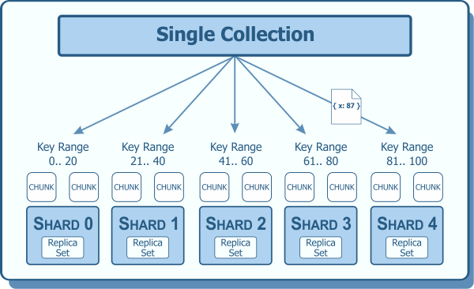
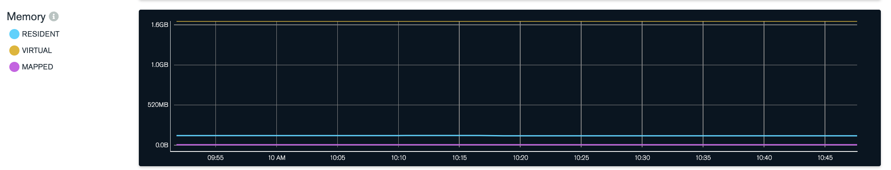
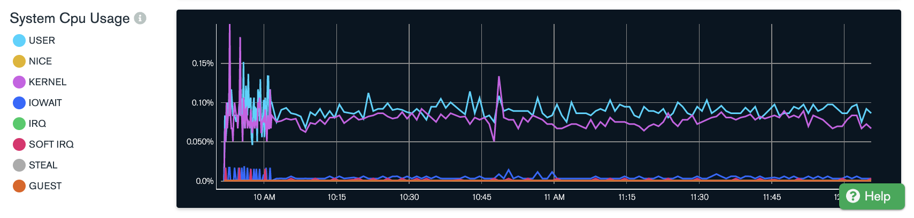
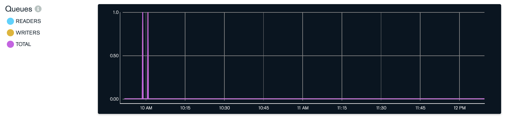

# MongoDB 완벽 가이드

예제 참고

- https://github.com/mongodb-the-definitive-guide-3e/mongodb-the-definitive-guide-3e

# #1 몽고 DB 소개

- 몽고DB의 특징
  - 보조 인덱스
  - 범위 쿼리
  - 정렬
  - 집계
  - 공간 정보 인덱스

## 손쉬운 사용

- 도큐먼트 지향 데이터베이스
  - 몽고DB는 관계형 데이터베이스가 아니라 도큐먼트 지향 데이터베이스다.
  - 행 개념 대신에 보다 유연한 모델인 도큐먼트를 사용한다. 
  - 내장 도큐먼트와 배열을 허용함으로써 도큐먼트 지향 모델은 복잡한 계층관계를 하나의 레코드로 표현할 수 있다.
  - 이 방식은 최신 객체지향언어를 사용하는 개발자의 관점에서 매우 적합하다.
- 스키마리스
  - 고정된 스키마가 없어서 필요할때마다 쉽게 필드를 추가하거나 제거할 수 있다.
  - 스키마 리스로 개발 과정을 빠르게 반복할 수 있어서 개발 속도가 향상된다.

## 확장 가능한 설계

- 몽고 DB는 분산 확장을 염두에 두고 설계했다.
  - 도큐먼트 지향 데이터 모델은 데이터를 여러 서버에 더 쉽게 분산하게 해준다.

## 다양한 기능

`인덱싱`

- 몽고 DB는 일반적인 보조 인덱스를 지원하며 고유, 복합, 공간 정보, 전문 인덱싱 기능도 제공한다.
- nested 도큐먼트 및 배열과 같은 계층 구조의 보조 인덱스도 지원한다.
- 개발자는 모델링 기능을 자신의 애플리케이션에 가장 적합한 방식으로 최대한 활용할 수 있다.

`집계`

- 몽고DB는 데이터 처리 파이프라인 개념을 기반으로 한 집계 프레임워크를 제공한다.
- 집계 파이프라인은 데이터베이스 최적화를 최대한 활용해, 서버 측에서 비교적 간단한 일련의 단계로 데이터를 처리함으로써 복잡한 분석 엔진을 구축하게 해준다.

`특수한 컬렉션 유형`

- 몽고 DB는 로그와 같은 최신 데이터를 유지하고자 세션이나 고정 크기 컬렉션과 같이 특정 시간에 만료해야 하는 데이터에 대해 유효 시간 TTL 컬렉션을 지원한다.
- 기준 필터와 일치하는 도큐먼트에 한정된 부분 인덱스를 지원함으로써 효율성을 높이고 필요한 저장 공간을 줄인다.

`파일 스토리지`

- 몽고DB는 큰 파일과 파일 메타데이터를 편리하게 저장하는 프로토콜을 지원한다.

## 고성능

- 몽고DB의 주요 목표 = 성능
  - 몽고DB에서는 동시성과 처리량을 극대화하기 위해 와이어드타이거 스토리지 엔진에 기회적 락을 사용했다. 따라서 캐시처럼 제한된 용량의 램으로 쿼리에 알맞는 인덱스를 자동으로 선택할 수 있게 해준다.
- 몽고DB는 강력한 성능을 제공하면서도 관계형 시스템의 많은 기능을 포함한다.

## 몽고DB의 철학

- 몽고DB의 주 관심사는 확장성이 높으며 유연하고 빠른, 즉 완전한 기능을 갖춘 데이터 스토리지를 만드는 일이다.

# #2 몽고DB 기본

- 몽고DB 기본 개념
  - 몽고 DB 데이터의 기본 단위는 도큐먼트이고 이는 관계형 데이터베이스의 행과 유사하지만 더 강력하다.
  - 같은 맥락에서 몽고DB의 컬렉션은 동적 스키마가 있는 RDB 테이블과 같다.
  - 몽고DB단일 인스턴스는 자체적인 컬렉션을 갖는 여러개의 독립적인 데이터베이스를 호스팅한다.
  - 모든 도큐먼트는 컬렉션 내에서 고유한 특수키인 "_id"를 가진다.
  - 몽고DB는 몽고 셸이라는 간단하지만 강력한 도구와 함께 배포된다 몽고셸은 몽고DB인스턴스를 관리하고 몽고DB 쿼리 언어로 데이터를 조작하기 위한 내장 지원을 제공한다 또한 사용자가 다양한 목적으로 자신의 스크립트를 만들고 로드할 수 있는 완전한 기능의 자바스크립트 해석기다.

## 도큐먼트

- 몽고DB의 핵심
  - 정렬된 키와 연결된 값으로 이뤄진 도큐먼트

```json
// "greeting" 이라는 키에 "Hello, world!"라는 값을 가진 도큐먼트
{"greeting": "Hello, world!"}

// "greeting" 이라는 키에 "Hello, world!"라는 값을 갖고 "view"라는 키에 3이라는 값을 가진 도큐먼트
{"greeting": "Hello, world!", "view" : 3}
```

- 도뮤컨트의 키는 문자열이다. 다음 예외 몇가지를 제외하면 어떤 UTF-8 문자든 쓸 수 있다.
  - 키는 \\0(null)을 포함하지 않는다 \\0은 키의 끝을 나타내는 데 사용된다.
  - .과 $문자는 몇가지 특별한 속성을 가지며 특정 상황에서만 사용해야 한다. 이들은 예약어이기 때문에 부적절하게 사용하면 드라이버에서 경고를 발생한다.
- 몽고 DB는 데이터형과 대소문자를 구별한다.
- 또한 몽고DB에서는 키가 중복될 수 없다.

```json
{"count": 5}
{"count": "5"}

{"count": 5}
{"Count": 5}
```

## 컬렉션

- 컬렉션은 도큐먼트의 모음이다.
- 몽고 DB의 도큐먼트가 관계형 데이터베이스의 행에 대응된다면 컬렉션은 테이블에 대응된다고 볼 수 있다.

### 동적 스키마

- 컬렉션은 동적 스키마를 가진다.
  
  - 하나의 컬렉션 내 도큐먼트들이 모두 다른 구조를 가질 수 있다.
  
  - ```json
    {"greeting": "Hello, world!", "view" : 3}
    {"signoff": "Good night, and good luck"}
    ```

- 그럼에도 하나의 컬렉션에 다양한 도큐먼트들을 넣지 않는 이유
  
  - 같은 컬렉션에 다른 종류의 도큐먼트를 저장하면 개발자와 관리자에게 번거로운 일이 생길수도 있다.
  - 컬렉션별로 목록을 뽑으면 한 컬렉션 내 특정 데이터형별로 쿼리해서 목록을 뽑을 때보다 훨씬 빠르다.
  - 같은 종류의 데이터를 하나의 컬렉션에 모아두면 데이터 지역성에 좋다.
  - 인덱스를 만드려면 도큐먼트는 특정 구조를 가져야 한다. 인덱스는 컬렉션별로 정의한다. 같은 유형의 도큐먼트를 하나의 컬렉션에 넣음으로써 컬렉션을 효율적으로 인덱싱할 수 있다.

### 네이밍

- 컬렉션은 이름으로 식별된다. 몇가지 제약조건
  - 빈 문자열은 유효한 컬렉션 명이 아니다.
  - \\0(null)문자는 컬렉션명의 끝을 나타내는 문자이므로 컬렉션명에 사용할 수 없다.
  - system.으로 시작하는 컬렉션명은 시스템 컬렉션에서 사용하는 예약어이므로 사용할 수 없다. 예를 들어 system.users 컬렉션에는 데이터베이스 사용자 정보가, system.namespace 컬렉션에는 데이터베이스 내 모든 컬렉션의 정보가 들어있다.
  - 사용자가 만든 컬렉션은 이름에 예약어인 $를 포함할 수 없다.

`서브 컬렉션`

- 서브컬렉션은 네임스페이스에 .(마침표) 문자를 사용해 컬렉션을 체계화할 수 있다.
  - ex: blog.post, blog.authors
  - 이는 단지 체계화하기 위함이며 blog 컬렉션이나 자식 컬렉션과는 아무런 관계가 없다. (심지어 blog 컬렉션은 없어도 된다.)
- 서브컬렉션은 특별한 속성은 없지만 여러 몽고DB 툴에서 지원하므로 유용하다.
  - 큰 파일을 저장하는 프로토콜인 GridFS는 콘텐츠 데이터와 별도로 메타데이터를 저장하는 데 서브컬렉션을 사용한다. (GridFS는 6장에서 자세히 .. )
  - 대부분의 드라이버는 특정 컬렉션의 서브컬렉션에 접근하는 몇 가지 편리한 문법을 제공한다.
- 서브컬렉션은 몽고DB의 데이터를 체계화하는 훌륭한 방법이다.

## 데이터베이스

- 몽고 DB는 데이터베이스(스키마)에 컬렉션을 그룹지어 놓는다.
  - 데이터베이스 > 컬렉션 > 도큐먼트
- 몽고 DB의 단일 인스턴스와 데이터베이스
  - 몽고 DB의 단일 인스턴스는 여러 데이터베이스를 호스팅할 수 있다.
  - 각 데이터베이스를 완전히 독립적으로 취급할 수 있다.
- 데이터베이스 명에대한 몇가지 제약
  - 빈 문자열은은 유효한 데이터베이스 이름이 아니다.
  - 데이터베이스 이름은 다음 문자를 포함할 수 없다. `\, /, ., ' ', *, <, >, :, |, ?, $, \0`
  - 데이터베이스 이름은 대소문자를 구별한다.
  - 데이터베이스 이름은 최대 64바이트다.
- 예약된 데이터베이스 이름들
  - admin: 데이터베이스 인증과 권한 부여 역할을 한다.
  - local: 단일 서버에 대한 데이터를 저장한다.
  - config: 샤딩된 몽고DB 클러스터는 config 데이터베이스를 사용해 각 샤드의 정보를 저장한다.

## 몽고DB 시작

```
docker run --name some-mongo -d mongo:tag
```

- mongod는 인수 없이 실행하면 기본 데이터 디렉토리로 /data/db 를 사용한다. 데이터 디렉토리가 존재하지 않거나 쓰기 권한이 없을 때는 서버가 시작되지 않으므로 주의하자.


## 몽고DB 셸 소개

- 몽고 DB 명령행에서는 몽고DB 인스턴스와 상호작용하는 자바스크립트 셸을 제공한다.
- 셸은 관리 기능, 실행중인 인스턴스를 점검하거나 간단한 기능을 시험하는 데 매우 유용하다.

### 셸 실행

- 셸은 완전한 자바스크립트 해석기이고 임의의 자바스크립트 프로그램을 실행한다.

```
mongo
MongoDB shell version v5.0.9

> x = 200;
200
> x / 5;
40
```

- 표준 자바스크립트 라이브러리의 모든 기능을 활용할 수 있다.

```javascript
> Math.sin(Math.PI / 2)
1
> new Date("2019/1/1");
ISODate("2019-01-01T00:00:00Z")
> "Hello, World!".replace("World", "MongoDB");
Hello, MongoDB!
```

- 자바스크립트 함수를 정의하고 호출할 수도 있다.

```javascript
> function factorial (n) {
... if (n <= 1) return 1;
... return n * factorial(n - 1);
... }
> factorial(5);
120
```

### 몽고DB 클라이언트

- 셸은 시작할 때 test 데이터베이스에 연결하고 데이터베이스 연결을 전역 변수 db에 할당한다.

```
> db
test

// video 데이터베이스 선택
> use video
switched to db video

> db
video

// db변수에서 컬렉션 접근하기
> db.movies
video.movies
```

### 셸 기본 작업

- 셸에서 데이터를 조작하거나 보려면 생성, 읽기, 갱신, 삭제의 네가지 기본적인 작업을 한다.

`생성`

- insertOne 함수는 컬렉션에 도큐먼트를 추가한다.

```json
> movie = {"title" : "Star Wars: Episode IV - A New Hope", "director" : "George Lucas", "year" : 1977}
{
    "title" : "Star Wars: Episode IV - A New Hope",
    "director" : "George Lucas",
    "year" : 1977
}
> db.movies.insertOne(movie)
{
    "acknowledged" : true,
    "insertedId" : ObjectId("62e3e6439bac1dcffb872981")
}
```

- find() 로 찾기

```json
> db.movies.find().pretty()
{
    "_id" : ObjectId("62e3e6439bac1dcffb872981"), // 갑툭튀한 _id 필드는 아래에서 설명
    "title" : "Star Wars: Episode IV - A New Hope",
    "director" : "George Lucas",
    "year" : 1977
}
```

`읽기`

- find와 findOne은 컬렉션을 쿼리하는데 사용한다
- 컬렉션에서 단일 도큐먼트를 읽으려면 findOne을 사용한다.

```json
> db.movies.findOne()
{
    "_id" : ObjectId("62e3e6439bac1dcffb872981"),
    "title" : "Star Wars: Episode IV - A New Hope",
    "director" : "George Lucas",
    "year" : 1977
}
```

- find와 findOne은 쿼리 도큐먼트 형태로 조건 전달도 가능하다.
- 셸은 기본적으로 find와 일치하는 도큐먼트를 20개까지 자동으로 출력한다. (쿼리는 4장에서 ...)

`갱신`

- 게시물을 갱신하려면 updateOne을 사용한다.
- updateOne의 매개변수
  - 첫번째는 수정할 도큐먼트를 찾는 기준이다.
  - 두 번째는 갱신 작업을 설명하는 도큐먼트다.
- 갱신을위해 $set연산자를 사용한다.

```json
> db.movies.updateOne({title : "Star Wars: Episode IV - A New Hope"}, {$set : {reviews: []}})
{ "acknowledged" : true, "matchedCount" : 1, "modifiedCount" : 1 }

> db.movies.findOne()
{
    "_id" : ObjectId("62e3e6439bac1dcffb872981"),
    "title" : "Star Wars: Episode IV - A New Hope",
    "director" : "George Lucas",
    "year" : 1977,
    "reviews" : [ ]
}
```

`삭제`

- deleteOne과 deleteMany는 도큐먼트를 데이터베이스에서 영구적으로 삭제한다.

```json
> db.movies.deleteOne({title : "Star Wars: Episode IV - A New Hope"})
{ "acknowledged" : true, "deletedCount" : 1 }

> db.movies.findOne()
null
```

## 데이터형

### 기본 데이터형

- 몽고DB 의 데이터 타입 
  - https://www.mongodb.com/docs/mongodb-shell/reference/data-types/
  - https://www.geeksforgeeks.org/datatypes-in-mongodb/
- 몽고DB는 모든 데이터를 JSON으로 표현하기 때문에 간결하지만 단점도 있다. (json에서는..)날짜형이 없어서 날짜 다루기가 일반적으로 더 성가시고 (json에서는..)부동소수점형과 정수형을 표현하는 방법은 없으며 (json에서는..)32비트와 64비트도 구별되지 않는다. (json에서는..)함수나 정규표현식과 같은 흔히 쓰는 데이터형을 표현하는 방법도 없다.

`null`

- null 값과 존재하지 않는 필드를 사용한다.

```
{"x": nul}
```

`불리언`

- 참과 거짓 값에 사용한다.

```
{"x": true}
```

`숫자`

- 셸은 64비트 부동소수점 수를 기본으로 사용한다.

```
{"x": 3.14}
{"x": 3}
```

`문자열`

- 어떤 UTF-8 문자열이든 문자열형으로 표현할 수 있다.

```
{"x": "foobar"}
```

`날짜`

- 몽고DB는 1970년 1월 1일부터의 시간을 1/1000초 단위로 나타내는 64비트 정수로 날짜를 저장한다. 표준 시간대는 저장하지 않는다.

```
{"x": new Date()}
```

`정규 표현식`

- 쿼리는 자바스크립트의 정규 표현식 문법을 사용할 수 있다.

```
{"x": /foobar/i}
```

`배열`

- 값의 셋이나 리스트를 배열로 표현할 수 있다.

```
{"x": ["a", "b", "c"]}
```

`내장 도큐먼트`

- 도큐먼트는 부모 도큐먼트의 값으로 내장된 도큐먼트 전체를 포함할 수 있다.

```
{"x": {"foo": "bar"}}
```

`객체 ID`

- 객체 ID는 도큐먼트용 12바이트 ID다.

```
{"x": ObjectId()}
```

- 상대적으로 덜 사용되는 데이터형 목록들
  - 이진데이터
  - 코드
  
    - 쿼리와 도큐먼트는 임으의 자바스크립트 코드를 포함할 수 있다.
  
    - ```
      {"x" : function() { /*...*/ }}
      ```
  
      

### 날짜

- 자바스크립트에서 Date클래스는 몽고DB의 날짜를 표현하는 데 사용한다.
- 새로운 Date 객체를 생성할 때는 반드시 new Date()를 사용해야 한다.
- 셸에서는 날짜가 현지 시간대 설정을 이용해 표시된다. 하지만 데이터베이스의 날짜는 1970년 1월1일부터의 시간을 1/10000초 단위로 저장하며 표준 시간대는 없다. (표준 시간대 정보를 또 다른 키 값으로 저장하면 되긴 한다.)

### 배열

```
{"things": ["pie", 3.14]}
```

- 배열은 서로 다른 데이터형을 값으로 포함할 수 있다.
- 배열값은 일반적인 키/값 쌍을 지원하는 어떤 데이터형 값이든 될 수 있다.
- 몽고DB에서 배열의 장점
  - 몽고DB는 배열의 구조를 이해해서 배열의 내용에 작업을 수행하기 위해 내부에 도달하는 방법을 알고 있다. 
  - 따라서 인덱스를 생성해 쿼리의 속도를 향상시킬 수 있다.
  - 배열 내부에 도달해서 원자적으로 배열의 내용을 수정하게 할 수 있다.

### 내장 도큐먼트

- 내장 도큐먼트를 사용해 데이터를 키/값 쌍의 평면적인 구조보다는 좀 더 자연스러운 방법으로 구성할 수 있다.

```json
{
  "name": "John Doe",
  "address": {
    "street": "123 Park Street",
    "city": "Anytown",
    "state": "NY"
  }
}
```

- 배열과 마찬가지로 몽고DB는 내장 도큐먼트의 구조를 이해하고 인덱스를 구성하고 쿼리하며 갱신하기 위해 내장 도큐먼트 내부에 접근한다.
- 이런 내장 도큐먼트의 특징은 데이터를 다 때려박을 수 있다는건데 정규화가 있는 관계형 데이터베이스보다 유연하다는 장점이 있지만 데이터 중복과 조인에서 얻을 수 있는 간결함을 얻을 수 없다.

### _id와 ObjectId

- 몽고DB에 저장된 모든 도큐먼트는 _id 키를 갖는다.
- _id는 어떤 데이터형도 상관없지만 기본적으로 ObjectId 가 기본이다.
- 모든 도큐먼트는 고유한 _id 값을 가지며 이 값은 컬렉션 내 모든 도큐먼트가 고유하게 식별되게 한다.

`ObjectIds`

- ObjectId를 사용하는 이유
  - 자동증가 아이디가 아니라 ObjectId를 사용하는 주요 이유는 몽고DB의 분산 특성때문이다.
  - 여러 서버에 걸쳐서 자동으로 증가하는 기본 키를 동기화하는 작업은 어렵고 시간이 걸린다.
  - 몽고DB는 분산 데이터베이스로 설계됐기 때문에 샤딩된 환경에서 고유 식별자를 생성하는 것이 매우 중요했다.
- ObjectId
  - ObjectId는 12바이트 스토리지를 사용하여 24자리 16진수 문자열 표현이 가능하다.
  - 바이트당 2자리를 사용한다. 실제로 문자열은 저장된 데이터의 두 배만큼 길다는 점을 알아두자.
- ObjectId의 타임스탬프
  - ObjectId의 첫 4바이트는 1970년 1월 1일부터의 시간을 1/1000초 단위로 저장하는 타임스탬프다.
  - 타임스탬프의 몇가지 유용한 속성
    - 타임스탬프는 그 다음 5바이트와 묶일 때 초 단위의 유일성을 제공한다.
    - 타임스탬프가 맨 처음에 온다는 것은 ObjectId가 대략 입력 순서대로 정렬된다는 의미다. 이는 확실히 보장되진 않지만 ObjectId를 인덱싱하는 장점을 얻을 수 있다.
    - 이 4바이트에는 각 도큐먼트가 생성된 때의 잠재적인 타임스탬프가 존재한다. 대부분의 드라이버는 ObjectId로부터 이런 정보를 추출하는 방법을 제공한다.
  - 타임스탬프를 사용한다고해서 서버의 시간을 동기화해야할 필요는 없다. 타임스탬프의 실제 값은 ObjectId와 상관없다.
- ObjectId의 앞9바이트는 1초동안 여러 장비와 프로세스에 걸쳐 유일성을 보장한다. 마지막 3바이트는 단순히 증분하는 숫자로 1초 내 단일 프로세스의 유일성을 보장한다.
- 고유한 ObjectId는 프로세스당 1초에 1677만개까지 생성된다.

`_id 자동생성`

- 도큐먼트를 입력할 때 "_id" 키를 명시하지 않으면 입력된 도큐먼트에 키가 자동으로 추가된다.
- 이는 몽고DB 서버에서 관리할 수 있지만 일반적으로 클라이언트 쪽 드라이버에서 관리한다.

## 몽고DB 셸 사용

- 셸은 사용자 시스템에서 연결할 수 있는 어떤 몽고DB 인스턴스든 연결할 수 있다.
- 셸을 시작할 때 호스트명, 포트, 데이터베이스를 명시해야 한다.

```
mongo some-host:30000/myDB
```

### 셸 활용 팁

- mongo는 자바스크립트 셸이므로 온라인 자바스크립트 문서를 참고하면 유용하다
- help로 셸에 내장된 도움말을 볼 수 있다.
  - 데이터베이스 수준의 도움말은 db.help()
  - 컬렉션 수준의 도움말은 db.foo.help()
- 함수의 기능을 알고 싶으면 함수명을 괄호 없이 입력하면 된다.

```javascript
> db.movies.findOne
function(query, fields, options, readConcern, collation) {
    var cursor = this.find(query, fields, -1 /* limit */, 0 /* skip*/, 0 /* batchSize */, options);

    if (readConcern) {
        cursor = cursor.readConcern(readConcern);
    }

    if (collation) {
        cursor = cursor.collation(collation);
    }

    if (!cursor.hasNext())
        return null;
    var ret = cursor.next();
    if (cursor.hasNext())
        throw Error("findOne has more than 1 result!");
    if (ret.$err)
        throw _getErrorWithCode(ret, "error " + tojson(ret));
    return ret;
}
```

### 셸에서 스크립트 실행하기

- 다음과 같이 자바스크립트 파일을 셸로 넘길 수도 있다.

```
mongo script1.js script2.js ...
```

- load 함수를 사용할 수도 있다.

```
load("script1.js")
```

- 스크립트는 db 변수에 대한 접근 권한을 가진다. 하지만 use db나 show collections와 같은 셸 보조자는 파일에서 작동하지 않는다.
- 셸 보조자와 대응하는 자바스크립트 함수

| 셸 보조자            | 같은 의미의 자바스크립트           |
| ---------------- | ----------------------- |
| use video        | db.getSisterDB("video") |
| show dbs         | db.getMongo().getDBs()  |
| show collections | db.getCollectionNames() |

- 스크립트를 사용해 셸에 변수를 입력할 수도 있다.

```javascript
//defineConnectTo.js

var connectTo = function(port, dbname) {
 if (!port) {
 port = 27017;
 }
 if (!dbname) {
 dbname = "test";
 } 
 db = connect("localhost:"+port+"/"+dbname);
 return db;
};
```

- 이 스크립트를 셸에 로드하면 connectTo가 비로소 정의된다.

```
> typeof connectTo
undefined
> load('defineConnectTo.js')
> typeof connectTo
function
```

- 기본적으로 셸은 셸을 시작한 디렉터리에서 스크립트를 찾는다. 셸을 시작한 디렉터리를 확인하려면 run("pwd") 명령어를 사용한다.
- 스크립트가 현재 디렉터리에 없다면 상대 또는 절대경로를 제공하면 된다.

### .mongorc.js 만들기

- 자주 로드되는 스크립트 (셸이 시작할 때마다 실행되는)를 .mongorc.js 파일에 넣을 수 있다.
- .mongorc.js의 역할
  - 사용하고 싶은 전역변수 설정
  - alias 설정
  - 내장 함수 재정의
  - 위험한 셸 보조자 제거 (dropDatabase, deleteIndexes ... )
- 셸을 시작할때 --norc 옵션을 사용해 .mongorc.js의 로딩을 비활성화할 수도 있다.

### 프롬프트 커스터마이징하기

- 기본 셸 프롬프트는 문자열이나 함수에 prompt 변수를 설정해 재정의한다.

```
// 마지막 작업이 완료된 시각을 얻는 프롬프트
> prompt = function() {
...   return (new Date()) + "> ";
... }
function() {
  return (new Date()) + "> ";
}
Tue Oct 18 2022 13:27:25 GMT+0000 (UTC)> 
Tue Oct 18 2022 13:27:27 GMT+0000 (UTC)> 
Tue Oct 18 2022 13:27:27 GMT+0000 (UTC)> 
Tue Oct 18 2022 13:27:28 GMT+0000 (UTC)> 
Tue Oct 18 2022 13:27:28 GMT+0000 (UTC)> 
```

- 프롬프트 함수는 문자열을 반환하고 예외를 잡는 데 주의를 기울여야 한다.
- 항상 사용자 정의 프롬프트를 사용하려면 .mongorc.js를 사용하자.

### 복잡한 변수 수정하기

- 셸에서 다중행 지원은 다소 제한적이며 이전 행들을 편집할 수 없다. 따라서 코드나 객체 블록이 크면 에디터에서 편집하는게 좋다.

```
EDITOR="/usr/bin/emacs"

// edit {변수명} 형식으로 변수를 편집할 수 있다.
var wap = db.books.findOne({title: "War and Peace"});
edit wap
```


### 불편한 컬렉션명

- 컬렉션명이 예약어가 아니거나 유효하지 않은 자바스크립트 속셩명이 아니라면 db.collectionName으로 컬렉션을 항상 가져올 수 있다.
- 그럼에도 불구하고 특정 collectionName을 사용해야하는 경우 아래와 같이 사용하면 된다.

```
db.getCollection("version")
```

- 자바스크립트의 배열 접근 구문을 사용해서 컬렉션에 접근할 수도 있다
  - 자바스크립트에서 x.y는 x['y']와 동일하다.

```
var collections = ["posts", "comments", "authors"];

for (var i in collections) {
  print(db.blog[collections[i]]);
}
```

- 접근하려는 컬렉션의 이름이 다루기 힘든 경우에는 다음과 같은 방법을 사용한다.

```
var name = "@#$%"
db[name].find()
```


# #3 도큐먼트 생성, 갱신, 삭제

## 도큐먼트 삽입

- 삽입은 몽고DB에 데이터를 추가하는 기본 방법이다.

```
db.movies.insertOne({"title" : "Stand by Me"})
```

- _id 키는 자동으로 저장된다.

### insertMany

- 여러 도큐먼트를 컬렉션에 삽입하려면 insertMany로 도큐먼트 배열을 데이터베이스에 전달한다.

```
> db.movies.drop()
true
> db.movies.insertMany([
... {"title" : "Ghostbusters"},
... {"title" : "E.T."},
... {"title" : "Blade Runner"}]);
{
    "acknowledged" : true,
    "insertedIds" : [
        ObjectId("62e486759bac1dcffb872982"),
        ObjectId("62e486759bac1dcffb872983"),
        ObjectId("62e486759bac1dcffb872984")
    ]
}
> db.movies.find()
{ "_id" : ObjectId("62e486759bac1dcffb872982"), "title" : "Ghostbusters" }
{ "_id" : ObjectId("62e486759bac1dcffb872983"), "title" : "E.T." }
{ "_id" : ObjectId("62e486759bac1dcffb872984"), "title" : "Blade Runner" }
```

- insertMany는 여러 도큐먼트를 단일 컬렉션에 삽입할 때 유용하다.
- insertMany의 두번째 파라미터인 옵션 도큐먼트
  - 도큐먼트가 제공된 순서대로 삽입되도록 옵션 도큐먼트에 "ordered"키에 true를 지정한다.
  - false를 지정하면 몽고DB가 성능을 개선하려고 삽입을 재배열할 수 있다.
  - 정렬된 삽입
    - 순서가 지정되 않았다면 정렬된 삽입이 기본 값이다. 
    - 정렬된 삽입의 경우 삽입에 전달된 배열이 삽입 순서를 정의한다.
    - 도큐먼트가 삽입 오류를 생성하면, 배열에서 해당 지점을 벗어난 도큐먼트는 삽입되지 않는다.
  - 정렬되지 않은 삽입
    - 몽고DB는 일부 삽입이 오류를 발생시키는지 여부에 관계 없이 모든 도큐먼트 삽입을 시도한다.

### 삽입 유효성 검사

- 몽고DB의 삽입 전 검사
  - _id 필드가 존재하지 않으면 새로 추가
  - 모든 도큐먼트가 16메가 바이트보다 작아야하므로 크기를 검사

### 삽입

- 몽고 3.0이전에서는 insert를 사용했다.
- 몽고 3.2이후로 insertOne과 insertMany가 들어왔다. insert를 지양하자.

## 도큐먼트 삭제

- 도큐먼트 삭제는 deleteOne과 deleteMany를 사용한다.

```
> db.movies.find()
{ "_id" : ObjectId("62e486759bac1dcffb872982"), "title" : "Ghostbusters" }
{ "_id" : ObjectId("62e486759bac1dcffb872983"), "title" : "E.T." }
{ "_id" : ObjectId("62e486759bac1dcffb872984"), "title" : "Blade Runner" }
> db.movies.deleteOne({"_id" : ObjectId("62e486759bac1dcffb872982")})
{ "acknowledged" : true, "deletedCount" : 1 }
> db.movies.find()
{ "_id" : ObjectId("62e486759bac1dcffb872983"), "title" : "E.T." }
{ "_id" : ObjectId("62e486759bac1dcffb872984"), "title" : "Blade Runner" }
db.movies.deleteMany({"year" : 1984})
db.movies.find()
```

- deleteOne은 필터와 일리하는 첫번째 도큐먼트를 삭제한다.
  - 어떤 도큐먼트가 먼저 발견되는지는 도큐먼트가 삽입된 순서, 도큐먼트에 어떤 갱신이 이뤄졌는지, 어떤 인덱스를 지정하는지 등 몇가지 요인에 따라 달라진다.
- deleteMany는 필터와 일치하는 모든 도큐먼트를 삭제한다.

```
db.mailing.list.delteMany({"opt-out" : true})
```

### drop

- deleteMany로 전체 컬렉션을 삭제할 수도 있지만 drop을 사용하는 편이 더 빠르다.

```
db.movies.deleteMany({})

db.movies.drop()
```

## 도큐먼트 갱신

- 도큐먼트를 데이터베이스에 저장한 후에는 updateOne, updateMany, replaceOne과 같은 갱신 메서드를 사용해 변경한다.
- 최후의 승리자
  - 갱신은 원자적으로 이뤄진다. 
  - 갱신 요청 두 개가 동시에 발생하면 서버에 먼저 도착한 요청이 적용된 후 다음 요청이 적용된다.
  - 결국 마지막 요청이 최후의 승리자가 되므로 도큐먼트는 변질 없이 안전하게 처리된다.

### 도큐먼트 치환

- replaceOne은 도큐먼트를 새로운것으로 완전히 치환한다.
- 대대적인 스키마 마이그레이션에 유용하다.
- replaceOne 주의할점
  - 조건절에 2개 이상의 도큐먼트가 일치되는 조건을 입력했을 경우 이때 데이터베이스는 오류를 반환하고 아무것도 변경하지 않는다.
  - 가능하다면 _id키로 일치하는 코유한 도큐먼트를 찾아 갱신 대상으로 지정하는 것이 좋다.

```
db.people.replaceOne({"_id" : "ObjectId(1234....)"}, joe)
```

### 갱신 연산자

- 부분 갱신에는 원자적 갱신연산자를 사용한다.

- $inc 제한자
  
  - 누군가가 페에지를 방문할 때마다 URL로 페이지를 찾고 "pageviews" 키의 값을 증가시키려면 $inc 제한자를 사용한다
  
  - ```
    db.analytics.updateOne({"url": "www.example.com"}, {"$inc": {"pageviews": 1}})
    ```

- 연산자를 사용할때 _id값은 변경할 수 없다. 변경하려면 도큐먼트 전체를 치환한다.

`"$set" 제한자 사용하기`

- $set 은 필드값을 설정한다. 필드가 존재하지 않으면 새 필드가 생성된다.
- 이 기능은 스키마를 갱신하거나 사용자 정의 키를 추가할 때 편리하다.

```
db.analytics.updateOne({"url": "www.example.com"}, {"$set": {"favorite book": "AAA"}})
```

- 배열로도 입력할 수 있다.

```
db.analytics.updateOne({"url": "www.example.com"}, {"$set": {"favorite book": ["AAA", "BBB"]}})
```

- 필드를 제거하려면 $unset으로 키와 값을 모두 제거할 수 있다.

```
db.analytics.updateOne({"url": "www.example.com"}, {"$unset": {"favorite book": 1})
```

- $set은 nested 도큐먼트를 변경할 때도 사용한다.
- 키를 추가, 변경, 삭제할 때는 항상 $ 제한자를 사용해야 한다.

`증가와 감소`

- $inc 연산자는 이미 존재하는 키의 값을 변경하거나 새 키를 생성하는 데 사용한다.
- $inc는 $set과 비슷하지만 숫자를 증감하기 위해 설계됐다
  - int, long, double, dcimal 타입에만 사용할 수 있다.
  - 값은 반드시 숫자여야 한다.

`배열 연산자`

- $push는 배열이 이미 존재하면 배열 끝에 요소를 추가하고 존재하지 않으면 새로운 배열을 생성한다. 

```
db.blog.posts.findOne()
db.blog.posts.updateOne({"title": "A blog post", 
  {"$push" : {"commonts" : {"name" : "joe" ...}}}
})
```

- $push와 함께 사용할 수 있는 제한자
  - $each
  - $slice
  - $sort

`배열을 집합으로 사용하기`

- 배열을 집합처럼 처리하려면 쿼리 도큐먼트에 $ne를 사용한다.

```
db.papers.updateOne({"authors cited" : {"$ne" : "Richie"}}, {"$push": {"authors cited": "Richie"}})
```

- $addToSet을 사용할 수도 있다. $addToSet을 사용하면 무슨일이 일어났는지 더 잘 알 수 있다.
- 고유한 값을 여러개 추가하려면 $addToSet과 $each를 결합해서 사용한다.

`요소 제거하기`

- $pop
  
  - 배열을 큐나 스택처럼 사용하려면 배열의 양쪽 끝에서 요소를 제거하는 $pop을 사용한다.
  
  - ```
    {"$pop" : {"key" : 1}}
    ```
    
    - 배열의 마지막부터 요소를 제거
  
  - ```
    {"$pop" : {"key" : -1}}
    ```
    
    - 배열의 처음부터 요소를 제거

- $pull
  
  - 지정된 조건에 따라 요소를 제거할때는  $pull을 사용한다.
  
  - ```
    db.lists.updateOne({}, {"$pull" : {"todo": "laundry"}})
    ```
  
  - 지정된 조건이 일치하는 모든 요소를 제거한다.

`배열의 위치 기반 변경`

- 배열 내 여러 값을 다루는 방법
  - 위치를 이용하기
  - 위치 연산자 $를 사용하기
- 배열 인덱스는 기준이 0이고 배열 요소는 인덱스를 도큐먼트의 키처럼 사용한다.
- 따라서 첫번째 댓글의 투표수를 증가시키려면 다음과 같이 사용하는데 이 쿼리는 문제가 있다.

```
// 인덱스를 기반으로 접근하면 배열의 몇 번째 요소를 변경할지 알 수 없다.
db.blog.updateOne({"post"} : post_id), {"$inc" : {"comments.0.votes" : 1}}
```

- 따라서 위 쿼리는 아래와 같이 $ 연산자를 사용하면 된다.

```
db.blog.update({"comments.author": "John"}),
{"$set" : {"comments.$.author" : "Jim"}}
```

- John이라는 사용자가 이름을 Jim으로 갱신하려고할 때, 위치 연산자를 사용해서 댓글 내 author를 갱신한다.
- 위치연산자는 첫 번째로 일치하는 요소만 갱신한다. 따라서 John이 댓글을 2개 이상 남겼다면 처음 남긴 댓글의 작성자 명만 변경된다.

`배열 필터를 이용한 갱신`

- arrayFilters
  
  - 몽고 3.6 에서는 개별 배열 요소를 갱신하는 배열 필터인 arrayFilters를 도입해 특정 조건에 맞는 배열 요소를 갱신할 수 있다.
  
  - ```
    db.blog.updateOne(
      {"post" : post_id},
      { $set: { "comments.$[elem].hidden " : true} },
      {
        arrayFilters: [ { "elem.votes": { $lte: -5 } } ]
      }
    )
    ```
  
  - comments 배열의 각 일치 요소에 대한 식별자로 elem을 정의한다. elem이 식별한 댓글의 투표값이 -5 이하면 comments 도큐먼트에 hidden 필드를 추가하고 값을 true로 설정한다.

### 갱신 입력

- 갱신입력
  
  - 갱신 조건에 맞는 도큐먼트가 존재하지 않을 때는 쿼리 도큐먼트와 갱신 도큐먼트를 합쳐서 새로운 도큐먼트를 생성한다.
  - 조건에 맞는 도큐먼트가 발견되면 일반적인 갱신을 수행한다.

- 갱신입력 == upsert
  
  - upsert에서 얻는 장점들을 다 가져올 수 있다.
    - 특정 조건을 확인하기위해 데이터베이스에 쿼리하고 쿼리의 결과를 기반으로 update 또는 insert하는 과정이 없어서 원자적이고 데이터베이스 왕복도 피할 수 있다.

- ```
  db.analytics.updateOne({"url" : "/blog"} , {"$inc" : {"pageviews" : 1}},
    {"upsert" : true})
  ```

### 다중 도큐먼트 갱신

### 갱신한 도큐먼트 반환

# #4 쿼리

## find 소개

- 몽고db 에서 find 함수는 쿼리에 사용한다.
- find의 첫 매개변수에 따라 어떤 도큐먼트를 가져올지 결정된다.
- 빈 쿼리 도큐먼트 ( {} )는 컬렉션 내 모든 것과 일치한다. 매개변수에 쿼리 도큐먼트가 없으면 find 함수는 빈 쿼리 도큐먼트를 {} 로 인식한다. 따라서 `db.c.find()` 형태의 명령은 모든 도큐먼트와 일치하므로 컬렉션 c 내 모든 도큐먼트를 반환한다.
- 쿼리 도큐먼트에 여러 키/값 쌍을 추가해 검색을 제한할 수 있다.

```
// age가 27인 모든 도큐먼트를 찾는 쿼리
db.users.find({"age" : 27})

// username이 joe인 모든 도큐먼트를 찾는 쿼리
db.users.find({"username" : "joe"})

// 여러 조건을 추가할 수 있다.
// ,는 AND 조건으로 동작한다. 
// username, age가 일치하는 모든 사용자를 찾는 쿼리
db.users.find({"username" : "joe", "age" : 27})
```

### 반환받을 키 지정

- 때때로 반환받은 도큐먼트 내 키/값 정보가 모두 필요하지 않을 수 있는데 그럴 때는 find의 두 번째 매개변수에 원하는 키를 지정하면 된다.
- 이는 네트워크상의 데이터 전송량과 클라이언트 측에서 도큐먼트를 디코딩 하는 데 드는 시간과 메모리를 줄여준다.

```
// "username"과 "email"만 리턴받는 쿼리, _id는 지정하지 않아도 항상 반환된다.
db.users.find({}, {"username": 1, "email": 1})

// 특정 키/값 쌍을 제외한 결과를 얻고 싶을때는 값을 0으로 매칭시켜서 제외시킬 수 있다.
db.users.find({}, {"username": 0})
```

### 제약 사항

- 데이터베이스에서 쿼리 도큐먼트 값은 반드시 상수여야 한다.
- 하나의 쿼리에서 도큐먼트 내 다른 키의 값을 참조할 수 없다.

```
// 재고 도큐먼트에 재고 수량 키 "in_stock"과 판매 수량 키 "num_sold"가 있으면 키 값을 다음과 같은 쿼리로 비교할 수 없다.
db.stock.find({"in_stock": "this.num_sold"}) // 작동하지 않음
```

## 쿼리 조건

- 쿼리는 완전 일치, 범위, OR절, 부정 조건 등 더 복잡한 조건으로 검색할 수 있다.

### 쿼리 조건절

- <, <=, >, >= 에 해당하는 비교연산자
  - $lt, $lte, $gt, $gte

```
// 18세 이상 30세 이하의 사용자를 찾는 쿼리
db.users.find({"age" : {"$gte": 18, "$lte" : 30}})


// 2007년 1월 1일 이전에 등록한 사람을 찾는 쿼리
start = new Date("01/01/2007")
db.users.find({"registered" : {"$lt": start}})
```

- 키 값이 특정 값과 일치하지 않는 도큐먼트를 찾는 연산자
  - $ne (not equal)
  - $ne는 모든 데이터형에 사용할 수 있다.

```
db.users.find({"username" : {"$ne", "joe"}})
```

### OR 쿼리

- 몽고DB의 OR쿼리를 날리는 두가지 방법
  - $in
  - $or

`$in`

- 하나의 키 값에 여러개 값이 있을때 $in에 조건 배열을 사용한다.

```
// 당첨자 번호를 뽑는 쿼리
db.raffle.find({"ticket_no" : {"$in" : [725, 542, 390]}})
```

- $in은 서로 다른 데이터형도 쓸 수 있다.

```
// user_id가 12345이거나 joe인 유저를 찾는 쿼리
db.users.find({"user_id": {"$in" : [12345, "joe"]}})
```

- $in의 조건 배열에 값이 하나만 주어지면 바로 일치하는 것을 찾는다 (일반 find와 동일하게 동작)
- $nin은 $in과 반대로 배열 내 조건과 일치하지 않는 도큐먼트를 반환한다.

```
// 당첨되지 않은 사람들을 모두 반환하는 쿼리
db.raffle.find({"ticket_no" : {"$nin" : [725, 542, 390]}})
```

`$or`

- $in은 하나의 키에 대해 OR쿼리를 하고 $or는 여러개의 키에 대한 조건을 지정할 수 있다.

```
db.raffle.find({"$or": [{"ticket_no" : 725} , {"winner" : true}]})
```

- $or는 다른 조건절도 포함할 수 있다.

```
// 당첨번호가 세 번호 중 적어도 하나와 일치하거나 winner가 true인 경우를 찾는 쿼리 
db.raffle.find({"$or": [{"ticket_no" : {"$in" : [725, 542, 390]}, {"winner" : true}]})
```

- AND 쿼리에서는 최소한의 인수로 최적의 결과를 추리는게 좋지만 OR 쿼리는 반대다. 첫 번째 인수가 일치하는 도큐먼트가 많을수록 효율적이다.
- $in을 사용할 수 있다면 $in을 사용하자. 쿼리 옵티마이저는 $in을 더 효율적으로 다룬다.

### $not

- $not은 메타 조건절이며 어떤 조건에도 적용할 수 있다.

```
// $mod는 키의 값을 첫 번째 인수로 나눈 후 그 값의 조건을 두 번째 값으로 기술하는 연산자다.
// 아래 쿼리는 id_num이 1,6,11,16 등인 사용자를 반환한다.
db.users.find({"id_num" : {"$mod" : [5, 1]}})

// 아래 쿼리는 $not이 적용되어 id_num이 2,3,4,5,7,8 인 사용자를 반환한다.
db.users.find({"id_num" : {"$not" : {"$mod" : [5, 1]}}})
```

## 형 특정 쿼리

- 일부 데이터형은 쿼리 시 형에 특정하게 작동한다.

### null

- null은 스스로와 일치하는 것을 찾는다.
- 아래와 같이 도큐먼트 컬렉션이 있다고 가정했을때 null 쿼리는 아래와 같다.

```
db.c.find()
{"_id" : ... "y" : null}
{"_id" : ... "y" : 1}
{"_id" : ... "y" : 2}

db.c.find({"y" : null})
{"_id" : ... "y" : null}
```

- null은 '존재하지 않음' 과도 일치하기 때문에 키가 null인 값을 쿼리하면 해당 키를 갖지 않는 도큐먼트도 반환한다.

```
db.c.find({"x" : null})
{"_id" : ... "y" : null}
{"_id" : ... "y" : 1}
{"_id" : ... "y" : 2}
```

- 값이 null인 키만 찾고싶다면 $exists 조건절을 사용해서 null 존재 여부를 확인해야 한다.

```
db.c.find({"z" : {"$eq" : null, "$exists" : true}})
```

### 정규 표현식

- $regex는 쿼리에서 패턴 일치 문자열을 위한 정규식 기능을 제공한다.

```
// name이 Joe나 joe인 사용자를 모두 찾는 쿼리
db.users.find({"name": {"$regex" : /joe/i}})
```

- 몽고DB는 정규 표현식 일치에 펄 호환 정규 표현식 (Perl Compatible Regular Expression  PCRE) 라이브러리를 사용하며 PCRE에서 쓸 수 있는 모든 문법은 몽고 DB에서 쓸 수 있다. 쿼리하기 전에 먼저 자브스크립트 셸로 해당 정규표현식이 의도한대로 동작하는지 확인해보는 것이 좋다.
- 몽고DB는 접두사 정규 표현식 쿼리 (ex: /^joey/ ) 에 인덱스를 활용할 수 있어 쿼리를 더 빠르게 실행할 수 있다. (대소문자 구별하는 검색 제외)
- 정규표현식 또한 스스로와 일치하는 도큐먼트를 찾을 수 있다.

### 배열에 쿼리하기

- 배열 요소 쿼리는 스칼라 쿼리와 같은 방식으로 동작하도록 설계됐다.

```
db.food.insertOne({"fruit" : ["apple", "banana, "peach"]})

// 아래와 같이 쿼리해도 일치하는 도큐먼트를 성공적으로 찾을 수 있다.
db.food.find({"fruit" : "banana"})

// 이때 배열을 {"fruit" : "apple", "fruit" : "banana", "fruit" : "peach"} 와 같은 도큐먼트로 가정하면 이해가 조금 더 쉽다.
```

`$all 연산자`

- 2개 이상의 배열 요소가 일치하는 배열을 찾으려면 $all을 사용한다.

```
db.food.insertOne({"_id" : 1, "fruit" : ["apple", "banana", "peach"]})
db.food.insertOne({"_id" : 2, "fruit" : ["apple", "kumqaut", "orange"]})
db.food.insertOne({"_id" : 3, "fruit" : ["cherry", "banana", "apple"]})

db.food.find({"fruit" : {"$all" : ["apple", "banana"]}})
{"_id" : 1, "fruit" : ["apple", "banana", "peach"]}
{"_id" : 3, "fruit" : ["cherry", "banana", "apple"]}
```

- 전체 배열과 정확하게 일치해야 하는 도큐먼트를 쿼리할 수도 있다.

```
db.food.find({"fruit" : ["apple", "banana", "peach"]})
```

- 배열 내 특정 요소를 쿼리하려면 key.index 구몬을 이용해 순서를 지정한다.

```
db.food.find({"fruit.2" : "peach"})
```

- 배열의 인덱스는 항상 0부터 시작함을 참고하자.

`$size 연산자`

- $size는 특정 크기의 배열을 쿼리하는 유용한 조건절이다.

```
db.food.find({"fruit" : {"$size" : 3}})
```

- $size는 다른 $ 조건절과 결합해서 사용할 수 없다. 필요하다면 size 필드를 추가해서 도큐먼트가 업데이트될 때마다 size값을 증가시키는 방법을 사용해야 한다.

```
db.food.update(criteria, {"$push" : ... }, "$inc" : {"size" : 1})

db.food.find({"size" : {"$gt" : 3}})
```

`$slice 연산자`

- find는 두 번째 매개변수에 반환받을 특정 기를 지정할 수 있는데 $slice 연산자를 사용해서 배열 요소의 부분집합을 반환받을 수 있다.

```
// 먼저 달린 댓글 10개를 반환하는 쿼리
db.blog.posts.findOne(criteria, {"comments" : {"$slice" : 10}})

// 나중에 달린 댓글 10개를 반환하는 쿼리
db.blog.posts.findOne(criteria, {"comments" : {"$slice" : -10}})

// 처음 23개는 건너 뛰고 24번째 요소부터 10개(24 ~ 33)를 가져오는 쿼리. 요소 개수가 없을때는 length만큼만 반환한다.
db.blog.posts.findOne(criteria, {"comments" : {"$slice" : [23, 10]}})
```

- $slice 연산자는 도큐먼트 내 모든 키를 반환한다.

`일치하는 배열 요소의 반환`

- 배열 요소의 인덱스를 알고 있다면 $slice가 유용하지만 때로는 특정 기준과 일치하는 배열 요소를 원할 수도 있다. $연산자를 사용하면일치하는 요소를 반환받을 수 있다.

```
db.blog.posts.find({"comments.name" : "bob"}, {"comments.$" : 1})
```

`배열 및 범위 쿼리의 상호작용`

- 도큐먼트 내 스칼라는 쿼리 기준의 각 절과 일치해야 한다. 하지만 도큐먼트의 필드가 배열이라면 각 절의 조건을 충족하는 도큐먼트가 일치된다.

```
{"x" : 5}
{"x" : 15}
{"x" : 25}
{"x" : [5, 25]}


// x 값이 10 ~ 20 사이인 도큐먼트를 찾는 쿼리
db.test.find({"x" : {"$gt" : 10, "$lt" : 20}})
{"x" : 15}
{"x" : [5, 25]} // 5는 20보다 작고, 25는 10보다 작기 때문에
```

- 이 방법을 사용하면 배열에 대한 범위 쿼리가 본질적으로 쓸모업성진다. 범위가 모든 다중 요소 배열과 일치하기 때문이다. 따라서 원하는 결과를 위해 몇가지 방법을 사용해야 한다.

`$elemMatch`

- $elemMatch 연산자를 사용하면 몽고DB는 두 절을 하나의 배열 요소와 비교한다. 하지만 $elemMatch는 배열만 평가한다.

```
db.test.find({"x" : {"$elemMatch" : {"$gt" : 10, "$lt" : 20}}})
// 결과 없음
```

- 보통의 경우 한 필드에 배열값과 스칼라값을 함께 저장하지 않는다. 필드에 배열만 있는 경우 $elemMatch는 배열 범위 쿼리에 유용하다.

`min, max 사용하기`

- 쿼리하는 필드에 인덱스가 있다면 min, max 함수를 사용해 $gt, $lt값 사이로 인덱스 범위를 제한해 쿼리할 수 있다.

```
db.test.find({"x" : {"$gt" : 10, "$lt" : 20}}).min({"x" : 10}).max({"x" : 20})
{"x" : 15}
```

- min과 max에 인덱스의 모든 필드를 전달해야 한다.
- 하나의 필드에 배열, 스칼라값을 함께 저장하는 경우 범위쿼리를 할 때 min, max를 사용하면 좋다.
- 배열에 대한 $gt, $lt 쿼리의 인덱스는 비효율적이다. (5장에서 자세히)

### 내장 도큐먼트에 쿼리하기

- 내장 도큐먼트쿼리 쿼리 방식
  - 도큐먼트 전체를 대상으로 하는 방식
  - 도큐먼트 내 키/값 쌍 각각을 대상으로 하는 방식

```
{
  "name" : {
    "first" : "Joe",
    "last" : "Schmoe"
  },
  "age" : 45
}

db.people.find({"name" : {"first" : "Joe", "last" : "Schmoe"}})
```

- `db.people.find({"name" : {"first" : "Joe", "last" : "Schmoe"}})` 처럼 서브도큐먼트 전체에 쿼리하려면 서브도큐먼트와 정확하게 일치해야 한다. 필드가 추가되면 전체 도큐먼트가 일치하지 않으므로 더는 작동하지 않는다.
- 내장 도큐먼트에 쿼리할 때는 가능하면 특정 키로 쿼리하는 방법이 좋다.

```
db.people.find({"name.first" : "Joe", "name.last" : "Schmoe"})
```

- 내장 도큐먼트 구조가 복잡해질수록 일치하는 내장 도큐먼트를 찾기가 어려워진다.

```
db.blog.find()
{
  "content" : "...",
  "comments" : [
    {
      "author" : "joe",
      "score" : 3,
      "comment" : "nice post"
    },
    {
      "author" : "mary",
      "score" : 6,
      "comment" : "nice post"
    }
  ]
}

// 게시물에서 5점 이상을 받는 Joe의 댓글을 찾는 예제

// comment 필드가 쿼리에 없기 때문에 일치하는 도큐먼트가 없다.
db.blog.find({"comments" : {"author" : "joe", "score" : {"$gte" : 5}}})

// 쿼리 도큐먼트에서 댓글의 score 조건과 author 조건이 댓글 배열 내의 각기 다른 도큐먼트와 일치하므로 전체 도큐먼트를 그대로 반환한다.
db.blog.find({"comments.author" : "joe", "comments.score" : {"$gte" : 5}})
```

- 이와 같은 상황에서 모든 키를 지정하지 않고도 조건을 정확하게 묶으려면  $elemMatch를 사용해야 한다.

```
// 이 조건절은 조건을 부분적으로 지정해 배열 내에서 하나의 내장 도큐먼트를 찾게 해준다.
db.blog.find({"comments" : {"$elemMatch" : {"author" : "joe", "score" : {"$gte" : 5}}}})
```

- elemMatch를 사용해 조건을 그룹화할 수 있다. 내장 도큐먼트에서 2개 이사의 키의 조건 일치 여뷰를 확인할 때만 필요하다.

## $where 쿼리

- $where 절을 사용해 임의의 자바스크립트를 쿼리의 일부분으로 실행하면 거의 모든 쿼리를 표현할 수 있다.
- 사용자가 임의의 $where절을 실행하지 못하도록 $where 절을 보안적관점에서 제한해야 한다.
- $where 절은 도큐먼트 내 두 키의 값을 비교하는 쿼리에 가장 자주 쓰인다.

```
db.foo.insertOne({"apple" : 1, "banana" : 6, "peach" : 3})
db.foo.insertOne({"apple" : 8, "spinach" : 4, "watermelon" : 4})
```

- spinach와 watermelon값이 같은값을 가질때 몽고DB에서는 이 경우 $ 조건절을 사용할 수 없으므로 $where 절 내 자바스크립트로 처리한다.

```
db.foo.find({"$where" : function () { 
    for (var current in this) { 
        for (var other in this) {
            if (current != other && this[current] == this[other]) 
                { return true; } 
        }
    }
    return false;
}});
// 함수가 true를 반환하면 해당 도큐먼트는 결과 셋에 포함되고 false를 반환하면 포함되지 않는다.
```

- $where 쿼리는 일반 쿼리보다 훨씬 느리니 반드시 필요한 경우가 아니라면 사용하지 말자.
- 가능한한 $where 절이 아닌 조건은 인덱스로 거르고 $where 절은 결과를 세부적으로 조정할 때 사용하자.
- 몽고 3.6에서는 쿼리 언어로 집계 표현식을 사용할 수 있도록  $expr 연산자가 추가됐다. $expr을 사용하면 자바스크립트를 실행하지 않아 더 빨리 쿼리할 수 있으므로 가능한 한 $where 대신 $expr을 사용하자.

## 커서

- 데이터베이스는 커서를 사용해 find의 결과를 반환한다.
- 일반적으로 클라이언트 측의 커서 구현체는 쿼리의 최종 결과를 강력히 제한해준다.
  - 결과 개수 제한
  - 결과 중 몇 개 스킵하기
  - 정렬 등등 ..

```
for(i = 0; i < 100, i ++) {
  db.collection.insertOne({x : i});
}

// 셸에서 커서를 생성하는 방법
var cursor = db.collection.find()
```

- 셸은 결과를 한 번에 하나씩 볼 수 있다는 장점이 있다.
- 결과를 얻으러면 커서의 next 메서드를 사용하고 다른 결과가 있는지 확인하려면 hasNext를 사용한다.

```
while (cursor.hasNext()) {
  obj = cursor.next();
  // 사용자 정의 작업 수행 
}
```

- cursor는 자바스크립트의 iterator를 구현했으므로  foreach 반복문도 가능하다.
- 커서는 find를 호출할 때 셸이 데이터베이스를 즉시 쿼리하지 않고 결과를 요청하는 쿼리를 보낼때까지 기다린다. 따라서 쿼리하기 전에 옵션을 추가할 수 있다.

```
// cursor는 거의 모든 함수가 자기 자신을 리턴하므로 옵션을 어떤 순서로든 이어쓸 수 있다.
// 아래 함수는 모두 같은 역할을 한다.
var cursor = db.foo.find().sort({"x" : 1}).limit(1).skip(10);
var cursor = db.foo.find().limit(1).sort({"x" : 1}).skip(10);
var cursor = db.foo.find().skip(10).limit(1).sort({"x" : 1});


// 실제 이 시점에 쿼리가 서버로 전송된다.
cursor.hasNext()
```

- 셸은 next나 hasNext 메서드 호출 시 서버 왕복 횟수를 줄이기 위해 한 번에 처음 100개 또는 4메가바이트 크기의 결과를 가져온다.
- 클라이언트는 첫 번째 결과 셋을 살펴본 후에 셸이 데이터베이스에 다시 접근해 더 많은 결과를 요청하게 한다.

### 제한, 건너뛰기, 정렬

- 결과 개수를 제한하려면 find호출에 limit 함수를 연결한다.
- limit은 상한만 설정하고 하한은 설정하지 않는다.

```
db.foo.find().limit(100)
```

- skip은 조건에 맞는 결과 중 처음 n개를 건너뛴 나머지를 반환한다.

```
db.foo.find().skip(100)
```

- sort는 객체를 매개변수로 받는다. 정렬 방향은 1 또는 -1이다.

```
db.foo.find().sort({"date" : -1}).limit(100)
```

- skip, limit, sort를 활요해서 페이징을 사용할 수 있다.

```
// 1 page
db.foo.find().sort({"date" : -1}).limit(100).skip(0)

// 2 page
db.foo.find().sort({"date" : -1}).limit(100).skip(100)

// x page
db.foo.find().sort({"date" : -1}).limit(n).skip(x * n)
```

`비교 순서`

- 몽고DB에는 데이터형을 비교하는 위계구조가 있다. 
- 모든 형을 하나의 키에 저장할 수 있기때문에 데이터형이 섞여 있는 키는 미리정의된 순서에 따라 정렬한다.
- 데이터형 정렬 순서
  1. 최솟값
  2. null
  3. 숫자(int, long, double, decimal)
  4. 문자열
  5. 객체/도큐먼트
  6. 배열
  7. 이진 데이터
  8. 객체 ID
  9. 불리언
  10. 날짜
  11. 타임스탬프
  12. 정규표현식
  13. 최댓값

### 많은 수의 건너뛰기 피하기

- 대부분의 데이터베이스는 skip을 위해 인덱스 안에 메타데이터를 저장하지만 몽고DB는 아직 해당 기능을 지원하지 않는다.
- 따라서 많은 수의 skip은 피해야 한다.

`skip을 사용하지 않고 페이지 나누기`

```
// 내림차순 정렬로 페이지 가져오기
var page1 = db.foo.find().sort({"date" : -1}).limit(100)

// display first page
while (page1.hasNext()) {
 latest = page1.next(); // 최신 도큐먼트 포인터 저장
 display(latest);
}

// 최신 도큐먼트 포인터를 기반으로 lt 쿼리
var page2 = db.foo.find({"date" : {"$lt" : latest.date}});
page2.sort({"date" : -1}).limit(100);
```

`랜덤으로 도큐먼트 찾기`

```
// 전체 페이지 사이즈를 가져오고 0~size 의 랜덤수를 만들어서 쿼리하는 예제
// 이렇게 쓰지 말자.
var total = db.foo.count()
var random = Math.floor(Math.random()*total)
db.foo.find().skip(random).limit(1)
```

- 도큐먼트를 입력할 때 랜덤 키를 별도로 추가하는 방법으로 해결할 수 있다.

```
db.people.insertOne({"name" : "joe", "random" : Math.random()})
db.people.insertOne({"name" : "john", "random" : Math.random()})
db.people.insertOne({"name" : "jim", "random" : Math.random()})

var random = Math.random()
result = db.people.findOne({"random" : {"$gt" : random}})
if (result == null) {
  result = db.people.findOne({"random" : {"$lte" : random}})
}
```

### 종료되지 않는 커서

- 커서 종류
  - 클라이언트 커서
  - 데이터베이스 커서 (서버 커서)
- 서버 측에서 보면 커서는 메모리와 리소스를 점유한다. 커서가 더는 가져올 결과가 없거나 클라이언트로부터 종료 요청을 받으면 데이터베이스는 점유하고 있던 리소스를 해제한다.
- 서버 커서를 종료하는 조건
  1. 커서는 조건에 일치하는 결과를 모두 살펴본 후에는 스스로 정리한다.
  2. 클라이언트측에서 유효 영역을 벗어나면 드라이버는 데이터베이스에 메시지를 보내 커서를 종료해도 된다고 알린다.
  3. 사용자가 아직 결과를 다 살펴보지 않았고 커서가 여전히 유효 영역 내에 있더라도 10분 동안 활동이 없으면 데이터베이스 커스는 자동으로 죽는다.
- 3번처럼 타임아웃에 의한 종료는 바람직한 동작이지만 때때로 커서를 오래 남겨두고 싶을 때가 있다. 따라서 많은 드라이는 데이터베이스가 커서를 타임아웃시키지 못하게 하는 immortal이라는 함수를 제공한다. 커서의 타임아웃을 비활성화했다면 결과를 모두살펴보거나 커서를 명확히 종료해야 한다. 그렇지 않으면 커서는 데이터베이스에 남아 서버가 재시작할때까지 리소스를차지한다.

# #5 인덱싱

- 이 장에서 알 수 있는 것들
  
  - 인덱싱의 정의와 사용하는 이유
  
  - 인덱싱할 필드를 선정하는 방법
  
  - 인덱스 사용을 평가하고 적용하는 방법
  
  - 인덱스 생성 및 제거에 대한 관리 정보


> 몽고DB에서 인덱스는 전형적인 RDB의 인덱스와 거의 동일하게 작동한다. 이러한 인덱스에 익숙하다면 구문 명세에 대한 내용은 가볍게 읽고 넘겨도 된다.


## 인덱싱 소개

- 데이터베이스 인덱스는 책의 인덱스와 유사하다.

- 컬렉션 스캔
  
  - 인덱스를 사용하지 않는 쿼리를 컬렉션 스캔이라고 한다.
  
  - 큰 컬렉션을 스캔할 때는 컬렉션 스캔이 매우 느려지니 이런 방식은 피해야 한다.

- explain
  
  - 쿼리를 실행할때 explain 함수를 이용해 몽고DB가 무엇을 하는지 확인할 수 있다.
  
  - explain은 명령을 감싸는 커서 보조자 메서드와 사용하면 좋다.
  
  - explain 커서 메서드는 다양한 CRUD 작업의 실행 정보를 제공한다.
  
  - explain은 여러가지 모드에서 실행될 수 있는데 executionStats 모드는 인덱스를 이용한 쿼리의 효과를 이해하는데 도움이 된다.

```
 
 // 100만건의 users 데이터 셋팅  

 for (i=0; i<1000000; i++) {  
   db.users.insertOne(  
     {  
       "i" : i,  
       "username" : "user" + i,  
       "age" : Math.floor(Math.random()*120),  
       "created" : new Date()  
     }  
   )  
 }  

 db.users.find({"username" : "user10"}).explain("executionStats")  
 {  
   "explainVersion" : "1",  
   "queryPlanner" : {  
     "namespace" : "test.users",  
     "indexFilterSet" : false,  
     "parsedQuery" : {  
       "username" : {  
         "$eq" : "user10"  
       }  
     },  
     "maxIndexedOrSolutionsReached" : false,  
     "maxIndexedAndSolutionsReached" : false,  
     "maxScansToExplodeReached" : false,  
     "winningPlan" : {  
       "stage" : "COLLSCAN",  
       "filter" : {  
         "username" : {  
           "$eq" : "user10"  
         }  
       },  
       "direction" : "forward"  
     },  
     "rejectedPlans" : [ ]  
   },  
   "executionStats" : {  
     "executionSuccess" : true,  
     "nReturned" : 2,  
     "executionTimeMillis" : 50,  
     "totalKeysExamined" : 0,  
     "totalDocsExamined" : 85188,  
     "executionStages" : {  
       "stage" : "COLLSCAN",  
       "filter" : {  
         "username" : {  
           "$eq" : "user10"  
         }  
       },  
       "nReturned" : 2,  
       "executionTimeMillisEstimate" : 2,  
       "works" : 85190,  
       "advanced" : 2,  
       "needTime" : 85187,  
       "needYield" : 0,  
       "saveState" : 85,  
       "restoreState" : 85,  
       "isEOF" : 1,  
       "direction" : "forward",  
       "docsExamined" : 85188  
     }  
   },  
   "command" : {  
     "find" : "users",  
     "filter" : {  
       "username" : "user10"  
     },  
     "$db" : "test"  
   },  
   "serverInfo" : {  
     "host" : "8630ee4ab21c",  
     "port" : 27017,  
     "version" : "5.0.9",  
     "gitVersion" : "6f7dae919422dcd7f4892c10ff20cdc721ad00e6"  
   },  
   "serverParameters" : {  
     "internalQueryFacetBufferSizeBytes" : 104857600,  
     "internalQueryFacetMaxOutputDocSizeBytes" : 104857600,  
     "internalLookupStageIntermediateDocumentMaxSizeBytes" : 104857600,  
     "internalDocumentSourceGroupMaxMemoryBytes" : 104857600,  
     "internalQueryMaxBlockingSortMemoryUsageBytes" : 104857600,  
     "internalQueryProhibitBlockingMergeOnMongoS" : 0,  
     "internalQueryMaxAddToSetBytes" : 104857600,  
     "internalDocumentSourceSetWindowFieldsMaxMemoryBytes" : 104857600  
   },  
   "ok" : 1  
 }  

```

- executionStats.totalDocsExamined
  
  - 몽고DB가 쿼리를 실행하면서 살펴본 도큐먼트 개수이다. 이는 컬렉션에 들어있는 모든 도큐먼트 개수와 같다. 몽고 DB는 모든 도큐먼트 안에 있는 모든 필드를 살펴본다.

- executionStats.nReturned
  
  - 반환받은 결과의 개수


```
//인덱스 적용하기
db.users.createIndex({"username" : 1})
{
	"numIndexesBefore" : 1,
	"numIndexesAfter" : 2,
	"createdCollectionAutomatically" : false,
	"ok" : 1
}
```


```
db.users.find({"username" : "user10"}).explain("executionStats")  
{
	"explainVersion" : "1",
	"queryPlanner" : {
		"namespace" : "test.users",
		"indexFilterSet" : false,
		"parsedQuery" : {
			"username" : {
				"$eq" : "user10"
			}
		},
		"maxIndexedOrSolutionsReached" : false,
		"maxIndexedAndSolutionsReached" : false,
		"maxScansToExplodeReached" : false,
		"winningPlan" : {
			"stage" : "FETCH",
			"inputStage" : {
				"stage" : "IXSCAN",
				"keyPattern" : {
					"username" : 1
				},
				"indexName" : "username_1",
				"isMultiKey" : false,
				"multiKeyPaths" : {
					"username" : [ ]
				},
				"isUnique" : false,
				"isSparse" : false,
				"isPartial" : false,
				"indexVersion" : 2,
				"direction" : "forward",
				"indexBounds" : {
					"username" : [
						"[\"user10\", \"user10\"]"
					]
				}
			}
		},
		"rejectedPlans" : [ ]
	},
	"executionStats" : {
		"executionSuccess" : true,
		"nReturned" : 2,
		"executionTimeMillis" : 9,
		"totalKeysExamined" : 2,
		"totalDocsExamined" : 2,
		"executionStages" : {
			"stage" : "FETCH",
			"nReturned" : 2,
			"executionTimeMillisEstimate" : 0,
			"works" : 3,
			"advanced" : 2,
			"needTime" : 0,
			"needYield" : 0,
			"saveState" : 0,
			"restoreState" : 0,
			"isEOF" : 1,
			"docsExamined" : 2,
			"alreadyHasObj" : 0,
			"inputStage" : {
				"stage" : "IXSCAN",
				"nReturned" : 2,
				"executionTimeMillisEstimate" : 0,
				"works" : 3,
				"advanced" : 2,
				"needTime" : 0,
				"needYield" : 0,
				"saveState" : 0,
				"restoreState" : 0,
				"isEOF" : 1,
				"keyPattern" : {
					"username" : 1
				},
				"indexName" : "username_1",
				"isMultiKey" : false,
				"multiKeyPaths" : {
					"username" : [ ]
				},
				"isUnique" : false,
				"isSparse" : false,
				"isPartial" : false,
				"indexVersion" : 2,
				"direction" : "forward",
				"indexBounds" : {
					"username" : [
						"[\"user10\", \"user10\"]"
					]
				},
				"keysExamined" : 2,
				"seeks" : 1,
				"dupsTested" : 0,
				"dupsDropped" : 0
			}
		}
	},
	"command" : {
		"find" : "users",
		"filter" : {
			"username" : "user10"
		},
		"$db" : "test"
	},
	"serverInfo" : {
		"host" : "8630ee4ab21c",
		"port" : 27017,
		"version" : "5.0.9",
		"gitVersion" : "6f7dae919422dcd7f4892c10ff20cdc721ad00e6"
	},
	"serverParameters" : {
		"internalQueryFacetBufferSizeBytes" : 104857600,
		"internalQueryFacetMaxOutputDocSizeBytes" : 104857600,
		"internalLookupStageIntermediateDocumentMaxSizeBytes" : 104857600,
		"internalDocumentSourceGroupMaxMemoryBytes" : 104857600,
		"internalQueryMaxBlockingSortMemoryUsageBytes" : 104857600,
		"internalQueryProhibitBlockingMergeOnMongoS" : 0,
		"internalQueryMaxAddToSetBytes" : 104857600,
		"internalDocumentSourceSetWindowFieldsMaxMemoryBytes" : 104857600
	},
	"ok" : 1
}

```


- executionStats.totalDocsExamined, executionStats.nReturned 의 수가 많이 줄어들고 쿼리는 이제 거의 즉각적으로 반환되는것을 확인할 수 있다.

- 단점은 인덱싱된 필드를 변경하는 쓰기 작업은 더 오래걸린다. 데이터가 변경될 때마다 해당 필드의 모든 인덱스를 갱신해야 하기 때문이다. 따라서 특정 상황에 따라 어떤 필드를 인덱싱하는게 적합한지 신중히 파악해야 한다.

- 인덱스를 생성할 대상 필드를 선택하려면, 자주 쓰는 쿼리와 빨리 수행해야 하는 쿼리를 조사해 공통적인 키 셋을 찾아보자. 자주 쓰이는 읽기 쿼리는 인덱싱하는게 일반적으로 좋다.


### 복합 인덱스 소개

- 상당수의 쿼리 패턴은 두 개 이상의 키를 기반으로 인덱스를 작성하는데 인덱스는 모든 값을 정렬된 순서로 보관하므로 정렬시에 필드 선언 순서가 중요하다.

```
// username이 정렬된 상황에서 아래와 같은 쿼리를 날리면 age가 먼저 정렬되고 
// username으로 정렬하기 때문에 인덱스를 사용하는 효과가 거의 없다.
db.users.find().sort({"age" : 1, "username" : 1})

// 따라서 age, username에 인덱스를 만들어줘야 한다.
db.users.createIndex({"age" : 1, "username" : 1})
```

- 필드가 2개 이상인 인덱스를 복합 인덱스라고 한다. 복합 인덱스는 쿼리에서 정렬 방향이 여러 개이거나 검색 조건에 여러 개의 키가 있을 때 유용하다.


`db.users.find({"age" : 21}).sort({"username" : -1})`

- 단일 값을 찾는 동등쿼리이다.
- age, username에 인덱스가 잡혀있으므로 age와 일치하는 도큐먼트에서 username 마지막 항목부터 역순으로 인덱스를 탐색한다.
- 이런 쿼리는 username을 따로 정렬할 필요가 없기 때문에 매우 효율적이다.
- 몽고DB는 인덱스를 어느 방향으로도 쉽게 탐색하므로 정렬 방향은 문제가 되지 않는다.

```
> db.users.find({"age" : 21}).sort({"username" : -1}).explain()
{
	"explainVersion" : "1",
	"queryPlanner" : {
		"namespace" : "test.users",
		"indexFilterSet" : false,
		"parsedQuery" : {
			"age" : {
				"$eq" : 21
			}
		},
		"queryHash" : "50DD14CF",
		"planCacheKey" : "05FCC829",
		"maxIndexedOrSolutionsReached" : false,
		"maxIndexedAndSolutionsReached" : false,
		"maxScansToExplodeReached" : false,
		"winningPlan" : {
			"stage" : "FETCH",
			"inputStage" : {
				"stage" : "IXSCAN",
				"keyPattern" : {
					"age" : 1,
					"username" : 1
				},
				"indexName" : "age_1_username_1",
				"isMultiKey" : false,
				"multiKeyPaths" : {
					"age" : [ ],
					"username" : [ ]
				},
				"isUnique" : false,
				"isSparse" : false,
				"isPartial" : false,
				"indexVersion" : 2,
				"direction" : "backward",
				"indexBounds" : {
					"age" : [
						"[21.0, 21.0]"
					],
					"username" : [
						"[MaxKey, MinKey]"
					]
				}
			}
		},
		"rejectedPlans" : [ ]
	},
	"command" : {
		"find" : "users",
		"filter" : {
			"age" : 21
		},
		"sort" : {
			"username" : -1
		},
		"$db" : "test"
	},
	"serverInfo" : {
		"host" : "8630ee4ab21c",
		"port" : 27017,
		"version" : "5.0.9",
		"gitVersion" : "6f7dae919422dcd7f4892c10ff20cdc721ad00e6"
	},
	"serverParameters" : {
		"internalQueryFacetBufferSizeBytes" : 104857600,
		"internalQueryFacetMaxOutputDocSizeBytes" : 104857600,
		"internalLookupStageIntermediateDocumentMaxSizeBytes" : 104857600,
		"internalDocumentSourceGroupMaxMemoryBytes" : 104857600,
		"internalQueryMaxBlockingSortMemoryUsageBytes" : 104857600,
		"internalQueryProhibitBlockingMergeOnMongoS" : 0,
		"internalQueryMaxAddToSetBytes" : 104857600,
		"internalDocumentSourceSetWindowFieldsMaxMemoryBytes" : 104857600
	},
	"ok" : 1
}

```

- winningPlan 도큐먼트를 확인해보면 plan을 대락적으로 확인할 수 있다.


`db.users.find({"age" : {"$gte" : 21, "$lte" : 30}})`

```
> db.users.find({"age" : {"$gte" : 21, "$lte" : 30}}).explain()
{
	"explainVersion" : "1",
	"queryPlanner" : {
		"namespace" : "test.users",
		"indexFilterSet" : false,
		"parsedQuery" : {
			"$and" : [
				{
					"age" : {
						"$lte" : 30
					}
				},
				{
					"age" : {
						"$gte" : 21
					}
				}
			]
		},
		"queryHash" : "0ED8ACDE",
		"planCacheKey" : "982CCEC6",
		"maxIndexedOrSolutionsReached" : false,
		"maxIndexedAndSolutionsReached" : false,
		"maxScansToExplodeReached" : false,
		"winningPlan" : {
			"stage" : "FETCH",
			"inputStage" : {
				"stage" : "IXSCAN",
				"keyPattern" : {
					"age" : 1,
					"username" : 1
				},
				"indexName" : "age_1_username_1",
				"isMultiKey" : false,
				"multiKeyPaths" : {
					"age" : [ ],
					"username" : [ ]
				},
				"isUnique" : false,
				"isSparse" : false,
				"isPartial" : false,
				"indexVersion" : 2,
				"direction" : "forward",
				"indexBounds" : {
					"age" : [
						"[21.0, 30.0]"
					],
					"username" : [
						"[MinKey, MaxKey]"
					]
				}
			}
		},
		"rejectedPlans" : [ ]
	},
	"command" : {
		"find" : "users",
		"filter" : {
			"age" : {
				"$gte" : 21,
				"$lte" : 30
			}
		},
		"$db" : "test"
	},
	"serverInfo" : {
		"host" : "8630ee4ab21c",
		"port" : 27017,
		"version" : "5.0.9",
		"gitVersion" : "6f7dae919422dcd7f4892c10ff20cdc721ad00e6"
	},
	"serverParameters" : {
		"internalQueryFacetBufferSizeBytes" : 104857600,
		"internalQueryFacetMaxOutputDocSizeBytes" : 104857600,
		"internalLookupStageIntermediateDocumentMaxSizeBytes" : 104857600,
		"internalDocumentSourceGroupMaxMemoryBytes" : 104857600,
		"internalQueryMaxBlockingSortMemoryUsageBytes" : 104857600,
		"internalQueryProhibitBlockingMergeOnMongoS" : 0,
		"internalQueryMaxAddToSetBytes" : 104857600,
		"internalDocumentSourceSetWindowFieldsMaxMemoryBytes" : 104857600
	},
	"ok" : 1
}
```


`db.users.find({"age" : {"$gte" : 21, "$lte" : 30}}).sort({"username" : 1}).explain()`

- 이 쿼리는 username을 정렬된 순서로 반환하지 않으며 쿼리는 username에 따라 정렬된 결과를 요청한다.
- 몽고DB가 이미 원하는 순서대로 도큐먼트가 정렬된 인덱스를 단순히 통과하지 않고 결과를 반환하기 전에 메모리에서 정렬해야 함을 의미한다. 따라서 일반적으로 이전 쿼리보다 비효율적이다.
- 얼마나 많은 도큐먼트를 정렬해야 하는지에 따라 쿼리의 속도가 달라진다. 결과가 32메가바이트 이상이면 오류가 발생하므로 sort에 limit을 함께 사용해 결과를 32메가바이트 이하로 줄여야한다.

```
db.users.find({"age" : {"$gte" : 21, "$lte" : 30}}).sort({"username" : 1}).explain()
{
	"explainVersion" : "1",
	"queryPlanner" : {
		"namespace" : "test.users",
		"indexFilterSet" : false,
		"parsedQuery" : {
			"$and" : [
				{
					"age" : {
						"$lte" : 30
					}
				},
				{
					"age" : {
						"$gte" : 21
					}
				}
			]
		},
		"queryHash" : "939A6D68",
		"planCacheKey" : "FE894A2C",
		"maxIndexedOrSolutionsReached" : false,
		"maxIndexedAndSolutionsReached" : false,
		"maxScansToExplodeReached" : false,
		"winningPlan" : {
			"stage" : "FETCH",
			"filter" : {
				"$and" : [
					{
						"age" : {
							"$lte" : 30
						}
					},
					{
						"age" : {
							"$gte" : 21
						}
					}
				]
			},
			"inputStage" : {
				"stage" : "IXSCAN",
				"keyPattern" : {
					"username" : 1
				},
				"indexName" : "username_1",
				"isMultiKey" : false,
				"multiKeyPaths" : {
					"username" : [ ]
				},
				"isUnique" : false,
				"isSparse" : false,
				"isPartial" : false,
				"indexVersion" : 2,
				"direction" : "forward",
				"indexBounds" : {
					"username" : [
						"[MinKey, MaxKey]"
					]
				}
			}
		},
		"rejectedPlans" : [
			{
				"stage" : "FETCH",
				"inputStage" : {
					"stage" : "SORT",
					"sortPattern" : {
						"username" : 1
					},
					"memLimit" : 104857600,
					"type" : "default",
					"inputStage" : {
						"stage" : "IXSCAN",
						"keyPattern" : {
							"age" : 1,
							"username" : 1
						},
						"indexName" : "age_1_username_1",
						"isMultiKey" : false,
						"multiKeyPaths" : {
							"age" : [ ],
							"username" : [ ]
						},
						"isUnique" : false,
						"isSparse" : false,
						"isPartial" : false,
						"indexVersion" : 2,
						"direction" : "forward",
						"indexBounds" : {
							"age" : [
								"[21.0, 30.0]"
							],
							"username" : [
								"[MinKey, MaxKey]"
							]
						}
					}
				}
			}
		]
	},
	"command" : {
		"find" : "users",
		"filter" : {
			"age" : {
				"$gte" : 21,
				"$lte" : 30
			}
		},
		"sort" : {
			"username" : 1
		},
		"$db" : "test"
	},
	"serverInfo" : {
		"host" : "8630ee4ab21c",
		"port" : 27017,
		"version" : "5.0.9",
		"gitVersion" : "6f7dae919422dcd7f4892c10ff20cdc721ad00e6"
	},
	"serverParameters" : {
		"internalQueryFacetBufferSizeBytes" : 104857600,
		"internalQueryFacetMaxOutputDocSizeBytes" : 104857600,
		"internalLookupStageIntermediateDocumentMaxSizeBytes" : 104857600,
		"internalDocumentSourceGroupMaxMemoryBytes" : 104857600,
		"internalQueryMaxBlockingSortMemoryUsageBytes" : 104857600,
		"internalQueryProhibitBlockingMergeOnMongoS" : 0,
		"internalQueryMaxAddToSetBytes" : 104857600,
		"internalDocumentSourceSetWindowFieldsMaxMemoryBytes" : 104857600
	},
	"ok" : 1
}

```

- 같은 키를 역순으로 한 {"username" : 1, "age" : 1} 인덱스 또한 사용할 수 있다.
- 이때 몽고DB는 모든 인덱스 항목을 탐색하지만 도큐먼트를 재정렬하지 않는다. 이는 거대한 이메모리 정렬이 필요하지 않다는 장점이 있다.
- 복합 인덱스를 구성할 때는 정렬 키를 첫번째에 놓으면 좋다.


### 몽고 DB가 인덱스를 선택하는 방법

- 5개의 인덱스가 있다고 가정해보자.

1. 쿼리가 들어오면 몽고DB는 쿼리 모양을 확인한다. 모양은 검색할 필드와 정렬 여부 등 추가 정보와 관련 있다. 시스템은 이 정보를 기반으로 쿼리를 충족하는 데 사용할 인덱스 후보 집합을 식별한다.
2. 1번에서 5개중 3개가 쿼리 후보로 식별됐다고 가정하면 몽고DB는 각 인덱스 후보에 하나씩 총 3개의 쿼리 플랜을 만들고 각각 다른 인덱스를 사용하는 3개의 병렬 스레드에서 쿼리를 실행한다. 
3. 가장 먼저 목표 상태에 도달하는 쿼리 플랜이 승자가 된다.

- 가장 먼저 목표상태에 도달한 쿼리 플랜은 동일한 모양을 가진 쿼리에 사용될 인덱스로 선택된다는 점이 중요하다.
- 플랜은 일정 기간동안 서로 경쟁하며 각 레이스의 결과로 전체 승리 플랜을 산출한다.
- 쿼리 스레드가 레이스에서 이기는 방법
  - 모든 쿼리 결과를 가장 먼저 반환하기
  - 결과에 대한 시범 횟수를 정렬 순서로 가장 먼저 반환하기


사진

- 여러 쿼리 플랜이 서로 경쟁함으로써 모양이 동일한 후속 쿼리가 있을 때 몽고DB 서버에서 어떤 인덱스를 선택할지 알 수 있다.
- 서버는 승리한 플랜을 차후 모양이 같은 쿼리에 사용하기 위해 캐시에 저장된다. 시간이 지나 컬렉션과 인덱스가 변경되면 쿼리 플랜이 캐시에서 제거되고, 몽고DB는 다시 가능한 쿼리 플랜을 실험해 해당 컬렉션 및 인덱스 집합에 가장 적합한 플랜을 찾는다.
- 쿼리 플랜이 삭제되는 case
  - 인덱스를 삭제, 추가하는 경우
  - mongod 프로세스를 다시 시작할때
- 쿼리 플랜 캐시는 명시적으로 지울 수 있다.


### 복합 인덱스 사용

- 인덱스를 올바르게 설계하려면 실제 워크로드에서 인덱스를 테스트하고 조정해야 하지만 몇 가지 모범 사례를 적용해볼 수 있다.

```
// 100만건의 students 데이터 셋 생성하기
for (i=0; i<1000000; i++) {  
    db.students.insertOne(  
       {  
          "student_id" : i,  
          "scores" : [
            {
              "type" : "exam",
              "score" : Math.floor(Math.random()*100)
            },
            {
              "type" : "quiz",
              "score" : Math.floor(Math.random()*100)
            },
            {
              "type" : "homework",
              "score" : Math.floor(Math.random()*100)
            },
            {
              "type" : "homework",
              "score" : Math.floor(Math.random()*100)
            },
          ],
          "class_id" : Math.floor(Math.random()*120),  
          "created" : new Date()  
       }  
    )  
}  

// 인덱스 생성
db.students.createIndex({"class_id": 1})
{
	"numIndexesBefore" : 1,
	"numIndexesAfter" : 2,
	"createdCollectionAutomatically" : false,
	"ok" : 1
}
db.students.createIndex({"student_id": 1, "class_id": 1})
{
	"numIndexesBefore" : 2,
	"numIndexesAfter" : 3,
	"createdCollectionAutomatically" : false,
	"ok" : 1
}

```

- 잘못된 쿼리 사용하기

```
db.students.find({"student_id" : {"$gt": 500000}, "class_id": 54}).sort({"student_id": 1}).explain("executionStats")
{
	"explainVersion" : "1",
	"queryPlanner" : {
		"namespace" : "test.students",
		"indexFilterSet" : false,
		"parsedQuery" : {
			"$and" : [
				{
					"class_id" : {
						"$eq" : 54
					}
				},
				{
					"student_id" : {
						"$gt" : 500000
					}
				}
			]
		},
		"maxIndexedOrSolutionsReached" : false,
		"maxIndexedAndSolutionsReached" : false,
		"maxScansToExplodeReached" : false,
		"winningPlan" : {
			"stage" : "SORT",
			"sortPattern" : {
				"student_id" : 1
			},
			"memLimit" : 104857600,
			"type" : "simple",
			"inputStage" : {
				"stage" : "FETCH",
				"filter" : {
					"student_id" : {
						"$gt" : 500000
					}
				},
				"inputStage" : {
					"stage" : "IXSCAN",
					"keyPattern" : {
						"class_id" : 1
					},
					"indexName" : "class_id_1",
					"isMultiKey" : false,
					"multiKeyPaths" : {
						"class_id" : [ ]
					},
					"isUnique" : false,
					"isSparse" : false,
					"isPartial" : false,
					"indexVersion" : 2,
					"direction" : "forward",
					"indexBounds" : {
						"class_id" : [
							"[54.0, 54.0]"
						]
					}
				}
			}
		},
		"rejectedPlans" : [
			{
				"stage" : "FETCH",
				"inputStage" : {
					"stage" : "IXSCAN",
					"keyPattern" : {
						"student_id" : 1,
						"class_id" : 1
					},
					"indexName" : "student_id_1_class_id_1",
					"isMultiKey" : false,
					"multiKeyPaths" : {
						"student_id" : [ ],
						"class_id" : [ ]
					},
					"isUnique" : false,
					"isSparse" : false,
					"isPartial" : false,
					"indexVersion" : 2,
					"direction" : "forward",
					"indexBounds" : {
						"student_id" : [
							"(500000.0, inf.0]"
						],
						"class_id" : [
							"[54.0, 54.0]"
						]
					}
				}
			}
		]
	},
	"executionStats" : {
		"executionSuccess" : true,
		"nReturned" : 4022,
		"executionTimeMillis" : 38,
		"totalKeysExamined" : 8237,
		"totalDocsExamined" : 8237,
		"executionStages" : {
			"stage" : "SORT",
			"nReturned" : 4022,
			"executionTimeMillisEstimate" : 4,
			"works" : 12261,
			"advanced" : 4022,
			"needTime" : 8238,
			"needYield" : 0,
			"saveState" : 20,
			"restoreState" : 20,
			"isEOF" : 1,
			"sortPattern" : {
				"student_id" : 1
			},
			"memLimit" : 104857600,
			"type" : "simple",
			"totalDataSizeSorted" : 1065830,
			"usedDisk" : false,
			"inputStage" : {
				"stage" : "FETCH",
				"filter" : {
					"student_id" : {
						"$gt" : 500000
					}
				},
				"nReturned" : 4022,
				"executionTimeMillisEstimate" : 4,
				"works" : 8238,
				"advanced" : 4022,
				"needTime" : 4215,
				"needYield" : 0,
				"saveState" : 20,
				"restoreState" : 20,
				"isEOF" : 1,
				"docsExamined" : 8237,
				"alreadyHasObj" : 0,
				"inputStage" : {
					"stage" : "IXSCAN",
					"nReturned" : 8237,
					"executionTimeMillisEstimate" : 2,
					"works" : 8238,
					"advanced" : 8237,
					"needTime" : 0,
					"needYield" : 0,
					"saveState" : 20,
					"restoreState" : 20,
					"isEOF" : 1,
						"keyPattern" : {
						"class_id" : 1
					},
					"indexName" : "class_id_1",
					"isMultiKey" : false,
					"multiKeyPaths" : {
						"class_id" : [ ]
					},
					"isUnique" : false,
					"isSparse" : false,
					"isPartial" : false,
					"indexVersion" : 2,
					"direction" : "forward",
					"indexBounds" : {
						"class_id" : [
							"[54.0, 54.0]"
						]
					},
					"keysExamined" : 8237,
					"seeks" : 1,
					"dupsTested" : 0,
					"dupsDropped" : 0
				}
			}
		}
	},
	"command" : {
		"find" : "students",
		"filter" : {
			"student_id" : {
				"$gt" : 500000
			},
			"class_id" : 54
		},
		"sort" : {
			"student_id" : 1
		},
		"$db" : "test"
	},
	"serverInfo" : {
		"host" : "8630ee4ab21c",
		"port" : 27017,
		"version" : "5.0.9",
		"gitVersion" : "6f7dae919422dcd7f4892c10ff20cdc721ad00e6"
	},
	"serverParameters" : {
		"internalQueryFacetBufferSizeBytes" : 104857600,
		"internalQueryFacetMaxOutputDocSizeBytes" : 104857600,
		"internalLookupStageIntermediateDocumentMaxSizeBytes" : 104857600,
		"internalDocumentSourceGroupMaxMemoryBytes" : 104857600,
		"internalQueryMaxBlockingSortMemoryUsageBytes" : 104857600,
		"internalQueryProhibitBlockingMergeOnMongoS" : 0,
		"internalQueryMaxAddToSetBytes" : 104857600,
		"internalDocumentSourceSetWindowFieldsMaxMemoryBytes" : 104857600
	},
	"ok" : 1
}

```

- executionStats.totalKeysExamined를 확인해보면 executionStats.totalKeysExamined와 executionStats.nReturned와 비교하면 몽고DB가 결과 셋을 생성하기 위해 인덱스 내에서 몇 개의 키를 통과했는지 비교할 수 있다.
  - 책에 있는 예제에서는 도큐먼트 9903개를 찾으려고 인덱스키 85만 477개를 검사했고 executionTimeMillis가 4.3초걸렸다.
  - 책이랑 똑같은 데이터셋에 같은 인덱스, 같은 쿼리였는데 다른걸보니 몽고DB 옵티마이저가 많이 좋아졌나보다 .. 아니면 데이터 셋이 문제가 있거나?
- explain 출력에는 선정된 쿼리 플랜(winningPlan)이 있다. 이 선정된 쿼리 플랜은 몽고DB가 쿼리를 충족하는데 사용한 단계를 설명한다.
- 선정된 쿼리 플랜 아래에는 거부된 플랜(rejectedPlans)이 있다.
- hint 지정하기
  - 몽고DB는 데이터베이스가 특정 인덱스를 사용하도록 강제하는 두 가지 방법을 제공한다.
  - 그러나 쿼리 플래너의 결과를 재정의하는 방법은 매우 신중히 사용해야 한다. 이런 기술은 운영환경에서 사용해서는 안된다.
  - 커서 hint 메서드를 사용하면 모양이나 이름을 지정함으로써 사용할 인덱스를 지정할 수 있다.

```
db.students.find({"student_id" : {"$gt": 500000}, "class_id": 54}).sort({"student_id": 1}).hint("student_id_1_class_id_1").explain("executionStats")

db.students.find({"student_id" : {"$gt": 500000}, "class_id": 54}).sort({"student_id": 1}).explain("executionStats")
{
	"explainVersion" : "1",
	"queryPlanner" : {
		"namespace" : "test.students",
		"indexFilterSet" : false,
		"parsedQuery" : {
			"$and" : [
				{
					"class_id" : {
						"$eq" : 54
					}
				},
				{
					"student_id" : {
						"$gt" : 500000
					}
				}
			]
		},
		"maxIndexedOrSolutionsReached" : false,
		"maxIndexedAndSolutionsReached" : false,
		"maxScansToExplodeReached" : false,
		"winningPlan" : {
			"stage" : "FETCH",
			"inputStage" : {
				"stage" : "IXSCAN",
				"keyPattern" : {
					"student_id" : 1,
					"class_id" : 1
				},
				"indexName" : "student_id_1_class_id_1",
				"isMultiKey" : false,
				"multiKeyPaths" : {
					"student_id" : [ ],
					"class_id" : [ ]
				},
				"isUnique" : false,
				"isSparse" : false,
				"isPartial" : false,
				"indexVersion" : 2,
				"direction" : "forward",
				"indexBounds" : {
					"student_id" : [
						"(500000.0, inf.0]"
					],
					"class_id" : [
						"[54.0, 54.0]"
					]
				}
			}
		},
		"rejectedPlans" : [ ]
	},
	"executionStats" : {
		"executionSuccess" : true,
		"nReturned" : 4022,
		"executionTimeMillis" : 665,
		"totalKeysExamined" : 499999,
		"totalDocsExamined" : 4022,
		"executionStages" : {
			"stage" : "FETCH",
			"nReturned" : 4022,
			"executionTimeMillisEstimate" : 70,
			"works" : 500000,
			"advanced" : 4022,
			"needTime" : 495977,
			"needYield" : 0,
			"saveState" : 500,
			"restoreState" : 500,
			"isEOF" : 1,
			"docsExamined" : 4022,
			"alreadyHasObj" : 0,
			"inputStage" : {
				"stage" : "IXSCAN",
				"nReturned" : 4022,
				"executionTimeMillisEstimate" : 63,
				"works" : 500000,
				"advanced" : 4022,
				"needTime" : 495977,
				"needYield" : 0,
				"saveState" : 500,
				"restoreState" : 500,
				"isEOF" : 1,
				"keyPattern" : {
					"student_id" : 1,
					"class_id" : 1
				},
				"indexName" : "student_id_1_class_id_1",
				"isMultiKey" : false,
				"multiKeyPaths" : {
					"student_id" : [ ],
					"class_id" : [ ]
				},
				"isUnique" : false,
				"isSparse" : false,
				"isPartial" : false,
				"indexVersion" : 2,
				"direction" : "forward",
				"indexBounds" : {
					"student_id" : [
						"(500000.0, inf.0]"
					],
					"class_id" : [
						"[54.0, 54.0]"
					]
				},
				"keysExamined" : 499999,
				"seeks" : 495978,
				"dupsTested" : 0,
				"dupsDropped" : 0
			}
		}
	},
	"command" : {
		"find" : "students",
		"filter" : {
			"student_id" : {
				"$gt" : 500000
			},
			"class_id" : 54
		},
		"sort" : {
			"student_id" : 1
		},
		"$db" : "test"
	},
	"serverInfo" : {
		"host" : "8630ee4ab21c",
		"port" : 27017,
		"version" : "5.0.9",
		"gitVersion" : "6f7dae919422dcd7f4892c10ff20cdc721ad00e6"
	},
	"serverParameters" : {
		"internalQueryFacetBufferSizeBytes" : 104857600,
		"internalQueryFacetMaxOutputDocSizeBytes" : 104857600,
		"internalLookupStageIntermediateDocumentMaxSizeBytes" : 104857600,
		"internalDocumentSourceGroupMaxMemoryBytes" : 104857600,
		"internalQueryMaxBlockingSortMemoryUsageBytes" : 104857600,
		"internalQueryProhibitBlockingMergeOnMongoS" : 0,
		"internalQueryMaxAddToSetBytes" : 104857600,
		"internalDocumentSourceSetWindowFieldsMaxMemoryBytes" : 104857600
	},
	"ok" : 1
}

```

- hint를 사용해서 안좋은 인덱스를 실행하니 이전보다 더 많은 인덱스를 검사하고 조금 더 오래 걸린것을 확인할 수 있다.
- 이 쿼리에서 좋은 인덱스는 "class_id" 로 인덱스 내에서 고려되는 키를 먼저 제한하는게 좋다. 모든 데이터셋에서 해당되지 않지만, 일반적으로 동등 필드를 사용할 필드가 다중값 필터를 사용할 필드보다 앞에 오도록 복합 인덱스를 설계해야 한다.

```

db.students.createIndex({"class_id": 1, "student_id": 1})
{
	"numIndexesBefore" : 3,
	"numIndexesAfter" : 3,
	"note" : "all indexes already exist",
	"ok" : 1
}

db.students.find({"student_id" : {"$gt": 500000}, "class_id": 54}).sort({"student_id": 1}).explain("executionStats")
{
	"explainVersion" : "1",
	"queryPlanner" : {
		"namespace" : "test.students",
		"indexFilterSet" : false,
		"parsedQuery" : {
			"$and" : [
				{
					"class_id" : {
						"$eq" : 54
					}
				},
				{
					"student_id" : {
						"$gt" : 500000
					}
				}
			]
		},
		"maxIndexedOrSolutionsReached" : false,
		"maxIndexedAndSolutionsReached" : false,
		"maxScansToExplodeReached" : false,
		"winningPlan" : {
			"stage" : "FETCH",
			"inputStage" : {
				"stage" : "IXSCAN",
				"keyPattern" : {
					"class_id" : 1,
					"student_id" : 1
				},
				"indexName" : "class_id_1_student_id_1",
				"isMultiKey" : false,
				"multiKeyPaths" : {
					"class_id" : [ ],
					"student_id" : [ ]
				},
				"isUnique" : false,
				"isSparse" : false,
				"isPartial" : false,
				"indexVersion" : 2,
				"direction" : "forward",
				"indexBounds" : {
					"class_id" : [
						"[54.0, 54.0]"
					],
					"student_id" : [
						"(500000.0, inf.0]"
					]
				}
			}
		},
		"rejectedPlans" : [
			{
				"stage" : "FETCH",
				"inputStage" : {
					"stage" : "IXSCAN",
					"keyPattern" : {
						"student_id" : 1,
						"class_id" : 1
					},
					"indexName" : "student_id_1_class_id_1",
					"isMultiKey" : false,
					"multiKeyPaths" : {
						"student_id" : [ ],
						"class_id" : [ ]
					},
					"isUnique" : false,
					"isSparse" : false,
					"isPartial" : false,
					"indexVersion" : 2,
					"direction" : "forward",
					"indexBounds" : {
						"student_id" : [
							"(500000.0, inf.0]"
						],
						"class_id" : [
							"[54.0, 54.0]"
						]
					}
				}
			}
		]
	},
	"executionStats" : {
		"executionSuccess" : true,
		"nReturned" : 4022,
		"executionTimeMillis" : 50,
		"totalKeysExamined" : 4022,
		"totalDocsExamined" : 4022,
		"executionStages" : {
			"stage" : "FETCH",
			"nReturned" : 4022,
			"executionTimeMillisEstimate" : 12,
			"works" : 4023,
			"advanced" : 4022,
			"needTime" : 0,
			"needYield" : 0,
			"saveState" : 4,
			"restoreState" : 4,
			"isEOF" : 1,
			"docsExamined" : 4022,
			"alreadyHasObj" : 0,
			"inputStage" : {
				"stage" : "IXSCAN",
				"nReturned" : 4022,
				"executionTimeMillisEstimate" : 12,
				"works" : 4023,
				"advanced" : 4022,
				"needTime" : 0,
				"needYield" : 0,
				"saveState" : 4,
				"restoreState" : 4,
				"isEOF" : 1,
				"keyPattern" : {
					"class_id" : 1,
					"student_id" : 1
				},
				"indexName" : "class_id_1_student_id_1",
				"isMultiKey" : false,
				"multiKeyPaths" : {
					"class_id" : [ ],
					"student_id" : [ ]
				},
				"isUnique" : false,
				"isSparse" : false,
				"isPartial" : false,
				"indexVersion" : 2,
				"direction" : "forward",
				"indexBounds" : {
					"class_id" : [
						"[54.0, 54.0]"
					],
					"student_id" : [
						"(500000.0, inf.0]"
					]
				},
				"keysExamined" : 4022,
				"seeks" : 1,
				"dupsTested" : 0,
				"dupsDropped" : 0
			}
		}
	},
	"command" : {
		"find" : "students",
		"filter" : {
			"student_id" : {
				"$gt" : 500000
			},
			"class_id" : 54
		},
		"sort" : {
			"student_id" : 1
		},
		"$db" : "test"
	},
	"serverInfo" : {
		"host" : "8630ee4ab21c",
		"port" : 27017,
		"version" : "5.0.9",
		"gitVersion" : "6f7dae919422dcd7f4892c10ff20cdc721ad00e6"
	},
	"serverParameters" : {
		"internalQueryFacetBufferSizeBytes" : 104857600,
		"internalQueryFacetMaxOutputDocSizeBytes" : 104857600,
		"internalLookupStageIntermediateDocumentMaxSizeBytes" : 104857600,
		"internalDocumentSourceGroupMaxMemoryBytes" : 104857600,
		"internalQueryMaxBlockingSortMemoryUsageBytes" : 104857600,
		"internalQueryProhibitBlockingMergeOnMongoS" : 0,
		"internalQueryMaxAddToSetBytes" : 104857600,
		"internalDocumentSourceSetWindowFieldsMaxMemoryBytes" : 104857600
	},
	"ok" : 1
}

```


- student_id는 이미 정렬된 상태고 class_id 54의 첫번째 키부터 시작해 모든 키 쌍을 따라가면 된다.
- 복합 인덱스를 설계할 때는 인덱스를 사용할 공통 쿼리 패턴의 동등 필터, 다중값 필터, 정렬 구송 요소를 처리하는 방법을 알아야 한다.
- 복합 인덱스의 트레이드 오프
  - 복합 인덱스를 설계할 때 트레이드 오프는 자주 발생한다.
  - 인메모리 정렬을 피하려면 반환하는 도큐먼트 개수보다 더 많은 키를 검사해야 한다.
  - 인덱스를 사용해 정렬하려면 몽고DB가 인덱스 키를 순서대로 살펴볼 수 있어야 한다.
- 복합 인덱스 설계시 고려 사항
  - 동등 필터에 대한 키를 맨 앞에 표시해야 한다.
  - 정렬에 사용되는 키는 다중값 필드 앞에 표시해야 한다.
  - 다중값 필터에 대한 키는 마지막에 표시해야 한다.

`키 방향 선택하기`

- 두 개의 검색조건으로 정렬할 때는 인덱스 키의 방향이 서로 달라야하는 경우가 있다.
- 복합 정렬을 서로 다른 방향으로 최적화하려면 방향이 맞는 인덱스를 사용해야 한다.

```
// age asc, username desc
db.students.createIndex({"age": 1, "username": -1})
```

- 만약 애플리케이션이 `{"age": 1, "username": 1}` 을 이용해 정렬을 최적화해야 한다면 해당 방향으로 두 번째 인덱스를 생성한다.
- 역방향 인덱스는 서로 동등하다
  -  `{"age": -1, "username": 1}`  ==  `{"age": 1, "username": -1}` 
- 인덱스 방향은 다중 조건에 따라 정렬할 때만 문제가 된다. 단일 키로 정렬하면 몽고DB는 인덱스를 쉽게 역순으로 읽을 수 있다.


`커버드 쿼리 사용하기`

- 인덱스가 쿼리가 요구하는 값을 모두 포함하면, 쿼리가 커버드된다고 한다.
- 실무에서는 도큐먼트로 되돌아가지 말고 커버드 쿼리를 사용하자.
- 쿼리가 확실히 인덱스만 사용하게 하려면 모든 키를 반환받지 않도록 반환 키를 지정해야 한다.
- 커버드 쿼리에 explain을 실행하면 결과에 "IXSCAN"이 되고 executionStats.totalDocsExamined의 값이 0이 된다.


`암시적 인덱스`

- 복합 인덱스는 쿼리마다 다른 인덱스처럼 동작할 수 있다.
- `{"a": 1, "b": 1, "c": 1 .... "z": 1}`
  - `{"a": 1}`, `{"b": 1}`, `{"c": 1}` ... `{"z": 1}`
  - `{"a": 1, "b": 1}`, `{"a": 1, "b": 1, "c": 1}`
  - ...
- 인덱스의 첫번째 요소를 사용하지 않거나 건너뛴 서브셋은 불가능하다.
  - `{"a": 1, "c": 1}`
  - `{"b": 1}`


### $ 연산자의 인덱스 사용법

`비효율적인 연산자`

- 일반적으로 부정 조건은 비효율적이다. $ne
- $ne로 지정된 항목을 제외한 모든 인덱스 항목을 살펴봐야 하므로 기본적으로 전체 인덱스를 살펴봐야 한다.
- $not은 범위와 정규표현식을 반대로 뒤비을 수 있지만 $not을 사용하는 쿼리 대부분은 테이블 스캔을 수행한다.
- $nin은 항상 테이블 스캔을 수행한다.
- 이런 종류의 쿼리를 신속하게 실행해야 한다면 결과 셋이 적은 수의 도큐먼트를 반환하게끔 필터링하는 인덱스를 만드는게 더 좋다.

`범위`

- 복합 인덱스를 설계할 때는 완전 일치가 사용될 필드를 첫 번째에, 범위가 사용될 필드를 마지막에 놓자.
- 쿼리가 첫 번째 인덱스 키와 정확히 일치하는 값을 찾고 두 번째 인덱스 범위 안에서 검색하게 해준다.

```
// {"age" : 1, "username" : 1} 인덱스에서 아래 쿼리는 효율이 좋다.
db.users.find({"age" : 47, "username" : {"$gt" : "user5", "$lt" : "user8"}})

// 반대로 {"username" : 1, "age" : 1} 인덱스인 경우 쿼리가 user5~user8 사이의 모든 사용자를 살펴보고 age가 47인 사용자를 뽑아야 하므로 쿼리 플랜이 좋지 않다.
```


`OR 쿼리`

- 현재 몽고DB는 쿼리당 하나의 인덱스만 사용할 수 있다.
  - {"x" : 1}와 {"y" : 1} 인덱스가 있을 때 {"x" : 123, "y" : 456} 쿼리를 사용하면 인덱스 두개중 하나만 사용한다.
- 유일한 예외는 $or다. $or는 두 개의 쿼리를 수행하고 결과를 합치므로 $or절마다 하나씩 인덱스를 사용할 수 있다.

```
db.foo.find({"$or" : [{"x": 123}, {"y" : 456}]})
```

- 일반적으로 두 번 쿼리해서 결과를 병합하면 한 번 쿼리할 때보다 훨씬 비효율적이니 가능하면 $or보다는 $in을 사용하자.
- $or를 사용해야 한다면 몽고DB가 두 쿼리의 결과를 조사하고 중복을 모두 제거해야 한다.
- $in을 사용할때 정렬을 제외한다면 반환되는 도큐먼트 순서를 제어하는 방법은 없다
  - {"x": {"$in" : [1, 2, 3]}}, {"x": {"$in" : [3, 2, 1]}} 의 결과는 같다.


### 객체 및 배열 인덱싱

- 몽고DB는 도큐먼트 내부에 도달해서 내장 필드와 배열에 인덱스를 생성하도록 허용한다.
- 내장 개겣와 배열 필드는 복합 인덱스에서 최상위 필드와 결합될 수 있으며, 다소 특수한 경우를 제외하면 대부분 일반적인 인덱스 필드와 같은 방식으로 동작한다.


`내장 도큐먼트 인덱싱하기`

- 인덱스는 일반적인 키에 생성될 때와 동일한 방식으로 내장 도큐먼트 키에 생성될 수 있다.

```
{
  "username" : "sid",
  "loc" : {
    "ip" : "1.2.3.4"
    "city" : "Springfield",
    "state" : "NY"
  }
}

db.users.createIndex({"loc.city" : 1})
```

- 내장 도큐먼트 전체에 인덱싱을 적용할 수 있는데 이 경우엔 내장 도큐먼트의 모든 필드를 쿼리할 때만 도움이 되므로 주의해야 한다.


`배열 인덱싱하기`

- 배열에도 인덱스를 생성할 수 있다.

```
// 블로그 게시물에 comments라는 댓글 배열이 있고 가장 최근에 댓글이 달린 블로그를 찾기 위해 생성한 인덱스
db.blog.createIndex({"comments.date" : 1})
```

- 배열을 인덱싱하면 배열의 각 요소에 인덱스 항목을 생성하므로, 한 게시물에 20개의 댓글이 달렸다면 도큐먼트는 20개의 인덱스 항목을 가진다. 따라서 배열 내 모든 쓰기 작업은 모든 배열 요소를 갱신시킨다.

- 배열 요소에 대한 인덱스에는 위치 개념이 없어서 comments.4와 같이 특정 배열 요소를 찾는 쿼리에는 인덱스를 사용할 수 없다.

- db.blog.createIndex({"comments.10.votes" : 1}) 형태로 특정 항목에 인덱스를 생성할 수는 있지만 특정 항목에 쿼리할 때만 유용하다.

- 인덱스 항목의 한 필드만 배열로 가져올 수 있다.

  - 이는 여러 다중키 인덱스에 의해 인덱스 항목이 폭발적으로 늘어나는 것을 피하기 위함이다.

  - ```
    // {"x": 1, "y": 1} 로 인덱스가 만들어져 있을 때
    
    // 정상
    db.multi.insert({"x": [1, 2, 3], "y": 1})
    
    // 정상
    db.multi.insert({"x": 1, "y": [1, 2, 3]})
    
    // 불가능
    db.multi.insert({"x": [1, 2, 3], "y": [1, 2, 3]})
    cannot index parallel array [y][x]
    ```


`다중키 인덱스가 미치는 영향`

- 어떤 도큐먼트가 배열 필드를 인덱스 키로 가지면 인덱스는 즉시 다중키 인덱스로 표시된다.
- 다중키 인덱스는 explain() 출력의 isMultiKey 필드가 true다.
- 일단 다중키 인덱스로 표시되면 배열을 포함하는 도큐먼트가 모두 제거되더라도 비다중키가 될 수 없다.
- 비다중키가 되게 하려면 인덱스를 삭제하고 다시 생성해야만 한다.
- 다중키 인덱스는 비다중키 인덱스보다 약간 느릴 수 있고 하나의 도큐먼트를 여러 개의 인덱스 항목이 가리킬 수 있으므로 몽고DB는 결과를 반환하기 전에 중복을 제거해야 한다.


### 인덱스 카디널리티

- 카디널리티
  - 컬렉션의 한 필드에 대해 고윳값이 얼마나 많은지를 나타내는 값
  - 성별은 남 or 여이므로 매우 낮은 카디널리티를 갖는다.
  - username, email은 각 도큐먼트마다 거의 유일한 값을 갖고 이는 높은 카디널리티다.
  - age, zip code는 카디널리티가 중간쯤 된다.
- 일반적으로 필드의 카디널리티가 높을수록 인덱싱이 더욱 도움이된다.
- 복합인덱스에서도 높은 카디널리티 키를 낮은 카디널리티 키보다 앞에 놓는게 좋다.


## explain 출력

- explain은 쿼리에 대한 많은 정보를 제공하며, 느린 쿼리를 위한 중요한 진단 도구다.
- 어떤 쿼리든 마지막에 explain 호출을 추가할 수 있다.
- 다양한 explain 관련 필드들

`nReturned`

- 쿼리에 의해 반환된 도큐먼트 개수

`totalKeysExamined`

- 인덱스가 사용됐다면 살펴본 인덱스 항목 개수
- 테이블 스캔을 했다면 조사한 도큐먼트 개수

`totalDocsExamined`

- 몽고DB가 디스크내 실제 도큐먼트를 가리키는 인덱스 포인터를 따라간 횟수
- 쿼리가 인덱스의 일부가 아닌 검색 조건을 포함하거나, 인덱스에 포함되지 않은 필드를 반환하도록 요청한다면 몽고DB는 각 인덱스 항목이 가리키는 도큐먼트를 살펴봐야 한다.

`executionTimeMillis`

- 데이터베이스가 쿼리하는 데 걸린 시간.
- 만약 여러 개의 쿼리 플랜을 시도했다면 이 값은 최고로 뽑힌 플랜이 아니라 모든 플랜이 실행되기까지 걸린 시간을 반영한다.

`isMultiKey`

- 다중키 인덱스 사용 여부

`stage`

- 몽고DB가 인덱스를 사용해 쿼리할 수 있었는지 여부
  - IXSCAN: 인덱스를 사용해서 쿼리
  - COLSCAN: 테이블 스캔

`needYield`

- 쓰기 요청을 처리하도록 쿼리가 양보한 회수

`indexBounds`

- 인덱스가 어떻게 사용됐는지 설명하며 탐색한 인덱스의 범위


## 인덱스를 생성하지 않는 경우

- 인덱스는 데이터의 일부를 조회할 때가 가장 효율적이며 어떤 쿼리는 인덱스가 없는게 더 빠르다.
- 인덱스는 컬렉션에서 가져와야 하는 부분이 많을수록 비효율적인데 인덱스를 하나 사용하려면 두 번의 조회를 해야 하기 때문이다.
  - 한번은 인덱스를 살펴보고 또 한번은 실제 도큐먼트를 가리키는 인덱스의 포인터를 따라간다.
  - 컬렉션 전체를 반환할때는 인덱스보다 컬렉션 스캔이 더 빠르다.
  - 대체로 쿼리가 컬렉션의 30%이상을 반환하는 경우 인덱스는 종종 쿼리 속도를 높인다.


| 인덱스가 적합한 경우 | 컬렉션 스캔이 적합한 경우 |
| -------------------- | ------------------------- |
| 큰 컬렉션            | 작은 컬렉션               |
| 큰 도큐먼트          | 작은 도큐먼트             |
| 선택적 쿼리          | 비선택적 쿼리             |


## 인덱스 종류

- 여기서는 일반적인 인덱스만 다루고 6장에서 특수인덱스를 다룬다.

### 고유 인덱스

- 고유 인덱스는 각 값이 인덱스에 최대 한번 나타나도록 보장한다.

```
db.users2.createIndex({"firstname" : 1}, {unique : true, "partialFilterExpression" : {"firstname" : {$exists : true}}})

db.users2.insert({"firstname" : "bob"})
WriteResult({ "nInserted" : 1 })

db.users2.insert({"firstname" : "bob"})
WriteResult({
	"nInserted" : 0,
	"writeError" : {
		"code" : 11000,
		"errmsg" : "E11000 duplicate key error collection: test.users2 index: firstname_1 dup key: { firstname: \"bob\" }"
	}
})
```

- 중복 키 예외를 발생시키면 매우 비효율적이기 때문에 수많은 중복을 필터링하기보다는 가끔씩 발생하는 중복에 고유 제약 조건을 사용한다.
- _id 인덱스는 컬렉션을 생성하면 항상 자동으로 생성되는데 다른 고유 인덱스와 달리 삭제할 수 없다는 점을 제외하면 일반적인 고유 인덱스와 같다.
- 도큐먼트에 키가 존쟇지 않으면 고유 인덱스는 그 도큐먼트에 대해 값을 null로 저장한다. 이미 null 값이 있는 경우 insert에 실패한다.
- 인덱스 버킷
  - 인덱스 버킷은 크기 제한이 있으며 제한을 넘는 인덱스 항목은 인덱스에 포함되지 않는다.
  - 예를 들어 8킬로바이트보다 긴 키에는 고유 인덱스 제약 조건이 적용되지 않아서 똑같은 8킬로바이트 문자열을 입력할 수 있다.
  - 몽고DB 4.2 이전 버전에서 필드는 인덱스에 포함되려면 1024바이트보다 작아야 했다. 몽고 4.2 이후로 이런 제약이 사라졌다.


`복합 고유 인덱스`

- 복합 고유 인덱스를 만들수도 있다.
- 인덱스 항목의 모든 키에 걸친 값의 조합은 인덱스에서 최대 한 번만 나타난다.

```
db.users3.createIndex({"username" : 1, "age": 1}, {unique : true})

> db.users3.insert({"username" : "choi", "age" : 29})
WriteResult({ "nInserted" : 1 })
> db.users3.insert({"username" : "someone", "age" : 29})
WriteResult({ "nInserted" : 1 })
> db.users3.insert({"username" : "choi", "age" : 29})
WriteResult({
	"nInserted" : 0,
	"writeError" : {
		"code" : 11000,
		"errmsg" : "E11000 duplicate key error collection: test.users3 index: username_1_age_1 dup key: { username: \"choi\", age: 29.0 }"
	}
})

```


`중복 제거하기`

- 기존 컬렉션에 고유 인덱스를 구축할 때 중복된 값이 있으면 실패한다.

```
> db.users3.createIndex({"username" : 1, "age": 1}, {unique : true})
{
	"ok" : 0,
	"errmsg" : "Index build failed: aec09234-d41c-49ed-b29a-22277fee8e46: Collection test.users3 ( d376a675-33a4-4f0d-9526-9cadf20a1c1f ) :: caused by :: E11000 duplicate key error collection: test.users3 index: username_1_age_1 dup key: { username: \"choi\", age: 29.0 }",
	"code" : 11000,
	"codeName" : "DuplicateKey",
	"keyPattern" : {
		"username" : 1,
		"age" : 1
	},
	"keyValue" : {
		"username" : "choi",
		"age" : 29
	}
}
```


### 부분 인덱스

- 고유 인덱스는 null을 값으로 취급하므로 키가 없는 도큐먼트가 여러 개인 고유인덱스를 만들 수 없다. 하지만 오직 키가 존재할 때만 고유 인덱스가 적용되도록 할 때가 많은데 이때 부분인덱스를 사용하면 된다.

```
// 이메일 주소는 선택 항목이지만 입력할 경우 고유해야한다면 아래와 같이 인덱스를 생성할 수 있다.
db.users2.createIndex({"email" : 1}, {unique : true, "partialFilterExpression" : {"email" : {$exists : true}}})
```

- 부분 인덱스는 반드시 고유할 필요는 없고 고유하지 않은 부분 인덱스를 생성하려면 unique 옵션만 제거하면 된다.


## 인덱스 관리

- 인덱스는 컬렉션당 한 번만 만들어야 하고 다시 생성하면 아무 일도 일어나지 않는다.
- 데이터베이스의 인덱스 정보는 모두 system.indexes 컬렉션에 저장된다. 이는 예약된 컬렉션이므로 안에 있는 도큐먼트를 수정하거나 제거할 수 없고 명령어로만 조작할 수 있다.
- 특정 컬렉션의 모든 인덱스 정보를 확인하려면 db.collectioname.getIndexes()를 사용하자.

```
db.students.getIndexes()
[
	{
		"v" : 2,
		"key" : {
			"_id" : 1
		},
		"name" : "_id_"
	},
	{
		"v" : 2,
		"key" : {
			"student_id" : 1,
			"class_id" : 1
		},
		"name" : "student_id_1_class_id_1"
	},
	{
		"v" : 2,
		"key" : {
			"class_id" : 1,
			"student_id" : 1
		},
		"name" : "class_id_1_student_id_1"
	}
]
```

- key와 name 필드는 힌트에 사용하거나 인덱스가 명시돼야 하는 위치에 사용할 수 있다.
- v 필드는 내부적으로 인덱스 버저닝에 사용된다. 만약 v 필드가 매우 오래된 인덱스이고 비효율적인 형식으로 저장되었으니 몽고 DB2.0 이후 버전을 사용하여 인덱스를 삭제 및 재구축해 인덱스 업그레이드를 진행하자.


### 인덱스 식별

- 컬렉션 내 각 인덱스는 고유하게 식별하는 이름이 있다.
- 이 인덱스 이름은 기본적으로 키: 방향(1 or -1)_키2: 방향(1 or -1) 형태(ex: class_id_1_student_id_1) 이기 때문에 인덱스 키가 두 개 이상이면 인덱스명이 길어질 수 있으므로 createIndex의 옵션으로 원하는 이름을 지정할 수 있다.

```
db.soup.createIndex({"a" : 1, "b" : 1 ... "z" : 1}, {"name" : "alphabet"})
```


### 인덱스 변경

- 불필요해진 인덱스는 dropIndex 명령어를 통해 제거할 수 있다.

```
db.people.dropIndex("x_1_y_1")
```

- 새로운 인덱스를 구축하려면 시간이 오래 걸리고 리소스가 많이 필요하다.
- 몽고DB 4.2 이후 버전에서는 인덱스를 최대한 빨리 구축하기 위해, 구축이 완료될 때까지 데이터베이스의 모든 읽기와 쓰기를 중단한다.
- 데이터베이스가 읽기와 쓰기에 어느정도 응답하게 하려면 인덱스를 구축할 때 "background" 옵션을 사용하자. (그래도 애플리케이션에 큰 영향을 준다.)


# #6 특수 인덱스와 컬렉션 유형

- 이 장에서 설명하는 것들
  - 큐 같은 데이터를 위한 제한 컬렉션
  - 캐시를 위한 TTL 인덱스
  - 단순 문자열 검색을 위한 전문 인덱스
  - 2d 구현 및 구현 기하학을 위한 공간 정보 인덱스
  - 대용량 파일 저장을 위한 GridFS


## 공간 정보 인덱스

- 몽고DB는 2dsphere와 2d라는 공간 정보 인덱스를 가진다.
- 2dsphere
  - WGS84 좌표계를 기반으로 지표면을 모델링하는 구면 기하학으로 동작
    - WGS84 좌표계는 지표면을 주상절벽으로 모델링하며, 이는 극지방에 약간의 평탄화가 존재함을 의미한다.
  - 2dsphere 인덱스를 사용하면 지구의 형태를 고려하므로 2d 인덱스를 사용할 때보다 더 정확한 거리를 계산할 수 있다. 
    - ex: 두 도시간의 거리
  - 만약 2차원 평면의 점 사이의 거리라면 2d 인덱스를 사용하면 된다.
  - GeoJSON 형식으로 점, 선, 다각형의 기하 구조를 지정할 수 있다. 
    - http://www.geojson.org

```
// 점은 경도 좌표와 위도 좌표를 요소로 갖는 배열로 표현된다.
{
  "name" : "New York City",
  "loc" : {
    "type" : "Point",
    "coordinates" : [50, 2]
  }
}


// 선은 점의 배열로 표현된다.
{
  "name" : "LineString",
  "loc" : {
    "type" : "Point",
    "coordinates" : [[0,1], [0, 2], [0, 3]]
  }
}

// 다각형은 선과 같은 방식으로 표현된다.
{
  "name" : "New England",
  "loc" : {
    "type" : "Polygon",
    "coordinates" : [[0,1], [0, 2], [0, 3]]
  }
}

// loc라는 필드명은 변경 가능하지만 type과 corordinates는 GeoJSON에서 지정되므로 변경이 불가하다.
```

- createIndex와 함께 2dsphere를 사용해 공간 정보 인덱스를 만들 수 있다.

```
db.openStreetMap.createIndex({"loc" : "2dsphere"})
```


### 공간 정보 쿼리 유형

- 공간정보 쿼리는 교차, 포함, 근접이라는 세가지 유형이 있다.
- 찾고싶은 항목은 {"$geometry" : geoJson} 와 같은 형태로 지정한다.
  - 예를 들어 "$geoIntersects" 연산자를 사용해 쿼리 위치와 교차하는 도큐먼트를 찾을 수 있다.

```
var eastVillage = { "type" : "Polygon", "coordinates" : [ [ [ -73.9732566, 40.7187272 ], [ -73.9724573, 40.7217745 ],
[ -73.9717144, 40.7250025 ], [ -73.9714435, 40.7266002 ], [ -73.975735, 40.7284702 ], [ -73.9803565, 40.7304255 ],
[ -73.9825505, 40.7313605 ], [ -73.9887732, 40.7339641 ], [ -73.9907554, 40.7348137 ], [ -73.9914581, 40.7317345 ],
[ -73.9919248, 40.7311674 ], [ -73.9904979, 40.7305556 ], [ -73.9907017, 40.7298849 ], [ -73.9908171, 40.7297751 ],
[ -73.9911416, 40.7286592 ], [ -73.9911943, 40.728492 ], [ -73.9914313, 40.7277405 ], [ -73.9914635, 40.7275759 ], 
[ -73.9916003, 40.7271124 ], [ -73.9915386, 40.727088 ], [ -73.991788, 40.7263908 ], [ -73.9920616, 40.7256489 ], 
[ -73.9923298, 40.7248907 ], [ -73.9925954, 40.7241427 ], [ -73.9863029, 40.7222237 ], [ -73.9787659, 40.719947 ],
[ -73.9772317, 40.7193229 ], [ -73.9750886, 40.7188838 ], [ -73.9732566, 40.7187272 ] ] ]}

// 뉴욕의 이스트빌리지 내에 있는 한 점을 갖는 점, 선, 다각형이 포함된 도큐먼트를 모두 찾는다.
db.openStreetMap.find({"loc" : {"$geoIntersects" : {"$geometry" : eastVillage}}})

// $geoWithin을 사용하면 지역에 완전히 포함된 항목을 쿼리할 수 있다.
db.openStreetMap.find({"loc" : {"$geoWithin" : {"$geometry" : eastVillage}}})

// $near를 사용해 주변 위치에 쿼리할 수 있다.
db.openStreetMap.find({"loc" : {"$near" : {"$geometry" : eastVillage}}})

```

- $near는 정렬을 포함하는 유일한 공간 정보 연산자다. 항상 가까운 곳부터 가장 먼 곳 순으로 반환된다.


### 공간 정보 인덱스 사용

- 몽고DB의 공간 정보 인덱스를 사용하면 특정 지역과 관련된 모양과 점이 포함된 컬렉션에서 공간 쿼리를 효율적으로 실행할 수 있다.
- 사용자가 뉴욕에서 레스토랑을 찾도록 돕는 모바일 애플리케이션의 요구사항
  - 사용자가 현재 위치한 지역을 찾는다.
  - 해당 지역 내 레스토랑 수를 보여준다.
  - 지정된 거리 내에 있는 레스토랑을 찾는다.

`쿼리에서의 2d vs. 구면 기하학`

- 공간 정보 쿼리는 쿼리와 사용 중인 인덱스 유형에 따라 구면 또는 2d 구조를 사용한다.
- 각 공간 정보 연산자가 사용하는 기하 구조 유형

| 쿼리 유형                                    | 기하 구조 유형 |
| -------------------------------------------- | -------------- |
| $near (GeoJSON point, 2dsphere 인덱스)       | 구면           |
| $near (레거시 좌표, 2d 인덱스)               | 평면           |
| $geoNear (GeoJSON point, 2dsphere 인덱스)    | 구면           |
| $geoNear (레거시 좌표, 2d 인덱스)            | 평면           |
| $nearSphere (GeoJSON point, 2dsphere 인덱스) | 구면           |
| $nearSphere (레거시 좌표, 2d 인덱스)         | 구면           |
| $geoWithin : { $geometry : ... }             | 구면           |
| $geoWithin : { $box : ... }                  | 평면           |
| $geoWithin : { $polygon : ... }              | 평면           |
| $geoWithin : { $center : ... }               | 평면           |
| $geoWithin : { $centerSphere : ... }         | 구면           |
| $geoIntersects                               | 구면           |

- 2d 인덱스는 구에서 평면 기하학과 거리 계산을 모두 지원한다는 점에서 유의하자. 하지만 구면 기하학을 사용하는 쿼리는 2dsphere 인덱스를 사용할 때 성능과 정확성이 향상된다.
- $geoNear 쿼리와 특수명령어 geoNear 
  - $geoNear 연산자는 집계 연산자라는 점에서 유의하자.
  - $near 쿼리 외에도 $geoNear나 특수 명령어인 geoNear를 사용해 주변 위치를 쿼리할 수 있다.
  - geoNear 명령어와 $geoNear 집계 연산자를 사용하려면 컬렉션에 2dsphere 인덱스와 2d 인덱스가 최대 1개만 있어야 한다. 반면에 $near나 $geoWithin과 같은 공간 정보 쿼리 연산자는 컬렉션이 여러 개의 공간 정보 인덱스를 갖도록 허용한다.
  - geoNear 명령과 $geoNear 구문은 둘 다 위치 필드를 포함하지 않으므로 공간 정보 인덱스 제한이 존재한다. 따라서 여러 2d인덱스나 2dsphere 인덱스 간의 선택이 모호해진다. 공간 정보 쿼리 연산자에는 이러한 제한이 없으며, 위치 필드를 사용해 모호성을 없앤다.
- $near 쿼리 연산자는 몽고DB의 샤딩을 사용해 배포된 컬렉션에서는 작동하지 않는다.


`왜곡`

- 구면 기하는 지도에 시각화하면 왜곡이 있는데, 지구와 같은 3차원 구를 평면에 투사하는 특성 때문이다.


`레스토랑 검색`

- 뉴욕에 위치한 지역 데이터 셋을 이용해서 레스토랑을 검색하는 예제

```
curl -L -o neighborhoods.json http://oreil.ly/rpGna
curl -L -o restaurants.json https://oreil.ly/JXYd-

docker cp ./neighborhoods.json mongodb:/
docker cp ./restaurants.json mongodb:/

mongoimport ./neighborhoods.json -c neighborhoods
mongoimport ./restaurants.json -c restaurants

// 2dsphere 인덱스 생성하기
db.neighborhoods.createIndex({location: "2dsphere"})
db.restaurants.createIndex({location: "2dsphere"})
```


`데이터 탐색`

```
db.neighborhoods.find({name: "Clinton"})

...

// 스키마 이해하기
> db.restaurants.find({name: "Little Pie Company"}).pretty()
{
	"_id" : ObjectId("55cba2476c522cafdb053dea"),
	"location" : {
		"coordinates" : [
			-73.99331699999999,
			40.7594404
		],
		"type" : "Point"
	},
	"name" : "Little Pie Company"
}

```


`현재 지역 찾기`

- 사용자의 휴대 기기가 정확한 위치 정보를 제공한다고 가정할 때, $geoIntersects를 사용해 사용자가 현재 위치한 지역을 쉽게 찾을 수 있다.

```
db.neighborgoods.findOne({geometry:{$geoIntersects:{$geometry:{type:"Point", coordinates:[-73.93414657, 40.82302903]}}}})
```


`지역 내 모든 레스토랑 찾기`

- 특정 지역 내 레스토랑을 모두 찾는 쿼리도 수행할 수 있다.

```
var neighborhood = db.neighborhoods.findOne({ geometry: 
    { $geoIntersects: { $geometry: { type: "Point", coordinates: [-73.93414657,40.82302903] } } } });

db.restaurants.find({ location: { $geoWithin: { $geometry: neighborhood.geometry } } }, {name: 1, _id: 0});
{ "name" : "Perfect Taste" }
{ "name" : "Event Productions Catering & Food Services" }
{ "name" : "Sylvia'S Restaurant" }
{ "name" : "Corner Social" }
{ "name" : "Cove Lounge" }
{ "name" : "Manna'S Restaurant" }
{ "name" : "Harlem Bar-B-Q" }
{ "name" : "Hong Cheong" }
{ "name" : "Lighthouse Fishmarket" }
{ "name" : "Mahalaxmi Food Inc" }
{ "name" : "Rose Seeds" }
{ "name" : "J. Restaurant" }
{ "name" : "Harlem Coral Llc" }
{ "name" : "Baraka Buffet" }
{ "name" : "Make My Cake" }
{ "name" : "Hyacinth Haven Harlem" }
{ "name" : "Mcdonald'S" }
{ "name" : "Ihop" }
{ "name" : "Island Spice And Southern Cuisine" }
{ "name" : "To Your Health & Happiness" }
Type "it" for more

// 127개 리턴 ..

```


`범위 내에서 레스토랑 찾기`

- 특정 지점으로부터 지정된 거리 내에 있는 레스토랑을 찾을 수 있다.
  - $centerSphere와 함께 $geoWithin을 사용하면 정렬되지 않은 순서로 결과를 반환한다.
  - $maxDistance와 함께 $nearSphere를 사용하면 거리 순으로 정렬된 결과를 반환한다.
  - 원형 지역 내 레스토랑을 찾으려면 $centerSphere와 함께 $geoWithin을 사용한다.
    - $centerShpere는  중심과 반경을 라디안으로 지정해 원형 영역을 나타내는 몽고DB 전용 구문이다.
    - $geoWithin은 도큐먼트를 특정 순서로 반환하지 않으므로 거리가 가장 먼 도큐먼트를 먼저 반환할 수 있다.

```
// $centerShpere와 $geoWithin을 사용해서 쿼리
> db.restaurants.find({ location: { $geoWithin: { $centerSphere: [ [-73.93414657,40.82302903], 5/3963.2 ] } } })
{ "_id" : ObjectId("55cba2476c522cafdb0552d5"), "location" : { "coordinates" : [ -73.9911006, 40.76503719999999 ], "type" : "Point" }, "name" : "Cakes 'N Shapes" }
{ "_id" : ObjectId("55cba2476c522cafdb05590c"), "location" : { "coordinates" : [ -73.9914056, 40.765347 ], "type" : "Point" }, "name" : "Il Melograno" }
{ "_id" : ObjectId("55cba2476c522cafdb057cf2"), "location" : { "coordinates" : [ -73.990922, 40.7653572 ], "type" : "Point" }, "name" : "Kare Thai" }
{ "_id" : ObjectId("55cba2486c522cafdb059980"), "location" : { "coordinates" : [ -73.9909028, 40.7654228 ], "type" : "Point" }, "name" : "City Slice" }
{ "_id" : ObjectId("55cba2476c522cafdb053e29"), "location" : { "coordinates" : [ -73.99076149999999, 40.7653444 ], "type" : "Point" }, "name" : "Azuri Cafe" }
{ "_id" : ObjectId("55cba2476c522cafdb058aae"), "location" : { "coordinates" : [ -73.9910182, 40.76501469999999 ], "type" : "Point" }, "name" : "Totto Ramen" }
{ "_id" : ObjectId("55cba2476c522cafdb058603"), "location" : { "coordinates" : [ -73.9906967, 40.7657361 ], "type" : "Point" }, "name" : "Crispin'S Hell'S Kitchen" }
{ "_id" : ObjectId("55cba2476c522cafdb057470"), "location" : { "coordinates" : [ -73.99078560000001, 40.765615 ], "type" : "Point" }, "name" : "Happy Joy" }
{ "_id" : ObjectId("55cba2476c522cafdb056129"), "location" : { "coordinates" : [ -73.9910501, 40.7659938 ], "type" : "Point" }, "name" : "Ardesia" }
{ "_id" : ObjectId("55cba2476c522cafdb05845b"), "location" : { "coordinates" : [ -73.990179, 40.765078 ], "type" : "Point" }, "name" : "Zoralie Restaurant Inc." }
{ "_id" : ObjectId("55cba2476c522cafdb054746"), "location" : { "coordinates" : [ -73.9889215, 40.7645101 ], "type" : "Point" }, "name" : "Posh" }
{ "_id" : ObjectId("55cba2476c522cafdb0587d2"), "location" : { "coordinates" : [ -73.988923, 40.764083 ], "type" : "Point" }, "name" : "Atlas Social Club" }
{ "_id" : ObjectId("55cba2476c522cafdb053f68"), "location" : { "coordinates" : [ -73.9890549, 40.763902 ], "type" : "Point" }, "name" : "Uncle Nicks" }
{ "_id" : ObjectId("55cba2476c522cafdb054c5a"), "location" : { "coordinates" : [ -73.98357779999999, 40.7613731 ], "type" : "Point" }, "name" : "Applebee'S Neighborhood Grill & Bar" }
{ "_id" : ObjectId("55cba2476c522cafdb054077"), "location" : { "coordinates" : [ -73.983583, 40.76174839999999 ], "type" : "Point" }, "name" : "Winter Garden Theater" }
{ "_id" : ObjectId("55cba2476c522cafdb055bc5"), "location" : { "coordinates" : [ -73.983583, 40.76174839999999 ], "type" : "Point" }, "name" : "Nanking" }
{ "_id" : ObjectId("55cba2476c522cafdb053fa2"), "location" : { "coordinates" : [ -73.98333319999999, 40.7618628 ], "type" : "Point" }, "name" : "Ellen'S Stardust Diner" }
{ "_id" : ObjectId("55cba2476c522cafdb054101"), "location" : { "coordinates" : [ -73.9835976, 40.7621614 ], "type" : "Point" }, "name" : "Starbucks Coffee" }
{ "_id" : ObjectId("55cba2476c522cafdb057ee5"), "location" : { "coordinates" : [ -73.9837508, 40.7622594 ], "type" : "Point" }, "name" : "Mcdonald'S" }
{ "_id" : ObjectId("55cba2476c522cafdb0546c5"), "location" : { "coordinates" : [ -73.9845362, 40.7620434 ], "type" : "Point" }, "name" : "Circle In The Square Theatre" }

```

- 애플리케이션은 공간 정보 인덱스 없이도 $centerSphere를 사용할 수 있지만 공간정보 인덱스를 사용하면 훨씬 빨리 쿼리를 실행할 수 있다.

```
// 사용자로부터 5마일 이내에 있는 모든 레스토랑을 가장 가까운 곳에서 가장 먼 곳 순으로 반환하는 쿼리

// $nearSphere와 $maxDistance를 사용해서 쿼리
> var METERS_PER_MILE = 1609.34;
> db.restaurants.find({ location: { $nearSphere: { $geometry: { type: "Point",coordinates: [-73.93414657,40.82302903] }, $maxDistance: 5*METERS_PER_MILE } } });

{ "_id" : ObjectId("55cba2476c522cafdb058c83"), "location" : { "coordinates" : [ -73.9316894, 40.8231974 ], "type" : "Point" }, "name" : "Gotham Stadium Tennis Center Cafe" }
{ "_id" : ObjectId("55cba2476c522cafdb05864b"), "location" : { "coordinates" : [ -73.9378967, 40.823448 ], "type" : "Point" }, "name" : "Tia Melli'S Latin Kitchen" }
{ "_id" : ObjectId("55cba2476c522cafdb058c63"), "location" : { "coordinates" : [ -73.9303724, 40.8234978 ], "type" : "Point" }, "name" : "Chuck E. Cheese'S" }
{ "_id" : ObjectId("55cba2476c522cafdb0550aa"), "location" : { "coordinates" : [ -73.93795159999999, 40.823376 ], "type" : "Point" }, "name" : "Domino'S Pizza" }
{ "_id" : ObjectId("55cba2476c522cafdb0548e0"), "location" : { "coordinates" : [ -73.9381738, 40.8224212 ], "type" : "Point" }, "name" : "Red Star Chinese Restaurant" }
{ "_id" : ObjectId("55cba2476c522cafdb056b6a"), "location" : { "coordinates" : [ -73.93011659999999, 40.8219403 ], "type" : "Point" }, "name" : "Applebee'S Neighborhood Grill & Bar" }
{ "_id" : ObjectId("55cba2476c522cafdb0578b3"), "location" : { "coordinates" : [ -73.93011659999999, 40.8219403 ], "type" : "Point" }, "name" : "Marisco Centro Seafood Restaurant  & Bar" }
{ "_id" : ObjectId("55cba2476c522cafdb058dfc"), "location" : { "coordinates" : [ -73.9370572, 40.8206095 ], "type" : "Point" }, "name" : "108 Fast Food Corp" }
{ "_id" : ObjectId("55cba2476c522cafdb0574cd"), "location" : { "coordinates" : [ -73.9365102, 40.8202205 ], "type" : "Point" }, "name" : "Kentucky Fried Chicken" }
{ "_id" : ObjectId("55cba2476c522cafdb057d52"), "location" : { "coordinates" : [ -73.9385009, 40.8222455 ], "type" : "Point" }, "name" : "United Fried Chicken" }
{ "_id" : ObjectId("55cba2476c522cafdb054e83"), "location" : { "coordinates" : [ -73.9373291, 40.8206458 ], "type" : "Point" }, "name" : "Dunkin Donuts" }
{ "_id" : ObjectId("55cba2476c522cafdb05615f"), "location" : { "coordinates" : [ -73.9373291, 40.8206458 ], "type" : "Point" }, "name" : "King'S Pizza" }
{ "_id" : ObjectId("55cba2476c522cafdb05476a"), "location" : { "coordinates" : [ -73.9365637, 40.8201488 ], "type" : "Point" }, "name" : "Papa John'S" }
{ "_id" : ObjectId("55cba2486c522cafdb059a11"), "location" : { "coordinates" : [ -73.9365637, 40.8201488 ], "type" : "Point" }, "name" : "Jimbo'S Hamburgers" }
{ "_id" : ObjectId("55cba2476c522cafdb0580a7"), "location" : { "coordinates" : [ -73.938599, 40.82211110000001 ], "type" : "Point" }, "name" : "Home Garden Chinese Restaurant" }
{ "_id" : ObjectId("55cba2476c522cafdb05814c"), "location" : { "coordinates" : [ -73.9367511, 40.8198978 ], "type" : "Point" }, "name" : "Sweet Mama'S Soul Food" }
{ "_id" : ObjectId("55cba2476c522cafdb056b96"), "location" : { "coordinates" : [ -73.9308109, 40.82594580000001 ], "type" : "Point" }, "name" : "Dunkin Donuts (Inside Gulf Gas Station On North Side Of Maj. Deegan Exwy- After Exit 13 - 233 St.)" }
{ "_id" : ObjectId("55cba2476c522cafdb056ffd"), "location" : { "coordinates" : [ -73.939159, 40.8216897 ], "type" : "Point" }, "name" : "Reggae Sun Delights Natural Juice Bar" }
{ "_id" : ObjectId("55cba2476c522cafdb056b0c"), "location" : { "coordinates" : [ -73.939145, 40.8213757 ], "type" : "Point" }, "name" : "Ho Lee Chinese Restaurant" }
{ "_id" : ObjectId("55cba2486c522cafdb059617"), "location" : { "coordinates" : [ -73.9396354, 40.8220958 ], "type" : "Point" }, "name" : "Ivory D O S  Inc" }
Type "it" for more


```


### 복합 공간 정보 인덱스

- 공간 정보 인덱스도 다른 인덱스와 마찬가지로 다른 필드와 묶어서 더 복잡한 쿼리를 최적화할 수 있다.

```
// tags, location 복합 인덱스 생성
db.openStreetMap.createIndex({"tags" : 1, "location" : "2dsphere"})

db.openStreetMap.find({"loc" : {"$geoWithin" : {"$geometry" : hellsKitchen.geometry}}, "tags" : "pizza"})
```

- 복합 공간 정보 인덱스도 마찬가지로 인덱스를 생성할때 필드의 순서를 카디널리티가 높은 필드 순서대로 둬서 결과를 더 많이 필터링하도록 하는게 좋다.


### 2d 인덱스

- 비구체 지도 (비디오 게임 지도, 시계열 데이터 등등 ..) 에는 2dsphere 대신 2d 인덱스를 사용한다.
- 2d 인덱스
  - 2d 인덱스는 지형이 구체가 아니라 완전히 평평한 표면이라고 가정한다.
  - 구체에 2d 인덱스를 사용하면 왜곡이 매우 심하므로 사용해서는 안된다.
  - 2d 인덱스는 점만 인덱싱할 수 있음로 GeoJSON 형태의 데이터는 저장하지 말아야 한다.
  - 2d 인덱스는 점의 배열을 저장할 수 있지만 이는 선과 다르다. $geoWithin 쿼리에서 점 하나가 주어진 도형 안에 있으면 해당 도큐먼트가 $geoWithin과 일치한다.

```
db.hyrule.createIndex({"tile" : "2d"})
```

- 기본적으로 2d 인덱스는 값이 -180과 180 사이에 있다고 가정하기 때문에 범위를 넓히거나 좁히려면 createIndex를 사용해 최솟값과 최댓값을 지정한다.

```
db.hyrule.createIndex({"light-years" : "2d"}, {"min" : -1000, "max" : 1000})
```

- 2d인덱스가 지원하는 쿼리 셀렉터
  - $geoWithin
  - $nearSphere
  - $near

```
// 왼쪽하단 모서리 10,10과 오른쪽 상단 모서리 100,100 으로 정의된 사각형 내 도큐먼트에 대한 쿼리
db.hyrule.find({ tile: { $geoWithin: { $box: [[10, 10], [100, 100]] } } })
```

- $box의 파라미터
  - 첫 번째 요소는 왼쪽 하단 모서리 좌표
  - 두 번째 요소는 오른쪽 상단 모서리 좌표

```
// 중심이 17, 20.5 이고 반지름이 25인 원 안에 있는 도큐먼트에 대한 쿼리
db.hyrule.find({ tile: { $geoWithin: { $center: [[-17, 20.5] , 25] } } })
```

```
// 다각형 쿼리
db.hyrule.find({ tile: { $geoWithin: { $polygon: [[0, 0], [3, 6], [6, 0]] } } )
```

- 몽고DB는 레거시 지원을 위해 2d인덱스에 대한 기초적인 구형 쿼리도 지원한다.
- 구형쿼리에서는 2dsphere 인덱스를 사용해야하지만 구 안에 있는 레거시 좌표 쌍을 쿼리하려면 $centerSphere 연산자와 함께 $geoWithin을 사용할 수 있다.

```
db.hyrule.find({ loc: { $geoWithin: { $centerSphere: [[88, 30], 10/3963.2] } } })
```

- 주변에 있는 점을 쿼리하려면 $near를 사용한다. 근접 쿼리는 특정 지점으로부터 가장 가까운 좌표 쌍을 포함하는 도큐먼트를 반환하고 결과를 거리 순으로 정렬한다.

```
db.hyrule.find({"tile" : {"$near" : [20, 21]}})
```


## 전문 검색을 위한 인덱스

- text 인덱스
  - 몽고DB의 text 인덱스는 전문 검색의 요구사항을 지원한다.
  - 애플리케이션 사용자가 제목, 설명 등 컬렉션 내에 있는 필드의 텍스트와 일치시키는 키워드 쿼리를 하게 하려면 text 인덱스를 사용하자.
  - 정규 표현식을 이용해 문자열을 쿼리할 수도 있지만 속도가 느리고 언어 특성을 반영하기도 쉽지 않다 ex :entry와 entries는 정규표현식으로 검색하기 쉽지 않다.
  - 몽고DB의 text 인덱스는 텍스트를 빠르게 검색하는 기능을 제공하며 언어에 적합한 토큰화, stop word, 형태소 분석 등 일반적인 검색 엔진 요구사항을 지원한다.
- text 인덱스 생성
  - text 인덱스에서 필요한 키의 개수는 인덱싱 되는 필드의 단어 개수에 비례한다. 따라서 text 인덱스를 만들면 시스템 리소스가 많이 소비될 수 있다.
  - text 인덱스 생성은 애플리케이션 성능에 부정적인 영향을 미치지 않을 때 생성해야 하며, 가능하면 백그라운드에서 인덱스를 구축해야 한다.
  - 우수한 성능을 보장하려면 생성하는 모든 text 인덱스가 램에 맞는지 확인해야 한다.
- text 인덱스와 쓰기 성능
  - text 인덱스에서 쓰기가 발생하면 문자열이 토큰화되고, 형태소화되며, 인덱스는 잠재적으로 여러 위치에서 갱신된다.
  - text 인덱스에 대한 쓰기는 일반적으로 단일, 복합 인덱스에 대한 쓰기보다 더 많은 비용이 발생한다. 따라서 쓰기 성능이 떨어지는 경향이 있다.
  - 샤딩된 상태에선 데이터 이동 속도가 느려지며, 모든 텍스트는 새 샤드로 마이그레이션 될 때 다시 인덱싱 되어야 한다.


### 텍스트 인덱스 생성

```
db.articles.createIndex({"title": "text", "body" : "text"})
```

- 키에 순서가 있는 일반적인 복합 인덱스와 달리 기본적으로 각 필드는 text 인덱스에서 동등하게 고려된다.
- 가중치를 지정하면 몽고DB가 각 필드에 지정하는 상대적 중요도를 제어할 수 있다.

```
db.articles.createIndex({"title": "text", "body": "text"}, {"weights" : { "title" : 3, "body" : 2}})
```

- 인덱스를 생성한 후에는 가중치를 변경할 수 없다. 삭제 후 다시 생성해야 한다. 따라서 상용 데이터에 인덱스를 생성하기 전에 샘플 데이터셋에 가중치를 적용해보는게 좋다.
- 컬렉션에 따라 도큐먼트에 포함될 필드를 모들 수도 있는데 이 경우 아래와 같이 모든 문자열 필드에 전문 인덱스를 생성할 수 있다.
- 모든 최상위 문자열 필드를 인덱싱할 뿐 아니라 내장 도큐먼트와 배열의 문자열 필드를 인덱싱한다.

```
db.articles.createIndex({"$**" : "text"})
```


### 텍스트 검색

- $text 쿼리 연산자
  - $text 쿼리 연산자를 사용해 text 인덱스가 있는 컬렉션에 텍스트 검색을 수행할 수 있다.
  - $text는 공백과 구두점을 구분 기호로 사용해 검색 문자열을 토큰화하며, 검색문자열에서 모든 토큰의 논리적 OR를 수행한다.

```
// impact, crater, lunar 라는 용어가 포함된 기사를 모두 찾는 쿼리
db.articles.find({"$text": {"$search": "impact crater lunar"}}, {title: 1} ).limit(10)
```

- 위 쿼리를 실행하면 예상과는 다르게 그다지 관련성 없는 도큐먼트들이 반환된다.
  - 몽고DB가 OR를 사용해서 실행한다는 점을 고려하면 쿼리가 매우 광범위하다.
  - 텍스트 검색은 기본적으로 결과를 관련성에 따라 정렬하지 않는다.
- 구문을 사용해 쿼리 자체의 문제를 해결할 수 있다. 텍스트를 큰따옴표로 묶어서 정확히 일치하는 구문을 검색할 수 있다.

```
// "impact crater" AND "lunar" 로 처리하는 쿼리
db.articles.find({$text: {$search: "\"impact crater\" lunar"}}, {title: 1}).limit(10)

// "impact crater" AND  ("lunar" OR "meter") 로 처리하는 쿼리
db.articles.find({$text: {$search: "\"impact crater\" lunar meteor"}}, {title: 1}).limit(10)

// "impact crater" AND "lunar" AND "meter" 로 처리하는 쿼리
db.articles.find({$text: {$search: "\"impact crater\" \"lunar\" \"meteor\""}}, {title: 1}).limit(10)
```

- 텍스트 쿼리를 사용하면 각 쿼리 결과에 메타데이터가 연결된다. 메타데이터는 $meta 연산자를 사용해 명시적으로 투영하지 않는 한 쿼리 결과에 표시되지 않는다.
- 관련성 스코어는 textScore라는 메타 데이터 필드에 저장된다.

```
db.articles.find({$text: {$search: "\"impact crater\" lunar"}}, {title: 1, score: {$meta: "textScore"}}).limit(10)
```

- textScore를 정렬하면 관련성에 따라 정렬된 결과를 확인할 수 있다.

```
db.articles.find({$text: {$search: "\"impact crater\" lunar"}}, {title: 1, score: {$meta: "textScore"}} ).sort({score: {$meta: "textScore"}}).limit(10)
```


### 전문 검색 최적화

- 다른 기준으로 검색 결과를 좁힐 수 있다면 복합 인덱스를 생성할 때 다른 기준을 첫 번째로 두고 전문 필드를 그 다음으로 둔다.

```
db.blog.createIndex({"date" : 1, "post" : "text"})
```

- 전문 인덱스를 date에 따라 몇 개의 작은 트리 구조로 쪼개며 이를 파티셔닝이라고 한다. 전문 인덱스를 분할해 특정 날짜에 대한 전문 검색을 훨씬 빨리할 수 있다.
- 또한 다른 기준을 뒤쪽에 두어 사용할 수도 있다. "author"와 "post" 필드만 반환한다면 두 필드에 대해 복합 인덱스를 생성할 수도 있다.

```
db.blog.createIndex({"post" : "text", "author" : 1})
```


### 다른 언어로 검색하기

- 언어에 따라 형태소 분석 방법이 다르므로 인덱스나 도큐먼트가 어떤 언어로 쓰였는지 명시해야 한다 
- text 인덱스에는 default_language 옵션을 지정할 수 있고 기본값은 english다.
  - https://docs.mongodb.com/manual/reference/text-search-languages/#text-search-languages
  - no korean ... ㅎㅎ

```
// 프랑스어 인덱스
db.users.createIndex({"profil" : "text", "intérêts" : "text"}, {"default_language" : "french"})
```

- 도큐먼트의 언어를 language 필드에 명시해 도큐먼트별로 형태소 분석 언어를 다르게 지정할 수 있다.

```
db.users.insert({"username" : "swedishChef", "profile" : "Bork de bork", language : "swedish"})
```


## 제한 컬렉션

- 몽고DB의 일반적인 컬렉션은 동적으로 생성되고 추가적인 데이터에 맞춰 크기가 자동으로 늘어난다.
- 몽고DB는 제한 컬렉션이라는 다른 형태의 컬렉션을 지원하는데 이는 미리 생성돼 크기가 고정된다.
- 제한 컬렉션은 빈 공간이 없으면 오래된 도큐먼트가 지워지고 새로운 도큐먼트가 그 자리를 차지한다.
- 제한 컬렉션의 제약사항
  - 제한 컬렉션에서 도큐먼트를 임의로 삭제할 수 없다.
  - 도큐먼트 크기가 커지도록 하는 갱신은 허용되지 않는다. 
  - 제한 컬렉션은 샤딩될 수 없다.
- 제한 컬렉션의 도큐먼트는 입력 순서대로 저장되며, 삭제된 도큐먼트로 인해 생긴 가용 저장 공간 목록을 유지할 필요가 없다.
- 제한 컬렉션은 디스크의 고정된 영역에 순서대로 저장되기 때문에 회전 디스크에서 쓰기를 다소 빠르게 수행할 수 있다. 
- 제한 컬렉션은 유연성이 부족하지만 로깅에서는 나름 유용하게 사용된다.


### 제한 컬렉션 생성

- 제한 컬렉션은 사용되기 전에 명시적으로 생성돼야 한다.

```
// 10만 바이트 고정 크기로 제한 컬렉션 생성하기
db.createCollection("my_collection", {"capped" : true, "size" : 100000});

// 도큐먼트 수를 제한하기
db.createCollection("my_collection2", {"capped" : true, "size" : 100000, "max" : 100});

```

- 제한 컬렉션은 생성 후 변경이 불가능하기 때문에 큰 컬렉션을 생성하기 전에는 신중히 검토해야 한다.
- 제한 컬렉션 동작 방식
  - max 만큼의 도큐먼트수가 도달하거나
  - size 만큼의 저장공간에 도달하거나
  - 둘 중 하나에 도달하면 오래된 도큐먼트를 삭제한다
- 제한 컬렉션을 일반 컬렉션으로 변환하는 방법은 없다. 하지만 일반 컬렉션을 제한 컬렉션으로 변환할 수 있다.

```
db.runCommand({"convertToCapped" : "test", "size" : 10000});
```


### 꼬리를 무는 커서

- 꼬리를 무는 커서는 결과를 모두 꺼낸 후에도 종료되지 않는 특수한 형태의 커서다. tail -f 명령어에서 영감을 받아 만들어졌다.
- tail -f 와 같이 커서는 결과를 다 꺼내도 종료되지 않으므로 컬렉션에 데이터가 추가되면 새로운 결과를 바로 꺼낼 수 있다.
- 일반 컬렉션에서는 입력 순서가 추적되지 않기 때문에 꼬리를 무는 커서는 제한 컬렉션에서만 사용가능하다.
- 꼬리를 무는 커서는 아무런 결과가 없으면 10분 후 종료된다.
- 커서는 시간이 초과되거나 누군가가 쿼리 작업을 중지할 때까지는 결과를 처리하거나 다른 결과가 더 도착하기를 기다린다.

<br>

- 일반적으로 몽고DB TTL 인덱스가 제한 컬렉션보다 더 나은 성능을 발휘하므로 제한 컬렉션보다 TTL 인덱스가 더 권장된다.


## TTL 인덱스

- TTL 인덱스에서 도큐먼트는 미리 설정한 시간에 도달하면 지워진다.
- 이런 인덱스는 세션 스토리지와 같은 문제를 캐싱하는 데 유용하다.

```
// 도큐먼트에 lastUpdated가 날짜형필드라면 서버시간이 expireAfterSeconds만큼 지났을때 도큐먼트가 삭제된다.
db.sessions.createIndex({"lastUpdated" : 1}, {"expireAfterSeconds" : 60*60*24})
```

- 도큐먼트의 lastUpdated필드가 갱신된다면 다시 expireAfterSeconds만큼 기다리고 삭제한다.
- 몽고DB는 TTL 인덱스를 매분마다 청소하므로 초단위로 신경쓸 필요가 없다 ..? 초단위는 불가능?? 뭔말 ..?
- collMod 명령어를 이용해 expireAfterSeconds를 변경할 수 있다.

```
db.runCommand( {"collMod" : "someapp.cache" , "index" : { "keyPattern" : {"lastUpdated" : 1} , "expireAfterSeconds" : 3600 } } );
```

- 하나의 컬레션에 TTL 인덱스를 여러 개 가질 수 있다. 복합 인덱스는 될 수 없지만 정렬 및 쿼리 최적화가 목적이라면 일반 인덱스처럼 사용될 수 있다.


## GridFS로 파일 저장하기
- GridFS는 몽고DB에 대용량 이진 파일을 저장하는 메커니즘이다.
- GridFS를 고려하는 몇가지 이유
  - GridFS를 사용하면 아키텍처 스택을 단순화할 수 있다. 이미 몽고DB를 사용중이라면 파일스토리지를 위한 별도의 도구 대신 GridFS를 사용하면 된다.
  - GridFS 몽고DB를 위해 설정한 기존의 복제나 자동 샤딩을 이용할 수 있어, 파일 스토리지를 위한 장애 조치와 분산 확장이 더욱 쉽다.
  - GridFS는 사용자가 올린 파일을 저장할 때 특정 파일시스템이 갖는 문제를 피할 수 있다. ex: GridFS는 같은 디렉토리에 대량의 파일을 저장해도 문제가 없다.
- GridFS의 단점
  - 성능이 느리다. 
  - 도큐먼트를 수정하려면 도큐먼트 전체를 삭제하고 다시 저장해야 한다.
- GridFS는 큰 변화가 없고 순차적인 방식으로 접근하려는 대용량 파일을 저장할 때 일반적으로 최선의 메커니즘이다.


### GridFS 시작하기: mongofiles

- mongofiles 유틸리티로 쉽게 GridFS를 설치하고 운영할 수 있다.
- mongofiles는 모든 몽고DB 배포판에 포함되며 GridFS에서 파일을 올리고, 받고, 목록을 출력하고, 검색하고, 삭제할 때 등에 사용한다.

```
// 파일을 받아 GridFS에 저장
# mongofiles put ./restaurants.json
2022-10-30T23:46:20.415+0000	connected to: mongodb://localhost/
2022-10-30T23:46:20.416+0000	adding gridFile: ./restaurants.json
2022-10-30T23:46:20.624+0000	added gridFile: ./restaurants.json

// GridFS의 목록 보기
# mongofiles list
2022-10-30T23:46:44.196+0000	connected to: mongodb://localhost/
./restaurants.json	3544930

// GridFS -> 파일 시스템에 저장하기
# mongofiles get ./restaurants.json
2022-10-30T23:47:32.638+0000	connected to: mongodb://localhost/
2022-10-30T23:47:32.961+0000	finished writing to ./restaurants.json
```


### 몽고DB 드라이버로 GridFS 작업하기

- 모든 클라이언트 라이브러리는 GridFS API를 가진다.
- 자세한 내용은 자신이 사용하는 라이브러리의 문서를 참조할 것 ...


### 내부 살펴보기

- GridFS는 파일 저장을 위한 간단한 명세이며 일반 몽고DB 도큐먼트를 기반으로 만들어졌다.
- 몽고DB 서버는 GridFS 요청을 처리하면서 특별한 작업은 거의하지 않고 모든 작업은 클라이언트쪽의 드라이버 도구가 처리한다.
- GridFS의 기본 개념은 대용량 파일을 청크로 나눈 후 각 청크를 도큐먼트로 저장할 수 있다는 것이다.
- 파일의 청크를 저장하는 작업 외에도 여러 청크를 묶고 파일의 메타데이터를 포함하는 단일 도큐먼트를 만든다.
- GridFS의 청크는 기본적으로 fs.chunks 컬렉션에 저장되지만 변경할 수 있다.

```
// 청크 내 컬렉션 도큐먼트 구조 
{
  "_id" : ...,
  "n" : 0,
  "data" : BinData("..."),
  "files_id" : ObjectId("...")
}
```

- files_id: 청크에 대한 메타데이터를 포함하는 파일 도큐먼트의 id
- n: 다른 청크를 기준으로하는 파일 내 청크의 위치
- data: 파일 내 청크의 크기
- 각 파일의 메타데이터는 기본적으로 별도의 컬렉션인 fs.files에 저장된다.
- fs.files의 구조
  - \_id : 파일의 고유id
  - length : 파일 내용의 총 바이트 수
  - chunkSize : 파일을 구성하는 각 청크의 크기, 단위는 바이트 기본적으로 256킬로바이트지만 필요시 조정할 수 있다.
  - uploadDate : GridFS에 파일이 저장된 시간
  - md5 : 체크썸
- md5 값은 몽고DB에서 filemd5 명령어를 사용해 생성하는데 사용자가 파일이 제대로 올라갔는지 확인하려면 md5 키의 값을 확인해볼 수 있다.


# #7 집계 프레임워크

- 이 장에서 배울 수 있는 것
  - 집계 프레임워크
  - 집계 단계
  - 집계 표현식
  - 집계 누산기


## 파이프라인, 단계 및 조정 가능 항목

- 집계 프레임워크는 몽고DB 내 분석 도구 모음으로, 하나 이상의 컬렉션에 있는 도큐먼트에 대한 분석을 수행하게 해준다.
- 집계 프레임워크는 파이프라인 개념을 기반으로 한다.
- 집계 파이프라인을 통해 몽고 DB 컬렉션에서 입력을 받고, 컬렉션에서 나온 도큐먼트를 하나 이상의 단계를 거쳐 전달한다.
- 집계 파이프라인은 배시와 같은 리눅스 셸 파이프라인과 매우 유사한 개념이며 단계마다 특정 작업을 수행한다.
- 각 단계는 특정한 형태의 도큐먼트를 입력받고 특정 출력을 생성하는데 출력은 도큐먼트 스트림이다. 파이프라인 끝에서는 find 쿼리와 거의 같은 방식으로 출력에 접근한다.
- 파이프라인의 각 단계는 knobs 또는 tunable 셋을 제공한다. 이 항목들을 조정해 각 단계를 매개변수로 지정함으로써 원하는 작업을 수행할 수 있다.
- 파이프라인은 몽고DB 컬렉션과 함께 작동한다. 파이프라인은 단계로 구성되며 각 단계는 입력에 서로 다른 데이터 처리 작업을 수행하고, 출력으로 도큐먼트를 생성해 다음 단계로 전달한다. 처리 작업 끝에서 생성한 출력은 애플리케이션에서 작업하는 데 사용하거나, 컬렉션에 보내 나중에 사용한다.
- 많은 경우에 필요한 분석을 수행하기 위해 단일 파이프라인에 동일한 유형의 단계를 여러번 포함한다.


## 단계 시작하기: 익숙한 작업들

```
// 샘플 데이터셋을 제공해주지 않기 때문에 아래 예제 참고

curl -o airbnb.json https://raw.githubusercontent.com/neelabalan/mongodb-sample-dataset/main/sample_airbnb/listingsAndReviews.json

docker cp ./airbnb.json mongodb:/

mongoimport ./airbnb.json -c airbnb


> db.airbnb.findOne()
{
	"_id" : "10021707",
	"listing_url" : "https://www.airbnb.com/rooms/10021707",
	"name" : "Private Room in Bushwick",
	"summary" : "Here exists a very cozy room for rent in a shared 4-bedroom apartment. It is located one block off of the JMZ at Myrtle Broadway.  The neighborhood is diverse and appeals to a variety of people.",
	"space" : "",
	"description" : "Here exists a very cozy room for rent in a shared 4-bedroom apartment. It is located one block off of the JMZ at Myrtle Broadway.  The neighborhood is diverse and appeals to a variety of people.",
	"neighborhood_overview" : "",
	"notes" : "",
	"transit" : "",
	"access" : "",
	"interaction" : "",
	"house_rules" : "",
	"property_type" : "Apartment",
	"room_type" : "Private room",
	"bed_type" : "Real Bed",
	"minimum_nights" : "14",
	"maximum_nights" : "1125",
	"cancellation_policy" : "flexible",
	"last_scraped" : ISODate("2019-03-06T05:00:00Z"),
	"calendar_last_scraped" : ISODate("2019-03-06T05:00:00Z"),
	"first_review" : ISODate("2016-01-31T05:00:00Z"),
	"last_review" : ISODate("2016-01-31T05:00:00Z"),
	"accommodates" : 1,
	"bedrooms" : 1,
	"beds" : 1,
	"number_of_reviews" : 1,
	"bathrooms" : NumberDecimal("1.5"),
	"amenities" : [
		"Internet",
		"Wifi",
		"Air conditioning",
		"Kitchen",
		"Buzzer/wireless intercom",
		"Heating",
		"Smoke detector",
		"Carbon monoxide detector",
		"Essentials",
		"Lock on bedroom door"
	],
	"price" : NumberDecimal("40.00"),
	"extra_people" : NumberDecimal("0.00"),
	"guests_included" : NumberDecimal("1"),
	"images" : {
		"thumbnail_url" : "",
		"medium_url" : "",
		"picture_url" : "https://a0.muscache.com/im/pictures/72844c8c-fec2-440e-a752-bba9b268c361.jpg?aki_policy=large",
		"xl_picture_url" : ""
	},
	"host" : {
		"host_id" : "11275734",
		"host_url" : "https://www.airbnb.com/users/show/11275734",
		"host_name" : "Josh",
		"host_location" : "New York, New York, United States",
		"host_about" : "",
		"host_thumbnail_url" : "https://a0.muscache.com/im/users/11275734/profile_pic/1405792127/original.jpg?aki_policy=profile_small",
		"host_picture_url" : "https://a0.muscache.com/im/users/11275734/profile_pic/1405792127/original.jpg?aki_policy=profile_x_medium",
		"host_neighbourhood" : "Bushwick",
		"host_is_superhost" : false,
		"host_has_profile_pic" : true,
		"host_identity_verified" : true,
		"host_listings_count" : 1,
		"host_total_listings_count" : 1,
		"host_verifications" : [
			"email",
			"phone",
			"reviews",
			"kba"
		]
	},
	"address" : {
		"street" : "Brooklyn, NY, United States",
		"suburb" : "Brooklyn",
		"government_area" : "Bushwick",
		"market" : "New York",
		"country" : "United States",
		"country_code" : "US",
		"location" : {
			"type" : "Point",
			"coordinates" : [
				-73.93615,
				40.69791
			],
			"is_location_exact" : true
		}
	},
	"availability" : {
		"availability_30" : 0,
		"availability_60" : 0,
		"availability_90" : 0,
		"availability_365" : 0
	},
	"review_scores" : {
		"review_scores_accuracy" : 10,
		"review_scores_cleanliness" : 10,
		"review_scores_checkin" : 10,
		"review_scores_communication" : 10,
		"review_scores_location" : 8,
		"review_scores_value" : 8,
		"review_scores_rating" : 100
	},
	"reviews" : [
		{
			"_id" : "61050713",
			"date" : ISODate("2016-01-31T05:00:00Z"),
			"listing_id" : "10021707",
			"reviewer_id" : "52006105",
			"reviewer_name" : "Antoine",
			"comments" : "Josh was out of town during my 1 month stay. His roommates greeted and helped get me settled. They were great hosts and all around cool people. I'm a Brooklynite, but have never lived in Bushwick.\r\nIf you're looking for an hip, authentic, and convenient Brooklyn experience, this spot is for you.  You can literally see the Subway platform from Josh's window. Also a couple steps away from anything you could possibly need... restaurants, juice bar, organic grocery, etc. "
		}
	]
}

```


- 집계 파이프라인은 aggregate 메서드를 사용해서 쿼리한다.
- 집계를 위해 집계 파이프라인을 전달하는데 파이프라인은 도큐먼트를 요소로 포함하는 배열이다.
- 각 도큐먼트는 특정 단계 연산자를 규정해야 한다. 

```
// room_type이 "Private room"인 도큐먼트 찾기
// 아래 쿼리는 db.airbnb.find({room_type: "Private room"}) 와 같다.
> db.airbnb.aggregate([{$match: {room_type: "Private room"}},{$limit: 3}]).pretty() // 너무 많아서 3개로 일단 제한
db.airbnb.aggregate([{$match: {room_type: "Private room"}},{$limit: 3}]).pretty()
{
	"_id" : "10021707",
	"listing_url" : "https://www.airbnb.com/rooms/10021707",
	"name" : "Private Room in Bushwick",
	"summary" : "Here exists a very cozy room for rent in a shared 4-bedroom apartment. It is located one block off of the JMZ at Myrtle Broadway.  The neighborhood is diverse and appeals to a variety of people.",
	"space" : "",
	"description" : "Here exists a very cozy room for rent in a shared 4-bedroom apartment. It is located one block off of the JMZ at Myrtle Broadway.  The neighborhood is diverse and appeals to a variety of people.",
	"neighborhood_overview" : "",
	"notes" : "",
	"transit" : "",
	"access" : "",
	"interaction" : "",
	"house_rules" : "",
	"property_type" : "Apartment",
	"room_type" : "Private room",
	"bed_type" : "Real Bed",
	"minimum_nights" : "14",
	"maximum_nights" : "1125",
	"cancellation_policy" : "flexible",
	"last_scraped" : ISODate("2019-03-06T05:00:00Z"),
	"calendar_last_scraped" : ISODate("2019-03-06T05:00:00Z"),
	"first_review" : ISODate("2016-01-31T05:00:00Z"),
	"last_review" : ISODate("2016-01-31T05:00:00Z"),
	"accommodates" : 1,
	"bedrooms" : 1,
	"beds" : 1,
	"number_of_reviews" : 1,
	"bathrooms" : NumberDecimal("1.5"),
	"amenities" : [
		"Internet",
		"Wifi",
		"Air conditioning",
		"Kitchen",
		"Buzzer/wireless intercom",
		"Heating",
		"Smoke detector",
		"Carbon monoxide detector",
		"Essentials",
		"Lock on bedroom door"
	],
	"price" : NumberDecimal("40.00"),
	"extra_people" : NumberDecimal("0.00"),
	"guests_included" : NumberDecimal("1"),
	"images" : {
		"thumbnail_url" : "",
		"medium_url" : "",
		"picture_url" : "https://a0.muscache.com/im/pictures/72844c8c-fec2-440e-a752-bba9b268c361.jpg?aki_policy=large",
		"xl_picture_url" : ""
	},
	"host" : {
		"host_id" : "11275734",
		"host_url" : "https://www.airbnb.com/users/show/11275734",
		"host_name" : "Josh",
		"host_location" : "New York, New York, United States",
		"host_about" : "",
		"host_thumbnail_url" : "https://a0.muscache.com/im/users/11275734/profile_pic/1405792127/original.jpg?aki_policy=profile_small",
		"host_picture_url" : "https://a0.muscache.com/im/users/11275734/profile_pic/1405792127/original.jpg?aki_policy=profile_x_medium",
		"host_neighbourhood" : "Bushwick",
		"host_is_superhost" : false,
		"host_has_profile_pic" : true,
		"host_identity_verified" : true,
		"host_listings_count" : 1,
		"host_total_listings_count" : 1,
		"host_verifications" : [
			"email",
			"phone",
			"reviews",
			"kba"
		]
	},
	"address" : {
		"street" : "Brooklyn, NY, United States",
		"suburb" : "Brooklyn",
		"government_area" : "Bushwick",
		"market" : "New York",
		"country" : "United States",
		"country_code" : "US",
		"location" : {
			"type" : "Point",
			"coordinates" : [
				-73.93615,
				40.69791
			],
			"is_location_exact" : true
		}
	},
	"availability" : {
		"availability_30" : 0,
		"availability_60" : 0,
		"availability_90" : 0,
		"availability_365" : 0
	},
	"review_scores" : {
		"review_scores_accuracy" : 10,
		"review_scores_cleanliness" : 10,
		"review_scores_checkin" : 10,
		"review_scores_communication" : 10,
		"review_scores_location" : 8,
		"review_scores_value" : 8,
		"review_scores_rating" : 100
	},
	"reviews" : [
		{
			"_id" : "61050713",
			"date" : ISODate("2016-01-31T05:00:00Z"),
			"listing_id" : "10021707",
			"reviewer_id" : "52006105",
			"reviewer_name" : "Antoine",
			"comments" : "Josh was out of town during my 1 month stay. His roommates greeted and helped get me settled. They were great hosts and all around cool people. I'm a Brooklynite, but have never lived in Bushwick.\r\nIf you're looking for an hip, authentic, and convenient Brooklyn experience, this spot is for you.  You can literally see the Subway platform from Josh's window. Also a couple steps away from anything you could possibly need... restaurants, juice bar, organic grocery, etc. "
		}
	]
}
{
	"_id" : "10030955",
	"listing_url" : "https://www.airbnb.com/rooms/10030955",
	"name" : "Apt Linda Vista Lagoa - Rio",
	"summary" : "Quarto com vista para a Lagoa Rodrigo de Freitas, cartão postal do Rio de Janeiro. Linda Vista.  1 Quarto e 1 banheiro  Amplo, arejado, vaga na garagem. Prédio com piscina, sauna e playground.  Fácil acesso, próximo da praia e shoppings.",
	"space" : "",
	"description" : "Quarto com vista para a Lagoa Rodrigo de Freitas, cartão postal do Rio de Janeiro. Linda Vista.  1 Quarto e 1 banheiro  Amplo, arejado, vaga na garagem. Prédio com piscina, sauna e playground.  Fácil acesso, próximo da praia e shoppings.",
	"neighborhood_overview" : "",
	"notes" : "",
	"transit" : "",
	"access" : "",
	"interaction" : "",
	"house_rules" : "",
	"property_type" : "Apartment",
	"room_type" : "Private room",
	"bed_type" : "Real Bed",
	"minimum_nights" : "1",
	"maximum_nights" : "1125",
	"cancellation_policy" : "flexible",
	"last_scraped" : ISODate("2019-02-11T05:00:00Z"),
	"calendar_last_scraped" : ISODate("2019-02-11T05:00:00Z"),
	"accommodates" : 2,
	"bedrooms" : 1,
	"beds" : 1,
	"number_of_reviews" : 0,
	"bathrooms" : NumberDecimal("2.0"),
	"amenities" : [
		"TV",
		"Cable TV",
		"Internet",
		"Wifi",
		"Air conditioning",
		"Pool",
		"Kitchen",
		"Free parking on premises",
		"Doorman",
		"Gym",
		"Elevator",
		"Buzzer/wireless intercom",
		"Family/kid friendly",
		"Washer",
		"Essentials",
		"24-hour check-in"
	],
	"price" : NumberDecimal("701.00"),
	"security_deposit" : NumberDecimal("1000.00"),
	"cleaning_fee" : NumberDecimal("250.00"),
	"extra_people" : NumberDecimal("0.00"),
	"guests_included" : NumberDecimal("1"),
	"images" : {
		"thumbnail_url" : "",
		"medium_url" : "",
		"picture_url" : "https://a0.muscache.com/im/pictures/59c516bd-c7c3-4dae-8625-aff5f55ece53.jpg?aki_policy=large",
		"xl_picture_url" : ""
	},
	"host" : {
		"host_id" : "51496939",
		"host_url" : "https://www.airbnb.com/users/show/51496939",
		"host_name" : "Livia",
		"host_location" : "BR",
		"host_about" : "",
		"host_thumbnail_url" : "https://a0.muscache.com/im/pictures/b7911710-9088-451d-a27b-62ad2fc2eac0.jpg?aki_policy=profile_small",
		"host_picture_url" : "https://a0.muscache.com/im/pictures/b7911710-9088-451d-a27b-62ad2fc2eac0.jpg?aki_policy=profile_x_medium",
		"host_neighbourhood" : "Lagoa",
		"host_is_superhost" : false,
		"host_has_profile_pic" : true,
		"host_identity_verified" : false,
		"host_listings_count" : 1,
		"host_total_listings_count" : 1,
		"host_verifications" : [
			"email",
			"phone",
			"jumio",
			"government_id"
		]
	},
	"address" : {
		"street" : "Rio de Janeiro, Rio de Janeiro, Brazil",
		"suburb" : "Lagoa",
		"government_area" : "Lagoa",
		"market" : "Rio De Janeiro",
		"country" : "Brazil",
		"country_code" : "BR",
		"location" : {
			"type" : "Point",
			"coordinates" : [
				-43.205047082633435,
				-22.971950988341874
			],
			"is_location_exact" : true
		}
	},
	"availability" : {
		"availability_30" : 28,
		"availability_60" : 58,
		"availability_90" : 88,
		"availability_365" : 363
	},
	"review_scores" : {
		
	},
	"reviews" : [ ]
}
{
	"_id" : "10082307",
	"listing_url" : "https://www.airbnb.com/rooms/10082307",
	"name" : "Double Room en-suite (307)",
	"summary" : "A standard double room with a queen size double bed and with private bathroom. There is a working table, chair and a shelf. A clean and comfortable room.",
	"space" : "",
	"description" : "A standard double room with a queen size double bed and with private bathroom. There is a working table, chair and a shelf. A clean and comfortable room.",
	"neighborhood_overview" : "",
	"notes" : "",
	"transit" : "",
	"access" : "",
	"interaction" : "",
	"house_rules" : "",
	"property_type" : "Apartment",
	"room_type" : "Private room",
	"bed_type" : "Real Bed",
	"minimum_nights" : "1",
	"maximum_nights" : "1125",
	"cancellation_policy" : "strict_14_with_grace_period",
	"last_scraped" : ISODate("2019-03-11T04:00:00Z"),
	"calendar_last_scraped" : ISODate("2019-03-11T04:00:00Z"),
	"accommodates" : 2,
	"bedrooms" : 1,
	"beds" : 1,
	"number_of_reviews" : 0,
	"bathrooms" : NumberDecimal("1.0"),
	"amenities" : [
		"TV",
		"Internet",
		"Wifi",
		"Air conditioning",
		"Wheelchair accessible",
		"Doorman",
		"Elevator",
		"Family/kid friendly",
		"Shampoo",
		"Hangers",
		"Hair dryer",
		"Iron"
	],
	"price" : NumberDecimal("361.00"),
	"extra_people" : NumberDecimal("130.00"),
	"guests_included" : NumberDecimal("2"),
	"images" : {
		"thumbnail_url" : "",
		"medium_url" : "",
		"picture_url" : "https://a0.muscache.com/im/pictures/8ee32fb6-2094-42ee-ae6c-ff40b479f9a7.jpg?aki_policy=large",
		"xl_picture_url" : ""
	},
	"host" : {
		"host_id" : "51289938",
		"host_url" : "https://www.airbnb.com/users/show/51289938",
		"host_name" : "Ken",
		"host_location" : "Hong Kong",
		"host_about" : "Out-going and positive. Happy to talk to guests and exchange our difference in culture.",
		"host_response_time" : "within an hour",
		"host_thumbnail_url" : "https://a0.muscache.com/im/pictures/48ba1de1-bfea-446c-83ab-c21cb4272696.jpg?aki_policy=profile_small",
		"host_picture_url" : "https://a0.muscache.com/im/pictures/48ba1de1-bfea-446c-83ab-c21cb4272696.jpg?aki_policy=profile_x_medium",
		"host_neighbourhood" : "Jordan",
		"host_response_rate" : 90,
		"host_is_superhost" : false,
		"host_has_profile_pic" : true,
		"host_identity_verified" : false,
		"host_listings_count" : 6,
		"host_total_listings_count" : 6,
		"host_verifications" : [
			"email",
			"phone",
			"google",
			"reviews"
		]
	},
	"address" : {
		"street" : "Hong Kong, Kowloon, Hong Kong",
		"suburb" : "Yau Tsim Mong",
		"government_area" : "Yau Tsim Mong",
		"market" : "Hong Kong",
		"country" : "Hong Kong",
		"country_code" : "HK",
		"location" : {
			"type" : "Point",
			"coordinates" : [
				114.17158,
				22.30469
			],
			"is_location_exact" : true
		}
	},
	"availability" : {
		"availability_30" : 30,
		"availability_60" : 60,
		"availability_90" : 90,
		"availability_365" : 365
	},
	"review_scores" : {
		
	},
	"reviews" : [ ]
}

// room_type이 "Private room" 도큐먼트에서 필요한 필드만 뽑기
> db.airbnb.aggregate([
...   {$match: {room_type: "Private room"}},
...   {$project: {
...     name: 1,
...     room_type: 1,
...     bed_type: 1
...   }},
...   {$limit: 3}
... ]).pretty()
{
	"_id" : "10021707",
	"name" : "Private Room in Bushwick",
	"room_type" : "Private room",
	"bed_type" : "Real Bed"
}
{
	"_id" : "10030955",
	"name" : "Apt Linda Vista Lagoa - Rio",
	"room_type" : "Private room",
	"bed_type" : "Real Bed"
}
{
	"_id" : "10082307",
	"name" : "Double Room en-suite (307)",
	"room_type" : "Private room",
	"bed_type" : "Real Bed"
}

```

- $limit으로 결과셋 제한하기

```
db.airbnb.aggregate([
  {$match: {room_type: "Private room"}},
  {$limit: 3},
  {$project: {
    name: 1,
    room_type: 1,
    bed_type: 1
  }},
]).pretty()
```

- $limit은 선출 단계 이전에 수행하도록 파이프라인을 구축하는게 좋다. 선출 단계를 먼저 실행한 후 제한을 실행해도 결과는 동일하지만 파이프라인의 특성상 최종적으로 결과 5개를 제한하기 전에 선출 단계를 통해 수백개의 도큐먼트를 전달해야 한다.

```

// 이렇게 쓰면 안좋음!
db.airbnb.aggregate([
  {$match: {room_type: "Private room"}},
  {$project: {
    name: 1,
    room_type: 1,
    bed_type: 1
  }},
  {$limit: 3},
]).pretty()
```

- 쿼리 플래너가 수행할 수 있는 최적화 유형에 관계없이 항상 집계 파이프라인의 효율성을 고려해야한다. 파이프라인을 구축할 때 한 단계에서 다른 단계로 전달해야 하는도큐먼트 수를 반드시 제한하자.
- 그러나 만약 순서가 중요하다면 제한 단계 전에 정렬을 수행해야 한다.

```
db.airbnb.aggregate([
  {$match: {room_type: "Private room"}},
  {$sort: {name : -1}},
  {$limit: 3},
  {$project: {
    name: 1,
    room_type: 1,
    bed_type: 1
  }}
]).pretty()

{
	"_id" : "21352206",
	"name" : "｡Townhouse",
	"room_type" : "Private room",
	"bed_type" : "Real Bed"
}
{
	"_id" : "13145113",
	"name" : "아담하고 느낌이 편안한 방 Modern and cosy",
	"room_type" : "Private room",
	"bed_type" : "Real Bed"
}
{
	"_id" : "24847281",
	"name" : "鮀城小家-感受不一样的异地之旅",
	"room_type" : "Private room",
	"bed_type" : "Real Bed"
}

```

- 건너뛰는 $skip을 활용할 수도 있다.

```

db.airbnb.aggregate([
  {$match: {room_type: "Private room"}},
  {$sort: {name : -1}},
  {$skip: 3},
  {$limit: 3},
  {$project: {
    name: 1,
    room_type: 1,
    bed_type: 1
  }}
]).pretty()

{
	"_id" : "21842369",
	"name" : "高级城景房",
	"room_type" : "Private room",
	"bed_type" : "Real Bed"
}
{
	"_id" : "26150475",
	"name" : "香港高鐵站全新裝修豪華持牌賓館3人房606",
	"room_type" : "Private room",
	"bed_type" : "Real Bed"
}
{
	"_id" : "26344088",
	"name" : "香港西貢海景游泳池大房子#Saikung#Hiking#Beach#Relaxing#20%OFF",
	"room_type" : "Private room",
	"bed_type" : "Real Bed"
}

```

- 파이프라인 설명
  - room_type이 "Private room"인 도큐먼트를 찾는다.
  - 도큐먼트의 name을 내림차순으로 정렬한다.
  - 처음 3개 항목은 스킵한다.
  - 3개 항목만 가져온다.
  - 3개의 항목에 대한 projection을 실행한다.


## 표현식

- 집계 파이프라인을 구축할 때 사용할 수 있는 다양한 유형의 표현식을 이해하는 것이 중요하다.


`불리언 표현식`

- 불리언 표현식을 사용하면 AND, OR, NOT 표현식을 쓸 수 있다.

`집합 표현식`

- 집합 표현식을 사용하면 배열을 집합으로 사용할 수 있다.
- 예를 들어 2개 이상의 집합의 교집합이나 합집합을 얻을 수 있다.
- 두 집합의 차를 이용해 여러 집합 연산을 수행할 수 있다.

`비교 표현식`

- 비교 표현식을 통해 다양한 유형의 범위 필터를 표현할 수 있다.

`산술 표현식`

- 산술 표현식을 사용하면 천장, 바닥, 자연 로그, 로그를 계산할 수 있다.
- 곱하기, 나누기, 더하기, 빼기와 같은 간단한 산술 연산자도 수행할 수 있다.

`문자열 표현식`

- 문자열 표현식을 사용하면 문자열 연결, substring 검색, 대소문자 및 테스트 검색과 관련된 작업을 수행할 수 있다.

`배열 표현식`

- 배열 표현식은 배열 요소를 필터링하거나, 배열을 분할하거나, 특정 배열에서 값의 범위를 가져오는 등 배열을 조작하는 데 유용하다.

`가변적 표현식`

- 가변적 표현식을 사용해 리터럴, 날짜 값 구문 분석을 위한 식, 조건식을 사용한다.

`누산기`

- 누산기는 합계, 기술 통계 및 여러 기타 유형의 값을 계산하는 기능을 제공한다.


## $project

- 중첩 필드를 승격하는 방법

```
// 다시 airbnb의 기본 도큐먼트 구성을 확인하자.

db.airbnb.findOne()
{
	"_id" : "10021707",
	"listing_url" : "https://www.airbnb.com/rooms/10021707",
	"name" : "Private Room in Bushwick",
	"summary" : "Here exists a very cozy room for rent in a shared 4-bedroom apartment. It is located one block off of the JMZ at Myrtle Broadway.  The neighborhood is diverse and appeals to a variety of people.",
	"space" : "",
	"description" : "Here exists a very cozy room for rent in a shared 4-bedroom apartment. It is located one block off of the JMZ at Myrtle Broadway.  The neighborhood is diverse and appeals to a variety of people.",
	"neighborhood_overview" : "",
	"notes" : "",
	"transit" : "",
	"access" : "",
	"interaction" : "",
	"house_rules" : "",
	"property_type" : "Apartment",
	"room_type" : "Private room",
	"bed_type" : "Real Bed",
	"minimum_nights" : "14",
	"maximum_nights" : "1125",
	"cancellation_policy" : "flexible",
	"last_scraped" : ISODate("2019-03-06T05:00:00Z"),
	"calendar_last_scraped" : ISODate("2019-03-06T05:00:00Z"),
	"first_review" : ISODate("2016-01-31T05:00:00Z"),
	"last_review" : ISODate("2016-01-31T05:00:00Z"),
	"accommodates" : 1,
	"bedrooms" : 1,
	"beds" : 1,
	"number_of_reviews" : 1,
	"bathrooms" : NumberDecimal("1.5"),
	"amenities" : [
		"Internet",
		"Wifi",
		"Air conditioning",
		"Kitchen",
		"Buzzer/wireless intercom",
		"Heating",
		"Smoke detector",
		"Carbon monoxide detector",
		"Essentials",
		"Lock on bedroom door"
	],
	"price" : NumberDecimal("40.00"),
	"extra_people" : NumberDecimal("0.00"),
	"guests_included" : NumberDecimal("1"),
	"images" : {
		"thumbnail_url" : "",
		"medium_url" : "",
		"picture_url" : "https://a0.muscache.com/im/pictures/72844c8c-fec2-440e-a752-bba9b268c361.jpg?aki_policy=large",
		"xl_picture_url" : ""
	},
	"host" : {
		"host_id" : "11275734",
		"host_url" : "https://www.airbnb.com/users/show/11275734",
		"host_name" : "Josh",
		"host_location" : "New York, New York, United States",
		"host_about" : "",
		"host_thumbnail_url" : "https://a0.muscache.com/im/users/11275734/profile_pic/1405792127/original.jpg?aki_policy=profile_small",
		"host_picture_url" : "https://a0.muscache.com/im/users/11275734/profile_pic/1405792127/original.jpg?aki_policy=profile_x_medium",
		"host_neighbourhood" : "Bushwick",
		"host_is_superhost" : false,
		"host_has_profile_pic" : true,
		"host_identity_verified" : true,
		"host_listings_count" : 1,
		"host_total_listings_count" : 1,
		"host_verifications" : [
			"email",
			"phone",
			"reviews",
			"kba"
		]
	},
	"address" : {
		"street" : "Brooklyn, NY, United States",
		"suburb" : "Brooklyn",
		"government_area" : "Bushwick",
		"market" : "New York",
		"country" : "United States",
		"country_code" : "US",
		"location" : {
			"type" : "Point",
			"coordinates" : [
				-73.93615,
				40.69791
			],
			"is_location_exact" : true
		}
	},
	"availability" : {
		"availability_30" : 0,
		"availability_60" : 0,
		"availability_90" : 0,
		"availability_365" : 0
	},
	"review_scores" : {
		"review_scores_accuracy" : 10,
		"review_scores_cleanliness" : 10,
		"review_scores_checkin" : 10,
		"review_scores_communication" : 10,
		"review_scores_location" : 8,
		"review_scores_value" : 8,
		"review_scores_rating" : 100
	},
	"reviews" : [
		{
			"_id" : "61050713",
			"date" : ISODate("2016-01-31T05:00:00Z"),
			"listing_id" : "10021707",
			"reviewer_id" : "52006105",
			"reviewer_name" : "Antoine",
			"comments" : "Josh was out of town during my 1 month stay. His roommates greeted and helped get me settled. They were great hosts and all around cool people. I'm a Brooklynite, but have never lived in Bushwick.\r\nIf you're looking for an hip, authentic, and convenient Brooklyn experience, this spot is for you.  You can literally see the Subway platform from Josh's window. Also a couple steps away from anything you could possibly need... restaurants, juice bar, organic grocery, etc. "
		}
	]
}

// 아래 쿼리처럼 중첩 도큐먼트에 접근할 수 있다.
db.airbnb.aggregate([
  {$match: {room_type: "Private room"}},
  {$sort: {name : -1}},
  {$limit: 3},
  {$project: {
    name: 1,
    country: "$address.country",
    review_scores_checkin: "$review_scores.review_scores_checkin"
  }}
]).pretty()

{ "_id" : "21352206", "name" : "｡Townhouse", "country" : "Australia" }
{
	"_id" : "13145113",
	"name" : "아담하고 느낌이 편안한 방 Modern and cosy",
	"country" : "Australia"
}
{ "_id" : "24847281", "name" : "鮀城小家-感受不一样的异地之旅", "country" : "Hong Kong" }

```

- 선택한 값들은 선출 단계에서 출력으로 생성되는 도큐먼트의 최상위 필드 값이 된다.
- $문자는 선출 단계에서 내장도큐먼트에 대한 값을 지정하는데 사용되며 해당 값이 필드 경로로 해석되고 각 필드에서 선출할 값을 선택하는데 사용된다.
- 배열인 경우 배열로 리턴된다.


## $unwind

```
// $unwind 말보다 예제로 설명이 빠를듯

{
  "키1" : "값1",
  "키2" : "값2",
  "키3" : ["요소1", "요소2", "요소3"]
}

// $unwind를 실행하면?
// 키3의 배열만큼 여러개의 도큐먼트를 반환

{
  "키1" : "값1",
  "키2" : "값2",
  "키3" : "요소1"
}

{
  "키1" : "값1",
  "키2" : "값2",
  "키3" : "요소2"
}

{
  "키1" : "값1",
  "키2" : "값2",
  "키3" : "요소3"
}
```

- airbnb에 적용하기

```

db.airbnb.findOne({'reviews.2': {$exists: true}})


// 먼저 배열을 project 해보기
db.airbnb.aggregate([
  {$match: {name: "Ribeira Charming Duplex"}},
  {$project: {
    name: 1,
    reviewer_name: "$reviews.reviewer_name"
  }}
]).pretty()

{
	"_id" : "10006546",
	"name" : "Ribeira Charming Duplex",
	"reviewer_name" : [
		"Cátia",
		"Théo",
		"Bart",
		"Alex",
		"Dan",
		"Anne",
		"Chris",
		"Leslie",
		"Philippe",
		"Hanneke",
		"Kati",
		"Julia",
		"Joshua",
		"Tracey",
		"Willem",
		"Fanny",
		"Bridget",
		"Oscar",
		"Steve",
		"Tina",
		"Mathieu",
		"Ido",
		"Amanda",
		"Geneviève",
		"Andrea",
		"Jennifer",
		"Nathalie",
		"Cayetana",
		"Mérex",
		"Andrea",
		"Bogdan",
		"Alison",
		"Marco",
		"Michel",
		"Dariusz",
		"Margriet",
		"Carlos",
		"Gaspard",
		"James",
		"紫仪",
		"Sebastian",
		"Robby",
		"Romain",
		"Roula",
		"Alexander",
		"Mark",
		"Camille",
		"Pawel",
		"Thomas",
		"Mr",
		"Milo"
	]
}


// $unwind 적용하기

db.airbnb.aggregate([
  {$match: {name: "Ribeira Charming Duplex"}},
  {$unwind: "$reviews"},
  {$project: {
    name: 1,
    reviewer_name: "$reviews.reviewer_name"
  }}
]).pretty()

{
	"_id" : "10006546",
	"name" : "Ribeira Charming Duplex",
	"reviewer_name" : "Cátia"
}
{
	"_id" : "10006546",
	"name" : "Ribeira Charming Duplex",
	"reviewer_name" : "Théo"
}
{
	"_id" : "10006546",
	"name" : "Ribeira Charming Duplex",
	"reviewer_name" : "Bart"
}
{
	"_id" : "10006546",
	"name" : "Ribeira Charming Duplex",
	"reviewer_name" : "Alex"
}
{
	"_id" : "10006546",
	"name" : "Ribeira Charming Duplex",
	"reviewer_name" : "Dan"
}
{
	"_id" : "10006546",
	"name" : "Ribeira Charming Duplex",
	"reviewer_name" : "Anne"
}
{
	"_id" : "10006546",
	"name" : "Ribeira Charming Duplex",
	"reviewer_name" : "Chris"
}
{
	"_id" : "10006546",
	"name" : "Ribeira Charming Duplex",
	"reviewer_name" : "Leslie"
}
{
	"_id" : "10006546",
	"name" : "Ribeira Charming Duplex",
	"reviewer_name" : "Philippe"
}
{
	"_id" : "10006546",
	"name" : "Ribeira Charming Duplex",
	"reviewer_name" : "Hanneke"
}
{
	"_id" : "10006546",
	"name" : "Ribeira Charming Duplex",
	"reviewer_name" : "Kati"
}
{
	"_id" : "10006546",
	"name" : "Ribeira Charming Duplex",
	"reviewer_name" : "Julia"
}
{
	"_id" : "10006546",
	"name" : "Ribeira Charming Duplex",
	"reviewer_name" : "Joshua"
}
{
	"_id" : "10006546",
	"name" : "Ribeira Charming Duplex",
	"reviewer_name" : "Tracey"
}
{
	"_id" : "10006546",
	"name" : "Ribeira Charming Duplex",
	"reviewer_name" : "Willem"
}
{
	"_id" : "10006546",
	"name" : "Ribeira Charming Duplex",
	"reviewer_name" : "Fanny"
}
{
	"_id" : "10006546",
	"name" : "Ribeira Charming Duplex",
	"reviewer_name" : "Bridget"
}
{
	"_id" : "10006546",
	"name" : "Ribeira Charming Duplex",
	"reviewer_name" : "Oscar"
}
{
	"_id" : "10006546",
	"name" : "Ribeira Charming Duplex",
	"reviewer_name" : "Steve"
}
{
	"_id" : "10006546",
	"name" : "Ribeira Charming Duplex",
	"reviewer_name" : "Tina"
}

```


## 배열 표현식

- 필터 표현식

```
// 음 .. 우선 review가 많은 도큐먼트를 찾자 ...

db.airbnb.findOne({'reviews.10': {$exists: true}})

// name이 Ribeira Charming Duplex인 애는 리뷰수가 많다.
// review 중에서도 $gte:ISODate("2018-05-01") 이 넘은 리뷰들만 찾기
db.airbnb.aggregate([
  {$match: 
    {name : "Ribeira Charming Duplex"}
  },
  {$project:
    {
      name: 1,
      reviews: {
        $filter: {
          input: "$reviews",
          as: "review",
          cond: { $gte: [ "$$review.date", ISODate("2018-05-01")] }
        }
      }
    },
  }
]).pretty()
```

- review 필드는 필터 표현식을 사용해서 표현된다.
- $filter 연산자는 배열 필드와 함께 작동하도록 설계됐으며 우리가 제공하는 옵션을 지정한다.
  - input: 도큐먼트의 배열 필드
  - as: 레이블링
  - cond: 조건지정
    - $$은  as로 레이블링한 필드에 접근할때 사용한다.

```
{
	"_id" : "10006546",
	"name" : "Ribeira Charming Duplex",
	"reviews" : [
		{
			"_id" : "259708770",
			"date" : ISODate("2018-05-01T04:00:00Z"),
			"listing_id" : "10006546",
			"reviewer_id" : "174003310",
			"reviewer_name" : "Dariusz",
			"comments" : "Great location right next to the Dom Luiz bridge and Douro river and plenty of restaurants. Enough room for about 6 people. Ana was very responsive to any concerns we had. Would stay again."
		},
		{
			"_id" : "263239322",
			"date" : ISODate("2018-05-11T04:00:00Z"),
			"listing_id" : "10006546",
			"reviewer_id" : "31033799",
			"reviewer_name" : "Margriet",
			"comments" : "The house was supernice and located in the middle of the center. We really enjoyed our stay here!"
		},
		{
			"_id" : "264125733",
			"date" : ISODate("2018-05-13T04:00:00Z"),
			"listing_id" : "10006546",
			"reviewer_id" : "15554470",
				"reviewer_name" : "Carlos",
			"comments" : "Great Location. Ana & Gonzalo are very nice, flexible, and fast-responsive. Apartment is ok but only one toilet for 3 rooms + sofa-bed."
		},
		{
			"_id" : "267283092",
			"date" : ISODate("2018-05-21T04:00:00Z"),
			"listing_id" : "10006546",
			"reviewer_id" : "39358900",
			"reviewer_name" : "Gaspard",
			"comments" : "Ana&Gonçalo's apartment was nice, comfy, clean and most of all really well located in the city center!!!\nWe could easily move everywhere in Porto from there and it was perfect for discovering the city!\nAlso, I'd like to mention that Gonçalo was nice and patient with us on the day of the arrival even if we were a bit late.\nI strongly recommend this place!"
		},
		{
			"_id" : "269853203",
			"date" : ISODate("2018-05-28T04:00:00Z"),
			"listing_id" : "10006546",
			"reviewer_id" : "42864948",
			"reviewer_name" : "James",
			"comments" : "Incredible location, beautiful house. Everything was very easy and we would highly recommend this accommodation. Excellent. "
		},
		{
			"_id" : "272277314",
			"date" : ISODate("2018-06-03T04:00:00Z"),
			"listing_id" : "10006546",
			"reviewer_id" : "45990306",
			"reviewer_name" : "紫仪",
			"comments" : "good lication good experience"
		},
		{
			"_id" : "275044729",
			"date" : ISODate("2018-06-10T04:00:00Z"),
			"listing_id" : "10006546",
			"reviewer_id" : "176337667",
			"reviewer_name" : "Sebastian",
			"comments" : "We loved it"
		},
		{
			"_id" : "302971185",
			"date" : ISODate("2018-08-06T04:00:00Z"),
			"listing_id" : "10006546",
			"reviewer_id" : "52572680",
			"reviewer_name" : "Robby",
			"comments" : "Great location right on the river. Lots of tourists in the area. Easy to get to public transportation. Besides the hot weather, we had a good time. "
		},
		{
			"_id" : "320887590",
			"date" : ISODate("2018-09-09T04:00:00Z"),
			"listing_id" : "10006546",
			"reviewer_id" : "20965806",
			"reviewer_name" : "Romain",
			"comments" : "Merci à Ana & Gonçalo pour l’accueil !"
		},
		{
			"_id" : "325025167",
			"date" : ISODate("2018-09-18T04:00:00Z"),
			"listing_id" : "10006546",
			"reviewer_id" : "15097268",
			"reviewer_name" : "Roula",
			"comments" : "-"
		},
		{
			"_id" : "331735682",
			"date" : ISODate("2018-10-03T04:00:00Z"),
			"listing_id" : "10006546",
			"reviewer_id" : "35313286",
			"reviewer_name" : "Alexander",
			"comments" : "Our stay in Ana and Gancalo’s apartment was lovely. The location was perfect and Gancalo graciously picked us up from the airport. It does get a little loud in the morning but that’s only because the apartment is perfectly located right on the river front. You do have to hold the shower wand when showering but the pressure is good. Overall I would definitely stay in the apartment again!"
		},
		{
			"_id" : "334789252",
			"date" : ISODate("2018-10-10T04:00:00Z"),
			"listing_id" : "10006546",
			"reviewer_id" : "206502919",
			"reviewer_name" : "Mark",
			"comments" : "It was a wonderful experience, the location is fantastic and the accommodations were outstanding."
		},
		{
			"_id" : "347372623",
			"date" : ISODate("2018-11-11T05:00:00Z"),
			"listing_id" : "10006546",
			"reviewer_id" : "17503135",
			"reviewer_name" : "Camille",
			"comments" : "Ana’s place is very well located, at 2 min walking distance to the Douro, so that everything is close by! Ana communicated well regarding check in info, and was even flexible regarding check out timing. The description / pictures are relevant; only the bathroom  is not as recent. We appreciated the extra blanket as heaters have to be switched off once u leave the flat, but once they are switched on we had no problem afterwards regarding the temperature of the flat."
		},
		{
			"_id" : "354708379",
			"date" : ISODate("2018-12-02T05:00:00Z"),
			"listing_id" : "10006546",
			"reviewer_id" : "34178931",
			"reviewer_name" : "Pawel",
			"comments" : "If you want to stay in the heart of Porto for reasonable price this is a good alternative. However, I’d selected again it for group of more than 6 people."
		},
		{
			"_id" : "362865132",
			"date" : ISODate("2018-12-27T05:00:00Z"),
			"listing_id" : "10006546",
			"reviewer_id" : "208880077",
			"reviewer_name" : "Thomas",
			"comments" : "Very helpful hosts. Cooked traditional Portuguese Christmas dinner for 6. Location is perfect. Right off square that is on river right by famous bridge engineered by protege of Gustav Eifel. Looks like same type structure."
		},
		{
			"_id" : "364728730",
			"date" : ISODate("2018-12-31T05:00:00Z"),
			"listing_id" : "10006546",
			"reviewer_id" : "91827533",
			"reviewer_name" : "Mr",
			"comments" : "Ana & Goncalo were great on communication, responding instantly to questions.\n5 of us stayed in their home for 3 nights and found the location to be great and central to all the amazing sights Porto has to offer. \nWe found the home to be difficult to heat on our first night, the rooms have heaters but took time to get the room to a comfortable temperature level. But in warmer months Im sure this isn't an issue.\nThe beds are a little hard with one slightly out of shape,  and the shower is fairly basic (hand held) but does the job. Because of the central location some noise can be expected early in the mornings. \nOverall the apartment suited our needs for our short stay and the price is more than reasonable for what we got."
		},
		{
			"_id" : "403055315",
			"date" : ISODate("2019-01-20T05:00:00Z"),
			"listing_id" : "10006546",
			"reviewer_id" : "15138940",
			"reviewer_name" : "Milo",
			"comments" : "The house was extremely well located and Ana was able to give us some really great tips on locations to have lunch and eat out. The house was perfectly clean and the easily able to accommodate 6 people despite only having one bathroom. The beds and living room were comfortable. \n\nHowever, we always felt somewhat on edge in the house due to the number of signs posted around the kitchen, bedrooms and bathroom about being charged 15€ for all sorts of extras like not washing up or using extra towels and bed linen. Not that this would be particularly unreasonable but it made us feel like we were walking on egg shells in and around the house. \n\nThe hosts were aware that we were a group of six yet one of the beds was not prepared and we ran out of toilet paper well before we were due to check out despite only being there 2 nights. It really wasn't the end of the world but the shower head does not have a wall fitting meaning you had to hold it yourself if you wanted to stand underneath it."
		}
	]
}

```

- 배열 요소 연산자
  - $arrayElemAt을 사용하면 배열 내 특정 슬롯에서 요소를 선택할 수 있다.

```

db.airbnb.aggregate([
  {$match: 
    {name : "Ribeira Charming Duplex"}
  },
  {$project: {
    name: 1,
    first_review: { $arrayElemAt: ["$reviews", 0]},
    last_review: { $arrayElemAt: ["$reviews", -1]}
    }
  }
]).pretty()
{
	"_id" : "10006546",
	"name" : "Ribeira Charming Duplex",
	"first_review" : {
		"_id" : "58663741",
		"date" : ISODate("2016-01-03T05:00:00Z"),
		"listing_id" : "10006546",
		"reviewer_id" : "51483096",
		"reviewer_name" : "Cátia",
		"comments" : "A casa da Ana e do Gonçalo foram o local escolhido para a passagem de ano com um grupo de amigos. Fomos super bem recebidos com uma grande simpatia e predisposição a ajudar com qualquer coisa que fosse necessário.\r\nA casa era ainda melhor do que parecia nas fotos, totalmente equipada, com mantas, aquecedor e tudo o que pudessemos precisar.\r\nA localização não podia ser melhor! Não há melhor do que acordar de manhã e ao virar da esquina estar a ribeira do Porto."
	},
	"last_review" : {
		"_id" : "403055315",
		"date" : ISODate("2019-01-20T05:00:00Z"),
		"listing_id" : "10006546",
		"reviewer_id" : "15138940",
		"reviewer_name" : "Milo",
		"comments" : "The house was extremely well located and Ana was able to give us some really great tips on locations to have lunch and eat out. The house was perfectly clean and the easily able to accommodate 6 people despite only having one bathroom. The beds and living room were comfortable. \n\nHowever, we always felt somewhat on edge in the house due to the number of signs posted around the kitchen, bedrooms and bathroom about being charged 15€ for all sorts of extras like not washing up or using extra towels and bed linen. Not that this would be particularly unreasonable but it made us feel like we were walking on egg shells in and around the house. \n\nThe hosts were aware that we were a group of six yet one of the beds was not prepared and we ran out of toilet paper well before we were due to check out despite only being there 2 nights. It really wasn't the end of the world but the shower head does not have a wall fitting meaning you had to hold it yourself if you wanted to stand underneath it."
	}
}

  
```

- $slice 사용하기

```
db.airbnb.aggregate([
  {$match: 
    {name : "Ribeira Charming Duplex"}
  },
  {$project: {
    name: 1,
    reviews: { 
      $slice: ["$reviews", 0, 3]}
    }
  }
]).pretty()
{
	"_id" : "10006546",
	"name" : "Ribeira Charming Duplex",
	"reviews" : [
		{
			"_id" : "58663741",
			"date" : ISODate("2016-01-03T05:00:00Z"),
			"listing_id" : "10006546",
			"reviewer_id" : "51483096",
			"reviewer_name" : "Cátia",
			"comments" : "A casa da Ana e do Gonçalo foram o local escolhido para a passagem de ano com um grupo de amigos. Fomos super bem recebidos com uma grande simpatia e predisposição a ajudar com qualquer coisa que fosse necessário.\r\nA casa era ainda melhor do que parecia nas fotos, totalmente equipada, com mantas, aquecedor e tudo o que pudessemos precisar.\r\nA localização não podia ser melhor! Não há melhor do que acordar de manhã e ao virar da esquina estar a ribeira do Porto."
		},
		{
			"_id" : "62413197",
			"date" : ISODate("2016-02-14T05:00:00Z"),
			"listing_id" : "10006546",
			"reviewer_id" : "40031996",
			"reviewer_name" : "Théo",
			"comments" : "We are french's students, we traveled some days in Porto, this space was good and we can cooking easly. It was rainning so we eard every time the water fall to the ground in the street when we sleeping. But It 
```

- 배열의 size 가져오기

```
db.airbnb.aggregate([
  {$match: 
    {name : "Ribeira Charming Duplex"}
  },
  {$project: {
    name: 1,
    review_count: { 
      $size: "$reviews"
    }
  }
]).pretty()

// 결과가 왜 안나옴..?
```


## 누산기

- 집계 프레임워크가 제공하는 누산기
  - $sum
  - $avg
  - $first, $last
  - $max, $min
  - $mergeObjects: 여러 도큐먼트를 하나의 도큐먼트로 결합하기
  - $addToSet, $push: $addToSet은 중복 제거
- 몽고DB 3.2 이전에는 누산기를 그룹 단게에서만 사용할 수 있었는데 3.2는 선출 단계에서 누산기의 서브셋에 접근하는 기능을 도입했다.
- 선출 단계에서는 $sum, $avg와 같은 누산기가 단일 도큐먼트 내 배열에서 작동하는 반면, 그룹 단계에서는 누산기가 여러 도큐먼트 값에 걸쳐 계산을 수행할 수 있다. 이는 그룹 단계와 선출 단계에서의 누산기 작동의 주요 차이점이다.


### 선출 단계에서 누산기 사용

```
db.airbnb.aggregate([
  {$match: 
    {reviews : { $exists: true, $ne: []}}
  },
  {$project: {
    name: 1,
    max_review_id: { $max: "$reviews._id"}
    }
  }
]).pretty()

{
	"_id" : "10021707",
	"name" : "Private Room in Bushwick",
	"max_review_id" : "61050713"
}
{
	"_id" : "10047964",
	"name" : "Charming Flat in Downtown Moda",
	"max_review_id" : "68162172"
}
{
	"_id" : "10006546",
	"name" : "Ribeira Charming Duplex",
	"max_review_id" : "96574146"
}
{
	"_id" : "10038496",
	"name" : "Copacabana Apartment Posto 6",
	"max_review_id" : "98707977"
}
{
	"_id" : "10059872",
	"name" : "Soho Cozy, Spacious and Convenient",
	"max_review_id" : "56904633"
}
{
	"_id" : "1003530",
	"name" : "New York City - Upper West Side Apt",
	"max_review_id" : "99485043"
}
{
	"_id" : "10051164",
	"name" : "Catete's Colonial Big Hause Room B",
	"max_review_id" : "61992538"
}
{
	"_id" : "10057826",
	"name" : "Deluxe Loft Suite",
	"max_review_id" : "92234102"
}
{
	"_id" : "10096773",
	"name" : "Easy 1 Bedroom in Chelsea",
	"max_review_id" : "58692890"
}
{
	"_id" : "10091713",
	"name" : "Surry Hills Studio - Your Perfect Base in Sydney",
	"max_review_id" : "244574712"
}
{
	"_id" : "10115921",
	"name" : "GOLF ROYAL RESİDENCE TAXİM(1+1):3",
	"max_review_id" : "69120673"
}
{
	"_id" : "10117617",
	"name" : "A Casa Alegre é um apartamento T1.",
	"max_review_id" : "96121734"
}
{
	"_id" : "10092679",
	"name" : "Cozy house at Beyoğlu",
	"max_review_id" : "360596369"
}
{
	"_id" : "10083468",
	"name" : "Be Happy in Porto",
	"max_review_id" : "99274088"
}
{
	"_id" : "10133350",
	"name" : "2 bedroom Upper east side",
	"max_review_id" : "93702337"
}
{
	"_id" : "10133554",
	"name" : "Double and triple rooms Blue mosque",
	"max_review_id" : "261857290"
}
{
	"_id" : "10084023",
	"name" : "City center private room with bed",
	"max_review_id" : "90274604"
}
{
	"_id" : "10141950",
	"name" : "Big, Bright & Convenient Sheung Wan",
	"max_review_id" : "59088971"
}
{
	"_id" : "10108388",
	"name" : "Sydney Hyde Park City Apartment (checkin from 6am)",
	"max_review_id" : "98931907"
}
{
	"_id" : "10166883",
	"name" : "Large railroad style 3 bedroom apt in Manhattan!",
	"max_review_id" : "99836853"
}

```


- 선출 단계에서 누산기로 수행할 수 있는 작업들은 몽고DB 문서들을 살펴보자 ..
- [https://www.mongodb.com/docs/manual/meta/aggregation-quick-reference/](https://www.mongodb.com/docs/manual/meta/aggregation-quick-reference/)


## 그룹화 소개

- 몽고DB 집계 프레임워크에서 누산기는 그룹 단계의 영역이었다.
- 그룹 단계는 SQL GROUP BY 명령어와 유사한 기능을 수행한다.
- 그룹 단계에서는 여러 도큐먼트의 값을 함께 집계하고 집계한 값에 평균 계산과 같은 집계 작업을 수행할 수 있다.

```
db.airbnb.aggregate([
  { $group: {
    _id: { room_type: "$room_type" },
    average_beds: { $avg: "$beds" }
  }}
]).pretty()

{
	"_id" : {
		"room_type" : "Private room"
	},
	"average_beds" : 1.3568170299037
}
{
	"_id" : {
		"room_type" : "Shared room"
	},
	"average_beds" : 2.5301204819277108
}
{
	"_id" : {
		"room_type" : "Entire home/apt"
	},
	"average_beds" : 2.4650028686173266
}

```


### 그룹 단계의 _id 필드

```
db.airbnb.aggregate([
  { $match: {number_of_reviews : {$eq : 7}}},
  { $group: {
    _id: { room_type: "$room_type" },
    names: { $push: "$name" }
  }}
]).pretty()
{
	"_id" : {
		"room_type" : "Entire home/apt"
	},
	"names" : [
		"Charming apartment in Santa Teresa",
		"302 Kanai A Nalu Ocean front/view",
		"Apartamento en casco antiguo",
		"Museum Mile 1 BR - Madison Ave",
		"Shining view in the city heart 5",
		"Haena to re-open in 2019! Ocean Views! Newly added A/C in all rooms! - Haena Kai",
		"Superior One Bedroom Golf Course n Mountain Views",
		"Beachside in Paradise",
		"Gorgeous Apartment with Balcony & Terrace",
		"Apartment \"The Garden\"",
		"Ocean View Home for Vacations and Executive Stays",
		"Small and Low Cost Place",
		"Experience Local Living in Well-Connected Beach Retreat",
		"Ocean View Condo with Lanai, end unit for privacy.",
		"Peaceful Retreat less than 10mn from ferry",
		"Plaza Catalunya V, Friendly Rentals",
		"Apartment next to Las Ramblas and Paral·lel",
		"Ocean Front Ecstasy! Homey w/Tile Floor, Full Kitchen, WiFi, Flat Screen–Paki Maui 409",
		"Beau et grand appartement près de TOUT !",
		"ReUrban Flats - Santa Catarina #3",
		"Beautiful Apartment+Garden In Brooklyn",
		"Cedofeita Light Apartment (N42)",
		"2021 Kapalua Ridge. Platinum level villa with sweeping ocean views and elegant remodeled interiors.",
		"Greenwich Village Townhome with Private Garden!",
		"InSitu Formosa 178 - Citrine",
		"UNIQUE GARDEN FLAT – DEE WHY BEACH",
		"Azur Lodge and Beach House",
		"Affordable traveler's studio in the heart of HK",
		"Liiiving in Porto | Downtown Charm Apartment",
		"Ocean Condo @ Kuhio Shores #403",
		"Drummoyne oasis, close to the bay",
		"2 Bedroom Flat next MTR station whampoa",
		"Awesome apartment & amazing terrace! HUTB-012684",
		"Apartment IN COPACABANA",
		"IPANEMA, Rio de Janeiro, Brasil",
		"Apartamento T3 duplex de luxo à beira mar",
		"DOWNTOWN STUDIO DW",
		"Awesome Child Friendly Apartment!",
		"Penthouse da Música for 8",
		"Perfect Sea View",
		"Pristine 1BR in Quartier des Spectacles by Sonder",
		"Entire Studio Apartment 5 min walk to Sydney Uni!",
		"Modern and Amazing Apartments in Porto",
		"Stylish Plateau Mont-Royal",
		"Bright 2 Bedroom Plateau - Mile End Laurier Metro",
		"Pili Mai 2L",
		"高级公寓2-4人家庭房/皇岗福田双口岸/地铁口高端小区/近会展中心 购物公园 福田高铁站",
		"Cosy and central apartment with garden in Cihangir",
		"SUNNY, SPACIOUS APT. in  FT. GREENE",
		"Appartement complet de luxe",
		"Kona Ali’i 502 Oceanfront Condo",
		"Beautiful 2 BR Up To 8 People In Old Montreal",
		"NEW- Álvares Cabral Loft",
		"Apartment with Balcony , Sultan Ahmet",
		"Golden Flat in downtown, best walking score!",
		"Grace 1 - Habitat Apartments",
		"6roomsHouse 5mins toTrainStation near SYD Airport",
		"Porto Forrester Apartment",
		"Oma'oma'o Falls ~ Pristine Private Home",
		"Appartment Loft style",
		"Light filled Williamsburg Apartment",
		"Clean One Bedroom Apartment",
		"Quaint Apt in Copacabana / Ipanema",
		"Vaucluse, city views, large two bedroom w sunroom",
		"service appartment with terrace",
		"Fully furnished big 2 1/2",
		"Fine Studio by Mt. Sinai & CP - 30 Days Min",
		"Entire family home",
		"ABSOLUTE BEACHFRONT Swim, Sun, Surf",
		"Old Montreal Elegant 1BR, Business & Leisure",
		"Modern top floor unit in Brookvale, close to beach",
		"Rose Bay: Large 1 Bedroom Apartment",
		"Perfect 2 bed in fabulous Fairlight"
	]
}
{
	"_id" : {
		"room_type" : "Private room"
	},
	"names" : [
		"Large well-lit & quiet room in the Plateau",
		"Sunny, private room on St. Denis",
		"Cozy Apartment in Bed-Stuy",
		"Nice appartement in central",
		"A place just in the heart of beşiktaş.",
		"Quarto amplo, arejado, vista livre e silencioso.",
		"A charming Art-deco upper Manhattan",
		"Room with a double bed close to Arc de Triomf",
		"Master Bedroom in a High Rise Appartment",
		"Resort style living",
		"Newly renovated home",
		"Double room(close to airport and center)",
		"Ático Del Guinardo",
		"Large and luminous room in a spacious apartment✨",
		"Habitación acogedora en zona muy tranquila",
		"Perfect location to reach allaround",
		"Boutique Room in Taksim 5 Free wi_fi",
		"House for Friends in Porto Downtown - Bedroom 4",
		"Modern,Comfy and water view room",
		"smoothly, cheap house in Sisli,Istanbul..",
		"Chambre privée au coeur de Rosemont",
		"Gorgeous appartement in mile end",
		"Large bright and airy bedroom -convenient location",
		"Double room with shared batroom with sea view",
		"贝壳—香港繁华中宁静的休憩小筑",
		"Double room, facing the sea. CCIB",
		"Romantic room with amazing terrace in the center",
		"Cozy, New Ren. comfort for 2 pax, City hotspot",
		"淡雅2-3人房間",
		"3 Persons Room +Private Bathroom ( 3 人家庭房+私人浴室)",
		"Your cute home in Istanbul(forwoman)",
		"Beautiful Room in the City Centre!",
		"Excl. Bosphorus view PrivateTerrace"
	]
}
{
	"_id" : {
		"room_type" : "Shared room"
	},
	"names" : [
		"$45ANYCCozy Room with curtain NearJ,G, and M train"
	]
}

```

- room_type은 _id 필드로 한번 감싼것을 확인할 수 있는데 이렇게 하는 이유는 그룹 값에 레이블을 지정하지 않으면 어떤 점을 기준으로 그룹화한다는 점이 분명하지 않기 때문이다.
- 혼동을 피하려면 그룹화할 값에 명시적으로 레이블을 정하자.
- 경우에 따라 여러 필드로 구성된 도큐먼트가 _id 값인 방식을 사용해야 할 수도 있다.
  - 집계 연산자를 안쓸거면 _id에 넣고 아니면 집계연산자를 쓰면 된다. <- 걍 이렇게 이해해버림


### 그룹 vs 선출

## 집계 파이프라인 결과를 컬렉션에 쓰기


# #8 트랜잭션

- 트랜잭션은 데이터베이스의 논리적 처리 그룹이며 각 그룹과 트랜잭션은 여러 도큐먼트에 대한 읽기, 쓰기와 같은 작업을 하나 이상 포함할 수 있다.
- 몽고DB는 여러 작업, 컬렉션, 데이터베이스, 도큐먼트 및 샤드에서 ACID 호환 트랜잭션을 지원한다.
- 이 장에서 배울 수 있는 것
  - 트랜잭션은 무엇인가
  - 트랜잭션을 사용하는 방법
  - 애플리케이션을 위한 트랜잭션 제한 조정


## 트랜잭션 소개

- 트랜잭션의 중요한 특징은 작업이 성공하든 실패하든 부분적으로는 완료되지 않는다는 점이다.
- 트랜잭션을 사용하려면 몽고DB 4.2 버전 이상이어야하고 드라이버역시 몽고DB 4.2 이상에 맞게 갱신해야 한다.


### ACID의 정의

- 트랜잭션이 진정한 트랜잭션이 되려면 ACID 속성을 충족해야 한다.
- ACID
  - Atomicity: 원자성. 트랜잭션 내 모든 작업이 적용되거나 아무 작업도 적용되지 않도록 한다. 부분적용 X
  - Consistency: 트랜잭션이 성공하면 데이터베이스가 하나의 일관성 있는 상태에서 다음 일관성 있는 상태로 이동하도록 한다.
  - Isolation: 여러 트랜잭션이 데이터베이스에서 동시에 실행되도록 허용하는 속성 트랜잭션이 다른 트랜잭션의 부분 결과를 보지 않도록 보장한다.
  - Durability: 트랜잭션이 커밋될 때 시스템 오류가 발생하더라도 모든 데이터가 유지되도록한다.
- ACID 트랜잭션은 정전 등 오류가 발생할 때도 데이터와 데이터베이스 상태의 유효성을 보장한다.
- 몽고DB는 복제 셋과 샤드 전체에 ACID 호환 트랜잭션이 있는 분산 데이터베이스다. 


## 트랜잭션 사용법

- 몽고DB에서 트랜잭션을 사용하기 위한 두가지 API
  - 코어 API
  - 콜백 API

- 코어 API
  - 관계형 데이터베이스와 유사한 구문 (start_transaciton, commit_transaction)
  - 대부분의 오류에 재시도 로직을 제공하지 않으며 개발자가 작업에 대한 로직, 트랜잭션 커밋 함수, 필요한 재시도 및 오류 로직을 모두 작성해야 한다.

- 콜백 API
  - 트랜잭션 사용에 권장되는 방법
  - 지정된 논리 세션과 관련된 트랜잭션 시작, 콜백 함수로 제공된 함수 실행, 트랜잭션 커밋을 포함해 코어 API에 비해 많은 기능을 래핑하는 단일 함수를 제공한다.
  - 이 함수는 커밋 오류를 처리하는 재시도 로직도 포함한다.

- 논리 세션
  - 두 API에서 개발자는 트랜잭션에서 사용할 논리 세션을 시작해야 하며 트랜잭션의 작업이 특정 논리 세션과 연결돼야 한다.
  - 몽고 DB 논리 세션은 저에 몽고 DB 배포 컨텍스트에서 작업의 시간과 순서를 추적한다.


| 코어 API                                                     | 콜백 API                                                     |
| ------------------------------------------------------------ | ------------------------------------------------------------ |
| 트랜잭션을 시작하고 커밋하려면 명시적인 호출이 필요하다      | 트랜잭션을 시작하고 지정된 작업을 실행한 후 커밋(또는 오류시 중단)한다. |
| TransientTransctionError 및 UnknownTransactionCommitResult에 대한 오류처리 로직을 통합하지 않고 대신 사용자 지정 오류처리를 통합하는 유연성을 제공한다. | TransientTransctionError 및 UnknownTransactionCommitResult에 대한 오류 처리 로직을 자동으로 통합한다. |
| 특정 트랜잭션을 위해 API로 전달되는 명시적 논리 세션이 필요하다. | 특정 트랜잭션을 위해 API로 전달되는 명시적 논리 세션이 필요하다. |

- 코어  API 사용 예

```
# Define the uriString using the DNS Seedlist Connection Format 
# for the connection
uri = 'mongodb+srv://server.example.com/'
client = MongoClient(uriString)

my_wc_majority = WriteConcern('majority', wtimeout=1000)

# Prerequisite / Step 0: Create collections, if they don't already exist. 
# CRUD operations in transactions must be on existing collections.

client.get_database( "webshop",
                     write_concern=my_wc_majority).orders.insert_one({"sku":
                     "abc123", "qty":0})
client.get_database( "webshop",
                     write_concern=my_wc_majority).inventory.insert_one(
                     {"sku": "abc123", "qty": 1000})

# Step 1: Define the operations and their sequence within the transaction
def update_orders_and_inventory(my_session):
    orders = session.client.webshop.orders
    inventory = session.client.webshop.inventory


    with session.start_transaction(
            read_concern=ReadConcern("snapshot"),
            write_concern=WriteConcern(w="majority"),
            read_preference=ReadPreference.PRIMARY):

        orders.insert_one({"sku": "abc123", "qty": 100}, session=my_session)
        inventory.update_one({"sku": "abc123", "qty": {"$gte": 100}},
                             {"$inc": {"qty": -100}}, session=my_session)
        commit_with_retry(my_session)

# Step 2: Attempt to run and commit transaction with retry logic
def commit_with_retry(session):
    while True:
        try:
            # Commit uses write concern set at transaction start.
            session.commit_transaction()
            print("Transaction committed.")
            break
        except (ConnectionFailure, OperationFailure) as exc:
            # Can retry commit
            if exc.has_error_label("UnknownTransactionCommitResult"):
                print("UnknownTransactionCommitResult, retrying "
                      "commit operation ...")
                continue
            else:
                print("Error during commit ...")
                raise

# Step 3: Attempt with retry logic to run the transaction function txn_func
def run_transaction_with_retry(txn_func, session):
    while True:
        try:
            txn_func(session)  # performs transaction
            break
        except (ConnectionFailure, OperationFailure) as exc:
            # If transient error, retry the whole transaction
            if exc.has_error_label("TransientTransactionError"):
                print("TransientTransactionError, retrying transaction ...")
                continue
            else:
                raise

# Step 4: Start a session.
with client.start_session() as my_session:

# Step 5: Call the function 'run_transaction_with_retry' passing it the function
# to call 'update_orders_and_inventory' and the session 'my_session' to associate
# with this transaction.

    try:
        run_transaction_with_retry(update_orders_and_inventory, my_session)
    except Exception as exc:
        # Do something with error. The error handling code is not
        # implemented for you with the Core API.
        raise
```

- 콜백 API 사용 예

```
# Define the uriString using the DNS Seedlist Connection Format 
# for the connection
uriString = 'mongodb+srv://server.example.com/'
client = MongoClient(uriString)

my_wc_majority = WriteConcern('majority', wtimeout=1000)

# Prerequisite / Step 0: Create collections, if they don't already exist.
# CRUD operations in transactions must be on existing collections.

client.get_database( "webshop",
                     write_concern=my_wc_majority).orders.insert_one({"sku":
                     "abc123", "qty":0})
client.get_database( "webshop",
                     write_concern=my_wc_majority).inventory.insert_one(
                     {"sku": "abc123", "qty": 1000})

# Step 1: Define the callback that specifies the sequence of operations to
# perform inside the transactions.

def callback(my_session):
    orders = my_session.client.webshop.orders
    inventory = my_session.client.webshop.inventory

    # Important:: You must pass the session variable 'my_session' to 
    # the operations.

    orders.insert_one({"sku": "abc123", "qty": 100}, session=my_session)
    inventory.update_one({"sku": "abc123", "qty": {"$gte": 100}},
                         {"$inc": {"qty": -100}}, session=my_session)

#. Step 2: Start a client session.

with client.start_session() as session:
# Step 3: Use with_transaction to start a transaction, execute the callback,
# and commit (or abort on error).

    session.with_transaction(callback,
                             read_concern=ReadConcern('local'),
                             write_concern=my_write_concern_majority,
                             read_preference=ReadPreference.PRIMARY)
```


## 애플리케이션을 위한 트랜잭션 제한 조정

### 타이밍과 Oplog 크기 제한

- 몽고DB 트랜잭션에서 두가지 주요 제한 범주
  - 트랜잭션의 시간 제한. 트랜잭션이 락을 획득하려고 대기하는 시간, 모든 트랜잭션이 실행될 최대 길이를 제어하는 것과 관련이 있다.
  - 몽고DB oplog 항목과 개별 항목에 대한 크기 제한


`시간 제한`

- 트랜잭션의 최대 실행 시간은 기본적으로 1분 이하다.
- transactionLifetimeLimitSeconds에 의해 제어되는 제한을 수정해 증가시킬 수 있다.
- 샤드 클러스트의 경우 모든 샤드 복제 셋 멤버에 매개변수를 설정해야 한다.
- 이 시간이 경과하면 트랜잭션이 만료됐다고 간주하고 주기적으로 실행되는 정리 프로세스에 의해 중단된다.
- 정리 프로세스는 60초와 transcationLifetimeLimitSeconds / 2 중 더 낮은 값을 주기로 실행된다.
- 트랜잭션에 시간 제한을 명시적으로 설정하려면 commitTransaction에 maxTimeMS를 지정하는 것이 좋다. 
  - maxTimeMS를 설정하지 않으면 transcationLifetimeLimitSeconds가 사용된다.
  - maxTimeMS를 설정했더라도 transcationLifetimeLimitSeconds가 도달하면 종료된다.
- 트랜잭션의 작업에 필요한 락을 획득하기 위해 트랜잭션이 대기하는 최대 시간은 기본적으로 5밀리세컨드다.
- 이 값은 maxTransactionLockRequestTimeoutMillis에 의해 제어되는 제한을 수정해 늘릴 수 있다.
  - maxTransactionLockRequestTimeoutMillis는 0, -1 또는 0보다 큰 숫자로 설정할 수 있다.


`Oplog 크기 제한`

- 몽고 DB는 트랜잭션의 쓰기 작업에 필요한 만큼 oplog 항목을 생성한다. 그러나 각 oplog 항목은 BSON 도큐먼트 크기 제한인 16메가바이트 이하여야 한다.


# #9 애플리케이션 설계

- 이 장에서 배울 수 있는 것
  - 스키마 설계 고려 사항
  - 데이터 내장방식과 참조 방식 중 결정하기
  - 최적화를 위한 팁
  - 일관성 고려 사항
  - 스키마 마이그레이션 방법
  - 스키마 관리 방법
  - 몽고DB가 데이터 스토리지로 적합하지 않은 경우


## 스키마 설계 고려 사항

- 가장 좋은 설계 접근 방식은 애플리케이션에서 원하는 방식으로 데이터를 표현하는 방법이다.
- 따라서 관계형 데이터베이스와 달리, 스키마를 모델링하기 전에 먼저 쿼리 및 데이터 접근 패턴을 이해해야 한다.
- 스키마 설계시 고려 사항

`제약 사항`

- 데이터베이스와 하드웨어 제약사항을 이해해야 한다.
- 몽고 DB의 도큐먼트 최대 크기는 16메가바이트이고 디스크에서 전체 도큐먼트를 읽고 쓴다.
- 갱신은 전체 도큐먼트를 다시 쓰고 원자적 갱신은 도큐먼트 단위로 실행된다.

`쿼리 및 쓰기 접근 패턴`

- 애플리케이션 및 더 넓은 시스템의 워크로드를 식별하고 정량화해야 한다.
- 쿼리가 실행되는 시기와 빈도를 알면 가장 일반적인 쿼리를 식별할 수 있다.
- 쿼리를 식별한 후에는 쿼리 수를 최소화하고, 함께 쿼리되는 데이터가 동일한 도큐먼트에 저장되도록 설계를 확인해야 한다.
- 이러한 쿼리에 사용되지 않는 데이터는 다른 컬렉션에 넣어야 한다.
- 스키마 설계의 우선 순위를 가장 일반적인 쿼리에 지정할 때 결과가 최상의 성능을 가진다.

`관계 유형`

- 애플리케이션 요구 사항 측면과 도큐먼트 간 관계 측면에서 어떤 데이터가 관련돼 있는지 고려해야한다.
- 추가로 쿼리하지 않고 도큐먼트를 참조하는 방법을 파악해야 하며 관계가 변경될 때 갱신되는 도큐먼트의 개수를 알아야 한다.
- 데이터가 쿼리하기 쉬운 구조인지도 고려하자.

`카디널리티`

- 관계의 카디널리티를 고려해야 한다.
- 현재 관계가 1:1, 1:N, N:M 인지 고려한다.
- 몽고DB 스키마에서 모델링에 최선의 형식을 사용하도록 관계의 카디널리티를 설정하는 것이 매우 중요하다.
- 수백만 측면의 개체가 개별적으로 접근되는지 혹은 상위 개체의 컨텍스트에만 접근되는지 고려해야하며, 해당 데이터 필드에 대한 읽기 갱신 비율도 고려해야 한다.
- 이러한 문제에 대한 답은 도큐먼트 간에 데이터를 비정규화해야 하는지 여부와, 도큐먼트를 내장할지 혹은 참조할지 결정하는데 도움이 된다.

### 스키마 설계 패턴

`다형성 패턴`

- 컬랙션 내 모든 도큐먼트가 유사하지만 동일하지 않은 구조를 가질 때 적합하다.
- 애플리케이션에서 실행할 공통 쿼리를 지원하는 도큐먼트에서 공통 필드를 식별하는 것이 포함된다.
- 도큐먼트나 서브도큐먼트의 특정 필드를 추적하면, 이러한 차이점을 관리하기 위해 애플리케이션에서 코딩할 수 있는 데이터와 다른 코드 경로 또는 클래스/서브클래스 간의 차이점을 식별하는 데 도움이 된다.
- 이를 통해 동일하지 않은 도큐먼트로 구성된 단일 컬렉션에서 간단한 쿼리를 사용해 쿼리 성능을 향상시킬 수 있다.


`속성 패턴`

- 속성 패턴은 정렬하거나 쿼리하려는 도큐먼트에 필드의 서브셋이 있는 경우, 정렬하려는 필드가 도큐먼트의 서브셋에만 존재하는 경우 또는 두 조건이 모두 해당되는 경우에 적합하다.
- 여기에는 데이터를 키/값 쌍의 배열로 재구성하고 배열 요소에 인덱스를 만드는 작업이 포함된다. 이러한 키/값 쌍에 한정자를 부가 필드로 추가할 수 있다.
- 이 패턴은 도큐먼트당 많은 유사한 필드를 대상으로 지정하기 때문에 필요한 인덱스가 적어지고 쿼리 작성이 더 간단해진다.


`버킷 패턴`

- 버킷패턴은 데이터가 일정 기간 동안 스트림으로 유입되는 시계열 데이터에 적합하다.
- 몽고DB에서이 데이터를 특정 시간 범위의 데이터를 각각 보유하는 도큐먼트 셋으로 버킷화하면 시간/데이터 포인트의 포인트당 도큐먼트를 만들 때보다 훨씬 효율적이다.
- 예를 들어 1시간 버킷을 사용해 해당 시간 동안의 모든 판독 값을 단일 도큐먼트 내 배열에 배치할 수 있다.
- 도큐먼트 자체에는 이 버킷이 다루는 기간을 나타내는 시작 및 종료시간이 있다.

`이상치 패턴`

- 이상치 패턴은 드물게 도큐먼트의 쿼리가 애플리케이션의 정상적인 패턴을 벗어날 때 사용한다.
- 인기도가 중요한 상황을 위해 설계된 고급 스키마 패턴으로 주요 영향 요인, 도서 판매, 영화 리뷰 등이 있는 소셜 네트워크에서 볼 수 있다.
- 플래그를 사용해 도큐먼트가 이상점임을 나타내며 추가 오버플로를 하나 이상의 도큐먼트에 저장한다.
- 플래그는 애플리케이션 코드에서 오버플로 도큐먼트를 검색하기 위한 추가 쿼리를 만드는데 사용된다.


`계산된 패턴`

- 계산된 패턴은 데이터를 자주 계산해야 할 때나 데이터 접근 패턴이 읽기 집약적일 때 사용한다.
- 이 패턴은 주요 도큐먼트가 주기적으로 갱신되는 백그라운드에서 계산을 수행하도록 권장한다. 이는 개별 쿼리에 대해 필드나 도큐먼트를 지속적으로 생성하지 않고도 계산된 필드 및 도큐먼트의 유효한 근사치를 제공한다. 
- 읽기가 계산을 트리거하고 읽기-쓰기 비율이 높은 경우에 특히 동일한 계산의 반복을 방지함으로써 CPU에 가해지는 부담을 크게 줄일 수 있다.

`서브셋 패턴`

- 서브셋 패턴은 장비의 램 용량을 초과하는 작업 셋이 있을 때 사용한다.
- 이는 애플리케이션에서 사용하지 않는 정보를 많이 포함하는 대용량 도큐먼트 때문에 발생할 수 있다.
- 서브셋 패턴은 자주 사용하는 데이터와 자주 사용하지 않는 데이터를 두 개의 개별 컬렉션으로 분할하도록 한다.
- 일반적인 예로 전자상거래 애플리케이션에서 주요 컬렉션에 제품의 가장 최근 리뷰 10개를 저장하고 나머지 리뷰는 두번째 컬렉션으로 이동한다. 두번째 컬렉션은 애플리케이션에서 최근 10개 이외의 리뷰가 필요할 때만 쿼리된다.

`확장된 참조 패턴`

- 확장된 참조 패턴은 각각 고유한 컬렉션이 있는 여러 논리 엔티티 또는 사물이 있고 특정 기능을 위해 엔티티들을 모을 때 사용한다.
- 일반적인 전자상거래 스키마에는 주문, 고객, 재고에 대한 별도의 컬렉션이 있을 수 있다. 그런데 개별 컬렉션에서 단일 주문에 대한 정보를 모두 수집하면 성능에 부정적인 영향을 미칠 수 있다. 이때 자주 접근하는 피륻를 식별하고 주문 도큐먼트로 복제하면 문제를 해결할 수 있다. 전자상거래 주문의 경우 자주 접근하는 필드는 상품을 보낼 고객의 이름과 주소가 된다. 
- 확장된 참조 패턴은 데이터를 중복시키는 대신 정보를 조합하는데 필요한 쿼리 수를 줄인다.

`근사 패턴`

- 근사 패턴은 리소스가 많이 드는 계산이 필요하지마 높은 정확도가 반드시 필요하지 않는 상황에 유용하다.
- 이미지나 게시글의 추천수 카운터 또는 페이지 조회 수 카운터를 예로 들 수 있으며, 이때 정확한 카운트는 몰라도 된다.
- 근사 패턴을 적용해 추천이나 조회수가 1회가 아니라 100회가 될 때마다 카운터를 갱신하면 쓰기 횟수를 크게 줄일 수 있다.

`트리 패턴`

- 트리 패턴은 쿼리가 많고 구조적으로 주로 계층적인 데이터가 있을 때 적용한다.
- 일반적으로 함께 쿼리되는 데이터를 한데 저장하는 방식을 따른다.
- 몽고DB에서는 동일한 도큐먼트 내 배열에 계층구조를 쉽게 저장할 수 있다.

`사전 할당 패턴`

- 사전 할당 패턴은 주로 MMAP 스토리지 엔진과 함께 사용됐지만 여전히 사용된다.
- 이 패턴은 빈 구조를 사전 할당한다. 예를 들어 예약 정보를 매일 관리하는 시스템에서, 예약 가능 여부와 현재 예약 상태를 추적하는데 적용된다.
- 리소스와 날짜의 2차원 구조를 사용해 쉽게 가용성을 확인하고 계산할 수 있다.

`도큐먼트 버전 관리 패턴`

- 도큐먼트 버전관리 패턴은 도큐먼트의 이전 버전을 유지하는 메커니즘을 제공한다.
- 메인 컬렉션의 도큐먼트 버전을 추적하려면 각 도큐먼트가 부가 필드를 추가해야 하며 도큐먼트의 모든 수정 사항을 포함하는 추가 컬렉션이 필요하다.
- 패턴에는 몇가지 가정이 있다. 각 도큐먼트의 개정은 횟수가 제한되고, 버전 관리가 필요한 도큐먼트가 많지 않으며, 쿼리는 각 도큐먼트의 현재 버전에서 먼저 수해된다. 이러한 가정이 유효하지 않을 때는 패턴을 수정하거나 다른 스키마 설계 패턴을 고려해야할 수도 있다.

<br>

- 몽고 DB에서 제공하는 패턴 및 스키마 설계에 대한 몇 가지 유용한 온라인 자료
  - https://university.mongodb.com/courses/M320/about
  - https://www.mongodb.com/blog/post/building-with-patterns-a-summary


## 정규화 vs 비정규화

- 데이터를 표현하는 방법은 다양하며 데이터를 얼마만큼 정규화할지는 늘 중요한 문제다.
- 정규화는 컬렉션 간의 참조를 이용해 데이터를 여러 컬렉션으로 나누는 작업이다. 각 데이터 조각은 여러 도큐먼트가 참조할 수 있지만 하나의 컬렉션 안에 들어가 있다.
- 몽고DB 집계 프레임워크는 소스 컬렉션에 일치하는 도큐먼트가 있는 결합된 컬렉션에 도큐먼트를 추가해 left outer join을 수행하는 $lookup 단계와의 조인을 제공한다.
- 비정규화는 모든 데이터를 하나의 도큐먼트에 내장하는 것으로 정규화의 반대다.
- 여러 도큐먼트가 최종 데이터 사본에 대한 참조를 갖는 대신에 데이터의 사본을 가진다. 정보가 변경되면 여러 도큐먼트가 갱신되어야 하지만 하나의 쿼리로 관련된 모든 데이터를 가져올 수 있음을 뜻한다.
- 일반적으로 정규화는 쓰기를 빠르게 만들고 비정규화는 읽기를 빠르게 만든다. 애플리케이션에 적합한 방식을 선택하자.


### 데이터 표현 예제

- 어쩌구 저쩌구 ... 
- 정보가 읽히는 빈도에 비해 얼마나 자주 변경되는지 중요하게 고려해야 한다.
- 정보가 정기적으로 갱신되어야 한다면 정규화하는 것이 좋다. 드물게 변경된다면 애플리케이션이 수해앟는 모든 읽기를 희생해 갱신 프로세스를 최적화해도 이득이 거의 없다.
  - ex: 사용자와 주소를 별도의 컬렉션으로 저장하지만 이는 읽기를 두번 해야 한다. 사람들은 주소를 거의 바꾸지 않으므로 누군가가 이사할 때를 대비해 모든 읽기를 느리게 만들어서는 안된다. 이 경우 애플리케이션은 사용자 도큐먼트 안에 주소를 내장하는게 좋을 수 있다.
- 내장된 필드의 내용이나 개수가 제한 없이 늘어나야 한다면 일반적으로 그 정보는 내장되지 않고 참조돼야 한다. ex: 댓글, 활동 목록 등등 ..

| 내장 방식이 좋은 경우                         | 참조 방식이 좋은 경우         |
| --------------------------------------------- | ----------------------------- |
| 작은 서브도큐먼트                             | 큰 서브도큐먼트               |
| 주기적으로 변하지 않는 데이터                 | 자주 변하는 데이터            |
| 결과적인 일관성이 허용될 때                   | 즉각적인 일관성이 필요할 때   |
| 증가량이 적은 도큐먼트                        | 증가량이 많은 도큐먼트        |
| 두 번째 쿼리를 수행하는 데 자주 필요한 데이터 | 결과에서 자주 제외되는 데이터 |
| 빠른 읽기                                     | 빠른 쓰기                     |


- user 컬렉션이 있다면?
  - 계정 설정: 해당 사용자 도큐먼트에만 관련이 있고 도큐먼트 내 다른 정보와 함께 노출되기 때문에 계정 설정은 일반적으로 내장되어야 한다.
  - 최근 활동: 최근 활동의 증가량과 변화량에 따라 다르다. 크기가 고정된 필드라면 내장하는 것이 유용하다.
  - 친구: 일반적으로 절대 내장하지 말아야 한다. 
  - 사용자가 생성한 모든 내용: 내장하지 않는다.


### 카디널리티

- 카디널리티는 컬렉션이 다른 컬렉션을 얼마나 참조하는지 나타내는 개념이다.
- 몽고DB에서 관계에 많고, 적음을 하위 범주에 나누면 개념상 도움이 된다.
  - ex: 태그보다 게시물이 더많으면 태그와 게시물은 다대소(many to few) 관계다.
  - 많고 적음의 관계를 결정하면 무엇을 내장할지 결정하는 데 도움이 된다. 
  - 일반적으로 적음 관계는 내장이 더 적합하고 많음 관계는 참조가 더 적합하다.


### 친구, 팔로워 그리고 불편한 관계

- 많은 애플리케이션에서는 사람, 나용, 팔로워 친구 등을 연결한다. 이렇게 긴밀하게 연결된 정보를 내장할지 혹은 참조할지 적절히 결정하는 방법은 파악하기 까도로울 수 있다.
- 일반적으로 팔로워, 친구맺기, 찜하기 동작은 한 사용자가 다른 사람의 알림을 구독하는 pub-sub 구조로 단순화할 수 있다.
- 구독을 구현하는 전형적인 방법 세가지
  - 게시자를 구독자의 도큐먼트에 넣는 방법
  - 구독자를 게시자의 도큐먼트에 넣는 방법
  - 게시자와 구독자를 잇는 새로운 도큐먼트를 만드는 방법 게시자 1 : 구독자 N


`유명인 사용자로 인한 영향에 대처하기`

- 유명인 사용자의 팔로워를 저장하는 도큐먼트는 넘칠 수 있다. 이럴 땐 연속 도큐먼트를 사용해 해결할 수 있다.
- 책을 보십시오 ..


## 데이터 조작을 위한 최적화

- 애플리케이션을 최적화하려면 읽기와 쓰기 성능을 분석해 어느 것이 병목 현상을 일으키는지 우선적으로 알아야 한다.
- 읽기 최적화는 올바른 인덱스를 사용해 하나의 도큐먼트에서 가능한 한 많은 정보를 반환하는 것과 관련이 있다.
- 쓰기 최적화는 보통 갖고 있는 인덱스 개수를 최소화하고 갱신을 가능한 한 효율적으로 수행하는 것과 관련이 있다.
- 빠른 쓰기와 빠른 읽기 사이에는 종종 트레이드오프가 존재하므로 어느것이 애플리케이션에서 더 중요한지 결정해야 한다.
  - 애플리케이션이 쓰기가 중요하지만 각 쓰기에 대해 읽기를 수천번 진행한다면 읽기를 먼저 최적화하는게 좋다.


### 오래된 데이터 제거

- 짧은 시간 동안 중요한 데이터를 제거하는 세가지 방법
  - 제한 컬렉션 사용하기
    - 제한 컬렉션이 가장 쉽지만 제약사항이 있고 급격히 증가하는 트래픽에는 취약하다.
  - TTL 컬렉션 사용하기
    - 쓰기를 매우 많이 수행하는 컬렉션에 사용하기에는 충분히 빠르지 않다.
    - 이는 사용자 요청 제거와 같은 방식으로 TTL 인덱스를 탐색해 도큐먼트를 제거한다.
    - TTL 컬렉션이 쓰기 속도를 따라간다면 쉬운 방법이다.
  - 주기마다 컬렉션 삭제하기
    - 여러개의 컬렉션을 사용하기 ex: 한달에 한 개씩 컬렉션 생성
    - 이 방법을 사용하면 어떠한 양의 트래픽에도 대부분 버틸 수 있지만 동적 컬렉션으로 인한 애플리케이션 구축이 복잡해진다.


## 데이터베이스와 컬렉션 구상

- 일반적으로 스키마가 유사한 도큐먼트는 같은 컬렉션에 보관해야 한다.
- 함께 쿼리하거나 집계해야 하는 도큐먼트는 하나의 큰 컬렉션에 넣는게 좋다.
  - 다른컬렉션, 다른db에 있으면 $merge를 사용할 수 있긴 하다.
- 컬렉션에서는 락과 저장을 중요하게 고려해야 한다.
- 일반적으로 쓰기 워크로드가 높다면 여러 물리적 볼륨을 사용해 입출력 병목 현상을 줄일 수 있다.
  - --directoryperdb 옵션을 사용하면 데이터베이스는 각자의 디렉터리에 있으므로 서로 다른 데이터베이스를 서로 다른 볼륨에 마운트할 수 있다.
  - 데이터베이스 내 모든 항목이 비슷한 품질, 비슷한 접근 패턴, 비슷한 트래픽 수준을 갖는 것이 좋다.
- 구성 요소를 중요도에 따라 나누기
  - 예를 들어 애플리케이션에서 사용자 컬렉션, 사용자 관련 컬렉션, 로그 컬렉션이 있을때 선언된 순서대로 중요도를 갖는다.
  - 이 중요도에 따라 SSD, RAID 0 등등에 저장하는 전략을 가져갈 수 있다.
- 몽고DB 4.2 이전 데이터베이스를 여러 개 사용하면 몇 가지 제약사항이 있다.
- 집계 프레임워크에 도입된 $merge를 사용하면 데이터베이스의 집계 결과를 다른 데이터베이스 혹은 해당 데이터베이스의 다른 컬렉션에 저장할 수 있다.
- 주의할 점은 데이터베이스의 컬렉션을 다른 데이터베이스로 복사할 때 renameCollection 명령을 사용하면 새 데이터베이스에 모든 도큐먼트를 복사해야 하므로 속도가 느리다.


## 일관성 관리

- 애플리케이션의 읽기에 필요한 일관성이 어느정도인지 파악해야 한다.
- 몽고DB 내부에서 읽기 수행 방법
  - 서버는 각 연결에 대한 요청 큐를 보관한다.
  - 클라가 요청을 보내면 요청은 연결 큐의 가장 마지막에 위치하게 된다.
  - 이후의 요청은 이전에 큐에 추가된 작업이 진행 된 후에 발생한다. 따라서 각 연결은 데이터베이스에 대해 일관적인 관점을 가지며 자신의 쓰기를 항상 읽을 수 있다.
- 단일 연결에서는 해피엔딩인데 보통의 애플리케이션에서는 커넥션 풀이라는 개념을 사용하기 때문에 실제로 특정 케이스를 발생하기는 어렵지만 매우 분주한 서버에서 교차 삽입과 쿼리가 발생할 수 있다. 이러한 현상은 한 스레드에서 데이터를 삽입한 후 다른 스레드에서 해당 삽입의 성공 여부를 확인할 때 일어난다.
- 만약 읽기 요청을 복제 셋의 세컨더리로 보내면 큰 문제가 될 수 있다. 세컨더리는 초, 분, 심지어 시간 단위 전부터 데이터를 읽으므로 프라이머리에 뒤처질 수 있다.
  - 가장 간단한 해결 방법은 모든 읽기 요청을 프라이머리에게 보내는 것이다.
- 몽고DB는 읽기 일관성과 격리 속성을 제어하는 readConcern 옵션을 제공한다.
- writeConcern 과 결합하면 애플리케이션에 대한 일관성과 가용성 보장을 제어할 수 있다.
  - local
  - available
  - majority
  - linearizable
  - snapshot


## 스키마 마이그레이션

- 애플리케이션의 규모가 커지고 요구사항이 변할수록 스키마 또한 커지고 변화해야 한다.
- 어느 방법을 선택하든 애플리케이션이 사용하는 각 스키마를 신중히 기록해야 한다.
- 가장 간단한 방법은 스키마를 애플리케이션의 요구에 맞춰 변화시키는 방법이다.
  - 하지만 이 방법은 애플리케이션이 구 버전 스키마를 모두 지원하는지 확인하므로 코드가 복잡해지고 지저분해질 수 있다.
- 변화하는 요구사항을 조금 더 구조화된 방식으로 처리하려면 각 도큐먼트에 version 필드를 추가해 애플리케이션이 도큐먼트 구조를 위해 무엇을 받아들일지 판단하는데 사용할 수 있다.
- 마지막으로 스키마가 변경될 때 모든 데이터를 마이그렝션하는 방법이 있다. 하지만 일반적으로 이방법은 바람직하지 않다.
- 몽고DB는 시스템에 많은 부하를 주는 마이그레이션을 피하기 위해 동적 스키마를 갖도록 허용한다.
- 만약 그래도 마이그레이션을 해야한다면 이러한 마이그레이션을 지원하는 트랜잭션을 지원한다. 트랜잭션 중간에 충돌하면 이전 스키마가 유지된다.


## 스키마 관리

- 몽고DB는 버전 3.2에서 스키마 유효성 검사를 도입해 갱신 및 삽임 중에 유효성 검사를 허용한다.
- 3.6 에서는 $jsonSchema 연산자를 사용하는 JSON 스키마 유효성 검사가 추가됐고 이 방법은 모든 스키마 유효성 검사에 권장된다.
- 유효성 검사는 기존 도큐먼트에는 적용되지 않고 만약 기존 컬렉션에 유효성 검사를 추가하려면 validator 옵션과 함께 collMod 명령을 사용한다.


## 몽고DB를 사용하지 않는 경우

- 몽고DB가 부적합한 사례
  - 다양한 유형의 데이터를 여러 차원에 걸쳐 조인하는 작업은 관계형 데이터베이스에 적합하다. 몽고DB는 이러한 작업을 잘 처리하지 못하며 거의 다룰 일이 없다.
  - 아직도 생태계는 RDB위주다. RDB에 유용한 툴들이 너무너무 많기 때문에 이 툴들이 필요핟면 몽고DB를 쓰면 안된다.


# #10 복제 셋 설정

- 이 장에서 배울 수 있는 것
  - 복제 셋의 정의
  - 복제 셋을 설정하는 방법
  - 복제 셋 멤버 구성 옵션


## 복제 소개

- 복제를 사용하는 이유
  - standalone server 형태의 단일 mongodb 서버를 실제 real 환경에서 사용하는 것은 매우 위험하기 때문에 복제를 사용해야 한다.
  - 복제는 데이터의 동일한 복사본을 여러 서버상에서 보관하는 방법이며 실제 서비스를 배포할 때 권장된다.
  - 복제는 한 대 또는 그 이상의 서버에 이상이 발생하더라도 애플리케이션이 정상적으로 동작하게 하고 데이터를 안전하게 보존한다.

- 몽고DB의 복제 
  - 몽고DB의 복제 셋은 클라이언트 요청을 처리하는 프라이머리 서버, 프라이머리 데이터의 복사본을 갖는 세컨더리 서버 여러대로 이뤄진다.
  - 프라이머리 서버에 장애가 발생하면 세컨더리 서버는 자신들 중에서 새로운 프라이머리 서버를 선출할 수 있다.
  - 복제를 사용하는 상태에서 서버가 다운되면, 복제 셋에 있는 다른 서버를 통해 데이터에 접근할 수 있다.
  - 서버상의 데이터가 손상되거나 접근할 수 없는 상태라면 복제 셋의 다른 멤버로부터 새로운  복제 데이터를 만들 수 있다.


- 매커니즘엔 관심이 없고 단순히 테스트/개발/운영만 하고 싶다면 아래 솔루션을 사용하면 된다.
  - 몽고DB 옵스 매니저: 컴퓨팅 자원 관리 툴
  - https://www.mongodb.com/products/ops-manager
  - 몽고DB 아틀라스: 인프라를 몽고DB에 맡길 수 있는 경우 권장 (AWS, Azure, GCP 에서 실행 가능)
    - https://www.mongodb.com/cloud/atlas/lp/try4


## 복제 셋 설정 - 1장

- 운영 환경에서는 항상 복제 셋을 사용하며, 각 멤버에 전용 호스트를 할당해 리소스 경합을 방지하고 서버 오류에 대한 격리를 제공해야 한다. 추가적인 복원력을 제공하려면 DNS Seedlist 연결 형식 (https://www.mongodb.com/docs/manual/reference/connection-string/#dns-seed-list-connection-format) 을 사용해 애플리케이션이 복제 셋에 연결하는 방법을 지정해야 한다.
  - DNS를 사용하면 몽고DB 복제 셋 멤버를 호스팅하는 서버를 클라이언트에서 재구성할 필요 없이 돌아가면서 변경할 수 있다는 장점이 있다.

```
// docker-compose.yaml

version: '3.8'

services:
  mongo1:
    container_name: mongo1
    image: mongo:4.4
    volumes:
    networks:
      - mongo-network
    ports:
      - 27017:27017
    depends_on:
      - mongo2
      - mongo3
    links:
      - mongo2
      - mongo3
    restart: always
    entrypoint: [ "/usr/bin/mongod", "--bind_ip_all", "--replSet", "dbrs" ]

  mongo2:
    container_name: mongo2
    image: mongo:4.4
    networks:
      - mongo-network
    ports:
      - 27018:27017
    restart: always
    entrypoint: [ "/usr/bin/mongod", "--bind_ip_all", "--replSet", "dbrs" ]
  mongo3:
    container_name: mongo3
    image: mongo:4.4
    networks:
      - mongo-network
    ports:
      - 27019:27017
    restart: always
    entrypoint: [ "/usr/bin/mongod", "--bind_ip_all", "--replSet", "dbrs" ]

networks:
  mongo-network:
    driver: bridge
```


## 네트워크 고려 사항

- 복제 셋의 모든 멤버는 같은 셋 내 다른 멤버와 연결할 수 있어야 한다.

- 시작한 프로세스는 별도의 서버에서 쉽게 실행할 수 있지만 3.6 버전부터 mongod는 기본적으로 로컬호스트에만 바인딩 된다. 복제 셋의 각 멤버가 다른 멤버와 통신하려면 다른 멤버가 연결할 수 있는 ip 주소를 바인딩해야 한다.

  - 예를 들어 IP 주소가 198.51.100.1인 서버에서 mongod 인스턴스를 실행중이고 인스턴스를 각기 다른 서버의 멤버와 함께 복제 셋의 멤버로 실행하려면  --bind_ip를 지정하면 된다.

  - ```
    mongod --bind_ip localhost,192.51.100.1 --replSet mdbDefGuid  ...
    ```

  - 모든주소를 허용하려면 0.0.0.0 이나 --bind_ip_all 옵션을 사용하면 된다.


## 보안 고려 사항

- localhost 이외의 ip 주소에 바인딩하기 전 복제 셋을 구성할 때 권한 제어를 활성화하고 인증 메커니즘을 지정해야 한다.
- 디스크의 데이터를 암호화하고 복제 셋 멤버간 통신 및 셋과 클라이언트간 통신을 암호화하면 좋다.
- 복제 셋 보안은 19장에서 자세히..!


## 복제 셋 설정 - 2장

- 위 docker-compose.yaml은 아직 각 mongod가 다른 mongod의 존재를 알지 못한다.
- 각 멤버를 나열하는 구성을 만들어 mongod 프로세스 중 하나로 보내면 멤버들은 서로의 존재를 알게 된다.

```
// 연결 설정
rsconf = { _id: "dbrs", members: [ {_id: 0, host: "mongo1:27017"}, {_id: 1, host: "mongo2:27017"}, {_id: 2, host: "mongo3:27017"} ] }

rs.initiate(rsconf)
```

- 복제 셋 구성 도큐먼트

  - _id는 몽고DB를 실행할 때 선언한 이름이어야 한다.
  - members 배열
    -  _id는 정수이며 복제 셋 멤버 간에 고유해야 한다.
    -  host에는 mongod 인스턴스 서버를 나열한다.

- rs 보조자 함수

  - rs는 복제 보조자 함수를 포함하는 전역 변수다

  - rs.help()로 도움말을 확인할 수 있다.

  - 이 함수들은 거의 항상 데이터베이스 명령을 감싸는 래퍼이고 아래 명령어는 rs.initiate(config)와 동일한 역할을 수행한다.

    - ```
      db.adminCommand({"replSetInitiate" : config})
      ```

    - 보조자 대신 명령 양식을 사용하는 것이 더 쉬울 때도 있으므로 보조자와 기본 명령 둘다 익히면 좋다.

```
// 복제 셋 설정 후 rs.status() 로 상태 확인하기
rs.status()

{
	"set" : "dbrs",
	"date" : ISODate("2022-11-14T14:13:12.569Z"),
	"myState" : 1,
	"term" : NumberLong(1),
	"syncSourceHost" : "",
	"syncSourceId" : -1,
	"heartbeatIntervalMillis" : NumberLong(2000),
	"majorityVoteCount" : 2,
	"writeMajorityCount" : 2,
	"votingMembersCount" : 3,
	"writableVotingMembersCount" : 3,
	"optimes" : {
		"lastCommittedOpTime" : {
			"ts" : Timestamp(1668435183, 1),
			"t" : NumberLong(1)
		},
		"lastCommittedWallTime" : ISODate("2022-11-14T14:13:03.007Z"),
		"readConcernMajorityOpTime" : {
			"ts" : Timestamp(1668435183, 1),
			"t" : NumberLong(1)
		},
		"readConcernMajorityWallTime" : ISODate("2022-11-14T14:13:03.007Z"),
		"appliedOpTime" : {
			"ts" : Timestamp(1668435183, 1),
			"t" : NumberLong(1)
		},
		"durableOpTime" : {
			"ts" : Timestamp(1668435183, 1),
			"t" : NumberLong(1)
		},
		"lastAppliedWallTime" : ISODate("2022-11-14T14:13:03.007Z"),
		"lastDurableWallTime" : ISODate("2022-11-14T14:13:03.007Z")
	},
	"lastStableRecoveryTimestamp" : Timestamp(1668435160, 1),
	"electionCandidateMetrics" : {
		"lastElectionReason" : "electionTimeout",
		"lastElectionDate" : ISODate("2022-11-14T00:32:28.212Z"),
		"electionTerm" : NumberLong(1),
		"lastCommittedOpTimeAtElection" : {
			"ts" : Timestamp(0, 0),
			"t" : NumberLong(-1)
		},
		"lastSeenOpTimeAtElection" : {
			"ts" : Timestamp(1668385937, 1),
			"t" : NumberLong(-1)
		},
		"numVotesNeeded" : 2,
		"priorityAtElection" : 1,
		"electionTimeoutMillis" : NumberLong(10000),
		"numCatchUpOps" : NumberLong(0),
		"newTermStartDate" : ISODate("2022-11-14T00:32:28.278Z"),
		"wMajorityWriteAvailabilityDate" : ISODate("2022-11-14T00:32:29.786Z")
	},
	"members" : [
		{
			"_id" : 0,
			"name" : "mongo1:27017",
			"health" : 1,
			"state" : 1,
			"stateStr" : "PRIMARY",
			"uptime" : 49533,
			"optime" : {
				"ts" : Timestamp(1668435183, 1),
				"t" : NumberLong(1)
			},
			"optimeDate" : ISODate("2022-11-14T14:13:03Z"),
			"lastAppliedWallTime" : ISODate("2022-11-14T14:13:03.007Z"),
			"lastDurableWallTime" : ISODate("2022-11-14T14:13:03.007Z"),
			"syncSourceHost" : "",
			"syncSourceId" : -1,
			"infoMessage" : "",
			"electionTime" : Timestamp(1668385948, 1),
			"electionDate" : ISODate("2022-11-14T00:32:28Z"),
			"configVersion" : 1,
			"configTerm" : 1,
			"self" : true,
			"lastHeartbeatMessage" : ""
		},
		{
			"_id" : 1,
			"name" : "mongo2:27017",
			"health" : 1,
			"state" : 2,
			"stateStr" : "SECONDARY",
			"uptime" : 49255,
			"optime" : {
				"ts" : Timestamp(1668435183, 1),
				"t" : NumberLong(1)
			},
			"optimeDurable" : {
				"ts" : Timestamp(1668435183, 1),
				"t" : NumberLong(1)
			},
			"optimeDate" : ISODate("2022-11-14T14:13:03Z"),
			"optimeDurableDate" : ISODate("2022-11-14T14:13:03Z"),
			"lastAppliedWallTime" : ISODate("2022-11-14T14:13:03.007Z"),
			"lastDurableWallTime" : ISODate("2022-11-14T14:13:03.007Z"),
			"lastHeartbeat" : ISODate("2022-11-14T14:13:10.990Z"),
			"lastHeartbeatRecv" : ISODate("2022-11-14T14:13:10.990Z"),
			"pingMs" : NumberLong(0),
			"lastHeartbeatMessage" : "",
			"syncSourceHost" : "mongo1:27017",
			"syncSourceId" : 0,
			"infoMessage" : "",
			"configVersion" : 1,
			"configTerm" : 1
		},
		{
			"_id" : 2,
			"name" : "mongo3:27017",
			"health" : 1,
			"state" : 2,
			"stateStr" : "SECONDARY",
			"uptime" : 49255,
			"optime" : {
				"ts" : Timestamp(1668435183, 1),
				"t" : NumberLong(1)
			},
			"optimeDurable" : {
				"ts" : Timestamp(1668435183, 1),
				"t" : NumberLong(1)
			},
			"optimeDate" : ISODate("2022-11-14T14:13:03Z"),
			"optimeDurableDate" : ISODate("2022-11-14T14:13:03Z"),
			"lastAppliedWallTime" : ISODate("2022-11-14T14:13:03.007Z"),
			"lastDurableWallTime" : ISODate("2022-11-14T14:13:03.007Z"),
			"lastHeartbeat" : ISODate("2022-11-14T14:13:10.990Z"),
			"lastHeartbeatRecv" : ISODate("2022-11-14T14:13:10.988Z"),
			"pingMs" : NumberLong(0),
			"lastHeartbeatMessage" : "",
			"syncSourceHost" : "mongo1:27017",
			"syncSourceId" : 0,
			"infoMessage" : "",
			"configVersion" : 1,
			"configTerm" : 1
		}
	],
	"ok" : 1,
	"$clusterTime" : {
		"clusterTime" : Timestamp(1668435183, 1),
		"signature" : {
			"hash" : BinData(0,"AAAAAAAAAAAAAAAAAAAAAAAAAAA="),
			"keyId" : NumberLong(0)
		}
	},
	"operationTime" : Timestamp(1668435183, 1)
}
```

- rs.status()을 사용하면 복제 셋에 대한 많은 정보들을 알려준다.
  - members 배열을 확인해보면 누가 프라이머리인지, 세컨더리인지 확인할 수 있다.
  - 그 외에 기타 자세한 정보는 https://www.mongodb.com/docs/manual/reference/command/replSetGetStatus/#output](https://www.mongodb.com/docs/manual/reference/command/replSetGetStatus/#output) 에서 확인할 수 있다.
- 복제셋은 서로 다른 데이터를 갖는 둘 이상의 멤버로 복제셋을 시작할 수 없다. 한 멤버에 있는 데이터로 셋을 시작하려면 그 데이터를 갖는 멤버로 복제셋을 구성해야 한다.


## 복제 관찰

- 복제 셋이 시작되고 mongo 셸이 현재 프라이머리에 연결되어 있다면 아래와 같이 프롬프트가 변경된다.

```
dbrs:PRIMARY>
```

- 이는 _id가 dbrs인 복제 셋의 프라이머리에 연결됐음을 의미한다.
- 프라이머리에서 쓰기와 읽기가 잘 되고 있는지 테스트해보자.

```
dbrs:PRIMARY> use test
switched to db test
dbrs:PRIMARY> for (i=0; i<1000; i++) {db.coll.insert({count: i})}
WriteResult({ "nInserted" : 1 })
dbrs:PRIMARY> db.coll.count()
//1000개 리턴
```

- 아래와 같이 세컨더리 커넥션을 만들고 복제가 잘 되고 있는지 확인할 수 있다.

```
dbrs:PRIMARY> secondaryConn = new Mongo("mongo2:27017")
connection to mongo2:27017

dbrs:PRIMARY> secondaryDB = secondaryConn.getDB("test")
test

dbrs:PRIMARY> secondaryDB.coll.find()
Error: error: {
	"topologyVersion" : {
		"processId" : ObjectId("63718b7a0b78f691477a7e59"),
		"counter" : NumberLong(4)
	},
	"operationTime" : Timestamp(1668467093, 1),
	"ok" : 0,
	"errmsg" : "not master and slaveOk=false",
	"code" : 13435,
	"codeName" : "NotPrimaryNoSecondaryOk",
	"$clusterTime" : {
		"clusterTime" : Timestamp(1668467093, 1),
		"signature" : {
			"hash" : BinData(0,"AAAAAAAAAAAAAAAAAAAAAAAAAAA="),
			"keyId" : NumberLong(0)
		}
	}
}
```

- 세컨더리에서 오류가 발생한 이유
  - 세컨더리는 프라이머리보다 뒤처지며 최신 데이터가 아닐 수 있기 때문에 기본적으로 세컨더리는 애플리케이션이 실수로 실효 데이터를 읽지 않도록 요청을 거부한다.
  - errmsg에 보면 마스터가 아니고 slaveOk=false 인 것을 확인할 수 있다.
  - 세컨더리에 대한 쿼리를 허용하려면 아래처럼 세컨더리 설정을 해주어야한다.

```
// '세컨더리에서 읽어도 괜찮다' 라는 의미
dbrs:PRIMARY> secondaryConn.setSecondaryOk()

dbrs:PRIMARY> secondaryDB.coll.find()
{ "_id" : ObjectId("63724e8320ef5fd7afde6b7c"), "count" : 0 }
{ "_id" : ObjectId("63724e8320ef5fd7afde6b7d"), "count" : 1 }
{ "_id" : ObjectId("63724e8320ef5fd7afde6b7f"), "count" : 3 }
{ "_id" : ObjectId("63724e8320ef5fd7afde6b84"), "count" : 8 }
{ "_id" : ObjectId("63724e8320ef5fd7afde6b80"), "count" : 4 }
{ "_id" : ObjectId("63724e8320ef5fd7afde6b81"), "count" : 5 }
{ "_id" : ObjectId("63724e8320ef5fd7afde6b82"), "count" : 6 }
{ "_id" : ObjectId("63724e8320ef5fd7afde6b7e"), "count" : 2 }
{ "_id" : ObjectId("63724e8320ef5fd7afde6b83"), "count" : 7 }
{ "_id" : ObjectId("63724e8320ef5fd7afde6b85"), "count" : 9 }
{ "_id" : ObjectId("63724e8320ef5fd7afde6b86"), "count" : 10 }
{ "_id" : ObjectId("63724e8320ef5fd7afde6b87"), "count" : 11 }
{ "_id" : ObjectId("63724e8320ef5fd7afde6b88"), "count" : 12 }
{ "_id" : ObjectId("63724e8320ef5fd7afde6b89"), "count" : 13 }
{ "_id" : ObjectId("63724e8320ef5fd7afde6b8a"), "count" : 14 }
{ "_id" : ObjectId("63724e8320ef5fd7afde6b8b"), "count" : 15 }
{ "_id" : ObjectId("63724e8320ef5fd7afde6b8c"), "count" : 16 }
{ "_id" : ObjectId("63724e8320ef5fd7afde6b8d"), "count" : 17 }
{ "_id" : ObjectId("63724e8320ef5fd7afde6b8e"), "count" : 18 }
{ "_id" : ObjectId("63724e8320ef5fd7afde6b90"), "count" : 20 }
```

- setSecondaryOk() 는 데이터베이스가 아니라 connection에 설정됨을 주의하자.
- 세컨더리는 복제를 통한 쓰기만 수행하고 클라이언트에 대한 직접쓰기를 할 수 없으므로 쓰기를 시도하면 아래와 같은 에러가 발생한다.

```
dbrs:PRIMARY> secondaryDB.coll.insert({"count" : 1001})
WriteCommandError({
	"topologyVersion" : {
		"processId" : ObjectId("63718b7a0b78f691477a7e59"),
		"counter" : NumberLong(4)
	},
	"operationTime" : Timestamp(1668469314, 1),
	"ok" : 0,
	"errmsg" : "not master",
	"code" : 10107,
	"codeName" : "NotWritablePrimary",
	"$clusterTime" : {
		"clusterTime" : Timestamp(1668469314, 1),
		"signature" : {
			"hash" : BinData(0,"AAAAAAAAAAAAAAAAAAAAAAAAAAA="),
			"keyId" : NumberLong(0)
		}
	}
})
dbrs:PRIMARY> secondaryDB.coll.count()
1000

```

- 자동 장애조치
  - 프라이머리가 종료되면 프라이머리의 중단을 가장 먼저 발견한 세컨더리가 새로운 프라이머리로 선출된다.

```
// 프라이머리 중지 (mongo1서버)
db.adminCommand({"shutdown" : 1})

// mongo2 서버로 재접속

dbrs:PRIMARY> db.isMaster()
{
	"topologyVersion" : {
		"processId" : ObjectId("63718b7a0b78f691477a7e59"),
		"counter" : NumberLong(7)
	},
	"hosts" : [
		"mongo1:27017",
		"mongo2:27017",
		"mongo3:27017"
	],
	"setName" : "dbrs",
	"setVersion" : 1,
	"ismaster" : true,
	"secondary" : false,
	"primary" : "mongo2:27017", // mongo2로 프라이머리가 변경된 것을 확인할 수 있다.
	"me" : "mongo2:27017",
	"electionId" : ObjectId("7fffffff0000000000000002"),
	"lastWrite" : {
		"opTime" : {
			"ts" : Timestamp(1668469524, 1),
			"t" : NumberLong(2)
		},
		"lastWriteDate" : ISODate("2022-11-14T23:45:24Z"),
		"majorityOpTime" : {
			"ts" : Timestamp(1668469524, 1),
			"t" : NumberLong(2)
		},
		"majorityWriteDate" : ISODate("2022-11-14T23:45:24Z")
	},
	"maxBsonObjectSize" : 16777216,
	"maxMessageSizeBytes" : 48000000,
	"maxWriteBatchSize" : 100000,
	"localTime" : ISODate("2022-11-14T23:45:30.391Z"),
	"logicalSessionTimeoutMinutes" : 30,
	"connectionId" : 45,
	"minWireVersion" : 0,
	"maxWireVersion" : 9,
	"readOnly" : false,
	"ok" : 1,
	"$clusterTime" : {
		"clusterTime" : Timestamp(1668469524, 1),
		"signature" : {
			"hash" : BinData(0,"AAAAAAAAAAAAAAAAAAAAAAAAAAA="),
			"keyId" : NumberLong(0)
		}
	},
	"operationTime" : Timestamp(1668469524, 1)
}

```

- 복제 셋의 핵심 개념
  - 클라이언트는 독립 실행형 서버에 보낼 수 있는 모든 작업을 프라이머리 서버에 보낼 수 있다.
    - 읽기, 쓰기, 명령, 인덱스 구축 등등 ..
  - 클라이언트는 세컨더리에 쓰기를 할 수 없다.
  - 기본적으로 클라이언트는 세컨더리로부터 읽을 수 없다. '세컨더리에서 읽어도 괜찮다.' 를 뜻하는 설정을 연결에 명시적으로 설정하면 읽기를 활성화 할 수 있다.


## 복제 셋 구성 변경

- 복제 셋 구성은 언제든지 변경할 수 있고 멤버 추가, 삭제, 변경이 가능하다.

```
rs.add("localhost:27020")
rs.remove("localhost:27020")
```

- 재구성 성공 여부는 셸에서 rs.config()를 실행해 확인할 수 있다.

```
rs.config()
{
	"_id" : "dbrs",
	"version" : 1,
	"term" : 2,
	"protocolVersion" : NumberLong(1),
	"writeConcernMajorityJournalDefault" : true,
	"members" : [
		{
			"_id" : 0,
			"host" : "mongo1:27017",
			"arbiterOnly" : false,
			"buildIndexes" : true,
			"hidden" : false,
			"priority" : 1,
			"tags" : {
				
			},
			"slaveDelay" : NumberLong(0),
			"votes" : 1
		},
		{
			"_id" : 1,
			"host" : "mongo2:27017",
			"arbiterOnly" : false,
			"buildIndexes" : true,
			"hidden" : false,
			"priority" : 1,
			"tags" : {
				
			},
			"slaveDelay" : NumberLong(0),
			"votes" : 1
		},
		{
			"_id" : 2,
			"host" : "mongo3:27017",
			"arbiterOnly" : false,
			"buildIndexes" : true,
			"hidden" : false,
			"priority" : 1,
			"tags" : {
				
			},
			"slaveDelay" : NumberLong(0),
			"votes" : 1
		}
	],
	"settings" : {
		"chainingAllowed" : true,
		"heartbeatIntervalMillis" : 2000,
		"heartbeatTimeoutSecs" : 10,
		"electionTimeoutMillis" : 10000,
		"catchUpTimeoutMillis" : -1,
		"catchUpTakeoverDelayMillis" : 30000,
		"getLastErrorModes" : {
			
		},
		"getLastErrorDefaults" : {
			"w" : 1,
			"wtimeout" : 0
		},
		"replicaSetId" : ObjectId("63718c90eed497ad35e38f60")
	}
}

```

- 구성을 변경할 때마다 version 필드의 값이 증가한다.
- 멤버를 추가하고 제거할 뿐 아니라 이미 존재하는 멤버를 수정할 수도 있다.

```
var config = rs.config()
//members[0] 번째의 host 변경
config.members[0].host = "localhost:27017"
rs.reconfig(config)
```

- rs.reconfig()를 사용하면 어떤 구성이든 변경할 수 있다.


## 복제 셋 설계 방법

- 과반수 개념
  - 프라이머리를 선출하려면 멤버의 과반수 이상이 필요하다
  - 프라이머리는 과반수 이상이어야만 프라이머리 자격을 유지할 수 있다.
  - 쓰기는 과반수 이상에 복제되었을 때 안전해진다.
- 과반수 구하는 식
  - (복제 셋 내 멤버의 수 / 2) + 1 = 과반수

| 복제 셋 내 멤버의 수 | 복제 셋의 과반수 |
| -------------------- | ---------------- |
| 1                    | 1                |
| 2                    | 2                |
| 3                    | 2                |
| 4                    | 3                |
| 5                    | 3                |
| 6                    | 4                |
| 7                    | 4                |

- 과반수는 복제 셋의 구성에 따라 산정되므로 얼마나 많은 멤버가 다운되거나 사용할 수 없는 상태인지는 중요하지 않다.
  - 예를 들어 복제 멤버가 5이고 그 중에 3개가 다운된 상태,  2개는 살아있는 상태일때
    - 살아있는 멤버는 모두 세컨더리다.
    - 만약 둘 중하나가 프라이머리였어도 과반수에 미치지 않는다는 것을 안 순간부터 프라이머리 자격을 내려놓는다.
    - 이용 가능한 복제 셋 멤버가 과반수에 못미치면 모든 멤버는 세컨더리가 된다.
- 남아있는 멤버로 프라이머리를 선출하지 않는 이유
  - 이전과 같이 5개의 복제 셋이 있다고 가정하고 3개는 A 네트워크에 2개는 B 네트워크에 있다고 가정
  - 네트워크 파티션이 생긴 경우 파티션 양쪽에서 프라이머리를 선출하지 않도록 하는 경우가 생길 수 있기 때문에 남아있는 멤버로 프라이머리를 선출하지 않는다.
  - 프라이머리를 선출할 때 과반수 이상을 요구하는 방식은 프라이머리를 여러 개 갖게 되는 상황을 방지하는 깔끔한 해결책이다.
- 프라이머리를 하나만 갖도록 셋을 구성하는 것이 중요하다.
- 권장되는 일반적인 구성
  - 하나의 데이터 센터에 복제 셋의 과반수가 있는 구성
    - 프라이머리 데이터 센터가 있고 그 안에 복제 셋의 프라이머리를 위치시킬 때 적합한 설계
    - 프라이머리 데이터 센터가 정상일 경우는 문제가 없지만 데이터센터가 이용 불가가되면 다른 데이터센터에서는 새로운 프라이머리를 선출하지 못한다.
  - 각 데이터 센터 내 서버의 개수가 동일하고 또 다른 위치에도 과반수가 있는 서버의 구성
    - 양 쪽 데이터 센터 내 서버에서 복제 셋의 과반수를 확인할 수 있으므로 두 데이터 센터의 선호도가 동일할 때? 적합한 설계다.
- 요구사항이 더 복잡하면 다른 구성이 필요할 수도 있지만, 복제 셋이 불리한 조건에서 어떻게 과반수를 획득할 것인지를 명심해야 한다.
- 프라이머리를 하나 이상 갖도록 몽고DB가 지원한다면 모든 복잡성이 해결될 것이라고 생각할 수 있는데 다중 마스터는 그 자체로 복잡성을 수반한다.
  - ex: 쓰기 충돌. 쓰기 충돌은 개발자가 코드화하기 쉬운 모델이 아니다.
  - 따라서 몽고DB는 오직 단일 프라이머리만 지원한다.


### 어떻게 선출하는가? 

- 프라이머리를 선출하는 검사 과정
  1. 요청받은 멤버가 프라이머리에 도달할 수 있는가?
  2. 선출되고자 하는 멤버의 복제 데이터가 최신인가?
  3. 대신 선출돼야 하는 우선순위가 더 높은 멤버는 없는가?
- 몽고DB는 버전 3.2에서 복제 프로토콜 버전 1을 도입했다. 
  - RAFT 합의 프로토콜을 기반으로 아비터, 우선순위, 비투표 멤버, 쓰기 결과 확인 등 몽고DB 특유의 복제 개념을 포함한다.
  - 프로토콜 버전1은 장애 조치 시간 단축 등 새로운 기능의 기반이 되며, 잘못된 프라이머리 상황을 감지하는 데 걸리는 시간을 크게 줄인다.
  - 용어 ID를 사용함으로써 이중 투표를 방지한다.
  - 가장큰 특징은 RAFT와 유사하다.
    - RAFT알고리즘: 비교적 독립적인 하위 문제로 분리되는 합의 알고리즘. 합의는 여러 서버나 프로세스가 값에 동의하는 과정. RAFT는 동일한 일련의 명령이 동일한 일련의 결과를 생성하고 배포 멤버 전체에서 동일한 일련의 상태에 도달하도록 합의를 보장한다. k8s에서도 사용중이다.
- 복제 셋 멤버는 2초마다 서로 다른 하트비트를 보내고 10초 이내에 멤버가 하트비트를 반환하지 않으면 그 멤버를 '접근할 수 없음' 으로 표시한다.
- 선출 알고리즘은 우선순위가 가장 높은 세컨더리가 선출을 호출하도록 최선의 노력을 한다.
  - 우선순위는 특정 멤버에 가중치로 지정할 수 있다.
  - 우선순위가 더 높은 세컨더리가 더 낮은 세컨더리보다 상대적으로 더 빨리 선출되며 이길 가능성도 더 높다.
  - 심지어 우선순위가 더 높은 세컨더리가 있더라도 더 낮은 세컨더리가 잠시 프라이머리로 선출될 수 있으나 복제 셋 멤버들은 우선순위가 가장 높은 멤버가 프라이머리가 될 때까지 계속 선출한다.
  
- 어떤 멤버가 프라이머리로 선출되려면 복제 데이터가 반드시 최신이어야한다.
  - 복제된 모든 작업은 오름차순 식별에 따라 엄격하게 정렬되므로, 후보는 도달할 수 있는 모든 멤버보다 작업이 늦거나 같아야한다.


## 멤버 구성 옵션

- 특정 멤버가 우선적으로 프라이머리가 되게 하거나 클라이언트에 보이지 않게 해 읽기 요청이 라우팅되지 않도록 할 수 있다.
- 다양한 구성 옵션은 복제 셋 구성의 멤버 서브도큐먼트에 명시할 수 있다.


### 우선순위

- 우선순위는 특정 멤버가 얼마나 프라이머리가 되기를 원하는지 나타내는 지표다.
- 0과 100사이의 값으로 지정할 수 있고 기본값은 1이다. 
- 만약 우선순위가 0이라면 그 멤버는 절대 프라이머리가 될 수 없다. 이러한 멤버를 수동적 멤버라고 한다.
- 모든 멤버의 우선순위가 1인 상황에서 아래와 같이 우선순위가 1.5인 멤버가 새롭게 복제셋에 추가되면 추가된 멤버는 다른 복제 셋 멤버와 같은 최신 데이터로 동기화 된 후에 프라이머리로 승격한다.

```
rs.add({"host": "server-4:27017", "proiorty": "1.5"})
```


### 숨겨진 멤버

- 클라이언트는 숨겨진 멤버에 요청을 라우팅하지 않으며, 숨겨진 멤버는 복제 소스로서 바람직하지 않다.

```
rs.isMaster()
{
  ..
  "host": [
    "server1",
    "server2",
    "server3"
  ],
  ..
}
```

- server3을 숨기려면 hidden 필드를 구성에 추가해야 한다. 멤버가 숨겨지려면 우선순위가 0이어야 하고 프라이머리는 숨길 수 없다.

```
var config = rs.config()
config.members[2].hidden = true
config.members[2].prioirty = 0
rs.reconfig(config)
```

- 다시 isMaster를 실행하면 아래와 같다.

```
rs.isMaster()
{
  ..
  "host": [
    "server1",
    "server2"
  ],
  ..
}
```

- rs.status(), rs.config()는 여전히 멤버를 보여주며 isMaster()에서만 멤버가 사라진다.
- 클라이언트는 복제 셋에 연결할 때 isMaster를 호출하므로 숨겨진 멤버는 읽기 요청을 처리하는 데 사용하지 않는다.
- 멤버를 다시 노출시키려면 hidden옵션을 false로 변경하거나 제거하면 된다.


### 아비터 선출

- 멤버가 2개인 복제 셋은 대부분의 요구사항에서 명확한 단점이 있지만 소규모로 배포하는 사람들은 두 개 이상의 멤버를 갖는것을 관리, 운영, 비용을 고려했을때 별 가치가 없다고 생각한다.
- 몽고DB는 프라이머리 선출에 참여하는 용도로만 쓰이는 아비터라는 특수한 멤버를 지원한다.
- 아비터는 데이터를 가지지 않으며 클라이언트에 의해 사용되지 않는다.
- 일반적으로는 아비터가 없는 배포가 바람직하다.
- 아비터는 mongod 서버의 동작과 아무런 연관이 없기 때문에 사양이 낮은 서버에서 경량화 프로세스로 실행할 수 있다.
- 가능하면 다른 멤버와 분리된 별도의 도메인에서 아비터를 실행함으로써 아비터가 복제 셋에 외부 관점을 갖게하는게 좋다.

```
rs.addArb("server-5:27017")
rs.add({"_id": 4, "host": "server-5:27017", "arbiterOnly" : true})
```

- 아비터는 복제 셋에 추가되고 나면 영원히 아비터다. 변경이 불가능하다.
- 아비터는 큰 클러스터상에서 동점 상황을 없앨 수 있다는 장점이 있다.


`아비터는 최대 하나까지만 사용하라`

- 노드 개수가 홀수면 아비터는 필요하지 않다. 흔히 만약의 경우를 대비해서 여분의 아비터를 추가해야 한다고 오해하는데 이는 낭비다.
- 복제 셋에 멤버가 세개 있을때 프라이머리를 선출하려면 멤버 두개가 필요하다. 아비터를 추가하면 복제 셋 멤버는 네 개가 되고 프라이머리를 선발하는 데 세 개가 필요하다. 따라서 복제 셋은 잠재적으로 덜 안정적인 상태가 되는데 복제 셋의 멤버가 67%가 아니라 75%가 살아있어야 하기 때문이다.
- 결국 아비터를 추가할때는 반드시 멤버가 짝수인 상황에서 홀수가 되는 방향일 때 추가해야 한다.


`아비터 사용의 단점`

- 데이터 노드와 아비터 중 하나를 골라야 한다면 데이터 노드를 선택하자.
- 작은 규모의 복제 셋에서 데이터 노드 대신 아비터를 사용하면 운영 업무가 더 어려워질 수 있다.
  - 일반 멤버가 두 개 일때 하나가 데이터를 복구할 수 없이 완전히 죽어버린다면 새로운 멤버를 추가해야하는데 데이터의 양이 매우 많다면 이는 서버에 상당한 부하를 줄 수 있고 애플리케이션에도 영향을 줄 수 있다.
- 데이터를 보관하는 멤버가 세 개라면 하나가 완전히 죽더라도 숨 쉴 틈이 있다. 따라서 아비터 대신 홀수 개의 일반 멤버를 추가하는 것이 좋다.


### 인덱스 구축

- 때때로 세컨더리는 프라이머리에 존재하는 것과 동일한 인덱스를 갖지 않아도 되고 인덱스가 없어도 된다.
- 세컨더리를 데이터 백업이나 오프라인 배치 작업에만 사용한다면 buildIndexes: false를 멤버 구성에 명시하면 된다. 이 옵션은 세컨더리가 인덱스를 구축하지 않도록 한다.
- buildIndexes: false 은 변경 불가이고 인덱스 비구축 멤버를 다시 인덱스 구축 멤버로 바꾸러면 셋에서 멤버를 제거하고 데이터를 모두 지운 뒤 해당 멤버를 다시 복제셋에 추가해 처음부터 다시 동기화해야 한다.
- 숨겨진 멤버와 마찬가지로 우선순위가 0이어야한다.


# #11 복제 셋 구성 요소

- 이 장에서 배울 수 있는 것
  - 복제 셋 멤버가 새로운 데이터를 복제하는 방법
  - 새로운 멤버를 영입하는 방법
  - 선출이 작동하는 방법
  - 발생할 수 있는 서버 및 네트워크 오류 시나리오


## 동기화

- 몽고DB는 프라이머리가 수행한 쓰기를 모두 포함하는 로그, 즉 oplog를 보관함으로써 복제를 수행한다.
- oplog
  - 프라이머리의 로컬 데이터베이스에 있는 제한 컬렉션
  - 세컨더리는 이 컬렉션에 복제를 위한 연산을 쿼리한다.
- 각 세컨더리는 프라이머리로부터 복제한 작업을 각각 기록하는 oplog를 보관한다. 그리고 이는 어떤 멤버든지 다른 멤버에 대한 동기화 소스로 사용되도록 한다. 만약 이 과정이 실패하면 세컨더리는 종료된다.
- 세컨더리가 어떤 이유로든 다운되면, 재시작할 때 oplog에 있는 마지막 연산과 동기화한다.
- oplog연산은 멱등하기 때문에 여러번 재생해도 같은 결과를 얻는다.
- 일반적으로 oplog는 쓰기 연산이 시스템에 적용될 때와 비슷한 공간을 차지하지만 예외적으로 다중삭제, 다중갱신처럼 여러 도큐먼트에 영향을 미치는 연산은 여러 개의 oplog 연산으로 분할된다.
  - ex: db.col.remove()로 100만개의 도큐먼트가 삭제되면 oplog 항목 100만개가 도큐먼트를 하나씩 삭제한다.
- oplog는 기본 크기면 충분하지만 아래와 같은 경우엔 기본값보다 큰 oplog를 생성할 수 있다.


`한 번에 여러 도큐먼트 갱신`

- oplog는 멱등성을 유지하기 위해 다중갱신을 개별 작업으로 변환해야 한다. 이때 oplog공간을 많이 차지할 수 있으며 데이터 크기나 디스크 사용은 이에 상응해 증가하지 않는다.

`삽입한 데이터와 동일한 양의 데이터 삭제`

- 삽입한 데이터와 거의 같은 양의 데이터를 삭제하면, 데이터베이스는 디스크 사용량 측면에서 크게 증가하지 않지만 oplog 크기는 상당히 클 수 있다.

`상당한 수의 내부 갱신`

- 워크로드 상당 부분이 도큐먼트 크기를 증가시키지 않는 갱신이면, 데이터베이스가 기록하는 작업의 수는 많지만 디스크상 데이터 양은 변하지 않는다.

<br>

- mongod가 oplog를 만들기 전에 oplogSizeMB 옵션을 사용해 크기를 지정할 수 있다.
- 복제 셋 멤버가 생성된 이후에 변경하고 싶으면 oplog 크기 변경 절차에 따라서만 oplog 크기를 변경할 수 있다.


### 초기 동기화

- 몽고DB는 초기 동기화를 수행해 복제 셋의 한 멤버에서 다른 멤버로 모든 데이터를 복사한다.
- 복제 셋 멤버는 시작할 때, 다른 멤버와 동기화를 시작하기에 유효한 상태인지 확인하고 유효하다면 복제 셋의 다른 멤버의 데이터 전체를 복사한다. 프로세스는 여러 단계에 걸쳐 진행하며 mongod 로그에서 확인할 수 있다.
- 몽고 DB는 local 데이터베이스를 제외한 모든 데이터베이스를 복사한다. 이때 대상 멤버의 기존 데이터는 복제 작업을 시작하기 전에 삭제된다. 따라서 복제 전에 데이터를 옮기거나 불필요한 데이터인지 확인하는 작업이 필요하다.
- 몽고DB 3.4 및 이후 버전에서는 각 컬렉션에서 도큐먼트가 복사될 때 초기 동기화가 모든 컬렉션 인덱스를 구축한다.
  - 이전 버전에서는 _id 인덱스만 구축된다.
- 모든 데이터베이스가 복제되면 mongod는 소스의 oplog를 사용해 복제 셋의 현재 상태를 반영하도록 데이터셋을 갱신하고, 복사가 진행되는 동안 발생한 데이터셋에 모든 변경사항을 적용한다.
- 초기 동기화는 운영자 관점에서는 쉬운 작업이지만 23장에서 다룰 백업으로 부터 복원하는 방식이 더 빠르고 바람직하다.
- 초기 동기화를 수행하면 해당 멤버는 자주 사용되는 데이터를 축출해 메모리로 페이징하며 이는 멤버가 급격하게 느려지게한다. 하지만 데이터셋이 작고 서버에 여유 공간이 있으면 초기 동기화는 쉽고 좋은 방법이다.
- 초기 동기화를 수행하면 시간이 오래 걸리는 문제가 흔히 발생하는데 이 때 새로운 멤버는 동기화 소스의 oplog 끝부분으로 밀려날 수도 없고 동기화 소스를 따라잡을 수 없을 정도로 뒤쳐저버린다. 이런 문제를 해결하려면 덜 바쁜 시간에 동기화를 시도하거나 백업으로부터 복원하는 방법을 사용해야 한다. 멤버가 동기화 소스의 oplog보다 뒤처지면 초기 동기화를 진행할 수 없다.


### 복제

- 세컨더리 멤버는 초기 동기화 후 지속적으로 데이터를 복제한다.
- 동기화 소스에서 oplog를 복사한 후 이러한 작업을 비동기 프로세스에 적용한다.
- 세컨더리는 핑 시간 및 다른 멤버의 복제 상태 변경에 따라 동기화 소스를 자동으로 변경할 수 있다.
  - ex: 투표수가 1인 복제 셋 멤버는 투표수가 0인 멤버와 동기화할 수 없다
  - 세컨더리 멤버는 지연된 멤버나 숨겨진 멤버와 동기화하지 않는다.


### 실효 처리

- 세컨더리는 동기화 소스 상에서 수행된 실제 연산들보다 훨씬 뒤떨어지면 실효 상태가 된다.
- 동기화 소스의 모든 연산이 실효 세컨더리보다 훨씬 앞서기 때문에 실효 세컨더리가 소스의 모든 연산을 따라잡는 것은 불가능하다.
- 동기화를 계속 진행할 경우 일부 작업을 건너뛰게되는데 이는 세컨더리가 다운타임 중이거나 쓰기 요청이 처리량을 뛰어넘거나, 읽기 작업 때문에 매우 바쁠 때 발생한다.
- 세컨더리가 실효 상태가 되면 복제 셋의 각 멤버로부터 차례로 복제를 시도하는데 이때 충분한 oplog를 갖는 멤버를 발견하지 못하면 해당 멤버에서 복제가 중지되고 완전히 재동기화 돼야 한다. (or 백업으로 복원)
- 세컨더리가 동기화되지 못하는 상황을 피하려면 프라이머리가 많은 양의 연산 이력을 보관하도록 큰 oplog를 가져야 한다.
- 일반적으로 oplog는 2~3일 분량의 정상적인 연산에 대해 적용 범위(복제 기간)를 제공해야 한다.


## 하트비트

- 멤버는 복제 셋에 대한 최신 정보를 유지하기 위해 복제 셋의 모든 멤버로 2초마다 하트비트 요청을 보낸다.
- 하트비트 요청은 모두의 상태를 점검하는 짧은 메시지다.
- 하트비트의 가장 중요한 기능은 복제 셋의 과반수 도달 가능 여부를 프라이머리에 알리는 기능이다.
- 프라이머리가 더는 서버의 과반수에 도달할 수 없다면 스스로를 강등해 세컨더리가 된다.


### 멤버 상태

- 멤버들이 가질 수 있는 일반적인 상태들

`STARTUP`

- 멤버를 처음 시작할 때의 상태
- 몽고DB가 멤버의 복제 셋 구성 정보 로드를 시도할 때 이 상태가 된다.
- 구성 정보가 로드되면 생타가 STARTUP2로 전환된다.

`STARTUP2`

- 이 상태는 초기 동기화 과정 전반에 걸쳐 지속된다.
- 복제와 선출을 다루기 위해 몇몇 스레드로 분리되며 다음 상태인 RECOVERING으로 변환된다.

`RECOVERING`

- 멤버가 현재 올바르게 작동하지만 읽기 작업은 수행할 수 없음을 의미한다.
- 조금 과부하된 상태로 다양한 상황에서 나타난다.
  - 모든 멤버는 시작되고 세컨더리가 되기 전에 요청을 받아들일 수 있는 유효한 상태인지 확인해야하기 때문에 짧게 RECOVERING 상태를 거친다.
  - 또는 조각 모음 같은 긴 연산이 진행될 때나 replSetMaintenance 명령에 대한 응답으로 RECOVERING 상태가 될 수 있다.
  - 다른 멤버들보다 너무 많이 뒤처질 때 따라잡기 위해 RECOVERING 상태가 될 수 있다.

`ARBITER`

- 아비터...

`DOWN`

- 죽었거나 네트워크에 도달할 수 없거나 ..

`UNKNOWN`

- 알수 없는 멤버가 죽었거나 네트워크에 도달할 수 없거나 ..

`REMOVED`

- 멤버가 복제 셋으로 제거된 상태
- 제거된 멤버가 복제 셋에 다시 추가되면 정상적인 상태로 변환된다.

`ROLLBACK`

- 멤버가 데이터를 롤백할 때 사용
- 롤백 과정 마지막에서 서버는 RECOVERING 상태로 전환되고 세컨더리가된다.


## 선출

- 프라이머리를 선출하는 과정
  - 멤버들이 프라이머리에 도달하지 못하면 프라이머리 선출을 모색한다.
  - 선출되고자 하는 멤버는 도달할 수 있는 모든 멤버에게 알림을 보낸다.
  - 알림을 받은 멤버는 해당 멤버가 프라이머리 자격이 있는지 알아본다.
  - 해당 멤버가 복제에 뒤처졌거나 프라이머리가 이미 존재한다면 알림을 받은 멤버들은 해당 멤버에 반대 투표를 한다.
  - 반대할 이유가 없으면 멤버들은 선출되고자 하는 멤버에 투표하는데 해당 멤버가 복제 셋의 과반수로부터 득표하면 선출은 성공적으로 이뤄지고 멤버는 프라이머리 상태로 전환된다.
- 프라이머리는 멤버의 과반수에 도달할 수 없거나, 다운되거나, 세컨더리로 강등되거나, 복제 셋이 재구성될 때까지는 자격을 계속 유지한다.
- 네트워크 상태가 양호하고 서버의 과반수가 살아 있으면 선출은 빠르게 진행되지만 네트워크에 문제가 있거나 너무 느리게 응답하는 과부하 서버 때문에 선출이 발생할 수도 있다. 이때 하트비트는 타임아웃 때문에 시간을 더많이 소요할 수 있다. (최대 몇 분까지)


## 롤백

- 프라이머리가 수행한 쓰기를 세컨더리가 복제하기 전에 프라이머리(A)가 다운되면 다음에 선출되는 프라이머리(B)에는 해당 쓰기가 없음을 의미한다.
- 이런 현상이 발생하면 A는 롤백이라는 과정을 시작한다.
- 롤백은 복구 전에 복제되지 않은 연산을 원래 상태로 되돌리는 데 사용된다.
- 롤백이 완료되면 RECOVERING 상태로 전환되고 다시 정상적으로 동기화를 시작한다.

### 롤백에 실패할 경우

- 몽고 4.0 이전 버전에는 롤백이 수행되기에 너무 큰지 여부를 결정할 수 있었다.
- 몽고 4.0부터는 롤백할 수 있는 데이터 양에 제한이 없다.
- 롤백이 발생하는 현상은 세컨더리가 뒤처지고 프라이머리가 다운될 때 가장 흔히 발생한다. 세컨더리 중 하나가 프라이머리가 되면 이전 프라이머리로부터 많은 연산을 놓치게 된다.
- 멤버가 롤백에 갇히지 않게 하려면 세컨더리를 가능한 한 최신 상태로 유지하는게 좋다.


# #12 애플리케이션 복제 셋 연결

- 이 장에서 배울 수 있는 것
  - 연결 및 장애 조치를 수행하는 방법
  - 쓰기 시 복제 대기하는 방법
  - 올바른 멤버에 읽기 요청을 라우팅하는 방법


## 클라이언트-복제 셋 연결 동작

- 몽고DB 클라이언트 라이브러리는 서버가 독립 실행형이든 복제셋이든 상관 없이 몽고DB서버와의 통신을 관리하도록 설계됐다.
- 복제 셋이면 기본적으로 드라이버는 프라이머리에 연결되고 모든 트래픽을 프라이머리에 라우팅한다.
  - 애플리케이션은 복제 셋이 조용히 백그라운드에서 대기 상태를 유지하는 동안 마치 독립 실행형 서버와 통신하듯이 읽기와 쓰기를 수행할 수 있다.
- 복제 셋에 대한 연결은 단일 서버에 대한 연결과 비슷하지만 연결할 드라이버를 위한 시드 목록을 제공한다.

```
"mongodb://server-1:27017,server-2:27017,server-3:27017"
```

- 시드는 애플리케이션이 데이터를 읽고 쓸 복제 셋의 멤버다. 드라이버는 시드에 연결되만 다른 멤버들을 발견하므로 시드 목록에 모든 멤버를 나열할 필요는 없다.
- DNS seedlist 연결 형식
  - 추가적인 복원력을 제공하려면 DNS Seedlist 연결 형식을 사용해 애플리케이션이 복제 셋에 연결하는 방법을 지정해야 한다.
  - DNS 사용의 장점은 클라이언트를 재구성할 필요 없이 몽고DB 복제 셋 멤버를 호스팅하는 서버를 순환적으로 변경할 수 있다는 점이다.
  - https://www.mongodb.com/docs/manual/reference/connection-string/#connections-dns-seedlist
- 모든 몽고DB 드라이버는 서버 검색 및 모니터링 사양을 준수하고 복제 셋의 토폴로지를 지속적으로 모니터링해 애플리케이션이 셋의 모든 멤버에 도달하는 기능에서 변화를 감지한다. 또한 드라이버는 어떤 멤버가 프라이머리인지 알기 위해 셋을 모니터링한다.
- 드라이버는 자동으로 프라이머리를 계속 감지해서 자동으로 프라이머리를 찾고 가능한 빨리 그 프라이머리로 요청을 라우팅한다. 만약 프라이머리에 요청할 수 없다면 애플리케이션은 쓰기를 수행할 수 없다.
- 짧은 시간 혹은 연장된 시간 동안에 이용 가능한 프라이머리가 없을 수 있다. 기본적으로 드라이버는 이 기간동안 요청을 처리하지 않는데 애플리케이션에서 필요하다면 읽기 요청만 세컨더리를 사용하도록 드라이버를 구성할 수 있다.
- 드라이버는 프라이머리가 다운됨을 연산 실패로 알게 될 때가 많은데 이는 분산 시스템의 근본적인 문제로 방지할 수 없다. 따라서 문제가 발생했을때 처리할 전략이 필요하다.
  - 재시도하지 않기
  - 일정 횟수만큼 재시도한 후 포기하기
  - 최대 한 번만 재시도하기
- 가장 올바른 전략은 최대 한 번만 재시도하는 방법이다.
- 문제의 원인이 될 수 있는 오류 유형도 고려해야 한다.
- 복제 셋에 쓰기를 시도할 때 볼 수 있는 세가지 유형의 오류들
  - 일시적인 네트워크 오류
  - 지속적인 운영 중단
  - 기타 등등 .. (인증 실패)
- 연산이 멱드이라면 네트워크 오류를 한 번 재시도하면 세가지 유형의 오류를 모두 올바르게 처리할 수 있다.
- 몽고DB 3.6부터 서버와 모든 몽고DB 드라이버는 재시도 가능한 쓰기 옵션을 지원한다.
  - 재시도 가능한 쓰기라면 드라이버는 자동으로 최대 한 번 재시도하는 전략을 따른다.
  - 명령오류는 클라이언트측 처리를 위해 애플리케이션으로 반환된다
  - 네트워크 오류는 일반적인 상황에서 프라이머리를 재선출할 수 있도록 적절한 지연 후 한 번 재시도된다.
  - 재시도 가능한 쓰기를 설정하면 서버는 쓰기 연산에 대해 고유한 식별자를 유지하고 따라서 이미 성공한 명령을 드라이버가 재시도하는 시기를 확인할 수 있다.
  - 쓰기를 다시 적용하는 대신 쓰기가 성공함을 나나태는 메시지를 반환함으로써 일시적인 네트워크 문제로 인한 문제를 극복한다.


## 쓰기 시 복제 대기하기

- 애플리케이션이 프라이머리에 쓰기를 보낸다고 가정하고 쓰기가 작성됐다는 확인을 받지만 세컨더리가 해당 쓰기를 복제하기 전에 프라이머리가 손상된 경우

  - 어느 시점에 세컨더리가 프라이머리가 선출됐지만 수행된 쓰기가 없다. 이를 바로잡기 위해 현재 프라이머리의 연산 순서와 일치하지 않는 쓰기를 실행 취소한다.
  - 이러한 연산은 없어지지 않고, 현재 프라이머리에 수동으로 적용돼야하는 특수한 롤백 파일에 기록된다.
  - 몽고DB는 이러한 쓰기를 자동으로 적용할 수 없는데 그 이유는 충돌 이후 발생한 다른 쓰기와 충돌할 수 있기 때문이다
  - 쓰기는 관리자가 현재 프라이머리에 현재 프라이머리에 롤백 파일을 적용할 때까지 본질적으로 사라진다.

- 과반수에 쓰기를 수행하면 이러한 상황을 방지할 수 있다.

  - 새 프라이머리는 선출될면 쓰기 사본이 있어야한다.

  - 복제 셋에 어떤 일이 발생하든 쓰기가 지속되려면 각 쓰기가 복제 셋 멤버 과반수에 전파돼야 한다.

  - writeConcern을 사용한다.

  - writeConcern은 몽고2.6부터 쓰기 작업과 통합됐다.

  - ```
    
    db.products.insertOne( { "_id": 10, "item": "envelopes", "qty": 100, type: "Self-Sealing" }, { writeConcern: { "w" : "majority", "wtimeout" : 100 } } );
    ```

  - 서버는 쓰기 작업이 복제 셋 멈버 과반수에 복제될 때까지 응답하지 않는다.

  - 지정한 제한시간 내 쓰기가 성공하지 못하면 서버는 오류 메시지로 응답한다.

- 쓰기 결과 확인 과반수와 복제 셋 선출 프로토콜은 승인된 쓰기가 있는 최신 세컨더리만 프라이머리로 선출되게한다. 이러한 방식은 롤백이 발생하지 않도록 보장한다.

- 시간제한 옵션과 더불어 조정 가능한 설정이 있어 애플리케이션 계층에서 장기 실행되는 쓰기를 감지하고 플래그를 지정할 수 있다.

### "w"에 대한 다른 옵션

- w에 숫자를 전달함으로써 몇 개의 서버에 복제할지 임의로 명시하게 한다.

```
db.products.insertOne( { "_id": 10, "item": "envelopes", "qty": 100, type: "Self-Sealing" }, { writeConcern: { "w" : 2, "wtimeout" : 100 } });
```

- w값음 프라이머리를 포함한다는 점을 알아두자.
- w를 1로 설정하면 w옵션을 전혀 전달하지 않을 때와 같으며 단지 프라이머리에서 쓰기가 성공했는지 확인한다.
- 숫자를 사용할 때 단점은 복제 셋 구성이 변하면 애플리케이션을 변경해야 한다는 점이다.


## 사용자 정의 복제 보증

### 데이터 센터당 하나의 서버 보장하기

- 데이터 센터간의 네트워크 문제가 생기거나 여러 데이터센터에서 한 개의 데이터 센터 전체가 오프라인이 될 가능성이 높다. 따라서 데이터 센터에 특화된 로직이 필요할 수 있다
- 모든 데이터 센터에 쓰기를 보장하는 것은 다른 데이터 센터 모두 로컬 복제본을 적어도 한 개 가짐을 의미한다.

```
var config = rs.config()
config.members[0].tags = {"dc" : "us-east"}
config.members[1].tags = {"dc" : "us-east"}
config.members[2].tags = {"dc" : "us-east"}
config.members[3].tags = {"dc" : "us-east"}
config.members[4].tags = {"dc" : "us-west"}
config.members[5].tags = {"dc" : "us-west"}
config.members[6].tags = {"dc" : "us-west"}
config.settings = {}
config.settings.getLastErrorModes = [{"eachDC" : {"dc" : 2}}]
rs.reconfig(config)
db.products.insertOne( { "_id": 10, "item": "envelopes", "qty": 100, type: "Self-Sealing" }, { writeConcern: { "w" : "eachDC", wtimeout : 1000 } }
);
```

- tags 필드는 객체이고 각 멤버는 여러 태그를 가질 수 있다.
- getLastErrorMode 필드를 생성해 규칙을 추가한다.
  - 규칙은 "name" : {"key": number} 이다.
  - name은 클라이언트가 이해할 수 있는 방식으로 해당 규칙이 무엇을 수행하는지 적어둬야 한다.
  - key필드는 태그에서의 키 필드다. 예제에서 키는 dc가 된다.
  - number는 규칙을 충족하는 데 필요한 그룹의 개수다. number는 항상 number개의 그룹 각각에서 적어도 하나의 서버를 의미한다.
- 애플리케이션 개발자는 규칙을 사용하는데 eachDC에 어떤 서버가 있는지 알 필요가 없고 애플리케이션의 변화 없이 규칙을변경할 수 있다.


### 숨겨지지 않은 멤버의 과반수 보장하기

- 사용자는 숨겨진 멤버를 위해 장애를 보구하지 않으며 거기서 어떤 읽기를 수행하지도 않는다.
- 사용자는 숨겨지지 않은 멤버가 쓰기를 받았다는 데만 신경 쓰고, 숨겨진 멤버는 스스로 해결하도록 둬야 한다.

```
var config = rs.config()
config.members[0].tags = [{"normal" : "A"}]
config.members[1].tags = [{"normal" : "B"}]
config.members[2].tags = [{"normal" : "C"}]
config.members[3].tags = [{"normal" : "D"}]
config.settings.getLastErrorModes = [{"visibleMajority" : {"normal" : 3}}]
rs.reconfig(config)
db.products.insertOne({ "_id": 10, "item": "envelopes", "qty": 100, type: "Self-Sealing" }, { writeConcern: { "w" : "visibleMajority", wtimeout : 1000 } } );
```

- visible한 멤버에 대한 과반수 보장을 할 수 있다.


### 기타 보장 생성하기

- 사용자가 생성할 수 있는 규칙에는 제한이 없다.
- 사용자 정의 복제 규칙의 두 단계
  - 키/값 쌍을 할당해서 멤버들을 태깅한다. 키는 분류를 나타낸다. 예를 들어 data_center 등등 .. 값은 서버가 분류 체계 내에서 어떤 그룹에 속할지 결정한다. 
  - 생성한 분류 쳬게에 기반해 규칙을 생성한다.  "name" : {"key": number} 형태. 쓰기가 성공하기 전에 number 개의 그룹에서 적어도 하나의 서버는 쓰기를 가져가야 한다.
- 규칙은 이해하고 구성하기는 복잡하지만 복제를 구성하는 매우 강력한 방법이다.
- 복제 요구사항에 그다지 얽혀 있지 않다면 "w" : "majority"만 사용해도 안전하다.


## 세컨더리로 읽기 전송

- 기본적으로 드라이버는 모든 요청을 프라이머리로 라우팅한다.
- 드라이버에서 읽기 선호도를 설정해 다른 옵션을 구성할 수도 있다.
- 읽기 요청을 세컨더리에 보내는 것은 특정 상황에서 의미가 있지만 일반적으로 모든 트래픽은 프라이머리로 전송해야 한다.
- 세컨더리로 읽기를 전송하려고 고려한다면 그 전에 장단점을 신중히 생각해봐야 한다.


### 일관성 고려사항

- 매우 일관된 읽기가 필요한 애플리케이션은 세컨더리로부터 읽기를 수행하면 안된다.
- 세컨더리는 보통 프라이머리의 몇 밀리초 이내에 복제가 되지만 이는 보장되지 않는다.
- 클라이언트 라이브러리는 세컨더리가 얼마나 최신인지 모르기 때문에 최신 데이터가 필요하다면 세컨더리에서 읽으면 안된다.
- 쓰기가 w를 이용해 모든 세컨더리에 대한 복제를 대기하지 않는 한 읽기 요청을 세컨더리에 보내면 아노딘다.
- 읽기 요청을 항상 프라이머리로 보내려면 읽기 선호도를 primary로 설정하자. (기본값)


### 부하 고려 사항

- 많은 사용자가 부하를 분산하려고 읽기를 세컨더리로 전송한다.
- 예를 들어 서버가 초당 만 개의 쿼리만 처리할 수 있지만 3만개를 처리하려면 두 개의 세컨더리를 구성하는데 이런 확장법은 위험하다. 뜻하지 않게 시스템에 과부하를 유발할 수 있고 과부하가 발생하면 회복하기 어렵기 때문이다.
- 만약 세컨더리가 하나 손상되기 시작하면 손상된 멤버를 재구축하기 위해 다른 서버중 하나로부터 데이터를 복사해야하는데 이는 남은 서버들을 난처하게 만든다.
- 서버가 과부하되면 종종 수행 속도가 느려지고 복제 셋의 수용 능력을 더욱 낮추며, 다른 멤버에 더 많은 부하를 줘서 점점 느리게하는 악순환이 생긴다. 그리고 이는 곧 모두 과부하에 걸릴 가능성이 있다.
- 여유롭게 복제 셋을 구성하면 이런 사태가 발생하지 않지만 여전히 과부하는 피할 수 없다. 
- 부하를 분산하는 더 좋은 방법은 샤딩이다.


### 세컨더리에서 읽기를 하는 경우

- 몇몇 경우에는 애플리케이션 읽기를 세컨더리로 전송하는 것이 합리적이다.
  - 예를 들면 프라이머리가 다운 되더라도 애플리케이션이 지속적으로 읽기 작업을 수행하기를 원할 수 있다. 이는 읽기를 세컨더리에 분산하는 가장 일반적인 경우다.
- 읽기 선호도
  - primaryPreferred, secondaryPreferred
  - 세컨더리로부터 읽기와 관련된 일반적인 문제로 지연율이 낮은 읽기가 중요하다.
  - 드라이버에서 복제 셋 멤버까지의 평균 핑 시간을 기반으로 지연율이 가장 낮은 멤버에 요청을 라우팅할 수 있다.
  - 애플리케이션이 여러 데이터센터의 같은 도큐먼트 중 지연율이 낮은 멤버에 접근해야 한다면 nearest가 유일한 방법이다.
  - 애플리케이션에 지연율이 낮은 읽기와 쓰기가 필요하면 반드시 샤딩을 사용해야 한다. (복제는 쓰기가 프라이머리 하나만 가능하므로)
- 읽기 부하와 쓰기 부하는 매우 다르다. 애플리케이션을 만드는 데 어떤 옵션이 도움이 되는지 고려해봐야한다.
  - 어느 정도의 읽기 요청이 프라이머리로부터 발생한다면 primary
  - 다른 읽기는 데이터가 최신이 아니어도 괜찮다면 primaryPreffered
  - 요청에 일관성보다는 낮은 지연율이 필요하다면 nearest


# #13 관리

- 이 장에서 배울 수 있는 것
  - 개별 멤버에 유지 보수 수행하기
  - 다양한 환경에서 복제 셋 구성하기
  - 사용자 oplog 정보를 얻고 크기 조정하기
  - 좀 더 색다른 복제 셋 구성하기
  - 마스터/슬레이브 구조에서 복제 셋으로 전환하기


## 독립 실행형 모드에서 멤버 시작

## 복제 셋 구성

## 멤버 상태 조작

## 복제 모니터링


# #14 샤딩 소개

- 이 장에서 배울 수 있는 것
  - 샤딩과 클러스터 구성 요소 소개
  - 샤딩 구성 방법
  - 샤딩과 애플리케이션의 상호 작용 기본


## 샤딩이란

- 샤딩은 여러 장비에 걸쳐 데이터를 분할하는 과정을 일컬으며 때때로 파티셔닝이라는 용어로도 불린다.
- 샤딩의 용도
  - 각 장비에 데이터의 서브셋을 넣음으로써 더 많은 수의 덜 강력한 장비로 더 많은 데이터를 저장하고 더 많은 부하를 처리한다.
  - 더 자주 접근하는 데이터를 성능이 더 좋은 하드웨어에 배치할 수 있다.
  - 지역에 따라 데이터셋을 분할해 주로 접근하는 애플리케이션 서버와 가까운 컬렉션에서 도큐먼트의 서브셋을 찾을 수 있다.
- 수동 샤딩
  - 수동 샤딩은 어떤 데이터베이스 소프트웨어를 사용하든 대부분 수행할 수 있다.
  - 수동 샤딩을 사용하면 애플리케이션은 여러 데이터베이스 서버와 연결을 유지하고 각기 다른 데이터를 다른 서버에 저장하고 데이터를 가져오기 위해 적절한 서버에 쿼리하는 과정을 관리한다.
  - 수동 샤딩은 잘 동작하지만 클러스터에서 노드를 추가하거나 삭제할 때 혹은 데이터 분산이나 부하 패턴이 변화할 때는 유지하기 어렵다.
- 자동 샤딩
  - 몽고DB는 애플리케이션에서 구조를 추상화하고 시스템 관리를 간단하게 하는 자동 샤딩을 지원한다.
  - 몽고DB가 샤드에 걸쳐 데이터 분산을 자동화하므로 용량을 추가하고 제거하기 쉽다.
- 개발 및 운영 측면에서 샤딩은 몽고DB를 구성하는 가장 어렵고 복잡한 방법이다.
  - 구성하고 모니터링할 구성 요소가 많고 클러스터에서 데이터가 자동으로 옮겨다니기 때문이다.
- 샤드 클러스터를 배포하기 전에 standalone 서버와 복제 셋을 다루는 데 충분히 익숙해져야 한다.
- 샤드 클러스터를 구성할때 좋은 도구들
  - 몽고DB 옵스 매니저: 컴퓨팅 자원 관리 툴
    - https://www.mongodb.com/products/ops-manager
  - 몽고DB 아틀라스: 인프라를 몽고DB에 맡길 수 있는 경우 권장 (AWS, Azure, GCP 에서 실행 가능)
    - https://www.mongodb.com/cloud/atlas/lp/try4


### 클러스터 구성 요소 이해하기

- 몽고DB 샤딩을 통해 많은 장비의 클러스터를 생성하고 각 샤드에 데이터 서브셋을 넣음으로써 컬렉션을 쪼갤 수 있다.
- 복제 vs 샤딩
  - 복제는 여러 서버에 데이터의 복사본을 생성하므로 모든 서버는 다른 서버의 미러 이미지다.
  - 샤딩은 각각 다른 데이터 서브셋이다.
- mongos
  - 샤딩의 한가지 목적은 n개의 샤드 클러스터가 하나의 장비처럼 보이게 하는 것이다.
  - 이러한 세부 사항을 애플리케이션으로부터 숨기기 위해, 샤드 앞단에 있는 mongos라는 라우팅 프로세스를 실행한다.
  - 애플리케이션은 라우터(mongos)에 연결해 정상적으로 요청을 발행할 수 있다.
  - mongos는 어떤 데이터가 어떤 샤드에 있는지 알기 때문에 요청을 적절한 샤드로 전달할 수 있다.
  - 요청에 대한 응답이 있으면 라우터는 응답을 수집하고 통합해 애플리케이션으로 되돌려 보낸다.



## 단일 장비 클러스터에서의 샤딩

- ShardingTest
  - 간편하게 클러스터를 만들려면 ShardingTest 클래스를 사용한다.
  - ShardingTest는 몽고DB 엔지니어링 내부용으로 설계된 클래스이므로 외부적으로 문서화되지 않았지만 몽고DB 서버와 함께 제공되므로 샤드 클러스터를 실험하는 가장 간단한 수단이다.
  - ShardingTest는 서버 테스트셋을 지원하도록 설계됐다.

```
st = ShardingTest({
 name:"one-min-shards",
 chunkSize:1,
 shards:2,
 rs:{
 nodes:3,
 oplogSize:10
 },
 other:{
 enableBalancer:true
 }
});
```

- ShardingTest 에 전달된 옵션
  - chunkSize: 데이터의 조각을 기본적으로 chunk라는 단위로 관리. chunk가 적을수록 데이터는 더 많은곳으로 분배되고 chunk가 클수록 데이터는 적게 분산됨
  - name: 샤드 클러스터에 대한 lable
  - shards: 클러스터가 두 개의 사드로 구성되도록 지정
  - rs: 각 샤드를 oplogSize가 10Mib인 3-노드 복제 셋으로 정의
  - other.enableBalancer: 클러스터가 스핀 업 되면서 밸런서를 활성화하도록 설정. 청크 수를 모니터링하고 있다가 각 샤드당 동일한 수의 청크 수를 갖게 하기 위해 밸런서가 동작함
- ShardingTest가 클러스터 설정을 마치면 연결 가능한 실행중인 프로세스는 7개이고 아래와 같다.
  - 노드 3개로 구성된 복제 셋 1개
  - 노드 3개로 구성된 서버 복제 셋 1개
  - mongos 1개
- mongos는 기본적으로 20009에서 실행되므로 다른 쉘에서 mongos에 연결할 수 있다.

```
db = (new Mongo("localhost:20009")).getDB("accounts")
```

- 이제 mongos는 요청을 샤드로 라우팅한다. 클라이언트(셸)는 샤드의 정보는 전혀 몰라도 된다.

```
for (var i=0; i<100000; i++) { db.users.insert({"username" : "user"+i, "created_at" : new Date()}); }
db.users.count()
//10만개
```

```
sh.status()
--- Sharding Status --- 
  sharding version: {
  	"_id" : 1,
  	"minCompatibleVersion" : 5,
  	"currentVersion" : 6,
  	"clusterId" : ObjectId("638332c6d00c858fb88f6020")
  }
  shards:
        {  "_id" : "one-min-shards-rs0",  "host" : "one-min-shards-rs0/e618035acdb9:20000,e618035acdb9:20001,e618035acdb9:20002",  "state" : 1,  "topologyTime" : Timestamp(1669542606, 1) }
        {  "_id" : "one-min-shards-rs1",  "host" : "one-min-shards-rs1/e618035acdb9:20003,e618035acdb9:20004,e618035acdb9:20005",  "state" : 1,  "topologyTime" : Timestamp(1669542609, 1) }
  active mongoses:
        "5.0.9" : 1
  autosplit:
        Currently enabled: yes
  balancer:
        Currently enabled: yes
        Currently running: no
        Failed balancer rounds in last 5 attempts: 0
        Migration results for the last 24 hours: 
                No recent migrations
  databases:
        {  "_id" : "accounts",  "primary" : "one-min-shards-rs0",  "partitioned" : false,  "version" : {  "uuid" : UUID("c4e42e7d-b10f-4102-aaf0-f8e9283c3bc7"),  "timestamp" : Timestamp(1669543117, 2),  "lastMod" : 1 } }
        {  "_id" : "config",  "primary" : "config",  "partitioned" : true }
```

- sh 변수 
  - 여러 샤딩 보조자 함수를 정의하는 전역 변수다.
  - sh.help()를 실행하면 도움말을 볼 수 있다.
  - sh.status()를 실행해서 클러스터의 상태를 볼 수 있다.
    - [https://www.mongodb.com/docs/manual/reference/method/sh.status/#output-fields](https://www.mongodb.com/docs/manual/reference/method/sh.status/#output-fields)
- 프라이머리 샤드
  - mongos는 클러스터에서 데이터의 양이 가장 적은 샤드를 선택해서 새 데이터베이스를 생성할 때 프라이머리 샤드로 지정한다.
  - 프라이머리 샤드는 클러스터에서 샤딩되지 않은 모든 컬렉션을 보유하고 있다.
  - 이전 장에서 배웠던 프라이머리 샤드와 복제 셋의 프라이머리는 다르다.
- 샤딩을 활성화해야 데이터베이스 내에서 컬렉션을 샤딩할 수 있다.

```
sh.enableSharding("accounts")
```

- 샤드 키
  - 컬렉션을 샤딩할 때 샤드 키를 선택하는데 이는 몽고DB가 데이터를 분할하는 데 사용하는 필드다.
  - 예를 들어 username 필드를 샤딩하도록 선택하면 몽고DB는 데이터를 사용자 이름 범위로 나눈다.
  - 샤드키는 인덱싱과 유사한 개념이고 컬렉션이 커질수록 샤드 키가 컬렉션에서 가장 중요한 인덱스가 된다. 따라서 샤드키는 신중하게 선택해야 한다.
  - 샤드키를 만들려면 먼저 필드에 인덱스를 생성해야 한다.

```
db.users.createIndex({"username" : 1})

sh.shardCollection("accounts.users", {"username": 1})
{
	"collectionsharded" : "accounts.users",
	"ok" : 1,
	"$clusterTime" : {
		"clusterTime" : Timestamp(1669594445, 26),
		"signature" : {
			"hash" : BinData(0,"AAAAAAAAAAAAAAAAAAAAAAAAAAA="),
			"keyId" : NumberLong(0)
		}
	},
	"operationTime" : Timestamp(1669594445, 22)
}

--- Sharding Status --- 
  sharding version: {
  	"_id" : 1,
  	"minCompatibleVersion" : 5,
  	"currentVersion" : 6,
  	"clusterId" : ObjectId("638332c6d00c858fb88f6020")
  }
  shards:
        {  "_id" : "one-min-shards-rs0",  "host" : "one-min-shards-rs0/e618035acdb9:20000,e618035acdb9:20001,e618035acdb9:20002",  "state" : 1,  "topologyTime" : Timestamp(1669542606, 1) }
        {  "_id" : "one-min-shards-rs1",  "host" : "one-min-shards-rs1/e618035acdb9:20003,e618035acdb9:20004,e618035acdb9:20005",  "state" : 1,  "topologyTime" : Timestamp(1669542609, 1) }
  active mongoses:
        "5.0.9" : 1
  autosplit:
        Currently enabled: yes
  balancer:
        Currently enabled: yes
        Currently running: no
        Failed balancer rounds in last 5 attempts: 0
        Migration results for the last 24 hours: 
                3 : Success
  databases:
        {  "_id" : "account",  "primary" : "one-min-shards-rs1",  "partitioned" : true,  "version" : {  "uuid" : UUID("b6f1b863-8884-4c69-9676-6e6d392b1960"),  "timestamp" : Timestamp(1669594383, 1),  "lastMod" : 1 } }
        {  "_id" : "accounts",  "primary" : "one-min-shards-rs0",  "partitioned" : true,  "version" : {  "uuid" : UUID("c4e42e7d-b10f-4102-aaf0-f8e9283c3bc7"),  "timestamp" : Timestamp(1669543117, 2),  "lastMod" : 1 } }
                accounts.users
                        shard key: { "username" : 1 }
                        unique: false
                        balancing: true
                        chunks:
                                one-min-shards-rs0	3
                                one-min-shards-rs1	4
                        { "username" : { "$minKey" : 1 } } -->> { "username" : "user1" } on : one-min-shards-rs1 Timestamp(2, 0) 
                        { "username" : "user1" } -->> { "username" : "user2288" } on : one-min-shards-rs1 Timestamp(4, 0) 
                        { "username" : "user2288" } -->> { "username" : "user33609" } on : one-min-shards-rs1 Timestamp(4, 1) 
                        { "username" : "user33609" } -->> { "username" : "user44696" } on : one-min-shards-rs0 Timestamp(3, 6) 
                        { "username" : "user44696" } -->> { "username" : "user54548" } on : one-min-shards-rs0 Timestamp(4, 2) 
                        { "username" : "user54548" } -->> { "username" : "user9999" } on : one-min-shards-rs0 Timestamp(4, 3) 
                        { "username" : "user9999" } -->> { "username" : { "$maxKey" : 1 } } on : one-min-shards-rs1 Timestamp(3, 0) 
        {  "_id" : "config",  "primary" : "config",  "partitioned" : true }
```

- 컬렉션은 n개의 청크로 분할되었고 각 청크는 데이터의 서브셋인것을 확인할 수 있다.
- 청크는 샤드 키 범위에 따라 나열된다 
  - ex: { "username" : "user1" } -->> { "username" : "user2288" }



- 하나의 컬렉션에서 샤드키를 기반으로 컬렉션을 더 작은 청크로 구분한다. 분할된 청크는 여러 클러스터에 분산된다.
- 샤드 키 값
  - $minkey: 음의 무한대
  - $maxkey: 양의 무한대
  - 따라서 항상 샤드 키 값은 항상 $minkey와 $maxkey 사이에 있다.
  - 이러한 변수값은 BSON 유형이고 애플리케이션에서 사용해서는 안되고 내부에서만 사용해야한다.
- 실제로 샤딩된 컬렉션에 explain() 명령을 통해 쿼리가 어떻게 나가는지 확인할 수 있다.

```
db.users.find({username: "user12345"}).explain()

{
	"queryPlanner" : {
		"mongosPlannerVersion" : 1,
		"winningPlan" : {
			"stage" : "SINGLE_SHARD",
			"shards" : [
				{
					"shardName" : "one-min-shards-rs1",
					"connectionString" : "one-min-shards-rs1/e618035acdb9:20003,e618035acdb9:20004,e618035acdb9:20005",
					"serverInfo" : {
						"host" : "e618035acdb9",
						"port" : 20003,
						"version" : "5.0.9",
						"gitVersion" : "6f7dae919422dcd7f4892c10ff20cdc721ad00e6"
					},
					"namespace" : "accounts.users",
					"indexFilterSet" : false,
					"parsedQuery" : {
						"username" : {
							"$eq" : "user12345"
						}
					},
					"queryHash" : "379E82C5",
					"planCacheKey" : "F335C572",
					"maxIndexedOrSolutionsReached" : false,
					"maxIndexedAndSolutionsReached" : false,
					"maxScansToExplodeReached" : false,
					"winningPlan" : {
						"stage" : "FETCH",
						"inputStage" : {
							"stage" : "IXSCAN",
							"keyPattern" : {
								"username" : 1
							},
							"indexName" : "username_1",
							"isMultiKey" : false,
							"multiKeyPaths" : {
								"username" : [ ]
							},
							"isUnique" : false,
							"isSparse" : false,
							"isPartial" : false,
							"indexVersion" : 2,
							"direction" : "forward",
							"indexBounds" : {
								"username" : [
									"[\"user12345\", \"user12345\"]"
								]
							}
						}
					},
					"rejectedPlans" : [ ]
				}
			]
		}
	},
	"serverInfo" : {
		"host" : "e618035acdb9",
		"port" : 20009,
		"version" : "5.0.9",
		"gitVersion" : "6f7dae919422dcd7f4892c10ff20cdc721ad00e6"
	},
	"serverParameters" : {
		"internalQueryFacetBufferSizeBytes" : 104857600,
		"internalQueryFacetMaxOutputDocSizeBytes" : 104857600,
		"internalLookupStageIntermediateDocumentMaxSizeBytes" : 104857600,
		"internalDocumentSourceGroupMaxMemoryBytes" : 104857600,
		"internalQueryMaxBlockingSortMemoryUsageBytes" : 104857600,
		"internalQueryProhibitBlockingMergeOnMongoS" : 0,
		"internalQueryMaxAddToSetBytes" : 104857600,
		"internalDocumentSourceSetWindowFieldsMaxMemoryBytes" : 104857600
	},
	"command" : {
		"find" : "users",
		"filter" : {
			"username" : "user12345"
		},
		"lsid" : {
			"id" : UUID("3b1d29cf-0ec1-4f14-b351-14c8b3a3fa1b")
		},
		"$clusterTime" : {
			"clusterTime" : Timestamp(1669596202, 1),
			"signature" : {
				"hash" : BinData(0,"AAAAAAAAAAAAAAAAAAAAAAAAAAA="),
				"keyId" : NumberLong(0)
			}
		},
		"$db" : "accounts"
	},
	"ok" : 1,
	"$clusterTime" : {
		"clusterTime" : Timestamp(1669596206, 1),
		"signature" : {
			"hash" : BinData(0,"AAAAAAAAAAAAAAAAAAAAAAAAAAA="),
			"keyId" : NumberLong(0)
		}
	},
	"operationTime" : Timestamp(1669594973, 14382)
}

```

- 쿼리플랜의 winningPlan.shards를 보면 어떤 노드를 사용해 사용자의 쿼리를 충족했음을 알 수 있다.
  - sh.status()로 샤드키범위와 실제 쿼리가 동작한 클러스터 멤버를 확인해보자.

- 만약 username (샤드키) 가 아니라 전체 사용자를 찾는 쿼리를 실행하면 mongos는 모든 클러스터에 쿼리한다.

```
{
	"queryPlanner" : {
		"mongosPlannerVersion" : 1,
		"winningPlan" : {
			"stage" : "SHARD_MERGE",
			"shards" : [
				{
					"shardName" : "one-min-shards-rs0",
					"connectionString" : "one-min-shards-rs0/e618035acdb9:20000,e618035acdb9:20001,e618035acdb9:20002",
					"serverInfo" : {
						"host" : "e618035acdb9",
						"port" : 20000,
						"version" : "5.0.9",
						"gitVersion" : "6f7dae919422dcd7f4892c10ff20cdc721ad00e6"
					},
					"namespace" : "accounts.users",
					"indexFilterSet" : false,
					"parsedQuery" : {
						
					},
					"queryHash" : "8B3D4AB8",
					"planCacheKey" : "D542626C",
					"maxIndexedOrSolutionsReached" : false,
					"maxIndexedAndSolutionsReached" : false,
					"maxScansToExplodeReached" : false,
					"winningPlan" : {
						"stage" : "SHARDING_FILTER",
						"inputStage" : {
							"stage" : "COLLSCAN",
							"direction" : "forward"
						}
					},
					"rejectedPlans" : [ ]
				},
				{
					"shardName" : "one-min-shards-rs1",
					"connectionString" : "one-min-shards-rs1/e618035acdb9:20003,e618035acdb9:20004,e618035acdb9:20005",
					"serverInfo" : {
						"host" : "e618035acdb9",
						"port" : 20003,
						"version" : "5.0.9",
						"gitVersion" : "6f7dae919422dcd7f4892c10ff20cdc721ad00e6"
					},
					"namespace" : "accounts.users",
					"indexFilterSet" : false,
					"parsedQuery" : {
						
					},
					"queryHash" : "8B3D4AB8",
					"planCacheKey" : "D542626C",
					"maxIndexedOrSolutionsReached" : false,
					"maxIndexedAndSolutionsReached" : false,
					"maxScansToExplodeReached" : false,
					"winningPlan" : {
						"stage" : "SHARDING_FILTER",
						"inputStage" : {
							"stage" : "COLLSCAN",
							"direction" : "forward"
						}
					},
					"rejectedPlans" : [ ]
				}
			]
		}
	},
	"serverInfo" : {
		"host" : "e618035acdb9",
		"port" : 20009,
		"version" : "5.0.9",
		"gitVersion" : "6f7dae919422dcd7f4892c10ff20cdc721ad00e6"
	},
	"serverParameters" : {
		"internalQueryFacetBufferSizeBytes" : 104857600,
		"internalQueryFacetMaxOutputDocSizeBytes" : 104857600,
		"internalLookupStageIntermediateDocumentMaxSizeBytes" : 104857600,
		"internalDocumentSourceGroupMaxMemoryBytes" : 104857600,
		"internalQueryMaxBlockingSortMemoryUsageBytes" : 104857600,
		"internalQueryProhibitBlockingMergeOnMongoS" : 0,
		"internalQueryMaxAddToSetBytes" : 104857600,
		"internalDocumentSourceSetWindowFieldsMaxMemoryBytes" : 104857600
	},
	"command" : {
		"find" : "users",
		"filter" : {
			
		},
		"lsid" : {
			"id" : UUID("3b1d29cf-0ec1-4f14-b351-14c8b3a3fa1b")
		},
		"$clusterTime" : {
			"clusterTime" : Timestamp(1669596206, 1),
			"signature" : {
				"hash" : BinData(0,"AAAAAAAAAAAAAAAAAAAAAAAAAAA="),
				"keyId" : NumberLong(0)
			}
		},
		"$db" : "accounts"
	},
	"ok" : 1,
	"$clusterTime" : {
		"clusterTime" : Timestamp(1669596356, 3),
		"signature" : {
			"hash" : BinData(0,"AAAAAAAAAAAAAAAAAAAAAAAAAAA="),
			"keyId" : NumberLong(0)
		}
	},
	"operationTime" : Timestamp(1669595396, 40)
}
```

- 타겟 쿼리
  - 샤드키를 포함하며 단일 샤드나 샤드 서브셋으로 보낼 수 있는 쿼리를 타겟 쿼리라고 한다.
- 분산-수집 쿼리
  - 모든 샤드로 보내야하는 쿼리는 분산-수집 쿼리라고 한다. mongos는 쿼리를 모든 샤드로 보내고 결과를 수집한다.


# #15 샤딩 구성

- 이 장에서 배울 수 있는 것
  - 구성 서버, 샤드, mongos 프로세스 설정 방법
  - 클러스터 용량 추가 방법
  - 데이터 저장 및 분산 방법


## 언제 샤딩해야 하나

- 샤딩은 다음과 같은 경우에 사용된다.
  - 사용 가능한 메모리를 늘릴 때
  - 사용 가능한 디스크 공간을 늘릴 때
  - 서버의 부하를 줄일 때
  - 한 개의 mongod가 다룰 수 있는 처리량보다 더 많은 데이터를 읽거나 쓸 때
- 샤딩 시기
  - 너무 이르면? -> 배포 운영이 더 복잡해지고 나중에 변경이 어려운 구조에 대한 결정을 내려야할 수도 있음
  - 너무 늦으면? -> 과부하된 시스템을 중단 없이 샤딩하기 어려움
- 샤딩이 필요한 시점을 결정하는 데 모니터링이 중요하고 각 지표를 주의 깊게 측정해야 한다.
- 어떤 항목을 프로비저닝할지 찾고 복제 셋 전환 방법과 시기를 미리 계획해야 한다.


## 서버 시작

- 클러스터를 생성하려면 mongos와 샤드를 설정해야 한다.
- 구성 서버
  - 구성 서버는 클러스터 구성을 저장하는 일반mongod 서버이다.
  - 클러스터 구성은 샤드를 호스팅하는 복제 셋, 샤딩된 컬렉션, 각 청크가 위치한 샤드 등을 포함한다.


### 구성 서버

- 구성 서버 == 클러스터의 두뇌부
- 구성 서버는 어떤 서버가 무슨 데이터를 갖고 있는지에 대한 모든 메타데이터를 보유한다.
- 구성 서버에 있는 데이터는 매우 중요하므로 저널링이 활성화된 채 실행중이며 데이터가 영구적인 드라이브에 저장돼 있는지 확인해야 한다.

```
// 구성 서버시작
mongod --configsvr --replSet configRS --bind_ip localhost

mongod --configsvr --replSet configRS --bind_ip localhost

mongod --configsvr --replSet configRS --bind_ip localhost
```

```
rs.initiate(
  {
    _id: "configRS",
    configsvr: true,
    members: [
      { _id: 0, host: "cfg1.example.net:27019"},
      { _id: 1, host: "cfg2.example.net:27019"},
      { _id: 2, host: "cfg3.example.net:27019"}
    ]
  }
)
```

- --configsvr은 mongod를 구성서버로 사용하겠다는 의미다. 이 옵션으로 실행되는 서버에서 클라이언트는 config와 admin 이외의 데이터베이스에 데이터를 쓸 수 없다.
  - admin db: 인증 및 권한 부여와 관련된 컬렉션과 내부용 기타 system. * 컬렉션을 포함한다
  - config db: 샤딩된 클러스터 메타데이터를 보유하는 컬렉션을 포함한다. 몽고DB는 청크 마이그레이션이나 청크 분할 후처럼 메타데이터가 변경될 때 config 데이터베이스에 데이터를 쓴다.
- 몽고DB는 구성 서버에 쓰기를 수행할때 writeConcern 수준의 "majority"를 사용한다. 읽을때도 readConcern수준의 "majority"를 사용한다. 이는 샤드 클러스터에서 데이터가 구성되는 방식을 모든 mongos 라우터가 일관되게 보도록 하는 데 필요하다.
- 구성 서버를 네트워킹 및 cpu 리소스 측면에서 적절하게 프로비저닝해야 한다.
- 구성 서버는 클러스터 내 데이터의 목차만 보유하므로, 필요한 스토리지 리소스가 최소화된다. 시스템 리소스에 대한 경합을 방지하려면 별도의 하드웨어에 배포해야 한다.
- 만약 모든 구성 서버가 유실되면 샤드 데이터를 파헤쳐야하는데 이는 가능하지만 느리고 불편한 작업이다. 반드시 구성 서버 데이터를 자주 백업하자! 특히 작업 전!


### mongos 프로세스

```
mongos --configdb \
configRS/cfg1.example.net:27019, configRS/cfg2.example.net:27019, configRS/cfg3.example.net:27019 \
--bind_ip localhost --logpath /var/log/mongos.log
```

- mongos 자체는 데이터를 보유하지 않으므로 데이터 디렉터리는 필요 없다. 시작할 때 구성 서버로부터 클러스터 구성을 가져온다.
- mongos 프로세스는 가능한 모든 샤드에 가까이 배치해야한다. 그러면 여러 샤드에 접근하거나 분산/수집 작업을 수행하는 쿼리의 성능이 향상된다.
- 고가용성을 보장하려면 mongos 프로세스가 최소 두 개 필요한데 구성 서버에서 리소스 경합을 유발할 수 있기 때문에 많은 수보다는 적은 수의 라우터를 사용하기를 권장한다.


### 복제 셋으로부터 샤딩 추가

### 용량 추가

### 데이터 샤딩

- 몽고DB는 데이터럴 어떻게 분산할지 알려주기 전에는 자동으로 데이터를 분산하지 않는다. 명시적으로 알려줘야 한다.

```
// db수준에서 샤딩을 활성화하기
sh.enableSharding("music")

// collection 수준에서 샤딩을 활성화하기
sh.shardCollection("music.artists", {"name" : 1})
```

- 기존 컬렉션을 샤딩하려면 name 필드에 인덱스가 있어야 한다. 샤딩할 컬렉션이 아직 존재하지 않으면 mongos가 자동으로 샤드 키 인덱스를 만든다.
- shardCollection은 컬렉션을 청크로 나눈다. 명령 실행이 성공하면 몽고DB는 클러스터의 샤드에 컬렉션을 분산한다. 이 작업은 몇 시간이 걸릴 수도 있다.
- 데이터를 로드하기 전에 샤드에서 청크가 생성될 곳을 사전 분할함으로써 시간을 줄일 수 있다.


## 몽고DB는 어떻게 클러스터 데이터를 추적하는가

- mongos는 샤드 키가 주어지면 도큐먼트를 어디서 찾을지 항상 알아야 한다.
- 몽고DB는 주어진 샤드 키 범위 내에 있는 도큐먼트를 청크로 나누는데 하나의 청크는 항상 하나의 샤드에 위치하므로 몽고DB는 샤드에 매핑된 청크의 작은 테이블을 가진다.
- 청크와 도큐먼트를 찾는 방법
  - 사용자의 컬렉션의 샤드 키가 {"age" : 1} 일때 각각 나이별로 청크를 나눠받는다.
    - 1~6, 7~12 ...
  - 삽입이 발생하면 청크 안에 있는 도큐먼트의 개수와 크기가 커지고 제거를 수행하면 도큐먼트의 크기가 적어진다.
  - 만약 사용자 컬렉션에 age값이 어린이(3~17)에 주로 분포되어있으면 대부분의 데이터가 하나의 샤드에 위치하게 되고 데이터 분산 지점이 해결되지 않아 다소 곤란할 수 있다. 
  - 청크가 일정크기까지 커지면 몽고DB는 자동으로 두 개의 작은 청크로 나눈다.
    - 1~4, 5~8, 9~12 ...
  - 도큐먼트는 항상 단 하나의 청크에만 속하기 때문에 청크가 겹치는 일은 없다.
    - 1~7, 5~12
  - 따라서 배열값은 샤드키로 사용할 수 없다.
- 청크는 mongod가 컬렉션 데이터를 저장하는 방법에는 영향을 주지 않는다. (디스크에서 물리적으로 그룹화되지 않는다.)


### 청크 범위

- 새로 샤딩된 컬렉션은 단일 청크로부터 출발하며 모든 도큐먼트는 이 청크에 위치한다.
- 청크 범위는 셸에서 $minKey ~ $maxKey로 표시되고 값은 음의 무한대와 양의 무한대 사이다.
- 단일 청크에서 도큐먼트의 수가 증가하면 몽고DB는 자동으로 청크를 분할한다.
  - 모든 도큐먼트의 age가 3~17이고 단일청크일때 도큐먼트가 증가하면 아래와 같이 분할된다.
  - 3~12, 12~17
  - 이때 12는 분할점이라 불린다.
- 청크 정보는 config.chunks 컬렉션에 저장된다.

```
db.chunks.find(criteria, {"min": 1, "max" : 1})
```

- 복합 샤드키의 경우 샤드 범위는 두 개의 키로 정렬할 때와 동일한 방식으로 동작한다.
  - {"username": 1, "age" : 1} 인 샤드키가 있을 때 username or username + age 로 찾는 쿼리는 청크를 쉽게 찾을 수 있다. 하지만 age로 쿼리하려면 모든 청크를 확인해야할 수도 있다.
  - 나이로 쿼리하려면 {"age": 1, "username" : 1} 과 같이 역순의 샤드키를 이용해야 한다.


### 청크 분할

- 각 샤드 프라이머리 mongod는 청크에 얼마나 많은 데이터가 삽입됐는지 추적하고, 특정 임계치에 이르면 청크가 나뉘어야할지 확인한다.
  - 청크를 나눠야한다면 mongod는 구성 서버에서 전역 청크 구성 값을 요청한다.
  - 그 다음 청크를 분할을 수행하고 구성 서버에서 메타데이터를 갱신한다. 새 청크 도큐먼트가 구성 서버에 생성되며 이전 청크의 범위("max")가 수정된다.
  - 샤드의 최상위 청크인 경우 mongod는 청크를 다른 샤드로 이동하도록 밸런서에 요청한다. 이는 샤드 키가 단조롭게 증가하는 키를 사용하는 경우 샤드가 과부하 상태가 되는 것을 방지하기 위함이다.
- 청크를 완전히 적합하게 분할하는 방법은 없다.
  - 샤드 키가 같은 두 도큐먼트는 같은 청크에 있어야 하는데 샤드 키 값이 변경되는 도큐먼트를 기준으로만 분할될 수 있다.
  - 예를들면 샤드키가 age이고 age값이 14, 15, 15, 15, 15, 16 이라면 15에 속하는 도큐먼트의 수가 다른 청크보다 많다.
  - 따라서 샤드 키에 대해 다양한 값을 갖는 것이 중요하다.
- mongod가 분할을 시도할 때는 반드시 모든 구성 서버가 살있어야하고 접근이 가능해야 한다.
- 구성서버가 정상적이지 않으면 분할은 작동하지 않으며 모든 분할 시도는 mongod 및 연관된 샤드가 느려지도록 한다.
- 분할 소동
  - mongod가 반복적으로 청크 분할을 시도하고 실패하는 과정
  - 분할 소동을 방지하는 유일한 방법은 구성 서버가 살아있게 하는 것이다.


## 밸런서

- 밸런서는 주기적으로 샤드 간의 불균형을 체크하다가 불균형이면 청크를 이동하기 시작한다.
- 몽고3.4 이후 버전에서 밸런서는 구성 서버 복제 셋의 프라이머리 멤버에 있고 이전 버전에서는 mongos가 때때로 밸런서 역할을 했다.
- 밸런서는 샤드의 청크 수가 특정 마이그레이션 임계치에 이를 때만 활성화 된다. 과부하된 샤드에서 청크를 선택하고 옮기기 전에 샤드에 청크를 분할해야 하는지 물어본다. 분할해야 하면 더 적은 청크를 갖는 장비로 청크를 옮긴다.
- 몽고3.4 이후 버전에서는 동시 마이그레이션 수가 샤드당 하나, 최대 동시 마이그레이션 수는 총 샤드 수의 절반이다.
- 클러스터를 사용하는 애플리케이션은 청크가 분할되는 사실을 모른다.
  - 데이터 이동이 완료될 때까지 모든 읽기 와 쓰기는 이전 청크로 전달된다.
  - 메타데이터가 갱신된 이후엔 이전 위치의 데이터에 접근을 시도하는 모든 mongos 프로세스에 오류가 발생한다. 이 오류는 클라이언트에는 표시되지 않고 로그로만 남는다.
  - mongos는 이런 오류를 받으면 구성 서버에서 데이터의 새로운 위치를 살펴보고 청크 테이블을 갱신하고 요청을 다시 시도한다.
  - 클라이언트 입장에서는 아무런 문제 없이 데이터를 반환받는다.
- 구성 서버가 사용 불가능하면 mongos가 새 청크 위치를 조회할 수 없으므로 클라이언트에 오류를 발생한다.


## 콜레이션

- 몽고DB의 콜레이션을 이용해 문자열 비교를 위한 언어별 규칙을 지정할 수 있다.
  - ex 대소문자와 강세 부호(accent mark)를 비교하는 방법
- 콜레이션을 사용하는 컬렉션도 샤딩이 가능하지만 두가지 요구사항이 있다.
  - 컬렉션에넌 즙두사가 샤드키인 인덱스가 있어야한다
  - 인덱스에는 {locale: "simple"} 콜레이션이 있어야 한다.


## 스트림 변경


# #16 샤드 키 선정

- 샤딩을 이용할 때 가장 중요하고 까다로운 작업은 데이터를 어떻게 분산할지 선택하는 일이다.
- 이 장에서 배울 수 있는 것
  - 가능한 여러 샤드 키 중에서 결정하는 방법
  - 샤드 키 사용 사례
  - 샤드 키로 사용할 수 없는 것
  - 사용자 정의 형태로 데이터를 분산할 때의 전략
  - 데이터를 수동으로 샤딩하는 방법


## 용도 평가

- 컬렉션을 샤딩할 때는 데이터 분할에 사용할 한두 개의 필드를 선택한다. 컬렉션을 샤딩한 이후에는 샤드 키를 변경할 수 없으므로 올바르게 선택하는 것이 중요하다.

- 좋은 샤드키를 선정하려면 샤드 키가 애플리케이션의 요청을 분산하는 방법과 작업량을 이해해야한다.

- 샤딩할 컬렉션에 대해 질문하기

  - 샤드를 얼마나 많이 늘릴 것인가?
    - 샤드가 세개인 클러스터는 샤드가 천 개인 크러스터보다 훨씬 유연하다.
    - 클러스터가 점점 커질 때 쿼리가 모든 샤드를 방문하는 쿼리를 피하려면 모든 쿼리가 샤드 키를 포함해야한다.
  - 읽기 혹은 쓰기 응답 대기 시간을 줄이려고 샤딩하는가?
    - 쓰기 응답 대기 시간을 줄이는 일은 일반적으로 요청을 지리적으로 더 가까운 곳이나 더 좋은 장비로 보내는 작업과 관련이 있다.
  - 읽기 혹은 쓰기 처리량을 늘리려고 샤딩하는가?
    - 처리량을 늘리는 일은 더 많은 병렬 처리 기능을 추가하고 클러스터에 요청을 균일하게 분산하는 작업과 관련이 있다.
  - 시스템 리소스를 늘리려고 샤딩하는가?
    - 예를 들어 데이터의 1기가바이트당 몽고DB에 더많은 메모리를 제공하려고 하는가? 만약 그렇다면 작업 셋의 크기를 가능한 한 작게 유지할 필요가 있다.
  - 샤드 키가 필요한 타겟 쿼리를 제공하는가?
  - 샤드 키가 시스템의 처리량이나 응답 대기 시간을 의도한대로 변경하는가?
  - 작은 작업셋이 필요하면 샤드 키가 그것을 제공하는가?

  

  

## 샤딩 구상

- 대부분의 키 선정 방법
  - 오름차순
  - 무작위
  - 위치 기반 키


### 오름차순 샤드 키

- 오름차순 샤드키는 date 필드, ObjectId 처럼 시간에 따라 꾸준히 증가하는 것이면 무엇이든 된다.
- 오름차순 샤드키에서 새 도큐먼트를 생성한다고 가정하면 범위가 반드시 X -> $maxKey인 청크로 들어가게된다. 이를 최대청크라고 한다.
- 오름차순 샤드키는 맨 마지막 청크로 들어가게 되고 모든 쓰기도 하나의 샤드에만 몰리게된다. 이 청크는 유일하게 입력을 받는 청크이므로 커져서 분할하는 유일한 청크가 된다.
- 이 패턴은 몽고DB가 청크를 균형잡힌 상태로 유지하기 어렵게 할 때가 많다.
- 몽고DB 4.2에서 autosplit 기능을 샤드 프라이머리 mongod로 이동함으로써 오름차순 샤드 키 패턴 문제를 해결하는 최상위 청크 최적화가 추가됐다. 배런서는 청크를 배치할 다른 샤드를 선택한다. 이는 새 청크가 모두 단 하나의 샤드에 생성되는 상황을 방지한다.


### 무작위 분산 샤드 키

- 사용자명, 이메일,주소, uuid, md5 해시 등등 데이터셋에서 고유하지 않은 키는 모두  무작위 분산 샤드 키가 될 수 있다.
- 무작위 분산 샤드 키는 쓰기가 무작위로 분산되므로 샤드가 거의 비슷한 비율로 커진다.
- 무작위 분산 샤드 키의 유일한 단점
  - 몽고DB가 메모리 크기를 넘어서는 데이터를 임의로 접근하는 데 효율적이지 않다.
  - 가용 메모리가 있거나 성능이 저하돼도 상관없다면 무작위 키는 크러스터에 부하를 분산하는 훌륭한 방법이다.


### 위치 기반 샤드 키

- ip, 경도와 위도, 주소 등이 위치 기반 샤드 키가 될 수 있다. 여기서 위치는 데이터를 그룹화하는 추상적인 방법이다.
- 어떤 경우든 위치 기반 키는, 어떤 유사성을 갖는 도큐먼트가 해당 필드 기반의 범위에 포함되는 키다.
- 몽고DB 4.0.3 이후 버전에서는 컬렉션을 샤딩하기 전에 영역과 영역 범위를 정의할 수 있다.

## 


## 샤드 키 전략

### 해시 샤드 키

- 데이터를 가능한 빠르게 로드하려면 해시 샤드 키가 최선의 선택이다.
- 해시 샤드 키는 어떤 필드라도 무작위로 분산한다.
- 해시 샤드 키의 단점
  - 범위 쿼리를 할 수 없다.

```
db.users.createIndex({"username": "hashed"})

sh.shardCollection("app.users", {"username" : "hashed"})
```

- 해시 샤드 키는 컬렉션에 도큐먼트가 없을 때 샤딩을 해도 청크를 생성하기 때문에 쓰기는 처음부터 균등하게 분산된다.
- 해시 샤드 키를 사용할 때 제약사항
  - unique 옵션을 사용할 수 없다.
  - 배열필드를 사용할 수 없다.
  - 부동소수점 값은 해싱 전에 정수로 절삭된다.
    - 1과 1.99999는 같은 해시값이다.


### GridFS를 위한 해시 샤드 키

### 파이어호스 전략

- 다른 서버들보다 좀 더 강력한 서버가 있다면, 덜 강력한 서버보다 더 많은 부하를 다루게 할 수도 있다.
- 모든입력을이 더 강력한 샤드로 가도록 강제하고 밸런서는 오래된 청크를 다른 샤드로 보낼 수 있다.

```
sh.addShardToZone("<shard-name>", "10x")
```

- 이제 오름차순 키의 현재 값부터 무한대까지 해당 샤드에 고정이되고 모든 쓰기는 해당 샤드로 간다.

```
sh.updateZoneKeyRange("<dbName,collName>", {"_id" : ObjectId()}, {"_id" : MaxKey, "10x"})
```

- 현재 값부터 무한대까지의 범위는 영역 범위를 수정하지 않는 한 이 샤드에 갇히게 되므로 키 범위를 갱신하는 작업이 필요하다. => firehose는 자동분할이 안되나봄?
- 파이어호스 전략의 단점
  - 확장을 위해 변경이 필요하다.
  - 고정된 샤드 서버가 쓰기 분량을 더 처리하지 못하면 부하를 다른 서버와 나눌 방법은 전혀 없다.
- 파이어호스를 끼워넣을 고성능 서버가 없거나 영역 샤딩을 사용하지 않는다면 오름차순 키를 샤드 키로 사용하지 말자. 


### 다중 핫스팟

## 샤드키 규칙 및 지침

- 샤드키를 결정하고 생성하는 작업은 인덱싱과 개념이 비슷하다. 사실 샤드키는 가장 자주 사용되는 인덱스다.


### 샤드키 한계

- 샤드 키는 배열이 될 수 없다.
- 몽고DB4.2 이전버전에서는 도큐먼트의 샤드 키 값을 수정할 수 없었지만 샤드 키 값은 입력 후 변경할 수 있다.
- 특이한 형태의 인덱스로는 샤딩할 수 없다.
  - ex: 위치기반 ..


### 샤드 키 카디널리티

- 샤드키는 고르게 입력될 값으로 키를 선택해야 한다.
- 인덱스와 마찬가지로 카디널리티가 높은 필드에 좀 더 효율적으로 작동한다.
  - 값이 DEBUG, WARN, ERROR 뿐인 에러 로그를 샤딩하면 몽고DB는 데이터를 세 개 이상의 청크로 쪼갤 수 없다
- 변화가 거의 없는 키를 샤드 키로 사용하려면 logLevel + timestamp 처럼 다양성 있는 키와 함꼐 복합 샤드 키를 생성해서 샤용하자.
- 키 조합의 카디널리티가 높으면 높을수록 좋다.


## 데이터 분산 제어

- 여기서 설명할 방법은 클러스터가 크고 분주할수록 덜 실용적이다. 작은 클러스터에서는 더 많이 제어하는 것이 바람직하다.

### 다중 데이터베이스와 컬렉션을 위한 클러스터 사용

- 몽고DB에 특정 데이터를 넣고 싶은 위치에 대한 구체적인 지시를 내릴 수 있다.
  - 데이터의 가치가 조금 낮을때 ex: 로그

```
sh.addShardToZone("shard0000", "high")
sh.addShardToZone("shard0001", "low")
sh.addShardToZone("shard0002", "low")
```

- 이제 커렉션마다 다른 샤드에 할당할 수 있다.

```
// 이 컬렉션의 모든 값을 "high" 로 태깅된 샤드에 저장한다
sh.updateZoneKeyRange("super.important", {"<shardKey>" : MinKey}, {"<shardKey>" : MaxKey}, "high")
```

- 다른 컬렉션은 영향없이 균등하게 분산된다.
- 영역 키 범위를 컬렉션에 할당한다고해서 즉시 영향을 미치지는 않고 모든 청크가 이동할때까지의 약간의 시간이 걸린다.
- 영역 제거 방법

```
sh.removeShardFromZone("shard0005", "whatever")
```

- 영역 제거 주의사항
  - 영역 키 범위로 설명된 영역에서 모든 샤드가 제거되었을때 유효한 위치가 나열되지 않으면 배런서는 데이터를 어디로도 분산하지 않는다.
  - 모든 데이터는 여전히 조회나 쓰기가 가능하지만, 태그나 태그 범위를 변경할때까지는 이동할 수 없다.
- 영역 키 범위 제거 방법

```
sh.removeRangeFromZone("some.logs",  {"<shardKey>" : MinKey}, {"<shardKey>" : MaxKey})
```


### 수동 샤딩

- 특수한 상황에서 분산한 위치를 완전히 제어하고 싶을때 데이터가 자동으로 분산되지 않도록 밸런서를 끄고, moveChunk 명령으로 수동 데이터 분산을 할 수 있다.

```
sh.stopBalancer()
```

- 현재 이동이 진행중이라면 진행중인 이동이 끝나고 밸런서는 데이터를 이동하는 것을 멈춘다.

```
use config
while(sh.isBalancerRunning()) {
  print("waiting ...");
  sleep(1000);
}
```

- 밸런서가 꺼지고나면 데이터를 수동으로 옮길 수 있다.

```
sh.moveChunk(
  "test.manual.stuff",
  {user_id: ... },
  "test-rs1"
)
```

- 특수한 상황이 아니라면 수동으로 하지 말고 몽고DB의 자동 샤딩을 사용하자. 예상치 않던 샤드에 핫스팟이 생기면 결국 그 샤드에 대부분의 데이터가 들어가게 된다.
- 수동으로 독특한 분산을 하면서 동시에 밸런서를 실행하지 말자. 밸런서가 불균형한 수의 청크를 감지하면 컬렉션을 다시 균등하게 하려고 수동으로 작업한 것을 뒤섞는다.
- 청크으 불균형한 분산을 원한다면 영역 샤딩을 사용하자.


# #17 샤딩 관리

- 이 장에서 배울 수 있는 것
  - 멤버가 누구인지, 데이터가 어디에 보관됐는지, 어떤 연결이 여려 있는지 등 클러스터 상태 검사
  - 클러스터 멤버 추가, 제거, 변경
  - 데이터 이동 관리 및 데이터 수동 이동


## 현재 상태 확인

### sh.status()를 사용해 요약 정보 얻기

- sh.staus()는 샤드, 데이터베이스, 샤딩된 컬렉션의 개요를 제공한다.
- 모든청크를 확인하고싶다면 sh.status(true) 로 확인하면 된다.

### 구성 정보 확인하기

- 클러스터에 대한 모든 구성 정보는 구성 서버의 config 데이터베이스 내 컬렉션에 보관된다.
- 일반적으로 config 데이터베이스에 들어있는 덷이터는 직접 수정하면 안된다.
  - mongos 로 접속해서 config 데이터베이스를 이용하면 실수나 여러가지 동작을 막아준다.

<br>

- config 데이터베이스 컬렉션들

`config.shards`

- shards 컬렉션은 클러스터 내 모든 샤드를 추적한다.
- 샤드의 _id는 복제 셋의 이름에서 가져온다.

`config.databases`

- databases 컬렉션은 클러스터가 알고 있는 모든 샤딩 및 비샤딩 데이터베이스를 추적한다.

`config.collections`

- collections 컬렉션은 모든 샤딩된 컬렉션을 추적한다.

`config.chunks`

- chunks 컬렉션은 모든 컬렉션 내 모든 청크의 기록을 보관한다.

`config.changelog`

- changelog 컬렉션은 발생한 분할과 마이그레이션을 모두 기록하므로 클러스터가 무엇을 하고 있는지 추적하는 데 유용하다.
- 원본 샤드가 mongos로부터 moveChunk 명령을 받으면 다음과 같은 작업을 수행한다.
  1. 명령 매개변수를 확인한다.
  2. 구성 서버가 마이그레이션을 위해 분산된 락을 획득할 수 있는지 확인한다.
  3. 목적지 샤드에 접속을 시도한다.
  4. 데이터를 복사한다. 이는 'the critical section' 으로 명시돼 기록된다.
  5. 목적지 샤드 및 구성 서버와 조정해 이동한다.
- 샤드는 마이그레이션을 수행하기 위해 다른 샤드  및 구성 서버와 직접 통신이 가능해야하고 마이그레이션을 되돌리거나 계쏙 진행할 수 없는 상태가 되면 mongod는 종료된다.
- 목적지 샤드가 원본 샤드로부터 명령을 받으면 다음 작업을 수행한다.
  1. 인덱스를 마이그레이션한다. 이 샤드가 마이그레이션된 컬렉션에서 예쩐에 청크를 가진 적이 없다면 어떤 필드가 인덱싱됐는지 알아야 한다. 해당 컬렉션으로부터 청크가 샤드에 마이그레이션된 것이 처음이 아니라면, 이는 no-op이 되어야 한다.
  2. 청크 범위 안에 있는 모든 데이터를 삭제한다. 마이그레이;션에 실패한 데이터 혹은 복구 절차가 남아있을 수도 있다.
  3. 청크 내 모든 도큐먼트를 목적지 샤드로 복사한다.
  4. 복사하는 동안에 도큐먼트에 일어난 작업을 재실행한다.
  5. 목적지 샤드가 새로 마이그레이션된 데이터를 대부분의 서버로 복제하도록 기다린다.
  6. 청크의 메타데이터가 목적지 샤드에 위치한다고 바꿔서 마이그레이션을 확정한다.

`config.settings`

- 이 컬렉션은 현재의 밸런서 설정과 청크 크기를 나타내는 도큐먼트를 포함한다.
- 컬렉션 내 도큐먼트를 변경해서 밸런서를 켜고 끄거나 청크 크기를 변경할 수 있다.
- 컬렉션 안의 값을 변경할 땐 구성 서버에 직접 연결하지 말고 항상 mongos에 연결해야 함을 명심하자.


## 네트워크 연결 추적

### 연결 통계 정보 얻어오기

- connPoolStatus 명령
  - 현재 데이터데이터베이스 인스턴스에서 샤드 클러스터나 복제 셋의 다른 멤버로 나가는 열린 연결에 대한 정보를 반환한다.
  - connPoolStatus는 실행중인 작업과 간섭을 피하려고 락을 사용하지 않으므로 정보를 수집할 때 개수가 약간 바뀌어 실제 연결간에 약간의 차이가 있을 수 있다.
- 그 외 필드별 자세한 설명 ..
  - [https://www.mongodb.com/docs/manual/reference/command/connPoolStats/#output](https://www.mongodb.com/docs/manual/reference/command/connPoolStats/#output)


### 연결 개수 제한하기

- 클라이언트가 mongos에 접속하면 mongos는 클라이언트의 요청을 전달하려고 적어도 하나의 샤드에 연결을 생성한다.
  - 따라서 mongos에 들어온 각 클라이언트 연결은 mongos에서 샤드로 나가는 연결을 적어도 한 개는 만든다.
  - mongos는 기본적으로 65536 개의 연결을 허용한다.
- mongos에서 샤드가 다룰 수 있는 연결의 최대수 계산 공식

```
maxConns = maxConnsPrimary - (numMembersPerReplicaSet * 3)
(other * 3) / numMongosProcesses

// maxConnsPrimary: 프라이머리 최대 연결 수. mongos로부터의 연결로 샤드를 압도하지 않도록 일반저긍로 2만으로 설정
// (numMembersPerReplicaSet * 3): 프라이머리는 각 세컨더리에 연결을 하나씩 생성하고 세컨더리는 프라이머리에 두개의 연결을 생성해서 총 세개의 연결이 있다.
// (other * 3): 모니터링, 백업 에이전트 등등 부수적인 역할을 하는 프로세스의 개수
// numMongosProcesses: 샤드 클러스터에서 mongos의 총 개수
```


- maxConns 옵션은 mongos가 연결을 이 이상 생성하지 않도록 하는데 그저 요청을 막고 연결이 해제되길 기다리므로 애플리케이션이 너무 많은 연결을 사용하지 못하게 해야 한다.
  - 특히 mongos 프로세스 개수가 늘어날 때는 주의하자
- 몽고DB 인스턴스가 순주롭게 종료되면 몽고DB는 중지하기 전에 모든 연결을 닫지만 전력 손실, 파손, 네트워크 문제 때문에 갑자기 단절되면 모든 소켓이 깔끔하게 닫히지는 않는다.
  - 클러스터들은 이 서버에 작업 수행을 시도하기 전까지는 연결이 정상이라고 알고 있지만 실제로 수행할 수 없을때 연결을 갱신한다.
  - 연결개수가 적으면 이 과정은 매우 빠르게 수행되지만 갱신할 연결이 수천개라면 많은 오류가 발생할 수 있다.


## 서버 관리

### 서버 추가

### 샤드의 서버 변경

### 샤드 제거

- 일반적으로 샤드는 클러스터에서 제거되면 안된다. 너무 많은 샤드를 추가했다면 제거하지 말고 샤드 안에서 시스템이 커지도록 하는 편이 낫다
- 밸런서는 draining 이라는 프로세스로 제거하려는 샤드의 모든 데이터를 다른 샤드로 이동하는 임무가 있기 때문에 밸런서가 켜진 것을 확인해야 한다.

```
db.adminCommand({removeShard: "shard03"})
```

- 이동할 청크가 크거나 많으면 배출이 오래 걸릴 수도 있다.


## 데이터 밸런싱

- 일반적으로 몽고DB는 자동으로 데이터를 균등하게 분산한다.

### 밸런서

- 대부분의 관리 작업에서는 밸런서를 끄는 작업이 선행된다.

```
sh.setBalancerState(false)
```

- 진행중에 밸런서를 끈다고해서 밸런싱 작업이 강제로 중지되진 않는다. config.locks 컬렉션으로 밸런싱 작업이 아직 진행중인지 확인할 수 있다.

```
db.locks.find({"_id" : "balancer"})[state]
// 정수값으로 반환, 0이면 없음
```

- 마이그레이션이 성능 문제를 일으킬 수 있는 두가지 상황
  - 핫스팟 샤드 키를 사용하면 지속적으로 마이그레이션이 일어난다. 시스템 핫스팟 샤드에서 발생하는 데이터 흐름을 처리할 수 있어야 한다.
  - 새로운 샤드를 추가하면 밸런서가 해당 샤드를 채우려고 시도할 때 지속적인 마이그레이션이 발생한다.
- 마이그레이션이 애플리케이션 성능에 영향을 미친다고 판단하면 config.settings 컬렉션에서 밸런싱 작업할 시간을 예약할 수 있다.

```
db.settings.update(
  {_id: "balancer"},
  {$set: {activeWindow : { start: "13:0", stop : "16:00"}}},
  {upsert: true}
)
```


### 청크 크기 변경

- 기본적으로 청크 크기는 64 메가바이트이다. 이는 마이그레이션 용이성과 대규모 마이그레이션을 적절히 고려해 정한 수치이다.
- 때때로 64메가바이트가 너무 크다면 청크 크기를 줄여서 속도를 높일 수 있다.

```
db.settings.save({"_id": "chunksize", "value": 32}) // 32메가바이트로 변경
```

- 기존 청크가 즉시 변경되진 않고 자동 분할은 삽입이나 갱신을 할 때만 발생한다. 모든 청크가 새로운 크기로 분할되는 데는 시간이 걸린다.
- 청크 크기의 허용 범위는 1~1024메가바이트다.
- 이 설정은 모든 컬렉션과 데이터베이스에 영향을 미치는 클러스터 전역 설정이므로 주의해야 한다.
- 만약 몽고DB가 너무 많은 마이그레이션을 수행하거나 도큐먼트가 크다면 청크를 늘릴 수 있다.


### 청크 이동

- 청크 내 모든 데이터는 특정 샤드에 자리잡는다. 그 샤드가 다른 샤드보다 더 많은 청크를 가지면 몽고DB는 일부 청크를 옮겨버린다.
- moveChunk 셸 보조자를 이용해서 수동으로 청크를 이동할 수 있다.

```
// imdbId가 50000인 도큐먼트가 포함된 청크를 shard02로 옮긴다.
// imdbId는 샤드키다.
sh.moveChunk("vidoe.movies", {imdbId: 50000}, "shard02")
```

- 청크가 너무 커서 옮기지 못하므로 청크를 옮기기 전에 splitAt 명령을 사용해 수동으로 분할해야 한다.


### 점보 청크

- 샤드 키로 date를 선택했을때 문제점
  - mongos는 청크를 하루에 한개까지만 생성할 수 있다.
  - 어느날 갑자기 1000배나 많은 트래픽을 받으면?
  - 샤드키가 date이기 때문에 청크는 분할될  수 없다.
  - 청크가 config.settings에 설정된 최대 청크 크기보다 커지면 밸런서는 이 청크를 이동할 수 없다.
  - 나눌 수도, 옮길 수도 없는 청크를 점보 청크라고 한다.

- 한 샤드가 다른 것들보다 훨씬 빨리 커지는 상황은 점보 청크 문제가 있음을 나타내느 지표다. 점보 청크는 jumbo라고 표시된다.

```
sh.status()
```


### 점보 청크 분산하기

- 점보 청크 때문에 균형이 깨진 클러스터를 바로 잡으려면 샤드 간에 점보 청크를 고르게 분산해야 한다.

1. 밸런서를 종료한다.
2. 몽고DB의 최대 청크 크기를 일시적으로 늘린다.
3. moveChunk 멸영으로 점보 청크를 원본 샤드에서 옮긴다.
4. 목적지 샤드들과 청크 개수가 비슷해질 때까지 원본 샤드에 남아있는 청크에 splitChunk를 실행한다.
5. 청크 크기를 원래 값으로 설정한다.
6. 밸런서를 켠다.


### 점보 청크 방지하기

- 데이터가 많아지면 수작업이 힘들어지기 때문에 점보 청크 문제를 사전에 방지해야 한다.
- 점보 청크를 방지하는 것은 샤드 키를 더 고르게 분포되는 것으로 바꾸는 것이다.
  - 년/월/일이 키라면 시/분/초를 추가하기
  - 로그레벨처럼 고정된 값이라면 MD5 해시나 UUID 같이 더 세밀한 샤드 키를 두 번째 키로 추가하기


### 구성 갱신

- 때때로 mongos가 구성 서버에서 가져온 구서을 올바르게 갱신하지 않는다.
- flushRouterConfig 명령은 수동으로 모든 캐시를 정리한다.

```
db.adminCommand({"flushRouterConfig" : 1})
```

- flushRouterConfig가 작동하지 않는다면 모든 mongos 혹은 mongod 프로세스를 재시작해서 모든 캐시 데이터를 정리하자.


# #18 애플리케이션 작업 확인

- 이 장에서 배울 수 있는 것
  - 느린 작업을 찾아내서 강제 종료하기
  - 컬렉션과 데이터베이스에 대한 통계를 가져오고 해석하기
  - 명령행 도구를 사용해서 몽고DB가 실행 중인 작업 알아내기


## 현재 작업 확인

- 실행 중인 작업을 확인하면 느린 작업을 쉽게 찾아낼 수 있다. 
  - 느린 작업은 나타나기 쉽고 오래 실행중일 가능성이 높다.

- 실행 중인 작업을 확인하기는 `db.currentOp()` 을 사용한다.

```
> db.currentOp()
{
	"inprog" : [
		{
			"type" : "op",
			"host" : "e618035acdb9:27017",
			"desc" : "conn47",
			"connectionId" : 47,
			"client" : "172.22.0.1:59256",
			"appName" : "MongoDB Compass",
			"clientMetadata" : {
				"driver" : {
					"name" : "nodejs",
					"version" : "4.8.1"
				},
				"os" : {
					"type" : "Darwin",
					"name" : "darwin",
					"architecture" : "x64",
					"version" : "21.6.0"
				},
				"platform" : "Node.js v16.5.0, LE (unified)|Node.js v16.5.0, LE (unified)",
				"application" : {
					"name" : "MongoDB Compass"
				}
			},
			"active" : true,
			"currentOpTime" : "2022-12-06T23:56:39.698+00:00",
			"threaded" : true,
			"opid" : 9270296,
			"secs_running" : NumberLong(3),
			"microsecs_running" : NumberLong(3896608),
			"op" : "command",
			"ns" : "admin.$cmd",
			"command" : {
				"hello" : true,
				"maxAwaitTimeMS" : 10000,
				"topologyVersion" : {
					"processId" : ObjectId("638332a327f13993f56b67b7"),
					"counter" : NumberLong(0)
				},
				"$db" : "admin"
			},
			"numYields" : 0,
			"waitingForLatch" : {
				"timestamp" : ISODate("2022-12-06T23:56:35.901Z"),
				"captureName" : "AnonymousLatch"
			},
			"locks" : {
				
			},
			"waitingForLock" : false,
			"lockStats" : {
				
			},
			"waitingForFlowControl" : false,
			"flowControlStats" : {
				
			}
		},
		{
			"type" : "op",
			"host" : "e618035acdb9:27017",
			"desc" : "JournalFlusher",
			"active" : true,
			"currentOpTime" : "2022-12-06T23:56:39.700+00:00",
			"opid" : 9270346,
			"op" : "none",
			"ns" : "",
			"command" : {
				
			},
			"numYields" : 0,
			"locks" : {
				
			},
			"waitingForLock" : false,
			"lockStats" : {
				
			},
			"waitingForFlowControl" : false,
			"flowControlStats" : {
				
			}
		},
		{
			"type" : "op",
			"host" : "e618035acdb9:27017",
			"desc" : "Checkpointer",
			"active" : true,
			"currentOpTime" : "2022-12-06T23:56:39.700+00:00",
			"opid" : 9269664,
			"op" : "none",
			"ns" : "",
			"command" : {
				
			},
			"numYields" : 0,
			"locks" : {
				
			},
			"waitingForLock" : false,
			"lockStats" : {
				
			},
			"waitingForFlowControl" : false,
			"flowControlStats" : {
				
			}
		},
		{
			"type" : "op",
			"host" : "e618035acdb9:27017",
			"desc" : "conn46",
			"connectionId" : 46,
			"client" : "172.22.0.1:59254",
			"appName" : "MongoDB Compass",
			"clientMetadata" : {
				"driver" : {
					"name" : "nodejs",
					"version" : "4.8.1"
				},
				"os" : {
					"type" : "Darwin",
					"name" : "darwin",
					"architecture" : "x64",
					"version" : "21.6.0"
				},
				"platform" : "Node.js v16.5.0, LE (unified)|Node.js v16.5.0, LE (unified)",
				"application" : {
					"name" : "MongoDB Compass"
				}
			},
			"active" : true,
			"currentOpTime" : "2022-12-06T23:56:39.700+00:00",
			"threaded" : true,
			"opid" : 9270297,
			"secs_running" : NumberLong(3),
			"microsecs_running" : NumberLong(3887684),
			"op" : "command",
			"ns" : "admin.$cmd",
			"command" : {
				"hello" : true,
				"maxAwaitTimeMS" : 10000,
				"topologyVersion" : {
					"processId" : ObjectId("638332a327f13993f56b67b7"),
					"counter" : NumberLong(0)
				},
				"$db" : "admin"
			},
			"numYields" : 0,
			"waitingForLatch" : {
				"timestamp" : ISODate("2022-12-06T23:56:35.912Z"),
				"captureName" : "AnonymousLatch"
			},
			"locks" : {
				
			},
			"waitingForLock" : false,
			"lockStats" : {
				
			},
			"waitingForFlowControl" : false,
			"flowControlStats" : {
				
			}
		},
		{
			"type" : "op",
			"host" : "e618035acdb9:27017",
			"desc" : "conn48",
			"connectionId" : 48,
			"client" : "127.0.0.1:58372",
			"appName" : "MongoDB Shell",
			"clientMetadata" : {
				"application" : {
					"name" : "MongoDB Shell"
				},
				"driver" : {
					"name" : "MongoDB Internal Client",
					"version" : "5.0.9"
				},
				"os" : {
					"type" : "Linux",
					"name" : "Ubuntu",
					"architecture" : "x86_64",
					"version" : "20.04"
				}
			},
			"active" : true,
			"currentOpTime" : "2022-12-06T23:56:39.700+00:00",
			"threaded" : true,
			"opid" : 9270348,
			"lsid" : {
				"id" : UUID("5ec98d28-6e5d-48fa-a86e-3eeecaf60e75"),
				"uid" : BinData(0,"47DEQpj8HBSa+/TImW+5JCeuQeRkm5NMpJWZG3hSuFU=")
			},
			"secs_running" : NumberLong(0),
			"microsecs_running" : NumberLong(9084),
			"op" : "command",
			"ns" : "admin.$cmd.aggregate",
			"command" : {
				"aggregate" : 1,
				"pipeline" : [
					{
						"$currentOp" : {
							"allUsers" : true,
							"idleConnections" : false,
							"truncateOps" : false
						}
					},
					{
						"$match" : {
							
						}
					}
				],
				"cursor" : {
					
				},
				"lsid" : {
					"id" : UUID("5ec98d28-6e5d-48fa-a86e-3eeecaf60e75")
				},
				"$readPreference" : {
					"mode" : "primaryPreferred"
				},
				"$db" : "admin"
			},
			"numYields" : 0,
			"locks" : {
				
			},
			"waitingForLock" : false,
			"lockStats" : {
				
			},
			"waitingForFlowControl" : false,
			"flowControlStats" : {
				
			}
		}
	],
	"ok" : 1
}

```

- 중요한 필드 설명
  - `opid`
    -  작업의 고유 식별자. 작업을 강제 종료할 때 이번호를 사용한다.
  - `active`
    - 작업이 실행중인지 아닌지를 나타낸다. 
    - 이 필드가 false면 다른 작업의 수행을 위해 우위를 양보했거나 락을 기다리는 중임을 의미한다.
  - `secs_running`
    -  작업의 실행 기간을 초 단위로 보여준다.
  - `microsecs_running`
    - 작업의 실행 기간을 마이크로초 단위로 보여준다.
  - `op`
    - 작업의 타입. 일반적으로 "query", "insert", "update", "remove" 타입이다. 데이터베이스 명령은  "query"로 수행된다.
  - `desc`
    - 클라이언트 식별자. 로그의 메시지와 연관될 수 있다.
  - `locks`
    - 작업으로 인해 획득한 락 타입을 설명한다.
  - `waitingForLock`
    -  작업이 락을 획득하려고 기다리는 중인지 나타낸다.
  - `numYields`
    - 다른 작업의 실해을 위해 락을 해제하고 우위를 양보한 횟수다. 
    - 일반적으로 도큐먼트를 검색하는 작업은 우위를 양보할 수 있다.
    - 이러한 작업은 우선순위가 높은 다른 작업이 큐에 입력돼 대기하면 곧바로 실행 권한을 양보한다.
    - 일반적으로 waitingForLock 상태인 작업이 없다면 현재 작업은 우위를 양보하지 않는다.
  - `lockstats.timeAcquiringMicors`
    - 작업하는 데 필요한 락을 획득하는 데 걸린 시간을 보여준다.
  
- 그 외 필드 설명

  - [https://www.mongodb.com/docs/manual/reference/command/currentOp/#output-fields](https://www.mongodb.com/docs/manual/reference/command/currentOp/#output-fields)

  

<br>

- `currentOp()` 을 필터링해서 특정 기준을 충족하는 작업을 찾아낼 수 있다.

```
db.currentOp({ "active" : true, "secs_running" : { "$gt" : 3 }, "ns" : /^db1\./})
{ "inprog" : [ ], "ok" : 1 }
```


### 문제 있는 작업 찾기

- `currentOp()` 은 주로 느린 작업을 찾아내는 용도로 사용한다.
- 필터링을 걸어서 시간이 오래 걸리는 쿼리를 찾을 수 있고 이는 누락된 인덱스나 부적절한 필드 필터링에 대한 힌트를 준다.


### 작업 강제 종료하기

- 중단하고싶은 작업을 찾았으면 아래와 같이 opid를 넘겨줘서 강제종료할 수 있다.

```
db.killOp(123)
```

- 갱신, 조회, 제거 명령 모두 작업을 종료할 수 있지만 락을 갖거나 기다리게 하는 작업은 강제 종료할 수 없다.
- 작업에 강제종료 메시지를 보내면 `db.currentOp()`에 killed 필드가 생기지만 해당 작업은 현재 작업 목록에서 사라질 때까지는 실제로 종료되지 않는다.
- 몽고4.0에서 mongos에서 killOp 메서드를 실행할 수 있도록 확장됐다. 이전 버전에서는 샤드마다 프라이머리 mongod에서 수동으로 kill 명령어를 실행했었다.


### 거짓 양성

- 느린 작업을 찾다 보면 장기 실행중인 내부 작업을 볼 수 있는데 가장 일반적인 것은 복제 스레드, 샤딩에 대한 라이트백 리스너다.
- writebacklistner 명령 뿐 아니라 local.oplog.rs의 모든 장기 실행 쿼리는 무시해도 된다.
  - 이 작업들을 종료하면 몽고DB는 작업을 바로 재시작한다.
  - 이 작업들을 강제중지하면 복제를 중지하거나 mongos가 정규적인 쓰기 오류를 놓치는 원인이 될 수 있기 때문에 일반적으로 강제종료하지 말아야한다.
- writebacklistner
  - [https://www.mongodb.com/docs/manual/faq/sharding/#what-does-writebacklisten-in-the-log-mean-](https://www.mongodb.com/docs/manual/faq/sharding/#what-does-writebacklisten-in-the-log-mean-)
  


### 유령 작업 방지하기

- 사용자가 몽고DB에 수천 개의 갱신을 유발하는 작업을 수행해서 몽고DB가 뻗었을때
  - 사용자는 재빨리 작업을 정지하고 모든 갱신을 강제로 종료하지만 작업이 더는 실행되지 않는데도 이전 갱신을 강제로 종료하자마자 새로운 갱신이 계속 나타나게된다.
- 미확인 쓰기
  - 미확인 쓰기를 사용해서 데이터를 로드하면 애플리케이션은 몽고DB가 처리하는 속도보다 더 빠른 몽고DB에 쓰기를 발생시킨다.
  - 몽고DB가 백업되면 쓰기는 운영체제의 소켓 버퍼에 쌓이게 되는데 사용자가 몽고DB에서 실행되는 쓰기를 강제종료했을때 몽고DB는 버퍼에 있는 쓰기 작업을 실행할 수 있다.
  - 클라이언트가 쓰기를 보내지 못하게 막더라도 버퍼에 들어간 쓰기는 이미 수신됐기 때문에 몽고DB에 의해 처리된다.
- 확인 쓰기
  - 이러한 유령 쓰기를 방지하는 가장 좋은 방법은 확인 쓰기를 하는 방법이다.
  - 각각의 쓰기가 이전 쓰기가 데이터베이스 서버의 버퍼에 자리 잡을때까지가 아니라 완료될 때까지 기다리게한다.
  - write concern 옵션에서 j를 true로 두면 디스크의 journal 까지 기록이 완료 된 후에 응답한다.
    - [https://www.mongodb.com/docs/manual/reference/write-concern/#j-option](https://www.mongodb.com/docs/manual/reference/write-concern/#j-option)


## 시스템 프로파일러 사용

- 시스템 프로파일러로 느린 작업을 찾아낼 수 있다.
- 시스템 프로파일러는 system.profile 컬렉션에 작업을 기록한다.
- 오래 걸리는 작업에 대한 많은 정보를 제공하지만 mongod의 전반적인 성능을 느려지게 한다는 단점이 있다.
- 시스템 부하가 이미 심하다면 다른 기법으로 문제를 분석하자.
- 기본적으로 프로파일러는 꺼져 있으며 아무것도 기록하지 않기 때문에 셸에서 프로파일을 켜줘야 한다.

```
db.setProfilingLevel(2)
{ "was" : 0, "slowms" : 100, "sampleRate" : 1, "ok" : 1 }
```

- 프로파일링이 레벨 2라면 '모든 것을 프로파일링' 한다 라는 의미인데 데이터베이스의 모든 읽기와 쓰기 요청을 system.profile 컬렉션에 기록하므로 심한 성능 저하를 일으킨다.
  - 모든 쓰기는 기록될때 추가 시간이 필요하고 모든 읽기는 락을 획득해야 한다. (system.profile 컬렉션에 항목을 기록하기 때문에)


```
db.foo.insert({x:1})
db.foo.update({},{$set:{x:2}})
db.foo.remove({})
db.system.profile.find().pretty()
{
	"op" : "command",
	"ns" : "test.foo",
	"command" : {
		"create" : "foo",
		"lsid" : {
			"id" : UUID("5ec98d28-6e5d-48fa-a86e-3eeecaf60e75")
		},
		"$db" : "test"
	},
	"numYield" : 0,
	"locks" : {
		"ParallelBatchWriterMode" : {
			"acquireCount" : {
				"r" : NumberLong(2)
			}
		},
		"ReplicationStateTransition" : {
			"acquireCount" : {
				"w" : NumberLong(2)
			}
		},
		"Global" : {
			"acquireCount" : {
				"r" : NumberLong(1),
				"w" : NumberLong(1)
			}
		},
		"Database" : {
			"acquireCount" : {
				"r" : NumberLong(1),
				"w" : NumberLong(1)
			}
		},
		"Collection" : {
			"acquireCount" : {
				"w" : NumberLong(1)
			}
		},
		"Mutex" : {
			"acquireCount" : {
				"r" : NumberLong(2)
			}
		}
	},
	"flowControl" : {
		"acquireCount" : NumberLong(1),
		"timeAcquiringMicros" : NumberLong(27)
	},
	"responseLength" : 38,
	"protocol" : "op_msg",
	"millis" : 26,
	"ts" : ISODate("2022-12-08T22:53:14.302Z"),
	"client" : "127.0.0.1",
	"appName" : "MongoDB Shell",
	"allUsers" : [ ],
	"user" : ""
}
{
	"op" : "insert",
	"ns" : "test.foo",
	"command" : {
		"insert" : "foo",
		"ordered" : true,
		"lsid" : {
			"id" : UUID("5ec98d28-6e5d-48fa-a86e-3eeecaf60e75")
		},
		"$db" : "test"
	},
	"ninserted" : 1,
	"keysInserted" : 1,
	"numYield" : 0,
	"locks" : {
		"ParallelBatchWriterMode" : {
			"acquireCount" : {
				"r" : NumberLong(1)
			}
		},
		"ReplicationStateTransition" : {
			"acquireCount" : {
				"w" : NumberLong(1)
			}
		},
		"Global" : {
			"acquireCount" : {
				"w" : NumberLong(1)
			}
		},
		"Database" : {
			"acquireCount" : {
				"w" : NumberLong(1)
			}
		},
		"Collection" : {
			"acquireCount" : {
				"w" : NumberLong(1)
			}
		},
		"Mutex" : {
			"acquireCount" : {
				"r" : NumberLong(1)
			}
		}
	},
	"flowControl" : {
		"acquireCount" : NumberLong(1),
		"timeAcquiringMicros" : NumberLong(27)
	},
	"responseLength" : 45,
	"protocol" : "op_msg",
	"millis" : 2,
	"ts" : ISODate("2022-12-08T22:53:23.906Z"),
	"client" : "127.0.0.1",
	"appName" : "MongoDB Shell",
	"allUsers" : [ ],
	"user" : ""
}
{
	"op" : "update",
	"ns" : "test.foo",
	"command" : {
		"q" : {
			
		},
		"u" : {
			"$set" : {
				"x" : 2
			}
		},
		"multi" : false,
		"upsert" : false
	},
	"keysExamined" : 0,
	"docsExamined" : 1,
	"nMatched" : 1,
	"nModified" : 1,
	"nUpserted" : 0,
	"numYield" : 0,
	"locks" : {
		"ParallelBatchWriterMode" : {
			"acquireCount" : {
				"r" : NumberLong(1)
			}
		},
		"ReplicationStateTransition" : {
			"acquireCount" : {
				"w" : NumberLong(1)
			}
		},
		"Global" : {
			"acquireCount" : {
				"w" : NumberLong(1)
			}
		},
		"Database" : {
			"acquireCount" : {
				"w" : NumberLong(1)
			}
		},
		"Collection" : {
			"acquireCount" : {
				"w" : NumberLong(1)
			}
		},
		"Mutex" : {
			"acquireCount" : {
				"r" : NumberLong(1)
			}
		}
	},
	"flowControl" : {
		"acquireCount" : NumberLong(1),
		"timeAcquiringMicros" : NumberLong(27)
	},
	"millis" : 4,
	"planSummary" : "COLLSCAN",
	"execStats" : {
		"stage" : "UPDATE",
		"nReturned" : 0,
		"executionTimeMillisEstimate" : 0,
		"works" : 3,
		"advanced" : 0,
		"needTime" : 2,
		"needYield" : 0,
		"saveState" : 0,
		"restoreState" : 0,
		"isEOF" : 1,
		"nMatched" : 1,
		"nWouldModify" : 1,
		"nWouldUpsert" : 0,
		"inputStage" : {
			"stage" : "COLLSCAN",
			"nReturned" : 1,
			"executionTimeMillisEstimate" : 0,
			"works" : 2,
			"advanced" : 1,
			"needTime" : 1,
			"needYield" : 0,
			"saveState" : 1,
			"restoreState" : 1,
			"isEOF" : 0,
			"direction" : "forward",
			"docsExamined" : 1
		}
	},
	"ts" : ISODate("2022-12-08T22:53:34.274Z"),
	"client" : "127.0.0.1",
	"appName" : "MongoDB Shell",
	"allUsers" : [ ],
	"user" : ""
}
{
	"op" : "remove",
	"ns" : "test.foo",
	"command" : {
		"q" : {
			
		},
		"limit" : 0
	},
	"keysExamined" : 0,
	"docsExamined" : 1,
	"ndeleted" : 1,
	"keysDeleted" : 1,
	"numYield" : 0,
	"locks" : {
		"ParallelBatchWriterMode" : {
			"acquireCount" : {
				"r" : NumberLong(1)
			}
		},
		"ReplicationStateTransition" : {
			"acquireCount" : {
				"w" : NumberLong(1)
			}
		},
		"Global" : {
			"acquireCount" : {
				"w" : NumberLong(1)
			}
		},
		"Database" : {
			"acquireCount" : {
				"w" : NumberLong(1)
			}
		},
		"Collection" : {
			"acquireCount" : {
				"w" : NumberLong(1)
			}
		},
		"Mutex" : {
			"acquireCount" : {
				"r" : NumberLong(1)
			}
		}
	},
	"flowControl" : {
		"acquireCount" : NumberLong(1),
		"timeAcquiringMicros" : NumberLong(26)
	},
	"millis" : 2,
	"planSummary" : "COLLSCAN",
	"execStats" : {
		"stage" : "DELETE",
		"nReturned" : 0,
		"executionTimeMillisEstimate" : 0,
		"works" : 3,
		"advanced" : 0,
		"needTime" : 2,
		"needYield" : 0,
		"saveState" : 0,
		"restoreState" : 0,
		"isEOF" : 1,
		"nWouldDelete" : 1,
		"inputStage" : {
			"stage" : "COLLSCAN",
			"nReturned" : 1,
			"executionTimeMillisEstimate" : 0,
			"works" : 3,
			"advanced" : 1,
			"needTime" : 1,
			"needYield" : 0,
			"saveState" : 1,
			"restoreState" : 1,
			"isEOF" : 1,
			"direction" : "forward",
			"docsExamined" : 1
		}
	},
	"ts" : ISODate("2022-12-08T22:57:02.819Z"),
	"client" : "127.0.0.1",
	"appName" : "MongoDB Shell",
	"allUsers" : [ ],
	"user" : ""
}
```

- 필드에 관한 설명은 [https://www.mongodb.com/docs/manual/reference/database-profiler/#output-reference](https://www.mongodb.com/docs/manual/reference/database-profiler/#output-reference) 에서 확인할 수 있다.
- 보통 데이터베이스가 수행중인 모든 작업을 프로파일링하진 않고 느린 작업에만 프로파일링하게 할 수 있다.

```
// 500밀리초보다 오래 걸리는 작업을 모두 기록한다.
db.setProfilingLevel(1, 500)
```

- 프로파일링을 끄려면 프로파일링 레벨을 0으로 설정한다.

```
db.setProfilingLevel(0)
{ "was" : 1, "slowms" : 500, "sampleRate" : 1, "ok" : 1 }
```

- `slowms` 
  - slowms 값을 확인할 수 있는데 이 값은 낮은 값으로 설정하면 좋지 않다.
  - slowms는 로그에 느린 작업을 출력하는 임계치를 설정하므로 프로파일링이 꺼져 있더라도 mongod에 영향을 미친다.
  - 따라서  slowms를 2로 설정하면 프로파일링이 꺼져 있더라도 2밀리초보다 오래 걸리는 모든 작업이 로그에 나타난다.
  - 모니터링을 위해 slowms를 낮게 설정했다면 다시 원복시켜야 한다.
- `db.getProfilingLevel()` 로 현재 프로파일링 레벨을 확인할 수 있고 프로파일링 레벨은 영구적이지 않고 데이터베이스를 재시작하면 초기화된다.
- 일반적으로 프로파일링 레벨을 높이는 것은 임시적인 디버깅 조치이고 장기적인 구성 추가가 아니다.
- 몽고DB 4.2에서는 느린 쿼리 식별을 개선하도록 읽기/쓰기 작업에서 프로파일러 항목과 진단 로그 메시지가 확장됐고  queryHash, planCacheKey 필드가 추가됐다.
- queryHash
  - 쿼리 모양을 해시로 나타낸다.
  - 각 쿼리 모양은 queryHash와 연결되므로 동일한 모양을 사용하는 쿼리를 쉽게 강조 표시할 수 있다.
- planCacheKey
  - 쿼리여 연관된 플랜 캐시 항목에 대한 키의 해시다.
  - 쿼리 모양과 현재 모양에 사용 가능한 인덱스의 세부 정보를 포함하는데 이는 쿼리 성능 진단을 위해 프로파일러에서 사용 가능한 정보를 연관시키는 데 도움이 된다.
- system.profile 컬렉션은 기본적으로 제한 컬렉션이기 때문에 크기를 더 크게 만들려면 프로파일링을 끄고 system.profile 컬렉션을 제거한 뒤 원하는 크기의 system.profile 컬렉션을 만들면 된다.


## 크기 계산

- 적절한 양의 디스크와 메모리를 제공하려면 도큐먼트, 인덱스, 컬렉션, 데이터베이스가 공간을 얼마나 차지하는지 알아야 한다.


### 도큐먼트

- 도큐먼트 크기를 구하는 가장 쉬운 방법은 셸의 `Object.bsonsize()` 함수를 사용하는 방법이다.

```
> Object.bsonsize({_id:ObjectId()})
22
> Object.bsonsize({_id:""+ObjectId()})
39
```

- 몽고DB는 _id를 저장할 때 문자열보다  ObjectId 타입으로 저장할 때 더 효율적이다.
- 도큐먼트 하나가 디스크에서 정확히 몇 바이트를 차지하는지 보려면 아래와 같이 하면 된다.

```
> Object.bsonsize(db.users.findOne())
54
```

- 컬렉션 크기에서 종종 중요한 요소가 되는 패딩이나 인덱스는 계산하지 않는다.


### 컬렉션

- 전체 컬렉션에 대한 정보를 확인할 때는 stats 함수를 사용한다.

```
db.foo.stats()
{
	"ns" : "test.foo",
	"size" : 0,
	"count" : 0,
	"storageSize" : 24576,
	"freeStorageSize" : 16384,
	"capped" : false,
	"wiredTiger" : {
		"metadata" : {
			"formatVersion" : 1
		},
		"creationString" : "access_pattern_hint=none,allocation_size=4KB,app_metadata=(formatVersion=1),assert=(commit_timestamp=none,durable_timestamp=none,read_timestamp=none,write_timestamp=off),block_allocation=best,block_compressor=snappy,cache_resident=false,checksum=on,colgroups=,collator=,columns=,dictionary=0,encryption=(keyid=,name=),exclusive=false,extractor=,format=btree,huffman_key=,huffman_value=,ignore_in_memory_cache_size=false,immutable=false,import=(enabled=false,file_metadata=,repair=false),internal_item_max=0,internal_key_max=0,internal_key_truncate=true,internal_page_max=4KB,key_format=q,key_gap=10,leaf_item_max=0,leaf_key_max=0,leaf_page_max=32KB,leaf_value_max=64MB,log=(enabled=true),lsm=(auto_throttle=true,bloom=true,bloom_bit_count=16,bloom_config=,bloom_hash_count=8,bloom_oldest=false,chunk_count_limit=0,chunk_max=5GB,chunk_size=10MB,merge_custom=(prefix=,start_generation=0,suffix=),merge_max=15,merge_min=0),memory_page_image_max=0,memory_page_max=10m,os_cache_dirty_max=0,os_cache_max=0,prefix_compression=false,prefix_compression_min=4,readonly=false,source=,split_deepen_min_child=0,split_deepen_per_child=0,split_pct=90,tiered_object=false,tiered_storage=(auth_token=,bucket=,bucket_prefix=,cache_directory=,local_retention=300,name=),type=file,value_format=u,verbose=[],write_timestamp_usage=none",
		"type" : "file",
		"uri" : "statistics:table:collection-3--4706924563783797557",
		"LSM" : {
			"bloom filter false positives" : 0,
			"bloom filter hits" : 0,
			"bloom filter misses" : 0,
			"bloom filter pages evicted from cache" : 0,
			"bloom filter pages read into cache" : 0,
			"bloom filters in the LSM tree" : 0,
			"chunks in the LSM tree" : 0,
			"highest merge generation in the LSM tree" : 0,
			"queries that could have benefited from a Bloom filter that did not exist" : 0,
			"sleep for LSM checkpoint throttle" : 0,
			"sleep for LSM merge throttle" : 0,
			"total size of bloom filters" : 0
		},
		"block-manager" : {
			"allocations requiring file extension" : 5,
			"blocks allocated" : 6,
			"blocks freed" : 1,
			"checkpoint size" : 0,
			"file allocation unit size" : 4096,
			"file bytes available for reuse" : 16384,
			"file magic number" : 120897,
			"file major version number" : 1,
			"file size in bytes" : 24576,
			"minor version number" : 0
		},
		"btree" : {
			"btree checkpoint generation" : 14892,
			"btree clean tree checkpoint expiration time" : NumberLong("9223372036854775807"),
			"btree compact pages reviewed" : 0,
			"btree compact pages rewritten" : 0,
			"btree compact pages skipped" : 0,
			"btree skipped by compaction as process would not reduce size" : 0,
			"column-store fixed-size leaf pages" : 0,
			"column-store internal pages" : 0,
			"column-store variable-size RLE encoded values" : 0,
			"column-store variable-size deleted values" : 0,
			"column-store variable-size leaf pages" : 0,
			"fixed-record size" : 0,
			"maximum internal page size" : 4096,
			"maximum leaf page key size" : 2867,
			"maximum leaf page size" : 32768,
			"maximum leaf page value size" : 67108864,
			"maximum tree depth" : 3,
			"number of key/value pairs" : 0,
			"overflow pages" : 0,
			"row-store empty values" : 0,
			"row-store internal pages" : 0,
			"row-store leaf pages" : 0
		},
		"cache" : {
			"bytes currently in the cache" : 476,
			"bytes dirty in the cache cumulative" : 3461,
			"bytes read into cache" : 0,
			"bytes written from cache" : 128,
			"checkpoint blocked page eviction" : 0,
			"checkpoint of history store file blocked non-history store page eviction" : 0,
			"data source pages selected for eviction unable to be evicted" : 0,
			"eviction gave up due to detecting an out of order on disk value behind the last update on the chain" : 0,
			"eviction gave up due to detecting an out of order tombstone ahead of the selected on disk update" : 0,
			"eviction gave up due to detecting an out of order tombstone ahead of the selected on disk update after validating the update chain" : 0,
			"eviction gave up due to detecting out of order timestamps on the update chain after the selected on disk update" : 0,
			"eviction walk passes of a file" : 0,
			"eviction walk target pages histogram - 0-9" : 0,
			"eviction walk target pages histogram - 10-31" : 0,
			"eviction walk target pages histogram - 128 and higher" : 0,
			"eviction walk target pages histogram - 32-63" : 0,
			"eviction walk target pages histogram - 64-128" : 0,
			"eviction walk target pages reduced due to history store cache pressure" : 0,
			"eviction walks abandoned" : 0,
			"eviction walks gave up because they restarted their walk twice" : 0,
			"eviction walks gave up because they saw too many pages and found no candidates" : 0,
			"eviction walks gave up because they saw too many pages and found too few candidates" : 0,
			"eviction walks reached end of tree" : 0,
			"eviction walks restarted" : 0,
			"eviction walks started from root of tree" : 0,
			"eviction walks started from saved location in tree" : 0,
			"hazard pointer blocked page eviction" : 0,
			"history store table insert calls" : 0,
			"history store table insert calls that returned restart" : 0,
			"history store table out-of-order resolved updates that lose their durable timestamp" : 0,
			"history store table out-of-order updates that were fixed up by reinserting with the fixed timestamp" : 0,
			"history store table reads" : 0,
			"history store table reads missed" : 0,
			"history store table reads requiring squashed modifies" : 0,
			"history store table truncation by rollback to stable to remove an unstable update" : 0,
			"history store table truncation by rollback to stable to remove an update" : 0,
			"history store table truncation to remove an update" : 0,
			"history store table truncation to remove range of updates due to key being removed from the data page during reconciliation" : 0,
			"history store table truncation to remove range of updates due to out-of-order timestamp update on data page" : 0,
			"history store table writes requiring squashed modifies" : 0,
			"in-memory page passed criteria to be split" : 0,
			"in-memory page splits" : 0,
			"internal pages evicted" : 0,
			"internal pages split during eviction" : 0,
			"leaf pages split during eviction" : 0,
			"modified pages evicted" : 1,
			"overflow pages read into cache" : 0,
			"page split during eviction deepened the tree" : 0,
			"page written requiring history store records" : 0,
			"pages read into cache" : 0,
			"pages read into cache after truncate" : 1,
			"pages read into cache after truncate in prepare state" : 0,
			"pages requested from the cache" : 13,
			"pages seen by eviction walk" : 0,
			"pages written from cache" : 2,
			"pages written requiring in-memory restoration" : 1,
			"the number of times full update inserted to history store" : 0,
			"the number of times reverse modify inserted to history store" : 0,
			"tracked dirty bytes in the cache" : 0,
			"unmodified pages evicted" : 0
		},
		"cache_walk" : {
			"Average difference between current eviction generation when the page was last considered" : 0,
			"Average on-disk page image size seen" : 0,
			"Average time in cache for pages that have been visited by the eviction server" : 0,
			"Average time in cache for pages that have not been visited by the eviction server" : 0,
			"Clean pages currently in cache" : 0,
			"Current eviction generation" : 0,
			"Dirty pages currently in cache" : 0,
			"Entries in the root page" : 0,
			"Internal pages currently in cache" : 0,
			"Leaf pages currently in cache" : 0,
			"Maximum difference between current eviction generation when the page was last considered" : 0,
			"Maximum page size seen" : 0,
			"Minimum on-disk page image size seen" : 0,
			"Number of pages never visited by eviction server" : 0,
			"On-disk page image sizes smaller than a single allocation unit" : 0,
			"Pages created in memory and never written" : 0,
			"Pages currently queued for eviction" : 0,
			"Pages that could not be queued for eviction" : 0,
			"Refs skipped during cache traversal" : 0,
			"Size of the root page" : 0,
			"Total number of pages currently in cache" : 0
		},
		"checkpoint-cleanup" : {
			"pages added for eviction" : 1,
			"pages removed" : 0,
			"pages skipped during tree walk" : 0,
			"pages visited" : 3
		},
		"compression" : {
			"compressed page maximum internal page size prior to compression" : 4096,
			"compressed page maximum leaf page size prior to compression " : 131072,
			"compressed pages read" : 0,
			"compressed pages written" : 0,
			"number of blocks with compress ratio greater than 64" : 0,
			"number of blocks with compress ratio smaller than 16" : 0,
			"number of blocks with compress ratio smaller than 2" : 0,
			"number of blocks with compress ratio smaller than 32" : 0,
			"number of blocks with compress ratio smaller than 4" : 0,
			"number of blocks with compress ratio smaller than 64" : 0,
			"number of blocks with compress ratio smaller than 8" : 0,
			"page written failed to compress" : 0,
			"page written was too small to compress" : 2
		},
		"cursor" : {
			"Total number of entries skipped by cursor next calls" : 0,
			"Total number of entries skipped by cursor prev calls" : 1,
			"Total number of entries skipped to position the history store cursor" : 0,
			"Total number of times a search near has exited due to prefix config" : 0,
			"bulk loaded cursor insert calls" : 0,
			"cache cursors reuse count" : 6,
			"close calls that result in cache" : 7,
			"create calls" : 4,
			"cursor next calls that skip due to a globally visible history store tombstone" : 0,
			"cursor next calls that skip greater than or equal to 100 entries" : 0,
			"cursor next calls that skip less than 100 entries" : 5,
			"cursor prev calls that skip due to a globally visible history store tombstone" : 0,
			"cursor prev calls that skip greater than or equal to 100 entries" : 0,
			"cursor prev calls that skip less than 100 entries" : 2,
			"insert calls" : 1,
			"insert key and value bytes" : 34,
			"modify" : 1,
			"modify key and value bytes affected" : 33,
			"modify value bytes modified" : 8,
			"next calls" : 5,
			"open cursor count" : 0,
			"operation restarted" : 0,
			"prev calls" : 2,
			"remove calls" : 1,
			"remove key bytes removed" : 1,
			"reserve calls" : 0,
			"reset calls" : 18,
			"search calls" : 2,
			"search history store calls" : 0,
			"search near calls" : 2,
			"truncate calls" : 0,
			"update calls" : 0,
			"update key and value bytes" : 0,
			"update value size change" : 0
		},
		"reconciliation" : {
			"approximate byte size of timestamps in pages written" : 0,
			"approximate byte size of transaction IDs in pages written" : 0,
			"dictionary matches" : 0,
			"fast-path pages deleted" : 0,
			"internal page key bytes discarded using suffix compression" : 0,
			"internal page multi-block writes" : 0,
			"leaf page key bytes discarded using prefix compression" : 0,
			"leaf page multi-block writes" : 0,
			"leaf-page overflow keys" : 0,
			"maximum blocks required for a page" : 1,
			"overflow values written" : 0,
			"page checksum matches" : 0,
			"page reconciliation calls" : 6,
			"page reconciliation calls for eviction" : 1,
			"pages deleted" : 4,
			"pages written including an aggregated newest start durable timestamp " : 0,
			"pages written including an aggregated newest stop durable timestamp " : 0,
			"pages written including an aggregated newest stop timestamp " : 0,
			"pages written including an aggregated newest stop transaction ID" : 0,
			"pages written including an aggregated newest transaction ID " : 0,
			"pages written including an aggregated oldest start timestamp " : 0,
			"pages written including an aggregated prepare" : 0,
			"pages written including at least one prepare" : 0,
			"pages written including at least one start durable timestamp" : 0,
			"pages written including at least one start timestamp" : 0,
			"pages written including at least one start transaction ID" : 0,
			"pages written including at least one stop durable timestamp" : 0,
			"pages written including at least one stop timestamp" : 0,
			"pages written including at least one stop transaction ID" : 0,
			"records written including a prepare" : 0,
			"records written including a start durable timestamp" : 0,
			"records written including a start timestamp" : 0,
			"records written including a start transaction ID" : 0,
			"records written including a stop durable timestamp" : 0,
			"records written including a stop timestamp" : 0,
			"records written including a stop transaction ID" : 0
		},
		"session" : {
			"object compaction" : 0,
			"tiered operations dequeued and processed" : 0,
			"tiered operations scheduled" : 0,
			"tiered storage local retention time (secs)" : 0
		},
		"transaction" : {
			"race to read prepared update retry" : 0,
			"rollback to stable history store records with stop timestamps older than newer records" : 0,
			"rollback to stable inconsistent checkpoint" : 0,
			"rollback to stable keys removed" : 0,
			"rollback to stable keys restored" : 0,
			"rollback to stable restored tombstones from history store" : 0,
			"rollback to stable restored updates from history store" : 0,
			"rollback to stable skipping delete rle" : 0,
			"rollback to stable skipping stable rle" : 0,
			"rollback to stable sweeping history store keys" : 0,
			"rollback to stable updates removed from history store" : 0,
			"transaction checkpoints due to obsolete pages" : 0,
			"update conflicts" : 0
		}
	},
	"nindexes" : 1,
	"indexBuilds" : [ ],
	"totalIndexSize" : 24576,
	"totalSize" : 49152,
	"indexSizes" : {
		"_id_" : 24576
	},
	"scaleFactor" : 1,
	"ok" : 1
}

```

- 필드들에 대한 간단한 설명
  - `size`
    - 컬렉션의 각 요소에 대해 `Object.bsonsize()` 만큼 모든 크기를 합한 결과
  
  - `storageSize`
    - 도큐먼트들의 바이트 총합은 컬렉션을 압축함으로써 절약되는 공간을 제외한다.
    - storageSize는 압축으로 절약된 공간을 반영하므로 size보다 작은 수일 수 있다.
  
  - `nindexes`
    - 컬렉션에 있는 인덱스의 수
    - 인덱스는 구축이 끝날 때까지 nindexes에 합산되지 않으며 목록에 나타나기 전까지는 인덱스를 사용할 수 없다.
  
- 필드들에 대한 자세한 설명은 docs 참고
  - [https://www.mongodb.com/docs/manual/reference/command/collStats/#output](https://www.mongodb.com/docs/manual/reference/command/collStats/#output)
- 컬렉션이 커질수록 stats 출력도 매우 커지므로 특정 단위를 넘겨줘서 컬렉션 정보를 얻을 수 있다.

```
db.foo.stats(1024*1024*1024*1024) // 테라바이트 단위로 컬렉션 정보 얻기
```


### 데이터베이스

- 데이터베이스 에도 마찬가지로 `stats()` 함수를 사용할 수 있다.

```
db.stats()
{
	"db" : "test",
	"collections" : 12,
	"views" : 0,
	"objects" : 1031137,
	"avgObjSize" : 327.17351913470276,
	"dataSize" : 337360721,
	"storageSize" : 99778560,
	"indexes" : 20,
	"indexSize" : 40980480,
	"totalSize" : 140759040,
	"scaleFactor" : 1,
	"fsUsedSize" : 476387704832,
	"fsTotalSize" : 499963174912,
	"ok" : 1
}
```

- 간단한 필드 설명
  - `objects`: 데이터베이스 내 모든 도큐먼트의 수
  - `fsTotalSize`: 몽고DB 인스턴스가 데이터를 저정하는 파일 시스템의 총 디스크 용량 크기, 이 값이 항상 커야한다.
  - `fsUsedSize`: 몽고DB가 해당 파일시스템에서 사용하는 총 공간을 나타낸다. 이는 데이터 디렉터리 내 모든 파일이 사용하는 총 공간과 일치해야 한다.
  - `dataSize`: 데이터베이스에 보관된 압축되지 않은 데이터의 크기
  - `indexSize`: 데이터베이스의 모든 인덱스가 차지하는 공간의 양
  - [https://www.mongodb.com/docs/manual/reference/command/dbStats/#output](https://www.mongodb.com/docs/manual/reference/command/dbStats/#output)
- 락 비율이 높은 시스템에서 데이터베이스의 stats() 함수를 사용하는 것은 시간이 오래 걸리고 다른 작업을 중단시킬 수 있다는 점에서 유의하자.


## mongotop과 mongostat 사용

- mongotop
  - 유닉스의 top 유틸리티와 유사하며 어떤 컬렉션이 가장 분주한지에 대한 개요를 제공한다.
  - mongotop --locks를 실행하면 각 데이터베이스의 락에 대한 통계 정보를 얻을 수 있다.
- mongostat
  - mongostat은 서버 차원의 정보를 제공한다.
  - 기본적으로 1초마다 한 번씩 통계 목록을 출력하지만 커스텀하게 구성이 가능하다.
  - 각각의 필드는 초마다 grouping 해서 초마다 발생한 count만큼 값을 반환한다.

```
insert query update delete getmore command dirty used flushes vsize   res qrw arw net_in net_out conn                time
    *0    *0     *0     *0       0     1|0  0.0% 0.0%       0 1.49G 13.0M 0|0 0|0   259b   56.2k    8 Dec 10 04:39:47.769
    *0    *0     *0     *0       0     2|0  0.0% 0.0%       0 1.49G 13.0M 0|0 0|0   192b   56.5k    8 Dec 10 04:39:48.766
     1    *0     *0     *0       0     4|0  0.0% 0.0%       0 1.49G 13.0M 0|0 0|0   746b   57.3k    8 Dec 10 04:39:49.767
     2    *0     *0     *0       0     4|0  0.0% 0.0%       0 1.49G 13.0M 0|0 0|0   668b   57.1k    8 Dec 10 04:39:50.767
    *0    *0     *0     *0       0     2|0  0.0% 0.0%       0 1.49G 13.0M 0|0 0|0   429b   56.6k    8 Dec 10 04:39:51.768
    *0    *0     *0     *0       0     3|0  0.0% 0.0%       0 1.49G 13.0M 0|0 0|0   222b   56.7k    8 Dec 10 04:39:52.766
    *0    *0     *0     *0       0     3|0  0.0% 0.0%       0 1.49G 13.0M 0|0 0|0   508b   56.8k    8 Dec 10 04:39:53.770
     3    *0     *0     *0       0     5|0  0.0% 0.0%       0 1.49G 13.0M 0|0 0|0   960b   57.6k    8 Dec 10 04:39:54.766
    *0    *0     *0     *0       0     1|0  0.0% 0.0%       0 1.49G 13.0M 0|0 0|0   242b   56.2k    8 Dec 10 04:39:55.768
    *0    *0     *0     *0       0     2|0  0.0% 0.0%       0 1.49G 13.0M 0|0 0|0   174b   56.4k    8 Dec 10 04:39:56.732
...
```

- 간단한 필드 설명
  - `insert, query, updtae, delete`: 각 명령이 실행된 횟수
  - `flushes`: mongod가 데이터를 디스크에 플러시한 횟수
  - `mapped`: mongod가 매핑한 메모리의 양, 일반적으로 데이터 디렉터리의 크기
  - `vsize`: mongod가 사용중인 가상 메모리의 양. 일반적으로 데이터 디렉터리의 두 배  크기 (매핑된 파일을 저널링하므로 두 배)
  - `res`: mongod가 사용중인 메모리의 양. 일반적으로 장비의 총 메모리에 최대한 근접해야 한다.
  - `locked d`
    - 마지막 타임슬라이스에 락이 걸린 채 대부분의 시간을 소비한 데이터베이스를 보여준다.
    - 이 필드는 전역 락이 유지된 기간과, 데이터베이스가 락에 걸렸던 시간 비율을 합쳐서 알려준다.
    - 따라서 값이 100%를 초과할 수 있다.
  - `ìdx miss %`
    - 검색하는 인덱스 항목이나 인덱스 섹션이 메모리에 없어서  mongodb가 디스크로 이동한 비율
  - `ar | aw`: 읽기와 쓰기를 수행하는 현재 활동중인 클라이언트 수
  - `qr | qw`: 읽기 및 쓰기용 큐의 크기, 즉 중단된 채 처리되기를 기다리는 읽기와 쓰기의 수
  - `netIn` : 몽고DB에 의해 집계된 바이트 단위 네트워크 유입량
  - `netOut`: 몽고DB에 의해 집계뙨 바이트 단위 네트워크 유출량
  - `conn`: 서버가 열어놓은 연결의 개수
  - `time`: 통계가 찍힌 시간
  - [https://www.mongodb.com/docs/database-tools/mongostat/#fields](https://www.mongodb.com/docs/database-tools/mongostat/#fields)
- mongostat은 복제 셋이나 샤드 클러스터에서 실행할 수 있다.
  - --discover 옵션을 사용하면 mongostat은 처음에 연결한 멤버로부터 복제 셋이나 클러스터의 모든 멤버를 찾고 출력한다.
  - 대규모 클러스터에서는 다루기 힘들 정도로 빠를 수 있지만, 소규모 클러스터와 도구에서는 데이터를 읽기 쉬운 형태로 제시하므로 유용할 수도 있다.

- mongostat은 데이터베이스가 무엇을 하는지에 대한 정보를 재빨리 얻는 데 좋은 방법이지만 장기간 모니터링에는 몽고DB 아틀라스, 옵스 매니저같은 도구가 더 적합하다.


# #22 몽고DB 모니터링

- 이 장에서 배울 수 있는 것
  - 몽고DB의 메모리 사용을 추적하는 방법
  - 애플리케이션 성능 지표를 추적하는 방법
  - 복제상의 문제를 진단하는 방법
- 옵스 매니저, 아틀라스보다 더 쉽게 모니터링 하는 방법
  - [https://www.mongodb.com/docs/manual/reference/method/db.enableFreeMonitoring/](https://www.mongodb.com/docs/manual/reference/method/db.enableFreeMonitoring/)


## 메모리 사용 모니터링

### 컴퓨터 메모리 소개

- 컴퓨터 시스템의 데이터 처리 방법
  - 아직 메모리에 존재하지 않는 데이터의 페이지를 요청할 때 시스템은 페이지 폴트를 발생시키고 해당 페이지를 디스크에서 메모리로 복사한다.
  - 이때부터 메모리상에 있는 해당 페이지에 매우 빠르게 접근할 수 있다.
  - 프로그램이 더는 기존 페이지를 규칙적으로 사용하지 않아 다른 페이지들로 가득차면 오래된 페이지들은 메모리에서 제거되고 디스크에만 존재하게 된다.
- 디스크에서 메모리로 페이지를 복사하는 작업은 메모리에서 데이터를 읽는 작업보다 훨씬 오래걸리기 때문에 몽고DB가 데이터를 디스크로부터 복사해오는 빈도가 낮을 수록 좋다 
  - => 결국은 메모리에서만 모든 연산을 수행할 수 있으면 제일 좋고 제일 빠르다. 따라서 몽고DB의 메모리 사용은 추적해야하는 중요한 통계 요소다.


### 메모리 사용 추적

- 몽고DB 옵스의 세가지 메모리 유형
  - 상주 메모리 (resident memory)
  - 가상 메모리
  - 대응 메모리 (mapped memory)


`상주 메모리`

- 몽고DB가 램에서 명시적으로 소유하는 메모리
- 예를 들어 어떤 도큐먼트에 대해 쿼리하고 그것이 메모리상에 페이징되면 해당 페이지는 몽고DB의 상주 메모리에 추가된다.
- 상주 메모리는 물리적 램에 데이터가 얼마만큼 있는지 실제로 추적하는 유일한 통계다.


`대응 메모리`

- 대응 메모리는 몽고DB가 접근한 모든 데이터(주소가 있는 모든 데이터 페이지)를 포함한다.
- 일반적으로 데이터셋 크기 정도다.
- MMAP 스토리지 엔진을 사용하는 몽고DB 4.0 이전 버전에만 관련되고 이후엔 와이어드타이거 스토리지 엔진을 사용하므로 버전이 4.0 이상이면 대응 메모리 사용량은 0또는 0에 가깝다.


`가상 메모리`

- 가상 메모리는 운영 체제가 제공하는 추상화로 물리적 스토리지 세부 사항을 소프트웨어 프로세스로부터 숨긴다.![
- 옵스 매니저에서 몽고DB의 가상 메모리 사용은 일반적으로 대응 메모리 크기의 두 배다.





### 페이지 폴트 추적

- 페이지 폴트 횟수는 몽고DB에서 찾는 데이터가 얼마나 자주 램에 존재하지 않았는지를 알려준다.
- 페이지 폴트보다 중요한 것은 디스크의 성능
  - 디스크가 많은 페이지 폴트를 처리할 수 있고 애플리케이션이 디스크 탐색 지연을 처리할 수 있다면 페이지 폴트가 많이 발생해도 특별히 문제가 되지 않는다.
  - 얼마나 많은 페이지 폴트가 발생하는지는 상관 없지만 디스크가 과부하 상태일 때 페이지 폴트는 문제가 된다. 
  - 디스크가 감당할 수 있는 최대 부하에 가까워지지 않는게 바람직하다.
  - 보통 디스크 성능이 빠르게 감소하는 티핑 포인트가 존재한다. 시간의 흐름에 따라 페이지 폴트 횟수를 추적하자.

```
> db.adminCommand({"serverStatus" : 1})["extra_info"]
{
	"note" : "fields vary by platform",
	"user_time_us" : NumberLong(20431270),
	"system_time_us" : NumberLong(6949303),
	"maximum_resident_set_kb" : NumberLong(118204),
	"input_blocks" : NumberLong(1200),
	"output_blocks" : NumberLong(22952),
	"page_reclaims" : NumberLong(19534),
	"page_faults" : NumberLong(20),
	"voluntary_context_switches" : NumberLong(143553),
	"involuntary_context_switches" : NumberLong(5358)
}

```

- `page_faults`: 서버 시작 이후로 몽고DB가 디스크에 접근한 횟수


### 입출력 대기

- 입출력 대기 (IOwait)
  - CPU가 IO 작업이 완료되기를 기다리는 데 소비한 시간의 백분률 걊
  - 번역이 너무 이상해서 뭔말인진 모르겠고 .. 이 값이 높으면 디스크에 과부하가 걸림을 나타낸다. 주로 스토리지 고갈과 관련이 높다.


## 작업 셋 계산

- 일반적으로 메모리에 데이터가 많을수록 몽고DB는 연산을 더 빠르게 수행한다
- 작업 셋 전략 (가장 빠른순서 부터 .. )
  1. 메모리상의 전체 데이터셋, 보유하면 좋지만 너무 비용이 비싸거나 실행이 불가능하다. 응답 시간이 빨라야하는 애플리케이션에서 필수!
  2. 메모리상의 작업 셋. 가장 일반적
     - 여기서 말하는 작업셋은 애플리케이션이 자주 사용하는 데이터와 인덱스 (ex: user 컬렉션 .. )
     - 이 작업 셋이 램에 적합하다면 몇몇 특이한 요청에만 디스크로 이동한다.
  3. 메모리사으이 인덱스
  4. 메모리상의 인덱스의 작업 셋
  5. 메모리상의 유용하지 않은 데이터의 서브셋. <= 이건 느려서 비추
- 작업 셋을 메모리에 보관할 수 있는지 알려면 작업 셋이 무엇이며 얼마나 큰지 알아야 한다.
- 작업셋의 크기 계산 방법
  - 예를 들어 애플리케이션에서 주당 2기가바이트의 데이터를 생성하고 그 중 800메가바이트의 데이터를 규칙적으로 접근한다고 가정한다. 그리고 사용자는 약 1개월 정도 지난 데이터까지 사용하는 경향이 있을때 ..
  - 이때 예상할 수 있는 작업셋의 크기는 3.2gb (800mb * 4주) (오차범위까지 대략 5gb)
  - 애플리케이션의 특성을 잘 고려해서 작업셋의 크기를 유추해야한다.


### 작업 셋 예제

- 40기가바이트의 작업 셋이 있다고 가정하자. 작업 셋에 대한 적중률은 총 요청의 90%이고 다른 데이터에 대한 적중률은 10%라고 가정한다.
- 만약 500기가바이트의 데이터와 50기가바이트의 램이 있다면 작업셋은 전체적으로 램에 알맞은 크기다. 나머지 여유 10기가바이트로 자주 접근되지 않은 데이터에 대한 충분한 여유 공간이 있다.
- 반면에 램이 35기가바이트라면 일반적으로 램의 대부분을 차지하게 된다. 적중률은 90%이지만 나머지 10% 데이터들로 인해 어느 시점부터는 페이지 폴트된 데이터가 작업셋을 퇴거시키며 페이징된다. 따라서 디스크로부터 끊임없이 오가는 변동이 생기고, 작업 셋 접근에 대한 성능은 예측 불가능해진다.


## 성능 추적

- CPU
  - 와이어드 타이거 스토리지 엔진은 다중 스레드이고 추가 CPU코어를 활용할 수 있다. (MMAP보다 효율적으로 CPU를 사용한다.) 하지만 높은 CPU 사용량을 보여준다면 자주 사용하는 쿼리에 대한 인덱스가 누락된 것이 가장 흔한 원인이다.
  - 모든 쿼리가 정상적으로 수행중인지 확인하려면 CPU를 추적하는 것이 좋다.



- 큐잉 (queuing)
  - 비슷한 지표로 queuing이 있다.
  - 몽고DB에 의해 처리되기를 기다리는 요청이 얼마나 많은지를 나타낸다.



- 티켓팅 시스템
  - 와이어드타이거 스토리지 엔진은 도큐먼트 수준의 동시성을 제공하며, 이는 동일한 컬렉션에 여러 개의 쓰기가 동시에 일어나도록 허용한다. 
  - 티켓팅 시스템은 기아 상태를 피하려고 사용중인 스레드 수를 제어한다. (기본 128개)
  - 만약 사용가능한 티켓의 수가 0개가 되면 이후 작업은 큐에 추가된다.
- 일반적으로 큐의 크기는 작아야 한다. 크기가 크고 항상 존재하는 큐는 mongod가 부하를 따라갈 수 없음을 나타낸다.


## 여유 공간 추적

- 디스크 사용량과 여유 디스크 공간을 모니터링함으로써 현재 드라이브가 얼마나 오랫동안 충분히 유지되는지 예측할 수 있고 계획을 세울 수 있다.
- 공간이 부족해지면?
  - 샤딩을 사용한다면 또 다른 샤드를 추가한다.
  - 사용하지 않는 인덱스가 있으면 제거한다.
  - 압축 작업을 실행하지 않았다면 세컨더리에 압축을 수행하고 도움이 되는지 확인하자. 이 방법은 보통 많은 양의 데이터나 인덱스가 컬렉션에서 제거돼 교체되지 않는 경우에만 유용하다.
  - 복제 셋의 각 멤버를 종료시키고 데이터를 큰 디스크로 복사한 후 마운트시킨다. 멤버를 다시 시작하고 다음으로 진행한다.
  - 복제 셋의 멤버를 큰 드라이브를 갖는 멤버로 대체한다. 오래된 멤버를 제거하고 새로운 멤버를 추가해, 새 멤버가 복제 셋의 나머지 멤버를 따라잡도록 한다. 복제 셋의 각 멤버에 대해 이를 반복한다.
  - directoryperdb옵션을 사용해서 특히 빠르게 커지는 데이터베이스가 있다면 별도의 드라이브로 이동한다.
    - [https://www.mongodb.com/docs/manual/reference/configuration-options/#mongodb-setting-storage.directoryPerDB](https://www.mongodb.com/docs/manual/reference/configuration-options/#mongodb-setting-storage.directoryPerDB)


## 복제 모니터링

- 복제 지연
  - 지연은 세컨더리가 프라이머리를 따라잡을 수 없을 때 발생한다.
  - 지연은 가능한 한 0에 가까울수록 좋고 일반적으로도 밀리초 정도다.
  - 복제 지연을 계산하는 방법은 '프라이머리에서 마지막으로 적용된 연산 시작' - '세컨더리에 마지막으로 적용된 연산 시각' 이다.
    - 프라이머리에 3시 26분 0초에 연산 적용
    - 세컨더리에 3시 29분 45초에 연산 적용
      - => 3분45초정도의 지연 발생
  - 가장 극단적으로 복제가 중간에 막히는 경우가 있고 이는 네트워크 문제나 _id인덱스의 누락 때문에 발생한다.
  - 세컨더리가 피크 트래픽을 따라잡지 못하거나 점점 뒤처지는지 인지하는 것이 중요하다.
  - 프라이머리는 세컨더리가 따라잡도록 쓰기를 조절하지 못하기 때문에 과부하 상황에서 세컨더리가 뒤처지는 현상은 일반적이다. write concern에 w 옵션을 사용해서 어느정도 조절할 수 있고 세컨더리가 처리하던 요청을 다른 멤버로 라우팅해 부하를 제거할 수도 있다.
- oplog
  - 각 멤버의 oplog 길이 또한 추적해야하는 중요한 복제 지표다.
  - 프라이머리가 될 수 있는 멤버는 oplog가 하루보다 길어야한다 (여기서 길이라는 개념이 나오는데 start ~ end 에 대한 길이다.)
  - 세컨더리가 내려가도 oplog의 길이만큼의 시간안에 복구하면 sync할 수 있다.
  - [https://bloodguy.tistory.com/entry/MongoDB-oplog-resize](https://bloodguy.tistory.com/entry/MongoDB-oplog-resize)


