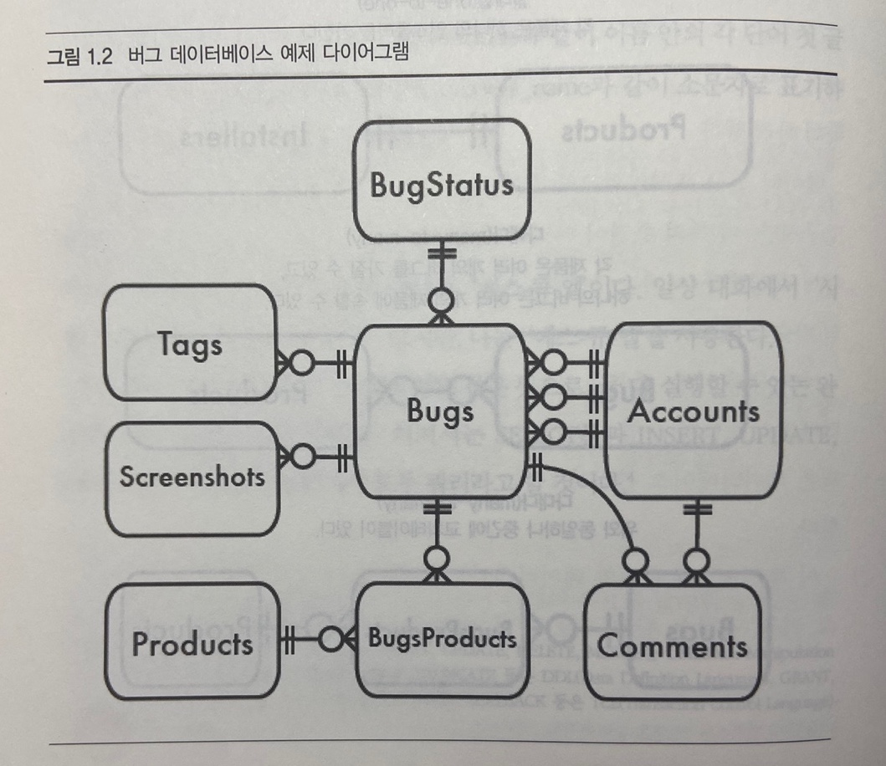
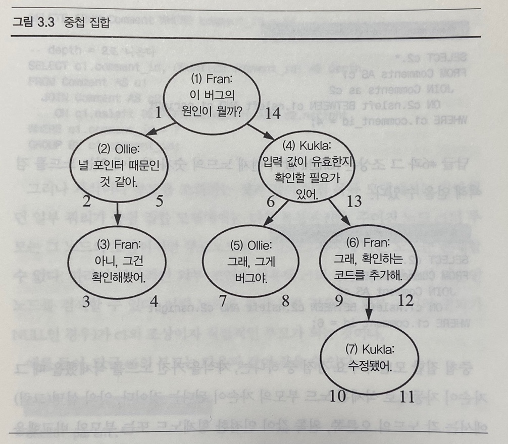
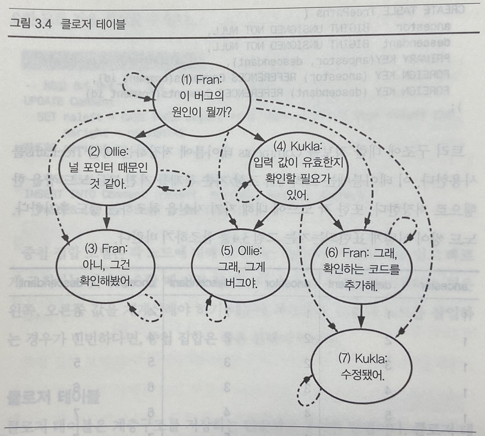
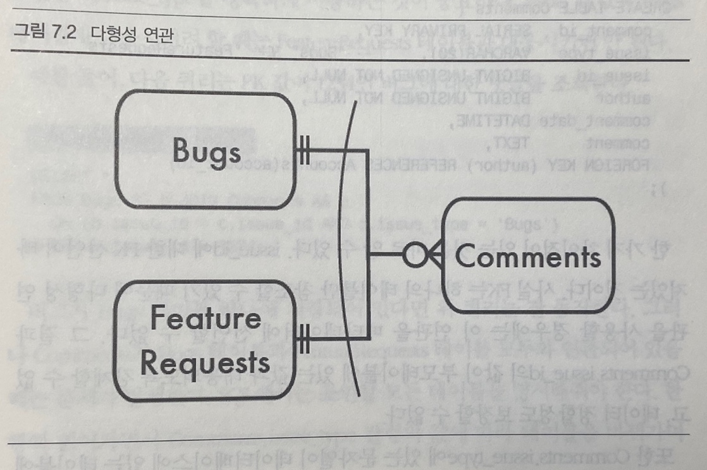
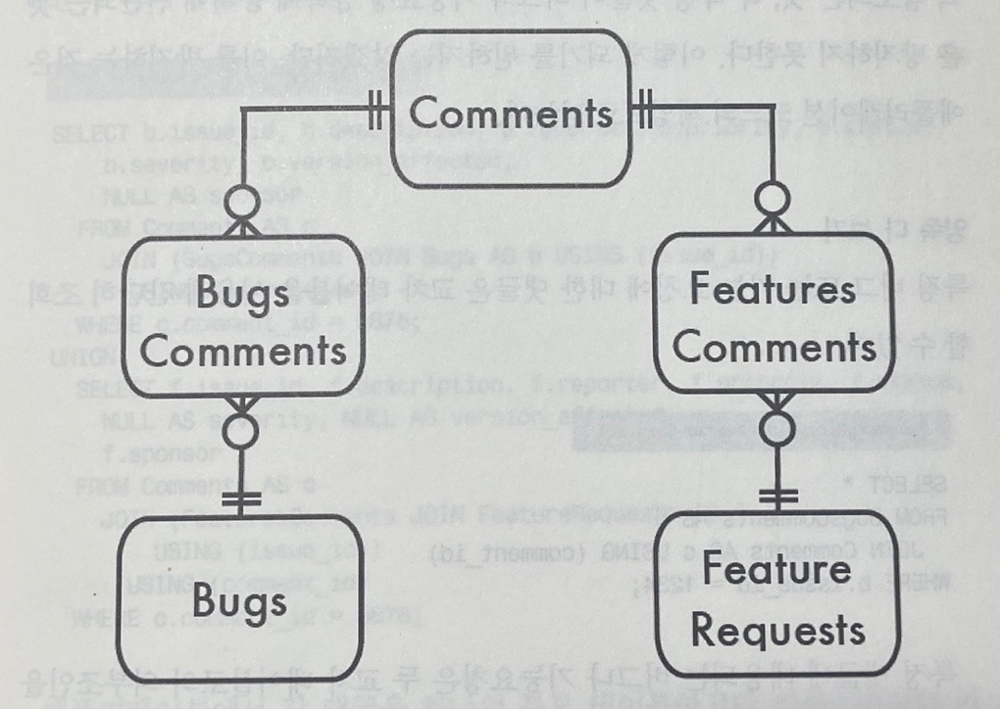
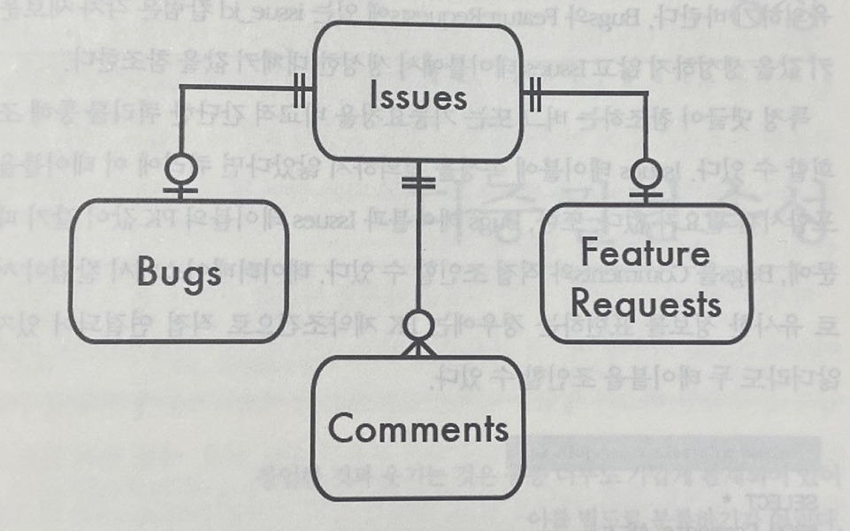

# SQL AntiPatterns

`느낀점 2022/05/15` ★★★☆☆

- 음 .. 약간 뭔가 아쉽다. 안티패턴이라고 나왔던 예제들이 공감되지 않았던 것들이 몇몇 있다. (저걸 정말 저렇게 한다고?) 예를 들면 2장, 8장, 12장, 20장 ...
- 하지만 정말 실제로 한번씩은 겪어봤던 또는 겪어볼 수 있는 예제들이 많아서 기억해두면 도움될게 몇몇 있는 것 같다.
- 최근엔 계속 ORM을 이용하다보니 실제로 쿼리 레벨에서 나올법한 안티패턴은 크게 공감하기 어려웠다.
- 그래도 안 본것 보단 낫다


# #1 개요

- 전문가란 아주 좁은 분야에서 할 수 있는 실수를 모두 해본 사람이다. - 닐스 보어


## 대상 독자

## 이 책에 있는 내용

### 이 책의 구성

`논리적 데이터베이스 설계 안티 패턴`

`물리적 데이터베이스 설계 안티 패턴`

`쿼리 안티 패턴`

`애플리케이션 개발 안티 패턴`

### 안티패턴의 구조

## 이 책에 없는 내용

## 일러두기

## 예제 데이터베이스




# #2 무단횡단

- 이름을 밝힐 수 없는 넷스케이프 엔지니어가 한 번은 포인터를 Javascript로 넘겼다가 문자열로 저장한 다음 나중에 다시 C로 돌려받아, 서른 명 사망함...ㅋㅋㅋㅋㅋㅋㅋㅋㅋㅋ

## 목표: 다중 값 속성 저장

- 테이블의 칼럼이 하나의 값을 가질 땐 설계가 쉽다.


## 안티패턴: 쉼표로 구분된 목록에 저장

- DB 구조 변경을 최소화하기위해 ...

```sql
CREATE TABLE Products (
	product_id SERIAL PRIMARY KEY,
  product_name VARCHAR(1000),
  account_id VARCHAR(100), -- 쉼표로 구분된 목록
);
```


**특정 계정에 대한 제품 조회**

- MsSQL에서는 아래와 같이 ''사용자12' 를 찾을 수 있지만 휴먼에러, 인덱스를 사용 못하고, SQL 벤더에도 중립적이지 못하다.

```sql
SELECT * FROM Products WHERE account_id REGEXP '[[:<:]]12[[:>:]]';
```


**주어진 제품에 대한 계정 정보 조회**

```sql
SELECT * FROM Products AS p JOIN Accounts AS a
	ON p.account_id REGEXP '[[:<:]]' || a.account_id || '[[:<:]]'
WHERE p.proudct_id = 123;
```

- 이런식의 표현은 인덱스도 사용 못하고 두 테이블을 모두 읽어 카테시안 곱을 생성한 다음 모든 행의 조합에 대해 정규 표현식을 평가해야 한다.


**집계 쿼리 만들기**

- 이상한 기교

```sql
SELECT product_id, LENGTH(account_id) - LENGTH(REPLACE(account_id, ',', '')) + 1
	AS contracts_per_product
FROM Products;
```


**특정 제품에 대한 계정 갱신**

- 목록의 마지막에 문자열 연결을 통해 새로운 아이디를 추가할 수 있지만 목록이 정렬된 상태로 유지되지는 못한다.
- 삭제 역시 이상하게 한다.


**제품 아이디 유효성 검증**

- 검증도 안되고 db는 쓰레기 더미가 된다.

**구분자 문자 선택**

- 구분자 선택도 애매하다.

**목록 길이 제한**

- n개의 계정에 대한 칼럼의 크기는 예측이 불가능하다.


## 안티패턴 인식 방법

- 프로젝트에서 아래와 같은 말이 나온다면 무단횡단 안티패턴이 사용되고 있는 것이다.
  - 이 목록이 지원해야 하는 최대 항목 수는 얼마나 될까?
  - SQL에서 단어의 경계를 어떻게 알아내는지 알아?
  - 이 목록에서 절대 나오지 않을 문자가 어떤 게 있을까?


## 안티패턴 사용이 합당한 경우

- 어떤 종류의 쿼리는 데이터베이스 반정규화를 적용해 성능을 향상시킬 수 있다. 
- 반정규화를 사용하기로 결정할 때는 보수적이어야 한다. 데이터베이스를 정규화하는 것이 먼저다.
- 정규화는 애플리케이션 코드를 좀더 융툥성 있게 하고 데이터베이스의 정합성을 유지할 수 있게 해준다.


## 해법: 교차 테이블 생성

- 별도의 테이블에 저장해 account_id가 별도의 행을 차지하도록 하는 것이 좋다.
- 새로만드는 Contracts 테이블은 Products와 Accounts 사이의 다대다 관계를 구현한다.

```sql
CREATE TABLE Contacts (
  product_id  BIGINT UNSIGNED NOT NULL,
  account_id  BIGINT UNSIGNED NOT NULL,
  PRIMARY KEY (product_id, account_id),
  FOREIGN KEY (product_id) REFERENCES Products(product_id),
  FOREIGN KEY (account_id) REFERENCES Accounts(account_id)
);

INSERT INTO Contacts (product_id, account_id)
VALUES (123, 12), (123, 34), (345, 23), (567, 12), (567, 34);

```


**계정으로 제품 조회하기와 제품으로 계정 조회하기**

- 주어진 계정에 대한 모든 제품의 속성을 조회하려면 Products 테이블과 Contracts 테이블을 조인하면 된다.

```sql
SELECT p.*
FROM  Products AS p JOIN Contacts AS c ON (p.product_id = c.product_id)
WHERE c.account_id = 34;
```

- 이쿼리는 효율적으로 인덱스를 사용할 수 있다.


**집계 쿼리 만들기**

- 제품당 계정 수를 리턴하는 쿼리

```sql
SELECT product_id, COUNT(*) AS accounts_per_product
FROM Contacts
GROUP BY product_id;
```

- 계정 당 제품 수를 구하는 쿼리

```sql
SELECT account_id, COUNT(*) AS products_per_account
FROM Contacts
GROUP BY account_id;
```

- 가장 많은 담당자를 할당 받은 제품을 구하는 쿼리

```sql
SELECT c.product_id, c.contacts_per_product
FROM (
  SELECT product_id, COUNT(*) AS accounts_per_product
  FROM Contacts
  GROUP BY product_id
) AS c
ORDER BY c.contacts_per_product DESC LIMIT 1
```


**특정 제품에 대한 계정 갱신**

```sql
INSERT INTO Contacts (product_id, account_id) VALUES (456, 34);

DELETE FROM Contacts WHERE product_id = 456 AND account_id = 34;
```


**제품 아이디 유효성 검증**

- FK를 사용해서 참조 정합성을 데이터베이스가 강제하도록 할 수 있다.


**구분자 문자 선택**

- 각 항목은 별도의 행으로 저장하므로 구분자를 사용하지 않는다.


**목록 길이 제한**

- 각 항목이 별도의 행으로 존재하기 때문에 한 컬럼에 물리적으로 저장할 수 있는 데이터 타입의 크기만 제한을 받는다.


**교차 테이블의 다른 장점**

- 쉼표로 구분된 목록보다 인덱스를 더 효율적으로 활용할 수 있기 때문에 성능이 좋아진다.
- 칼럼에 fk를 선언하면 많은 데이터베이스가 내부적으로 해당 칼럼에 대한 인덱스를 생성한다 
  - MySQL의 InnoDB
  - DB by DB
- 교차 테이블에 칼럼을 추가해 추가 속성을 넣을 수 있다.


**SQL Antipatterns Tip**

- 각 값은 자신의 칼럼과 행에 저장하라.


# #3 순진한 트리

- 각 답글에 답을 달 수 있는 구조로 아래와 같이 테이블을 간단하게 설계했다.

```sql
CREATE TABLE Comments (
  comment_id   SERIAL PRIMARY KEY,
  parent_id    BIGINT UNSIGNED,
  comment      TEXT NOT NULL,
  FOREIGN KEY (parent_id) REFERENCES Comments(comment_id)
);

```


## 계층구조 저장 및 조회하기

- 데이터가 재귀적 관계를 가지는 것은 흔한 일이다. 데이터는 트리나 계층적 구조가 될 수 있다.
- 트리 데이터 구조에서 각 항목은 노드라 불리고 노드는 여러 개의 자식을 가질 수 있고 부모를 하나 가진다. 부모가 없는 최상위 노드를 root라고 하고 가장 아래에 있는 자식이 없는 노드를 leaf라고한다. 중간에 있는 노드는 그냥 노드다.
- 트리 데이터 구조를 가지는 예
  - 조직도
  - 글타래


## 안티패턴: 항상 부모에 의존하기

- 초보적 방법은 parent_id 칼럼을 추가하는 것이다.

```sql
CREATE TABLE Comments (
  comment_id   SERIAL PRIMARY KEY,
  parent_id    BIGINT UNSIGNED,
  bug_id       BIGINT UNSIGNED NOT NULL,
  author       BIGINT UNSIGNED NOT NULL,
  comment_date DATETIME NOT NULL,
  comment      TEXT NOT NULL,
  FOREIGN KEY (parent_id) REFERENCES Comments(comment_id),
  FOREIGN KEY (bug_id) REFERENCES Bugs(bug_id),
  FOREIGN KEY (author) REFERENCES Accounts(account_id)
);

```


**인접 목록에서 트리 조회하기**

- 답글과 그 답글의 바로 아래 자식은 비교적 간단한 쿼리로 얻을 수 있지만 단 두 단계만 조회할 수 있다.

```sql
SELECT c1.*, c2.*
FROM Comments c1 LEFT OUTER JOIN Comments c2
  ON c2.parent_id = c1.comment_id;

```

- 트리의 특징 중 하나가 어느 깊이까지든 확장될 수 있다는 것이므로 단계에 상관없이 후손들을 조회할 수 있어야 한다.
- `COUNT()` 를 통해 답글 수를 계산하거나 `SUM()` 을 이용해 기계 조립에서 부품의 비용 합계를 구할 수 있어야한다.
- 또 다른 방법으로 글타래의 모든 행을 가져와서 애플리케이션에서 계층 구조를 만드는 방법인데 이 방법은 대량의 데이터를 애플리케이션으로 가져오는 것이기 때문에 비효율적이다.


**인접 목록에서 트리 유지하기**

- 새로운 노드를 추가하는 것과 같은 일부 연산은 간단하고 노드 하나 또는 서브트리를 이동하는 것 역시 쉽게 할 수 있다.

```sql
INSERT INTO Comments (bug_id, parent_id, author, comment)
  VALUES (1234, 7, 'Kukla', 'Thanks!');

UPDATE Comments SET parent_id = 3 WHERE comment_id = 6;
```

- 하지만 트레이서 노드를 삭제하는 작업은 복잡하고 비효율적이다.

```sql
SELECT comment_id FROM Comments WHERE parent_id = 4; -- returns 5 and 6
SELECT comment_id FROM Comments WHERE parent_id = 5; -- returns none
SELECT comment_id FROM Comments WHERE parent_id = 6; -- returns 7
SELECT comment_id FROM Comments WHERE parent_id = 7; -- returns none

DELETE FROM Comments WHERE comment_id IN ( 7 );
DELETE FROM Comments WHERE comment_id IN ( 5, 6 );
DELETE FROM Comments WHERE comment_id = 4;

```


## 안티패턴 인식 방법

- 다음과 같은 말을 듣는다면 순진한 트리 안티패턴이 사용되고 있음을 눈치챌 수 있다.
  - "트리에서 얼마나 깊은 단계를 지원해야 하지?"
  - "트리 데이터 구조를 관리하는 코드는 건드리는게 겁나"
  - "트리에서 고아 노드를 정리하기 위해 주기적으로 스크립트를 돌려야 해"


## 안티패턴 사용이 합당한 경우

- 인접 목록의 강점은 주어진 노드의 부모나 자식을 바로 얻어올 수 있고 새로운 노드를 추가하기도 쉽기 때문에 계층적 데이터로 작업하는 데 이 정도로만으로도 충분하다면 인접 목록은 적절한 방법이다.
- WITH 키워드, CTE(Common Table Expression)을 사용한 재귀적 쿼리 문법을 사용할 수 있는 DBMS라면 순진한 트리 구조를 사용해도 제약은 없어진다.

```sql
-- WITH절
WITH CommentTree
    (comment_id, bug_id, parent_id, author, comment, depth)
AS (
    SELECT *, 0 AS depth FROM Comments
    WHERE parent_id IS NULL
  UNION ALL
    SELECT c.*, ct.depth+1 AS depth FROM CommentTree ct
    JOIN Comments c ON (ct.comment_id = c.parent_id)
)
SELECT * FROM CommentTree WHERE bug_id = 1234;

-- START WITH ... CONNECT BY PRIOR
SELECT * FROM Comments
START WITH comment_id = 9876
CONNECT BY PRIOR parent_id = comment_id;
```

- 초판이 2011년 인걸 감안하면 이해가 가능하지만 2022년인 지금 재귀적 쿼리를 지원하지 않는 dbms는 거의 없다는게 함정


## 해법: 대안 트리 모델 사용

- 계층적 데이터를 저장하는 데는 인접 목록 모델(순진한 트리) 외에도 경로 열거(Path Enumeration), 중첩 집합(Nested Sets), 클로저 테이블(Closure Table)과 같은 몇가지 대안이 있다.


**경로 열거**

- 경로 열거 방법에서는 일련의 조상을 각 노드의 속성으로 저장해 이를 해결한다.
- 디렉토리 구조에서도 경로 열거 형태를 볼 수 있다.
  - /usr/local/lib 
    - /usr는 local의 부모
    - /local은 lib의 부모
- 기존 parent_id 칼럼 대신 path란 칼럼을 정의한다.

```sql
CREATE TABLE Comments (
  comment_id   SERIAL PRIMARY KEY,
  path         VARCHAR(1000),
  bug_id       BIGINT UNSIGNED NOT NULL,
  author       BIGINT UNSIGNED NOT NULL,
  comment_date DATETIME NOT NULL,
  comment      TEXT NOT NULL,
  FOREIGN KEY (bug_id) REFERENCES Bugs(bug_id),
  FOREIGN KEY (author) REFERENCES Accounts(account_id)
);

```


| comment_id | path    | author | comment |
| ---------- | ------- | ------ | ------- |
| 1          | 1/      | A      | A       |
| 2          | 1/2/    | B      | B       |
| 3          | 1/2/3/  | C      | C       |
| 4          | 1/4/    | D      | D       |
| 5          | 1/4/5/  | E      | E       |
| 6          | 1/4/6/  | F      | F       |
| 7          | 1/4/6/7 | G      | G       |

- 위와 같은 형태에서 경로가 /1/4/6/7/ 인 답글 #7의 조상을 찾으려면 다음과 같이 할 수 있다.

```sql
SELECT *
FROM Comments AS c
WHERE '1/4/6/7/' LIKE c.path || '%';

-- 1/4/6/%, 1/4/%, 1/% 로 매칭
```

- 반대로 경로가 1/4/인 답글 #4의 후손을 찾으려면 다음과 같이 할 수 있다.

```sql
SELECT *
FROM Comments AS c
WHERE c.path LIKE '1/4/' || '%';

-- /1/4/5, 1/4/6, 1/4/6/7 매칭
```

- 특정 노드의 서브트리에서 글쓴이당 답글 수를 세는 집계함수역시 쉽게 사용할 수 있다.

```sql
SELECT COUNT(*)
FROM Comments AS c
WHERE c.path LIKE '1/4/' || '%'
GROUP BY c.author;

```

- 새로운 노드를 추가하는 방법은 인접 목록 모델에서와 비슷하게 부모 경로 + 새로운 노드의 아이디를 덧붙이는 방법으로 추가할 수 있다.

```sql
-- MySQL의 LAST_INSERT_ID()를 사용해서 path 수정
INSERT INTO Comments (author, comment) VALUES ('Ollie', 'Good job!');
UPDATE Comments 
  SET path = (SELECT path FROM Comments WHERE comment_id = 7)
    || LAST_INSERT_ID() || '/'
WHERE comment_id = LAST_INSERT_ID();
```

- 경로 열거 방법은 경로가 올바르게 형성되도록 하거나 값이 실제 노드에 대응되도록 강제하는 방법은 없다. 경로 문자열을 유지하는 것은 애플리케이션 코드에 종속되며 이를 검증하는데는 비용이 많이 든다.
- 경로 열거 방법은 VARCHAR 칼럼의 길이만큼 제한이 있기 때문에 무제한 확장은 불가능하다.


**중첩 집합**

- 중첩 집합은 각 노드가 자신의 부모를 저장하는 대신 자기 자손의 집합에 대한 정보를 저장한다.

```sql
CREATE TABLE Comments (
  comment_id   SERIAL PRIMARY KEY,
  nsleft       INTEGER NOT NULL,
  nsright      INTEGER NOT NULL,
  bug_id       BIGINT UNSIGNED NOT NULL,
  author       BIGINT UNSIGNED NOT NULL,
  comment_date DATETIME NOT NULL,
  comment      TEXT NOT NULL,
  FOREIGN KEY (bug_id) REFERENCES Bugs (bug_id),
  FOREIGN KEY (author) REFERENCES Accounts(account_id)
);

```

- 이 정보는 트리의 각 노드를 두 개의 수로 부호화해 나타낼 수 있는데 여기에선 nsleft와 nsright로 구분한다.
- 각 노드의 nsleft와 nsright 수는 다음과 같이 주어진다.
  - nsleft 는 모든 자식 노드의 nsleft 보다 작아야 한다.
  - nsright 는 모든 자식의 노드의 nsright 보다 커야 한다.
  - 이 수들은 comment_id 값과는 아무런 상관이 없다.





| comment_id | nsleft | nsright | author | comment |
| ---------- | ------ | ------- | ------ | ------- |
| 1          | 1      | 14      | A      | A       |
| 2          | 2      | 5       | B      | B       |
| 3          | 3      | 4       | C      | C       |
| 4          | 6      | 13      | D      | D       |
| 5          | 7      | 8       | E      | E       |
| 6          | 9      | 12      | F      | F       |
| 7          | 10     | 11      | G      | G       |

- nsleft 값이 현재 노드의 nsleft와 nsright 사이에 있는 노드를 검색하면 답글 #4 와 그 자손을 얻을 수 있다.

```sql
SELECT c2.*
FROM Comments AS c1
  JOIN Comments as c2
    ON c2.nsleft BETWEEN c1.nsleft AND c1.nsright
WHERE c1.comment_id = 4;

```

- 답글 #6과 그 조상은 nsright 값이 현재 노드의 숫자 사이에 있는 노드를 검색해 얻을 수 있다.

```sql
SELECT c2.*
FROM Comments AS c1
  JOIN Comment AS c2
    ON c1.nsleft BETWEEN c2.nsleft AND c2.nsright
WHERE c1.comment_id = 6;

```

- 중첩 집합 모델의 주요 강점 중 하나는 자식을 가진 노드를 삭제했을 때 그 자손이 자동으로 삭제된 노드 부모의 자손이 된다. 노드를 삭제해도 트리 구조에서는 아무런 문제가 없다.

```sql
-- Reports depth = 3
SELECT c1.comment_id, COUNT(c2.comment_id) AS depth
FROM Comment AS c1
  JOIN Comment AS c2
    ON c1.nsleft BETWEEN c2.nsleft AND c2.nsright
WHERE c1.comment_id = 7
GROUP BY c1.comment_id;

DELETE FROM Comment WHERE comment_id = 6;

-- Reports depth = 2
SELECT c1.comment_id, COUNT(c2.comment_id) AS depth
FROM Comment AS c1
  JOIN Comment AS c2
    ON c1.nsleft BETWEEN c2.nsleft AND c2.nsright
WHERE c1.comment_id = 7
GROUP BY c1.comment_id;

```

- 중첩 집합 모델의 단점은 부모 노드를 얻는 과정이 아래와 같이 복잡해진다.

```sql
SELECT parent.*
FROM Comment AS c
  JOIN Comment AS parent
    ON c.nsleft BETWEEN parent.nsleft AND parent.nsright
  LEFT OUTER JOIN Comment AS in_between
    ON c.nsleft BETWEEN in_between.nsleft AND in_between.nsright
    AND in_between.nsleft BETWEEN parent.nsleft AND parent.nsright
WHERE c.comment_id = 6
  AND in_between.comment_id IS NULL;

```

- 중첩 집합 모델에서는 노드를 추가, 이동하는 것과 같은 트리 조작도 다른 모델을 사용할 때보다 복잡하다. 새로운 노드를 추가할 때마다 새 노드의 왼쪽 값보다 큰 모든 노드의 왼쪽, 오른쪽 값을 다시 계산해야 한다.

```sql
-- make space for NS values 8 and 9
UPDATE Comment
  SET nsleft = CASE WHEN nsleft >= 8 THEN nsleft+2 ELSE nsleft END,
      nsright = nsright+2
WHERE nsright >= 7;

-- create new child of comment #5, occupying NS values 8 and 9
INSERT INTO Comment (nsleft, nsright, author, comment)
  VALUES (8, 9, 'Fran', 'Me too!');

```

- 중첩 집합 모델은 각 노드에 대해 조작하는 것 보다는 서브트리를 쉽고 빠르게 조회하는 것이 중요할 때 가장 잘 맞는다.
- 트리에 노드를 삽입하는 과정이 복잡하기 때문에 쓰기가 빈번하다면 중첩 집합은 좋은 선택이 아니다.


**클로저 테이블**

- 클로저 테이블은 부모-자식 관계에 대한 경로만을 저장하는 것이 아니라 트리의 모든 경로를 저장한다.

```sql
CREATE TABLE Comments (
  comment_id   SERIAL PRIMARY KEY,
  bug_id       BIGINT UNSIGNED NOT NULL,
  author       BIGINT UNSIGNED NOT NULL,
  comment_date DATETIME NOT NULL,
  comment      TEXT NOT NULL,
  FOREIGN KEY (bug_id) REFERENCES Bugs(bug_id),
  FOREIGN KEY (author) REFERENCES Accounts(account_id)
);

CREATE TABLE TreePaths (
  ancestor    BIGINT UNSIGNED NOT NULL,
  descendant  BIGINT UNSIGNED NOT NULL,
  PRIMARY KEY(ancestor, descendant),
  FOREIGN KEY (ancestor) REFERENCES Comments(comment_id),
  FOREIGN KEY (descendant) REFERENCES Comments(comment_id)
);

```

- 트리 구조에 대한 정보를 Comments 테이블에 저장하는 대신 TreePaths를 사용한다.
- 이 테이블에는 트리에서 조상/자손 관계를 가진 모든 노드 쌍을 한 행으로 저장한다. 또한 각 노드에 대해 자기 자신을 참조하는 행도 추가한다.





| ancestor | descendant |
| -------- | :--------- |
| 1        | 1          |
| 1        | 2          |
| 1        | 3          |
| 1        | 4          |
| 1        | 5          |
| 1        | 6          |
| 1        | 7          |
| 2        | 2          |
| 2        | 3          |
| 3        | 3          |
| 4        | 4          |
| 4        | 5          |
| 4        | 6          |
| 4        | 7          |
| 5        | 5          |
| 6        | 6          |
| 6        | 7          |
| 7        | 7          |


- 답글 #4의 자손을 얻으려면 TreePaths에서 ancestor가 4인 행을 가져오면 된다.

```sql
SELECT c.*
FROM Comments AS c
  JOIN TreePaths AS t ON c.comment_id = t.descendant
WHERE t.ancestor = 4;

```

- 답글 #6의 조상을 얻으려면 TreePath에서 descendant가 6인 행을 가져오면 된다.

```sql
SELECT c.*
FROM Comments AS c
  JOIN TreePaths AS t ON c.comment_id = t.ancestor
WHERE t.descendant = 6;

```

- 새로운 종말 노드, 예를 들어 답글 #5에 새로운 자식을 추가하려면 먼저 자기 자신을 참조하는 행을 추가하고 TreePaths에서 답글 #5를  descendant로 참조하는 모든 행을 복사해 descendant를 새로운 답글 아이디로 바꿔 넣는다.

```sql
INSERT INTO TreePaths (ancestor, descendant)
  SELECT t.ancestor, 8
  FROM TreePaths AS t
  WHERE t.descendant = 5
 UNION ALL
  SELECT 8, 8;

```

- 종말 노드를 삭제할 때, 예를 들어 #7을 삭제할 때는 TreePaths에서 descendant로 참조하는 모든 행을 삭제한다.

```sql
DELETE FROM TreePaths WHERE descendant = 7;

```

- 서브트리, 예를들어 답글#4와 그 자손을 삭제하려면 TreePaths에서 답글 #4를 descendant로 참조하는 모든 행과  답글 #4의 자손을 descendant로 참조하는 모든 행을 삭제한다.

```sql
DELETE FROM TreePaths
WHERE descendant IN (SELECT descendant
		     FROM TreePaths
		     WHERE ancestor = 4);

```

- 서브트리를 트리 내 다른 위치로 이동하고자 할 때는, 먼저 서브트리의 최상위 노드와 그 노드의 자손들을 참조하는 행을 삭제해 서브트리와 그 조상의 연결을 끊는다.
- 예를 들어 답글 #6을 답글 #4의 자식에서 #3의 자식으로 옮기려면 아래와 같이 한다.

```sql
-- START:delete
DELETE FROM TreePaths
WHERE descendant IN (SELECT descendant
		     FROM TreePaths
		     WHERE ancestor = 6)
  AND ancestor IN (SELECT ancestor
		   FROM TreePaths
		   WHERE descendant = 6
		     AND ancestor != descendant);
-- END:delete
-- 위 쿼리는 (1, 6), (1, 7), (4, 6), (4, 7) 을 삭제한다. 즉 자기 자신과 자기 자신이 갖고 있는 서브트리 외에 모든 참조를 제거한다.

-- START:reinsert
INSERT INTO TreePaths (ancestor, descendant)
  SELECT supertree.ancestor, subtree.descendant
  FROM TreePaths AS supertree
    CROSS JOIN TreePaths AS subtree
  WHERE supertree.descendant = 3
    AND subtree.ancestor = 6;
-- END:reinsert
-- 새로운 위치의 조상들과 서브트리의 자손들에 대응하는 행을 추가해서 고아가 된 서브트리를 붙인다.
-- 위 쿼리는 (1, 6), (2, 6), (3, 6), (1, 7), (2, 7), (3, 7) 경로를 새로 생성한다.

```

- 클로저 테이블 모델은 중첩 집합 모델보다 직관적이다. 조상과 자손을 조회하는 것은 두 방법 모두 빠르고 쉽지만 클로저 테이블이 계층구조 정보를 유지하기가 쉽다. 
- 두 방법 모두 인접 목록이나 경록 열거 방법보다 자식이나 부모를 조회하기 편리하다.
- 부모나 자식 노드를 더 쉽게 조회할 수 있도록 TreePaths에 path_length 속성을 추가하면 클로저 테이블을 개선할 수 있다. 
- 자기자신의 path_length는 0, 자식의 path_length는 1 ... 2 형태로 구성하면 아래와 같이 자식을 쉽게 조회할 수 있다.

```sql
SELECT *
FROM TreePaths
WHERE ancestor = 4 AND path_length = 1;

```


**어떤 모델을 사용해야 하는가?**

- 인접 목록은 가장 흔히 사용되는 모델로 많은 소프트웨어 개발자가 알고 있다.
- WITH나 CONNET BY PRIOR를 이용한 재귀적 쿼리는 인접 목록 모델을 좀 더 효율적으로 만들지만 이 문법을 지원하는 데이터베이스를 써야 한다.
- 경로 열거는 브레드크럼을 사용자 인터페이스에 보여줄 때는 좋지만 참조 정합성을 강제하지 못하고 정보를 중복 저장하기 때문에 깨지기 쉬운 구조다.
- 중첩 집합은 트리를 수정하는 일은 거의 없고 조회를 많이 하는 경우 적합하다. 역시 참조 정합성을 지원하지는 못한다.
- 클로저 테이블은 가장 융통성 있는 모델이고 한 노드가 여러 트리에 속하는 것을 허용하는 유일한 모델이다. 클로저 테이블은 별도의 저장공간을 사용하기 때문에 계산을 줄이는 대신 저장공간을 많이 사용하는 트레이드오프가 발생한다.

<br>

| 모델          | 테이블 | 자식 조회 | 트리 조회 | 삽입   | 삭제   |
| ------------- | ------ | --------- | --------- | ------ | ------ |
| 인접 목록     | 1      | 쉽다      | 어렵다    | 쉽다   | 쉽다   |
| 재귀적 쿼리   | 1      | 쉽다      | 쉽다      | 쉽다   | 쉽다   |
| 경로 열거     | 1      | 쉽다      | 쉽다      | 쉽다   | 쉽다   |
| 중첩 집합     | 1      | 어렵다    | 쉽다      | 어렵다 | 어렵다 |
| 클로저 테이블 | 2      | 쉽다      | 쉽다      | 쉽다   | 쉽다   |


**SQL Antipatterns Tip**

- 계층구조에는 항목과 관계가 있다. 작업에 맞도록 이 둘을 모두 모델링해야 한다.


# #4 아이디가 필요해


## 목표: PK 관례 확립

- 목표는 모든 테이블이 PK를 갖도록 하는 것이지만 PK의 본질을 혼동하면 안된다.
- PK는 테이블 내의 모든 행이 유일함을 보장하기 때문에, 각 행에 접근하는 논리적 메커니즘이 되고 중복 행이 저장되는 것을 방지한다.
- 까다로운 부분은  PK로 사용할 칼럼을 선정하는 일이다.
- 아무런 의미도 갖지 않는 인위적인 값을 PK로 잡을때는 이를 가상키 또는 대체키라 한다.
- 여러 클라이언트가 동시에 새로운 행을 삽입하는 경우에도 각 행의 가상키 값이 유일하게 할당되는 것을 보장하기 위해, 대부분의 DBMS는 트랜잭션 격리 범위 밖에서 유일한 정수값을 생성하는 메커니즘을 제공한다.

| 기능           | 지원 데이터베이스                                   |
| -------------- | --------------------------------------------------- |
| AUTO_INCREMENT | MySQL                                               |
| GENERATOR      | Firebird, InterBase                                 |
| IDENTITY       | DB2, Derby, Microsoft SQL Server, Sybase            |
| ROWID          | SQLite                                              |
| SEQUENCE       | DB2, Firebird, Informix, Ingres, Oracle, PostgreSQL |
| SERIAL         | MySQL, PostgreSQL                                   |


## 안티 패턴: 만능키

- 모든 테이블에 id란 이름의 칼럼이 있는 것은 너무도 흔해져 이게 PK와 동의어가 되어 버렸다.
- 모든 테이블에 id 칼럼을 추가하는 것은, 그 사용을 이상하게 만드는 몇 가지 효과를 초개한다.

```sql
CREATE TABLE Bugs (
  id          SERIAL PRIMARY KEY,
  description VARCHAR(1000),
  -- . . .
);

```


**중복 키 생성**

- 테이블 안에 다른 칼럼이 자연키로 사용될 수 있는 상황에서조차 단지 통념에 따라 id 칼럼을 PK로 정의하고 bug_id는 UNIQUE를 사용하는 경우

```sql
CREATE TABLE Bugs (
  id          SERIAL PRIMARY KEY,
  bug_id      VARCHAR(10) UNIQUE,
  description VARCHAR(1000),
  -- . . .
);

INSERT INTO Bugs (bug_id, description, ...)
  VALUES ('VIS-078', 'crashes on save', ...);

```

- 사실 bug_id칼럼은 각 행을 유일하게 식별할 수 있도록 해준다는 면에서 id와 사용 목적이 동일하다.

**중복 행 허용**

- 복합 키는 여러 칼럼을 포함한다. PK는 특정한 bug_id와 product_id 값의 조합이 테이블 안에서 한 번만 나타난다는 것을 보장해야 하지만 id 칼럼을 PK로 사용하는 경우 두 칼럼에 제약조건이 적용되지 않는다.


```sql
-- START:typical
CREATE TABLE BugsProducts (
  id          SERIAL PRIMARY KEY,
  bug_id      BIGINT UNSIGNED NOT NULL,
  product_id  BIGINT UNSIGNED NOT NULL,
  FOREIGN KEY (bug_id) REFERENCES Bugs(bug_id),
  FOREIGN KEY (product_id) REFERENCES Products(product_id)
);

INSERT INTO BugsProducts (bug_id, product_id)
  VALUES (1234, 1), (1234, 1), (1234, 1); -- duplicates are permitted
-- END:typical
```


- 방법은 bug_id, product_id에 UNIQUE제약조건을 거는 것인데 이런 경우엔 id칼럼은 불필요한 것이다.

```sql
-- START:unique
CREATE TABLE BugsProducts (
  id          SERIAL PRIMARY KEY,
  bug_id      BIGINT UNSIGNED NOT NULL,
  product_id  BIGINT UNSIGNED NOT NULL,
  UNIQUE KEY (bug_id, product_id),
  FOREIGN KEY (bug_id) REFERENCES Bugs(bug_id),
  FOREIGN KEY (product_id) REFERENCES Products(product_id)
);
-- END:unique
```


**모호한 키의 의미**

- id란 이름이 너무 일반적이기 때문에 아루먼 의미도 갖지 못한다.
- 이는 PK칼럼 이름이 동일한 두 테이블을 조인할 때 특히 문제가 된다.


**USING 사용**

**어려운 복합키**


## 안티패턴 인식 방법

- 다음과 같은 말은 안티패턴의 증거가 될 수 있다.
  - 모든 테이블의 PK칼럼이 id라는 이름을 갖고 있다.
  - "이 테이블에는 PK가 없어도 될 것 같은데"
  - "다대다 연결에서 왜 중복이 발생하지?"
  - "나는 데이터베이스 이론에서 값은 색인 테이블로 옮기고  ID로 참조해야한다고 하는 걸 읽어서. 그러나 그렇게 하고 싶지 않아. 내가 원하는 실제 값을 얻기 위해 매번 조인을 해야 하기 때문이지."


## 안티패턴 사용이 합당한 경우

- 가상키는 지나치게 긴 자연키를 대체하기 위해 사용한다면 적절한 선택이다.
  - 파일 시스템의 파일 속성을 저장하는 테이블에서 파일 경로는 좋은 자연키이지만 인덱스로 잡기엔 비용이 많이 든다.


## 해법: 상황에 맞추기

- PK는 제약조건이지 데이터 타입이 아니다.
- 또한 테이블의 특정 칼럼을 PK로 잡지 않고도 자동 증가하는 정수값을 가지도록 정의할 수 있다.


**있는 그대로 말하기**

- PK에 의미 있는 이름을 선택해야 한다. 이 이름은 PK가 식별하는 엔터티의 타입을 나타내야 한다.
- FK에서도 가능하다면 같은 칼럼 이름을 사용하는게 기본이지만 연결의 본질을 더 잘 표현하는 경우라면 FK를 자신이 참조하는 PK이름과 다르게 하는 것도 괜찮다.

```sql
CREATE TABLE Bugs (
  -- . . .
  reported_by  BIGINT UNSIGNED NOT NULL,
  FOREIGN KEY (reported_by) REFERENCES Accounts(account_id)
);

```


**관례에서 벗어나기**

**자연키와 복합키 포용**

- 유일함이 보장되고, NULL 값을 가지는 경우가 없고, 행을 식별하는 용도로 사용할 수 있는 속성이 테이블에 있다면, 단지 통념을 따르기 위해 가상키를 추가해야 한다는 의무감을 느낌 필요는 없다.
- 실제로 테이블에 있는 각 속성은 변하기 마련이고 유일하지 않게 될 수도 있기 때문에 이런 경우에는 가상키를 사용할 수 있다.
- 여러 칼럼의 조합으로 행을 가장 잘 식별할 수 있다면 이 칼럼 조합을 복합키로 사용해야 한다.

```sql
-- START:table
CREATE TABLE BugsProducts (
  bug_id      BIGINT UNSIGNED NOT NULL,
  product_id  BIGINT UNSIGNED NOT NULL,
  PRIMARY KEY (bug_id, product_id),
  FOREIGN KEY (bug_id) REFERENCES Bugs(bug_id),
  FOREIGN KEY (product_id) REFERENCES Products(product_id)
);
-- END:table

-- START:insert
INSERT INTO BugsProducts (bug_id, product_id)
  VALUES (1234, 1), (1234, 2), (1234, 3);

INSERT INTO BugsProducts (bug_id, product_id)
  VALUES (1234, 1); -- error: duplicate entry
--END:insert

```

- 복합 PK를 참조하는 FK 또한 복합키가 되어야 함에 유의해야 한다.


**SQL Antipatterns Tip**

- 관례는 도움이 될 때만 좋은 것이다.


# #5 키가 없는 엔트리

## 목표: 데이터베이스 아키텍처 단순화

- 관계형 데이터베이스 설계는 각 테이블 자체에 대한 것이기도 하고 테이블간의 관계에 대한 것이기도 하다.
- 참조 정합성은 데이터베이스를 적절히 설계하고 운영하는 데 있어 중요한 부분이다.
- 어떤 칼럼 또는 칼럼 묶음에 FK 제약조건을 선언하면, 그 칼럼에 들어가는 값은 부모 테이블의 PK 또는 UNIQUE KEY에 의존해야 한다. 
- FK를 무시하라는 이유들
  - 데이터 업데이트 시 제약조건과 충돌할 수 있다.
  - 참조 정합성 제약조건을 지원할 수 없는 매우 융통성 있는 데이터베이스 설계를 사용하고 있다.
  - FK에 데이터베이스가 자동 생성하는 인덱스 때문에 성능에 영향을 받는다고 믿는다.
  - FK를 지원하지 않는 데이터베이스를 사용하고 있다.
  - FK 선언을 위해 문법을 찾아봐야 한다.


## 안티패턴: 제약조건 무시

- FK 제약조건을 생략하는 것이 처음에는 데이터베이스 설계를 단순하고 유연하고 빠르게 하는 것처럼 보이겠지만 다른 방식으로 대가를 치러야 한다. (참조정합성에 대한 대가)


**무결점 코드**

- 많은 사람들이 참조 정합성을 애플리케이션 코드에 녹인다.
- 

```sql
-- # 변경전 select로 참조 정합성 확인
-- START:select
SELECT account_id FROM Accounts WHERE account_id = 1;
-- END:select
-- START:insert
INSERT INTO Bugs (reported_by) VALUES (1);
-- END:insert


-- #변경전 select로 참조 정합성 확인
-- START:select
SELECT bug_id FROM Bugs WHERE reported_by = 1;
-- END:select
-- START:delete
DELETE FROM Accounts WHERE account_id = 1;
-- END:delete
```

- 위 방법은 동시성 문제가 생길 수 있고 테이블락을 사용할경우 병목이 될 수 있다.


**오류 확인**

- 손상된 데이터를 찾기 위해 개발자가 작성한 스크립트로 참조 정합성이 깨지는부분을 아래와 같이 수정해볼 수 있다.

```sql
SELECT b.bug_id, b.status
FROM Bugs b LEFT OUTER JOIN BugStatus s
  ON (b.status = s.status)
WHERE s.status IS NULL;

UPDATE Bugs SET status = DEFAULT WHERE status = 'BANANA';
```

- 그러나 위 스크립트를 얼마나 자주 해야하는지 정확한 타이밍이나 횟수를 계산하기 어렵고 디폴트값이 없는 칼럼에 대해서 좋은 방어책이 아니다.


**"내 잘못이 아냐!"**

- 데이터베이스는 일관성 있게 유지해야하지만 데이터베이스에 접근하는 모든 애플리케이션과 스크립트가 올바르게 변경을 가하는지 확신할 수 없다.


**진퇴양난 업데이트**

- 많은 개발자가 여러 테이블의 관련된 칼럼을 업데이트할 때 불편해지기 때문에 FK 제약조건 사용을 꺼린다.

```sql
DELETE FROM BugStatus WHERE status = 'BOGUS'; -- ERROR!
DELETE FROM Bugs WHERE status = 'BOGUS';
DELETE FROM BugStatus WHERE status = 'BOGUS'; -- retry succeeds


UPDATE BugStatus SET status = 'INVALID' WHERE status = 'BOGUS'; -- ERROR!
UPDATE Bugs SET status = 'INVALID' WHERE status = 'BOGUS'; -- ERROR!

```


## 안티패턴 인식 방법

- 사람들이 다음과 같은 말을 하는 걸 들으면 아마도 키가 없는 엔트리 안티패턴을 사용하고 있을 것이다.
  - "어떤 값이 한 테이블에는 있고 다른 테이블에는 없는지 확인하려면 쿼리를 어떻게 작성해야 하지?"
  - "테이블에 삽입하면서 다른 테이블에 어떤 값이 있는지를 확인하는 빠른 방법이 없을까?"
  - "FK라고? FK는 데이터베이스를 느리게 만들기 때문에 사용하지 말라고 들었는데?"


## 안티패턴 사용이 합당한 경우

- FK제약조건을 지원하지 않는 데이터베이스 (MySQL의  myisam엔진, 3.6.19 이전의 SQLite) 을 사용할 수밖에 없는 경우
- 관계를 모델링하는 데 FK를 사용할 수 없는 극단적으로 유연한 데이터베이스 설계인 경우


## 해법: 제약조건 선언하기

- 데이터베이스 설계에 참조 정합성을 강제해서 추가 공정 없이 처음부터 잘못된 데이터가 입력되지 않도록 할 수 있다.

```sql
CREATE TABLE Bugs (
  -- . . .
  reported_by       BIGINT UNSIGNED NOT NULL,
  status            VARCHAR(20) NOT NULL DEFAULT 'NEW',
  FOREIGN KEY (reported_by) REFERENCES Accounts(account_id),
  FOREIGN KEY (status) REFERENCES BugStatus(status)
);

```

- FK를 사용하면 불필요한 코드를 작성하지 않아도 되고, 데이터베이스를 변경할 때도 모든 코드가 동일한 제약조건을 따른다는 것을 확신할 수 있다.

**여러 테이블 변경 지원**

- FK는 애플리케이션 코드로 흉내낼 수 없는 단계적 업데이트(cascading update)기능이 있다.

```sql
CREATE TABLE Bugs (
  -- . . .
  reported_by       BIGINT UNSIGNED NOT NULL,
  status            VARCHAR(20) NOT NULL DEFAULT 'NEW',
  FOREIGN KEY (reported_by) REFERENCES Accounts(account_id)
    ON UPDATE CASCADE
    ON DELETE RESTRICT,
  FOREIGN KEY (status) REFERENCES BugStatus(status)
    ON UPDATE CASCADE
    ON DELETE SET DEFAULT
);

```


**오버헤드? 그닥~**

- FK 제약조건이 약간의 오버헤드가 있는 것은 사실이지만 다른 대안과 비교했을 때 FK가 훨씬 효울적이라는 것은 입증되었다.
  - INSERT, UPDATE, DELETE 전에 데이터를 확인하기 위해 SELECT 쿼리를 실행할 필요가 없다.
  - 여러 테이블을 변경하기 위해 테이블 잠금을 사용할 필요가 없다.
  - 불가피하게 생기는 고아 데이터를 정정하기 위해 품질 제어 스크림트를 주기적으로 돌릴 필요가 없다.
- FK는 사용하기 쉽고, 성능을 향상시킬 뿐 아니라, 단순하든 복잡하든 데이터를 변경할 때 참조 정합성을 일관적으로 유지하는데 도움이 된다.

**SQL Antipatterns Tip**

- 제약조건을 사용해 데이터베이스에서 실수를 방지하라.


# #6 엔터티-속성-값

## 목표: 가변 속성 지원

- 소프트웨어 프로젝트에서 확장성은 자주 목표로 언급이 된다.
- 일반적인 테이블은 테이블에 있는 모든 행과 관계된 속성 칼럼으로 이루어져 있고, 각 행은 비슷한 객체의 인스턴스를 나타낸다. 속성 집합이 다르면 객체의 타입도 다르다는 뜻이며, 따라서 다른 테이블에 있어야 한다.
- 그러나 현대적인 객체지향 프로그래밍 모델에서는 동일한 데이터 타입을 확장하는 것과 같은 방법으로 객체의 타입도 관계를 가질 수 있다.

사진

- 위 이미지에서 Bug와 FeatureRequest는 Issue 타입이 갖는 속성을 기본으로 갖고 각각 자신만의 속성을 추가로 갖는다.

## 안티패턴: 범용 속성 테이블 사용

- 가변 속성을 지원해야 할 때 별도 테이블을 생성해 속성을 행으로 저장할 수 있다.

`엔터티`

- 보통 이 칼럼은 하나의 엔터티에 대해 하나의 행을 가지는 부모 테이블에 대한 FK다

`속성`

- 일반적인 테이블에서의 칼럼 이름을 나타내지만, 이 새로운 설계에서는 각 행마다 속성이 하나씩 들어간다.

`값`

- 모든 엔터티는 각 속성에 대한 값을 가진다. 예를 들어 PK 값이 1234인 버그가 주어졌을 때, status란 속성을 가지고, 그 속성 값은 NEW다


사진


- 이 설계는 엔터티-속성-값 또는 줄여서 EAV라 불린다.

```sql
CREATE TABLE Issues (
  issue_id    SERIAL PRIMARY KEY
);

INSERT INTO Issues (issue_id) VALUES (1234);

CREATE TABLE IssueAttributes (
  issue_id    BIGINT UNSIGNED NOT NULL,
  attr_name   VARCHAR(100) NOT NULL,
  attr_value  VARCHAR(100),
  PRIMARY KEY (issue_id, attr_name),
  FOREIGN KEY (issue_id) REFERENCES Issues(issue_id)
);

INSERT INTO IssueAttributes (issue_id, attr_name, attr_value)
  VALUES
    (1234, 'product',          '1'),
    (1234, 'date_reported',    '2009-06-01'),
    (1234, 'status',           'NEW'),
    (1234, 'description',      'Saving does not work'),
    (1234, 'reported_by',      'Bill'),
    (1234, 'version_affected', '1.0'),
    (1234, 'severity',         'loss of functionality'),
    (1234, 'priority',         'high');

```

- 별도 테이블을 추가해 다음과 같은 이득을 얻은 것 같아 보인다.
  - 두 테이블 모두 적은 칼럼을 갖고 있다.
  - 새로운 속성을 지원하기 위해 칼럼 수를 늘릴 필요가 없다.
  - 특정 속성이 해당 행에 적용되지 않을 때 NULL을 채워야하는 칼럼이 지저분하게 생기는 것을 피할 수 있다.
- 개선된 것처럼 보이지만 데이터베이스 설계가 단순하다고 해서 사용하기 어려운 것을 보상해주지는 않는다.


**속성 조회**

- 일반적으로 Issue 테이블에 date_reported라는 칼럼이 있으면 모든 버그와 조회일자는 아래와 같이 조회 가능하다.

```sql
SELECT issue_id, date_reported FROM Issues;

```

- EVA 설계를 사용할 때 위 쿼리와 동일한 정보를 얻으려면 IssueAttributes 테이블에서 문자열로 date_reported란 이름의 속성을 가진 행을 꺼내야 한다.

```sql
SELECT issue_id, attr_value AS "date_reported"
FROM IssueAttributes
WHERE attr_name = 'date_reported';

```

- 위 쿼리는 더 복잡하고 덜 명확하다.


**데이터 정합성 지원**

- EVA를 사용하면 일반적인 데이터베이스 설계를 사용할 때 얻을 수 있는 여러가지 장점을 희생해야 한다.

`필수 속성 사용 불가`

- 일반적인 데이터베이스 설계에서는 칼럼을 NOT NULL로 선언해 항상 값을 가지도록 강제할 수 있다.
- EVA 설계에서는 각 속성이 테이블의 칼럼이 아니라 행으로 대응된다. 하지만 이런 형태의 제약조건은 지원하지 않는다.
- EVA 설계에서는 이를 강제하는 애플리케이션 코드를 직접 작성해야 한다.

`SQL 데이터 타입 사용 불가`

- 일반적인 데이터베이스 설계에서는 칼럼의 데이터 타입을 강제해 아래와 같은 문제를 예방할 수 있다.

```sql
INSERT INTO Issues (date_reported) VALUES ('banana'); -- ERROR!

```

- EVA 설계에서는 모든 속성을 수용할 수 있는 문자열 타입을 사용하는 것이 보통이기 때문에 유효하지 않은 값을 거부할 방법이 없다.

```sql
INSERT INTO IssueAttributes (issue_id, attr_name, attr_value)
  VALUES (1234, 'date_reported', 'banana');  -- Not an error!

```


`참조 정합성 강제 불가`

- 일반적인 데이터베이스에서는 색인 테이블에 대한 FK를 정의해 특정 속성의 범위를 제한할 수 있다.

```sql
CREATE TABLE Issues (
  issue_id         SERIAL PRIMARY KEY,
  -- other columns
  status           VARCHAR(20) NOT NULL DEFAULT 'NEW',
  FOREIGN KEY (status) REFERENCES BugStatus(status)
);

```

- EVA 설계에서는 attr_value 칼럼에 이런 식의 제약조건을 적용할 수 없다.

```sql
CREATE TABLE IssueAttributes (
  issue_id         BIGINT UNSIGNED NOT NULL,
  attr_name        VARCHAR(100) NOT NULL,
  attr_value       VARCHAR(100),
  FOREIGN KEY (attr_value) REFERENCES BugStatus(status)
);

```


`속성 이름 강제 불가`

- EVA 설계에서 어떤 데이터는 date_reported 란 이름의 속성을 사용하고 어떤 데이터는 report_date란 이름의 속성을 사용한다.
- 이 방법을 강제하는 방법은 attr_name 칼럼에 들어갈 수 있는 속성을 저장하는 테이블에 대한 FK를 선언하면 해결할 수 있다.


**행을 재구성하기**

- 각 속성이 IssueAttributes 테이블의 별도 행으로 저장되어 있으므로 행 하나의 일부 속성을 꺼내기 위해서는 각 속성에 대한 조인이 필요하다. 

```sql
SELECT i.issue_id,
  i1.attr_value AS "date_reported",
  i2.attr_value AS "status",
  i3.attr_value AS "priority",
  i4.attr_value AS "description"
FROM Issues AS i
  LEFT OUTER JOIN IssueAttributes AS i1
    ON i.issue_id = i1.issue_id AND i1.attr_name = 'date_reported'
  LEFT OUTER JOIN IssueAttributes AS i2
    ON i.issue_id = i2.issue_id AND i2.attr_name = 'status'
  LEFT OUTER JOIN IssueAttributes AS i3
    ON i.issue_id = i3.issue_id AND i3.attr_name = 'priority';
  LEFT OUTER JOIN IssueAttributes AS i4
    ON i.issue_id = i4.issue_id AND i4.attr_name = 'description';
WHERE i.issue_id = 1234;

```

- 속성 개수가 늘어나면 조인 회수도 늘어나야하고 쿼리 비용은 지수적으로 증가한다.


## 안티패턴 인식 방법

- 프로젝트 팀에서 다음과 같은 말을 하는 사람이 있다면 누군가 EVA 안티패턴을 사용하고 있다는 뜻이다.
  - "이 데이터베이스는 메타데이터 변경 없이 확장이 가능하지. 런타임에 새로운 속성을 정의할 수 있어"
  - "하나의 쿼리에서 조인을 최대 몇 번이나 할 수 있지?"
  - "우리 전자상거래 플랫폼에서는 리포트를 어떻게 생성해야 할지 이해할 수가 없어. 아무래도 컨설턴트를 고용해야 할 것 같아."


## 안티패턴 사용이 합당한 경우

- 관계형 데이터베이스에서 EVA 안티패턴 사용을 합리화하기는 어렵다.
- 하지만 동적 속성을 지원하는 일부 애플리케이션의 기능에 적용할 수 있다.
- 프로젝트 계획 시 EVA 사용의 위험과 이에 따른 부가 작업을 충분히 고려하여 꼭 필요한 곳에만 사용한다면 나쁘다고만 할 수는 없지만 EVA를 사용하는 시스템은 다루기가 매우 까다롭다.
- 비관계형 데이터 관리가 필요하다면 가장 좋은 방법은 비관계형 기술을 사용하는 것이다.
  - CouchDB, MongoDB, Redis ...


## 해법: 서브타입 모델링

- EVA를 사용하지 않고 저장하는 몇가지 방법이 있다.
- 타입의 수에 제한이 있고 각 서브타입의 속성을 알고 있다면 대부분의 방법이 잘 들어 맞는다.
- 어떤 방법이 최적일지는 데이터를 어떻게 조회할지에 따라 다르기때문에 각 경우에 따라 올바른 설계를 해야 한다.

**단일 테이블 상속(Single Table Inheritance)**

- 가장 단순한 설계는 관련된 모든 타입을 하나의 테이블에 저장하고 각 타입에 있는 모든 속성을 별도의 칼럼으로 가지도록 하는 것이다.
- 예제에서 이 속성은 issue_type이다.

```sql
CREATE TABLE Issues (
  issue_id         SERIAL PRIMARY KEY,
  reported_by      BIGINT UNSIGNED NOT NULL,
  product_id       BIGINT UNSIGNED,
  priority         VARCHAR(20),
  version_resolved VARCHAR(20),
  status           VARCHAR(20),
  issue_type       VARCHAR(10),  -- BUG or FEATURE
  severity         VARCHAR(20),  -- only for bugs
  version_affected VARCHAR(20),  -- only for bugs
  sponsor          VARCHAR(50),  -- only for feature requests
  FOREIGN KEY (reported_by) REFERENCES Accounts(account_id)
  FOREIGN KEY (product_id) REFERENCES Products(product_id)
);

```

- 단일 테이블 상속의 한계는 새로운 객체 타입이 생기면 데이터베이스는 새로 생긴 객체 타입의 속성을 수용해야 한다. 이는 칼럼 수의 실질적인 한계에 직면할 수도 있다.
- 단일 테이블 상속의 또 다른 한계는 어떤 속성이 어느 서브타입에 속하는지를 정의하는 메타데이터가 없다.
- 단일 테이블 상속은 서브타입 개수가 적고 특정 서브타입에만 속하는 속성 개수가 적을 때, 그리고 액티브 레코드와 같은 단일 테이블 데이터베이스 접근 패턴을 사용해야 할 때가 가장 좋다.

**구체 테이블 상속(Concrete Table Inheritance)**

- 다른 방법은 서브타입별로 별도의 테이블을 만드는 것이다.
- 각 테이블에는 베이스타입에 있는 공통 속성뿐 아니라 특정 서브타입에만 필요한 속성도 포함된다.

```sql
CREATE TABLE Bugs (
  issue_id         SERIAL PRIMARY KEY,
  reported_by      BIGINT UNSIGNED NOT NULL,
  product_id       BIGINT UNSIGNED,
  priority         VARCHAR(20),
  version_resolved VARCHAR(20),
  status           VARCHAR(20),
  severity         VARCHAR(20), -- only for bugs
  version_affected VARCHAR(20), -- only for bugs
  FOREIGN KEY (reported_by) REFERENCES Accounts(account_id),
  FOREIGN KEY (product_id) REFERENCES Products(product_id)
);

CREATE TABLE FeatureRequests (
  issue_id         SERIAL PRIMARY KEY,
  reported_by      BIGINT UNSIGNED NOT NULL,
  product_id       BIGINT UNSIGNED,
  priority         VARCHAR(20),
  version_resolved VARCHAR(20),
  status           VARCHAR(20),
  sponsor          VARCHAR(50),  -- only for feature requests
  FOREIGN KEY (reported_by) REFERENCES Accounts(account_id),
  FOREIGN KEY (product_id) REFERENCES Products(product_id)
);

```

- 구체 테이블 상속이 단일 테이블 상속보다 좋은 점은, 특정 서브타입을 저장할 때 해당 서브타입에 적용되지 않는 속성은 저장할 수 없게 한다는 것이다.

```sql
INSERT INTO FeatureRequests (issue_id, severity) VALUES ( ... ); -- ERROR!

```

- 구체 테이블 상속의 다른 장점은 단일 테이블 상속 설계에 있어야 했던 각 행의 서브타입을 나타내는 부가적 속성이 필요하지 않다는 것이다. (issue_type)
- 그러나 서브타입 속성에서 어떤 속성이 공통 속성인지 알기 어렵고 새로운 공통속성이 추가되면 모든 서브타입 테이블을 변경해야 한다.
- 관련된 객체가 이런 서브타입 테이블에 저장되었다는 것을 알려주는 메타데이터 역시 없다. 프로젝트에 새로 투입된 개발자가 테이블 정의를 살펴보면 이 두 테이블 사이의 관계를 정확하게 파악하기 어렵다.
- 각 서브타입이 별도 테이블에 저장되어 있는 경우 서브타입에 상관없이 모든 객체를 보는 것이 복잡해진다 이 쿼리를 쉽게 하려면 각 서브타입 테이블에 공통 속성만을 선택한 다음 이를 UNION으로 묶은 뷰를 정의해야 한다.

```sql
CREATE VIEW Issues AS
  SELECT b.issue_id, b.reported_by, ... 'bug' AS issue_type
  FROM Bugs AS b
   UNION ALL
  SELECT f.issue_id, f.reported_by, ... 'feature' AS issue_type
  FROM FeatureRequests AS f;

```

- 구체 테이블 상속 설계는 모든 서브타입을 한꺼번에 조회할 필요가 거의 없는 경우에 가장 적합하다.


**클래스 테이블 상속(Class Table Inheritance)**

- 테이블이 객체지향 클래스인 것처럼 생각해 상속을 흉내내는 것이다.
- 서브타입에 공통인 속성을 포함하는 베이스타입을 위한 테이블을 하나 만들고 각 서브타입에 대해 테이블을 만든다.
- 서브타입 테이블의 PK는 베이스 테이블에 대한 FK역할도 한다.

```sql
CREATE TABLE Issues (
  issue_id         SERIAL PRIMARY KEY,
  reported_by      BIGINT UNSIGNED NOT NULL,
  product_id       BIGINT UNSIGNED,
  priority         VARCHAR(20),
  version_resolved VARCHAR(20),
  status           VARCHAR(20),
  FOREIGN KEY (reported_by) REFERENCES Accounts(account_id),
  FOREIGN KEY (product_id) REFERENCES Products(product_id)
);

CREATE TABLE Bugs (
  issue_id         BIGINT UNSIGNED PRIMARY KEY,
  severity         VARCHAR(20),
  version_affected VARCHAR(20),
  FOREIGN KEY (issue_id) REFERENCES Issues(issue_id)
);

CREATE TABLE FeatureRequests (
  issue_id         BIGINT UNSIGNED PRIMARY KEY,
  sponsor          VARCHAR(50),
  FOREIGN KEY (issue_id) REFERENCES Issues(issue_id)
);

```

- 이 설계는 메타데이터에 의해 일대일 관계가 강제된다.
- 이 설계는 검색에서 베이스 타입에 있는 속성만 참조하는 한, 모든 서브타입에 대한 검색을 하는 데 효율적인 방법을 제공한다.

```sql
SELECT i.*, b.*, f.*
FROM Issues AS i
  LEFT OUTER JOIN Bugs AS b USING (issue_id)
  LEFT OUTER JOIN FeatureRequests AS f USING (issue_id);

```

- 이 쿼리는 좋은 VIEW 후보이기도 하다.
- 모든 서브타입에 대한 조회가 많고 공통칼럼을 참조하는 경우가 많다면 이 설계가 가장 적합하다.

**반구조적 데이터(Semistructure Data)**

- 서브타입의 수가 많거나 또는 새로운 속성을 지원해야 하는 경우가 빈번하다면 데이터 속성 이름과 값을 XML 또는 JSON 형식으로 부호화해 TEXT 칼럼으로 저장할 수 있다.
- Martin Fowler는 이 패턴을 직렬화된 LOB(Serialized LOB)이라 부른다

```sql
CREATE TABLE Issues (
  issue_id         SERIAL PRIMARY KEY,
  reported_by      BIGINT UNSIGNED NOT NULL,
  product_id       BIGINT UNSIGNED,
  priority         VARCHAR(20),
  version_resolved VARCHAR(20),
  status           VARCHAR(20),
  issue_type       VARCHAR(10),   -- BUG or FEATURE
  attributes       TEXT NOT NULL, -- all dynamic attributes for the row
  FOREIGN KEY (reported_by) REFERENCES Accounts(account_id),
  FOREIGN KEY (product_id) REFERENCES Products(product_id)
);

```

- 이 설계으 장점은 확장이 쉽다는 것이다.
- 새로운 속성은 언제든 TEXT 칼럼에 저장할 수 있다.
- 단점은 이런 구조에서 SQL 특정 속성에 접근하는 것을 거의 지원하지 못한다는 점이다. (GROUP BY, SUM ...)
- 이 설계는 서브타입 개수를 제한할 필요가 없가 어느 때고 새로운 속성을 정의할 수 있는 완전한 유연성이 필요할 때 가장 적합하다.


**사후 처리**

- 프로젝트를 인계받았거나 어쩔 수 없이 EAV를 사용해야하는 경우 EAV를 사용할 때 수반되는 부가 작업을 예상하고 계획해야 한다.
- 무엇보다 일반적인 테이블에 데이터가 저장되어 있을 때처럼 엔터티를 단일 행으로 조회하는 쿼리를 작성하면 안되고 EAV 방식처럼 조회해야 한다.

```sql
SELECT issue_id, attr_name, attr_value
FROM IssueAttributes
WHERE issue_id = 1234;

```


**SQL Antipatterns Tip**

- 메타데이터를 위해서는 메타데이터를 사용하라.


# #7 다형성 연관

- 사용자는 버그에 댓글을 달 수 있는 요구사항이다. Bugs와 Comments 사이의 관계는 일대다 관계다.

```sql
CREATE TABLE Comments (
  comment_id   SERIAL PRIMARY KEY,
  bug_id       BIGINT UNSIGNED NOT NULL,
  author_id    BIGINT UNSIGNED NOT NULL,
  comment_date DATETIME NOT NULL,
  comment      TEXT NOT NULL,
  FOREIGN KEY (author_id) REFERENCES Accounts(account_id),
  FOREIGN KEY (bug_id) REFERENCES Bugs(bug_id)
);

```

- 그러나 댓글이 달릴 수 있는 테이블이 두개 일 수 있다. FeatureRequest는 별도 테이블에 저장하기는 하지만 Bugs와 비슷한 테이블이고 버그나 기능 요청 중 어느 이슈 타입과 관계되든 Comments를 하나의 테이블에 저장하고 싶은 상황이다.
- 그러나 여러개의 부모 테이블을 참조하는 FK를 만들 수는 없다.

```sql
-- START:constraint
  ...
  FOREIGN KEY (issue_id)
      REFERENCES Bugs(issue_id) OR FeatureRequests(issue_id)
);
-- END:constraint
```


## 목표: 여러 부모 참조



## 안티 패턴: 이중 목적의 FK 사용

- 이런 경우에 대한 해법은 다형성 연관이란 이름이 붙을 정도로 널리 알려져 있다.
- 여러 테이블을 참조하기 때문에 난잡한 연관이라 불리기도 한다.

**다형성 연관 정의**

- 다형성 연관을 작동하게 하려면 참조하는 부모 테이블이름을 뜻하는 issue_type이라는 칼럼을 추가해야한다.

```sql
CREATE TABLE Comments (
  comment_id   SERIAL PRIMARY KEY,
  issue_type   VARCHAR(20),     -- "Bugs" or "FeatureRequests"
  issue_id     BIGINT UNSIGNED NOT NULL,
  author       BIGINT UNSIGNED NOT NULL,
  comment_date DATETIME,
  comment      TEXT,
  FOREIGN KEY (author) REFERENCES Accounts(account_id)
);

```

- 이런 설계에서는 FK를 지정할 수 없다. FK는 하나의 테이블만 참조할 수 있기 때문에 다형성 연관을 사용할 경우에는 이 연관을 메타데이터에 선언할 수 없다.
- 그러므로 데이터 정합성을 강제하는 것이 불가능하다.
- 이 패턴은 이전에 봤던 EAV 안티 패턴과 비슷한점이 많다. (EAV도 참조정합성 강제 불가능)


**다형성 연관에서의 조회**

- 자식 테이블을 부모 테이블과 조인할 때 issue_type을 정확하게 사용해서 조회해야 한다.

```sql
-- START:issue
SELECT *
FROM Bugs AS b JOIN Comments AS c
  ON (b.issue_id = c.issue_id AND c.issue_type = 'Bugs')
WHERE b.issue_id = 1234;
-- END:issue
```

- 댓글을 조회할때는 아래와 같이 OUTER JOIN을 사용해서 조회해야 한다.

```sql
-- START:comment
SELECT *
FROM Comments AS c
  LEFT OUTER JOIN Bugs AS b
    ON (b.issue_id = c.issue_id AND c.issue_type = 'Bugs')
  LEFT OUTER JOIN FeatureRequests AS f
    ON (f.issue_id = c.issue_id AND c.issue_type = 'FeatureRequests');
-- END:comment

```


**비 객체지향 예제**

- 다형성 연관은 부모 테이블이 서로 아무런 관계가 없을 때도 사용할 수 있다.
- Orders 테이블, Users 테이블 모두 Address와 연관될 수 있다.
- 이런 설계는 한 주소를 사용자와 주문 둘 다에 연관시킬 수 없다.

```sql
-- START:table
CREATE TABLE Addresses (
  address_id   SERIAL PRIMARY KEY,
  parent       VARCHAR(20),     -- "Users" or "Orders"
  parent_id    BIGINT UNSIGNED NOT NULL,
  address      TEXT
);
-- END:table

```

- 또한 사용자가 배송지 주소 뿐 아니라 청구지 주소도 갖고 있다면 이를 구별하기 위한 방법이 Address  테이블에 있어야 하고 이런 표시는 잡초처럼 퍼져 나간다.

```sql
-- START:weeds
CREATE TABLE Addresses (
  address_id   SERIAL PRIMARY KEY,
  parent       VARCHAR(20),     -- "Users" or "Orders"
  parent_id    BIGINT UNSIGNED NOT NULL,
  users_usage  VARCHAR(20),     -- "billing" or "shipping"
  orders_usage VARCHAR(20),     -- "billing" or "shipping"
  address      TEXT
);
-- END:weeds
```


## 안티패턴 인식 방법

- 다음과 같은 말이 들린다면 다형성 연관 안티패턴이 사용되고 있음을 나타낸다.
  - "이 태깅 스키마는 데이터베이스 내의 어떤 리소스에도 태그(또는 다른 속성)를 달 수 있다.
  - "우리 데이터베이스 설계에서는 FK를 선언할 수 없어."
  - "entity_type 칼럼의 용도가 뭐지?"
- Ruby on Rails 에서는 액티브 레코드 클래스에 :polymorphic 속성을 선언하면 다형성 연관을 사용할 수 있다.

```sql
class Comment < ActiveRecord::Base
  belongs_to :commentable, :polymorphic => true
end

class Bug < ActiveRecord::Base
  has_many :comments, :as => :commentable
end

class FeatureRequest < ActiveRecord::Base
  has_many :comments, :as => :commentable
end

```

- Java를 위한 Hibernate 프레임워크도 다양한 스키마 선언을 통해 다형성 연관을 지원한다.
  - [https://javabeat.net/polymorphic-association-mapping-relationship-hibernate/](https://javabeat.net/polymorphic-association-mapping-relationship-hibernate/)
  - [https://thorben-janssen.com/polymorphic-association-mappings-of-independent-classes/](https://thorben-janssen.com/polymorphic-association-mappings-of-independent-classes/)
  - [https://www.concretepage.com/hibernate/hibernate-any-manytoany-and-anymetadef-annotation-example](https://www.concretepage.com/hibernate/hibernate-any-manytoany-and-anymetadef-annotation-example)


## 안티패턴 사용이 합당한 경우

- 다형성 연관 안티패턴은 사용을 피하고 FK와 같은 제약조건을 사용해 참조 정합성을 보장해야 한다.
- 다형성 연관은 메타데이터 대신 애플리케이션 코드에 지나치게 의존하게 만드는 경우가 많다.
- Hibernate와 같은 객체-관계 프로그래밍 프레임워크를 사용하는 경우 이 안티패턴 사용이 불가피할 수 있다. 이런 프레임워크는 참조 정합성 유지를 위한 애플리케이션 로직을 캡슐화해 다형성 연관으로 인해 생기는 위험을 완화해줄 수 있다.


## 해법: 관계 단순화

- 다형성 연관의 단점을 피하면서 필요한 데이터 모델을 지원하기 위해서는 데이터베이스를 다시 설계하는 게 낫다.


**역 참조**

`교차 테이블 생성`

- 자식 테이블 Comments에 있는 FK는 여러 부모 테이블을 참조할 수 없으므로, 대신 Comments 테이블을 참조하는 여러 개의 FK를 사용하도록 한다. 각 부모에 대해 별도의 교차 테이블을 생성하고 교차 테이블에는 각 부모 테이블에 대한 FK 뿐 아니라 Comments에 대한 FK도 포함시킨다.

```sql
CREATE TABLE BugsComments (
  issue_id    BIGINT UNSIGNED NOT NULL,
  comment_id  BIGINT UNSIGNED NOT NULL,
  PRIMARY KEY (issue_id, comment_id),
  FOREIGN KEY (issue_id) REFERENCES Bugs(issue_id),
  FOREIGN KEY (comment_id) REFERENCES Comments(comment_id)
);


CREATE TABLE FeaturesComments (
  issue_id    BIGINT UNSIGNED NOT NULL,
  comment_id  BIGINT UNSIGNED NOT NULL,
  PRIMARY KEY (issue_id, comment_id),
  FOREIGN KEY (issue_id) REFERENCES FeatureRequests(issue_id),
  FOREIGN KEY (comment_id) REFERENCES Comments(comment_id)
);

```

- 이 방법을 사용하면 issue_type 같은 칼럼이 불필요해지고 FK를 통해 데이터 정합성을 강제할 수 있다.





`신호등 설치`

- 각 댓글은 하나의 버그 또는 하나의 기능요청에만 연결되어야 한다. 이 규칙을 부분적으로 강제할 수 있는데 각 교차테이블의 comment_id 칼럼에 UNIQUE 제약조건을 선언하면 된다.

```sql
CREATE TABLE BugsComments (
  issue_id    BIGINT UNSIGNED NOT NULL,
  comment_id  BIGINT UNSIGNED NOT NULL,
  UNIQUE KEY (comment_id),
  PRIMARY KEY (issue_id, comment_id),
  FOREIGN KEY (issue_id) REFERENCES Bugs(issue_id),
  FOREIGN KEY (comment_id) REFERENCES Comments(comment_id)
);

```

- 위 방법은 하나의 댓글이 하나의 버그에만 매핑되게 강제할 수 있지만 버그와 기능요청 양쪽에 동시에 연관되는 것은 방지하지 못한다. 이를 방지하는 것은 애플리케이션 코드의 책임으로 남는다.

`양쪽 다 보기`

- 특정 버그 또는 기능 요청에 대한 댓글은 교차테이블을 이용해 간단히 조회할 수 있다.

```sql
-- START:issue
SELECT *
FROM BugsComments AS b
  JOIN Comments AS c USING (comment_id)
WHERE b.issue_id = 1234;
-- END:issue
-- START:comment
SELECT *
FROM Comments AS c
  LEFT OUTER JOIN (BugsComments JOIN Bugs AS b USING (issue_id))
    USING (comment_id)
  LEFT OUTER JOIN (FeaturesComments JOIN FeatureRequests AS f USING (issue_id))
    USING (comment_id)
WHERE c.comment_id = 9876;
-- END:comment

```


`차선 통합`

- 때론 여러 부모 테이블에 대해 조회한 결과를 하나의 테이블에서 조회한 것처럼 보이게 할 필요가 있을때 아래와 같은 방법을 사용할 수 있다.

```sql
SELECT b.issue_id, b.description, b.reporter, b.priority, b.status,
    b.severity, b.version_affected,
    NULL AS sponsor
  FROM Comments AS c
    JOIN (BugsComments JOIN Bugs AS b USING (issue_id))
      USING (comment_id)
  WHERE c.comment_id = 9876;
  
UNION
  SELECT f.issue_id, f.description, f.reporter, f.priority, f.status,
    NULL AS severity, NULL AS version_affected,
    f.sponsor
  FROM Comments AS c
    JOIN (FeaturesComments JOIN FeatureRequests AS f USING (issue_id))
      USING (comment_id)
  WHERE c.comment_id = 9876;

```

- 한쪽 테이블에만 존재하는 칼럼에 대해서는 그에 대응해 NULL로 대응시켜준다.
- 다른 방법은 COALESCE() 함수를 사용하는 방법이다.
- COALESCE()은 파라미터의 순서대로 NULL이 아닌 값을 가진 인자를 리턴한다.

```sql
SELECT c.*,
  COALESCE(b.issue_id,    f.issue_id   ) AS issue_id,
  COALESCE(b.description, f.description) AS description,
  COALESCE(b.reporter,    f.reporter   ) AS reporter,
  COALESCE(b.priority,    f.priority   ) AS priority,
  COALESCE(b.status,      f.status     ) AS status,
  b.severity,
  b.version_affected,
  f.sponsor
  
FROM Comments AS c
  LEFT OUTER JOIN (BugsComments JOIN Bugs AS b USING (issue_id))
    USING (comment_id)
  LEFT OUTER JOIN (FeaturesComments JOIN FeatureRequests AS f USING (issue_id))
    USING (comment_id)
WHERE c.comment_id = 9876;

```

- 위 방법을 사용해서 뷰로 만들어두면 애플리케이션에서 간단하게 사용할 수 있다.


**공통 수퍼테이블 생성**

- 객체지향 다형성에서는 서브타입이 공통의 수퍼타입을 공유하기 때문에 두 서브타입을 비슷하게 참조할 수 있다.
- 모든 부모 테이블이 상속할 베이스테이블을 생성해 문제를 해결할 수 있다.

```sql
CREATE TABLE Issues (
  issue_id     SERIAL PRIMARY KEY
);

CREATE TABLE Bugs (
  issue_id     BIGINT UNSIGNED PRIMARY KEY,
  FOREIGN KEY (issue_id) REFERENCES Issues(issue_id),
  . . .
);

CREATE TABLE FeatureRequests (
  issue_id     BIGINT UNSIGNED PRIMARY KEY,
  FOREIGN KEY (issue_id) REFERENCES Issues(issue_id),
  . . .
);

CREATE TABLE Comments (
  comment_id   SERIAL PRIMARY KEY,
  issue_id     BIGINT UNSIGNED NOT NULL,
  author       BIGINT UNSIGNED NOT NULL,
  comment_date DATETIME,
  comment      TEXT,
  FOREIGN KEY (issue_id) REFERENCES Issues(issue_id),
  FOREIGN KEY (author) REFERENCES Accounts(account_id),
);

```




- 특정 댓글이 참조하는 버그 또는 기능요청을 비교적 간단한 쿼리를 통해 조회할 수 있다.
- Issue 테이블에 속성을 정의하지 않았다면 쿼리에 이 테이블을 포함시킬 필요가 없다. Bugs 테이블과 Issues 테이블의 PK 값이 같기 때문에 Bugs를 Comments와 직접 조인할 수 있다. 
- 데이터베이스에서 칼럼이 서로 유사한 정보를 표현하는 경우에는 FK 제약조건으로 직접 연결되어 있지 않더라도 두 테이블을 조인할 수 있다.

```sql
-- START:comment
SELECT *
FROM Comments AS c
  LEFT OUTER JOIN Bugs AS b USING (issue_id)
  LEFT OUTER JOIN FeatureRequests AS f USING (issue_id)
WHERE c.comment_id = 9876;
-- END:comment
-- START:issue
SELECT *
FROM Bugs AS b
  JOIN Comments AS c USING (issue_id)
WHERE b.issue_id = 1234;
-- END:issue

```


**SQL Antipatterns Tip**

- 모든 테이블 관계에는 참조하는 테이블 하나, 참조되는 테이블 하나가 있다.


# #8 다중 칼럼 속성

- 사용자 연락처 테이블에서 전화번호 설계는 약간 까다롭다. 사람들은 여러 개의 전화번호를 사용한다.
- 칼럼이 얼마나 많아야 충분할까?


## 목표: 다중 값 속성 저장

- 2장 무단횡단과 비슷하다.
- 버그에 태그를 다는 요구사항이 있다. 해당 버그에는 N개의 태그가 달릴 수 있다.


## 안티패턴: 여러 개의 칼럼 생성

- 속성에 여러 값이 들어가는 것을 고려해야 하지만, 각 칼럼에는 하나의 값만을 저장해야 한다는 것을 안다.
- 테이블에 여러 칼럼을 만들고 각 칼럼에 하나의 태그를 저장하게 하는 것이 자연스러워 보인다.

```sql
CREATE TABLE Bugs (
  bug_id      SERIAL PRIMARY KEY,
  description VARCHAR(1000),
  tag1        VARCHAR(20),
  tag2        VARCHAR(20),
  tag3        VARCHAR(20)
);

```

- 주어진 버그에 태그를 달 때, 이 세 칼럼 중 하나에 값을 넣는다. 사용되지 않는 칼럼은 NULL로 남는다.

| bug_id | description | tag1     | tag2        | tag3 |
| ------ | ----------- | -------- | ----------- | ---- |
| 1      | blabla      | crash    | NULL        | NULL |
| 2      | blabla      | printing | performance | NULL |
| 3      | blabla      | NULL     | NULL        | NULL |


**값 검색**

- 주어진 태그를 가진 버그를 찾으려면 세 칼럼을 모두 확인해야 한다.

```sql
SELECT * FROM Bugs
WHERE tag1 = 'performance'
   OR tag2 = 'performance'
   OR tag3 = 'performance';

-- START:style1
SELECT * FROM Bugs
WHERE (tag1 = 'performance' OR tag2 = 'performance' OR tag3 = 'performance')
  AND (tag1 = 'printing' OR tag2 = 'printing' OR tag3 = 'printing');
-- END:style1
-- START:style2
SELECT * FROM Bugs
WHERE 'performance' IN (tag1, tag2, tag3)
  AND 'printing'    IN (tag1, tag2, tag3);
-- END:style2

```


**값 추가와 삭제**

- 값을 추가하기 전에 먼저 해당 칼럼에 값이 있는지 확인하고 업데이트해야한다.

```sql
-- START:select
SELECT * FROM Bugs WHERE bug_id = 3456;
-- END:select
-- START:update
UPDATE Bugs SET tag2 = 'performance' WHERE bug_id = 3456;
-- END:update

```

- 위 방법은 동시쓰기 충돌이 일어날 수 있다.
- 값 삭제는 아래와 같이 NULLIF() 함수를 사용해서 태그를 삭제할 수 있다.

```sql
UPDATE Bugs
SET tag1 = NULLIF(tag1, 'performance'),
    tag2 = NULLIF(tag2, 'performance'),
    tag3 = NULLIF(tag3, 'performance')
WHERE bug_id = 3456;

```

- NULLIF()는 두 인수 값이 같을 때 NULL을 리턴한다.
- 아래 문장은 performance란 새로운 태그를 저장할 때 세 칼럼이 모두 NULL이 아니면 아무런 변경도 가하지 않는다.

```sql
UPDATE Bugs
SET tag1 = CASE
      WHEN 'performance' IN (tag2, tag3) THEN tag1
      ELSE COALESCE(tag1, 'performance') END,
    tag2 = CASE
      WHEN 'performance' IN (tag1, tag3) THEN tag2
      ELSE COALESCE(tag2, 'performance') END,
    tag3 = CASE
      WHEN 'performance' IN (tag1, tag2) THEN tag3
      ELSE COALESCE(tag3, 'performance') END
WHERE bug_id = 3456;

```


**유일성 보장**

- 여러 칼럼에 동일한 값이 나타나지 않게 하고 싶겠지만 다중 칼럼 속성 안티패턴을 사용하는 경우에는 데이터베이스에서 이를 예방하지 못한다.

```sql
INSERT INTO Bugs (description, tag1, tag2, tag3)
  VALUES ('printing is slow', 'printing', 'performance', 'performance');

```


**값의 수 증가 처리**

- 이 설계의 또 다른 단점은 칼럼 세 개가 모자랄 수도 있다는 것이다.
- 테이블을 정의하는 시점에 태그의 최대 개수가 얼마나 될지 예측할 수 없다.

```sql
ALTER TABLE Bugs ADD COLUMN tag4 VARCHAR(20);

```

- 이런 변경은 다음과 같은 이유로 비용이 많이 든다.
  - 이미 데이터를 포함하고 있는 데이터베이스 테이블 구조를 변경하려면 테이블 전체를 잠금 설정하고 다른 클라이언트의 접근을 차단하는 과정이 필요하다.
  - 어떤 데이터베이스는 희망하는 구조의 새로운 테이블을 정의해 예전 테이블에서 모든 데이터를 복사한 다음 예전 테이블을 삭제하는 식으로 테이블 변경을 구현한다. 테이블에 많은 데이터가 쌓여 있다면 작업에 많은 시간이 걸린다.
  - 다중 칼럼 속성의 집합에 칼럼을 추가한 경우 모든 애플리케이션에서 이 테이블을 참조하는 모든 SQL문이 변경되어야 한다.


## 안티패턴 인식 방법

- 사용자 인터페이스나 문서에 여러 개의 값을 할당할 수 있지만 최대 개수가 제한되어 있는 속성이 기술되어 있다면 다중 칼럼 속성 안티패턴이 사용되고 있음을 나타내는 것으로 볼 수 있다.
- 이 안티패턴이 사용되고 있음을 나타내는 징조
  - "태그를 최대 몇 개까지 붙일 수 있도록 지원해야 하지?"
  - "SQL에서 여러 칼럼을 한꺼번에 검색하려면 어떻게 해야 하지?"


## 안티패턴 사용이 합당한 경우

- 어떤 경우에는 속성의 개수가 고정되고 선택의 위치나 순서가 중요할 수 있다.
- 각 칼럼에 들어가는 값은 같은 종류지만 그 의미와 사용처가 달라 논리적으로 다른 속성이 되는 경우다.


## 해법: 종속 테이블 생성

- 가장 좋은 해법은 다중 값 속성을 위한 칼럼을 하나 가지는 종속 테이블을 만드는 것이다.
- 여러 개의 값을 여러 개의 칼럼 대신 여러 개의 행에 저장하는 것이다.

```sql
CREATE TABLE Tags (
  bug_id       BIGINT UNSIGNED NOT NULL
  tag          VARCHAR(20),
  PRIMARY KEY (bug_id, tag),
  FOREIGN KEY (bug_id) REFERENCES Bugs(bug_id)
);

INSERT INTO Tags (bug_id, tag)
  VALUES (1234, 'crash'), (3456, 'printing'), (3456, 'performance');

```

- 하나의 버그에 연관된 모든 태그가 한 컬럼에 있으면 주어진 태그에 대한 버그를 검색하는 작업이 좀더 직관적이다.

```sql
SELECT * FROM Bugs JOIN Tags USING (bug_id)
WHERE tag = 'performance';

SELECT * FROM Bugs
  JOIN Tags AS t1 USING (bug_id)
  JOIN Tags AS t2 USING (bug_id)
WHERE t1.tag = 'printing' AND t2.tag = 'performance';

```

- 추가 삭제 역시 다중 칼럼 안티패턴을 사용할 때보다 훨씬 쉬워진다.

```sql
INSERT INTO Tags (bug_id, tag) VALUES (1234, 'save');

DELETE FROM Tags WHERE bug_id = 1234 AND tag = 'crash';

```

- PK 제약조건을 통해 중복을 허용하지 않게 하고 버그에 달릴 수 있는 태그의 수가 제한되지 않는다.


**SQL Antipatterns Tip**

- 같은 의미를 가지는 각각의 값은 하나의 칼럼에 저장하라.


# #9 메타데이터 트리블

- 연도별 매출을 나타내는 일련의 칼럼이 들어온 상황

```sql
ALTER TABLE Bugs_2002 ADD COLUMN hours NUMERIC(9,2);
ALTER TABLE Bugs_2003 ADD COLUMN hours NUMERIC(9,2);
ALTER TABLE Bugs_2004 ADD COLUMN hours NUMERIC(9,2);

```

- 데이터들은 불완전하게 입력됐고 대부분의 행에서 NULL로 남겨졌다.
- 그들은 매년 칼럼을 하나씩 추가해야 했고 많은 시간과 비용을 낭비했다.


## 목표: 확장 적응성 지원

- 데이터양이 늘어나면 어떤 데이터베이스 쿼리든 성능이 떨어진다.
- 인덱스를 잘 이해하고 사용하면 도움이 되지만 테이블의 데이터는 계속 늘어나고 이는 쿼리 성능에 영향을 준다.
- 목표는 쿼리 성능을 향상시키고 지속적으로 크기가 늘어나는 테이블을 지원하도록 데이터베이스를 구성하는 것이다.


## 안티패턴: 테이블 또는 칼럼 복제

- 행이 적은 테이블을 조회하는 것이 행이 많은 테이블을 조회하는 것보따 빠르다는 사실을 경험을 통해 안다. 이는 우리가 어떤 작업을 해야하는 모든 테이블이 보다 적은 행을 포함하도록 만들어야한다는 그릇된 생각을 하게 만든다.
- 그리고 두 가지 형태의 안티패턴으로 나타난다.
  - 많은 행을 가진 큰 테이블을 여러 개의 작은 테이블로 분리한다. 작은 테이블의 이름은 테이블의 속성 중 하나의 값을 기준으로 해서 짓는다.
  - 하나의 칼럼을 여러 개의 칼럼으로 분리한다. 칼럼 이름은 다른 속성의 값을 기준으로 해서 짓는다.
- 모든 테이블이 적은 행을 갖도록 하려는 목표를 달성하기 위해서는 지나치게 많은 칼럼을 가지는 테이블을 생성해야 하거나 또는 엄청나게 많은 테이블을 만들어야 한다.


**테이블이 우글우글**

- 데이터를 분리해 별도의 테이블에 넣으려면, 어떤 행을 어떤 테이블로 보낼지 결정하는 정책이 필요하다.

```sql
CREATE TABLE Bugs_2008 ( . . . );
CREATE TABLE Bugs_2009 ( . . . );
CREATE TABLE Bugs_2010 ( . . . );

```

- 데이터베이스에 행을 삽이할 때 삽입하는 값에 따라 올바른 테이블을 사용하는 것은 사용자의 책임이다.
- 새로운 연도가 되었을때 오류가 발생하지 않도록 반드시 새로운 연도에 매칭되는 테이블을 생성해줘야한다.


**데이터 정합성 관리**

- 다음 쿼리는 항상 빈 결과를 리턴해야 한다.

```sql
SELECT * FROM Bugs_2009
WHERE date_reported NOT BETWEEN '2009-01-01' AND '2009-12-31';

```

- 각 테이블에 CHECK 제약조건을 선언할 수는 있다.

```sql
CREATE TABLE Bugs_2009 (
  -- other columns
  date_reported DATE CHECK (EXTRACT(YEAR FROM date_reported) = 2009)
);

CREATE TABLE Bugs_2010 (
  -- other columns
  date_reported DATE CHECK (EXTRACT(YEAR FROM date_reported) = 2010)
);

```


**데이터 동기화**

- 실제 버그 보고일자는 2010/01-03이지만 실제로 버그를 보고한 고객은 2009/12/27일 수 있다. 이때는 간단한 UPDATE로 날짜를 바꿀 수 있어야 한다.

```sql
UPDATE Bugs_2010
SET date_reported = '2009-12-27'
WHERE bug_id = 1234;

```

- 하지만 해당 행은 Bugs_2010테이블에서 유효하지 않는 항목이 되기 때문에 삭제하고 다른 테이블에 삽입해줘야한다.

```sql
INSERT INTO Bugs_2009 (bug_id, date_reported, ...)
  SELECT bug_id, date_reported, ...
  FROM Bugs_2010
  WHERE bug_id = 1234;

DELETE FROM Bugs_2010 WHERE bug_id = 1234;

```


**유일성 보장**

- PK값은 모든 분할된 테이블에 걸쳐 유일함이 보장되어야 한다.
- 한 테이블에서 다른 테이블로 행을 옮겨야 하면, PK 값이 다른 행과 충돌하지 않는다는 확신이 있어야 한다.
- 시퀀스 객체를 지원하는 데이터베이스를 사용한다면 키 값 생성을 위해 모든 분리된 테이블에 하나의 시퀀스를 만들 수 있지만 테이블당 ID 유일성만을 보장하는 데이터베이스에서는 조금 까다로워진다.
- 아래와 같이 PK 값 생성만을 위한 별도 테이블을 하나 정의해야 한다.

```sql
CREATE TABLE BugsIdGenerator (bug_id SERIAL PRIMARY KEY);

INSERT INTO BugsIdGenerator (bug_id) VALUES (DEFAULT);
ROLLBACK;

INSERT INTO Bugs_2010 (bug_id, . . .)
  VALUES (LAST_INSERT_ID(), . . .);

```


**여러 테이블에 걸쳐 조회하기**

- 생성된 연도에 상관없이 모든 오픈된 버그의 개수를 알려달라는 요청일 경우 아래와 같은 쿼리를 수행해야한다.

```sql
SELECT b.status, COUNT(*) AS count_per_status FROM (
  SELECT * FROM Bugs_2008
    UNION
  SELECT * FROM Bugs_2009
    UNION
  SELECT * FROM Bugs_2010 ) AS b
GROUP BY b.status;

```

- 시간이 흘러 새로운 테이블이 들어오면 해당 쿼리는 변경된다.


**메타데이터 동기화**

- 상사가 버그를 해결하는 데 필요한 시간을 추적하기 위한 칼럼을 추가하라고 한다.

```sql
ALTER TABLE Bugs_2010 ADD COLUMN hours NUMERIC(9,2);

```

- 해당 테이블에만 변경이 있으면 UNION 쿼리에서 와일드카드를 사용할 수 없다.


**참조 정합성 관리**

- Comments와 같은 종속테이블이 Bugs를 참조한다면 FK를 선언할 수 없게된다. FK는 하나의 테이블을 지정해야 하는데 부모 테이블이 여러개로 분리되었기 때문에 불가능하다.

```sql
CREATE TABLE Comments (
  comment_id        SERIAL PRIMARY KEY,
  bug_id            BIGINT UNSIGNED NOT NULL,
  FOREIGN KEY (bug_id) REFERENCES Bugs_????(bug_id)
);

```


**메타데이터 트리블 칼럼 식별하기**

- 칼럼 또한 메타데이터 트리블이 될 수 있다.

```sql
CREATE TABLE ProjectHistory (
  bugs_fixed_2008  INT,
  bugs_fixed_2009  INT,
  bugs_fixed_2010  INT
);

```


## 안티패턴 인식 방법

- 다음과 같은 말은 데이터베이스에서 메타데이터 트리블 안티패턴이 자라나고 있음을 나타내는 것일 수 있다.
  - "그러면 우리는~당 테이블(또는 칼럼)을 생성해야 해"
  - "이 데이터베이스에 테이블을 최대 몇 개 까지 만들 수 있을 까?"
  - "오늘 아침에 애플리케이션이 새로운 데이터를 추가하는 데 실패한 이유를 알아냈어. 새해에 대한 테이블을 만드는 걸 까먹었지 뭐야."
  - "어떻게 하면 여러 테이블을 한꺼번에 검색하는 쿼리를 작성할 수 있을까? 모든 테이블은 같은 칼럼을 가지고 있어."
  - "어떻게 하면 테이블이 름을 파라미터로 넘길 수 있을까? 테이블 이름 뒤에 연도를 동적으로 붙여서 쿼리를 해야 해."


## 안티패턴 사용이 합당한 경우

- 매일 사용하는 데이터와 오래된 데이터를 분리해 별도 보관하는 방식으로 테이블 수동 분할을 사용할 수 있다.
- 현재 데이터와 오래된 데이터를 함께 조회할 필요가 없다면, 오래된 데이터를 다른 위치로 옮기고 해당 테이블에서 삭제하는 것이 적절하다.


## 해법: 파티션 정규화

- 테이블이 매우 커졌을 때, 테이블을 직접 분리하는 것보다 성능을 향상시키는 더 좋은 방법이 있다.

**수평 분할 사용**

- 수평 분할이라 불리는 기능을 사용하면 큰 테이블을 분리했을 때의 단점 없이 장점만 살릴 수 있다.
- 행을 여러 파티션으로 분리하는 규칙과 함께 논리적 테이블을 하나 정의하면 나머지는 데이터베이스가 알아서 해준다.
- 물리적으로는 테이블이 분리되어있지만 SQL에서는 마치 하나의 테이블인 것처럼 사용할 수 있다.

```sql
CREATE TABLE Bugs (
  bug_id SERIAL PRIMARY KEY,
  -- other columns
  date_reported DATE
) PARTITION BY HASH ( YEAR(date_reported) )
  PARTITIONS 4;

```

- 테이블을 직접 분리하는 것과 비교했을 때, 행이 잘못된 분리 테이블로 들어갈 위험이 없다.
- date_reported 칼럼을 수정해도 Bugs 테이블에 대한 쿼리를 실행할 수 있다.


**수직 분할 사용**

- 수평 분할이 테이블을 행으로 누나는데 반해, 수직 분할은 칼럼으로 테이블을 나눈다.
- 칼럼으로 테이블을 나누는 방법은 크기가 큰 탈럼이나 거의 사용되지 않는 칼럼이 있을 때 유리하다.
- BLOB과 TEXT 칼럼은 크기가 가변적이고 매우 커질 수 있는데 테이블 쿼리에 와일드카드를 사용하는 경우 모든 칼럼을 조회하기 때문에 BLOB, TEXT를 모두 읽어오는 경우가 발생할 수 있다.
- 해결 방법은 테이블 종속된 다른 테이블을 만들고 이 테이블의 BLOB 칼럼에 큰 데이터를 저장하는 방법이다.

```sql
CREATE TABLE ProductInstallers (
  product_id      BIGINT UNSIGNED PRIMARY KEY,
  installer_image BLOB,
  FOREIGN KEY (product_id) REFERENCES Products(product_id)
);

```

- 다른 예로 MySQLdml MyISAM 스토리지 엔진에서는 행이 고정크기일 때 조회 성능이 가장 좋다. VARCHAR 같은 가변 길이 데이터 타입을 함께 조회하면 성능 이점을 얻어올 수 없다.
- 따라서 아래와 같이 테이블을 분리할 수 있다.

```sql
CREATE TABLE Bugs (
  bug_id        SERIAL PRIMARY KEY, -- fixed length data type
  summary       CHAR(80),           -- fixed length data type
  date_reported DATE,               -- fixed length data type
  reported_by   BIGINT UNSIGNED,    -- fixed length data type
  FOREIGN KEY  (reported_by) REFERENCES Accounts(account_id)
);

CREATE TABLE BugDescriptions (
  bug_id       BIGINT UNSIGNED PRIMARY KEY,
  description  VARCHAR(1000),      -- variable length data type
  resolution   VARCHAR(1000)       -- variable length data type
  FOREIGN KEY (bug_id) REFERENCES Bugs(bug_id)
);

```

- 위 경우는 분리된 테이블의 칼럼과 원래 테이블의 칼럼을 함께 조회하는 경우가 드문 경우에만 해당되고 만약 아니라면 매번 조인을 해야 하기 때문에 득보다 실이 많을 수 있다.


**SQL Antipatterns Tip**

- 데이터가 메타데이터를 낳도록 하지 말라.


# #10 반올림 오류

## 목표: 정수 대신 소수 사용

- 정수보다 정밀한 수치가 필요하다면 다른 데이터 타입이 필요하다.
- 목표는 정수가 아닌 수를 저장하고 이를 산술연산에 사용하는 것이다. 산술 연산의 결과는 정확해야 한다.

## 안티패턴: FLOAT 데이터 타입 사용

- 대부분의 프로그래밍 언어는 float나 double같은 실수를 표현하기 위한 데이터 타입을 지원한다.
- 이 데이터타입을 효과적으로 사용하려면 이 형식의 부동 소수점 수 특성을 이해할 필요가 있다.

**필요에 의한 반올림**

- 0.333... 과 같은 순환소수는 진짜 값을 정확히 표현하려면 무한대의 자리수가 필요하므로 십진수 소수로는 표현할 수 없다.
- 타협안은 유한소수를 사용하고 0.333...과 같이 원래의 값에 가능한 가까운 값을 선택하면 우리가 의도한 것과 정확히 같은 값을 구할 수가 없다.
  - 0.333... 을 세번 더하면 기대하는 값은 1이지만 결과는 0.999 ... 다
- 이는 우리가 생각할 수 있는 정상적인 어떤 수를 유한소수로는 표현하지 못할 수도 있다는 뜻이다.
- 이진수로 무한한 정도를 요하는 값과 십진수에서 무한한 정도를 요구하는 수는 다르다.
- 데이터베이스에 FLOAT로 오차 없이 표현되는 값만 저장되어 있다고 할 수는 없으므로, 애플리케이션에서는 이런 칼럼에 있는 어떤 값이든 반올림되었다고 가정해야 한다.
- 몇몇 데이터베이스는 DOUBLE PERCISION과 REAL이라 불리는 데이터타입을 지원한다. 이런 데이터 타입이나 FLOAT가 지원하는 정도는 데이터베이스 구현에 따라 다르지만, 모두 유한한 수의 이진수 자리로 부동소수점 수를 표현하므로 모두 비슷한 반올림 동작을 가진다. 


**SQL에서 FLOAT 사용**

- 어떤 데이터베이스는 부정확한 값을 보정해, 의도한 값을 표시해준다. 이런 경우 오차 범위는 천만분의 일 수준으로 많은 계산에서 무시해도 좋을 정도다.

```sql
SELECT hourly_rate FROM Accounts WHERE account_id = 123;
-- return 59.95
SELECT hourly_rate * 1000000000 FROM Accounts WHERE account_id = 123;
-- expected 5995000000.000
-- actual   5950000762.939
```

- 그러나 동등 비교에 FLOAT을 사용하는 경우는 조금 다르다.

```sql
SELECT * FROM Accounts WHERE hourly_rate = 59.95;
-- return null
```

- 이 문제를 회피하는 흔한 방법은 두 부동소수점 값이 일정 수준 이상 충분히 가까우면 사실상 같은 값으로 다루는 것이다.
- ABS() 함수를 이용해 두 값 차를 구한 후 SQL의 ABS() 함수를 이용해 절대 값을 만든다. 이 결과가 0이면 두 값은 정확하게 같은 것이다.

```sql
-- START:coarse
SELECT * FROM Accounts WHERE ABS(hourly_rate - 59.95) < 0.000001;
-- END:coarse

```

- 그러나 두 값의 차는 충분히 커서, 정도를 높이면 여전히 결과를 얻는 데 실패한다.

```sql
-- START:fine
SELECT * FROM Accounts WHERE ABS(hourly_rate - 59.95) < 0.0000001;
-- END:fine
```

- 많은 값을 집계해 계산할 때도 FLOAT의 부정확한 특성으로 인한 정확성 문제가 발생한다. 예를 들어 한 칼럼에 있는 부동소수점 수의 합계를 계산하기 위해 SUM()을 사용하는 경우, 반올림으로 인한 오차도 축적된다.

```sql
SELECT SUM( b.hours * a.hourly_rate ) AS project_cost
FROM Bugs AS b
JOIN Accounts AS a ON (b.assigned_to = a.account_id);

```

- 주어진 숫자의 집합에 대해 합계 대신 곱을 구하는 경우 부정확한 부동소수점 수의 누적으로 인한 충격은 훨씬 심각해진다.
  - 1에 1.0을 곱하면 결과는 항상 1이지만 곱하는 값이 실제로는 0.999라면 결과가 많이 달라진다.
- 금융 애플리케이션의 복리 계싼은 연속한 곱을 적용하는 좋은 예다.


## 안티패턴 인식 방법

- FLOAT, REAL, DOUBLE PRECISION 데이터 타입이 사용되는 곳이면 어디든 의심이 간다.
- 그러나 더 좋은 데이터 타입이 있다.


## 안티패턴 사용이 합당한 경우

- INTEGER, NUMERIC 타입이 지원하는 것보다 큰 범위의 실수값을 사용해야할 때는 FLOAT가 좋은 데이터 타입이다. FLOAT 사용이 가장 적합한 예는 과학계산용 애플리케이션이다.


## 해법: NUMERIC 데이터 타입 사용

- 고정 소수점 수에는 FLOAT이나 이와 비슷한 타입을 사용하지 말고 NUMERIC 또는 DECIMAL 타입을 사용해야 한다.

```sql
ALTER TABLE Bugs ADD COLUMN hours NUMERIC(9,2);
ALTER TABLE Accounts ADD COLUMN hourly_rate NUMERIC(9,2);
```

- 이런 데이터 타입은 칼럼 정의에서 지정한 정도까지 수치를 정확하게 표현한다.
- NUMERIC(9,2)의 왼쪽 인자는 정도를 뜻한다 정도는 이 칼럼이 사용할 수 있는 전체 차릿수다. 오른쪽인자는 스케일을 지정할 수 있다. 스케일은 소수점 오른쪽자릿수다.
  - 1234567.89 <- 저장 가능
  - 12345678.91 <- 저장 불가능 전체 자릿수가 10
  - 123456.789 <- 저장 불가능 소숫점이 2보다 큼
- 이런 설정은 모든 행에 동일하게 적용된다.
- NUMERIC, DECIMAL의 장점은 유리수가 FLOAT 타입에서와 같이 반올림되지 않고 저장된다. 이제 아래 연산은 동등비교가 가능하다.

```sql
SELECT hourly_rate FROM Accounts WHERE hourly_rate = 59.95;

```

- NUMERIC과 DECIMAL 데이터 타입은 동일하게 동작한다.
- 정확한 십진수 값이 필요하다면 NUMERIC을 사용해야 한다. FLOAT 타입은 많은 유리수를 정확하게 표현하지 못하기 때문에 부정확한 값으로 다뤄야 한다.


**SQL Antipatterns Tip**

- 가능하면 FLOAT를 사용하지 말라.


# #11 31가지 맛

- 아래와 같은 데이터타입을 강제하는 스키마가 있다.

```sql
CREATE TABLE Bugs (
  -- other columns
  status   VARCHAR(20) CHECK (status IN ('NEW', 'IN PROGRESS', 'FIXED'))
);

```

- 변경이 없을것만 같았던 status에 변경이 필요해졌고 해당 테이블을 수정하기 위해서 테이블 락이 이뤄져야 한다.


## 목표: 칼럼을 특정 값으로 제한하기

- 칼럼의 값을 고정된 집합의 값으로 제한하는 것은 매우 유용하다 해당 칼럼이 유효하지 않은 항목을 절대로 포함하지 않는다고 보장할 수 있으면 칼럼을 사용하는 것이 단순해진다.


## 안티패턴: 칼럼 정의에 값 지정

- 칼럼 정의는 메타데이터, 즉 테이블 구조 정의의 일부다.
- 칼럼에 CHECK 제약조건을 정의할 수 있고 이 조건은 제약조건을 실패하게 하는 INSERT, UPDATE를 허용하지 않는다.

```sql
CREATE TABLE Bugs (
  -- other columns
  status   VARCHAR(20) CHECK (status IN ('NEW', 'IN PROGRESS', 'FIXED'))
);

```

- MySQL은 칼럼을 특정 값의 제한으로 제한하는 ENUM이라 불리는 비표준 데이터타입을 지원한다.

```sql
CREATE TABLE Bugs (
  -- other columns
  status ENUM('NEW', 'IN PROGRESS', 'FIXED'),
);

```

- 다른 방법은 도메인이나 사용자 정의 타입을 사용하는 방법이다. 이를 이용해 칼럼에 미리 지정한 값만 허용하도록 제한하는 방법을 적용할 수 있다.
- 또 다른 방법으로 트리거를 사용하는 방법이 있다.
- 위 방법들은 모두 단점을 갖고 있다.


**중간에 있는 게 뭐지?**

- status에 해당하는 값을 가져오는 쿼리가 꽤 복잡해진다. (애플리케이션에서 관리하지 않고 스키마로도 관리되지 않을 때)
- MySQL의 ENUM을 사용한다면 아래와 같이 가져올 수 있긴 하지만 이 역시 좋은 방법은 아니다.

```sql
SELECT column_type
FROM information_schema.columns
WHERE table_schema = 'bugtracker_schema'
  AND table_name = 'bugs'
  AND column_name = 'status';

```

- 결국 값의 목록을 애플리케이션 코드에 동일하게 유지하는 단순한 방식을 취하게 되는데 애플리케이션 데이터와 데이터베이스 메타데이터가 서로 맞지 않게 되면 문제가 발생한다.

**새로운 맛 추가하기**

- 가장 흔한 변경은 허용된 값을 추가하거나 삭제하는 것이다. 

```sql
ALTER TABLE Bugs MODIFY COLUMN status
  ENUM('NEW', 'IN PROGRESS', 'FIXED', 'DUPLICATE');

```

- 어떤 데이터베이스 제품에서는 테이블이 비어 있지 않으면 칼럼 정의를 변경할 수 없다.
- 이런 작업은 복잡하고 비용이 많이 드는 작업이다.
- 정책적으로 메타데이터를 변경하는 것은 드물어야하고 주의를 요해야 한다. 


**예전 맛은 절대 없어지지 않는다.**

- 값을 더이상 사용되지 않게 만들면 과거 데이터가 망가질 수 있다.

```sql
ALTER TABLE Bugs MODIFY COLUMN status
  ENUM('NEW', 'IN PROGRESS', 'CODE COMPLETE', 'VERIFIED');

```

- 기존에 있던 FIXED를 삭제하면 상태가 FIXED인 버그들은 난감해질 수 있다.
- 없어질 값이라도 과거 행이 참조하는 한 그대로 유지해야 할 수도 있다. 그러나 이런 경우에 더 이상 사용되지 않는 값을 식별하는 마땅한 방법이 없다.


**포팅이 어렵다.**

- 체크 제약조건, ENUM, 사용자 정의 타입은 모든 SQL 데이터베이스 제품에서 균일하게 지원되는 기능이 아니다.
- 이런 차이로 인해 여러 데이터베이스 제품을 지원할 필요가 있는 경우 이런 안티패턴을 적용하기 어렵다.


## 안티패턴 인식 방법

- ENUM이나 체크 제약조건의 문제는 값의 집합이 고정되지 않았을 때 나타난다.
- ENUM 사용을 고려하고 있다면 먼저 값의 집합이 변할 것 같은지 스스로에게 물어보고 변할 것 같으면 ENUM을 사용하지 않는게 좋다.
  - "데이터베이스를 내려야 애플리케이션 메뉴의 선택항목을 추가할 수 있어. 길어야 30분이면 충분할거야. 모든게 잘 되면 말이지"
  - "status 칼럼은 다음 값 중 하나만 가질 수 있어. 이 목록을 바꿀 일이 생기면 안 돼."
  - "애플리케이션 코드에 있는 목록 값이 데이터베이스에 있는 비즈니스 규칙과 또 틀어졌어."


## 안티패턴 사용이 합당한 경우

- 값의 집합이 변하지 않는다면 ENUM을 사용해도 문제가 별로 없다.


## 해법: 데이터로 값을 지정하기

- 칼럼의 값을 제한하는 것보다 Bugs.status 칼럼에 들어갈 수 있는 각 값을 행으로 하는 색인 테이블을 만드는 것이다.
- 그리고 Bugs.status가 새로 만든 테이블을 참조하도록 FK 제약조건을 선언한다.

```sql
CREATE TABLE BugStatus (
  status  VARCHAR(20) PRIMARY KEY
);

INSERT INTO BugStatus (status) VALUES ('NEW'), ('IN PROGRESS'), ('FIXED');

CREATE TABLE Bugs (
  -- other columns
  status  VARCHAR(20),
  FOREIGN KEY (status) REFERENCES BugStatus(status)
    ON UPDATE CASCADE
);

```

- 위와 같은 방법을 사용하면 ENUM, 체크제약조건처럼 status 값을 제한할 수 있다.


**값의 집합 쿼리하기**

- 이제 허용된 값은 메타데이터로 관리되는 것이 아니라 데이터로 저장된다.
- 값의 집합을 데이터로 얻어올 수 있기 때문에 허용된 값을 조회하기 쉽다.

```sql
SELECT status FROM BugStatus ORDER BY status;

```


**색인 테이블의 값 갱신하기**

- 색인 테이블을 사용하면 평범한 INSERT 문으로 값을 추가할 수 있다.
- 칼럼을 재정의하거나 다운타임 일정을 세울 필요도 없다. 

```sql
INSERT INTO BugStatus (status) VALUES ('DUPLICATE');

UPDATE BugStatus SET status = 'INVALID' WHERE status = 'BOGUS';

```


**더 이상 사용하지 않는 값 지원하기**

- Bugs에 있는 행이 참조하는 한 색인 테이블에서 행을 삭제할 수는 없다.
- 그러나 색인 테이블에 또 다른 속성 칼럼을 추가해 더 이상 사용되지 않는 값을 표시할 수는 있다.

```sql
ALTER TABLE BugStatus ADD COLUMN active
  ENUM('INACTIVE', 'ACTIVE') NOT NULL DEFAULT 'ACTIVE';

```

- 값을 DELETE 하는 대신 UPDATE해서 유연하고 융통성있게 사용할 수 있다.

```sql
UPDATE BugStatus SET active = 'INACTIVE' WHERE status = 'DUPLICATE';

SELECT status FROM BugStatus WHERE active = 'ACTIVE';
```


**포팅이 쉽다**

- ENUM, 체크제약조건과 달리 색인 테이블을 사용하는 방법은 FK 제약조건을 사용한 참조 정합성이란 표준 SQL 기능만 사용하기 때문에 포팅이 쉬워진다.
- 각 값을 별도의 행으로 저장하기 때문에 행의 개수에 제한이 없다.


**SQL Antipatterns Tip**

- 고정된 값의 집합에 대한 유효성 확인을 할 때는 메타데이터를 사용하라.
- 유동적인 값의 집합에 대한 유효성 확인을 할 때는 데이터를 사용하라.


# #12 유령 파일

- 어떤 이론이 문제를 해결할 단 하나의 가능성으로 보인다면 이론도, 그 이론이 풀고자하는 문제도 제대로 이해하지 못했다는 신호로 봐야 한다. - 칼 포퍼
- 서버의 디스크가 망가졌으나 DB는 잘 백업해둬서 문제가 없다. 하지만 이미지 원본파일은 백업을 안해놓은 상황


## 목표: 이미지 또는 벌크 미디어 저장

- 사용자가 댓글을 달 때 함께 표시될 사진이나 아바타를 허용할 수 있다.
- 이 장의 목표는 이미지를 저장하고 이를 사용자 계정이나 버그와 같은 데이터베이스 엔터티와 연관을 갖게 하는 것이다.
- 데이터베이스에서 이런 엔터티를 쿼리할 때 관련된 이미지도 함께 얻을 수 있어야 한다.


## 안티패턴: 파일을 사용해야 한다고 가정한다.

- 개념적으로 이미지는 테이블 속성이다.

```sql
CREATE TABLE Accounts (
  account_id      SERIAL PRIMARY KEY
  account_name    VARCHAR(20),
  portrait_image  BLOB
);

```

- 마찬가지로 종속 테이블에 여러개의 이미지를 저장할 수도 있다.

```sql
CREATE TABLE Screenshots (
  bug_id            BIGINT UNSIGNED NOT NULL,
  image_id          SERIAL NOT NULL,
  screenshot_image  BLOB,
  caption           VARCHAR(100),
  PRIMARY KEY       (bug_id, image_id),
  FOREIGN KEY (bug_id) REFERENCES Bugs(bug_id)
);

```

- 그러나 많은 사람들이 이미지를 파일 시스템에 저장하고 파일에 대한 경로만 VARCHAR로 관리한다.

```sql
CREATE TABLE Screenshots (
  bug_id            BIGINT UNSIGNED NOT NULL,
  image_id          BIGINT UNSIGNED NOT NULL,
  screenshot_path   VARCHAR(100),
  caption           VARCHAR(100),
  PRIMARY KEY       (bug_id, image_id),
  FOREIGN KEY (bug_id) REFERENCES Bugs(bug_id)
);

```

- 두 방법 모두 나름의 이유가 있지만 프로그래머들은 일반적으로 파일을 항상 데이터베이스 밖에 저장해야 한다는 생각을 한다.


**DELETE 문제**

- 이미지가 데이터베이스 밖에 저장되어 있고 이미지 경로를 포함하고 있는 행을 삭제할 때 해당 행이 가리키는 경로의 파일을 자동으로 삭제하는 방법이 없다.
- 데이터베이스에서 이미지를 참조하는 행을 삭제할 때 이미지 파일도 함께 삭제하도록 애플리케이션을 설계하지 않는 한 고아가 된 이미지 파일이 계속 쌓일 것이다.


**트랜잭션 문제**

- 보통은 데이터를 업데이트하거나 삭제할 때, COMMIT으로 트랜잭션을 끝내기 전까지는 변경 사항이 다른 클라이언트에 보이지 않지만 데이터베이스 밖에 있는 파일을 변경할 때는 이런식으로 동작하지 않는다.
- 파일을 삭제하거나 변경하면 다른 클라이언트에도 바로 영향이 간다.


**ROLLBACK 문제**

- 에러가 발생한 경우 애플리케이션 로직이 변경사항을 취소해야 하는데 지워진 파일은 되살아나지 않는다.


**백업 문제**

- 대부분의 데이터베이스 제품들은 사용중인 데이터베이스 백업을 돕기 위한 클라이언트 도구를 제공한다.
- 백업 도구는 테이블에 VARCHAR 칼럼으로 저장된 경로가 가리키는 파일을 어떻게 포함시켜야 하는지 모른다.
- 완벽한 백업을 위해서는 데이터베이스 백업, 외부이미지 파일 백업을 해야 한다.


**SQL 접근 권한 문제**

- 외부 파일은 GRANT나 REVOKE 같은 SQL문으로 할당한 접근권한을 우회한다.
- SQL 접근권한 제어를 통해 테이블과 칼럼에 대한 접근을 통제할 수 있지만 데이터베이스에서 문자열로 경로만 가지고 있는 외부 파일에 대해서는 적용되지 않는다.

**SQL 데이터 타입 문제**

- 데이터베이스는 문자열이 유효한 경로인지 검증하지 않고 해당 경로가 실제로 존재하는지도 검증할 수 없다.
- 파일 이름을 변경하거나 파일을 삭제해도 데이터베이스 칼럼에 있는 문자열을 자동으로 업데이트하지 않는다. 이런 문제는 애플리케이션 코드에 의존할 수밖에 없다.


## 안티패턴 인식 방법

- 데이터 백업과 복원 절차는 어떻게 되었는가? 백업을 어떻게 검증할 수 있는가? 백업을 만든 서버 이외의 다른 서버에서 데이터 복원 테스트를 해본 적이 있는가?
- 이미지가 계속 쌓이는가, 아니면 더 이상 필요하지 않으면 시스템에서 삭제되는가? 이미지를 삭제하는 절차는 어떻게 되는가? 자동화된 절차인가 수작업 절차인가?
- 애플리케이션의 어떤 사용자가 이미지를 볼 수 있는 권한이 있는가? 권한은 어떻게 확인하는가? 권한이 없는 이미지를 요청하면 사용자가 뭘 보게 되는가?
- 이미지에 대한 변경을 취소할 수 있는가? 그러하면 애플리케이션이 이전 상태의 이미지로 복원해야 하는가?


## 안태피턴 사용이 합당한 경우

- 이미지나 파일을 데이터베이스 외부에 저장하는 것이 좋은 이유
  - 이미지가 없다면 데이터베이스가 훨씬 가벼워진다.
  - 이미지를 제외하면 데이터베이스 백업이 빨라지고 결과도 작다.
  - 이미지를 쉽게 확인할 수 있다.
- 이미지를 사용하는 애플리케이션이라면 안티패턴 절에서 설명한 문제가 영향을 미치는지 아닌지를 알아야 한다.


## 해법: 필요한 경우에는 BLOB 데이터 타입을 사용하라

- 모든 데이터베이스 제품은 바이너리 데이터 저장에 사용할 수 있는 BLOB 데이터타입을 지원한다.

```sql
CREATE TABLE Screenshots (
  bug_id            BIGINT UNSIGNED NOT NULL,
  image_id          BIGINT UNSIGNED NOT NULL,
  screenshot_image  BLOB,
  caption           VARCHAR(100),
  PRIMARY KEY       (bug_id, image_id),
  FOREIGN KEY (bug_id) REFERENCES Bugs(bug_id)
);

```

- 이미지를 이런식으로 BLOB 칼럼에 저장하면 모든 이슈가 해결된다.
  - 이미지가 데이터베이스에 저장되고 이미지를 로드하기 위한 별도 단계가 필요하지 않다. 파일 경로가 잘못될 위험도 없다.
  - 행을 삭제하면 이미지도 자동으로 삭제된다.
  - 커밋하기 전까지는 이미지 변경이 다른 클라이언트에 보이지 않는다.
  - 트랜잭션을 롤백하면 이미지도 이전 상태로 복원된다.
  - 행을 업데이트할 때 해당 행에 잠금이 설정되므로 다른 클라이언트는 동일한 이미지를 동시에 업데이트할 수 없다.
  - 데이터베이스 백업에 모든 이미지가 포함된다.
  - SQL권한은 행뿐 아니라 이미지에 대한 접근도 제어한다.
- BLOB의 최대 크기는 데이터베이스 제품마다 다르지만 대부분 이미지를 저장하는데는 충분하다.
  - MySQL의 MEDIUMBLOB은 16mb
  - Oracle의 LONG RAW는 2gb
  - Oracle의 BLOB은 4gb
- 몇몇 데이터베이스는 외부 파일을 로드하는 함수를 제공한다.

```sql
-- MySQL의 LOAD_FILE()

UPDATE Screenshots
SET screenshot_image = LOAD_FILE('images/screenshot1234-1.jpg')
WHERE bug_id = 1234 AND image_id = 1;

```

- BLOB 칼럼의 내용을 파일로 저장할 수도 있다.

```sql
SELECT screenshot_image
INTO DUMPFILE 'images/screenshot1234-1.jpg'
FROM Screenshots
WHERE bug_id = 1234 AND image_id =1;

```


# #13 인덱스 샷건


## 목표: 성능 최적화

- 데이터베이스 성능을 향상시키는 가장 좋은 방법은 인덱스를 잘 활용하는 것이다.
- 인덱스는 테이블 전제를 처음부터 끝까지 검색하는 방법보다 훨씬 빠르게 원하는 값을 찾을 수 있게 해준다.


## 안티패턴: 무계획하게 인덱스 사용하기

- 인덱스를 언제 사용해야하는지에 대해 오해하면 다음 셋 중 하나의 실수를 하게 된다.
  - 인덱스를 불충분하게 정의하거나 또는 아예 정의하지 않는다.
  - 너무 많은 인덱스를 정의하거나 도움이 되지 않는 인덱스를 정의한다.
  - 어떤 인덱스도 도움이 될 수 없는 쿼리를 실행한다.


**없는 인덱스**

- 인덱스는 INSERT, UPDATE, DELETE를 사용할 때마다 데이터베이스는 인덱스 데이터 구조를 업데이트해야 한다. (B-TREE)
- 인덱스는 이런 오버헤드가 있지만 오버헤드를 상쇄할만큼 큰 이득이 있다.
- 일반적인 애플리케이션이라면 쓰기보다 읽기 작업의 수가 훨씬 많다.
- 인덱스는 원하는 행을 빨리 찾을 수 있기 때문에 UPDATE, DELETE 역시 도움이 된다.
- 인덱스가 없는 칼럼으로 검색하는 문장은 대응되는 행을 찾기 위해 전체 테이블 스캔을 수행해야 한다.


**너무 많은 인덱스**

- 인덱스를 사용하는 쿼리를 실행해야 인덱스로부터 이득을 얻는다.
- 사용되지 않는 인덱스는 아무런 이득도 없다.

```sql
CREATE TABLE Bugs (
  bug_id        SERIAL PRIMARY KEY,
  date_reported DATE NOT NULL,
  summary       VARCHAR(80) NOT NULL,
  status        VARCHAR(10) NOT NULL,
  hours         NUMERIC(9,2),
  INDEX (bug_id), -- (1)
  INDEX (summary), -- (2)
  INDEX (hours), -- (3)
  INDEX (bug_id, date_reported, status) -- (4)
);

```

- 위 DDL에서는 쓸모없는 인덱스가 몇개 있다.
  1. bug_id: 대부분의 데이터 베이스는 PK에 대해 자동으로 인덱스를 생성한다. 데이터베이스 제품에 따라 다르기때문에 사용하는 데이터베이스의 문서를 읽어보자.
  2. summary: VARCHAR(80)과 같이 긴 문자열타입에 대한 인덱스는 작은 데이터타입에 대한 인덱스보다 크다. summary 칼럼 전체로 검색을 하거나 정렬을 하는 쿼리를 실행시킬 일이 많이 없다.
  3. hours: 이 칼럼 역시 특정 값으로 검색할 일이 없을 것 같다.
  4. bug_id, date_reported, status: 복합 인덱스에서는 컬럼 순서가 중요하다. 검색 조건, 조인 조건 또는 정렬 순서에 맞춰 왼쪽에서 오른쪽 순으로 칼럼을 나열해야 한다.
- 어떤 인덱스가 쿼리에 도움이 되는지 모르고 테이블을 인덱스로 뒤덮으면 확실한 보상도 없이 엄청난 오버헤드만 초래할 뿐이다.


**인덱스가 도움이 되지 않을 때**

- 실수의 또 다른 형태는 아무런 인덱스도 사용할 수 없는 쿼리를 실행하는 것이다.

```sql
CREATE INDEX TelephoneBook ON Accounts(last_name, first_name);

```

`이 인덱스로부터 아무런 도움을 받을 수 없는 쿼리들`

1. `SELECT * FROM Accounts ORDER BY first_name, last_name;`
   - 이 쿼리는 복합인덱스의 순서가 일치하지 않아 인덱스를 사용하지 못한다.
2. `SELECT * FROM Bugs WHERE MONTH(date_reported) = 4`
   - date_reported 칼럼에 대한 인덱스가 있다 하더라도 MONTH() 함수를 사용한 경우 인덱스를 사용할 수 없다.
3. `SELECT * FROM Bugs WHERE last_name = 'ABC' OR first_name = 'ABC'`
   - OR 연산자는 인덱스를 효율적으로 사용할 수 없다.
4. `SELECT * FROM Bugs WHERE description LIKE '%crash%'`
   - 이 검색식의 왼쪽 %는 인덱스를 사용할 수 없다.


## 안티패턴 인식 방법

- 인덱스 샷건 안티패턴의 징후
  - "이게 내 쿼리인데, 어떻게 빠르게 할 수 있을까?" (추측)
  - "모든 필드에 인덱스를 걸었는데, 왜 빠르지 않은 거지?"
  - "인덱스가 데이터베이스를 느리게 만든다는 것을 들었어. 그래서 나는 인덱스를 사용하지 않지"


## 안티패턴 사용이 합당한 경우

- 어떤 쿼리를 최적화하는 것이 중요한지 알지 못하는 상태에서 일반적인 사용을 위해 데이터베이스를 설계해야 한다면, 인덱스르 어떻게 잡아야 최적인지도 확신할 수 없다.


## 해법: 인덱스를 MENTOR하라

- 인덱스 샷건은 적절한 이유 없이 인덱스를 생성하거나 삭제하는 것에 대한 안티 패턴이다.
- 데이터베이스를 분석해 좋은 인덱스를 선정하기 위한 체크리스트를 기억하기 쉽게 나타내기 위해 MENTOR를 사용한다.
  - MENTOR: Measure, Explain, Nominate, Test, Optimize


**측정(Measure)**

- 대부분의 데이터베이스는 SQL 쿼리가 실행된 시간을 로그로 남기는 방법을 제공하므로 가장 많은 비용이 들어간 작업을 식별해낼 수 있다.

  - MSSQL, ORACLE은 SQL Trace 기능과 이 결과를 분석 정리하는 도구를 가지고 있다.
    - SQL Server Profiler, TKProf
  - MySQL과 PostgreSQL은 지정된 시간보다 오래 수행된 쿼리에 대해 로그를 남길 수 있다 (slow query log)
    - long_query_time 파라미터, log_min_duration_statement 파라미터

- 애플리케이션에서 어떤 쿼리가 가장 많은 시간을 잡아먹고 있는지 알아냈다면 어디에 최적화 노력을 집중해야 최대 효과를 얻을 수 있는지도 알 수 있다.

- 애플리케이션에서 많이 실행되는 쿼리에 대해 최적화를 수행하면 높은 효과를 얻을 수 있다.

- 쿼리 성능을 측정할 때는 쿼리 결과 캐싱 기능을 비활성화시켜야 한다. 이런 캐싱 기능은 쿼리 실행과 인덱스 사용을 우회할 수 있으므로 정확한 측정이 되지 않는다.

  

  

**실행 계획 확인**

- 비용이 많이 드는 쿼리를 확인했으면 다음 단계는 쿼리가 느린 이유를 찾는 것이다.
- 모든 데이터베이스는 옵티마이저를 통해 쿼리가 사용할 인덱스를 고른다.
- 데이터베이스의 이런 분석 결과를 리포트로 볼 수 있는데 이를 쿼리 실행 계획이라 한다.
- 쿼리 실행 계획을 요청하는 문법은 데이터베이스 제품마다 다르다.

| 데이터베이스 제품 | 쿼리 실행 계획 요청 문법                 |
| ----------------- | ---------------------------------------- |
| IMB DB2           | EXPLAIN, db2expln 명령, Visual Explain   |
| MSSQL             | SET SHOWPLAN_XML, Display Execution Plan |
| MySQL             | EXPLAIN                                  |
| Oracle            | EXPLAIN PLAN                             |
| PostgreSQL        | EXPLAIN                                  |
| SQLite            | EXPLAIN                                  |

- 쿼리 실행 계획에 포함되는 정보나 리포트 형식에 대한 표준은 없다. 보통 쿼리 실행 계획은 쿼리에 어떤 테이블이 관련되어 있는지, 옵티마이저가 사용할 인덱스를 어떻게 선택하는지, 테이블에 어떤 순서로 접근하는지를 보여준다.


**지명(Nominate)**

- 이제 쿼리에 대한 옵티마이저의 실행계획을 가지고 있으므로 쿼리에서 인덱스를 사용하지 않고 테이블에 접근하는 부분을 살펴봐야 한다.
- 어떤 데이터베이스는 이런 작업을 대신 해주는 도구를 가지고 있다.
  - IBM DB2 Design Advisor
  - Microsoft SQL Server Database Engine Tuning Advisor
  - MySQL Enterprise Query Analzyer
  - Oracle Automatic SQL Tuning Advisor
- 오토매틱 어드바이저가가 없더라도 인덱스가 쿼리에 도움이 되는지를 알아 낼 수 있는 방법을 배울 수 있다.


**테스트(Test)**

- 인덱스를 생성한 후 쿼리를 다시 프로파일링 해야 한다.
- 변경으로 인해 차이가 생겼고 작업이 제대로 됐다는 것을 확인하는 것이 중요하다.


**최적화(Optimize)**

- 인덱스는 빈번하게 사용되는 데이터 구조로 캐시 메모리에 보관할 좋은 후보다.
- 인덱스를 메모리에서 읽으면 디스크 I/O를 통해 읽는 것보다 성능을 수십배 향상시킨다.
- 데이터베이스 서버는 시스템 메모리의 일정량을 캐싱에 할당하도록 설정할 수 있다.
- 빈번하게 사용되는 데이터나 인덱스를 캐시에 보관하는 방법으로 이득을 얻을 수 있다.


**재구성**

- 인덱스는 균형이 잡혀있을 때 가장 효율이 좋다.
- 시간이 지나면서 데이터를 업데이트하고 삭제함에 따라 인덱스도 점점 균형을 잃는다.
- 따라서 주기적으로 인덱스를 정비해줄만한 가치가 있다.
- 인덱스와 관련된 대부분의 기능과 마찬가지로 각 데이터베이스 제품마다 사용하는 용어, 문법, 특성도 벤더에 따라 다르다.

| 데이터베이스 제품 | 인덱스 정비 명령                                             |
| ----------------- | ------------------------------------------------------------ |
| IBM DB2           | REBUILD INDEX                                                |
| MSSQL             | ALTER INDEX ... REORGANIZE, ATER INDEX ... REBUILD, DBCC DBREINDEX |
| MySQL             | ANALYZE, OPTIMIZE TABLE                                      |
| Oracle            | ALTER INDEX ... REBUILD                                      |
| PostgreSQL        | VACUUM, ANALYZE                                              |
| SQLite            | VACUUM                                                       |

- 인덱스 재구성은 애플리케이션 각기 다른 주기를 갖기 때문에 적절한 답은 없다.
- 인덱스를 최대한 활용하는 방법의 많은 부분은 벤더에 따라 다르기 때문에 자신이 사용하는 데이터베이스 제품을 연구해야 한다.
- 가장 중요한 규칙은 인덱스에 대한 맹목적인 추측은 좋은 전략이 아니다 라는 것이다.


**SQL Antipatterns Tip**

- 데이터를 알고, 쿼리를 알고, 인덱스를 MENTOR하라.


# #14 모르는 것에 대한 두려움


## 목표: 누락된 값을 구분하기

- 데이터베이스의 어떤 데이터에 값이 없는 것은 피할 수 없다.
- SQL은 특수한 값인 NULL을 지원한다.
  - 여전히 일하고 있는 직원의 톼사일과 같이 행을 생성할 때 값을 알 수 없는 곳에 NULL을 사용할 수 있다.
  - 전기만 사용하는 자동차에 대한 연료 효율과 같이 주어진 칼럼이 주어진 행에서 적용 가능한 값이 없는 경우에 NULL을 사용할 수 있다.
  - 유효하지 않은 값이 입력되는 경우 NULL을 리턴할 수 있다.
  - 외부 조인에서 매치되지 않는 행의 칼럼 값의 자리를 채우는 데 NULL 값을 사용한다.
- 목표는 NULL을 포함하는 칼럼에 대한 쿼리를 작성하는 것이다.

## 안티패턴: NULL을 일반 값처럼 사용

**수식에서 NULL 사용**

- NULL은 0과 같지 않다. 알지 못하는 값에 10을 더한다 해도 여전히 알지 못하는 값이다.

```sql
-- hours is NULL
SELECT hours + 10 FROM Bugs;
-- return NULL
```

- 문자열도 마찬가지로 NULL과 연결하면 NULL이 된다. (Oracle과 Sybase는 예외)
- NULL은 false와도 같지 않다.
- NULL이 들어간 불리언 수식은 AND, OR, NOT을 사용하더라도 항상 NULL이 된다.


**NULL을 가질 수 있는 칼럼 검색**

- 다음 쿼리는 assigned_to의 값이 123인 행만을 리턴하고 다른 값을 가지거나 칼럼이 NULL인 행은 리턴하지 않는다.

```sql
SELECT * FROM Bugs WHERE assigned_to = 123;

```

- 아래 쿼리는 assigned_to의 값이 123 아닌 값만 리턴하게해서 assigned_to이 NULL인 것도 리턴할 것으로 예상할 수 있지만 실제로는 그렇지 않다.

```sql
SELECT * FROM Bugs WHERE NOT (assigned_to = 123);

```

- NULL과는 어떤 비교를 하든 그 결과는 NULL이다.
- 아래 쿼리 역시 그냥 NULL이다. assigned_to가 NULL인 행을 리턴하지 않는다.

```sql
SELECT * FROM Bugs WHERE assigned_to = NULL;

SELECT * FROM Bugs WHERE assigned_to <> NULL;

```


**쿼리 파라미터로 NULL 사용**

- 파라미터를 받는 SQL에서는 NULL을 다른 일반적인 값처럼 사용하기가 어렵다.
- 아래 쿼리에서는 NULL을 파라미터로 사용할 수 없다.

```sql
SELECT * FROM Bugs WHERE assigned_to = ?;

```


**문제 회피하기**

- 위와 같은 문제를 회피하기 위해 NULL을 허용하는 칼럼을 NOT NULL로 선언해볼 수 있다.

```sql
CREATE TABLE Bugs (
  bug_id            SERIAL PRIMARY KEY,
  -- other columns
  assigned_to       BIGINT UNSIGNED NOT NULL,
  hours             NUMERIC(9,2) NOT NULL,
  FOREIGN KEY (assigned_to) REFERENCES Accounts(account_id)
);

```

- 이런 값들은 해당 칼럼에서 아무런 의미를 가지면 안되기 때문에 0 또는 -1 등등의 매직넘버를 사용할 수 있다. 이런 값들은 히스토리가 되고 문서화가 반드시 되어야 한다.
- assigned_to 칼럼은 Accounts의 FK로 존재하기 때문에 매직넘버에 맞는 Accounts.account_id 가 있어야 한다. 이는 실제 사용자 계정에 대한 참조가 없다는 것을 표시하기 위해 계정을 생성해야 한다는 의미다.
- 칼럼을 NOT NULL로 선언했을 때는 해당 칼럼에 값이 없는 상태로 행이 존재하는 것이 의미가 없기 때문이어야 한다.
- 누락된 값은 NULL 이어야 한다.


## 안티패턴 인식 방법

- 자신이나 팀원이 다음과 같은 문제를 설명하는 것을 발견한다면 NULL을 잘 못 다루고 있기 때문일 수도 있다.
  - "assigned_to 칼럼에 아무 값도 설정되지 않은 행을 어떻게 찾을 수 있지?"
  - "애플리케이션에서 몇몇 사용자의 전체 이름이 표시되지 않아. 데이터베이스에서는 분명 볼 수 있는데."
  - "이 프로젝트의 전체 작업시간 보고서에 우리가 완료한 몇몇 버그만 포함되어 있어! 그러니까 우선순위를 할당한 것들만 포함이 되어 있네"
  - "Bugs 테이블에서 '알 수 없음'을 나타내는 데 예전에 사용하던 문자열을 사용할 수 없다는 것을 확신했어. 다른 어떤 값을 사용해야 할 지 그리고 데이터를 변환해서 우리 코드가 새로운 값을 사용하도록 하는 데 개발 기간이 얼마나 필요할지 논의하기 위한 회의가 필요해"


## 안티패턴 사용이 합당한 경우

- NULL을 사용하는 것은 안티 패턴이 아니다. NULL을 일반적인 값처럼 사용하거나 일반적인 값을 NULL처럼 사용하는 것이 안티패턴이다.
- NULL을 일반적인 값으로 취급해야 하는 경우 중 하나는 데이터를 import 또는 export할 때 모든 값이 텍스트로 표현되어야 하기 때문에 "NULL" 로 표시된다.
- 사용자의 입력 또한 NULL을 직접 나타낼 수는 없다. 
- 누락된 값에 여러가지 구분이 있을 때는 NULL을 사용할 수 없다.

## 

## 해법: 유일한 값으로 NULL을 사용하라

- NULL 값과 관련된 대부분의 문제는 SQL의 세 가지 값 로직의 동작을 제대로 이해하지 못한 데서 비롯된다.


**스칼라 수식에서의 NULL**

| 수식               | 기대 값  | 실제 값 | 이유                                       |
| ------------------ | -------- | ------- | ------------------------------------------ |
| NULL = 0           | TRUE     | NULL    | NULL은 0 이 아니다.                        |
| NULL = 12345       | FALSE    | NULL    | 지정된 값이 모르는 값과 같은지 알 수 없다. |
| NULL <> 12345      | TRUE     | NULL    | 지정된 값이 모르는 값과 다른지 알 수 없다. |
| NULL + 12345       | 12345    | NULL    | NULL은 0 이 아니다.                        |
| NULL \|\| 'string' | 'string' | NULL    | NULL은 빈 문자열이 아니다.                 |
| NULL = NULL        | TRUE     | NULL    | 모르는 값과 모르는 값이 같은지 알 수 없다. |
| NULL <> NULL       | FALSE    | NULL    | 모르는 값과 모르는 값이 다른지 알 수 없다. |


**불리언 수식에서의 NULL**

| 수식           | 기대 값 | 실제 값 | 이유                                         |
| -------------- | ------- | ------- | -------------------------------------------- |
| NULL AND TRUE  | FALSE   | NULL    | NULL은 false가 아니다.                       |
| NULL AND FALSE | FALSE   | FALSE   | 어떤 진리 값이든 FALSE와 AND를 하면 false다. |
| NULL OR FALSE  | FALSE   | NULL    | NULL은 false가 아니다.                       |
| NULL OR TRUE   | TRUE    | TRUE    | 어떤 진리 값이든 TRUE와 OR를 하면 true다.    |
| NULL AND TRUE  | TRUE    | NULL    | NULL은 false가 아니다.                       |


**NULL 검색하기**

- SQL 표준에는 IS NULL 연선자가 정의되어 있는데 연산자가 NULL이면 true를 반환한다.
- IS NOT NULL은 피연산자가 NULL이면 false를 리턴한다.

```sql
SELECT * FROM Bugs WHERE assigned_to IS NULL;

SELECT * FROM Bugs WHERE assigned_to IS NOT NULL;

```

- SQL-99 표준에서는 IS DISTINCT FROM이란 또 다른 비교연산자가 정의되어 있다. 일반 비교 연산자인 <>와 비슷하게 동작한다.
- 이 연산자를 사용하면 값을 비교하기 전에 IS NULL로 확인을 해야 하는 수식을 쓰지 않아도 된다.
- 아래 쿼리는 동일하다.

```sql
SELECT * FROM Bugs WHERE assigned_to IS NULL OR assigned_to <> 1;

SELECT * FROM Bugs WHERE assigned_to IS DISTINCT FROM 1;

```

- 쿼리 파라미터로 리터럴 값이나 NULL을 보내고 싶을 때 이 연산자를 사용할 수 있다.
- IS DISTINCT FROM의 지원은 데이터베이스 제품마다 다르다.
  - PostgreSQL, IBM DB2, Firebird 지원
  - Oracle, MSSQL 미지원
  - MySQL 은 <=>


**칼럼을 NOT NULL로 선언하기**

- NULL 값이 애플리케이션 정책을 위반하거나 또는 의미가 없는 경우에는 칼럼에 NOT NULL 제약조건을 선언하는 것이 권장사항이다.
- 애플리케이션 코드에 의존하기보다는 데이터베이스가 제약조건을 균일하게 강제하도록 하는 것이 더 좋은 방법이다.


**동적 디폴트**

- 주어진 칼럼이나 수식, 특정 쿼리에서만 디폴트 값을 설정하기 위해 COALESCE() 함수를 사용할 수 있따.
- 이 함수는 가변 인수를 받고 NULL이 아닌 첫 인수를 리턴한다.

```sql
SELECT first_name || COALESCE(' ' || middle_initial || ' ', ' ') || last_name
  AS full_name
FROM Accounts;

```


**SQL Antipatterns Tip**

- 어떤 데이터 타입에 대해서든 누락된 값을 뜻하는 데는 NULL을 사용하라


# #15 애매한 그룹

## 목표: 그룹당 최댓값을 가진 행 얻기

- GROUP BY절은 다양한 종류의 복잡한 보고서를 상대적으로 적은 코드로 만들 수 있게 해주는 막강한 기능이다.

```sql
-- START:standard
SELECT product_id, MAX(date_reported) AS latest
FROM Bugs JOIN BugsProducts USING (bug_id)
GROUP BY product_id;
-- END:standard

```

- 하지만 아래 쿼리는 에러가 발생하거나 결과를 신뢰할 수 없다. (bug_id)

```sql
-- START:withbugid
SELECT product_id, MAX(date_reported) AS latest, bug_id
FROM Bugs JOIN BugsProducts USING (bug_id)
GROUP BY product_id; 
-- END:withbugid
```


## 안티패턴: 그룹되지 않은 칼럼 참조

**단일 값 규칙**

- 각 그룹의 행은 GROUP BY 절 뒤에 쓴 칼럼(또는 칼럼 목록)의 값이 같은 행이다. 예를 들어 아래 쿼리는 각 product_id 값 마다 그룹이 생긴다.

```sql
-- START:standard
SELECT product_id, MAX(date_reported) AS latest
FROM Bugs JOIN BugsProducts USING (bug_id)
GROUP BY product_id;
-- END:standard

```

- 쿼리에서 SELECT 목록에 있는 모든 칼럼은 그룹당 하나의 값을 가져야 한다. (단일 값 규칙 Single-Value Rule)
- GROUP BY 절 뒤에 쓴 칼럼들은 얼마나 많은 행이 그룹에 대응되는지에 상관없이 각 그룹당 정확히 하나의 값만 나오는 것이 보장된다.
- MAX() 함수 또한 각 그룹당 하나의 값만 내보낸다는 것이 보장된다.
- 그러나 SELECT 목록에 있는 다른 칼럼에 대해서는 데이터베이스 서버가 이를 확신할 수 없다. 이런 다른 칼럼에 대해서는 그룹 안에 모든 행에 같은 값이 나오는지를 보장할 수 없다.

```sql
-- START:withbugid
SELECT product_id, MAX(date_reported) AS latest, bug_id
FROM Bugs JOIN BugsProducts USING (bug_id)
GROUP BY product_id;
-- END:withbugid
```

- bug_id 같은 여분의 칼럼에 대해서는 그룹 내에서 값이 단일함을 보장할 수 없기 때문에 데이터베이스는 이들이 단일 값 규칙을 위반했다고 가정한다.
- 대부분의 데이터베이스 제품에서 위 쿼리는 에러를 발생시킨다.


**내 뜻대로 동작하는 쿼리**

- 대부분의 사람들은 쿼리가 최댓값을 얻을 때, 자연히 다른 칼럼의 값도 그 최댓값을 얻은 행에서 가져올 것이라고 가정한다.

- 그러나 다음과 같은 경우에는 이런 추론을 할 수 없다.

  - 두 버그의 date_reported 값이 동일하고 이 값이 그룹 내 최댓값이라면 쿼리에서 어느 bug_id 값을 보여줘야 하는가?

  - 쿼리에서 두 가지 다른 집계 함수, 예를 들어 MAX()와 MIN()을 사용한다면 이는 그룹 안에서 두 개의 다른 행에 대응될 것이다 이 그룹에서는 쿼리가 어느 bug_id값을 리턴해야 하는가?

  - ```sql
    SELECT product_id, MAX(date_reported) AS latest,
      MIN(date_reported) AS earliest, bug_id
    FROM Bugs JOIN BugsProducts USING (bug_id)
    GROUP BY product_id;
    
    ```

  - 집계 함수가 리턴하는 값과 매치되는 행이 없는 경우에는 bug_id값을 어떻게 해야 하는가?

    ```sql
    SELECT product_id, SUM(hours) AS total_project_estimate, bug_id
    FROM Bugs JOIN BugsProducts USING (bug_id)
    GROUP BY product_id;
    
    ```


## 안티패턴 인식 방법

- 대부분의 데이터베이스 제품에서는 단일 값 규칙을 위반하는 쿼리에 대해 즉각적인 에러를 발생시킨다.
- SQLite와 MySQL에서는 모호한 칼럼에 예상치 못한 신뢰할 수 없는 값이 들어갈 수 있다. (MySQL은 sql_mode로 제어 가능)
- 가능하다면 모호성을 회피하도록 쿼리를 설계하는 것이 좋다.


## 안티패턴 사용이 합당한 경우

- 단일 값 규칙에 맞지 않는 경우 결과를 신뢰할 수 없다. 하지만 데이터베이스가 규칙을 덜 엄격하게 강제한다는 사실을 이점으로 활용할 수 있는 경우도 있다.

```sql
SELECT b.reported_by, a.account_name
FROM Bugs b JOIN Accounts a ON (b.reported_by = a.account_id)
GROUP BY b.reported_by;

```

- 이 쿼리에서 account_name 칼럼은 GROUP BY 절에도 나오지 않고 집계 함수안에 있는 것도 아니기 때문에 원칙적으로는 단일 값 규칙을 위반했다.
- 그러나 각 그룹에 대해 account_name에 가능한 값은 하나뿐이다. reported_by 값을 알면 account_name도 명확하게 알 수 있기 때문에 가능하다.
- 이런 종류의 명확한 관계를 함수 종속이라 부른다.
- 함수 종속의 가장 일반적인 예는 테이블의 PK와 테이블 속성 간의 관계다. (account_name은 PK인 account_id에 함수종속이다.)
- Bugs.reported_by도 Accounts 테이블의 PK를 참조하므로 Accounts 테이블에 종속된 속성과 비슷한 관계를 가진다.
- 쿼리에서 외래키인 reported_by 칼럼으로 그룹을 지으면 Accounts 테이블의 속성은 함수 종속이고 쿼리에 모호한 결과가 포함되지 않는다.
- 하지만 대부분의 데이터베이스는 여전히 에러를 발생시키고 이런 쿼리 실행 시 함수 종속성을 판단하는 것은 비용도 많이 든다.


## 해법: 칼럼을 모호하게 사용하지 않기

**함수 종속인 칼럼만 쿼리하기**

- 가장 간단한 방법은 모호한 칼럼을 쿼리에서 제거하는 것이다.

```sql
-- START:standard
SELECT product_id, MAX(date_reported) AS latest
FROM Bugs JOIN BugsProducts USING (bug_id)
GROUP BY product_id;
-- END:standard
```


**상호 연관된 서브쿼리 사용하기**

- 상호 연관된 서브쿼리는 바깥쪽 쿼리에 대한 참조를 가지고 있어 바깥쪽 쿼리의 각 행에 대해 다른 결과를 생성할 수 있다.
- 이를 이용해 서브쿼리가 그룹 내에서 날짜가 큰 버그를 찾게 해 각 제품별로 가장 최근에 보고된 버그를 찾을 수 있다.

```sql
SELECT bp1.product_id, b1.date_reported AS latest, b1.bug_id
FROM Bugs b1 JOIN BugsProducts bp1 USING (bug_id)
WHERE NOT EXISTS
  (SELECT * FROM Bugs b2 JOIN BugsProducts bp2 USING (bug_id)
   WHERE bp1.product_id = bp2.product_id
     AND b1.date_reported < b2.date_reported);

```

- 그러나 상호 연관된 서브쿼리는 바깥쪽 쿼리의 각 행에 대해 한 번씩 실행되기 때문에 성능상 최적의 방법은 아님을 명심해야 한다.


**유도 테이블 사용하기**

- 서브쿼리를 유도테이블(derived table)로 사용해 각 제품에 대한 proudct_id와 버그 보고일자의 최댓값만 포함하는 일시결과를 만들 수 있다.
- 그런 다음 이 결과를 테이블과 조인해 쿼리 결과가 각 제품당 가장 최근의 버그만포함하게 하면 결과를 얻을 수 있다.

```sql
SELECT m.product_id, m.latest, b1.bug_id
FROM Bugs b1 JOIN BugsProducts bp1 USING (bug_id)
  JOIN (SELECT bp2.product_id, MAX(b2.date_reported) AS latest
   FROM Bugs b2 JOIN BugsProducts bp2 USING (bug_id)
   GROUP BY bp2.product_id) m
  ON (bp1.product_id = m.product_id AND b1.date_reported = m.latest);

```

- 유도 테이블을 사용하는 방법은 상호 연관된 서브쿼리를 사용하는 방법보다 확장적용성이 좋은 대안이다.
- 대부분의 데이터베이스에서는 서브쿼리가 한 번만 수행되지만 여전히 임시테이블을 사용하므로 성능상 최적의 방법은 아니다.


**조인 사용하기**

- 대응되는 행이 없을 수도 있는 행의 집합에 대해 대응을 시도하는 조인을 시도할 수 있다. (OUTER JOIN)

```sql
SELECT bp1.product_id, b1.date_reported AS latest, b1.bug_id
FROM Bugs b1 JOIN BugsProducts bp1 ON (b1.bug_id = bp1.bug_id)
LEFT OUTER JOIN (Bugs AS b2 JOIN BugsProducts AS bp2 ON (b2.bug_id = bp2.bug_id))
  ON (bp1.product_id = bp2.product_id AND (b1.date_reported < b2.date_reported
    OR b1.date_reported = b2.date_reported AND b1.bug_id < b2.bug_id))
WHERE b2.bug_id IS NULL;

```

- 서브쿼리보다 확장적응성이 뛰어나기 때문에 대량 데이터에 대한 쿼리에서 확장적응성이 중요한 경우에는 조인을 사용하는게 좋다. 
- 하지만 어떤 방법이 다른 방법보다 성능이 좋다고 가정하지 말고 여러 형태의 쿼리에 대해 성능을 측정해 확인해야한다는 점을 기억해야 한다.


**다른 칼럼에 집계 함수 사용하기**

- 다른 칼럼에 집계 함수를 적용해 단일 값 규칙을 따르게 할 수도 있다.

```sql
SELECT product_id, MAX(date_reported) AS latest,
  MAX(bug_id) AS latest_bug_id
FROM Bugs JOIN BugsProducts USING (bug_id)
GROUP BY product_id;

```

- bug_id가 시간순으로 생성되는 경우에만 이 방법을 사용할 수 있다.


**각 그룹에 대해 모든 값을 연결하기**

- MySQL과 SQLite는 그룹에 속한 모든 값을 하나의 값으로 연결하는 GROUP_CONCAT()함수를 지원한다. 이 함수는 디폴트로 쉼표로 구분된 문자열을 만든다.

```sql
SELECT product_id, MAX(date_reported) AS latest
  GROUP_CONCAT(bug_id) AS bug_id_list,
FROM Bugs JOIN BugsProducts USING (bug_id)
GROUP BY product_id;

```

| product_id | latest     | bug_id_list      |
| ---------- | ---------- | ---------------- |
| 1          | 2010-06-01 | 1234, 2248       |
| 2          | 2010-02-16 | 3456, 4077, 5150 |
| 3          | 2010-01-01 | 5678, 8063       |

- 이 방법의 단점은 표준이 아니라는 점이다.


**SQL Antipatterns Tip**

- 모호한 쿼리 결과를 피하기 위해 단일 값 규칙을 따라라.


# #16 임의의 선택

## 목표: 샘플 행 가져오기

- 대량의 데이터 집합에 샘플 데이터를 요청하는 것은 평범한 일이다.
  - 광고나 강조하고 싶은 뉴스 스토리와 같은 순환 컨텐츠를 표시할 때
  - 레코드의 부분집합을 조사할 때
  - 걸려오는 전화를 가용한 오퍼레이터에 할당할 때
  - 테스트 데이터를 생성할 때
- 전체 데이터 집합을 애플리케이션으로 가져와 샘플을 고르는 것보다는 데이터베이스에 샘플을 요청하는 것이 낫다?
- 목표는 임의의 샘플 데이터만 리턴하는 효율적인 SQL 쿼리를 작성하는 것이다.


## 안티패턴: 데이터를 임의로 정렬하기

- 쿼리에서 임의의 행을 고르는 가장 흔한 SQL 기법은 데이터를임의로 정렬한 다음 첫 행을 고르는 것이다.

```sql
SELECT * FROM Bugs ORDER BY RAND() LIMIT 1;

```

- RAND() 와 같은 비결정적 수식으로 정렬하면 인덱스를 활용할 수 없게 된다.
- 이는 쿼리 성능을 고려할 때 문제가 된다. 
- 정렬해야할 데이터가 많은 경우 쿼리 결과 전체를 임시테이블에 넣고 물리적으로 행을 교체해가며 정렬해야 한다.
- 이 방법의 또다른 단점은 전체 데이터 집합을 정렬하는 비용이 많이 들지만 이 작업의 결과는 대부분 낭비라는 것이다.


## 안티패턴 인식 방법

- 다음과 같은 말이 들리면 동료들이 안티패턴을 사용하고 있는 것일 수 있다.
  - "SQL에서 임의의 행을 리턴하는 건 정말 느려"
  - "애플리케이션에서 사용할 메모리를 어떻게 늘릴 수 있지? 모든 행을 가져와서 그 중 임의로 한 개를 선택해야 해"
  - "어떤 항목이 다른 것보다 좀더 자주 나오는 것 같아보이지 않니? 랜던이 별로 랜덤같지 않은데?"


## 안티패턴 사용이 합당한 경우

- 목록의 크기가 적당하고 데이터가 늘어날 일이 거의 없는 경우라면 임의로 정렬하는 방법을 사용할 만하다.


## 해법: 테이블 전체 정렬 피하기

- 임의로 정렬하는 방법은 테이블 스캔과 비용이 많이 드는 수동정렬을 수반한다.
- 최적화할 수 없는 쿼리를 최적화하려고 헛된 노력을 들이기보다는, 새로운 접근 방법을 생각하는 편이 낫다.

**1과 MAX 사이에서 임의의 키 값 고르기**

- 테이블 정렬을 피하는 방법 중 하나는 1과 PK의 최댓값 사이에서 임의의 값을 선택하는 것이다.

```sql
SELECT * FROM Bugs
WHERE bug_id = (SELECT CEIL(RAND() * (SELECT MAX(bug_id)) FROM Bugs);
```

- 이 방법은 PK값이 1부터 시작해 연속적으로 존재한다고 가정한다.
- 키가 1과 최댓값 사이의 모든 값을 사용하는 경우에는 이 방법을 사용할 수 있다.


**다음으로 큰 키 값 고르기**

- 아래 쿼리는 1과 최댓값 사이에 빈틈이 있는 경우에도 사용할 수 있다.

```sql
SELECT b1.*
FROM Bugs AS b1
JOIN (SELECT CEIL(RAND() * (SELECT MAX(bug_id) FROM Bugs)) AS bug_id) AS b2
WHERE b1.bug_id >= b2.bug_id
ORDER BY b1.bug_id
LIMIT 1;

```

- 이 방법은 임의의 수가 키 값과 대응되지 않는 경우에 대한 문제를 해결하지만 빈틈 바로 앞에 있는 키 값이 더 자주 선택된다는 단점이 있다.
- 빈틈이 드물게 존재하고 모든 키 값이 동일한 빈도로 선택되는 것이 중요하지 않을 때 이방법을 사용할 수 있다.


**모든 키 값의 목록을 구한 다음, 임의로 하나 고르기**

- 결과 집합의 PK 값 하나를 고르는 애플리케이션 코드를 사용할 수 있다.
- 이 기법은 테이블 정렬을 피하고 각 키 값을 거의 같은 확률로 선택하지만 다른 비용이 든다
  - 데이터베이스로부터 모든 bug_id 값을 불러올 때 리스트 크기가 클 수 있다. 크기가 너무 커서 애플리케이션 메모리 자원을 넘어설 수 있다. 
  - 쿼리를 두번 해야 한다. 한 번은 PK, 두번째는 임의의 행을 가져오기 위해서다.
  - 결과 집합의 크기가 적당하고 단순한 쿼리로 임의의 행을 선택하는 경우에 이 기법을 사용할 수 있다.


**오프셋을 이용해 임의로 고르기**

- 데이터 집합에서 행의 개수를 세고 0과 행 개수 사이의 임의의 수를 고른 다음 데이터 집합을 쿼리할 때 이수를 오프셋으로 사용하는 방법이다.

```sql
<?php
$rand = "SELECT ROUND(RAND() * (SELECT COUNT(*) FROM Bugs))";
$offset = $pdo->query($rand)->fetch(PDO::FETCH_ASSOC);
$sql = "SELECT * FROM Bugs LIMIT 1 OFFSET :offset";
$stmt = $pdo->prepare($sql);
$stmt->execute( $offset );
$rand_bug = $stmt->fetch();

```

- 이 방법은 표준이 아닌 LIMIT절에 의존하고 있다. LIMIT절은 MySQL PostgreSQL, SQLite에서 지원한다.
- 다른 대안은 Oracle, MSSQL, IBM DB2에서 동작하는 ROW_NUMBER() 윈도 함수를 사용하는 것이다.

```sql
<?php
$rand = "SELECT 1 + MOD(ABS(dbms_random.random()),
  (SELECT COUNT(*) FROM Bugs)) AS offset FROM dual";
$offset = $pdo->query($rand)->fetch(PDO::FETCH_ASSOC);

$sql = "WITH NumberedBugs AS (
  SELECT b.*, ROW_NUMBER() OVER (ORDER BY bug_id) AS RN FROM Bugs b
) SELECT * FROM NumberedBugs WHERE RN = :offset";
$stmt = $pdo->prepare($sql);
$stmt->execute( $offset );
$rand_bug = $stmt->fetch();

```

- 키 값이 연속적이라고 확신할 수 없고, 각 행이 선택될 확률을 같게 해야 하는 경우에 이 방법을 사용할 수 있다.

**벤더 종속적인 방법**

- 어떤 데이터베이스제품이든 이런 종류의 작업을 위한 각자의 방법이 있을 수 있다.
- MSSQL 2005에는 TABLESAMPLE 절이 있다.

```sql
SELECT * FROM Bugs TABLESAMPLE (1 ROWS);

```

- Oracle은 약간 다르게 SAMPLE 절을 사용한다. 다음 쿼리는 테이블에서 1%의 행을 가져온 다음 임의의 순서로 정렬한 후 한 행만 가져온다.

```sql
SELECT * FROM (SELECT * FROM Bugs SAMPLE (1)
ORDER BY dbms_random.value) WHERE ROWNUM = 1;

```


**SQL Antipatterns Tip**

- 어떤 쿼리는 최적화할 수 없다. 이 경우에는 다른 접근 방법을 취해야 한다.


# #17 가난한 자의 검색 엔진

## 목표: 전체 텍스트 검색

- 어느 애플리케이션이든 텍스트를 저장하면 단어나 구절로 텍스트를 검색할 필요가 생긴다.
- 웹 애플리케이션에는 특히 텍스트 검색을 위해 높은 성능과 확장적응성이 뛰어난 데이터베이스 기술이 필요하다.
- SQL의 기본 원리 중 하나는 칼럼에 들어 있는 값이 원자적이어야 한다는 것이다. 한 값을 다른 값과 비교할 수는 있지만 비교할 때는 항상 전체 값과 비교해야 한다.
- 그러나 우리는 긴 문자열과 짧은 문자열을 비교하고 짧은 문자열이 긴 문자열에 나오는 경우를 찾을 방법이 필요하다.


## 안티패턴: 패턴 매칭 사용

- SQL 문자열 비교를 위해 패턴 매칭 기능을 제공하며 대부분의 프로그래머가 키워드를 찾을 때 가장 먼저 이 방법을 사용한다.
- 이중 가장 널리 지원되는 것은 LIKE 연산자다.
- LIKE 연산자는 0개 이상의 문자와 매치되는 와일드카드(%)를 지원한다. 키워드의 앞뒤에 와일드카드를 사용하면 해당 키워드를 포함하는 문자열과 매치된다.
- 첫번째 와일드카드는 단어 앞의 어느 텍스트든 매치되고, 두 번쨰 와일드카드는 단어 뒤에 나오는 어느 텍스트든 매치된다.

```sql
SELECT * FROM Bugs WHERE description LIKE '%crash%';

```

- 표준적인 방법은 아니지만 정규 표현식 또한 많은 데이터베이스 제품에서 지원된다. 정규 표현식은 패턴을 부분문자열에 매치시키기 때문에 와일드카드는 필요하지 않다.

```sql
SELECT * FROM Bugs WHERE description REGEXP 'crash';

```

- 패턴 매칭 연산자의 가장 중요한 단점은 성능이 나쁘다는 것이다.
- 일반 인덱스를 활용할 수 없기 때문에 테이블의 모든 행을 스캔해야 한다.
- 문자열 칼럼에 대한 패턴 매칭은 상당한 비용이 드는 연산이기 때문에 이런 검색을 위해 두 테이블을 스캔할 때 전체비용이 매우 높아진다.
- 두번째 문제는 LIKE나 정규 표현식을 사용한 단순한 패턴 매칭이 원치않는 결과도 찾을 수 있다는 것이다.

```sql
SELECT * FROM Bugs WHERE description LIKE '%one%'; 

-- return money, prone ...
-- 원하는건 ' one ' ex 'one more', 'one of' ...

```

- 사용하는 데이터베이스에 따라 이런 문제를 해결하기 위해 단어 경계를 위한 특별한 정규표현식 패턴을 지원할 수도 있다.

```sql
SELECT * FROM Bugs WHERE description REGEXP '[[:<:]]one[[:>:]]';

```

- 성능과 확장적응성 문제, 정확한 매치를 위해서는 단순한 패턴 매칭은 키워드 검색을 위한 좋은 방법은 아니다.


## 안티패턴 인식 방법

- 다음과 같은 질문은 보통 가난한 자의 검색 엔진 안티패턴이 사용되고 있음을 나타낸다.
  - "LIKE를 사용할 때 어떻게 하면 두 와일드카드 사이에 변수를 넣을 수 있지?"
  - "문자열이 여러 개의 주어진 단어를 포함하고 있는지, 문자열이 특정 단어를 포함하지 않고 있는지 또는 문자열이 주어진 단어의 변형을 포함하고 있는지를 확인하는 정규표현식을 작성하려면 어떻게 해야하지?"
  - "우리 웹 사이트의 검색 기능은 데이터베이스에 많은 문서를 추가했을 때 사용하기 어려울 정도로 느려. 뭐가 잘못된 걸까?"


## 안티패턴 사용이 합당한 경우

- 성능도 중요하지만 아주 가끔씩만 실행되는 쿼리를 최적화하기위해 많은 자원을 투자하는 것이 의미가 없을 수 있다.
- 필요할때만 가끔 사용하는 쿼리라면 이를 위해 정의한 인덱스가 꼭 도움이 된다는 보장은 없다.
- 복잡한 쿼리에서 패턴 매칭 연산자를 사용하기는 어렵지만, 간단한 경우에 대한 패턴이라면 최소의 노력으로 올바른 결과를 얻는 데 도움이 될 수는 있다.


## 해법: 작업에 맞는 올바른 도구 사용하기

- SQL 대신 특화된 검색 엔진을 사용하는 것이 제일 좋다.
- 다른 대안은 검색 결과를 저장해 반복되는 비용을 줄이는 것이다.


**벤더 확장 기능**

- 대부분의 주요 데이터베이스 제품은 전체 텍스트 검색 요구에 대응하기위해 각자의 답을 만들었지만 이런 기능은 표준이 아니고 데이터베이스 제품 간 호환성도 없다.
- 하나의 데이터베이스 제품을 사용한다면 이런 기능을 활용하는 것이 SQL 쿼리와 가장 잘 통합된 고성능 텍스트 검색을 위한 최선의 방법이다.

`MySQL에서의 전체 텍스트 검색`

- CHAR, VARCHAR 또는 TEXT 타입의 칼럼에 전체 텍스트 인덱스를 정의할 수 있다.
- 다음은 Bugs 테이블의 summary, description 칼럼에 전체 텍스트 인덱스를 정의한 것이다.

```sql
ALTER TABLE Bugs ADD FULLTEXT INDEX bugfts (summary, description);

```

- 인덱스가 걸린 텍스트에서 키워드를 검색할 때는 MATCH() 함수를 사용한다.

```sql
SELECT * FROM Bugs WHERE MATCH(summary, description) AGAINST ('crash');

```


`Oracle에서의 텍스트 인덱싱`

- CONTEXT

```sql
CREATE INDEX BugsText ON Bugs(summary) INDEXTYPE IS CTXSYS.CONTEXT;

SELECT * FROM Bugs WHERE CONTAINS(summary, 'crash') > 0;

```

- CTXCAT

```sql
CTX_DDL.CREATE_INDEX_SET('BugsCatalogSet');
CTX_DDL.ADD_INDEX('BugsCatalogSet', 'status');
CTX_DDL.ADD_INDEX('BugsCatalogSet', 'priority');

CREATE INDEX BugsCatalog ON Bugs(summary) INDEXTYPE IS CTXSYS.CTXCAT
  PARAMETERS('BugsCatalogSet');

```

- CATSEARCH()

```sql
SELECT * FROM Bugs
WHERE CATSEARCH(summary, '(crash save)', 'status = "NEW"') > 0;

```

- CTXXPATH

```sql
CREATE INDEX BugTestXml ON Bugs(testoutput) INDEXTYPE IS CTXSYS.CTXXPATH;

SELECT * FROM Bugs
WHERE testoutput.existsNode('/testsuite/test[@status="fail"]') > 0;

```

- CTXRULE


`MSSQL에서의 전체 텍스트 검색`

`PostgreSQL에서의 전체 텍스트 검색`

`SQLite에서의 전체 텍스트 검색`


**서드파티 검색 엔진**

`Sphinx Search`

`Apache Lucene`

**직접 만들기**


**SQL Antipatterns Tip**

- 모든 문제를 SQL로 풀어야 하는 것은 아니다.


# #18 스파게티 쿼리

## 목표: SQL 쿼리 줄이기

- SQL 프로그래머들이 일하면서 가장 흔하게 수렁에 빠지는 경우 중 하나가 "이걸 어떻게 하나의 쿼리로 해결할 수 있을까?" 하고 생각할 때다.
- 프로그래머는 작업의 복잡도를 줄일 수는 없지만 방법은 단순화하고 싶어한다. 하나의 쿼리로 문제를 풀면 이목표를 달성했다고 생각한다.


## 안티패턴: 복잡한 문제를 한 번에 풀기

- SQL은 표현력이 뛰어난 언어다. 그러나 모든 작업을 한 줄의 코드로 해치워야 한다는 접근방법이 좋은 생각은 아니다.


**의도하지 않은 제품**

- 모든 결과를 하나의 쿼리로 만들어내려고 시도할 때 나타나는 흔한 결과 중 하나가 카테시안 곱이다.
- 카테시안 곱은 쿼리에 사용된 두 테이블에 이들의 관계를 제한하는 조건이 없을 때 발생한다.

```sql
SELECT p.product_id,
  COUNT(f.bug_id) AS count_fixed,
  COUNT(o.bug_id) AS count_open
FROM BugsProducts p
LEFT OUTER JOIN (BugsProducts bpf JOIN Bugs f USING (bug_id)) f 
  ON (p.bug_id = f.bug_id AND f.status = 'FIXED')
LEFT OUTER JOIN (BugsProducts bpo JOIN Bugs o USING (bug_id)) o 
  ON (p.bug_id = o.bug_id AND o.status = 'OPEN')
WHERE p.product_id = 1
GROUP BY p.product_id;

```


- 수정된 버그 (f 테이블) 와 오픈된 버그 (o 테이블) 사이의 관계를 제한하는 조건이 지정되지 않았기 때문에 디폴트는 카테시안곱이다. 
- 이와 같이 한 쿼리로 여러 작업을 처리하려 할 때는 의도하지 않은 카테시안 곱을 생성하기 쉽다.
- 하나의 쿼리에서 관련 없는 작업을 더많이 ㅊ처리하려 시도하면, 또 다른 카테시안 곱으로 전체 행의 수가 다시 늘어날 것이다.


**그래도 충분하지 않다면**

- 이런 쿼리는 잘못된 결과를 얻을 수 있을 뿐만 아니라, 작성하기도 어렵고 수정하기도 어렵고, 디버깅하기도 어렵다는 점을 고려해야 한다.
- 애플리케이션에서는 지속적인 개선 요청이 있을 것이라 예상해야 한다.
- SQL 쿼리를 복잡하게 작성하면 이를 개선하는 데 더 많은 비용과 시간이 필요하게 된다.
- 많은 조인, 상호 연관된 서브쿼리 등등으로 인해 실행할 때의 비용 역시 높은편이다. 여러 개의 단순한 쿼리를 사용하는 편이 훨씬 더 경제적이다.


## 안티패턴 인식 방법

- 프로젝트 구성원이 다음과 같은 말을 하는게 들리면, 스파게티 쿼리 안티패턴이 사용되고 있음을 나타내는 것일 수 있다.
  - "합계와 개수가 왜 이렇게 크지?"
  - "나는 하루 종일 이 괴물 같은 SQL 쿼리와 씨름했어"
  - "우리 데이터베이스 리포트에는 아무것도 추가할 수 없어. SQL 쿼리가 어떻게 동작하는지 이해하려면 시간이 엄청나게 오래 걸릴거야"
  - "쿼리에 DISTINCT를 하나 더 추가해봐"
- 어떤 쿼리가 지나치게 오래걸리면 스파게티 쿼리임을 의심해봐야 한다.


## 안티패턴 사용이 합당한 경우

- 하나의 쿼리로 복잡한 작업을 실행하는 가장 일반적인 경우는 프로그래밍 프레임워크나 비주얼 컴포넌트 라이브러리를 사용할 때다.
- 간단한 BI(Business Intelligence) 도구나 리포팅 도구 또한 이런 범주에 속하며 보통 하나의 데이터 소스에 접속해 데이터를 표시한다.
- 이런 리포팅 애플리케이션을 사용한다면 코드를 직접 작성하는 경우보다 복잡한 SQL 쿼리를 만들게 된다.
- 때로는 모든 결과를 정렬된 순서로 묶어서 봐야 하기 때문에, 하나의 쿼리로 복잡한 결과를 만들고 싶을 수도 있다.


## 해법: 분할해서 정복하기

- 검약율
  - 두 개의 이론이 동일한 예측을 한다면, 단순한 쪽이 좋은 이론이다.
- 동일한 결과 집합을 만드는 쿼리 두 개중 하나를 선택해야 할 때 단순한 쪽을 선택해야 한다.


**한 번에 하나씩**

- 의도하지 않은 카테시안 곱이 생기는 두 테이블 사이에 논리적 조인 조건을 찾을 수 없다면 스파게티 쿼리를 단순한 여러 개의 쿼리로 나누워야 한다.

```sql
SELECT p.product_id, COUNT(f.bug_id) AS count_fixed
FROM BugsProducts p
LEFT OUTER JOIN Bugs f ON (p.bug_id = f.bug_id AND f.status = 'FIXED')
WHERE p.product_id = 1
GROUP BY p.product_id;

SELECT p.product_id, COUNT(o.bug_id) AS count_open
FROM BugsProducts p
LEFT OUTER JOIN Bugs o ON (p.bug_id = o.bug_id AND o.status = 'OPEN')
WHERE p.product_id = 1
GROUP BY p.product_id;

```

- 이 쿼리는 카테시안 곱도 생성하지 않고 단순하다. 리포트에 새로운 요구사항을 추가해야 하는 경우 유지보수가 쉽다. SQL엔진도 쉽게 최적화하고 실행할 수 있게 됐다. 다른사람들도 쉽게 이해할 수 있는 쿼리가 됐다.


**UNION 연산**

- UNION 연산을 사용하면 여러 쿼리의 결과를 하나의 결과 집합으로 묶을 수 있다.
- 하나의 쿼리를 실행시켜 하나의 결과집합을 받는 것이 정말 필요하다면 UNION이 유용할 수 있다. (ex 결과 집합 정렬)

```sql
(SELECT p.product_id, f.status, COUNT(f.bug_id) AS bug_count
 FROM BugsProducts p
 LEFT OUTER JOIN Bugs f ON (p.bug_id = f.bug_id AND f.status = 'FIXED')
 WHERE p.product_id = 1
 GROUP BY p.product_id, f.status)

UNION ALL

(SELECT p.product_id, o.status, COUNT(o.bug_id) AS bug_count
 FROM BugsProducts p
 LEFT OUTER JOIN Bugs o ON (p.bug_id = o.bug_id AND o.status = 'OPEN')
 WHERE p.product_id = 1
 GROUP BY p.product_id, o.status)

ORDER BY bug_count;

```


**상사의 문제 해결하기**

- 가장 좋은 방법은 작업을 분리하는 것이다.
- 우리가 작업하는 제품의 수, 버그를 수정한 개발자 수, 개발자 당 평균 수정 버그 개수, 수정한 버그 중 고객이 보고한 것의 개수를 구하는 쿼리를 개별적으로 동작시키면 된다.

```sql
SELECT COUNT(*) AS how_many_products
FROM Products;

SELECT COUNT(DISTINCT assigned_to) AS how_many_developers
FROM Bugs
WHERE status = 'FIXED';

SELECT AVG(bugs_per_developer) AS average_bugs_per_developer
FROM (SELECT dev.account_id, COUNT(*) AS bugs_per_developer
      FROM Bugs b JOIN Accounts dev
	ON (b.assigned_to = dev.account_id)
      WHERE b.status = 'FIXED'
      GROUP BY dev.account_id) t;

SELECT COUNT(*) AS how_many_customer_bugs
FROM Bugs b JOIN Accounts cust ON (b.reported_by = cust.account_id)
WHERE b.status = 'FIXED' AND cust.email NOT LIKE '%@example.com';


```


**SQL을 이용한 SQL 자동 생성**


**SQL Antipatterns Tip**

- 하나의 SQL로 복잡한 문제를 풀 수 있을 것처럼 보이더라도, 확실치 못한 방법의 유혹에 넘어가면 안된다.


# #19 암묵적 칼럼

## 목표: 타이핑 줄이기

- 프로그래머들이 타이핑을 너무 많이 해야 한다고 불평하는 예 중 하나가 사용할 모든 칼럼을 SQL 쿼리에 써야 하는 경우다.

```sql
SELECT bug_id, date_reported, summary, description, resolution,
  reported_by, assigned_to, verified_by, status, priority, hours
FROM Bugs;

-- 모든 칼럼을 조회한다면 아래와 같이 사용한다.

SELECT * FROM Bugs;
```

- INSERT 역시 칼럼을 암묵적으로 적용한다.

```sql
INSERT INTO Accounts (account_name, first_name, last_name, email,
  password, portrait_image, hourly_rate) VALUES
  ('bkarwin', 'Bill', 'Karwin', 'bill@example.com', SHA2('xyzzy'), NULL, 49.95);

INSERT INTO Accounts VALUES (DEFAULT,
  'bkarwin', 'Bill', 'Karwin', 'bill@example.com', SHA2('xyzzy'), NULL, 49.95);


```


## 안티패턴: 지름길만 좋아하면 길을 잃는다

- 칼럼 이름 지정 없이 와일드카드를 사용하면 타이핑을 줄이는 목적은 이룰 수 있겠지만 이런 습관은 몇가지 위험을 초래한다.

**리팩터링 방해**

- Bug 테이블에 일정 관리를 위해 date_due 칼럼을 추가해야 한다고 가정할때 아래 INSERT문은 에러를 발생한다.

```sql
INSERT INTO Bugs VALUES (DEFAULT, CURDATE(), 'New bug', 'Test T987 fails...',
    NULL, 123, NULL, NULL, DEFAULT, 'Medium', NULL);

-- SQLSTATE 21S01: Column count doesn't match value count at row 1

```

- 암묵적 칼럼을 사용하는 INSERT 문에서는 테이블의 모든 칼럼에 대한 값을 테이블에 정의된 순서로 나열해야 한다. 칼럼이 바뀌면 INSERT 문에서 에러가 발생하거나 심지어 엉뚱한 칼럼에 값을 할당할 수 있다.
- SELECT 쿼리를 사용할 때도 칼럼의 이름을 모르기 때문에 아래와 같이 칼럼의 순서위치로 참조하게 될 경우 의도하지 않은 값이 할당될 수 있다.

```sql
<?php
$stmt = $pdo->query("SELECT * FROM Bugs WHERE bug_id = 1234");
$row = $stmt->fetch();
$hours = $row[10];

```

- 칼럼 이름이 바뀌거나, 칼럼이 추가 또는 삭제되면 쿼리 결과가 애플리케이션 코드에서 지원하지 않는 방식으로 바뀔 수 있다.
- 이런 에러는 코드로 전파되고 어느 라인에서 실수가 발생했는지 추적하기가 어려워진다.

**숨겨진 비용**

- 쿼리에서 와일드카드를 사용하는 편리함은 성능과 확장적응성에 해를 끼칠 수 있다.
- 쿼리에서 더 많은 칼럼을 선택하면 데이터베이스 서버와 애플리케이션 사이의 네트워크를 통해 더 많은 데이터가 전달되어야 한다.


**요청한 것을 얻은 것이다**

- SQL에 원하지 않는 칼럼을 제외한 모든 칼럼을 지정하는 문법은 없다.
- 테이블의 모든 칼럼을 요청하는 와일드카드를 사용하거나 원하는 칼럼의 목록을 명시적으로 나열해야 한다.


## 안티패턴 인식 방법

- "애플리케이션이 여전히 데이터베이스의 칼럼을 예전 이름으로 참조해 동작하지 않아."
- "네트워크 병목을 추적하는 데 며칠이 걸렸어. 통계에 따르면 쿼리가 평균 2MB의 데이터를 가져가지만 표시하는 것은 그 10분의 1에 불과해"


## 안티패턴 사용이 합당한 경우

- 즉석 쿼리, 임시쿼리 등등 한번 사용할 쿼리라면 유지보수성은 중요하지 않다.
- 실행시의 효율보다 개발 효율을 중요하게 여겨서 너무 긴 칼럼 이름들을 입력하는 것 보다 중요한 것이 있다면 와일드카드를 사용할 수 있다. (IDE를 사용하자.)
- 긴 SQL 쿼리를 서버로 보내는 오버헤드보다 쿼리가 리턴하는 데이터가 훨씬 더 많은 네트워크 대역폭을 차지하는게 더 일반적이다.


### 해법: 명시적으로 칼럼 이름 지정하기

- 와일드카드나 암묵적 칼럼 목록에 의지하기보다는 항상 필요한 칼럼을 나열해야 한다.

```sql
SELECT bug_id, date_reported, summary, description, resolution,
  reported_by, assigned_to, verified_by, status, priority, hours
FROM Bugs;

INSERT INTO Accounts (account_name, first_name, last_name, email,
  password_hash, portrait_image, hourly_rate)
VALUES ('bkarwin', 'Bill', 'Karwin', 'bill@example.com',
  SHA2('xyzzy'), NULL, 49.95);

```


**오류 검증**

- 쿼리의 SELECT 목록에 칼럼을 지정하면 SQL 쿼리가 에러나 앞에서 설명한 혼동에 대해 더 큰 저항력이 생긴다.
  - 테이블에서 칼럼의 위치가 바뀌어도 쿼리 결과에서는 바뀌지 않는다.
  - 테이블에 칼럼이 추가되어도, 쿼리 결과에는 나타나지 않는다.
  - 테이블에서 칼럼이 삭제되면 쿼리가 에러를 발생시킨다. 하지만 이 에러는 좋은 에러다. 코드를 고쳐야할 위치를 직접 알려주기 때문이다.


**그거 필요하지 않을 꺼야**

- 소프트웨어의 확장적응성과 작업처리량을 염려한다면, 네트워크 대역폭을 낭비할 가능성이 있는 곳을 살펴봐야 한다.
- 소프트웨어 개발과 테스트 단계에서는 SQL 쿼리의 대역폭이 문제없어 보일 수 있지만 초당 수천 개의 SQL 쿼리가 실행되는 실 환경에서는 문제가 될 수 있다.


**어쨌든 와일드카드를 포기해야 돼**

- 처음부터 와일드카드를 사용하지 않으면, 나중에 쿼리를 변경하기도 쉽다.


**SQL Antipatterns Tip**

- 원하는 대로 가져가라. 그러나 가져간 건 다 먹어야 한다.


# #20 읽을 수 있는 패스워드

## 목표: 패스워드를 복구하거나 재설정하기

- 사용자는 패스워드를 잊어버리기 마련이다.
- 대부분의 현대적 애플리케이션에서는 이메일 피드백을 통해 패스워드를 복구하거나 재설정할 수 있게 한다.


## 안티패턴: 패스워드를 평문으로 저장하기

- 이런 식의 패스워드 복구 방법은 데이터베이스 설계와 관련된 심각한 보안 결함이고 인증받지 않은 사람이 애플리케이션 접근 권한을 얻을 수 있는 위험을 초래한다.

**패스워드 저장**

- 패스워드는 보통 Accounts 테이블에 문자열 속성 칼럼으로 저장된다.

```sql
CREATE TABLE Accounts (
  account_id    SERIAL PRIMARY KEY,
  account_name  VARCHAR(20) NOT NULL,
  email         VARCHAR(100) NOT NULL,
  password      VARCHAR(30) NOT NULL
);

INSERT INTO Accounts (account_id, account_name, email, password)
  VALUES (123, 'billkarwin', 'bill@example.com', 'xyzzy');

```

- 패스워드를 평문으로 저장하거나 평문 상태로 네트워크를 통해 전달하는 것은 안전하지 않다.
  - 클라이언트 애플리케이션에서 데이터베이스 서버로 전송되는 네트워크 패킷을 가로채 SQL문을 확인할 수 있다.
  - 데이터베이스 서버에서 SQL쿼리 로그를 검색할 수 있다.
  - 서버나 백업 미디어에 저장되어 있는 데이터베이스 백업 파일로부터 데이터를 읽을 수 있다.


**패스워드 인증**

```sql
SELECT CASE WHEN password = 'opensesame' THEN 1 ELSE 0 END
  AS password_matches
FROM Accounts
WHERE account_id = 123;

```

- 앞 절 '패스워드 저장'과 같이 공격자에게 패스워드가 노출될 위험이 증가한다.


**이메일로 패스워드 보내기**


## 안티패턴 인식 방법

- 패스워드를 복구하고 사용자에게 보내는 애플리케이션은 패스워드를 평문으로 저장하거나 아니면 역변환할 수 있는 암호화 기법을 사용할 수 있는것이다. 이는 안티패턴이다.
- 소프트웨어 엔지니어로서 안전성 문제를 인식하고 안전한 소프트웨어를 장려하는 것은 당신의 책임이다.


## 안티패턴 사용이 합당한 경우

- 애플리케이션에서 패스워드를 이용해 다른 서드파티 서비스에 접근해야 할 때가 있다. 이 때는 패스워드를 읽을 수 있는 형식으로 저장해야 한다. 이때 애플리케이션에서 풀 수 있는 암호화 기법을 사용하는 것이 좋다.
- 모든 소프트웨어 애플리케이션이 공격 위험에 처해있는 것도 아니고 모든 애플리케이션이 보호해야할 민감한 정보를 가지고 있는 것도 아니다. (ex: 인트라넷)
- 하지만 애플리케이션은 원래의 환경과 역할을 넘어 진화하기 마련이기 때문에 적절한 자격을 갖춘 보안 전문가의 평가를 받는 것이 좋다.


## 해법: 패스워드의 소금 친 해시 값을 저장한다.

- 이 안티패턴에서 가장 큰 문제는 패스워드를 읽을 수 있는 형태로 저장하는 것이다.


**해시 함수 이해하기**

- 일방향 해시 함수를 사용해 패스워드를 부호화한다.
- 해시 함수는 입력 문자열을 하시라 불리는 알아볼 수 없는 문자열로 변환한다.
- 해시의 또 다른 특징은 역을 구하기가 어렵다는 것이다. 해시 알고리즘은 입력에 대한 일부 정보를 잃어버리도록 설계되었기 때문이다.
- 패스워드를 위해 최소한 SHA-256이상을 사용하는 것이 좋다.
- MD5() 역시 인기 있는 해시 함수로 128비트 해시값을 만들지만 이 또한 암호학적으로 약하다는 것이 증명되었기 때문에 패스워드와 같은 민감한 정보에는 사용해선 안 된다.


**SQL에서 해시 사용하기**

- SHA-256으로 패스워드의 해시값을 구하면 문자열 길이는 항상 64다
- 따라서 칼럼의 길이도 CHAR 고정길이로 변경할 수 있다.

```sql
CREATE TABLE Accounts (
  account_id     SERIAL PRIMARY KEY,
  account_name   VARCHAR(20),
  email          VARCHAR(100) NOT NULL,
  password_hash  CHAR(64) NOT NULL
);

```

- 해시함수는 SQL 표준에 포함되어 있지 않으므로 해시 함수를 지원하는 데이터베이스 확장 기능을 사용해야 한다.

```sql

-- MySQL의 SHA2()
INSERT INTO Accounts (account_id, account_name, email, password_hash)
  VALUES (123, 'billkarwin', 'bill@example.com', SHA2('xyzzy'));

SELECT CASE WHEN password_hash = SHA2('xyzzy') THEN 1 ELSE 0 END
  AS password_matches
FROM Accounts
WHERE account_id = 123;

```


**해시에 소금 추가하기**

- 해시값을 저장했더라도 공격자가 데이터베이스에 접근했다면 공격자는 여전히 브루트 포스 방식으로 패스워드를 알아내려 할 수 있다.
- 사용될 것 같은 패스워드의 해시 값을 담은 데이터베이스를 미리 준비해 이를 저장된 해시값과 비교할 수 있다. (사전 공격 dictionary attack)
- 이런식의 사전 공격을 물리치는 방법 중 하나는 패스워드를 부호화할 때 salt를 추가하는 것이다.
- salt는 해시 값을 구하기 전에 사용자의 패스워드에 덧붙이는 무의미한 바이트열이다. salt값이 추가된 해시는 공격자의 사전 공격을 막을 수 있다.
- salt는 8바이트면 충분하다. 

```sql
CREATE TABLE Accounts (
  account_id     SERIAL PRIMARY KEY,
  account_name   VARCHAR(20),
  email          VARCHAR(100) NOT NULL,
  password_hash  CHAR(64) NOT NULL,
  salt           BINARY(8) NOT NULL
);

INSERT INTO Accounts (account_id, account_name, email,
    password_hash, salt)
  VALUES (123, 'billkarwin', 'bill@example.com',
    SHA2('xyzzy' || '-0xT!sp9'), '-0xT!sp9');

SELECT (password_hash = SHA2('xyzzy' || salt)) AS password_matches
FROM Accounts
WHERE account_id = 123;

```


**SQL에서 패스워드 숨기기**

- 해시함수를 사용하고 salt를 사용하더라도 SQL 문장에 패스워드가 여전히 평문으로 노출되고 있으면 공격자가 네트워크 패킷을 가로채거나 또는 SQL 쿼리가 기록된 로그 파일이 잘못된 손에 전달된다면 공격자가 패스워드를 읽을 수 있다.
- SQL 쿼리에 패스워드를 평문으로 넣지 않고 애플리케이션 코드에서 해시값을 계산해서 SQL 쿼리에서 이 해시 값만 사용하면 이런 종류의 노출을 피할 수 있다.

```sql
<?php
$password = 'xyzzy';

$stmt = $pdo->query(
   "SELECT salt
    FROM Accounts
    WHERE account_name = 'bill'");

$row = $stmt->fetch();
$salt = $row[0];

$hash = hash('sha256', $password . $salt);

$stmt = $pdo->query("
  SELECT (password_hash = '$hash') AS password_matches;
  FROM Accounts AS a
  WHERE a.account_name = 'bill'");

$row = $stmt->fetch();
if ($row === false) {
  // account 'bill' does not exist
} else {
  $password_matches = $row[0];
  if (!$password_matches) {
    // password given was incorrect
  }
}

```

- 공격자는 사용자의 브라우저와 웹 애플리케이션 서버 사이에서 데이터를 가로챌 수 있다.
- 브라우저는 평문 상태의 패스워드를 서버로 보내기 때문에 브라우저와 애플리케이션 서버는 항상 HTTPS같은 보안 프로토콜을 사용해야 한다.


**패스워드 복구가 아닌 패스워드 재설정 사용하기**

- 데이터베이스에는 패스워드 대신 해시값이 저장되어 있으므로 패스워드를 복구해줄 수 없다.
- 그러나 다른 방법으로 사용자의 접근을 허용할 수 있다.
- 첫번째 대안으로는 이메일로 애플리케이션에서 생성한 임시 패스워드를 보내는 방법이다. 좀더 안전하게 하려면 짧은 시간이 지난 후에 임시패스워드를 만료시킬 수 있다. 이렇게하면 이메일을 누군가 가로채더라도 권한이 없는 사람의 접근을 허용할 가능성이 줄어든다.
- 두번째 대안은 이메일에 새로운 패스워드를 포함시키는 대신 요청을 데이터베이스 테이블에 기록하고 아이디로 유일한 토큰을 할당하는 것이다.
- 아주 안전한 시스템을 개발해야 한다면 PBKDF2, Bcrypt 같은 기술을 사용해야 한다.


**SQL Antipatterns Tip**

- 당신이 패스워드를 읽을 수 있으면, 해커도 읽을 수 있다.


# #21 SQL 인젝션

## 목표: 동적 SQL 쿼리 작성하기

- 쿼리 문자열과 애플리케이션 변수를 엮어 SQL 문자열로 만드는 것을 동적 SQL 이라 한다.

```sql
<?php
$sql = "SELECT * FROM Bugs WHERE bug_id = $bug_id";
$stmt = $pdo->query($sql);

```

- 데이터베이스가 이 쿼리를 전달받았을 때 $bug_id의 값이 쿼리의 일부가 된다.
- 동적 SQL 쿼리는 데이터베이스로부터 최대의 효과를 얻으려 할 때 쓰는 자연스런 방법이다.
- 이런 동적 SQL 쿼리를 만드는 방법은 어렵지 않지만 어려운 부분은 소프트웨어를 안전하게 만들어 우리가 원치 않는 동작을 허용하지 않도록 하는 것이다.


## 안티패턴: 검증되지 않은 입력을 코드로 실행하기

- SQL인젝션은 어떤 내용을 SQL 쿼리 문자열에 삽입해 쿼리의 동작을 원래의 의도와 다르게 수정하는 것이다.
- SQL인젝션의 고전적인 예는 SQL에 삽입되는 문자열에 세미콜론을 넣어 SQL 문장이 끝나고 두번째 문장을 실행하도록 하는 것이다.

```sql
SELECT * FROM Bugs WHERE bug_id = 1234; DELETE FROM Bugs

```


**사고는 여전히 발생할 것이다**

```php
<?php
$project_name = $_REQUEST["name"];
$sql = "SELECT * FROM Projects WHERE project_name = '$project_name'";

```

- $project_name에 O'Hare 라는 값이 파라미터로 들어가게 되면 쿼리는 의도하지 않은 형태로 바뀐다.

```sql
SELECT * FROM Projects WHERE project_name = 'O'Hare'
```

- 문자열은 처음 나타나는 홑따옴표로 끝나기 때문에 위 쿼리는 문법에러가 발생한다.
- 이런 경우는 사고치곤 운이 좋은편이다. 문법 에러가 포함된 문장은 실행될 수 없으므로 더 이상의 나쁜일이 발생할 위험은 낮다.


**최고의 웹 보안 위협**

- 공격자가 SQL 인젝션을 이용해 SQL문을 조작할 수 있게 되면 심각한 위협이 된다.

```php
<?php
$password = $_REQUEST["password"];
$userid = $_REQUEST["userid"];
$sql = "UPDATE Accounts SET password_hash = SHA2('$password')
    WHERE account_id = $userid";

```

- 공격자가 $userid에 123 OR TRUE 라는 값을 넣으면 쿼리는 모든 사용자의 패스워드를 바꿀 수 있다.

```sql
UPDATE Accounts SET password_hash = SHA2('$password')
    WHERE account_id = 123 OR TRUE
```

- 바로 이 점이 SQL 인젝션을 이해하고 어떻게 대응해야 할지를 아는 핵심이다.
- SQL 인젝션은 파싱되기 전의 SQL문을 조작하는 방법으로 동작한다.
- SQL 문이 파싱되기 전에 동적인 부분을 삽입하는 한, SQL 인젝션 위험이 있는 것이다.


**치료를 위한 탐구**

- SQL 인젝션 문제를 알았으면 다양한 기법으로 SQL인젝션을 방어하는 방법을 알아보자.

`값을 이스케이프하기`

- 매치되지 않는 따옴표 문자가 생기는 것으로부터 SQL 쿼리를 보호하는 방법 중 가장 오래된 것은 따옴표 문자가 문자열의 마지막이 되지 않도록 모든 따옴표 문자를 이스케이프 하는 것이다.
- 표준 SQL에서는 따옴표 문자를 두 개 써서 하나의 따옴표 문자 리터럴을 만들 수 있다. 또는 대부분 프로그래밍언어에서와 마찬가지로 대부분의 데이터베이스 제품에서는 역슬래시를 이용한 이스케이프를 지원한다.

```sql
-- START:standard
SELECT * FROM Projects WHERE project_name = 'O''Hare'
-- END:standard
-- START:backslash
SELECT * FROM Projects WHERE project_name = 'O\'Hare'
-- END:backslash

```

- 기본적인 아이디어는 SQL에 문자열을 삽입하기 전에 애플리케이션 데이터를 변환하는 것이다.


`쿼리 파라미터`

- SQL 문자열에 동적 값을 삽입하는 대신, 쿼리를 만들 때 파라미터가 들어갈 자리를 미리 정의하는 것이다.

```php
<?php
$stmt = $pdo->prepare("SELECT * FROM Projects WHERE project_name = ?");
$params = array($_REQUEST["name"]);
$stmt->execute($params);
?>

```

- 많은 프로그래머가 이 방법을 권고한다. 동적 내용을 이스케이프할 필요도 없고 이스케이프 함수의 결함을 걱정하지 않아도 되기 때문이다.

- 쿼리 파라미터를 사용하는 방법은 SQL 인젝션에 대한 매우 강력한 방어가 된다.

- 그러나 파라미터가 보편적 해결방법이 될 수 없는데 그 이유는 쿼리 파라미터의 값은 항상 하나의 리터럴로 인식되기 때문이다.

  - 값의 목록을 하나의 파라미터로 전달할 수 없다.

    - ```sql
      <?php
      $stmt = $pdo->prepare("SELECT * FROM Bugs WHERE bug_id IN ( ? )");
      $stmt->execute(array("1234,3456,5678"));
      ?>
      
      -- START:list
      SELECT * FROM Bugs WHERE bug_id IN ( '1234,3456,5678' )
      -- END:list
      ```

  - 테이블 이름은 파라미터로 전달할 수 없다.

    - ```sql
      <?php
      $stmt = $pdo->prepare("SELECT * FROM ? WHERE bug_id = 1234");
      $stmt->execute(array("Bugs"));
      ?>
      
      -- START:table
      SELECT * FROM 'Bugs' WHERE bug_id = 1234
      -- END:table
      ```

      

  - 칼럼 이름을 파라미터로 전달할 수 없다.

    - ```sql
      <?php
      $stmt = $pdo->prepare("SELECT * FROM Bugs ORDER BY ?");
      $stmt->execute(array("date_reported"));
      ?>
      
      -- START:column
      SELECT * FROM Bugs ORDER BY 'date_reported';
      -- END:column
      ```

      

  - SQL 키워드를 파라미터로 전달할 수 없다. 

    - ```sql
      <?php
      $stmt = $pdo->prepare("SELECT * FROM Bugs ORDER BY date_reported ?");
      $stmt->execute(array("DESC"));
      ?>
      
      -- START:keyword
      SELECT * FROM Bugs ORDER BY date_reported 'DESC'
      -- END:keyword
      
      ```

    

`저장 프로시저`

- 저장 프로시저는 SQL 인젝션 취약성에 대응하는 매우 강력한 방법이라고 많은 소프트웨어 개발자가 주장한다.
- 저장 프로시저는 고정된 SQL문을 포함하며, 프로시저를 정의할 때 파싱된다.
- 그러나 저장 프로시저 안에서도 안전하지 않은 방법으로 동적 SQL을 사용할 수 있다.

```sql
CREATE PROCEDURE UpdatePassword(input_password VARCHAR(20),
  input_userid VARCHAR(20))
BEGIN
  SET @sql = CONCAT('UPDATE Accounts
    SET password_hash = SHA2(', QUOTE(input_password), ')
    WHERE account_id = ', input_userid);
  PREPARE stmt FROM @sql;
  EXECUTE stmt;
END

```

- 위 프로시저에서 input_userid 인수는 SQL 쿼리에 그대로 삽입된다.


`데이터 접근 프레임워크`

- 데이터 접근 프레임워크 옹호자들이 자신들의 라이브러리가 SQL 인젝션 위험으로 코드를 지켜준다고 주장하는데 만약 SQL 문을 문자열로 작성하는 것을 허용한다면 이 주장은 틀린것이다.
- 어떤 프레임워크도 안전한 SQL 코드만 작성하도록 강제할 수 없다.


## 안티패턴 인식 방법

- 실질적으로 모든 데이터베이스 애플리케이션은 SQL문을 동적으로 생성한다.
- 이런 문장이 있는 애플리케이션은 잠재적인 SQL 인젝션 공격 위험에 노출되는 것이다.
- SQL 인젝션 취약점은 너무도 흔해서 이런 취약점을 찾아 해결하기 위한 코드 검토를 마치지 않은 이상 SQL을 사용하는 모든 애플리케이션에 이런 취약점이 있을 것이라 예상해야 한다.


## 안티패턴 사용이 합당한 경우

- 애플리케이션에 SQL 인젝션으로 인한 보안 취약점을 허용할 합당한 이유는 없다.
- 코드를 방어적으로 작성하고 동료들 또한 그렇게 할 수 있도록 돕는 것이 소프트웨어 개발자로서 당신의 책임이다.


## 해법: 아무도 믿지 마라

- 하나의 기술로 SQL 코드를 안전하게 만드는 방법은 없다.

**입력 값 필터링**

- 어떤 입력이 해로운 내용을 가지고 있을지 걱정만 하지 말고, 해당 입력에 대해 유효하지 않은 문자는 모두 제거해야 한다.
- 이렇게 하는 방법은 프로그래밍 언어에 따라 다르다.


**파라미터를 통한 값 전달**

- 쿼리의 동적인 부분이 단순한 값이면, 쿼리 파라미터를 사용해 다른 SQL 표현과 분리해야 한다.
- 쿼리파라미터는 하나의 값으로만 바뀔 수 있다. 파라미터가 있는 SQL문을 파싱하고 나면 어떤 SQL 인젝션 공격도 쿼리를 바꿀 수 없다.

```sql
UPDATE Accounts SET password_hash = SHA2('xyzzy')
WHERE account_id = '123 OR TRUE'

```

- 애플리케이션 변수를 SQL 문의 리터럴 값으로 엮어야 할 경우에는 쿼리파라미터를 사용해야 한다.

**동적 값 인용하기**

- 보통 쿼리 파라미터를 사용하는 것이 최상의 방법이지만 간혹 쿼리 파라미터 사용으로 쿼리 옵티마이저가 어떤 인덱스를 사용할지에 대해 엉뚱한 결정을 할 때가 있다.
- 칼럼의 카디널리티가 매우 낮은상황이라 인덱스를 쓰는 것이 비효율적이지만 옵티마이저는 파라미터에 어떤 값이 들어올지 알 수 없기 때문에 자칫 잘못된 최적화 계획을 선택할 수 있다.
- 이런 경우 SQL문에 해당 값을 직접 삽입하는 것이 나을 수도 있다 이렇게 하는 경우에는 문자열을 주의 깊게 인용해야 한다.


**사용자의 입력을 코드와 격리하기**

**코드 검토를 함께 할 동료를 구하기**

- 결함을 잡아내는 가장 좋은 방법은 다른 사람과 함께 코드를 검토하는 것이다.
- 자존심 또는 자아때문에 올바른 일을 하지 못하면 안된다.
- 당장은 코딩 실수를 스스로 발견하지 못한 것에 부끄러울 수 있으나 보안 결함으로 인해 웹사이트가 해킹당한것 보단 낫다.
- SQL 인젝션 검사 가이드라인
  - 애플리케이션 변수, 문자열 연결 또는 치환을 통해 생성되는 SQL 문을 찾는다.
  - SQL문에서 사용되는 모든 동적 내용의 출처를 추적해, 사용자 입력, 파일, 환경변수, 웹 서비스, 서드파티 코드, 데이터베이스로부터 얻어온 문자열, 외부로 오는 모든 데이터를 찾는다.
  - 외부로부터 오는 데이터는 잠재적으로 위험하다고 가정한다. 필터나 유효성 검사기, 매핑 배열을 통해 신뢰할 수 없는 데이터를 변환한다.
  - 외부 데이터를 SQL문과 연결할 때는 쿼리 파라미터나 견고한 이스케이프 함수를 사용한다.
  - 저장 프로시저나 동적 SQL문을 찾을 수 있는 다른 부분에 대한 코드 검사도 잊지 않는다.
- 코드 검사는 SQL 인젝션 결함을 찾는 가장 정확하고 경제적인 방법이다.
- 코드 검사를 위한 시간을 확보하고 이를 필수 활동으로 생각해야 한다.
- 팀 동료의 코드를 함께 검사해 주어 호의에 보답하는 것도 잊지 않는다.


**SQL Antipatterns Tip**

- 사용자가 값을 입력하게 하라. 그러나 코드를 입력하게 해서는 안된다.


# #22 가상키 편집증

## 목표: 데이터 정돈하기

- 수열 중간에 숫자가 몇 개 빠지면 마음이 매우 불편해지는 사람들이 있다.

| bug_id | status | product_name |
| ------ | ------ | ------------ |
| 1      | OPEN   | A            |
| 2      | FIXED  | B            |
| 4      | OPEN   | C            |

- 가상키 편집증 안티패턴을 사용하는 사람의 목표는 이런 질문을 해결하는 것이다.
- 이런사람들은 데이터 정합성 문제에 대해 책임을 져야 하지만 생성된 보고서 결과에 자신감을 가진 만큼 데이터베이스 기술에 대한 이해나 확신이 부족한 것이 보통이다.

## 안티패턴: 모든 틈 메우기

- 틈을 발견했을때 대다수 사람들의 반응은 틈을 메우고 싶어 한다는 것이다.

**시퀀스에서 벗어난 번호 할당하기**

- 새로운 행에 키 값을 할당할 때, 가상키 자동 생성 매커니즘을 사용하는 대신 PK값 중 사용되지 않은 첫 번째 값을 사용하면 자연스럽게 틈을 메울 수 있다.
- 그러나 사용되지 않은 가장 작은 값을 찾으려면 불필요한 셀프조인을 실행해야 한다.

```sql
SELECT b1.bug_id + 1
FROM Bugs b1
LEFT OUTER JOIN Bugs AS b2 ON (b1.bug_id + 1 = b2.bug_id)
WHERE b2.bug_id IS NULL
ORDER BY b1.bug_id LIMIT 1;

```

- 또한 이런 접근방법은 동시성문제를 야기한다. 따라서 비효율적일뿐 아니라 에러가 발생하기도 쉽다.

**기존 행의 번호를 다시 매기기**

- 기존 행에 대한 키 값을 업데이트해서 틈을 메우고 모든 값을 연속이 되도록 할 수 있다고 생각할 수 있다.
- PK값이 가장 큰 행을 찾아 사용되지 않은 가장 작은 키 값으로 업데이트하는 방법을 사용할 수 있다.
- 예를들어 1, 2, 4상황에서 4를 3으로 업데이트할 수 있다.
- 이 방법을 사용하려면 앞에서 본것과 같이 사용되지 않은 키를 찾아야 하고 동시성문제가 발생할 수 있다.
- 이런 작업을 피하고 싶은 느낌이 든다면, 그게 맞다.


**데이터 불일치 만들기**

- PK값을 재사용하는 것은 좋은 생각이 아니다. 
- 가상키에 빈 값이 있다고 키를 재할당하면 안된다.

## 안티패턴 인식 방법

- 다음과 같은 말이 나오면 누군가가 가상키 편집증 안티패턴을 사용하려 함을 나타내는 힌트가 될 수 있다.
  - "INSERT를 롤백했을 때 자동 생성된 아이디 값을 어떻게 재사용할 수 있지?
  - "bug_id 4에 무슨일이 일어난거지?"
  - "사용되지 않은 첫 번쨰 아이디 값을 어떻게 조회할 수 있지?"
  - "번호가 넘치면 어떻게 되지?"


## 안티패턴 사용이 합당한 경우

- 가상키 값을 바꿔야 할 이유는 없다.
- 가상키 값은 아무런의미도 가지지 말아야 하기 때문이다.
- PK값이 어떤 의미를 가진다면 그건 자연키지 가상키가 아니다. 자연키 값을 변경하는 것은 드물지 않다.


## 해법: 극복하라

- PK값은 유일하고 NULL이 아니어서 각 행을 참조하는 데 사용할 수 있어야 한다.
- 행을 식별하는 데 연속적인 숫자일 필요는 없다.

**행에 번호 매기기**

- 행 번호를 PK와 혼동해서는 안된다. PK는 한 테이블에서 한 행을 식별하지만 행 번호는 결과 집합에서 행을 식별하는 것이다.
- 쿼리 결과 집합에서의 행 번호는 테이블에서의 PK값에 대응되는 것이 아니다.
- 행 번호를 사용하면 좋은 경우가 있는데 예를 들어 쿼리 결과의 부분집합만 리턴하는 경우가 그렇다. 이런식으로 부분집합만 선택하려면 쿼리의 형태와 상관없이 연속적으로 증가하는 행 번호를 사용해야 한다.


**GUID 사용하기**

- 어떤 수를 한 번 이상 사용하지 않으면서 랜덤한 가상키 값을 생성할 수 있다.
- 몇몇 데이터베이스는 이런 목적으로 GUID(Global Unique Identifier)를 지원한다.
- GUID를 사용하면 일반적인 가상키 생성기를 생성할 때보다 최소한 두 가지 좋은 점이 있다.
  - 중복을 걱정하지 않고 여러 데이터베이스 서버에서 동시에 가상키를 생성할 수 있다.
  - 아무도 틈에 대해 불평하지 않는다.
- 다음은 단점이다
  - 값이 너무 길고 입력하기 나쁘다.
  - 값이 랜덤하기 때문에, 어떤 패턴을 추론할 수 없고 큰 값이 최근 행을 나타낸다고 생각할 수도 없다.
  - GUID를 저장하는 데는 16바이트가 필요하다. 일반적인 4바이트 정수 가상키보다 공간도 많이 차지하고 속도도 느리다


**가장 중요한 문제**

- 가상키 값 사이의 틈을 메워 데이터베이스를 정리하길 바라는 상사의 지시를 받아들이는건 기술의 문제가 아니라 커뮤니케이션 문제다.

`기술 설명하기`

- 보통은 정직이 최선의 정책이다.
- 틈이 이상해보이겠지만 아무런 문제도 해도 없다고 설명한다.

`비용을 명확하게 하기`

- PK값을 바꾸는 것은 꽤 복잡한 일이다
- 대부분 관리자는 작업의 비용에 따라 우선순위를 매기며, 실제 비용과 직면하면 중요하지 않은 세세한 최적화 요청은 철회할 것이다.

`자연키 사용하기`

- 관리자나 데이터베이스의 다른 사용자가 PK값에서 의미를 찾으려 한다면 PK값이 의미를 가지게 한다.
- 식별할 수 있는 문자열이나 숫자를 사용하면 이런 자연키의 의미속에서 틈이 발생한 이유를 설명하기가 쉬워진다.


**SQL Antipatterns Tip**

- 가상키를 행의 식별자로 사용한다. 가상키는 행 번호가 아니다.


# #23 나쁜 것 안 보기

## 목표: 코드를 적게 작성하기

- 간결한 코드를 작성해야 하는 이성적인 이유
  - 작동하는 애플리케이션 코딩을 좀더 빨리 끝낼 수 있다.
  - 테스트하고 문서화하고 동료검토해야 할 코드 양이 줄어든다.
  - 코드가 적으면 버그도 적을 것이다.


## 안티패턴: 짚 없이 벽돌 만들기

- 개발자는 다음과 같은 두 가지 형태로 나쁜 것 안 보기 안티패턴을 사용한다.
- 하나는 데이터베이스 API의 리턴 값을 무시하는 것이고 다른 하나는 애플리케이션 코드에 산재해 있는 SQL 코드의 단편만을 보는것이다.


**진단 없는 진료**

```sql
<?php
$pdo = new PDO("mysql:dbname=test;host=db.example.com", //(1)
    "dbuser", "dbpassword");
$sql = "SELECT bug_id, summary, date_reported FROM Bugs
    WHERE assigned_to = ? AND status = ?";
$stmt = $dbh->prepare($sql);         //(2)
$stmt->execute(array(1, "OPEN"));    //(3)
$bug = $stmt->fetch();               //(4)

```

- 이 코드는 함수로부터 리턴된 상태값을 무시하고 있다. 리턴된 값을 확인하지 않으면 문제가 생겼는지 알 수 없다.
- (1) 에서 데이터베이스 커넥션 관련 처리가 없다.
- (2) 에서 prepare()는 입력 실수나 짝이 맞지 않는 괄호, 잘못된 칼럼 이름 등의 단순한 문법 에러로 false를 리턴할 수 있다.
- 이 상태에서 (3)에 execute를 호출하면 에러가 발생한다.
- (4)에서 호출하는 fetch()또한 DBMS에 대한 커넥션이 실패하는 것과 같은 에러가 발생할 경우 false를 리턴한다.
- 사용자는 코드를 보지 않는다. 사용자는 결과를 본다.


**읽기간 행**

- 나쁜 것 안 보기 안티패턴에 해당하는 흔한 나쁜 습관은 SQL 쿼리를 문자열로 생성하는 애플리케이션 코드를 뚫어져라 쳐다보는 것이다.

```sql
<?php
$sql  = "SELECT * FROM Bugs";
if ($bug_id) {
    $sql .= "WHERE bug_id = " . intval($bug_id);
}
$stmt = $pdo->prepare($sql);

-- BugsWHERE 사이에 띄어쓰기가 없다.
SELECT * FROM BugsWHERE bug_id = 1234
```

- 개발자들은 이런 문제를 디버깅할 때 SQL 자체를 보지 않고 SQL을 만들어내는 코드를 살펴보느라 엄청나게 많은 시간을 소비한다.


## 안티패턴 인식 방법

- 다음과 같은 말을 들으면 나쁜 것 안 보기 안티패턴에 직면한 것일 수 있다.
  - "데이터베이스를 조회한 다음에 프로그램이 죽어버려"
  - "내 SQL에서 에러 찾는 것을 도와주겠니? 내 코드는 여기 있어 ... "
  - " 내 코드를 에러 처리로 어지럽히고 싶지 않아"


## 안티패턴 사용이 합당한 경우

- 에러에 대해 정말 아무것도 할 것이 없다면 에러 검사를 생략할 수 있다.


## 해법: 에러에서 우아하게 복구하기

- 실수의 원인을 인지할 수 있는 기회를 가져야 한다.


**리듬 유지하기**

- 데이터베이스 API 호출 후 리턴 상태나 예외를 확인하는 것이 가장 좋은 방법이다.

```sql
<?php
try {
    $pdo = new PDO("mysql:dbname=test;host=localhost",
	"dbuser", "dbpassword");
} catch (PDOException $e) {                       //(1)
    report_error($e->getMessage());
    return;
}

$sql = "SELECT bug_id, summary, date_reported FROM Bugs
    WHERE assigned_to = ? AND status = ?";

if (($stmt = $pdo->prepare($sql)) === false) {    //(2)
    $error = $pdo->errorInfo();
    report_error($error[2]);
    return;
}

if ($stmt->execute(array(1, "OPEN")) === false) { //(3)
    $error = $stmt->errorInfo();
    report_error($error[2]);
    return;
}

if (($bug = $stmt->fetch()) === false) {          //(4)
    $error = $stmt->errorInfo();
    report_error($error[2]);
    return;
}

```


**스텝 되짚기**

- 문제를 디버깅하는 데 SQL 쿼리를 생성하는 코드를 보는 대신 실제 SQL 쿼리를 확인하는 것 또한 중요하다.
  - API 메서드의 인수에서 SQL 쿼리를 만들지 말고 변수를 사용해서 만든다. 이렇게 하면 사용하기 전에 변수 값을 확인할 수 있는 기회가 생긴다.
  - 로그 파일, IDE 디버거 콘솔 또는 디버깅 정보를 보여주는 블우저 확장 기능 등 애플리케이션 출력이 아닌 다른 곳에 SQL을 출력하도록 한다.
  - SQL 쿼리를 웹 애플리케이션의 HTML 주석으로 출력하지 않는다. 해커가 SQL 쿼리를 보면 데이터베이스 구조에 대한 많은 정보가 노출될 수 있다.
- 대부분의 데이터베이스 제품은 클라이언트 애플리케이션 코드를 사용하지 않고 데이터베이스 서버에서 자체 로깅 메커니즘을 제공한다.


**SQL Antipatterns Tip**

- 코드의 문제를 해결하는 것만으로도 이미 충분히 어렵다. 보지 않고 작업해 스스로를 방해하지 마라.


# #24 외교적 면책 특권


## 목표: 관례 따르기

- 전문적인 프로그래머들은 프로젝트에서 다음과 같은 좋은 소프트웨어 공학적 습관을 사용하려 노력한다.
  - Subversion이나 Git같은 버전 관리 도구를 사용해 애플리케이션 소스코드를 관리한다.
  - 애플리케이션을 위한 자동화된 테스트나 기능 테스트를 개발하고 실행한다.
  - 애플리케이션의 요구사항과 구현 전략을 기록하기 위해 명세서, 문서, 코드 주석을 작성한다.
- 불필요하거나 반복적인 작업을 대폭줄여주기 때문에 관례를 사용해 소프트에어를 개발할 때 들어가는 시간도 전체적으로는 이익이다.
- 대부분의 노련한 개발자들은 편의를 위해 이런 관례를 희생하는 것이 실패의 지름길임을 안다.


## 안티패턴: SQL을 2등 시민으로 만들기

- 애플리케이션 코드를 개발할 때 관례를 따르는 개발자조차도 데이터베이스 코드를 작성할 때는 이런 관례로부터 면제된다고 생각하는 경향이 있다.
- 애플리케이션 개발 규칙이 데이터베이스 개발에는 적용되지 않는다고 가정하기 때문이다.
  - DBA는 방문자로 취급하며 소프트웨어 엔지니어와는 같은 책임이 따른다고 생각하지 않는다.
  - 관계형 데이터베이스에서 사용되는 SQL 언어는 일반 프로그래밍 언어와 다르다. 애플리케이션 코드 내에서 특별한 방법으로 SQL문을 호출해야 하는 것 또한 SQL을 손님처럼 취급하는 이유다.
  - SQL IDE에 대한 불편함을 느낀다.
- 데이터베이스는 애플리케이션의 기초로, 품질이 중요하다. 개발자는 품질 좋은 애플리케이션 코드를 만들 수 있지만 프로젝트의 필요를 해결하는 데 실패했거나 아무도 이해하지 못하는 데이터베이스 위에서 애플리케이션을 구축하고 있을 지도 모른다.


## 안티패턴 인식 방법

- 다음은 지름길을 가려고 하는 것에 대한 징조라 할 수 있다.
  - "우리는 새로운 엔지니어링 프로세스를 채택했어. 즉 그것의 경량 버전(몇몇 작업을 생략)이야"
  - "새로운 소스 관리 시스템 교육에 DBA 직원들은 참가하지 않아도 돼. 어쨌든 그들은 그걸 사용하지도 않거든"
  - "데이터베이스에서 테이블과 칼럼의 사용률을 어떻게 추적할 수 있을까? 목적을 알 수 없는 요소가 있는데 사용되지 않는거면 삭제해버리려고"
  - "두 데이터베이스 스키마를 비교해 차이점을 보고하고, 한 쪽을 다른 한 족에 맞추는 스크립트를 생성하는 도구가 없을까?"


## 안티패턴 사용이 합당한 경우

- 코드가 정말 임시적인지 확인하는 좋은 방법은 그 코드를 사용 후에 바로 지워버리는 것이다. 만약 그렇게 할 수 없다면 보관가치가 있는 코드다.


## 해법: 초당적 품질 문화 확립

- 소프트웨어 공학의 전체 생명주기
  1. 프로젝트 요구사항을 문서로 명확하게 명세한다.
  2. 요구사항에 대한 솔루션을 설계하고 개발한다.
  3. 솔루션이 요구사항에 맞는지 검토하고 테스트한다.
- QA를 올바르게 수행하기 위해선 이 세 단계가 모두 필요하다.
- 문서화 소스코드 관리, 테스트의 관레에 따라 데이터베이스 개발에서 QA를 달성할 수 있다.


**증거1: 문서화**

- 애플리케이션에서와 마찬가지로 데이터베이스에 대해서도 요구사항과 구현에 대한 문서를 만들어야 한다.
- 데이터베이스의 원래 설계자이든, 다른 사람이 설계한 데이터베이스를 전달 받았든 데이터베이스 문서화를 위해 다음 체크리스트를 사용해야 한다.

`ERD(Entity-Relationship Diagram)`

- 데이터베이스 문서 중에서 가장 중요한 것은 테이블과 테이블 사이의 관계를 나타내는 ERD다.
- 한가지 문제는 데이터베이스가 매우 복잡하고 많은 테이블을 포함하고 있어 하나의 다이어그램으로 나타내는 것이 비현실적일 수 있다는 점이다.
- 이런 경우에는 여러 개의 다이어그램으로 분해해야 한다.

`테이블, 칼럼, 뷰`

- ERD는 각 테이블과 칼럼, 기타 객체의 목적과 사용법을 기술하기에 적절한 형식이 아니다.
- 어떤 엔티티를 테이블로 만든 것인지에 대한 설명도 필요하다.
- 색인 테이블, 종속 테이블, 테이블로 얼마나 많은 행이 예상되는지, 테이블에 어떤 쿼리가 들어올 것으로 기대되는지, 테이블에 어떤 인덱스가 있는지도 기술해야 한다.
- 칼럼에는 이름과 데이터 타입이 있지만 이것만으로는 칼럼의 값이 무얼 의미하는지 알기 어렵다. 따라서 칼럼이 NULL을 허용하는지 안하는지 그 이유에 대한 내용, 유일키 제약조건이 있다면 왜 있는지에 대한 이유를 기술해야 한다.
- 뷰 또한 주어진 뷰를 생성해야 하는 이유는 무엇인지, 뷰가 테이블의 복잡한 관계를 추상화하는 의도인지, 권한이 없는 사용자에게 권한이 필요한 테이블의 행이나 칼럼의 일부만 보여주기 위한 것인지, 업데이트가 가능한지 기술해야 한다.

`관계`

- 참조정합성 제약조건은 테이블 간의 종속성을 구현한 것이지만 모델링하려는 한 제약조건의 의도를 모두 알려주지는 않는다.
- 어떤 경우에는 암묵적 관계만 가지고 제약조건은 없는 경우도 있기 때문에 문서가 없으면 관계가 있는지조차 알기 어렵다.

`트리거`

- 데이터 검증, 데이터 변환 데이터베이스 변경 로깅 등은 트리거를 활용한 작업 예다.
- 어떤 비즈니스 규칙이 트리거로 구현되었는지 기술한다.

`저장 프로시저`

- 저장 프로시저는 API처럼 문서화해야 한다.
- 프로시저가 어떤 문제를 해결하는지, 데이터를 변경하는지 등등 프로시저의 기능과 역할에 대해서 기술해야한다.

`SQL 보안`

- 애플리케이션에서 사용하기 위해 정의한 데이터베이스 계정은 무엇인지, 각 계정이 가지는 접근 권하는 무엇인지, 어떤 계정이 어떤 역할을 가지고 있는지 등등에 대한 내용들을 기술해야 한다.

`데이터베이스 기반 구조`

- 사용하는 DBMS의 제품 이름과 버전, 데이터베이스 서버 호스트네임, 리플리케이션 사용 유무, 데이터베이스 백업 정책 등등도 기술해야 한다.

`객체-관계 매핑`

- 프로젝트에서 ORM 기반 코드 클래스 계층의 일부를 사용해 애플리케이션에서 몇몇 데이터베이스 처리 로직을 구현했을 수도 있다.
- 어떤 비즈니스 규칙이 이런 방식으로 구현되었는지, 데이터 유효성 검증, 데이터 변환, 로깅, 캐싱, 프로파일링을 어떻게 하는지 기술한다.


**증거의 흔적: 소스 코드 제어**

- 데이터베이스 서버가 완전히 맛이 가면 데이터베이스를 어떻게 다시 생성할 수 있을까?
- 우리는 소프트웨어 개발에서 소스 관리 시스템을 사용해 애플리케이션 코드를 관리하는 방법을 안다.
- 데이터베이스 코드에 대해서도 소스관리시스템을 사용해 비슷한 이익을 얻을 수 있다.
- 보관해야할 것들은 아래와 같다.

`데이터 정의 스크립트`

- 모든 데이터베이스 제품은 CREATE TABLE이나 다른 데이터베이스 객체를 정의하는 SQL문을 포함하는 스크립트를 실행하는 방법을 제공한다.

`트리거와 프로시저`

- 이런 루틴 역시 프로젝트 코드의 일부로 생각해야한다.

`부트스트랩 데이터`

- 색인 테이블에는 어떤 데이터도 입력되기 전의 데이터베이스 초기 상태를 나타내는 약간의 데이터가 포함될 수 있다.

`ERD와 문서`

- ERD나 문서는 코드가 아니지만 코드와 밀접하게 연관되어 있고, 데이터베이스 요구사항, 구현, 애플리케이션 과의 통합을 기술한다.
- 프로젝트가 발전하면 이들도 최신 정보를 반영하도록 수정해야 한다.

`DBA 스크립트`

- 대부분의 프로젝트에는 애플리케이션 밖에서 수행되는 데이터 처리 작업이 있다.
- export/import , 동기화, 리포팅, 백업 등등이 여기에 포함된다.
- 데이터베이스 코드 파일이 데이터베이스를 사용하는 애플리케이션 코드와 연관되어 있는지 확인해야한다.


**입증 책임: 테스트**

- 테스트에서 중요한 원칙 중의 하나는 격리로, 한 번에 시스템의 한 부분씩 테스트해서 결함이 발견되면 그 결함이 어느 부분에 있는 것인지를 가능한 정확하게 알 수 있어야 한다.
- 테스트 격리 원칙을 데이터베이스에도 적용할 수 있다.
- 데이터베이스 구조와 동작을 애플리케이션 코드와 독립적으로 검증하면 된다.
- 데이터베이스를 검증하는 테스트에 다음 체크리스트를 활용할 수 있다.

`테이블, 칼럼, 뷰`

- 데이터베이스에 존재할 것으로 기대되는 테이블과 뷰가 실제로 존재하는지 테스트해야 한다.
- 새로운 테이블, 뷰, 또는 칼럼이 추가될 때마다 해당 객체가 있는지 확인하는 테스트를 추가해야 한다. 
- 현재 리비전에 삭제한 테이블이나 컬럼이 실제로 존재하지 않는지 확인하는 부정테스트를 사용할 수 있다.

`제약 조건`

- 제약조건을 확인하는 데도 부정 테스트를 활용할 수 있다.
- 제약조건 때문에 에러가 발생할 INSERT, UPDATE, DELETE 문을 실행시킬 수 있다.

`트리거`

- 트리거 또한 제약조건을 강제한다.
- 트리거 실행을 촉발하는 문장을 실행해 이런 시나리오를 테스트해야 한다.

`저장 프로시저`

- 데이터베이스 프로시저를 테스트하는 것은 애플리케이션 코드의 일반적인 단위 테스트와 비슷하다.
- 프로시저는 다양한면의 테스트를 할 수 있다.

`부트스트랩 데이터`

`쿼리`

- 애플리케이션 코드는 쿼리와 묶여있다. 문법과 결과를 검증하기 위해 테스트 환경에서 쿼리를 실행시켜 볼 수 있다.

`ORM 클래스`

**담당 건수: 여러 브랜치에 작업하기**

- 이상적으로는 각 애플리케이션의 리비전마다 별도의 데이터베이스 인스턴스를 생성하는 것이 좋다.

**SQL Antipertterns Tip**

- 애플리케이션뿐만 아니라 데이터베이스에 대해서도 문서화, 테스트, 소스 코드 관리와 같은 소프트웨어 개발 관례를 사용하라.


# #25 마법의 콩

## 목표: MVC 모델 단순화하기

- 웹 애플리케이션에서 프레임워크는 애플리케이션에 기능 추가를 빠르고 쉽게 해결해준다.
- 소프트웨어 프로젝트에서 비용에 가장 큰 영향을 미치는 것은 개발 시간이다. 개발 시간을 줄일 수 있다면 소프트웨어를 개발하는 비용도 줄어든다.
- 우리가 싱글턴이나 퍼사드, 팩터리를 얘기하면 팀 내의 다른개발자들은 우리가 무얼 뜻하는지 안다. 이렇게하면 많은 시간을 절약할 수 있다.프레임워크는 재사용 가능한 컴포넌트와 코드 생성 도구를 재공해 코딩 생산성을 늘리는 데 도움이 된다.
- MVC 아키텍처
  - 컨트롤러는 사용자 입력을 받고, 애플리케이션이 응답으로 해야 할 작업을 정의하고 적절한 모델로 작업을 위임하고 결과를 뷰로 보낸다.
  - 모델은 다른 것을 처리한다. 모델은 애플리케이션의 중심으로 입력 값 검증, 비즈니스 로직, 데이터베이스와의 상호작용을 포함한다.
  - 뷰는 사용자 인터페이스에 정보를 표시한다.


## 안티패턴: 액티브 레코드인 모델

- 모델 객체의 필드를 데이터베이스에 있는 테이블 하나의 칼럼과 매치하는 것은 상대적으로 쉽고 단순하다. 이것도 객체-관계 매핑의 한 종류다.
- 모델 객체는 기본적인 CRUD 동작만 알고 있으면 된다.
- Martin Fowler는 이런 매핑을 지원하는 디자인 패턴을 액티브 레코드라고 불렀다. 액티브 레코드는 데이터 접근 패턴이다.
- 2004년 Ruby on Rails는 액티브 레코드를 웹 개발 프레임워크에 보급했고 이제 이 패턴은 대부분의 웹 개발 프레임워크에서 데이터 접근 객체에 대한 사실상의 표준이 되었다.
- 액티브 레크드를 사용하는 것에는 아무런 잘못이 없다.
- 안티패턴은 MVC 애플리케이션에서 모든 모델 클래스가 액티브 레코드 클래스를 상속하는 관행이다.
- 이는 금 망치 안티패턴의 예이기도 한데 가진 도구가 망치밖에 없으면 모든 것을 못처럼 다룬다.

**액티브 레코드는 모델을 스키마와 결합시킨다**

- 액티브 레코드 클래스는 데이터베이스의 테이블 하나 또는 뷰 하나를 나타낸다.
- 이는 새로운 구조의 데이터를 표현하기 위해 데이터베이스를 리팩터링해야 할 때 모델 클래스도 수정해야 하고, 이들 모델 클래스를 사용하는 애플리케이션 코드도 수정해야 한다.


**액티브 레코드는 CRUD 함수를 노출시킨다**

- 당신의 모델 클래스를 사용하는 다른 프로그래머가 당신이 의도한 사용법을 우회해, CRUD 함수로 데이터를 직접 업데이트할 수 있다는 것이다.
- 다른 프로그래머가 이런 메서드를 부적절하게 사용하는 것을 막을 수 없다.


**액티브 레코드는 빈약한 도메인 모델을 조장한다**

- 모델이 기본적인 CRUD 메서드 외에는 아무런 동작도 가지지 않는 경우가 많다.
- 모델을 단순한 데이터 접근 객체로 취급하면 비즈니스 로직은 모델 외부에, 보통은 여러 개의 컨트롤러 클래스에 걸쳐 존재하게 되고, 이로 인해 모델 동작의 응집도가 낮아진다.
- Martin Fowler는 자신의 블로그에서 이런 안티패턴을 빈약한 도메인 모델이라 불렀다.
- 컨트롤러 클래스에서 액티브 레코드를 사용하는 코드는 절차적으로 사용해야 하고 데이터베이스 스키마나 애플리케이션 동작이 변하기라도 한다면, 코드의 여러 부분을 수정해야 한다.
- 마찬가지로 컨트롤러를 추가하면 모델에 대한 쿼리가 다른 컺ㄴ트롤러에 있는 것과 비슷하다 하더라도 새로운 코드를 작성해야 한다.
- 클래스 상호작용 다이어그램도 너저분하고 읽기도 어렵다.
- 애플리케이션을 단순화하고 캡슐화하기 위한 다른 접근방법이 필요하다.


**마법의 콩은 단위 테스트가 어렵다**

`모델 테스트`

- 모델을 액티브 레코드와 같은 클래스로 만들었기 때문에 데이터 접근과 분리해 모델의 동작을 테스트할 수 없다.
- 모델을 테스트하려면 실제 데이터베이스에 쿼리를 실행해야 한다.

`뷰 테스트`

- 프레임워크가 테스트 스크립트에서 assertion을 단순화한다 해도, 렌더링 한 후 HTML을 파싱해 특정 요소를 찾는 복잡하고 시간이 걸리는 코드를 실행해야 한다.

`컨트롤러 테스트`

- 데이터 접근 객체인 모델로 인해 여러 컨트롤러에 동일한 코드가 반복해서 나타나게 되는데, 이 모든 것이 테스트 되어야 한다.

<br>

- 비즈니스 로직을 데이터베이스 접근과 분리하고 비즈니스 로직을 프리젠테이션과 분리하면, MVC 목표를 달성하는 데 도움이 되고 테스트도 간단해진다.


## 안티패턴 인식 방법

- 다음 단서가 마법의 콩이 있음을 뜻하는 것일 수 있다.
  - "모델에 맞춤 SQL 쿼리를 어떻게 넘길 수 있을까?"
  - "복잡한 모델 쿼리를 모든 컨트롤러에 복사해야 할까 아니면 코드를 추상 컨트롤러에 한번만 작성해야 할까?"
  - "내 모델을 단위 테스트하기 위해 데이터베이스 픽스처를 더 작성해야 해"


## 안티패턴 사용이 합당한 경우

- 액티브 레코드 패턴 자체에는 잘못된 것이 없다.
- 액티브 레코드는 간단한 CRUD 동작에 사용할 수 있는 편리한 패턴이다.
- 애플리케이션에서 테이블의 개별 행에 대해 간단한 연산만 하는 단순한 데이터 접근 객체만 필요한 경우 모델을 DAO와 동일하게 정의해 단순화할 수 있다.
- 액티브 레코드 사용의 다른 좋은 예는 프로토타입을 만들 때다.
- 코드를 빨리 작성하는 것이 테스트 가능하고 유지보수하기 쉬운 코드를 작성하는 것보다 중요할 때는 간단한 방법이 좋다. 하지만 프로토타입 모드로 코드를 작성하면서 쌓인 기술적 부채를 탕감하기 위해 리팩터링할 시간을 확보해야 함에 유의해야 한다.


## 해법: 액티브 레코드를 가지는 모델

- 프레임워크가 모델을 위한 만능 솔루션을 제공하기는 어렵다.
- 모델은 애플리케이션을 위한 객체지향 설계의 나머지 부분을 포함하고 있다. 이런 객체가 어떤 데이터와 동작을 갖는지에 대해 열심히 생각해야 하는 부분이다.
- 소프트웨어 개발의 작업이 대부분 지적이고 창조적이다  


**모델 이해하기**

- GRASP(General Responsibility Assignment Software Patterns)
- 이 가이드라인 중 일부는 특히 모델과 데이터 접근 객체를 분리하는 방법과 관련이 되어 있다.
- https://nesoy.github.io/articles/2019-05/GRASP-Pattern


`정보 전문가`

- 어떤 동작에 책임이 있는 객체는 동작을 수행하는 데 필요한 모든 데이터를 가지고 있어야 한다.
- 애플리케이션의 어떤 동작은 여러 테이블과 관련이 있을 수도 있고 하나도 없을 수도 있다.
- 액티브 레코드는 한 번에 한 테이블하고만 잘 동작하므로, 여러 개의 데이터 접근 객체를 모아 합성 동작에 사용할 다른 클래스가 필요하다.
- 모델과 액티브 레코드와 같은 DAO 사이의 관계는 IS-A관계가 아닌 HAS-A 여야 한다.
- 액티브 레코드를 사용하는 대부분의 프레임워크는 IS-A 관계를 가정한다.
- 모델이 DAO를 상속하는게 아니라 사용한다면 모델링해야 하는 도메인을 위한 모든 데이터와 코드를 포함하도록 모델을 설계할 수 있다.


`창조자`

- 모델이 데이터를 데이터베이스에 저장하는 방법은 내부적 구현 상세어야 한다.
- 애플리케이션의 컨트롤러와 뷰는 모델이 데이터를 가져오고 저장하는 데 어떤 데이터베이스와 상호작용을 해야 하는지 알 필요 없이 도메인 모델의 인터페이스 만을 사용해야 한다.


`낮은 결합도`

- 논리적으로 독립적인 코드 블록을 분리하는 것은 중요하다.
- 이렇게 하면 다른 곳에 영향을 주지 않으면서 클래스의 구현을 바꿀 수 있는 유연성을 얻을 수 있다.
- 애플리케이션에 대한 요구사항을 단순화할 수는 없으므로, 어느정도의 복잡도가 코드의 어딘가에 존재하는 것은 피할 수 없다 하지만 그 복잡도를 구현할 최적의 위치는 스스로 선택할 수 있다.

`높은 응집도`

- 도메인 모델 클래스의 인터페이스는 의도된 사용법을 반영해야지, 데이터베이스의 물리적 구조나 CRUD 동작을 반영하면  안된다.
- find(), first()보다 assignUser()가 좀 더 설명적이고 컨트롤러 코드도 이해하기 쉬워진다.


**도메인 모델 동작하게 하기**

- 원래의 MVC관점에서 봤을 때 모델은 애플리케이션에서 도메인의 객체지향적 표현이다.
- 모델은 애플리케이션을 위한 비즈니스 로직을 구현하는 곳이다. 데이터를 데이터베이스에 저장하는 것은 모델의 내부적 구현 상세다.
- 모델을 데이터베이스 레이아웃이 아닌 애플리케이션 개념에 따라 설계하면 데이터베이스 동작을 모델 클래스 속에 완전히 숨길 수 있다.


**간단한 객체 테스트하기**

- 이상적으로는, 실제 데이터베이스에 접속하지 않고도 모델을 테스트할 수 있어야 한다.
- 모델을  DAO에서 분리하면 DAO의 스텁과 목을 생성해 모델의 단위 테스트를 도울 수 있다.
- 모델과 컨트롤러를 분리하고 데이터 접근 컴포넌트를 모델과 분리하면, 이 모든 클래스를 간단하게 그리고 더 좋은 격리 수준에서 단위테스트 할 수 있다.


**땅으로 내려오기**

- 객체지향 설계 원칙을 어떻게 활용하는지 배우지 못한 개발자는 스파게티처럼 복잡한 코드를 작성할 것이다.
- 이 장에서 설명한 도메인 모델의 기본 사항은 테스트와 코드 유지보수를 쉽게ㅐ 할 수 있는 최적의 설계를 선정하는 데 도움이 될 것이다.


**SQL Antipatterns Tip**

- 테이블에서 모델을 분리하라.


