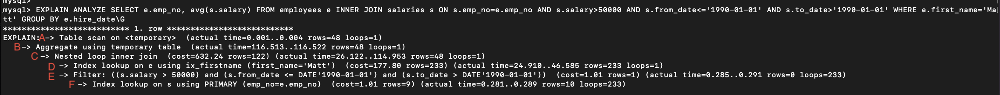
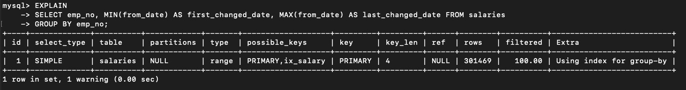
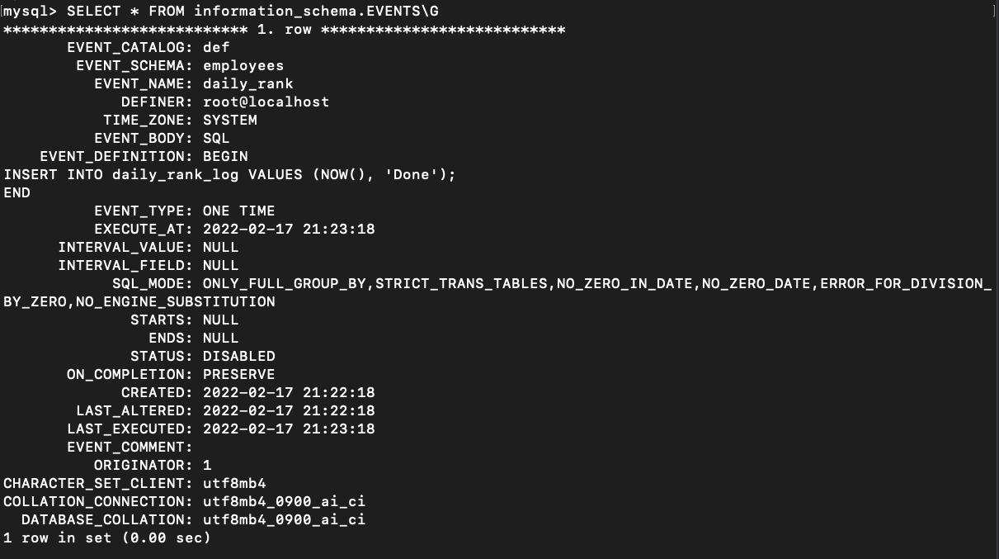

# Real MySQL 8.0


# #1 소개

# #2 설치와 설정

# #3 사용자 및 권한

# #4 아키텍처

# #5 트랜잭션과 잠금

# #6 데이터 압축

- MySQL 서버에서 디스크에 저장된 데이터 파일의 크기는 일반적으로 쿼리의 처리 성능과도 직결되지만 백업 및 복구 시간과도 밀접하게 연결된다.
- 디스크 데이터 파일이 크면 클수록 비용, 속도문제, 성능문제 등으로 많은 DBMS가 이런 문제점들을 해결하기 위해 데이터 압축 기능을 제공한다.


## 페이지 압축

- MySQL 서버에서는 디스크에 저장하는 시점에 데이터 페이지가 압축되어 저장되고, 반대로 MySQL 서버가 디스크에서 데이터 페이지를 읽어올 때 압축이 해제된다.
  - 버퍼 풀에 데이터 페이지가 적재되면 InnoDB 스토리지 엔진은 압축이 해제된 상태로만 데이터 페이지를 관리한다.
  - 이때 문제가 되는게 예를 들어 16kb 데이터 페이지를 압축한 결과가 용량이 얼마나 될지 예측이 불가능하고 하나의 테이블은 동일한 크기의 페이지로 통일돼야 한다는 것
- 그래서 페이지 압축 기능은 운영체제별로 특정 버전의 파일 시스템에서만 지원되는 펀치홀이라는 기능을 사용한다.

`펀치홀 동작방식`

1. 16kb 페이지를 압축 (압축 결과를 7kb로 가정)
2. MySQL 서버는 디스크에 압축된 결과 7kb를 기록 (이때 MySQL 서버는 압축 데이터 7kb에 9kb의 빈 데이터를 기록)
3. 디스크에 데이터를 기록한 후, 7kb 이후의 공간 9kb에 대해 펀치 홀을 생성
4. 파일 시스템은 7kb만 남기고 나머지지 디스크의 9kb공간은 다시 운영체제로 반납

`펀치홀 단점`

- 펀치홀 기능은 운영체제뿐만 아니라 하드웨어 자체에서도 해당 기능을 지원해야 한다.
- 아직 파일 시스템 관련 명령어가 펀치홀을 지원하지 못한다.
  - ex: 펀치홀이 적용되어 1gb로 압축되었다고 하더라도 `cp` 명령어로 복사하면 펀치홀이 다시 채워져 원본 크기인 10gb가 될 수 있다.
- 이런한 이유로 실제 페이지 압축은 많이 사용되지 않는다.


`페이지 압축을 이용하기`

```sql
// 테이블 생성시
mysql> CREATE TABLE t1 (c1 INT) COMPRESSION="zlib"

// 테이블 변경시
mysql> ALTER TABLE t1 COMPRESSION="zlib"
mysql> OPTIMIZE TABLE t1;
```


## 테이블 압축

- 테이블 압축은 운영체제나 하드웨어에 대한 제약이 없기 때문에 일반적으로도 활용도가 높다.
- 하지만 아래와 같은 단점이 있다.

`테이블 압축의 단점`

- 버퍼 풀 공간 활용률이 낮다.
- 쿼리 처리 성능이 낮다.
- 빈번한 데이터 변경시 압축률이 떨어진다.


### 압축 테이블 생성

- 테이블 압축을 사용하기 위한 전제 조건으로 압축을 사용하려는 테이블이 별도의 테이블 스페이스를 사용해야 한다.
  - `innodb_file_per_table` 시스템 변수가 ON으로 설정된 상태에서 테이블이 생성돼야 한다.
- 테이블 압축을 사용하는 테이블은 테이블을 생성할 때 `ROW_FORMAT=COMPRESSED` 옵션을 명시해야 한다.
- `KEY_BLOCK_SIZE`(2n, n 값은 2 이상)을 이용해 압축된 페이지의 타깃 크기를 명시한다.
  - InnoDB 스토리지엔진의 페이지크기가 16kb라면 4kb 또는 8kb만 설정이 가능하다.
- 페이지크기가 32kb 또는 64kb인 경우에는 테이블 압축을 적용할 수 없다.

```sql
mysql> SET GLOBAL innodb_file_per_table=ON;

-- // ROW_FORMAT 옵션과 KEY_BLOCK_SIZE 옵션을 모두 명시
mysql> CREATE TABLE compressed_table (
  c1 INT PRIMARY KEY
)
ROW_FORMAT=COMPRESSED
KEY_BLOCK_SIZE=8;

-- //KEY_BLOCK_SIZE 옵션만 명시
mysql> CREATE TABLE compressed_table (
  c1 INT PRIMARY KEY
)
KEY_BLOCK_SIZE=8;

-- //위와 같은 경우에는 자동으로 ROW_FORMAT=COMPRESSED 옵션이 추가되어 생성된다.
-- //KEY_BLOCK_SIZE의 옵션값은 kb

```


`InnoDB 스토리지 엔진이 압축을 적용하는 방법`

- InnoDB 스토리지 엔진의 데이터 페이지 크기가 16kb, `KEY_BLOCK_SIZE`= 8 이라고 가정
  1. 16kb의 데이터 페이지를 압축
     1. 압축된 결과가 8kb 이하이면 그대로 디스크에 저장 (압축 완료)
     2. 압축된 결과가 8kb를 초과하면 원본 페이지를 스플릿해서 2개의 페이지에 8kb씩 저장

  2. 나뉜 페이지 각각에 대해 1번 단계를 반복 실행  

- 테이블 압축 방식에서 가장 중요한 것은 원본 데이터 페이지의 압축 결과가 목표크기(`KEY_BLOCK_SIZE`) 보다 작거나 같을 때까지 반복해서 페이지를 스플릿하는 것이다.
- 목표 크기가 잘못 설정되면 MySQL 서버의 처리 성능이 급격히 떨어질 수 있음을 주의!


### KEY_BLOCK_SIZE 결정

- `KEY_BLOCK_SIZE` 가 테이블 압축에서 가장 중요하기 때문에 4kb, 8kb로 테이블을 생성해서 샘플데이터를 저장해보고 적절한지 판단하는 것이 좋다.
  - 최소한 테이블의 데이터 페이지가 10개 정도는 되어야 유의미한 테스트가 된다.


`테스트해보기 (KEY_BLOCK_SIZE=4)`

```sql
CREATE TABLE `employees_comp4k` (
  `emp_no` int NOT NULL,
  `birth_date` date NOT NULL,
  `first_name` varchar(14) CHARACTER SET utf8mb4 COLLATE utf8mb4_general_ci NOT NULL,
  `last_name` varchar(16) CHARACTER SET utf8mb4 COLLATE utf8mb4_general_ci NOT NULL,
  `gender` enum('M','F') CHARACTER SET utf8mb4 COLLATE utf8mb4_general_ci NOT NULL,
  `hire_date` date NOT NULL,
  PRIMARY KEY (`emp_no`),
  KEY `ix_hiredate` (`hire_date`),
  KEY `ix_gender_birthdate` (`gender`,`birth_date`),
  KEY `ix_firstname` (`first_name`)
) ROW_FORMAT=COMPRESSED
KEY_BLOCK_SIZE=4;

-- // 인덱스별로 압축 실행 횟수와 성공횟수를 기록하기 위한 설정
SET GLOBAL innodb_cmp_per_index_enabled=ON;

-- // employees 테이블의 데이터를 압축 테스트 테이블로 저장
INSERT INTO employees_comp4k SELECT * FROM employees;

-- // 인덱스 별로 압축 횟수와 성공 횟수, 압축 실패율을 조회
SELECT table_name, index_name, compress_ops, compress_ops_ok, (compress_ops-compress_ops_ok)/compress_ops * 100 as compression_failure_pct
FROM information_schema.INNODB_CMP_PER_INDEX;
```


- PK는 전체 18653번을 압축을 실행하고 그 중에서 13478번 성공했다.
- 5175(18653 - 13478)번 실패했는데 압축의 결과가 4kb를 초과해서 데이터 페이지를 스플릿해서 다시 압축을 실행했다는 의미다.
- PK 압축 실패율 외에도 나머지 인덱스 2개도 압축 실패율이 상대적으로 높은편인데 `KEY_BLOCK_SIZE` 는 압축 실패율을 3~5% 사이로 둘 수 있게 설정하는게 좋다.

`테스트해보기 (KEY_BLOCK_SIZE=8)`


- `KEY_BLOCK_SIZE` 가 8kb여도 PK 키의 압축 실패율이 높기때문에 이 결과를 기준으로 압축을 적용하면 압축 실패율이 꽤 높아서 InnoDB 버퍼풀에서 디스크로 기록되기 전에 압축하는 과정에서 시간이 꽤 걸릴 수 있다.
- 성능에 민감한 서비스라면 이 테이블은 압축을 적용하지 않는 것이 좋다고 판단할 수 있다.

`압축된 모습`


- `KEY_BLOCK_SIZE` 가 4kb나 8kb나 압축후 결과가 크게 차이안나므로 이 경우 8kb를 사용하는게 좋다.
- 압축 실패율이 높다고해서 압축을 사용하지 말라는 뜻은 아니다. 스플릿이 일어나더라도 데이터파일의 크기가 큰 폭으로 줄어든다면 큰 손해는 아니다. 하지만 데이터가 매우 빈번하게 조회되고 변경된다면 압축 실패율이 낮더라도 압축을 고려하지 않는게 좋다.
- 테이블 압축은 zlib을 이용해 압축을 실행하는데 이 압축 알고리즘은 많은 cpu 자원을 소모한다.


### 압축된 페이지의 버퍼 풀 적재 및 사용

- InnoDB 스토리지 엔진은 디스크에서 읽은 상태 그대로의 데이터 페이지 목록을 관리하는 LRU 리스트와 압축된 페이지들의 압축 해제 버전인 Unzip_LRU 리스트를 별도로 관리한다.
- MySQL 서버에는 압축된 테이블과 압축되지 않은 테이블이 공존하므로 결국 LRU 리스트는 다음과 같이 두 개의 페이지를 모두 가질 수 있다.
  - 압축이 적용되지 않은 테이블의 데이터 페이지
  - 압축이 적용된 테이블의 압축된 데이터 페이지
- InnoDB 스토리지 엔진은 압축된 테이블에 대해서 버퍼 풀의 공간을 이중으로 사용함으로써 메모리를 낭비하는 효과를 가진다.
- 하지만 압축 및 압축 해제 작업은 CPU를 상대적으로 많이 소모하기 때문에 Unzip_LRU 리스트를 별도로 관리하고 있다가 MySQL 서버로 유입되는 요청 패턴에 따라 적절히 다음과 같은 처리를 수행한다.
  - InnoDB 버퍼 풀의 공간이 필요한 경우엔 LRU 리스트에서 원본 데이터 페이지는 유지하고 Unzip_LRU 리스트에서 압축 해제된 버전은 제거해서 버퍼풀의 공간을 확보한다.
  - 압축된 데이터 페이지가 자주 사용되는 경우에는 Unzip_LRU 리스트에 압축 해제된 페이지를 계속 유지하면서 압축 및 압축 해제 작업을 최소화한다.
  - 압축된 데이터 페이지가 사용되지 않아서 LRU 리스트에서 제거되는 경우에는 Unzip_LRU 리스트에서도 함께 제거된다.


`InnoDB 스토리지 엔진의 어댑티브 알고리즘`

- CPU 사용량이 높은 서버에는 가능하면 압축과 압축 해제를 피하기 위해 Unzip_LRU 비율을 높여서 유지한다.
- Disk IO 사용량이 높은 서버에는 가능하면 Unzip_LRU 리스트의 비율을 낮춰서 InnoDB 버퍼 풀의 공간을 더 확보하도록 작동한다.


### 테이블 압축 관련 설정

- 테이블 압축과 연관된 시스템 변수

`innodb_com_per_index_enabled`

- 테이블 압축이 사용된 테이블의 모든 인덱스별로 압축 성공 및 압축 실행 횟수를 수집하도록 설정한다.
- OFF 일 경우 테이블 단위의 압축 성공 및 압축 실행 횟수만 수집된다.
- 테이블 단위로 수집된 정보는 `infomation_schema.INNODB_CMP`
- 인덱스 단위로 수집된 정보는 `infomation_schema.INNODB_CMP_PER_INDEX`

`innodb_compression_level`

- 이 변수를 사용해서 압축률을 설정할 수 있다.
- 0~9의 값
- 값이 작을수록 압축 속도는 빨라지지만 저장 공간은 커질 수 있다. 반대로 값이 커질수록 속도는 느려질 수 있지만 압축률은 높아진다.
- 기본값은 6
- 압축속도가 빨라진다 = CPU 자원을 적게 사용한다.

`innodb_compression_failure_threshold_pct와 innodb_compression_pad_pct_max`

- 테이블 단위로 압축 실패율이 `innodb_compression_failure_threshold_pct` 보다 커지면 압축을 실행하기 전 원본 데이터 페이지의 끝에 의도적으로 빈 패딩 공간을 추가한다.
- 추가된 빈 공간은 압축률을 높여서 압축 결과가 `KEY_BLOCK_SIZE` 보다 작아지게 만드는 효과를 낸다.
- 이 패딩 공간은 압축 실패율이 높아질수록 계속 증가된 크기를 갖는데 추가할 수 있는 패딩공간의 최대 공간을 `innodb_compression_pad_pct_max` 으로 설정할 수 있다. 
- `innodb_compression_pad_pct_max` 는 % 값이고 전체 데이터 페이지 크기 대비 패딩 공간의 비율을 의미한다.

`innodb_log_compressed_pages`

- MySQL 서버가 비정상적으로 종료됐다가 다시 시작되는 경우 압축 알고리즘의 버전 차이가 있더라도 복구 과정이 실패하지 않도록 InnoDB 스토리지 엔진은 압축된 데이터 페이지를 그대로 리두 로그에 기록한다. 
- 이는 압축 알고리즘을 업그레이드할 때 도움이 되지만, 데이터 페이지를 통째로 리두 로그에 저장하는 것은 리두 로그 증가량에 상당한 영향력을 미칠 수 있다.
- 압축을 적용한 후 리두 로그 용량이 매우 빠르게 증가한다거나 버퍼 풀로부터 더티 페이지가 한꺼번에 많이 기록되는 패턴으로 바뀌었다면 `innodb_log_compressed_pages` 을 OFF로 바꾼뒤 모니터링해보는 것이 좋다.
- 기본값은 ON, ON으로 유지시키는것을 권장한다.


# #7 데이터 암호화


# #8 인덱스


# #9 옵티마이저와 힌트


# #10 실행 계획

- 대부분의 DBMS의 목적은 사용자의 데이터를 안전하게 저장 및 관리하고 원하는 데이터를 빠르게 조회할 수 있게 해주는 것이 주 목적이다.
- 이러한 목적을 달성하려면 옵티아미어가 사용자의 쿼리를 최적으로 처리할 수 있게 하는 실행 계획을 수립할 수 있어야 하는데 옵티마이저는 사용자, 관리자의 개입 없이 항상 좋은 실행 계획을 만들어내는 것은 아니다.
- DBMS 서버는 이러한 문제점을 관리자나 사용자가 보완할 수 있도록 `EXPLAIN` 명령으로 옵티마이저가 수립한 실행 계획을 확인할 수 있게 해준다.


## 통계 정보

- MySQL 서버는 5.7 버전까지 테이블과 인덱스에 대한 개괄적인 정보를 가지고 실행 계획을 수집했지만 이 방법은 테이블 칼럼의 값들이 실제 어떻게 분포돼 있는지에 대한 정보가 없기 때문에 실행 계획의 정확도가 떨어지는 경우가 많았다.
- MySQL 8.0 부터는 데이터 분포도를 수집해서 저장하는 히스토그램 정보가 도입됐다.


### 테이블 및 인덱스 통계 정보

- 비용 기반 최적화에서 가장 중요한 것은 통계 정보다.
  - 1억건의 레코드가 저장된 테이블의 통계 정보가 갱신되지 않아 10만건으로 알고 있다면 옵티마이저는 전혀 엉뚱한 실행계획으로 쿼리를 수행할 수 있다.
- MySQL은 다른 DBMS 보다 통계 정보의 정확도가 높지 않고 통계 정보의 휘발성이 강했다.
- MySQL 5.6부터는 통계 정보의 정확성을 높일 수 있는 방법이 제공되기 시작했지만 아직도 많은 사용자가 기존 방식을 그대로 사용한다.


### MySQL 서버의 통계 정보

- MySQL 5.5 버전까지는 각 테이블의 통계 정보가 메모리에만 관리되었고 MySQL 서버가 재시작되면 지금까지 수집한 통계 정보가 모두 사라진다. 그 외에도 아래와 같은 경우에 통계정보가 관리자, 사용자 모르게 갱신됐다
  - 테이블이 새로 오픈된 경우
  - 테이블의 레코드가 대량으로 변경되는 경우 (테이블의 전체 레코드 중에서 1/16 정도의 `UPDATE` 또는 `INSERT`나 `DELETE`가 실행되는 경우)
  - `ANALYZE TABLE` 명령이 실행되는 경우
  - `SHOW TABLE STATUS` 명령이나 `SHOW INDEX FROM` 명령이 실행되는 경우
  - InnoDB 모니터가 활성화되는 경우
  - `innodb_stats_on_metadata` 시스템 설정이 ON 인 상태에서 `SHOW TABLE STATUS` 명령이 실행되는 경우
- MySQL 5.6 버전 부터는 InnoDB 스토리지 엔진을 사용하는 테이블에 대한 통계 정보를 영구적으로 관리할 수 있게  `mysql` 데이터베이스의 `innodb_index_stats` 테이블과 `innodb_table_stats` 테이블로 관리할 수 있게 개선됐다.


- MySQL 5.6에서 테이블 생성시 `STATS_PERSISTENT` 옵션을 설정할 수 있는데 이 설정값으로 테이블 단위 영구적인 통계 정보를 보관할지 말지를 결정할 수 있다.

`STATS_PERSISTENT=0` 

- 테이블의 통계 정보를 MySQL 5.5 이전 방식대로 관리한다. (메모리로만 관리)

`STATS_PERSISTENT=1`

- 테이블의 통계 정보를 `innodb_index_stats` 테이블과 `innodb_table_stats` 테이블로 관리한다.

`STATS_PERSISTENT=DEFAULT`

- `STATS_PERSISTENT` 을 지정하지 않았을때와 동일하며 `innodb_stats_persistent` 시스템 변수의 값을 통해 설정한다.
- `innodb_stats_persistent` 의 기본 설정값은 ON(1) 이다.

```SQL
CREATE TABLE tab_persistent (fd1 INT, fd2 VARCHAR(20), PRIMARY KEY(fd1)) 
ENGINE=InnoDB STATS_PERSISTENT=1;

CREATE TABLE tab_transient (fd1 INT, fd2 VARCHAR(20), PRIMARY KEY(fd1)) 
ENGINE=InnoDB STATS_PERSISTENT=0;
```


- 아래 명령어를 통해 이미 생성된 테이블의 설정을 변경할 수 있다.

```SQL
ALTER TABLE tab_transient STATS_PERSISTENT=1;
```


`innodb_index_stats 테이블 확인하기`

```sql
SELECT *
FROM innodb_index_stats
WHERE database_name='employees'
	AND TABLE_NAME='salaries'\g
```


- `innodb_index_stats.stat_name='n_diff_pfx%'`
  - 인덱스가 가진 유니크한 값의 개수

- `innodb_index_stats.stat_name='n_leaf_pages'`

  - 인덱스의 리프 노드 페이지 개수

- `innodb_index_stats.stat_name='size'`
  - 인덱스 트리의 전체 페이지 개수

`innodb_table_stats 테이블 확인하기`

```sql
SELECT *
FROM innodb_table_stats
WHERE database_name='employees'
	AND TABLE_NAME='salaries'\g
```


- `innodb_table_stats.n_rows`

  - 테이블의 전체 레코드 건수

- `innodb_table_stats.clustered_index_size`

  - 프라이머리 키의 크기 (innoDB 페이지 개수)

- `innodb_table_stats.sum_of_other_index_size`

  - 프라이머리 키를 제외한 인덱스의 크기 (innoDB 페이지 개수)

  - 이 값은 테이블의 `STATS_AUTO_RECALC` 옵션에 따라 0으로 보일 수 있는데 아래 명령어를 실행하면 통계값이 저장된다

  - ```sql
    ANALYZE TABLE employees.employees;
    ```

​    

- MySQL 5.6 에서 영구적인 통계 정보가 도입되면서 `innodb_stats_auto_recalc` 시스템 설정 변수의 값을 통해 통계 정보가 자동으로 갱신되는 것을 막을 수 있다.
  - OFF로 설정하면 통계 정보가 자동으로 갱신된다는 뜻. 기본값은 ON
- 통계 정보를 자동으로 수집할지 여부도 테이블을 생성할때 `STATS_AUTO_RECALC` 옵션을 이용해 테이블 단위로 조정할 수 있다.

`STATS_AUTO_RECALC=1`

- 테이블의 통계 정보를 MySQL 5.5 이전의 방식대로 수집한다.

`STATS_AUTO_RECALC=0`

- 테이블의 통계 정보는 `ANALYZE TABLE` 명령을 실행할 때만 수집된다.

`STATS_AUTO_RECALC=DEFAULT`

- 별도로 `STATS_AUTO_RECALC` 을 지정하지 않았을 때와 동일하며 `innodb_stats_auto_recalc` 시스템 변수의 값으로 설정한다.

  

- MySQL 5.5 버전에서 테이블의 통계 정보를 수집할 때 몇 개의 InnoDB 테이블 블록을 샘플링할지 결정하는 `innodb_stats_sample_pages` 시스템 변수는 5.6 버전부터 없어졌다.(Deprecated) 대신 이 시스템 변수는 아래 2개로 분리 되었다.

`innodb_stats_transient_sample_pages`

- 기본값은 8
- 자동으로 통계 정보 수집이 실행될 때 8개 페이지만 임의로 샘플링해서 분석하고 그 결과를 통계 정보로 활용함을 의미한다.

`innodb_stats_persistent_sample_pages`

- 기본값은 20
- `ANALYZE TABLE` 명령이 실행되면 임의로 20개 페이지만 샘플링해서 분석하고 그 결과를 영구적인 통계 정보 테이블에 저장하고 활용함을 의미한다.
- 더 정확한 통계정보를 수집하고 싶다면 이 값에 높은 값을 설정하면 되지만 값이 너무 높을 경우 정보 수집 시간이 길어지므로 주의해야 한다.


### 히스토그램

- MySQL 5.7 버전까지의 통계 정보는 단순히 인덱스된 칼럼의 유니크한 값의 개수정도만 가지고 있었는데 이는 옵티마이저가 최적의 실행 계획을 수립하기에는 많이 부족했다.
- MySQL 8.0 버전부터 히스토그램을 도임해서 칼럼의 데이터 분포도를 참조할 수 있게 됐다.


#### 히스토그램 정보 수집 및 삭제

- MySQL 8.0 부터 히스토그램 정보는 칼럼 단위로 관리된다.
- 자동으로 수집되지 않고 `ANALYZE TABLE ... UPDATE HISTOGRAM` 명령을 실행해 수동으로 수집 및 관리한다.
- 수집된 히스토그램 정보는 시스템 딕셔너리에 함께 저장되고, MySQL 서버가 시작될 때 딕셔너리의 히스토그램 정보를 `information_schema` 데이터베이스의 `column_statistics` 테이블로 로드한다.


```sql
ANALYZE TABLE employees.employees UPDATE HISTOGRAM ON gender, hire_date;
```

```sql
SELECT *
FROM information_schema.COLUMN_STATISTICS
WHERE SCHEMA_NAME='employees'
	AND TABLE_NAME='employees'\G
```


- MySQL 버전에서는 아래와 같은 2종류의 히스토리그램 타입이 지원된다.

`Singleton(싱글톤 히스토그램)`

- 칼럼값 개별로 레코드 건수를 관리하는 히스토그램
- Value-Based 히스토그램 또는 도수 분포라고 불린다.

`Equi-Height(높이 균형 히스토그램)`

- 칼럼값의 범위를 균등한 개수로 구분해서 관리하는 히스토그램
- Height-Balanced 히스토그램이라고도 불린다.

  

- 히스토그램은 버킷 단위로 구분되어 레코드 건수나 칼럼값의 범위가 관리된다
- 싱글톤 히스토그램은 칼럼이 가지는 값별로 버킷이 할당되고 높이 균형 히스토그램에서는 개수가 균등한 칼럼 값의 범위별로 하나의 버킷이 할당된다.
- 싱글톤 히스토그램은 각 버킷이 칼럼의 값, 발생 빈도의 비율. 2개의 값을 갖는다.
- 높이 균형 히스토그램은 각 버킷 범위 시작값, 마지막 값, 발생 빈도율, 버킷에 포함된 유니크한 값의 개수. 4개의 값을 갖는다.


`employees 테이블의 gender 칼럼 히스토그램 데이터 (싱글톤)`


- 싱글톤 히스토그램은 `ENUM('M', 'F')` 타입인 gender 칼럼이 가질 수 있는 2개의 값에 대해 누적된 레코드 건수의 비율을 갖고 있다.
- 싱글톤 히스토그램은 주로 코드 값과 같이 유니크한 값의 개수가 상대적으로 적은(히스토그램의 버킷 수 보다 적은) 경우 사용된다. 
- `gender` 칼럼 값이 'M' 인 레코드의 비율은 0.5998 정도이고 'F'인 레코드의 비율은 1로 표시된다.
- 히스토그램의 모든 레코드 건수 비율은 누적으로 표시되기 때문에 `gender` 칼럼의 값이 'F'인 레코드의 비율은 (1 - 0.5998) 이다.


`employees 테이블의 hire_date 칼럼 히스토그램 데이터 (높이 균형)`


- 높이 균형 히스토그램은 컬럼값의 각 범위에 대해 레코드 건수 비율이 누적으로 표시된다.
- 버킷 범위가 뒤로 갈수록 비율이 높아지는 것으로 보이지만 사실 범위별로 비율이 같은 수준에서 `hire_date` 칼럼의 범위가 선택된 것이다.
- 위 그래프의 경우 기울기가 일정한 것을 보면 각 범위가 비슷한 값을 가진다는 것을 알 수 있다.


`information_schema.column_statistics 테이블의 HISTOGRAM 칼럼이 가진 나머지 필드들`

- `sampling-rate`
  - 히스토그램 정보를 수집하기 위해 스캔한 페이지의 비율
  - 샘플링 비율이 0.35라면 전체 데이터 페이지의 35%를 스캔해서 이 정보가 수집됐다는 것을 의미
  - 샘플링 비율과 정확도는 비례하지만 테이블을 전부 스캔하는 것은 부하가 높고 시스템의 자원을 많이 소모한다.
  - `histogram_generation_max_mem_size` 시스템 변수에 설정된 메모리 크기에 맞게 적절히 샘플링한다. (기본값 20mb)
  - MySQL 8.0.19 미만의 버전까지는 `histogram_generation_max_mem_size` 변수와 상관 없이 풀스캔으로 히스토그램을 생성했다. 8.0.19 미만이라면 히스토그램 수집시 주의할 것!
- `histogram-type`
  - 히스토그램의 종류를 저장한다.
- `number-of-buckets-specified`
  - 히스토그램을 생성할 때 설정했던 버킷의 개수
  - 기본값은 100, 최대 1024개를 설정할 수 있지만 일반적으로 100개면 충분한 것으로 알려져 있다.


`히스토그램 삭제`

- 히스토그램의 삭제 작업은 테이블의 데이터를 참조하는 것이 아니라 딕셔너리의 내용만 삭제하기 때문에 쿼리 처리의 성능에 영향을 주지 않고 즉시 완료된다.
- 하지만 히스토그램이 사라지면 실행계획이 달라질 수 있으므로 주의하자.

```sql
ANALYZE TABLE employees.employees
DROP HISTOGRAM ON gender, hire_date;
```

- 히스토그램을 삭제하지 않고 MySQL 옵티마이저가 히스토그램을 사용하지 않게 하려면 다음과 같이 `optimizer_switch` 시스템 변수의 값을 변경하면 된다.

```sql
SET GLOBAL optimizer_switch='condition_fanout_filter=off'
```

- `condition_fanout_filter` 옵션에 의해 영향받는 다른 최적화 기능들도 사용되지 않을 수 있으니 주의하자!
- 특정 커넥션, 특정 쿼리에서만 히스토그램을 사용하지 않고자 한다면 다음과 같은 방법을 사용하면 된다.

```sql
-- //현재 커넥션에서 실행되는 쿼리만 히스토그램을 사용하지 않게 설정
SET SESSION optimizer_witch='condition_fanout_filter=off';

-- //현재 쿼리만 히스토그램을 사용하지 않게 설정
SELECT /*+ SET_VAR(condition_fanout_filter='condition_fanout_filter=off')*/ *
FROM ...
```


#### 히스토그램의 용도

- MySQL 서버에 히스토그램이 도입되기 이전에도 테이블과 인덱스에 대한 통계 정보는 존재했지만 이는 테이블의 전체 레코드 건수와 인덱스된 칼럼이 가지는 유니크한 값의 개수 정도였다
  - 예를 들어 테이블의 레코드가 1000건이고 어떤 칼럼의 유니크한 값의 개수가 100개였다면 MySQL 서버는 이 칼럼에 대한 동등 비교 검색을 하면 대략 10개의 레코드가 일치할 것이라고 예측한다.
  - 하지만 실제 응용 프로그램에서의 데이터는 항상 균등한 분포도를 갖지 않는다.
  - 어떤 사용자는 주문 레코드를 많이 갖고 있고 또 다른 사용자들은 주문 정보가 하나도 없을 수 있다.
- 히스토그램은 특정 칼럼이 가지는 모든 값에 대한 분포도 정보를 가지지는 않지만 각 범위별로 레코드의 건수와 유니크한 값의 개수 정보를 가지기 때문에 훨씬 정확한 예측을 할 수 있다.


`히스토그램을 사용할때와 사용하지 않을 때 차이`


- 히스토그램을 사용하지 않을때

```sql
EXPLAIN
SELECT *
FROM employees
WHERE first_name='Zita'
	AND birth_date BETWEEN '1950-01-01' AND '1960-01-01';
```


- 히스토그램을 사용할때

```sql
ANALYZE TABLE employees
UPDATE histogram ON first_name, birth_date;

EXPLAIN
SELECT *
FROM employees
WHERE first_name='Zita'
	AND birth_date BETWEEN '1950-01-01' AND '1960-01-01';

```


- 히스토그램이 없을때는 11.11%의 birth_date가 1950년대일 것으로 추측했지만 히스토그램을 사용했을때는 61.30%이 1950년대 출생인 것을 알 수 있다. (실제로 63.84%가 1950년대 출생이다.)
- 단순 통계 정보만 이용한 경우와 히스토그램을 이용한 경우의 차이가 매우 큰 것을 알 수 있다.
- **히스토그램이 없으면 옵티마이저는 데이터가 균등하게 분포돼 있을 것으로 예측한다.**
- **히스토그램이 있으면 특정 범위의 데이터가 많고 적음을 식별할 수 있다. 이는 쿼리의 성능에 상당한 영향을 미칠 수 있다.**


#### 히스토그램과 인덱스

- 히스토그램과 인덱스는 완전히 다른 객체이기 때문에 서로 비교할 대상은 아니지만 부족한 통계 정보를 수집하기 위해 사용된다는 측면에서 어느정도 공통점을 가진다고 볼 수 있다.
- MySQL 서버에서는 쿼리의 실행 계획을 수립할 때 사용 가능한 인덱스들로부터 조건절에 일치하는 레코드 건수를 대략 파악하고 최종적으로 가장 나은 실행계획을 선택한다.
- 이때 조건절에 일치하는 레코드 건수를 예측하기 위해 옵티마이저는 실제 인덱스의 B-Tree를 샘플링해서 살펴본다 (인덱스 다이브 Index Dive)
- MySQL 8.0 서버에서는 인덱스된 칼럼을 검색 조건으로 사용하는 경우 그 칼럼의 히스토그램은 사용하지 않고 실제 인덱스 다이브를 통해 직접 수집한 정보를 활용한다.
- 이는 실제 검색 조건의 대상 값에 대한 샘플링을 실행하는 것이므로 항상 히스토그램보다 정확한 결과를 기대할 수 있기 때문이다.
- **MySQL 8.0 에서 히스토그램은 주로 인덱스되지 않은 컬럼에 대한 데이터 분포도를 참조하는 용도로 사용된다.** (IN 절과 같이 인덱스 다이브 비용이 높은 경우 히스토그램을 활용하는 최적화 기능이 MySQL 서버에 추가될 가능성이 있지 않을까? 라는 저자의 추정..)


### 코스트 모델 (Cost Model)

- MySQL 서버가 쿼리를 처리하려면 다음과 같은 다양한 작업을 필요로 한다.
  - 디스크로부터 데이터 페이지 읽기
  - 메모리(InnoDB 버퍼 풀)로부터 데이터 페이지 읽기
  - 인덱스 키 비교
  - 레코드 평가
  - 메모리 임시 테이블 작업
  - 디스크 임시 테이블 작업
- MySQL 서버는 사용자의 쿼리에 대해 이러한 다양한 작업이 얼마나 필요한지 예측하고 전체 작업 비용을 계산한 결과를 바탕으로 최적의 실행 계획을 찾는다.
- 이렇게 전체 쿼리의 비용을 계산하는데 필요한 단위 작업들의 비용을 코스트 모델이라고 한다.
- MySQL 5.7 이전 버전까지는 이런 작업들의 비용을 MySQL 서버 소스 코드에 상수화해서 사용했지만 이 작업들의 비용이 하드웨어에 따라 달라질 수 있어서 최적의 실행 계획 수립에 있어서는 방해 요소였다.
- MySQL 5.7 버전부터는 각 단위의 작업 비용을 DBMS 관리자가 조정할 수 있게 됐지만 인덱스되지 않은 칼럼의 데이터 분포(히스토그램)나 메모리에 상주중인 페이지 비율 등 비용 계산과 연관된 부분의 정보가 부족했다.
- MySQL 8.0 부터 히스토그램과 각 인덱스별 메모리 적재 페이지 비율이 관리되고 옵티마이저의 실행 계획 수립에 사용되기 시작했다.

  

- MySQL 8.0 서버의 코스트 모델은 다음 2개의 테이블에 저장되어 있다. (mysql db에 있다.)
  - `server_cost`
    - 인덱스를 찾고 레코드를 비교하고 임시테이블 처리에 대한 비용 관리
  - `engine_cost`
    - 레코드를 가진 데이터 페이지를 가져오는 데 필요한 비용 관리


`server_cost와 engine_cost의 공통 칼럼`

- `cost_name`
  - 코스트 모델의 각 단위 작업
- `default_value`
  - 각 단위 작업의 비용(기본값이며 이 값은 MySQL 서버 소스코드에 설정된 값)
- `cost_value`
  - DBMS 관리자가 설정한 값(이 값이 NULL이면 MySQL 서버는 `default_value` 칼럼의 비용 사용)
- `last_updated`
  - 단위 작업의 비용이 변경된 시점(단순 정보성. 옵티마이저와 연관 없음)
- `comment`
  - 비용에 대한 추가 설명(단순 정보성. 옵티마이저와 연관 없음)


`engine_cost의 추가 2개 칼럼`

- `engine_name`
  - 비용이 적용된 스토리지 엔진
  - 기본값은 `default`. `default` 인 경우 모든 스토리지 엔진에 적용된다.
  - MEMORY, MyISAM, InnoDB 에 대해 단위 작업의 비용일 달리 설정하고자 한다면 이 칼럼을 이용하면 된다.
- `device_type`
  - 디스크 타입
  - MySQL 8.0 기준으로 아직 이 칼럼의 값을 활용하지 않는다. 따라서 0만 설정할 수 있다.


`MySQL 8.0 버전의 코스트 모델에서 지원하는 단위 작업 목록`

| cost_name       | cost_name                    | default_value | 설명                             |
| --------------- | ---------------------------- | ------------- | -------------------------------- |
| **engine_cost** | io_block_read_cost           | 1.00          | 디스크 데이터 페이지 읽기        |
|                 | memory_block_read_cost       | 0.25          | 메모리 데이터 페이지 읽기        |
| **server_cost** | disk_temptable_create_cost   | 20.00         | 디스크 임시 테이블 생성          |
|                 | disk_temptable_row_cost      | 0.50          | 디스크 임시 테이블의 레코드 읽기 |
|                 | key_compare_cost             | 0.05          | 인덱스 키 비교                   |
|                 | memory_temptable_create_cost | 1.00          | 메모리 임시 테이블 생성          |
|                 | memory_template_row_cost     | 0.10          | 메모리 임시 테이블의 레코드 읽기 |
|                 | row_evaluate_cost            | 0.10          | 레코드 비교                      |

- `row_evaluate_cost`는 스토리지 엔진이 반환한 레코드가 쿼리의 조건에 일치하는지 평가하는 단위 작업. 이 값이 증가할수록 풀 테이블 스캔과 같이 많은 레코드를 처리하는 쿼리의 비용이 높아지고 레인지 스캔과 같이 상대적으로 적은 수의 레코드를 처리하는 쿼리의 비용이 낮아진다.
- `key_compare_cost` 값이 높아질수록 레코드 정렬과 같이 키 값 비교 처리가 많은 경우 쿼리의 비용이 높아진다.


`MySQL 서버에서 각 실행 계획의 계산된 비용을 확인하는 방법`

```sql
EXPLAIN FORMAT=TREE
SELECT *
FROM employees WHERE first_name='Matt' \G
```


```sql
EXPLAIN FORMAT=JSON
SELECT *
FROM employees WHERE first_name='Matt' \G
```


- MySQL 서버의 실행 계획에 표시되는 비용을 직접 계산해보고 싶을 수 있지만 이는 상당히 어렵다.
- 코스트 모델에서 중요한 것은 각 단위 작업에 설정되는 비용 값이 커지면 어떤 실행 계획들이 고비용으로 바뀌고 어떤 실행 계획들이 저비용으로 바뀌는지를 파악하는 것이다.
- 이 값들을 사용자가 변경할 수 있다고 해서 꼭 바꿔서 사용하라는 뜻은 아니다. 이미 20년 넘게 수많은 응용프로그램에서 기본값으로 잘 동작하고 있다. 하드웨어와 MySQL 서버 내부처리 방식에 대한 깊은 이해도가 있을 경우에만 변경하자!


`각 단위 작업의 비용이 변경되면 예상할 수 있는 결과 목록 (언제까지나 참고 사항. 기본값들도 잘 된다)`

- `key_compare_cost` 을 높이면 MySQL 서버 옵티마이저가 가능하면 정렬을 수행하지 않는 방향의 실행 계획을 선택할 가능성이 높아진다.
- `row_evaluate_cost`을 높이면 풀 스캔을 실행하는 쿼리들의 비용이 높아지고, MySQL 서버 옵티마이저는 가능하면 인덱스 레인지 스캔을 사용하는 실행 계획을 선택할 가능성이 높아진다.
- `disk_temptable_create_cost`, `disk_temptable_row_cost` 을 높이면 MySQL 서버 옵티마이저는 디스크에 임시 테이블을 만들지 않는 방향의 실행 계획을 선택할 가능성이 높아진다.
- `memory_temptable_create_cost`, `memory_template_row_cost` 을 높이면 MySQL 서버 옵티마이저는 메모리 임시 테이블을 만들지 않는 방향의 실행 계획을 선택할 가능성이 높아진다.
- `io_block_read_cost` 비용이 높아지면 MySQL 서버 옵티마이저는 가능하면 InnoDB 버퍼 풀에 데이터 페이지가 많이 적재돼 있는 인덱스를 사용하는 실행 계획을 선택할 가능성이 높아진다.
- `memory_block_read_cost` 비용이 높아지면 MySQL 서버는 InnoDB 버퍼 풀에 적재된 데이터 페이지가 상대적으로 적다고 하더라도 그 인덱스를 사용할 가능성이 높아진다.

  


## 실행 계획 확인

- MySQL 서버의 실행 계획은 `DESC` 또는 `EXPLAIN` 명령으로 확인할 수 있다.
- MySQL 8.0 부터 `EXPLAIN` 에 새로운 옵션이 추가되었다.


### 실행 계획 출력 포맷

- 이전 버전에서 `EXPLAIN EXTENDED` 또는 `EXPLAIN PARTITIONS` 명령이 구분돼 있었지만 MySQL 8.0 부터는 모든 내용이 통합, 개선되면서 이 옵션들은 문법에서 제거됐다.
- MySQL 8.0 버전부터는 `FORMAT` 옵션을 사용해 실행 계획의 표시 방법을 JSON, TREE, 단순 테이블 형태로 선택할 수 있다.


```sql
EXPLAIN
SELECT *
FROM employees e
	INNER JOIN salaries s ON s.emp_no=e.emp_no
WHERE first_name='ABC'\G

*************************** 1. row ***************************
           id: 1
  select_type: SIMPLE
        table: e
   partitions: NULL
         type: ref
possible_keys: PRIMARY,ix_firstname
          key: ix_firstname
      key_len: 58
          ref: const
         rows: 1
     filtered: 100.00
        Extra: NULL
*************************** 2. row ***************************
           id: 1
  select_type: SIMPLE
        table: s
   partitions: NULL
         type: ref
possible_keys: PRIMARY
          key: PRIMARY
      key_len: 4
          ref: employees.e.emp_no
         rows: 9
     filtered: 100.00
        Extra: NULL
```


```sql
EXPLAIN FORMAT=TREE
SELECT *
FROM employees e
	INNER JOIN salaries s ON s.emp_no=e.emp_no
WHERE first_name='ABC'\G

*************************** 1. row ***************************
EXPLAIN: -> Nested loop inner join  (cost=2.71 rows=9)
    -> Index lookup on e using ix_firstname (first_name='ABC')  (cost=0.76 rows=1)
    -> Index lookup on s using PRIMARY (emp_no=e.emp_no)  (cost=1.95 rows=9)

1 row in set (0.00 sec)

```


```sql
EXPLAIN FORMAT=JSON
SELECT *
FROM employees e
	INNER JOIN salaries s ON s.emp_no=e.emp_no
WHERE first_name='ABC'\G


*************************** 1. row ***************************
EXPLAIN: {
  "query_block": {
    "select_id": 1,
    "cost_info": {
      "query_cost": "2.71"
    },
    "nested_loop": [
      {
        "table": {
          "table_name": "e",
          "access_type": "ref",
          "possible_keys": [
            "PRIMARY",
            "ix_firstname"
          ],
          "key": "ix_firstname",
          "used_key_parts": [
            "first_name"
          ],
          "key_length": "58",
          "ref": [
            "const"
          ],
          "rows_examined_per_scan": 1,
          "rows_produced_per_join": 1,
          "filtered": "100.00",
          "cost_info": {
            "read_cost": "0.66",
            "eval_cost": "0.10",
            "prefix_cost": "0.76",
            "data_read_per_join": "136"
          },
          "used_columns": [
            "emp_no",
            "birth_date",
            "first_name",
            "last_name",
            "gender",
            "hire_date"
          ]
        }
      },
      {
        "table": {
          "table_name": "s",
          "access_type": "ref",
          "possible_keys": [
            "PRIMARY"
          ],
          "key": "PRIMARY",
          "used_key_parts": [
            "emp_no"
          ],
          "key_length": "4",
          "ref": [
            "employees.e.emp_no"
          ],
          "rows_examined_per_scan": 9,
          "rows_produced_per_join": 9,
          "filtered": "100.00",
          "cost_info": {
            "read_cost": "1.01",
            "eval_cost": "0.94",
            "prefix_cost": "2.71",
            "data_read_per_join": "150"
          },
          "used_columns": [
            "emp_no",
            "salary",
            "from_date",
            "to_date"
          ]
        }
      }
    ]
  }
}

1 row in set (0.00 sec)


```


> \G 옵션을 사용하면 쿼리 결과를 수직으로 볼 수 있어서 더 쉽게 확인할 수 있다.


### 쿼리의 실행 시간 확인

- MySQL 8.0.18 버전부터 쿼리의 실행 계획과 단계별 소요 시간 정보를 확인할 수 있는 `EXPLAIN ANALYZE` 기능이 추가됐다.
- `SHOW PROFILE` 명령으로 어떤 부분에서 시간이 많이 소요됐는지 확인할 수 있지만 실행 계획의 단계별로 소요된 시간 정보를 보여주진 않는다.
- `EXPLAIN ANALYZE` 명령은 항상 TREE 명령으로 보여주기 때문에 `FORMAT` 옵션을 사용할 수 없다.

```sql
EXPLAIN ANALYZE
SELECT e.emp_no, avg(s.salary)
FROM employees e
	INNER JOIN salaries s ON s.emp_no=e.emp_no
		AND s.salary>50000
		AND s.from_date<='1990-01-01'
		AND s.to_date>'1990-01-01'
WHERE e.first_name='Matt'
GROUP BY e.hire_date \G
```


> 위 쿼리를 실행하다가 아래 에러를 만났는데
>
> Expression #1 of SELECT list is not in GROUP BY clause and contains nonaggregated column 'employees.e.emp_no' which is not functionally dependent on columns in GROUP BY clause; this is incompatible with sql_mode=only_full_group_by
>
> 5.7 버전부터 `sql_mode` 가 생겼고 `GROUP BY` 절에 집계되지 않은 열을 참조하는 쿼리를 거부하는 모드인 것 같다.
>
> 해결 방법은 모든 컬럼을 `GROUP BY` 또는 집계함수에 포함해서 `SELECT` 하는 방법이고 다른 방법은 `only_full_group_by` 를 꺼주는 방법이다.
>
> ```sql
> mysql> set global sql_mode='STRICT_TRANS_TABLES,NO_ZERO_IN_DATE,NO_ZERO_DATE,ERROR_FOR_DIVISION_BY_ZERO,NO_ENGINE_SUBSTITUTION';
> 
> mysql> set session sql_mode='STRICT_TRANS_TABLES,NO_ZERO_IN_DATE,NO_ZERO_DATE,ERROR_FOR_DIVISION_BY_ZERO,NO_ENGINE_SUBSTITUTION';
> ```




`해석 순서`

- 들여쓰기가 같은 레벨에서는 상단에 위치한 라인이 먼저 실행된다.
- 들여쓰기가 다른 레벨에서는 가장 안쪽에 위치한 라인이 먼저 실행된다.

`실행 순서`

1. D) Index lookup on e using ix_firstname 
2. F) Index lookup on s using PRIMARY
3. E) Filter: ((s.salary > 50000) and (s.from_date <= DATE'1990-01-01') and (s.to_date > DATE'1990-01-01'))
4. C) Nested loop inner join
5. B) Aggregate using temporary table
6. A) Table scan on \<temporary\>

> D 랑 F랑 순서가 바뀐게 아닐까..? 하는 생각이 듦..

1. `employees` 테이블의 `ix_firstname` 인덱스를 통해 `first_name='Matt'` 조건에 일치하는 레코드를 찾고
2. `salaries` 테이블의 PRIMARY 키를 통해 `emp_no`가 (1)번 결과의 `emp_no`와 동일한 레코드를 찾아서
3. `((s.salary > 50000) and (s.from_date <= DATE'1990-01-01') and (s.to_date > DATE'1990-01-01'))` 조건에 일치하는 건만 가져와
4. 1번과 3번의 결과를 조인해서
5. 임시 테이블에 결과를 저장하면서 `GROUP BY` 집계를 실행하고
6. 임시테이블의 결과를 읽어서 결과를 반환한다.


`실행계획 F) 라인에 나열된 필드들의 의미`

- `actual time=0.281..0.289`
  - 테이블에서 읽은 `emp_no` 값을 기준으로 `salaries` 테이블에서 일치하는 레코드를 검색하는데 걸린 평균 시간
- `rows=10`
  - `employees` 테이블에서 읽은 `emp_no`에 일치하는 `salaries` 테이블의 평균 레코드 건수
- `loops=233`
  
  - `employees` 테이블에서 읽은 `emp_no`를 이용해 `salaries` 테이블의 레코드를 찾는 작업이 반복된 횟수
  
  
  
- `EXPLAIN ANALYZE` 명령은 `EXPLAIN` 명령과 달리 실행 계획만 추출하는 것이 아니라 실제 쿼리를 실행하고 사용된 실행 계획과 소요된 시간을 보여주기 때문에 쿼리 실행시간이 오래걸릴수록 확인도 늦어진다.
- 쿼리의 실행 계획이 아주 나쁜 경우라면 `EXPLAIN ANALYZE` 이전에 `EXPLAIN` 으로 튜닝 후 사용하는게 좋다.


## 실행 계획 분석

### id 칼럼

- 실행 계획에서 가장 왼쪽에 표시되는 `id` 칼럼은 단위 `SELECT` 쿼리별로 부여되는 식별자 값이다.
- 테이블을 조인하는 경우 테이블의 개수만큼 실행 계획 레코드가 출력되지만 같은 `id` 값이 부여된다.

```sql
EXPLAIN
SELECT e.emp_no, e.first_name, s.from_date, s.salary
FROM employees e, salaries s
WHERE e.emp_no=s.emp_no LIMIT 10;
```


- 아래의 경우 `SELECT` 가 총 세개이기 때문에 `id` 칼럼도 세개가 표시된다.

```sql
EXPLAIN 
SELECT
( (SELECT COUNT(*) FROM employees) + (SELECT COUNT(*) FROM departments) ) AS total_count;
```


- 주의해야할 점은 `id` 칼럼이 테이블의 접근 순서를 의미하지는 않는다.

```sql
EXPLAIN
SELECT * FROM dept_emp de
WHERE de.emp_no = (SELECT e.emp_no
                  FROM employees e
                  WHERE e.first_name='Georgi'
                  	AND e.last_name='Facello' LIMIT 1);
```


- `EXPLAIN FORMAT=TREE` 을 통해 실제 실행계획을 확인해보면 `employees` 테이블의 `ix_firstname` 인덱스를 먼저 조회한것을 확인할 수 있다.

```sql
EXPLAIN FORMAT=TREE
SELECT * FROM dept_emp de
WHERE de.emp_no = (SELECT e.emp_no
                  FROM employees e
                  WHERE e.first_name='Georgi'
                  	AND e.last_name='Facello' LIMIT 1)\G
```


### select_type 칼럼

- 각 단위 `SELECT` 쿼리가 어떤 타입의 쿼리인지 표시되는 칼럼이다.

#### SIMPLE

- `UNION`이나 서브쿼리를 사용하지 않는 단순한 `SELECT` 쿼리인 경우 해당 쿼리 문장의 `select_type`  은 `SIMPLE`로 표시된다.
- 일반적으로 제일 바깥 `SELECT` 쿼리의 `select_type` 이 `SIMPLE` 로 표시된다.
- 쿼리문장이 아무리 복잡하더라도 `SIMPLE` 타입은 한개만 존재한다.


#### PRIMARY

- `UNION` 이나 서브쿼리를 가지는 `SELECT` 쿼리의 실행 계획에서 가장 바깥쪽에 있는 단위 쿼리는 `select_type` 이 `PRIMARY`로 표시된다.
- 쿼리문장이 아무리 복잡하더라도 `PRIMARY` 타입은 한개만 존재한다.


#### UNION

- `UNION` 으로 결합하는 단위  `SELECT` 쿼리 가운데 첫번째를 제외한 두 번째 이후 단위  `SELECT` 쿼리의  `select_type` 은 `UNION` 으로 표시된다. 
- `UNION` 의 첫번째 단위  `SELECT` 는  `select_type` 이 `UNION` 이 아니라 `UNION` 되는 쿼리들을 모아서 저장하는 임시테이블(`DERIVED`)이  `select_type` 으로 표시된다.

```sql
EXPLAIN
SELECT * FROM (
	(SELECT emp_no FROM employees e1 LIMIT 10) UNION ALL
	(SELECT emp_no FROM employees e2 LIMIT 10) UNION ALL
	(SELECT emp_no FROM employees e3 LIMIT 10)
) tb;
```


- 첫번째 (`e1`) 테이블은 `UNION` 결과를 대표하는  `select_type` 으로 설정됐다.
- 세 개의 서브쿼리로 조회된 결과를 `UNION ALL` 로 결합해 임시 테이블을 만들어서 사용하고 있으므로 `DERIVED`  라는  `select_type` 을 갖는다. 


#### DEPENDENT UNION

-  `DEPENDENT UNION`또한 `UNION`  `select_type` 과 같이 `UNION` 이나 `UNION ALL` 로 집합을 결합하는 쿼리에서 표시된다.
-  `DEPENDENT` 는 `UNION` 이나 `UNION ALL`로 결합된 단위 쿼리가 외부 쿼리에 의해 영향을 받는 것을 의미한다.

```sql
EXPLAIN
SELECT *
FROM employees e1 WHERE e1.emp_no IN (
	SELECT e2.emp_no FROM employees e2 WHERE e2.first_name='Matt'
  UNION
	SELECT e3.emp_no FROM employees e3 WHERE e3.first_name='Matt'
);
```


- 예제 쿼리의 경우 MySQL 옵티마이저는 `IN` 내부의 서브쿼리를 먼저 처리하지 않고 외부의 `employees` 테이블을 먼저 읽은 다음 서브쿼리를 실행하는데 이때 `employees` 테이블의 칼럼값이 서브쿼리에 영향을 준다.
- 이렇게 내부 쿼리가 외부의 값을 참조해서 처리될 때  `select_type` 에 `DEPENDENT` 키워드가 표시된다.


#### UNION RESULT

- `UNION RESULT` 는 `UNION` 결과를 담아두는 테이블을 의미한다.
- MySQL 8.0 이전 버전에서는 `UNION ALL` 이나 `UNION` 쿼리는 모두 결과를 임시 테이블로 생성했는데 MySQL 8.0 버전부터 `UNION ALL` 의 경우 임시 테이블을 사용하지 않도록 기능이 개선됐다. (`UNION` , `UNION DISTINCT` 는 여전히 임시테이블에 결과를 버퍼링한다. )

```sql
EXPLAIN
SELECT emp_no FROM salaries WHERE salary>10000
UNION DISTINCT
SELECT emp_no FROM dept_emp WHERE from_date>'2001-01-01';
```


- `UNION RESULT` 는 실제 쿼리에서 단위 쿼리가 아니기 때문에 별도의 id 값은 부여되지 않는다.
- `table` 컬럼에서 표시된 1, 2는 id 값이 1과 2인 단위 쿼리의 조회 결과를 `UNION` 했다는 의미다.
- 같은 쿼리를 `UNION ALL`로 실행하면 임시 테이블을 사용하지 않기 때문에 `UNION RESULT` 라인이 없어지게 된다.

```sql
EXPLAIN
SELECT emp_no FROM salaries WHERE salary>10000
UNION ALL
SELECT emp_no FROM dept_emp WHERE from_date>'2001-01-01';
```


#### SUBQUERY

- 여기서 말하는  `select_type` 의 `SUBQUERY` 는 `FROM` 절 이외에서 사용되는 서브쿼리만을 의미한다.
- MySQL 서버의 실행계획에서 `FROM` 절에 사용된  `select_type` 은 `DERIVED` (파생 테이블) 로 표시된다.
- 서브쿼리는 사용하는 위치에 따라 각기 다른 이름을 갖는다.

`중첩된 쿼리 (Nested Query)`

- `SELECT` 되는 칼럼에 사용된 서브쿼리를 네스티드 쿼리라고 한다.

`서브쿼리(Subquery)`

- `WHERE` 절에 사용된 경우 일반적으로 그냥 서브쿼리라고 한다.

`파생 테이블(Derived Table)`

- FROM 절에 사용된 서브쿼리를 MySQL에서는 파생 테이블이라고 하며, RDBMS에서는 보통 인라인 뷰, 또는 서브 셀렉트 라고 부른다.

  

- 서브쿼리가 반환하는 값의 특성에 따라 다음과 같이 구분하기도 한다.

`스칼라 서브쿼리(Scalar Subquery)`

- 하나의 값만(칼럼이 단 하나인 레코드 1건만) 반환하는 쿼리

`로우 서브쿼리(Row subquery)`

- 칼럼의 개수와 상관없이 하나의 레코드만 반환하는 쿼리


#### DEPENDENT SUBQUERY

- 서브쿼리가 바깥쪽  `SELECT` 쿼리에서 정의된 칼럼을 사용하는 경우  `select_type` 에서 `DEPENDENT SUBQUERY` 이라고 표시된다.

```sql
EXPLAIN
SELECT e.first_name,
	(SELECT COUNT(*)
  FROM dept_emp de, dept_manager dm
  WHERE dm.dept_no=de.dept_no AND de.emp_no=e.emp_no) AS cnt
FROM employees e
WHERE e.first_name='Matt';
	
```


- 안쪽의 서브쿼리 결과가가 바깥쪽  `SELECT` 쿼리 칼럼에 의존적이기 때문에 `DEPENDENT` 라는 키워드가 붙는다.
- 외부쿼리가 먼저 수행된 후 내부쿼리가 실행돼야 하므로 일반 서브쿼리보다는 처리속도가 느릴 때가 많다.


#### DERIVED

- MySQL 5.5 버전까지는 서브쿼리가 `FROM` 절에 사용된 경우 항상  `select_type` 이 `DERIVED`인 실행계획을 만든다.
- MySQL 5.6 버전부터는 옵티마이저 옵션에 따라 `FROM`절의 서브쿼리를 외부 쿼리와 통합하는 형태의 최적화가 수행되기도 한다.
- `DERIVED` 는 단위  `SELECT`  쿼리의 실행 결과로 메모리나 디스크에 임시 테이블을 생성하는 것을 의미한다.
- MYSQL 5.5 버전까지는 파생 테이블에 인덱스가 전혀 없었으므로 다른 테이블과 조인할 때 성능상 불리했지만 MySQL 5.6 버전부터 옵티마이저 옵션에 따라 쿼리의 특성에 맞게 임시 테이블에도 인덱스를 추가해서 만들 수 있게 최적화 됐다.

```sql
EXPLAIN
SELECT *
FROM (SELECT de.emp_no FROM dept_emp de GROUP BY de.emp_no) tb,
	employees e
WHERE e.emp_no=tb.emp_no;
```


- 위 쿼리는 조인으로 변경할 수 있는데 가능하면 `DERIVED` 형태의 실행 계획을 조인으로 해결할 수 있게 쿼리를 바꿔주는게 좋다.
- MySQL 8.0 버전부터는 `FROM` 절의 서브쿼리에 대한 최적화도 많이 개선되어 가능하다면 내부적으로 불필요한 서브쿼리는 조인으로 쿼리를 재작성해서 처리한다.
- 옵티마이저에 의존하기보다는 직접 최적화된 쿼리를 작성하는 것이 중요하다.
- 서브쿼리를 조인으로 해결할 수 있는 경우라면 반드시 조인을 사용하자!


#### DEPENDENT DERIVED

- MySQL 8.0이전 버전에서는 `FROM` 절의 서브쿼리는 외부 칼럼을 사용할 수가 없었는데 MySQL 8.0에서 래터럴(`LATERAL JOIN`) 조인 기능이 추가되면서 `FROM` 절의 서브쿼리에서도 외부 칼럼을 참조할 수 있게 됐다

```sql
EXPLAIN
SELECT *
FROM employees e
LEFT JOIN LATERAL
	(SELECT *
	FROM salaries s
	WHERE s.emp_no=e.emp_no
	ORDER BY s.from_date DESC LIMIT 2) AS s2 ON s2.emp_no=e.emp_no;
```


-  `DEPENDENT DERIVED` 은 해당 테이블이 레터럴 조인으로 사용된 것을 의미한다.


#### UNCACHEABLE SUBQUERY

- 하나의 쿼리 문장에 서브쿼리가 하나만 있더라도 그 서브쿼리가 여러번 실행될 수 있다.
- 조건이 똑같은 서브쿼리가 실행될 때는 다시 실행하지 않고 이전 실행 결과를 그대로 사용할 수 있게 서브쿼리의 결과를 내부적인 캐시 공간에 담아둔다.
- 일반 `SUBQUERY`는 바깥쪽의 영향을 받지 않으므로 처음 한번만 실행해서 그 결과를 캐시하고 필요할 때 캐시된 결과를 이용한다.
- `DEPENDENT SUBQUERY`는 의존하는 바깥쪽 쿼리의 칼럼의 값 단위로 캐시해두고 사용한다.
-  `select_type` 이 `UNCACHEABLE SUBQUERY` 인 경우는 서브쿼리에 포함된 요소에 의해 캐시 자체가 불가능해졌을때다.

`UNCACHEABLE SUBQUERY가 발생하는 요소`

- 사용자 변수가 서브쿼리에 사용된 경우
- `NOT-DETERMINISTIC` 속성의 스토어드 루틴이 서브쿼리 내에 사용된 경우
- `UUID()`나 `RAND()`와 같이 결과값이 호출할 때마다 달라지는 함수가 서브쿼리에 사용된 경우

```sql
EXPLAIN
SELECT *
FROM employees e WHERE e.emp_no = (
	SELECT @status FROM dept_emp de WHERE de.dept_no='d005'
);
```


#### UNCACHEABLE UNION

- `UNCACHEABLE UNION` 이란 `UNION` 과 `UNCACHEABLE` 속성이 혼합된  `select_type` 을 의미한다.

#### MATERIALIZED

- MySQL 5.6 버전부터 도입됐다.
- 주로 `FROM` 절이나 `IN(subquery)` 형태의 쿼리에서 사용된 서브쿼리의 최적화를 위해 사용된다.

```sql
EXPLAIN
SELECT * 
FROM employees e
WHERE e.emp_no IN (SELECT emp_no FROM salaries WHERE salary BETWEEN 100 AND 1000);
```


- MySQL 5.6 버전까지는 `employees` 테이블을 읽어서  `employees` 테이블의 레코드마다 `salaries` 테이블을 읽는 서브쿼리가 실행되는 형태로 처리됐다
- MySQL 5.7 버전부터는 서브쿼리의 내용을 임시 테이블로 구체화(materialization)한 후 임시 테이블과 `employees` 테이블을 조인하는 형태로 최적화되어 처리된다.


### table 칼럼

- MySQL 서버의 실행 계획은 단위  `SELECT` 기준이 아니라 테이블 기준으로 표시된다.
- `table` 칼럼엔 `<derived N>` 또는 `<union M,N>` 과 같은 이름이 `<>` 로 둘러 쌓인 이름은 임시 테이블을 의미한다.
- 또한 N값은 단위 `SELECT` 쿼리의 id 값을 지칭한다.


- 여기에서  `<derived2>`는 단위 `SELECT` 쿼리의 id 값이 2인 실행 계획으로부터 만들어진 파생 테이블이라는 뜻이다.

`id 칼럼, select_type 칼럼, table 칼럼을 기반으로 위 실행계획 해석하기`

1. 첫 번째 라인의 테이블이  `<derived2>` 라는 것으로 보아 이 라인보다 id 값이 2인 라인이 먼저 실행되고 그 결과가 파생 테이블로 준비돼야 한다는 것을 알 수 있다.
2. 세 번째 라인을 보면  `select_type`  칼럼의 값이 `DERIVED` 로 표시되어 있다. 즉 이 라인은 `table` 칼럼에 표시된 `dept_emp` 테이블을 읽어서 파생 테이블을 생성하는 것을 알 수 있다.
3. 첫 번째 라인과 두 번째 라인은 같은 id 값을 가지고 있는 것으로 봐서 2개 테이블이 조인되는 쿼리라는 사실을 알 수 있다.  `<derived2>` 테이블이 먼저 표시됐기 때문에  `<derived2>` 가 드라이빙 테이블이 되고 `e` 테이블은 드리븐 테이블이 된다는 것을 알 수 있다. 즉  `<derived2>` 테이블을 먼저 읽어서 `e` 테이블로 조인을 실행했다는 것을 알 수 있다.


- MySQL 8.0에서  `select_type` 이 `MATERIALIZED` 인 실행 계획에서는 `<subquery N>` 과 같은 값이 `table` 표시된다. 이는 서브쿼리의 결과를 구체화해서 임시테이블로 만들었다는 의미이고 실제로는  `<derived N>` 과 같은 방법으로 해석하면 된다.


### partition 칼럼

- MySQL 5.7 버전까지는 옵티마이저가 사용하는 파티션들의 목록은 `EXPLAIN PARTITION` 명령을 이용해 확인 가능했다.
- MySQL 8.0 버전부터는 `EXPLAIN` 명령으로 파티션 관련 실행 계획까지 모두 확인할 수 있게 변경됐다.

```sql
CREATE TABLE employees_2 (
	emp_no int NOT NULL,
  birth_date DATE NOT NULL,
  first_name VARCHAR(14) NOT NULL,
  last_name VARCHAR(16) NOT NULL,
  gender ENUM('M', 'F') NOT NULL,
  hire_date DATE NOT NULL,
  PRIMARY KEY (emp_no, hire_date)  -- 파티션 제약사항으로 인해 pk에 hire_date를 포함
) PARTITION BY RANGE COLUMNS(hire_date)
(
	PARTITION p1986_1990 VALUES LESS THAN ('1990-01-01'),
	PARTITION p1991_1995 VALUES LESS THAN ('1996-01-01'),
	PARTITION p1996_2000 VALUES LESS THAN ('2000-01-01'),
	PARTITION p2001_2005 VALUES LESS THAN ('2006-01-01')
);

INSERT INTO employees_2 SELECT * FROM employees;


EXPLAIN
SELECT *
FROM employees_2
WHERE hire_date BETWEEN '1999-11-15' AND '2000-01-15';
```

​	

- 옵티마이저는 `p1996_2000` 과 `p2001_2005` 파티션에만 필요한 데이터가 있는것을 파악해서 해당 파티션에 대해서만 분석한다.
- 이처럼 파티션이 여러 개인 테이블에서 불필요한 파티션을 빼고 쿼리를 수행하기 위해 접근해야 할 것으로 판단되는 테이블만 골라내는 과정을 파티션 프루닝이라고 한다.
- 위에서 주목할만한 점은 `type` 칼럼이 `ALL` , 테이블 풀 스캔이다. MySQL을 포함한 대부분의 RDBMS는 파티션을 개별 테이블처럼 물리적으로 별도의 저장 공간에 저장한다. `p1996_2000` 과 `p2001_2005` 만 풀 스캔한 것이다.


### type 칼럼

- 일반적으로 쿼리를 튜닝할 때 인덱스를 효율적으로 사용하는지 확인하는 것이 중요하므로 실행 계획에서 `type` 칼럼은 반드시 체크해야할 중요 정보다.
- MySQL의 매뉴얼에서는 `type` 칼럼을 '조인 타입'으로 설명하지만 각 테이블의 접근 방법으로 해석하면 된다.

`type 칼럼에 올 수 있는 속성들 (성능이 빠른 순)`

- `system`
- `const`
- `eq_ref`
- `ref`
- `fulltext`
- `ref_or_null`
- `unique_subquery`
- `index_subquery`
- `range`
- `index_merge` <- 유일하게 인덱스를 2개 이상 사용한다.
- `index`
- `all` <- 유일하게 index를 사용하지 않는다.


#### system

- 레코드가 1건만 존재하는 테이블 또는 한 건도 존재하지 않는 테이블을 참조하는 형태의 접근 방법을 `system` 이라고 한다.
- InnoDB에서는 없고 MyISAM이나 MEMORY에서 사용한다.

```sql
CREATE TABLE tbl_dual (fd1 int NOT NULL) ENGINE=MyISAM;
INSERT INTO tb_dual VALUES (1);

EXPLAIN SELECT * FROM tb_dual;
```


> 실제로 MyISAM 테이블을 생성하고 1개의 row만 넣었는데 `type` 값에 `ALL` 이 나와서 당황 ...


#### const

- 테이블의 레코드 건수에 관계 없이 쿼리가 프라이머리 키나 유니크 키 칼럼을 이용하는 `WHERE` 조건절을 가지고 있으며 반드시 1건을 반환하는 쿼리의 처리 형식을 `const`라고 한다.
- 다른 DBMS에서는 이것을 유니크 인덱스 스캔이라고도 표현한다.

```sql
EXPLAIN
SELECT * FROM employees WHERE emp_no=10001;
```


- 다중 칼럼으로 구성된 프라이머리 키나 유니크 키 중에서 인덱스의 일부 칼럼만 조건으로 사용할 때는 `const` 타입의 접근 방법을 사용할 수 없다.
- 프라이머리 키의 일부만 조건으로 사용할 때는 `const` 가 아닌 `ref` 로 표시된다.
- 다중 칼럼이라도 모든 칼럼을 전부 동등 조건으로 명시하면 `const` 접근 방법을 사용한다.
- `const`인 실행 계획은 MySQL의 옵티마이저가 쿼리를 최적화하는 단계에서 쿼리를 먼저 실행해서 통째로 상수화하기 때문에 `const`라는 이름을 갖는다.

```sql
SELECT COUNT(*)
FROM employees e1
WHERE first_name=(SELECT first_name FROM employees e2 WHERE emp_no=100001);

-- 최적화되는 시점에 다음 쿼리로 변환된다.


SELECT COUNT(*)
FROM employees e1
WHERE first_name='Jasminko' -- 사번이 100001인 사원의 first_name

```

#### 


#### eq_ref

- `eq_ref` 접근 방법은 여러 테이블이 조인되는 쿼리의 실행 계획에서만 표시된다.
- 조인에서 처음 읽은 테이블의 칼럼 값을, 그 다음 읽어야 할 테이블의 pk나 유니크 키 칼럼의 검색 조건에 사용할 때를 가리켜 `eq_ref` 라고 한다.
- 이때 두번째 이후에 읽는 테이블의 `type` 칼럼에 `eq_ref`가 표시된다. 또한 두번째 이후에 읽히는 테이블을 유니크 키로 검색할 때 그 유니크 인덱스는 `NOT NULL` 이어야 하며 다중 칼럼으로 만들어진 pk나 유니크 인덱스라면 인덱스의 모든 칼럼이 비교 조건에 사용 되어야만 `eq_ref` 접근 방법이 사용될 수 있다.
- 즉 조인에서 두번째 이후에 읽는 테이블에서 반드시 1건만 존재한다는 보장이 있어야 사용할 수 있는 접근 방법이다.

```sql
EXPLAIN
SELECT * FROM dept_emp de, employees e
WHERE e.emp_no=de.emp_no AND de.dept_no = 'd005';
```


- `id` 가 같기 때문에 두 개의 테이블이 조인으로 실행된다는 것을 알 수 있다.
- `dept_emp` 테이블이 실행계획 위쪽에 있기 때문에 먼저 읽고 `e.emp_no=de.emp_no` 조건을 통해 `employees` 테이블을 검색한다.
- `employees` 테이블의 `emp_no` 는 pk라서 실행 계획의 두 번째 라인은 `eq_ref` 로 표시된다.


#### ref

- `ref` 접근 방법은`eq_ref`와는 달리 조인의 순서와 관계 없이 사용되고 pk나 유니크키의 제약조건도 없다.
- 인덱스 종류와 관계없이 동등 조건으로 검색할 때는 ref접근 방법이 사용된다.
- 반환되는 레코드가 반드시 1건이라는 보장이 없기 때문에 `const`, `eq_ref`보다는 느리지만 그래도 매우 빠른 레코드 조회 방법중 하나다.

```sql
EXPLAIN
SELECT * FROM dept_emp WHERE dept_no='d005';
```


`지금 까지 확인한 실행 계획`

- `const`, `eq_ref`, `ref` 는 모두 `WHERE` 조건절에 사용하는 비교 연산자는 동등 비교 연산자여야 하는 공통점이 있다.
- 세가지 모두 매우 좋은 접근 방법이고 인덱스 분포도가 나쁘지 않다면 성능상의 문제를 일으키지 않는 방법이다.


#### fulltext

- `fulltext` 접근 방법은 MySQL의 전문검색 인덱스를 사용해 레코드를 읽는 접근 방법을 의미한다.
- 쿼리에서 전문 인덱스를 사용하는 조건과 그 이외의 일반 인덱스를 사용하는 조건을 사용하면 일반 인덱스의 접근 방법이 `const`, `eq_ref`, `ref` 가 아니라면 일반적으로 전문 인덱스를 사용할 만큼 MySQL 서버에서 전문 검색 조건은 우선순위가 상당히 높다.
- 전문검색은 `MATCH (...) AGAINST (...)` 구문을 사용하는데 테이블에 전문 검색 인덱스가 없다면 쿼리는 오류가 발생하고 중지된다. 따라서 반드시 전문 검색 인덱스가 테이블에 정의되어 있어야 한다.

```sql
CREATE TABLE employee_name (
  emp_no int NOT NULL,
  first_name varchar(14) NOT NULL,
  last_name varchar(16) NOT NULL,
  PRIMARY KEY (emp_no),
  FULLTEXT KEY fx_name (first_name, last_name) WITH PARSER ngram
) ENGINE=InnoDB;


-- const 실행계획
EXPLAIN
SELECT *
FROM employee_name
WHERE emp_no=10001 -- emp_no 가 pk, 1건만 조회
	AND emp_no BETWEEN 10001 AND 10005
	AND MATCH(first_name, last_name) AGAINST('Facello' IN BOOLEAN MODE);

-- fulltext 실행계획
EXPLAIN
SELECT *
FROM employee_name
WHERE emp_no BETWEEN 10001 AND 10005
	AND MATCH(first_name, last_name) AGAINST('Facello' IN BOOLEAN MODE);

```


- 일반적으로 쿼리에 전문 검색 조건을 사용하면 MySQL은 아무런 주저없이 `fulltext` 접근 방식을 사용하는 경향이 있지만 일반 인덱스를 이용하는 `range` 접근 방법이 더 빨리 처리되는 경우가 많다.
- 따라서 전문 검색 쿼리를 사용할 때는 조건별로 성능을 확인해보는게 좋다.


#### ref_or_null

- 이 접근 방법은 `ref` 접근 방법과  같은데 `NULL` 비교가 추가된 형태다.
- 많이 활용되지 않지만, 사용된다면 나쁘지 않은 접근 방법 정도로 기억해두면 된다.

```sql
EXPLAIN
SELECT * FROM titles
WHERE to_date='1985-03-01' OR to_date IS NULL;
```


#### unique_subquery

- `WHERE` 조건절에서 사용될 수 있는 `IN(subquery)` 형태의 쿼리를 위한 접근 방법이다.
- 서브쿼리에서 중복되지 않는 유니크한 값만 반환할 때 이 접근방법을 사용한다.

```sql
EXPLAIN
SELECT * FROM departments
WHERE dept_no IN (SELECT dept_no FROM dept_emp WHERE emp_no=10001);
```


- 8.0 으로 올라가면서 `WHERE` 조건절에서 사용될 수 있는 `IN(subquery)` 형태의 세미 조인을 최적화하기 위한 많은 기능이 도입됐다.
- `unique_subquery` 실행계획을 보고싶다면 아래 옵션을 비활성화해주면 된다.

```java
SET optimizer_switch='semijoin=off';
```

> 참고로 위 쿼리는 위 설정으로하면 전혀 다른 실행계획이 나온다


#### index_subquery

- `IN` 연산자의 특성상  `IN(subquery)` 또는 `IN(상수 나열)` 형태의 조건은 괄호 안에 있는 값의 목록 중에서 중복된 값이 먼저 제거되어야 한다.
- `unique_subquery` 의 경우 중복된 값을 만들어내지 않는다는 보장이 있으므로 별도의 중복처리는 하지 않아도 된다.
- 업무 특성상  `IN(subquery)` 에서 subquery가 중복된 값을 반환할 수도 있는데 이때 중복된 값을 인덱스를 사용해서 제거할 수 있을때 `index_subquery`방법이 사용된다.


#### range

- `range`는 인덱스 레인지 스캔 형태의 접근 방법이다.
- `range`는 인덱스를 하나의 값이 아니라 범위로 검색하는 경우를 의미한다.
-  `<>`, `IS NULL`, `BETWEN`, `IN`, `LIKE` 등의 연산자를 이용해 인덱스를 검색할 때 사용한다.
- 일반적으로 애플리케이션 쿼리에서 가장 많이 사용되는 방식이고 우선순위가 아래에 있지만 `range` 까지만 나와줘도 최적의 성능이 보장된다고 볼 수 있다.
- 위에서 언급한 `const`, `ref`, `range` 를 모두 통틀어 인덱스 레인지 스캔, 또는 레인지 스캔으로 언급할 때가 많으니 참고하자.

```sql
EXPLAIN
SELECT * FROM employees WHERE emp_no BETWEEN 10002 AND 10004;
```


#### index_merge

- `index_merge` 는 2개 이상의 인덱스를 이용해 각각의 검색 결과를 만들어 낸 후, 그 결과를 병합해서 처리하는 방식이다.

`특징`

1. 여러 인덱스를 읽어야 하므로 일반 `range` 스캔보다는 효율성이 떨어진다.
2. 전문 검색 인덱스를 사용하는 쿼리에서는 `index_merge`가 적용되지 않는다.
3. `index_merge` 접근 방식으로 처리된 결과는 항상 2개 이상의 집합이 되기 때문에 그 두 집합의 교집합이나 합집합 또는 중복 제거와같은 부가적인 작업이 더필요하다.

 

```sql
EXPLAIN 
SELECT * FROM employees
WHERE emp_no BETWEEN 10001 AND 11000
	OR first_name='Smith';
```


#### index

- 접근 방법이 `index` 라서 익숙하지 않은 사람들은 오해할 수 있다.
- 이 방법은 인덱스 풀 스캔을 의미한다.
- 테이블 전체를 읽는건 풀 스캔과 동일하지만 인덱스를 사용하기 때문에 훨씬 효율적이라고 할 수 있다.

`index 접근 방법 사용하기 (1 + 2 or 1 + 3)`

1. `range`나 `const` 또는 `ref`와 같은 접근 방식으로 인덱스를 사용하지 못하는 경우
2. 인덱스에 포함된 칼럼으로 처리할 수 있는 쿼리인 경우 즉, 데이터 파일을 읽지 않아도 되는 경우
3. 인덱스를 이용해 정렬이나 그룹핑 작업이 가능한 경우 즉, 별도의 정렬 작업을 피할 수 있는 경우

```sql
EXPLAIN
SELECT * FROM departments ORDER BY dept_no DESC LIMIT 10;
```


#### ALL

- 풀 테이블 스캔 접근 방법은 가장 비효율적인 방법이다.
- 일반적으로 `index`, `ALL` 접근 방법은 웹서비스, 온라인 트랜잭션 처리 환경에서는 적합하지 않다.
- InnoDB도 다른 DBMS와 같이 풀 테이블 스캔, 인덱스 풀 스캔과 같은 대량의 디스크 I/O를 유발하는 작업을 위하 한꺼번에 많은 페이지를 읽어들이는 기능인 리드 어 헤드 (Read Ahead)를 제공한다. 이 방법은 잘못 튜닝된 쿼리보다 더 나은 접근 방법이 될 수 있다.
- MySQL 인접한 페이지가 연속해서 몇 번 읽히면 백그라운드로 작동하는 읽기 스레드가 최대 64개의 페이지씩 한꺼번에 읽을 수 있다.
- `innodb_read_ahead_threshold` 시스템 변수와 `innodb_random_read_ahead` 시스템 변수를 이용해 언제 리드 어헤드를 실행할지 제어할 수 있다.

`MySQL 8.0의 병렬 쿼리`

- MySQL 8.0에서는 병렬 쿼리기능이 도입됐는데 아직은 초기 구현 상태여서 조건 없이 전체 테이블 건수를 가져오는 쿼리정도만 병렬로 실행할 수 있다.

```sql
SELECT /*+ SET_VAR(innodb_parallel_read_threads=1)*/ COUNT(*) FROM big_table;

SELECT /*+ SET_VAR(innodb_parallel_read_threads=4)*/ COUNT(*) FROM big_table;

SELECT /*+ SET_VAR(innodb_parallel_read_threads=32)*/ COUNT(*) FROM big_table;
```


### possible_key 칼럼

- 사용 될 법 했던 인덱스의 목록이다.
- 여기에 나열되는 인덱스 목록은 실제 쿼리 실행계획과 전혀 무관하므로 그냥 무시해도 된다.


### key 칼럼

- `key` 칼럼에 표시되는 인덱스는 최종으로 선택된 실행 계획에서 사용하는 인덱스를 의미한다.
- 쿼리 튜닝시에는 `key` 칼럼에 의도했던 인덱스가 표시되는지 확인하는 것이 중요하다.
- `index_merge` 는 2개 이상의 인덱스가 나열되고 그 외에는 전부 한개만 표시된다.


- `type` 이 `null` 인 경우 인덱스를 사용하지 못했으므로 `key` 칼럼도 `null`로 표시된다.


### key_len 칼럼

- `key_len` 칼럼의 값은 쿼리를 처리하기 위해 다중 칼럼으로 구성된 인덱스에서 몇 개의 칼럼까지 사용했는지 우리에게 알려준다.
- 정확하게는 인덱스의 각 레코드에서 몇 바이트까지 사용했는지 알려주는 값이다.

```sql
EXPLAIN
SELECT * FROM dept_emp WHERE dept_no='d005';
```


- `dept_no`와 `emp_no` 으로 구성된 pk에 `dept_no`로만 검색한 쿼리의 결과
- `dept_no`의 칼럼 타입이 `CHAR(4)` 이기 때문에 프라이머리 키에서 앞쪽 16 바이트만 유효하게 사용했다는 의미다. (`utf8mb4` 문자 집합에서 하나의 문자는 고정적으로 4바이트로 계산 4*4 = 16)

```sql
EXPLAIN
SELECT * FROM dept_emp WHERE dept_no='d005' AND emp_no=10001;
```


- `dept_no`와 `emp_no` 을 모두 사용했을때 `key_len` 이 20인 것을 확인할 수 있다. (`emp_no`는 `int` 타입, 4바이트)


### ref 칼럼

- 접근 방법이 `ref` 면 참조 조건으로 어떤 값이 제공됐는지 보여준다.
- 이 칼럼에 출력되는 내용은 크게 신경쓰지 않아도 무방하지만 산술 표현식을 넣거나 문자 집합이 일치하지 않는 경우 `func` 이라고 표시된다.

```sql
EXPLAIN
SELECT * 
FROM employees e, dept_emp de WHERE e.emp_no=(de.emp_no-1)
```


- 문자 집합이 일치하지 않는 경우  MySQL 서버가 이런 변환을 내부적으로 실행하는데 가능하다면 MySQL  서버가 이런 변환을 하지 않아도 되게 조인의 칼럼의 타입은 일치시키는 편이 좋다.

### rows 칼럼

- MySQL 옵티마이저는 각 조건에 대해 가능한 처리 방식을 나열하고 그중에서 최종적으로 하나의 실행계획을 수립한다.
- 이때 각 처리 방식이 얼마나 많은 레코드를 읽고 비교해야 하는지 예측해서 비용을 산정한다.
- `rows` 칼럼값은 실행 계획의 효율성 판단을 위해 예측했던 레코드 건수를 보여준다.
- 이값은 스토리지 엔진 별로 가지고 있는 통계 정보를 참조해서 옵티마이저가 산출해낸 예상값이라서 정확하지는 않다.


### filtered 칼럼

- 옵티마이저는 각 테이블에서 일치하는 레코드 개수를 가능하면 정확히 파악해야 좀 더 효율적인 실행계획을 수립할 수 있다.
- 대부분의 쿼리들이 `WHERE` 절의 조건들이 인덱스를 사용할 수 있는 것은 아니다. 특히 조인일때 인덱스를 사용하는 것도 중요하지만 인덱스를 사용하지 못하는 조건에 일치하는 레코드 건수를 파악하는 것도 매우 중요하다.

```sql
EXPLAIN
SELECT *
FROM employees e,
	salaries s
WHERE e.first_name = 'Matt' -- 인덱스 사용 가능
	AND e.hire_date BETWEEN '1990-01-01' AND '1991-01-01'
	AND s.emp_no=e.emp_no
	AND s.from_date BETWEEN '1990-01-01' AND '1991-01-01'
	AND s.salary BETWEEN 50000 AND 60000; -- 인덱스 사용 가능

```


- `employees` 테이블에서 인덱스 조건에만 일치하는 레코드는 대략 233건. 이중에서 16.03%만 인덱스를 사용하지 못하는 `e.hire_date BETWEEN '1990-01-01' AND '1991-01-01'`  조건에 일치한다는 것을 알 수 있다.
- `filtered` 칼럼의 값은 필터링되어 버려지는 레코드의 비율이 아니라 필터링되고 남은 레코드의 비율을 말한다.
- 따라서 `employees` 테이블에서 `salaries` 테이블로 조인을 수행한 레코드 건수는 대략 37건 (233 * 0.1663) 건이라는 것을 알 수 있다.
- 옵티마이저는 조인의 횟수를 줄이고 그 과정에서 읽어온 데이터를 저장해둘 메모리 사용량을 낮추기 위해 대상 건수가 적은 테이블을 선행 테이블로 선택할 가능성이 높다.

```sql
EXPLAIN
SELECT /*+ JOIN_ORDER(s, e)*/ *
FROM employees e,
	salaries s
WHERE e.first_name = 'Matt' -- 인덱스 사용 가능
	AND e.hire_date BETWEEN '1990-01-01' AND '1991-01-01'
	AND s.emp_no=e.emp_no
	AND s.from_date BETWEEN '1990-01-01' AND '1991-01-01'
	AND s.salary BETWEEN 50000 AND 60000; -- 인덱스 사용 가능

```


- 조인 옵션을 주고 드라이빙 테이블을 바꾸면 위와 같은 결과를 볼 수 있다.
- 약 13만건 (2838426 * 0.0477) 의 레코드를 조인에 사용했다.

> salaries.salary 칼럼은 인덱스가 걸려있는데 왜 안탔는지는 잘 모르겠다.


### Extra 칼럼

- 쿼리의 실행 계획에서 성능에 관련된 중요한 내용이 `Extra` 칼럼에 자주 표시된다.
- 일반적으로 2~3개씩 함께 표시된다.
- `Extra` 는 주로 내부적인 처리 알고리즘에 대해 조금 더 깊이 있는 내용을 보여주는 경우가 많아서 버전이 올라갈때마다 추가되는 내용이 있을 수 있다. 아래 언급하는 값이외의 값이 있다면 MySQL 매뉴얼을 참조하자!


#### const row not found

- 쿼리의 실행 계획에서 `const` 접근 방법으로 테이블을 읽었지만 실제로 해당 테이블에 레코드가 1건도 없을 경우 `Extra` 칼럼에 이 내용이 표시된다.


#### Deleting all rows

-  MyISAM 스토리지 엔진과 같이 스토리지 엔진의 핸들러 차원에서 테이블의 모든 레코드를 삭제하는 기능을 제공하는 스토리지 엔진 테이블인 경우 `Extra` 칼럼에 이 내용이 표시된다.
- 이 문구는 테이블의 모든 레코드를 삭제하는 핸들러 기능(api)을 한번 호출함으로써 처리됐다는 것을 의미한다.
- 참고로 8.0 버전에서는 더 이상 `Deleting all rows` 가 표시되지 않는다. 테이블의 모든 레코드를 삭제하고싶다면 `TRUNCATE` 명령어를 사용하는게 좋다.


#### Distinct


```sql
EXPLAIN
SELECT DISTINCT d.dept_no
FROM departments d, dept_emp de WHERE de.dept_no=d.dept_no;
```


- `DISTINCT`를 처리하기 위해 조인하지 않아도 되는 항목은 모두 무시하고 꼭 필요한것만 조인했다는 것을 의미한다.


#### FirstMatch

- 세미조인의 여러 최적화중에서 FirstMatch 전략이 사용되면 해당 메시지를 출력한다.

```sql
EXPLAIN
SELECT *
FROM employees e
WHERE e.first_name='Matt'
	AND e.emp_no IN (
    	SELECT t.emp_no FROM titles t
    	WHERE t.from_date BETWEEN '1995-01-01' AND '1995-01-30'
  );
```


- `FirstMatch` 메시지와 함께 표시되는 테이블명은 기준 테이블을 의미한다.
- `employees` 테이블을 기준으로 `titles` 테이블에서 첫 번째로 일치하는 한 건만 검색한다는 것을 의미한다.


#### Full scan on NULL key

- 이 처리는 `col1 IN (SELECT col2 FROM ...)` 과 같은 조건을 가진 쿼리에서 자주 발생할 수 있다.
- `Full scan on NULL key` 은 MySQL 서버가 쿼리를 실행하는 중 `col1` 이 `NULL` 을 만나면 차선책으로 서브쿼리 테이블에 대해서 풀 테이블 스캔을 사용할 것이라는 사실을 알려주는 키워드다
-  `col1 IN (SELECT col2 FROM ...)` 에서 `col1` 이 `NOT NULL` 이라면 표시되지 않는다.

```sql
EXPLAIN
SELECT d1.dept_no, NULL IN (SELECT d2.dept_name FROM departments d2)
FROM departments d1;
```


- 칼럼이 `NOT NULL` 은 아니지만 `Full scan on NULL key` 을 무시하고싶을땐 `WHERE` 절에서 미리 걸러주면 된다.

```sql
SELECT *
FROM tb_test1
WHERE col1 IS NOT NULL
	AND col1 IN (SELECT col2 FROM tb_test2);
```

- `Full scan on NULL key` 코멘트가 표시되었다고 하더라도 `IN`이나 `NOT IN` 연산자의 왼쪽에 있는 값이 `NULL` 이 아니라면 걱정하지 않아도 된다.


#### Impossible HAVING

- 쿼리에 사용된 `HAVING` 절의 조건에 만족하는 레코드가 없을 때 실행 계획의 `Extra` 칼럼에 해당 내용이 표시된다.

```sql
EXPLAIN
SELECT e.emp_no, COUNT(*) AS cnt
FROM employees e
WHERE e.emp_no=10001
GROUP BY e.emp_no
HAVING e.emp_no IS NULL;
```


#### Impossible WHERE

- `WHERE` 조건이 항상 `FALSE`가 될 수밖에 없는 경우에 해당 내용이 표시된다.

```sql
EXPLAIN
SELECT * FROM employees WHERE emp_no IS NULL;
```


#### LooseScan

- 세미 조인 최적화 중에서 `LooseScan` 최적화 전략이 사용되면 해당 내용이 표시된다.

```sql
EXPLAIN
SELECT /*+ JOIN_ORDER(de, d)*/ * FROM departments d 
WHERE d.dept_no IN (SELECT de.dept_no FROM dept_emp de);
```


#### No matching min/max row

- `MIN()` 또는 `MAX()`와 같은 집합 함수가 있는 쿼리의 조건절에 일치하는 레코드가 한 건도 없을 때는 해당 내용이 표시된다.

```
EXPLAIN
SELECT MIN(dept_no), MAX(dept_no)
FROM dept_emp WHERE dept_no='';
```

 

#### no matching row in const table

- 조인에 사용된 테이블에서 `const` 방법으로 접근할 때 일치하는 레코드가 없다면 해당 내용이 표시된다.

```sql
EXPLAIN
SELECT *
FROM dept_emp de, (SELECT emp_no FROM employees WHERE emp_no=0) tb1
WHERE tb1.emp_no=de.emp_no AND de.dept_no='d005';
```


#### No matching rows after partition pruning

- 파티션된 테이블에 대한 `UPDATE` 또는 `DELETE` 명령의 실행 계획에서 표시될 수 있다.
- 해당 파티션에서  `UPDATE` 또는 `DELETE` 할 대상 레코드가 없을때 표시된다. 
- 조금 더 정확하게는 단순히 삭제할 레코드가 없음을 의미하는 것이 아니라 대상 파티션이 없다는 것을 의미한다.

```sql
CREATE TABLE employees_parted (
	emp_no int NOT NULL,
  birth_date DATE NOT NULL,
  first_name VARCHAR(14) NOT NULL,
  last_name VARCHAR(16) NOT NULL,
  gender ENUM('M', 'F') NOT NULL,
  hire_date DATE NOT NULL,
  PRIMARY KEY (emp_no, hire_date)  -- 파티션 제약사항으로 인해 pk에 hire_date를 포함
) PARTITION BY RANGE COLUMNS(hire_date)
(
	PARTITION p1986_1990 VALUES LESS THAN ('1990-01-01'),
	PARTITION p1991_1995 VALUES LESS THAN ('1996-01-01'),
	PARTITION p1996_2000 VALUES LESS THAN ('2000-01-01'),
	PARTITION p2001_2005 VALUES LESS THAN ('2006-01-01')
);

INSERT INTO employees_parted SELECT * FROM employees;

EXPLAIN DELETE FROM employees_parted WHERE hire_date>='2020-01-01';
```


#### No tables used

- `FROM` 절이 없는 쿼리 문장이나 `FROM DUAL` 형태의 쿼리 실행 계획에서는 해당 내용이 표시된다.

```sql 
EXPLAIN SELECT 1;
EXPLAIN SELECT 1 FROM DUAL;
```


#### Not exsists

- 아우터 조인을 이용해 안티-조인을 수행하는 쿼리에서는 실행 계획에 해당 내용이 표시된다.
- 안티조인이란 A 테이블에는 존재하지만 B 테이블에는 없는 값을 조회해야 하는 쿼리를 말한다. (`NOT IN(subquery)` or `NOT EXISTS`)

```sql
EXPLAIN
SELECT * 
FROM dept_emp de
	LEFT JOIN departments d ON de.dept_no=d.dept_no
WHERE d.dept_no IS NULL;
```


- `Not exsists` 메시지는 옵티마이저가 `dept_emp` 테이블의 레코드를 이용해 `departments` 테이블을 조인할 때 `departments` 테이블의 레코드가 존재하는지 아닌지만 판단한다는 것을 의미한다.


#### Plan isn't ready yet

- MySQL 8.0에서는 다음과 같이 다른 커넥션에서 실행중인 쿼리의 실행 계획을 살펴볼 수 있다.

```sql
SHOW PROCESSLIST;
```

- `id` 칼럼을 통해 쿼리의 실행 계획을 `EXPLAIN FOR CONNECTION ${id}` 형태로 다른 커넥션의 실행계획을 확인할 수 있다.

```sql
EXPLAIN FOR CONNECTION 13;
```

- 이렇게 `EXPLAIN FOR CONNECTION` 명령을 실행했을때 `Plan isn't ready yet` 메시지가 나온다면 해당 커넥션이 아직 쿼리의 실행 계획을 수립하지 못한 상태에서 `EXPLAIN FOR CONNECTION` 명령이 실행된 것을 의미한다.
- 이 경우 해당 커넥션의 쿼리가 실행 계획을 수립할 여유 시간을 좀 더 주고 다시 `EXPLAIN FOR CONNECTION` 명령을 실행하면 된다.


#### Range checked for each record(index map: N)


```sql
EXPLAIN
SELECT *
FROM employees e1, employees e2
WHERE e2.emp_no >= e1.emp_no;
```

- 조인 조건에 상수가 없고 둘 다 변수인 경우 옵티마이저는 `e1` 테이블을 먼저 읽고 조인을 위해 `e2`를 읽을 때 인덱스 레인지 스캔과 풀 테이블 스캔중 어느 것이 효율적인지 판단할 수 없다. (`e1` 테이블의 레코드를 읽을 때마다 `e1.emp_no`의 값이 계속 바뀌므로 어떤 접근 방법으로 `e2` 테이블에 접근하면 좋을지 판단할 수 없다. )
- 위와 같이 레코드마다 인덱스 레인지 스캔을 체크하면 `Range checked for each record(index map: N)` 라는 내용을 확인할 수 있다.


- `index map` 은 16진수로 표시되는데 해석을 위해 이진수로 바꿔야 한다.
- `0x1`은 1이기 때문에 이 쿼리는 `e2 `테이블의 첫번째 인덱스를 사용할지, 아니면 테이블을 풀 스캔할지를 매 레코드 단위로 결정하면서 처리된다.
- 여기서 나오는 숫자는 `SHOW CREATE TABLE employees` 로 검색했을때 나오는 인덱스의 숫번을 의미한다.


#### Recursive

- MySQL 8.0 버전부터는 CTE(Common Table Expression)을 이용해 재귀 쿼리를 작성할 수 있게 됐다.

```sql
WITH RECURSIVE cte (n) AS
(
  SELECT 1
  UNION ALL
  SELECT n + 1 FROM cte WHERE n < 5
)
SELECT * FROM cte;
```


`WITH 절에서 실행하는 `작업`

1. `n` 이라는 칼럼 하나를 가진 `cte 라는 이름의 내부 임시 테이블 생성`
2. `n` 칼럼의 값이 1부터 5까지 1씩 증가하게 해서 레코드 5건을 만들어서 `cte` 내부 임시 테이블에 저장

  

- 재귀 쿼리를 이용한 실행 계획은 `Recursive` 구문이 표시된다.


- `WITH` 구문이 재귀 CTE로 사용될 경우에만 `Recursive` 메시지가 표시되는것을 참고하자

```sql
-- 해당 쿼리는 Recursive가 표시되지 않는다.
EXPLAIN WITH RECURSIVE cte (n) AS
(
	SELECT 1
)
SELECT * FROM cte;
```


#### Rematerialize

- MySQL 8.0 버전부터는 래터럴 조인 기능이 추가됐다.
- 래터럴로 조인되는 테이블은 선행 테이블의 레코드별로 서브쿼리를 실행해서 그 결과를 임시 테이블에 저장한다. 이 과정을 Rematerializing 이라고 한다.

```sql
EXPLAIN
SELECT * FROM employees e
	LEFT JOIN LATERAL (
  	SELECT * FROM salaries s
    WHERE s.emp_no=e.emp_no
    ORDER BY s.from_date DESC LIMIT 2
  ) s2 ON s2.emp_no = e.emp_no
WHERE e.first_name='Matt';
```


- 이 실행계획에서는 `employees` 테이블의 레코드마다 `salaries` 테이블에서 `emp_no`가 일치하는 레코드 중에서 `from_date` 칼럼의 역순으로 2건만 가져와 임시 테이블 `derived2`로 저장한다.
- 그리고 `employees` 테이블과  `derived2` 테이블을 조인한다. 그런데 여기서  `derived2` 임시 테이블은 `employees`테이블의 레코드마다 새로 임시 테이블이 생성되는데 이렇게 매번 임시 테이블이 새로 생성되는 경우 `Rematerialize` 라는 메시지가 표시된다.


#### Select tables optimized away

- `MIN()` 또는 `MAX()` 만 `SELECT` 절에 사용되거나 `GROUP BY` 로 `MIN()` 또는 `MAX()` 를 조회하는 쿼리가 인덱스를 오름차순 또는 내림차순으로 1건만 읽는 형태의 최적화가 적용된다면 해당 문구가 표시된다.
- MyISAM 테이블은 `GROUP BY` 없이 `COUNT(*)`만 `SELECT` 할 때도 이런 형태의 최적화가 이루어지는데 MyISAM 테이블은 별도로 레코드건수를 관리하기 때문이다 (`WHERE` 조건절이 있는 쿼리는 불가능)

```sql
EXPLAIN
SELECT MAX(emp_no), MIN(emp_no) FROM employees;

EXPLAIN
SELECT MAX(from_date), MIN(from_date) FROM salaries WHERE emp_no=10002;
```


- 두번째 쿼리에서 `salaries` 테이블의 인덱스는 (`emp_no`, `from_date`) 로 이루어져있는데 인덱스를 다음과 같이 검색하기 때문에 이런 최적화 방법이 가능하다.


#### Start temporary, End temporary

- 세미 조인 최적화 중에서 Duplicate Weed-out 최적화 전략이 사용되면 MySQL 옵티마이저는 `Start temporary`와 `End temporary` 문구를 표시하게 된다.

```sql
EXPLAIN
SELECT * FROM employees e
WHERE e.emp_no IN (SELECT s.emp_no FROM salaries s WHERE s.salary>150000);
```


- Duplicate Weed-out 최적화 전략은 불필요한 중복 건을 제거하기 위해서 내부 임시 테이블을 사용하는데 이때 조인되어 내부 임시테이블에 저장되는 테이블을 식별할 수 있게 해주는 조인의 첫 테이블에 `Start temporary`를. 조인이 끝나는 부분에 `End temporary` 문구를 표시하게 된다.
- 위 예제에서는 `salaries` 테이블부터 시작해서 `employees` 테이블까지의 내용을 임시 테이블에 저장한다는 의미다.


#### unique row not found

- 두 개의 테이블이 각각 유니크(pk 포함) 칼럼으로 아우터 조인을 수행하는 쿼리에서 아우터 테이블에 일치하는 레코드가 존재하지 않을 때 해당 문구가 표시된다.

```sql
-- 테스트 케이스를 위한 테스트용 테이블 생성
CREATE TABLE tb_test1 (fdpk INT, PRIMARY KEY(fdpk));
CREATE TABLE tb_test2 (fdpk INT, PRIMARY KEY(fdpk));

INSERT INTO tb_test1 VALUES (1),(2);
INSERT INTO tb_test2 VALUES (1);

EXPLAIN
SELECT t1.fdpk
FROM tb_test1 t1
	LEFT JOIN tb_test2 t2 ON t2.fdpk=t1.fdpk WHERE t1.fdpk=2; -- tb_test2에는 2인 레코드가 없다.
```


#### Using filesort

- `ORDER BY`를 처리하기 위해 인덱스를 이용할 수 있지만 적절한 인덱스를 사용하지 못할때는 MySQL 서버가 조회된 레코드를 다시 한번 정렬해야 한다.
- `ORDER BY` 인덱스를 처리하지 못할 때만 `Using filesort` 코멘트가 표시된다.
- 이는 조회된 레코드를 정렬용 메모리 버퍼에 복사해 퀵소트 또는 힙 소트 알고리즘을 이용해 정렬을 수행하게 된다는 의미다.

```sql
EXPLAIN
SELECT * FROM employees
ORDER BY last_name DESC;
```


-  `Using filesort` 가 출력되는 쿼리는 많은 부하를 일으키므로 가능하다면 쿼리를 튜닝하거나 인덱스를 생성하는 것이 좋다.

#### Using index (커버링 인덱스)

- 데이터가 파일을 전혀 읽지 않고 인덱스만 읽어서 쿼리를 모두 처리할 수 있을 때 해당 문구가 표시된다.
- 인덱스를 이용해 처리하는 쿼리에서 가장 큰 부하를 차지하는 부분은 인덱스 검색에서 일치하는 키들의 레코드를 읽기 위해 데이터 파일을 검색하는 작업 이다.
- 최악의 경우에는 인덱스를 통해 검색된 결과 레코드를 한 건 한 건 마다 디스크를 한 번씩 읽어야 할 수도 있다.

```sql
EXPLAIN
SELECT first_name
FROM employees
WHERE first_name BETWEEN 'Babette' AND 'Gad';
```


- 인덱스 레인지 스캔을 사용하지만 쿼리의 성능이 만족스럽지 못하다면 인덱스에 있는 칼럼만 사용하도록 쿼리를 변경해 큰 성능 향상을 볼 수 있다.
- InnoDB의 모든 테이블은 클러스터링 인덱스로 구성되어 있다. 그리고 InnoDB 테이블의 모든 세컨더리 인덱스는 데이터 레코드의 주솟값으로 프라이머리 키 값을 가진다.
- 인덱스의 레코드 주소 값에 실제 데이터 파일의 `emp_no` 값이 저장된 것을 확인할 수 있다.


- 따라서 아래 쿼리 역시 커버링 인덱스로 동작한다.

```sql
EXPLAIN
SELECT first_name, emp_no
FROM employees
WHERE first_name BETWEEN 'Babette' AND 'Gad';
```

- 레코드 건수에 따라 차이가 있겠지만 쿼리를 커버링 인덱스로 처리하면 그렇지 못할 때와 성능 차이는 수십 배에서 수백 배까지 날 수 있다.
- 하지만 무조건 커버링 인덱스로 처리하려고 인덱스에 많은 칼럼을 추가하면 메모리 낭비가 심해지고 레코드를 저장하거나 변경하는 작업이 매우 느려질 수 있기 때문에 더 위험할 수 있다.
- 인덱스를 사용하는 모든 접근 방법(`type 칼럼` )은 커버링 인덱스로 동작할 수 있다.
- 인덱스 풀 스캔을 사용하더라도 커버링 인덱스로 동작한다면 일반 인덱스 풀 스캔보다 훨씬 빠르게 처리된다.


#### Using index condition

- MySQL 옵티마이저가 인덱스 컨디션 푸시 다운(Index condition pushdown) 최적화를 사용하면 다음 예제와 같이 해당 문구가 표시된다.

```sql
EXPLAIN
SELECT * FROM employees 
WHERE last_name='Acton' AND first_name LIKE '%sal';
```

> 위 쿼리의 실행계획은 `Using Where` 로 나온다.


#### Using index for group-by

- `GROUP BY` 처리를 위해 MySQL 서버는 그루핑 기준 칼럼을 이용해 정렬 작업을 수행하고 다시 정렬된 경과를 그루핑하는 평태의 고부하 작업을 필요로 한다.
- 하지만  `GROUP BY` 가 인덱스를 이용하면 정렬된 인덱스 칼럼을 순서대로 읽으면서 그루핑 작업만 수행하게 되고 상당히 효율적이고 빠르게 처리된다 .
- `GROUP BY` 가 인덱스를 이용하면 `Using index for group-by` 가 표시된다.
- `GROUP BY` 처리를 위해 인덱스를 읽는 방법을 루스 인덱스 스캔 이라고 한다. 
- 루스 인덱스 스캔은 필요한 부분만 듬성 듬성 읽는다.

##### 타이트 인덱스 스캔(인덱스 스캔)을 통한 GROUP BY 처리

- 인덱스를 이용해 `GROUP BY` 를 처리할 수 있더라도 `AVG()`, `SUM()`, `COUNT()` 처럼 조회하려는 값이 모든 인덱스를 다 읽어야 하는 경우엔 `Using index for group-by` 메시지가 표시되지 않는다.

```sql
EXPLAIN
SELECT first_name, COUNT(*) AS counter
FROM employees GROUP BY first_name;
```


##### 루스 인덱스 스캔을 통한 GROUP BY 처리

- 단일 칼럼으로 구성된 인덱스에서는 그루핑 칼럼 말고는 아무것도 조회하지 않는 쿼리에서 루스 인덱스 스캔을 사용할 수 있다.
- 다중 칼럼으로 만들어진 인덱스에서는 `GROUP BY` 절이 인덱스를 사용할 수 있어야 함은 물론이고 `MAX()` 나 `MIN()` 같이 조회하는 값이 인덱스의 첫 번째 또는 마지막 레코드만 읽어도 되는 쿼리는 루스 인덱스 스캔이 사용될 수 있다.

```sql
EXPLAIN
SELECT emp_no, MIN(from_date) AS first_changed_date, MAX(from_date) AS last_changed_date FROM salaries
GROUP BY emp_no;
```



- `WHERE` 절에서 사용하는 인덱스에 대해서도 `GROUP BY` 절의 인덱스 사용 여부가 영향을 받는다.

`WHERE 조건절이 없는 경우`

- `WHERE` 조건 절이 전혀 없는 쿼리는 `GROUP BY` 절의 칼럼과 `SELECT` 로 가져오는 칼럼이 루스 인덱스 스캔을 사용할 수 있는 조건만 갖추면 된다.

`WHERE 조건절이 있지만 검색을 위해 인덱스를 사용하지 못하는 경우`

- 이런 경우 먼저 `GROUP BY`를 위해 인덱스를 읽은 후, `WHERE` 조건의 비교를위해 데이터 레코드를 읽어야 한다.
- 따라서 이 경우도 루스 인덱스 스캔을 사용할 수 없다.

`WHERE 조건절이 있고, 검색을 위해 인덱스를 사용하는 경우`

- `WHERE`절의 인덱스와 `GROUP BY` 절에 사용되는 인덱스가 같은 경우에만 루스 인덱스 스캔을 사용할 수 있다.
- `WHERE`절이 사용할 수 있는 인덱스와 `GROUP BY` 절에 사용할 수 있는 인덱스가 다른 경우 옵티마이저는 주로 `WHERE` 절에 사용하는 인덱스를 사용하도록 실행 계획을 수립하는 경향이 있다.

  

- 만약 `WHERE` 조건에 의해 검색된 레코드 수가 적으면 루스 인덱스 스캔을 사용하지 않아도 매우 빠르게 처리될 수 있기 때문에 루스 인덱스 스캔을 사용할 수 있는 경우라도 옵티마이저는 적절하게 판단해서 루스 인덱스스캔을 사용하지 않는다.

```sql
EXPLAIN
SELECT emp_no, MIN(from_date) AS first_changed_date, MAX(from_date) AS last_changed_date FROM salaries
WHERE emp_no BETWEEN 10001 AND 10099
GROUP BY emp_no;
```


#### Using index for skip scan

- MySQL 8.0 부터 루스 인덱스 스캔 최적화를 확장한 인덱스 스킵 스캔 최적화가 도입됐다.
- MySQL 옵티마이저가 인덱스 스킵 스캔 최적화를 사용하면 해당 문구가 표시된다.

```sql
ALTER TABLE employees
ADD INDEX ix_gender_birthdate (gender, birth_date);

EXPLAIN
SELECT gender, birth_date
FROM employees
WHERE birth_date >= '1965-02-01';
```


#### Using join buffer(Block Nested Loop), Using join buffer(Batched Key Access), Using join buffer(hash join)

-  일반적으로 빠른 쿼리 실행을 위해 조인되는 칼럼은 인덱스를 이용하는데 조인되는 두 테이블중 인덱스가 없는 테이블을 주로 드라이빙 테이블로 사용한다. 뒤에 읽는 드리븐 테이블은 검색 위주로 사용되기 때문에 인덱스가 없으면 성능에 미치는 영향이 매우크기 때문이다.
- 조인이 수행될 때 드리븐 테이블에 적절한 인덱스가 있으면 아무런 문제가 없다.
- 드리븐 테이블에 검색을 위한 적절한 인덱스가 없으면 MySQL 서버는 블록 네스티드 루프 조인이나 해시 조인을 사용한다.
- 블록 네스티드 루프 조인이나 해시 조인을 사용하는 경우 조인 버퍼를 사용하는데 이때 `Using join buffer` 문구가 표시된다.
- 사용자는 `join_buffer_size` 라는 시스템 변수에 최대로 할당 가능한 조인 버퍼 크기를 설정할 수 있다.
- 조인 버퍼를 너무 부족하거나 너무 과다하게 사용되지 않게 적절히 설정하는 것이 좋다. (일반적인 온라인 웹 서비스엔 1mb면 충분하다.)
- MySQL 8.0 부터 도입된 해시 조인 역시 조인 버퍼를 사용하는데 데이터 웨어하우스처럼 대용량의 쿼리들을 실행해야 한다면 조인 버퍼를 더 크게 설정하는 것이 좋다.

``` sql
-- 조인 조건이 없는 카테시안 조인은 항상 조인 버퍼를 사용한다.
EXPLAIN
SELECT *
FROM dept_emp de, employees e
WHERE de.from_date >'2005-01-01' AND e.emp_no<10904;
```


#### Using MRR

- MySQL 엔진은 실행 계획을 수립하고 그 실행 계획에 맞게 스토리지 엔진의 API를 호출해서 쿼리를 처리한다.
- InnoDB를 포함한 스토리지 엔진 레벨에서는 쿼리 실행의 전체적인 부분을 알지 못하기 때문에 최적화에 한계가 있다.
- 이러한 이유로 아무리 많은 레코드를 읽는 과정이라 하더라도 스토리지 엔진은 MySQL 엔진이 넘겨주는 키 값을 기준으로 레코드 한 건 한 건 읽어서 반환하는 방식으로밖에 작동하지 못하는 한계점이 있다. 실제 매번 읽어서 반환하는 레코드가 동일 페이지에 있다고 하더라도 레코드 단위로 API 호출이 필요한 것이다.
- MySQL 서버에서는 이 같은 단점을 보완하기 위해 MRR(Multi Range Read)라는 최적화를 도입했다.
- 여러 개의 키 값을 한 번에 스트리지 엔진으로 전달하고, 스토리지 엔진은 넘겨받은 키 값들을 정렬해서 최소한의 페이지 접근만으로 필요한 레코드를 읽을 수 있게 최적화한다.
- MRR이 도입되면서 각 스토리지 엔진은 디스크 접근을 최소화할 수 있게 됐다.

```sql
EXPLAIN
SELECT /*+ JOIN_ORDER(s, e)*/ *
FROM employees e,
	salaries s USE INDEX (ix_salary)
WHERE e.first_name='Matt'
	AND e.hire_date BETWEEN '1990-01-01' AND '1991-01-01'
	AND s.emp_no=e.emp_no
	AND s.from_date BETWEEN '1990-01-01' AND '1991-01-01'
	AND s.salary BETWEEN 50000 AND 60000;
```

> 위 쿼리는 `Using where`  가 출력된다.


#### Using sort_union(...), Using union(...),  Using intersect(...)

- `index merge` 로 실행되는 경우에 두 인덱스로부터 읽은 결과를 어떻게 병합했는지 조금 더상세하게 설명하기 위해 다음 3개중에서 하나의 메시지를 선택적으로 출력한다.

`Using intersect(...)`

-  각각의 인덱스를 사용할 수 있는 조건이 `AND` 로 연결된 경우 각 처리 결과에서 교집합을 추출해내는 작업을 수행했다는 의미다.

`Using union(...)`

-  각 인덱스를 사용할 수 있는 조건이 `OR`로 연결된 경우 각 처리 결과에서 합집합을 추출해내는 작업을 수행했다는 의미다.

`Using sort_union(...)`

- `Using union`과 같은 작업을 수행하지만 `Using union` 으로 처리될 수 없는 경우 (`OR`로 연결된 상대적으로 대량의 `range`조건들 ) 이 방식으로 처리된다. `Using sort_union` 와 `Using union`의 차이점은 `Using sort_union` 은 프라이머리 키만 먼저 읽어서 정렬하고 병합한 이후 비로소 레코드를 읽어서 반환할 수 있다는 것이다.

  

#### Using temporary

- MySQL 서버에서 쿼리를 처리하는 동안 중간 결과를 담아두기 위해 임시테이블을 사용하는데 임시 테이블은 메모리 또는 디스크상에 생성될 수 있다.
- 임시 테이블이 사용되었다면 `Using temporary` 문구가 표시된다. 하지만 메모리에 생성되었는지, 디스크에 생성됐는지 판단할 수는 없다.

```sql
EXPLAIN 
SELECT gender, MIN(emp_no)
FROM employees
GROUP BY gender
ORDER BY MIN(emp_no);
```


- 하지만  `Using temporary` 가 표시되지 않더라도 아래의 경우 임시테이블을 사용한다.
  - `FROM` 절에 사용된 서브쿼리는 무조건 임시 테이블을 생성한다. 이 테이블은 파생테이블이라고 부르지만 결국 실체는 임시 테이블이다.
  - `COUNT(DISTINCT column1)`을 포함하는 쿼리도 인덱스를 사용할 수 없는 경우에는 임시 테이블이 만들어진다.
  - `UNION` 이나 `UNION DISTINCT`가 사용된 쿼리도 항상 임시테이블을 사용해 결과를 병합한다. MySQL 8.0 부터 `UNION ALL` 은 임시테이블을 사용하지 않도록 개선되었다.
  - 인덱스를 사용하지 못하는 정렬 작업 또한 임시 버퍼 공간을 사용하는데, 정렬해야 할 레코드가 많아지면 결국 디스크를 사용한다. 정렬에 사용되는 버퍼도 결국 실체는 임시 테이블과 같다. 쿼리가 정렬을 수행할 때는 실행 계획의 `Extra` 칼럼에 `Using filesort` 라고 표시된다.

  

- 다음 쿼리를 통해 임시 테이블 현황을 살펴볼 수 있다.

```sql
SHOW STATUS LIKE 'Created_tmp%'
```


#### Using where

- MySQL 서버는 MySQL엔진과 스토리지 엔진이라는 두 개의 레이어로 되어있다.
- 각 스토리지 엔진은 디스크나 메모리상에서 필요한 레코드를 읽거나 저장하는 역할을 하고, MySQL 엔진은 스토리지 엔진으로부터 받은 레코드를 가공 또는 연산하는 작업을 수행한다.
- MySQL 엔진 레이어에서 별도의 가공을해서 필터링 작업을 처리한 경우엔 `Using where` 코멘트가 표시된다.

```sql
EXPLAIN
SELECT *
FROM employees
WHERE emp_no BETWEEN 10001 AND 10100
	AND gender='F';
```

- 위 쿼리에서 작업 범위 결정은 `emp_no BETWEEN 10001 AND 10100` 에서하고 체크 조건은 `gender='F'` 에서 한다. 
- 위 쿼리 결과는 총 37건인데 `emp_no BETWEEN 10001 AND 10100` 은 스토리지 엔진에서 100개의 레코드를 읽어오고 MySQL 엔진에서 `gender='F'` 로 63건의 레코드를 그냥 필터링해서 버렸다는 의미다.
- `Using where`는 가장 흔히 표시되는 내용이다. 이 `Using where` 가 성능에 문제를 일으킬지 아닐지 직접 선별하는 능력이 필요한데 이는 실행계획의 `filterd`를 확인하면 된다.


#### Zero limit

- 때때로 MySQL 서버에서 데이터 값이 아닌 쿼리 결과값의 메타데이터만 필요한 경우 쿼리 마지막에 `LIMIT 0`을 사용한다.
- 이때 옵티마이저는 사용자의 의도를 파악하고 실제 테이블의 레코드는 전혀읽지 않고 결과값의 메타 정보만 전달한다. 이 경우에 해당 메시지가 표시된다.

```sql
EXPLAIN 
SELECT * FROM employees LIMIT 0;
```


...


# #14 스토어드 프로그램

- MySQL에서는 절차적인 처리를 위해 스토어드 프로그램을 이용할 수 있다.

## 스토어드 프로그램의 장단점

- 스토어드 프로그램은 절차적인 처리를 제공하긴 하지만 애플리케이션을 대체할 수 있을지 충분히 고려해야 한다.

#### 스토어드 프로그램의 장점

`데이터베이스의 보안 향상`

- MySQL의 스토어드 프로그램은 자체적인 보안 설정 기능을 갖고 있고 스토어드 프로그램 단위로 실행 권한을 부여할 수 있다.
- 이러한 보안 기능을 조합해서 특정 테이블의 읽기와 쓰기, 또는 특정 칼럼에 대해서만 권한을 설정하는 등의 세밀한 설정이 가능하다.
- MySQL 서버의 스토어드 프로그램은 입력 값의 유효성을 체크한 후 동적인 SQL문장을 생성하므로 SQL의 문법적인 취약점(SQL Injection)을 이용한 해킹은 어렵다.

`기능의 추상화`

- 특정 기능의 추상화를 MySQL 서버의 스토어드 프로그램으로 작성해서 등록하면 개발 언어나 도구와 관계없이 특정 기능(ex: 일련번호 생성 규칙)을 쉽게 활용할 수 있다.

`네트워크 소요 시간 절감`

- 일반적으로 애플리케이션과 데이터베이스 서버는 같은 네트워크 구간에 존재하므로 SQL의 실행 성능에서 네트워크를 경유하는 데 걸리는 시간은 그다지 중요하게 생각하지 않는다.
- 하지만 매우 가벼운 쿼리를 1~200번씩 호출하는 부분에서 네트워크 경유시간은 무시할 수 없는 부분이다.
- 특정 프로그램에서 1~200번씩 실행해야하는 쿼리를 스토어드 프로그램으로 구현한다면 스토어드 프로그램을 호출할 때 한 번만 네트워크를 경유하면 되기 때문에 네트워크 소요 시간을 줄이고 성능을 개선할 수 있다.

`절차적 기능 구현`

- DBMS 서버에서 사용하는 SQL 쿼리는 절차적인 기능을 제공하지 않지만 스토어드 프로그램은 절차적인 기능을 실행할 수 있는 제어 기능을 제공한다.
- 이런 절차적인 기능을 스토어드 프로그램 없이 사용하면 보통 애플리케이션에서 가공하고 다시 데이터베이스에 저장하는 형태로 개발을 진행하는데 이는 위에서 설명한 네트워크 경유 시간이 추가되므로 스토어드 프로그램을 사용하면 이런 부분을 개선할 수 있다.

`개발 업무의 구분`

- 순수하게 애플리케이션 개발 조직과 SQL 개발 조직이 구분돼 있는 회사도 있다.
- 위와 같은 경우 업무의 구분을 명확하게 할 수 있다.

#### 스토어드 프로그램의 단점

`낮은 처리 성능`

- 스토어드 프로그램은 MySQL 엔진에서 해석되고 실행된다. 하지만 MySQL 서버는 스토어드 프로그램과 같은 절차적 코드 처리를 주목적으로 하는 것이 아니라서 스토어드 프로그램의 처리 성능이 다른 프로그램 언어에 비해 상대적으로 떨어진다.
- 또한 다른 DBMS의 스토어드 프로그램과 달리 MySQL 서버의 스토어드 프로그램은 실행시마다 스토어드 프로그램의 코드가 파싱돼야 한다.

`애플리케이션 코드의 조각화`

- 애플리케이션 코드가 스토어드 프로그램과 분산된다면 유지보수가 어려워질 수 있다.

<br>

## 스토어드 프로그램의 문법

- 스토어드 프로그램도 헤더 부분과 본문 부분으로 나눌 수 있다.
- 헤더 부분은 정의부라고 하며, 주로 스토어드 프로그램의 이름과 입출력 값을 명시하는 부분이다. 추가로 보안이나 작동 방식과 관련된 옵션도 명시할 수 있다.
- 본문 부분은 스토어드 프로그램이 호출됐을 때 실행하는 내용을 작성하는 부분이다.

### 스토어드 프로시저

- 스토어드 프로시저는 서로 데이터를 주고받아야 하는 여러 쿼리를 하나의 그룹으로 묶어서 독립적으로 실행하기 위해 사용하는 것이다.
- 각 쿼리가 서로 연관되어 데이터를 주고받으면서 반복적으로 실행되어야 할 때 스토어드 프로시저를 사용하면 MySQL 서버와 클라이언트 간에 네트워크 전송 작업을 최소화하고 수행 시간을 줄일 수 있다.
- 스토어드 프로시저는 반드시 독립적으로 호출돼야 하며, `SELECT`나 `UPDATE` 같은 SQL 문장에서 스토어드 프로시저를 참조할 수 없다.

#### 스토어드 프로시저 생성 및 삭제

`스토어드 프로시저 생성`

```sql
DELIMITER ;;

CREATE PROCEDURE sp_sum (IN param1 INTEGER, IN param2 INTEGER, OUT param3 INTEGER) -- 프로시저 이름과 파라미터 정의
BEGIN -- 스토어드 프로시저 본문 시작점
SET param3 = param1 + param2;
END;; -- 스토어드 프로시저 본문 종료지점

DELIMITER ;
```

- `param1` + `param2`의 결과값을 `param3`에 저장하는 프로시저

`프로시저 생성시 주의사항`

- 스토어드 프로시저는 기본 반환값이 없다. 즉 스토어드 프로시저 내부에서는 값을 반환하는 `RETURN` 명령을 사용할 수 없다.
- 스토어드 프로시저의 각 파라미터는 다음의 3가지 특성 중 하나를 지닌다.
  - `IN 타입`
    - `IN` 타입으로 정의된 파라미터는 입력 전용 파라미터를 의미한다.
    - 스토어드 프로시저 외부에서  스토어드 프로시저를 호출할 때 프로시저에 값을 전달하는 용도로 사용하고 값을 반환하는 용도로 사용하지 않는다.
    - `IN` 타입으로 정의된 파라미터는 스토어드 프로시저 내부에서 읽기 전용으로 이해하면 된다.
  - `OUT` 타입
    - `OUT` 타입으로 정의된 파라미터는 출력 전용 파라미터를 의미한다.
    - 스토어드 프로시저 외부에서 스토어드 프로시저를 호출할 때 어떤 값을 전달하는 용도로는 사용할 수 없다.
    - 스토어드 프로시저의 실행이 완료되면 외부 호출자로 결과 값을 전달하는 용도로만 사용한다.
  - `INOUT` 타입
    - `INOUT` 으로 정의된 파라미터는 입력 및 출력 용도로 모두 사용할 수 있다.
- 일반적으로 MySQL 클라이언트 프로그램에서는 `;` 문자가 쿼리의 끝을 의미하는데 스토어드 프로그램 내부에서 무수히 많은 `;` 문자를 포함하므로 MySQL 클라이언트가 `CREATE PROCEDURE` 명령의 끝을 정확히 찾을 수 없다. 따라서 `DELIMITER` 명령을 통해 `CREATE` 명령의 끝을 정확하게 판별할 수 있도록 문자를 변경해줘야한다.
- 일반적으로 `DELIMITER`는 `;;` 또는 `//`을 사용한다. 그 외에도 스토어드 프로그램에서 사용되지 않는 문자열은 전부 사용 가능하다.
- 위에서 변경한 `DELIMITER`는 `SELECT` , `INSERT` 와 같은 일반적인 SQL 문장에도 영향을 주므로 다시 기본 종료 문자인 `;` 로 변경해야 한다.

<br/>

`스토어드 프로시저 수정`

```sql
ALTER PROCEDURE sp_sum SQL SECURITY DEFINER; -- 보안 관련 설정
```

- 스토어드 프로시저의 파라미터나 프로시저의 본문을 변경할 때는 `ALTER` 가 아니라 `DROP` 후에 다시 생성하는 것이 유일한 방법이다.

`스토어드 프로시저 삭제`

```sql
DROP PROCEDURE sp_sum;
```

<br>

#### 스토어드 프로시저 실행

- 스토어드 프로시저는 반드시 `CALL` 명령어로 실행해야 한다.
- MySQL 클라이언트에서 스토어드 프로시저를 실행할 때 `IN` 타입의 파라미터는 상숫값을 그대로 전달해도 무방하지만 `OUT` 또는 `INOUT` 타입의 파라미터는 세션 변수를 이용해 값을 주고받아야 한다.

```sql
SET @result:=0;
SELECT @result;

CALL sp_sum(1, 2, @result);
SELECT @result;
```


- `IN` 타입은 일반 리터럴로 사용해도 되고 세션변수로 사용해도 된다.
- 자바나 C/C++ 같은 프로그래밍 언어에서는 위와 같이 세션 변수를 사용하지 않고 바로 `OUT` 이나 `INOUT` 타입의 변숫값을 읽어올 수 있다.


#### 스토어드 프로시저의 커서 반환

- 스토어드 프로그램은 명시적으로 커서를 파라미터로 전달받거나 반환할 수 없다.
- 하지만 프로시저 내에서 커서를 오픈하지 않거나 `SELECT` 쿼리의 결과 셋을 fetch하지 않으면 해당 쿼리의 결과 셋은 클라이언트로 바로 전송된다.

```sql
DELIMITER ;;
CREATE PROCEDURE sp_selectEmployees (IN in_empno INTEGER)
BEGIN
	SELECT * FROM employees WHERE emp_no=in_empno; -- SELECT 를 실행했지만 그 결과를 전혀 사용하지 않음
END;;
DELIMITER ;

CALL sp_selectEmployees(10001); 

```


- 실행 결과를 확인하면 `SELECT` 쿼리의 결과 셋을 별도로 반환하는 `OUT` 변수에 담거나 출력처리를 하지 않았음에도 불구하고 쿼리의 결과가 클라이언트로 전송된 것을 확인할 수 있다.
- 이 기능은 JDBC를 이용하는 자바 프로그램에서도 그대로 이용할 수 있고 하나의 스토어드 프로시저에서 2개 이상의 결과 셋을 반환할 수도 있다.
- MySQL 스토어드 프로시저는 아직 메시지를 화면에 출력하는 기능을 제공하지 않으며 별도의 로그 파일에 기록하는 기능도 없다. 스토어드 프로시저를 디버깅해야 하는 경우 위와 같은 기능을 활용해서 변숫값을 트래킹하거나 상태 변화 여부를 쉽게 확인할 수 있다.


#### 스토어드 프로시저 딕셔너리

- MySQL 8.0 이전 버전까지는 스토어드 프로시저는 `mysql` 데이터베이스의 `proc` 테이블에 저장됐지만 MySQL 8.0 부터는 사용자에게 보이지 않는 시스템 테이블로 저장된다.
- 사용자는 단지 `information_schema` 데이터 베이스의 `ROUTINES` 뷰를 통해 스토어드 프로시저의 정보를 조회할 수만 있다.

```sql
SELECT ROUTINE_SCHEMA, ROUTINE_NAME, ROUTINE_TYPE
FROM information_schema.ROUTINES
WHERE routine_schema='employees';
```


<br>

### 스토어드 함수

- 스토어드 함수는 하나의 SQL 문장으로 작성이 불가능한 기능을 하나의 SQL 문장으로 구현해야 할 때 사용한다.
- 스토어드 함수는 상대적으로 스토어드 프로시저보다 제약 사항이 많기 때문에  SQL문장과 관계 없이 별도로 실행되는 기능이라면 스토어드 프로시저를 사용하는게 좋다.
- 스토어드 함수의 유일한 장점은 SQL문장의 일부로 사용할 수 있는 것이다.

`예제`

- 부서별로 가장 최근에 배속된 사원을 2명씩 가져오는 기능
- `dept_emp` 테이블의 데이터를 부서별로 그루핑하는 것 까지는 가능하지만 해당 부서 그룹별로 최근 2명씩만 잘라서 가져오는 방법이 없다.
- 이럴 때 부서 코드를 인자로 입력받아 최근 2명의 사원 번호만 `SELECT` 하고 문자열로 결합해서 반환하는 함수를 만들어서 사용하면 된다.

```sql
SELECT dept_no, sf_getRecentEmp(dept_no)
FROM dept_emp
GROUP BY dept_no;
```

- MySQL 5.7 이전까지는 특정 그룹별로 몇 건씩만 레코드를 조회하는 기능은 위와 같이 스토어드 함수로만 구현 가능했지만 8.0 부터 레터럴 조인과 윈도우 함수를 이용해서 구현할 수 있다.

#### 스토어드 함수 생성 및 삭제

`스토어드 함수 생성`

```sql
DELIMITER ;;

CREATE FUNCTION sf_sum(param1 INTEGER, param2 INTEGER)
	RETURNS INTEGER
BEGIN
	DECLARE param3 INTEGER DEFAULT 0;
	SET param3 = param1 + param2;
	RETURN param3;
END;;

DELIMITER ;


-- 버전이 올라가면서 아래 설정 기본값이 OFF로 되어있는데 ON으로 바꿔주면 스토어드 함수를 생성할 수 있다.
SET GLOBAL log_bin_trust_function_creators = 1;
```

- 스토어드 함수는 `CREATE FUNCTION` 명령으로 생성한다.
- 모든 입력 파라미터는 읽기 전용이라서 `IN` 또는 `OUT` 같은 타입을 지정할 수 없다.
- 스토어드 함수는 반드시 정의부에 `RETURNS` 키워드를 이용해 반환되는 값의 타입을 명시하고 `RUTURN` 명령어로 반환해야 한다.

`스토어드 프로시저와 비교했을 때 스토어드 함수의 BEGIN...END 사이 제약사항`

- `PREPARE`와 `EXECUTE` 명령을 이용한 프리페어 스테이트먼트를 사용할 수 없다.
- 명시적 또는 묵시적인 `ROLLBACK/COMMIT`을 유발하는 SQL 문장을 사용할 수 없다.
- 재귀 호출을 사용할 수 없다.
- 스토어드 함수 내에서 프로시저를 호출할 수 없다.
- 결과 셋을 반환하는 SQL 문장을 사용할 수 없다.
- 스토어드 함수 내에서 커서를 정의하면 반드시 오픈해야하고 스토어드 프로시저와 달리 `SELECT ... INTO` 가 아닌 단순히  `SELECT` 쿼리만 실행하면 오류가 발생한다. 단순 `SELECT` 쿼리가 실행되는 것은 결과적으로 클라이언트로 쿼리의 결과 셋을 반환하는 것과 같기 때문이다. 

```sql
DELIMITER ;;

CREATE FUNCTION sf_resultset_test()
	RETURNS INTEGER
BEGIN
	DECLARE param3 INTEGER DEFAULT 0;
	SELECT 'Start stored function' AS debug_message;
  RETURN param3;
END;;
  
DELIMITER ;
```

 

`스토어드 함수 수정`

```sql
ALTER FUNCTION sf_sum SQL SECURITY DEFINER; -- 보안 관련 설정
```

- 스토어드 프로시저와 마찬가지로 스토어드 함수의 입력 파라미터나 본문은 변경이 불가능하고 특성만 변경할 수 있다.

`스토어드 함수 삭제`

```sql
DROP FUNCTION sf_sum;
```

- 스토어드 프로시저와 마찬가지로 본문이나 입력 파라미터를 변경하려면 삭제 후 다시 생성해야 한다.


#### 스토어드 함수 실행

- 스토어드 함수는 스토어드 프로시저와 달리 `CALL` 명령으로 실행할 수 없고 반드시 `SELECT` 문장으로 실행해야 한다.

```sql
SELECT sf_sum(1, 1) AS sum;
```


### 트리거

- 트리거는 테이블의 레코드가 저장되거나 변경될 때 미리 정의해둔 작업을 자동으로 실행해주는 스토어드 프로그램이다.
- MySQL 트리거는 테이블의 레코드가 `INSERT`, `UPDATE`, `DELETE` 될 때 시작되도록 설정할 수 있다.
- 대표적으로 칼럼의 유효성 체크, 다른 테이블로의 복사나 백업, 계산된 결과를 다른 테이블에 함께 업데이트 하는 등의 작업을 위해 트리거를 자주 사용한다.
- 트리거는 스토어드 함수나 프로시저보다는 필요성이 떨어지는 편이다. 트리거가 없어도 애플리케이션의 개발이 크게 어렵지 않고 트리거가 적용된 테이블에 칼럼을 추가하거나 삭제하는 작업은 임시 테이블에 데이터를 복사하는 작업이 필요한데 이때 레코드마다 트리거를 한 번씩 실행해야 하기 때문에 성능상 좋지 않다.
- MySQL 5.7 버전 이후부터는 하나의 테이블에 대해서 동일 이벤트에 2개 이상의 트리거를 생성할 수 있게 됐다.
- MySQL 서버가 ROW 포맷의 바이너리 로그를 이용해서 복제를 하는 경우 트리거는 복제 소스 서버에서만 실행되고 레플리카 서버에서는 별도로 트리거를 기동하지 않는다. 하지만 이미 복제 소스 서버에서 트리거에 의해 발생된 데이터는 모두 바이너리 로그에 기록되기 때문에 실제 레플리카 서버에서도 트리거를 실행한 것과 동일한 효과를 낸다.


#### 트리거 생성

```sql
CREATE TRIGGER on_delete BEFORE DELETE ON employees
	FOR EACH ROW
BEGIN
	DELETE FROM salaries WHERE emp_no=OLD.emp;
END ;;
```

- 트리거의 생성은 `CREATE TRIGGER` 명령으로 한다.
- 트리거 이름 뒤에는 [`BEFORE` | `AFTER` ] [`INSERT` | `UPDATE` | `DELETE`] 의 6가지 조합이 가능하다.
  - `BEFORE` 트리거는 대상 레코드가 변경되기 전에 실행되고 `AFTER` 트리거는 대상 레코드의 내용이 변경된 후 실행된다.
- 테이블명 뒤에는 트리거가 실행될 단위를 명시하는데 `FOR EACH ROW`만 가능하므로 모든 트리거는 항상 레코드 단위로 실행된다.
- 예제 트리거에서 사용된 `OLD` 키워드는 `employees` 테이블의 변경되기 전 레코드를 지칭한다. `employees` 테이블의 변경될 레코드를 지칭하고자 할 때는 `NEW` 키워드를 사용하면 된다.
- 위 트리거는 `employees` 테이블의 레코드를 삭제하는 쿼리가 실행되면 해당 레코드가 삭제되기 전에 `on_delete` 라는 트리거가 실행되고 트리거가 완료된 이후 테이블의 레코드가 삭제된다.
- 참고로 테이블에 `DROP`이나 `TRUNCATE`가 실행되는 경우에는 트리거 이벤트는 발생하지 않는다.

`대표적인 쿼리에 대해 어떤 트리거 이벤트가 발생하는지 정리한 표`

| SQL 종류                               | 발생 트리거 이벤트 ==> 는 발생하는 이벤트의 순서를 의미      |
| -------------------------------------- | ------------------------------------------------------------ |
| INSERT                                 | `BEFORE INSERT` ==> `AFTER INSERT`                           |
| LOAD DATA                              | `BEFORE INSERT` ==> `AFTER INSERT`                           |
| REPLACE                                | 중복 레코드가 없을 때:  <br />  - `BEFORE INSERT` ==> `AFTER INSERT` <br />중복 레코드가 있을 때: <br />  - `BEFORE DELETE` ==> `AFTER DELETE` ==> `BEFORE INSERT` ==> `AFTER INSERT` |
| INSERT INTO ... <br />ON DUPLICATE SET | 중복 레코드가 없을 때:  <br />  - `BEFORE INSERT` ==> `AFTER INSERT` <br />중복 레코드가 있을 때: <br />  - `BEFORE UPDATE` ==> `AFTER UPDATE` |
| UPDATE                                 | `BEFORE UPDATE` ==> `AFTER UPDATE`                           |
| DELETE                                 | `BEFORE DELETE` ==> `AFTER DELETE`                           |
| TRUNCATE                               | 이벤트 발생하지 않음                                         |
| DROP TABLE                             | 이벤트 발생하지 않음                                         |

`트리거의 BEGIN ... END 의 코드블록 제약 사항`

- 트리거는 외래키 관계에 의해 자동으로 변경되는 경우 호출되지 않는다.
- 복제에 의해 레플리카 서버에 업데이트 되는 데이터는 레코드 기반의 복제 (Row based replication) 에서는 레플리카 서버의 트리거를 기동시키지 않지만 문장 기반의 복제(Statement based replication) 에서는 레플리카 서버에서도 트리거를 기동시킨다.
- 명시적 또는 묵시적인 `ROLLBACK/COMMIT`을 유발하는 SQL 문장을 사용할 수 없다.
- `RETURN` 문장을 사용할 수 없고 트리거를 종료할 때는 `LEAVE` 명령을 사용한다.
- `mysql`과 `information_schema.performance_schema` 데이터베이스에 존재하는 테이블에 대해서는 트리거를 생성할 수 없다.


#### 트리거 실행

- 트리거는 스토어드 프로시저와 함수와 같이 작동을 확인하기 위해 명시적으로 실행해볼 수 있는 방법이 없다.
- 트리거가 등록된 테이블에 직접 레코드를 `INSERT`, `DELETE`, `UPDATE`를 수행해서 작동을 확인해야 한다.

#### 트리거 딕셔너리

- MySQL 8.0 이전 버전까지 트리거는 해당 데이터베이스 디렉터리의 `*.TRG` 라는 파일로 기록됐지만 8.0버전부터는 딕셔너리 정보가 InnoDB 스토리지 엔진을 사용하는 시스템 테이블로 통합 저장되면서 더이상 `*.TRG` 파일로 저장되지 않는다. 
- MySQL 8.0부터는 `mysql` 데이터베이스의 보이지 않는 시스템 테이블로 저장되고 사용자는 `information_schema` 데이터베이스의 `TIRGGERS` 뷰를 통해 조회만 할 수 있다.

```sql
SELECT trigger_schema, trigger_name, event_manipulation, action_timing
FROM information_schema.TRIGGERS
WHERE trigger_schema='employees';
```


### 이벤트

- 주어진 특정한 시간에 스토어드 프로그램을 실행할 수 있는 스케줄러 기능을 이벤트라고 한다.
- MySQL 서버의 이벤트는 스케쥴링을 전담하는 스레드가 있는데 이 스레드가 활성화된 경우에만 이벤트가 실행된다.

```sql
SHOW GLOBAL VARIABLES LIKE 'event_scheduler'; -- 이 설정값이 ON 으로 되어 있어야 한다.
```


```sql
SHOW PROCESSLIST;
```


- MySQL의 이벤트는 전체 실행 이력을 보관하지 않고 가장 최근에 실행된 정보만 `information_schema` 데이터베이스의 EVENTS 뷰에서 확인할 수 있다.
- 실행 이력이 필요한 경우 직접 사용자 테이블을 생성하고 기록해둬야하는데 필요가 없다고 생각해도 기록해두는게 좋다고 한다.


#### 이벤트 생성

- 이벤트는 반복 실행 여부에 따라 크게 일회성 이벤트와 반복성 이벤트로 나눌 수 있다.

`일회성 이벤트`

```sql
CREATE EVENT onetime_job
	ON SCHEDULE AT CURRENT_TIMESTAMP + INTERVAL 1 HOUR
DO
	INSERT INTO daily_rank_log VALUES (NOW(), 'Done');
```

- 현재 시점부터 1시간 뒤에 실행될 이벤트를 등록

 `반복성 이벤트`

```sql
CREATE EVENT daily_rank
	ON SCHEDULE EVERY 1 DAY STARTS '2022-01-01 00:00:00' ENDS '2023-01-01 00:00:00'
DO
	INSERT INTO daily_rank_log VALUES (NOW(), 'Done');
```

- `2022-01-01 00:00:00` 마다 매일 실행되는 이벤트를 등록
- 이벤트 생성 명령의 `EVERY` 절에는 `YEAR`, `MONTH`, `DAY`, `QUARTER`, `HOUR`, `MINUTE`, `WEEK`, `SECOND` 등등 반복 주기를 사용할 수있다.

<br/>

- 반복성, 일회성과 관계없이 이벤트의 처리 내용을 작성하는 `DO` 절은 여러 가지 방식으로 사용할 수 있다.
- `DO`절에는 단순히 하나의 쿼리나 스토어드 프로시저를 호출하는 명령을 사용하거나 `BEGIN ... END` 로 구성되는 복합 절을 사용하 수있다. 단일 SQL의 경우 `BEGIN ... END` 를 사용하지 않아도 무방하다.

```sql
CREATE EVENT daily_rank
	ON SCHEDULE EVERY 1 DAY STARTS '2022-01-01 00:00:00' ENDS '2023-01-01 00:00:00'
DO BEGIN
	INSERT INTO daily_rank_log VALUES (NOW(), 'Start');
	-- // 랭킹 정보 수집 & 처리
	INSERT INTO daily_rank_log VALUES (NOW(), 'Done');
END ;;
```

- 이벤트의 반복성 여부와 관계 없이 `ON COMPLETION` 절을 이용해 완전히 종료된 이벤트를 삭제할지, 그대로 유지할지 선택할 수 있다. 기본적으로 완전히 종료된 이벤트는 자동으로 삭제된다.
- `ON COMPLETION PRESERVE` 옵션을 주면 자동으로 삭제되지 않는다.
- 이벤트는 생성할 때 `ENABLE`, `DISABLE`, `DISABLE ON SLAVE` 3가지 상태로 생성할 수 있다. 기본적으로 생성되면서 복제 소스 서버에서는 `ENABLE` 되며, 복제된 레플리카 서버에서는 `SLAVESIDE_DISABLED` 상태(`DISBLE ON SLAVE` 옵션)로 생성된다.
- 복제 소스 서버에서는 실행된 이벤트가 만들어낸 데이터 변경 사항은 자동으로 레플리카 서버로 복제되기 때문에 레플리카 서버에서는 이벤트를 중복해서 실행할 필요는 없다. 다만 레플리카 서버가 소스 서버로 승격되면 수동으로 이벤트의 상태를 `ENABLE` 상태로 변경해야 한다.

`레플리카 서버에서만 DISABLE된 이벤트 목록 조회`

```sql
SELECT event_schema, event_name
FROM information_schema.EVENTS
WHERE STATUS = 'SLAVESIDE_DISABLED';
```

<br/>

#### 이벤트 실행 및 결과 확인

- 이벤트 또한 트리거와 같이 특정한 사건이 발생해야 실행되는 스토어드 프로그램이라서 테스트를 위해 강제로 실행시켜볼 수는 없다.

```sql
DELIMITER ;;
CREATE TABLE daily_rank_log (exec_dttm DATETIME, exec_msg VARCHAR(50));

CREATE EVENT daily_rank
	ON SCHEDULE AT CURRENT_TIMESTAMP + INTERVAL 1 MINUTE
	ON COMPLETION PRESERVE
DO BEGIN
	INSERT INTO daily_rank_log VALUES (NOW(), 'Done');
END ;;
	
DELIMITER ;
```

`이벤트 확인하기`

```sql
SELECT * FROM information_schema.EVENTS
```



```sql
SELECT * FROM daily_rank_log;
```


- `information_schema` 데이터베이스의 `EVENTS` 뷰는 항상 마지막 실행 로그만 가지고 있기 때문에 전체 실행 로그가 필요한 경우에는 위와 같이 별도의 로그 테이블이 필요하다.

#### 이벤트 딕셔너리

- MySQL 8.0 이전 버전까지 생성된 이벤트의 딕셔너리 정보는 `mysql` 데이터베이스의 `events` 테이블에서 관리됐다.
- MySQL 8.0 버전부터는 다른 스토어드 프로그램과 마찬가지로 `information_schema` 데이터베이스의 `EVENTS` 뷰를 통해 이벤트의 목록과 상세 내용을 확인할 수 있다.


### 스토어드 프로그램 본문(Body) 작성

- 지금까지 살펴본 스토어드 프로그램은 생성하고 실해아는 방법에 조금씩 차이가 있지만 본문부(`BEGIN ... END 블록`)는 모두 똑같은 문법을 사용한다.

#### BEGIN ... END 블록과 트랜잭션

- 스토어드 프로그램의 본문은 `BEGIN` 으로 시작해서 `END` 로 끝나며 하나의 `BEGIN ... END ` 블록은 또 다른 여러 개의 `BEGIN ... END ` 블록을 중첩해서 포함할 수 있다.
- `BEGIN ... END `  내에서 주의해야 할 것은 트랜잭션 처리다. MySQL에서 트랜잭션을 시작하는 명령은 `BEGIN`과 `START TRANSACTION` 인데 `BEGIN ... END ` 안에서 `BEGIN` 은 `BEGIN ... END ` 으로 인식한다. 따라서 스토어드 프로그램 본문에서 트랜잭션 시작은 반드시 `START TRANSACTION` 을 사용해야 한다.
- 트랜잭션은 스토어드 프로시저, 이벤트의 본문에서만 사용 가능하고 스토어드 함수나 트리거에서는 트랜잭션을 사용할 수 없다.
- 스토어드 프로시저에서 트랜잭션을 완료하면 이 스토어드 프로시저를 호출한 애플리케이션이나 SQL 클라이언트 도구에서는 트랜잭션을 조절할 수 없다. 따라서 어떤 부분에서 트랜잭션을 완료해야할지 명확하게 정의해야 한다.


#### 변수

- 스토어드 프로그램의 `BEGIN ... END ` 블록 사이에서 사용하는 변수는 사용자 변수와는 다르므로 혼동하지 않도록 주의해야 한다.
- 여기서 언급하는 변수(로컬 변수)는 `BEGIN ... END ` 블록 내에서만 사용할 수 있다.
- 스토어드 프로그램에서 사용자 변수와 로컬 변수는 거의 혼용해서 제한 없이 사용할 수 있지만 프로시저 내부에서 프리페어 스테이트먼트를 사용하려면 반드시 사용자 변수를 사용해야 한다.
- 스토어드 프로그램에서 사용자 변수를 적절히 용도에 맞게 사용하여 스토어드 프로그램 내부, 외부 간의 데이터 전달용도로 사용할 수 있지만 너무 남용하면 악영향을 미칠수 있다. 로컬 변수가 빠르게 처리되기 때문에 프로그램 내부에서는 가능하면 로컬 변수를 사용하는게 좋다.

`로컬 변수`

```sql
-- // 로컬 변수 정의
DECLARE v_name VARCHAR(50) DEFAULT 'Matt';
DECLARE v_email VARCHAR(50) DEFAULT 'matt@email.com';

-- // 로컬 변수에 값을 할당
SET v_name = 'Kim', v_email = 'kim@email.com';

-- // SELECT .. INTO 구문을 이용한 값의 할당
SELECT emp_no, first_name, last_name INTO v_empno, v_firstname, v_lastname
FROM employees
WHERE emp_no = 10001;
LIMIT 1;
```

- 로컬 변수는 `DECLARE` 명령으로 정의되고 반드시 타입이 함께 명시되어야 한다.
- 로컬 변수에 값을 할당하는 방법은 `SET` 또는 `SELECT ... INTO ...` 문장으로 가능하다.`SELECT ... INTO ...` 는 반드시 1개의 레코드를 반환하는 SQL 이어야 한다. 따라서 `LIMIT 1;` 과 같은 조건을 추가해서 사용하는 것이 좋다.
- 로컬변수는 `BEGIN ... END ` 블록 내에서만 유효하다.
- 로컬 변수는 초기 디폴트값을 설정할 수 있고 명시하지 않으면 `NULL` 로 초기화 된다.
- 스토어드 프로그램의 `BEGIN ... END ` 블록에서는 스토어드 프로그램의 입력 파라미터와 `DECLARE` 에 의해 생성된 로컬 변수, 테이블의 칼럼명 모두 같은 이름을 가질 수 있다. 이 때 다음과 같은 우선순위를 가진다.
  1. `DECLARE`로 정의한 로컬 변수
  2. 스토어드 프로그램의 입력 파라미터
  3. 테이블 칼럼

- 위와 같은 경우 스토어드 프로그램이 복잡해지기 때문에 입력 파라미터는 `p_` 의 접두사, 로컬변수는 `v_` 접두사를 사용하는것도 좋은 방법이다.
- 중첩된 `BEGIN ... END ` 블록은 각각 똑같은 이름의 로컬 변수를 정의할 수 있는데 외부 블록에서는 내부 블록에 정의된 로컬 변수를 참조할 수 없다. 반대로 내부 블록에서 외부 블록의 로컬 변수를 참조할 때는 가장 가까운 외부 블록에 정의된 로컬 변수를 참조한다. 이는 일반적인 프로그래밍 언어의 변수 적용 범위와 동일한 방식이다.

#### 제어문

- 스토어드 프로그램은 SQL문과 달리 조건 비교 및 반복과 같은 절차적인 처리를 위해 여러 가지 제어 문장을 이용할 수 있다.
- 여기서 소개하는 제어문은 역시 `BEGIN ... END ` 안에서만 사용할 수 있다.


##### IF .. ELSEIF ... ELSE ... END IF

```sql
DELIMITER ;;

CREATE FUNCTION sf_greatest(p_value1 INT, p_value2 INT)
	RETURNS INT
BEGIN
	IF p_value1 IS NULL THEN
		RETURN p_value2;
	ELSEIF p_value2 IS NULL THEN
		RETURN p_value1;
	ELSEIF p_value >= p_value2 THEN
		RETURN p_value1;
	ELSE
		RETURN p_value2;
	END IF;
END;;

DELIMITER ;

-- 버전이 올라가면서 아래 설정 기본값이 OFF로 되어있는데 ON으로 바꿔주면 스토어드 함수를 생성할 수 있다.
SET GLOBAL log_bin_trust_function_creators = 1;
```

- 일반적인 프로그래밍 언어의 포맷과 동일하게 사용할 수 있다.

##### CASE WHEN ... THEN ... ELSE ... END CASE

```sql
DELIMITER ;;

CREATE FUNCTION sf_greatest1 (p_value1 INT, p_value2 INT)
	RETURNS INT
BEGIN
	CASE 
		WHEN p_value1 IS NULL THEN
      RETURN p_value2;
    WHEN p_value2 IS NULL THEN
      RETURN p_value1;
    WHEN p_value >= p_value2 THEN
      RETURN p_value1;
    ELSE
      RETURN p_value2;
  END CASE;
END;;

DELIMITER ;
```

- `CASE WHEN` 또한 일반적인 프로그래밍 언어의 포맷과 동일하게 사용 가능하다.


##### 반복 루프

- 반복 루프 처리를 위해서 `LOOP`, `REPEAT`, `WHILE` 구문을 사용할 수 있다.

`LOOP`

```sql
DELIMITER ;;

CREATE FUNCTION sf_factorial1 (p_max INT)
	RETURNS INT
BEGIN
	DECLARE v_factorial INT DEFAULT 1;
	
	factorial_loop : LOOP
		SET v_factorial = v_factorial * p_max;
		SET p_max = p_max - 1;
		IF p_max <= 1 THEN
			LEAVE factorial_loop;
		END IF;
	END LOOP;
	
	RETURN v_factorial;
END ;;

DELIMITER ;

```

- `LOOP` 문장 자체는 비교 조건이 없고 무한 루프를 실행한다는 점에 주의해야 한다.
- `LOOP` 를 벗어나고자 할 때는 `LEAVE` 명령을 사용해서 벗어나야 한다.

`REPEAT`

```sql
DELIMITER ;;

CREATE FUNCTION sf_factorial2 (p_max INT)
	RETURNS INT
BEGIN
	DECLARE v_factorial INT DEFAULT 1;
	
	REPEAT
		SET v_factorial = v_factorial * p_max;
		SET p_max = p_max - 1;
	UNTIL p_max<=1 END REPEAT;
	
	RETURN v_factorial;
END ;;

DELIMITER ;

```

- 반복문을 최소 한번 수행하는 `REPEAT`
- `do-while` 문이랑 비슷하다.

`WHILE`

```sql
DELIMITER ;;

CREATE FUNCTION sf_factorial3 (p_max INT)
	RETURNS INT
BEGIN
	DECLARE v_factorial INT DEFAULT 1;
	
	WHILE p_max>1 DO
		SET v_factorial = v_factorial * p_max;
		SET p_max = p_max - 1;
	END WHILE;
	
	RETURN v_factorial;
END ;;

DELIMITER ;
```

- 일반적인 프로그래밍 언어의 `while` 문과 동일하다.

#### 핸들러와 컨디션을 이용한 에러 핸들링

- 안정적이고 견고한 스토어드 프로그램을 작성하려면 반드시 핸들러를 이용해 예외를 처리해야 한다.
- 핸들러가 없다면 `try-catch`가 없는 자바 프로그램과 같다고 볼 수 있다.
- 핸들러는 이미 정의한 컨디션 또는 사용자가 정의한 컨디션을 어떻게 처리할지 정의하는 기능이다.
- 핸들러를 이해하려면 MySQL에서 사용하는 `SQLSTATE`와 에러 번호의 의미와 관계를 알고 있어야 한다.

##### SQLSTATE와 에러 번호(Error NO)

```sql
mysql> SELECT * FROM not_found_table;
ERROR 1146 (42S02): Table 'employees.not_found_table' doesn't exist

-- ERROR (ERROR-NO) (SQL-STATE) : (ERROR-MSG) 형태
```

`ERROR-NO`

- 4자리(현재까지는) 숫자값으로 구성된 에러 코드
- MySQL에서만 유효한 에러 식별 번호
- `1146` 이라는 코드는 '테이블이 존재하지 않는다' 라는 것을 의미하지만 다른 DBMS와 호환되는 에러 코드는 아니다.
- 그외 기타 다양한 에러코드들은 공홈에서 확인 가능하다 [https://dev.mysql.com/doc/mysql-errors/8.0/en/server-error-reference.html](https://dev.mysql.com/doc/mysql-errors/8.0/en/server-error-reference.html)

`SQL-STATE`

- 다섯 글자의 알파벳과 숫자로 구성되고 에러 뿐만 아니라 여러 가지 상태를 의미하는 코드다.
- 이 값은 DBMS 종류가 다르더라도 ANSI SQL 표준을 준수하는 DBMS에서는 모두 똑같은 값과 의미를 가진다.
- 대부분의 MySQL 에러 번호는 특정 `SQL STATE` 값과 매핑되어 있고 매핑되지 않은 `Error No`는 `SQL STATE` 값이 `HY000` 으로 설정된다.
- `SQLSTATE` 값의 앞 2글자 의미
  - `00`: 정상 처리됨(에러 아님)
  - `01`: 경고 메시지
  - `02`: Not Found (`SELECT`나 `CURSOR`에서 결과가 없는 경우에만)
  - 그 이외의 값은 DBMS별로 할당된 각자의 에러 케이스를 의미한다.
- 수많은 `SQL STATE`는 [https://en.wikipedia.org/wiki/SQLSTATE](https://en.wikipedia.org/wiki/SQLSTATE) 에서 확인 가능하다.

`예외 핸들링에서 주의해야할사항`

| ERROR NO | SQL STATE | ERROR NAME    | 설명                                                   |
| -------- | --------- | ------------- | ------------------------------------------------------ |
| 1022     | 23000     | ER_DUP_KEY    | 프라이머리 키 또는 유니크 키 중복 에러 (NDB 클러스터)  |
| 1062     | 23000     | ER_DUP_ENTRY  | 프라이머리 키 또는 유니크 키 중복 에러(InnoDB, MyISAM) |
| 1169     | 23000     | ER_DUP_UNIQUE | 유니크 키 중복 에러(NDB 클러스터)                      |

- 똑같은 에러라고 해도 스토리지 엔진 별로 다른 에러 번호를 가질 수 있다.
- 똑같은 원인에 대해 여러 개의 에러 번호를 가지는 경우 에러 번호 중 하나라도 빠뜨리면 제대로 에러 핸들링을 못할 수 있다.
- 이 경우 `SQL STATE` 값을 사용해서 한번에 핸들링할 수 있다.
- 이뿐만 아니라 다른 에러도 이렇게 중복된 에러 번호를 갖는 경우가 있기 때문에 에러 번호보다는 `SQL STATE`를 핸들러에 사용하는게 좋다.

##### 핸들러

- 스토어드 프로그램 또한 다른 프로그래밍 언어와 같이 여러 가지 에러나 예외 상황에 대한 핸들링이 필수적이다.
- MySQL 스토어드 프로그램에서는 `DECLARE ... HANDLER` 구문을 이용해 예외를 핸들링한다.

```sql
DECLARE handler_type HANDLER
FOR condition_value [, condition_value] ... handelr_statements
```


`handler_type`

- `handler_type`이 `CONTINUE`로 정의되면 `handelr_statements` 를 실행하고 스토어드 프로그램의 마지막 실행 지점으로 다시 돌아가서 나머지 코드를 처리한다.
- `handler_type`이 `EXIT`으로 정의되면 `handelr_statements` 을 실행하고 `BEGIN ... END` 블록을 벗어난다. `EXIT` 핸들러가 정의된다면 이 핸들러의 `handelr_statements` 부분에 함수의 반환 타입에 맞는 적절한 값을 반환하는 코드가 반드시 포함되어 있어야 한다.

`condition_value`

- `condition_value` 에 `SQLSTATE` 로 정의되면 스토어드 프로그램이 실행되는 도중 어떤 이벤트가 발생했을 때 해당 이벤트의 `SQLSTATE`값이 일치할 때 실행되는 핸들러를 정의할 때 사용한다.
- `condition_value` 에 `SQLWARNING` 로 정의되면 스토어드 프로그램에서 코드를 실행하던 중 경고가 발생했을 때 실행되는 핸들러를 정의할 때 사용한다. `SQLWARNING` 키워드는 `SQLSTATE` 값이 "01"로 시작하는 이벤트를 의미한다.
- `condition_value` 에 `NOT FOUND` 로 정의되면 `SELECT` 쿼리 문의 결과 건수가 1건도 없거나 `CURSOR`의 레코드를 마지막까지 읽은 뒤에 실행하는 핸들러를 정의할 때 사용한다. `NOT FOUND` 키워드는 `SQLSTATE` 값이 "02"로 시작하는 이벤트를 의미한다.
- `condition_value` 에 `SQLEXCEPTION` 로 정의되면 경고와 `NOT FOUND`, "00"(정상처리)로 시작하는 `SQLSTATE` 이외의 모든 케이스를 의미하는 키워드다
- MySQL의 에러 코드 값을 직접 명시할 때도 있다. 코드 실행 중 어떤 이벤트가 발생했을 때 `SQLSTATE` 값이 아닌 MySQL의 에러 번호 값을 비교해서 실행되는 핸들러를 정의할 때 사용된다.
- 사용자 정의 `CONDITION`을 생성하고 그 `CONDITION`의 이름을 명시할 수도 있다. 이때는 스토어드 프로그램에서 발생한 이벤트가 정의된 컨디션과 일치하면 핸들러의  처리 내용이 수행된다.
- `condition_value`는 구분자를 이용해 여러 개를 동시에 나열할 수도 있다.
- 값이 "00000"인 `SQLSTATE`와 에러 번호 "0"은 모두 정상적으로 처리됐음을 의미하는 값이라서 `condition_value`에 사용해서는 안된다.

`handelr_statements`

- `handelr_statements`에는 특정 이벤트가 발생했을 때 그 이벤트에 대한 처리 코드를 정의한다.
- `handelr_statements`에는 단순히 명령문 하나만 사용할 수도 있고 `BEGIN ... END`로 감싸서 여러 명령문이 포함된 블록으로 작성할 수도 있다.


<br/>

```sql
DECLARE CONTINUE HANDLER FOR SQLEXCEPTION SET error_flag = 1;
```

- 위 핸들러는 `SQLEXCEPTION`(SQLSTATE가 "00", "01", "02" 이외의 값으로 시작되는 에러)이 발생했을 때 `error_flag` 로컬 변수의 값을 1로 설정하고 마지막으로 실행했던 스토어드 프로그램의 코드로 돌아가서 계속 실행하게 하는 핸들러다.

```sql
DECLARE EXIT HANDLER FOR SQLEXCEPTION
	BEGIN
		ROLLBACK;
		SELECT 'Error occurred - terminating';
	END ;;
```

- 위 핸들러는 `SQLEXCEPTION` 이 발생했을 때  `BEGIN ... END` 을 실행하고 에러가 발생한 코드가 포함된  `BEGIN ... END`을 벗어난다.
- 에러가 발생한 코드가 스토어드 프로그램의 최상위  `BEGIN ... END`이라면 스토어드 프로그램은 종료된다.
- 특별히 스토어드 프로시저에는 위의 예제처럼 결과를 읽거나 사용하지 않는 SELECT 쿼리가 실행되면 MySQL 서버가 이 결과를 즉시 클라이언트로 전송하기 때문에 디버깅 용도로 사용할 수 있지만 스토어드 함수, 트리거, 이벤트에서는 이런 기능을 사용할 수 없다.

```sql
DECLARE CONTINUE HANDLER FOR 1022, 1062 SELECT 'Duplicate ky in index' -- ERROR NO

DECLARE CONTINUE HANDLER FOR 23000 SELECT 'Duplicate ky in index' -- SQLSTATE
```

- 위 핸들러는 에러 번호가 1022나 1062인 예외가 발생했을 때 클라이언트로 'Duplicate ky in index' 메시지를 출력하고 스토어드 프로그램의 원래 실행 지점으로 돌아가서 나머지 코드를 실행한다.
- 하지만 에러 번호보다는 아래와 같이 SQLSTATE 값을 명시하는 핸들러를 사용하는 것이 좀 더 견고한 스토어드 프로그램을 만드는 방법이다.


##### 컨디션

- MySQL의 핸들러는 어떤 조건이 발생했을 때 실행할지를 명시하는 여러가지 방법이 있는데 그 중 하나가 컨디션이다.
- 단순히 에러 번호나 `SQLSTATE` 값 만으로 어떤 조건을 의미하는지 이해하기 어렵기 때문에 이 숫자들이 어떤 의미인지 예측할 수 있는 이름을 만들어 두면 훨씬 더 쉽게 코드를 이해할 수 있다.
- 바로 이러한 조건의 이름을 등록하는 것이 컨디션이다. 위에서 본 `SQLWARNING`이나 `SQLEXCEPTION` 등등 모두 MySQL 서버가 내부적으로 미리 정의해둔 컨디션이라고 볼 수 있다.

```sql
DECLARE condition_name CONDITION FOR condition_value
```

`condition_name`

- `condition_name` 사용자가 부여하려는 이름을 단순 문자열로 입력하면 된다.

`condition_value`

- `condition_value`에 MySQL의 에러 번호를 사용할 때는 `condition_value`에 바로 MySQL의 에러 번호를 입력하면 된다. 에러 코드의 값을 여러개 동시에 명시할 수 없다.
- `condition_value` 에 `SQLSTATE`를 명시하는 경우에는 `SQLSTATE` 키워드를 입력하고 그 뒤에 `SQLSTATE` 값을 입력하면 된다.

```sql
DECLARE no_such_table CONDITION FOR 1051; -- ERROR NO

DECLARE no_such_table CONDITION FOR SQLSTATE '42S02'; -- SQLSTATE
```


##### 컨디션을 사용하는 핸들러 정의

```sql
CREATE FUNCTION sf_testfunc()
	RETURNS BIGINT
BEGIN
	DECLARE dup_key CONDITION FOR 1062;
	DECLARE EXIT HANDLER FOR dup_key
		BEGIN
			RETURN -1;
		END;
		
	INSERT INTO tb_test VALUES (1);
	RETURN 1;
END ;;
```

 

#### 시그널을 이용한 예외 발생

- MySQL의 스토어드 프로그램에서 사용자가 직접 예외나 에러를 발생시키려면 시그널명령을 사용해야 한다.
- 자바와 비교한다면 핸들러는 `catch` 구문, 시그널은 `throw` 구문에 해당하는 기능 정도로 볼 수 있다.
- 시그널 구분은 MySQL 5.5부터 지원된 기능인데 이전에는 아래와 같이 존재하지 않는 테이블을 `SELECT` 한다거나 존재하지 않는 스토어드 프로그램을 호출하는 형태로 작성해서 사용했다.

```sql
CREATE FUNCTION sf_divide_old_style (p_dividend INT, p_divisor INT)
	RETURNS INT
BEGIN
	IF p_divisor IS NULL THEN
		CALL __undef_procedure_divisor_isnull(); -- 에러를 강제로 발생시켜 스토어드 프로그램을 종료
	ELSEIF p_divisor = 0 THEN
		CALL __undef_procedure_divisor_is_0(); -- 에러를 강제로 발생시켜 스토어드 프로그램을 종료
	ELSEIF p_dividend IS NULL THEN
		RETURN 0;
	END IF;
	
	RETURN FLOOR(p_dividend / p_divisor);
END ;;
```


##### 스토어드 프로그램의 BEGIN ... END 블록에서 SIGNAL 사용

```sql
DELIMITER ;;

CREATE FUNCTION sf_divide (p_dividend INT, p_divisor INT) 
         RETURNS INT
         DETERMINISTIC
         SQL SECURITY INVOKER
       BEGIN
         DECLARE null_divisor CONDITION FOR SQLSTATE '45000';
         
         IF p_divisor IS NULL THEN
           SIGNAL null_divisor 
               SET MESSAGE_TEXT='Divisor can not be null', MYSQL_ERRNO=9999;
         ELSEIF p_divisor=0 THEN
           SIGNAL SQLSTATE '45000' 
               SET MESSAGE_TEXT='Divisor can not be 0', MYSQL_ERRNO=9998;
         ELSEIF p_dividend IS NULL THEN
           SIGNAL SQLSTATE '01000' 
               SET MESSAGE_TEXT='Dividend is null, so regarding dividend as 0', MYSQL_ERRNO=9997; 
         END IF;
         
         RETURN FLOOR(p_dividend / p_divisor); 
       END;;

DELIMITER 
```

- `SIGNAL` 명령은 직접 `SQLSTATE` 값을 가질수도 있고 간접적으로 `SQLSTATE`를 가지는 컨디션을 참조해서 에러나 경고를 발생시킬 수도 있다.
- 중요한 것은 항상 `SIGNAL` 명령은 `SQLSTATE`와 직접 또는 간접적으로 연결돼야 한다는 점이다.
- `null_divisor` 의 경우 미리 위에서 정의된 컨디션을 사용해서 간접적으로 `SQLSTATE`와 연결되었다.
- 마지막 `SIGNAL SQLSTATE '01000'` 은 에러가아닌 경고를 나타내는 시그널이다. 경고를 발생시키면 경고 메시지만 출력하고 `RETURN` 문에 해당하는 값이 호출자에게 반환된다.
- `SIGNAL` 명령은 위에서 확인한 것과 같이 에러나 경고가 문법상 아무런 차이가 없다. `SQLSTATE` 값이 에러가 될지 경고가 될지 구분된다. 


> `SELECT sf_divide(NULL, 1);` 의 경우 `SQLSTATE`값이  '01000' 이기 때문에 쿼리가 끝나면 결과와 함께 warning이 나와야 정상인데(책에는 나와있음) 안나와서 검색해보니 아래 글 내용이 있었다. 
>
> [https://bugs.mysql.com/bug.php?id=87442](https://bugs.mysql.com/bug.php?id=87442)
>
> 결론부터 말하면 MySQL 5.5 에서는 위 예제에서 warning이 정상적으로 동작하지만 5.6 이상 버전부터는 `RETURN` 문이 진단영역?(warning 영역?)을 지우기 때문에 스토어드 함수에서는 warning을 받을 수 없다는 내용이 있는 것 같다.
>
> 스토어드 프로시저는 warning이 잘 표시된다.
>
> ```sql
> DELIMITER $$
> 
> CREATE FUNCTION `f`() RETURNS INT(11)
> BEGIN
> 	SIGNAL SQLSTATE '01234';  -- signal a warning
> 	RETURN 5;
> END$$
> 
> CREATE PROCEDURE `p`()
> BEGIN
> 	SIGNAL SQLSTATE '01234';
> END$$
> 
> CREATE PROCEDURE `p2`()
> BEGIN
> 	SIGNAL SQLSTATE '01234';
> 	SELECT RAND() INTO @unused;
> END$$
> 
> DELIMITER ;
> 
> -- 함수 call, warning이 안나옴
> mysql> SELECT f();
> +------+
> | f()  |
> +------+
> |    5 |
> +------+
> 1 row in set (0.00 sec)
> 
> 
> -- 프로시저 call, SHOW WARNINGS; 로 경고메시지 확인 가능
> mysql> CALL p(0);
> Query OK, 0 rows affected, 1 warning (0.01 sec)
> 
> mysql> SHOW WARNINGS;
> +---------+------+------------------------------------------+
> | Level   | Code | Message                                  |
> +---------+------+------------------------------------------+
> | Warning | 1642 | Unhandled user-defined warning condition |
> +---------+------+------------------------------------------+
> 1 row in set (0.00 sec)
> 
> ```


`SQLSTATE의 종류`

| SQLSTATE 클래스(앞 두글자) | 의미              |
| -------------------------- | ----------------- |
| "00"                       | 정상 처리됨       |
| "01"                       | 처리 중 경고 발생 |
| 그 밖의 값                 | 처리 중 오류 발생 |

- 일반적으로 사용하는 `SIGNAL`  명령은 대부분 유저 에러나 예외일 것이므로 그에 해당하는 "45" 로 시작하는 `SQLSTATE` 를 사용할 것을 권장한다.


##### 핸들러 코드에서 SIGNAL 사용

```sql
DELIMITER ;;

CREATE PROCEDURE sp_remove_user (IN p_userid INT) 
         DETERMINISTIC
         SQL SECURITY INVOKER
       BEGIN
         DECLARE v_affectedrowcount INT DEFAULT 0;
         DECLARE EXIT HANDLER FOR SQLEXCEPTION
           BEGIN
             SIGNAL SQLSTATE '45000'
               SET MESSAGE_TEXT='Can not remove user information', MYSQL_ERRNO=9999;
           END;

         -- // 사용자의 정보를 삭제
         DELETE FROM tb_user WHERE user_id=p_userid;
         -- // 위에서 실행된 DELETE 쿼리로 삭제된 레코드 건수를 확인
         -- // ROW_COUNT()는 INSERT, DELETE, UPDATE 쿼리를 통해 수행된 row를 알려줌
         SELECT ROW_COUNT() INTO v_affectedrowcount;
         -- // 삭제된 레코드 건수가 1건이 아닌 경우에는 에러 발생 
         IF v_affectedrowcount<>1 THEN
           SIGNAL SQLSTATE '45000'; 
         END IF;
       END;;
       
DELIMITER ;


mysql> CALL sp_remove_user(12);
ERROR 9999 (45000): Can not remove user information
```

- 이 스토어드 프로시저는 `tb_user` 테이블에서 레코드를 삭제하는 프로시저다. `DELETE` 문을 실행했는데 한 건도 삭제되지 않으면 에러를 발생시키기 위해 핸들러를 사용하고 있다. `SQLEXCEPTION`에 대해 `EXIT HANDLER`가 정의되어 있고 이 핸들러는 발생한 에러의 내용을 무시하고 `SQLSTATE`가 "45000"인 에러를 다시 발생시킨다.
- 이 스토어드 프로그램은 예외가 발생하면 항상 `SQLSTATE` 값("45000") 을 리턴한다.

<br>

- 스토어드 프로그램의 `SIGNAL`이나 `HANDLER` 기능은 프로그램의 가독성을 높이고 예외에 대한 핸들링을 깔끔하게 처리해줄 것이기 때문에 잘 사용한다면 유지보수 측면에서 많은 도움을 줄 수 있다.


#### 커서

- 스토어드 프로그램의 커서는 JDBC 프로그램에서 자주 사용하는 결과 셋(Result Set)이다.
- 하지만 스토어드 프로그램에서 사용하는 커서는 JDBC의 ResultSet에 비해 기능이 상당히 제약적이다.
  - 스토어드 프로그램의 커서는 전(전진) 방향 읽기만 가능하다.
  - 스토어드 프로그램에서는 커서의 칼럼을 바로 업데이트하는 것이 불가능하다.


`DBMS의 센서티브 커서와 인센서티브 커서`

- 센서티브 커서(Sensitive Cursor)
  - 일치하는 레코드에 대한 정보를 실제 레코드의 포인터만으로 유지하는 형태.
  - 센서티브 커서는 커서를 이용해 칼럼의 데이터를 변경하거나 삭제하는 것이 가능하다.
  - 칼럼의 값이 변경돼서 커서를 생성한 `SELECT` 쿼리의 조건에 더는 일치하지 않거나 레코드가 삭제되면 커서에서도 즉시 반영된다.
  - 센서티브 커서는 별도로 임시테이블로 레코드를 복사하지 않기 때문에 커서의 오픈이 빠르다.
- 인센서티 커서(Insensitive Cursor)
  - 일치하는 레코드를 별도의 임시 테이블로 복사해서 가지고 있는 형태다.
  - `SELECT`쿼리에 부합되는 결과를 우선적으로 임시 테이블로 복사해야 하기 때문에 느리다.
  - 임시테이블로 복사된 데이터를 조회하는 것이라 커서를 통해 칼럼의 값을 변경하거나 레코드를 삭제하는 작업이 불가능하다.
  - 하지만 다른 트랜잭션과의 충돌은 발생하지 않는다.


<br>

- MySQL의 스토어드 프로그램에서 정의되는 커서는 어센서티브(Asensitive) 커서인데 어센서티브(Asensitive) 커서는 센서티브 커서와 인센서티브 커서를 혼용하는 방식이다.
- MySQL에서 실제 어떤 커서를 사용하는지 알 수 없으므로 커서를 통해 칼럼을 삭제하거나 변경하는 것이 불가능하다.
- 커서는 일반적인 프로그래밍 언어에서 `SELECT` 쿼리의 결과를 사용하는 방법과 흡사하다.
- 스토어드 프로그램에서도 `SELECT` 쿼리 문장으로 커서를 정의하고, 정의된 커서를 `OPEN` 하면 실제로 쿼리가 MySQL 서버에서 실행되고 결과를 가져온다. 이렇게 오픈된 커서는 `FETCH` 명령으로 레코드 단위로 읽어서 사용할 수 있고 사용이 완료된 후에 CLOSE 명령으로 커서를 닫으면 관련 자원이 모두 해제된다.

```sql
CREATE FUNCTION sf_emp_count(p_dept_no VARCHAR(10)) 
         RETURNS BIGINT
         DETERMINISTIC
         SQL SECURITY INVOKER
       BEGIN
         /* 사원 번호가 20000보다 큰 사원의 수를 누적하기 위한 변수 */
         DECLARE v_total_count INT DEFAULT 0;
         /* 커서에 더 읽어야 할 레코드가 남아 있는지 여부를 위한 플래그 변수 */ 
         DECLARE v_no_more_data TINYINT DEFAULT 0;
         /* 커서를 통해 SELECT된 사원 번호를 임시로 담아 둘 변수 */
         DECLARE v_emp_no INTEGER;
         /* 커서를 통해 SELECT된 사원의 입사 일자를 임시로 담아 둘 변수 */ 
         DECLARE v_from_date DATE;
         /* v_emp_list라는 이름으로 커서 정의 */ 
         DECLARE v_emp_list CURSOR FOR
         SELECT emp_no, from_date FROM dept_emp WHERE dept_no=p_dept_no;
         /* 커서로부터 더 읽을 데이터가 있는지를 나타내는 플래그 변경을 위한 핸들러 */ 
         DECLARE CONTINUE HANDLER FOR NOT FOUND SET v_no_more_data = 1;

         /* 정의된 v_emp_list 커서를 오픈 */ 
         OPEN v_emp_list;
         REPEAT
           /* 커서로부터 레코드를 한 개씩 읽어서 변수에 저장 */ 
           FETCH v_emp_list INTO v_emp_no, v_from_date;
           IF v_emp_no > 20000 THEN
             SET v_total_count = v_total_count + 1; 
           END IF;
         UNTIL v_no_more_data END REPEAT;

         /* v_emp_list 커서를 닫고 관련 자원을 반납 */ 
         CLOSE v_emp_list;

         RETURN v_total_count; 
       END ;;
```

- 위 스토어드 함수는 인자로 전달한 부서의 사원 중에서 사원 번호가 20000보다 큰 사원의 수만 `employees` 테이블에서 카운트해서 반환한다. 
- 예제에서 가장 중요한 부분은 `DECLARE`명령으로 `v_emp_list`라는 커서를 정의하고 커서를 사용하기 위해 `OPEN`과 `FETCH`를 사용하고 커서의 사용이 완료되면 `CLOSE`로 커서를 닫는 부분이다.
- 추가로 커서로부터 더 읽을 데이터가 남아있는지 판단하기 위해 `HANDLER`를 사용한 점이다. 커서로부터 더 읽을 데이터가 없으면 `NOT FOUND` 이벤트가 발생하고 핸들러가 실행되면서 `v_no_more_data` 변수의 값을 1로 변경하고 원래의 위치로 다시 되돌아온다. 반복문 부분에서 `v_no_more_data`를 확인하고 1이되는 경우 `TRUE`이므로 반복문을 종료한다.
- `DECLARE` 명령으로 `CONTINUE`나 `HANDLER`, `CURSOR` 를 정의할때는 반드시 아래 순서로 정의해야 한다.
  - 로컬 변수와 `CONDITION`
  - `CURSOR`
  - `HANDLER`


## 스토어드 프로그램의 보안 옵션

- MySQL 이전 버전까지는 `SUPER`라는 권한이 스토어드 프로그램의 생성, 변경, 삭제 권한과 많이 연결되어 있었지만 8.0부터는 `SUPER` 권한을 오브젝트별 권한으로 세분화 했다.
- 8.0 버전부터는 스토어드 프로그램의 생성 및 변경 권한이 `CREATE ROUTINE`, `ALTER ROUTINE`, `EXECUTE`로 분리되고 트리거나 이벤트의 경우 `TRIGGER`, `EVENT` 권한으로 분리됐다.
- 아래는 많은 사용자가 쉽게 지나치지만 스토어드 프로그램에서 상당히 주의할 옵션에 대해 설명한다.

### DEFINER와 SQL SECURITY 옵션

- 각 스토어드 프로그램을 생성하고 실행하는 권한을 살펴보려면 우선 스토어드 프로그램의 `DEFINER`와 `SQL SECURITY` 옵션을 이해해야 한다.
- 위 옵션들을 놓치고 그냥 지나간다면 보안 관련 문제에 대한 대응 뿐 아니라 스토어드 프로그램의 실행이 제대로 되지 않을 수도 있다.

`DEFINER`

- 스토어드 프로그램이 기본적으로 가지는 옵션
- 해당 스토어드 프로그램의 소유권과 같은 의미를 지닌다.

`SQL SECURTY`

- 이 옵션은 스토어드 프로그램을 실행할 때 누구의 권한으로 실행할지 결정하는 옵션이다.
- `INVOKER` 또는 `DEFINER` 둘 중 하나로 선택할 수 있다.
- `DEFINER` 는 스토어드 프로그램을 생성한 사용자를 의미하고 `INVOKER`는 그 스토어드 프로그램을 호출한 사용자를 의미한다.

<br>

- 예제: `DEFINER`가 'user1'@'%'로 생성된 스토어드 프로그램을 'user2'@'%' 사용자가 실행한다고 가정했을때

|                                          | SQL SECURITY=DEFINER                                         | SQL SECURITY=INVOKER                                         |
| ---------------------------------------- | ------------------------------------------------------------ | ------------------------------------------------------------ |
| 스토어드 프로그램을 실행하는 사용자 계정 | 'user1'@'%'                                                  | 'user2'@'%' <- 실제로 스토어드 프로그램을 실행하는 사용자    |
| 실행에 필요한 권한                       | user1에 스토어드 프로그램을 실행할 권한이 있어야 하며, 스토어드 프로그램 내의 각 SQL 문장이 사용하는 테이블에 대해서도 권한을 가지고 있어야 한다. | user2에 스토어드 프로그램을 실행할 권한이 있어야 하며, 스토어드 프로그램 내의 각 SQL 문장이 사용하는 테이블에 대해서도 권한을 가지고 있어야 한다. |

- `DEFINER`는 모든 스토어드 프로그램이 기본적으로 가지는 옵션이지만 `SQL SECURITY` 옵션은 스토어드 프로시저, 스토어드 함수, 뷰만 가질 수 있다.
- 트리거나 이벤트는 자동으로 `DEFINER` 로 설정되므로 항상 `DEFINER` 에 명시된 사용자의 권한으로 항상 실행된다.
- 스토어드 프로그램의 `DEFINER`와 `SQL SECURTY`를 조합해서 복잡한 권한 문제를 어느정도 해결할 수도 있다.
  - 보안이 필요한 db에서 일반사용자에게 꼭 필요한 기능은 스토어드 프로그램으로 개발하고 `DEFINER` 와 `SQL SECURTY`를 적절하게 조절하면 된다. 그럼 일반 사용자는 권한이 전혀 없지만 `DEFINER` 설정으로 인해 사실은 관리자 계정의 권한으로 스토어드 프로그램을 실행할 수 있다.
- 스토어드 프로그램은 위와 같이 보안취약점도 될 수 있기 때문에 `SQL SECURTY`는 `DEFINER` 보다는 `INVOKER`로 설정하는게 좋다.


### DETERMINISTIC과 NOT DETERMINISTIC 옵션

- 위 옵션은 보안과 관련된 옵션이 아니라 성능과 관련된 옵션이다.

`DETERMINISTIC`

- 스토어드 프로그램의 입력이 같다면 시점이나 상황에 관계없이 결과가 항상 같다를 의미하는 키워드

`NOT DETERMINISTIC`

- 입력이 같아도 시점에 따라 결과가 달라질 수도 있음을 의미하는 키워드

<br>

- 일반적으로 일회성으로 실행되는 스토어드 프로시저는 이 옵션의 영향을 거의 받지 않지만 SQL문장에서 반복적으로 호출될 수 있는 스토어드 함수는 이 영향을 많이 받으며 쿼리의 성능을 급격하게 떨어뜨리기도 한다.

```sql
DELIMITER ;;

CREATE FUNCTION sf_getdate1()
	RETURNS DATETIME
	NOT DETERMINISTIC
BEGIN
	RETURN NOW();
END ;;

CREATE FUNCTION sf_getdate2()
	RETURNS DATETIME
	DETERMINISTIC
BEGIN
	RETURN NOW();
END ;;

DELIMITER ;


-- demt_emp의 from_date는 인덱스가 걸려 있다.
EXPLAIN SELECT * FROM dept_emp WHERE from_date > sf_getdate1();
EXPLAIN SELECT * FROM dept_emp WHERE from_date > sf_getdate2();
```


- `DETERMINISTIC`으로 정의된 `sf_getdate2()` 함수는 쿼리를 실행하기 위해 딱 한 번만 스토어드 함수를 호출하고 함수의 결과값을 상수화해서 쿼리를 실행한다.
- `NOT DETERMINISTIC` 으로 정의된 `sf_getdate1()` 함수는 `WHERE` 절이 비교를 수행하는 레코드마다 매번 값이 재평가돼야 한다. 이 경우 스토어드 함수는 절대 상수가 될 수 없다.
- 중요한 점은 `NOT DETERMINISTIC`이 스토어드 함수의 디폴트 옵션이라는 것이다. 따라서 이부분을 꼭 인지하고 스토어드 함수를 사용할 때는 `DETERMINISTIC`옵션을 주어야 한다.
- 위에서 본것같은 `sf_getdate1()` 처럼 레코드를 매번 새로운값으로 비교해야 하는 경우는 일반적인 애플리케이션에서 거의 없는 상황이다.


## 스토어드 프로그램의 참고 및 주의사항

### 한글 처리

- 스토어드 프로그램의 소스코드에 한글 문자열 값을 사용해야 한다면 스토어드 프로그램을 생성하는 클라이언트 프로그램이 어떤 문자 집합으로 MySQL 서버에 접속돼 있는지가 중요해진다.

```sql
SHOW VARIABLES LIKE 'character%';

+--------------------------+------------------------------------------------------+
| Variable_name            | Value                                                |
+--------------------------+------------------------------------------------------+
| character_set_client     | utf8mb4                                              |
| character_set_connection | utf8mb4                                              |
| character_set_database   | utf8mb4                                              |
| character_set_filesystem | binary                                               |
| character_set_results    | utf8mb4                                              |
| character_set_server     | utf8mb4                                              |
| character_set_system     | utf8mb3                                              |
| character_sets_dir       | /usr/local/Cellar/mysql/8.0.28/share/mysql/charsets/ |
+--------------------------+------------------------------------------------------+
8 rows in set (0.02 sec)

```

- 스토어드 프로그램이 관여하는 부분은 `character_set_client`과 `character_set_connection` 이다.
- 이 값들이 `latin1` 처럼 다른 값이라면 `utf8mb4` 라는 값으로 설정해주면 된다.

```sql
SET character_set_client = 'utf8mb4'
SET character_set_connection = 'utf8mb4'
SET character_set_results = 'utf8mb4'

-- 위 세개를 한방에! 하지만 커넥션 재접속했을 때는 리셋된다.
SET NAMES 'utf8mb4';

-- 위 세개를 한방에! 하지만 MySQL 클라이언트가 종료되었을 때는 리셋된다.
CHARSET 'utf8mb4';

-- 이런 방법도 있다
CREATE FUNCTION sf_getstring()
	RETURNS VARCHAR(20) CHARACTER SET utf8mb4
BEGIN
	RETURN '한글 테스트';
END ;;

```

- 참고로 MySQL 설정 파일에서 기본 문자셋을 지정할 수 있고 MySQL 8.0 부터는 기본값이 `utf8mb4` 이다.

### 스토어드 프로그램과 세션 변수

- 스토어드 프로그램에서 로컬변수와 세션변수는 둘 다 사용이 가능하다.

```sql
CREATE FUNCTION sf_getsum(p_arg1 INT, p_arg2 INT)
	RETURNS INT
BEGIN
	DECLARE v_sum INT DEFAULT 0;
	SET v_sum = p_arg1 + p_arg2;
	SET @v_sum = v_sum;
	
	RETURN v_sum;
END;;
```

- 세션 변수는 타입이 없기 때문에 데이터 타입에 안전하지 않고 영향을 미치는 범위가 로컬 변수보다 높다. 또한 세션에서 계속 남아 있기 때문에 사용하기 전에 적절하게 초기화하고 사용해야한다.
- 이런 이유때문에 가능하다면 사용자 변수보다는 스토어드 프로그램의 로컬 변수를 사용하는게 좋다.
- 스토어드 프로그램에서 프리페어 스테이트먼트를 실행하려면 세션 변수를 사용할 수밖에 없는데 이런 경우가 아니라면 가능한 한 세션 변수보다는 스토어드 프로그램의 로컬 변수를 사용하자.


### 스토어드 프로시저와 재귀 호출

- 스토어드 프로그램에서도 재귀호출을 사용할 수 있는데 이는 스토어드 프로시저에서만 사용 가능하며 스토어드 함수, 트리거, 이벤트에서는 사용할 수 없다.
- 프로그래밍 언어에서 발생할 수 있는 문제처럼 무한 반복된다면 스택오버플로우가 발생할 수도 있다.
- MySQL에서는 이러한 재귀 호출의 문제를 막기 위해 최대 몇 번까지 재귀 호출을 허용할지를 설정하는 `max_sp_recursion_depth` 라는 시스템 변수가 있다. (기본값 0) 이 값을 변경하지 않으면 MySQL에서 재귀호출을 사용할 수 없다.
- 아래 프로시저와 같이 필요한 설정 값을 스토어드 프로시저의 내부에서 변경하는 것도 좋은 방법이다.

```sql
CREATE PROCEDURE sp_getfactorial(IN p_max INT, OUT p_sum INT)
BEGIN
	SET max_sp_recursion_depth=50; -- 최대 재귀 호출 횟수 50회
	
	...
	
END ;;
```


### 중첩된 커서 사용

- 일반적으로는 하나의 커서를 열고 사용이 끝나면 닫고 다시 필요하다면 새로운 커서를 여는 방식을 많이 사용하지만 중첩된 루프 안에서 두 개의 커서를 동시에 열어서 사용할 때도 있다.

```sql
CREATE PROCEDURE sp_updateemployeehiredate() 
         DETERMINISTIC
         SQL SECURITY INVOKER
       BEGIN
         -- // 첫 번째 커서로부터 읽은 부서 번호를 저장 
         DECLARE v_dept_no CHAR(4);
         -- // 두 번째 커서로부터 읽은 사원 번호를 저장 
         DECLARE v_emp_no INT;
         -- // 커서를 끝까지 읽었는지 여부를 나타내는 플래그를 저장 
         DECLARE v_no_more_rows BOOLEAN DEFAULT FALSE;
         -- // 부서 정보를 읽는 첫 번째 커서 
         DECLARE v_dept_list CURSOR FOR SELECT dept_no FROM departments;

         -- // 부서별 사원 1명을 읽는 두 번째 커서 
         DECLARE v_emp_list CURSOR FOR SELECT emp_no 
                                       FROM dept_emp 
                                       WHERE dept_no=v_dept_no LIMIT 1;

         -- // 커서의 레코드를 끝까지 다 읽은 경우에 대한 핸들러
         DECLARE CONTINUE HANDLER FOR NOT FOUND SET v_no_more_rows := TRUE;

         OPEN v_dept_list;
         LOOP_OUTER: LOOP 
           -- // 외부 루프 시작 ❶ 
           FETCH v_dept_list INTO v_dept_no;
           IF v_no_more_rows THEN 
             CLOSE v_dept_list; 
             LEAVE loop_outer;
           END IF;

           OPEN v_emp_list;
           LOOP_INNER: LOOP
             FETCH v_emp_list INTO v_emp_no;
             -- // 레코드를 모두 읽었으면 커서 종료 및 내부 루프를 종료 
             IF v_no_more_rows THEN
               -- // 반드시 no_more_rows를 FALSE로 다시 변경해야 한다.
               -- // 그렇지 않으면 내부 루프 때문에 외부 루프까지 종료돼 버린다. 
               SET v_no_more_rows := FALSE;
               CLOSE v_emp_list;
               LEAVE loop_inner;
             END IF;
           END LOOP loop_inner;
         END LOOP loop_outer; 
       END;;
```

- `no_more_rows` 라는 로컬 변수로 두 개의 반복 루프를 제어하다보니 이런 이해하기 힘든 로직이 나올 수 있다.
- 이처럼 반복 루프가 여러번 중첩되어 커서가 사용될 때는 `LOOP_OUTER` 와 `LOOP_INNER`를 서로 다른 `BEGIN ... END` 블록으로 구분해서 작성하면 쉽고 깔끔하게 해결할 수 있다.

```sql
CREATE PROCEDURE sp_updateemployeehiredate1()
         DETERMINISTIC
         SQL SECURITY INVOKER
       BEGIN
         -- // 첫 번째 커서로부터 읽은 부서 번호를 저장 
         DECLARE v_dept_no CHAR(4);
         -- // 커서를 끝까지 읽었는지를 나타내는 플래그를 저장 
         DECLARE v_no_more_depts BOOLEAN DEFAULT FALSE;
         -- // 부서 정보를 읽는 첫 번째 커서 
         DECLARE v_dept_list CURSOR FOR SELECT dept_no FROM departments;
         -- // 부서 커서의 레코드를 끝까지 다 읽은 경우에 대한 핸들러 
         DECLARE CONTINUE HANDLER FOR NOT FOUND SET v_no_more_depts := TRUE;
       
         OPEN v_dept_list;
         LOOP_OUTER: LOOP                    -- // 외부 루프 시작
           FETCH v_dept_list INTO v_dept_no;
           IF v_no_more_depts THEN 
              -- // 레코드를 모두 읽었으면 커서 종료 및 외부 루프 종료
             CLOSE v_dept_list;
             LEAVE loop_outer; 
           END IF;
       
           BLOCK_INNER: BEGIN -- // 내부 프로시저 블록 시작
             -- // -----------------------------------------------------------------
             -- // 두 번째 커서로부터 읽은 사원 번호 저장 
             DECLARE v_emp_no INT;
             -- // 사원 커서를 끝까지 읽었는지 여부를 위한 플래그 저장 
             DECLARE v_no_more_employees BOOLEAN DEFAULT FALSE;
             -- // 부서별 사원 1명을 읽는 두 번째 커서 
             DECLARE v_emp_list CURSOR FOR SELECT emp_no 
                                           FROM dept_emp 
                                           WHERE dept_no=v_dept_no LIMIT 1;
             -- // 사원 커서의 레코드를 끝까지 다 읽은 경우에 대한 핸들러
             DECLARE CONTINUE HANDLER FOR NOT FOUND SET v_no_more_employees := TRUE;

             OPEN v_emp_list;
             LOOP_INNER: LOOP              -- // 내부 루프 시작
               FETCH v_emp_list INTO v_emp_no;
               -- // 레코드를 모두 읽었으면 커서 종료 및 내부 루프를 종료 
               IF v_no_more_employees THEN
                 CLOSE v_emp_list;
                 LEAVE loop_inner; 
               END IF;
             END LOOP loop_inner;          -- // 내부 루프 종료
           -- // ----------------------------------------------------------------- 
           END block_inner;                -- // 내부 프로시저 블록 종료
         END LOOP loop_outer;              -- // 외부 루프 종료 
       END;;
```

- 중첩된 커서를 각 프로시저 블록으로 작성하면 커서별로 이벤트 핸들러를 생성해서 사용할 수 있다.


# #17 InnoDB 클러스터

- MySQL 서버 자체적으로 페일오버를 처리하는 기능을 제공하지 않았으므로 사용자는 MySQL의 복제 기능을 사용해 서비스의 고가용성을 실현할 수 있지만 단순히 현재 사용중인 MySQL 서버들을 소스-레플리카 구조의 복제 형태로 구성해놓는다고 해서 고가용성이 실현되는 것은 아니었다.
- 기존에는 서버 장애를 감지해 자동으로 페일오버 처리하는 프로그램을 직접 개발하거나 서드 파티 HA 솔루션을 사용했는데 MySQL 5.7.17 버전에서 빌트인 형태의 HA 솔루션인 InnoDB 클러스터가 도입되면서 사용자는 좀 더 쉽고 편리하게 고가용성을 실현할 수 있게 됐다.
- InnoDB 클러스터는 MySQL 8.0 이후에도 계속 신규 기능들이 들어오고 있고 버전별로 많은 기능의 차이를 보인다. InnoDB 클러스터를 사용한다면 가능한 한 최신 버전의 MySQL 서버를 사용할 것을 권장한다. 


## InnoDB 클러스터 아키텍처

- InnoDB 클러스터는 단순하게 MySQL 서버 내에서 설정할 수 있는 어떤 특정한 기능이 아닌 MySQL의 고가용성 실현을 위해 만들어진 여러 구성 요소들의 집합체다.

`InnoDB 클러스터를 구성하는 요소`

- 그룹 복제
  - 소스 서버의 데이터를 레플리카 서버로 동기화하는 기본적인 복제 역할뿐만 아니라 복제에 참여하는 MySQL 서버들에 대한 자동화된 멤버십 관리 역할을 담당한다.
- MySQL 라우터
  - 애플리케이션 서버와 MySQL 서버 사이에서 동작하는 미들웨어 프로그램으로, 애플리케이션이 실행한 쿼리를 적절한 MySQL 서버로 전달하는 프락시 역할을 한다.
- MySQL 셸
  - 기존 MySQL 클라이언트보다 좀 더 확장된 기능을 가진 새로운 클라이언트 프로그램.
  - 기본적인 SQL문 뿐만 아니라 자바스크립트 및 파이썬 기반의 스크립트 작성 기능과 MySQL 서버에 대해 클러스터 구성 등의 어드민 작업을 할 수 있게 하는 API를 제공한다.

<br/>


- InnoDB 클러스터에서 데이터가 저장되는 MySQL 서버들은 그룹 복제 형태로 복제가 구성되며 각 서버는 읽기/쓰기가 모두 가능한 프라이머리 혹은 읽기만 가능한 세컨더리중 하나의 역할로 동작하게 된다.
- 그룹 복제에서는 InnoDB 스토리지 엔진만 사용될 수 있는데 이것이 바로 InnoDB 클러스터라고 명명된 이유라 할 수 있다.
- 그룹 복제를 구성할 때 고가용성을 위해 MySQL 서버를 최소 3대 이상으로 구성해야 한다. 그래야 MySQL 서버 한 대에 장애가 발생하더라도 복제 그룹이 정상적으로 동작하기 때문이다.
- InnoDB 클러스터를 사용하는 환경에서 클라이언트는 MySQL 서버로 직접 접근해서 쿼리를 실행하는 것이 아니라 MySQL 라우터에 연결해서 쿼리를 실행한다.
- MySQL 라우터는 InnoDB 클러스터로 구성된 MySQL 서버들에 대한 메타데이터 정보를 지니며 이를 바탕으로 클라이언트로부터 실행된 쿼리를 클러스터 내 적절한 MySQL 서버로 전달한다. 따라서 클라이언트는 현재 InnoDB 클러스터가 어떤 서버로 구성돼 있는지 알고 있을 필요가 없고 커넥션 정보에는 MySQL 라우터 서버만 설정해두면 된다.
- MySQL 셸은 사용자가 손쉽게 InnoDB 클러스터를 생성하고 관리할 수 있도록 API를 제공하는 등의 여러가지 기능을 제공한다. 
- InnoDB 클러스터에서는 MySQL 서버에 장애가 발생하면 그룹 복제가 먼저 이를 감지해서 자동으로 해당 서버를 복제 그룹에서 제외시키며 MySQL 라우터는 이러한 복제 토폴로지 변경을 인지하고 자신이 가진 메타데이터를 갱신해서 클라이언트로부터 실행된 쿼리가 현재 복제 그룹에 정상적으로 동작하는 MySQL 서버로만 전달될 수 있다.
- 즉 기존에는 전부 수동으로 장애 복구 처리를 해야 했던 부분들이 InnoDB 클러스터에서는 모두 자동으로 처리된다.


## 그룹 복제 (Group Replication)

- 그룹복제는 MySQL 5.7.17 버전에서 도입된 새로운 복제 방식이고 기존 MySQL 복제 프레임워크를 기반으로 구현되어 내부적으로 Row 포맷의 바이너리로그와 릴레이 로그, GTID를 사용한다.
- 이처럼 기존 MySQL 복제와 구조적으로 유사한 부분도 있지만 복제 구성 형태, 트랜잭션 처리 방식 측면에서는 완전히 다른 복제 방식이다.
- 기존 복제의 경우 일반적으로 소스-레플리카 형태로 구성되어 단방향 복제인 반면 그룹 복제에서는 복제에 참여하는 MYSQL 서버들이 하나의 복제 그룹으로 묶인 클러스터 형태를 가지며 그룹 내 서버들은 서로 통신하는 양방향 복제처리를 할 수 있다. (하나의 복제 그룹에서 쓰기 처리하는 서버가 2대 이상일 수 있다.)
- 따라서 복제 그룹에서 소스-레플리카라는 용어는 사용하지 않고 프라이머리, 세컨더리라는 용어로 사용한다.
- 프라이머리는 쓰기 전용, 세컨더리는 읽기 전용, 그룹복제에 참여하는 MySQL 서버들은 그룹멤버 라고 지칭한다.
- 그룹 복제는 기존 복제와 복제 처리 방식에서도 큰 차이를 보인다.

`복제 방식`


- 기존 복제에서는 기본적으로 소스 서버에서의 트랜잭션 커밋 처리가 레플리카 서버와는 무관하게 처리되는 비동기 방식으로 동작한다. 소스서버에서는 트랜잭션 커밋 시 레플리카 서버로도 해당 트랜잭션이 잘 전달 됐는지 확인하지 않는다.
- 반동기 방식은 트랜잭션 처리를 할 때 소스 서버와 레플리카 사이에 확인 단계가 하나 추가된 것으로 반동기방식을 사용하는 경우 소스 서버에서는 트랜잭션 커밋 처리 중 레플리카 서버로 트랜잭션이 잘 전달됐는지 응답을 기다린 후 최정적으로 커밋을 한다.
- 그룹 복제에서는 한 서버에서 트랜잭션이 커밋된 준비가 되면 트랜잭션 정보를 그룹의 다른 멤버들에게 전송하고 과반수 이상의 멤버로부터 응답을 전달받으면 그때 해당 트랜잭션을 인증하고 최종적으로 커밋 처리를 완료한다.
- 트랜잭션 인증은 인증 대상 트랜잭션이 이미 인증 단계를 통과한 선행 트랜잭션과 동시점에 동일한 데이터를 변경했는지 충돌 여부를 검사해서 문제 없이 적용 가능하지를 확인하는 과정이다.
- 그룹 복제에서 트랜잭션 커밋을 처리할 때 만약 과반수 이상의 멤버로부터 응답을 받지 못하면 해당 트랜잭션은 그룹에 적용되지 않는다.
- 가장 큰 차이점으로는 비동기, 반동기 방식 모두 복제 구성 내에서 트랜잭션은 소스 서버에서 일방적으로 적용되지만 그룹 복제에서는 그룹 내 멤버들의 응답에 따라 전체 복제 그룹에서 해당 트랜잭션의 적용 여부가 결정된다는 것이다.
- 그룹 복제에서 이처럼 트랜잭션 커밋을 처리할 때 그룹의 다른 멤버들에 대한 응답을 확인하는 과정을 '합의 Consensus' 라고 한다.
- 그룹 복제는 기존 복제 환경에서 수동처리되어야 하는 부분을 자동화된 기능으로 제공함으로써 사용자의 편의성을 증대시켰다.
- 그룹 복제에서 제공하는 대표적인 기능
  - 그룹 멤버 관리
  - 그룹 단위의 정렬된 트랜잭션 적용 및 트랜잭션 충돌 감지
  - 자동 페일오버
  - 자동 분산 복구


### 그룹 복제 아키텍처

- 그룹 복제는 별도 플러그인으로 구현돼 있고 그룹 복제를 사용하기 위해서는 MySQL 서버에 그룹 복제 플러그인이 설치 되어야 한다.


- 그룹 복제에 참여하는 MySQL 서버들은 그룹 복제 플로그인을 통해 서로 간에 지속적으로 통신하며 복제 동기화 처리를 한다.
- 그룹 복제 플러그인은 MySQL 서버에 그룹 복제가 설정되면 `group_replication_applier` 라는 복제 채널을 생성해서 이 채널로 모든 트랜잭션을 전달받아 적용하게 된다.
- 그룹 복제 분산 복구 작업이 필요한 경우 `group_replication_recovery` 라는 복제 채널을 생성해서 분산 복구 작업을 진행한다.

`그룹 복제 플러그인의 내부 구조`


`Plugin API 계층`

- 플러그인 최상위 계층에는 그룹 복제 플러그인이 MySQL 서버와 상호작용 하기 위해 구현된 인터페이스인 플러그인 API 집합이 존재한다.
- 플러그인 API를 통해 MySQL 서버에는 MySQL 서버의 시작 또는 복구, 트랜잭션 커밋 등의 이벤트를 그룹 복제 플러그인에 전달하고 그룹 복제 플러그인에서는 처리중인 트랜잭션에 대한 커밋 또는 중단, 릴레이 로그 기록을 위한 요청 등을 서버에 전달한다.

`Replication Plugin 계층`

- 그 다음 계층으로 그룹 복제의 기능들이 실질적으로 구현돼 있는 복제 플러그인 계층이 존재한다. 
- 계층 내부는 여러 가지 모듈들로 나눠져 있으며, API를 통해 들어온 요청들은 각각 적절한 모듈로 전달된다.
- 이 계층에서는 로컬 및 그룹 복제의 다른 MySQL 서버에서 실행된 원격 트랜잭션들이 처리되며 트랜잭션들에 대한 충돌 감지 및 그룹 내 전파 등이 수행된다.

`Group Communication System API & Group Communication Engine (XCom)`

- 마지막 두 계층은 그룹 통신 시스템 API와 그룹 통신 엔진으로 이루어져 있다.
- 상위 플러그인 계층에서는 그룹 통신 시스템 API를 통해 그룹 통신 엔진과 상호작용한다.
- 그룹 통신 엔진은 eXtended COMmunication 또는 간단하게 XCom 이라고 한다.
- 그룹 복제에 참여중인 다른 MySQL 서버들과 통신 처리를 담당하는 그룹 복제의 핵심 구성 요소다.

<br>

- 그룹 복제에서 또 다른 중요한 부분은 바로 그룹 복제를 구성하는 MySQL 서버의 수다.
- 그룹 복제에서는 복제를 처리할 때 그룹 멤버들 간에 합의 절차가 수행되므로 그룹 복제가 정상적으로 동작하려면 그룹의 과반수에 해당하는 서버가 정상적으로 동작하고 있어야 한다.
- 최소 세 대 이상 필요하다.
- 그룹 복제를 구성할 때 공식

```
n = 2f + 1 (n: 전체 서버 수, f: 허용하고자 하는 장애 서버 수)

3 -> 5 -> 7 -> 9 ... 홀수
```


### 그룹 복제 모드

- 그룹 복제에서는 쓰기를 처리할 수 있는 프라이머리 서버 수에 따라 싱글 프라이머리 모드, 멀티 프라이머리 모드라는 두 가지 동작 모드가 있다.
- 사용자는 `group_replication_single_primary_mode` 시스템 변수를 통해 그룹 복제들을 어떤 모드로 동작하게 할 것인지 설정할 수 있다.
- 값이 ON으로 지정되면 그룹 복제가 싱글 프라이머리 모드로 동작하고 OFF면 멀티 프라이머리 모드로 동작한다 (기본값은 ON)
- MySQL 8.0.13 이상 버전일 경우에만 그룹 복제 모드가 동작중인 상황에서 변경할 수 있고 그 이하 버전은 그룹 복제를 중단한 후 그룹의 모든 멤버들에서 `group_replication_single_primary_mode`를 변경해야 한다.
- MySQL 8.0.13 이상 에서 아래와 같이 동작중에 변경가능하다.
  - `group_replication_switch_to_single_primary_mode()` : 그룹 복제의 모드를 싱글 프라이머리 모드로 변경
  - `group_replication_switch_to_multi_primary_mode()` : 그룹 복제의 모드를 멀티 프라이머리 모드로 변경

#### 싱글 프라이머리 모드

- 싱글 프라이머리 모드는 그룹 내에서 쓰기를 처리할 수 있는 프라이머리 서버가 한 대만 존재하는 형태다
- 싱글 프라이머리 모드로 그룹 복제를 처음 구축하는 경우 그룹 복제 구축을 진행한 MySQL 서버가 프라이머리로 지정된다.
- 그룹에서 프라이머리 서버가 아닌 다른 서버들은 그룹에 참여하는 시점에 자동으로 `super_read_only` 시스템 변수가 ON으로 설정되어 읽기 전용 모드로 동작하게 된다.
-  `super_read_only` 가 ON으로 설정되면 SUPER 권한이 있는 사용자도 업데이트가 불가능해진다. since 5.7


- 싱글 프라이머리 모드로 동작중인 그룹에서는 다음과 같은 상황에서 그룹 내 프라이머리 서버가 변경될 수 있다.
  - 자발적으로 혹은 예기치않게 현재 프라이머리 서버가 그룹을 탈퇴하는 경우
  - `group_replication_set_as_primary()` UDF(User Define Function)를 사용해 그룹의 특정 멤버를 새로운 프라이머리로 지정한 경우 (MySQL 8.0.13 이상의 버전을 사용할 경우에 해당)
- 현재 그룹의 프라이머리가 `group_replication_set_as_primary()`  UDF를 통해 사용자가 지정한 서버로 변경되는 것이 아닌 경우 그룹 복제에서는 정해진 기준들을 바탕으로 새로운 프라이머리를 선출하게 되는데 그룹 복제에서 고려하는 기준과 그 우선순위는 다음과 같다.

`1. MySQL 서버 버전`

- 그룹 내에서 가장 낮은 MySQL 버전을 실행중인 멤버를 확인한다. 이를 위해 그룹 내에서 사용중인 MySQL 버전을 정렬하게 되는데 이 역시 MySQL 버전에 따라 정렬 기준이 조금 다르다.
- 모든 그룹 멤버가 MySQL 8.0.17 이상의 버전을 사용중인 경우 먼저 패치 버전을 기준으로 정렬된다. 만약 MySQL 8.0.17 미만의 버전을 사용하고 있는 멤버가 존재하는 경우 메이저 버전을 기준으로 정렬되며 패치 버전은 무시된다.

`2.각 멤버의 가중치 값` 

- 그룹 내에서 가장 낮은 MySQL 버전을 실행 중인 것으로 확인된 멤버가 둘 이상 존재하는 경우 그룹 복제는 해당 멤버들에서 `group_replication_member_weight` 시스템 변수에 지정된 가중치 값을 비교한다.
- `group_replication_member_weight` 시스템 변수는 MySQL 5.7.20 버전부터 도입됐고 만약 그룹 내에 MySQL 5.7.20 버전 미만의 MySQL 서버가 있으면 이 기준은 무시된다.
- `group_replication_member_weight` 의 기본값은 50이다.

`3.UUID 값의 사전식 순서`

- MySQL 서버 버전과 가중치를 기준으로 선정된 멤버가 둘 이상 존재하는 경우 해당 멤버들이 가지는 UUID 값의 사전식 순서를 바탕으로 가장 낮은 값을 가지는 멤버가 그룹의 새로운 프라이머리로 최종 선택된다.

<br>

- 현재 싱글 프라이머리 모드로 동작중인 그룹 복제에서 어떤 서버가 프라이머리인지는 아래와 같이 확인할 수 있다.

```sql
SELECT *
FROM performance_schema.replication_group_members;
```


> innodb-cluster docker-compose github
>
> - [https://github.com/neumayer/mysql-docker-compose-examples](https://github.com/neumayer/mysql-docker-compose-examples)


#### 멀티 프라이머리 모드

- 멀티 프라이머리 모드는 그룹 복제에서 그룹 멤버들이 전부 프라이머리로 동작하는 형태로 클라이언트는 그룹의 어떤 MySQL 서버로든 쓰기와 읽기 요청을 보낼 수 있다.


- 멀티 프라이머리 모드를 사용하는 구룹에서는 최적의 호환성과 성능을 위해 그룹의 모든 멤버가 동일한 MySQL 버전으로 실행되는 것이 좋다. 만약 서로 다른 경우 특정 서버에 기능이 없거나 호환이 되지 않을 가능성이 있다.
- 이를 방지하기 위해 그룹 복제에서는 서로 다른 버전을 사용중인 그룹 멤버들 간에 복제가 정상적으로 동작할 수 있도록 그룹복제에 참여할 때 버전호환성을 확인하는 기능이 구현되어 있다.
- 그룹복제에서 정의한 호환 가능 기준에 따라 그룹 참여 가능 여부와 읽기 전용 모드 유지 여부를 결정하게 된다. 

`그룹 복제에서 버전에 따른 호환 가능 기준`

1. 새로운 멤버가 그룹에 존재하는 가장 낮은 MySQL 버전보다 낮은 버전을 사용중인 경우 그룹에 참여할 수 없다.
2. 새로운 멤버가 그룹에 존재하는 가장 낮은 MySQL 버전보다 동일한 버전을 사용중인 경우 정상적으로 그룹에 참여할 수 있다.
3. 멀티 프라이머리 모드의 그룹에서는 새로운 멤버가 그룹에 존재하는 가장 낮은 MySQL 버전보다 높은 MySQL 버전을 사용중인 경우 그룹에 참여할 수는 있지만 읽기 전용 모드를 유지하게 된다. (싱글 프라이머리 모드라면 버전에 상관없이 새로 참여하는 멤버는 무조건 읽기 전용 모드)

<br>

- MySQL 8.0.17 이상의 버전을 사용하는 멤버들은 호환 가능 여부에 따라 그룹 복제에서 읽기 전용 및 읽기-쓰기 모드전환을 자동으로 처리한다.
- 그룹에서 한 멤버가 탈퇴하면 멀티 프라이머리 모드의 그룹 복제에서는 이를 감지해서 현재 그룹 내에서 가장 낮은 MySQL 버전을 사용하는 멤버를 다시 확인한 후 해당 멤버를 자동으로 읽기-쓰기 모드로 전환시킨다. 
- 만약 싱글 프라이머리 모드로 실행중에 `group_replication_switch_to_multi_primary_mode()` UDF를 통해 멀티 프라이머리 모드로 전환되는 경우 그룹 내 멤버들의 MySQL 버전을 바탕으로 각 멤버들을 자동으로 적절한 모드로 설정한다.
- 그룹 내에서 사용중인 가장 낮은 MySQL 버전보다 높은 MySQL 버전을 사용중인 멤버들은 읽기 전용 모드로 설정하고 가장 낮은 버전을 사용하는 것으로 확인되는 멤버들은 읽기-쓰기 모드로 설정한다.


### 그룹 멤버 관리 (Group Membership)

- 그룹 복제에서는 현재 어떤 서버들이 그룹에 참여하고 있는지 그룹 멤버들에 대한 목록과 상태 정보를 내부적으로 관리하고 있고 사용자는 `performance_schema.replication_group_members` 테이블을 통해 그룹 멤버 목록을 확인할 수 있다.

```sql
SELECT *
FROM performance_schema.replication_group_members;
```


`MEMBER_STATE 종류`

1. `ONLINE`: 그룹 복제의 한 구성원으로서 정상적으로 있음을 나타낸다.
2. `RECOVERING`: 그룹 복제에 참여하기 위해 그존 그룹 멤버로부터 데이터를 전달받는 복구 작업이 진행되고 있음을 나타낸다.
3. `OFFLINE`: MySQL 서버에 그룹 복제 플러그인이 로딩돼 있으나 아직 그룹 복제에 참여하지 않은 상태를 나타낸다.
4. `ERROR`: 그룹 복제에 속해 있으나 현재 정상적으로 복제가 동작하지 않고 있는 상태를 나타낸다. 복제 동기화에 오류가 발생하는 등의 문제로 이 같은 상태가 표시될 수 있으며, 그 외에도 다양한 문제들로 인해 그룹 멤버의 상태 값이 이 값으로 표시될 수 있다.
5. `UNREACHABLE`: 현재 통신이 불가능하다고 판단되는 멤버에 대해 표시하는 상태 값이다.

<br>

- 그룹 복제가 관리하는 멤버 목록과 상태 정보를 뷰(View) 라고도 하는데 그룹 복제에서 멤버는 새로 가입하거나 탈퇴할 수 있으므로 뷰는 특정 시점의 그룹 멤버 목록이라고 할 수 있다.
- 뷰는 뷰 ID라는 고유 식별자를 갖고 있고 그룹 멤버가 변경될 때마다 새로운 뷰 ID 값이 생성된다.
- 뷰 ID는 각각의 변경된 뷰를 고유하게 식별하는 것이고 그룹 복제는 이를 통해 뷰의 변경을 추적하고 뷰가 변경된 시점을 구분할 수 있다.

```
View ID = [Prefix value]:[Sequence value]

Prefix value = 그 시점의 타임스탬프를 기반
Sequence value = 1부터 증가하는 정수값
```


```sql
SELECT VIEW_ID FROM performance_schema.replication_group_member_stats;

+---------------------+
| VIEW_ID             |
+---------------------+
| 16472972986347547:3 |
| 16472972986347547:3 |
| 16472972986347547:3 |
+---------------------+
```

- 그룹에 새로운 멤버가 추가되어 뷰가 변경되는 경우엔 바이너리 로그에도 "View_change" 라는 이벤트로 뷰 변경 내역이 기록된다.

```sql
SHOW BINLOG EVENTS IN 'mysql-bin.0000004' FROM 52559 LIMIT 1 \G
```


### 그룹 복제에서의 트랜잭션 처리

- 그룹 복제에서 트랜잭션은 합의 또는 인증 단계들을 거친 후 최종적으로 그룹의 각 서버들에 적용된다.
- 합의(Consensus)는 그룹 내 일관된 트랜잭션 적용을 위해 그룹 멤버들에게 트랜잭션 적용을 제안하고 승낙을 받는 과정으로 그룹 멤버 간의 통신 결과를 바탕으로 처리된다. 
- 클라이언트가 한 그룹 멤버에게 트랜잭션을 실행하고 커밋 요청을 보내면 해당 그룹 멤버는 그룹 통신 엔진(XCom)을 통해 트랜잭션에서 변경한 데이터에 대한 WriteSet과 트랜잭션이 커밋될 당시의 트랜잭션의 이벤트 로그 데이터 등이 포함된 트랜잭션 데이터를 그룹의 다른 멤버들로 전파한다. 
- 그룹 복제의 그룹 통신 엔진에서는 트랜잭션 데이터를 전파하면서 Paxos 기반의 프로토콜을 바탕으로 그룹 멤버들 간의 합의를 수행하며 최종적으로 합의가 완려되어 트랜잭션이 실행된 멤버에서 그룹의 과반수 이상에 해당하는 멤버들로부터 응답 메시지를 전달받으면 해당 멤버는 그 다음 프로세스를 진행하게 된다.

> Paxos 프로토콜
>
> [https://ko.wikipedia.org/wiki/%ED%8C%A9%EC%86%8C%EC%8A%A4_(%EC%BB%B4%ED%93%A8%ED%84%B0_%EA%B3%BC%ED%95%99)](https://ko.wikipedia.org/wiki/%ED%8C%A9%EC%86%8C%EC%8A%A4_(%EC%BB%B4%ED%93%A8%ED%84%B0_%EA%B3%BC%ED%95%99))

- 만약 과반수 이상의 멤버들로부터 응답을 받지 못하면 그룹 복제에서 트랜잭션은 적용되지 않으며 클라이언트에는 에러가 반환된다.
- 다수의 그룹 멤버들에서 실행된 트랜잭션들은 합의 단계를 거친 후 글로벌하게 정렬되어 각 멤버들에게서 모두 동일한 순서로 인증(Certification) 단계를 거치게 된다. 
- 인증 단계에서 각 멤버들은 전달받은 트랜잭션 WriteSet 데이터와 로컬에서 내부적으로 관리하고 있는 WriteSet 히스토리 데이터를 바탕으로 해당 트랜잭션이 이미 인증 단계를 거친 선행 트랜잭션과 동시점에 동일한 데이터를 변경한 것인지를 검사해서 트랜잭션 충돌 여부를 확인한다.
- 이런 트랜잭션 충돌 현상은 멀티 프라이머리모드에서만 발생한다.
- 인증 단계에서 트랜잭션 충돌이 감지된 트랜잭션은 커밋되지 못하고 롤백된다. 트랜잭션 충돌이 자주 발생할 수 있는 환경에서는 그룹 복제를 싱글 프라이머리 모드로 사용하는게 더 나은 방법이 될 수 있다.
- 각 트랜잭션이 실행된 로컬 멤버에서는 인증 단계를 거친 후 바이너리 로그에 트랜잭션을 기록하고 최종적으로 커밋을 완료하며 클라이언트는 이 시점에 커밋 요청에 대한 응답을 받게 된다.
- 원격으로 트랜잭션 데이터를 전달받은 그룹의 다른 멤버들에서는 인증 단계를 수행한 후 함께 전달받은 트랜잭션 로그 데이터를 바탕으로 릴레이 로그 이벤트를 작성한다. 
- 복제 그룹의 어플라이어 스레드에서는 릴레이 로그에 기록된 트랜잭션을 실행하고 바이너리 로그에도 기록해서 최종적으로 서버에 해당 트랜잭션을 적용하게 된다.


#### 트랜잭션 일관성 수준

- 그룹 복제에서 각 멤버들은 모두 동일한 트랜잭션을 적용하지만 실제 적용 시점까지는 완전히 일치하진 않는다. 한 멤버에서 쓰기를 수행한 후 바로 다른 멤버에서 해당 데이터를 읽었을 때 최신 변경사항이 반영되지 않았을 수 있다.
- 프라이머리 장애로 인해 페일오버가 발생하는 경우 새로 선출된 프라이머리가 아직 이전 프라이머리에서 발생했던 트랜잭션을 적용하지 못했다면 오래된 데이터를 읽거나 쓸 수 있다.
- 일반적으로 그룹 복제가 정상적으로 잘 동작하고 있는 상태에서 멤버 간 데이터 동기화는 빠르게 처리되므로 이 같은 상황은 거의 발생하지 않지만 일시적으로 아주 짧은 순간에 발생할 수 있으며 이런 상황이 매우 민감한 서비스에서는 문제가 될 수 있다.
- MySQL 8.0.14버전까지는 위와 같은 상황이 발생하는 것을 방지할 수 있는 방법이 없었지만 8.0.14 버전부터 그룹 복제에서 트랜잭션의 일관성 수준을 설정할 수 있는 기능이 도입되면서 사용자가 필요에 따라 원하는 수준의 일관성을 선택해서 사용할 수 있게 됐다.
- `group_replication_consisitency` 시스템 변수를 통해 그룹 복제에서의 트랜잭션 일관성 수준을 설정할 수 있으며, 적용 범위는 글로벌 또는 세션 모두 가능하다.
- 설정된 일관성 수준은 읽기 전용 트랜잭션과 읽기-쓰기 트랜잭션에 다른 영향을 미치며 경우에 따라 다른 멤버에서 실행중인 트랜잭션에도 영향을 줄 수 있다.


##### EVENTUAL 일관성 수준

- `EVENTUAL` 일관성 수준은 `group_replication_consisitency` 시스템 변수의 기본 설정값으로 해당 변수가 추가되기 전의 그룹 복제에서의 트랜잭션 일관성 수준과 동일하다.
- 최종적으로는 그룹 멤버들이 일관된 데이터를 가지게 됨을 의미한다.
- `EVENTUAL` 일관성 수준에서는 읽기 전용 및 쓰기 읽기-쓰기 트랜잭션이 별도의 제약 없이 바로 실행 가능하다.
- 위 의미는 트랜잭션이 직접 실행된 멤버가 아닌 다른 그룹의 멤버들에서는 일시적으로 변경직전 상태의 데이터가 읽혀질 수 있고 프라이머리 페일오버가 발생한 경우 새로운 프라이머리가 이전 프라이머리의 트랜잭션을 모두 적용하기 전에 새로운 프라이머리에서 트랜잭션이 실행 가능하므로 오래된 트랜잭션을 읽을 수 있고 읽기-쓰기 트랜잭션의 경우 커밋 시점에 이전 프라이머리의 트랜잭션과의 충돌로 인해 롤백될 수 있음을 의미한다.


##### BEFORE_ON_PRIMARY_FAILOVER 일관성 수준

- `BEFORE_ON_PRIMARY_FAILOVER ` 일관성 수준은 싱글 프라이머리 모드로 설정된 그룹 복제에서 프라이머리 페일 오버가 발생해서 신규 프라이머리가 선출됐을 때만 트랜잭션에 영향을 미친다. 
- 새로운 프라이머리가 `BEFORE_ON_PRIMARY_FAILOVER ` 일관성 수준이면 아직 이전 프라이머리에서 트랜잭션을 적용하고 있는 경우 새로운 프라이머리로 유입된 읽기, 읽기-쓰기 트랜잭션은 새로운 프라이머리에서 이전 프라이머리의 트랜잭션이 모두 적용될 때까지 처리되지 못하고 대기하게 된다.


- 페일오버가 발생하기 직전까지 멤버간 복제 동기화가 정상적으로 잘 처리되었다면 트랜잭션 갭은 매우 적을 테지만 그렇지 못할 경우 클라이언트에서 응답 지연을 겪을 수 있으므로 클라이언트 단에서는 이 같은 지연을 대비하는 코드가 구현돼 있는 것이 좋다.
- 트랜잭션은 영원히 대기할 수 없고 MySQL의 `wait_timeout` 시스템 변수에 설졍된 값을 초과하면 `ER_GR_HOLD_WAIT_TIMEOUT` 에러가 클라이언트로 반환된다. 기본값은 8시간(28,800) 이므로 적절히 쿼리의 타임아웃을 설정하는 것이 좋다.

`BEFORE_ON_PRIMARY_FAILOVER 일관성 수준에서 보장하는 것들`

1. 신규 프라이머리로 유입된 읽기 전용 및 읽기-쓰기 트랜잭션들은 오래된 데이터가 아닌 최신 데이터를 바탕으로 동작하게 된다.
2. 신규 프라이머리로 유입된 읽기-쓰기 트랜잭션은 적용 대기 중인 이전 프라이머리의 트랜잭션과의 충돌로 롤백될 수 있지만 `BEFORE_ON_PRIMARY_FAILOVER ` 에서는 이 같은 롤백은 발생하지 않는다.

<br>

- `BEFORE_ON_PRIMARY_FAILOVER ` 를 사용한다고 하더라도 모든 종류의 읽기 쿼리들이 전부 처리가 지연되는 것은 아니고 MySQL 서버 모니터링을 위한 일부 쿼리들은 바로 실행이 가능하다
  - `SHOW`
  - `SET`
  - `DO`
  - `EMPTY`
  - `USE`
  - `performance_schema` 및 `sys` 데이터베이스에 대한 `SELECT` 문 사용
  - `information_schema` 데이터베이스의 `PROCESSLIST` 테이블에 대한 `SELECT` 문 사용
  - 테이블 또는 사용자 정의 함수를 사용하지 않는 `SELECT` 문
  - `STOP GROUP_REPLICATION` 문
  - `SHUTDOWN` 문
  - `RESET PERSIST` 문
- `BEFORE_ON_PRIMARY_FAILOVER ` 는 페일오버가 일어나지 않는 일반적인 상황에서는 `EVENTUAL` 일관성 수준으로 설정된 트랜잭션 처럼 처리된다.

##### BEFORE 일관성 수준

- `BEFORE` 일관성 수준에서 읽기 전용 및 읽기-쓰기 트랜잭션은 모든 선행 트랜잭션이 완료될 때까지 대기 후 처리된다.
- 선행 트랜잭션은 해당 트랜잭션이 시행된 그룹 멤버에서의 선행 트랜잭션만을 의미한다.


- `BEFORE` 일관성 수준으로 설정된 `T2` 트랜잭션은 Member3서버에서 `T1` 트랜잭션이 적용되고 난 후에 바로 실행이 가능하다.
- `BEFORE` 일관성 수준으로 설정된 읽기 전용 및 읽기-쓰기 트랜잭션은 항상 최신 데이터를 읽고 트랜잭션의 처리 시간은 선행 트랜잭션의 처리 시간에 영향을 받는다.
- `BEFORE` 일관성 수준으로 설정된 트랜잭션은 MySQL의 `wait_timeout` 시스템 변수에 설정된 시간까지 대기할 수 있고 대기시간이 초과하는 경우 `ER_GR_HOLD_WAIT_TIMEOUT` 에러가 클라이언트로 반환된다. 
- `BEFORE` 일관성 수준은 트랜잭션에서 반드시 최신 데이터를 읽어야 하며, DB에서 읽기 요청은 적고 쓰기 요청이 많은 경우에 사용하는 것이 좋다.
- `BEFORE` 일관성 수준에서는 `BEFORE_ON_PRIMARY_FAILOVER` 수준이 제공하는 일관성도 보장한다.


##### AFTER 일관성 수준

- `AFTER` 일관성 수준은 트랜잭션이 적용되면 해당 시점에 그룹 멤버들이 모두 동기화된 데이터를 갖게 한다. 
- `AFTER` 일관성 수준에서 읽기-쓰기 트랜잭션은 다른 모든 멤버들에서도 해당 트랜잭션이 커밋될 준비가 됐을 때까지 대기한 후 최종적으로 처리되며 읽기 전용 트랜잭션은 데이터 변경을 발생시키지 않으므로 별도의 제약 없이 바로 처리된다.


- `AFTER` 일관성 수준으로 설정된 읽기-쓰기 트랜잭션은 다른 그룹의 멤버들로부터 응답을 받으면 최종적으로 커밋된다.
- `AFTER` 일관성 수준은 다른 멤버에서 동시점에 실행되는 트랜잭션에 영향을 미치는데 `AFTER` 일관성 수준의 트랜잭션이 완전히 커밋될 때까지 대기하게 된다.
- `AFTER` 일관성 수준에서는 읽기-쓰기 트랜잭션이 그룹 모든 멤버들에서 커밋 준비가 된 후에야 트랜잭션이 실행된 로컬 멤버에서 최종적으로 커밋되므로 이후 실행되는 후속 트랜잭션들은 그룹의 어떤 멤버에서든 일관된 최신 데이터를 얻을 수 있다.
- `AFTER` 일관성 수준은 DB에서 쓰기 요청보다 읽기 요청이 많고, 분산된 최신 읽기를 수행하고자 할 때 사용하는 것이 좋다.
- `AFTER` 일관성 수준에서는 `BEFORE_ON_PRIMARY_FAILOVER` 수준이 제공하는 일관성도 보장한다.
- `AFTER` 일관성 수준으로 설정된 트랜잭션은 MySQL의 `wait_timeout` 시스템 변수에 설정된 시간까지 대기할 수 있고 대기시간이 초과하는 경우 `ER_GR_HOLD_WAIT_TIMEOUT` 에러가 클라이언트로 반환된다. 


##### BEFORE_AND_AFTER 일관성 수준

- `BEFORE_AND_AFTER` 일관성 수준은 `BEFORE` 와 `AFTER` 가 결합된 형태라고 할 수 있다.
- `BEFORE_AND_AFTER` 일관성 수준에서 읽기-쓰기 트랜잭션은 모든 선행 트랜잭션이 적용될 때까지 기다린 후 실행되며 트랜잭션이 다른 모든 멤버들에서도 커밋이 준비되어 응답을 보내면 그 때 최종적으로 커밋된다. 읽기 전용 트랜잭션은 모든 선행 트랜잭션이 적용될 때까지 대기한 후 실행된다.


- `BEFORE_AND_AFTER` 일관성 수준으로 설정되어 Member 1에서 실행된 트랜잭션 `T2`는 Member 3에서 실행된 트랜잭션 `T1`이 Member 1에서 적용될 때까지 대기 후 실행된다. 
- `T2`는 다른 멤버들에서도 트랜잭션 커밋이 준비됐을 때 최종적으로 커밋 처리된다.
- `T2` 가 완전히 적용되기 전에 Member 3로 유입된 `T3`은 `T2`가 적용될 때 까지 대기 후 실행된다.
- `BEFORE_AND_AFTER` 일관성 수준으로 설정된 트랜잭션에서는 최신 데이터를 읽을 수 있다.
- `BEFORE_AND_AFTER` 일관성 수준은 `AFTER`와 동일하게 다른 멤버들에서 실행되는 트랜잭션들에 영향을 미친다.
- `BEFORE_AND_AFTER` 일관성 수준에서는 `BEFORE_ON_PRIMARY_FAILOVER` 수준이 제공하는 일관성도 보장한다.
- `BEFORE_AND_AFTER` 일관성 수준으로 설정된 트랜잭션은 MySQL의 `wait_timeout` 시스템 변수에 설정된 시간까지 대기할 수 있고 대기시간이 초과하는 경우 `ER_GR_HOLD_WAIT_TIMEOUT` 에러가 클라이언트로 반환된다. 


#### 흐름 제어(Flow Control)

- 그룹 복제에서 일부 멤버가 다른 멤버들보다 하드웨어 스펙이 낮거나 네트워크 대역폭이 작고 부하가 심하면 특정 멤버에 트랜잭션이 몰려서 지연될 수 있고 트랜잭션 충돌이 일어날 수 있다.
- 그룹 복제에서는 이처럼 그룹 멤버 간의 트랜잭션 적용 불균형으로 인해 발생하는 문제를 방지하기 위해 그룹 멤버들의 쓰기 처리량을 조절하는 메커니즘이 구현돼 있으며 이를 흐름 제어 라고 한다.
- 그룹 복제에서는 흐름 제어를 통해 멤버 간 트랜잭션 갭을 적게 유지해서 멤버들의 데이터가 최대한 동기화된 상태로 유지될 수 있게 하며, 그룹에 평소와 다른 워크로드가 유입되는 등의 변화에도 빠르게 적응해서 각 멤버들의 쓰기 처리량이 균등하게 할 수 있게 한다. 또한 처리량을 줄이지 않음으로써 서버의 자원이 불필요하게 유휴 상태에 놓여 있지 않게 한다.
- 사용자는 `group_replication_flow_control_mode` 시스템 변수를 통해 멤버에서 흐름 제어 기능의 사용 여부를 설정할 수 있다.
  - `QUOTA` 모드: 해당 변수의 기본 값, 그룹에서 쓰기를 처리하는 멤버가 정해진 할당량만큼만 쓰기를 처리하도록 제어하는 방식
  - `DISABLE` 모드: 흐름제어 동작 X

`QUOTA 모드 흐름 제어 동작 방식`

1. 모든 그룹 멤버들의 쓰기 처리량 및 처리 대기 중인 트랜잭션에 대한 통계를 수집해서 멤버의 처리량을 조절할 필요가 있는지 확인한다.
2. 처리량 조절이 필요한 경우 수집된 통계 데이터를 바탕으로 멤버에게 할당할 쓰기 처리량을 계산한 후 멤버가 계산된 최대 쓰기 처리량을 넘어 쓰기를 처리하지 않도록 멤버의 쓰기 처리를 제한한다.

`흐름 제어에서 수집하는 데이터`

1. 인증(Certification) 큐 크기
2. 적용(Application) 큐 크기
3. 인증된 총 트랜잭션 수
4. 적용된 원격 트랜잭션 수
5. 로컬 트랜잭션 수

<br>

- 통계 정보는 `group_replication_flow_control_period` 시스템 변수에 지정된 시간 마다 수집 및 공유된다. 이 변수는 흐름 제어가 동작하는 주기를 의미한다. 
- `group_replication_flow_control_period` 의 기본값은 매초마다 동작하고 모든 멤버에서 같은 값을 갖는게 좋다.
- 흐름제어에서 수집된 통계 정보 중 인증 큐 크기와 적용 큐 크기를 바탕으로 멤버의 처리량을 조절할 것인지를 판단한다.
- 로컬 멤버를 포함해서 그룹의 모든 멤버들에서 트랜잭션 처리 과정 중 트랜잭션의 충돌을 감지하는 인증 단계와 실제로 트랜잭션을 반영하는 적용 단계에서 얼마나 많은 트랜잭션이 대기하고 있는지를 확인한다.

`흐름제어 임계값 설정`

- `group_replication_flow_control_certifier_threshold`
  - 단위는 트랜잭션 수
  - 인증 큐에서 대기중인 트랜잭션 수가 해당 변수에 지정된 수를 초과하면 흐름 제어가 작동한다
  - 0~2147483647 사이의 값
  - 기본값은 25000
- `group_replication_flow_control_applier_threshold`
  - 단위는 트랜잭션 수
  - 적용 큐에서 대기중인 트랜잭션 수가 해당 변수에 지정된 수를 초과하면 흐름 제어가 작동한다
  - 0~2147483647 사이의 값
  - 기본값은 25000

<br>

- 흐름제어에서는 멤버의 쓰기 처리량을 조절할 필요가 있다고 판단되면 통계 정보를 바탕으로 그룹에서 트랜잭션 적용이 가장 뒤처진 멤버가 처리할 수 있는 수준으로 멤버의 쓰기 처리량을 계산한다.
- 위에서 처리한 값이 멤버에 바로 적용되는 것은 아니고 흐름 제어에서 멤버에게 할당하는 쓰기 처리량과 관련된 시스템 변수들에 사용자가 설정한 값을 참조해서 최종적으로 할당할 쓰기 처리량을 결정하게 된다.

`흐름제어 쓰기 처리량 관련 시스템 변수`

- `group_replication_flow_control_min_quota`
  - 단위는 트랜잭션 수
  - 흐름 제어에서 계산된 쓰기 처리량과 관계없이 멤버에게 할당돼야 하는 최소 쓰기 처리량을 설정한다.
  - 0~2147483647 사이의 값
  - 기본값은 0. 0으로 설정되면 최소 쓰기 처리량제한이 없음을 의미한다.
  - 이 값은 `group_replication_flow_control_max_quota` 값 보다 크게 설정할 수 없다.
- `group_replication_flow_control_min_recovery_quota`
  - 그룹에서 복구 상태의 멤버가 존재하는 경우에 `group_replication_flow_control_min_quota`시스템 변수 대신 적용되는 시스템 변수
  - `group_replication_flow_control_min_quota` 와 나머지는 동일하다.
- `group_replication_flow_control_max_quota`
  - 단위는 트랜잭션 수
  - 흐름 제어에서 그룹에 할당할 수 있는 최대 쓰기 처리량을 설정한다.
  - 0~2147483647 사이의 값
  - 기본값은 0. 0으로 설정되면 최대 쓰기 처리량제한이 없음을 의미한다.
  - 이 값은 `group_replication_flow_control_max_quota`, `group_replication_flow_control_min_recovery_quota` 값 보다 작게 설정할 수 없다.
- `group_replication_flow_control_member_quota_percent`
  - 멤버에게 할당할 쓰기 처리량에서 실제로 얼마 정도의 양을 멤버가 사용하게 할 것인지 백분율을 설정한다.
  - 0~100 사이의 백분율 값
  - 기본값은 0
  - 해당 변수는 멀티 프라이머리 모드에서만 유효하다.
- `group_replication_flow_control_hold_percent`
  - 멤버에게 할당되는 쓰기 처리량에서 사용하지 않고 남겨둘 처리량의 백분율을 설정한다.
  - 0~100 사이의 백분율 값
  - 기본값은 10
- `group_replication_flow_control_release_percent`
  - 흐름 제어에서 더이상 쓰기 멤버에 대해 처리량을 제한할 필요가 없을 때 흐름 제어 주기당 증가시킬 할당량의 백분율을 설정한다.
  - 0~1000 사이의 백분율 값
  - 0으로 설정되면 다음 주기에서 바로 흐름 제어에 의한 처리량 조절이 해제됨을 의미한다.

<br>

`흐름 제어에서 멤버에게 할당할 쓰기 처리량을 계산하는 로직`

1. 통계 정보를 바탕으로 계산된 값과 `group_replication_flow_control_min_quota` 시스템 변수의 값 중 큰 값을 선택한다. 그룹에서 복구중인 멤버가 있다면 `group_replication_flow_control_min_recovery_quota`를 사용한다.
2. 1에서 결정된 값에 100에서 `group_replication_flow_control_hold_percent` 시스템 변수에 설정된 백분율을 뺀 나머지 백분율을 곱한다.
3. `group_replication_flow_control_max_quota` 시스템 변수의 값이 0보다 큰 값으로 설정돼 있는 경우 해당 변수의 값과 2에서 계산된 값 중 더 작은 값을 선택한다.
4. 그룹에서 쓰기를 처리하는 멤버의 수가 둘 이상 존재하는 경우에는 추가적으로 다음과 같이 계산한다
   1. `group_replication_flow_control_member_quota_percent` 시스템 변수에 설정된 값이 0인 경우 3에서 선택된 값을 쓰기 멤버수로 나눈다. (균등하게 처리함을 의미) 쓰기 멤버의 수는 이전 흐름 제어주기에서 쓰기를 수행한 멤버의 수다
   2. `group_replication_flow_control_member_quota_percent` 시스템 변수에 설정된 값이 0이 아닌 경우 3에서 선택된 값에 `group_replication_flow_control_member_quota_percent` 값을 곱한다.

<br>

- 흐름 제어와 관련된 시스템 변수들은 동적으로 변경 가능하며, 그룹 복제를 중단하지 않더라도 변경된 값으로 즉시 반영된다.


### 그룹 복제의 자동 장애 감지 및 대응

- 그룹 복제에서는 그룹의 일부 멤버에 장애가 발생해 응답 불능 상태에 빠졌다 하더라도 그룹이 정상적으로 동작할 수 있게 하는 장애 감지 메커니즘이 구현돼 있다.
- 장애 감지 메커니즘에서는 문제 상태에 있는 멤버를 식별하고 해당 멤버를 그룹 복제에서 제외시킴으로써 그룹이 정상적으로 동작 중인 멤버로만 구성될 수 있게 하고 클라이언트 요청이 문제없이 처리될 수 있게 한다.
- 그룹 복제에서는 멤버 간에 주기적으로 통신 메시지를 주고 받으며 서로의 상태를 확인하는데 멤버로부터 5초 내로 메시지를 받지 못하면 해당 멤버에 문제가 생긴 것으로 의심하기 시작한다.
- 장애가 의심되는 멤버에 대해 과반수의 멤버가 동의하면 해당 멤버를 그룹에서 추방한다.
- MySQL 8.0.13 버전에는 `group_replication_member_expel_timeout` 시스템 변수가 추가되면서 멤버가 의심을 받고 나서 추방되기 전까지의 대기 시간을 초 단위로 지정할 수 있다.
- MySQL 8.0.20 버전에는 해당 기본값이 0이라서 의심되는 즉시 추방되었고 MySQL 8.0.21버전에는 해당 기본값이 5가되어 5초간 대기하고 추방시킨다.
-  `group_replication_member_expel_timeout` 시스템변수의 기본값을 그대로 사용할 경우 네트워크가 느린 환경에서는 불필요하게 그룹 멤버가 추방당할 수 있기 때문에 이런 환경에서는 기본값을 좀 더 큰 적절한 값으로 설정하는 것이 좋다.

<br>

- 멤버가 추방되면 그룹 뷰가 변경되므로 그룹 멤버들은 새로운 뷰 ID 값을 갖게 되고 추방된 멤버가 다시 그룹에 재연결하게 되면 자신이 가진 뷰 ID와는 다르기 때문에 자신이 추방됐음을 알게 된다.
- 추방된 멤버는 자동으로 그룹에 재가입을 시도할 수도 있는데 `group_replication_autorejoin_tries` 시스템 변수에 설정된 값에 따라 달라진다. 
- `group_replication_autorejoin_tries` 은 MySQL 8.0.16 버전에서 도입된 변수로 해당 멤버는 해당 그룹에서 추방되면 해당 시스템 변수에 설정된 횟수만큼 그룹에 재가입 시도를 하게 된다.
- `group_replication_autorejoin_tries` 은 MySQL 8.0.20 버전까지 기본값이 0이었고 MySQL 8.0.21 버전부터 기본값이 3으로 변경되었다. 각 시도당 5분의 시간 간격을 둔다.
- 멤버의 재가입 시도에 대한 정보는 `performance_schema` 데이터베이스의 `events_stages_current` 테이블을 통해 확인할 수 있다.

```sql
-- //자동 재가입 프로세스 동작 여부 확인
SELECT COUNT(*)
FROM performance_schema.events_stages_current
WHERE EVENT_NAME LIKE '%auto-rejoin%';

-- //자동 재가입 프로세스 동작 여부 확인
SELECT (WORK_COMPLETE - 1) AS rejoin_num
FROM performance_schema.events_stages_current
WHERE EVENT_NAME LIKE '%auto-rejoin%';

-- //다음 재가입까지 남은 시간
SELECT 
ROUND(360 - ((TIMER_WAIT * 10e-13) - 360 * (WORK_COMPLETED - 1)), 2) AS remaining_seconds
FROM performance_schema.events_stages_current
WHERE EVENT_NAME LIKE '%auto-rejoin%';
```

- 기본적으로 네트워크 단절로 인해 그룹 멤버들이 분리되는 경우 소수에 속하는 멤버들은 스스로 그룹을 탈퇴하지 않는다.
- 사용자는 `group_replication_unreachable_majority_timeout` 시스템 변수를 사용해 소수에 속한 멤버들이 과반수의 그룹 멤버들과 통신이 단절됐을 때 일정 시간 동안 대기한 후 스스로 그룹을 탈퇴하도록 설정할 수 있다.
- `group_replication_unreachable_majority_timeout` 값은 초 단위이고 기본값은 0이다. 0일 경우 그룹을 탈퇴하지 않고 계속 남아있는 것을 의미한다. 최댓값은 1년(31536000)이다
- 소수에 속한 멤버들에서도 트랜잭션을 실행될 수 있지만 실행된 트랜잭션은 멤버가 그룹의 과반수의 동의를 얻을 수 없으므로 처리가 보류된 상태로 남아있게 된다.
- `group_replication_unreachable_majority_timeout` 값이 도달하면 멤버는 보류 상태의 모든 트랜잭션을 롤백하고 그룹에서 탈퇴하며 상태는 ERROR 로 표기된다. 
- 만약 `group_replication_autorejoin_tries` 값이 0이 아니라면 멤버는 이 시점에 그룹 재가입을 시도한다.
- 그룹의 멤버가 둘 또는 넷처럼 대칭 형태의 그룹이라면 네트워크 단절로 인해 같은 수의 멤버로 그룹이 분리되면 모든 멤버들은 자신이 소수 그룹에 속하는 것으로 간주하고 `group_replication_unreachable_majority_timeout` 값 만큼 대기 후 탈퇴하므로 이부분을 반드시 고려해야 한다.
- 멤버가 그룹의 다른 멤버들과 통신 단절 등의 문제로 인해 타의 혹은 자의로 그룹에서 탈퇴한 상태에서 자동 재가입에 실패하거나 혹은 재가입을 시도하지 않게 설정된 경우 멤버는 최종적으로 `group_replicawtion_exit_state_action` 시스템 변수에 설정된 작업을 진행하게 된다. 이를 종료 액션이라고 하고 MySQL 8.0.12 버전부터 사용 가능하다.

`group_replicawtion_exit_state_action 종류`

- `READ_ONLY`
  - `super_read_only` 시스템 변수를 ON 으로 설정해서 MySQL 서버를 슈퍼 읽기 전용 모드로 전환시킨다.
  - 슈퍼 읽기 전용 모드에서 사용자가 `CONNECTION_ADMIN` 권한을 가지고 있더라고 하더라도 데이터 변경 작업을 수행할 수 없다.
  - MySQL 8.0.16 버전부터 해당 값이 이 값으로 기본 설정 됐다.
  - 또한 이 값은 `group_replicawtion_exit_state_action` 시스템 변수가 도입되기 전에 MySQL 8.0에서 수행했던 방식이기도 하다.
- `ONFFLINE_MODE`
  - `offline_mode` 시스템 변수를 ON 으로 설정해서 MySQL 서버를 오프라인 모드로 전환시키고 `super_read_only` 시스템 변수도 ON으로 설정한다.
  - 오프라인 모드에서는 기존에 이미 연결돼 있는 세션의 경우 다음 요청에서 연결이 끊어지고 `CONNECTION_ADMIN` 권한을 가진 사용자를 제외하고 더이상 연결이 되지 않는다.
  - 이 값은 MySQL 8.0.18 버전부터 설정할 수 있다.
- `ABORT_SERVER`
  - MySQL 서버를 종료시킨다.
  - `group_replicawtion_exit_state_action` 시스템 변수가 도입된 MySQL 8.0.12 버전부터 8.0.15버전까지 해당 값이 기본값이었다.

<br>

`group_replicawtion_exit_state_action 발생 시점`

- 그룹 복제의 어플라이어 스레드에 에러가 발생한 경우
- 멤버가 그룹 복제의 분산 복구 프로세스를 정상적으로 완료할 수 없는 경우
- `group_replication_switch_to_single_primary_mode()` 같은 그룹 복제 UDF를 사용해 그룹 전체에 대한 설정을 변경하는 중에 에러가 발생한 경우
- 싱글 프라이머리 모드 그룹에서 새 프라이머리 선출 과정 중 에러가 발생한 경우
- 과반수 이상의 다른 그룹 멤버들과 통신이 단절되고 `group_replication_unreachable_majority_timeout` 시스템 변수에 설정된 대기 시간이 초과됐으나 그룹에 재가입 시도를 하지 않도록 설정된 경우
- 멤버에 문제가 발생해서 `group_replication_member_expel_timeout` 시스템 변수에 설정된 대기 시간이 초과된 후 그룹에서 추방되고 나서 다시 그룹의 다른 멤버들과 통신이 재개되어 자신이 추방됐음을 확인 했으나 그룹에 재가입 시도를 하지 않도록 설정된 경우
- 멤버가 자의 혹은 타의로 그룹에서 탈퇴한 후 `group_replication_autorejoin_tries` 시스템 변수에 지정된 횟수 동안 그룹에 재가입을 성공하지 못한 경우

### 그룹 복제의 분산 복구

- 멤버가 그룹에 새로 가입하거나 혹은 탈퇴 후 다시 가입할 때, 가입하기 전 또는 잠시 그룹을 떠나있는 동안 그룹에 적용된 트랜잭션들이 있을 수 있다. 멤버는 이러한 트랜잭션들을 모두 적용해야 다른 그룹 멤버들이 가진 데이터와 동일한 데이터를 갖게 되고 그 때 그룹에 정상적으로 참여할 수 있다.
- 그룹 복제에서는 그룹 가입 시 가입 멤버가 다른 그룹 멤버들과 동일한 최신 데이터를 가질 수 있도록 가입 멤버에서 누락된 트랜잭션들을 다른 그룹 멤버에서 가져와 적용하는 복구 프로세스를 자동으로 수행하게 되는데 이를 분산 복구라고 한다.
- 분산 복구에서 가입 멤버가 복구 작업을 위해 선택한 기존 그룹 멤버를 기증자(Donor) 멤버라고 하고 그룹에서 온라인 상태로 존재하는 모든 멤버들은 기증자 멤버가 될 수 있다.

#### 분산 복구 방식

- 그룹 복제의 분산 복구에서는 복구 작업 시 먼저 가입 멤버에서 `group_replication_applier` 복제 채널의 릴레이 로그를 먼저 확인하고 미처 적용되지 못하고 남아있는 트랜잭션이 있는지 확인한다. 만약 발견된경우 이 트랜잭션을 먼저 적용하는 것으로 복구 작업을 시작한다.
- 가입한 멤버의 릴레이로그를 확인한 이후 그룹에 온라인 상태로 존재하는 다른 그룹 멤버에 연결해서 분산 복구 작업을 마저 진행하는데 아래 두 가지 방법을 적절히 조합해서 분산 복구 작업을 진행한다.

`바이너리 로그 복제 방식`

- 바이너리 로그 복제 방식은 MySQL의 기본 복제 방식인 비동기 복제를 기반으로 구현됐다.
- 기증자로 선택된 다른 그룹 멤버와 `group_replication_recovery` 라는 별도의 복제 채널로 연결되어 해당 멤버의 바이너리 로그에서 가입한 멤버에 적용되지 않은 트랜잭션들을 복제해서 가져와 가입한 멤버에 적용하는 방식이다.

`원격 클론(Remote Cloning) 방식`

- 원격 클론 방식은 MySQL 8.0.17에 도입된 클론 플러그인을 사용하는 형태다.
- 다른 그룹 멤버의 InnoDB 스토리지 엔진에 저장된 모든 데이터와 메타데이터를 일관된 스냅숏으로 가져와 가입 멤버를 재구축하는 방식이다.
- 이방식으로 복구 작업을 진행하려면 그룹 멤버들과 가입 멤버 모두 클론 플러그인이 설치되어 있어야 한다.
- 원 격 클론 방식에서는 가입한 멤버의 기존 데이터는 모두 제거되고 클론 작업으로 연결된 기존 그룹 멤버의 스냅숏 데이터로 대체된다.

<br><br>

- 그룹 복제의 분산 복구에서는 가입한 멤버에 대해 가장 적합한 형태의 복구 방식을 자동으로 선택한다.
- 가입한 멤버와 기존 그룹 멤버 간의 트랜잭션 갭이 크거나 혹은 필요한 트랜잭션들 중 일부가 기존 그룹 멤버의 바이너리 로그 파일에 더이상 존재하지 않는 경우 분산 복구에서는 원격 클론 방식으로 복구 작업을 시작한다.
- 만약 트랜잭션 갭이 크지 않거나 클론 플러그인이 설치되어 있지 않은 경우 바이너리 로그 복제 방식으로만 진행한다.
- 분산 복구에서 원격 클론 방식을 복구 방식으로 채택하게 되는 트랜잭션 갭의 임계값은 `group_replication_clone_threshold` 시스템 변수에 지정된 값을 사용한다.
- `group_replication_clone_threshold` 의 기본값은 아주 큰 값이므로 바이너리 로그 복제 방식이 가능한 환경에서는 원격 클론 방식이 분산 복구에 사용되지 않는다. 따라서 필요하다면 적절하게 조정해야 한다

>  default value = 9223372036854775807 ;;; [https://dev.mysql.com/doc/refman/8.0/en/group-replication-options.html#sysvar_group_replication_clone_threshold](https://dev.mysql.com/doc/refman/8.0/en/group-replication-options.html#sysvar_group_replication_clone_threshold)

- `group_replication_clone_threshold` 만큼의 트랜잭션 갭이 발생하지 않더라도 바이너리 로그 복제 방식이 사용 불가능하다면 원격 클론 방식으로 복구 작업을 진행한다.
- `group_replication_clone_threshold` 값을 너무 낮은 값으로 적용하면 분산 복구가 진행될 동안에 트랜잭션 그룹에 적용된 트랜잭션 수가 다시 `group_replication_clone_threshold` 만큼 쌓이게 되면 계속 분산 복구를 진행할 수 있기 때문에 원격 클론 작업이 진행되는 동안 그룹에서 발생할 것으로 예상되는 트랜잭션 수보다 높게 설정해야 한다.


#### 분산 복구 프로세스

`그룹 복제에서 수행되는 분산 복구 작업 순서`

`1.로컬 복구`

- 가입 멤버가 이전에 그룹에 가입한 적이 있는 경우 릴레이 로그에 미처 적용하지 못한 트랜잭션이 존재할 수 있다.
- 따라서 이 트랜잭션들을 먼저 적용한 후 본격적인 복구 작업을 진행한다.

`2.글로벌 복구`

- 가입 멤버는 그룹의 기존 멤버들에서 기증자 역할을 할 멤버를 선택해서 해당 멤버로부터 데이터 또는 누락된 트랜잭션들을 가져와 자신에게 적용한다.
- 이 작업을 진행하는 동안 형제 그룹에서 처리되는 트랜잭션들을 내부적으로 캐싱해둔다.

`3.캐시 트랜잭션 적용`

- 글로벌 복구 단계가 완료되면 캐싱해서 보관하고 있던 트랜잭션들을 적용해 최종적으로 그룹에 참여한다.

<br><br>

- 새로운 멤버가 그룹에 가입하면 가입 멤버는 분산 복구 프로세스를 진행한다.
- 1차적으로 로컬 복구가 완료되면 본격적인 복구 작업을 위해 그룹 내 온라인 상태로 존재하는 멤버들 중 기증자 멤버를 무작위로 선정하고 적절한 복구 방식(바이너리 or 원격 클론 방식)을 선택해 복구 작업을 시작한다.
- 원격 클론 방식에서 가입 멤버는 기증자 멤버의 스냅숏 데이터를 모두 전달받으면 MySQL 서버를 재시작한다. 이때 `group_replication_start_on_boot=ON` 옵션이 설정되어 있는 경우 MySQL 서버가 재시작할 때 그룹 복제가 자동으로 시작되고 바이너리 로그 복제 방식의 분산 복구가 시작된다. 만약 이 옵션이 OFF라면 사용자가 수동으로 `START GROUP_REPLICATION` 명령을 시작해야 한다.
- 바이너리 로그 복제 복구 방식에서는 가입 멤버가 그룹에 참여한 시점까지만 복구 작업을 진행하며, 가입 멤버는 복구 작업동안 그룹에서 처리된 트랜잭션을 캐싱한다.
- 가입 멤버가 그룹에 참여한 시점은 뷰 변경 로그 이벤트를 통해 알 수 있다. 따라서 바이너리 로그 복제 방식에서는 기증자 멤버에서 누락된 트랜잭션들을 가져와서 적용하다가 가입 멤버가 그룹에 참여했을 때 해당되는 뷰 변경 로그 이벤트를 만나면 복제를 중지하고 캐싱된 트랜잭션을 적용하는 것으로 전환한다.


#### 분산 복구 설정

- 사용자는 그룹 복제의 분산 복구에서 다음과 같은 부분들을 필요에 맞게 설정할 수 있다.

`연결 시도 횟수`

- 사용자는 `group_replication_recovery_retry_count` 시스템 변수를 통해 바이너리 로그 복제 방식으로 복구 작업 진행 시 가입한 멤버가 기존 그룹 멤버에 연결을 시도하는 횟수를 제한할 수 있다.
- 만약 그룹에서 두 멤버가 적절한 연결 후보 멤버이고 연결 시도 제한 횟수가 6이라면 가입한 멤버는 각 연결 후보 멤버들로 최대 3번까지 연결 시도를 한다.
- 지정한 횟수동안 연결에 성공하지 못한다면 분산 복구 프로세스는 에러를 출력하고 종료된다.
-  `group_replication_recovery_retry_count` 시스템변수의 기본 값은 10이고 최대 31536000 까지 설정 가능하다.

`연결 시도 간격`

- 사용자는 `group_replication_recovery_reconnect_interval` 시스템 변수를 통해 바이너리 로그 복제 방식으로 복구 작업을 진행할 때 기존 그룹 멤버들에 대한 연결 시도 사이의 대기 시간을 지정할 수 있다.
- 분산 복구에서는 각 그룹 멤버에 연결을 시도할 때마다 이 대기 시간을 가지는 것은 아니며, 연결 대상 멤버에 대해 한 번씩 전부 연결을 시도하고 나서 `group_replication_recovery_reconnect_interval` 시스템 변수에 지정된 시간만큼 대기하게 된다.
-  `group_replication_recovery_retry_count` 은 초 단위이고 기본값은 60초다.

`가입한 멤버를 온라인 상태로 표기하는 시점`

- 기본적으로 가입한 멤버에서 분산 복구가 완료되면 멤버의 상태가 ONLINE으로 표시된다.
- 가입한 멤버에서 누락된 트랜잭션들이 인증 단계까지 모두 완료했을 때 그룹 뷰에서 가입한 멤버의 상태를 ONLINE으로 표시되도록 설정할 수도 있으며 이는 `group_replication_recovery_complete_at` 시스템 변수의 값을 `TRANSACTIONS_CERTIFIED`로 설정하면 된다.
- 해당 변수의 기본 값은 `TRANSACTIONS_APPLIED` 로 앞서 설명한 바와 같이 누락된 트랜잭션들이 모두 적용된 시점에 멤버의 상태를 ONLINE으로 표시하게 된다.

<br><br>

- 위에서 설명한 값 모두 그룹 복제가 실행되는 동안 변경할 수 있지만 변경된 값은 멤버에서 그룹 복제를 중지하고 다시 시작한 후에만 실제로 적용된다.

#### 분산 복구 오류 처리

- 그룹 복제의 분산 복구에는 복구 작업 도중 문제가 발생하더라도 가능한 경우 자동으로 작업을 다시 시도하는 장애 감지 메커니즘이 구현돼 있다. 다음과 같은 경우들에서 분산 복구는 자동으로 새로운 그룹 멤버로 연결을 전환해서 다시 작업을 시도한다
  - 기증자로 선택한 그룹 멤버로의 연결이 인증 문제 등으로 인해 정상적으로 이뤄지지 않는 경우
  - 바이너리 로그 복제 방식으로 복구 작업을 진행하는 중에 레플리케이션 I/O 스레드 또는 SQL 스레드에서 에러가 발생한 경우
  - 원격 클론 작업이 실패하거나 혹은 완료되기 전에 중단된 경우
  - 복구 작업 동안 기증자 멤버에서 그룹 복제가 중단된 경우
- 사용자는 `performance_schema`의 `replication_connection_status` 테이블 또는 `replication_applier_status_by_worker` 테이블에서 "LAST_ERROR_"로 시작하는 칼럼들로부터 바이너리 로그 복제 방식의 분산 복구와 관련해서 가장 최근에 발생한 에러를 확인할 수 있다.
- 원격 클론 방식의 분산 복구 작업의 경우 `performance_schema`의 `clone_progress` 및 `clone_status` 테이블을 통해 클론 작업의 진행 현황과 상태 정보를 확인할 수 있다.

```sql
SELECT CHANNEL_NAME,
    LAST_ERROR_NUMBER,
    LAST_ERROR_MESSAGE,
    LAST_ERROR_TIMESTAMP
	FROM performance_schema.replication_connection_status
	WHERE CHANNEL_NAME='group_replication_recovery' \G
```

- 다음과 같은 경우 분산 복구 프로세스가 더이상 진행될 수 없으며 가입 멤버는 그룹을 떠나게 된다.
  - 가입 멤버가 `group_replication_recovery_retry_count` 시스템 변수에 지정된 재시도 횟수를 모두 소진한 경우
  - 가입 멤버에 필요한 트랜잭션이 그룹 멤버들의 바이너리 로그에 존재하지 않으며, 원격 클론 방식으로도 복구 작업을 진행할 수 없는 경우
  - 가입 멤버가 그룹에서는 존재하지 않는 트랜잭션을 가지고 있는 상태에서 바이너리 로그 복제 방식으로 복구 작업이 진행되는 경우
  - 가입 멤버가 전체 그룹 멤버에 대해 원격 클론 방식과 바이너리 로그 복제 방식을 모두 시도해봤지만 전부 실패해서 더이상 시도해 볼 멤버가 존재하지 않는 경우
  - 복구 작업이 진행되는 중에 가입 멤버에서 그룹 복제가 중단된 경우
- 가입 멤버가 복구 작업중에 직접 그룹을 탈퇴한 경우를 제외한 나머지의 경우에서 가입 멤버는 최종적으로 `group_replication_exist_state_action` 시스템 변수에 지정된 작업을 수행한다.


### 그룹 복제 요구사항

- 그룹 복제를 사용하려는  MySQL 서버에서는 다음 요구사항들을 충족해야 한다.

`InnoDB 스토리지 엔진 사용`

- 데이터가 저장되는 테이블은 방드시 InnoDB 스토리지 엔진을 사용해야 한다. (트랜잭션을 지원하는 엔진이 필요하기 때문에)
- 다른 스토리지 엔진을 사용할 경우 그룹 복제에서 에러가 발생할 수 있다. 따라서 MySQL 설정 파일에 `disabled_storage_engines` 시스템 변수를 설정해서 다른 스토리지 엔진의 사용을 방지할 수 있다.

```
[mysqld]
disabled_storage_engines="MyISAM,BALCKHOLE,FEDERATED,ARCHIVE,MEMORY"
```

`프라이머리 키 사용`

- 그룹에서 복제될 모든 테이블들은 프라이머리 키를 갖고 있어야하고 명시적인 프라이머리 키가 없다면 NULL값을 허용하지 않는 유니크 키가 테이블에 반드시 존재해야 한다.
- 이러한 키들은 모든 데이터에 대해 고유한 식별자 역할을 하고 그룹 복제에서는 이를 바탕으로 트랜잭션 간 충돌을 방지한다.

`원활한 네트워크 통신 환경`

- 그룹 복제는 그룹 멤버들 간의 양방향 통신을 통해 이뤄지므로 그룹 복제의 성능과 안전성은 서버가 속한 네트워크 환경에 영향을 받는다.

`바이너리 로그 활성화`

- 그룹 복제는 기본 MySQL 복제와 마찬가지로 복제에서 바이너리 로그를 사용하므로 서버에서 바아니러 로그가 활성화되어 있어야 한다.
- MySQL 8.0부터 바이너리 로그는 기본적으로 활성화 된다.

`ROW 형태의 바이너리 로그 포맷 사용`

- 그룹 복제는 ROW 포맷 기반의 복제를 사용해 트랜잭션으로 인해 변경된 데이터가 그룹 멤버들에서 일관되게 적용될 수 있게 한다.

`바이너리 로그 체크섬 설정`

- MySQL 8.0.20 버전까지는 그룹 복제에서 바이너리 로그 체크섬 기능을 지원하지 않으므로 `binlog_checksum` 시스템 변수의 값을 `NONE` 으로 설정해야 한다.
- MySQL 8.0.21 버전부터는 체크섬 기능을 지원하므로 해당 변수에 사용자가 원하는 값을 설정할 수 있다.

`logslave_updates 활성화`

- 새로운 멤버가 그룹에 참여하면 해당 멤버는 기존 그룹 멤버들과 동일하게 그룹의 최신 데이터를 가질 수 있도록 그룹 복제의 분산 복구 작업을 수행하는데, 이때 기존 그룹 멤버의 바이너리 로그를 복제해서 자신에게 적용하므로 그룹 멤버들은 그룹에서 발생한 트랜잭션들을 모두 각자의 바이너리 로그에 기록해야 한다.
- 또한 그룹 복제에서 그룹의 모든 멤버들이 쓰기를 수행하는 프라이머리 서버가 될 수 있으므로 그룹 복제를 설정할 MySQL 서버에서는 `log_slave_updates` 시스템 변수가 반드시 활성화돼 있어야 한다.

`GTID 사용`

- 그룹 복제는 기본적으로 GTID를 사용하므로 그룹 복제에 설정할 MySQL 서버는 GTID가 활성화 될 수 있또록 설정 파일에 다음과 같이 옵션을 설정해야 한다.

```
[mysqld]
dtid_mode=ON
enforce_gtid_consistency=ON
```

`고유한 server_id 값 사용`

- 그룹 복제에 참여하는 MySQL 서버들은 모두 각기 다른 고유한 `server_id` 값을 가져야 한다.

`복제 메타데이터 저장소 설정`

- 그룹 복제에서 복제 관련 메타디에터는 데이터는 일관성을 위해 파일이 아닌 테이블에 저장돼야 한다.
- 따라서 MySQL 서버에서 `master_info_repository` 및 `replay_log_info_repository` 시스템 변수의 값이 `TABLE`로 설정돼 있어야 한다.

`트랜잭션 WriteSet 설정`

- 트랜잭션에서 변경한 데이터에 대한 정보, 즉 트랜잭션이 WriteSet이 수집될 수 있또록 `transaction_write_set_extraction` 시스템 변수가 `XXHASH64`로 설정돼야 한다. 트랜잭션의 WriteSet은 그룹 복제에서 트랜잭션 간 충돌을 탐지하는 트랜잭션 인증 단계에서 사용된다.

`테이블 스페이스 암호화 설정`

- `default_talbe_encryption` 시스템 변수는 모든 그룹 멤버에 동일한 값으로 설정돼야 한다.

`lower_case_table_names 설정`

- `lower_case_table_names` 시스템 변수는 모든 그룹 멤버에서 동일한 값으로 설정돼야 한다.

`멀티 스레드 복제 설정`

- 그룹 복제에서도 멀티 스레드 복제 기능을 사용해 트랜잭션을 병렬로 적용할 수 있다.

```
[mysqld]
salve_parallel_workers=N
slave_parallel_tpye=LOGICAL_CLOCK
slave_preserve_commit_order=1
```


### 그룹 복제 제약 사항

`그룹 복제 제약 사항`

- 갭 락은 갭 락을 발생시킨 트랜잭션이 실행된 멤버에서만 유효하며, 그룹 복제의 트랜잭션 인증 단계에서 해당 락 정보는 공유되지 않는다. 따라서 갭락이 사용되지 않는 `READ-COMMITED` 트랜잭션 격리수준을 사용하는 것이 좋다.

- 테이블락 및 네임드락도 그룹단위로 락 정보가 공유되지 않는다. 그룹 복제의 인증 단계에서는 이 두 락을 고려하지 않는다.

- 그룹 복제에서 바이너리 로그 체크섬 기능은 MySQL 8.0.21 버전부터 사용 가능하며 그 이전 버전에서는 지원하지 않는다.

- 멀티 프라이머리 모드로 동작중인 그룹에서는 `SERIALIZABLE` 트랜잭션 격리수준을 사용할 수 없다.

- 멀티 프라이머리 모드로 동작중인 그룹에서 동일한 테이블에 대해 서로 다른 멤버에서 동시에 실행되는 DDL 및 DML 문은 지원하지 않는다.

- 멀티 프라이머리로 동작 중인 그룹에서 외래키가 존재하는 테이블, 특히 `CASCADE` 제약 조건이 사용된 테이블은 지원하지 않는다. `CASCADE` 제약 조건으로 그룹 멤버 간에 데이터가 일치하지 않을 수 있다. 이를 위해 `group_replication_enforce_update_everywhare_checks` 시스템 변수가 활성화되면 그룹 복제에서는 실행된 쿼리에 대해 멀티 프라이머리 모드와 호환 가능하능한지를 검사하게 할 수 있다. 싱글 프라이머리 모드에서는 데이터 일관성을 해칠 수 있는 문제는 발생하지 않으므로 해당 시스템변수는 비활성화해서 사용해야 한다.

- 멀티 프라이머리 모드에서 `SELECT ... FOR UPDATE` 구문을 사용할 때 데드락이 발생할 수 있다.

- 그룹 복제에서 복제 필터 기능은 사용할 수 없다. 그룹 멤버가 그룹 복제와 더불어 그룹 외부의 다른 소스 서버에 대한 일반 복제도 함께 진행하는 경우 일반 복제에 대한 필터링은 설정할 수 있다.

- 그룹 복제는 최대 9대의 서버까지 구성 가능하다. 이미 9대로 구성된 그룹 복제에서 새로 멤버가 추가되는 경우에는 에러가 발생한다.

  


## MySQL 셸

- MySQL 셸은 MySQL을 위한 고급 클라이언트 툴로, 단순히 SQL문 실행만 가능했던 기존 클라이언트 툴인 mysql 보다 좀 더 확장된 기능들을 사용자에게 제공한다.
- MySQL 셸은 SQL뿐만 아니라 자바스크립트와 파이썬 모드도 제공한다.

```
//js 모드 전환
 MySQL  localhost:3301 ssl  SQL > \js
Switching to JavaScript mode...

//python 모드 전환
 MySQL  localhost:3301 ssl  JS > \py
Switching to Python mode...

//sql 모드 전환
 MySQL  localhost:3301 ssl  Py > \sql
Switching to SQL mode... Commands end with ;

```

- MySQL 셸은 아래와 같은 API도 제공한다.
  - X 프로토콜을 사용해 MySQL 서버에서 관계형 데이터와 문서 기반 데이터를 모두 처리할 수 있게 하는 X DevAPI
  - MySQL 서버의 설정을 변경하고 InnoDB 클러스터 및 InnoDB 레플리카셋을 구축할 수 있게 하는 Admin API
- MySQL 셸에 내장돼 있는 글로벌 객체들과 각 객체에 구현돼 있는 메서드를 통해 API를 사용할 수 있다.
- MySQL 셸의 글로벌 객체는 자바스크립트모드, 파이썬 모드에서만 사용할 수 있다.

`MySQL 셸의 글로벌 객체`

- `session`
  - 셸에서 MySQL 서버에 연결했을 때 생성된 세션에 매핑되는 객체
  - 트랜잭션 시작과 같이 세션 단위에서 사용할 수 있는 기능들을 제공한다.
- `dba`
  - InnoDB 클러스터 및 InnoDB 레플리카셋 구축과 관련된 기능을 제공하며, 내부적으로 AdminAPI를 사용해 처리한다.
- `cluster`
  - InnoDB 클러스터에 매핑되는 객체
  - 클러스터 설정 변경 등과 같이 클러스터와 관련해서 사용자가 제어할 수 있는 기능들을 제공한다.
- `rs`
  - InnoDB 레플리카셋에 매핑되는 객체
  - 레플리카셋 설정 변경 등과 같이 레플리카셋과 관련해서 사용자가 제어할 수 있는 기능들을 제공한다.
- `db`
  - 셸에서 X 프로토콜을 사용해 MySQL 서버에 연결한 경우 연결 시 지정했던 데이터베이스에 매핑되는 객체
  - 데이터베이스와 관련해서 사용할 수 있는 기능들을 제공한다.
- `shell`
  - MySQL 셸 설정 변경 등과 같이 셸과 관련ㄹ해서 사용자가 제어할 수 있는 기능들을 제공한다.
- `utill`
  - MySQL 서버가 버전을 업그레이드할 준비가 됐는지 확인하거나 MySQL 서버에 데이터를 로딩 또는 추출하는 등의 유용한 작업 기능들을 제공한다.


## MySQL 라우터

- MySQL 라우터는 InnoDB 클러스터에서 애플리케이션 서버로 유입된 쿼리 요청을 클러스터 내 적절한 MySQL 서버로 전달하고 MySQL 서버에서 반환된 쿼리 결과를 다시 애플리케이션 서버로 전달하는 proxy 역할을 수행한다.
- MySQL 라우터의 중요 기능
  - InnoDB 클러스터의 MySQL 구성 변경 자동 감지
  - 쿼리 부하 분산
  - 자동 페일 오버
- MySQL 라우터는 클러스터 내 MySQL 서버들에 대한 정보를 메모리에 캐시하고 있고 주기적으로 이 정보를 갱신한다. 따라서 MySQL 라우터를 사용하는 애플리케이션은 MySQL 서버의 커넥션 설정 정보를 직접 변경할 일이 없다.
- MySQL 라우터는 부하 분산도 지원하는데 사용자는 MySQL 라우터의 부하 분산 방식을 지정할 수 있다.
- MySQL 라우터는 MySQL 서버에 장애가 발생한 경우 자동으로 다른 MySQL 서버로 쿼리를 재시도하는데 이때 지정된 부하 분산 방식에 따라 재시도할 MySQL 서버를 결정하게 할 수 있다.


## InnoDB 클러스터 구축

### InnoDB 클러스터 요구사항

- InnoDB 클러스터를 구헝하는 각 구성 요소들은 최소한 다음과 같은 버전으로 설치 되어야 한다.
  - MySQL 서버 5.7.17 이상
  - MySQL 셸 1.0.8 이상
  - MySQL 라우터 2.1.2 이상
- InnoDB 클러스터의 MySQL 서버들은 모두 Performance 스키마가 활성화 돼있어야 한다.
- MySQL 셸을 사용해 InnoDB 클러스터를 구성하기 위해 MySQL 셸이 설치될 서버에 파이썬 2.7이상의 버전으로 설치돼 있어야 한다.


> innodb-cluster docker-compose github
>
> - [https://github.com/neumayer/mysql-docker-compose-examples](https://github.com/neumayer/mysql-docker-compose-examples)


```
docker run -d -p 3307:3306 -e MYSQL_ROOT_PASSWORD=mysql --name mysql-server-1 mysql:8.0.28 
```


### InnoDB 클러스터 생성                                                                                                                                                                                                                                                                                                                                   

### 사전 준비

- InnoDB 클러스터에 사용될 MySQL 서버들은 InnoDB 클러스터 요구사항을 충족하도록 서버 옵션들이 적절하게 설정되어 있어야한다. MySQL 셸을 이용해서 간단하고 편리하게 설정할 수 있다.

```
MySQL  localhost:33060+ ssl  JS > dba.configureInstance("root@localhost:3301")
Configuring local MySQL instance listening at port 3306 for use in an InnoDB cluster...

This instance reports its own address as A10300ui-MacBookPro.local:3306
Clients and other cluster members will communicate with it through this address by default. If this is not correct, the report_host MySQL system variable should be changed.

ERROR: User 'root' can only connect from 'localhost'. New account(s) with proper source address specification to allow remote connection from all instances must be created to manage the cluster.

1) Create remotely usable account for 'root' with same grants and password
2) Create a new admin account for InnoDB cluster with minimal required grants
3) Ignore and continue
4) Cancel

Please select an option [1]: 2
Please provide an account name (e.g: icroot@%) to have it created with the necessary
privileges or leave empty and press Enter to cancel.
Account Name: icadmin@%
Password for new account: 
Confirm password: 

applierWorkerThreads will be set to the default value of 4.

The instance 'A10300ui-MacBookPro.local:3306' is valid to be used in an InnoDB cluster.

Cluster admin user 'icadmin'@'%' created.
The instance 'A10300ui-MacBookPro.local:3306' is already ready to be used in an InnoDB cluster.

Successfully enabled parallel appliers.
```

- `dba.configureInstance("root@localhost:3306")` 구문을 사용해서 현재 설정이 InnoDB 클러스터에 요구되는 사항들을 충족하는지 확인하고 필요 시 자동으로 서버를 재설정 한다.
- 위와 같이 새로 계정을 생성할 수 있다.
  - icadmin:qwer!23


#### InnoDB 클러스터 생성

```

//mysql 서버로 접속
MySQL  JS > \connect icadmin@localhost:3306
Creating a session to 'icadmin@localhost:3306'

//클러스터 생성
MySQL  localhost:3301 ssl  JS > var cluster = dba.createCluster("testCluster");

A new InnoDB cluster will be created on instance 'localhost:3301'.

Validating instance configuration at localhost:3301...

This instance reports its own address as 5307d46cc22b:3306

Instance configuration is suitable.
NOTE: Group Replication will communicate with other members using '5307d46cc22b:33061'. Use the localAddress option to override.

Creating InnoDB cluster 'testCluster' on '5307d46cc22b:3306'...

Adding Seed Instance...
Cluster successfully created. Use Cluster.addInstance() to add MySQL instances.
At least 3 instances are needed for the cluster to be able to withstand up to
one server failure.
 
```

- 복잡한 그룹 복제 설정없이 클러스터 생성을 `dba.createCluster()` 처럼 쉽게 사용할 수 있다.
-  `dba.createCluster()` 에서 수행되는 일
  - InnoDB 클러스터에 대한 정보를 저장할 메타데이터 데이터베이스 (mysql_innodb_cluster_metadata 생성) 및 메타데이터 설정
  - 그룹 복제 설정 및 시작
  - 그룹 복제 분산 복구에서 사용될 db 계정 생성
- InnoDB 클러스터는 기본적으로 싱글 프라이머리 모드로 생성되며 처음 클러스터 생성을 진행한 MySQL 서버가 프라이머리로 지정된다.
- 만약 멀티 프라이머리로 클러스터를 생성하고 싶다면 아래와 같은 옵션을 지정해야 한다.

```javascript
var cluster = dba.createCluster("testCluster", {multiPrimary:true})
```

- 클러스터 상태 조회와 같은 클러스터 관련 명령들은 클러스터 객체를 통해 실행할 수 있다.

```javascript
var cluster = dba.getCluster()
cluster.status()

{
    "clusterName": "testCluster", 
    "defaultReplicaSet": {
        "name": "default", 
        "primary": "fa3bfaaadb60:3306", 
        "ssl": "REQUIRED", 
        "status": "OK_NO_TOLERANCE", 
        "statusText": "Cluster is NOT tolerant to any failures.", 
        "topology": {
            "fa3bfaaadb60:3306": {
                "address": "fa3bfaaadb60:3306", 
                "memberRole": "PRIMARY", 
                "memberState": "(MISSING)", 
                "mode": "n/a", 
                "readReplicas": {}, 
                "role": "HA", 
                "shellConnectError": "MySQL Error 2005: Could not open connection to 'fa3bfaaadb60:3306': Unknown MySQL server host 'fa3bfaaadb60' (8)", 
                "status": "ONLINE", 
                "version": "8.0.28"
            }
        }, 
        "topologyMode": "Single-Primary"
    }, 
    "groupInformationSourceMember": "fa3bfaaadb60:3306"
}


```


#### InnoDB 클러스터 인스턴스 추가

- 클러스터에 서버를 추가하려면 `<Cluster>.addInstance()` 메서드를 사용하면 된다.
- 클러스터의 추가는 프라이머리가 아니여도 가능하다

```
var cluster = dba.getCluster()
cluster.addInstance("root@localhost:3302")

cluster.addInstance("root@localhost:3303")
```


#### MySQL 라우터 설정

- MySQL 라우터 부트스트랩 명령

```
mysqlrouter --bootstrap icadmin@localhost:3306 --name icroute1 \
--directory /tmp/myrouter --acount icrouter --user root
```

`사용된 옵션의 역할`

- `--bootstrap [mysql_uri]`
  - 이 옵션을 지정하면 MySQL 라우터가 인자로 전돨된 MySQL 서버에 접속해 해당 서버가 속한 InnoDB 클러스터의 메타데이터를 읽어들이고 이를 바탕으로 라우터 서버를 구동하는 데 필요한 파일을 모두 자동으로 생성한다.
  - InnoDB 클러스터에 라우터 서버 정보를 등록한다.
- `--name [router_name]`
  - 라우터의 이름을 지정한다. 지정한 이름은 라우터의 설정 파일에 명시되며, InnoDB 클러스터에 라우터를 등록할 때도 사용된다.
- `--directory [mysql_username]`
  - 부트스트랩 시 생성되는 디렉터리 및 파일들이 저장될 경로를 지정한다.
- `--account [mysql_username]`
  - 라우터에서 InnoDB 클러스터 내 MySQL 서버들로 접속할 때 사용할 DB 계정을 지정한다. 만약 인자로 지정한 계정이 MySQL 서버들에 존재하지 않는 경우 라우터에서 필요로 하는 최소한의 권한으로 계정을 자동 생성한다.
- `--user [os_username]`
  - 인자로 지정한 시스템 사용자 계정으로 라우터가 실행된다. 부트스트랩 시 생성되는 디렉터리 및 파일들의 소유자도 해당 사용자로 설정된다.


<br>

<br>

- 지정한 경로에는 다음과 같이 디렉터리 및 파일이 생성돼 있는 것을 확인할 수 있다.


- InnoDB 클러스터에서 부트스트랩 시 자동으로 생성된 라우터용 DB 계정과 라우터 서버 등록 내역을 확인할 수 있다.

```sql
\sql SELECT user,host FROM mysql.user WHERE user='icrouter'


\sql SHOW GRANTS FOR 'icrouter'@'%';


//InnoDB 클러스터에 등록된 라우터 정보 확인
var cluster = dba.getCluster()
cluster.listRouters()

```


- 부트스트랩 명령이 완료되면 아래 네개의 포트를 사용하도록 설정된 것을 확인할 수 있다.
  - MySQL 기본 프로토콜로 연결되는 읽기 전용 포트 
  - MySQL 기본 프로토콜로 연결되는 읽기-쓰기용 포트
  - X 프로토콜로 연결되는 읽기 전용 포트
  - X 프로토콜로 연결되는 읽기-쓰기용 포트

```
vi /tmp/myrouter/mysqlrouter.conf
```


- 설정 파일에서 `metadata_cahce` 섹션과 `routing` 섹션은 MySQL 라우터 동작에서 가장 중요한 부분이다.
- MySQL 라우터는 내부적으로 플러그인 형태의 아키텍처로 구성되어 있는데 하나는 메타데이터 캐시 플러그인, 커넥션 라우팅 플러그인인에 대한 설정에 해당한다.
- 메타데이터 캐시 플러그인은 라우터에서 접속할 InnoDB 클러스터의 정보를 구성하고 관리하는 부분을 담당한다.
- 커넥션 라우팅 플러그인은 애플리케이션 서버로 부터 유입된 쿼리 요청을 InnoDB 클러스터로 전달하는 부분을 담당한다.
- 두 섹션에 설정돼 있는 하위 옵션 중 다음 옵션들은 필요에 따라 적절한 값으로 재설정해서 사용하는 것이 좋다.

`설정 값`

- `[metadata_cache].ttl`

  - MySQL 라우터가 내부적으로 캐싱하고 있는 클러스터 메타데이터를 갱신하는 주기를 제어하는 옵션
  - 초단위

- `[metadata_cache].use_gr_notifications`

  - 이 옵션이 활성화되면 클러스터의 그룹 복제에서 발생하는 변경사항에 대해 MySQL 라우터가 알림을 받을 수 있다.
  - MySQL 라우터는 MySQL 서버로부터 다음과 같은 경우에 대해 알림을 전달받을 수 있고 알림을 수신한 후 현재 캐싱하고 있는 클러스터 메타데이터를 갱신한다.
    - 그룹 복제에서 정족수 손실이 발생한 경우
    - 그룹 멤버 구성(그룹 뷰)에 변경이 발생한 경우
    - 그룹 멤버의 역할이 변경된 경우
    - 그룹 멤버의 상태가 변경된 경우
  - MySQL 라우터가 이러한 그룹 복제 알림을 받기 위해서는 각 클러스터 인스턴스에 X 프로토콜로 연결할 수 있어야 한다.
  - `use_gr_notifications` 옵션을 활성화해서 사용하게 되면 `ttl` 옵션에 설정된 갱신 주기는 추가적인 보조수단이 되므로 `ttl` 값을 적절히 큰 값으로 설정해도 무방하다.

- `[routing].destinations`

  - MySQL 라우터에서 쿼리 요청을 전달할 대상 MySQL 서버를 지정하는 옵션
  - 정적인 형태는 아래와 같이 MySQL 서버들을 고정된 값으로 지정한 것을 의미한다.

  ```
  destinations=192.168.35.2, ... , ...
  ```

  - 동적인 형태는 메타데이터 캐시에서 대상 서버들을 조회하는 형태로 다음과 같은 URI 포맷을 띤다.
  - 기본적으로 동적인 형태가 자동으로 설정된다.

  ```
  destinations=metadata-cache://testCluster/?role=PRIMARY
  ```

  - URI에서는 다음의 세 옵션을 사용할 수 있다.

    - `role`

      - 어떤 타입의 MySQL 서버로 연결할 것인지 설정하는 옵션
      - `PRIMARY`, `SECONDARY`, `PRIMARY_AND_SECONDARY` 값으로 설정 가능하다.

    - `disconnect_on_promoted_to_primary`

      - 클러스터에서 세컨더리 서버가 프라이머리로 승격 됐을 때 해당 서버에 대한 기존 클라이언트 연결을 종료할 것인지 여부를 제어한다.

    - `disconnect_on_metadata_unavailable`

      - 클러스터 과부하 등으로 인해 MySQL 라우터에서 클러스터의 메타데이터 갱신이 불가할 때 클러스터에 대한 기존 클라이언트 연결을 모두 종료할 것인지 여부를 제어한다.
      - 기본값은 `no`
      - 이 옵션은 MySQL 라우터 8.0.12 부터 사용 가능하다.

    - 아래와 같은 형태로 조합해서 사용 가능하다.

      ```
      destination=metadata-cache://testCluster/?role=SECONDARY&disconnect_on_promoted_to_primary=yes
      ```

- `[routing].routing_strategy`

  - MySQL 라우터가 어떤 MySQL 서버에 연결해서 쿼리 요청을 전달할 것인지 연결 대상 서버를 선택하는 방식을 제어하는 옵션이다.
  - `destination` 옵션에 지정된 서버들이 연결 대상 서버가 되고 MySQL 라우터에 새로 연결이 필요할 때마다 `routing_strategy` 옵션에 설정된 값을 바탕으로 연결 대상 서버들 중에서 최종적으로 연결할 서버를 선택하게 된다.
  - `routing_strategy`은 다음의 네가지 옵션을 사용할 수 있다.
    - `round-robin`
      - 연결 대상 서버들에 대해 라운드 로빈 방식으로 연결할 서버를 선택한다.
    - `round-robin-with-fallback`
      - 세컨더리 서버들에 대해 라운드 로빈 방식으로 연결할 서버를 선택하며, 클러스터에 연결 가능한 세컨더리 서버가 존재하지 않는 경우 프라이머리 서버들에 대해 라운드 로빈 방식으로 연결할 서버를 선택하게 된다.
    - `first-available`
      - 연결 대상 서버 목록에서 사용 가능한 첫 번쨰 서버에 연결한다.
      - 에러가 발생하면 사용 가능한 다음 서버로 다시 연결을 시도하고 연결 대상 서버 목록에 더이상 연결을 시도할 서버가 존재하지 않을 때까지 계속된다.
    - `next-available`
      - `first-available` 방식과 동일하나 연결 오류 시 오류가 발생한 서버에 대해 연결 불가로 표시하고 연결 대상에서 제외한다.
      - 한번 제외된 서버는 MySQL 라우터가 재시작될 때까지 연결 대상에 포함되지 않는다.
      - 이 방식은 메타데이터 캐시를 사용하는 경우엔 지원하지 않고 `destinations`에 정적으로 서버들을 지정한 경우에만 사용 가능하다.
  - `routing_strategy` 옵션은 `destinations`에 지정된 `role` 별로 기본으로 설정되는 값과 설정 가능한 값들이 달라진다.
    - `role`이 `PRIMARY`로 지정된 경우
      - 기본적으로 `round-robin`으로 동작
      - MySQL 라우터가 부트스트랩 명령으로 구성된 경우 설정 파일에 `first-available` 방식이 자동으로 지정
      - `round-robin`, `first-available` 만 지정 가능
    - `role`이 `SECONDARY`로 지정된 경우
      - 기본적으로 `round-robin`으로 동작
      - MySQL 라우터가 부트스트랩 명령으로 구성된 경우 설정 파일에 `round-robin-with-fallback` 방식이 자동으로 지정
      - `round-robin`, `first-available`, `round-robin-with-fallback` 만 지정 가능
    - `role`이 `PRIMARY_AND_SECONDARY`로 지정된 경우
      - 기본적으로 `round-robin`으로 동작
      - `round-robin`, `first-available` 만 지정 가능

<br>

<br>

- MySQL 라우터에 대한 부트스트랩이 완료되면 라우터는 자동으로 실행되지 않으므로 다음과 같이 수동으로 실행한다.

```
/tmp/myrouter/start.sh


# netstat으로 4개의 TCP 포트 확인
netstat -lntp | grep mysqlrouter
```

- 클라이언트는 더이상 InnoDB 클러스터에 연결하지 않고 MySQL 라우터로 연결한다는 점이다.
- 라우터를 통해 실제 쿼리가 어디 서버에 전달되었는지 확인하려면 간단하게 `hostname`과 `port` 시스템 변수를 조회하면된다.

```

// 라우터의 기본 쓰기 포트(6446)로 연결해서 쿼리 실행
\connect icadmin@mysql-router-server1:6466
\sql SELECT @@hostname, @@port;

\connect icadmin@mysql-router-server1:6447
\sql SELECT @@hostname, @@port;


```

- 쓰기 포트로 연결한 경우 실행 쿼리는 프라이머리 서버로 전달되며 읽기 포트로 연결해서 실행한 쿼리는 세컨더리 서버들 중 한 서버로 전달된다.


## InnoDB 클러스터 모니터링

- MySQL 셸을 통해 InnoDB 클러스터 구성의 전반적인 상태를 확인할 수 있다.
- 클러스터의 복제 토폴로지 구성을 간략하게 확인하고 싶은 경우 `<Cluster>.describe()` 메서드를 사용하면 된다.

```
cluster.describe()
```

- 클러스터의 전반적인 상태를 좀 더 자세하게 사용하고 싶다면 아래와 같이 사용할 수 있다.

```
cluster.status({'extended':1})
```

 `일반적인 status()에서 추가된 부분`

- `GRProtocolVersion`
  - 클러스터의 그룹 복제에서 사용하는 통신 프로토콜 버전을 나타낸다.
- `groupName`
  - 클러스터의 그룹 복제에 설정된 그룹 이름을 나타낸다.
- `fenceSysVar`
  - 각 클러스터 인스턴스에서 활성화돼 있는 차단 시스템 변수들의 목록이 보여진다
  - `read_only`와 `super_read_only`, `offline_mode` 변수가 해당 목록에 보여질 수 있다.
- `memberId`
  - 각 클러스터 인스턴스들의 UUID를 나타낸다.
- `memberRole`
  - 클러스터의 그룹 복제에서 인스턴스의 역할을 나타낸다.
- `memberState`
  - 클러스터의 그룹 복제에서 각 클러스터 인스턴스들의 상태를 나타낸다.
- `metadataVersion`
  - MySQL 셸에서 InnoDB 클러스터 관리를 위해 생성한 클러스터 메타데이터 스키마의 버전을 나타낸다.


<br>

<br>

- `<Cluster>.status()` 메서드는 어떠한 옵션도 지정하지 않고 실행하면 기본적으로 `extended` 옵션이 0이다.

`extended 옵션, (MySQL 셸 8.0.17미만에서는 0 or 1만 가능)`

- 0: 기본적으로 설정되는 값, 추가적인 정보를 출력하지 않는다.
- 1: 클러스터의 그룹 복제 통신 프로토콜 버전, 그룹 이름. 각 클러스터 인스턴스들의 그룹 복제에서의 역할 및 상태, 차단 시스템 목록과 클러스터 메타데이터 스키마 버전이 추가로 표시된다.
- 2: 각 클러스터 인스턴스에서 처리된 트랜잭션에 대한 통계 정보가 추가로 표시된다.
- 3: 각 클러스터 인스턴스의 복제 커넥션 및 복제 처리 스레드에 대한 통계 정보가 추가로 표시된다.


## InnoDB 클러스터 작업

### 클러스터 모드 변경

- InnoDB 클러스터는 기본적으로 싱글 프라이머리 모드로 생성된다.
- 상황에 따라 멀티 프라이머리 모드로 전환하고 싶을때 InnoDB 클러스터의 구성 요소들의 버전이 모두 8.0.14 이상인 경우 이러한 클러스터 모드 변경을 클러스터를 중단하지 않고 온라인으로 수행할 수 있고 MySQL 셸에서 손쉽게 사용 가능하다.
- 8.0.14 버전 미만인 경우 클러스터를 해체 후 다시 원하는 모드로 설정해서 재생성 해야만 변경 가능하다.

`클러스터 변경 메서드`

- `<Cluster>.switchToMultiPrimaryMode()`
  - 클러스터를 멀티 프라이머리 모드로 전환한다.
  - 클러스터를 구성하는 모든 MySQL 서버는 프라이머리로 동작한다.
- `<Cluster>.switchToSinglePrimaryMode([instance])`
  - 클러스터를 싱글 프라이머리 모드로 전환한다.
  - 명령어의 인자로 프라이머리가 될 서버를 지정할 수 있다. 그 외의 모든 서버들은 세컨더리로 동작하게 된다.
  - 서버가 지정하지 않은 경우 그룹 복제의 프라이머리 선출 로직에 따라 자동으로 지정된다.
  - 멀티 프라이머리 모드에서 싱글 프라이머리 모드로 전환할 때 클라이언트 단에서는 일시적으로 쓰기 에러가 발생할 수도 있다.


### 프라이머리 변경

- InnoDB 클러스터 구성원들의 버전이 모두 8.0.14이상인 경우 사용자는 현재 싱글 프라이머리 모드로 동작중인 클러스터의 프라이머리 서버를 강제로 특정 서버로 변경할 수 있다.
- `<Cluster>.setPrimaryInstance(instance)`
  - 인자로 주어진 서버를 클러스터의 새로운 프라이머리 서버로 설정한다.
  - 이 과정에서 기존 프라이머리 서버로 유입된 쓰기 요청들 중 일부에 일시적으로 에러가 발생할 수 있다.


### 인스턴스 제거

- 서버 교체나 장애 등의 문제로 클러스터의 특정 인스턴스를 제거해야하는 경우 다음 메서드를 사용할 수 있다.
- `<Cluster>.removeInstance(instance)`
  - 인자로 지정된 서버를 클러스터에서 제거한다.
  - 클러스터 내 온라인 상태의 모든 서버들의 메타데이터에서 제거 대상 서버 정보를 삭제하며, 제거 대상 서버의 분산 복구용 복제 계정을 클러스터에서 제거하는 등의 작업이 내부적으로 진행된다.
  - 제거된 서버에서 저장된 데이터는 그대로 남아 있다.

<br>

<br>

- 서버를 제거하는 시점에 제거 대상 서버에 아직 적용되지 못한 클러스터의 트랜잭션이 존재할 수 있는데 이 경우 제거 명령은 `dba.gtidWaitTimeout` 옵션에 설정된 시간만큼 기다린다. (기본값은 60초)

```
shell.options['dba.gtidWaitTimeout']

shell.options['dba.gtidWaitTimeout']=180
```

- `dba.gtidWaitTimeout` 에 설정된 시간이 초과하면 제거 실행이 중단된다.
- `dba.gtidWaitTimeout` 옵션에 설정된 시간이 초과하더라도 서버를 클러스터에서 강제로 제거하려면 제거 명령에 "{force:true}" 옵션을 지정하면 된다.
- 위 방법은 제거 대상 서버에 적용이 누락된 클러스터의 트랜잭션이 존재할 수 있고 이로 인해 나중에 클러스터에 다시 참여하지 못할 수 있기 때문에 제거 대상 서버를 더이상 클러스터에서 사용하지 않을 예정인 경우에만 해당 옵션을 사용하는 것이 좋다.

```
cluster.removeInstance('icadmin@ic-node3:3306', {force:true})
```


### 클러스터 해체

- 클러스터의 사용 종료 혹은 클러스터 단위의 설정 변경 등으로 클러스터를 해체 후 재생성하고자 할 때 MySQL 셸에서 클러스터를 해체할 수 있다.
- `<Cluster>.dissolve()`
  - 메서드를 실행할 때 클러스터의 MySQL 서버들에서 클러스터와 관련된 모든 메타데이터 및 설정, 계정 등을 삭제하고 그룹 복제를 중단시킨다.
  - 각 서버에 저장된 데이터는 삭제되지 않는다.
- 마찬가지로 `dba.gtidWaitTimeout` 만큼 대기하고 이 시간을 초과하면 해체 명령이 중지된다.
- "{force:true}" 옵션 설정이 가능하다.
- 해체 작업 과정에서 누락된 서버가 존재하면 경우에 따라 스플릿 브레인 상황이 발생할 수 있기 때문에 이러한 부분이 전혀 문제가 되지 않을 것으로 예상되는 경우에만 해체 작업을 진행하는 것이 좋다.


### 클러스터 및 인스턴스 설정 변경

- 클러스터의 현재 설정을 확인하려면 `<Cluster>.options()` 메서드를 사용해서 클러스터의 이름, 클러스터의 전역 설정, 태그 정보, 클러스터의 각 서버의 설정 정보를 JSON 포맷으로 확인할 수 있다.

```
cluster.options()
```

-  `<Cluster>.options()` 에 "{all:true}" 옵션을 주면 각 인스턴스의 그룹 복제와 관련된 전체 설정을 확인할 수 있다.

```
cluster.options({all:true})
```

- 사용자는 아래 두 메서드를 사용해 클러스터 및 인스턴스 설정을 변경할 수 있다. 현재까지 모든 설정들을 변경할 수 있지 않고 특정 설정만 변경할 수 있고 MySQL 셸 버전에 따라 변경 가능한 설정이 다르므로 참고하자.

`클러스터 설정 변경`

- `<Cluster>.setOption(option, value)`
  - 클러스터의 모든 인스턴스에 대해 설정을 변경하거나 클러스터 단위의 설정을 변경한다.
  - `option`에는값을 변경할 설정, `value` 는 새롭게 적용할 값을 입력한다.
  - 이 메서드를 통해 변경할 수 있는 설정
    - `tag:<option>`: 클러스터의 태그를 설정한다. `<option>`에는 설정할 태그의 이름을 명시한다.
    - `clusterName`: 클러스터의 이름을 변경한다.
    - `exitStateAction`: 그룹 복제의 종료 액션을 설정한다. 클러스터의 모든 인스턴스에 대해 지정된 값이 동일하게 적용된다.
    - `memberWeight`: 클러스터에 새로운 프라이머리를 선출할 때 사용되는 가중치 백분율을 설정한다. 클러스터의 모든 인스턴스에 대해 지정된 값이 동일하게 적용된다.
    - `consistency`: 클러스터의 일관성 레벨을 설정한다. 클러스터의 모든 인스턴스에 대해 지정된 값이 동일하게 적용된다.
    - `expelTimeout`: 클러스터에서 인스턴스가 강제 추방되기 전 대기할 시간을 설정한다. 클러스터의 모든 인스턴스에 대해 지정된 값이 동일하게 적용된다.
    - `autoRejoinTries`: 클러스터 탈퇴 후 자동으로 재가입을 시도하는 횟수를 설정한다. 클러스터의 모든 인스턴스에 대해 지정된 값이 동일하게 적용된다.
    - `disableClone`: 클러스터에서 분산 복구 방식 중 하나인 원격 클론 방식의 사용 여부를 설정한다.
- `<Cluster>.setInstanceOption(instance, option, value)`
  - 클러스터 인스턴스별로 설정을 변경한다.
  - `instance`에는 설정을 변경할 인스턴스를 지정하고 `option`에는값을 변경할 설정, `value` 는 새롭게 적용할 값을 입력한다.
  - 이 메서드를 통해 변경할 수 있는 설정
    - `tag:<option>`: 클러스터의 태그를 설정한다. `<option>`에는 설정할 태그의 이름을 명시한다.
    - `exitStateAction`: 그룹 복제의 종료 액션을 설정한다. 
    - `memberWeight`: 클러스터에 새로운 프라이머리를 선출할 때 사용되는 가중치 백분율을 설정한다. 
    - `autoRejoinTries`: 클러스터 탈퇴 후 자동으로 재가입을 시도하는 횟수를 설정한다. 
    - `label:` 클러스터 구성 정보에 표시되는 인스턴스의 식별자를 변경한다.


#### 빌트인 태그

- 사용자는 클러스터 및 인스턴스에 태그를 설정할 수 있고 이런 태그 기능은 MySQL 셸 8.0.21 이상의 버전부터 사용 가능하다.
- 사용자는 태그를 설정할때 태그의 Key-Value 값을 자유롭게 지정할 수 있지만 예외적으로 태그의 키값은 언더스코어(`_`) 로 시작할 수 없다. MySQL에서 언더스코어로 시작하는 태그는 내부적으로 미리 정의된 빌트인 태그로 인식하기 때문이다.

`빌트인 태그`

- `_hidden`
  - `true` 혹은 `false` 로 설정
  - 인스턴스에 이 태그값이 `true` 로 설정된 경우 MySQL 라우터에서는 해당 인스턴스로 쿼리 요청을 전달하지 않는다.
- `_disconnect_existing_sessions_when_hidden`
  - `true` 혹은 `false` 로 설정
  - 인스턴스에 이 태그의 값이 `true` 로 설정돼 있고 `_hidden` 태그 도 `true` 로 설정된 경우 MySQL 라우터는 해당 인스턴스에 연결된 커넥션을 끊는다.
  - 이 태그는 사용자가 명시적으로 설정하지 않더라도 기본적으로  `true` 로 설정된 것으로 간주된다.

<br>

<br>

- 빌트인 태그를 사용하면 유인되는 클라이언트 쿼리 요청으로부터 특정 인스턴스를 숨길 수 있다.

`유용한 case`

- 클러스터 인스턴스들을 순차적으로 버전 업그레이드하는 것과 같이 MySQL 서버 운영 작업을 진행하는 경우
- 복제 지연이 발생한 인스턴스를 일시적으로 클라이언트 쿼리 요청에서 제외시키는 경우
- 클라이언트에서 실행한 쿼리에 영향을 줄 수 있는 백업이 수행되거나 혹은 분석 전용으로 사용되는 인스턴스 클라이언트 쿼리 요청에서 제외시키는 경우


## InnoDB 클러스터 트러블 슈팅

### 클러스터 인스턴스 장애

- 클러스터의 인스턴스들은 기본적으로 5초동안 인스턴스가 응답이 없으면 클러스터의 다른 인스턴스들이 해당 인스턴스에 문제가 있는 것으로 간주하며 클러스터 인스턴스들은 `expelTimeout` 옵션에 설정된 시간만큼 추가적으로 대기 후 최종적으로 응답이 없는 인스턴스를 클러스터의 그룹 복제에서 내보낸다.
- 인스턴스가 네트워크 문제로 통신이 단절되고 통신이 회복되면 클러스터는 자동으로 `autoRejoinTries` 옵션에 설정된 횟수만큼 재연결 시도를 한다.
- 만약 `autoRejoinTries` 옵션에 설정된 횟수만큼 시도해도 클러스터에 연결하지 못하면 `exitStateAction` 옵션에 설정된 조치를 수행한다. 이 경우 인스턴스가 클러스터에 다시 연결되려면 사용자의 개입이 필요하다.
- 사용자는 MySQL 셸에서 `<Cluster>.rejoinInstance(instance)` 메서드를 실행해 인스턴스를 클러스터에 다시 참여시킬 수 있다.


### 클러스터의 정족수 손실

- 클러스터에서 과반수 이상의 인스턴스에 장애가 발생한 경우 클러스터는 쓰기 요청과 토폴로지 변경을 처리할 수 없다. 과반수의 인스턴스에 대한 동의가 필요하기 때문이다.
- 정족수가 손실된다면 반드시 사용자의 개입이 필요하다.
- 사용자는 MySQL 셸에서 `<Cluster>.forceQuorumUsingPartitionOf(instance)` 메서드를 사용해 클러스터를 강제로 재구성할 수 있다. 이 명령은 인자로 지정한 인스턴스에 접속해 해당 인스턴스에 정상적인 상태로 인식되는 클러스터 내 다른 인스턴스를 확인한 후 그 인스턴스들로 클러스터를 재구성한다.

## InnoDB 클러스터 버전 업그레이드

- 클러스터는 여러 요소로 구성되므로 아래와 같이 안전하게 업그레이드를 진행하는것을 권장한다.
  1. MySQL 라우터 업그레이드
  2. MySQL 셸 및 InnoDB 클러스터 메타데이터 스키마 업그레이드
  3. MySQL 인스턴스 업그레이드 (세컨더리부터 프라이머리까지)
- 클러스터 버전 업그레이드에는 `_hidden` 옵션을 활용하는 것이 좋다.
- 싱글 프라이머리 모드 클러스터의 인스턴스 롤링 업그레이드


## InnoDB 클러스터 제약 사항

- InnoDB 클러스터는 그룹 복제를 기반으로 구성되므로 클러스터의 제약 사항은 기본적으로 그룹 복제의 제약사항들을 포함하며 추가로 다음과 같은 제약사항이 있다.

`제약사항`

- InnoDB 클러스터 인스턴스들에서는 `--defaults_extra-file` 옵션을 사용해 추가적인 옵션 파일을 지정해 사용할 수 없다.
- InnoDB 클러스터는 인스턴스에 수동으로 구성된 별도의 복제 채널을 관리하지 않는다. 이는 그룹 복제 및 MySQL 셸의 Admin API에서 내붝으로 클러스터에 대한 작업을 수행할 때 이러한 별도 복제 채널이 프라이머리 인스턴스에서만 동작하는지 확인한 후 작업을 진행하지 않는 것을 의미하며, 이로 인해 추후 클러스터 인스턴스 간의 데이터가 일치하지 않는 문제가 발생할 수도 있다.
- InnoDB 클러스터는 여러 개의 InnoDB 클러스터에 데이터가 분산되어 저장되게 하는 샤딩 형태는 지원하지 않는다. MySQL 라우터는 하나의 InnoDB 클러스터에 대해서만 설정 가능하다.


 


