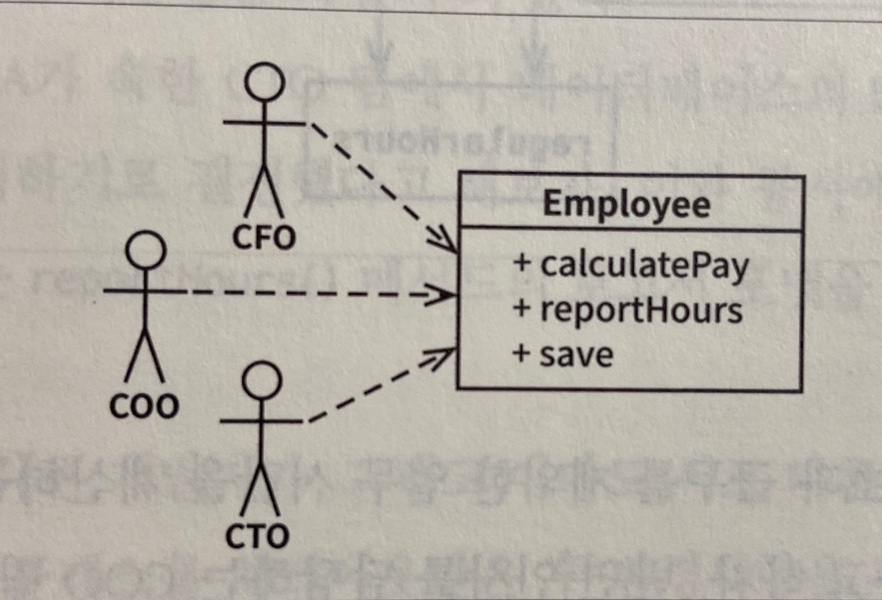
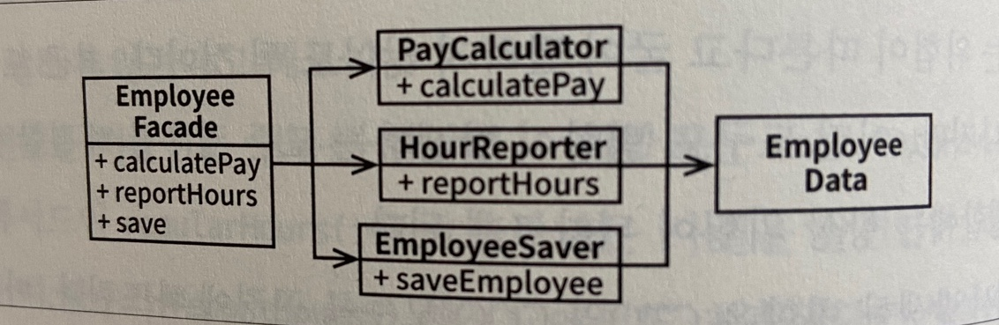
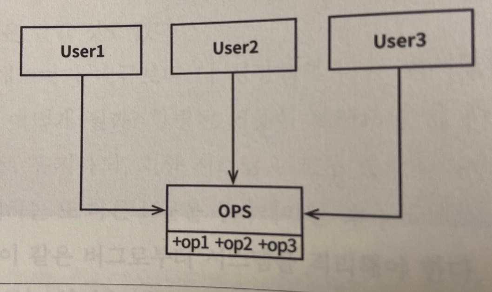
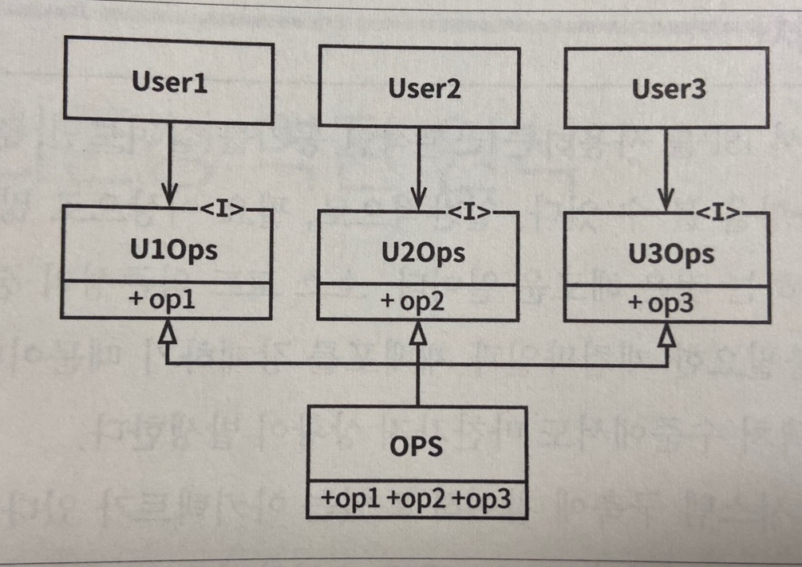
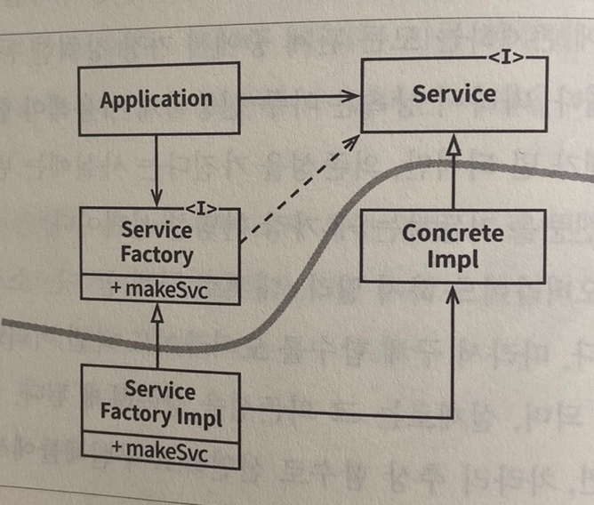
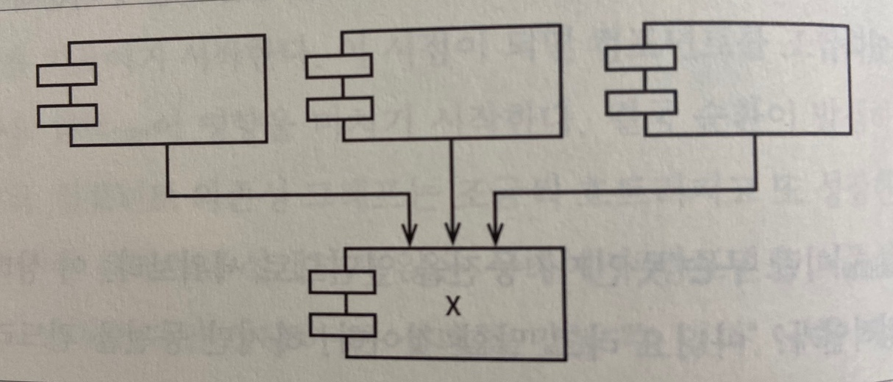

# Clean Architecture


# 1부 소개

- 동작하는 프로그램을 만들기 쉽지만 제대로, 올바르게 만들기는 어려움
- 제대로된 소프트웨어를 만들면 아주 적은 인력만으로도 새로운 기능을 추가하거나 유지보수를 추가할 수 있음. 변경은 단순해지고 빠르게 반영할 수 있음

## #1 설계와 아키텍처란?

- 설계와 아키텍처 둘 사이에는 아무런 차이가 없음.
- 소프트웨어 설계에서 저수준의 세부사항과 고수준의 구조는 모두 고스프트웨어 전체 설계 구성 요소임

### 목표는?

- 소프트웨어 아키텍처의 목표는 필요한 시스템을 만들고 유지보수하는 데 투입되는 인력을 최소화하는데 있음
- 새로운 기능을 출시할 때마다 비용이 증가한다면 나쁜 설계


### 사례 연구

- 인력은 늘어가지만 개발의 생산성은 점점 떨어지는 현상이 나타나는 A사의 이야기

**엉망진창이 되어가는 신호**

- 개발자의 노력은 기능 개발보다는 엉망이 된 상황에 대처하는 데 소모됨

**경영자의 시각**

- 생산성은 그대로인데 인건비는 지속적으로 늘어나서 얻는게 없어짐

**무엇이 잘못되었나?**

-  토끼가 자신의 빠르기를 과신한 것과 마찬가지로 개발자도 생산성을 유지할 수 있다고 자신의 능력을 과신함. 하지만 엉망진창인 코드가 서서히 쌓이면 개발자 생산성은 차츰낮아지고 절대 멈추거나 수그러들지 않음
- 엉망으로 만들면 깔끔하게 유지할 때보다 항상 더 느리다는게 팩트임
- 빨리가는 유일한 방법은 제대로 가는 것
- 생산성이 감소되고 비용이 증가하는 현상을 되돌릴 수 있는 유일한 방법은 개발자로 하여금 토끼처럼 과신하려는 믿음을 버리고, 만들어 낸 엉망진창인 코드를 개발자가 책임지도록 하는 것 뿐
- 자신을 과신한다면 재설계하더라도 원래의 프로젝트와 똑같이 엉망으로 내몰림


### 결론

- 개발조직이 할 수 있는 최고의 선택지는 과신하지 않고 소프트웨어 아키텍처의 품질을 심각하게 고민하기 시작하는 것
- 비용은 최소화하고 생산성은 최대화할 수 있는 설계와 아키텍처를 가진 시스템을 만들려면 이러한 결과로 이끌어줄 시스템 아키텍처가 지닌 속성을 알고 있어야함


## #2 두 가지 가치에 대한 이야기

- 모든 소프트웨어 시스템은 이해관계자에게 행위와 구조라는 두가지 가치를 제공함
- 개발자는 두 가치를 모두 반드시 높게 유지해야하는 책임을 짐

### 행위

- 이해관계자는 기계가 수익을 창출하거나 비용을 절약하도록 만들기 위해 프로그래머를 고용함
- 프로그래머는 기계가 요구사항을 만족하고 문제가 있으면 디버깅함 이것을 행위라부름
- 많은 프로그래머가 이러한 활동이 자신이 해야 할 일의 전부라고 생각하지만 잘못된 생각임

### 아키텍처

- 소프트웨어를 만든 이유는 기계의 행위를 쉽게 변경할 수 있도록 하기 위해서임
- 소프트웨어는 반드시 변경하기 쉬워야함
- 소프트웨어 개발 비용의 증가를 결정짓는 주된 요인은 바로 이 변경사항의 범위와 형태에 있음
- 변경하기 어려운 문제는 아키텍처, 아키텍처는 형태에 독립적이어야하고 그럴수록 더 실용적임

### 더 높은 가치

- 위에서 말한 행위(기능)과 아키텍처는 둘 다 중요함
- 극단적으로 놓고 봤을때 똑바로 동작하지만 변경이 불가능한 프로그램과 제대로 동작하지 않지만 변경하기 쉬운 프로그램 중 후자가 나을 수 있음

### 아이젠하워 매트릭스

| **중요하고 긴급한일**    | **중요하지만 긴급하지 않은일**    |
| ------------------------ | --------------------------------- |
| **중요하지 않고 긴급한** | **중요하지 않고 긴급하지 않은일** |

- 소프트웨어의 첫 번째 가치인 행위는 긴급하지만 매번 높은 중요도를 가지는 것은 아님
- 소프트웨어의 두 번째 가치인 아키텍처는 중요하지만 즉각적인 긴급성을 필요로 하는 경우는 절대 없음
- 우선순위
  - 긴급하고 중요한일 (아키텍처, 행위)
  - 긴급하지는 않지만 중요한 일 (아키텍처)
  - 긴급하지만 중요하지 않은 일 (행위)
  - 긴급하지도 않고 중요하지도 않은 일
- 업무 관리자와 개발자가 흔하게 저지르는 실수는 긴급하지만 중요하지 않은 기능과 긴급하면서 중요한 기능을 구분하지 못함
- 기능의 긴급성이 아닌 아키텍처의 중요성을 설득하는 일은 소프트웨어 개발팀이 마땅히 책임져야함


### 아키텍처를 위해 투쟁하라

- 개발팀은 회사에서 가장 중요하다고 스스로 믿는 가치를 위해 항상 투쟁해야함
- 소프트웨어를 안전하게 보호해야 할 책임이 있으므로 소프트웨어 개발팀들도 이해관계자임을 명심할것
- 소프트웨어 아키텍트는 시스템이 제공하는 특성이나 기능보다 시스템 구조에 더 중점을 둬서 기능 개발하기 쉽고 간편하게 수정이 가능하며 확장하기 쉬운 아키텍처를 만들어야함
- 아키텍처가 후순위가 되면 시스템을 개발하는 비용이 더 많이 들고 일부 또는 전체 시스템에 변경을 가하는 일이 현실적으로 불가능해짐. 이런 결과는 소프트웨어 개발팀의 투쟁이 충분하지 않았다는 결과


# 2부 벽돌부터 시작하기: 프로그래밍 패러다임

## #3 패러다임 개요

### 구조적 프로그래밍

- 구조적 프로그래밍은 다익스트라가 발견함
- 구조적 프로그래밍 패러다임은 아래와 같이 요약할 수 있음
  - **구조적 프로그래밍은 제어흐름의 직접적인 전환에 대해 규칙을 부과한다.**

### 객체지향 프로그래밍

- 요한 달과 크리스텐 니가드에 의해 등장
- 객체지향 프로그래밍 패러다임은 아래와 같이 요약할 수 있음
  - **객체 지향 프로그래밍은 제어흐름의 간접적인 전환에 대해 규칙을 부과한다.**

### 함수형 프로그래밍

- 알론조 처치가 람다 계산법을 발명했음
- 람다계산법
  - 기초가 되는 개념은 불변성으로, 심볼의 값이 변경되지 않는다는 개념
- 함수형 프로그래밍 패러다임은 아래와 같이 요약할 수 있음
  - **함수형 프로그래밍은 할당문에 대해 규칙을 부과한다.**

### 생각할 거리

- 각 패러다임은 프로그래머에게서 권한을 박탈함. 즉 패러다임은 무엇을 해야 할지를 말하기보다는 무엇을 해서는 안되는지를 말해줌

### 결론

- 세가지 패러다임은 모두 아키텍처와 연관이 있음
- 세 가지 패러다임과 아키텍처의 세가지 큰 관심사(함수, 컴포넌트 분리, 데이터 관리)가 어떻게 서로 연관되는지에 주목할 것


## #4 구조적 프로그래밍

### 증명

- 다익스트라, 뵘, 야코피니가 모든 프로그램은 goto 없이 순차, 분기, 반복이라는 세가지 구조만으로 표현할 수 있다는 사실을 증명했음

### 해로운 성명서

- 다익스트라가 "goto문의 해로움" 이라는 편지를 출판사에 보내고 10년동안 논쟁후 다익스트라가 승리함
- 그로인해 대다수의 현대적언어는 goto 문장을 포함하지 않음
- 현재의 우리는 모두 구조적프로그래머임. 제어흐름을 제약 없이 직접 전환할 수 있는 선택권 자체를 언어에서 제공하지 않음

### 기능적 분해

- 구조적 프로그래밍을 통해 모듈을 증명 가능한 더 작은 단위로 재귀적으로 분해할 수 있음
- 큰 문제들을 작은 문제들로 쪼개고 이렇게 분해한 기능들은 구조적 프로그래밍의 제한된 제어구조를 이용하여 표현할 수 있음
- 이런 기법을 사용하면 프로그래머는 대규모 시스템을 모듈과 컴포넌트로 나눌 수 있고 더 나아가 모듈과 컴포넌트는 입증할 수 있는 아주 작은 기능들로 세분화 할 수 있음

### 엄밀한 증명은 없었다

### 과학이 구출하다

- 수학은 증명 가능한 서술이 참임을 입증하는 원리이고 과학은 증명 가능한 서술이 거짓임을 입증하는 원리임

### 테스트

- "테스트는 버그가 있음을 보여줄 뿐, 버그가 없음을 보여줄 수는 없다" - 다익스트라
- 소프트웨어 구조는 수학적인 구조가 아닌 과학적 구조.
- 제약 없는 goto문은 테스트를 아무리 많이 수행하더라도 절대 올바르다고 볼 수 없음
- 구조적 프로그래밍은 프로그램을 증명 가능한 세부 기능 집합으로 재귀적으로 분해할 것을 강요하고 테스트를 통해 증명 가능한 세부 기능들이 거짓인지를 증명하려고 시도함. 만약 거짓임을 증명하려는 테스트가 실패한다면 이 기능들은 목표에 부합할만큼 충분히 참이라고 여기게됨

### 결론

- 구조적 프로그래밍이 오늘날까지 가치 있는 이유는 프로그래밍에서 반증 가능한 단위를 만들어낼 수 있기 때문임
- 소프트웨어 아키텍트는 모듈, 컴포넌트, 서비스가 테스트하기 쉽도록 만들기 위해 분주히 노력해야함


## #5 객체 지향 프로그래밍

- 좋은 아키텍처를 만드는 일은 객체지향 설계 원칙을 이해하고 응용하는데서 출발함

### 캡슐화?

- 캡슐화는 테이터와 함수가 응집력있게 구성된 집단을 서로 구분 짓는 선을 그을 수 있음
- C언어에서 완벽한 캡슐화를 지원했지만 시간이 지나면서 언어 자체에서 캡슐화를 거의 강제하지 않게되었음

### 상속?

- 상속이라는 개념이 있기 이전에도 상속과 비슷하게 사용하는 방법이 C++에 있었음

### 다형성?

- 기존에 함수를 가리키는 포인터를 응용한 것이 다형성임 하지만 함수 포인터를 사용하는 방식은 위험하고 지켜야할 관례가 많았음
- 객체지향 언어는 이러한 관례를 없애주고 실수할 위험이 없음

**다형성이 가진 힘**

- 프로그램은 장치에 독립적이어야함. 플러그인 아키텍처는 입출력 장치 독립성을 지원하기 위해 만들어졌고 등장 이후 거의 모든 운영체제에서 구현되었음

**의존성 역전**

- 다형성을 사용하지 않는다면 제어흐름은 시스템의 행위에 따라 결정되고 소스코드 의존성도 제어 흐름에 따라 결정됨
- 인터페이스를 사용하는 방식으로 의존성 역전을 구현할 수 있음
- 객체지향 언어로 개발된 시스템을 다루는 소프트웨어 아키텍트는 시스템의 소스코드 의존성 전부에 대해 방향을 결정할 수 있는 절대적인 권한을 가짐. 즉 소스 코드 의존성이 제어흐름의 방향과 일치되도록 제한되지 않음. 호출하는 모듈이든 아니면 호출 받는 모듈이든 관계 없이 소프트웨어 아키텍트는 소스코드 의존성을 원하는 방향으로 설정할 수 있음
- 배포 단위들의 의존성 역시 소스 코드 사이의 의존성과 동일하기 때문에 이들 컴포넌트는 개별적이며 독립적으로 배포가 가능해짐 특정 컴포넌트의 소스 코드가 변경되면 해당 코드가 포함된 컴포넌트만 다시 배포하면 됨. 이것이 바로 배포 독립성임
- 시스템의 모듈을 독립적으로 배포할 수 있게 되면 서로 다른 팀에서 각 모듈을 독립적으로 개발할 수 있음. 이것이 개발 독립성임


### 결론

- 객체지향 프로그래밍은 다형성을 이용하여 전체 시스템의 모든 소스 코드 의존성에 대한 절대적인 제어 권한을 획득할 수 있는 능력임
- 다형성을 사용하면 아키텍트는 플러그인 아키텍처를 구성할 수 있고 이를 통해 고수준의 정책을 포함하는 모듈은 저수준의 세부사항을 포함하는 모듈에 대해 독립성을 보장할 수 있음
- 저수준의 세부사항은 중요도가 낮은 플러그인 모듈로 만들 수 있고, 고수준의 정책을 포함하는 모듈과는 독립적으로 개발하고 배포할 수 있음


## #6 함수형 프로그래밍

- 함수형 패러다임에서 핵심이 되는 기반은 람다 계산법으로 알론조 처치가 1930년대에 발명했음

### 정수를 제곱하기

- 자바의 0부터 25까지 정수 제곱을 출력하는 프로그램

```java
public class Squint {
  public static void main(String args[]) {
    for (int i = 0; i < 25; i ++) {
      System.out.println(i * i);
    }
  }
}
```

- LISP에서 클로저를 이용하는 프로그램

```lisp
(println (take 25 (map (fn [x] (* x x)) (range))))
```

- 가장 안쪽부터 호출 함수 설명
  - range함수는 0부터 시작해서 끝이 없는 정수 리스트를 반환
  - 반환된 정수 리스트는 map 함수로 전달되고, 각 정수에 대해 제곱을 계산하는 익명 함수를 호출하여, 모든 정수의 제곱에 대해 끝이 없는 리스트를 생성
  - 제곱된 리스트는 take 함수로 전달되고, 이 함수는 앞의 25개까지의 항목으로 구성된 새로운 리스트를 반환
  - println함수는 입력 값을 출력하는데 이 경우 입력은 앞의 25개의 정수에 대한 제곱 값으로 구성된 리스트
- 끝이 없는 리스트라고 표현했지만 실제로 접근하기 전까 는 생성하지 않음


- 자바에서는 가변 변수를 사용하지만 클로저 프로그램에서는 불변 변수만 사용함
- 함수형 언어에서 변수는 변경되지 않음

### 불변성과 아키텍처

- race condition, deadlock, concurrent update 문제는 모두 가변 변수로 인해 발생함
- 만약 어떠한 변수도 갱신되지 않는다면 race condition, concurrent update 은 일어나지 않고 lock도 가변이 아니라면 deadlock이 일어나지 않음
- 다수의 스레드와 프로세스를 사용하는 애플리케이션에서 마주치는 모든 문제는 가변변수가 없다면 절대로 생기지 않음
- 아키텍트라면 동시성 문제에 지대한 관심을 가져야만 함
- 불변성은 저장 공간이 무한하고 프로세서의 속도가 무한히 빠를때 실현 가능함. 만약 아니라면 어느정도 타협을해서 불변성을 실현할 수 있음

### 가변성의 분리

- 불변성과 관련해서 가장 주요한 타협중 하나는 서비스 내부의 가변 컴포넌트와 불변 컴포넌트로 분리하는 일임
- 불변 컴포넌트는 가변 변수를 사용하지 않고 1개 이상의 다른 컴포넌트와 서로 통신함
- 상태변경은 컴포넌트를 갖가지 동시성 문제에 노출하는 꼴이므로 흔히 트랜잭션 메모리와 같은 실천법을 사용하여 동시 업데이트와 경합 조건 문제로부터 가변 변수를 보호함

> 트랜잭션 메모리
>
> **트랜잭셔널 메모리**(transactional memory)는 불러오기와 저장하기 명령의 집합이 [원자적](https://ko.wikipedia.org/wiki/원자성) 방법으로 실행할 수 있게 함으로써 [병행성 프로그래밍](https://ko.wikipedia.org/wiki/병행성_프로그래밍)을 단순하게 하는 방식이다. [병행 컴퓨팅](https://ko.wikipedia.org/wiki/병행_컴퓨팅)에서 [공유 메모리](https://ko.wikipedia.org/wiki/공유_메모리)로의 접근을 제어하기 위한 병행성 제어 방식으로, [데이터베이스 트랜잭션](https://ko.wikipedia.org/wiki/데이터베이스_트랜잭션)과 유사한 [동시성 제어](https://ko.wikipedia.org/w/index.php?title=동시성_제어&action=edit&redlink=1) 구조이다.
>
> [https://ko.wikipedia.org/wiki/%ED%8A%B8%EB%9E%9C%EC%9E%AD%EC%85%94%EB%84%90_%EB%A9%94%EB%AA%A8%EB%A6%AC](https://ko.wikipedia.org/wiki/%ED%8A%B8%EB%9E%9C%EC%9E%AD%EC%85%94%EB%84%90_%EB%A9%94%EB%AA%A8%EB%A6%AC)
>
> 예제
>
> ```
> // 이중 연결 리스트에 새 노드를 원자적으로 추가함
> atomic {
>     newNode->prev = node;
>     newNode->next = node->next;
>     node->next->prev = newNode;
>     node->next = newNode;
> }
> ```
>
> **atomic**(원자적)으로 표시된 구역이 끝나면 트랜잭션이 완료된다. 이때 충돌이 없었다면 커밋되고, 있었다면 재시작될것이다. 임계 구역 문법은 또한 종료 조건을 명시할 수도 있다.
>
> [https://ko.wikipedia.org/wiki/%EC%86%8C%ED%94%84%ED%8A%B8%EC%9B%A8%EC%96%B4_%ED%8A%B8%EB%9E%9C%EC%9E%AD%EC%85%94%EB%84%90_%EB%A9%94%EB%AA%A8%EB%A6%AC](https://ko.wikipedia.org/wiki/%EC%86%8C%ED%94%84%ED%8A%B8%EC%9B%A8%EC%96%B4_%ED%8A%B8%EB%9E%9C%EC%9E%AD%EC%85%94%EB%84%90_%EB%A9%94%EB%AA%A8%EB%A6%AC)

- 불변, 가변 컴포넌트를 분리하고 가변 변수들을 보호하는 적절한 수단을 동원해 뒷받침해야함
- 현명한 아키텍트라면 가능한 한 많은 처리를 불변 컴포넌트로 옮겨야 하고 가변 컴포넌트에서는 가능한 한 많은 코드를 빼내야함


### 이벤트 소싱

- 이벤트 소싱에 깔려 있는 기본 발상은 상태가 아닌 트랜잭션을 저장하자는 전략임. 상태가 필요해지면 단순히 상태의 시작점부터 모든 트랜잭션을 처리하면됨
  - 고객 잔고를 관리하는 은행 애플리케이션의 경우 상태가아닌 계좌의 모든 트랜잭션을 저장(write)하고 특정 고객이 잔고를 요청할때마다 저장한 트랜잭션을 모두 처리(read)하면 해당 고객의 잔고를 알 수 있음. but 무한한 저장공간과 무한한 처리능력이 있어야하기 때문에 이런 방식은 불가능함
- 결과적으로 애플리케이션은 CRUD가 아니라 C or R로만 이루어짐 변경과 삭제가 없다면 동시성 문제가 일어나지 않음

> **git commit**
>
> git의 commit은 불변임 --amend나 rebase로 커밋을 수정하거나 합치는것처럼 보일 수 있지만 git reflog로 확인해보면 실제로 커밋을 수정하는 것이 아닌 새로운 commit을 만들어내는 것을 확인할 수 있음
>
> [https://wiki.emulab.net/wiki/everything-you-need-to-unlearn-about-git](https://wiki.emulab.net/wiki/everything-you-need-to-unlearn-about-git)
>
> [https://blog.jayway.com/2013/03/03/git-is-a-purely-functional-data-structure/](https://blog.jayway.com/2013/03/03/git-is-a-purely-functional-data-structure/)
>
> 
>
> **CQRS 와 스냅샷**
>
> - CQRS
>
> CQRS (Command and Query Responsibility Segregation), Command와 Query를 분리하는 방법
>
> - 스냅샷
>
> 이벤트가 100,000개가 있다고 가정했을때 1~100,000까지 매번 읽는 방법은 비효율적임. 따라서 1,000 단위로 스냅샷을 저장해서 결과값을 얻어오는데 필요한 이벤트의 조회수를 단축시킬 수 있음

### 결론

- 2부 요약
  - 구조적 프로그래밍은 제어흐름의 직접적인 전환에 부과되는 규율
  - 객체 지향 프로그래밍은 제어흐름의 간접적인 전환에 부과되는 규율
  - 함수형 프로그래밍은 변수 할당에 부과되는 규율
- 각 패러다임은 코드를 작성하는 방식의 형태를 한정시킴
- 지난 반 세기동안 우리가 배운것은 해서는 안되는 것에 대해서임.
- 소프트웨어는 순차, 분기, 반복, 참조로만 구성됨


# 3부 설계 원칙

- 좋은 소프트웨어 시스템은 깔끔한 코드로부터 시작함
- SOLID원칙은 함수와 데이터 구조를 클래스로 배치하는 방법, 이들 클래스를 서로 결합하는 방법을 설명해줌
- SOLID 원칙의 목적
  - 변경에 유연함
  - 이해하기 쉬움
  - 많은 소프트웨어 시스템에 사용될 수 있는 컴포넌트의 기반이 됨

## #7 SRP: 단일 책임 원칙

- 함수는 반드시 단 하나의 일만 해야한다는 원칙
- 단일 모듈은 변경의 이유가 단 하나뿐이어야함
  - 하나의 모듈은 하나의 액터(한명 이상의 이해관계자)에 대해서만 책임져야함
- 응집성은 단일 액터를 책임지는 코드를 함께 묶어주는 힘

### 징후 1: 우발적 중복





- 세가지 메서드가 서로 매우 다른 세명의 액터를 책임지기 때문에 SRP를 위반함
- 서로 다른 액터가 의존하는 코드를 너무 가까이 배치해놓는다면 큰 문제가 생길 수 있음. SRP는 서로 다른 액터가 의존하는 코드를 분리해야함

### 징후 2: 병합

- 서로 다른 액터들에 대한 변경이 일어날 경우 코드 병합시에 문제가 될 수 있음
- 이 문제를 벗어나는 방법은 SRP를 적용하는 방법

### 해결책

- 데이터와 메서드를 분리하는 방식이 가장 확실한 해결책



- 그러나 이 방법은 개발자가 세 가지 클래스를 인스턴스화 하고 추적해야 한다는게 단점

- 위 단점을 극복하기 위해 흔히 쓰는 기법으로 퍼사드 패턴이 있음
- EmployeeFacade 클래스는 세 클래스의 객체를 생성하고 요청된 메서드를 가지는 객체로 위임하는 일을 책임짐
- 아래와 같이 가장 중요한 메서드는 Employee 클래스에 유지하고 Employee 클래스를 덜 중요한 나머지 메서드들에 대한 퍼사드로 사용하는 방법도 있음


- 위 방법이 SRP를 위반하는 것처럼 보일 수 있지만 여러 메서드가 하나의 가족을 이루고, 메서드의 가족을 포함하는 각 클래스는 하나의 유효범위가됨. 해당 유효범위 바깥에서는 이 가족에게 감춰진 식구(private 멤버)가 있는지를 전혀 알 수 없음

### 결론

- 단일 책임 원칙은 메서드와 클래스 수준의 원칙
- 상위 두 수준에서도 다른 형태로 다시 등장함
  - 컴포넌트 수준: 공통 폐쇄 원칙이 됨
  - 아키텍처 수준: 아키텍처 경계의 생성을 책임지는 변경의 축이됨


## #8 OCP: 개방-폐쇄 원칙

- 소프트웨어 개체는 확장에는 열려있어야 하고, 변경에는 닫혀 있어야 함
- 만약 요구사항을 살짝 확장하는 데 소프트웨어를 엄청나게 수정해야 한다면 그 소프트웨어를 설계한 아키텍트는 엄청난 실패를 한 것

### 사고 실험

- 소프트웨어 아키텍처가 훌륭하다면 요구사항에 따른 변경사항이 가능한한 최소화될 것임
- 서로 다른 목적으로 변경되는 요소를 적절하게 분리하고, 이들 요소 사이의 의존성을 체계화함으로써 변경량을 최소화할 수 있음
- 가장 중요한것은 책임을 분리하는 것.
- 책임을 분리했다면 두 책임중 하나에서 변경이 발생하더라도 다른 하나는 변경되지 않도록 소스 코드 의존성도 확실히 조직화 해야함


- 화살표가 A클래스에서 B클래스로 향한다면 A클래스에서는 B 클래스를 호출하지만 B클래스에서는 A클래스를 전혀 호출하지 않음 (전혀 모름)
- 모든 컴포넌트 관계는 단방향으로 이루어짐 이들 화살표는 변경으로부터 보호하려는 컴포넌트를 향하도록 그려짐
- A컴포넌트에서 발생한 변경으로부터 B컴포넌트를 보호하려면 반드시 A컴포넌트가 B컴포넌트에 의존해야함
- 위 사진의 경우 Presenter에서 발생한 변경으로부터 Controller를 보호하고 View에서 발생한 변경으로부터 Presenter를 보호하고자 함
- 업무규칙이 들어있는 Interactor는 가장 높은 수준의 보호를 받음 
- 아키텍트는 기능이 어떻게, 왜, 언제 발생하는지에 따라서 기능을 분리하고 분리한 기능을 컴포넌트의 계층구조로 조직화함.
- 컴포넌트 계층구조를 이와 같이 조직화하면 저수준에서 발생한 변경으로부터 고수준 컴포넌트를 보호할 수 있음

### 방향성 제어

- FinancialDataGateway 인터페이스는 FinancialReportGenerator와 FinancialDataMapper 사이에 위치하는데 이는 의존성을 역전시키기 위해서임 만약 FinancialDataGateway가 없었다면 의존성이 Interactor컴포넌트에서 Database 컴포넌트로 바로 향하게 됨

### 정보 은닉

- FinancialReportRequester는 방향성 제어와는 다른 목적으로 FinancialReportController가 Interactor 내부에 대해 너무 많이 알지 못하도록 막기 위해서 존재함
- FinancialReportRequester가 없었다면 Controller는 FinancialEntities에 대해 추이 종속성을 갖게 됨

> 추이종속성
>
> - 클래스 A가 클래스 B에 의존하고 클래스 B가 클래스 C에 의존한다면 클래스 A는 C에 의존하게됨. 이를 추이 종속성이라고 부르고 클래스, 패키지, 컴포넌트 모든곳에도 동일하게 적용됨. 클래스 의존성이 순환적이라면 모든 클래스가 서로 의존하게 되는 문제가 있음

- 추이 종속성을 갖게되면 소프트웨어 엔티티는 '자신이 직접 사용하지 않는 요소에는 절대로 의존해서는 안된다'는 소프트웨어 원칙을 위반하게됨
- Controller영역에서 발생한 변경으로부터 Interactor를 보호하는 일의 우선순위가 가장 높지만 반대로 Interactor에서 발생한 변경으로부터 Controller도 보호되기를 바람.

### 결론

- OCP는 시스템의 아키텍처를 떠받치는 원동력 중 하나
- OCP의 목표는 시스템을 확장하기 쉬운 동시에 변경으로 인해 시스템이 너무 많은 영향을 받지 않도록 하는 데 있음.
- 이러한 목표를 달성하려면 시스템을 컴포넌트 단위로 분리하고, 저수준 컴포넌트에서 발생한 변경으로부터 고수준 컴포넌트를 보호할 수 있는 형태의 의존성 계층구조가 만들어지도록 해야 함


## #9 LSP: 리스코프 치환 원칙

- S타입의 객체 o1에 각각 대응하는 T타입 객체 o2가 있고 T 타입을 이용해서 정의한 모든 프로그램 P에서 o2의 자리에 o1을 치환하더라도 P의 행위가 변하지 않는다면 S는 T의 하위 타입이다. - 바바라 리스코프

###  상속을 사용하도록 가이드하기


- Billing 애플리케이션의 행위가 License 하위 타입 중 무엇을 사용하는지에 전혀 의존하지 않음

### 정사각형/직사각형 문제


- LSP를 위반하는 전형적인 문제
- Rectangle의 높이와 너비는 서로 독립적으로 변경될 수 있는 반면에 Square의 높이와 너비는 반드시 함께 변경되기 때문임
- 실제로 사용하는 User는 Rectangle로 생각하기 때문에 혼동
- 사용하는 User가 Rectangle인지 Square인지 검사하는 방법은 User가 타입에 의존하는것이기 때문에 치환이 불가능하게됨

### LSP와 아키텍처

### LSP위배 사례

### 결론

- LSP는 아키텍처 수준까지 확장할 수 있고 반드시 확장해야함.
- 치환 가능성을 조금이라도 위배하면 시스템 아키텍처가 오염되어 상당량의 별도 메커니즘을 추가해야 할 수 있기 때문임


## #10 ISP: 인터페이스 분리 원칙




- 다수의 사용자가 OPS 클래스의 오퍼레이션을 사용하는데 User1은 op1, User2는 op2, User3은 op3만을 사용한다고 가정
- OPS가 정적 타입언어인 경우 User1에서는 op2와 op3를 전혀 사용하지 않음에도 소스코드는 두 메서드에 의존함
- 이런 경우 ISP를 사용해서 해결 가능



- User1은 U1Ops에 의존하지만 OPS는 직접적으로 의존하지 않음

### ISP와 언어

- ISP는 언어 종류에 따라 영향받는 정도가 큼
- 동적 타입 언어를 사용하면 정적 타입 언어를 사용할 때보다 유연하며 결합도가 낮은 시스템을 만들 수 있음

### ISP와 아키텍처

- 일반적으로 필요 이상으로 많은 걸 포함하는 모듈에 의존하는 것은 해로운 일임
- 아키텍처 수준에서도 마찬가지

### 결론

- 불필요한 짐을 실은 무언가에 의존하면 예상치도 못한 문제에 빠질 수 있음


## #11 DIP: 의존성 역전 원칙

- 의존성 역전 원칙에서 말하는 '유연성이 극대화'된 시스템이란 소스코드 의존성이 추상에 의존하며 구체에는 의존하지 않는 시스템임
- 우리가 의존하지 않도록 피하고자 하는 것은 바로 변동성이 큰 구체적인 요소임
- 자바에서 String은 구체 클래스이지만 매우 안정적이고 String클래스가 변경될 일은 거의 없음
- 변동성이 큰 구체적인 요소는 우리가 열심히 개발하는 중에 자주 변경될 수 밖에 없는 모듈들임

### 안정된 추상화 

- 인터페이스를 구현하는 구현체가 변경되더라도 인터페이스는 거의 변경될 필요가 없음 따라서 인터페이스는 구현체보다 변동성이 낮음
- 안정된 소프트웨어 아키텍처란 변동성이 큰 구현체에 의존하는 일을 지양하고, 안정된 추상 인터페이스를 선호하는 아키텍처라는 뜻
- 구체적인 코딩 실천법
  - 변동성이 큰 구체 클래스를 참조하지 말라
    - 대신 추상 인터페이스를 참조할 것.
  - 변동성이 큰 구체 클래스로부터 파생하지 말라
    - 정적 타입 언어에서 상속은 소스코드에 존재하는 모든 관계 중에서 가장강력하고 뻣뻣함. 따라서 상속은 아주 신중하게 사용해야 함
  - 구체 함수를 오버라이드 하지 말라
    - 구체 함수는 소스코드 의존성을 필요로하고 구체 함수를 오버라이드하면 실제로 그 의존성을 상속하게됨 차라리 추상 함수로 선언하고 구현체들에서 각자의 용도에 맞게 구현해야함
  - 구체적이며 변동성이 크다면 절대로 그 이름을 언급하지 말라


### 팩토리

- 자바 등 대다수의 객체지향 언어에서는 의존성을 처리할 때 추상 팩토리를 사용곤 함



- Application은 Service인터페이스를 통해 ConcreteImpl을 사용하지만, Application은 어떤식으로든 ConcreteImpl을 생성해야 할 때
- Application을 ServiceFactory에 의존하도록 만들어서 Application에 ConcreteImpl의 존재를 숨길 수 있음
- 실제 Service의 구현체를 만들어주는것은 ServiceFactoryImpl
- 곡선은 시스템을 두가지 컴포넌트로 분리함
  - 추상 컴포넌트: 애플리케이션의 모든 고수준 업무 규칙을 포함
  - 구체 컴포넌트: 업무 규칙을 다루기 위해 필요한 모든 세부사항을 포함
- 소스코드 의존성은 제어흐름과는 반대 방향으로 역전됨. 이러한 이유로 이 원칙을 의존성 역전이라고 부름


### 구체 컴포넌트

- 구체컴포넌트의 의존성을 완전히 없앨 수는 없음 하지만 DIP를 위반하는 클래스들은 적은 수의 구체 컴포넌트 내부로 모을 수 있고 이를 통해 시스템의 나머지 부분과는 분리할 수 있음

### 결론


# 4부 컴포넌트 원칙

- "SOLID원칙이 벽과 방에 벽돌을 ㅂ3ㅐ치하는 방법을 알려준다면, 컴포넌트 원칙은 빌딩에 방을 배치하는 방법을 설명해준다. 큰 빌딩과 마찬가지로 대규모 소프트웨어 시스템은 작은 컴포넌트들로 만들어진다."

## #12 컴포넌트

- 컴포넌트는 시스템의 구성 요소로 배포할 수 있는 가장 작은 단위. ex Java의 jar파일
- 여러 컴포넌트를 서로 묶어서 .war, .jar, .dll, .exe파일로 만들어서 독립적으로 배포할 수 있음
- 컴포넌트가 어떤 형태로 배포되든, 잘 설계된 컴포넌트라면 반드시 독립적으로 배포 가능한, 따라서 독립적으로 개발 가능한 능력을 갖춰야함

### 컴포넌트의 간략한 역사

### 재배치성

### 링커

- '컴포넌트의 간략한 역사', '재배치성', '링커' 장은 링커, 로더가 등장한 배경, 역사에 대해 설명함 이후에 무어의 법칙에 의거한 하드웨어의 큰 발전으로 현대에 다수의 .jar 파일 또는 다수의 공유 라이브러리를 순식간에 서로 링크시킬 수 있게 되었음
- 이렇게 컴포넌트 플러그인 아키텍처가 탄생함

### 결론


## #13 컴포넌트 응집도

### REP: 재사용/릴리스 등가 원칙

- Reuse/Release Equivalence Principle
- 재사용 단위는 릴리즈 단위와 같다
- 하나의 컴포넌트로 묶인 클래스와 모듈은 반드시 함께 릴리즈할 수 있어야함

### CCP: 공통 폐쇄 원칙

- Comon Closure Principle
- 동일한 이유로 동일한 시점에 변경되는 클래스를 같은 컴포넌트로 묶고 서로 다른 시점에 다른 이유로 변경되는 클래스는 다른 컴포넌트로 묶을 것
- 대부분의 애플리케이션은 유지보수성은 재사용성보다 훨씬 중요하기 때문에 변경이 있다면 단일 컴포넌트에서만 발생하게 하는 것이 나음
- CCP는 같은 이유로 변경될 가능성이 있는 클래스는 모두 한곳으로 묶을것을 권함
- 물리적 또는 개념적으로 강하게 결합되어 항상 함께 변경되는 클래스들은 하나의 컴포넌트에 속하게 해야 릴리즈, 재검증, 배포하는 일과 관련된 작업량을 최소화할 수 있음

**SRP와의 유사성**

- CCP는 컴포넌트 수준의 SRP임
- 두 원칙의 공통점
  - 동일한 시점에 동일한 변경되는 것들을 한데 묶고. 서로 다른 시점에 다른 이유로 변경되는 것들은 서로 분리할 것

### CRP: 공통 재사용 원칙

- Common Reuse Principle
- 컴포넌트 사용자들을 필요하지 않는 것에 의존하게 강요하지 말것
- 같이 재사용되는 경향이 있는 클래스와 모듈들은 같은 컴포넌트에 포함해야 함
- 의존하는 컴포넌트가 있다면 해당 컴포넌트의 모든 클래스에 대해 의존함을 확실히 인지해야함

**ISP와의 관계**

- 두 원칙의 공통점
  - 필요하지 않은 것에 의존하지 말 것

### 컴포넌트 응집도에 대한 균형 다이어그램

- 다이어그램의 각 변은 반대쪽 곡지점에 있는 원칙을 포기했을 때 감수해야할 비용을 나타냄


### 결론

- 어느 클래스들을 묶어서 컴포넌트로 만들지를 결정할 때, 재사용성과 개발 가능성이라는 상충하는 힘을 반드시 고려해야함.
- 재사용성과 개발 가능성의 균형을 잡는 일은 중요하고 항상 유동적임


## #14 컴포넌트 결합

### ADP: 의존성 비순환 원칙(Acyclic Dependencies Principle)

- 컴포넌트 의존성 그래프에 순환이 있어서는 안된다
- 많은 개발자가 동일한 소스 파일을 수정하는 환경의 해결책은 주단위 빌드와 의존성 비순환 원칙임

**주 단위 빌드(Weekly Build)**

- 중간 규모의 프로젝트에서 흔하게 사용
- 개발자가 코드를 복사해서 개인적으로 작업후 한번에 코드를 모두 통합하여 빌드하는 방법
- 개발보다 통합의 시간이 더 길어지고 빌드 일정만 늘어남 => 안좋음


**순환 의존성 제거하기**

- 개발 환경을 릴리즈 가능한 컴포넌트 단위로 분리하는 것
- 컴포넌트는 개별 개발자 또는 단일 개발팀이 책임질 수 있는 작업 단위가 됨
- 개발자가 해당 컴포넌트가 동작하도록 만든 후 해당 컴포넌트를 릴리즈하여 다른 개발자가 사용할 수 있도록 만들어줌
- 컴포넌트를 개발하는 팀은 특정 컴포넌트가 새롭게 릴리즈 되면 다른 팀에 즉각 영향을 주지 않고 컴포넌트를 사용하는 팀은 버저닝되는 컴포넌트의 특정 컴포넌트 버전을 직접 결정할 수 있음
- 이 방법을 사용하려면 의존성 구조를 반드시 관리해야함. 의존성 구조에 순환이 있어서는 안됨


- 위 사진에서 어느 컴포넌트에서 시작하더라도 의존성 관계를 따라가면서 최초의 컴포넌트로 되돌아갈 수 없음. 비순환 방향 그래프(Directed Acyclic Graph, DAG)임
- Main의 존재를 아무도 모르기때문에 Main의 변경사항이 아무 컴포넌트에게 영향을 미치지 않음
- Presenters 컴포넌트는 Interactors와 Entities만 이용해서 Presenter 자체 버전을 빌드하면 됨
- 시스템 전체를 릴리즈해야한다면 릴리즈 절차는 상향식으로 진행됨. 구성 요소간 의존성을 파악하고 있으면 쉽게 빌드할 수 있음 

**순환이 컴포넌트 의존성 그래프에 미치는 영향**

- 아래 사진처럼 Entities에 포함된 클래스가 Authorizer에 포함된 클래스 하나를 사용하도록 변경할 수 밖에 없다고 가정


- 순환 의존성이 발생됨
- 이런 순환 문제가 생긴다면 Entities, Authorizer, Interactors는 사실상 거대한 하나의 컴포넌트가 되어버리고 빌드하기도 힘들어짐
- 모든 원인은 순환 의존성


**순환 끊기**

- 의존성 역전 원칙 적용하기


- Entities와 Authorizer가 모두 의존하는 새로운 컴포넌트를 만든 후 두 컴포넌트가 모두 의존하는 클래스들을 새로운 컴포넌트로 이동시킨다


**흐트러짐(Jitters)**

- 요구사항이 변경되면 컴포넌트 구조도 변경될 수 있음
- 애플리케이션이 성장함에 따라 의존성 구조가 바뀌기때문에 항상 의존성 구조에 순환이 발생하는지 관찰해야하고 의존성이 있다면 끊어야함


### 하향식(top-down) 설계

- 컴포넌트 구조는 하향식으로 설계될 수 없음
- 컴포넌트는 시스템에서 가장 먼저 설계할 수 있는 대상이 아니고 시스템이 성장하고 변경될때 함께 진화함
- 아무런 클래스도 설계하지 않은 상황에서 컴포넌트 의존성 구조를 설계하는 것은 쉬운일이 아님. 컴포넌트 의존성 구조는 시스템의 논리적 설계에 발 맞춰 성장하며 또 진화해야함

### SDP: 안정된 의존성 원칙(Stable Dependencies Principle)

- 안전성의 방향으로 의존하라
- 설계는 결코 정적일 수 없음. 설계를 유지하다 보면 변경은 불가피함
- 변경이 쉽지 않은 컴포넌트가 변동이 예상되는 컴포넌트에 의존하게 만들어서는 안됨
- SDP를 준서하면 변경하기 어려운 모듈이 변경하기 쉽게 만들어진 모듈에 의존하지 않도록 만들 수 있음

**안전성**

- 소프트웨어 컴포넌트를 변경하기 어렵게 만드는 확실한 방법은 수 많은 다른 컴포넌트가 해당 컴포넌트를 의존하도록 만드는 것
- 아래 X 컴포넌트는 안정적. X를 의존하는 세 컴포넌트에 의해 책임성을 갖게 되고 X는 어디에도 의존하지 않으므로 X가 변경되도록 만들 수 있는 외적인 영향이 전혀 없음



- 아래 Y 컴포넌트는 불안정적. 어떤 컴포넌트도 Y에 의존성이 없기때문에 Y에는 책임성이 없고 변경요인이 발생할 수 있는 외부 요인이 세가지임


**안전성 지표**

- 컴포넌트로 들어오고 나가는 의존성 개수를 세어보는 방법
  - Fan-in: 안으로 들어오는 의존성. 
  - Fan-out: 바깥으로 나가는 의존성
  - I(불안정성): I = Fan-out % (Fan-in + Fan-out)
    - 0~1사이의 값을 가짐
    - 0이면 최고로 안정된 컴포넌트
    - 1이면 최고로 불안정한 컴포넌트
- SDP에서 컴포넌트 I 지표는 그 컴포넌트가 의존하는 다른 컴포넌트들의 I보다 커야 한다고 말함. 따라서 의존성 방향이 갈수록 I 지표 값이 감소해야함

**모든 컴포넌트가 안정적이어야 하는 것은 아니다**

- 모든 컴포넌트가 최고로 안정적인 시스템이라면 변경이 불가능함
- 이상적인 컴포넌트 구조


- SDP를 위배하는 구조


- Stable이 변경 가능한 Flexible에게 의존하는 상황
- 의존성을 반드시 끊어야함
- DIP를 도입하면 문제를 해결할 수 있음


**추상 컴포넌트**

- 위 이미지에서 UServer는 추상 컴포넌트임
- 동적 타입 언어에서 의존성 구조는 훨씬 단순해서 의존성 역전을 위해 인터페이스를 선언하거나 상속받는 일이 필요하지 않지만 정적 타입언에서는 인터페이스를 사용하는 방식이 필요함
- 추상 컴포넌트는 상당히 안정적이라서 덜 안정적인 컴포넌트가 의존할 수 있는 이상적인 대상임

### SAP: 안정된 추상화 원칙

- 컴포넌트는 안정된 정도만큼만 추상되어야 한다

**고수준 정책을 어디에 위치시켜야 하는가?**

- 고수준 정책을 캡슐화하는 소프트웨어는 반드시 안정된 컴포넌트에 위치해야함
- 불안정한 컴포넌트는 반드시 변동성이 큰 소프트웨어, 즉 쉽고 빠르게 변경할 수 있는 소프트웨어만을 포함해야함
- 하지만 고수준 정책을 안정된 컴포넌트에 위치시키면 그 정책을 포함하는 소스코드는 수정하기가 어려워지고 시스템 전체 아키텍처가 유연성을 잃음
- 컴포넌트가 최고로 안정된 상태이면서도 동시에 변경에 충분히 대응할 수 있는 방법은 OCP에 있음 
- OCP는 클래스를 수정하지 않고도 확장이 가능하도록 유연하게 만들 수 있음

**안정된 추상화 원칙**

- 안정된 추상화 원칙은 안정성과 추상화 정도 사이의 관계를 정의함
- 안정적인 컴포넌트라면 인터페이스와 추상클래스로 구성되어 쉽게 확장할 수 있어야하고 불안정한 컴포넌트인 경우 구체 컴포넌트이어야 함
- 안정된 컴포넌트가 확장이 가능해지면 유연성을 얻게 되고 아키텍처를 과도하게 제약하지 않음

**추상화 정도 측정하기**

- Nc: 컴포넌트 클래스의 개수
- Na: 컴포넌트의 추상 클래스와 인터페이스 개수
- A: 추상화 정도 A = Na / Nc
- A는 0과 1사이의 값을 가짐. 0이면 컴포넌트에 추상 클래스가 하나도 없다는 뜻이고 1이면 컴포넌트에 오로지 추상 클래스만 있다는 뜻임

**주계열**

- 모는 컴포넌트가 (0, 1) 또는 (1, 0)에 위치해야 한다는 규칙을 강요할 수는 없음
- 이 궤적은 컴포넌트가 절대로 위치해서는 안되는 영역, 배제할 구역을 찾는 방식으로 추론할 수 있음


`고통의 구역`

- (0, 0) 주변 구역에 위치한 컴포넌트
- 추상적이지 않아 확장할 수 없고 너무 안정적이여서 변경하기 어려움

`쓸모없는 구역`

- (1, 1) 주변 구역에 위치한 컴포넌트
- 여기에 위치한 컴포넌트는 최고로 추상적이지만 그 누구도 컴포넌트에 의존하지 않음

**배제 구역 벗어나기**

- 변동성이 큰 컴포넌트 대부분은 두 배제 구역으로부터 가능한 멀리 떨어트려야함. 
- 컴포넌트가 위치할 수 있는 가장 바람직한 지점은 주계열((1, 0) 과 (0, 1)을 잇는 선분)임
- 주계열에 위치한 컴포넌트는 자신의 안정성에 비해 너무 추상적이지도 않고 추상화 정도에 비해 너무 불안정 하지도 않음
- 컴포넌트가 위치할 수 있는 가장 바람직한 지점은 주 계열의 두 종점


**주계열과의 거리**

- 이상적인 상태로부터 컴포넌트가 얼마나 떨어져있는지 측정하는 지표
  - D: 거리. D = [A + I - 1] 
  - 이 지표의 유효범위는 0~1
  - D가 0이면 컴포넌트가 주계열 바로 위에 위치한다는 뜻
  - 1이면 주계열로부터 가장 멀리 위치한다는 뜻
  - 이 지표를 통해 컴포넌트가 주계열에 대체로 일치하도록 설계되었는지 분석 가능


### 결론

- 지표는 그저 임의로 결정된 표준을 기초로 한 측정값에 지나지 않음

# 5부 아키텍처

## #15 아키텍처란?

- 아키텍처는 발생하는 문제를 경험해보지 않는다면 다른 프로그래머를 지원하는 작업을 제대로 수행할 수 없기 때문에 소프트웨어 아키텍처는 코드와 동떨어지면 안됨
- 아키텍처의 주된 목적은 시스템의 생명 주기를 지원하는 것. 좋은 아키텍처는 시스템을 쉽게 이해하고, 쉽개 개발하며, 쉽개 유지보수하고, 쉽게 배포하게 해줌
- 아키텍처의 궁극적인 목표는 시스템의 수명과 관련된 비용은 최소화하고, 프로그래머의 생산성은 최대화하는 데 있음

### 개발

- 시스템 아키텍처는 개발팀이 시스템을 쉽게 개발할 수 있도록 뒷받침 해야만 함

### 배포

- 배포 비용이 높을수록 시스템의 유용성은 떨어짐
- 소프트웨어 아키텍처는 시스템을 단 한 번에 쉽게 배포할 수 있도록 만드는 데 그 목표를 두어야 함
- 아키텍트는 개발 초기부터 배포 전략을 고려해서 아키텍처를 구성해야 함

### 운영

- 아키텍처가 시스템 운영에 미치는 영향은 개바ㄹ, 배포, 유지보수에 미치는 영향보다는 덜 극적임


### 유지보수

### 선택사항 열어두기

### 장치 독립성

### 광고 우편

### 물리적 주소 할당

### 결론


## #16 독립성

### 유스케이스

### 운영

### 개발

### 배포

### 선택사항 열어놓기

### 계층 결합 분리

### 유스케이스 결합 분리

### 결합 분리 모드

### 개발 독립성

### 배포 독립성

### 중복

### 결합 분리 모드(다시)

### 결론


## #17 경계: 선 긋기

### 두 가지 슬픈 이야기

### FitNesse

### 어떻게 선을 그을까? 그리고 언제 그을까?

### 입력과 출력은?

### 플러그인 아키텍처

### 플러그인에 대한 논의

### 결론


## #18 경계 해부학

### 경계 횡단하기

### 두려운 단일체

### 배포형 컴포넌트

### 스레드

### 로컬 프로세스

### 서비스

### 결론


## #19 정책과 수준

### 수준

### 결론


## #20 업무 규칙

### 엔티티

### 유스케이스

### 요청 및 응답 모델

### 결론


## #21 소리치는 아키텍처

### 아키텍처의 테마

### 아키텍처의 목적

### 하지만 웹은?

### 프레임워크는 도구일 뿐, 삶의 방식은 아니다

### 테스트하기 쉬운 아키텍처

### 결론


## #22 클린 아키텍처

### 의존성 규칙

### 전형적인 시나리오

### 결론


## #23 프레젠터와 험블 객체

### 험블 객체 패턴

### 프레젠터와 뷰

### 테스트와 아키텍처

### 데이터베이스 게이트웨이

### 데이터 매퍼

### 서비스 리스너

### 결론


## #24 부분적 경계

### 마지막 단계를 건너뛰기

### 일차원 경계

### 퍼사드

### 결론


## #25 계층과 경계

### 옴퍼스 가냥 게임

### 클린 아키텍처?

### 흐름 횡단하기

### 흐름 분리하기

### 결론


## #26 메인(Main) 컴포넌트

### 궁극적인 세부사항

### 결론


## #27 '크고 작은 모든' 서비스들

### 서비스 아키텍처?

### 서비스의 이점?

### 야옹이 문제

### 객체가 구출하다

### 컴포넌트 기반 서비스

### 횡단 관심사

### 결론


## #28 테스트 경계

### 시스템 컴포넌트인 테스트

### 테스트를 고려한 설계

### 테스트 API

### 결론


## #29 클린 임베디드 아키텍처

### 앱-티튜드 테스트

### 타킷-하드웨어 병목 현상

### 결론


# 6부 세부사항

## #30 데이터베이스는 세부사항이다

### 관계형 데이터베이스

### 데이터베이스 시스템은 왜 이렇게 널리 사용되는가?

### 디스크가 없다면 어떻게 될까?

### 세부사항

### 하지만 성능은?

### 개인적인 일화

### 결론


## #31 웹은 세부사항이다

### 끝없이 반복하는 추

### 요약

### 결론


## #32 프레임워크는 세부사항이다

### 프레임워크 제작자

### 혼인 관계의 비대칭성

### 위험 요인

### 해결책

### 이제 선언합니다

### 결론


## #33 사례 연구: 비디오 판매

### 제품

### 유스케이스 분석

### 컴포넌트 아키텍처

### 의존성 관리

### 결론


## #34 빠져 있는 장

### 계층 기반 패키지

### 기능 기반 패키지

### 포트와 어댑터

### 컴포넌트 기반 패키지

### 구현 세부사항엔 항상 문제가 있다

### 조직화 vs 캡슐화

### 다른 결합 분리 모드

### 결론: 바져 있는 조언


