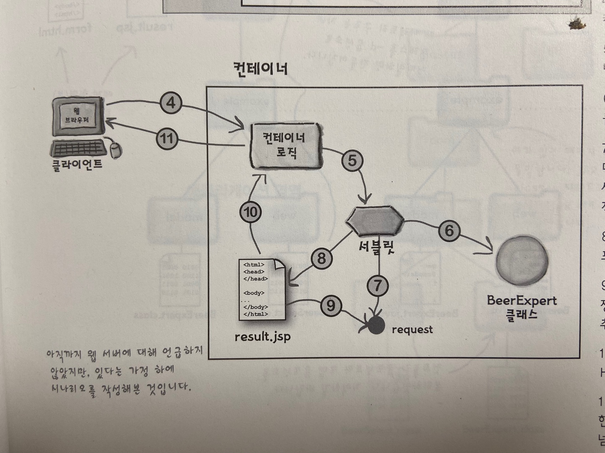
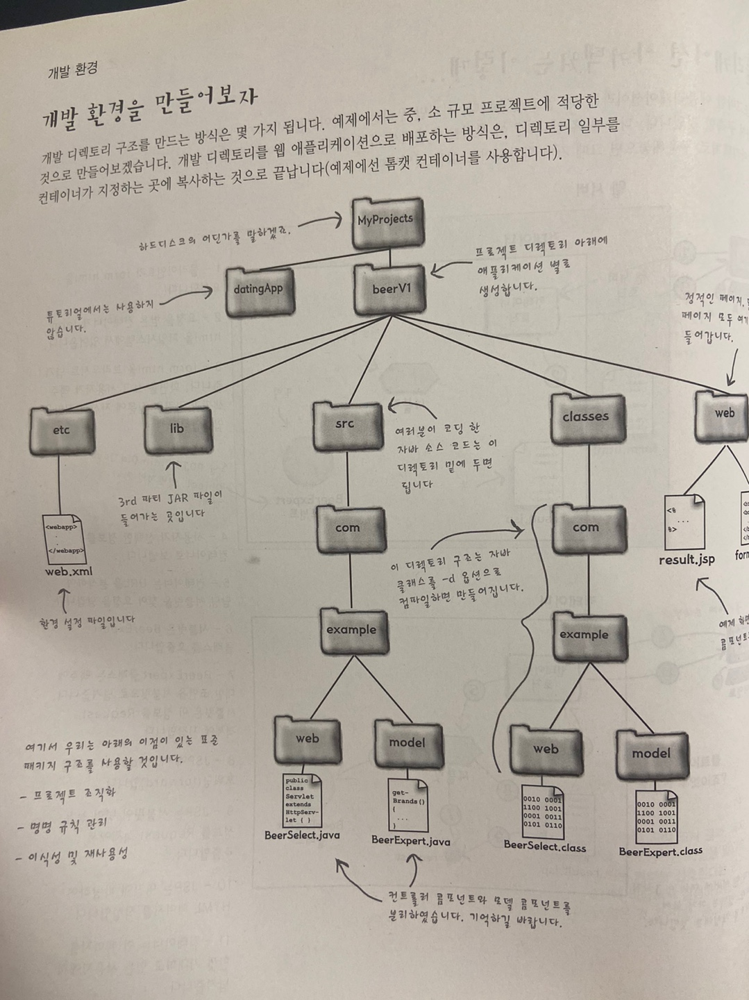
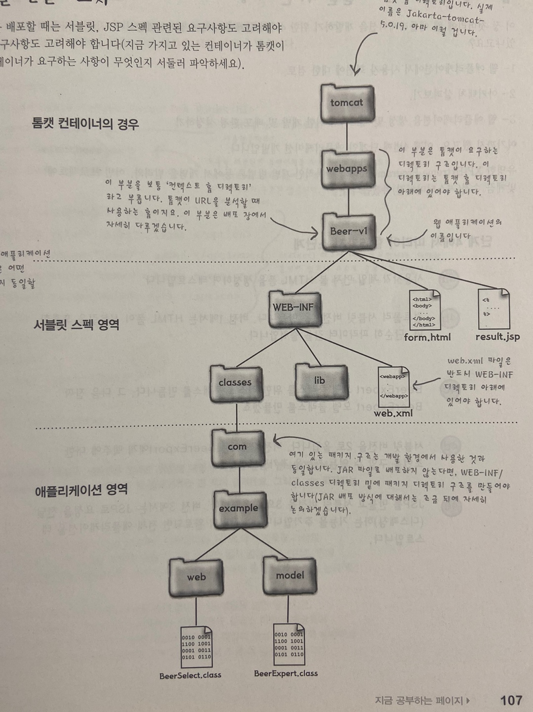
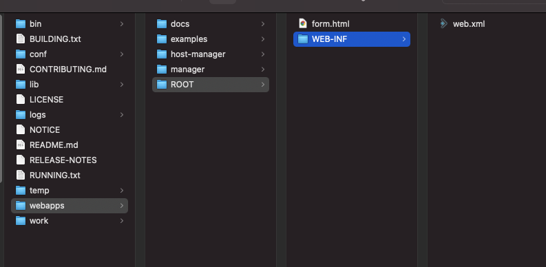
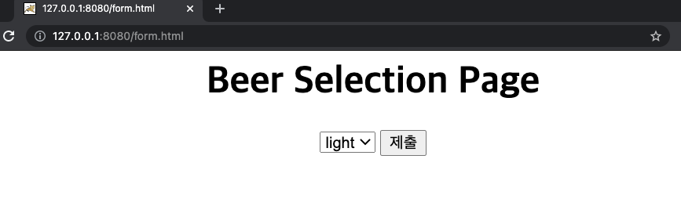
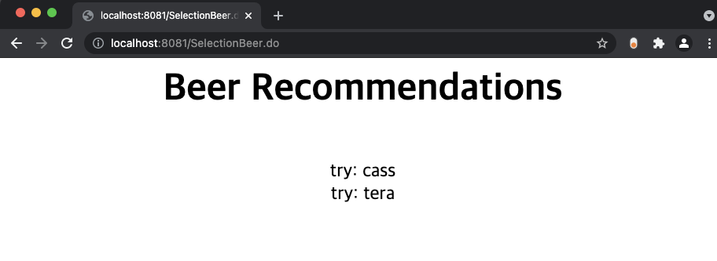
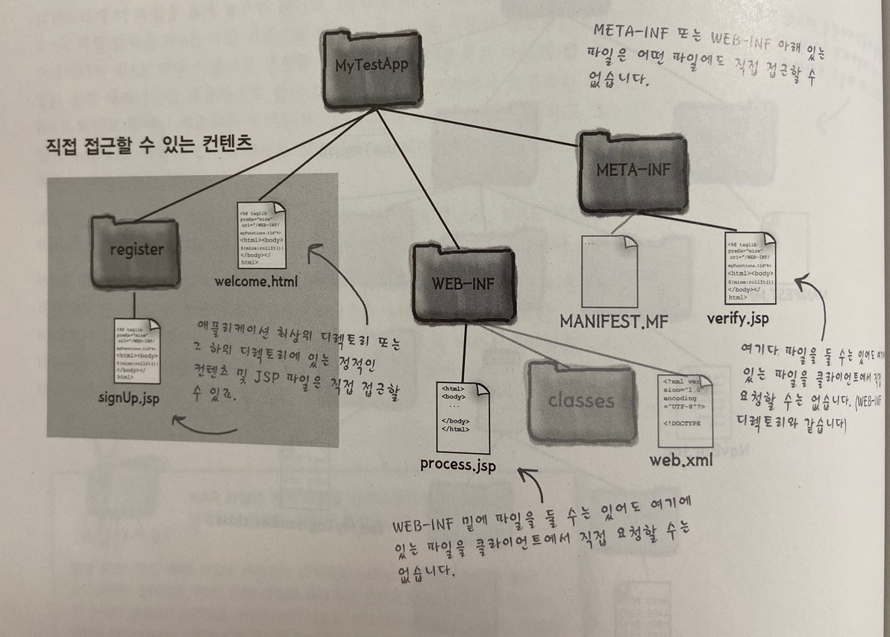
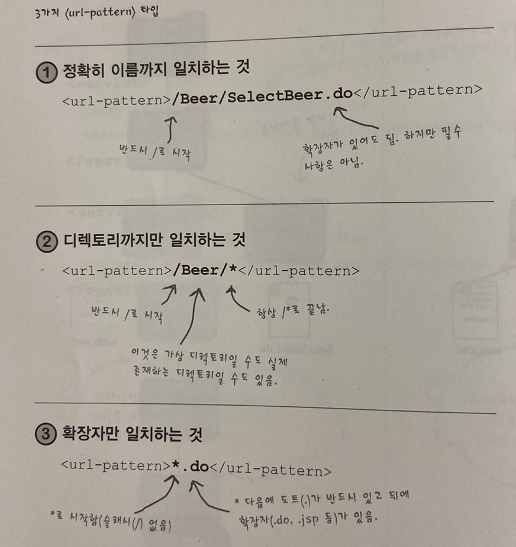

# #1 서블릿과 JSP는 어디에 쓰는 물건인고?


# #2 웹 애플리케이션 아키텍처


# #3 초간단 미니 MVC 튜토리얼

- 초간단 미니 mvc 튜토리얼 flow



1. 사용자가 선택한 정보를 컨테이너로 보냄
2. 컨테이너는 url을 분석하여 담당 서블릿을 찾아 요청을 넘김
3. 서블릿은 BeerExpert 클래스를 호출함
4. BeerExpert 클래스는 맥주에 대한 조언을 서블릿으로 넘겨줌, 서블릿은 이 정보를 Request객체에 저장함
5. JSP에 이 Request 객체를 포워딩 함
6. JSP는 서블릿이 넣어 놓은 정보를 Request객체에서 추출함
7. JSP는 여기에 바탕하여 HTML 페이지를 작성함
8. 컨테이너는 이 페이지를 사용자에게 넘겨줌 


- 개발환경 만들기




- 배포환경 만들기



## 초간단 MVC ver.1

```html
<html><body>
<h1 align="center">Beer Selection Page</h1>
	<center>
		<form method="POST" action="/SelectionBeer.do">
			<select name="color" size="1">
				<option value="light"> light </option>
				<option value="blue"> blue </option>
				<option value="red"> red </option>
			</select>
			<input type="submit"/>
    </form>
	</center>
</body>
</html>

```

- form method에 POST

  - POST 요청은 html from을 통해 서버에 전송하고 서버에 변경사항을 만듦.

  - 요청 본문의 유형은 Content-Type 헤더로 결정됨

    - 대부분의 언어에서는 default값이 `text/html` 임
    - 여러 Content-Type들 [https://www.freeformatter.com/mime-types-list.html](https://www.freeformatter.com/mime-types-list.html)

    | 요청에 본문 존재                                             | 예                             |
    | :----------------------------------------------------------- | ------------------------------ |
    | 성공 응답에 본문 존재                                        | 예                             |
    | [안전함](https://developer.mozilla.org/ko/docs/Glossary/Safe) | 아니오                         |
    | [멱등성](https://developer.mozilla.org/ko/docs/Glossary/Idempotent) | 아니오                         |
    | [캐시 가능 (en-US)](https://developer.mozilla.org/en-US/docs/Glossary/cacheable) | freshness(신선도) 정보 포함 시 |
    | HTML form에서 사용 가능                                      | 예                             |

  - 안전함은 맥락에 따라 여러 의미를 가질 수 있지만 HTTP 메서드가 서버의 상태를 바꾸지 않으면 그 메서드가 안전하다고 말함. ex GET, HEAD, OPTIONS

  - 멱등성은 요청을 한 번 보내는 것과 여러번 연속으로 보내는 것이 같은 효과를 지니고 서버의 상태도 동일하게 남을 때 멱등성이 있다고함. GET, HEAD, PUT, DELETE 메서드는 멱등성을 가지지만 POST는 멱등성을 갖지 않음

  - 기타 HTTP 요청 메서드에 대한 내용 [https://developer.mozilla.org/ko/docs/Web/HTTP/Methods](https://developer.mozilla.org/ko/docs/Web/HTTP/Methods)

- form action에 SelectionBeer.do

  - SelectionBeer.do는 실제 파일명이 아닌 논리적인 이름
  - 작동하는 방식을 알기 위해서는 web.xml(배포 서술자)를 확인하면 됨
  - 클라이언트가 요청한 SelectionBeer.do는 컨테이너가 사용하는 실제 서블릿 클래스 파일에 매핑되어 있음
  - .do는 논리적인 이름의 일부이고 실제 파일의 확장자나 타입이 아님


- web.xml

```xml
<?xml version="1.0" encoding="UTF-8"?>

<web-app xmlns="https://jakarta.ee/xml/ns/jakartaee"
  xmlns:xsi="http://www.w3.org/2001/XMLSchema-instance"
  xsi:schemaLocation="https://jakarta.ee/xml/ns/jakartaee
                      https://jakarta.ee/xml/ns/jakartaee/web-app_5_0.xsd"
  version="5.0"
  metadata-complete="true">

  <servlet>
    <!-- 서블릿 이름 -->
    <servlet-name>Ch3 Beer</servlet-name>
    <!-- 실제 서블릿 매핑 클래스 -->
    <servlet-class>com.example.web.BeerSelect</servlet-class> 
  </servlet>

  <servlet-mapping>
    <servlet-name>Ch3 Beer</servlet-name>
    <!-- 실제 매핑될 서블릿 url -->
    <url-pattern>/SelectionBeer.do</url-pattern>
  </servlet-mapping>

</web-app>

```

- tomcat 디렉토리 모습




- 사이트 모습




**'제출'버튼 을 클릭했을때의 과정**

- `action="/SelectionBeer.do"` 에서 `/` 는 context root를 의미함
- submit을 하면 컨테이너는 xml의 `<servlet-mapping>` 항목에서 `/SelectionBeer.do` 이라는 값을 가진 `<url-pattern>`을 찾음
- 일치하는 `<servlet-mapping>`이 있다면 `<servlet-name>` 을 통해 `<servlet-class>` 를 찾음. 이 값이 바로 요청을 처리할 서블릿 클래스
- 이 과정에서 서블릿이 초기화된 적이 없다면 컨테이너는 클래스를 로드하고 초기화함

> 서블릿이 한번 초기화되고 이후에 변경되지 않는 이상 해당 객체를 재활용함

- 컨테이너는 요청을 처리할 새로운 스레드를 시작하고 서블릿의 service() 메서드에 Request 객체 참조를 인자로 넘김
- 스레드가 완료되면 클라이언트에게 응답을 보냄.

**서블릿 코드**

```java
package com.example.web;

import javax.servlet.ServletException;
import javax.servlet.http.HttpServlet;
import javax.servlet.http.HttpServletRequest;
import javax.servlet.http.HttpServletResponse;
import java.io.IOException;
import java.io.PrintWriter;

public class BeerSelect extends HttpServlet {

    private static final long serialVersionUID = -3027477011419869612L;

    @Override
    protected void doPost(HttpServletRequest req, HttpServletResponse resp) throws ServletException, IOException {
        resp.setContentType("text/html");
        PrintWriter out = resp.getWriter();
        out.println("Beer Selection Advice<br>");
        String c = req.getParameter("color");
        out.println("<br>Got beer color " + c);
    }
}

```


- `Servlet`(interface) <- `GenericServlet` <- `HttpServlet`
- `Servlet`의 메서드들

  - `void init(ServletConfig config) throws ServletException`
    - 서블릿이 서비스에 배치되고 있음을 서블릿에 나타내기 위해 서블릿 컨테이너에 의해 호출됨
    - 서블릿 컨테이너는 서블릿을 인스턴스화한 후 정확히 한 번 init 메서드를 호출함
    - 서블릿이 요청을 수신하려면 init() 메서드가 성공적으로 완료되어야함
  - `ServletConfig getServletConfig()`
    - 초기화에 사용된 `ServletConfig` 객체를 반환함
    - `GenericServlet` 클래스에서 구현했음
  - ` void service(ServletRequest req, ServletResponse res) throws ServletException, IOException`
    - 서블릿이 요청에 응답할 수 있도록 서블릿 컨테이너에 의해 호출됨
    - 응답의 상태 코드는 오류를 던지거나 보내는 서블릿에 대해 항상 설정되어야 함
    - 서블릿은 일반적으로 여러 요청을 동시에 처리할 수 있는 다중 스레드 서블릿 컨테이너 내에서 실행됨
    - 개발자는 파일, 네트워크 연결, 서블릿의 클래스 및 인스턴스 변수와 같은 공유 리소스에 대한 액세스를 동기화해야 한다는 사실을 알고 있어야함
  - `String getServletInfo()`
    - 작성자, 버전 및 저작권과 같은 서블릿에 대한 정보를 반환함
    - 이 메서드가 반환하는 문자열은 html, xml 등의 마크업이 아닌 일반 텍스트여야함
  - `void destroy()`
    - 서블릿이 서비스에서 제외되고 있음을 서블릿에 나타내기 위해 서블릿 컨테이너에 의해 호출됨.
    - 이 메서드는 서블릿의 서비스 메서드 내의 모든 스레드가 종료되거나 시간 초과 기간이 경과한 후에만 호출됨
    - 서블릿 컨테이너가 이 메서드를 호출한 후에는 이 서블릿에서 서비스 메서드를 다시 호출하지 않음
    - 이 방법은 서블릿이 보유하고 있는 리소스를 정리할 기회를 제공하고 모든 영구 상태가 메모리에서 서블릿의 현재 상태와 동기화되도록 함
- [https://docs.oracle.com/javaee/7/api/javax/servlet/Servlet.html%20void%20init(ServletConfig%20config)%20throws%20ServletException%20getServletConfig](https://docs.oracle.com/javaee/7/api/javax/servlet/Servlet.html%20void%20init(ServletConfig%20config)%20throws%20ServletException%20getServletConfig)

> HttpServlet.java의 service() 구현
>
> ```java
> protected void service(HttpServletRequest req, HttpServletResponse resp)
>         throws ServletException, IOException
>     {
>         String method = req.getMethod();
> 
>         if (method.equals(METHOD_GET)) {
>             long lastModified = getLastModified(req);
>             if (lastModified == -1) {
>                 // servlet doesn't support if-modified-since, no reason
>                 // to go through further expensive logic
>                 doGet(req, resp);
>             } else {
>                 long ifModifiedSince = req.getDateHeader(HEADER_IFMODSINCE);
>                 if (ifModifiedSince < lastModified) {
>                     // If the servlet mod time is later, call doGet()
>                     // Round down to the nearest second for a proper compare
>                     // A ifModifiedSince of -1 will always be less
>                     maybeSetLastModified(resp, lastModified);
>                     doGet(req, resp);
>                 } else {
>                     resp.setStatus(HttpServletResponse.SC_NOT_MODIFIED);
>                 }
>             }
> 
>         } else if (method.equals(METHOD_HEAD)) {
>             long lastModified = getLastModified(req);
>             maybeSetLastModified(resp, lastModified);
>             doHead(req, resp);
> 
>         } else if (method.equals(METHOD_POST)) {
>             doPost(req, resp);
>             
>         } else if (method.equals(METHOD_PUT)) {
>             doPut(req, resp);
>             
>         } else if (method.equals(METHOD_DELETE)) {
>             doDelete(req, resp);
>             
>         } else if (method.equals(METHOD_OPTIONS)) {
>             doOptions(req,resp);
>             
>         } else if (method.equals(METHOD_TRACE)) {
>             doTrace(req,resp);
>             
>         } else {
>             //
>             // Note that this means NO servlet supports whatever
>             // method was requested, anywhere on this server.
>             //
> 
>             String errMsg = lStrings.getString("http.method_not_implemented");
>             Object[] errArgs = new Object[1];
>             errArgs[0] = method;
>             errMsg = MessageFormat.format(errMsg, errArgs);
>             
>             resp.sendError(HttpServletResponse.SC_NOT_IMPLEMENTED, errMsg);
>         }
>     }
> ```

- `ServletRequest`(interface) <- `HttpServletRequest`(interface) <- `RequestFacade`(default boot 2.5.4) [docs](https://tomcat.apache.org/tomcat-8.0-doc/api/org/apache/catalina/connector/RequestFacade.html)
  - 서블릿에 클라이언트 요청 정보를 제공하는 개체를 정의함
  - 서블릿 컨테이너는 `ServletRequest` 객체를 생성하고 이를 서블릿의 서비스 메서드에 인수로 전달함
  - `ServletRequest` 객체는 매개변수 이름과 값, 속성 등을 포함한 데이터를 제공함
  - `ServletRequest` 를 확장하는 인터페이스는 추가 프로토콜별 데이터를 제공할 수 있음 ex Http -> `HttpServletRequest`
  - [https://docs.oracle.com/javaee/7/api/javax/servlet/ServletRequest.html](https://docs.oracle.com/javaee/7/api/javax/servlet/ServletRequest.html)
- `ServletResponse`(interface) <- `HttpServletResponse`(interface) <- `ResponseFacade` (default boot 2.5.4) [docs](https://tomcat.apache.org/tomcat-8.0-doc/api/org/apache/catalina/connector/ResponseFacade.html)
  - 클라이언트에 응답을 보낼 때 서블릿을 지원하는 개체를 정의함
  - 서블릿 컨테이너는 `ServletResponse` 객체를 생성하고 이를 서블릿의 서비스 메서드에 인수로 전달함
  - 문자는 `getWriter()`, binary는 `getOutPutStream()` 사용
  - [https://docs.oracle.com/javaee/7/api/javax/servlet/ServletResponse.html](https://docs.oracle.com/javaee/7/api/javax/servlet/ServletResponse.html)


## 초간단 MVC ver.2

```java
package com.example.model;

import java.util.ArrayList;
import java.util.List;

public class BeerExpect {
    public List<String> getBrands(String color) {
        ArrayList<String> brands = new ArrayList<>();

        if(color.equals("red")) {
            brands.add("red rock");
        } else if (color.equals("blue")) {
            brands.add("blue moon");
        } else {
            brands.add("cass");
            brands.add("tera");
        }

        return brands;
    }
}

```


```java
package com.example.web;

import com.example.model.BeerExpect;

import javax.servlet.ServletException;
import javax.servlet.annotation.WebServlet;
import javax.servlet.http.HttpServlet;
import javax.servlet.http.HttpServletRequest;
import javax.servlet.http.HttpServletResponse;
import java.io.IOException;
import java.io.PrintWriter;
import java.util.List;

public class BeerSelect extends HttpServlet {

    private static final long serialVersionUID = -3027477011419869612L;

    @Override
    protected void doPost(HttpServletRequest req, HttpServletResponse resp) throws ServletException, IOException {

        String c = req.getParameter("color");
        BeerExpect be = new BeerExpect();
        List<String> brands = be.getBrands(c);

        resp.setContentType("text/html");
        PrintWriter out = resp.getWriter();
        out.println("Beer Selection Advice<br>");

        for (String brand : brands) {
            out.println("<br>try: " + brand);
        }
    }
}
```

- 작업 흐름
  - 브라우저가 컨테이너에게 요청을 보냄
  - 컨테이너는 url이 올바른 서블릿을 호출할 것인지를 판단한 다음, 요청을 서블릿으로 넘김
  - 서블릿은 `BeerExpert`에게 도움을 요청
  - 서블릿이 `Response` 객체에 쓰기 작업을 함
  - 컨테이너는 페이지를 클라이언트로 보냄





## 초간단 MVC ver.3

```java
package com.example.web;

import com.example.model.BeerExpect;

import javax.servlet.RequestDispatcher;
import javax.servlet.ServletException;
import javax.servlet.annotation.WebServlet;
import javax.servlet.http.HttpServlet;
import javax.servlet.http.HttpServletRequest;
import javax.servlet.http.HttpServletResponse;
import java.io.IOException;
import java.io.PrintWriter;
import java.util.List;

public class BeerSelect extends HttpServlet {

    private static final long serialVersionUID = -3027477011419869612L;

    @Override
    protected void doPost(HttpServletRequest req, HttpServletResponse resp) throws ServletException, IOException {

        String c = req.getParameter("color");
        BeerExpect be = new BeerExpect();
        List<String> brands = be.getBrands(c);

        resp.setContentType("text/html");
        PrintWriter out = resp.getWriter();
        out.println("Beer Selection Advice<br>");

//        for (String brand : brands) {
//            out.println("<br>try: " + brand);
//        }

        req.setAttribute("brands", brands); //brands 라는 이름으로 brands객체 넣기

        RequestDispatcher view = req.getRequestDispatcher("result.jsp");
        view.forward(req, resp); //result.jsp라는 이름의 view로 포워딩
    }
}
```


```java
<%@ page import="java.util.List" %>

<html>
<body>
<h1 align="center">Beer Recommendations</h1>

<p>
    <%
        List<String> brands = (List<String>) request.getAttribute("brands");
        for (String brand : brands) {
            out.println("<br>try: " + brand);
        }
    %>
</p>
</body>
</html>

```


# #4 서블릿이 되어보자

- 컨테이너와 서블릿 생성주기

  1. 사용자가 서블릿에 대한 링크를 클릭함
  2. 컨테이너는 요청된 Request가 서블릿이라는 것을 간파하고는 다음 두개의 객체를 생성함
     1. HttpServletResponse
     2. HttpServletRequest
  3. 접수한 요청의 URL을 분석해서 어떤 서블릿을 요청했는지 파악함. 그 다음 해당 서블릿 스레드를 생성하여 Request, Response 객체 참조를 넘김
  4. 컨테이너는 서블릿 service()메서드를 호출함. 브라우저에서 지정한 방식에 따라 doGet()을 호출할지 doPost()를 호출할지 결정함. 클라이언트가 HTTP GET 메서드를 날렸다면 service() 메서드는 서블릿의 doGet() 메서드를 호출함. 호출할 때 Reqeust와 Response 객체를 인자로 넘김
  5. 서블릿은 클라이언트에게 응답을 작성하기 위해 Response 객체를 사용함. 이 작업을 완료하면, Response에 대한 제어는 컨테이너에게 넘어감
  6. service() 메서드가 끝나면, 스레드를 소멸하거나 아니면 컨테이너가 관리하는 스레드 풀로 돌려 보냄. 그 다음 Request와 Response객체는 가비지 컬렉션이 될 준비를 할 것이며, 이 객체에 대한 참조는 이제 범위를 벗어나기에 사라짐. 마지막으로 클라는 서버로부터 응답을 받게 됨

# #5 웹 애플리케이션이 되어보자


# #6 대화 상태 유지하기


# #7 JSP가 되어 보자


# #8 스크립트가 없는 페이지


# #9 막강한 커스텀 태그


# #10 JSTL만으로 만족스럽지 않을 때


# #11 웹 애플리케이션을 배포해보자

## war 파일

- war파일은 웹 애플리케이션 구조에 대한 이식성이 좋음
- 압축된 스냅샷. 사실상 jar 파일과 같음 jar 파일과 다른점은 전체 웹 애플리케이션 컨텍스트 디렉토리가 아닌 WEB-INF 바로 위에서 압축한다는 것
- jar와 달리 실제 컨텍스트 이름이 포함되지 않기 때문에 war는 컨테이너별로 컨텍스트 이름을 구별하는 방법이 각각 다름
- 톰캣의 경우 war 파일의 이름이 웹 애플리케이션의 이름이 됨 (컨텍스트 이름)
- jar파일과 동일하게 war파일은 기존에 지켰던 web.xml의 위치 등등 모든것이 일치해야함
- war파일로 배포하는 경우 META-INF/MANIFEST.MF 파일을 통해 라이브러리 의존성을 설정할 수 있음
- MANIFEST.MF 파일의 의존성을 컨테이너가 제공할 수 없다면 배포 시점에 오류가 남

`manifest.mf`

```
Manifest-Version: 1.0
Ant-Version: Apache Ant 1.7.0
Created-By: Apache Ant
Extension-List: WeblogicSpring
WeblogicSpring-Extension-Name: weblogic-spring
WeblogicSpring-Specification-Version: 12.1.2.0.0
WeblogicSpring-Implementation-Version: 12.1.2.0.0
```

- war파일을 tomcat/webapps 디렉토리에 옮겨놓고 톰캣을 실행하면 쉽게 배포할 수 있음

## 보안

- 클라이언트가 url 상으로 직접 자원에 접근하지 못하게하려면 WEB-INF 또는 META-INF 파일 내부에 자원을 위치시켜야함




## Q & A

- WEB-INF/lib 디렉토리에 있는 jar파일, 이 jar 파일 안에 있는 컨텐츠에는 컨테이너가 어떻게 접근하죠?
  - 컨테이너는 자동으로 jar 파일을 자신의 classpath에 포함함. 마치 WEB-INF/classes 디렉토리에 배포된것과 똑같이 사용할 수 있음
  - 기억할만한 점은 WEB-INF/lib에 있는 jar 파일에서 클래스를 찾기 전에 WEB-INF/classes 디렉토리에서 먼저 찾는다는 점

## 서블릿 매핑

- 서블릿 매핑은 논리적인것.
- 클라이언트가 웹 애플리케이션의 실제 물리적인 구조에 대해서는 알 필요가 없음
- 서블릿 매핑을 하기 위해서는 웹 애플리케이션(서블릿)이 실제로 있는 물리적인 디렉토리 및 파일 구조, 그리고 다른 하나는 가상/논리적은 구조




- 컨테이너는 아래 순서대로 url을 선택함
  1. 정확하게 일치하는 경우
  2. 디렉토리까지만 일치하는 경우
  3. 확장자만 일치하는 경우
- 둘 이상의 디렉토리가 일치하는경우
  - /foo/bar/\*, /foo/\* 중에 /foo/bar/\* 를 선택함


## DD에 환경파일 설정하기

- DD파일에서 http://www.oreilly.com 이라고 입력해도 특정 자원 이름 (ex: home.html) 을 노출하지 않고 index 페이지를 설정할 수 있음

`web.xml`

```xml
<welcome-file-list>
  <welcome-file>index.html</welcome-file>
  <welcome-file>index.htm</welcome-file>
  <welcome-file>index.jsp</welcome-file>
  <welcome-file>default.html</welcome-file>
  <welcome-file>default.htm</welcome-file>
  <welcome-file>default.jsp</welcome-file>
</welcome-file-list>
```

- 특정 디렉토리 (ex: http://www.oreilly.com/foo/bar) 로 접근해도 /foo/bar 내부에 `welcome-file` 이 있다면 해당 파일을 보여줌
- 가장 먼저 일치하는 파일 순서대로 선택
- 일치하는 파일이 없다면 컨테이너마다 다르게 동작함 ex: 404 Not Found 등등 ..


## DD에 오류 페이지 설정하기

###### 

**모든 예외 사항에 적용되는 오류 페이지 정의**

```xml
<error-page>
     <exception-type>java.lang.Throwable</exception-type>
     <location>/WEB-INF/error/errorPage.jsp</location>
</error-page>
```

- 패키지명을 포함해야함

**예외 상황별로 오류 페이지 정의**

```xml
<error-page>
    <exception-type>java.lang.NullPointerException</exception-type>
    <location>/WEB-INF/error/errorPage.jsp</location>
</error-page>
```

**HTTP 상태 코드별로 오류 페이지 정의하기**

```xml
<error-page>
    <error-code>404</error-code>
    <location>/WEB-INF/error/errorPage.jsp</location>
</error-page>
```


## DD에서 강제로 서블릿 초기화하기

- 서블릿은 최초 요청이 들어올 때 초기화함
- 첫번째 요청한 클라이언트가 클래스 로딩, 인스턴스화, 초기화 등등의 작업을 도맡고 service()를 호출함
- DD의 `<load-on-startup>` 을 사용하면 최초 요청이 올 때 초기화하는 것이 아니라 배포 시점에 서블릿을 로딩할 수 있음

```xml
     <servlet>
        <servlet-name>HelloServlet</servlet-name>
        <servlet-class>servlet.HelloServlet</servlet-class>
        <load-on-startup>1</load-on-startup>
     </servlet>
```

- `<load-on-startup>` 은 0보다 큰 값일 경우 배포 시에 로딩하라는 의미이고 값이 작은 순서부터 먼저 로딩함으로써 순서를 제어할 수 있음
- `<load-on-startup>` 값이 같다면 정의된 순서대로 초기화


## DD에서 MIME타입 매핑하기

```xml
<mime-mapping>
  <extension>zip</extension>
  <mime-type>application/zip</mime-type>
</mime-mapping>

<mime-mapping>
  <extension>hwp</extension>
  <mime-type>application/unknown</mime-type>
</mime-mapping>
```


# #12 비밀스럽게, 안전하게


# #13 막강 필터


# #14 엔터프라이즈 디자인 패턴