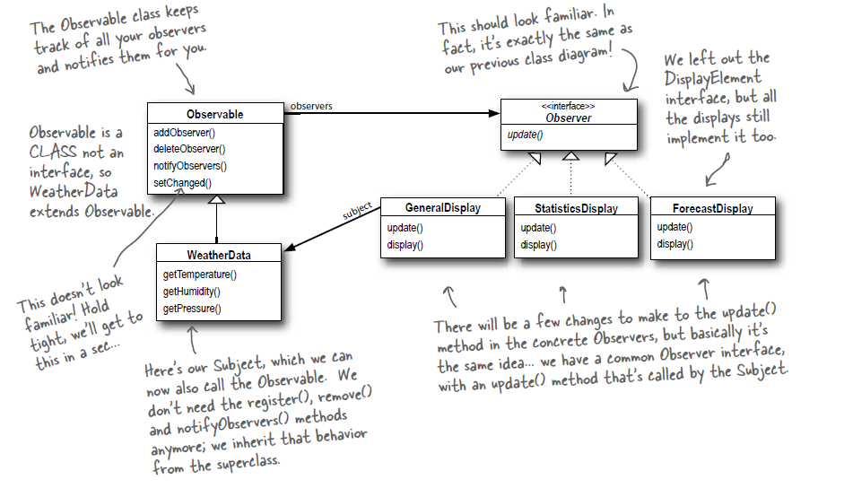
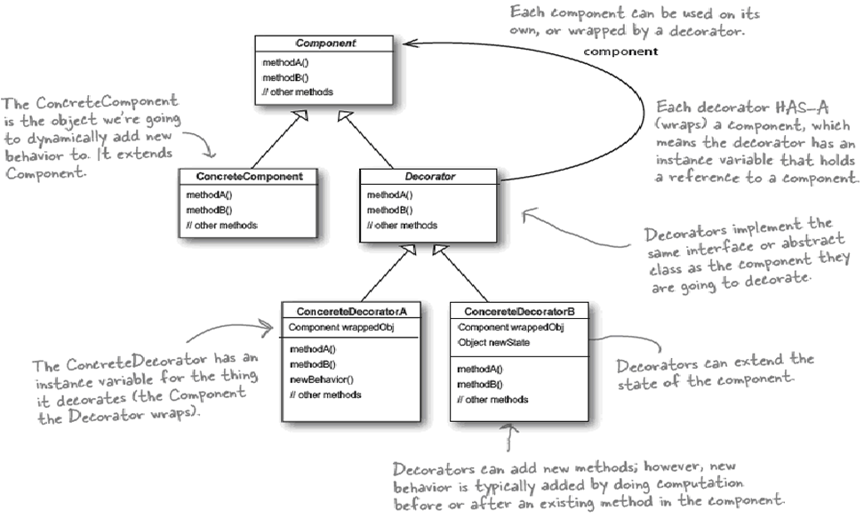
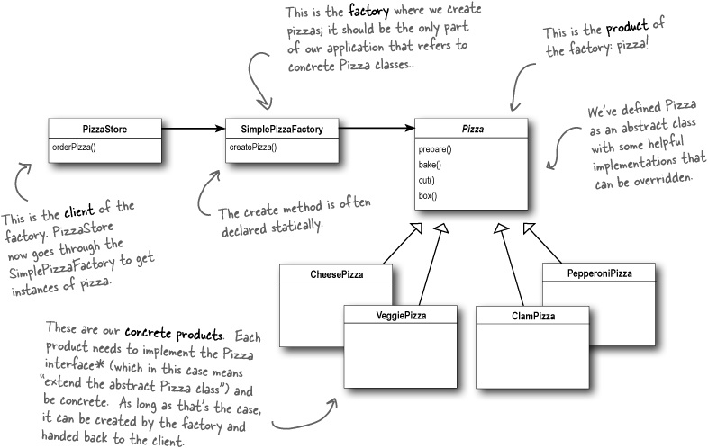
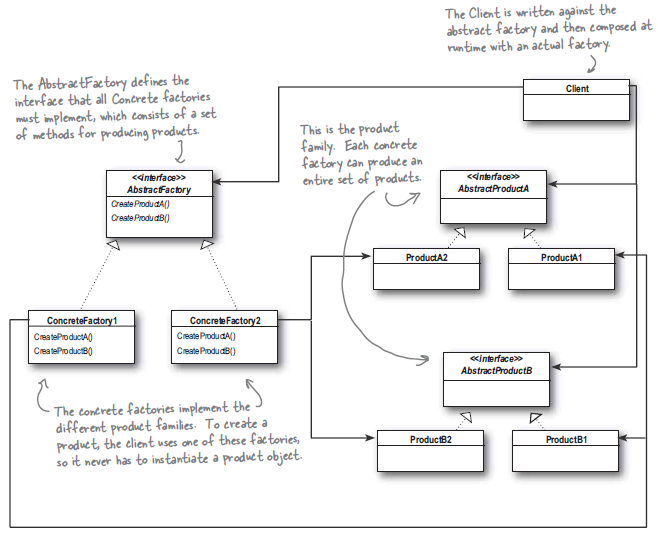
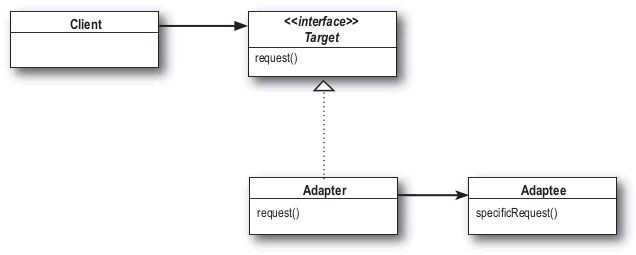
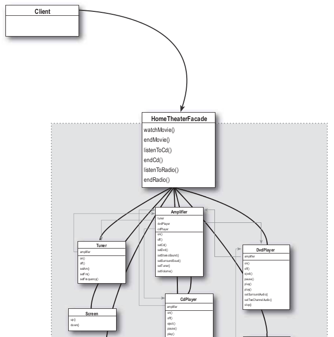
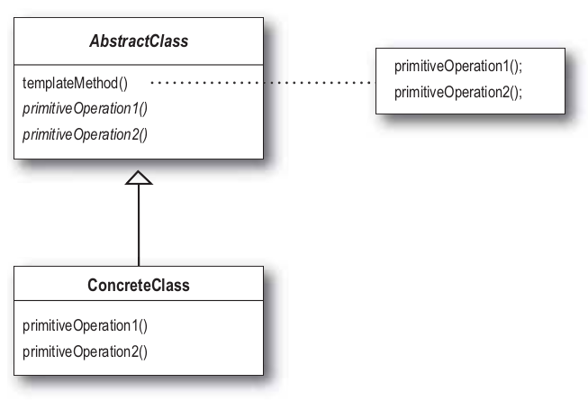

# 헤드퍼스트 디자인패턴 개정판


**디자인 패턴을 적용하기 전에 참고사항**

- 미래에는 무엇이 바뀔것인지 대충 예상하고 있어야한다.
- 상속보다는 컴포지션이 낫다.


# #1 디자인 패턴 소개와 전략 패턴

## 적용이 필요한 곳

## UML


# #2 옵저버 패턴

## 적용이 필요한 곳

## UML



## 구현

```java

public interface Subject {
	public void registerObserver(Observer o);
	public void removeObserver(Observer o);
	public void notifyObservers();
}

// Subject 하위
public class WeatherData implements Subject {
	private List<Observer> observers;
	private float temperature;
	private float humidity;
	private float pressure;
	
	public WeatherData() {
		observers = new ArrayList<>();
	}
	
	public void registerObserver(Observer o) {
		observers.add(o);
	}
	
	public void removeObserver(Observer o) {
		observers.remove(o);
	}
	
	public void notifyObservers() {
		for (Observer observer : observers) {
			observer.update(temperature, humidity, pressure);
		}
	}
	
	public void measurementsChanged() {
		notifyObservers();
	}
	
	public void setMeasurements(float temperature, float humidity, float pressure) {
		this.temperature = temperature;
		this.humidity = humidity;
		this.pressure = pressure;
		measurementsChanged();
	}

}

```

```java
public interface Observer {
	public void update(float temp, float humidity, float pressure);
}

// Observer 하위 
public class ForecastDisplay implements Observer, DisplayElement {
	private float currentPressure = 29.92f;  
	private float lastPressure;
	private WeatherData weatherData;

	public ForecastDisplay(WeatherData weatherData) {
		this.weatherData = weatherData;
		weatherData.registerObserver(this);
	}

	public void update(float temp, float humidity, float pressure) {
        lastPressure = currentPressure;
		currentPressure = pressure;

		display();
	}
}

// Observer 하위 
public class HeatIndexDisplay implements Observer, DisplayElement {
	float heatIndex = 0.0f;
	private WeatherData weatherData;

	public HeatIndexDisplay(WeatherData weatherData) {
		this.weatherData = weatherData;
		weatherData.registerObserver(this);
	}

	public void update(float t, float rh, float pressure) {
		heatIndex = computeHeatIndex(t, rh);
		display();
	}
}

```


```java

// 실제로 사용하기
public class WeatherStation {

	public static void main(String[] args) {
		WeatherData weatherData = new WeatherData();
	
		CurrentConditionsDisplay currentDisplay = 
			new CurrentConditionsDisplay(weatherData);
		StatisticsDisplay statisticsDisplay = new StatisticsDisplay(weatherData);
		ForecastDisplay forecastDisplay = new ForecastDisplay(weatherData);

		weatherData.setMeasurements(80, 65, 30.4f);
		weatherData.setMeasurements(82, 70, 29.2f);
		weatherData.setMeasurements(78, 90, 29.2f);
		
		weatherData.removeObserver(forecastDisplay);
		weatherData.setMeasurements(62, 90, 28.1f);
	}
}

```


## 정리

- 옵저버 패턴은 객체들 사이에 일대다 관계를 정의한다.
- Subject는 동일한 인터페이스를 써서 옵저버에게 연락을 한다.
- Observer인터페이스를 구현하기만 하면 어떤 구상 클래스의 옵저버라도 패턴에 참여할 수 있다.
- Subject는 옵저버들이 Observer 인터페이스를 구현한다는 것을 제외하면 옵저버에 관해 전혀 모른다. (느슨한 결합)
- 옵저버 패턴을 사용하면 Subject가 데이터를 보내거나 (push) 옵저버가 데이터를 가져올(pull) 수 있다. 일반적으로 pull 방식이 더 적합한 경우가 많다.
- 여러 라이브러리, 프레임워크에서 옵저버 패턴을 많이 사용하고 있다.
- 옵저버 패턴은 pub/sub 패턴과 매우 유사하다.

# #3 데코레이터 패턴

- 우리의 목표는 기존 코드를 건드리지 않고 확장으로 새로운 행동을 추가하는 것이다. OCP
- 데코레이터 패턴 정리
  - 객체에 추가 요소를 동적으로 더할 수 있다.
  - 데코레이터를 사용하면 서브클래스를 만들 때보다 훨씬 유연하게 기능을 확장할 수 있다.

## UML




## 구현

```java
public abstract class Beverage {
   String description = "Unknown Beverage";
  
   public String getDescription() {
      return description;
   }
 
   public abstract double cost();
}

// Beverage 하위
public class Decaf extends Beverage {
	public Decaf() {
		description = "Decaf Coffee";
	}
 
	public double cost() {
		return 1.05;
	}
}

// Beverage 하위

public class Espresso extends Beverage {
  
	public Espresso() {
		description = "Espresso";
	}
  
	public double cost() {
		return 1.99;
	}
}

```


```java
public abstract class CondimentDecorator extends Beverage { // Beverage를 구현하고
   Beverage beverage; //Beverage를 갖는게 데코레이터 특징
   public abstract String getDescription();
}

// CondimentDecorator 하위
public class Milk extends CondimentDecorator {
	public Milk(Beverage beverage) {
		this.beverage = beverage;
	}

	public String getDescription() {
		return beverage.getDescription() + ", Milk";
	}

	public double cost() {
		return .10 + beverage.cost();
	}
}

// CondimentDecorator 하위
public class Mocha extends CondimentDecorator {
	public Mocha(Beverage beverage) {
		this.beverage = beverage;
	}
 
	public String getDescription() {
		return beverage.getDescription() + ", Mocha";
	}
 
	public double cost() {
		return .20 + beverage.cost();
	}
}

```

```java

// 실제로 사용하기
public class StarbuzzCoffee {
 
	public static void main(String args[]) {
		Beverage beverage = new Espresso();
		System.out.println(beverage.getDescription() 
				+ " $" + beverage.cost());
 
		Beverage beverage2 = new DarkRoast();
		beverage2 = new Mocha(beverage2); // Mocha(DarkRoast)
		beverage2 = new Mocha(beverage2); // Mocha(Mocha(DarkRoast))
		beverage2 = new Whip(beverage2); // Whip(Mocha(Mocha(DarkRoast)))
		System.out.println(beverage2.getDescription() 
				+ " $" + beverage2.cost());
 
		Beverage beverage3 = new HouseBlend();
		beverage3 = new Soy(beverage3);
		beverage3 = new Mocha(beverage3);
		beverage3 = new Whip(beverage3);
		System.out.println(beverage3.getDescription() 
				+ " $" + beverage3.cost());
	}
}

```


## 정리

- 디자인의 유연성 면에서 보면 상속으로 확장하는 일은 별로 좋은 선택이 아니다.
- 기존 코드 수정 없이 행동을 확장해야 하는 경우 데코레이터 패턴으로 행동을 확장할 수 있다.
- 데코레이터 패턴은 구상 구성 요소를 감싸 주는 데코레이터를 사용한다.
- 데코레이터 클래스의 형식은 그 클래스가 감싸는 클래스 형식을 반영한다.
- 데코레이터는 자기가 감싸고 있는 구성 요소의 메서드를 호출한 결과에 새로운 기능을 더함으로써 행동을 확장한다.
- 구성 요소를 감싸는 데코레이터의 개수에는 제한이 없다.
- 구성 요소의 클라이언트 데코레이터의 존재를 알 수 없다. 클라이언트가 구성 요소의 구체적인 형식에 의존하는 경우는 예외다.
- 데코레이터 패턴을 사용하면 자잘한 객체가 매우 많이 추가될 수 있고 데코레이터를 너무 많이 사용하면 코드가 필요 이상으로 복잡해진다.

# #4-1 팩토리 패턴

## UML




## 적용

```java
public abstract class Pizza {
	String name;
	String dough;
	String sauce;
	ArrayList<String> toppings = new ArrayList<String>();
}

// Pizza 하위
public class NYStyleVeggiePizza extends Pizza {

	public NYStyleVeggiePizza() {
		name = "NY Style Veggie Pizza";
		dough = "Thin Crust Dough";
		sauce = "Marinara Sauce";
 
		toppings.add("Grated Reggiano Cheese");
		toppings.add("Garlic");
		toppings.add("Onion");
		toppings.add("Mushrooms");
		toppings.add("Red Pepper");
	}
}

// Pizza 하위
public class ChicagoStylePepperoniPizza extends Pizza {
	public ChicagoStylePepperoniPizza() {
		name = "Chicago Style Pepperoni Pizza";
		dough = "Extra Thick Crust Dough";
		sauce = "Plum Tomato Sauce";
 
		toppings.add("Shredded Mozzarella Cheese");
		toppings.add("Black Olives");
		toppings.add("Spinach");
		toppings.add("Eggplant");
		toppings.add("Sliced Pepperoni");
	}
 
	void cut() {
		System.out.println("Cutting the pizza into square slices");
	}
}

```


```java
public abstract class PizzaStore {
 
	abstract Pizza createPizza(String item);
 
	public Pizza orderPizza(String type) {
		Pizza pizza = createPizza(type);
		System.out.println("--- Making a " + pizza.getName() + " ---");
		pizza.prepare();
		pizza.bake();
		pizza.cut();
		pizza.box();
		return pizza;
	}
}

// PizzaStore 하위
public class ChicagoPizzaStore extends PizzaStore {

	Pizza createPizza(String item) {
        	if (item.equals("cheese")) {
            		return new ChicagoStyleCheesePizza();
        	} else if (item.equals("veggie")) {
        	    	return new ChicagoStyleVeggiePizza();
        	} else if (item.equals("clam")) {
        	    	return new ChicagoStyleClamPizza();
        	} else if (item.equals("pepperoni")) {
            		return new ChicagoStylePepperoniPizza();
        	} else return null;
	}
}

// PizzaStore 하위
public class NYPizzaStore extends PizzaStore {

	Pizza createPizza(String item) {
		if (item.equals("cheese")) {
			return new NYStyleCheesePizza();
		} else if (item.equals("veggie")) {
			return new NYStyleVeggiePizza();
		} else if (item.equals("clam")) {
			return new NYStyleClamPizza();
		} else if (item.equals("pepperoni")) {
			return new NYStylePepperoniPizza();
		} else return null;
	}
}

// 실제로 사용하기
public class PizzaTestDrive {
 
	public static void main(String[] args) {
		PizzaStore nyStore = new NYPizzaStore();
		PizzaStore chicagoStore = new ChicagoPizzaStore();
 
		Pizza pizza = nyStore.orderPizza("cheese");
		System.out.println("Ethan ordered a " + pizza.getName() + "\n");
 
		pizza = chicagoStore.orderPizza("cheese");
		System.out.println("Joel ordered a " + pizza.getName() + "\n");

		pizza = nyStore.orderPizza("clam");
		System.out.println("Ethan ordered a " + pizza.getName() + "\n");
 
		pizza = chicagoStore.orderPizza("clam");
		System.out.println("Joel ordered a " + pizza.getName() + "\n");

		pizza = nyStore.orderPizza("pepperoni");
		System.out.println("Ethan ordered a " + pizza.getName() + "\n");
 
		pizza = chicagoStore.orderPizza("pepperoni");
		System.out.println("Joel ordered a " + pizza.getName() + "\n");

		pizza = nyStore.orderPizza("veggie");
		System.out.println("Ethan ordered a " + pizza.getName() + "\n");
 
		pizza = chicagoStore.orderPizza("veggie");
		System.out.println("Joel ordered a " + pizza.getName() + "\n");
	}
}

```

- 의존성 역전
  - 고수준 구성 요소가 저수준 구성 요소에 의존하면 안되고 항상 추상화에 의존하게 만들어야 한다.
  - PizzaStore는 고수준 영역, Pizza 클래스는 저수준 영역
- 의존성 역전 법칙을 지키는 방법
  - 변수에 구상 클래스의 레퍼런스를 저정하지 말자
  - 구상 클래스에서 유도된 클래스를 만들지 말자
  - 베이스 클래스에서 이미 구현되어있는 메서드를 오버라이드하지 말자.


## 정리

- 팩토리 메서드 패턴에서는 객체를 생성할 때 필요한 인터페이스를 만들고 어떤 클래스의 인스턴스를 만들지는 서브클래스에서 결정한다. 팩토리 메서드 패턴을 사용하면 클래스 인스턴스 만드는 일은 서브클래스에게 맡기면 된다.

# #4-2 추상 팩토리 패턴


## UML




## 정리

- 추상 팩토리 패턴은 구상 클래스에 의존하지 않고도 서로 연관되거나 의존적인 객체로 이루어진 제품군을 생산하는 인터페이스를 제공한다. 구상 클래스는 서브클래스에서 만든다.


## 핵심 정리

- 팩토리를 쓰면 객체 생성을 캡슐화할 수 있다.
- 팩토리 메서드 패턴은 상속을 활용한다. 객체 생성을 서브클래스에게 맡긴다. 서브클래스는 팩토리 메서드를 구현해서 객체를 생산한다.
- 추상 팩토리 패턴은 객체 구성을 활용한다. 팩토리 인터페이스에서 선언한 메서드에서 객체 생성이 구현된다.
- 모든 팩토리 패턴은 애플리케이션의 구상 클래스 의존성을 줄여줌으로써 느슨한 결합을 도와준다.
- 팩토리는 구상 클래스가 아닌 추상 클래스와 인터페이스에 맞춰서 코딩할 수 있게 해주는 기법이다.


# #5 싱글턴 패턴

## 정리

- 싱글턴 패턴은 클래스 인스턴스를 하나만 만들고, 그 인스턴스로의 전역 접근을 제공한다.


## 핵심 정리

- 어떤 클래스에 싱글턴 패턴을 적용하면 그 클래스의 인스턴스가 1개만 있도록 할 수 있다.

- 멀티 스레드를 사용하는 애플리케이션에서 싱글턴을 사용하는 방법

  - 메서드 레벨에서 동기화하기

  - 정적 변수로 초기화하기

  - DCL(volatile)로 사용하기

    - ```java
      
      public class Singleton {
      	private volatile static Singleton uniqueInstance;
       
      	private Singleton() {}
       
      	public static Singleton getInstance() {
      		if (uniqueInstance == null) {
      			synchronized (Singleton.class) {
      				if (uniqueInstance == null) {
      					uniqueInstance = new Singleton();
      				}
      			}
      		}
      		return uniqueInstance;
      	}
      }
      
      ```

- 자바의 enum을 사용하면 간단하게 싱글턴을 구현할 수 있다.


# #6 커맨드 패턴

## UML


## 정리

- 커맨드 패턴을 사용하면 요청 내역을 객체로 캡슐화해서 객체를 서로 다른 요청 내역에 따라 매개변수화 할 수 있다.

- 요청을 큐에 저장하거나 로그로 기럭하거나 작업 취소 기능을 사용할 수 있다.

- 밖에서 볼 때 어떤 객체가 리시버 역하을 하는지 그 리시버가 어떤 일을 하는지 알 수 없고 그냥 execute() 메서드를 호출하면 해당 요청이 처리된다는 사실만 알 수 있다.

  

## 적용


```java
public interface Command {
	public void execute();
}

// Command 하위
public class LightOnCommand implements Command {
	Light light;

	public LightOnCommand(Light light) {
		this.light = light;
	}

	public void execute() {
		light.on();
	}
}

// Command 하위
public class LightOffCommand implements Command {
	Light light;
 
	public LightOffCommand(Light light) {
		this.light = light;
	}
 
	public void execute() {
		light.off();
	}
}

```


```java

//
// This is the invoker
//
public class RemoteControl {
	Command[] onCommands;
	Command[] offCommands;
 
	public RemoteControl() {
		onCommands = new Command[7];
		offCommands = new Command[7];
 
		Command noCommand = new NoCommand();
		for (int i = 0; i < 7; i++) {
			onCommands[i] = noCommand;
			offCommands[i] = noCommand;
		}
	}
  
	public void setCommand(int slot, Command onCommand, Command offCommand) {
		onCommands[slot] = onCommand;
		offCommands[slot] = offCommand;
	}
 
	public void onButtonWasPushed(int slot) {
		onCommands[slot].execute();
	}
 
	public void offButtonWasPushed(int slot) {
		offCommands[slot].execute();
	}
  
	public String toString() {
		StringBuffer stringBuff = new StringBuffer();
		stringBuff.append("\n------ Remote Control -------\n");
		for (int i = 0; i < onCommands.length; i++) {
			stringBuff.append("[slot " + i + "] " + onCommands[i].getClass().getName()
				+ "    " + offCommands[i].getClass().getName() + "\n");
		}
		return stringBuff.toString();
	}
}

```


```java
public class RemoteLoader {
 
   public static void main(String[] args) {
      RemoteControl remoteControl = new RemoteControl();
 
      Light livingRoomLight = new Light("Living Room");
      Light kitchenLight = new Light("Kitchen");
      CeilingFan ceilingFan= new CeilingFan("Living Room");
      GarageDoor garageDoor = new GarageDoor("Garage");
      Stereo stereo = new Stereo("Living Room");
  
      LightOnCommand livingRoomLightOn = 
            new LightOnCommand(livingRoomLight);
      LightOffCommand livingRoomLightOff = 
            new LightOffCommand(livingRoomLight);
      LightOnCommand kitchenLightOn = 
            new LightOnCommand(kitchenLight);
      LightOffCommand kitchenLightOff = 
            new LightOffCommand(kitchenLight);
  
      CeilingFanOnCommand ceilingFanOn = 
            new CeilingFanOnCommand(ceilingFan);
      CeilingFanOffCommand ceilingFanOff = 
            new CeilingFanOffCommand(ceilingFan);
 
      GarageDoorUpCommand garageDoorUp =
            new GarageDoorUpCommand(garageDoor);
      GarageDoorDownCommand garageDoorDown =
            new GarageDoorDownCommand(garageDoor);
 
      StereoOnWithCDCommand stereoOnWithCD =
            new StereoOnWithCDCommand(stereo);
      StereoOffCommand  stereoOff =
            new StereoOffCommand(stereo);
 
      remoteControl.setCommand(0, livingRoomLightOn, livingRoomLightOff);
      remoteControl.setCommand(1, kitchenLightOn, kitchenLightOff);
      remoteControl.setCommand(2, ceilingFanOn, ceilingFanOff);
      remoteControl.setCommand(3, stereoOnWithCD, stereoOff);
  
      System.out.println(remoteControl);
 
      remoteControl.onButtonWasPushed(0);
      remoteControl.offButtonWasPushed(0);
      remoteControl.onButtonWasPushed(1);
      remoteControl.offButtonWasPushed(1);
      remoteControl.onButtonWasPushed(2);
      remoteControl.offButtonWasPushed(2);
      remoteControl.onButtonWasPushed(3);
      remoteControl.offButtonWasPushed(3);
   }
}
```


## 핵심 정리

- 커맨드 패턴을 사용하면 요청하는 객체와 요청을 수행하는 객체를 분리할 수 있다.
- Invoker는 무언가 요청할 때 커맨드 객체의 execute() 메서드를 호출한다. execute() 메서드는 리시버에 있는 행동을 호출한다.
- Command는 Invoker를 매개변수화 할 수 있다. 실행 중에 동적으로 매개변수화를 설정할 수도 있다.


# #7 어댑터 패턴과 퍼사드 패턴

## 어댑터 패턴 UML




## 어댑터 패턴 정의

- 특정 클래스 인터페이스를 클라이언트에서 요구하는 다른 인터페이스로 변환한다.
- 인터페이스가 호환되지 않아 같이 쓸 수 없었던 클래스를 사용할 수 있게 도와준다.


## 어댑터 패턴 적용

```java

/**
*
* Target은 Iterator
* Adapter는 EnumerationIterator
* Adaptee는 Enumeration
*
**/
public class EnumerationIterator implements Iterator<Object> {
   Enumeration<?> enumeration;
 
   public EnumerationIterator(Enumeration<?> enumeration) {
      this.enumeration = enumeration;
   }
 
   public boolean hasNext() {
      return enumeration.hasMoreElements();
   }
 
   public Object next() {
      return enumeration.nextElement();
   }
 
   public void remove() {
      throw new UnsupportedOperationException();
   }
}
```


## 퍼사드 패턴 정의

- 서브시스템에 있는 일련의 인터페이스를 통합 인터페이스로 묶어준다.
- 고수준 인터페이스도 정의하므로 서브시스템을 더 편리하게 사용할 수 있다. 

## 퍼사드 패턴 UML



## 퍼사드 패턴 적용

```java

public class HomeTheaterFacade {
	Amplifier amp;
	Tuner tuner;
	StreamingPlayer player;
	CdPlayer cd;
	Projector projector;
	TheaterLights lights;
	Screen screen;
	PopcornPopper popper;
 
	public HomeTheaterFacade(Amplifier amp, 
				 Tuner tuner, 
				 StreamingPlayer player, 
				 Projector projector, 
				 Screen screen,
				 TheaterLights lights,
				 PopcornPopper popper) {
 
		this.amp = amp;
		this.tuner = tuner;
		this.player = player;
		this.projector = projector;
		this.screen = screen;
		this.lights = lights;
		this.popper = popper;
	}
 
	public void watchMovie(String movie) {
		System.out.println("Get ready to watch a movie...");
		popper.on();
		popper.pop();
		lights.dim(10);
		screen.down();
		projector.on();
		projector.wideScreenMode();
		amp.on();
		amp.setStreamingPlayer(player);
		amp.setSurroundSound();
		amp.setVolume(5);
		player.on();
		player.play(movie);
	}
 
 
	public void endMovie() {
		System.out.println("Shutting movie theater down...");
		popper.off();
		lights.on();
		screen.up();
		projector.off();
		amp.off();
		player.stop();
		player.off();
	}

	public void listenToRadio(double frequency) {
		System.out.println("Tuning in the airwaves...");
		tuner.on();
		tuner.setFrequency(frequency);
		amp.on();
		amp.setVolume(5);
		amp.setTuner(tuner);
	}

	public void endRadio() {
		System.out.println("Shutting down the tuner...");
		tuner.off();
		amp.off();
	}
}

```


## 핵심 정리

- 기존 클래스를 사용하려고 하는데 인터페이스가 맞지 않으면 어댑터를 쓰면 된다.
- 큰 인터페이스와 여러 인터페이스를 단순하게 바꾸거나 통합해야 하면 퍼사드를 쓰면 된다.

# #8 템플릿 메소드 패턴

## UML




## 정리

- 템플릿 메소드 패턴은 알고리즘의 골격을 정의한다.
- 템플릿 메서드를 사용하면 알고리즘의 일부 단계를 서브클래스에서 구현할 수 있으며 알고리즘의 구조는 그대로 유지하면서 알고리즘의 특정 단계를 서브클래스에서 재정의할 수도 있다.


## 적용


```java
public abstract class CaffeineBeverage {
  
	final void prepareRecipe() {
		boilWater();
		brew();
		pourInCup();
		addCondiments();
	}
 
	abstract void brew();
  
	abstract void addCondiments();
 
	void boilWater() {
		System.out.println("Boiling water");
	}
  
	void pourInCup() {
		System.out.println("Pouring into cup");
	}
}

// CaffeineBeverage 하위
public class Coffee extends CaffeineBeverage {
	public void brew() {
		System.out.println("Dripping Coffee through filter");
	}
	public void addCondiments() {
		System.out.println("Adding Sugar and Milk");
	}
}

// CaffeineBeverage 하위
public class Tea extends CaffeineBeverage {
	public void brew() {
		System.out.println("Steeping the tea");
	}
	public void addCondiments() {
		System.out.println("Adding Lemon");
	}
}

```


## 핵심 정리

- 템플릿 메서드는 알고리즘의 단계를 정의하며 일부 단계를 서브 클래스에서 구현하도록 할 수 있다.
- 템플릿 메서드 패턴은 코드 재사용에 큰 도움이 된다.
- 후크를 사용해서 기본 행동을 정의하고 후크를 오버라이드해서 서브클래스별로 특정행동을 정의할 수 있다.


# #9 반복자 패턴과 컴포지트 패턴


# #10 상태 패턴


# #11 프록시 패턴


# #12 복합 패턴


# #13 실전 디자인 패턴


# #14 기타 패턴