# 가장 면접 사례로 배우는 대규모 시스템 설계 기초

# #1 사용자 수에 따른 규모 확장성

## 단일서버

- 단일 서버만 있을때 일반적인 사용자의 요청 처리 흐름
  1. 도메인 이름을 이용해서 웹사이트에 접속함. 이 접속을 위해서 dns server에 질의해서 ip주소로 변환함. 우리 시스템의 일부는 아님
  2. dns 조회 결과로 ip주소가 반환됨
  3. 해당 ip주소로 http 요청이 전달됨
  4. 요청을 받은 웹 서버는 html 페이지나 json 형태의 응답을 반환함

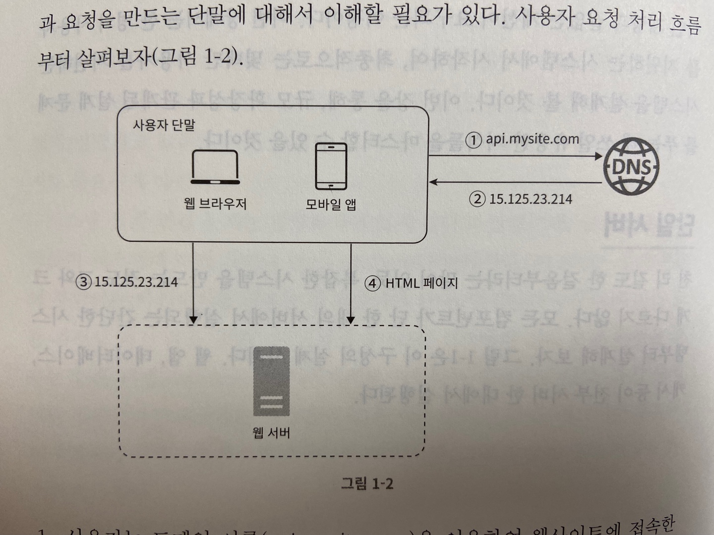

## 데이터베이스

- 사용자가 늘면 서버 하나로는 충분하지 않아서 여러 서버를 두어야함

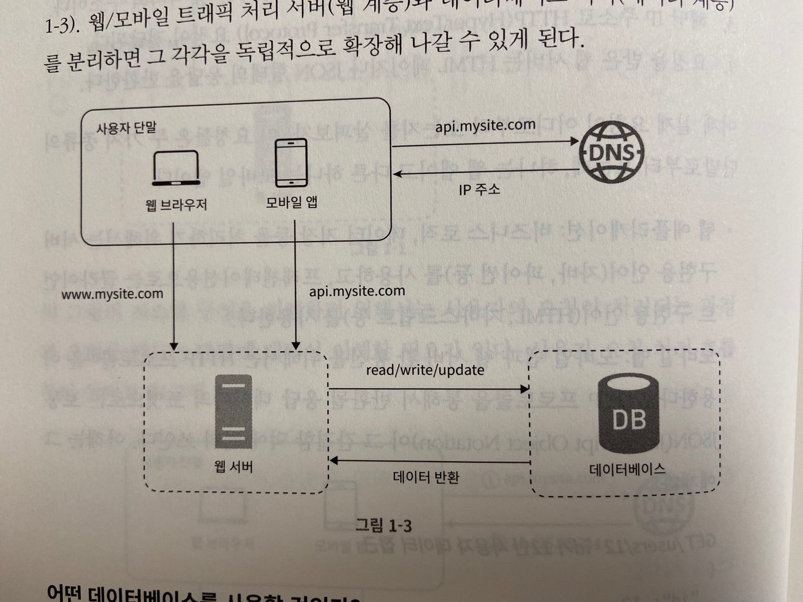

### 어떤 데이터베이스를 사용할 것인가?

- 전통적인 관계형 db와 비-관계형 db사이에서 고를 수 있음
- 관계형 db
  - mysql, oracle, postgresql
  - 자료를 테이블과 열, 칼럼으로 표현함
  - sql 사용
- 비-관계형 db
  - CouchDB, Neo4j, Cassandra, HBase, Amazon DynamoDB ...
  - 키-값 저장소
  - 그래프 저장소
  - 칼럼 저장소
  - 문서 저장소
- 아래와 같은 경우에 비-관계형 데이터베이스가 바람직한 선택일 수 있음
  1. 아주 낮은 응답 지연시간이 요구됨
  2. 다루는 데이터가 비정형이라 관계형 데이터가 아님
  3. 데이터를 직렬화하거나 역직렬화 할 수 있기만 하면 됨
  4. 아주 많은 양의 데이터를 저장할 필요가 있음

## 수직적 규모 확장 vs 수평적 규모 확장

- 스케일업
  - 수직적 규모 확장
  - 서버에 고사양 자원을 추가하는 행위 ex cpu, ram
  - 장점은 단순함
  - 단점은 규모 확장에 한계까 있고 cpu, 메모리를 무한대로 증설할 수 없음
  - 장애에 대한 자동복구(failover) 다중화 방안을 제안하지 않음. 서버에 장애가 발생한다면 웹사이트/앱은 완전히 중단됨
  - 대규모 애플리케이션을 지원하는 데는 수평적 규모 확장법을 사용해야함
- 스케일아웃
  - 수평적 규모 확장
  - 더 많은 서버를 추가 하는 행위
- 너무 많은 사용자가 접근하거나 웹사이트가 다운된다면 접속이 불가능해질 수 있는데 이런 문제를 해결하는 데는 부하 분산기 또는 로드 밸런서를 도입하는 것이 최선임

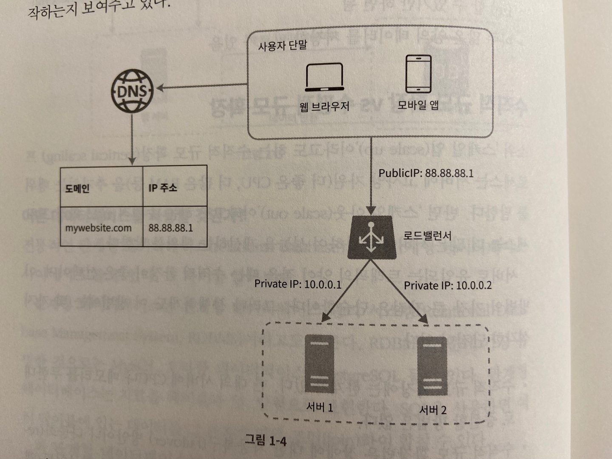

- 웹 서버는 클라의 접속을 직접 처리하지 않음
- 보안을 위해 서버간 통신에는 사설 ip주소가 이용됨
- 장애를 자동복구하지 못하는 문제는 해소되고 웹 계층의 가용성은 향상됨
  - 서버 1이 다운되면 모든 트래픽은 서버 2로 전송됨 (failover)
  - 웹 사이트로 유입되는 트래픽을 로드밸런서가 분산시켜줌

### 데이터베이스 다중화

- master-slave 관계
  - 쓰기 연산은 master에서만 지원
  - slave는 master에게서 사본을 전달 받으며 읽기 연산만을 지원함
- 대부분은 앱은 읽기 연산이 쓰기보연산보다 비중이 높음
- 데이터베이스 다중화의 이점
  - 더 나은 성능: 읽기와 쓰기의 역할을 나눔으로 병렬로 처리될 수 있는 질의의 수가 늘어남
  - 안전성: 데이터베이스 서버의 일부가 파괴되더라도 데이터는 보존됨
  - 가용성: 하나의 db에 장애가 발생하더라도 계속 서비스 가능
- slave는 master의 후보가 되기 때문에 master가 죽으면 slave가 master로 승격될 수 있음

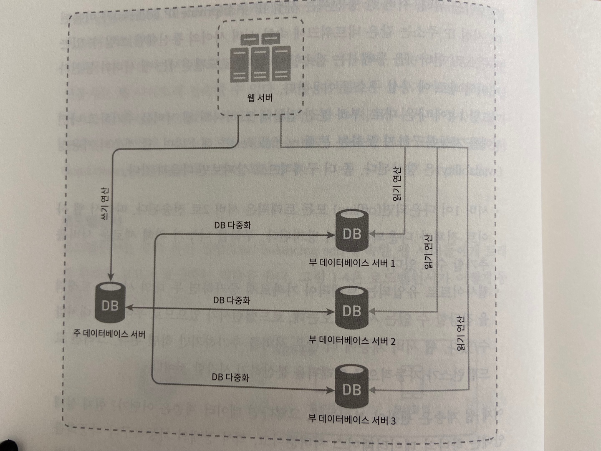

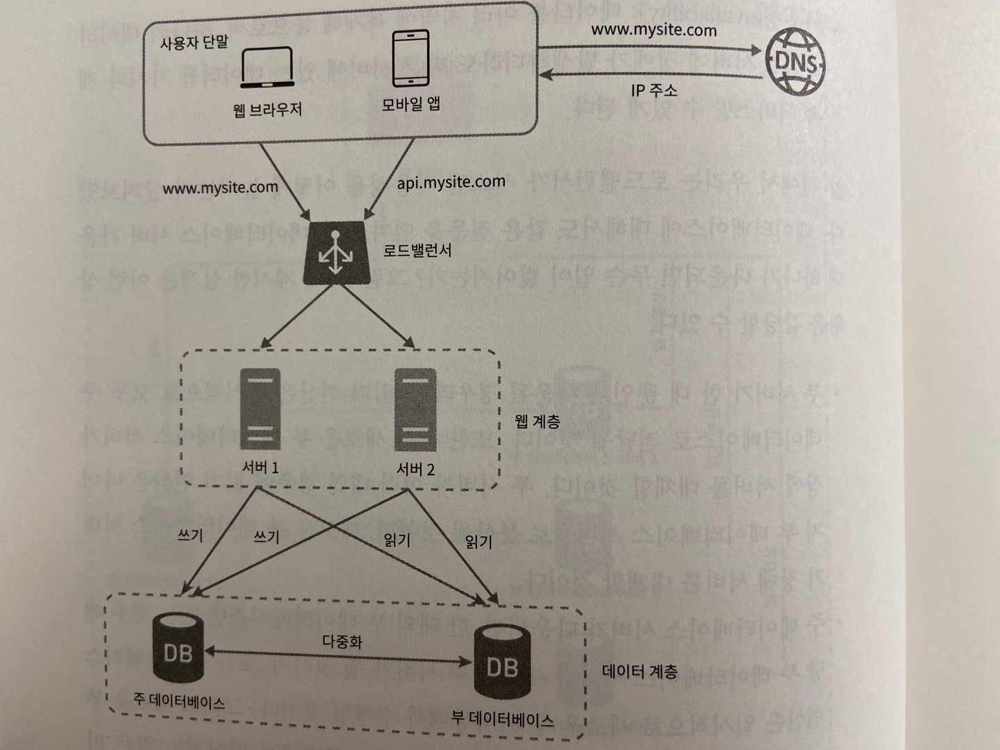설계안은 다음과 같이 동작함

- 사용장는 dns로부터 lb의 공개 ip주소를 받음
- 사용자는 해당 ip 주소를 사용해 lb에 접속
- http 요청은 서버1. or 서버 2로 전달
- 웹 서버는 사용자의 데이터를 부 데이터베이스 서버에서 읽음
- 웹 서버는 데이터 변경 연산은 주 데이터베이스로 전달함. 데이터 추가, 삭제, 갱신 연산 등이 이에 해당

## 캐시

- 응답 시간은 캐시를 붙이고 정적 콘텐츠를 콘텐츠 전송 네트워크 (cdn)로 옮기면 개선할 수 있음
- 캐시는 값비싼 연산 결과 또는 자주 참조되는 데이터를 메모리 안에 두고 뒤이은 요청이 보다 빨리 처리될 수 있도록 하는 저장소

### 캐시 계층

- 캐시 계층은 데이터가 잠시 보관되는 곳. db보다 훨씬 빠름
- 성능 개선 뿐만 아니라 db의 부하를 줄일 수 있음
- 주도형 캐시 전략
  - 캐시에 있으면 return, 없으면 db에서 읽고 캐싱후 리턴

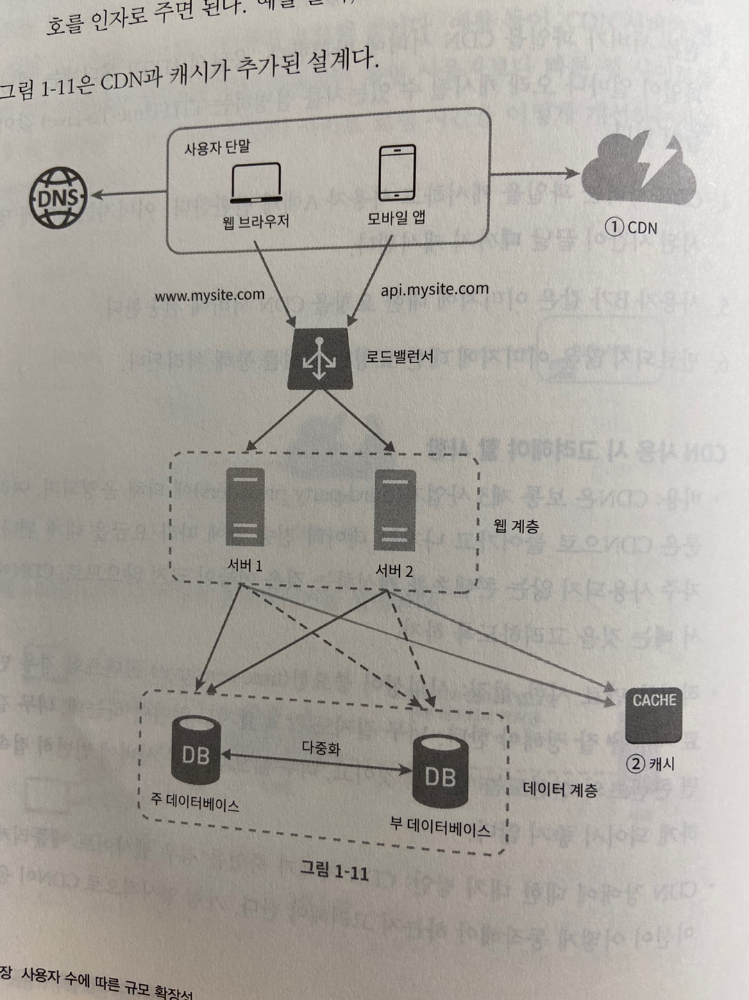

### 캐시 사용시 유의할 점

- 캐시는 어떤 상황에 바람직한가?
  - 데이터 갱신은 자주 일어나지 않지만 참조는 빈번하게 일어나는 경우
- 어떤 데이터를 캐시에 두어야 하는가?
  - 영속적으로 보관할 데이터를 캐시에 두는것은 적합하지 않음
  - 휘발성 데이터만
- 캐시에 보관된 데이터는 어떻게 만료되는가?
  - 만료기한을 적절하게 잘 설정하는 것이 중요함
- 일관성은 어떻게 유지되는가?
  - 저장소의 원본을 갱신하는 연산과 캐시를 갱신하는 연산이 단일 트랜잭션으로 처리되어야함
- 장애에는 어떻게 대처할 것인가?
  - 캐시 서버를 한대만 두는 경우는 해당 서버는 단일 장애 지점(SPOF)이 될 가능성이 있음
  - 캐시 서버를 분산시켜야함
- 캐시 메모리를 얼마나 크게 잡을 것인가?
  - 메모리가 너무 작다면 캐시의 성능이 떨어지게됨
  - 이를 막을 방법은 캐시 메모리를 과할당하는 것 <- 좋은건가 ..?
- 데이터 방출(eviction) 정책은 무엇인가?
  - LRU, LFU, FIFO 등등... 경우에 맞게 적용해야함

## 콘텐츠 전송 네트워크(CDN)

- CDN은 정적 콘텐츠를 전송하는데 쓰이는 지리적으로 분산된 서버의 네트워크
- 이미지, 비디오, CSS, Javascript 파일 등을 캐시할 수 있음
- 동적 컨텐츠를 캐시할 수 있음. Amazon CloudFront Dynamic Content Delivery
- CDN은 요청하는 사용자에게 가장 물리적으로 가까운 CDN 서버가 정적 콘텐츠를 전달함
- CDN 동작 흐름
  - 사용자 a가 이미지 url 을 이용해 image.png에 접근
  - cdn 서버의 캐시에 해당 이미지가 없다면 원본 서버에 요청해서 파일을 가져옴. 웹서버 or S3 etc ...
  - 원본 서버가 파일을 CDN 서버에 반환함. http 헤더에는 TTL값이 있음.
  - cdn 서버는 파일을 캐시하고 사용자 a에게 반환 TTL 값만큼 서버에 살아있음
  - 사용자 B가 같은 이미지에 대한 요청을 cdn에게 요청
  - 만료되지 않은 이미지에 대한 요청은 캐시를 통해 처리됨

### CDN 사용 시 고려해야 할 사항

- 비용

- 적절한 만료 시한 설정

- cdn 장애에 대한 대처 방안

- 콘텐츠 무효화 방법

  - 만료되지 않더라도 아래 방법 가운데 하나를 쓰면 cdn에서 제거할 수 있음
    - cdn 서비스 사업자가 제공하는 api를 이용해서 콘텐츠 무효화
    - 콘텐츠의 다른 버전을 서비스하도록 오브젝트 버저닝이용. ex image.png?v=2

  

## 무상태(stateless) 웹 계층

- 웹 계층을 수평적으로 확장하기 위해서는 상태 정보(ex 세션)을 웹 계층에서 제거해야함
- 바람직한 전략은 상태 정보를 관계형 데이터베이스나 nosql에 보관하고 필요할 떄 가져오도록 하는 것

### 상태 정보 의존적인 아키텍처

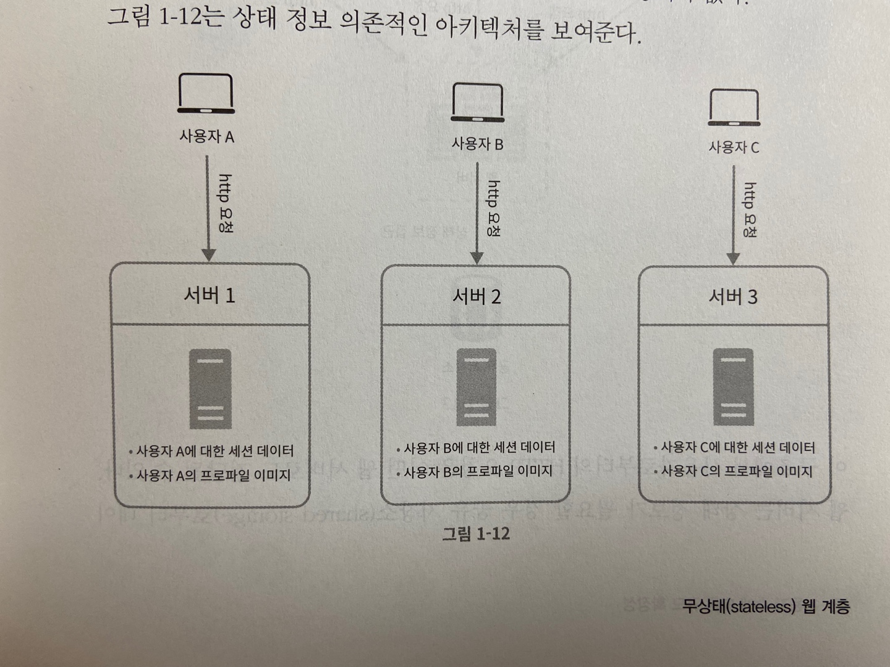

- 상태 정보 의존적인 아키텍처는 같은 클라의 오청은 항상 같은 서버로 전송되어야 한다는 것.
- 대부분의 lb가 이를 지원하기 위해 고정 세션을 제공하지만 lb에 부담이되고 까다로워짐

### 무상태 아키텍처

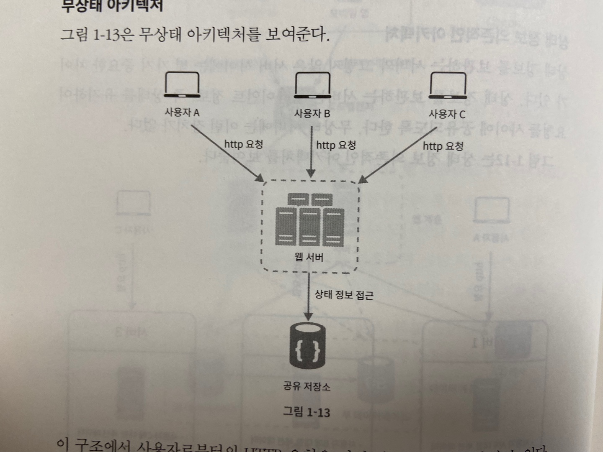

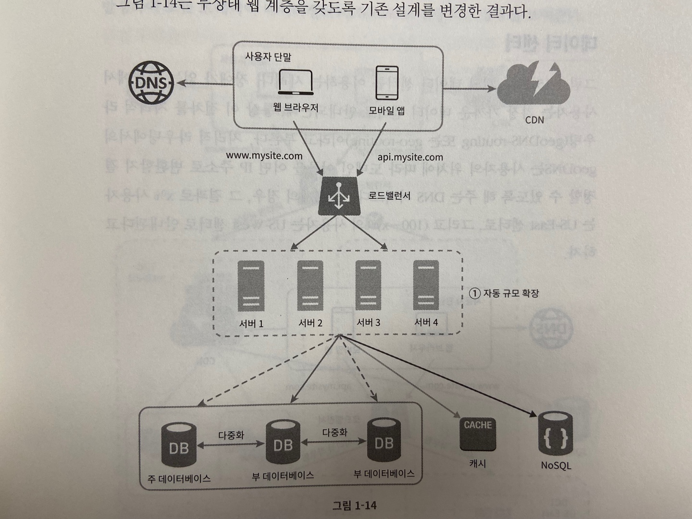

- 상태 정보가 웹 서버로부터 물리적으로 분리됨
- 이 저장소는 rdb, nosql일 수 있음

## 데이터 센터

- 장애가 없는 상황에서 사용자는 가장 까까운 데이터 센터로 안내됨. 통상 이 절차를 지리적 라우팅이라고 부름
- geoDNS는 사용자의 위치에 따라 도메인 이름을 어떤 ip 주소로 변환할지 결정할 수 있도록 해주는 dns 서비스임
- 다중 데이터 센터를 만들때 몇가지 기술적 난제
  - 트래픽 우회: 데이터 센터로 트래픽을 보내는 효과적인 방법을 찾아야함
  - 데이터 동기화: 데이터 센터마다 별도의 데이터베이스를 사용하고 있다면 여러 데이터 센터의 데이터를 모두 동기화해야함
  - 테스트와 배포: 자동화된 배포도구, 테스트가 중요함

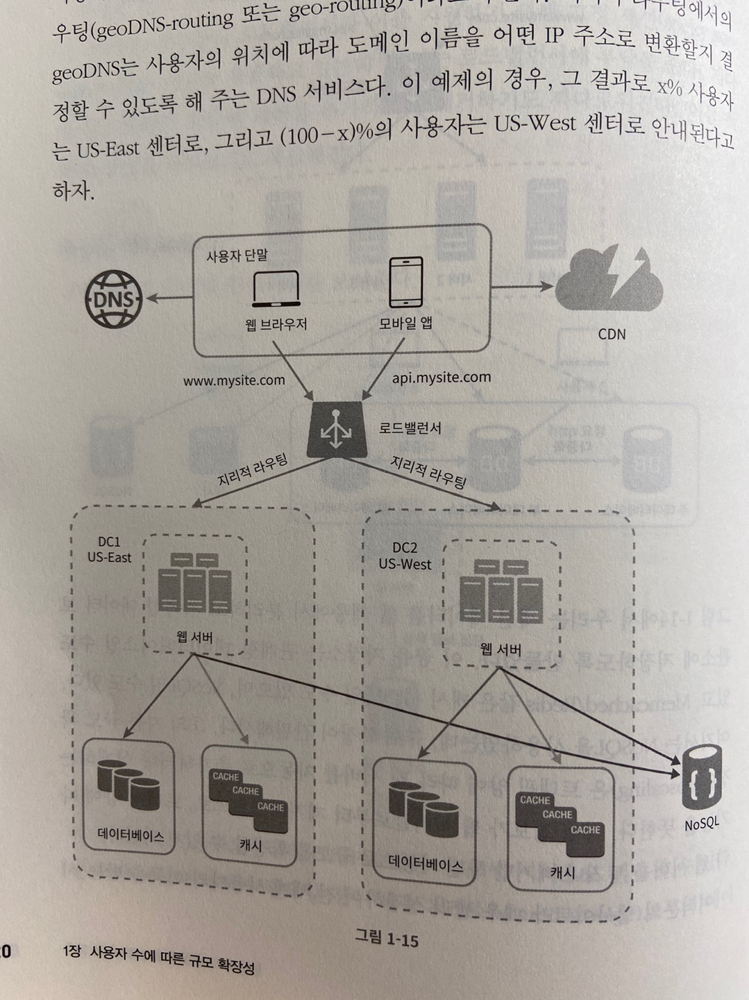

## 메시지 큐

- mq는 메시지의 무손실을 보장하는 비동기 통신을 지원하는 컴포넌트
- 메시지의 버퍼역할을 하고 비동기적으로 전송함.
- 생산자/발행자는 메시지를 만들어서 큐에 발행함
- 소비자/구독자는 메시지를 받아 알맞은 동작을 수행함
- mq를 이용하면 서비스 또는 서버 간 결합이 느슨해져서 규모 확장성이 보장되어야 하는 안정적 애플리케이션을 구성하기 좋음

## 로그, 메트릭 그리고 자동화

- 로그
  - 에러 로그를 모니터링하는 것은 중요함.
  - 로그를 단일 서비스로 모아주는 도구를 활용하면 더 좋음
- 메트릭
  - 메트릭을 잘 수집하면 사업 현황에 관한 유용한 정보를 얻을 수 있고 시스템의 현재 상태를 손쉽게 파악할 수 있음
    - 호스트 단위 메트릭: cpu, 메모리, 디스크 i/o에 관한 메트릭
    - 종합 메트릭: db의 계층의 성능, 캐시 계층의 성능
    - 핵심 비지니스 메트릭: dau, 수익, 재방문 등등

### 메시지 큐, 로그, 메트릭, 자동화 등을 반영하여 수정한 설계안

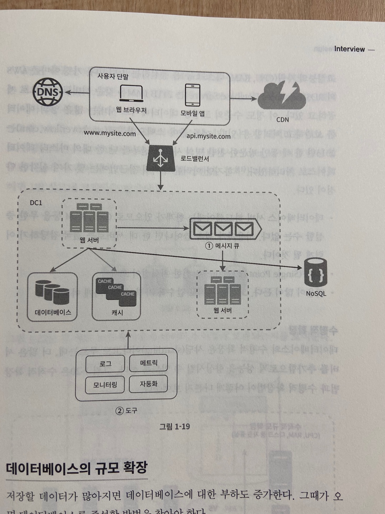

## 데이터베이스의 규모 확장

### 수직적 확장

- 기존 서버에 고성능 자원을 증설하는 방법
- 하드웨어는 한계가 있음
- SPOF로 인한 위험성이 큼
- 비용이 많이듦. 고성능일수록 비싸짐

### 수평적 확장

- 수평적 확장 -> 샤딩
- 샤딩은 대규모 데이터베이스를 샤드라고 부르는 작은 단위로 분할하는 기술을 일컬음
- 모든 샤드는 같은 스키마를 쓰지만 샤드에 보관되는 데이터 사이에는 중복이 없음
- 샤딩 전략을 구현할 때 가장 중요한 것은 샤딩 키를 어떻게 정하느냐임. 여러 샤드에 데이터를 고르게 분할하는게 가장 중요함 
- 샤딩을 도입하면서 생기는 문제들
  - 데이터의 재 샤딩
    - 데이터가 너무 많아져서 하나의 샤드로 더이상 감당하기 어려울 때
    - 샤드간 데이터 분포가 균등하지 못하여 특정 샤드만 공간소모가 심할때
    - 샤드 키를 계산하는 함수를 변경하고 데이터를 재배치해야됨
  - celebrity 문제
    - 핫스팟키 문제
    - 특정 샤드에 질의가 집중되어 서버에 과부하가 걸리는 문제
  - 조인과 비정규화
    - 여러 사드에 걸친 데이터를 조인하기 힘들어짐.
    - db를 비정규화하여 하나의 테이블에서 질의가 수행될 수 있도록 하는 것

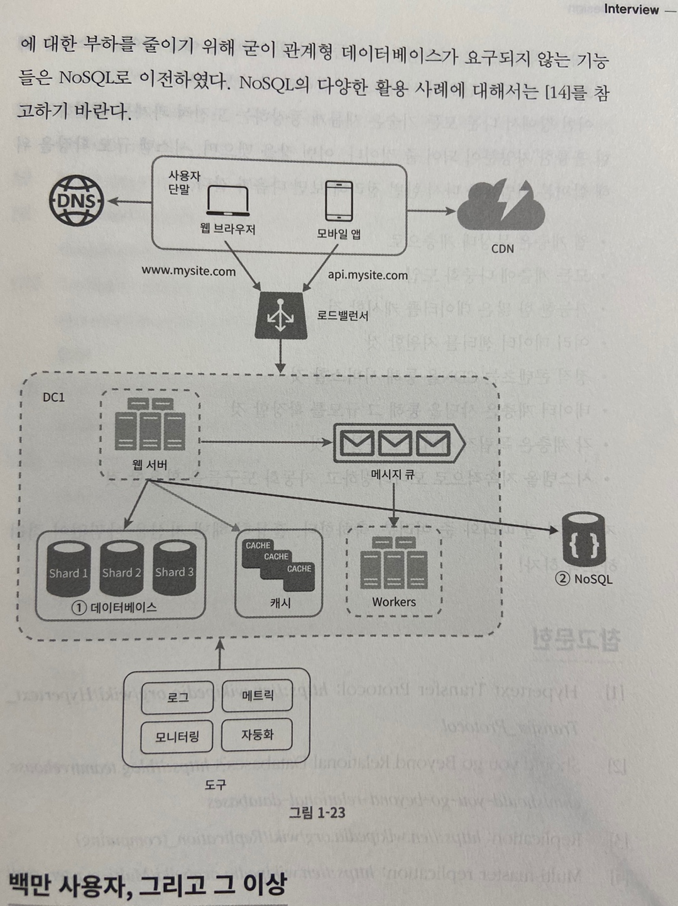

## 백만 사용자, 그리고 그 이상

- 시스템의 규모를 확장하는 것은 지속적이고 반복적인 과정
- 더 커진다면 시스템을 최적화하고 더 작은 단위의 서비스로 분할해야할 수도 있음
- 시스템 규모 확장을 위해 살펴본 기법들
  - 웹 계층은 무상태 계층으로
  - 모든 계층에 다중화 도입
  - 가능한 한 많은 데이터를 캐시할 것
  - 여러 데이터 센터를 지원할 것
  - 정적 콘텐츠는 cdn을 통해 서비스할 것
  - 데이터 계층은 샤딩을 통해 그 규모를 확장할 것
  - 각 계층은 독립적 서비스로 분할할 것
  - 시스템을 지속적으로 모니터링하고 자동화 도구들을 활용할 것

# #2 개략적인 규모 추정

- 개략적인 규모 추정은 보편적으로 통용되는 성능 수치상에서 사고실험을 행하여 추정치를 계산하는 행위로서 어떤 설계 요구사항에 부합할 것인지 보기 위한 것 - jeff dean, google senior fellow

## 2의 제곱수

- 분산 시스템에서 다루는 데이터 양은 엄청나게 커질 수 있으나 그 계산법은 기본을 크게 벗어나지 않음
- 제대로된 계산 방법을 얻으려면 데이터 볼륨의 단위를 2의 제곱수로 표현하면 어떻게되는지 알아야함

| 2의 x제곱 | 근사치 | 이름        | 축약형 |
| --------- | ------ | ----------- | ------ |
| 10        | 1천    | 1킬로바이트 | 1KB    |
| 20        | 1백만  | 1메가바이트 | 1MB    |
| 30        | 10억   | 1기가바이트 | 1GB    |
| 40        | 1조    | 1테라바이트 | 1TB    |
| 50        | 1000조 | 1페타바이트 | 1PB    |

## 모든 프로그래머가 알아야 하는 응답지연 값

| 연산명                                         | 시간                  |
| ---------------------------------------------- | --------------------- |
| L1캐시 참조                                    | 0.5ns                 |
| 분기 예측 오류                                 | 5ns                   |
| L2캐시 참조                                    | 7ns                   |
| 뮤텍스 락/언락                                 | 100ns                 |
| 주 메모리 참조                                 | 100ns                 |
| Zippy로 1KB 압축                               | 10,000ns = 10us       |
| 1 Gbps 네트워크로 2KB 전송                     | 20,000ns = 10us       |
| 메모리에서 1MB 순차적으로 read                 | 250,000ns = 250us     |
| 같은 데이터 센터 내에서의 메시지 왕복 지연시간 | 500,000ns = 500us     |
| 디스크 탐색                                    | 10,000,000ns = 10ms   |
| 네트워크에서 1MB 순차적으로 read               | 10,000,000ns = 10ms   |
| 디스크에서 1MB 순차적으로 read                 | 30,000,000ns = 30ms   |
| 한 패킷의 CA로부터 네덜란드까지의 왕복시간     | 150,000,000ns = 150ms |

- 아래와 같은 결론
  - 메모리는 빠르지만 디스크는 아직도 느림
  - 디스크 탐색은 가능한 한 피할것
  - 단순한 압축 알고리즘은 빠르다
  - 데이터를 인터넷으로 전송하기 전에 가능하면 압축할 것
  - 데이터 센터는 보통 여러지역에 분산되어 있고 센터들 간에 데이터를 주고받는 데는 시간이 걸림 

## 가용성에 관계된 수치들

- 고가용성은 시스템이 오랜 시간 동안 지속적으로 중단 없이 운영될 수 있는 능력을 지칭하는 용어
- 100%은 단 한번도 중단된적이 없다는 것을 의미함. 대부분의 서비스는 99~100%
- 아마존, 구글, ms같은 사업자는 99%이상의 SLA(Service Level Agreement)를 제공함

## 예제: 트위터 QPS와 저장소 요구량 추정

- 연습용이기 때문에 트위터와는 연관이 하나도 없음
- 가정
  - 월간 능동 사용자는 3억명
  - 50%의 사용자가 트위터를 매일 사용함
  - 평균적으로 각 사용자는 매일 2건의 트윗을 올림
  - 미디어를 포함하는 트윗은 10%
  - 데이터는 5년간 보관
- QPS(Query Per Second) 추정치
  - 일간 능동 사용자 = 3억 x 50% = 1.5억명
  - QPS = 1.5억 x 2 트윗 / 24시간 / 3600초 = 약 3500
  - 최대 QPS = 2 x QPS = 약 7000
- 미디어 저장을 위한 저장소 요구량
  - 평균 트윗 크기
    - tweet_id에 64바이트
    - 텍스트에 140바이트
    - 미디어에 1MB
  - 미디어 저장소 요구량: 1.5억 x 2 x 10% x 1MB = 30TB/일
  - 5년간 미디어를 보관하기 위한 저장소 요구량 : 30TB x 365 x 5 = 약 55PB

## 팁

- 개략적인 규모 추정과 관계된 면접에서 가장 중요한 것은 문제를 플어나가는 절차
- 올바른 절차를 밟느냐가 결과를 내는 것 보다 중요함
- 면접자가 보고싶어하는 것은 해결능력
- 팁
  - 근사치를 활용한 계산: 계산 결과가 반드시 정확해야 할 필요가 없음. 반올림해도됨
  - 가정들은 적어둘것 나중에 살펴볼 수 있도록
  - 단위를 붙일것.
  - 많이 출제되는 개략적 규모 추정 문제는 QPS, 최대 QPS, 저장소 요구량, 캐시 요구량, 서버 수 등을 추정하는 것. 면접에 임하기 전에 이런 값들을 계산하는 연습을 미리 할 것

 
