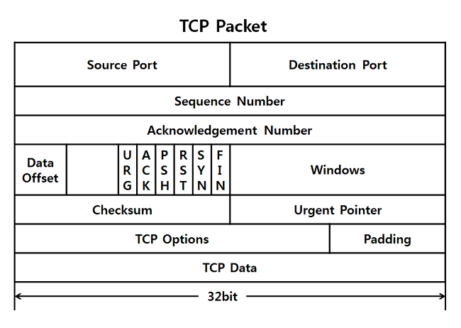
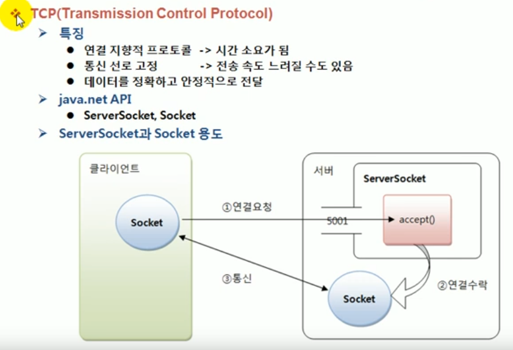
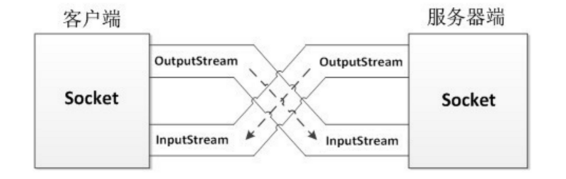

# 자바의 정석


스터디 자료 : https://github.com/Cr0ffle/Java-Basic


# #1 자바를 시작하기 전에

# #2 변수

# #3 연산자

#  #4 조건문과 반복문

- 때로는 같은 문장을 반복해서 수행하거나 조건에 따라 문장을 건너뛰어야함
- 프로그램의 흐름을 바꾸는 역할을 하는 문장들을 제어문이라고함
  - 조건문: 조건에 따라 다른 문장이 수행되도록 함
  - 반복문: 특정 문자들을 반복해서 수행함

## 조건문 - if, switch

- 조건문은 if문과 switch문이 있음
- 주로 if문이 사용되지만 많은 조건을 처리할 경우 switch문이 효율적임

### if문

- 가장 기본적인 조건문
- 만일 조건식이 true이면 괄호 안의 문장들을 수행하라 라는 의미로 해석하면 됨

```java
if (조건식) {
	// 조건식이 true일때 수행될 문장들을 적는다.
}
```

- 조건식의 결과가 false라면 괄호 안의 문장들이 실행되지 않음
- 비교연산자와 `&&` 또는  `||` 와 같은 논리 연산자로 여러 조건들을 추가할 수 있음
- 자바에서의 조건식 결과는 반드시 true 또는 false
- 조건문의 블록(괄호)에는 보통 여러 문장을 넣지만 한 문장만 있다면 괄호를 생략하고 한줄로 쓸 수 있음

```java
if(score < 60) println("합격")
```


### if-else문

- if문의 변형구조
- if문의 조건이 false라면 else 블럭의 문장을 수행함

```java
if (조건식) {
	// 조건식이 true일때 수행될 문장들을 적는다.
} else {
	// 조건식이 false일때 수행될 문장들을 적는다.
}
```

- if-else문은 true or false이기때문에 반드시 어느 한 블록은 실행되는 구조

### if-else if문

- true 또는 false이 아닌 처리해야할 경우의 수가 셋 이상인 경우엔 if - else - if 문을 사용하면 됨

```java
if (조건식1) {
	// 조건식1이 true일때 수행될 문장들을 적는다.
} else if (조건식2) {
	// 조건식2가 true일때 수행될 문장들을 적는다.
} else if (조건식n) {
  // 조건식n이 true일때 수행될 문장들을 적는다.
} else { // <- 맨 마지막 else는 생략 가능
  // 위의 어느 조건도 만족하지 않을 때 수행될 문장들을 적는다. 
}
```

### 중첩 if문

- if문의 블럭 내에 또 다른 if문을 포함시키는 것이 가능한데 이것을 중첩 if문이라 부름
- 중첩의 횟수는 거의 제한이 없음

```java
if (조건식1) {

	if (조건식2) {
		// 조건식1과 조건식2가 모두 true일때 수행될 문장들을 적는다.
  } else {
    // 조건식1이 true이고 조건식2가 false일때 수행될 문장들을 적는다.
  }

} else {
  // 조건식1이 false일 때 수행되는 문장들을 적는다.
}
```

- 중첩시에 괄호 생략 또는 들여쓰기에 주의해야함

### switch문

- if- else if  의 조건식이 많아지면 복잡해지고 여러 개의 조건식을 계산해야하므로 성능상 좋지 않음
- switch문은 단 하나의 조건식으로 많은 경우의 수를 처리할 수 있고 표현도 간결하므로 알아보기 쉬움
- 처리해야할 조건수의 수가 많다면 switch문이 좋음
- switch문 동작 방법
  - 조건식을 계산한다.
  - 조건식의 결과와 일치하는 case문으로 이동한다.
  - 이후의 문장들을 수행한다.
  - break문이나 switch문의 끝을 만나면 switch문 전체를 빠져나간다.

```java
switch (조건식) {
	case 값1 :
		//조건식의 결과가 값1과 같을 경우 수행될 문장들
		break;
	case 값2 :
		//조건식의 결과가 값2과 같을 경우 수행될 문장들
		break;
	default :
  	//조건식의 결과와 일치하는 case문이 없을 때 수행될 문장들
}
```

- break를 만나지 않으면 순서대로 모든 문장들을 수행하기 때문에 빼먹지 말아야하지만 경우에 따라서 고의적으로 break문을 생략하는 경우도 있음

```java
switch (level) {
	case 3 :
		//삭제권한
	case 2 :
		//쓰기권한
	case 1 :
		//읽기권한
}
```

- switch문의 제약 조건
  - switch 문의 조건식 결과는 정수 또는 문자열이어야함
  - case문의 값은 정수, 상수 또는 문자열만 가능하며, 중복되지 않아야함
- switch문 역시 중첩이 가능함


## 반복문 - for, while, do-while

- 반복문은 어떤 작업이 반복적으로 수행도되록 할 때 사용
- 반복문의 종류는 for문, while문, do - while문이 있음
- do - while문은 최소한 한번은 수행될 것이 보장되는 것이 특징
- 반복문은 주어진 조건을 만족하는 동안 블록안의 문장들을 반복적으로 수행함
- for문은 주로 반복 횟수를 알고 있을 때 사용함

### for문

- 반복 횟수를 알고 있을 때 적합함

```java
for (int i = 1; i <= 5; i ++) {
	//반복 내용
}

...

for (초기화;조건식;증감식) {
	//반복 내용
}
```

- for문의 구조와 실행 순서
  1. 초기화
  2. 조건식
  3. 수행될문장
  4. 증감식 (2번으로 반복)

- 조건식을 잘못 작성하면 블럭내의 문장이 한 번도 수행되지 않거나 무한반복에 빠지기 쉬우므로 주의해야함
- 초기화 또는 증감식에도 두문장을 하나로 연결해서 쓸 수 있음

```java
for (int i = 1, j = 5; i <= 5; i ++, j --) {
	//반복 내용
}
```

- 아래와 같이 초기화, 조건식, 증감식을 전부 제거하면 무한반복문이됨

```java
for (;;) {
	//반복 내용
}
```

- for문도 중첩이 가능함
- jdk1.5부터 배열과 컬렉션에 저장된 요소에 접근할 때 기존보다 편리한 방법으로 처리할 수 있도록 향상된 for문이 추가됨

```java
for (int value : arr) {
	//반복 내용
}

for (타입 변수명 : 배열 또는 컬렉션) {
	//반복 내용
}
```


### while문

- while문은 조건식이 true이고 조건식이 false가 될 때까지 블럭 내의 문장을 반복함

```java
while (조건식) {
	//반복 내용
}
```

- 초기화나 증감식이 필요하지 않은 경우라면 while문이 적합함
- while문의 무한반복, 무한 반복문은 반드시 특정 조건을 만족하면 벗어나도록 해야 함

```
while (true) {
	//반복 내용
}
```

### do-while문

- while문의 변형으로 기본적인 구조는 while문과 같으나 조건식과 블럭의 순서를 바꿔놓은것

```
do {
	//반복 내용
} while (조건식);
```

- do 블록을 최소한 한번은 실행을 보장함

### break문

- break문은 자신이 포함된 가장 가까운 반복문을 벗어남
- 주로 if문과 함꼐 사용되어 특정 조건을 만족하면 반복문을 벗어나도록 함

```java
while (true) {
	//반복 내용
	if(조건식) {
		break;
	}
}
```


### continue문

- 반복이 진행되는 도중애 continue문을 만나면 다음 반복으로 넘어감
- continue문은 반복문 전체를 벗어나지 않고 다음 반복을 계속 수행한다는 점이 break문과 다름
- 주로 if문과 함꼐 사용되어 특정 조건을 만족하면 다음 반복으로 넘어가도록 사용함

```java
while (true) {
	//반복 내용
	if(조건식) {
		continue;
	}
}
```


### 이름 붙은 반복문

- break문은 근접한 단 하나의 반복문만 벗어날 수 있기 때문에, 여러 개의 반복문이 중첩된 경우에는 break문으로 중첩 반복문을 완전히 벗어날 수 없음
- 반복문에 이름을 붙이고 break문과 continue문에 이름을 지정해줌으로써 하나 이상의 반복문을 벗어나거나 반복을 건너 뛸 수 있음

```java
loop : for (int i = 1; i <= 5; i ++) {
  for (int j = 1; j <= 5; j ++) {
		if (조건식) {
			break loop;
			continue loop;
		}
  }
}
```


# #5 배열

# #6 객체지향 프로그래밍 1

# #7 객체지향 프로그래밍 2


# #8 예외처리(Exception Handling)

## 예외처리(Exception Handling)

### 프로그램 오류

- 프로그램이 실행 중 어떤 원인에 의해서 오작동을 하거나 비정상적으로 종료되는 경우가 있음
- 이를 발생 시점에 따라 컴파일에러와 런타임에러로 나눌 수 있음 + 논리적에러 (물건의 재고가 음수)
  - 컴파일 에러 : 컴파일 시에 발생하는 에러
  - 런타임 에러 : 실행 시에 발생하는 에러
  - 논리적 에러 : 실행은 되지만, 의도와 다르게 동작하는 것
- 자바에서는 런타임에서 발생할 수 있는 프로그램 오류를 Error(에러)와 Exception(예외) 두가지로 구분했음
- Error는 OOM이나 StackOverFlowError와 같이 일단 발생하면 복구할 수 없는 심각한 오류
- Exception은 발생하더라도 수습될 수 있는 비교적 덜 심각한 것
- Error가 발생하면 프로그램의 비정상적인 종료를 막을 길이 없지만 예외는 발생하더라도 프로그래머가 이에 대한 적절한 코드를 미리 작성해 놓음으로써 프로그램의 비정상적인 종료를 막을 수 있음
  - Error: 프로그램 코드에 의해서 수습될 수 없는 심각한 오류
  - Exception: 프로그램 코드에 의해서 수습될 수 있는 다소 미약한 오류

### 예외 클래스의 계층구조


- RuntimeException하위 클래스들은 프로그래머의 실수에 의해서 발생될 수 있는 예외들로 자바의 프로그래밍 요소들과 관계가 깊음 ex: ArrayIndexOutOfBoundsException, NPE, etc...

### 예외 처리하기 try-catch문

- 예외처리란 프로그램 실행 시 발생할 수 있는 예기치 못한 예외의 발생에 대비한 코드를 작성하는 것임
- 예외처리의 목적은 예외의 발생으로 인한 실행 중인 갑작스런 비정상 종료를 막고, 정상적인 실행 상태를 유지할 수 있도록 하는 것
- 발생한 예외를 처리하지 못하면 프로그램은 비정상적으로 종료되고 처리되지 못한 예외는 jvm의 예외처리기(UncaughtExceptionHandler)가 받아서 예외의 원인을 화면에 출력함

> UncaughtExceptionHandler는 기본적으로 스택 트레이스를 프린트함 기본 구현체는 ThreadGroup 클래스
>
> ```java
> /**
>  * Called by the Java Virtual Machine when a thread in this
>  * thread group stops because of an uncaught exception, and the thread
>  * does not have a specific {@link Thread.UncaughtExceptionHandler}
>  * installed.
>  */
>     public void uncaughtException(Thread t, Throwable e) {
>         if (parent != null) {
>             parent.uncaughtException(t, e);
>         } else {
>             Thread.UncaughtExceptionHandler ueh =
>                 Thread.getDefaultUncaughtExceptionHandler();
>             if (ueh != null) {
>                 ueh.uncaughtException(t, e);
>             } else if (!(e instanceof ThreadDeath)) {
>                 System.err.print("Exception in thread \""
>                                  + t.getName() + "\" ");
>                 e.printStackTrace(System.err);
>             }
>         }
>     }
> ```
>
> setDefaultUncaughtExceptionHandler()로 커스텀 UncaughtExceptionHandler을 thread에 셋팅할 수 있음
>
> Thread.setDefaultUncaughtExceptionHandler()
>
> ```java
> public static void setDefaultUncaughtExceptionHandler(UncaughtExceptionHandler eh) {
>     SecurityManager sm = System.getSecurityManager();
>     if (sm != null) {
>         sm.checkPermission(
>             new RuntimePermission("setDefaultUncaughtExceptionHandler")
>                 );
>     }
> 
>      defaultUncaughtExceptionHandler = eh;
>  }
> ```

- 예외를 처리하기 위해서는 try-catch문을 사용함

```java
try {
	// 예외가 발생할 가능성이 있는 문장들을 넣음
} catch (Exception1 e1) {
	// Exception1이 발생했을 경우 이를 처리하기 위한 문장을 넣음
} catch (Exception2 e2) {
  // Exception2이 발생했을 경우 이를 처리하기 위한 문장을 넣음
}
```

- 하나의 try 블럭과 n개의 catch 블럭이 올 수 있음
- 이 중 발생한 예외의 종류와 일치하는 단 한개의 catch 블럭만 수행됨
- 발생한 예외의 종류와 일치하는 catch블럭이 없으면 예외는 처리되지 않음
- 여러개의 catch문에 참조변수명은 겹치면 안됨

### try-catch문에서의 흐름

- try 블럭 내에서 예외가 발생한 경우.
  - 발생한 예외와 일치하는 catch블럭이 있는지 확인함
  - 일치하는 catch 블럭을 찾게 되면, 그 catch 블럭 내의 문장들을 수행하고 전체 try-catch문을 빠져나가서 그 다음 문장을 계속해서 수행함. 만일 일치하는 catch 블럭을 찾지 못하면 예외는 처리되지 못함
- try 블럭 내에서 예외가 발생하지 않은 경우.
  - catch블럭을 거치지 않고 try-catch문을 빠져나가서 수행을 계속함
- try 블럭에 포함시킬 코드의 범위를 잘 선택해야함

### 예외의 발생과 catch 블럭

- 예외가 발생하면 발생한 예외에 해당하는 클래스의 인스턴스가 만들어짐
- 첫번째 catch 블록부터 차례대로 내려가면서 catch에 선언된 예외와 생성된 예외 클래스의 인스턴스에 instanceof연산자를 이용해서 검사 결과가 true인 catch 블록을 만날때까지 하향식으로 검사함
- 검사 결과가 전부 false라면 예외는 처리되지 않음
- 모든 예외 클래스는 Exception 클래스의 자손이므로 catch 블럭의 괄호에 Exception 클래스 타입의 참조 변수를 선언해 놓으면 어떤 종류의 예외가 발생하더라도 catch 가능
- 예외가 발생했을 때 생성되는 예외 클래스의 인스턴스에는 발생한 예외에 대한 정보가 담겨 있음 
  - getMessage() : 발생한 예외클래스의 인스턴스에 저장된 메시지를 얻을 수 있음
  - printStackTrace() : 예외발생 당시 호출스택에 있었던 메서드의 정보와 예외 메시지를 화면에 출력

- jdk 1.7부터 다음과 같이 멀티 catch블럭을 사용할 수 있음

```java
try {

} catch (ExceptionA | ExceptionB e) {
	e.printStackTrace();
}
```

- | 기호로 연결된 예외 클래스가 조상-자손관계라면 컴파일에러 발생
- 멀티 catch에서의 특정 ExceptionA.methodA는 호출 불가( instaceof로 한번 묶으면 사용 가능 ), e 변수는 final

### 예외 발생시키기

- 키워드 throw를 사용해서 프로그래머가 고의로 예외를 발생시킬 수 있음

```java
Exception e = new Exception();
throw e;
```

- 컴파일러가 예외처리를 확인하지 않은 RuntimeException 클래스들은 Unchecked 예외라하고 컴파일러가 예외처리를 확인한다면Checked Exception 예외라고함

### 메서드에 예외 선언하기

- 예외를 처리하는 또다른 방법으로 throws를 사용할 수 있음

```java
void method() thorws Exception1, Exception2, ... ExceptionN {

}
```

- 발생할 수 있는 예외를 적어두면 메서드를 사용하려는 사람이 메서드의 선언부를 보았을 때, 어떤 예외들이 처리되어야하는지 쉽게 알 수 있음
- 일반적으로 RuntimeException 클래스들은 적지 않음
- throws는 자신을 호출한 메서드에게 예외를 전달하는 것 어디선가는 try-catch로 예외를 처리해야함
- 맨 마지막에 있는 main메서드에서도 예외가 처리되지 않으면 프로그램이 종료됨

### finally블럭

- finally 블럭은 예외의 발생 여부에 상관 없이 실행되어야 할 코드를 포함시킬 목적으로 사용됨(optional)

```java
try {
	// 예외가 발생할 가능성이 있는 문장들을 넣음
} catch (Exception e){
	// 예외 처리를 위한 문장을 적음
} finally {
	// 예외의 발생여부에 관계없이 항상 수행되어야하는 문장들을 넣음
}
```


> finally를 사용하는 Main클래스와 bytecode
>
> ```java
> public class Main {
> 
>     public static void main(String[] args) {
> 
>         try {
>             throw new RuntimeException();
>         } catch (Exception e) {
>             e.printStackTrace();
>         } finally {
>             System.out.println("finally");
>         }
>     }
> }
> ```
>
> ```
>  0 new #7 <java/lang/RuntimeException>
>  3 dup
>  4 invokespecial #9 <java/lang/RuntimeException.<init> : ()V>
>  7 athrow
>  8 astore_1
>  9 aload_1
> 10 invokevirtual #12 <java/lang/Exception.printStackTrace : ()V>
> 13 getstatic #15 <java/lang/System.out : Ljava/io/PrintStream;>
> 16 ldc #21 <finally>
> 18 invokevirtual #23 <java/io/PrintStream.println : (Ljava/lang/String;)V>
> 21 goto 35 (+14)
> 24 astore_2
> 25 getstatic #15 <java/lang/System.out : Ljava/io/PrintStream;>
> 28 ldc #21 <finally>
> 30 invokevirtual #23 <java/io/PrintStream.println : (Ljava/lang/String;)V>
> 33 aload_2
> 34 athrow
> 35 return
> 
> ```


### 자동 자원 반환 -try-with-resources문

- 주로 입출력에 사용되는 클래스 중에서는 사용한 후에 꼭 닫아줘야하는것들이 있는데 이때 try-with-resources를 사용하면 됨

```java
//일반 try-catch-finally

try {
  FileInputStream fis = new FileInputStream("data.dat")
  DataInputStream dis = new DataInputStream(fis)
} catch (Exception e) {
	
} finally {
  try {
    if(dis != null) {
      dis.close();
    }
  } catch (IOException ie) {
    
  }
}


//try-with-resources
try(FileInputStream fis = new FileInputStream("data.dat");
    DataInputStream dis = new DataInputStream("data.dat")) {

} catch (Exception e) {

}
```

- try-with-resources를 사용하면 자동으로 close()가 호출됨
- try-with-resources에의해 자동으로 객체의 close()가 호출될 수 있으려면 클래스가 AutoCloseable이라는 인터페이스를 구현한 것이어야만 함
- close() 내부에서 예외가 발생했다면 supressed(억제된) 이라는 의미의 머리말과 함께 출력됨


### 사용자정의 예외 만들기

- 프로그래머가 새로운 예외 클래스를 정의하여 사용할 수 있음

```java
class MyException extends Exception {
	MyException(String msg)() {
		super(msg);
	}
}
```

- unchecked예외 또는 checked예외를 상속받아 예외처리 여부를 선택하게 할 수 있음

### 예외 되던지기(exception re-throwing)

- 예외를 처리하고 인위적으로 다시 발생시킬 수 있음
- 이 방법은 하나의 예외에 대해서 예외가 발생한 메서드와 이를 호출한 메서드 양쪽 모두에서 처리해줘야 할 작업이 있을 때 사용됨

```java
class ExceptionEx {
	public static void main(String[] args) {
		try {
			method1();
		} catch (Exception e) {
		}
	}
	
	static void method1() throws Exception {
		try {
			throw new Exception();
		} else {
			throw e; //<= 예외 재발생
		}
	}
}
```

- 메서드 return 시그니처가 void가 아니라면 catch에서도 리턴을 해야하지만 예외 되던지기의 경우 return문을 대신할 수 있음.

  

### 연결된 예외(chained exception)

- 예외를 연결시켜서 한 예외가 다른 예외를 발생시킬수도 있음

```java
try {
	startInstall();
	copyFiles();
} catch (SpaceException e) {
	InstallException ie = new InstallException("설치중 예외 발생");
	ie.initCause(e);
	throw ie;
}
```

- 예외를 연결시키는 이유는 여러가지 예외를 하나의 큰 분류의 예외로 묶어서 다루기 위해서이고 checked예외를 한번 감싸서 unchecked예외로 던져서 예외처리를 선택적으로 하도록 할 수 있음


# #9 java.lang 패키지와 유용한 클래스

# #10 날짜와 시간 & 형식화

# #11 컬렉션 프레임웍

# #12 제네릭, 열거형, 애너테이션

## 제네릭스(Generics)

### 제네릭이란?

- 제네릭은 다양한 타입의 객체들을 다루는 메서드나 컬렉션 클래스에 컴파일 시의 타입 체크를 해주는 기능임
- 객체의 타입을 컴파일시에 체크하기 때문에 객체의 타입 안전성을 높이고 형변환의 번거로움이 줄어듦

### 제네릭 클래스의 선언

```java
class Box<T>
	T item;
	
	void setItem(T item) {
		this.item = item;
	}
	T getItem() {
		return item;
}
```

- 타입변수는 의미있게 사용하면됨 ex Key Value경우 <K, V>
- 기호의 종류만 다를 뿐 임의의 참조형 타입을 의미한다는 개념만 이해하면됨

> 제네릭을 사용하지 않았을 때의 List
>
> ```java
> List integers = Arrays.asList(1,2,3,4);
> for(Object number: numbers) {
>   Integer numberAsInteger = (Integer) number; //컬렉션의 요소를 꺼내올때마다 이런식으로 형변환이 필요했음
>   System.out.print(numberAsInteger.intValue() + “ “);
> }
> ```
>
> 제네릭이 도입된 이후 List
>
> ```java
> List<Integer> integers = Arrays.asList(1,2,3,4);
> for(Integer integer: integers) {
> 	System.out.print(integer + “ “); //형변환 없이 바로 사용
> }
> 
> ```

```java
Box<String> b = new Box<>();
b.setItem("ABS");

class Box<String> //제네릭 타입을 String으로 지정했을 때
	String item;
	
	void setItem(String item) {
		this.item = item;
	}
	String getItem() {
		return item;
}
```

- 제네릭이 도입되기 이전의 코드와 호환을 위해 제네릭 클래스이지만 예전 방식으로 객체를 생성하는 것이 허용됨
- 제네릭클래스에 타입을 지정하지 않을 수 있지만 컴파일러가 경고를 표시함
- 추가적으로 제네릭클래스에 타입을 지정하지 않으면 T 타입은 Object 타입으로 사용됨 따라서 실제 사용시에 형변환해줘야함

```java
Box b = new Box(); //T는 Object로 간주
b.setItem("ABS"); //경고 unchecked or unsafe operation
b.setItem(new Object()); //경고 unchecked or unsafe operation

Box<Object> b = new Box<>();
b.setItem("ABS"); //경고 발생 안함 
b.setItem(new Object()); //경고 발생 안함
```

- 타입 매개변수에 타입을 지정하는 것을 '제네릭 타입 호출'이라하고 지정된 타입을  '매개변수화된 타입' 이라함

```java
Box<T> //제네릭 클래스. T의 Box or T Box
T      //타입 변수 또는 타입 매개변수
Box    //원시 타입
```

- `Box<String>`과 `Box<Integer>` 는 서로 다른 타입 변수를 가진 같은 클래스임


- 모든 객체에 동일하게 동작해야하는 static 멤버 타입에는 T 변수를 사용할 수 없음 그 이유는 모든 클래스에게 동일하게 제공되어야하지만 이 T 변수는 런타임에 확정되기 때문에 불가능함

```java
class Box<T> {
	static T item; //에러
  static int compare(T t1, T t2) {...} //에러
}
```

- 제네릭 배열 타입의 참조변수를 선언하는 것은 가능하지만 new T[10]와 같은 형태로 배열을 생성하는 것은 안됨 new는 컴파일 시점에 타입T가 뭔지 정확히 알아야하기 때문.

```java
class Box<T> {
	T[] item; //가능
	T[] toArray() {
    T[] tmpArr = new T[itemArr.length]; //에러
  }	
}
```

- 반드시 제네릭 배열을 생성해야할 필요가 있을 경우 리플렉션의 newInstance()와 같이 동적으로 객체를 생성하는 메서드로 배열을 생성하거나 Object 배열을 생성해서 복사한 다음에 T[]로 형변환하는 방법을 사용

> 제네릭 배열 사용하기
>
> ```java
> private List<E> elements;
> 
> public MyStack(Class<E> clazz, int capacity) {
>     elements = (E[]) Array.newInstance(clazz, capacity);
> }
> ```
>
> 사실 배열을 사용하지 않고 Collection 사용하는게 맞음

- 위와 같은 맥락으로 instanceof 연산자도 T타입을 피연산자로 사용할 수 없음


### 제네릭 클래스의 객체 생성과 사용

- 참조변수와 생성자에 대입된 타입이 일치해야함

```java
Box<Apple> appleBox = new Box<Apple>();
Box<Apple> appleBox = new Box<Grape>(); // 에러

Box<Fruit> fruitBox = new Box<Grape>(); // Fruit의 자손이 Grape여도 불가능
```

- 아래와 같이 제네릭 클래스 타입이 상속 관계에 있고 대입된 타입이 같은 것은 괜찮음

```java
Box<Apple> appleBox = new FruitBox<Apple>();
```

- jdk 7부터 추정이 가능한 경우 타입을 생략 가능

```java
Box<Apple> appleBox = new Box<>();
```

- `Box<T>`에 item을 추가할때는 T타입과 다른 타입의 객체는 추가할 수 없음

```java
Box<Apple> appleBox = new Box<>();

appleBox.add(new Aaple()); // OK
appleBox.add(new Grape()); // 에러

```

- 그러나 선언된 타입T에 자손들은 추가될 수 있음 

```java
Box<Fruit> fruitBox = new Box<>();

fruitBox.add(new Aaple()); // Fruit의 자손 Apple
fruitBox.add(new Grape()); // Fruit의 자손 Grape
```


### 제한된 제네릭 클래스

- 다음과 같이 제네릭 타입에 `extends` 를 사용하면 특정 타입의 자손들만 대입할 수 있게 제한할 수 있음

```java  
class FruitBox<T extneds Fruit> { //Fruit의 자손만 타입으로 지정 가능
	ArrayList<T> list = new ArrayList<T>();
}
```

- 인터페이스더라도 `extends` 키워드를 사용함
- 다중 바운드타입은 아래와같이 `&` 로 묶을 수 있음

```java
class FruitBox<T extends Fruit & Eatable> { ... }
```

### 와일드카드

- 와일드카드가 필요한 경우

```java
class FruitBox<T extends Fruit> extends Box<T> {}


class Juicer {
	static Juice makeJuice(FruitBox<Grape> box) {
		for(Grape g : box.getList()) {
			//do something .. 
		}
	}
}

FruitBox<Grape> grapeBox = new FruitBox<Grape>();
FruitBox<Apple> appleBox = new FruitBox<Apple>();

Juicer.makeJuice(grapeBox);
Juicer.makeJuice(appleBox); //에러, makeJuice()의 파라미터 타입이 FruitBox<Grape>이라 불가능


class Juicer {
	static Juice makeJuice(FruitBox<Grape> box) {
		for(Grape f : box.getList()) {
			//do something .. 
		}
	}
  
  static Juice makeJuice(FruitBox<Apple> box) { //파라미터 타입이 FruitBox<Apple> 인 메서드를 생성해줘야함
		for(Apple f : box.getList()) {
			//do something .. 
		}
	}
}


```

- 제네릭 타입은 컴파일러가 컴파일할때만 사용하고 제거해버리기 때문에 제네릭타입이 다른것만으로 오버로딩이 성립되지 않음 따라서 메서드 중복으로 인한 컴파일 에러

- 이런 경우에 와일드카드 `?` 를 사용하면 됨
  - `<? extends T>` 와일드 카드의 상한 제한(upper bound). T와 그 자손들만 가능
  - `<? super T>` 와일드 카드의 하한 제한(lower bound). T와 그 조상들만 가능
  - `<?>` 제한 없음. 모든 타입이 가능함 `<? extends Object>` 와 동일함

```java
class Juicer {
	static Juice makeJuice(FruitBox<? extends Fruit> box) {
		for(Fruit f : box.getList()) {
			//do something .. 
		}
	}
}

FruitBox<Grape> grapeBox = new FruitBox<Fruit>();
FruitBox<Apple> appleBox = new FruitBox<Apple>();

Juicer.makeJuice(grapeBox);
Juicer.makeJuice(appleBox);
```

- Collections.sort() 메서드

```java
public static <T> void sort(List<T> list, Comparator<? super T> c) {
  list.sort(c);
}
```


### 제네릭 메서드

- 메서드의 선언부에 제네릭 타입이 선언된 메서드를 제네릭 메서드라함.

```java
public static <T> void sort(List<T> list, Comparator<? super T> c) {
  list.sort(c);
}
```

- 제네릭 클래스에 정의된 타입 매개변수와 제네릭 메서드에 정의된 타입 매개변수는 전혀 별개의 것임. 같은 타입 문자 T를 사용해도 같은 것이 아니라는것에 주의해야함

```java
class FruitBox<T> {
	static <T> void sort(List<T> list, Comparator<? super T> c) {
		
	}
}
```

- static 멤버에는 제네릭을 사용할 수 없지만 메서드에는 제네릭 타입을 선언하고 사용하는 것이 가능함 

> 어떻게 정적메서드에 제네릭 타입을 사용할 수 있을까?
>
> ...

- 메서드에 선언된 제네릭 타입은 지역 변수를 선언한 것과 같다고 생각하면 이해하기 쉬움

```java
class Juicer {
	static Juice makeJuice(FruitBox<? extends Fruit> box) {
		for(Fruit f : box.getList()) {
			//do something .. 
		}
	}
}

//제네릭 메서드
class Juicer {
	static <T extends Fruit> Juice makeJuice(FruitBox<T> box) {
		for(Fruit f : box.getList()) {
			//do something .. 
		}
	}
}


FruitBox<Fruit> fruitBox = new FruitBox<Fruit>();
FruitBox<Apple> appleBox = new FruitBox<Apple>();

Juicer.<Fruit>makeJuice(fruitBox);
Juicer.<Apple>makeJuice(appleBox);

//대부분의 경우 컴파일러가 타입을 추정해서 아래와 같이 생략된 형태로 사용 가능
Juicer.makeJuice(fruitBox);
Juicer.makeJuice(appleBox);


```

> - 제네릭 메서드를 반드시 사용해야 하는 경우
>
> ```java
> static void fromArrayToCollection(Object[] a, Collection<?> c) {
>     for (Object o : a) { 
>         c.add(o); // compile-time error
>     }
> }
> 
> static <T> void fromArrayToCollection(T[] a, Collection<T> c) {
>     for (T o : a) {
>         c.add(o); // Correct
>     }
> }
> ```


- 제네릭 메서드 호출시 대입된 타입 생략이 불가능할 경우 아래와 같이 참조변수나 클래스 이름을 생략할 수 없음

```java
<Fruit>makeJuice(fruitBox); // 에러. 클래스 이름 생략 불가
this.<Fruit>makeJuice(fruitBox); // 가능
Juicer.<Fruit>makeJuice(fruitBox); // 가능
```

> - 제네릭 메서드 호출시 대입된 타입이 생략이 불가능한 경우는 어떤때일까? 
>
> ...

- 제네릭 메서드는 매개변수의 타입이 복잡할 때도 유용하게 사용이 가능함 
- Collections.sort 메서드

```java
public static <T extends Comparable<? super T>> void sort(List<T> list) {
	list.sort(null);
}
```

- 타입 T를 요소로하는 List를 매개변수로 허용
- T는 Comparable을 구현한 클래스이어야 하고 T또는 그 조상의 타입을 비교하는  Comparable 이어야 한다는 것을 의미함
- 만일  T가 Student이고 Person과 조상관계라면 `<? super T>`는  Student, Person, Object가 모두 가능함


- 제네릭 타입과 원시 타입간의 형변환

```java
Box box = null;
Box<Object> objBox = null;

box = (Box) objBox; //제네릭타입 -> 원시타입 형변환 가능, 컴파일 경고 발생
objBox = (Box<Object>) box; //원시타입 -> 제네릭타입 형변환 가능, 컴파일 경고 발생

```

- 서로다른 제네릭타입간의 형변환

```java
Box<Object> objbox = null;
Box<String> strBox = null;

objBox = (Box<Object>) strBox; //컴파일 에러
strBox = (Box<String>) objbox; //컴파일 에러

```

- 와일드카드를 쓴 제네릭 타입간의 형변환

```java
Box<? extends Object> wBox = new Box<String>(); //가능
```

- Optional의 형변환 사례

```java
public final class Optional<T> {
    
  	//Optional<?>는 Optional<? extends Object>
    private static final Optional<?> EMPTY = new Optional<>(null);
  
    public static<T> Optional<T> empty() {
        @SuppressWarnings("unchecked")
        Optional<T> t = (Optional<T>) EMPTY;
        return t;
    }
  
}
```

- 만약 `EMPTY`가 `Optional<Object>` 타입이었다면 `<T>` 타입으로 형변환이 불가능함

```java
Optional<?> wopt = new Optional<Object>();
Optional<Object> oopt = new Optional<Object>();

Optional<String> sopt = (Optional<String>) wopt //OK
Optional<String> sopt = (Optional<String>) oopt //에러
```

- `Optional<Object>` 을 `Optional<String>` 으로 직접 형변환하는 것은 불가능하지만 와일드카드가 포함된 제네릭 타입으로 형변환하면 가능함

```java
Optional<Object> -> Optional<T> //형변환 불가능
Optional<Object> -> Optional<?> -> Optional<T> //형변환 가능
```

### 제네릭 타입의 제거

- 컴파일러는 제네릭 타입을 이용해서 소스파일을 체크하고 필요한 곳에 형변환을 넣어줌 그리고 제네릭 타입을 제거함
- 컴파일된 파일에는 제네릭 타입에 대한 정보가 없음
- 이렇게 하는 주된 이유는 제네릭이 도입되기 이전의 소스 코드와의 호환성을 유지하기 위해서임
- 제네릭 타입 제거 과정
  1. 제네릭 타입의 bound 제거
     - 제네릭 타입이 `<T extends Fruit>` 라면 T는 Fruit으로 치환, `<T>` 인경우는 T는 Object로 치환
  2. 제네릭 타입을 제거한 후에 타입이 일치하지 않으면 형변환을 추가함


> - Invariance
>
> 기본적으로 자바의 generic은 Invariance, 무공변. 아래의 자바 코드는 문법상의 오류가 없지만
>
> ```java
> Double numDouble = 1.1;
> Number number = numDouble;
> System.out.println(number);
> ```
>
> 아래와 같은 코드는 컴파일 에러가 발생함
>
> ```java
> List<Double> doubles = Arrays.asList(1.1, 2.2, 3.3);
> List<Number> numbers = doubles; // compile error
> ```
>
> `List<Double>` 가 `List<Number>` 의 자손이 아니기 때문임.
>
> 클래스의 상속 관계가 제네릭에서는 상속관계로 유지되지 않는 것을 무공변이라고함 제네릭은 컴파일타임에 타입이 지워지기 때문에 컴파일 이후에는 제네릭의 타입을 알 수 없음
>
> - Covariance
>
> 클래스의 상속 관계가 Generics에서도 유지되는 것을 Covariance, 공변이라고함 Covariance 설정은  `<? extends ParentClass>` 처럼 입력하면됨
>
> ```java
> List<Double> doubles = Arrays.asList(1.1, 2.2, 3.3);
> List<? extends Number> numbers = doubles; //형변환이 가능함
> ```
>
> Covariance를 이용하여 객체를 할당하면, 객체를 read할 수 있지만 write는 어려움
>
> ```java
> List<? extends Number> numbers = new ArrayList<Double>(); // ok
> 
> Number number = numbers.get(0);
> numbers.add(1.1); // compile error
> ```
>
> `get()`은 Number 또는 Number의 하위 타입인 것을 보장하기 때문에 get()은 문법상의 오류가 없음.
>
> `add()`는 타입이 Double인지, Integer 인지 명확하게 정해져있지 않아 사용할 수 없음
>
> ```java
> // compile error, List<>의 타입이 Double인지 알 수 없음
> numbers.add(1.1);
> // compile error, List<>의 타입이 Integer인지 알 수 없음
> numbers.add(1);
> // compile error, List<>의 타입이 Long인지 알 수 없음
> numbers.add(1L);
> ```
>
> - Contravariance
>
> Contravariance는 반공변. 공변과 비슷하지만 공변과 반대로 동작함.
>
> Contravariance는 `<? super ParentClass>` 로 설정할 수 있음
>
> Contravariance를 사용하면 객체에 write할 수 있지만 read는 불가능함
>
> ```java
> List<? super Double> list = new ArrayList<Number>();
> 
> Double number = list.get(0); // compile error
> list.add(new Double(4));
> ```
>
> get()은 `<? super Double>` 타입을 Double인지, Number인지, Object인지 컴파일러가 추론할 수 없기 때문에 컴파일오류가 발생하고 `add()`의 경우는 `<? super Double>` 로 타입을 한정시켜놨기 때문에 가능함
>
> 추가적으로 배열은 기본적으로 공변임 따라서 아래 코드는 오류가 없음
>
> ```java
> Number[] numbers = newNumber[3];
> numbers[0] = newInteger(10);
> numbers[1] = newDouble(3.14);
> numbers[2] = newByte(0);
> ```
>
> - [https://codechacha.com/ko/java-covariance-and-contravariance/](https://codechacha.com/ko/java-covariance-and-contravariance/)
> - [https://dzone.com/articles/covariance-and-contravariance](https://dzone.com/articles/covariance-and-contravariance)


## 열거형(enums)

### 열거형이란?

- 열거형은 서로 관련된 상수를 편리하게 선언하기 위한 것으로 여러 상수를 정의할 때 사용하면 유용함
- jdk1.5부터 추가
- 자바의 열거형은 c언어의 열거형보다 더 향상된 것으로 열거형이 갖는 값뿐만 아니라 타입도 관리하기 떄문에 보다 논리적인 오류를 줄일 수 있음
- C언어에서는 타입이 달라도 값이 같으면 조건식 결과가 true이었으나 자바의 열걸형은 타입에 안전한 열거형이라서 실제 값이 같아도 타입이 다르면 컴파일 에러가 발생함
- 상수의 값이 바뀌면 해당 상수를 참조하는 모든 소스를 다시 컴파일해야 하지만 열거형 상수를 사용하면 기존의 소스를 다시 컴파일하지 않아도됨

> 상수를 참조하는 클라이언트는 해당 상수의 참조값을 복사하기때문에 상수의 값이 바뀌면 해당 상수를 참조하는 모든 소스를 다시 컴파일 해야 함. https://stackoverflow.com/questions/17592584/enum-requires-no-recompilation-of-its-clients-how


### 열거형의 정의와 사용

- 다음과 같이 열거형을 정의함

```java
enum 열거형이름 {
	상수명1, 상수명2 ... 
}
```

- 사용방법은 열거형이름.상수명1, 열거형이름.상수명2 형태로 사용함
- 열거형 상수간의 비교에는 `==` 사용이 가능함 but 비교연산자는 불가능. 하지만 compareTo()는 비교연산자도 사용이 가능함
- switch문에도 사용할 수 있지만 case문에 열거형의 이름은 적지 않고 상수의 이름만 적어야 한다는 제약이 있음.

```java
switch (d) {
  case EAST :
  case WEST :
  case SOUTH :
  case NORTH :
}
```


- 열거형에 정의된 모든 상수를 출력하려면 다음과 같이 사용하면 됨

```java
Direction[] dArr = Direction.values();

for(Direction d : dArr) {
	...
}
```


- enum의 기타 메서드

| 메서드                                      | 설명                                                     |
| ------------------------------------------- | -------------------------------------------------------- |
| Class\<E\> getDeclaringClass()              | 얼거형의 Class 객체를 반환한다                           |
| String name()                               | 열거형 상수의 이름을 문자열로 반환한다                   |
| int ordinal()                               | 열거형 상수가 정의된 순서를 반환한다 (0부터 시작)        |
| T valueOf(Class\<T\> enumType, String name) | 지정된 열거형에서 name과 일치하는 열거형 상수를 반환한다 |

- 이외에도 컴파일러가 자동으로 추가해주는 메서드들

| 메서드                        | 설명                                                         |
| ----------------------------- | ------------------------------------------------------------ |
| static E values()             | 열거형의 모든 상수를 배열에 담아 반환한다                    |
| static E valueOf(String name) | 열거형 상수의 이름으로 문자열 상수에 대한 참조를 얻을 수 있게 해준다. |


### 열거형에 멤버 추가하기

- Enum클래스에 정의된 ordinal()이 열거형 상수가 정의된 순서를 반환하지만, 이 값을 열거형 상수의 값으로 사용하지 않는 것이 좋음

> - ordinal()을 사용하지 말아야하는 이유
>
> ordinal()에 의존하는 클라이언트들은 enum의 상수의 순서가 변경됨에 따라 논리가 깨질수 있기 때문에 ordinal()을 사용하지 않는게 좋음.
>
> 대부분의 프로그래머는 이 메서드를 쓸 일이 없음 이 메서드는 EnumSet과 EnumMap 같이 열거 타입 기반의 범용 자료구조에 쓸 목적으로 설계되었음
>
> [https://johngrib.github.io/wiki/java-enum/#ordinal-%EB%A9%94%EC%84%9C%EB%93%9C%EC%9D%98-%EC%82%AC%EC%9A%A9](https://johngrib.github.io/wiki/java-enum/#ordinal-%EB%A9%94%EC%84%9C%EB%93%9C%EC%9D%98-%EC%82%AC%EC%9A%A9)

- 열거형 상수의 값을 열거형 상수 이름 옆에 괄호()안에 넣어주면됨

```java
enum Direction {
	EAST(1), SOUTH(5), WEST(-1), NORTH(10);
  
  private final int value;
  Direction(int value) {this.value = value;}
  
}
```

- 지정된 값을 저장할 수 있는 인스턴스 변수와 생성자를 새로 추가해주어야함
- 열거형의 객체를 생성할수는 없음. 기본적으로 열거형의 생성자는 제어자가 묵시적으로 private임

> - 열거형의 생성자가 private인 이유
>
> 생성자가 public이면 의도하지 않은 값 이외의 상수들 선언될 수 있기 때문. 그리고 enum에 선언된 모든 상수값들은 static하게 접근이 가능하기 때문에 인스턴스를 생성할 이유가 없음
>
> [https://www.geeksforgeeks.org/why-enum-class-can-have-a-private-constructor-only-in-java/](https://www.geeksforgeeks.org/why-enum-class-can-have-a-private-constructor-only-in-java/)

- 필요에따라 열거형 상수에 여러 값을 지정할 수 있지만 그에 맞게 인스턴스 변수와 생성자 등을 새로 추가해주어야함
- 열거형에 추상 메서드를 선언하면 각 열거형 상수가 이추상 메서드를 반드시 구현해야함

```java
public class Main {

    public static void main(String[] args) {

        int distance = 10;
        System.out.println("bus = " + Transportation.BUS.calcFare(distance));
        System.out.println("train = " + Transportation.TRAIN.calcFare(distance));
        System.out.println("ship = " + Transportation.SHIP.calcFare(distance));
        System.out.println("airPlane = " + Transportation.AIRPLANE.calcFare(distance));

    }
}

enum Transportation {
    BUS(100) {
        int calcFare(int distance) {
            return distance * fare;
        }
    },
    TRAIN(150) {
        int calcFare(int distance) {
            return distance * fare;
        }
    },
    SHIP(100) {
        int calcFare(int distance) {
            return distance * fare;
        }
    }, AIRPLANE(300) {
        int calcFare(int distance) {
            return distance * fare;
        }
    };

    protected final int fare;

    Transportation(final int fare) {
        this.fare = fare;
    }

    abstract int calcFare(final int distance);
}
```

```
bus = 1000
train = 1500
ship = 1000
airPlane = 3000
```


### 열거형의 이해

```java
enum Diriection {EAST, SOUTH, WEST, NORTH}
```

- 열거형 상수 하나하나가 Direction 객체임
- 위 문장을 클래스로 정의하면 다음과 같음

```java
class Direction {
	static final Direction EAST = new Direction("EAST");
	static final Direction SOUTH = new Direction("SOUTH");
	static final Direction WEST = new Direction("WEST");
	static final Direction NORTH = new Direction("NORTH");

  private String name;
  
  private Direction(String name) {
    this.name = name;
  }
}
```

- Direction 클래스의 static 상수의 값은 객체의 주소이고 이 값은 바뀌지 않는 값이기때문에 `==`로 비교가 가능한 것
- 모든 열거형은 추상 클래스 Enum의 자손이기때문에 Enum을 흉내내어 MyEnum을 작성하면 다음과 같음

```java
abstract class MyEnum<T extends MyEnum<T>> implements Comparable<T> {
  static int id = 0;
  
  int ordinal;
  String name = "";
  
  public int ordinal() {return ordinal};
  
  MyEnum(String name) {
    this.name = name;
    ordinal = id++;
  }
  public int compareTo(T t) {
    return ordinal - t.ordinal();
  }
  
}
```

- 모든 열거형은 암시적으로 Enum의 자손이고 Java는 다중상속이 불가능하기 때문에 열거형을 확장할 수 없음


## 애너테이션(annotation)

### 애너테이션이란?

- 애너테이션은 주석처럼 프로그래밍언어에 영향을 미치지 않으면서도 다른 프로그램에게 유용한 정보를 제공할 수 있다는 장점이 있음

```java
@Test
public void test() {
  ...
}
```

- `@Test`는 이 메서드를 테스트해야 한다는 것을 테스트 프로그램에게 알리는 역할만 할 뿐 메서드가 포함된 프로그램 자체에는 아무런 영향을 끼치지 않음

- jdk에서 제공하는 표준 애너테이션은 주로 컴파일러를 위한 것으로 컴파일러에게 유용한 정보를 제공함

### 표준 애너테이션

| 애너테이션           | 설명                                                    |
| -------------------- | ------------------------------------------------------- |
| @Override            | 컴팡일러에게 오버라이딩하는 메서드라는 것을 알림        |
| @Deprecated          | 앞으로 사용하지 않을 것을 권장하는 대상에 붙임          |
| @SuppressWarnings    | 컴파일러의 특정 경고 메시지가 나타나지 않게 해줌        |
| @SafeVarargs         | 제네릭스 타입의 가변 인자에 사용함 (jdk1.7)             |
| @FunctionalInterface | 함수형 인터페이스라는 것으 알림(jdk1.8)                 |
| @Native              | native메서드에서 참조되는 상수 앞에 붙임(jdk1.8)        |
| @Target*             | 애너테이션이 적용가능한 대상을 지정하는데 사용함        |
| @Documented*         | 애너테이션 정보가 javadoc으로 작성된 문서에 포함되게 함 |
| @Inherited*          | 애너테이션이 자손 클래스에 상속되도록함                 |
| @Retention*          | 애너테이션이 유지되는 범위를 지정하는데 사용함          |
| @Repeatable*         | 애너테이션을 반복해서 적용할 수 있게 함(jdk1.8)         |

- `*` 이 붙은 애너테이션들은 새로운 애너테이션을 정의하는데 사용하는 메타애너테이션

**@Override**

- 오버라이딩할때는 상위 클래스의 메서드의 이름을 잘못 적는 경우가 있는데 `@Override`를 사용하면 그런 실수를 미연에 방지할 수 있음
- Optional

**@Deprecated**

- 하위호한성때문에 이미 배포된 jdk의 함수들은 함부로 삭제될 수 없음
- 따라서 `@Deprecated` 애너테이션을 붙임으로써 이 메서드를 사용하는 클라이언트들에게 더이상 사용하지 않을 것을 권하는 의미

**@FunctionalInterface**

- 함수형 인터페이스를 선언할 때 이 애너테이션을 붙이면 컴파일러가 함수형 인터페이스를 올바르게 선언했는지 확인하고 잘못된 경우 에러를 발생시킴
- 필수는 아니지만 실수를 방지할 수 있음
- 함수형 인터페이스는 추상 메서드가 하나뿐이어야하는 제약이 있음

**@SuppressWarnings**

- 컴파일러가 보여주는 경고 메시지가 나타나지 않게 억제해줌
- 주로사용되는 부분에는 deprecatioin, unchcked, rwatypes, varargs

> effective java item27 참고
>
> - `@SuppressWarnings` 은 가장 작은 단위로만 처리해야함
> - `@SuppressWarnings` 애너테이션을 사용할 때면 그 경고를 무시해도 안전한 이유를 항상 주석으로 남겨야 함

**@SafeVarargs**

- 어떤 타입들은 컴파일 이후 제거되는데 컴파일 후에도 제거되지 않는 타입을 reifiable타입이라고하고 제거되는 타입을 non-refiable타입이라고 함. 제네릭 타입들은 대부분 컴파일 시에 제거되기 때문에 non-refiable타입임
- 메서드에 선언된 가변인자타입이 non-reifiable타입일 경우 해당 메서드를 선언하는 부분과 호출하는 부분에서 unchcked경고가 발생함 
- 해당 코드에 문제가 없다면 경고를 억제하기 위해 `@SafeVarargs` 를 사용해야함
- 이 애너테이션은 static이나 final이 붙은 메서드와 생성자에만 붙일 수 있음. 오버라이드될 수 있는 메서드에는 사용 불가능

> - static 메서드는 오버라이드 될까?
>
> 재정의는 클래스의 인스턴스가 있는지에 따라 다름. 정적 메서드는 클래스의 인스턴스와 연결되지 않기 때문에 불가능
>
> [https://stackoverflow.com/questions/2223386/why-doesnt-java-allow-overriding-of-static-methods](https://stackoverflow.com/questions/2223386/why-doesnt-java-allow-overriding-of-static-methods)

- Arrays.asList 메서드 

```java
    @SafeVarargs
    @SuppressWarnings("varargs")
    public static <T> List<T> asList(T... a) {
        return new ArrayList<>(a);
    }
```

- 메서드가 가변인자인 동시에 제네릭타입임
- 메서드에 선언된 타입 T는 컴파일 과정에서 Object로 바뀜 Object[]
- Object[]에는 모든 타입이 들어올 수 있으므로 컴파일러가 경고를 내는것
- 그러나 실제로 asList()는 제네릭 메서드이기때문에 컴파일러가 T 타입을 체크해서 타입 T가 아닌 다른 타입이 들어올 수 있는 경우가 없음
- 이럴때 사용하는 것이 `@SafeVarargs` 
- `@SuppressWarnings("varargs")` 을 같이 붙이는 이유는 메서드 선언부외에도 메서드 호출되는 부분의 경고를 제거하기 위함임
- 따라서 일반적으로  `@SafeVarargs` 와 `@SuppressWarnings("varargs")` 을 같이 사용하는 것이 좋음


### 메타 애너테이션

- 메타에너테이션은 애너테이션에 붙이는 애너테이션
- 애너테이션을 새롭게 정의할 때 애너테이션의 적용 대상이나 유지 기간등을 지정하는 데 사용함

**@Target**

-  애너테이션이 적용 가능한 대상을 지정하는데 사용함

```java
@Target({TYPE, FIELD, METHOD, PARAMETER, CONSTRUCTOR, LOCAL_VARIABLE, MODULE})
@Retention(RetentionPolicy.SOURCE)
public @interface SuppressWarnings {
    String[] value();
}

```

- java.laong.annotation.ElementType에 정의된 값들


| 대상 타입       | 의미                            |
| --------------- | ------------------------------- |
| ANNOTATION_TYPE | 애너테이션                      |
| CONSTRUCTOR     | 생성자                          |
| FIELD           | 필드(멤버변수, enum 상수)       |
| LOCAL_VARIABLE  | 지역변수                        |
| METHOD          | 메서드                          |
| PACKAGE         | 패키지                          |
| PARAMETER       | 매개변수                        |
| TYPE            | 타입(클래스, 인터페이스, enum)  |
| TYPE_PARAMETER  | 타입 매개변수(jdk1.8)           |
| TYPE_USE        | 타입이 사용되는 모든 곳(jdk1.8) |


**@Retention**

- 애너테이션이 유지되는 기간을 지정하는데 사용됨


| 유지 정책 | 의미                                                |
| --------- | --------------------------------------------------- |
| SOURCE    | 소스 파일에만 존재. 클래스파일에서는 존재하지 않음. |
| CLASS     | 클래스 파일에 존재. 실행시에 사용 불가. 기본값      |
| RUNTIME   | 클래스 파일에 존재. 실행시에 사용 가능              |

- 컴파일러가 사용하는 유지정책은 `SOURCE`. 컴파일러를 직접 작성하는 것이 아니라면 이 유지정책은 필요 없음
- 유지정책을 `RUNTIME` 으로 하면 실행시에 리플렉션을 통해 클래스파일에 저장된 애너테이션의 정보를 읽어서 처리할 수 있음
- 유지정책을 `CLASS` 로 하면 클래스 파일이 JVM에 로딩될 때 애너테이션의 정보가 무시되어 런타임에 애너테이션에 대한 정보를 얻을 수 없음 따라서 잘 사용되지 않음


**@Documented**

- 애너테이션에 대한 정보가 javadoc으로 작성한 문서에 포함되도록 함
- 자바에서 제공하는 기본 애너테이션 중에 `@Ovveride`, `@SuppressWarnings` 를 제외하고는 모두 이 메타 애너테이션이 붙어 있음


**@Inherited**

- 애너테이션이 자손 클래스에 상속되도록 함
- 이 애너테이션이 붙은 애너테이션을 조상 클래스에 붙이면 자손 클래스도 이 애너테이션이 붙은 것과 같이 인식됨


**@Repeatable**

- 보통은 하나의 대상에 한 종류의 애너테이션을 붙이지만 이 `@Repeatable` 이 붙은 애너테이션은 여러번 붙일 수 있음
- 일반적인 애너테이션과 달리 같은 이름의 애너테이션이 여러 개가 하나의 대상에 적용될 수 있기 때문에 이 애너테이션들을 하나로 묶어서 다룰 수 있는 애너테이션도 추가로 정의해야함

```java
@interface Todos { //<-- 컨테이너 애너테이션
	Todo[] value(); //Todo 애너테이션 배열타입의 요소를 선언. 이름이 반드시 value이어야함
}

@Repeatable(Todos.class) //<-- 컨테이너 애너테이션
@interface Todo {
  String value();
}

@Todo("delete test codes.")
@Todo("ovveride inherited method.")
class MyClass 
  ...
}
```


**@Native**

- 네이티브 메서드에 참조되는 상수필드에 붙이는 애너테이션

```java
public final class Long extends Number implements Comparable<Long> {
    /**
     * A constant holding the minimum value a {@code long} can
     * have, -2<sup>63</sup>.
     */
    @Native public static final long MIN_VALUE = 0x8000000000000000L;

    /**
     * A constant holding the maximum value a {@code long} can
     * have, 2<sup>63</sup>-1.
     */
    @Native public static final long MAX_VALUE = 0x7fffffffffffffffL;
}
```

- 네이티브 메서드는 jvm이 설치된 OS의 메서드를 의미함
- 네이티브 메서드는 보통 c언어로 작성되어 있고 자바에서는 메서드의 선언부만 정의하고 구현하지 않음
- 자바에 정의된 네이티브 메서드와 OS의 메서드를 연결해주는 작업은 JNI(Java Native Interface)가 함

### 애너테이션 타입 정의하기

- 새로운 애너테이션을 정의하는 방법

```java
@interface 애너테이션이름 {
	타입 요소이름();
}
```

- 애너테이션 내에 선언된 메서드를 애너테이션의 요소라고함

```java
@interface TestInfo {
  int count();
  String testedBy();
  String[] testTools();
  TestType testType(); // enum TestType {FRIST, FINAL}
  DateTime testDate(); // 자신이 아닌 다른 애너테이션을 포함할 수 있음
}

@interface DateTime {
  String yymmdd();
  String hhmmss();
}
```


- 애너테이션의 요소는 반환값이 있고 매개변수는 없는 추상 메서드의 형태, 상속을 통해 구현하지 않아도됨
- 다만 애너테이션을 적용할 때 이 요소들의 값을빠짐 없이 지정해주어야함
- 애너테이션의 요소는 기본값을 가질 수 있음
- 애너테이션 요소가 오직 하나뿐이고 이름이 value인 경우 애너테이션을 적용할 때 요소의 이름을 생략하고 값만 적어도됨
- 요소 타입이 배열인 경우 괄호를 사용해서 여러 개의 값을 지정할 수 있음
- 모든 애너테이션의 조상은 java.lang.annotation.Annotation 임
- java.lang.annotation.Annotation은 상속이 불가능하고 아래와 같이 인터페이스 타입임

```java
public interface Annotation {
  boolean equals(Object obj);
  int hashCode();
  String toString();
  
  Class<? extends Annotation> annotationType(); // 애너테이션 타입 반환
}
```

- 모든 애너테이션의 조상이기때문에 java.lang.annotation.Annotation에 선언된 메서드들은 모든 애너테이션에서 사용 가능함
- 값을 정의하지 않은 경우 Maker Annotation이라고함. ex `@Test`, `@Override`
- 애너테이션의 요소를 선언할 때 반드시 지켜야 할 규칙
  - 요소 타입은 기본형, String, enum, 애너테이션, Class만 허용됨.
  - ()안에 매개변수를 선언할 수 없음
  - 예외를 선언할 수 없음
  - 요소를 타입 매개변수로 정의할 수 없음
- 클래스 객체가 가지고 있는 getAnnotations()라는 메서드로 모든 애너테이션을 배열로 받아 올 수 있음


# #13 스레드

# #14 람다와 스트림 

# #15 입출력(I/O)

# #16 네트워킹(Networking)

## 네트워킹(Networking)

- 네트워킹이란 두 대 이상의 컴퓨터를 케이블로 연결하여 네트워크를 구성하는 것을 말함
- 네트워킹의 개념은 컴퓨터들을 서로 연결하여 데이터를 손쉽게 주고받거나 같은 주변 기기를 함께 공유하고자 하는 노력에서 시작되었음
- 초기의 네트워크는 몇 대의 컴퓨터로 구성되었으나 현재는 인터넷이라는 거대한 네트워크를 구성하고 있음
- 자바에서 제공하는 java.net 패키지를 사용하면 이러한 네트워크 앱의 데이터 통신 부분을 쉽게 작성할 수 있음

### 클라이언트/서버(client/server)

-  클라이언트/서버는 컴퓨터간의 관계를 역할로 구분하는 개념
   - 서버: 서비스를 제공하는 주체
     - 파일서버, 메일서버 등등
   - 클라이언트: 서비스를 사용하는 주체
     - 웹브라우저 등등
-  네트워크를 구성할 때 전용서버를 두는 것을 서버 기반 모델이라하고 별도의 전용 서버 없이 각 클라이언트가 서버 역할을 동시에 수행하는 것을 P2P모델이라함

| 서버 기반 모델 server-based model  | P2P 모델 peer-to-peer model             |
| ---------------------------------- | --------------------------------------- |
| 안정적인 서비스의 제공이 가능함    | 서버 구축 및 운용 비용을 절감할 수 있음 |
| 공유 데이터의 관리와 보안이 용이함 | 자원의 활용을 극대화할 수 있음          |
| 서버구축비용과 관리 비용이 듦      | 자원의 관리가 어려움                    |
|                                    | 보안이 취약함                           |


### IP주소(IP address)

- IP주소는 컴퓨터를 구별하는데 사용되는 고유한 값으로 인터넷에 연결된 모든 컴퓨터는 IP주소를 가짐
- IP주소는 4byte(32bit)의 정수로 구성되어 있고 xxx.xxx.xxx.xxx 형태로 `.` 을 구분자로 0~255 사이의 정수를 가질 수 있음
- IP주소와 서브넷 마스크를 비트연산자 `&`으로 연산하면 ip 주소에서 네트워크 주소만을 뽑아낼 수 있음
  - 11000000 10101000 00001010 01100100 (192.168.10.100) 
  - 11111111 11111111 11111111 00000000 (255.255.255.0)
  - 11000000 10101000 00001010 00000000 (192.168.10.0) <- 네트워크주소는 24bit, 호스트 주소는 마지막 8bit
  - 호스트 주소의 자리수가 8자리이기 때문에 256(2^8)개의 호스트만 이 네트워크에 포함될 수 있음
  - 호스트주소가 0인것은 네트워크 자신을 나타내고, 255는 브로드캐스트 주소로 사용되기 때문에 실제 사용 개수는 254개

> IPv6
>
> - 인터넷은 32bit의 IPv4 체계를 사용했으나 32bit라는 제한된 주소 공간때문에 인터넷 발전에 문제가 있을것이라고 예상되어 이에 대한 대안으로써 IPv6가 등장함
> - IPv6특징
>   - IP 주소의 확장 : IPv4의 기존 32 비트 주소공간에서 벗어나, IPv6는 128 비트 주소공간을 제공한다.
>   - 호스트 주소 자동 설정 : IPv6 호스트는 IPv6 네트워크에 접속하는 순간 자동적으로 네트워크 주소를 부여받는다. 이는 네트워크 관리자로부터 IP 주소를 부여받아 수동으로 설정해야 했던 IPv4에 비해 중요한 이점이다.
>   - 패킷 크기 확장 : IPv4에서 패킷 크기는 64[킬로](https://ko.wikipedia.org/wiki/킬로)[바이트](https://ko.wikipedia.org/wiki/바이트)로 제한되어 있었다. IPv6의 [정보프로그램](https://ko.wikipedia.org/w/index.php?title=정보프로그램&action=edit&redlink=1) 옵션을 사용하면 특정 호스트 사이에는 임의로 큰 크기의 패킷을 주고받을 수 있도록 제한이 없어지게 된다. 따라서 대역폭이 넓은 네트워크를 더 효율적으로 사용할 수 있다.
>   - 효율적인 라우팅 : IP 패킷의 처리를 신속하게 할 수 있도록 고정크기의 단순한 헤더를 사용하는 동시에, 확장헤더를 통해 네트워크 기능에 대한 확장 및 옵션기능의 확장이 용이한 구조로 정의하였다.
>   - 플로 레이블링(Flow Labeling) : 플로 레이블(flow label) 개념을 도입, 특정 트래픽은 별도의 특별한 처리(실시간 통신 등)를 통해 높은 품질의 서비스를 제공할 수 있도록 한다.
>   - 인증 및 보안 기능 : 패킷 출처 인증과 데이터 무결성 및 비밀 보장 기능을 IP 프로토콜 체계에 반영하였다. IPv6 확장헤더를 통해 적용할 수 있다.
>   - 이동성 : IPv6 호스트는 네트워크의 물리적 위치에 제한받지 않고 같은 주소를 유지하면서도 자유롭게 이동할 수 있다. 이와 같은 모바일 IPv6는 RFC 3775와 RFC 3776에 기술되어 있다. (IPv4에도 모바일 IP가 정의되어 있지만 아직 많이 사용되지 않는다.)
>
> [https://ko.wikipedia.org/wiki/IPv6](https://ko.wikipedia.org/wiki/IPv6)
>
> 주소 부족 문제가 있어서  IPv6가 등장했지만 이미 NAT, CIDR와 같은 프로토콜로 잘 해결되고 있지 않을까? 라는 생각 ..

### InetAddress

- 자바에서는 IP주소를 다루기 위한 클래스로 InetAddress를 제공하며 다음과 같은 메서드가 정의되어 있음

| 메서드                                         | 설명                                                        |
| ---------------------------------------------- | ----------------------------------------------------------- |
| byte[] getAddress()                            | IP주소를 byte배열로 반환                                    |
| static InetAddress[] getAllByName(String host) | 도메인명에 지정된 모든 호스트의 IP주소를 배열에 담아 반환함 |
| static InetAddress getByAddress(byte[] addr)   | byte배열을 통해 ip주소를 얻음                               |
| static InetAddress getByName(String host)      | 도메인명을통해 ip주소를 얻음                                |
| String getCanonicalHostName()                  | FQDN(full qualified domain name)을 반환함                   |
| String getHostAddress()                        | 호스트의 ip 주소를 반환함                                   |
| String getHostName()                           | 호스트의 이름을 반환함                                      |
| static inetAddress getLocalHost()              | 지역 호스트의 ip 주소를 반환함                              |
| boolean isMulticastAddress()                   | ip주소가 멀티캐스트 주소인지 알려줌                         |
| boolean isLoopbackAddress()                    | ip주소가 loopback 주소인지 알려줌                           |


### URL(Uniform Resource Location)

- URL은 인터넷에 존재하는 여러 서버들이 제공하는 자원에 접근할 수 있는 주소를 표현하기 위한 것
- 프로토콜://호스트명:포트번호/경로명/파일명?쿼리스트링#참조의 형태로 이루어져있음
  - 프로토콜: 자원에 접근하기 위해 서버와 통신하는데 사용되는 통신 규약
  - 호스트명: 자원을 제공하는 서버의 이름
  - 포트번호: 통신에 사용되는 서버의 포트 번호
  - 경로명: 접근하려는 자원이 저장된 서버상의 위치
  - 파일명: 접근하려는 자원의 이름
  - 쿼리스트링: URL에서 ?이후의 부분
  - 참조: URL에서 #이후의 부분
- http://www.codechobo.com:80/sample/hello.html?referer=codechobo#index1
- 자바에서는 URL을 다루기 위한 클래스를 제공하고 여러가지 관련 메서드들을 제공함


### URLConnection

- URLConnection은 애플리케이션과 URL간의 통신 연결을 나타내는 클래스의 최상위 추상 클래스임
- URLConnection의 구현체는 HttpURLConnection, JarURLConnection이 있음
- URLConnection을 사용해서 연결하고자하는 자원에 접근하고 읽고 쓰기를 할 수 있음

> JarURLConnection
>
> - Jar파일에 대한 URL연결에 사용함
>
> ```java
>  URL url = new URL("jar:file:/home/duke/duke.jar!/");
>  JarURLConnection jarConnection = (JarURLConnection)url.openConnection();
>  Manifest manifest = jarConnection.getManifest();
> ```
>
> - Jar파일을 읽는것만 가능하고 수정하거나 쓰기위해 OutputStream을 가져올 수 없음
>
> - [https://docs.oracle.com/en/java/javase/11/docs/api/java.base/java/net/JarURLConnection.html](https://docs.oracle.com/en/java/javase/11/docs/api/java.base/java/net/JarURLConnection.html)


## 소켓 프로그래밍

- 소켓 프로그래밍은 소켓을 이용한 통신 프로그래밍을 뜻함
- 소켓이란 프로세스간의 통신에 사용되는 양쪽 끝단을 의미함
- 자바에서는 java.net 패키지를 통해 소켓 프로그래밍을 지원함 

### TCP와 UDP

| 항목        | TCP (Transmission Control Protocol)                          | UDP (User Datagram Protocol)                                 |
| ----------- | ------------------------------------------------------------ | ------------------------------------------------------------ |
| 연결방식    | 연결기반 (connection-oriented) <br />- 연결 후 통신<br />- 1:1 통신 방식 | 비연결기반(connectionless-oriented)<br />- 연결없이 통신<br />-1:1, 1:N, N:M 통신 방식 |
| 특징        | 데이터의 경계를 구분하지 않음(byte-stream)<br />신뢰성있는 데이터 전송<br />- 데이터의 전송 순서가 보장됨<br />- 데이터의 수신여부를 확인함 (데이터가 손실되면 재송신)<br />UDP보다 전송속도가 느림 | 데이터의 경계를 구분함 (datagram)<br />신뢰성 없는 데이터 전송 <br />- 데이터의 전송 순서가 바뀔 수 있음<br />- 데이터의 순서여부를 확인하지 않음 (데이터가 손실되어도 알 수 없음 )<br />TCP보다 전송속도가 빠름 |
| 관련 클래스 | Socket<br />ServerSocket                                     | DatagramSocket<br />DatagramPackaet<br />MulticastSocket     |

- TCP는 데이터를 전송하기 전에 먼저 상대편과 연결을 한 후에 데이터를 전송하며 잘 전송되었는지를 확인하고 전송에 실패했다면 해당 데이터를 재전송하기 때문에 신뢰 있는 데이터의 전송이 요구되는 통신에 적합함
- UDP는 상대편과 연결하지 않고 데이터를 전송하며, 데이터를 전송하지만 데이터가 바르게 수신되었는지 확인하지 않기 때문에 데이터가 전송되었는지 확인할 길이 없음. 또한 데이터를 보낸 순서대로 수신한다는 보장이 없음
- 속도상으로는 TCP보다 UDP가 빠름
- 데이터의 신뢰가 중요할때 TCP를 사용해야함 ex HTTP, SSH, FTP 등등
- 데이터의 속도가 중요할때 UDP를 사용해야함 ex IPTV, VoIP 등등

> - TCP와 UDP패킷 구조
>
> 
>
> - TCP 헤더 상세 정보
> - [https://ko.wikipedia.org/wiki/%EC%A0%84%EC%86%A1_%EC%A0%9C%EC%96%B4_%ED%94%84%EB%A1%9C%ED%86%A0%EC%BD%9C](https://ko.wikipedia.org/wiki/%EC%A0%84%EC%86%A1_%EC%A0%9C%EC%96%B4_%ED%94%84%EB%A1%9C%ED%86%A0%EC%BD%9C)
>
> 


### TCP소켓 프로그래밍

- TCP소켓 프로그래밍은 클라와 서버간의 일대일 통신
- 서버와 클라의 통신 과정
  1. 서버 프로그램에서는 서버 소켓을 사용해서 서버 컴퓨터의 특정 포트에서 클라이언트의 연결요청을 처리할 준비를 함
  2. 클라 프로그램은 접속할 서버의 ip주소와 포트 정보를 가지고 소켓을 생성해서 서버에 연결을 요청함
  3. 서버 소켓은 클라의 연결 요청을 받으면 서버에 새로운 소켓을 생성해서 클라의 소켓과 연결되도록 함
  4. 클라의 소켓과 새로 생성된 서버의 소켓은 서버소켓과 관계없이 일대일 통신을 함



- 서버소켓은 포트와 결합되어 포트를 통해 원격 사용자의 연결요청을 기다리다가 연경요청이 올 때마다 새로운 소켓을 생성하여 상대편 소켓과 통신할 수 있도록 연결함
- 실제적인 데이터 통신은 서버소켓과 관계 없이 소켓과 소켓간에 이루어짐
- 여러 개의 소켓이 하나의 포트를 공유해서 사용할 수 있지만 서버소켓은 포트를 독점함
- 포트는 0~65535개의 범위에 속하는 값이고 1023번 이하의 번호는 well known port 로 FTP나 Telnet 등에서 사용중이기 때문에 사용하지 않는 범위 내에서 사용해야함
- 소켓들이 데이터를 주고받는 연결 통로는 바로 입출력 스트림
- 소켓은 입력스트림, 출력스트림을 갖고 있고 이 스트림들은 연결된 상대편 소켓의 스트림과 교차 연결됨



- 자바에서는 TCP를 이용한 소켓프로그래밍을 위해 `Socket`과 `ServerSocket`클래스를 제공함
  - `Socket`
    - 프로세스간의 통신을 담당하고 InputStream, OutputStream을 갖고 있음
    - 이 두 스트림을 통해 프로세스간의 통신이 이루어짐
  - `ServerSocket`
    - 포트와 연결되어 외부의 연결요청을 기다리다 연결요청이 들어오면 Socket을 생성해서 소켓과 소켓간의 통신이 이루어지도록 함. 한 포트에 하나의 ServerSocket을 연결할 수 있음 (프로토콜이 다르면 같은 포트를 공유할 수 있음)

> - ServerSocket 내부 구현
>
> jdk15 기준으로 ServerSocket에서 사용하는 구현체는 NioSocketImpl을 사용함 아래는 NioSocketImpl 설명 ...
>
> NIO based SocketImpl. This implementation attempts to be compatible with legacy PlainSocketImpl, including behavior and exceptions that are not specified by SocketImpl. The underlying socket used by this SocketImpl is initially configured blocking. If the connect method is used to establish a connection with a timeout then the socket is configured non-blocking for the connect attempt, and then restored to blocking mode when the connection is established. If the accept or read methods are used with a timeout then the socket is configured non-blocking and is never restored. When in non-blocking mode, operations that don't complete immediately will poll the socket and preserve the semantics of blocking operations.
>
> NIO 기반 SocketImp. 이 구현은 SocketImp에서 지정하지 않은 동작 및 예외를 포함하여 레거시 PleanSocketImp와 호환되도록 시도합니다. 이 SocketImp에서 사용하는 기본 소켓은 처음에 blocking으로 구성됩니다. 연결 방법을 사용하여 시간 초과로 연결을 설정할 경우 연결 시도에 대해 non-blocking으로 구성된 소켓이 연결이 설정되면 blocking 모드로 복원됩니다. 허용 또는 읽기 메서드가 시간 초과와 함께 사용되는 경우 소켓이 non-blocking으로 구성되고 복원되지 않습니다. non-blocking 모드에서 즉시 완료되지 않은 작업은 소켓을 폴링하고 blocking 작업의 의미론을 보존합니다.
>
> [http://gunsdevlog.blogspot.com/2020/09/java-project-loom-reactive-streams.html](http://gunsdevlog.blogspot.com/2020/09/java-project-loom-reactive-streams.html)

- 서버에 접근하는 클라의 수가 많다면 스레드를 사용해서 클라의 요청을 병렬적으로 처리하는 것이 좋음
- 서버 프로그램

```java
import java.io.DataOutputStream;
import java.io.IOException;
import java.io.OutputStream;
import java.net.ServerSocket;
import java.net.Socket;

public class Main {

    public static void main(String[] args) throws IOException {

        ServerSocket serverSocket = new ServerSocket(7777); //연결 요청을 기다리는 SocketServer

        Socket socket = serverSocket.accept(); // 연결이 수립되면 socket객체를 가져옴 실제 연결에는 JNI사용

        OutputStream os = socket.getOutputStream();
        DataOutputStream dos = new DataOutputStream(os);

      	//outputStream을 사용해 client에게 데이터전송. 클라이언트는 InputStream을 통해 데이터를 받음
        dos.writeUTF("bla bla ... ");

        dos.close();
        socket.close();
    }
}
```

- 클라이언트 프로그램

```java
import java.io.DataInputStream;
import java.io.IOException;
import java.io.InputStream;
import java.net.Socket;

public class Client {

    public static void main(String[] args) throws IOException {
        Socket socket = new Socket("127.0.0.1", 7777); //서버 ip와 port를 사용해서 Socket객체를 가져옴

        InputStream is = socket.getInputStream();
        DataInputStream dis = new DataInputStream(is);

      	//InputStream을 통해 데이터를 받음
        System.out.println(dis.readUTF());

        dis.close();
        socket.close();
    }
}
```


> - TCP 3way handshake
>
> TCP는 연결지향형이기 때문에 모든 연결에 앞서 3way handshake라는 일련의 과정을 수행함
>
> 3way handshake는 양 쪽 모두 데이터를 전송할 준비가 되었다는 것을 보장하고 실제로 데이터 전달을 시작하기 전에 확인 작업을 함
>
> 
>
> 1. Client와 Server 둘다 Closed 상태에서 시작함
> 2. Server에서 Client의 요청을 받을 수 있는 상태가 되어야함 이때 서버는 `LISTEN` 상태
> 3. Client는 Server에게 접속 요청을 위한 `SYN` 패킷을 보냄 이때 의미없는 난수 `SYN` 넘버를 보냄 이때 Client는 `SYN_SENT` 상태
> 4. Server는 Client에게 `SYN` 패킷을 받고 Client가 보낸 `SYN` 넘버에 1을 더한 값과 Server에서도 의미없는 난수 `ACK` 넘버를 보내줌 이제 서버는 `SYN_RECEIVED` 상태
> 5. Client는 Server에게 `SYN+ACK`  패킷을 받고 Server가 보낸 `ACK` 넘버에 1을 더한 값을 보내줌
> 6. Client와 Server모두 연결이 수립된 상태 `ESTABLISHED` 가 됨
>
> 의미없는 난수는 서버가 요청을 제대로 받았는지에 대한 식별값으로 사용됨 만약 10을 보냈는데 11이 오지 않았다면 신뢰할 수 있는 클라이언트가 아님
>
> - SYN Flooding 공격
>
> 악의적인 Client가 처음 `SYN` 패킷을 보내고 서버는 `SYN+ACK` 패킷을 보냈지만 마지막 `ACK` 패킷을 보내지 않는다면 서버는  `SYN_RECEIVED` 상태로 대기함. 이런 요청이 많아질수록 서버의 리소스가 늘어나고 메모리가 바닥나서 정상적인 서비스가 불가능상태가 됨
>
> **SYN Flooding 공격을 막는 방법**
>
> - 백로그 큐 늘리기
> - Anti-DDoS 기능 사용하기
> - SYN Cookie 사용하기
> - SYN Proxy 사용하기
>
> [https://blog.naver.com/agerio100/221948546623](https://blog.naver.com/agerio100/221948546623)

> - TCP 4way handshake
>
> 연결을 해제할때도 TCP는 일련의 과정을 수행하는데 이것을 4way handshake라고 함
>
> 3way handshake에서 연결 요청은 Client만 가능했지만 4way handshake에서는 Client, Server 모두 연결 해제 요청을 할 수 있음. 
>
> 
>
> 
>
> 1. Client와 Server가 연결된 상태에서 시작함 (Client에서 연결 해제한다고 가정)
> 2. Client는 `close()`를 실행하고 Server에게 연결 해제를 위한 `FIN` 패킷을 보냄 이때 Client는 `FIN_WAIT1` 상태
> 3. Server는 Client의  `FIN` 패킷을 받고 응답 `ACK` 패킷을 보냄 이때 서버는 `CLOSE_WAIT` 상태
> 4. Client는 Server의 `ACK` 을 받고 `FIN_WAIT2` 상태로 변경
> 5. Server에서 Client에게 전송할 데이터가 없다고 판단하면 `close()` 를 실행하고 Client에게 연결 해제를 위한  `FIN` 패킷을 보냄 이때 Server는 `LAST_ACK` 상태
> 6. Client는 Server의 `FIN` 패킷을 받고 응답 `ACK` 패킷을 보냄 그리고 `TIME_WAIT` 상태로 들어가고 실질적인 종료 과정에 들어가게 됨 (MSL*2 시간만큼 대기)
> 7. Server는 Client의 `ACK` 패킷을 받고 `CLOSED` 상태가 됨
>
> CLOSE_WAIT과 TIME_WAIT에 대한 자세한 이야기
>
> [https://tech.kakao.com/2016/04/21/closewait-timewait/](https://tech.kakao.com/2016/04/21/closewait-timewait/)


### UDP소켓 프로그래밍

- UDP소켓 프로그래밍에서는 DatagramSocket과 DatagramPacket을 사용함
- UDP는 비연결지향형이기때문에 TCP에서 사용하던 ServerSocket에서처럼 연결하는 과정이 없음
- 서버 프로그램

```java
import java.io.IOException;
import java.net.DatagramPacket;
import java.net.DatagramSocket;
import java.net.InetAddress;

public class Main {

    public static void main(String[] args) throws IOException {

        DatagramSocket socket = new DatagramSocket(7777);
        DatagramPacket inPacket, outPacket;

        byte[] inMsg = new byte[10];

        while (true) {
            inPacket = new DatagramPacket(inMsg, inMsg.length);
            socket.receive(inPacket);

            InetAddress address = inPacket.getAddress();
            int port = inPacket.getPort();

            String str = "received";
            outPacket = new DatagramPacket(str.getBytes(), str.length(), address, port);

            socket.send(outPacket);
        }
    }
}
```

- 클라이언트 프로그램

```java
import java.io.IOException;
import java.net.DatagramPacket;
import java.net.DatagramSocket;
import java.net.InetAddress;

public class Client {

    public static void main(String[] args) throws IOException {

        DatagramSocket socket = new DatagramSocket();
        InetAddress address = InetAddress.getByName("127.0.0.1");

        byte[] msg = new byte[50];
        DatagramPacket outPacket = new DatagramPacket(msg, 1, address, 7777);
        DatagramPacket inPacket = new DatagramPacket(msg, msg.length);

        socket.send(outPacket);
        socket.receive(inPacket);

        System.out.println(new String(inPacket.getData()));
    }
}

```


