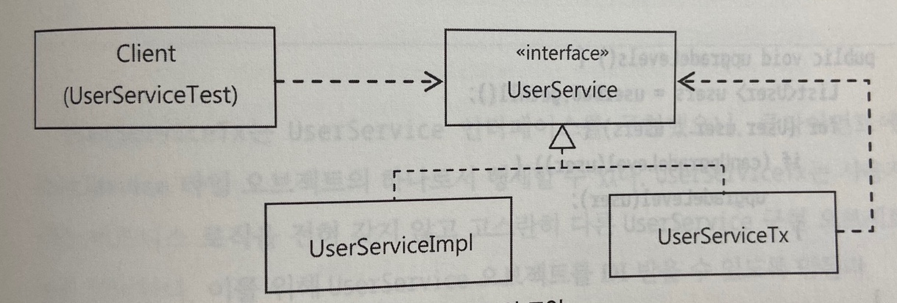

# 토비의 스프링 vol.1


# #1 오브젝트와 의존관계

## 초난감 DAO

## DAO의 분리

## DAO의 확장

## 제어의 역전

## 스프링의 IoC

## 싱글톤 레지스트리와 오브젝트 스코프

## 의존관계 주입

## XML을 이용한 설정

# #2 테스트

- 애플리케이션은 계속 변하고 복잡해져감 그 변화에 대응하는 두가지 전략
  - 확장과 변화를 고려한 객체지향적 설계와 그것을 효과적으로 담아낼 수 있는 IoC/DI 같은 기술
  - 만들어진 코드를 확신할 수 있게 해주고 변화에 유연하게 대처할 수 있는 자신감을 주는 테스트 기술
- 테스트는 스프링을 학습하는 데 있어 가장 효과적인 방법의 하나

## USERDAOTEST 다시 보기

### 테스트의 유용성

- 테스트란 결국 내가 예상하고 의도했던 대로 코드가 정확히 동작하는지를 확인해서 만든 코드를 확신할 수 있게 해주는 작업
- 테스트의 결과가 원하는 대로 나오지 않는 경우에는 코드나 설계에 결함이 있음을 알 수 있음 이를 통해 코드의 결함을 제거해가는 작업을 하고 최종적으로 테스트가 성공하면 모든 결함이 제거됐다는 확신을 얻을 수 있게 해줌

### UserDaoTest의 특징

```java
public class UserDaoTest {
	public static void main(String[] args) throws SQLException {
    ApplicationContext context = new GenericXmlApplicationContext("applicationContext.xml");
    
    UserDao dao = context.getBean("userDao", UserDao.class);
    User user = new User();
    user.setId("user");
    user.setName("백기선");
    user.setPassword("married");
    
    dao.add(user);
    
    System.out.println(user.getId() + " 등록 성공");
    
    User user2 = dao.get(user.getId());
    
    System.out.println(user2.getName());
    System.out.println(user2.getPassword());
    
    System.out.println(user2.getId() + " 조회 성공");
  }
}
```

- 이 테스트의 특징은 main() 메서드를 사용해서 쉽게 테스트할 수 있고 `UserDao`를 직접 호출한다는 점.


#### 웹을 통한 DAO 테스트 방법의 문제점

- 웹을 사용해서 테스트하는 경우 DAO뿐만 아니라 서비스, 컨트롤러 ,jsp 등등 모든 레이어의 기능을 다 만들고 나서야 테스트가 가능하다는 점이 가장 큰 문제임
- 테스트를 수행하는데 참여하는 코드와 클래스가 많아지기 때문에 디버깅하기 어려움

#### 작은 단위의 테스트

- 테스트하고자 하는 대상이 명확하다면 그 대상에만 집중해서 테스트하는 것이 바람직함
- 한꺼번에 너무 많은 것을 몰아서 테스트하면 테스트 수행 과정도 복잡해지고 오류가 발생했을 때 정확한 원인을 찾기가 힘들어짐
- 테스트는 가능하면 작은 단위로 쪼개고 집중해서 할 수 있어야 함
- 테스트의 관심사가 다르다면 테스트할 대상을 분리하고 집중해서 접근해야함
- 작은 단위의 코드에 대해 테스트를 수행한 것을 단위 테스트(unit test)라고 함
- 여기서 말하는 단위는 하나의 관심에 집중해서 효율적으로 테스트할 만한 범위의 단위라고 보면 됨
- 일반적으로 단위는 작을수록 좋음
- 단위를 넘어서는 다른 코드들은 신경 쓰지 않고 참여하지도 않고 테스트가 동작할 수 있어야함
- 길고 많은 단위가 참여하는 통합테스트도 언젠가는 필요함 하지만 단위테스트보다 통합테스트가 먼저 우선으로 되는 경우엔 문제의 원인을 찾기 어려울 수 있음
- 단위 테스트를 하는 이유는 개발자가 설계하고 만든 코드가 원래 의도한 대로 동작하는지를 개발자 스스로 빨리 확인받기 위해서임

#### 자동수행 테스트 코드

- `UserDaoTest`의 한가지 특징은 테스트할 데이터가 코드를 통해 제공되고, 테스트 작업 역시 코드를 통해 자동으로 실행한다는 점
- 테스트는 자동으로 수행되도록 코드로 만들어지는 것이 중요함
- 자동으로 수행되는 테스트의 장점은 자주 반복할 수 있다는 것
- 만들어둔 기능 테스트가 있다면 리팩토링, 수정을 안전하게 수행할 수 있음

#### 지속적인 개선과 점진적인 개발을 위한 테스트

- 테스트를 이용하면 새로운 기능도 기대한 대로 동작하는지 확인할 수 있을 뿐 아니라, 기존에 만들어뒀던 기능들이 새로운 기능을 추가하느라 수정한 코드에 영향을 받지 않고 여전히 잘 동작하는 지를 확인할 수 도 있음

### UserDaoTest의 문제점

**수동 확인 작업의 번거로움**

- 입력한 값과 가져온 값이 일치하는지 테스트에서 자동으로 확인해주지 않고 콘솔에 나온 값을 보고 등록 조회가 성공적으로 되고 있는지를 확인하는 건 사람의 책임
- 테스트의 결과를 확인하는 일은 사람의 책임이기 때문에 완전히 자동으로 테스트되는 방법이라고 말할 수 없음

**실행 작업의 번거로움**

- 테스트를 만들때마다 `main()`메서드를 생성할 수 없으므로 `main()`메서드를 이용하는 방법보다 좀 더 편리하고 체계적으로 테스트를 실행하고 그결과를 확인하는 방법이 필요함

## USERDAOTEST 개선

### 테스트 검증의 자동화

- 수정 전 테스트코드

```java
    System.out.println(user2.getName());
    System.out.println(user2.getPassword());
    System.out.println(user2.getId() + " 조회 성공");
```

- 수정 후 테스트코드

```java
		if (!user.getName().eqauls(user2.getName())) {
				System.out.println("테스트 실패 (name)")
		} else if (!user.getPassword().eqauls(user2.getPassword())) {
				System.out.println("테스트 실패 (password)")
		} else {
      	System.out.println("조회 테스트 성공")
    }
```

- `add()`는 별도로 검증하지 않고 `get()`을 검증함으로써 `add()`와 `get()`메서드를 동시에 검증
- 이 테스트는 추후 코드의 동작에 영향을 미칠 수 있는 어떤 변화라도 생기면 언제든 다시 실행시켜볼 수 있음
- "테스트란 개발자가 마음 편하게 잠자리에 들 수 있게 해주는 것" - 켄트백
- 개발과정, 유지보수를 하면서 기존 애플리케이션 코드에 수정을 할 때 마음의 평안을 얻고 자신이 만지는 코드에 대해 항상 자신감을 가질 수 있으며, 새로 도입한 기술의 적용에 문제가 없는지 확인할 수 있는 가장 좋은 방법은 빠르게 실행 가능하고 스스로 테스트 수행과 기대하는 결과에 대한 확인까지 해주는 코드로된 자동화된 테스트를 만들어주는 것


### 테스트의 효율적인 수행과 결과 관리

- `main()` 메서드로는 한계가 있음
- 일정한 패턴을 가진 테스트를 만들 수 있고, 테스트가 실패한 곳을 빠르게 찾을 수 있는 기능을 갖춘 테스트 지원 도구와 그에 맞는 테스트 작성 방법이 필요함
- JUnit은 자바로 단위 테스트를 만들 때 유용하게 사용할 수 있음

#### JUnit 테스트로 전환

- 개발자가 만든 클래스의 오브젝트를 생성하고 실행하는 일은 프레임워크에 의해 진행됨

#### 테스트 메서드 전환

- 기존에 만들었던 `main()` 메서드에 있던 테스트 코드를 일반 메서드로 옮기는 것
- 새로 만들 테스트 메서드는 JUnit 프레임워크가 요구하는 조건 두가지를 따라야함
  - ~~메서드가 public으로 선언되어야 함~~
  - 메서드가 private으로 선언되지 않아야함 [https://junit.org/junit5/docs/current/user-guide/#writing-tests-classes-and-methods](https://junit.org/junit5/docs/current/user-guide/#writing-tests-classes-and-methods)
  - 메서드에 `@Test` 애너테이션을 붙여줘야 함

```java
import org.junit.Test;

...

public class UserDaoTest {
  
	@Test //Junit에게 테스트용 메서드임을 알려줌
	public void addAndGet() throws SQLException {
    ...
  }
}

```


#### 검증 코드 전환

- `assertThat()` 메서드는 첫 번째 파라미터의 값을 뒤에 나오는 Matcher 라고 불리는 조건으로 비교해서 일치하면 다음으로 넘어가고 아니면 테스트가 실패하도록 만들어 줌
- `is()` 는 Matcher의 일종으로 `eqauls()` 로 비교해주는 기능을 가짐
- Junit은 예외가 발생하거나 `assertThat()` 에서 실패하지 않고 테스트 메서드의 실행이 완료되면 테스트가 성공했다고 인식함.
- Junit을 적용한 `UserDaoTest`

```java
import static org.hamcrest.CoreMatchers.is;
import static org.junit.Assert.assertThat;

...

public class UserDaoTest {

	@Test
	public void addAndGet() throws SQLException {
    
    ApplicationContext context = new GenericXmlApplicationContext("applicationContext.xml");
    
    UserDao dao = context.getBean("userDao", UserDao.class);
    User user = new User();
    user.setId("user");
    user.setName("백기선");
    user.setPassword("married");
    
    dao.add(user);

		User user2 = dao.get(user.getId());
    
		assertThat(user2.getName(), is(user.getName()));
		assertThat(user2.getPassword(), is(user.getPassword()));
	}
}
```


#### Junit 테스트 실행

- 생성한 JUnit 테스트코드도 어디선가는 실행시켜줘야하기 때문에 `main()` 메서드에 추가

```java
import org.junit.runner.JUnitCore;

...
  
public static void main(String[] args) {
  JUnitCore.main("springbook.user.dao.UserDaoTest");
}
```

- 성공할 경우 메시지

```
Jnit version 4.7
Time: 0.578
OK (1 test)
```

- 실패할 경우 메시지

```
Time: 1.094
Ther was 1 failure:
1) addAndGet(spring.dao.UserDaoTest)
java.lang.AssertionError:
Expected is "백기선"
	got: null
	...
		at springbook.dao.UserDaoTest.main(UserDaoTest.java:36)
FAILURES!!!
Tests run: 1, Failures: 1
```

- 함께 출력된 호출 스택을 살펴보면 실패한 원인이 무엇이고 테스트 코드에서 검증에 실패한 위치는 어디인지도 확인할 수 있음
- Junit은 `assertThat()` 을 이용해 검증을 했을 때 기대한 결과가 아니면 `AssertionError`를 던짐 따라서 `assertThat()`의 조건을 만족하지 못하면 테스트는 더이상 진행되지 않고 JUnit은 테스트가 실패했음을 알게됨
- 테스트 수행 중에 일반 예외가 발생한 경우에도 마찬가지로 테스트 수행은  중단되고 테스트는 실패함


## 개발자를 위한 테스팅 프레임워크 JUNIT

- 스프링을 학습하고 제대로 활용하려면 최소한의 JUnit 테스트 작성 방법과 실행 방법은 알고 있어야함
- 대부분의 자바 IDE는 JUnit 테스트를 손쉽게 실행할 수 있는 JUnit 테스트 지원 기능을 내장하고 있어서 더욱 편리하게 JUnit 테스트를 만들고 활용할 수 있게 해줌

### JUnit 테스트 실행 방법

- JUnitCore를 이용해 테스트를 실행하고 콘솔에 출력된 메시지를 보고 결과를 확인하는 방법은 간단하긴 하지만 테스트의 수가 많아지면 관리하기가 힘들어진다는 단점이 있음
- 가장 좋은 JUnit 테스트 실행 방법은 자바 IDE에 내장된 JUnit 테스트 지원 도구를 사용하는 것

#### IDE

- IDE에서 `Run As > Jnit Test`를 선택하면 테스트가 자동으로 실행됨
- `main()` 메서드 없이 테스트할 수 있음
- IDE에서 테스트의 총 수행시간, 실행한 테스트의 수, 테스트 에러의 수, 테스트 실패의 수를 확인할 수 있음
- JUnit은 한 번에 여러 테스트 클래스를 동시에 실행할 수도 있음
- JUnit 테스트의 실행과 그 결과를 확인하는 방법이 매우 간단하고 직관적이며 소스와 긴밀하게 연동된 결과를 볼 수 있기 때문에 IDE의 지원을 받는 것이 가장 편리함

#### 빌드 툴

- 빌드 툴에서 제공하는 JUnit 플러그인이나 태스크를 이용해 JUnit 테스트를 실행할 수 있음

### 테스트 결과의 일관성

- 테스트가 외부 상태에 따라 결과값이 달라지면 안됨. ex DB, network, etc ...
- 코드의 변경사항이 없다면 테스트는 항상 동일한 결과를 내야함

#### deleteAll()의 getCount() 추가

#### deleteAll()과 getCount()의 테스트

#### 동일한 결과를 보장하는 테스트

- 단위 테스트는 코드가 바뀌지 않는다면 매번 실행할 때마다 동일한 테스트 결과를 얻을 수 있어야함

### 포괄적인 테스트

- 테스트를 안만드는것도 위험한 일이지만 성의 없이 테스트를 만드는 바람에 문제가 있는 코드인데도 성공하게 만드는 건 더 위험함
- 다양한 케이스를 검증해야함

#### getCount()테스트

- ~~JUnit은 특정한 테스트 메서드의 실행 순서를 보장해주지 않음~~
  - [https://junit.org/junit5/docs/current/user-guide/#writing-tests-test-execution-order-methods](https://junit.org/junit5/docs/current/user-guide/#writing-tests-test-execution-order-methods)
- 단위테스트는 실행 순서에 상관없이 독립적으로 항상 동일한 결과를 낼 수 있도록 해야 함

#### addAndGet() 테스트 보완

#### get() 예외조건에 대한 테스트

- JUnit은 `assertThat()` 검증 뿐만 아니라 테스트 에러. 즉 예외 조건에 대한 검증도 할 수 있음
- JUnit4 에러 검증 방법

```java
	@Test(expected=EmptyResultDataAccessException.class) // 테스트 중에 발생할 것으로 기대하는 예외 클래스를 지정해 준다.
	public void getUserFailure() throws Exception {
	
		dao.deleteAll();
		assertThat(dao.getCount(), is(0));
		
		dao.get("unkown_id"); // 이 메소드 실행 중에 예외가 발생해야 한다. 예외가 발생하지 않으면 테스트가 실패한다.
	}
```

- `@Test` 애너테이션의 expected 앨리먼트를 사용해서 테스트 메서드중에 발생하리라 기대하는 예외 클래스를 넣어주면 됨
- expected를 지정하면 지정한 예외가 던져져야 테스트가 성공함

- JUnit5 에러 검증 방법

```java
    @Test
    void exceptionTesting() {
        Exception exception = assertThrows(ArithmeticException.class, () ->
            calculator.divide(1, 0));
        assertEquals("/ by zero", exception.getMessage());
    }

```


#### 테스트를 성공시키기 위한 코드의 수정

#### 포괄적인 테스트

- 간단한 코드라도 포괄적인 테스트를 만들어두는 편이 훨씬 안전하고 유용함.
- 종종 단순하고 간단한 테스트가 치명적인 실수를 피할 수 있게 해주기도 함
- 개발자는 성공하는 테스트만 골라서 만드는 경향이 있으므로 QA나 인수담당자에 의해 꼼꼼하게 준비된 전문적인 테스트가 수행될 필요가 있음
- 하지만 개발자 레벨에서도 다양항 상황과 입력값을 고려하는 포괄적인 테스트를 만들수 있음
- "항상 네거티브 테스트를 먼저 만들라" - 로드존슨
- 테스트를 작성할 때 부정적인 케이스를 먼저 만드는 습관을 들이는게 좋음

### 테스트가 이끄는 개발


#### 기능설계를 위한 테스트

- gwt 패턴

|            | 단계               |
| ---------- | ------------------ |
| 조건 given | 어떤 조건을 가지고 |
| 행위 when  | 무엇을 할 때       |
| 결과 then  | 어떤 결과가 나온다 |

- 테스트 코드를 설계 문서처럼 만들고 then절에서 실패하면 이때는 설계한 대로 코드가 만들어지지 않았음을 바로 알 수 있기 때문에 코드를 수정해서 예상한대로 성공하도록 만들면 그 순간 코드 구현과 테스트라는 작업을 한번에 구현할 수 있음

#### 테스트 주도 개발

- 만들고자 하는 기능의 내용을 담고 있으면서 만들어진 코드를 검증도 해줄 수 있도록 테스트 코드를 먼저 만들고 테스트를 성공하게 해주는 코드를 작성하는 방식의 개발 방법을 테스트 주도 개발이라고함
- 실패한 테스트를 성공시키기 위한 목적이 아닌 코드는 만들지 않는다는 것이 tdd의 기본 원칙. 기본 원칙을 따랐다면 모든 코드는 검증된 코드
- tdd에서는 테스트를 작성하고 이를 성공시키는 코드를 만드는 작업의 주기를 가능한 한 짧게 가져가도록 권장함. 개발한 코드의 오류는 빨리 발견할수록 좋음
- tdd를 하면 자연스럽게 단위 테스트를 만들 수 있음

### 테스트 코드 개선

- JUnit 프레임워크는 테스트 메서드를 실행때마다 반복되는 준비 작업을 별도의 메서드에 넣어 동작시키게 할 수 있음

#### @Before

```java
	
...
  
		@Before // JUnit이 제공하는 애노테이션 @Test 메소드가 실행되기 전에 먼저 실행되야 하는 메소드를 정의한다.
	public void setUp() {	
		DataSource dataSource = new SingleConnectionDataSource( // 테스트에서 UserDao가 사용할 DataSource 오브젝트를 직접생성한다.
				"jdbc:mysql://localhost/testdb", "spring", "book", true);
		this.user1 = new User("gyumee", "박성철", "springno1");
		this.user2 = new User("leegw700", "이길원", "springno2");
		this.user3 = new User("bumjin", "박범진", "springno3");
		
	} // 각 테스트 메소드에 반복적으로 나타났던 코드를 제거하고 별도의 메소드로 옮긴다.

...

```

- JUnit5에서는 `@BeforeEach`, `@BeforeAll`로 사용가능
  - [https://junit.org/junit5/docs/current/user-guide/#writing-tests-annotations](https://junit.org/junit5/docs/current/user-guide/#writing-tests-annotations)
- JUnit 프레임워크 테스트 메서드 실행 과정 (junit 4 기준)
  1. 테스트 클래스에서 `@Test`가 붙은 public이고 void형이며 파라미터가 없는 테스트 메서드를 모두 찾는다.
  2. 테스트 클래스의 오브젝트를 하나 만든다.
  3. `@Before`가 붙은 메서드가 있으면 실행한다.
  4. `@Test`가 붙은 메서드를 하나 호출하고 테스트 결과를 저장해둔다.
  5. `@After`가 붙은 메서드가 있으면 실행한다.
  6. 나머지 테스트 메서드에 대해 2~5번을 반복한다.
  7. 모든 테스트의 결과를 종합해서 돌려준다.
- JUnit4에서는 `@Test`가 붙은 메서드를 실행하기 전과 후에 각각 `@Before`, `@After`가 붙은 메서드를 자동으로 실행함
- JUnit4에서는 `@Test` 메서드의 수만큼 이 클래스의 오브젝트를 만듦. 각 테스트가 서로 영향을 주지 않고 독립적으로 실행됨을 확실히 보장해주기 위해서임
- JUnit5에서는 `@TestInstance(Lifecycle.PER_CLASS)` 라는 옵션을 제공해주기때문에 모든 테스트를 하나의 인스턴스에서 실행할 수 있음


#### 픽스처

- 테스트를 수행하는 데 필요한 정보나 오브젝트를 픽스처라함
- 픽스처는 여러 테스트에서 반복적으로 사용되기때문에 `@Before` 를 사용하면 편리함


## 스프링 테스트 적용

- 애플리케이션 컨텍스트가 만들어질 때는 모든 싱글톤 빈 오브젝트를 초기화함
- 테스트는 가능한 한 독립적으로 매번 새로운 오브젝트를 만들어서 사용하는 것이 원칙임. 하지만 애플리케이션 컨텍스트처럼 생성에 많은 시간과 자원이 소모되는 경우에는 테스트 전체가 공유하는 오브젝트를 만들기도 함. 하지만 이때도 테스트는 일관성 있는 실행 결과를 보장해야하고 테스트의 실행 순서가 결과에 영향을 미치지 않아야함

### 테스트를 위한 애플리케이션 컨텍스트 관리

#### 스프링 테스트 컨텍스트 프레임워크 적용

- 스프링은 JUnit을 이용하는 테스트 컨텍스트 프레임워크를 제공함
- 테스트 컨텍스트의 지원을 받으면 간단한 애너테이션 설정만으로 테스트에서 필요로 하는 애플리케이션 컨텍스트를 만들어서 모든 테스트가 공유하게 할 수 있음

```java
@RunWith(SpringJUnit4ClassRunner.class) // 스프링의 테스트 컨텍스트 프레임워크의 JUnit 확장기능 지정
@ContextConfiguration(locations="/applicationContext.xml") // 테스트 컨텍스트가 자동으로 만들어줄 애플리케이션 컨텍스트의 위치 지정
public class UserDaoTest {
	// 2-19 UserDao를 직접 DI 받도록 만든 테스트
	@Autowired
	private UserDao dao;
 
  ...
}
```


- JUnit5 부터 @RunWith는 @ExtendWith로 변경
  - [https://junit.org/junit5/docs/current/user-guide/#migrating-from-junit4-tips](https://junit.org/junit5/docs/current/user-guide/#migrating-from-junit4-tips)

#### 테스트 메서드의 컨텍스트 공유

```java

@RunWith(SpringJUnit4ClassRunner.class)
@ContextConfiguration(classes = ExampleApplication.class)
public class ExamApplicationTests {

    @Autowired
    ApplicationContext applicationContext;    

		@Before
    public void setup() {
        System.out.println("test context = " + applicationContext);
        System.out.println("my test class = " + this);
    }
  
}
```


```
test context = org.springframework.context.support.GenericApplicationContext@31368b99, started on Mon Oct 18 07:37:36 KST 2021
my test = com.example.springmvcexam.SpringMvcExamApplicationTests@1d119efb
test context = org.springframework.context.support.GenericApplicationContext@31368b99, started on Mon Oct 18 07:37:36 KST 2021
my test = com.example.springmvcexam.SpringMvcExamApplicationTests@65c33b92
test context = org.springframework.context.support.GenericApplicationContext@31368b99, started on Mon Oct 18 07:37:36 KST 2021
my test = com.example.springmvcexam.SpringMvcExamApplicationTests@78cd163b

```

- 출력된 context와 this의 오브젝트 값을 잘 살펴보면 context는 세 번 모두 동일함. 따라서 하나의 애플리케이션 컨텍스트가 만들어져 모든 테스트 메서드에서 사용되고 있음을 알 수 있음
- 반면에 this의 오브젝트 주소는 매번 값이다름. 따라서 JUnit은 테스트 메서드를 실행할 때마다 새로운 테스트 오브젝트를 만듦

#### 테스트 클래스의 컨텍스트 공유

- 여러개의 테스트 클래스가 있는데 모두 애플리케이션 컨텍스트를 사용한다면 스프링은 테스트 클래스 사이에서도 애플리케이션 컨텍스트를 공유하게 해줌

```java
@RunWith(SpringJUnit4ClassRunner.class)
@ContextConfiguration(locations="/applicationContext.xml")
public class FooTest {

  ...
    
}

...

@RunWith(SpringJUnit4ClassRunner.class)
@ContextConfiguration(locations="/applicationContext.xml")
public class BarTest {

  ...
    
}
```

- 수백개의 테스트 클래스라도 모두 같은 설정 파일을 사용한다면 단 한 개의 애플리케이션 컨텍스트를 공유할 수 있어서 테스트 성능을 향상시킬 수 있음


> junit5.8.1의 클래스 order 기능
>
> 회사코드는 spring restdocs를 사용해서 반드시 controller에 대한 모든 테스트코드를 작성하도록 강제되었는데 단위테스트, 통합테스트가 섞여있는 환경.
>
> 다들 잘 아시다시피 `@MockBean`은 테스트 컨텍스트를 재사용할 수 없게 만드는 원인이되기 때문에 이리저리 섞여있는 단위테스트, 통합테스트들로 인해 테스트 속도가 느려진다고 판단했음.
>
> [https://www.wimdeblauwe.com/blog/2021/02/12/junit-5-test-class-orderer-for-spring-boot/](https://www.wimdeblauwe.com/blog/2021/02/12/junit-5-test-class-orderer-for-spring-boot/)
>
> 따라서 테스트 성능향상을 위해 통합테스트는 전부 맨 나중에 실행시키는 방법으로 회사코드에 적용시켜본 결과 테스트 속도 개선을 위해 class order를 쓰는 것은 크게 차이가 없는듯 보였고 docs에서 소개시켜준것처럼 class order를 사용하는 가장 bestcase는 통합테스트 이전에 단위테스트를 먼저 실행시켜서 fail fast를 실현하는것일듯 ..
>
> [https://junit.org/junit5/docs/current/user-guide/#writing-tests-test-execution-order-classes](https://junit.org/junit5/docs/current/user-guide/#writing-tests-test-execution-order-classes)


### DI와 테스트

- DI를 사용해야 하는 이유
  - 소프트웨어 개발에서 절대로 바뀌지 않는 것은 없음
  - 클래스의 구현 방식은 바뀌지 않는다고 하더라도 인터페이스를 두고 DI를 적용하게 되면 다른 서비스 기능을 도입하는것이 쉬워짐
  - 효율적인 테스트를 손쉽게 만들 수 있음

#### 테스트 코드에 의한 DI

- DI는 스프링 컨테이너에서만 할 수 있는 작업이 아님
- 수동으로 DI를 아래와 같이 구현할 수 있음
- 테스트를 위한 수동 DI를 적용한 `UserDaoTest`

```java

@DirtiesContext //테스트 메서드에서 애플리케이션 컨텍스트의 구성이나 상태를 변경한다는 것을 테스트 컨텍스트 프레임워크에 알려줌
public class UserDaoTest {
  @Autowired
  UserDao dao;
  
  @Before
  public void setup() {
    DataSource ds = new SingleConnectionDataSource("jdbc:mysql://localhost/testdb", "spring", "book", true); // 테스트에서만 사용할 db
    dao.setDataSource(ds); // 코드에 의한 수동 DI
  }

}

```

- `@DirtiesContext`  는 메서드레벨에도 가능. 테스트 클래스나 메서드를 수행하기 전 또는 수행한 후에 컨텍스트를 초기화하는것도 가능함

#### 테스트를 위한 별도의 DI 설정

- 기존에 사용하던 `applicationContext.xml`을 사용해서 `test-applicationContext.xml` 설정 파일을 만드는 방법으로 테스트를 위한 컨텍스트를 만들 수 있음

```java
@RunWith(SpringJUnit4ClassRunner.class)
@ContextConfiguration(locations="/test-applicationContext.xml")
public class BarTest {

  ...
    
}
```


#### 컨테이너 없는 DI 테스트

- 스프링을 사용하지 않고 테스트를 만들수도 있음

```java

public class UserDaoTest {

  UserDao dao;
  
  @Before
  public void setup() {
  
    //오브젝트의 설정 관계, di 등을 직접해줌
    dao = new UserDao();
    DataSource ds = new SingleConnectionDataSource("jdbc:mysql://localhost/testdb", "spring", "book", true);
    dao.setDataSource(ds);
  }

}
```

- 컨텍스트를 만들지 않아서 테스트 속도를 절약할 수 있음
- DI는 객체지향 프로그래밍 스타일임. DI 컨테이너나 프레임워크는 DI를 편하게 적용하도록 도움을 줄 뿐 컨테이너가 DI를 가능하게 해주는 것은 아님

#### DI를 이용한 테스트 방법 선택

- 세가지 방법 모두 장단점이 있고 상황에 따라 선택해서 유용하게 사용할 수 있음
- 항상 스프링 컨테이너 없이 테스트할 수 있는 방법을 가장 우선적으로 고려할 것
- 여러 오브젝트와 복잡한 의존 관계를 갖고 있는 경우엔 DI를 활용할 것
- 테스트의 경우 별도의 설정 파일을 만들어 따로 사용하는편이 일반적임
- 경우에따라 예외적인 의존 관계를 강제로 구성해서 테스트해야할 경우가 있음 이때는 수동 DI를 사용할 것


## 학습 테스트로 배우는 스프링

- 자신이 만들지 않은 프레임워크나 다른 개발팀에서 만들어서 제공한 라이브러리 등에 대해서 테스트하는것을 학습 테스트라함
- 학습 테스트의 목적은 자신이 사용할 api나 프레임워크의 기능을 테스트로 보면서 사용 방법을 익히는 것

### 학습 테스트의 장점

**다양한 조건에 따른 기능을 손쉽게 확인해볼 수 있다**

- 자동화된 테스트의 모든 장점이 학습 테스트에도 그대로 적용됨
- 다양한 조건에 따라 기능이 어떻게 동작하는지 빠르게 확인할 수 있음

**학습 테스트 코드를 개발 중에 참고할 수 있다**

- 학습 테스트는 다양한 기능과 조건에 대한 테스트 코드를 개별적으로 만들고 남겨둘 수 있음
- 테스트코드는 좋은 참고 자료가됨

**프레임워크나 제품을 업그레이드할 때 호환성 검증을 도와준다**

- 학습 테스트에서 만든 테스트는 새로운 버전의 프레임워크나 제품을 바로 적용시켜서 피드백을 얻을 수 있음

**테스트 작성에 대한 좋은 훈련이 된다**

- 학습 테스트를 작성해보면서 테스트 코드 작성을 연습할 수 있음

**새로운 기술을 공부하는 과정이 즐거워진다**

- 책이나 레퍼런스 문서 등을 그저 읽기만 하는 공부는 쉽게 지루해짐
- 학습 테스트코드를 만들면서 하는 학습은 흥미있게 할 수 있음

### 학습 테스트 예제

#### JUnit 테스트 오브젝트 테스트

- 테스트 메서드를 수행할때마다 새로운 오브젝트를 만드는지에 대한 학습 테스트

```java
package springbook.learningtest.junit;

import ...

public class JUnitTest {
	
	static Set<JUnitTest> testObjects = new HashSet<>();
	
	@Test public void test1() {
		assertThat(testObjects,  not(hasItem(this)));
		testObjects.add(this);
	}
	
	@Test public void test2() {
		assertThat(testObjects,  not(hasItem(this)));
		testObjects.add(this);
	}
	
	@Test public void test3() {
		assertThat(testObjects,  not(hasItem(this)));
		testObjects.add(this);
	}
}
```

#### 스프링 테스트 컨텍스트 테스트 


```java
package springbook.learningtest.junit;

import static org.hamcrest.CoreMatchers.either;
import static org.hamcrest.CoreMatchers.hasItem;
import static org.hamcrest.CoreMatchers.is;
import static org.hamcrest.CoreMatchers.not;
import static org.hamcrest.CoreMatchers.nullValue;
import static org.junit.Assert.assertThat;
import static org.junit.Assert.assertTrue;
import java.util.HashSet;
import java.util.Set;
import org.junit.Test;
import org.junit.runner.RunWith;
import org.springframework.beans.factory.annotation.Autowired;
import org.springframework.context.ApplicationContext;
import org.springframework.test.context.ContextConfiguration;
import org.springframework.test.context.junit4.SpringJUnit4ClassRunner;

@RunWith(SpringJUnit4ClassRunner.class)
@ContextConfiguration("file:src/main/resources/junit.xml")
public class JUnitTest {
	@Autowired ApplicationContext context;  // 테스트 컨텍스트가 매번 주입해주는 애플리케이션 컨텍스트는 항상 같은 오브젝트인지 테스트로 확인해 본다.
	
	static Set<JUnitTest> testObjects = new HashSet<>();
	static ApplicationContext contextObject = null;
	
	@Test public void test1() {
		assertThat(testObjects,  not(hasItem(this)));
		testObjects.add(this);
		
		assertThat(contextObject == null || contextObject == this.context, is(true));
		contextObject = this.context;
	}
	
	@Test public void test2() {
		assertThat(testObjects,  not(hasItem(this)));
		testObjects.add(this);
		
		assertTrue(contextObject == null || contextObject == this.context);
		contextObject = this.context;
	}
	
	@Test public void test3() {
		assertThat(testObjects,  not(hasItem(this)));
		testObjects.add(this);
		
		assertThat(contextObject,  either(is(nullValue())).or(is(this.context)));
		contextObject = this.context;
	}
}
```


### 버그 테스트

- 버그 테스트란 코드에 오류가 있을 때 그 오류를 가장 잘 드러내줄수 있는 테스트를 말함
- 오류가 발견되었을 때 무턱대고 코드를 수정하는것보다는 먼저 실패하는 테스트를 만드는것이 중요함
- 실패하는 테스트코드를 만들고 버그 테스트가 성공할 수 있도록 애플리케이션 코드를 수정하는 방식으로 버그를 해결하는것
- 버그테스트의 장점
  - 테스트의 완성도를 높여줌
  - 버그의 내용을 명확하게 분석해줌
  - 기술적인 문제를 해결하는 데 도움이 됨


## 정리

- 테스트는 자동화돼야하고 빠르게 실행할 수 있어야한다.
- main() 테스트 대신 JUnit 프레임워크를 이용한 테스트 작성이 편리하다.
- 테스트 결과는 일관성이 있어야 한다. 코드의 변경 없이 환경이나 테스트 실행 순서에 따라서 결과가 달라지면 안된다.
- 테스트는 포괄적으로 작성해야 한다. 충분한 검증을 하지 않는 테스트는 없는 것보다 나쁠 수 있다.
- 코드 작성과 테스트 수행의 간격이 짧을수록 효과적이다.
- 테스트하기 쉬운 코드가 좋은 코드다.
- 테스트를 먼저 만들고 테스트를 성공시키는 코드를 만들어가는 테스트 주도 개발 방법도 유용하다.
- 테스트 코드도 애플리케이션 코드와 마찬가지로 적절한 리팩토링이 필요하다.
- @Before, After를 사용해서 테스트 메서드들의 공통 준비 작업과 정리 작업을 처리할 수 있다.
- 스프링 테스트 컨텍스트 프레임워크를 이용하면 테스트 성능을 향상시킬 수 있다.
- 동일한 설정파일을 사용하는 테스트는 하나의 애플리케이션 컨텍스트를 공유한다.
- @Autowired를 사용하면 컨텍스트의 빈을 테스트 오브젝트에 DI할 수 있다.
- 기술의 사용 방법을 익히고 이해를 돕기 위해 학습 테스트를 먼저 작성하자.
- 오류가 발견될 경우 그에 대한 버그 테스트를 만들어두면 유용하다.





# #3 템플릿

# #4 예외


# #5 서비스 추상화


# #6 AOP

## 트랜잭션 코드의 분리

### 메소드 분리

- 비지니스 로직이 주인이어야 할 메서드 안에 트랜잭션코드들이 더 많은 자리를 차지하고 있는 모습
- 하지만 논리적으로 트랜잭션의 경계는 비지니스 로직의 전후에 설정되어야 하는 것이 명확함

```java

public void upgradeLevels() 
  
  TransactionStatus status = this.transactionManager.getTransaction(new DefaultTransactionDefinition());

  try {
    List<User> users = userDao.getAll();
    for (User user : users) {
      if (canUpgradeLevel(user)) {
        upgradeLevel(user);
      }
    }

    this.transcationManager.commit(status);
  } catch (Exception e) {
    this.transcationManager.rollback(status);
    throw e;
  } 

}
```

- 자세히 살펴보면 뚜렷하게 두가지 종류의 코드가 구분되어 있음을 알 수 있음
  - 파란색 영역: 비지니스 로직
  - 빨간색 영역: 트랜잭션 경계 설정 로직
- 또 하나의 특징으로 트랜잭션 경계설정의 코드와 비지니스 로직 코드간에 서로 주고받는 정보가 없음. 따라서 완벽하게 독립적인 코드임
- 아래와 같이 분리 가능

```java

public void upgradeLevels() {
  TransactionStatus status = this.transactionManager.getTransaction(new DefaultTransactionDefinition());

  try {
		upgradeLevelsInternal(); //메서드로 분리
    this.transcationManager.commit(status);
  } catch (Exception e) {
    this.transcationManager.rollback(status);
    throw e;
  } 
}


private void upgradeLevelsInternal() {
  List<User> users = userDao.getAll();
  for (User user : users) {
    if (canUpgradeLevel(user)) {
      upgradeLevel(user);
    }
  }
}
```


### DI를 이용한 클래스의 분리

- 메서드로 분리했지만 여전히 UserService.class 안에 비지니스 외 로직이 존재하고 있음
- 따라서 UserService 클래스에서 트랜잭션 경계를 완전히 분리해야함

#### DI 적용을 이용한 트랜잭션 분리

- 지금까지 UserServiceTest는 직접적으로 UserService를 바라보는 강결합 구조 였지만 아래와 같이 UserService를 인터페이스를 만들고 기존 코드는 UserService 인터페이스의 구현체로 만들면 결합이 약해지고 직접 구현 클래스에 의존하고 있지 않기 때문에 유연한 확장이 가능함


- UserServiceImpl은 UserService의 실제 비지니스 로직 구현체로 생성하고 UserServiceTx는 비지니스 로직을 제외한 트랜잭션 경계설정만을 담당하는 클래스로 구현하면 아래와 같이 모두 UserService 타입의 구현체가 될 수 있음




#### UserService 인터페이스 도입

- 인터페이스로 변경하기

```java
public interface UserService {
	void add(User user);
  void upgradeLevels();
}
```

- 트랜잭션 코드를 제거한 UserService 구현 클래스

```java
public class UserServiceImpl implements UserService {
  UserDao userDao;
  MailSender mailSender;
  
  private void upgradeLevelsInternal() {
    List<User> users = userDao.getAll();
    for (User user : users) {
      if (canUpgradeLevel(user)) {
        upgradeLevel(user);
      }
    }
  }
}
```


#### 분리된 트랜잭션 기능

- 비지니스 트랜잭션 처리를 담은 UserService 구현 클래스 

```java
public class UserServiceTx implements UserService {
	UserService userService;
  PlatformTranscationManager transcationManager;
 
  public void setTranscationManager(PlatformTranscationManager transcationManager) {
    this.transcationManager = transcationManager;
  }
  
  public void setUserService(UserService userService) {
    this.userService = userService;
  }
  
  public void add(User user) {
    userService.add(user);
  }
  
  public void upgradeLevels() {
    TransactionStatus status = this.transactionManager.getTransaction(new DefaultTransactionDefinition());

    try {
			userService.upgradeLevel(user);

      this.transcationManager.commit(status);
    } catch (Exception e) {
      this.transcationManager.rollback(status);
      throw e;
    } 
  }
}
```

- UserServiceTx는 사용자 관리라는 비지니스 로직을 전혀 갖지 않고 고스란히 다른 UserService 구현 오브젝트에 기능을 위임함

#### 트랜잭션 적용을 위한 DI 설정

- 이제 클라이언트가 UserService 라는 인터페이스를 통해 사용자 관리 로직을 이용하려고 할 때 UserServiceTx 클래스를 주입함

```xml
<bean id="userService" class="springbook.service.UserServiceTx">
    <property name="userService" ref="userServiceImpl"/>
    <property name="transactionManager" ref="transactionManager"/>
</bean>
<bean id="userServiceImpl" class="springbook.service.UserServiceImpl">
    <property name="userDao" ref="userDaoJdbc"/>
    <property name="userLevelUpgradePolicy" ref="userLevelUpgradePolicy"/>
    <property name="mailSender" ref="mailSender"/>
</bean>
```


#### 트랜잭션 분리에 따른 테스트 수정

- @Autowired는 기본적으로 타입을 이용해 빈을 찾지만 만약 타입으로 하나의 빈을 결정할 수 없을 경우에는 필드이름을 이용해 빈을 찾음. 따라서 최종적으로 컨테이너가 제공해주는 대표적인 UserService 구현체를 사용하게됨

```java
@Autowired UserService userService;
```

- 그 외에도 변경되는 부분이 여럿있지만 원래 하나의 오브젝트만 만들던 것을 두 개로 나눴을 뿐이지 내용은 달라지는게 없음

#### 트랜잭션 경계설정 코드 분리의 장점

- 비지니스 로직을 담당하고 있는 UserServiceImpl의 코드를 작성할 때는 트랜잭션과 같은 기술적인 내용에는 전혀 신경쓰지 않아도 됨
- 비지니스 로직에 대한 테스트를 손쉽게 만들어낼 수 있음

## 고립된 단위 테스트

- 가장 편하고 좋은 테스트 방법은 가능한 한 작은 단위로 쪼개서 테스트하는 것
- 작은 단위의 테스트가 좋은 이유는 테스트가 실패했을 때 그 원인을 찾기 쉽기 때문임

### 복잡한 의존관계 속의 테스트

- UserService는 세개의 의존 관계를 갖고있는데 이런 경우 테스트는 준비하기 힘들고 여러 환경에 영향을 받음. 따라서 단위 테스트가 아님


### 테스트 대상 오브젝트 고립시키기

- 테스트의 대상이 환경이나, 외부 서버, 다른 클래스의 코드에 종속되고 영향을 받지 않도록 고립시킬 필요가 있음
- 방법은 테스트를 의존 대상으로부터 분리해서 테스트 스텁, 목 오브젝트를 사용하는 것

#### 테스트를 위한 UserServiceImpl 고립

사진

- UserServiceImpl이 테스트에 사용할 MockUserDao, MockMailsender 이라는 준비된 목 오브젝트를 의존함으로써 UserServiceImpl을 고립된 테스트 대상으로 만들 수 있음

#### UserDao 목 오브젝트

- UserDao의 목 오브젝트인 MockUserDao 구현하기

```java
static class MockUserDao implements UserDao {

     private List<User> users;
     private List<User> updated = new ArrayList();

     private MockUserDao(List<User> users) {
         this.users = users;
     }

     public List<User> getUpdated() {
         return updated;
     }

     @Override
     public void addUser(User user) {
         throw new UnsupportedOperationException();
     }

     @Override
     public User getUser(String id) {
         return null;
     }

     @Override
     public void deleteAll() {
         throw new UnsupportedOperationException();
     }

     @Override
     public int getCount() {
         throw new UnsupportedOperationException();
     }

     @Override
     public List<User> getAll() {
         return this.users;
     }

     @Override
     public void update(User user1) {
         updated.add(user1);
     }
}
```


#### 고립된 단위 테스트 활용

```java

@Test
public void upgradeLevels() throws Exception {
  UserServiceImpl userServiceImpl = new UserServiceImpl();
  
  //MockUserDao를 직접 di
  MockUserDao mockUserDao = new MockUserDao(this.users);
  userServiceImpl.setUserDao(mockUserDao);
  
  //MockMailSender를 직접 di
  MockMailSender mockMailSender = new MockMailSender();
  userServiceImpl.setMailSender(mcokMailSender);
  
  userServiceImpl.upgradeLevels();
  t
  List<User> updated = mockUserDao.getUpdated();
  assertThat(updated.size(), is(2));
  checkUserAndLevel(updated.get(0), "joytouch", Level.SILVER);
  checkUserAndLevel(updated.get(1), "joytouch", Level.SILVER);

  List<String> request = mockMailSender.getRequests();
  assertThat(request.size, is(2));
  assertThat(request.get(0), is(user.get(1).getEmail()));
  assertThat(request.get(1), is(user.get(3).getEmail()));
  
}

//id와 level을 확인하는 간단한 헬퍼 메서드
private void checkUserAndLevel(User udated, String expectedId, Level expected Level) {
  assertThat(updated.getId(), is(expectedId));
  assertThat(updated.getLevel(), is(expectedLevel));
}


```

- UserServiceImpl을 직접 생성하고 직접 di해주기 때문에 스프링 컨텍스트를 이용하기 위한 @RunWith 등의 애너테이션을 제거할 수 있음

#### 테스트 수행 성능의 향상

- 고립된 테스트를 하면 테스트가 다른 의존 대상에 영향을 받을 경우를 대비해 복잡하게 준비할 필요가 없을 뿐만 아니라, 테스트 수행 성능도 크게 향상됨

### 단위 테스트와 통합 테스트

- 단위 테스트의 단위는 정하기 나름. 중요한 것은 하나의 단위에 초점을 맞춘 테스트라는 점
- 통합 테스트는 두 개 이상의 단위가 결합해서 동작하면서 테스트가 수행되는 것. ex 스프링 테스트 컨텍스트 프레임워크를 사용하는 테스트
- 단위 테스트와 통합 테스트 중에서 어떤 방법을 쓸지에 대한 가이드라인
  - 항상 단위 테스트를 먼저 고려한다.
  - 하나의 클래스나 성격과 목적이 같은 긴밀한 클래스 몇 개를 모아서 외부와의 의존 관계를 모두 차단하고 필요에 따라 스텁이나 목 오브젝트 등의 테스트 대역을 이용하도록 테스트를 만든다.
  - 외부 리소스를 사용해야만 가능한 테스트는 통합 테스트로 만든다.
  - 단위 테스트를 만들기가 너무 복잡하다고 판단하면 코드는 처음부터 통합 테스트를 고려해본다. 하지만 통합 테스트에 참여하는 코드중에서 가능한 한 많은 부분을 미리 단위 테스트로 검중해두는게 유리하다.

### 목 프레임워크

- 단위테스트를 만들기 위해서는 스텁이나 목 오브젝트의 사용이 필수이지만 단위테스트마다 MockUserDao, MockMailSender 같은 목 객체를 직접 만들어줄 수 없기 때문에 목 오브젝트를 편리하게 작성하도록 도와주는 다양항 목 오브젝트 지원 프레임워크를 사용해야함 

#### Mockito 프레임워크

- Mockito 프레임워크를 사용하면 목 클래스를 직접 준비해둘 필요도 없고 간단한 메서드 호출만으로 다이내믹하게 특정 인터페이스를 구현한 테스트용 목 오브젝트를 만들 수 있음

```java

//mock 오브젝트 생성
UserDao mockUserDao = mock(UserDao.class);

//스텁 기능을 추가하기
when(mockUserDao.getAll()).thenReturn(this.users);

//검증하기
verify(mockUserDao, times(2)).update(User.class));
```


## 다이내믹 프록시와 팩토리 빈

### 프록시와 프록시 패턴, 데코레이터 패턴

- 트랜잭션이라는 기능은 사용자 관리 비지니스 로직과는 성격이 다르기떄문에 '부가기능', '핵심기능'으로 나눌 수 있음
- 이렇게 분리된 부가기능은 부가기능 외의 나머지 모든 기능을 원래 핵심 기능을 가진 클래스로 위임해줘야함
- 클라이언트의 입장에서는 실제로 핵심기능을 사용하는것으로 알지만 실제로는 부가기능을 거쳐서 사용하도록 만들어야함
- **클라이언트가 사용하려고하는 실제 대상인 것처럼 위장해서 클라이언트의 요청을 받아주는 것을 대리자, 대리인과 같은 역할을 한다고 해서 프록시라고 부름**
- **프록시를 통해 최종적으로 요청을 위임받아 처리하는 실제 오브젝트를 타깃 또는 실체라고 부름**
- 프록시의 특징은 타깃과 같은 인터페이스를 구현했다는 것과 프록시가 타깃을 제어할 수 있는 위치에 있다는 것
- 프록시의 사용 목적
  - 클라이언트가 타깃에 접근하는 방법을 제어하기 위해서
  - 타깃에 부가적인 기능을 부여해주기 위해서

#### 데코레이터 패턴

- 데코레이터 패턴은 타깃에 부가적인 기능을 런타임 시 다이내믹하게 부여해주기 위해 프록시를 사용하는 패턴
- 다이내믹하게 기능을 부가한다는 의미는 컴파일 시점, 즉 코드상에서 어떤 방법과 순서로 프록시와 타깃이 연결되어 사용되는지 정해져 있지 않다는 뜻
- 프록시로서 동작하는 각 데코레이터는 위임하는 대상에도 인터페이스로 접근하기 때문에 자신이 최종 타깃으로 위임하는지, 아니면 다음 단계의 데코레이터 프록시로 위임하는지는 알지 못하는 특징이 있음
- 따라서 데코레이터의 다음 위임 대상은 인터페이스로 선언하고 생성자나 수정자 메서드를 통해 위임 대상을 외부에서 런타임 시에 주입받을 수 있도록 만들어야함
- 대표적으로 자바 IO 패키지의 InputStream과 OutputStream 구현 클래스는 데코레이터 패턴이 사용된 대표적인 예

```java
InputStream is = new BufferedInputStream(new FileInputStream("a.txt"));
```

> 주절주절 쓴 데코레이터 패턴 예제: [https://sup2is.github.io/2020/06/26/decorator-parttern.html](https://sup2is.github.io/2020/06/26/decorator-parttern.html)

- UserServiceTx 클래스로 선언된 userService빈은 데코레이터의 형태이고 필요하다면 언제든지 트랜잭션 외에도 다른 기능을 부여해주는 데코레이터를 만들어서 UserServiceTx와 UserServiceImpl 사이에 추가해줄 수도 있음
- 데코레이터 패턴은 타깃의 코드를 손대지 않고, 클라이언트가 호출하는 방법도 변경하지 않은 채로 새로운 기능을 추가할 때 유용한 방법


#### 프록시 패턴

- 일반적으로 사용하는 프록시라는 용어와 디자인 패턴에서 말하는 프록시 패턴
  - 프록시: 클라이언트와 사용 대상 사이에 대리 역할을 맡은 오브젝트를 두는 방법
  - 프록시를 사용하는 방법 중에서 타깃에 대한 접근 방법을 제어하려는 목적을 가진 경우
- 프록시 패턴의 프록시는 타깃의 기능을 확장하거나 추가하지 않고 클라이언트가 타깃에 접근하는 방식을 변경해줌
- 타깃 오브젝트를 생성하기가 복잡하거나 당장 필요하지 않은 경우에는 꼭 필요한 시점까지 오브젝트를 생성하지 않는 편이 좋음
- 하지만 타깃 오브젝트에 대한 레퍼런스가 미리 필요할때 프록시 패턴을 적용하면 됨
- 만약 레퍼런스만 갖고 있고 끝까지 사용하지 않거나, 많은 작업이 진행된 후에 사용되는 경우라면 프록시를 통해 생성을 최대한 늦춤으로써 얻는 장점이 많음
- 또는 원격 오브젝트를 이용하는 경우에도 프록시를 사용하면 편리함
- 특별한 상황에서 타깃에 대한 접근권한을 제어하기 위해 프록시 패턴을 사용할 수 도 있음 대표적으로 Collections 클래스의 unmodifiableCollection() 메서드

```java
    public static <T> Collection<T> unmodifiableCollection(Collection<? extends T> c) {
        return new UnmodifiableCollection<>(c);
    }
    

    static class UnmodifiableCollection<E> implements Collection<E>, Serializable {
      
      ...

        public boolean add(E e) {
            throw new UnsupportedOperationException();
        }
        public boolean remove(Object o) {
            throw new UnsupportedOperationException();
        }

        public boolean containsAll(Collection<?> coll) {
            return c.containsAll(coll);
        }
        public boolean addAll(Collection<? extends E> coll) {
            throw new UnsupportedOperationException();
        }
        public boolean removeAll(Collection<?> coll) {
            throw new UnsupportedOperationException();
        }
        public boolean retainAll(Collection<?> coll) {
            throw new UnsupportedOperationException();
        }
        public void clear() {
            throw new UnsupportedOperationException();
        }

      ...
    }

```

- 정리하자면 프록시 패턴은 타깃의 기능 자체에는 관여하지 않으면서 접근하는 방법을 제어해주는 프록시를 이용하는 것


### 다이내믹 프록시

#### 프록시의 구성과 프록시 작성의 문제점

- 프록시의 두가지 기능
  - 타깃과 같은 메서드를 구현하고 있다가 메서드가 호출되면 타깃 오브젝트로 위임하기
  - 지정된 요청에 대해서는 부가기능을 수행하기

```java
public class UserServiceTx implements UserService {
	UserService userService; // <- 타깃 오브젝트

  

  public void add(User user) {
    this.userService.add(user); // 메서드 구현과 위임
  }
  
  public void upgradeLevels() {
    
    // 부가기능 수행
    TransactionStatus status = this.transactionManager.getTransaction(new DefaultTransactionDefinition());

    try {
			userService.upgradeLevel(user); // 메서드 위임

      // 부가기능 수행
      this.transcationManager.commit(status);
    } catch (Exception e) {
      
      // 부가기능 수행
      this.transcationManager.rollback(status);
      throw e;
    } 
  }
}
```

- 프록시를 만들기 번거로운 이유
  - 타깃의 인터페이스를 구현하고 위임하는 코드를 작성하기가 번거로움. 부가기능이 필요 없는 메서드도 구현해서 타깃으로 위임하는 코드를 일일이 만들어줘야함
  - 부가기능 코드가 중복될 가능성이 많다는 점
- 이런 문제들을 해결하는 방법중 유용한것은 JDK 다이내믹 프록시를 사용하는 것

#### 리플렉션

- 다이내믹 프록시는 리플렉션 기능을 이용해서 프록시를 만들어줌
- 리플렉션은 자바의 코드 자체를 추상화해서 접근하도록 만든 것
- 자바의 모든 클래스는 그 클래스 자체의 구성 정보를 담은 Class 타입 오브젝트를 하나씩 갖고 있음

```java
// Method 객체를 리플렉션으로 가져오기
Method method = String.class.getMethod("length");

// invoke() 메서드를 사용해서 실행시키기
int length = method.invoke(name); // int length = name.length();
```


#### 프록시 클래스

- 프록시를 이용한 예제


`Hello`

```java
public interface Hello {
    String sayHello(String name); 
    String sayHi(String name); 
    String sayThankYou(String name);
}
```

`HelloTarget`

```java
public class HelloTarget implements Hello {
    @Override
    public String sayHello(String name) {
        return "Hello " + name;
    }

    @Override
    public String sayHi(String name) {
        return "Hi " + name;
    }

    @Override
    public String sayThankYou(String name) {
        return "Thank you " + name;
    }
}
```

`HelloUppercase`

```java
public class HelloUppercase implements Hello {

    private final Hello delegate;

    public HelloUppercase(Hello delegate) {
        this.delegate = delegate;
    }

    @Override
    public String sayHello(String name) {
        return delegate.sayHello(name).toUpperCase();
    }

    @Override
    public String sayHi(String name) {
        return delegate.sayHi(name).toUpperCase();
    }

    @Override
    public String sayThankYou(String name) {
        return delegate.sayThankYou(name).toUpperCase();
    }
}
```

- 단순히 위임만 하는 형태의 프록시
- 이 프록시는 프록시 적용의 일반적인 문제점 두 가지를 모두 갖고 있음
  - 인터페이스의 모든 메서드를 구현해 위임하도록 코드를 만들어야함
  - 부가기능인 리턴 값을 대문자로 바꾸는 기능이 모든 메서드에서 중복
- 다이내믹 프록시로 변경해서 문제점들을 개선해야함

#### 다이내믹 프록시 적용

- 다이내믹 프록시는 프록시 팩토리에 의해 런타임 시 다이내믹하게 만들어지는 오브젝트임
- 다이내믹 프록시 오브젝트는 타깃의 인터페이스와 같은 타입으로 만들어짐
- 클라이언트는 다이내믹 프록시 오브젝트를 타깃 인터페이스를 통해 사용할 수 있음
- 실제로 부가기능은 InvocationHandler를 구현한 오브젝트에 담음

```java
public interface InvocationHandler {

    public Object invoke(Object proxy, Method method, Object[] args)
        throws Throwable;
}

```

- 타깃 인터페이스의 모든 메서드 요청이 하나의 메서드로 집중되기 때문에 중복되는 기능을 효과적으로 제공할 수 있음


```java
public class Uppercasehandler implements InvocationHandler {

    private Hello target;
  	//다이내믹 프록시로부터 전달받은 요청을 다시 타깃 오브젝트에 위임해야 하기 때문에 타깃 오브젝트를 주입받아둠
    public Uppercasehandler(Hello target) {
        this.target = target;
    }

    @Override
    public Object invoke(Object proxy, Method method, Object[] args) throws Throwable {
        String result = (String) method.invoke(target, args); // <- 타깃으로 위임. 인터페이스의 메서드 호출에 모두 적용됨
        return result.toUpperCase();
    }
}
```

- InvocationHandler를 사용하고 Hello 인터페이스를 구현하는 프록시 만들기

```java
Hello proxy = (Hello) Proxy.newProxyInstance(
  getClass().getClassLoader(), //<- 동적으로 생성되는 다이내믹 프록시 클래스 로딩에 사용할 클래스 로더
  new Class[]{Hello.class}, // <- 구현할 인터페이스
  new Uppercasehandler(new HelloTarget())); // <- 부가기능과 위임 코드를 담은 InvocationHandler

```


#### 다이내믹 프록시의 확장

- InvocationHandler 방식의 또 한가지 장점은 타깃의 종류에 상관없이도 적용이 가능하다는 점

```java
public class Uppercasehandler implements InvocationHandler {

    private Object target;

    public Uppercasehandler(Object target) { //Object 타입으로 받기
        this.target = target;
    }

    @Override
    public Object invoke(Object proxy, Method method, Object[] args) throws Throwable {
        Object object = method.invoke(target, args);
        if (object instanceof String) { // <- 호출한 메서드의 리턴타입을 검사하기
            return ((String) object).toUpperCase();
        }
        return object;
    }
}
```


### 다이내믹 프록시를 이용한 트랜잭션 부가기능

#### 트랜잭션 InvocationHandler

#### TransactionHandler와 다이내믹 프록시를 이용하는 테스트

### 다이내믹 프록시를 위한 팩토리 빈

#### 팩토리 빈

#### 팩토리 빈의 설정 방법

#### 다이내믹 프록시를 만들어주는 팩토리 빈

#### 트랜잭션 프록시 팩토리 빈

#### 트랜잭션 프록시 팩토리 빈 테스트

### 프록시 팩토리 빈 방식의 장점과 한계

#### 프록시 팩토리 빈의 재사용

#### 프록시 팩토리 빈 방식의 장점

#### 프록시 팩토리 빈의 한계


## 스프링의 프록시 팩토리 빈

### ProxyFactoryBean

#### 어드바이스: 타깃이 필요 없는 순수한 부가기능

#### 포인트컷: 부가기능 적용 대상 메소드 선정 방법

### ProxyFactoryBean 적용

#### TransactionAdvice

#### 스프링 XML 설정파일

#### 테스트

#### 어드바이스와 포인트컷의 재사용


## 스프링 AOP

### 자동 프록시 생성

#### 중복 문제의 접근 방법

#### 빈 후처리기를 이용한 자동 프록시 생성기

#### 확장된 포인트컷

#### 포인트컷 테스트

### DefaultAdvisorAutoProxyCreator의 적용

#### 클래스 필터를 적용한 포인트컷 작성

#### 어드바이저를 이용하는 자동 프록시 생성기 생성

#### 포인트컷 등록

#### 어드바이스와 어드바이저

#### ProxyFactoryBean 제거와 서비스 빈의 원상복구

#### 자동 프록시 생성기를 사용하는 테스트

#### 자동 생성 프록시 확인

### 포인트컷 표현식을 이용하는 포인트컷 적용

#### 타입 패턴과 클래스 이름 패턴

### AOP란 무엇인가?

#### 트랜잭션 서비스 추상화

#### 프록시와 데코레이터 패턴

#### 다이내믹 프록시와 프록시 팩토리 빈

#### 자동 프록시 생성 방법과 포인트컷

#### 부가기능의 모듈화

#### AOP: 에스펙트 지향 프로그래밍

### AOP 적용기술

#### 프록시를 이용한 AOP

#### 바이트코드 생성과 조작을 통한 AOP

### AOP의 용어

### AOP 네임스페이스

#### AOP 네임스페이스

#### 어드바이저 내장 포인트컷


## 트랜잭션 속성

### 트랜잭션 정의

#### 트랜잭션 전파

#### 격리수준

#### 제한시간

#### 읽기전용

### 트랜잭션 인터셉터와 트랜잭션 속성

#### TransactionInterceptor

#### 메소드 이름 패턴을 이용한 트랜잭션 속성 지정

#### tx 네임스페이스를 이용한 설정 방법

### 포인트컷과 트랜잭션 속성의 적용 전략

#### 트랜잭션 포인트컷 표현식은 타입 패턴이나 빈 이름을 이용한다

#### 공통돤 메서드 이름 규칙을 통해 최소한의 트랜잭션 어드바이스와 속성을 정의한다

#### 프록시 방식 AOP는 같은 타킷 오브젝트 내의 메서드를 호출할 때는 적용되지 않는다

### 트랜잭션 속성 적용

#### 트랜잭션 경계설정의 일원화

#### 서비스 빈에 적용되는 포인트컷 표현식 등록

#### 트랜잭션 속성을 가진 트랜잭션 어드바이스 등록 

#### 트랜잭션 속성 테스트


## 애너테이션 트랜잭션 속성과 포인트컷

### 트랜잭션 애너테이션

#### @Transactional

#### 트랜잭션 속성을 이용하는 포인트컷

#### 대체 정책

#### 트랜잭션 애너테이션 사용을 위한 설정

### 트랜잭션 애너테이션 적용


## 트랜잭션 지원 테스트

### 언언적 트랜잭션과 트랜잭션 전파 속성

### 트랜잭션 동기화와 테스트

#### 트랜잭션 매니저와 트랜잭션 동기화

#### 트랜잭션 매니저를 이용한 테스트용 트랜잭션 제어

#### 트랜잭션 동기화 검증

#### 롤백 테스트

### 테스트를 위한 트랜잭션 애너테이션

#### @Transactional

#### @Rollback

#### @TranscationConfiguration

#### NotTranscational과 Propagation.NEVER

#### 효과적인 DB 테스트

## 정리

