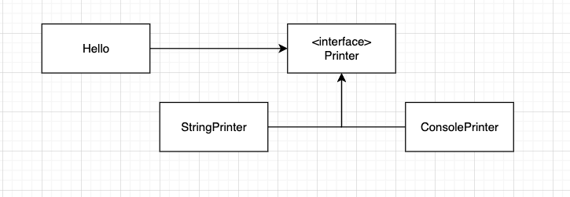
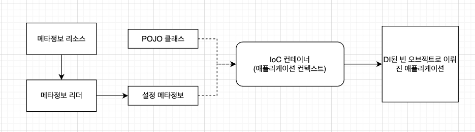

# 토비의  스프링 vol.2


# #1 IoC 컨테이너와 DI


## IoC 컨테이너: 빈 팩토리와 애플리케이션 컨텍스트

- 스프링에서는 오브젝트의 생성과 관계설정, 사용, 제거 등의 작업을 애플리케이션 코드 대신 독립된 컨테이너가 담당하는데 이 컨테이너를 IoC 컨테이너라고 한다.
- 이 IoC 컨테이너는 애플리케이션 컨텍스트라고도 불리고 애플리케이션 컨텍스는 IoC와 DI를 위한 빈 팩토리 또는 그 이상의 기능을 가졌다고 보면 된다.
- 스프링의 빈 팩토리와 애플리케이션 컨텍스트는 각각 기능을 대표하는 `BeanFactory`, `ApplicationContext` 로 정의되어 있다.


`BeanFactory`

```java
public interface BeanFactory {
  
  
	Object getBean(String name) throws BeansException;
  
	<T> T getBean(String name, Class<T> requiredType) throws BeansException;
  
	Object getBean(String name, Object... args) throws BeansException;
  
	<T> T getBean(Class<T> requiredType) throws BeansException;
  
	<T> T getBean(Class<T> requiredType, Object... args) throws BeansException;
  
	<T> ObjectProvider<T> getBeanProvider(Class<T> requiredType);
  
	<T> ObjectProvider<T> getBeanProvider(ResolvableType requiredType);
  
	boolean containsBean(String name);
  
	boolean isSingleton(String name) throws NoSuchBeanDefinitionException;
  
	boolean isPrototype(String name) throws NoSuchBeanDefinitionException;
  
	boolean isTypeMatch(String name, ResolvableType typeToMatch) throws NoSuchBeanDefinitionException;
  
	boolean isTypeMatch(String name, Class<?> typeToMatch) throws NoSuchBeanDefinitionException;
  
	@Nullable
	Class<?> getType(String name) throws NoSuchBeanDefinitionException;
  
	@Nullable
	Class<?> getType(String name, boolean allowFactoryBeanInit) throws NoSuchBeanDefinitionException;
  
	String[] getAliases(String name);
}
```


`ApplicationContext`

```java
public interface ApplicationContext extends EnvironmentCapable, ListableBeanFactory, HierarchicalBeanFactory,
		MessageSource, ApplicationEventPublisher, ResourcePatternResolver {

	@Nullable
	String getId();

	String getApplicationName();

	String getDisplayName();

	long getStartupDate();

	@Nullable
	ApplicationContext getParent();

	AutowireCapableBeanFactory getAutowireCapableBeanFactory() throws IllegalStateException;

}

```

- `ApplicationContext` 는 `ListableBeanFactory`, `HierarchicalBeanFactory` 를 상속받고 있는데 `ListableBeanFactory` , `HierarchicalBeanFactory` 는 `BeanFactory` 를 확장하는 인터페이스이기 때문에 `ApplicationContext` 는 `BeanFactory` 의 서브인터페이스라고 볼 수 있다.
- 실제로 스프링 IoC 컨테이너는 `ApplicationContext` 를 구현했고 최초 한 개 이상의 애플리케이션 컨텍스트 오브젝트를 갖고 있다.


### IoC 컨테이너를 이용해 애플리케이션 만들기

- 가장 간단하게 IoC 컨테이너를 만드는 방법은 다음 과같이 ApplicationContext 구현 클래스의 인스턴스를 만들면 된다.

```java
StaticApplicationContext ac = new StaticApplicationContext();
```

- 이렇게 만들어진 컨테이너가 본격적인 IoC 컨테이너로서 동작하려면 POJO 클래스와 설정 메타정보가 필요하다.

#### POJO 클래스

- 먼저 애플리케이션의 핵심 코드를 담고 있는 POJO 클래스를 준비해야한다.
- 아래 Hello 클래스와 Printer 인터페이스, 그리고 Printer 인터페이스를 구현한 StringPrinter, ConsolePrinter 를 준비한다.



- Hello 클래스는 Printer 인터페이스를 참조로 두고 있는 약결합상태
- 각자 기능에 충실하게 독립적으로 설계된 POJO 클래스를 만들고, 결합도가 낮은 유연한 관계를 가질 수 있도록 인터페이스를 이용해 연결해주는 것 까지가 IoC 컨테이너가 사용할 POJO를 준비하는 첫 단계


#### 설정 메타정보

- 두 번째 필요한것은 앞에서 만든 POJO 클래스들 중에 애플리케이션에서 사용할 것을 선정하고 이를 IoC 컨테이너가 제어할 수 있도록 적절한 메타정보를 만들어 제공하는 작업
- IoC 컨테이너의 가장 기초적인 역할은 오브젝트를 생성하고 이를 관리하는것. 이런 오브젝트는 빈이라고부른다.
- 스프링의 설정 메타정보는 `BeanDefinition` 인터페이스로 표현되는 순수한 추상 정보

```java
public interface BeanDefinition extends AttributeAccessor, BeanMetadataElement {

	// Modifiable attributes
	void setParentName(@Nullable String parentName);

	@Nullable
	String getParentName();

	void setBeanClassName(@Nullable String beanClassName);
  
	@Nullable
	String getBeanClassName();

	void setScope(@Nullable String scope);

	@Nullable
	String getScope();

	void setLazyInit(boolean lazyInit);

	boolean isLazyInit();

	void setDependsOn(@Nullable String... dependsOn);

	@Nullable
	String[] getDependsOn();

	void setAutowireCandidate(boolean autowireCandidate);

	boolean isAutowireCandidate();

	void setPrimary(boolean primary);

	boolean isPrimary();

	void setFactoryBeanName(@Nullable String factoryBeanName);

	@Nullable
	String getFactoryBeanName();

	void setFactoryMethodName(@Nullable String factoryMethodName);

	@Nullable
	String getFactoryMethodName();

	ConstructorArgumentValues getConstructorArgumentValues();

	default boolean hasConstructorArgumentValues() {
		return !getConstructorArgumentValues().isEmpty();
	}
  
	MutablePropertyValues getPropertyValues();

	default boolean hasPropertyValues() {
		return !getPropertyValues().isEmpty();
	}

	void setInitMethodName(@Nullable String initMethodName);

	@Nullable
	String getInitMethodName();

	void setDestroyMethodName(@Nullable String destroyMethodName);

	@Nullable
	String getDestroyMethodName();

	void setRole(int role);

	int getRole();

	void setDescription(@Nullable String description);

	@Nullable
	String getDescription();

	// Read-only attributes
	ResolvableType getResolvableType();

	boolean isSingleton();

	boolean isPrototype();

	boolean isAbstract();

	@Nullable
	String getResourceDescription();

	@Nullable
	BeanDefinition getOriginatingBeanDefinition();

}

```

- 스프링의 메타정보는 특정한 파일 포멧, 형식과 상관없이 `BeanDefinition`으로 정의되는 스프링의 설정 메타정보의 내용을 표현한 것이 있다면 어느것이든 사용이 가능하다.
- 원본의 포맷과 구조, 자료의 특성에 맞게 읽어와 `BeanDefinition` 오브젝트로 변환해주는 `BeanDefinitionReader`가 있으면 된다.
- `BeanDefinition` 인터페이스로 정의되는 IoC 컨테이너가 사용하는 빈 메타정보
  - 빈 아이디, 이름, 별칭: 빈 오브젝트를 구분할 수 있는 식별자
  - 클래스 또는 클래스 이름: 빈으로 만들 POJO 클래스 또는 서비스 클래스 정보
  - 스코프: 싱글톤, 프로토타입과 같은 빈의 생성 방식과 존재 범위
  - 프로퍼티 값 또는 참조: DI에 사용할 프로퍼티 이름과 값 또는 참조하는 빈의 이름
  - 생성자 파라미터 값 또는 참조: DI에 사용할 생성자 파라미터 이름과 값 또는 참조할 빈의 이름
  - 지연된 로딩 여부, 우선 빈 여부, 자동와이어링 여부, 부모 빈 정보, 빈 팩토리 이름 등등...
- 스프링 IoC 컨테이너는 각 빈에 대한 정보를 담은 설정 메타정보를 읽어들인 뒤에 이를 참고해서 빈 오브젝트를 생성하고 프로퍼티나 생성자를 통해 의존 오브젝트를 주입해주는 DI 작업을 수행한다.
- 이런 작업으로 만들어진 빈들은 DI로 연결되고 하나의 애플리케이션을 구성한다.



- 스프링 애플리케이션이란 POJO 클래스와 설정 메타정보를 이용해 IoC 컨테이너가 만들어주는 오브젝트의 조합이라고 할 수 있다.

`StaticApplicationContext.registerSingleton() 메서드 사용하기`

```java

StaticApplicationContext ac = new StaticApplicationContext();
ac.registerSingleton("hello1", Hello.class);

```

- 사용한 `registerSingleton()` 은 아래와 같이 `GenericBeanDefinition` 을 내부적으로 만드는 모습을 확인할 수 있다.

`StaticApplicationContext.registerSingleton() 메서드`

```java
	public void registerSingleton(String name, Class<?> clazz) throws BeansException {
		GenericBeanDefinition bd = new GenericBeanDefinition();
		bd.setBeanClass(clazz);
		getDefaultListableBeanFactory().registerBeanDefinition(name, bd);
	}
```

- 직접 `BeanDefinition` 타입의 설정 메타정보를 만들어서 IoC 컨테이너에 등록할 수 있다.

`RootDefinition 사용하기`

```java
//가장 기본적인 BeanDefinition 구현체인 RootBeanDefinition 생성
BeanDefinition helloDef = new RootBeanDefinition(Hello.class);

//addPropertyValue를 통해 필드 셋팅
helloDef.getPropertyValues().addPropertyValue("name", "Spring");

//빈 등록
ac.registerSingleton("hello2", helloDef);

```

- 아래와 같이 객체간에 의존관계도 설정할 수 있다.

```java

StaticApplicationContext ac = new StaticApplicationContext();
ac.registerBeanDefinition("printer", new RootBeanDefinition(SpringPrinter.class));

BeanDefinition helloDef = new RootBeanDefinition(Hello.class);
helloDef.getPropertyValues().addPropertyValue("name", "Spring");

//아이디가 printer인 빈에 대한 레퍼런스를 프로퍼티로 등록
helloDef.getPropertyValues().addPropertyValue("printer", new RuntimeBeanReference("printer"));

ac.registerSingleton("hello", helloDef);


```

- `RuntimeBeanReference` 는 런타임에 해결될 팩토리의 다른 빈에 대한 참조일때 사용하는  placeholder 클래스이다.
- 이런식으로 애플리케이션을 구성하는 빈 오브젝트를 생성하는 것이 IoC 컨테이너의 핵심 기능
- 기본적으로 싱글톤 빈은 애플리케이션 컨텍스트의 초기화 작업중에 모두 만들어진다.


### IoC 컨테이너의 종류와 사용 방법

- `ApplicationContext` 인터페이스를 바르게 구현했다면 어떤 클래스든 스프링의 IoC 컨테이너로 사용할 수 있다.
- 개발자가 `ApplicationContext` 구현할 일은 없고 스프링이 제공하는 `ApplicationContext` 구현체를 사용하면 된다.
- `ApplicationContext`는 직접 빈으로 등록할 필요도 없고 자동으로 만들어지는 방법을 사용한다.

#### StaticApplicationContext

- `StaticApplicationContext` 는 코드를 통해 빈 메타정보를 등록하기 위해 사용한다.
- 테스트용도이기 때문에 실전에서 사용하지 말고 테스트 목적으로 코드를 통해 빈을 등록하고 컨테이너가 어떻게 동작하는지 확인하고 싶을 때 사용하면 된다.

#### GenericApplicationContext

- `GenericApplicationContext` 는 가장 일반적인 애플리케이션 컨텍스트의 구현 클래스
- 모든 기능을 갖추고 있고 컨테이너의 주요 기능을 DI를 통해 확장할 수 있도록 설계되었다.
- `GenericApplicationContext` 는 xml 파일과 같은 외부의 리소스에 있는 빈 설정 메타정보를 리더를 통해 읽어들여서 메타정보로 전환해서 사용한다.
- 외부 리소스를 `BeanDefinition` 정보로 변환하는 기능을 가진 오브젝트는 `BeanDefinitionReader` 를 구현해서 만들고 대표적으로 `GroovyBeanDefinitionReader`, `XmlBeanDefinitionReader` 가 있다.

`XmlBeanDefinitionReader 사용해서 컨텍스트에 등록하기`

```java


GenericApplicationContext ac = new GenericApplicationContext();
XmlBeanDefinitionReader reader = new XmlBeanDefinition(ac);
reader.loadBeanDefinitions("xmldir/genericApplicationContext.xml");
  
//모든 메타정보가 등록되었으니 애플리케이션 컨텍스트를 초기화하라는 뜻
ac.refresh();

Hello hello = ac.getBean("Hello", Hello.class);


```

- `refresh()` 는 `AbstractApplicationContext` 에서 정의되어있고 일종의 퍼사드형태로 구현되어있다.

`AbstractApplicationContext.refresh()`

```java


	@Override
	public void refresh() throws BeansException, IllegalStateException {
		synchronized (this.startupShutdownMonitor) {
			StartupStep contextRefresh = this.applicationStartup.start("spring.context.refresh");

			// Prepare this context for refreshing.
			prepareRefresh();

			// Tell the subclass to refresh the internal bean factory.
			ConfigurableListableBeanFactory beanFactory = obtainFreshBeanFactory();

			// Prepare the bean factory for use in this context.
			prepareBeanFactory(beanFactory);

			try {
				// Allows post-processing of the bean factory in context subclasses.
				postProcessBeanFactory(beanFactory);

				StartupStep beanPostProcess = this.applicationStartup.start("spring.context.beans.post-process");
				// Invoke factory processors registered as beans in the context.
				invokeBeanFactoryPostProcessors(beanFactory);

				// Register bean processors that intercept bean creation.
				registerBeanPostProcessors(beanFactory);
				beanPostProcess.end();

				// Initialize message source for this context.
				initMessageSource();

				// Initialize event multicaster for this context.
				initApplicationEventMulticaster();

				// Initialize other special beans in specific context subclasses.
				onRefresh();

				// Check for listener beans and register them.
				registerListeners();

				// Instantiate all remaining (non-lazy-init) singletons.
				finishBeanFactoryInitialization(beanFactory);

				// Last step: publish corresponding event.
				finishRefresh();
			}

			catch (BeansException ex) {
				if (logger.isWarnEnabled()) {
					logger.warn("Exception encountered during context initialization - " +
							"cancelling refresh attempt: " + ex);
				}

				// Destroy already created singletons to avoid dangling resources.
				destroyBeans();

				// Reset 'active' flag.
				cancelRefresh(ex);

				// Propagate exception to caller.
				throw ex;
			}

			finally {
				// Reset common introspection caches in Spring's core, since we
				// might not ever need metadata for singleton beans anymore...
				resetCommonCaches();
				contextRefresh.end();
			}
		}
	}

```

- 빈 설정 리더를 만들기만하면 어떤 형태로도 빈 설정 메타정보를 작성할 수 있다.
- 스프링에서는 대표적으로 xml, 애너테이션, 클래스 세가지 방식으로 빈 설정 메타정보를 작성할 수 있음. 필요하다면 충분히 다른 방법으로 유연하게 확장도 가능하다.
- `GenericApplicationContext` 역시 실제 코드레벨에서 사용할 경우는 거의 없지만 아래와 같이 JUnit Test에서 `ApplicationContext` 를 주입받아서 사용하는 경우와 같이 직접적으로 사용하는 경우도 있다.

```java


@RunWith(SpringJUnit4ClassRunner.class)
//애플리케이션 컨텍스트 생성과 동시에 xml 파일을 읽어오고 초기화까지 수행한다.
@ContextConfiguration(location = "/test-appalicationContext.xml")
public class UserServiceTest {
  @Autowired
  ApplicationContext applicationContext; //GenericApplicationContext 주입
}

```


#### GenericXmlApplicationContext

- `GenericXmlApplicationContext` 는 `XmlBeanDefinitionReader` 를 내장하고 있기 때문에 xml 파일을 읽어들이고 refresh() 를 통해 초기화해주는 역할을 한다.

```java
//애플리케이션 컨텍스트 생성과 동시에 xml 파일을 읽어오고 초기화까지 수행한다.
GenericXmlApplicationContext ac = new GenericXmlApplicationContext("xmlDir/genericApplicationContext.xml");
```


#### WebApplicationContext

- 스프링 애플리케이션에서 가장 많이 사용되는 애플리케이션 컨텍스트

```java
public interface WebApplicationContext extends ApplicationContext {

	String ROOT_WEB_APPLICATION_CONTEXT_ATTRIBUTE = WebApplicationContext.class.getName() + ".ROOT";

	String SCOPE_REQUEST = "request";
  
	String SCOPE_SESSION = "session";

	String SCOPE_APPLICATION = "application";

	String SERVLET_CONTEXT_BEAN_NAME = "servletContext";

	String CONTEXT_PARAMETERS_BEAN_NAME = "contextParameters";

	String CONTEXT_ATTRIBUTES_BEAN_NAME = "contextAttributes";

	@Nullable
	ServletContext getServletContext();

}
```

- 기존 `ApplicationContext` 에서 웹 환경에서 사용할 수 있도록 확장된 인터페이스
- SpringBoot 2.x 대 기준으로 `AnnotationConfigServletWebServerApplicationContext` 가 `ApplicationContext` 구현체로 로드된다.
- `AnnotationConfigServletWebServerApplicationContext ` 는 `ServletWebServerApplicationContext` 를 확장하는 애너테이션 기반 애플리케이션 컨텍스트이고 `@Configuration` 뿐만 아니라 `java.inject`의 `@Component` 클래스 및 JSR-330 호환 클래스도 허용한다.

`ApplicationContextFactory에서AnnotationConfigServletWebServerApplicationContext 생성하는 부분 `

```java
@FunctionalInterface
public interface ApplicationContextFactory {
    ApplicationContextFactory DEFAULT = (webApplicationType) -> {
        try {
            switch(webApplicationType) {
            case SERVLET:
                return new AnnotationConfigServletWebServerApplicationContext();
            case REACTIVE:
                return new AnnotationConfigReactiveWebServerApplicationContext();
            default:
                return new AnnotationConfigApplicationContext();
            }
        } catch (Exception var2) {
            throw new IllegalStateException("Unable create a default ApplicationContext instance, you may need a custom ApplicationContextFactory", var2);
        }
    };
  ...
}
```

- `ServletWebServerApplicationContext` 는 `ApplicationContext` 의 `onRefresh()` 를 구현하는데 여기에서 웹서버를 생성하는 모습을 확인할 수 있음

`ServletWebServerApplicationContext.onRefresh()`

```java

	@Override
	protected void onRefresh() {
		super.onRefresh();
		try {
			createWebServer();
		}
		catch (Throwable ex) {
			throw new ApplicationContextException("Unable to start web server", ex);
		}
	}

	private void createWebServer() {
		WebServer webServer = this.webServer;
		ServletContext servletContext = getServletContext();
		if (webServer == null && servletContext == null) {
			StartupStep createWebServer = this.getApplicationStartup().start("spring.boot.webserver.create");
			ServletWebServerFactory factory = getWebServerFactory();
			createWebServer.tag("factory", factory.getClass().toString());
			this.webServer = factory.getWebServer(getSelfInitializer());
			createWebServer.end();
			getBeanFactory().registerSingleton("webServerGracefulShutdown",
					new WebServerGracefulShutdownLifecycle(this.webServer));
			getBeanFactory().registerSingleton("webServerStartStop",
					new WebServerStartStopLifecycle(this, this.webServer));
		}
		else if (servletContext != null) {
			try {
				getSelfInitializer().onStartup(servletContext);
			}
			catch (ServletException ex) {
				throw new ApplicationContextException("Cannot initialize servlet context", ex);
			}
		}
		initPropertySources();
	}

```

- 독립적인 자바 프로그램으로 만들어진 웹애플리케이션에서는 main()메서드를 호출할 방법이 없었기 때문에 웹 환경에서 main() 메서드 대신 서블릿 컨테이너가 브라우저로 오는 HTTP 요청을 받아서 해당 요청에 매핑되어 있는 서블릿을 실행해주는 방법으로 동작했한다. 서블릿이 일종의 main() 메서드와 같은 역할을 하는 셈

  


- `WebApplicationContext` 는 설정 메타정보를 읽어들여서 초기화한다.
- 서블릿 컨테이너는 클라이언트의 요청을 받아서 서블릿을 동작시키는 일을 맡는다.
- 서블릿은 웹 애플리케이션이 시작될 때 미리 만들어 둔 웹 애플리케이션 컨텍스트에게 빈 오브젝트로 구성된 애플리케이션의 기동 역할을 해줄 빈을 요청해서 받아둔다. 
- 스프링은 웹 환경에서  클라이언트로부터 들어오는 요청마다 적절한 빈을 찾아서 이를 실행해주는 기능을 가진 `DispatcherServlet`이라는 이름의 서블릿을 제공한다. 
- 스프링이 제공해주는 `DispatcherServlet` 을 web.xml에 등록하는 것 만으로도 웹 애플리케이션을 실행하는데 필요한 대부분 준비가 끝난다.
- Spring Boot에서는 web.xml을 더이상 사용하지 않고 `DispatcherServletAutoConfiguration`에서 자동으로 `DispatcherServlet` 을 등록시켜준다.


```java
@AutoConfigureOrder(Ordered.HIGHEST_PRECEDENCE)
@Configuration(proxyBeanMethods = false)
@ConditionalOnWebApplication(type = Type.SERVLET)
@ConditionalOnClass(DispatcherServlet.class)
@AutoConfigureAfter(ServletWebServerFactoryAutoConfiguration.class)
public class DispatcherServletAutoConfiguration {

  
  
  ...
    
	@Configuration(proxyBeanMethods = false)
	@Conditional(DefaultDispatcherServletCondition.class)
	@ConditionalOnClass(ServletRegistration.class)
	@EnableConfigurationProperties(WebMvcProperties.class)
	protected static class DispatcherServletConfiguration {

		@Bean(name = DEFAULT_DISPATCHER_SERVLET_BEAN_NAME)
		public DispatcherServlet dispatcherServlet(WebMvcProperties webMvcProperties) {
			DispatcherServlet dispatcherServlet = new DispatcherServlet();
			dispatcherServlet.setDispatchOptionsRequest(webMvcProperties.isDispatchOptionsRequest());
			dispatcherServlet.setDispatchTraceRequest(webMvcProperties.isDispatchTraceRequest());
			dispatcherServlet.setThrowExceptionIfNoHandlerFound(webMvcProperties.isThrowExceptionIfNoHandlerFound());
			dispatcherServlet.setPublishEvents(webMvcProperties.isPublishRequestHandledEvents());
			dispatcherServlet.setEnableLoggingRequestDetails(webMvcProperties.isLogRequestDetails());
			return dispatcherServlet;
		}

		@Bean
		@ConditionalOnBean(MultipartResolver.class)
		@ConditionalOnMissingBean(name = DispatcherServlet.MULTIPART_RESOLVER_BEAN_NAME)
		public MultipartResolver multipartResolver(MultipartResolver resolver) {
			// Detect if the user has created a MultipartResolver but named it incorrectly
			return resolver;
		}

	}

  ...
  
}

```


### IoC 컨테이너 계층구조

- 일반적인 경우라면 IoC 컨테이너는 애플리케이션마다 한개만 있으면 충분하다.
- 하지만 트리 모양의 계층구조를 만들어야한다면 한 개 이상의  IoC 컨테이너를 만들어야한다.

#### 부모컨텍스트를 이용한 계층구조 효과


- 계층 구조 안의 모든 컨텍스트는 각자 독립적인 설정정보를 이용해 빈 오브젝트를 만들고 관리한다.

- 자신이 관리하는 빈 중에서 필요한 빈을 찾아보고 없으면 부모 컨텍스트에서 검색, 최종적으로 루트 컨텍스트까지 검색하는 방식으로 동작한다.

- 형제 레벨이나 자식 레벨의 컨텍스트는 검사하지 않는것이 특징

- 검색순서는 자신부터 시작해서 순서대로 올라가기때문에 현재 컨텍스트와 부모 컨텍스트에 동일한 빈이 정의되어있어도 현재 컨텍스트에서 필요한 빈을 찾았다면 부모 컨텍스트에서 정의된 빈은 무시된다.

- 이런식으로 기존 설정을 수정하지 않고 사용하지만 일부 빈 구성을 바꾸고 싶은 경우, 애플리케이션 컨텍스트의 계층구조를 만드는 방법이 편리한 방법. 추가로 여러 애플리케이션 컨텍스트가 공유하는 설정을 만들기 위해서 계층구조를 사용한다.

- 이런 컨텍스트 계층구조를 사용한다면 반드시 컨텍스트 계층 구조에 대해서 자세하게 알아야한다. 컨텍스트 계층구조의 특성이나 설정을 완벽하게 이해하지 못한 채로 사용하면 뜻하지 않은 에러를 만나거나 원하는 대로 동작하지 않는 문제가 발생할 수 있다.

  

#### 컨텍스트 계층구조 테스트

`parentContext.xml`

```xml

<bean id="printer" class="springbook.leaningtest.spring.ioc.bean.StringPrinter"/>

<bean id="hello" 
class="springbook.leaningtest.spring.ioc.bean.Hello">
	<property name="name" value="parent"/>
	<property name="printer" value="printer"/>
</bean>
```

`childContext.xml`

```xml
<bean id="hello" 
class="springbook.leaningtest.spring.ioc.bean.Hello">
	<property name="name" value="child"/>
	<property name="printer" value="printer"/>
</bean>
```

- 자식 컨텍스트에는 `printer` 라는 id를 갖는 빈이 없기 때문에 부모 컨텍스트에서 검색해서 사용한다.


`계층구조 컨텍스트`

```java

ApplicationContext parent = GenericApplicationContext("parentContexst.xml");

ApplicationContext child = GenericApplicationContext(parent);

XmlBeanDefinitionReader reader = new XmlBeanDefinitionReader(child);
reader.loadBeanDefinitions("childContext.xml");
child.refresh();


//printer 빈은 부모 컨텍스트에서 가져온다.
Printer printer = child.getBean("printer", Printer.class);

//hello 빈은 자식 컨텍스트에서 가져온다.
Hello hello = child.getBean("hello", Hello.class)

```

- 이런 계층구조 컨텍스트의 특징으로 같은 타입의 빈 정의를 허용한다고 하더라도 가능하다면 중복된 빈이 정의되는것을 피해야한다. 이러한 복잡한 계층구조와 혼란스러운 빈 정의는 발견하기 매우 힘든 버그를 만들어낼 가능성이 높다.


### 웹 애플리케이션의 IoC 컨테이너 구성

- 스프링은 프론트 컨트롤러 패턴을 사용한다.
- 프론트 컨트롤러 패턴이란 대표 서블릿이 중앙집중식으로 모든 요청을 다 받아서 처리하는 방식을 말한다.
- 웹 애플리케이션 안에서 동작하는 IoC 컨테이너는 두가지 방식으로 만들어진다.
  - 스프링 애플리케이션의 요청을 처리하는 서블릿 안에서 생성
  - 웹 애플리케이션 레벨에서 생성
- 스프링 웹 애플리케이션에는 두 개의 컨테이너가 만들어진다. <= 이부분 이해가 안됨

#### 웹 애플리케이션의 컨텍스트 계층구조

- 웹 애플리케이션 레벨에서 등록되는 컨테이너는 보통 루트 웹 애플리케이션 컨텍스트라고 한다.
- 이 컨텍스트는 전체 계층구조에서 가장 최상단에 위치한다.
- 스프링 애플리케이션에는 하나 이상의 프론트 컨트롤러 역할을 하는 서블릿이 등록될 수 있고 서블릿에는 각각 독립적으로 애플리케이션 컨텍스트가 만들어진다.
- 루트 애플리케이션 컨텍스트에 공통적인 빈들을 설정해둔다면 서블릿별로 중복돼서 생성되는걸 방지할 수 있다.


- 위 그림은 이론상으로는 가능하나 실제로 N개의 프론트 컨트롤러를 등록할 이유가 없기 때문에 일반적인 경우라면 1:1로 매칭한다.
- 그럼에도 컨텍스트를 계층구조로 분리하는 이유는 웹 기술에 의존적인 부분과 그렇지 않은 부분을 구분하기 위해서 나눈다.
- 스프링 서블릿을 사용하는 스프링의 웹 기술 외의 웹 기술을 고려하고 있다면 계층형태로 컨텍스트를 구분해두는것이 바람직하다.


#### 웹 애플리케이션의 컨텍스트 구성 방법

`서블릿 컨텍스트와 루트 애플리케이션 컨텍스트 계층 구조`

- 웹 관련 빈들은 서블릿의 컨텍스트에 두고 나머지는 루트 애플리케이션 컨텍스트에 등록하는 방법

`루트 애플리케이션 컨텍스트 단일구조`

- 스프링 웹 기술을 사용하지 않고 서드파티 웹 프레임워크나 서비스 엔진만을 사용해서 프레젠테이션계층을 만든다면 스프링 서블릿을 둘 이유가 없다.
- 루트 애플리케이션 컨텍스트만 등록하는 방법

`서블릿 컨텍스트 단일구조`

- 스프링 웹 기술을 사요하면서 스프링 외의 프레임워크나 서비스엔진에서 스프링의 빈을 이용할 생각이 아니라면 루트 애플리케이션 컨텍스트를 생략할 수 있다.
- 서블릿 안에 만들어지는 애플리케이션 컨텍스트가 스스로 루트 컨텍스트가 된다.
- 스프링 부트에서는 이 방법을 사용하는 것 같다.

`ServletWebServerApplicationContext.prepareWebApplicationContext() 메서드`

```java
protected void prepareWebApplicationContext(ServletContext servletContext) {
   Object rootContext = servletContext.getAttribute(WebApplicationContext.ROOT_WEB_APPLICATION_CONTEXT_ATTRIBUTE);
   if (rootContext != null) {
      if (rootContext == this) {
         throw new IllegalStateException(
               "Cannot initialize context because there is already a root application context present - "
                     + "check whether you have multiple ServletContextInitializers!");
      }
      return;
   }
   servletContext.log("Initializing Spring embedded WebApplicationContext");
   try {
      servletContext.setAttribute(WebApplicationContext.ROOT_WEB_APPLICATION_CONTEXT_ATTRIBUTE, this);
      if (logger.isDebugEnabled()) {
         logger.debug("Published root WebApplicationContext as ServletContext attribute with name ["
               + WebApplicationContext.ROOT_WEB_APPLICATION_CONTEXT_ATTRIBUTE + "]");
      }
      setServletContext(servletContext);
      if (logger.isInfoEnabled()) {
         long elapsedTime = System.currentTimeMillis() - getStartupDate();
         logger.info("Root WebApplicationContext: initialization completed in " + elapsedTime + " ms");
      }
   }
   catch (RuntimeException | Error ex) {
      logger.error("Context initialization failed", ex);
      servletContext.setAttribute(WebApplicationContext.ROOT_WEB_APPLICATION_CONTEXT_ATTRIBUTE, ex);
      throw ex;
   }
}
```


#### 루트 애플리케이션 컨텍스트 등록

- 루트 웹 애플리케이션 컨텍스트를 등록하는 가장 간단한 방법은 서블릿의 이벤트 리스너를 이용하는. 것
- `ServiceContextListener`를 구현한 리스너는 웹 애플리케이션 전체에 적용 가능한 DB 연결 기능이나 로깅 같은 서비스를 만드는데 유용하게 쓰인다.
- 아래와 같이 ContextLoaderListener 를 사용해서 웹 애플리케이션이 시작될때 자동으로 루터 애플리케이션 컨텍스트를 만들어주고 초기화시킬 수 있다. 

```xml
<listener>
  <listener-class>
  	org.springframework.web.context.ContextLoaderListener
  </listener-class>
</listener>
```

- 아무런 설정도 하지 않으면 아래 설정이 기본 설정이 된다.
  - 애플리케이션 컨텍스트 클래스 : `XmlWebApplicationContext`
  - XML 설정파일 위치: `/WEB-INF/applicationContext.xml`
- `contextConfigLocation`으로 설정해서 직접 위치를 지정할 수 있다

```xml
<context-param>
	<param-name>contextConfigLocation</param-name>
	<param-value>
    /WEB-INF/daoContext.xml
    /WEB-INF/applicationContext.xml
	</param-value>
</context-param>
```

- 애너테이션 기반으로 설정하기

```xml
<context-param>
	<param-name>contextClass</param-name>
	<param-value>
		org.springframework.web.context.support.AnnotationConfigWebApplicationContext
	</param-value>
</context-param>
```

- `AnnotationConfigWebApplicationContext` 을 사용할 경우에는 반드시 `contextConfigLocation` 파라미터를 선언해줘야한다. 이때는 xml 파일의 위치가 아니라 설정 메타정보를 담고 있는 클래스 또는 패키지를 지정할 수 있다.

#### 서블릿 애플리케이션 컨텍스트 등록

- 서블릿의 이름을 다르게 지정해준다면 `DispatcherServlet` 을 여러개 등록할 수 있다.
- 각 `DispatcherServlet` 은 서블릿이 초기화 될 때 자신만의 컨텍스트를 생성하고 초기화한다. 동시에 웹 애플리케이션 레벨에 등록된 루트 애플리케이션 컨텍스트를 찾아서 이를 자신의 부모 컨텍스트로 사용한다.

```xml
<servlet>
	<servlet-name>spring</servlet-name>
	<servlet-class>org.springframework.web.servlet.DispatcherServlet</servlet-class>
  <load-on-startup>1</load-on-startup>
</serlvet>
```

`servlet-name`

- `DispatcherServlet` 에 의해 만들어지는 애플리케이션 컨텍스트는 모두 독립적인 네임스페이스를 갖는데 이때 `$servlet-name` + `-servlet` -> `spring-servlet`  이라는 이름으로 생성한다. 
- 이 네임스페이스는 컨텍스트 파일 위치를 나타내기 때문에 중요하다. 위와 같이 설정했다면 디폴트 설정이 `WEB-INF/spring-servlet.xml` 이 된다.

`load-on-startup`

- 서블릿 컨테이너가 등록된 서블릿을 언제 만들고 초기화할지 순서를 정하는 정수값


## IoC/DI를 위한 빈 설정 메타정보 작성

- IoC 컨테이너의 가장 기본적인 역할은 코드를 대신해서 애플리케이션을 구성하는 오브젝트를 생성하고 관리하는 것
- 컨테이너는 빈 설정 메타정보를 통해 빈의 클래스와 이름을 제공받고 파일이나 애너테이션같은 리소스로부터 전용 리더를 통해 `BeanDefinition` 타입의 오브젝트로 변환된다.
- 적절한 리더나 `BeanDefinition` 생성기를 사용할 수만 있다면 빈 설정 메타정보를 담은 소스는 어떤 식으로 만들어도 상관 없다.


- Spring boot 2.x 기준으로 `@ComponetScan` 으로 애너테이션을 scan하면 결론적으로 `ScannedGenericBeanDefinition` 으로 생성해서 메타정보를 활용하는 모습을 확인할 수 있다.

`ClassPathScanningCandidateComponentProvider.scanCandidateComponents() 메서드`

```java

	private Set<BeanDefinition> scanCandidateComponents(String basePackage) {
		Set<BeanDefinition> candidates = new LinkedHashSet<>();
		try {
			String packageSearchPath = ResourcePatternResolver.CLASSPATH_ALL_URL_PREFIX +
					resolveBasePackage(basePackage) + '/' + this.resourcePattern;
			Resource[] resources = getResourcePatternResolver().getResources(packageSearchPath);
			boolean traceEnabled = logger.isTraceEnabled();
			boolean debugEnabled = logger.isDebugEnabled();
			for (Resource resource : resources) {
				if (traceEnabled) {
					logger.trace("Scanning " + resource);
				}
				if (resource.isReadable()) {
					try {
						MetadataReader metadataReader = getMetadataReaderFactory().getMetadataReader(resource);
						if (isCandidateComponent(metadataReader)) {
							ScannedGenericBeanDefinition sbd = new ScannedGenericBeanDefinition(metadataReader); // <- 요기
							sbd.setSource(resource);
							if (isCandidateComponent(sbd)) {
								if (debugEnabled) {
									logger.debug("Identified candidate component class: " + resource);
								}
								candidates.add(sbd);
							}
							else {
								if (debugEnabled) {
									logger.debug("Ignored because not a concrete top-level class: " + resource);
								}
							}
						}
						else {
							if (traceEnabled) {
								logger.trace("Ignored because not matching any filter: " + resource);
							}
						}
					}
					catch (Throwable ex) {
						throw new BeanDefinitionStoreException(
								"Failed to read candidate component class: " + resource, ex);
					}
				}
				else {
					if (traceEnabled) {
						logger.trace("Ignored because not readable: " + resource);
					}
				}
			}
		}
		catch (IOException ex) {
			throw new BeanDefinitionStoreException("I/O failure during classpath scanning", ex);
		}
		return candidates;
	}
```


### 빈 설정 메타정보

- `BeanDefinition`에는 IoC 컨테이너가 빈을 만들 때 필요한 핵심 정보가 담겨 있다.
- 설정 메타정보가 같지만 이름이 다른 여러 개의 빈 오브젝트를 만들 수 있기 때문에 `BeanDefinition` 은 여러 개의 빈을 만드는 데 재사용될 수 있다.

#### 빈 설정 메타정보 항목

| 이름                       | 내용                                                         | 디폴트 값      |
| -------------------------- | ------------------------------------------------------------ | -------------- |
| beanClassName              | 빈 오브젝트의 클래스 이름. 빈 오브젝트는 이 클래스의 인스턴스가 된다. | 없음. 필수항목 |
| parentName                 | 빈 메타정보를 상속받을 부모 BeanDefinition의 이름. 빈의 메타정보는 계층구조로 상속할 수 있다. | 없음           |
| factoryBeanName            | 팩토리 역할을 하는 빈을 이용해 빈 오브젝트를 생성하는 경우에 팩토리 빈의 이름을 지정한다. | 없음           |
| factoryMethodName          | 다른 빈 또는 클래스의 메서드를 통해 빈 오브젝트를 생성하는 경우 그 메서드 이름을 지정한다. | 없음           |
| scope                      | 빈 오베즉트의 생명주기를 결정하는 스코프를 지정한다. 크게 싱글톤과 프로토타입 스코프로 구분할 수 있다. | 싱글톤         |
| lazyInit                   | 빈 오브젝트의 생성을 최대한 지연할 것인지를 지정한다. 이 값이 true이면 컨테이너는 빈 오브젝트의 생성을 꼭 필요한 시점까지 미룬다. | false          |
| dependsOn                  | 먼저 만들어져야 하는 빈을 지정할 수 있다. 빈 오브젝트의 생성 순서가 보장돼야 하는 경우 이용한다. 하나 이상의 빈 이름을 지정할 수 있다. | 없음           |
| autowireCandidate          | 명시적인 설정이 없어도 미리 정해진 규칙을 가지고 자동으로 DI 후보를 결정하는 자동와이어링의 대상으로 포함시킬지의 여부 | true           |
| primary                    | 자동와이어링 작업 중에 DI 대상 후보가 여러 개가 발생하는 경우가 있다. 이때 최종 선택의 우선권을 부여할지 여부, primary가 지정된 빈이 없이 여러 개의 후보가 존재하면 자동와이어링 예외가 발생한다. | false          |
| abstract                   | 메타정보 상속에만 사용할 추상 빈으로 만들지의 여부, 추상 빈이 되면 그 자체는 오브젝트가 생성되지 않고 다른 빈의 부모 빈으로만 사용된다. | false          |
| autowireMode               | 오토와이어링 전략. 이름, 타입, 생성자, 자동인식 등의 방법이 있다. | 없음           |
| dependencyCheck            | 프로퍼티 값 또는 레퍼런스가 모두 설정되어 있는지를 검증하는 작업의 종류 | 체크하지 않음  |
| initMethod                 | 빈이 생성되고 DI를 마친 뒤에 실행할 초기화 메서드의 이름     | 없음           |
| destroyMethod              | 빈의 생명주기가 다 돼서 제거하기 전에 호출할 메서드의 이름   | 없음           |
| propertyValues             | 프로퍼티 이름과 설정 값 또는 레퍼런스. 수정자 메서드를 통한 DI 작업에서 사용한다. | 없음           |
| constructorArgumentsValues | 생성자의 이름과 설정 값 또는 레퍼런스. 생성자를 통한 DI 작업에서 사용한다. | 없음           |
| annotationMetadata         | 빈 클래스에 담긴 애너테이션과 그 애트리뷰트 값. 애너테이션을 이용하는 설정에서 활용한다. | 없음           |

- 빈 설정 메타정보 항목 중에서 가장 중요한 것은 클래스의 이름
- 추상 빈의로 정의하지 않는 한 클래스 정보는 반드시 필요하다.
- 컨테이너 빈의 메타정보가 등록될 때 꼭 필요한 것은 클래스 이름과 함께 빈의 아이디 또는 이름이다.


### 빈 등록 방법

- 빈 등록은 빈 메타정보를 작성해서 컨테이너에게 건네주는 방법으로 등록이 가능하다.

#### XML: \<bean\> 태그

#### XML: 네임스페이스와 전용 태그

#### 자동인식을 이용한 빈 등록: 스테레오타입 애너테이션과 빈 스캐너

#### 자바 코드에 의한 빈 등록: @Configuration 클래스의 @Bean 메서드

#### 자바 코드에 의한 빈 등록: 일반 빈 클래스의 @Bean 메서드

#### 빈 등록 메타정보 구성 전략

### 빈 의존관계 설정 방법

#### XML: \<property\>, \<constructor-arg\>

#### XML: 자동 와이어링

#### XML: 네임스페이스와 전용 태그

#### 애너테이션: @Resource

#### 애너테이션: @Autowired/ @Inject

#### @Autowired와 getBean(), 스프링 테스트

#### 자바 코드에 의한 의존관계 설정

#### 빈 의존관계 설정 전략

### 프로퍼티 값 설정 방법

#### 메타정보 종류에 따른 값 설정 방법

#### PropertyEditor와 ConversionService

#### 컬렉션

#### Null과 빈 문자열

#### 프로퍼티 파일을 이용한 값 설정

### 컨테이너가 자동 등록하는 빈

#### ApplicationContext, BeanFactory

#### ResourceLoader, ApplicationEventPublisher

#### systemProperties, systemEnvironment


## 프로토타입과 스코프

### 프로토타입 스코프

#### 프로토타입 빈의 생명주기와 종속성

#### 프로토타입 빈의 용도

#### DI와 DL

#### 프로토타입 빈의 DL 전략

### 스코프

#### 스코프의 종류

#### 스코프 빈의 사용 방법

#### 커스텀 스코프와 상태를 저장하는 빈 사용하기


## 기타 빈 설정 메타정보

### 빈 이름

#### XML 설정에서의 빈 식별자와 별칭

#### 애너테이션에서의 빈 이름

### 빈 생명주기 메서드

#### 초기화 메서드

#### 제거 메서드

### 팩토리 빈과 팩토리 메서드


## 스프링 3.1의 IoC 컨테이너와 DI

### 빈의 역할과 구분

#### 빈의 종류

#### 컨테이너 인프라 빈과 전용 태그

#### 빈의 역할

### 컨테이너 인프라 빈을 위한 자바 코드 메타정보

#### IoC/DI 설정 방법의 발전

#### 자바 코드를 이용한 컨테이너 인프라 빈 등록

### 웹 애플리케이션의 새로운 IoC 컨테이너 구성

### 런타임 환경 추상화와 프로파일

#### 환경에 따른 빈 설정정보 변경 전략과 한계

#### 런타임 환경과 프로파일

#### 활성 프로파일 지정 방법

#### 프로파일 활용 전략

### 프로퍼티 소스

#### 프로퍼티

#### 스프링에서 사용되는 프로퍼티 종류

#### 프로파일의 통합과 추상화

#### 프로퍼티 소스의 사용

#### @PropertySource와 프로퍼티 파일

#### 웹 환경에서 사용되는 프로퍼티 소스와 프로퍼티 소스 초기화 오브젝트